# Minute Core Quality Visual Cases v0.1

Fecha de referencia: 2026-06-07.

Este dossier visual corrige el cierre incompleto del paquete moderno de `minute`: no basta con notebooks y manifests. Cada imagen esta exportada como PNG estable, incrustada aqui y leida bajo la regla contractual `Que muestra / Responde / No responde / Consecuencia`.

## Alcance

- dataset: `ohlcv_1m_raw_v0_1`
- universo: `<1B>` segun el manifest activo de `minute`
- unidad visual: `ticker-month`
- visuales poblacionales exportados: `7`
- imagenes de caso exportadas: `60`
- total de imagenes incrustadas: `67`
- secciones de casos: `6`
- builder poblacional: `scripts/inspection/minute/export_minute_population_visuals.py`
- builder de imagenes: `scripts/inspection/minute/export_minute_core_quality_casepacks.py`
- manifest poblacional: `population_visual_overview/minute_population_visual_manifest_v0_1.csv`
- manifest visual: `minute_core_quality_visual_case_manifest_v0_1.csv`

## Regla De Lectura

La imagen no decide sola si el dataset completo es bueno o malo.

Cada caso separa:

- calidad core OHLCV;
- deuda `vw`;
- cobertura/gaps;
- y consumo permitido.

Una barra roja en `vw` no invalida automaticamente OHLCV. Un mes con pocos dias activos no demuestra precio roto, pero tampoco permite tratarlo como mes completo limpio.

## Mapa Poblacional Visual

Estas imagenes son obligatorias antes de leer los casos particulares. Situan el universo completo por estado core, estado `vw`, familias de issues, cobertura, deuda schema-only y consumo permitido.

### Core/VW State Overview

Pregunta: How the full <1B> minute universe splits across core quality, vw quality, combined state and allowed consumption.

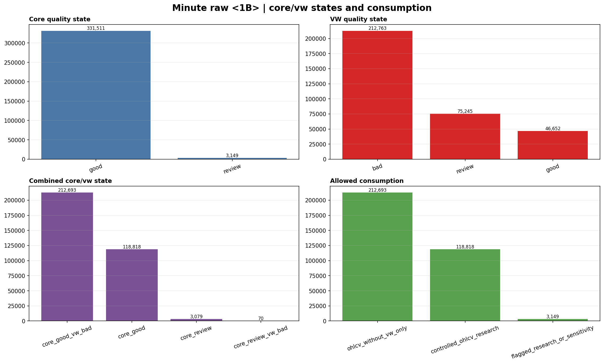

**Que muestra**

- El mapa poblacional separa cuatro lecturas: calidad core, calidad `vw`, estado combinado y consumo permitido. La masa core aparece concentrada en `good` (`331,511`) frente a `review` (`3,149`), mientras `vw` concentra la deuda principal: `bad` (`212,763`), `review` (`75,245`) y solo una fraccion `good` (`46,652`). La consecuencia de consumo dominante es `ohlcv_without_vw_only` (`212,693`), no expulsion completa del OHLCV.

**Responde**

- Responde que el universo `ohlcv_1m_raw` no debe leerse como un bloque malo: el nucleo OHLCV es mayoritariamente aprovechable, pero `vw` no puede promocionarse como feature limpia.

**No responde**

- No responde si un ticker-month concreto es aceptable; solo fija la geometria global que debe gobernar los casos particulares.

**Consecuencia**

- El inspector debe empezar por esta separacion: core OHLCV, `vw` y consumo permitido son ejes distintos y no se pueden mezclar en una sola etiqueta de bueno/malo.

### Core/VW Matrix

Pregunta: Which combinations dominate: core good with vw bad, core good with vw usable, or core review.

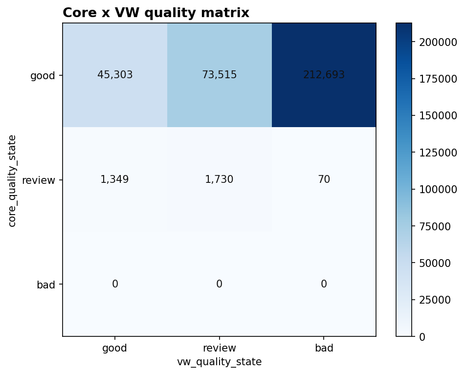

**Que muestra**

- La matriz cruza `core_quality_state` contra `vw_quality_state`. La celda dominante es `core good / vw bad` (`212,693`), seguida de `core good / vw review` (`73,515`) y `core good / vw good` (`45,303`). El bloque `core review` es pequeno y no hay masa `core bad`.

**Responde**

- Responde que el problema central del 1m raw no es una rotura general de open/high/low/close, sino la promocion incorrecta de `vw` en una masa muy grande de ticker-months.

**No responde**

- No responde si `vw` puede reconstruirse o descartarse por reglas downstream; solo muestra que la decision no puede ser silenciosa.

**Consecuencia**

- La politica natural es conservar rutas OHLCV controladas y bloquear consumidores que dependan de `vw` salvo sensibilidad explicita.

### Issue Family Distributions

Pregunta: Which core and vw families explain the full universe before looking at individual cases.

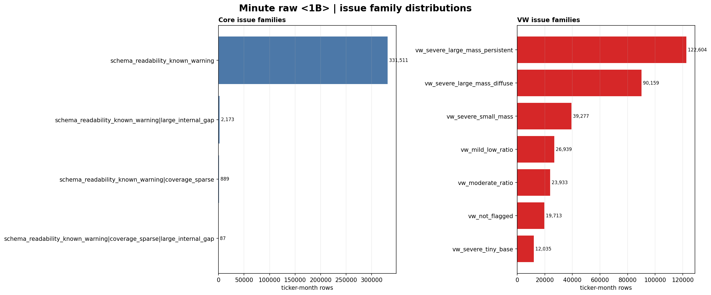

**Que muestra**

- La distribucion de familias muestra que el eje core esta dominado por `schema_readability_known_warning` (`331,511`), con colas pequenas de `large_internal_gap`, `coverage_sparse` y su interseccion. En cambio, `vw` tiene familias masivas: `vw_severe_large_mass_persistent`, `vw_severe_large_mass_diffuse`, `vw_severe_small_mass`, `vw_mild_low_ratio`, `vw_moderate_ratio`, `vw_not_flagged` y `vw_severe_tiny_base`.

**Responde**

- Responde que la auditoria necesita dos taxonomias: una para legibilidad/cobertura core y otra para dano semantico de `vw`.

**No responde**

- No responde si cada familia visualmente se ve igual; para eso existen los casepacks estratificados posteriores.

**Consecuencia**

- Las secciones de casos deben estar estratificadas por familia, porque una muestra aleatoria ocultaria las diferencias entre deuda `vw`, sparse coverage y large gaps.

### Coverage And Temporal Footprint

Pregunta: Whether review states are driven by sparse months, large gaps, or temporal availability.

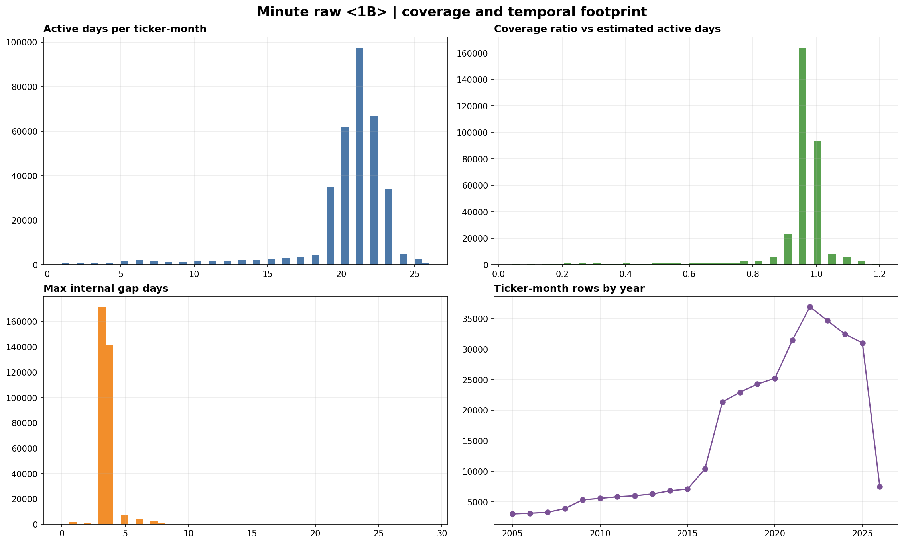

**Que muestra**

- La figura muestra que muchos meses tienen `active_days` altos y `coverage_ratio` cercano a la zona 0.95-1.00, mientras `max_gap_days` concentra la masa alrededor de huecos cortos con cola larga. El footprint temporal crece con fuerza despues de 2016, alcanza maximos alrededor de 2022-2025 y cae en 2026 por ano parcial.

**Responde**

- Responde que las familias `large_gap` y `sparse` son colas de cobertura, no la forma dominante del dataset.

**No responde**

- No responde si la cobertura esperada por ticker deberia existir en todos los anos; eso depende del universo/membership y de reglas de disponibilidad.

**Consecuencia**

- La auditoria debe tratar gaps y sparse months como motivos de `review` separados de la deuda `vw`, y debe recordar que 2026 no es comparable con anos completos.

### Schema-Only Anatomy

Pregunta: Whether the 5.89% non-vw block is heterogeneous or dominated by structural schema/readability issues.

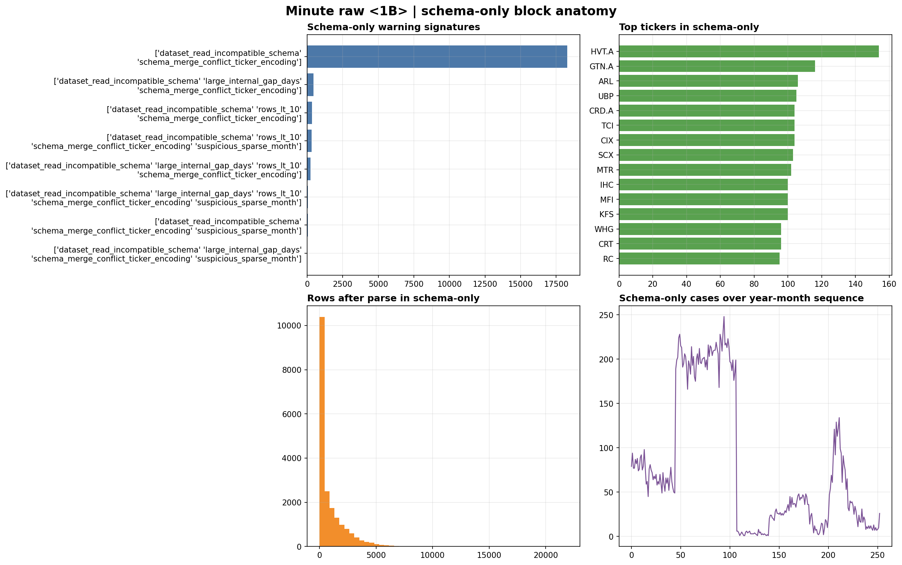

**Que muestra**

- La anatomia schema-only muestra una firma muy concentrada en `dataset_read_incompatible_schema` mas `schema_merge_conflict_ticker_encoding`. Los tickers principales incluyen nombres con sufijos o formas sensibles (`HVT.A`, `GTN.A`, `CRD.A`, entre otros), y la serie temporal muestra regimenes: bloque temprano alto, tramo medio casi nulo y repunte posterior.

**Responde**

- Responde que el bloque no-`vw` no es una coleccion aleatoria de fallos economicos; es principalmente una deuda estructural de lectura/esquema y codificacion de ticker.

**No responde**

- No responde que todos esos meses sean inutilizables para OHLCV; muchos pueden estar pendientes de normalizacion de lectura, no de rechazo economico.

**Consecuencia**

- No se debe mezclar schema-only con dano `vw`: requiere contrato de schema/readability y, si se repara, puede cambiar la frontera de consumo sin tocar el precio.

### VW Not Flagged Visual Recalculation Delta

Pregunta: Whether inherited vw_not_flagged means visually clean in the exported case sample.

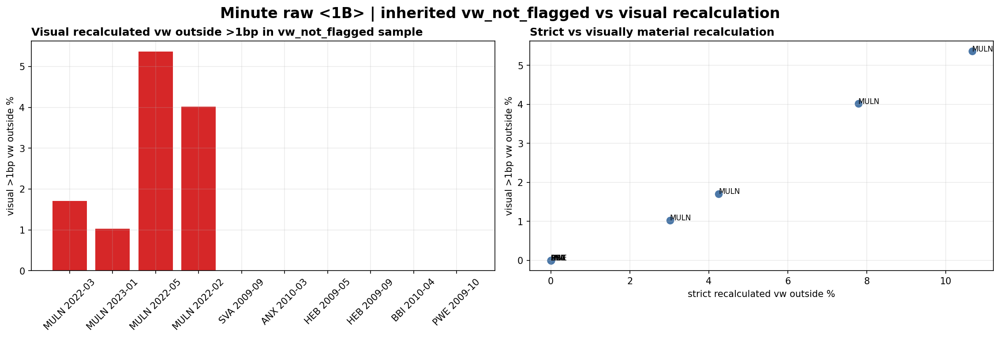

**Que muestra**

- La comparacion entre `vw_not_flagged` heredado y recalculo visual revela que algunos casos etiquetados como no marcados si tienen residuo material. El patron visible esta concentrado en `MULN`, con barras superiores al 1% y hasta mas del 5% de minutos `vw` fuera de rango por mas de 1 bp; otros tickers quedan practicamente en cero.

**Responde**

- Responde que `vw_not_flagged` no equivale automaticamente a `vw` visualmente limpio en cada caso.

**No responde**

- No responde que toda la familia `vw_not_flagged` este mal; la propia figura muestra muchos casos cerca de cero.

**Consecuencia**

- El dossier debe conservar una advertencia explicita: los ejemplos favorables existen, pero la etiqueta heredada necesita tolerancia declarada o recalculo si `vw` se consume.

### Allowed Consumption By Year

Pregunta: How consumption states distribute across the 2005-2026 footprint.

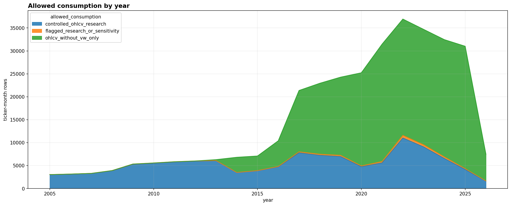

**Que muestra**

- La evolucion anual separa `controlled_ohlcv_research`, `flagged_research_or_sensitivity` y `ohlcv_without_vw_only`. Desde 2017 la masa `ohlcv_without_vw_only` domina claramente, con pico alrededor de 2022, mientras el consumo controlado OHLCV existe durante todo el periodo y 2026 cae por ano incompleto.

**Responde**

- Responde que la decision de consumo no es estatica por ano: la restriccion `sin vw` pesa especialmente en la etapa moderna de mayor cobertura.

**No responde**

- No responde si el universo objetivo de backtest debe ponderar cada ano igual; solo muestra la disponibilidad y restriccion por ticker-month.

**Consecuencia**

- Cualquier entrenamiento/backtest que use 1m debe declarar si consume solo OHLCV o tambien `vw`; si usa `vw`, la mayor parte de los anos modernos queda fuera o entra como sensibilidad marcada.

## Menu

- [Mapa Poblacional Visual](#mapa-poblacional-visual)
- [Core good / vw not flagged](#core-good---vw-not-flagged)
- [Core good / vw mild or moderate](#core-good---vw-mild-or-moderate)
- [Core good / vw bad persistent](#core-good---vw-bad-persistent)
- [Core good / vw bad diffuse](#core-good---vw-bad-diffuse)
- [Core review / large internal gap](#core-review---large-internal-gap)
- [Core review / sparse coverage](#core-review---sparse-coverage)

## Core good / vw not flagged

Esta seccion comprueba el supuesto mas favorable: meses `core_good` donde el closeout heredado no marca `vw`. La inspeccion visual muestra que este bucket no es uniforme: algunos casos estan practicamente limpios, mientras que otros, sobre todo `MULN`, revelan residuo `vw` recalculado que no estaba capturado por la familia heredada.

### 01. MULN 2022-03

ticker: `MULN`  
year: `2022`  
month: `3`  
core_quality_state: `good`  
vw_quality_state: `good`  
combined_quality_state: `core_good`  
allowed_consumption: `controlled_ohlcv_research`  
core_issue_family: `schema_readability_known_warning`  
vw_issue_family: `vw_not_flagged`  
rows_after_parse: `21,943`  
active_days: `25`  
coverage_ratio: `1.087`  
max_gap_days: `3`  
inherited_vw_ratio_pct: `nan`  
visual_gt_1bp_vw_ratio_pct: `1.704`  
file: `D:\ohlcv_1m\ticker=MULN\year=2022\month=03\minute_aggs_MULN_2022_03.parquet`

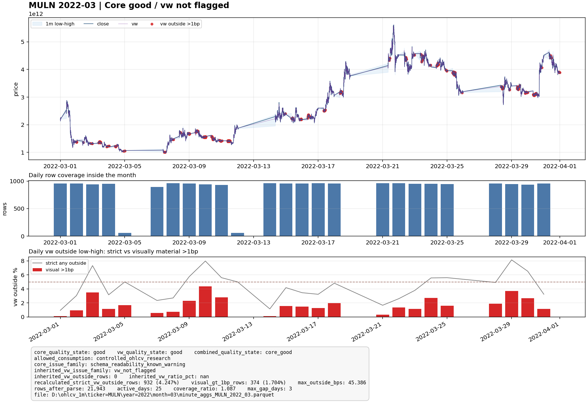

**Que muestra**

- La imagen muestra una serie OHLCV densa y continua, pero tambien barras rojas de `vw` material en varios dias. El punto sensible es que el bucket heredado dice `vw_not_flagged`, mientras el recalculo visual marca `1.70%` de minutos `vw` fuera de rango por mas de 1 bp.

**Responde**

- Responde que el core OHLCV puede seguir siendo interpretable, pero que `vw_not_flagged` no debe leerse como ausencia visual absoluta de residuo `vw` en todos los casos.

**No responde**

- No responde por si sola si el closeout heredado debe reabrirse globalmente; solo prueba que esta familia necesita lectura visual y tolerancia declarada.

**Consecuencia**

- Mantener OHLCV en investigacion controlada, pero no usar este caso como ejemplo de `vw` perfectamente limpio sin mencionar la discrepancia recalculada.

### 02. MULN 2023-01

ticker: `MULN`  
year: `2023`  
month: `1`  
core_quality_state: `good`  
vw_quality_state: `good`  
combined_quality_state: `core_good`  
allowed_consumption: `controlled_ohlcv_research`  
core_issue_family: `schema_readability_known_warning`  
vw_issue_family: `vw_not_flagged`  
rows_after_parse: `18,743`  
active_days: `24`  
coverage_ratio: `1.091`  
max_gap_days: `3`  
inherited_vw_ratio_pct: `nan`  
visual_gt_1bp_vw_ratio_pct: `1.030`  
file: `D:\ohlcv_1m\ticker=MULN\year=2023\month=01\minute_aggs_MULN_2023_01.parquet`

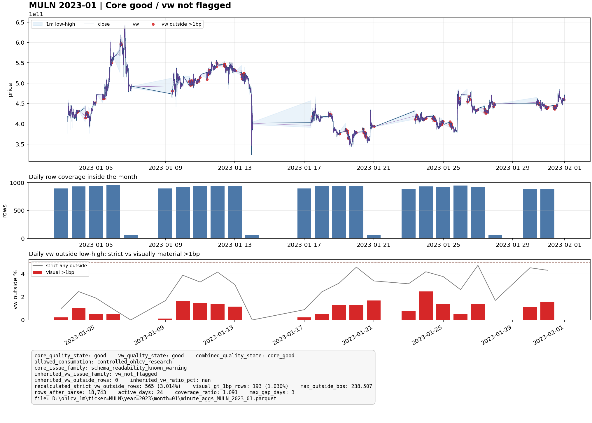

**Que muestra**

- La imagen muestra una serie OHLCV densa y continua, pero tambien barras rojas de `vw` material en varios dias. El punto sensible es que el bucket heredado dice `vw_not_flagged`, mientras el recalculo visual marca `1.03%` de minutos `vw` fuera de rango por mas de 1 bp.

**Responde**

- Responde que el core OHLCV puede seguir siendo interpretable, pero que `vw_not_flagged` no debe leerse como ausencia visual absoluta de residuo `vw` en todos los casos.

**No responde**

- No responde por si sola si el closeout heredado debe reabrirse globalmente; solo prueba que esta familia necesita lectura visual y tolerancia declarada.

**Consecuencia**

- Mantener OHLCV en investigacion controlada, pero no usar este caso como ejemplo de `vw` perfectamente limpio sin mencionar la discrepancia recalculada.

### 03. MULN 2022-05

ticker: `MULN`  
year: `2022`  
month: `5`  
core_quality_state: `good`  
vw_quality_state: `good`  
combined_quality_state: `core_good`  
allowed_consumption: `controlled_ohlcv_research`  
core_issue_family: `schema_readability_known_warning`  
vw_issue_family: `vw_not_flagged`  
rows_after_parse: `17,532`  
active_days: `21`  
coverage_ratio: `0.955`  
max_gap_days: `4`  
inherited_vw_ratio_pct: `nan`  
visual_gt_1bp_vw_ratio_pct: `5.362`  
file: `D:\ohlcv_1m\ticker=MULN\year=2022\month=05\minute_aggs_MULN_2022_05.parquet`

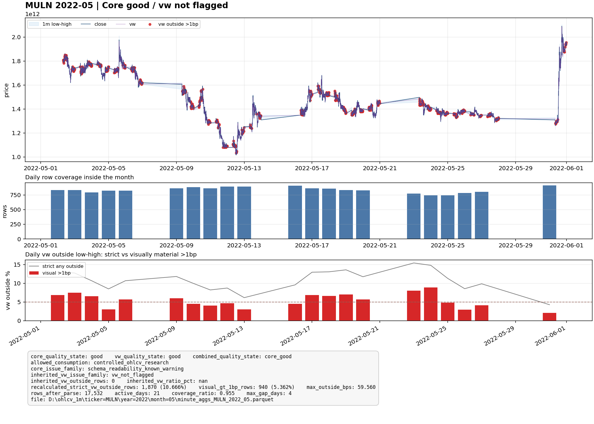

**Que muestra**

- La imagen muestra una serie OHLCV densa y continua, pero tambien barras rojas de `vw` material en varios dias. El punto sensible es que el bucket heredado dice `vw_not_flagged`, mientras el recalculo visual marca `5.36%` de minutos `vw` fuera de rango por mas de 1 bp.

**Responde**

- Responde que el core OHLCV puede seguir siendo interpretable, pero que `vw_not_flagged` no debe leerse como ausencia visual absoluta de residuo `vw` en todos los casos.

**No responde**

- No responde por si sola si el closeout heredado debe reabrirse globalmente; solo prueba que esta familia necesita lectura visual y tolerancia declarada.

**Consecuencia**

- Mantener OHLCV en investigacion controlada, pero no usar este caso como ejemplo de `vw` perfectamente limpio sin mencionar la discrepancia recalculada.

### 04. MULN 2022-02

ticker: `MULN`  
year: `2022`  
month: `2`  
core_quality_state: `good`  
vw_quality_state: `good`  
combined_quality_state: `core_good`  
allowed_consumption: `controlled_ohlcv_research`  
core_issue_family: `schema_readability_known_warning`  
vw_issue_family: `vw_not_flagged`  
rows_after_parse: `10,729`  
active_days: `23`  
coverage_ratio: `1.150`  
max_gap_days: `3`  
inherited_vw_ratio_pct: `nan`  
visual_gt_1bp_vw_ratio_pct: `4.017`  
file: `D:\ohlcv_1m\ticker=MULN\year=2022\month=02\minute_aggs_MULN_2022_02.parquet`

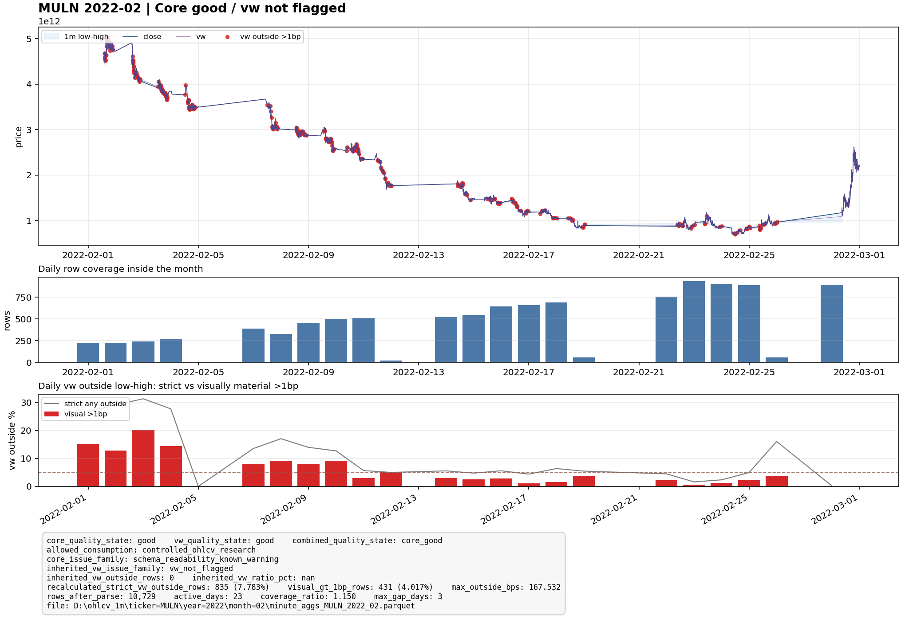

**Que muestra**

- La imagen muestra una serie OHLCV densa y continua, pero tambien barras rojas de `vw` material en varios dias. El punto sensible es que el bucket heredado dice `vw_not_flagged`, mientras el recalculo visual marca `4.02%` de minutos `vw` fuera de rango por mas de 1 bp.

**Responde**

- Responde que el core OHLCV puede seguir siendo interpretable, pero que `vw_not_flagged` no debe leerse como ausencia visual absoluta de residuo `vw` en todos los casos.

**No responde**

- No responde por si sola si el closeout heredado debe reabrirse globalmente; solo prueba que esta familia necesita lectura visual y tolerancia declarada.

**Consecuencia**

- Mantener OHLCV en investigacion controlada, pero no usar este caso como ejemplo de `vw` perfectamente limpio sin mencionar la discrepancia recalculada.

### 05. SVA 2009-09

ticker: `SVA`  
year: `2009`  
month: `9`  
core_quality_state: `good`  
vw_quality_state: `good`  
combined_quality_state: `core_good`  
allowed_consumption: `controlled_ohlcv_research`  
core_issue_family: `schema_readability_known_warning`  
vw_issue_family: `vw_not_flagged`  
rows_after_parse: `10,502`  
active_days: `21`  
coverage_ratio: `0.955`  
max_gap_days: `4`  
inherited_vw_ratio_pct: `nan`  
visual_gt_1bp_vw_ratio_pct: `0.000`  
file: `D:\ohlcv_1m\ticker=SVA\year=2009\month=09\minute_aggs_SVA_2009_09.parquet`

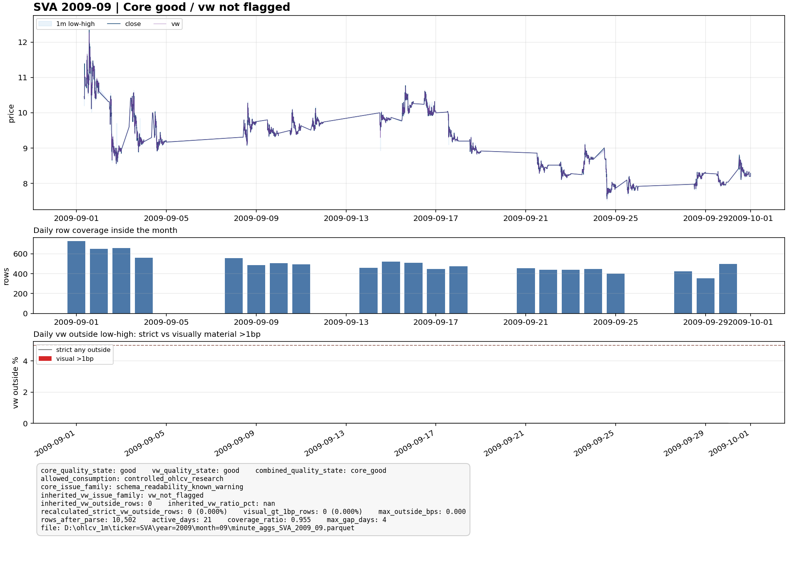

**Que muestra**

- La imagen muestra precio, low-high y `vw` practicamente superpuestos, sin barras rojas materiales. La cobertura diaria aparece regular para el alcance del mes.

**Responde**

- Responde que este caso si representa bien la lectura favorable de `core_good`: OHLCV usable y sin dano `vw` visible material.

**No responde**

- No responde por todos los meses `vw_not_flagged`, porque otros casos de la misma seccion si muestran residuo recalculado.

**Consecuencia**

- Puede usarse como ejemplo positivo de consumo `controlled_ohlcv_research`, preservando la nota de que el ejemplo no promociona toda la familia sin revision.

### 06. ANX 2010-03

ticker: `ANX`  
year: `2010`  
month: `3`  
core_quality_state: `good`  
vw_quality_state: `good`  
combined_quality_state: `core_good`  
allowed_consumption: `controlled_ohlcv_research`  
core_issue_family: `schema_readability_known_warning`  
vw_issue_family: `vw_not_flagged`  
rows_after_parse: `9,183`  
active_days: `25`  
coverage_ratio: `1.087`  
max_gap_days: `3`  
inherited_vw_ratio_pct: `nan`  
visual_gt_1bp_vw_ratio_pct: `0.000`  
file: `D:\ohlcv_1m\ticker=ANX\year=2010\month=03\minute_aggs_ANX_2010_03.parquet`

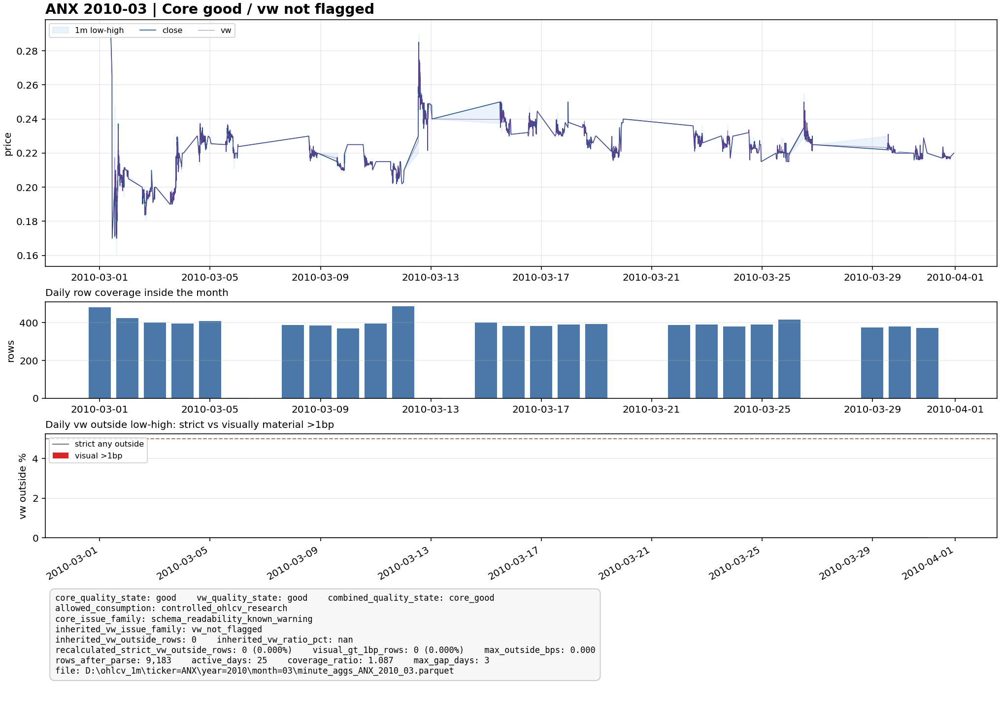

**Que muestra**

- La imagen muestra precio, low-high y `vw` practicamente superpuestos, sin barras rojas materiales. La cobertura diaria aparece regular para el alcance del mes.

**Responde**

- Responde que este caso si representa bien la lectura favorable de `core_good`: OHLCV usable y sin dano `vw` visible material.

**No responde**

- No responde por todos los meses `vw_not_flagged`, porque otros casos de la misma seccion si muestran residuo recalculado.

**Consecuencia**

- Puede usarse como ejemplo positivo de consumo `controlled_ohlcv_research`, preservando la nota de que el ejemplo no promociona toda la familia sin revision.

### 07. HEB 2009-05

ticker: `HEB`  
year: `2009`  
month: `5`  
core_quality_state: `good`  
vw_quality_state: `good`  
combined_quality_state: `core_good`  
allowed_consumption: `controlled_ohlcv_research`  
core_issue_family: `schema_readability_known_warning`  
vw_issue_family: `vw_not_flagged`  
rows_after_parse: `8,837`  
active_days: `20`  
coverage_ratio: `0.952`  
max_gap_days: `4`  
inherited_vw_ratio_pct: `nan`  
visual_gt_1bp_vw_ratio_pct: `0.000`  
file: `D:\ohlcv_1m\ticker=HEB\year=2009\month=05\minute_aggs_HEB_2009_05.parquet`

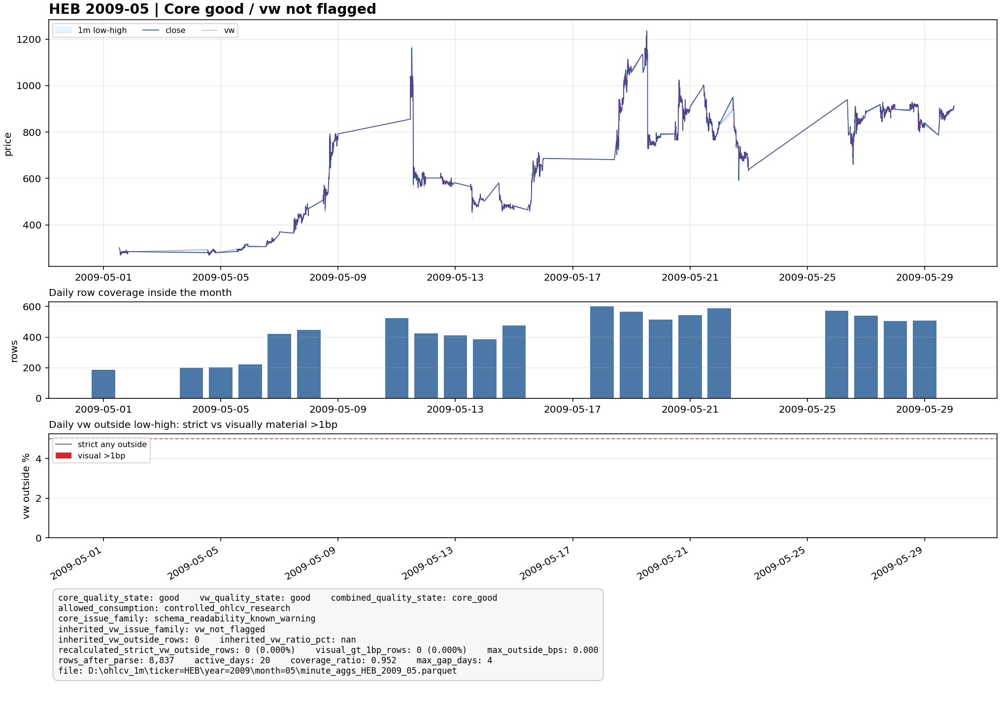

**Que muestra**

- La imagen muestra precio, low-high y `vw` practicamente superpuestos, sin barras rojas materiales. La cobertura diaria aparece regular para el alcance del mes.

**Responde**

- Responde que este caso si representa bien la lectura favorable de `core_good`: OHLCV usable y sin dano `vw` visible material.

**No responde**

- No responde por todos los meses `vw_not_flagged`, porque otros casos de la misma seccion si muestran residuo recalculado.

**Consecuencia**

- Puede usarse como ejemplo positivo de consumo `controlled_ohlcv_research`, preservando la nota de que el ejemplo no promociona toda la familia sin revision.

### 08. HEB 2009-09

ticker: `HEB`  
year: `2009`  
month: `9`  
core_quality_state: `good`  
vw_quality_state: `good`  
combined_quality_state: `core_good`  
allowed_consumption: `controlled_ohlcv_research`  
core_issue_family: `schema_readability_known_warning`  
vw_issue_family: `vw_not_flagged`  
rows_after_parse: `8,807`  
active_days: `21`  
coverage_ratio: `0.955`  
max_gap_days: `4`  
inherited_vw_ratio_pct: `nan`  
visual_gt_1bp_vw_ratio_pct: `0.000`  
file: `D:\ohlcv_1m\ticker=HEB\year=2009\month=09\minute_aggs_HEB_2009_09.parquet`

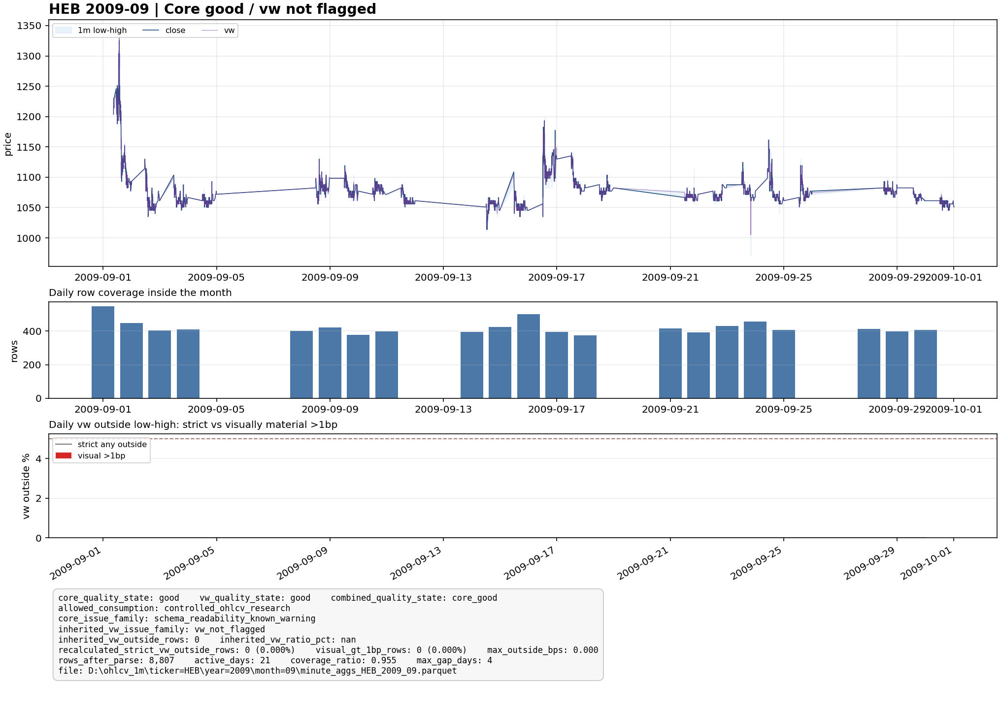

**Que muestra**

- La imagen muestra precio, low-high y `vw` practicamente superpuestos, sin barras rojas materiales. La cobertura diaria aparece regular para el alcance del mes.

**Responde**

- Responde que este caso si representa bien la lectura favorable de `core_good`: OHLCV usable y sin dano `vw` visible material.

**No responde**

- No responde por todos los meses `vw_not_flagged`, porque otros casos de la misma seccion si muestran residuo recalculado.

**Consecuencia**

- Puede usarse como ejemplo positivo de consumo `controlled_ohlcv_research`, preservando la nota de que el ejemplo no promociona toda la familia sin revision.

### 09. BBI 2010-04

ticker: `BBI`  
year: `2010`  
month: `4`  
core_quality_state: `good`  
vw_quality_state: `good`  
combined_quality_state: `core_good`  
allowed_consumption: `controlled_ohlcv_research`  
core_issue_family: `schema_readability_known_warning`  
vw_issue_family: `vw_not_flagged`  
rows_after_parse: `8,804`  
active_days: `21`  
coverage_ratio: `0.955`  
max_gap_days: `4`  
inherited_vw_ratio_pct: `nan`  
visual_gt_1bp_vw_ratio_pct: `0.000`  
file: `D:\ohlcv_1m\ticker=BBI\year=2010\month=04\minute_aggs_BBI_2010_04.parquet`

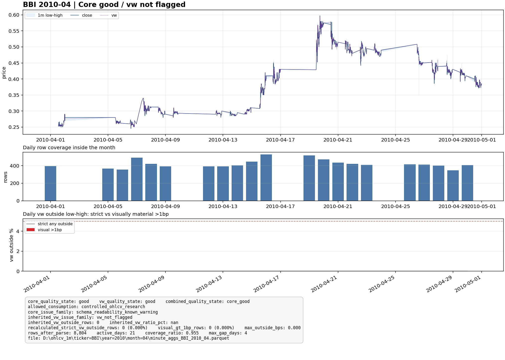

**Que muestra**

- La imagen muestra precio, low-high y `vw` practicamente superpuestos, sin barras rojas materiales. La cobertura diaria aparece regular para el alcance del mes.

**Responde**

- Responde que este caso si representa bien la lectura favorable de `core_good`: OHLCV usable y sin dano `vw` visible material.

**No responde**

- No responde por todos los meses `vw_not_flagged`, porque otros casos de la misma seccion si muestran residuo recalculado.

**Consecuencia**

- Puede usarse como ejemplo positivo de consumo `controlled_ohlcv_research`, preservando la nota de que el ejemplo no promociona toda la familia sin revision.

### 10. PWE 2009-10

ticker: `PWE`  
year: `2009`  
month: `10`  
core_quality_state: `good`  
vw_quality_state: `good`  
combined_quality_state: `core_good`  
allowed_consumption: `controlled_ohlcv_research`  
core_issue_family: `schema_readability_known_warning`  
vw_issue_family: `vw_not_flagged`  
rows_after_parse: `8,771`  
active_days: `22`  
coverage_ratio: `1.000`  
max_gap_days: `3`  
inherited_vw_ratio_pct: `nan`  
visual_gt_1bp_vw_ratio_pct: `0.000`  
file: `D:\ohlcv_1m\ticker=PWE\year=2009\month=10\minute_aggs_PWE_2009_10.parquet`

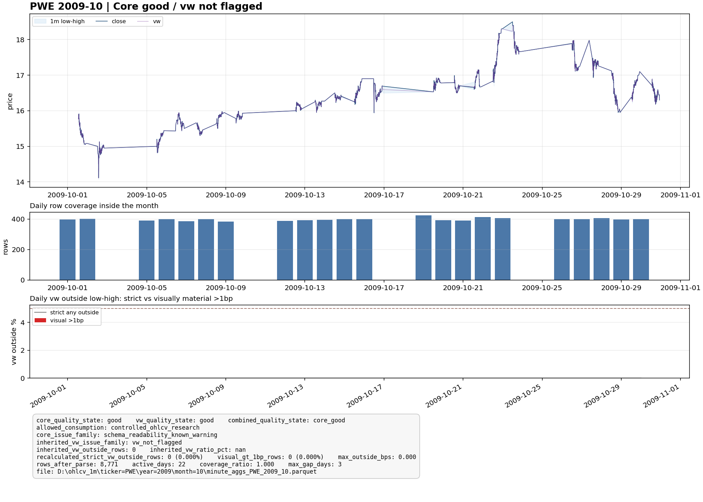

**Que muestra**

- La imagen muestra precio, low-high y `vw` practicamente superpuestos, sin barras rojas materiales. La cobertura diaria aparece regular para el alcance del mes.

**Responde**

- Responde que este caso si representa bien la lectura favorable de `core_good`: OHLCV usable y sin dano `vw` visible material.

**No responde**

- No responde por todos los meses `vw_not_flagged`, porque otros casos de la misma seccion si muestran residuo recalculado.

**Consecuencia**

- Puede usarse como ejemplo positivo de consumo `controlled_ohlcv_research`, preservando la nota de que el ejemplo no promociona toda la familia sin revision.

## Core good / vw mild or moderate

Esta seccion cubre meses `core_good` con `vw` mild/moderate. La lectura visual exige cuidado: varios casos son micro-files o meses muy poco densos, por lo que porcentajes altos pueden salir de denominadores pequenos. La decision no es expulsar OHLCV, sino impedir que `vw` se consuma sin declarar sensibilidad.

### 01. SENEB 2023-12

ticker: `SENEB`  
year: `2023`  
month: `12`  
core_quality_state: `good`  
vw_quality_state: `review`  
combined_quality_state: `core_good`  
allowed_consumption: `controlled_ohlcv_research`  
core_issue_family: `schema_readability_known_warning`  
vw_issue_family: `vw_severe_tiny_base`  
rows_after_parse: `4`  
active_days: `4`  
coverage_ratio: `0.190`  
max_gap_days: `6`  
inherited_vw_ratio_pct: `100.000`  
visual_gt_1bp_vw_ratio_pct: `25.000`  
file: `D:\ohlcv_1m\ticker=SENEB\year=2023\month=12\minute_aggs_SENEB_2023_12.parquet`

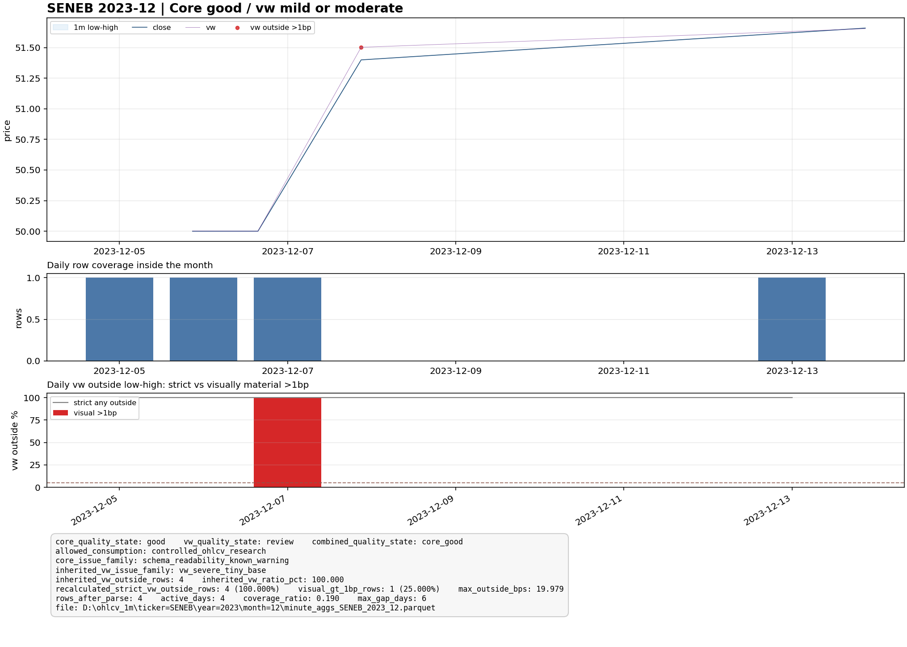

**Que muestra**

- La imagen es muy escasa: pocos puntos y barras diarias con denominadores pequenos. Por eso los porcentajes rojos pueden llegar a 100% sin demostrar por si solos una degradacion mensual robusta.

**Responde**

- Responde que `vw` requiere flag o sensibilidad, pero que el core OHLCV no queda invalidado por esta familia.

**No responde**

- No responde que `vw` sea apto para features; tampoco prueba limpieza mensual si el caso tiene pocos dias o pocas filas.

**Consecuencia**

- Permitir investigacion OHLCV controlada y bloquear consumo silencioso de `vw`.

### 02. MAYS 2023-01

ticker: `MAYS`  
year: `2023`  
month: `1`  
core_quality_state: `good`  
vw_quality_state: `review`  
combined_quality_state: `core_good`  
allowed_consumption: `controlled_ohlcv_research`  
core_issue_family: `schema_readability_known_warning`  
vw_issue_family: `vw_severe_tiny_base`  
rows_after_parse: `3`  
active_days: `3`  
coverage_ratio: `0.136`  
max_gap_days: `8`  
inherited_vw_ratio_pct: `100.000`  
visual_gt_1bp_vw_ratio_pct: `100.000`  
file: `D:\ohlcv_1m\ticker=MAYS\year=2023\month=01\minute_aggs_MAYS_2023_01.parquet`

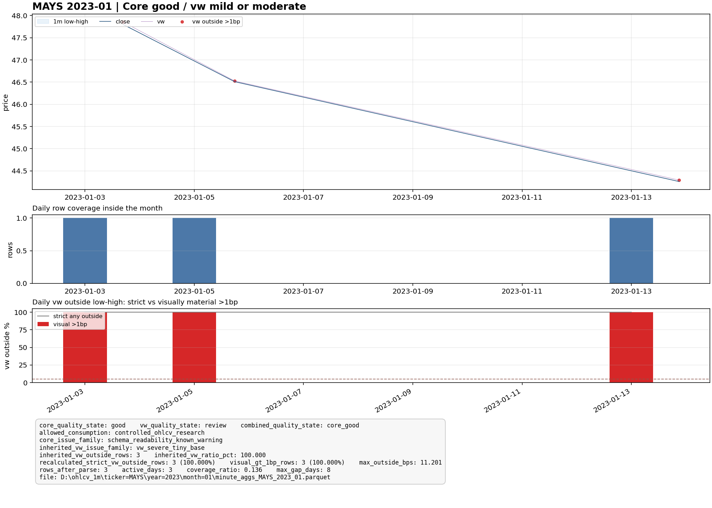

**Que muestra**

- La imagen es muy escasa: pocos puntos y barras diarias con denominadores pequenos. Por eso los porcentajes rojos pueden llegar a 100% sin demostrar por si solos una degradacion mensual robusta.

**Responde**

- Responde que `vw` requiere flag o sensibilidad, pero que el core OHLCV no queda invalidado por esta familia.

**No responde**

- No responde que `vw` sea apto para features; tampoco prueba limpieza mensual si el caso tiene pocos dias o pocas filas.

**Consecuencia**

- Permitir investigacion OHLCV controlada y bloquear consumo silencioso de `vw`.

### 03. MAYS 2025-09

ticker: `MAYS`  
year: `2025`  
month: `9`  
core_quality_state: `good`  
vw_quality_state: `review`  
combined_quality_state: `core_good`  
allowed_consumption: `controlled_ohlcv_research`  
core_issue_family: `schema_readability_known_warning`  
vw_issue_family: `vw_severe_tiny_base`  
rows_after_parse: `3`  
active_days: `3`  
coverage_ratio: `0.136`  
max_gap_days: `4`  
inherited_vw_ratio_pct: `100.000`  
visual_gt_1bp_vw_ratio_pct: `66.667`  
file: `D:\ohlcv_1m\ticker=MAYS\year=2025\month=09\minute_aggs_MAYS_2025_09.parquet`

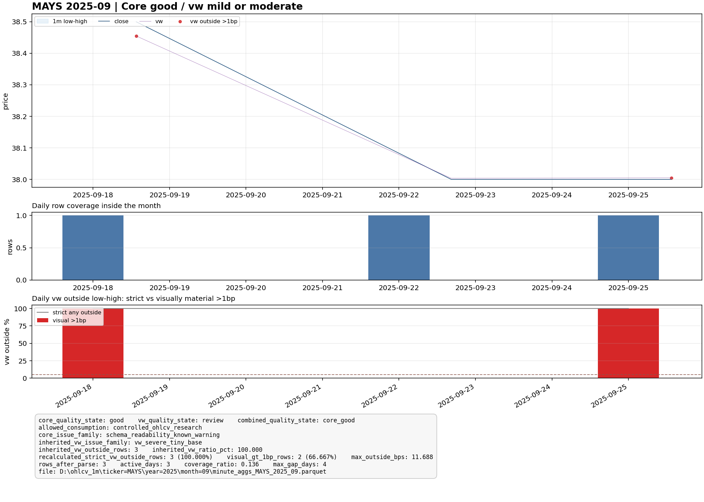

**Que muestra**

- La imagen es muy escasa: pocos puntos y barras diarias con denominadores pequenos. Por eso los porcentajes rojos pueden llegar a 100% sin demostrar por si solos una degradacion mensual robusta.

**Responde**

- Responde que `vw` requiere flag o sensibilidad, pero que el core OHLCV no queda invalidado por esta familia.

**No responde**

- No responde que `vw` sea apto para features; tampoco prueba limpieza mensual si el caso tiene pocos dias o pocas filas.

**Consecuencia**

- Permitir investigacion OHLCV controlada y bloquear consumo silencioso de `vw`.

### 04. SENEB 2026-03

ticker: `SENEB`  
year: `2026`  
month: `3`  
core_quality_state: `good`  
vw_quality_state: `review`  
combined_quality_state: `core_good`  
allowed_consumption: `controlled_ohlcv_research`  
core_issue_family: `schema_readability_known_warning`  
vw_issue_family: `vw_severe_tiny_base`  
rows_after_parse: `3`  
active_days: `3`  
coverage_ratio: `0.136`  
max_gap_days: `3`  
inherited_vw_ratio_pct: `100.000`  
visual_gt_1bp_vw_ratio_pct: `33.333`  
file: `D:\ohlcv_1m\ticker=SENEB\year=2026\month=03\minute_aggs_SENEB_2026_03.parquet`

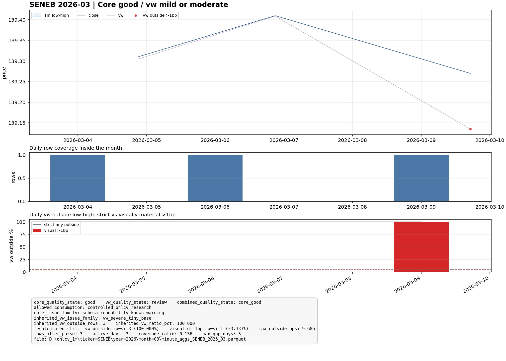

**Que muestra**

- La imagen es muy escasa: pocos puntos y barras diarias con denominadores pequenos. Por eso los porcentajes rojos pueden llegar a 100% sin demostrar por si solos una degradacion mensual robusta.

**Responde**

- Responde que `vw` requiere flag o sensibilidad, pero que el core OHLCV no queda invalidado por esta familia.

**No responde**

- No responde que `vw` sea apto para features; tampoco prueba limpieza mensual si el caso tiene pocos dias o pocas filas.

**Consecuencia**

- Permitir investigacion OHLCV controlada y bloquear consumo silencioso de `vw`.

### 05. DJCO 2023-04

ticker: `DJCO`  
year: `2023`  
month: `4`  
core_quality_state: `good`  
vw_quality_state: `review`  
combined_quality_state: `core_good`  
allowed_consumption: `controlled_ohlcv_research`  
core_issue_family: `schema_readability_known_warning`  
vw_issue_family: `vw_severe_tiny_base`  
rows_after_parse: `24`  
active_days: `11`  
coverage_ratio: `0.550`  
max_gap_days: `5`  
inherited_vw_ratio_pct: `87.500`  
visual_gt_1bp_vw_ratio_pct: `70.833`  
file: `D:\ohlcv_1m\ticker=DJCO\year=2023\month=04\minute_aggs_DJCO_2023_04.parquet`

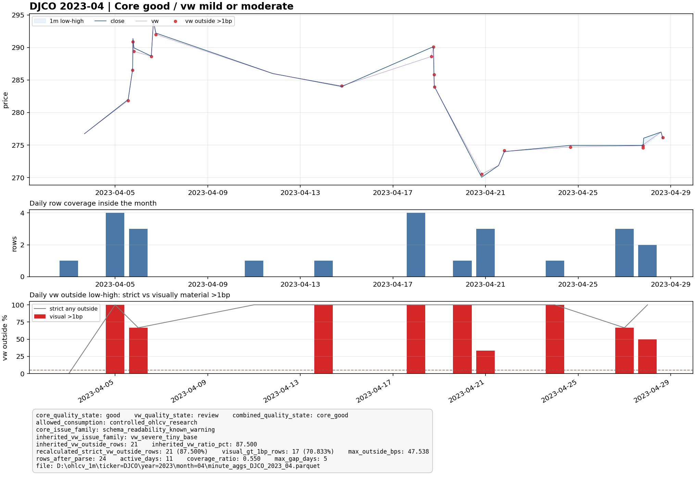

**Que muestra**

- La imagen es muy escasa: pocos puntos y barras diarias con denominadores pequenos. Por eso los porcentajes rojos pueden llegar a 100% sin demostrar por si solos una degradacion mensual robusta.

**Responde**

- Responde que `vw` requiere flag o sensibilidad, pero que el core OHLCV no queda invalidado por esta familia.

**No responde**

- No responde que `vw` sea apto para features; tampoco prueba limpieza mensual si el caso tiene pocos dias o pocas filas.

**Consecuencia**

- Permitir investigacion OHLCV controlada y bloquear consumo silencioso de `vw`.

### 06. LSXMB 2023-01

ticker: `LSXMB`  
year: `2023`  
month: `1`  
core_quality_state: `good`  
vw_quality_state: `review`  
combined_quality_state: `core_good`  
allowed_consumption: `controlled_ohlcv_research`  
core_issue_family: `schema_readability_known_warning`  
vw_issue_family: `vw_severe_tiny_base`  
rows_after_parse: `8`  
active_days: `8`  
coverage_ratio: `0.364`  
max_gap_days: `8`  
inherited_vw_ratio_pct: `87.500`  
visual_gt_1bp_vw_ratio_pct: `87.500`  
file: `D:\ohlcv_1m\ticker=LSXMB\year=2023\month=01\minute_aggs_LSXMB_2023_01.parquet`

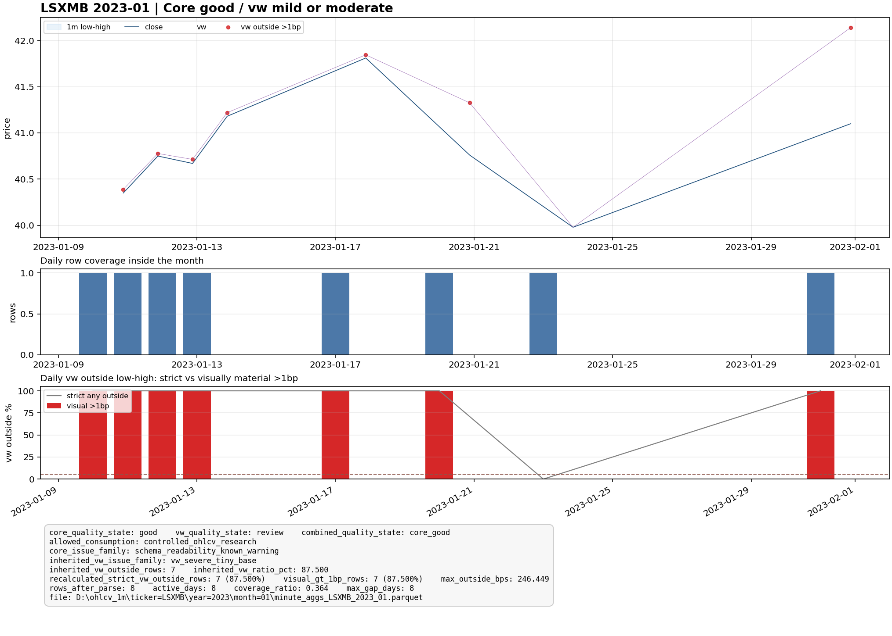

**Que muestra**

- La imagen es muy escasa: pocos puntos y barras diarias con denominadores pequenos. Por eso los porcentajes rojos pueden llegar a 100% sin demostrar por si solos una degradacion mensual robusta.

**Responde**

- Responde que `vw` requiere flag o sensibilidad, pero que el core OHLCV no queda invalidado por esta familia.

**No responde**

- No responde que `vw` sea apto para features; tampoco prueba limpieza mensual si el caso tiene pocos dias o pocas filas.

**Consecuencia**

- Permitir investigacion OHLCV controlada y bloquear consumo silencioso de `vw`.

### 07. VBFC 2022-09

ticker: `VBFC`  
year: `2022`  
month: `9`  
core_quality_state: `good`  
vw_quality_state: `review`  
combined_quality_state: `core_good`  
allowed_consumption: `controlled_ohlcv_research`  
core_issue_family: `schema_readability_known_warning`  
vw_issue_family: `vw_severe_tiny_base`  
rows_after_parse: `8`  
active_days: `6`  
coverage_ratio: `0.273`  
max_gap_days: `8`  
inherited_vw_ratio_pct: `87.500`  
visual_gt_1bp_vw_ratio_pct: `50.000`  
file: `D:\ohlcv_1m\ticker=VBFC\year=2022\month=09\minute_aggs_VBFC_2022_09.parquet`

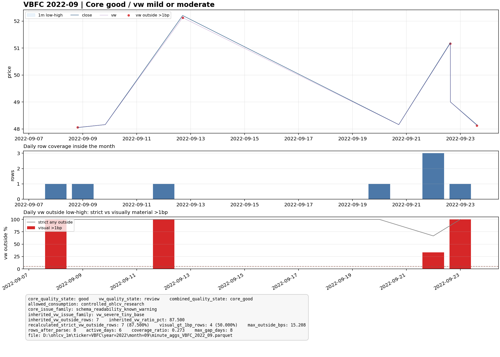

**Que muestra**

- La imagen es muy escasa: pocos puntos y barras diarias con denominadores pequenos. Por eso los porcentajes rojos pueden llegar a 100% sin demostrar por si solos una degradacion mensual robusta.

**Responde**

- Responde que `vw` requiere flag o sensibilidad, pero que el core OHLCV no queda invalidado por esta familia.

**No responde**

- No responde que `vw` sea apto para features; tampoco prueba limpieza mensual si el caso tiene pocos dias o pocas filas.

**Consecuencia**

- Permitir investigacion OHLCV controlada y bloquear consumo silencioso de `vw`.

### 08. DJCO 2022-09

ticker: `DJCO`  
year: `2022`  
month: `9`  
core_quality_state: `good`  
vw_quality_state: `review`  
combined_quality_state: `core_good`  
allowed_consumption: `controlled_ohlcv_research`  
core_issue_family: `schema_readability_known_warning`  
vw_issue_family: `vw_severe_tiny_base`  
rows_after_parse: `28`  
active_days: `12`  
coverage_ratio: `0.545`  
max_gap_days: `5`  
inherited_vw_ratio_pct: `85.714`  
visual_gt_1bp_vw_ratio_pct: `71.429`  
file: `D:\ohlcv_1m\ticker=DJCO\year=2022\month=09\minute_aggs_DJCO_2022_09.parquet`

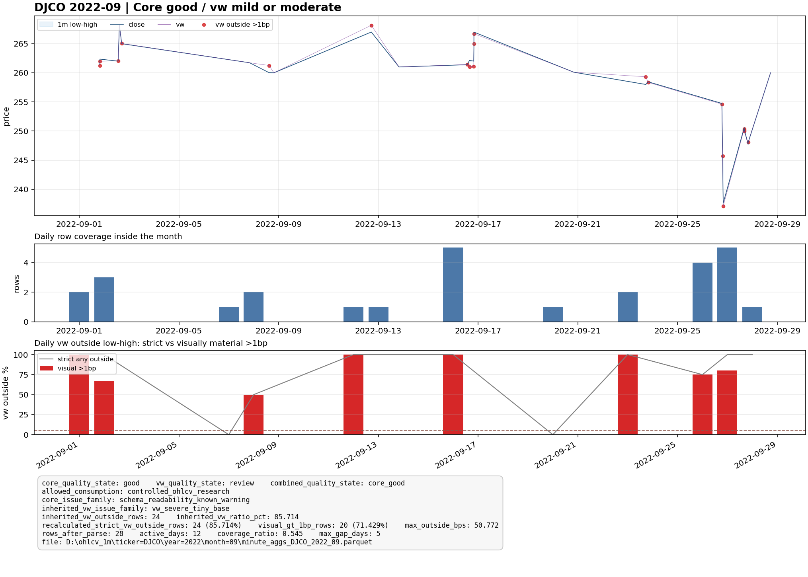

**Que muestra**

- La imagen es muy escasa: pocos puntos y barras diarias con denominadores pequenos. Por eso los porcentajes rojos pueden llegar a 100% sin demostrar por si solos una degradacion mensual robusta.

**Responde**

- Responde que `vw` requiere flag o sensibilidad, pero que el core OHLCV no queda invalidado por esta familia.

**No responde**

- No responde que `vw` sea apto para features; tampoco prueba limpieza mensual si el caso tiene pocos dias o pocas filas.

**Consecuencia**

- Permitir investigacion OHLCV controlada y bloquear consumo silencioso de `vw`.

### 09. CFFI 2026-03

ticker: `CFFI`  
year: `2026`  
month: `3`  
core_quality_state: `good`  
vw_quality_state: `review`  
combined_quality_state: `core_good`  
allowed_consumption: `controlled_ohlcv_research`  
core_issue_family: `schema_readability_known_warning`  
vw_issue_family: `vw_severe_tiny_base`  
rows_after_parse: `14`  
active_days: `5`  
coverage_ratio: `0.227`  
max_gap_days: `1`  
inherited_vw_ratio_pct: `85.714`  
visual_gt_1bp_vw_ratio_pct: `57.143`  
file: `D:\ohlcv_1m\ticker=CFFI\year=2026\month=03\minute_aggs_CFFI_2026_03.parquet`

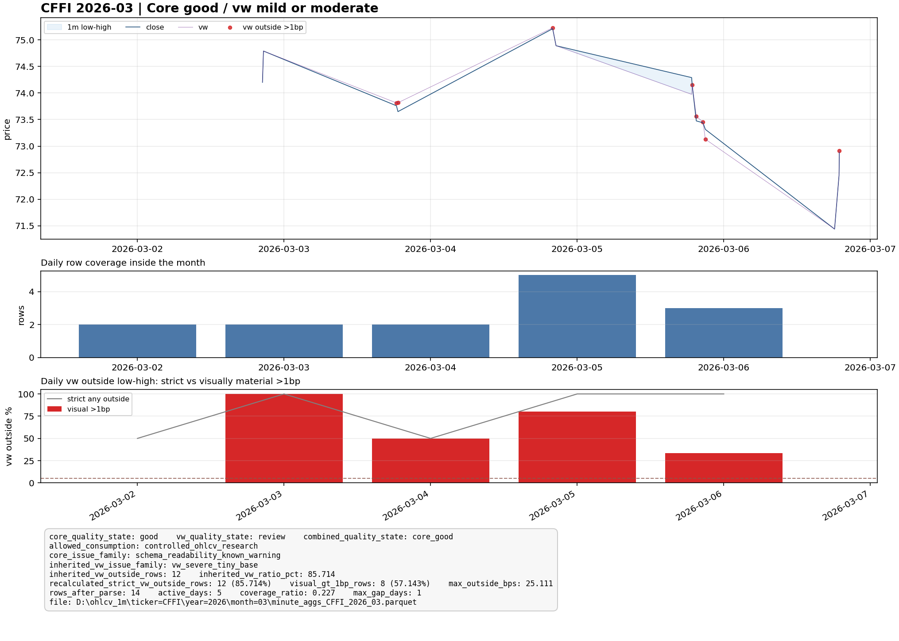

**Que muestra**

- La imagen es muy escasa: pocos puntos y barras diarias con denominadores pequenos. Por eso los porcentajes rojos pueden llegar a 100% sin demostrar por si solos una degradacion mensual robusta.

**Responde**

- Responde que `vw` requiere flag o sensibilidad, pero que el core OHLCV no queda invalidado por esta familia.

**No responde**

- No responde que `vw` sea apto para features; tampoco prueba limpieza mensual si el caso tiene pocos dias o pocas filas.

**Consecuencia**

- Permitir investigacion OHLCV controlada y bloquear consumo silencioso de `vw`.

### 10. ATRI 2023-06

ticker: `ATRI`  
year: `2023`  
month: `6`  
core_quality_state: `good`  
vw_quality_state: `review`  
combined_quality_state: `core_good`  
allowed_consumption: `controlled_ohlcv_research`  
core_issue_family: `schema_readability_known_warning`  
vw_issue_family: `vw_severe_tiny_base`  
rows_after_parse: `75`  
active_days: `20`  
coverage_ratio: `0.909`  
max_gap_days: `4`  
inherited_vw_ratio_pct: `85.333`  
visual_gt_1bp_vw_ratio_pct: `73.333`  
file: `D:\ohlcv_1m\ticker=ATRI\year=2023\month=06\minute_aggs_ATRI_2023_06.parquet`

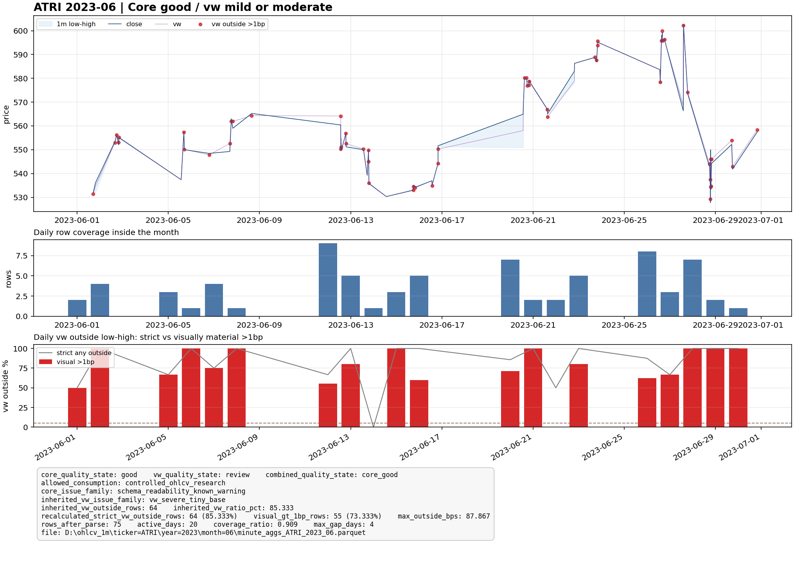

**Que muestra**

- La imagen es muy escasa: pocos puntos y barras diarias con denominadores pequenos. Por eso los porcentajes rojos pueden llegar a 100% sin demostrar por si solos una degradacion mensual robusta.

**Responde**

- Responde que `vw` requiere flag o sensibilidad, pero que el core OHLCV no queda invalidado por esta familia.

**No responde**

- No responde que `vw` sea apto para features; tampoco prueba limpieza mensual si el caso tiene pocos dias o pocas filas.

**Consecuencia**

- Permitir investigacion OHLCV controlada y bloquear consumo silencioso de `vw`.

## Core good / vw bad persistent

Esta seccion muestra la familia donde el dano de `vw` es mas claro visualmente. Los puntos rojos aparecen de forma repetida y las barras diarias suelen estar altas en muchos dias. El mensaje contractual es fuerte: OHLCV puede seguir siendo investigable, pero `vw` queda fuera del consumo limpio.

### 01. DJCO 2025-02

ticker: `DJCO`  
year: `2025`  
month: `2`  
core_quality_state: `good`  
vw_quality_state: `bad`  
combined_quality_state: `core_good_vw_bad`  
allowed_consumption: `ohlcv_without_vw_only`  
core_issue_family: `schema_readability_known_warning`  
vw_issue_family: `vw_severe_large_mass_persistent`  
rows_after_parse: `592`  
active_days: `19`  
coverage_ratio: `0.950`  
max_gap_days: `4`  
inherited_vw_ratio_pct: `83.108`  
visual_gt_1bp_vw_ratio_pct: `51.689`  
file: `D:\ohlcv_1m\ticker=DJCO\year=2025\month=02\minute_aggs_DJCO_2025_02.parquet`

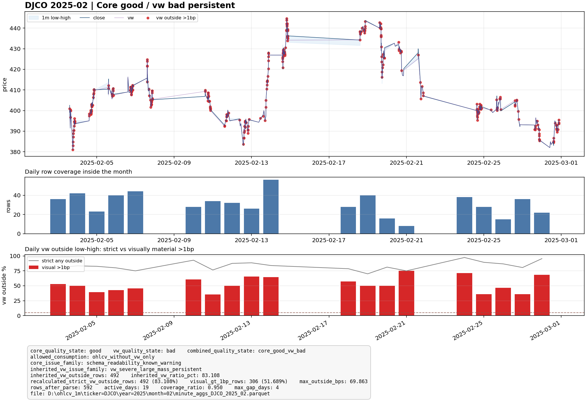

**Que muestra**

- La imagen muestra puntos rojos repetidos sobre casi toda la ventana y barras diarias altas. No es un residuo local: el dano `vw` acompana buena parte del mes.

**Responde**

- Responde que la familia `vw_bad_persistent` esta visualmente justificada: `vw` no conserva semantica confiable aunque la trayectoria OHLCV sea legible.

**No responde**

- No responde que open/high/low/close esten rotos. La figura separa dano `vw` de dano core.

**Consecuencia**

- Clasificar el caso como `ohlcv_without_vw_only`: conservar OHLCV para investigacion controlada, excluir `vw` de cualquier consumidor.

### 02. CABO 2020-11

ticker: `CABO`  
year: `2020`  
month: `11`  
core_quality_state: `good`  
vw_quality_state: `bad`  
combined_quality_state: `core_good_vw_bad`  
allowed_consumption: `ohlcv_without_vw_only`  
core_issue_family: `schema_readability_known_warning`  
vw_issue_family: `vw_severe_large_mass_persistent`  
rows_after_parse: `699`  
active_days: `20`  
coverage_ratio: `0.952`  
max_gap_days: `3`  
inherited_vw_ratio_pct: `80.830`  
visual_gt_1bp_vw_ratio_pct: `64.521`  
file: `D:\ohlcv_1m\ticker=CABO\year=2020\month=11\minute_aggs_CABO_2020_11.parquet`

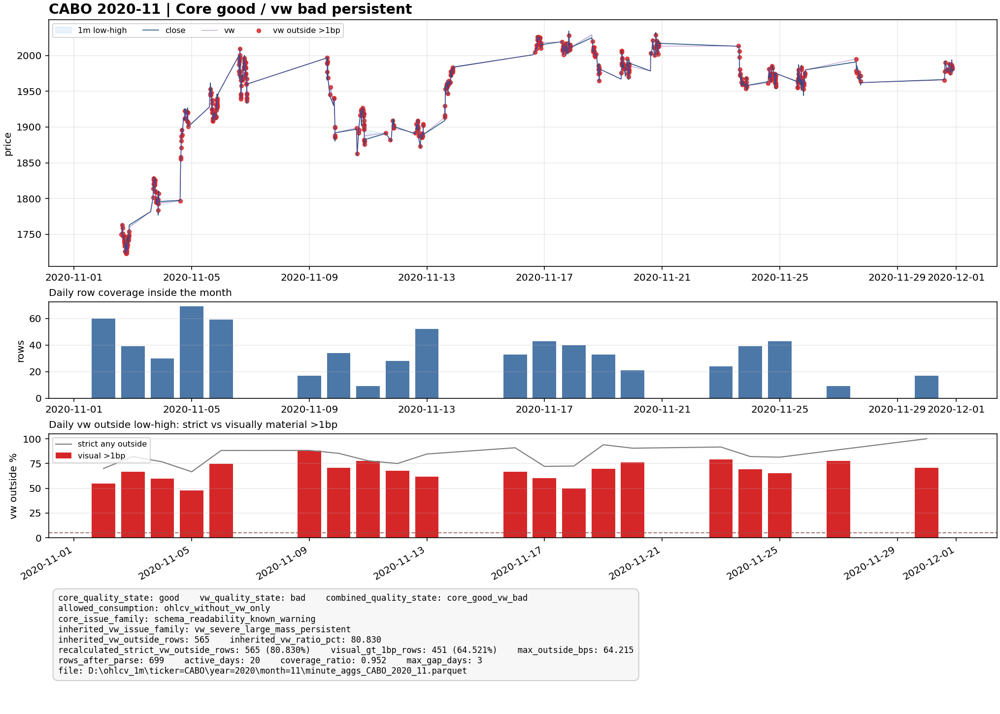

**Que muestra**

- La imagen muestra puntos rojos repetidos sobre casi toda la ventana y barras diarias altas. No es un residuo local: el dano `vw` acompana buena parte del mes.

**Responde**

- Responde que la familia `vw_bad_persistent` esta visualmente justificada: `vw` no conserva semantica confiable aunque la trayectoria OHLCV sea legible.

**No responde**

- No responde que open/high/low/close esten rotos. La figura separa dano `vw` de dano core.

**Consecuencia**

- Clasificar el caso como `ohlcv_without_vw_only`: conservar OHLCV para investigacion controlada, excluir `vw` de cualquier consumidor.

### 03. VRTS 2024-12

ticker: `VRTS`  
year: `2024`  
month: `12`  
core_quality_state: `good`  
vw_quality_state: `bad`  
combined_quality_state: `core_good_vw_bad`  
allowed_consumption: `ohlcv_without_vw_only`  
core_issue_family: `schema_readability_known_warning`  
vw_issue_family: `vw_severe_large_mass_persistent`  
rows_after_parse: `683`  
active_days: `21`  
coverage_ratio: `0.955`  
max_gap_days: `3`  
inherited_vw_ratio_pct: `80.088`  
visual_gt_1bp_vw_ratio_pct: `48.170`  
file: `D:\ohlcv_1m\ticker=VRTS\year=2024\month=12\minute_aggs_VRTS_2024_12.parquet`

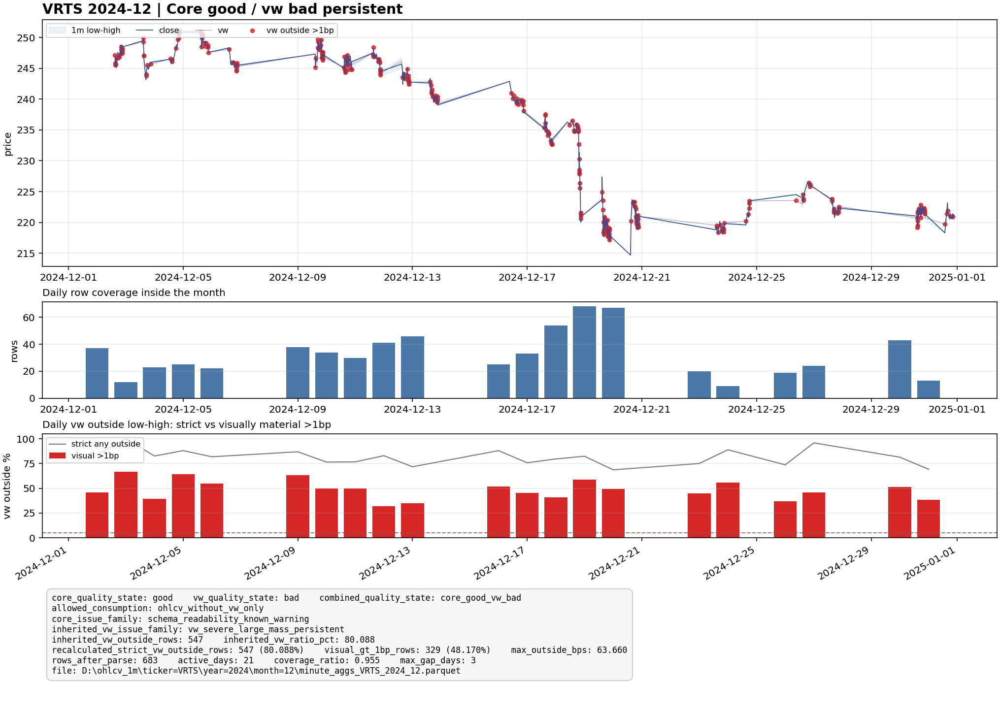

**Que muestra**

- La imagen muestra puntos rojos repetidos sobre casi toda la ventana y barras diarias altas. No es un residuo local: el dano `vw` acompana buena parte del mes.

**Responde**

- Responde que la familia `vw_bad_persistent` esta visualmente justificada: `vw` no conserva semantica confiable aunque la trayectoria OHLCV sea legible.

**No responde**

- No responde que open/high/low/close esten rotos. La figura separa dano `vw` de dano core.

**Consecuencia**

- Clasificar el caso como `ohlcv_without_vw_only`: conservar OHLCV para investigacion controlada, excluir `vw` de cualquier consumidor.

### 04. CABO 2020-09

ticker: `CABO`  
year: `2020`  
month: `9`  
core_quality_state: `good`  
vw_quality_state: `bad`  
combined_quality_state: `core_good_vw_bad`  
allowed_consumption: `ohlcv_without_vw_only`  
core_issue_family: `schema_readability_known_warning`  
vw_issue_family: `vw_severe_large_mass_persistent`  
rows_after_parse: `693`  
active_days: `21`  
coverage_ratio: `0.955`  
max_gap_days: `4`  
inherited_vw_ratio_pct: `79.798`  
visual_gt_1bp_vw_ratio_pct: `66.522`  
file: `D:\ohlcv_1m\ticker=CABO\year=2020\month=09\minute_aggs_CABO_2020_09.parquet`

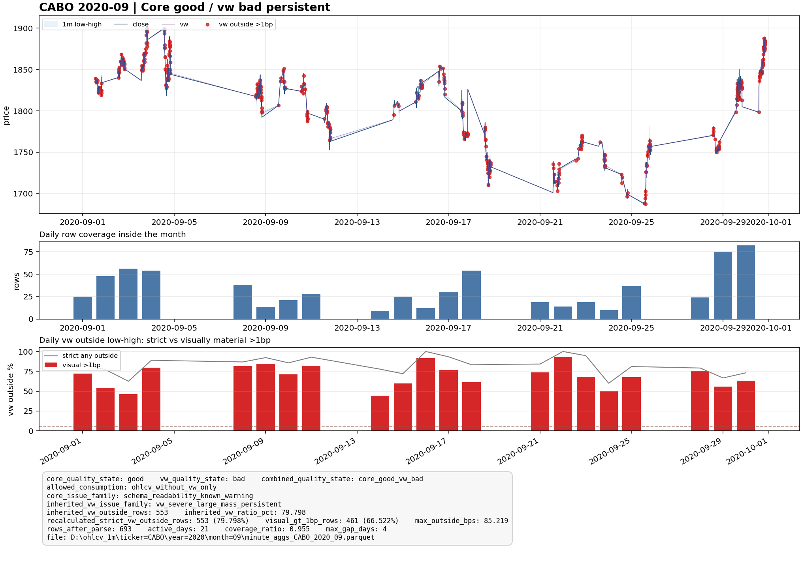

**Que muestra**

- La imagen muestra puntos rojos repetidos sobre casi toda la ventana y barras diarias altas. No es un residuo local: el dano `vw` acompana buena parte del mes.

**Responde**

- Responde que la familia `vw_bad_persistent` esta visualmente justificada: `vw` no conserva semantica confiable aunque la trayectoria OHLCV sea legible.

**No responde**

- No responde que open/high/low/close esten rotos. La figura separa dano `vw` de dano core.

**Consecuencia**

- Clasificar el caso como `ohlcv_without_vw_only`: conservar OHLCV para investigacion controlada, excluir `vw` de cualquier consumidor.

### 05. CABO 2020-08

ticker: `CABO`  
year: `2020`  
month: `8`  
core_quality_state: `good`  
vw_quality_state: `bad`  
combined_quality_state: `core_good_vw_bad`  
allowed_consumption: `ohlcv_without_vw_only`  
core_issue_family: `schema_readability_known_warning`  
vw_issue_family: `vw_severe_large_mass_persistent`  
rows_after_parse: `754`  
active_days: `21`  
coverage_ratio: `1.000`  
max_gap_days: `3`  
inherited_vw_ratio_pct: `79.045`  
visual_gt_1bp_vw_ratio_pct: `64.191`  
file: `D:\ohlcv_1m\ticker=CABO\year=2020\month=08\minute_aggs_CABO_2020_08.parquet`

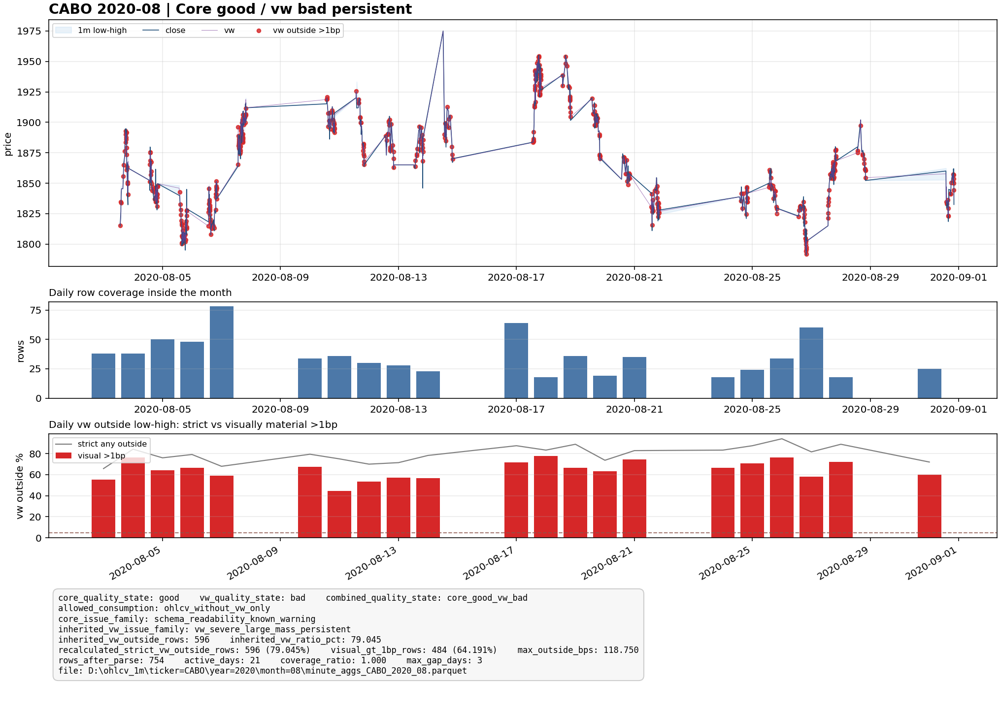

**Que muestra**

- La imagen muestra puntos rojos repetidos sobre casi toda la ventana y barras diarias altas. No es un residuo local: el dano `vw` acompana buena parte del mes.

**Responde**

- Responde que la familia `vw_bad_persistent` esta visualmente justificada: `vw` no conserva semantica confiable aunque la trayectoria OHLCV sea legible.

**No responde**

- No responde que open/high/low/close esten rotos. La figura separa dano `vw` de dano core.

**Consecuencia**

- Clasificar el caso como `ohlcv_without_vw_only`: conservar OHLCV para investigacion controlada, excluir `vw` de cualquier consumidor.

### 06. CABO 2022-03

ticker: `CABO`  
year: `2022`  
month: `3`  
core_quality_state: `good`  
vw_quality_state: `bad`  
combined_quality_state: `core_good_vw_bad`  
allowed_consumption: `ohlcv_without_vw_only`  
core_issue_family: `schema_readability_known_warning`  
vw_issue_family: `vw_severe_large_mass_persistent`  
rows_after_parse: `936`  
active_days: `23`  
coverage_ratio: `1.000`  
max_gap_days: `3`  
inherited_vw_ratio_pct: `78.739`  
visual_gt_1bp_vw_ratio_pct: `53.632`  
file: `D:\ohlcv_1m\ticker=CABO\year=2022\month=03\minute_aggs_CABO_2022_03.parquet`

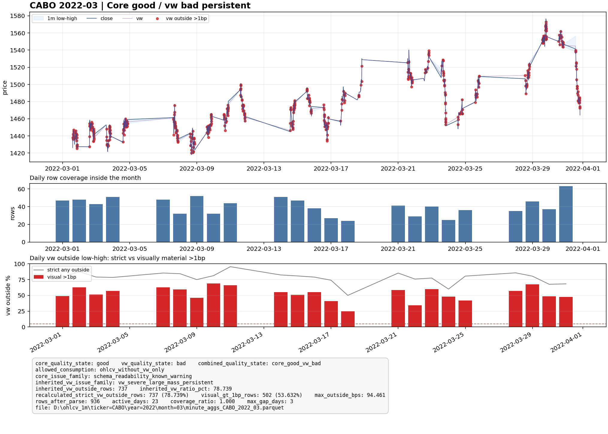

**Que muestra**

- La imagen muestra puntos rojos repetidos sobre casi toda la ventana y barras diarias altas. No es un residuo local: el dano `vw` acompana buena parte del mes.

**Responde**

- Responde que la familia `vw_bad_persistent` esta visualmente justificada: `vw` no conserva semantica confiable aunque la trayectoria OHLCV sea legible.

**No responde**

- No responde que open/high/low/close esten rotos. La figura separa dano `vw` de dano core.

**Consecuencia**

- Clasificar el caso como `ohlcv_without_vw_only`: conservar OHLCV para investigacion controlada, excluir `vw` de cualquier consumidor.

### 07. CABO 2021-09

ticker: `CABO`  
year: `2021`  
month: `9`  
core_quality_state: `good`  
vw_quality_state: `bad`  
combined_quality_state: `core_good_vw_bad`  
allowed_consumption: `ohlcv_without_vw_only`  
core_issue_family: `schema_readability_known_warning`  
vw_issue_family: `vw_severe_large_mass_persistent`  
rows_after_parse: `842`  
active_days: `21`  
coverage_ratio: `0.955`  
max_gap_days: `4`  
inherited_vw_ratio_pct: `78.504`  
visual_gt_1bp_vw_ratio_pct: `56.057`  
file: `D:\ohlcv_1m\ticker=CABO\year=2021\month=09\minute_aggs_CABO_2021_09.parquet`

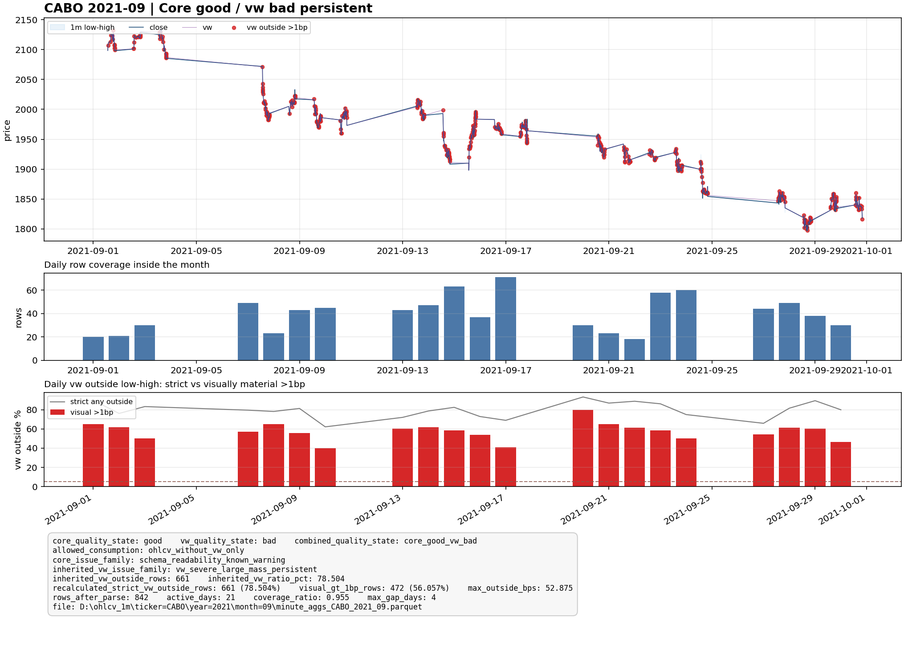

**Que muestra**

- La imagen muestra puntos rojos repetidos sobre casi toda la ventana y barras diarias altas. No es un residuo local: el dano `vw` acompana buena parte del mes.

**Responde**

- Responde que la familia `vw_bad_persistent` esta visualmente justificada: `vw` no conserva semantica confiable aunque la trayectoria OHLCV sea legible.

**No responde**

- No responde que open/high/low/close esten rotos. La figura separa dano `vw` de dano core.

**Consecuencia**

- Clasificar el caso como `ohlcv_without_vw_only`: conservar OHLCV para investigacion controlada, excluir `vw` de cualquier consumidor.

### 08. CABO 2021-12

ticker: `CABO`  
year: `2021`  
month: `12`  
core_quality_state: `good`  
vw_quality_state: `bad`  
combined_quality_state: `core_good_vw_bad`  
allowed_consumption: `ohlcv_without_vw_only`  
core_issue_family: `schema_readability_known_warning`  
vw_issue_family: `vw_severe_large_mass_persistent`  
rows_after_parse: `765`  
active_days: `22`  
coverage_ratio: `0.957`  
max_gap_days: `4`  
inherited_vw_ratio_pct: `78.431`  
visual_gt_1bp_vw_ratio_pct: `55.425`  
file: `D:\ohlcv_1m\ticker=CABO\year=2021\month=12\minute_aggs_CABO_2021_12.parquet`

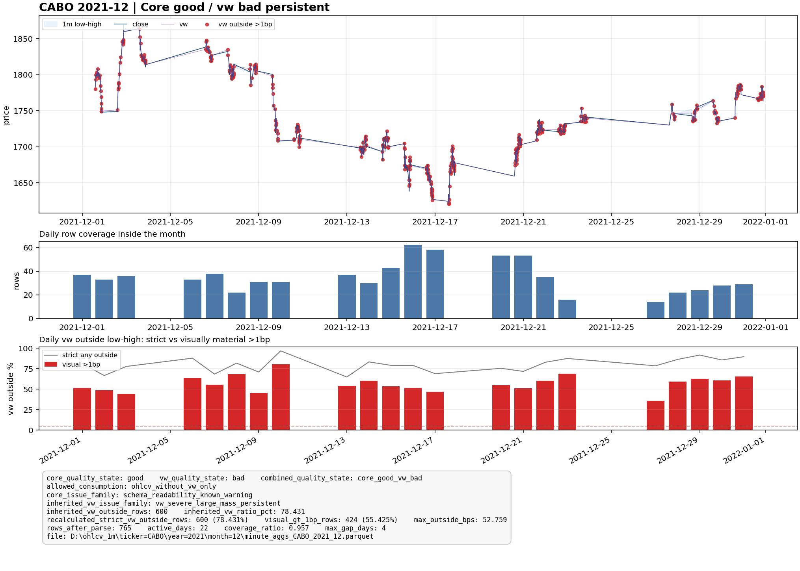

**Que muestra**

- La imagen muestra puntos rojos repetidos sobre casi toda la ventana y barras diarias altas. No es un residuo local: el dano `vw` acompana buena parte del mes.

**Responde**

- Responde que la familia `vw_bad_persistent` esta visualmente justificada: `vw` no conserva semantica confiable aunque la trayectoria OHLCV sea legible.

**No responde**

- No responde que open/high/low/close esten rotos. La figura separa dano `vw` de dano core.

**Consecuencia**

- Clasificar el caso como `ohlcv_without_vw_only`: conservar OHLCV para investigacion controlada, excluir `vw` de cualquier consumidor.

### 09. VRTS 2025-02

ticker: `VRTS`  
year: `2025`  
month: `2`  
core_quality_state: `good`  
vw_quality_state: `bad`  
combined_quality_state: `core_good_vw_bad`  
allowed_consumption: `ohlcv_without_vw_only`  
core_issue_family: `schema_readability_known_warning`  
vw_issue_family: `vw_severe_large_mass_persistent`  
rows_after_parse: `682`  
active_days: `19`  
coverage_ratio: `0.950`  
max_gap_days: `4`  
inherited_vw_ratio_pct: `77.566`  
visual_gt_1bp_vw_ratio_pct: `47.214`  
file: `D:\ohlcv_1m\ticker=VRTS\year=2025\month=02\minute_aggs_VRTS_2025_02.parquet`

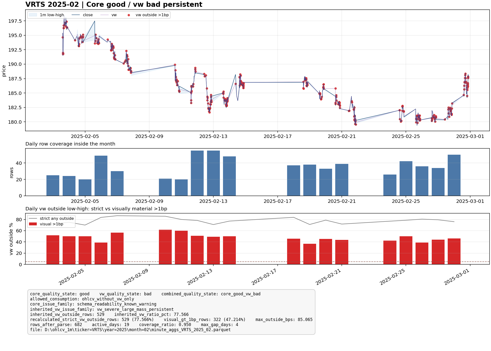

**Que muestra**

- La imagen muestra puntos rojos repetidos sobre casi toda la ventana y barras diarias altas. No es un residuo local: el dano `vw` acompana buena parte del mes.

**Responde**

- Responde que la familia `vw_bad_persistent` esta visualmente justificada: `vw` no conserva semantica confiable aunque la trayectoria OHLCV sea legible.

**No responde**

- No responde que open/high/low/close esten rotos. La figura separa dano `vw` de dano core.

**Consecuencia**

- Clasificar el caso como `ohlcv_without_vw_only`: conservar OHLCV para investigacion controlada, excluir `vw` de cualquier consumidor.

### 10. CLMB 2025-09

ticker: `CLMB`  
year: `2025`  
month: `9`  
core_quality_state: `good`  
vw_quality_state: `bad`  
combined_quality_state: `core_good_vw_bad`  
allowed_consumption: `ohlcv_without_vw_only`  
core_issue_family: `schema_readability_known_warning`  
vw_issue_family: `vw_severe_large_mass_persistent`  
rows_after_parse: `904`  
active_days: `21`  
coverage_ratio: `0.955`  
max_gap_days: `3`  
inherited_vw_ratio_pct: `77.544`  
visual_gt_1bp_vw_ratio_pct: `53.982`  
file: `D:\ohlcv_1m\ticker=CLMB\year=2025\month=09\minute_aggs_CLMB_2025_09.parquet`

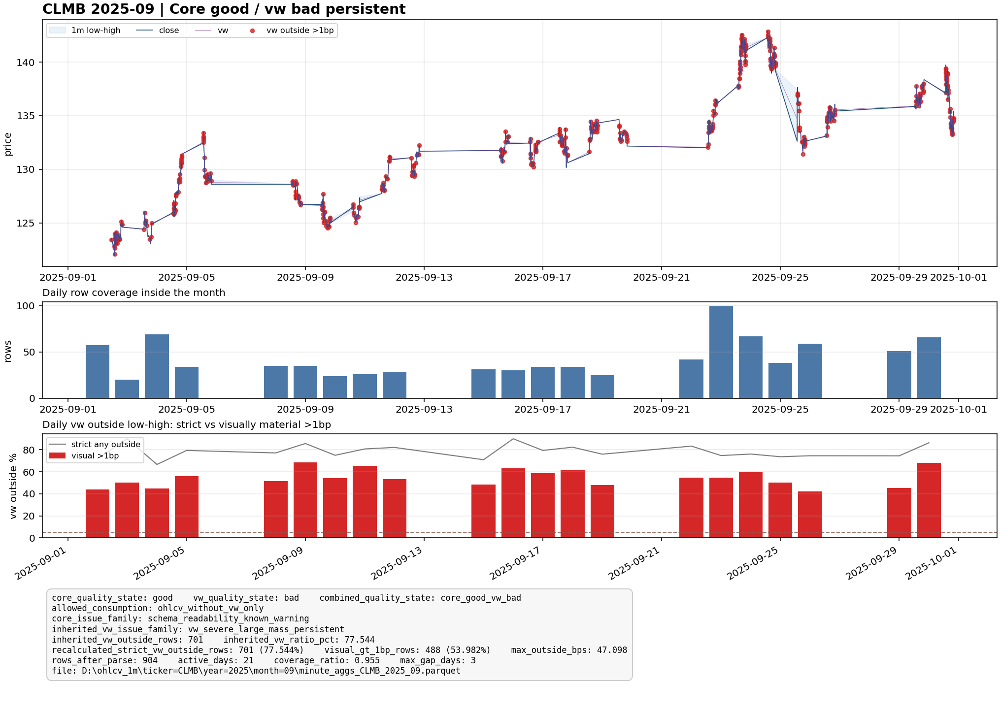

**Que muestra**

- La imagen muestra puntos rojos repetidos sobre casi toda la ventana y barras diarias altas. No es un residuo local: el dano `vw` acompana buena parte del mes.

**Responde**

- Responde que la familia `vw_bad_persistent` esta visualmente justificada: `vw` no conserva semantica confiable aunque la trayectoria OHLCV sea legible.

**No responde**

- No responde que open/high/low/close esten rotos. La figura separa dano `vw` de dano core.

**Consecuencia**

- Clasificar el caso como `ohlcv_without_vw_only`: conservar OHLCV para investigacion controlada, excluir `vw` de cualquier consumidor.

## Core good / vw bad diffuse

Esta seccion muestra dano `vw` severo pero mas distribuido o irregular que la familia persistent. La serie de precio suele seguir siendo legible, pero la linea `vw` y los puntos rojos aparecen en suficientes dias para bloquear consumidores `vw`.

### 01. DJCO 2025-03

ticker: `DJCO`  
year: `2025`  
month: `3`  
core_quality_state: `good`  
vw_quality_state: `bad`  
combined_quality_state: `core_good_vw_bad`  
allowed_consumption: `ohlcv_without_vw_only`  
core_issue_family: `schema_readability_known_warning`  
vw_issue_family: `vw_severe_large_mass_diffuse`  
rows_after_parse: `438`  
active_days: `21`  
coverage_ratio: `1.000`  
max_gap_days: `3`  
inherited_vw_ratio_pct: `86.758`  
visual_gt_1bp_vw_ratio_pct: `63.242`  
file: `D:\ohlcv_1m\ticker=DJCO\year=2025\month=03\minute_aggs_DJCO_2025_03.parquet`

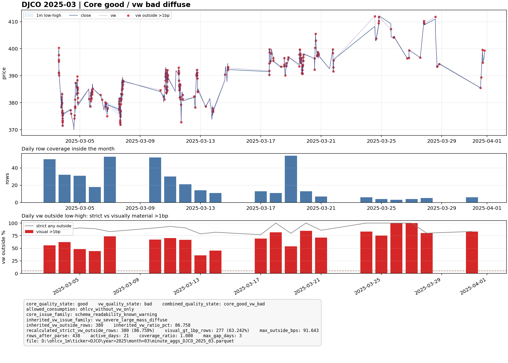

**Que muestra**

- La imagen muestra dano `vw` frecuente pero menos uniforme que persistent. Hay sesiones limpias o menos afectadas junto a bloques con muchos puntos rojos.

**Responde**

- Responde que el problema no es un unico spike aislado: la frecuencia de barras rojas basta para impedir consumo limpio de `vw`.

**No responde**

- No responde que el mes sea inutil para todo uso. La serie de precio sigue dando contexto OHLCV aprovechable bajo restricciones.

**Consecuencia**

- Mantener el caso fuera de features `vw` y permitir solo rutas que declaren `ohlcv_without_vw_only`.

### 02. ATRI 2024-04

ticker: `ATRI`  
year: `2024`  
month: `4`  
core_quality_state: `good`  
vw_quality_state: `bad`  
combined_quality_state: `core_good_vw_bad`  
allowed_consumption: `ohlcv_without_vw_only`  
core_issue_family: `schema_readability_known_warning`  
vw_issue_family: `vw_severe_large_mass_diffuse`  
rows_after_parse: `487`  
active_days: `22`  
coverage_ratio: `1.000`  
max_gap_days: `3`  
inherited_vw_ratio_pct: `85.010`  
visual_gt_1bp_vw_ratio_pct: `71.047`  
file: `D:\ohlcv_1m\ticker=ATRI\year=2024\month=04\minute_aggs_ATRI_2024_04.parquet`

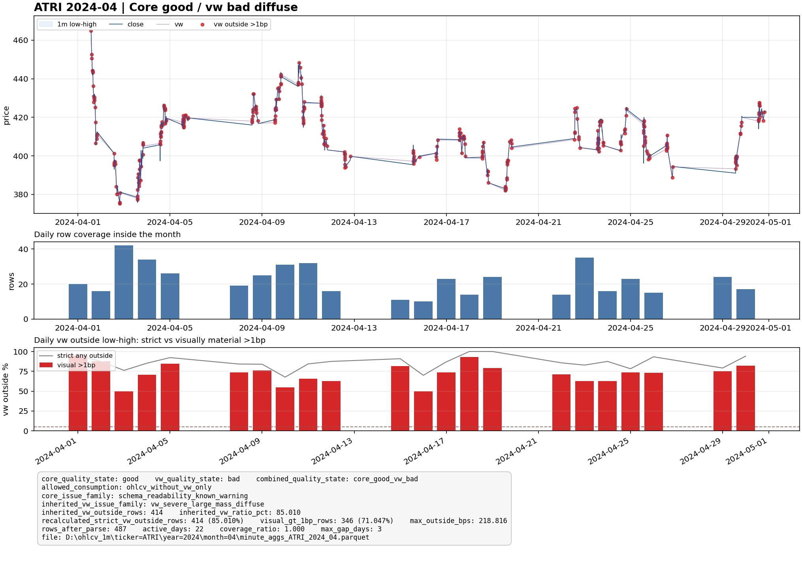

**Que muestra**

- La imagen muestra dano `vw` frecuente pero menos uniforme que persistent. Hay sesiones limpias o menos afectadas junto a bloques con muchos puntos rojos.

**Responde**

- Responde que el problema no es un unico spike aislado: la frecuencia de barras rojas basta para impedir consumo limpio de `vw`.

**No responde**

- No responde que el mes sea inutil para todo uso. La serie de precio sigue dando contexto OHLCV aprovechable bajo restricciones.

**Consecuencia**

- Mantener el caso fuera de features `vw` y permitir solo rutas que declaren `ohlcv_without_vw_only`.

### 03. DJCO 2024-06

ticker: `DJCO`  
year: `2024`  
month: `6`  
core_quality_state: `good`  
vw_quality_state: `bad`  
combined_quality_state: `core_good_vw_bad`  
allowed_consumption: `ohlcv_without_vw_only`  
core_issue_family: `schema_readability_known_warning`  
vw_issue_family: `vw_severe_large_mass_diffuse`  
rows_after_parse: `142`  
active_days: `19`  
coverage_ratio: `0.950`  
max_gap_days: `3`  
inherited_vw_ratio_pct: `83.099`  
visual_gt_1bp_vw_ratio_pct: `56.338`  
file: `D:\ohlcv_1m\ticker=DJCO\year=2024\month=06\minute_aggs_DJCO_2024_06.parquet`

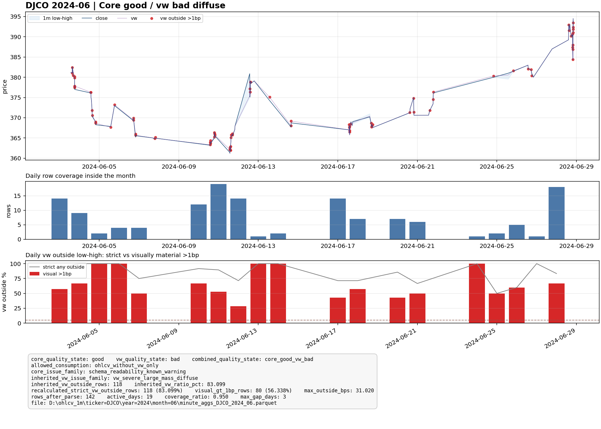

**Que muestra**

- La imagen muestra dano `vw` frecuente pero menos uniforme que persistent. Hay sesiones limpias o menos afectadas junto a bloques con muchos puntos rojos.

**Responde**

- Responde que el problema no es un unico spike aislado: la frecuencia de barras rojas basta para impedir consumo limpio de `vw`.

**No responde**

- No responde que el mes sea inutil para todo uso. La serie de precio sigue dando contexto OHLCV aprovechable bajo restricciones.

**Consecuencia**

- Mantener el caso fuera de features `vw` y permitir solo rutas que declaren `ohlcv_without_vw_only`.

### 04. CABO 2020-12

ticker: `CABO`  
year: `2020`  
month: `12`  
core_quality_state: `good`  
vw_quality_state: `bad`  
combined_quality_state: `core_good_vw_bad`  
allowed_consumption: `ohlcv_without_vw_only`  
core_issue_family: `schema_readability_known_warning`  
vw_issue_family: `vw_severe_large_mass_diffuse`  
rows_after_parse: `651`  
active_days: `22`  
coverage_ratio: `0.957`  
max_gap_days: `4`  
inherited_vw_ratio_pct: `82.796`  
visual_gt_1bp_vw_ratio_pct: `62.980`  
file: `D:\ohlcv_1m\ticker=CABO\year=2020\month=12\minute_aggs_CABO_2020_12.parquet`

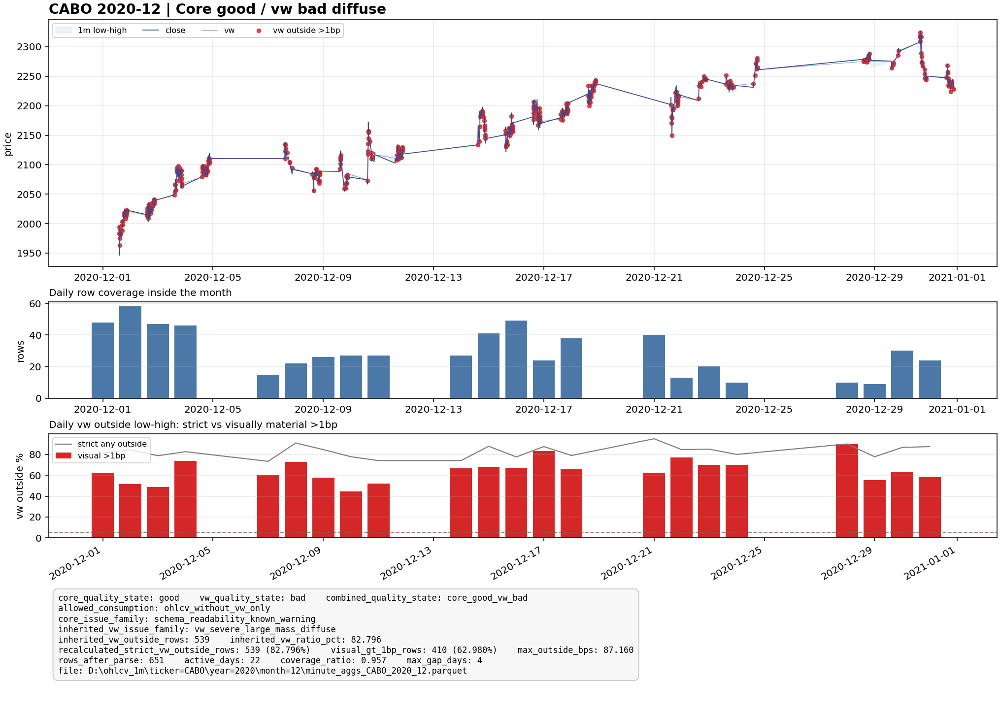

**Que muestra**

- La imagen muestra dano `vw` frecuente pero menos uniforme que persistent. Hay sesiones limpias o menos afectadas junto a bloques con muchos puntos rojos.

**Responde**

- Responde que el problema no es un unico spike aislado: la frecuencia de barras rojas basta para impedir consumo limpio de `vw`.

**No responde**

- No responde que el mes sea inutil para todo uso. La serie de precio sigue dando contexto OHLCV aprovechable bajo restricciones.

**Consecuencia**

- Mantener el caso fuera de features `vw` y permitir solo rutas que declaren `ohlcv_without_vw_only`.

### 05. ITIC 2025-09

ticker: `ITIC`  
year: `2025`  
month: `9`  
core_quality_state: `good`  
vw_quality_state: `bad`  
combined_quality_state: `core_good_vw_bad`  
allowed_consumption: `ohlcv_without_vw_only`  
core_issue_family: `schema_readability_known_warning`  
vw_issue_family: `vw_severe_large_mass_diffuse`  
rows_after_parse: `344`  
active_days: `21`  
coverage_ratio: `0.955`  
max_gap_days: `3`  
inherited_vw_ratio_pct: `82.267`  
visual_gt_1bp_vw_ratio_pct: `60.465`  
file: `D:\ohlcv_1m\ticker=ITIC\year=2025\month=09\minute_aggs_ITIC_2025_09.parquet`

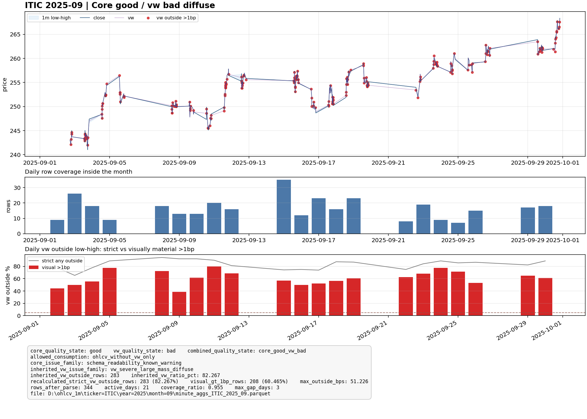

**Que muestra**

- La imagen muestra dano `vw` frecuente pero menos uniforme que persistent. Hay sesiones limpias o menos afectadas junto a bloques con muchos puntos rojos.

**Responde**

- Responde que el problema no es un unico spike aislado: la frecuencia de barras rojas basta para impedir consumo limpio de `vw`.

**No responde**

- No responde que el mes sea inutil para todo uso. La serie de precio sigue dando contexto OHLCV aprovechable bajo restricciones.

**Consecuencia**

- Mantener el caso fuera de features `vw` y permitir solo rutas que declaren `ohlcv_without_vw_only`.

### 06. DJCO 2025-05

ticker: `DJCO`  
year: `2025`  
month: `5`  
core_quality_state: `good`  
vw_quality_state: `bad`  
combined_quality_state: `core_good_vw_bad`  
allowed_consumption: `ohlcv_without_vw_only`  
core_issue_family: `schema_readability_known_warning`  
vw_issue_family: `vw_severe_large_mass_diffuse`  
rows_after_parse: `467`  
active_days: `21`  
coverage_ratio: `0.955`  
max_gap_days: `4`  
inherited_vw_ratio_pct: `81.799`  
visual_gt_1bp_vw_ratio_pct: `62.099`  
file: `D:\ohlcv_1m\ticker=DJCO\year=2025\month=05\minute_aggs_DJCO_2025_05.parquet`

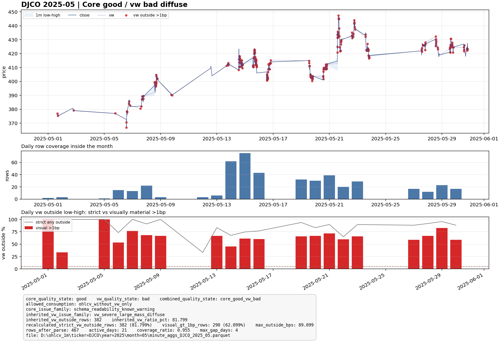

**Que muestra**

- La imagen muestra dano `vw` frecuente pero menos uniforme que persistent. Hay sesiones limpias o menos afectadas junto a bloques con muchos puntos rojos.

**Responde**

- Responde que el problema no es un unico spike aislado: la frecuencia de barras rojas basta para impedir consumo limpio de `vw`.

**No responde**

- No responde que el mes sea inutil para todo uso. La serie de precio sigue dando contexto OHLCV aprovechable bajo restricciones.

**Consecuencia**

- Mantener el caso fuera de features `vw` y permitir solo rutas que declaren `ohlcv_without_vw_only`.

### 07. WRLD 2024-11

ticker: `WRLD`  
year: `2024`  
month: `11`  
core_quality_state: `good`  
vw_quality_state: `bad`  
combined_quality_state: `core_good_vw_bad`  
allowed_consumption: `ohlcv_without_vw_only`  
core_issue_family: `schema_readability_known_warning`  
vw_issue_family: `vw_severe_large_mass_diffuse`  
rows_after_parse: `350`  
active_days: `20`  
coverage_ratio: `0.952`  
max_gap_days: `3`  
inherited_vw_ratio_pct: `81.714`  
visual_gt_1bp_vw_ratio_pct: `62.571`  
file: `D:\ohlcv_1m\ticker=WRLD\year=2024\month=11\minute_aggs_WRLD_2024_11.parquet`

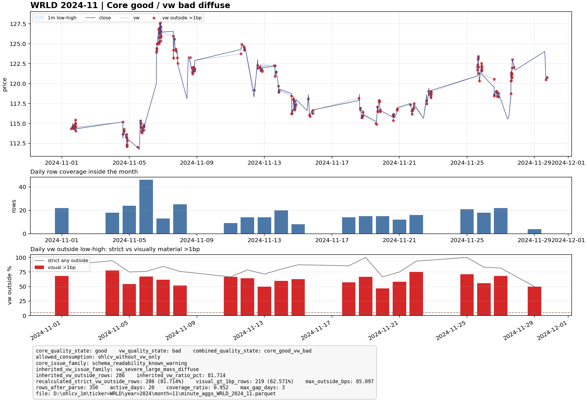

**Que muestra**

- La imagen muestra dano `vw` frecuente pero menos uniforme que persistent. Hay sesiones limpias o menos afectadas junto a bloques con muchos puntos rojos.

**Responde**

- Responde que el problema no es un unico spike aislado: la frecuencia de barras rojas basta para impedir consumo limpio de `vw`.

**No responde**

- No responde que el mes sea inutil para todo uso. La serie de precio sigue dando contexto OHLCV aprovechable bajo restricciones.

**Consecuencia**

- Mantener el caso fuera de features `vw` y permitir solo rutas que declaren `ohlcv_without_vw_only`.

### 08. ATRI 2024-03

ticker: `ATRI`  
year: `2024`  
month: `3`  
core_quality_state: `good`  
vw_quality_state: `bad`  
combined_quality_state: `core_good_vw_bad`  
allowed_consumption: `ohlcv_without_vw_only`  
core_issue_family: `schema_readability_known_warning`  
vw_issue_family: `vw_severe_large_mass_diffuse`  
rows_after_parse: `351`  
active_days: `20`  
coverage_ratio: `0.952`  
max_gap_days: `3`  
inherited_vw_ratio_pct: `81.481`  
visual_gt_1bp_vw_ratio_pct: `73.219`  
file: `D:\ohlcv_1m\ticker=ATRI\year=2024\month=03\minute_aggs_ATRI_2024_03.parquet`

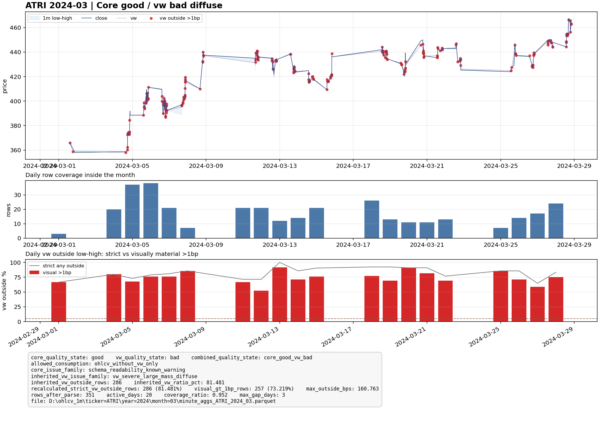

**Que muestra**

- La imagen muestra dano `vw` frecuente pero menos uniforme que persistent. Hay sesiones limpias o menos afectadas junto a bloques con muchos puntos rojos.

**Responde**

- Responde que el problema no es un unico spike aislado: la frecuencia de barras rojas basta para impedir consumo limpio de `vw`.

**No responde**

- No responde que el mes sea inutil para todo uso. La serie de precio sigue dando contexto OHLCV aprovechable bajo restricciones.

**Consecuencia**

- Mantener el caso fuera de features `vw` y permitir solo rutas que declaren `ohlcv_without_vw_only`.

### 09. ITIC 2025-03

ticker: `ITIC`  
year: `2025`  
month: `3`  
core_quality_state: `good`  
vw_quality_state: `bad`  
combined_quality_state: `core_good_vw_bad`  
allowed_consumption: `ohlcv_without_vw_only`  
core_issue_family: `schema_readability_known_warning`  
vw_issue_family: `vw_severe_large_mass_diffuse`  
rows_after_parse: `205`  
active_days: `19`  
coverage_ratio: `0.905`  
max_gap_days: `4`  
inherited_vw_ratio_pct: `80.488`  
visual_gt_1bp_vw_ratio_pct: `56.585`  
file: `D:\ohlcv_1m\ticker=ITIC\year=2025\month=03\minute_aggs_ITIC_2025_03.parquet`

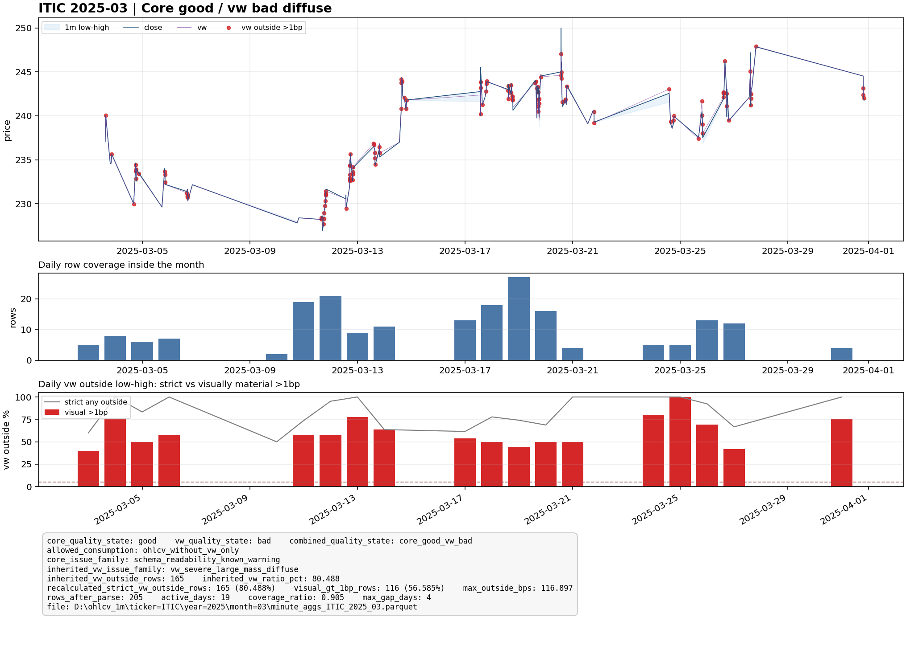

**Que muestra**

- La imagen muestra dano `vw` frecuente pero menos uniforme que persistent. Hay sesiones limpias o menos afectadas junto a bloques con muchos puntos rojos.

**Responde**

- Responde que el problema no es un unico spike aislado: la frecuencia de barras rojas basta para impedir consumo limpio de `vw`.

**No responde**

- No responde que el mes sea inutil para todo uso. La serie de precio sigue dando contexto OHLCV aprovechable bajo restricciones.

**Consecuencia**

- Mantener el caso fuera de features `vw` y permitir solo rutas que declaren `ohlcv_without_vw_only`.

### 10. DJCO 2024-11

ticker: `DJCO`  
year: `2024`  
month: `11`  
core_quality_state: `good`  
vw_quality_state: `bad`  
combined_quality_state: `core_good_vw_bad`  
allowed_consumption: `ohlcv_without_vw_only`  
core_issue_family: `schema_readability_known_warning`  
vw_issue_family: `vw_severe_large_mass_diffuse`  
rows_after_parse: `344`  
active_days: `20`  
coverage_ratio: `0.952`  
max_gap_days: `3`  
inherited_vw_ratio_pct: `80.233`  
visual_gt_1bp_vw_ratio_pct: `54.360`  
file: `D:\ohlcv_1m\ticker=DJCO\year=2024\month=11\minute_aggs_DJCO_2024_11.parquet`

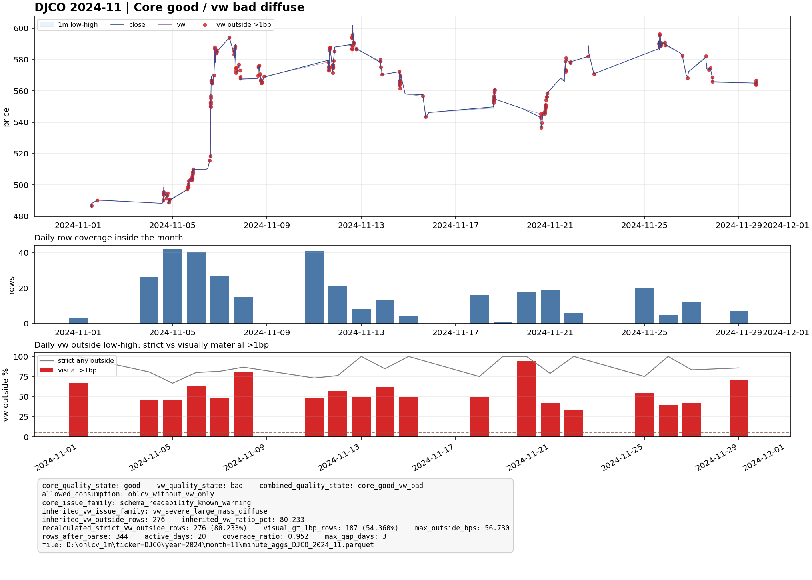

**Que muestra**

- La imagen muestra dano `vw` frecuente pero menos uniforme que persistent. Hay sesiones limpias o menos afectadas junto a bloques con muchos puntos rojos.

**Responde**

- Responde que el problema no es un unico spike aislado: la frecuencia de barras rojas basta para impedir consumo limpio de `vw`.

**No responde**

- No responde que el mes sea inutil para todo uso. La serie de precio sigue dando contexto OHLCV aprovechable bajo restricciones.

**Consecuencia**

- Mantener el caso fuera de features `vw` y permitir solo rutas que declaren `ohlcv_without_vw_only`.

## Core review / large internal gap

Esta seccion no trata principalmente de `vw`. El hecho visual dominante son huecos internos largos: la linea de precio puede interpolar o unir extremos, pero las barras de cobertura revelan que el mes no tiene continuidad suficiente para consumo no marcado.

### 01. MAYS 2025-07

ticker: `MAYS`  
year: `2025`  
month: `7`  
core_quality_state: `review`  
vw_quality_state: `review`  
combined_quality_state: `core_review`  
allowed_consumption: `flagged_research_or_sensitivity`  
core_issue_family: `schema_readability_known_warning|large_internal_gap`  
vw_issue_family: `vw_severe_tiny_base`  
rows_after_parse: `8`  
active_days: `3`  
coverage_ratio: `0.130`  
max_gap_days: `29`  
inherited_vw_ratio_pct: `25.000`  
visual_gt_1bp_vw_ratio_pct: `12.500`  
file: `D:\ohlcv_1m\ticker=MAYS\year=2025\month=07\minute_aggs_MAYS_2025_07.parquet`

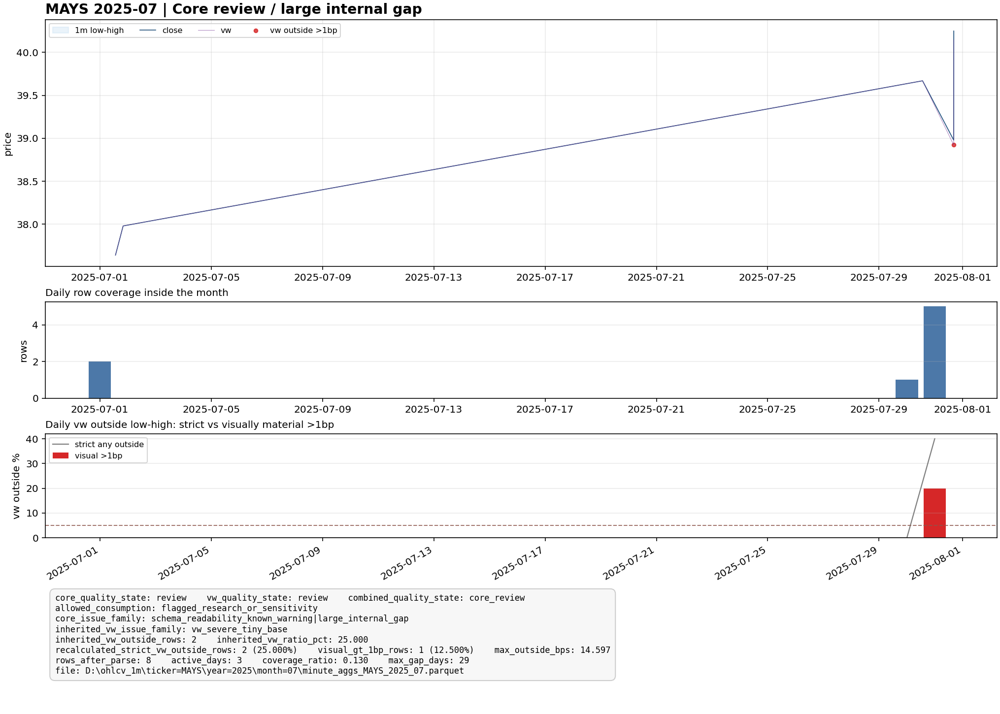

**Que muestra**

- La imagen muestra huecos temporales largos: `max_gap_days=29`. La linea puede unir extremos, pero las barras de cobertura revelan que faltan bloques enteros del mes.

**Responde**

- Responde que la razon del `core_review` es continuidad/cobertura, no necesariamente precio roto.

**No responde**

- No responde que los minutos presentes sean malos; responde que el mes no es una muestra mensual completa.

**Consecuencia**

- Consumir solo como investigacion marcada o sensibilidad; no usar como mes completo no marcado.

### 02. NEBU 2018-11

ticker: `NEBU`  
year: `2018`  
month: `11`  
core_quality_state: `review`  
vw_quality_state: `review`  
combined_quality_state: `core_review`  
allowed_consumption: `flagged_research_or_sensitivity`  
core_issue_family: `schema_readability_known_warning|coverage_sparse|large_internal_gap`  
vw_issue_family: `vw_severe_tiny_base`  
rows_after_parse: `6`  
active_days: `2`  
coverage_ratio: `0.091`  
max_gap_days: `29`  
inherited_vw_ratio_pct: `16.667`  
visual_gt_1bp_vw_ratio_pct: `0.000`  
file: `D:\ohlcv_1m\ticker=NEBU\year=2018\month=11\minute_aggs_NEBU_2018_11.parquet`

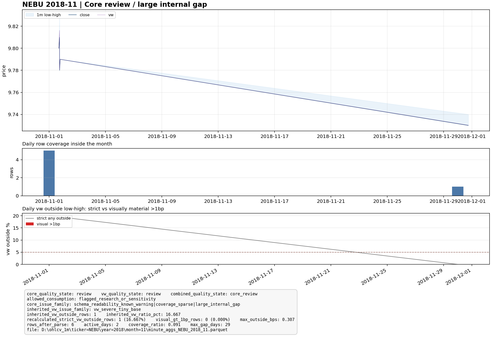

**Que muestra**

- La imagen muestra huecos temporales largos: `max_gap_days=29`. La linea puede unir extremos, pero las barras de cobertura revelan que faltan bloques enteros del mes.

**Responde**

- Responde que la razon del `core_review` es continuidad/cobertura, no necesariamente precio roto.

**No responde**

- No responde que los minutos presentes sean malos; responde que el mes no es una muestra mensual completa.

**Consecuencia**

- Consumir solo como investigacion marcada o sensibilidad; no usar como mes completo no marcado.

### 03. ASM 2012-07

ticker: `ASM`  
year: `2012`  
month: `7`  
core_quality_state: `review`  
vw_quality_state: `good`  
combined_quality_state: `core_review`  
allowed_consumption: `flagged_research_or_sensitivity`  
core_issue_family: `schema_readability_known_warning|large_internal_gap`  
vw_issue_family: `vw_not_flagged`  
rows_after_parse: `71`  
active_days: `3`  
coverage_ratio: `0.136`  
max_gap_days: `28`  
inherited_vw_ratio_pct: `nan`  
visual_gt_1bp_vw_ratio_pct: `0.000`  
file: `D:\ohlcv_1m\ticker=ASM\year=2012\month=07\minute_aggs_ASM_2012_07.parquet`

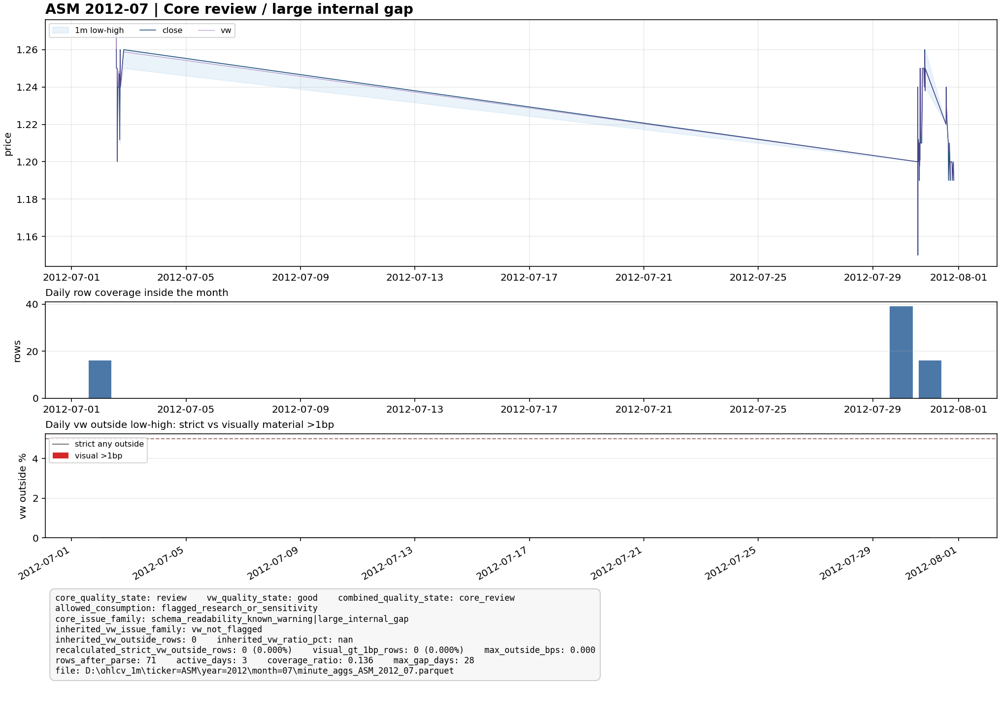

**Que muestra**

- La imagen muestra huecos temporales largos: `max_gap_days=28`. La linea puede unir extremos, pero las barras de cobertura revelan que faltan bloques enteros del mes.

**Responde**

- Responde que la razon del `core_review` es continuidad/cobertura, no necesariamente precio roto.

**No responde**

- No responde que los minutos presentes sean malos; responde que el mes no es una muestra mensual completa.

**Consecuencia**

- Consumir solo como investigacion marcada o sensibilidad; no usar como mes completo no marcado.

### 04. MBTC 2023-05

ticker: `MBTC`  
year: `2023`  
month: `5`  
core_quality_state: `review`  
vw_quality_state: `good`  
combined_quality_state: `core_review`  
allowed_consumption: `flagged_research_or_sensitivity`  
core_issue_family: `schema_readability_known_warning|coverage_sparse|large_internal_gap`  
vw_issue_family: `vw_not_flagged`  
rows_after_parse: `3`  
active_days: `2`  
coverage_ratio: `0.087`  
max_gap_days: `28`  
inherited_vw_ratio_pct: `nan`  
visual_gt_1bp_vw_ratio_pct: `0.000`  
file: `D:\ohlcv_1m\ticker=MBTC\year=2023\month=05\minute_aggs_MBTC_2023_05.parquet`

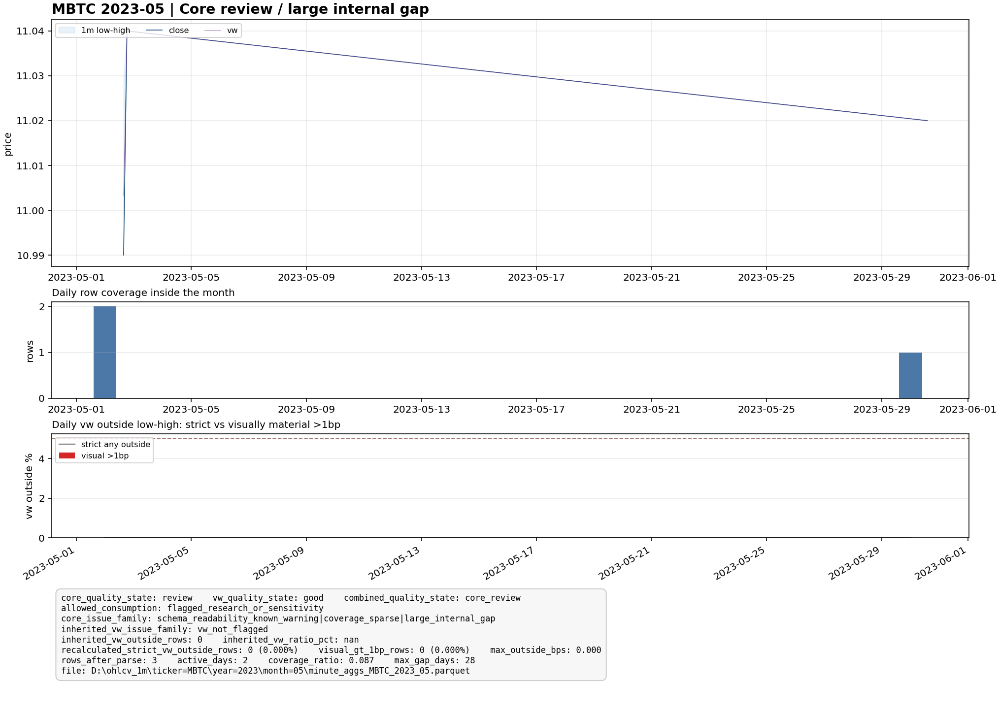

**Que muestra**

- La imagen muestra huecos temporales largos: `max_gap_days=28`. La linea puede unir extremos, pero las barras de cobertura revelan que faltan bloques enteros del mes.

**Responde**

- Responde que la razon del `core_review` es continuidad/cobertura, no necesariamente precio roto.

**No responde**

- No responde que los minutos presentes sean malos; responde que el mes no es una muestra mensual completa.

**Consecuencia**

- Consumir solo como investigacion marcada o sensibilidad; no usar como mes completo no marcado.

### 05. CNSP 2020-05

ticker: `CNSP`  
year: `2020`  
month: `5`  
core_quality_state: `review`  
vw_quality_state: `review`  
combined_quality_state: `core_review`  
allowed_consumption: `flagged_research_or_sensitivity`  
core_issue_family: `schema_readability_known_warning|large_internal_gap`  
vw_issue_family: `vw_severe_small_mass`  
rows_after_parse: `309`  
active_days: `3`  
coverage_ratio: `0.143`  
max_gap_days: `27`  
inherited_vw_ratio_pct: `21.359`  
visual_gt_1bp_vw_ratio_pct: `15.210`  
file: `D:\ohlcv_1m\ticker=CNSP\year=2020\month=05\minute_aggs_CNSP_2020_05.parquet`

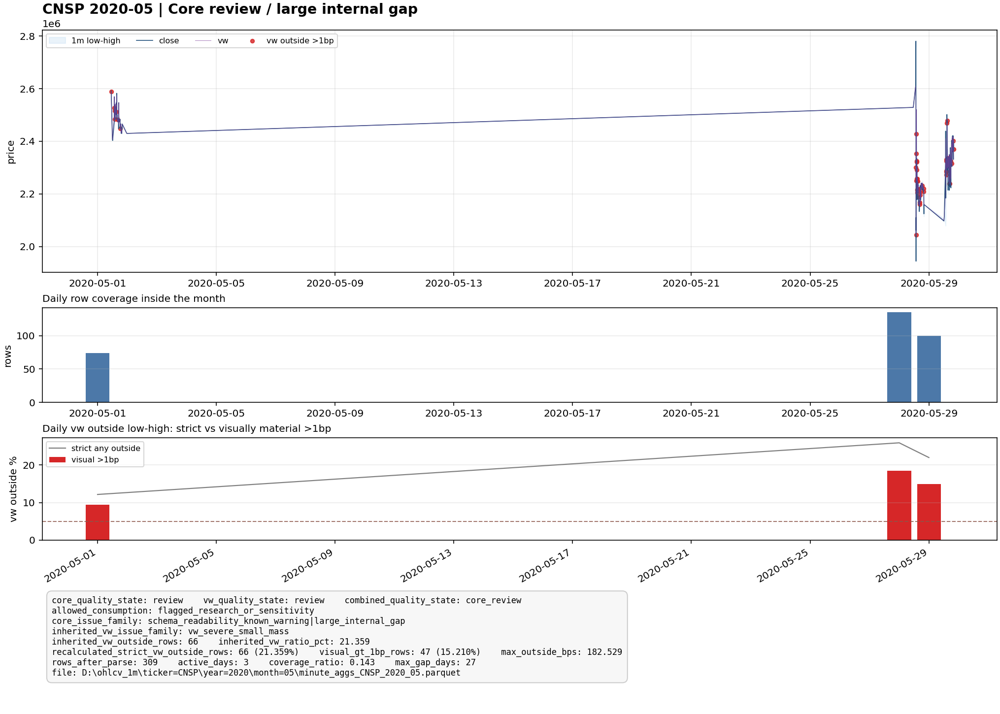

**Que muestra**

- La imagen muestra huecos temporales largos: `max_gap_days=27`. La linea puede unir extremos, pero las barras de cobertura revelan que faltan bloques enteros del mes.

**Responde**

- Responde que la razon del `core_review` es continuidad/cobertura, no necesariamente precio roto.

**No responde**

- No responde que los minutos presentes sean malos; responde que el mes no es una muestra mensual completa.

**Consecuencia**

- Consumir solo como investigacion marcada o sensibilidad; no usar como mes completo no marcado.

### 06. CLRC 2024-12

ticker: `CLRC`  
year: `2024`  
month: `12`  
core_quality_state: `review`  
vw_quality_state: `good`  
combined_quality_state: `core_review`  
allowed_consumption: `flagged_research_or_sensitivity`  
core_issue_family: `schema_readability_known_warning|coverage_sparse|large_internal_gap`  
vw_issue_family: `vw_not_flagged`  
rows_after_parse: `5`  
active_days: `2`  
coverage_ratio: `0.091`  
max_gap_days: `27`  
inherited_vw_ratio_pct: `nan`  
visual_gt_1bp_vw_ratio_pct: `0.000`  
file: `D:\ohlcv_1m\ticker=CLRC\year=2024\month=12\minute_aggs_CLRC_2024_12.parquet`

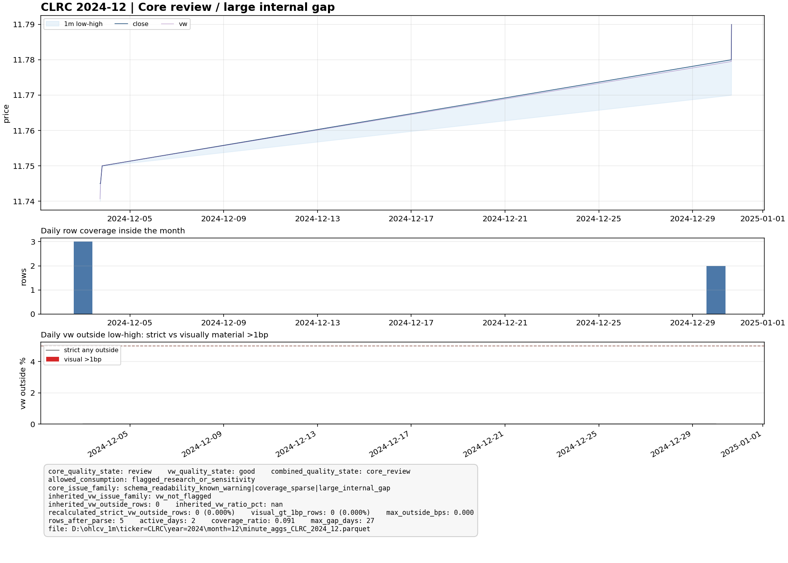

**Que muestra**

- La imagen muestra huecos temporales largos: `max_gap_days=27`. La linea puede unir extremos, pero las barras de cobertura revelan que faltan bloques enteros del mes.

**Responde**

- Responde que la razon del `core_review` es continuidad/cobertura, no necesariamente precio roto.

**No responde**

- No responde que los minutos presentes sean malos; responde que el mes no es una muestra mensual completa.

**Consecuencia**

- Consumir solo como investigacion marcada o sensibilidad; no usar como mes completo no marcado.

### 07. WRAC 2023-12

ticker: `WRAC`  
year: `2023`  
month: `12`  
core_quality_state: `review`  
vw_quality_state: `review`  
combined_quality_state: `core_review`  
allowed_consumption: `flagged_research_or_sensitivity`  
core_issue_family: `schema_readability_known_warning|coverage_sparse|large_internal_gap`  
vw_issue_family: `vw_severe_tiny_base`  
rows_after_parse: `2`  
active_days: `2`  
coverage_ratio: `0.095`  
max_gap_days: `27`  
inherited_vw_ratio_pct: `50.000`  
visual_gt_1bp_vw_ratio_pct: `50.000`  
file: `D:\ohlcv_1m\ticker=WRAC\year=2023\month=12\minute_aggs_WRAC_2023_12.parquet`

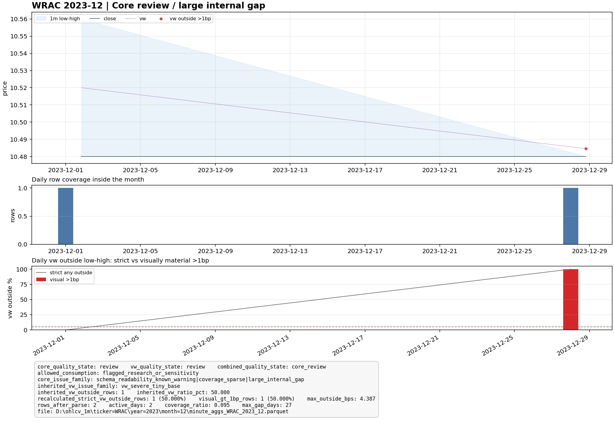

**Que muestra**

- La imagen muestra huecos temporales largos: `max_gap_days=27`. La linea puede unir extremos, pero las barras de cobertura revelan que faltan bloques enteros del mes.

**Responde**

- Responde que la razon del `core_review` es continuidad/cobertura, no necesariamente precio roto.

**No responde**

- No responde que los minutos presentes sean malos; responde que el mes no es una muestra mensual completa.

**Consecuencia**

- Consumir solo como investigacion marcada o sensibilidad; no usar como mes completo no marcado.

### 08. FTII 2024-04

ticker: `FTII`  
year: `2024`  
month: `4`  
core_quality_state: `review`  
vw_quality_state: `review`  
combined_quality_state: `core_review`  
allowed_consumption: `flagged_research_or_sensitivity`  
core_issue_family: `schema_readability_known_warning|large_internal_gap`  
vw_issue_family: `vw_severe_tiny_base`  
rows_after_parse: `8`  
active_days: `3`  
coverage_ratio: `0.136`  
max_gap_days: `26`  
inherited_vw_ratio_pct: `12.500`  
visual_gt_1bp_vw_ratio_pct: `0.000`  
file: `D:\ohlcv_1m\ticker=FTII\year=2024\month=04\minute_aggs_FTII_2024_04.parquet`

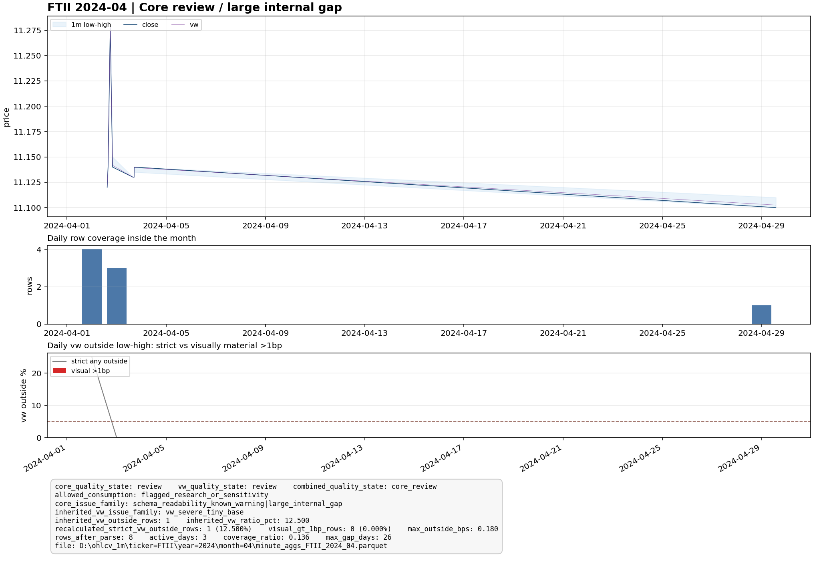

**Que muestra**

- La imagen muestra huecos temporales largos: `max_gap_days=26`. La linea puede unir extremos, pero las barras de cobertura revelan que faltan bloques enteros del mes.

**Responde**

- Responde que la razon del `core_review` es continuidad/cobertura, no necesariamente precio roto.

**No responde**

- No responde que los minutos presentes sean malos; responde que el mes no es una muestra mensual completa.

**Consecuencia**

- Consumir solo como investigacion marcada o sensibilidad; no usar como mes completo no marcado.

### 09. MTRY 2023-08

ticker: `MTRY`  
year: `2023`  
month: `8`  
core_quality_state: `review`  
vw_quality_state: `good`  
combined_quality_state: `core_review`  
allowed_consumption: `flagged_research_or_sensitivity`  
core_issue_family: `schema_readability_known_warning|large_internal_gap`  
vw_issue_family: `vw_not_flagged`  
rows_after_parse: `5`  
active_days: `4`  
coverage_ratio: `0.174`  
max_gap_days: `26`  
inherited_vw_ratio_pct: `nan`  
visual_gt_1bp_vw_ratio_pct: `0.000`  
file: `D:\ohlcv_1m\ticker=MTRY\year=2023\month=08\minute_aggs_MTRY_2023_08.parquet`

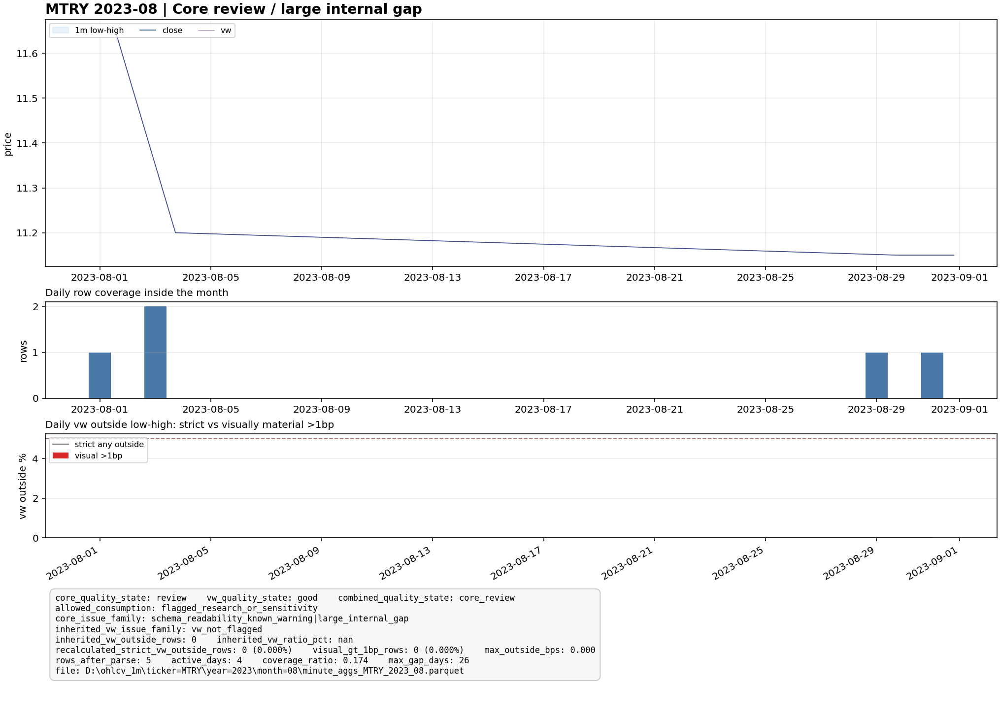

**Que muestra**

- La imagen muestra huecos temporales largos: `max_gap_days=26`. La linea puede unir extremos, pero las barras de cobertura revelan que faltan bloques enteros del mes.

**Responde**

- Responde que la razon del `core_review` es continuidad/cobertura, no necesariamente precio roto.

**No responde**

- No responde que los minutos presentes sean malos; responde que el mes no es una muestra mensual completa.

**Consecuencia**

- Consumir solo como investigacion marcada o sensibilidad; no usar como mes completo no marcado.

### 10. KOR 2018-08

ticker: `KOR`  
year: `2018`  
month: `8`  
core_quality_state: `review`  
vw_quality_state: `good`  
combined_quality_state: `core_review`  
allowed_consumption: `flagged_research_or_sensitivity`  
core_issue_family: `schema_readability_known_warning|coverage_sparse|large_internal_gap`  
vw_issue_family: `vw_not_flagged`  
rows_after_parse: `3`  
active_days: `2`  
coverage_ratio: `0.087`  
max_gap_days: `26`  
inherited_vw_ratio_pct: `nan`  
visual_gt_1bp_vw_ratio_pct: `0.000`  
file: `D:\ohlcv_1m\ticker=KOR\year=2018\month=08\minute_aggs_KOR_2018_08.parquet`

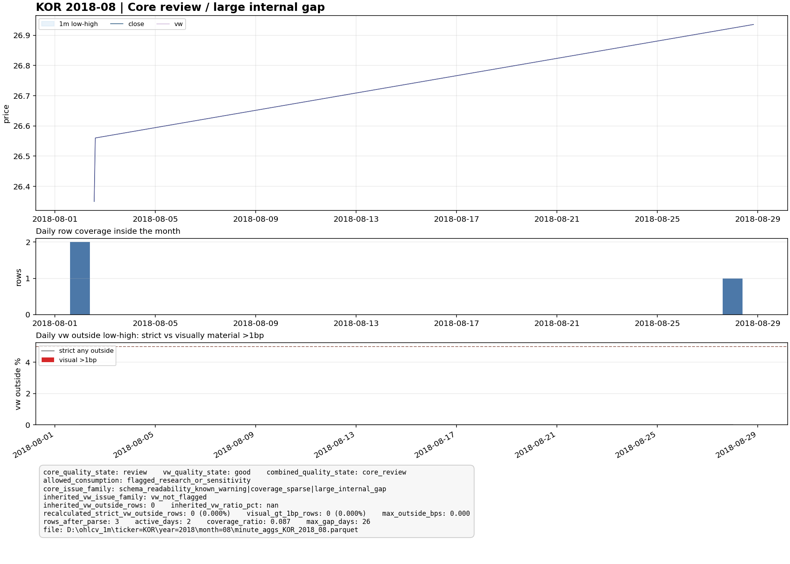

**Que muestra**

- La imagen muestra huecos temporales largos: `max_gap_days=26`. La linea puede unir extremos, pero las barras de cobertura revelan que faltan bloques enteros del mes.

**Responde**

- Responde que la razon del `core_review` es continuidad/cobertura, no necesariamente precio roto.

**No responde**

- No responde que los minutos presentes sean malos; responde que el mes no es una muestra mensual completa.

**Consecuencia**

- Consumir solo como investigacion marcada o sensibilidad; no usar como mes completo no marcado.

## Core review / sparse coverage

Esta seccion muestra meses con pocos dias activos. Algunos tienen mucha actividad intradia dentro de esos pocos dias, pero el mes completo es demasiado parcial para presentarlo como cobertura mensual limpia.

### 01. BBBY 2023-05

ticker: `BBBY`  
year: `2023`  
month: `5`  
core_quality_state: `review`  
vw_quality_state: `review`  
combined_quality_state: `core_review`  
allowed_consumption: `flagged_research_or_sensitivity`  
core_issue_family: `schema_readability_known_warning|coverage_sparse`  
vw_issue_family: `vw_moderate_ratio`  
rows_after_parse: `1,885`  
active_days: `2`  
coverage_ratio: `0.087`  
max_gap_days: `1`  
inherited_vw_ratio_pct: `1.061`  
visual_gt_1bp_vw_ratio_pct: `1.061`  
file: `D:\ohlcv_1m\ticker=BBBY\year=2023\month=05\minute_aggs_BBBY_2023_05.parquet`

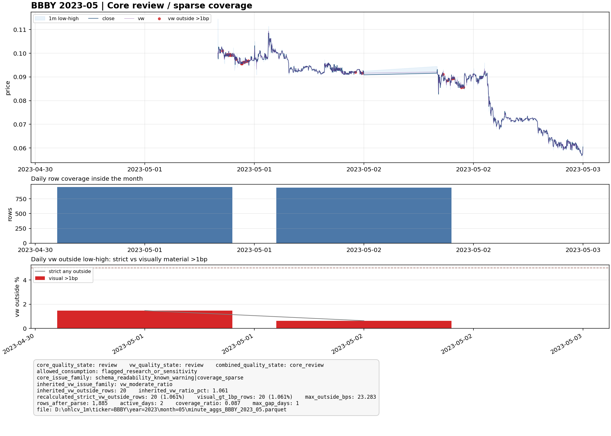

**Que muestra**

- La imagen muestra actividad concentrada en aproximadamente `2` dias. Dentro de esos dias puede haber muchas filas, pero el mes completo queda demasiado parcial.

**Responde**

- Responde que sparse coverage es una frontera distinta de calidad de precio: el problema es representatividad mensual.

**No responde**

- No responde que la accion no haya operado fuera de esos dias; solo muestra que este parquet no cubre lo bastante para consumo mensual limpio.

**Consecuencia**

- Mantener en `flagged_research_or_sensitivity`; no usar para entrenamiento o backtest que asuma cobertura mensual plena.

### 02. SDC 2023-10

ticker: `SDC`  
year: `2023`  
month: `10`  
core_quality_state: `review`  
vw_quality_state: `review`  
combined_quality_state: `core_review`  
allowed_consumption: `flagged_research_or_sensitivity`  
core_issue_family: `schema_readability_known_warning|coverage_sparse`  
vw_issue_family: `vw_moderate_ratio`  
rows_after_parse: `1,782`  
active_days: `2`  
coverage_ratio: `0.091`  
max_gap_days: `1`  
inherited_vw_ratio_pct: `2.132`  
visual_gt_1bp_vw_ratio_pct: `2.132`  
file: `D:\ohlcv_1m\ticker=SDC\year=2023\month=10\minute_aggs_SDC_2023_10.parquet`

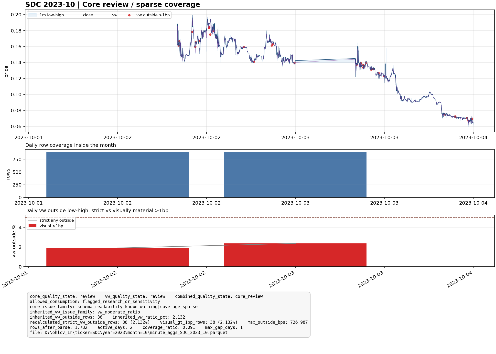

**Que muestra**

- La imagen muestra actividad concentrada en aproximadamente `2` dias. Dentro de esos dias puede haber muchas filas, pero el mes completo queda demasiado parcial.

**Responde**

- Responde que sparse coverage es una frontera distinta de calidad de precio: el problema es representatividad mensual.

**No responde**

- No responde que la accion no haya operado fuera de esos dias; solo muestra que este parquet no cubre lo bastante para consumo mensual limpio.

**Consecuencia**

- Mantener en `flagged_research_or_sensitivity`; no usar para entrenamiento o backtest que asuma cobertura mensual plena.

### 03. CSSE 2024-07

ticker: `CSSE`  
year: `2024`  
month: `7`  
core_quality_state: `review`  
vw_quality_state: `review`  
combined_quality_state: `core_review`  
allowed_consumption: `flagged_research_or_sensitivity`  
core_issue_family: `schema_readability_known_warning|coverage_sparse`  
vw_issue_family: `vw_moderate_ratio`  
rows_after_parse: `1,347`  
active_days: `2`  
coverage_ratio: `0.087`  
max_gap_days: `1`  
inherited_vw_ratio_pct: `1.930`  
visual_gt_1bp_vw_ratio_pct: `1.930`  
file: `D:\ohlcv_1m\ticker=CSSE\year=2024\month=07\minute_aggs_CSSE_2024_07.parquet`

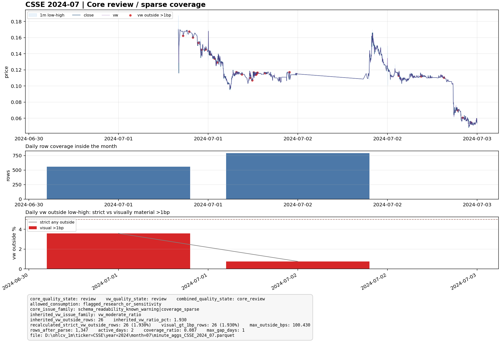

**Que muestra**

- La imagen muestra actividad concentrada en aproximadamente `2` dias. Dentro de esos dias puede haber muchas filas, pero el mes completo queda demasiado parcial.

**Responde**

- Responde que sparse coverage es una frontera distinta de calidad de precio: el problema es representatividad mensual.

**No responde**

- No responde que la accion no haya operado fuera de esos dias; solo muestra que este parquet no cubre lo bastante para consumo mensual limpio.

**Consecuencia**

- Mantener en `flagged_research_or_sensitivity`; no usar para entrenamiento o backtest que asuma cobertura mensual plena.

### 04. RMO 2020-12

ticker: `RMO`  
year: `2020`  
month: `12`  
core_quality_state: `review`  
vw_quality_state: `bad`  
combined_quality_state: `core_review_vw_bad`  
allowed_consumption: `flagged_research_or_sensitivity`  
core_issue_family: `schema_readability_known_warning|coverage_sparse`  
vw_issue_family: `vw_severe_large_mass_persistent`  
rows_after_parse: `1,326`  
active_days: `2`  
coverage_ratio: `0.087`  
max_gap_days: `1`  
inherited_vw_ratio_pct: `12.594`  
visual_gt_1bp_vw_ratio_pct: `7.089`  
file: `D:\ohlcv_1m\ticker=RMO\year=2020\month=12\minute_aggs_RMO_2020_12.parquet`

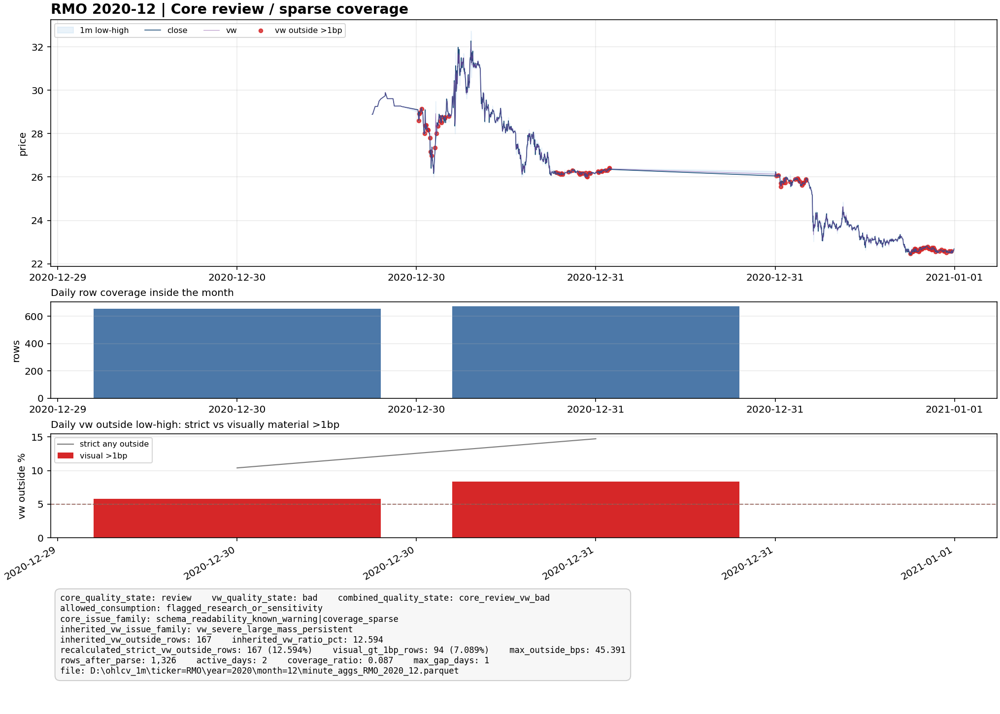

**Que muestra**

- La imagen muestra actividad concentrada en aproximadamente `2` dias. Dentro de esos dias puede haber muchas filas, pero el mes completo queda demasiado parcial.

**Responde**

- Responde que sparse coverage es una frontera distinta de calidad de precio: el problema es representatividad mensual.

**No responde**

- No responde que la accion no haya operado fuera de esos dias; solo muestra que este parquet no cubre lo bastante para consumo mensual limpio.

**Consecuencia**

- Mantener en `flagged_research_or_sensitivity`; no usar para entrenamiento o backtest que asuma cobertura mensual plena.

### 05. PHAS 2022-11

ticker: `PHAS`  
year: `2022`  
month: `11`  
core_quality_state: `review`  
vw_quality_state: `review`  
combined_quality_state: `core_review`  
allowed_consumption: `flagged_research_or_sensitivity`  
core_issue_family: `schema_readability_known_warning|coverage_sparse`  
vw_issue_family: `vw_moderate_ratio`  
rows_after_parse: `1,252`  
active_days: `2`  
coverage_ratio: `0.091`  
max_gap_days: `1`  
inherited_vw_ratio_pct: `1.518`  
visual_gt_1bp_vw_ratio_pct: `1.518`  
file: `D:\ohlcv_1m\ticker=PHAS\year=2022\month=11\minute_aggs_PHAS_2022_11.parquet`

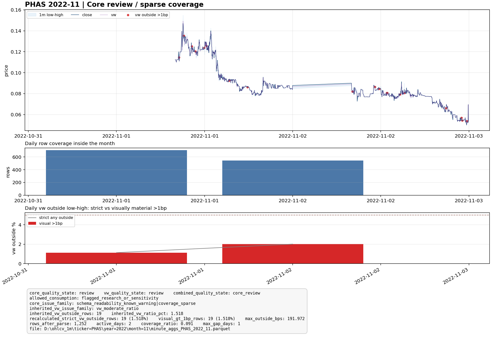

**Que muestra**

- La imagen muestra actividad concentrada en aproximadamente `2` dias. Dentro de esos dias puede haber muchas filas, pero el mes completo queda demasiado parcial.

**Responde**

- Responde que sparse coverage es una frontera distinta de calidad de precio: el problema es representatividad mensual.

**No responde**

- No responde que la accion no haya operado fuera de esos dias; solo muestra que este parquet no cubre lo bastante para consumo mensual limpio.

**Consecuencia**

- Mantener en `flagged_research_or_sensitivity`; no usar para entrenamiento o backtest que asuma cobertura mensual plena.

### 06. CDAK 2023-04

ticker: `CDAK`  
year: `2023`  
month: `4`  
core_quality_state: `review`  
vw_quality_state: `review`  
combined_quality_state: `core_review`  
allowed_consumption: `flagged_research_or_sensitivity`  
core_issue_family: `schema_readability_known_warning|coverage_sparse`  
vw_issue_family: `vw_moderate_ratio`  
rows_after_parse: `1,227`  
active_days: `2`  
coverage_ratio: `0.100`  
max_gap_days: `1`  
inherited_vw_ratio_pct: `3.586`  
visual_gt_1bp_vw_ratio_pct: `3.586`  
file: `D:\ohlcv_1m\ticker=CDAK\year=2023\month=04\minute_aggs_CDAK_2023_04.parquet`

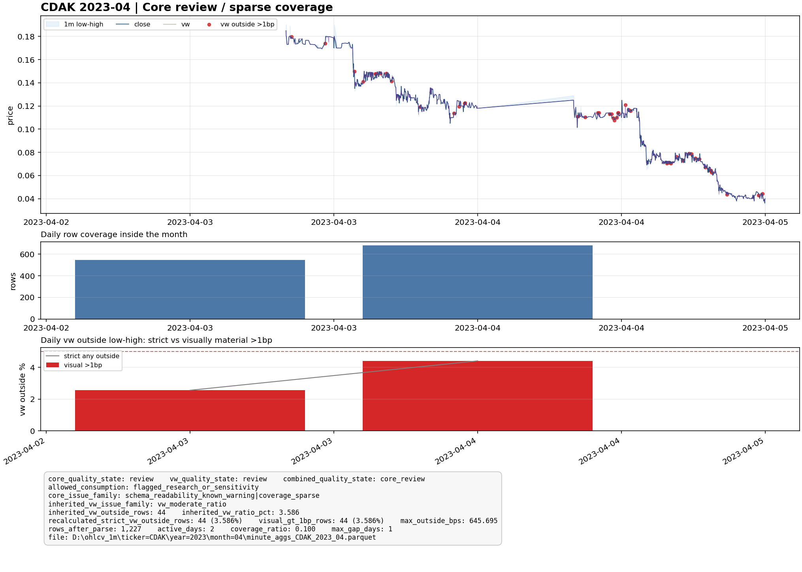

**Que muestra**

- La imagen muestra actividad concentrada en aproximadamente `2` dias. Dentro de esos dias puede haber muchas filas, pero el mes completo queda demasiado parcial.

**Responde**

- Responde que sparse coverage es una frontera distinta de calidad de precio: el problema es representatividad mensual.

**No responde**

- No responde que la accion no haya operado fuera de esos dias; solo muestra que este parquet no cubre lo bastante para consumo mensual limpio.

**Consecuencia**

- Mantener en `flagged_research_or_sensitivity`; no usar para entrenamiento o backtest que asuma cobertura mensual plena.

### 07. NOGN 2022-08

ticker: `NOGN`  
year: `2022`  
month: `8`  
core_quality_state: `review`  
vw_quality_state: `bad`  
combined_quality_state: `core_review_vw_bad`  
allowed_consumption: `flagged_research_or_sensitivity`  
core_issue_family: `schema_readability_known_warning|coverage_sparse`  
vw_issue_family: `vw_severe_large_mass_persistent`  
rows_after_parse: `1,180`  
active_days: `2`  
coverage_ratio: `0.087`  
max_gap_days: `1`  
inherited_vw_ratio_pct: `19.237`  
visual_gt_1bp_vw_ratio_pct: `15.085`  
file: `D:\ohlcv_1m\ticker=NOGN\year=2022\month=08\minute_aggs_NOGN_2022_08.parquet`

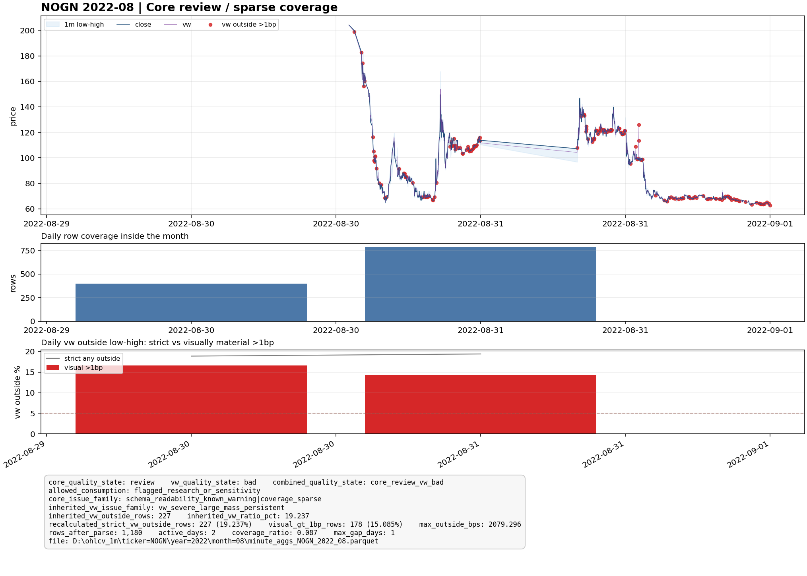

**Que muestra**

- La imagen muestra actividad concentrada en aproximadamente `2` dias. Dentro de esos dias puede haber muchas filas, pero el mes completo queda demasiado parcial.

**Responde**

- Responde que sparse coverage es una frontera distinta de calidad de precio: el problema es representatividad mensual.

**No responde**

- No responde que la accion no haya operado fuera de esos dias; solo muestra que este parquet no cubre lo bastante para consumo mensual limpio.

**Consecuencia**

- Mantener en `flagged_research_or_sensitivity`; no usar para entrenamiento o backtest que asuma cobertura mensual plena.

### 08. DNMR 2020-12

ticker: `DNMR`  
year: `2020`  
month: `12`  
core_quality_state: `review`  
vw_quality_state: `review`  
combined_quality_state: `core_review`  
allowed_consumption: `flagged_research_or_sensitivity`  
core_issue_family: `schema_readability_known_warning|coverage_sparse`  
vw_issue_family: `vw_severe_small_mass`  
rows_after_parse: `1,052`  
active_days: `2`  
coverage_ratio: `0.087`  
max_gap_days: `1`  
inherited_vw_ratio_pct: `7.129`  
visual_gt_1bp_vw_ratio_pct: `4.753`  
file: `D:\ohlcv_1m\ticker=DNMR\year=2020\month=12\minute_aggs_DNMR_2020_12.parquet`

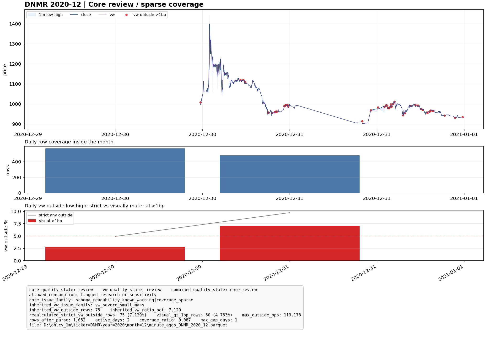

**Que muestra**

- La imagen muestra actividad concentrada en aproximadamente `2` dias. Dentro de esos dias puede haber muchas filas, pero el mes completo queda demasiado parcial.

**Responde**

- Responde que sparse coverage es una frontera distinta de calidad de precio: el problema es representatividad mensual.

**No responde**

- No responde que la accion no haya operado fuera de esos dias; solo muestra que este parquet no cubre lo bastante para consumo mensual limpio.

**Consecuencia**

- Mantener en `flagged_research_or_sensitivity`; no usar para entrenamiento o backtest que asuma cobertura mensual plena.

### 09. CRON 2018-02

ticker: `CRON`  
year: `2018`  
month: `2`  
core_quality_state: `review`  
vw_quality_state: `review`  
combined_quality_state: `core_review`  
allowed_consumption: `flagged_research_or_sensitivity`  
core_issue_family: `schema_readability_known_warning|coverage_sparse`  
vw_issue_family: `vw_severe_small_mass`  
rows_after_parse: `1,000`  
active_days: `2`  
coverage_ratio: `0.100`  
max_gap_days: `1`  
inherited_vw_ratio_pct: `6.600`  
visual_gt_1bp_vw_ratio_pct: `4.000`  
file: `D:\ohlcv_1m\ticker=CRON\year=2018\month=02\minute_aggs_CRON_2018_02.parquet`

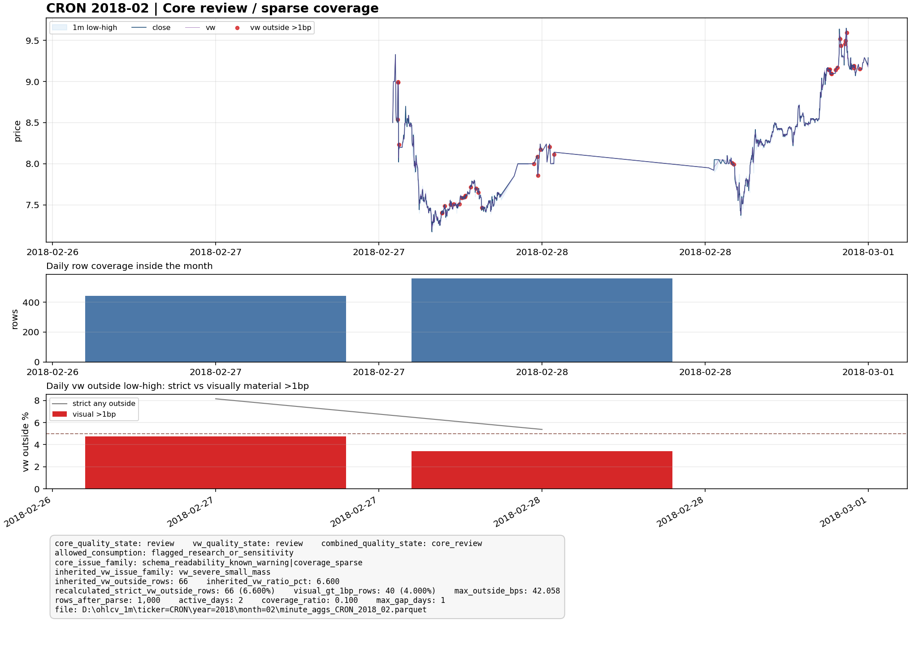

**Que muestra**

- La imagen muestra actividad concentrada en aproximadamente `2` dias. Dentro de esos dias puede haber muchas filas, pero el mes completo queda demasiado parcial.

**Responde**

- Responde que sparse coverage es una frontera distinta de calidad de precio: el problema es representatividad mensual.

**No responde**

- No responde que la accion no haya operado fuera de esos dias; solo muestra que este parquet no cubre lo bastante para consumo mensual limpio.

**Consecuencia**

- Mantener en `flagged_research_or_sensitivity`; no usar para entrenamiento o backtest que asuma cobertura mensual plena.

### 10. IVP 2023-08

ticker: `IVP`  
year: `2023`  
month: `8`  
core_quality_state: `review`  
vw_quality_state: `bad`  
combined_quality_state: `core_review_vw_bad`  
allowed_consumption: `flagged_research_or_sensitivity`  
core_issue_family: `schema_readability_known_warning|coverage_sparse`  
vw_issue_family: `vw_severe_large_mass_persistent`  
rows_after_parse: `979`  
active_days: `2`  
coverage_ratio: `0.087`  
max_gap_days: `1`  
inherited_vw_ratio_pct: `21.450`  
visual_gt_1bp_vw_ratio_pct: `17.875`  
file: `D:\ohlcv_1m\ticker=IVP\year=2023\month=08\minute_aggs_IVP_2023_08.parquet`

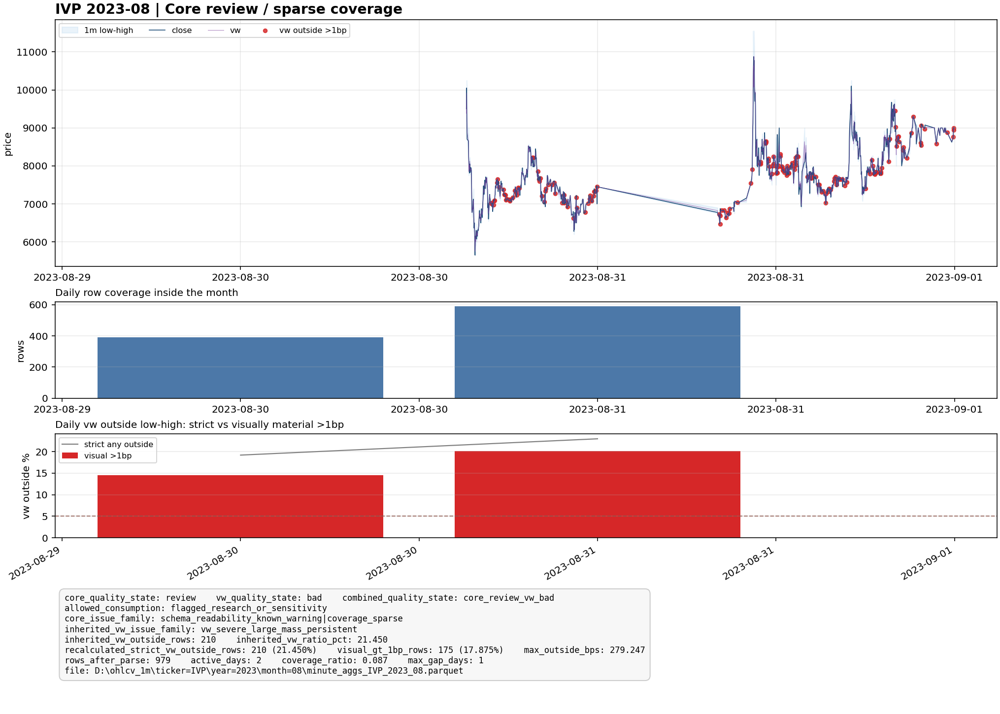

**Que muestra**

- La imagen muestra actividad concentrada en aproximadamente `2` dias. Dentro de esos dias puede haber muchas filas, pero el mes completo queda demasiado parcial.

**Responde**

- Responde que sparse coverage es una frontera distinta de calidad de precio: el problema es representatividad mensual.

**No responde**

- No responde que la accion no haya operado fuera de esos dias; solo muestra que este parquet no cubre lo bastante para consumo mensual limpio.

**Consecuencia**

- Mantener en `flagged_research_or_sensitivity`; no usar para entrenamiento o backtest que asuma cobertura mensual plena.
