# Quotes Bad Cases v0.1

Este documento consolida los casos `bad` de `quotes` usando packs visuales completos. Cada caso presenta la ventana raw del crossed positivo, el contexto de sesion completa, diagnosticos estructurales y, cuando existe, la imagen historica de certificacion.

Total cases: `15`

## Menu

1. [SGC 2013-11-04](#sgc-2013-11-04)
2. [SELF 2016-06-28](#self-2016-06-28)
3. [UFAB 2023-03-09](#ufab-2023-03-09)
4. [DGLY 2011-10-06](#dgly-2011-10-06)
5. [QRHC 2020-10-28](#qrhc-2020-10-28)
6. [PPHM 2007-10-08](#pphm-2007-10-08)
7. [TAT 2009-12-30](#tat-2009-12-30)
8. [UXG 2007-03-01](#uxg-2007-03-01)
9. [MSW 2005-07-27](#msw-2005-07-27)
10. [HGSH 2013-04-26](#hgsh-2013-04-26)
11. [BBW 2005-10-26](#bbw-2005-10-26)
12. [MMA 2006-08-11](#mma-2006-08-11)
13. [PLL 2006-04-28](#pll-2006-04-28)
14. [EAC 2005-06-27](#eac-2005-06-27)
15. [SSN 2017-01-04](#ssn-2017-01-04)

## Cases

### 1. SGC 2013-11-04

company_name: `Superior Group of Companies, Inc. Common Stock`
primary_exchange: `NASDAQ` (`XNAS`)
market_locale: `stocks/us`
scope: `bad`
ticker: `SGC`
date: `2013-11-04`
taxonomy: `high_hard_crossed_10_to_20`
positive_cross_bucket: `positive_cross_severe_ge25bps`
severity: `HARD_FAIL`
root: `D`
rows: `149`
crossed_ratio_pct: `14.765101`
crossed_rows_raw: `22`
crossed_rows_ask_zero: `17`
crossed_rows_ask_positive: `5`
ask_integer_pct: `18.791946`
median_bps_ask_positive: `217.606330`
p90_bps_ask_positive: `217.606330`
file: `D:\quotes\SGC\year=2013\month=11\day=04\quotes.parquet`

#### Analisis Forense
La conclusion correcta del caso es que la contradiccion local entre bid y ask ya compromete la credibilidad economica del libro y bloquea su consumo como si fuera mercado normal. La taxonomy historica es `high_hard_crossed_10_to_20` y el regimen positivo dominante es `severe >=25 bps`. Esto importa porque la taxonomy no solo clasifica: resume que tipo de anomalia se esta viendo y que clase de decision contractual puede defenderse despues. La taxonomy `high_hard_crossed_10_to_20` implica una franja donde la contradiccion ya no es una simple sospecha: el dano positivo del crossed entra en una zona donde ejecucion, mark-to-market y aprendizaje pueden dejar de ser creibles. El regimen `severe >=25 bps` empuja el caso a una lectura economicamente dura: el crossed deja de ser cosmetico y pasa a cuestionar si el libro sigue siendo interpretable como mercado negociable. En terminos observables, el file tiene `crossed_ratio_pct=14.765101` con `crossed_rows_ask_positive=5` y `crossed_rows_ask_zero=17`. La severidad economica del crossed ask>0 se resume en `median_bps_ask_positive=217.606330` y `p90_bps_ask_positive=217.606330`. Estos dos numeros convierten una forma visual rara en una conclusion operativa sobre si el libro sigue representando o no un mercado negociable. La decision que cambia es exclusion del consumo core del libro. `bad` significa que el estado local ya no puede alimentar ejecucion, mark-to-market intradiario ni aprendizaje de ML como si fuese microestructura defendible. El error que evita es construir decisiones sobre un libro que ha dejado de representar un mercado localmente creible. El patron estructural muestra `ask_integer_pct=18.791946`. Este numero obliga a separar dos explicaciones rivales: contradiccion economica genuina del libro o mezcla con degeneracion estructural / integerizacion. La mayor parte del crossed vive en `ask=0`, pero existe una cola `ask>0` que impide absolver el caso como simple glitch. La lectura correcta es mixta: dano estructural dominante con residuo economico que aun puede justificar bandera o exclusion. Como `ask_integer_pct` no es extremo, el caso exige leer geometria del crossed y estructura simultaneamente. No basta un solo numero; hay que combinar severidad, composicion y contexto. En la capa de semantica de precio del evento aparecen `daily raw close=7.7100`, `quote mid raw=15.2475`, `quote mid split_normalized=7.6238`, `daily adjusted_proxy=3.6701`. La reconciliacion incluye `future_split_factor=2.0000`. Ademas hay `post_event_dividend_sum=5.7350`. La implicacion metodologica es crucial: una discrepancia entre `quotes`, `daily` y una plataforma externa no puede leerse automaticamente como fallo del dataset. Puede ser semantica de precio distinta. El error que evita esta capa es mezclar raw, split-normalized y adjusted dentro del mismo pipeline, rompiendo auditoria, benchmarking y labels. Para pipelines, esto implica exclusion de ejecucion realista, de mark-to-market intradiario defendible y de features microestructurales tratadas como si reflejaran un mercado normal. Solo debe sobrevivir en circuitos forenses o de calidad. Existe ademas una imagen historica de certificacion asociada. Su papel es poner el episodio en un marco causal mas amplio: halt, explained, not strongly explained o patron conocido. La regla que protege al proyecto es esta: el contexto externo se usa para explicar por que aparece el episodio, no para absolverlo. El error que evita es degradar el criterio de calidad del libro porque exista una historia plausible alrededor del caso.

#### 00 Event Month Context
Esta imagen responde a la pregunta de persistencia temporal: estamos ante un accidente local o ante una fase mas amplia de inestabilidad. Arriba coloca el evento en la serie `daily` real del mes; abajo compara `crossed_ratio_pct` y `max_gap_bps_pos` del dia contra sus vecinos. La decision que cambia es el peso estructural que se le concede al caso. El error que evita es juzgar igual un shock aislado y una degradacion repetida del libro.

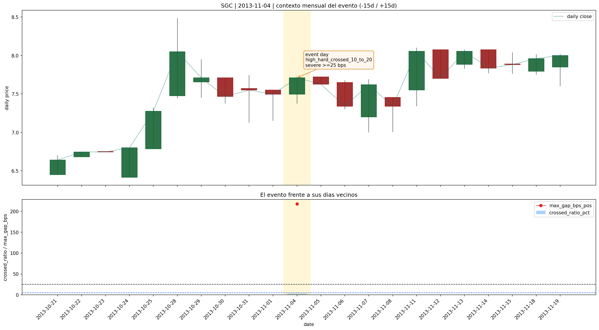

#### 00a Adjusted Proxy Contrast
Esta imagen responde a la pregunta de reconciliacion semantica: la discrepancia de precios viene de datos rotos o de vistas de precio distintas. Compara `daily raw`, `daily adjusted_proxy`, `quote mid raw` y `quote mid split_normalized`, y debajo ensena la cadena de dividendos y splits que produce la diferencia. La decision que cambia es si el inspector debe abrir una incidencia de calidad o cerrar el caso como diferencia legitima de semantica. El error que evita es mezclar series raw y adjusted como si fueran equivalentes. En pipelines reales, esto protege benchmarking, labels diarios y reconciliacion externa frente a falsas alarmas de precio.

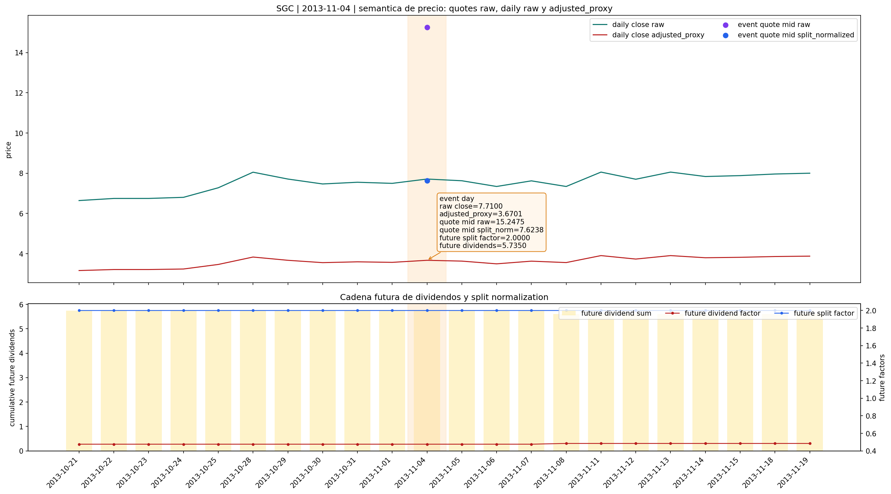

#### 00b Event Month Quotes Context
Esta imagen responde a la pregunta de recurrencia mensual dentro de `quotes`: el problema se concentra en el evento o reaparece en varias sesiones. Arriba concatena sesiones con datos disponibles; abajo resume cobertura diaria, `crossed_ratio_pct` y `max_gap_bps_pos`. La decision que cambia es si el caso debe leerse como episodio puntual o como sintoma de una fase repetida de libro degradado. El error que evita es extrapolar desde un unico dia a todo el mes sin evidencia.

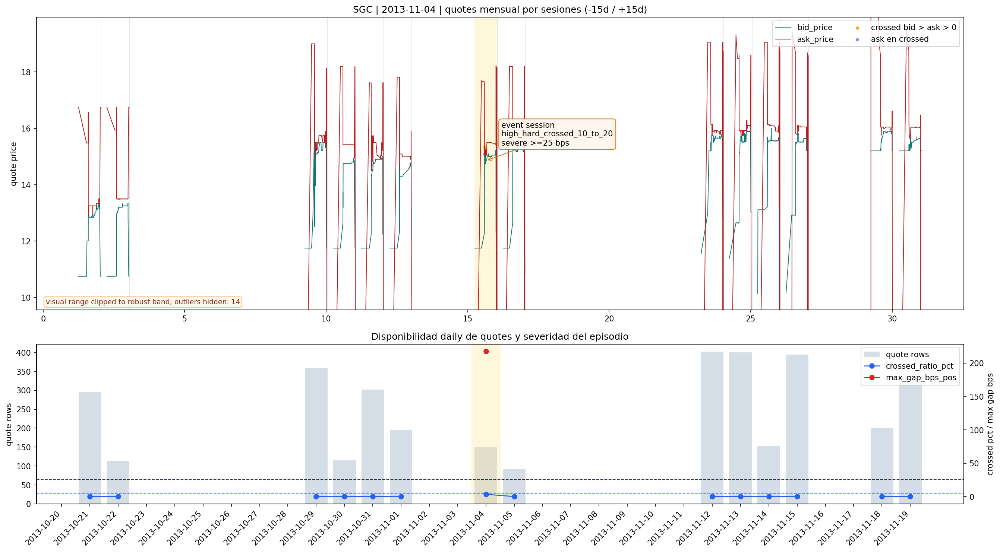

#### 01 Raw Window
Esta imagen responde a la primera pregunta decisiva del caso: el crossed observado es economicamente bastante fuerte para justificar un cambio de clase. Arriba ensena la geometria exacta del tramo conflictivo; abajo convierte esa geometria a bps y la enfrenta a los cortes `5 bps` y `25 bps`. El regimen dominante es `severe >=25 bps`. La decision que cambia es pasar de anomalia interpretable a `review` o `bad`. El error que evita es decidir por apariencia visual sin medir el dano economico real del crossed. En terminos de pipeline, este panel decide si el problema afecta solo a la lectura forense o si invalida simulacion de ejecucion y microstructure features.

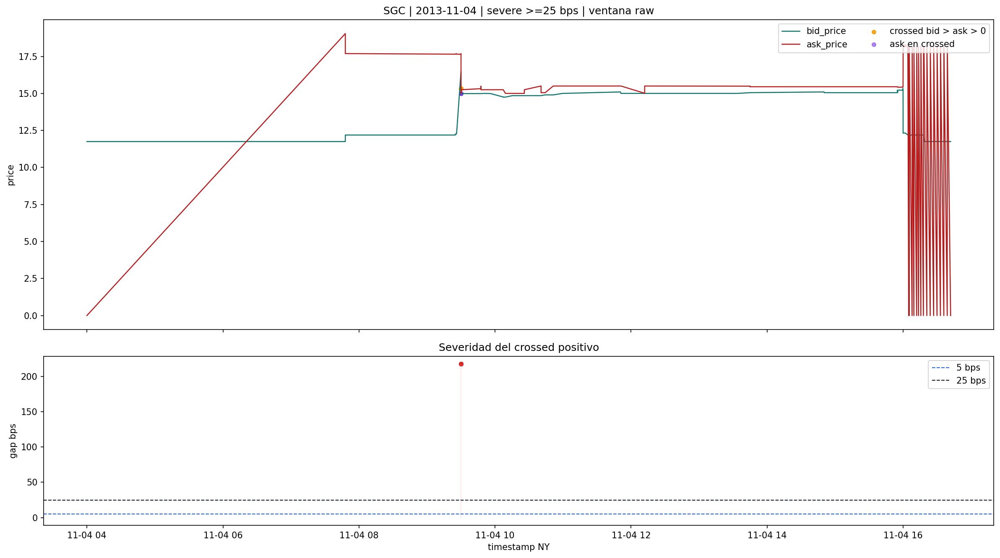

#### 02 Full Session Context
Esta imagen responde a la pregunta de extension intradiaria: el dano esta confinado a un bloque corto o contamina la sesion completa. Arriba se ve toda la sesion `04:00-20:00 NY`; abajo el `gap_bps` firmado. La decision que cambia es si el consumo debe penalizar solo un tramo o desechar el dia entero para uso operativo. El error que evita es tratar una cicatriz local como ruina total o, al reves, minimizar una degradacion distribuida a lo largo del dia. En ejecucion esto decide si la sesion puede seguir usandose con restricciones; en ML decide si las features intradiarias conservan significado economico.

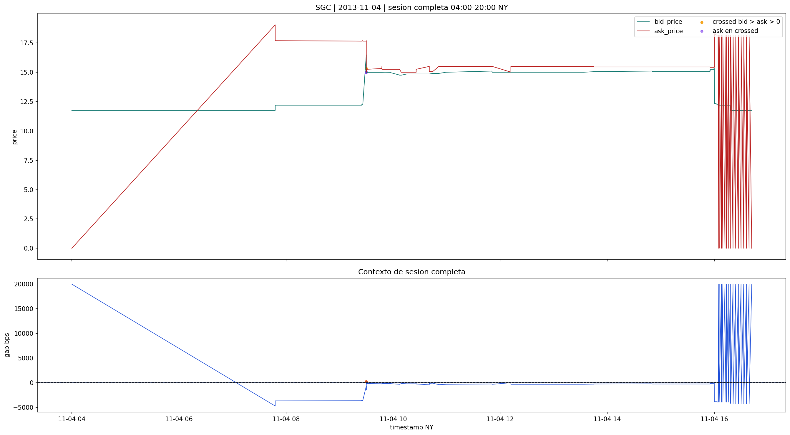

#### 03 Structure Diagnostics
Este panel responde a la pregunta de naturaleza del fallo: contradiccion economica genuina o mezcla con degeneracion estructural. Separa `ask=0` de `ask>0`, muestra la distribucion de `gap_bps` y resume patrones de integerizacion. La decision que cambia es como interpretar el dano: mercado localmente roto, artefacto de representacion o combinacion de ambos. El error que evita es sobrediagnosticar crossed reales cuando parte de la senal proviene de estructura degenerada del libro. Esta lectura afecta directamente a que el caso vaya a exclusion dura, a bandera contextual o a simple reconciliacion tecnica.

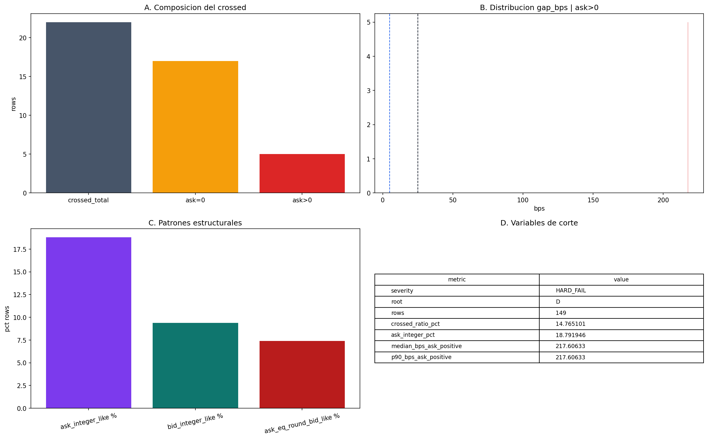

#### 04 Summary Card
Esta tarjeta responde a la pregunta de auditabilidad: cuales son exactamente las variables que sostienen la conclusion. Reune `severity`, `root`, `crossed_ratio_pct`, `ask_integer_pct`, `median_bps_ask_positive` y `p90_bps_ask_positive`. La decision que cambia es pasar de impresion visual a regla verificable. El error que evita es que dos inspectores lleguen a conclusiones distintas mirando la misma imagen sin una base numerica comun. Para gobernanza del proyecto, este panel es el que vuelve reproducible la decision para backtest, ML y auditoria.

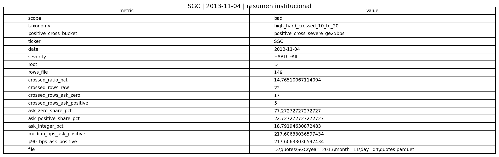

#### 05 Historical Context
Esta imagen responde a la pregunta causal externa: existe un framing historico que ayude a entender por que ocurre el episodio. Puede aportar halt context, explained o not strongly explained. La decision que cambia es cuanto peso se concede al contexto en la narrativa final. El error que evita es doble: ignorar una explicacion real o usarla como excusa para absolver un libro que localmente sigue siendo problematico.

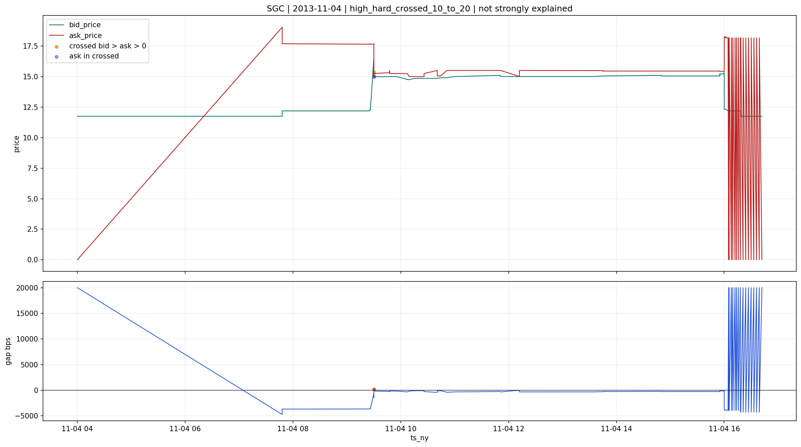

---

### 2. SELF 2016-06-28

company_name: `Global Self Storage, Inc. Common Stock`
primary_exchange: `NASDAQ` (`XNAS`)
market_locale: `stocks/us`
scope: `bad`
ticker: `SELF`
date: `2016-06-28`
taxonomy: `high_hard_crossed_10_to_20`
positive_cross_bucket: `positive_cross_severe_ge25bps`
severity: `HARD_FAIL`
root: `C`
rows: `187`
crossed_ratio_pct: `16.577540`
crossed_rows_raw: `31`
crossed_rows_ask_zero: `28`
crossed_rows_ask_positive: `3`
ask_integer_pct: `14.973262`
median_bps_ask_positive: `36.630037`
p90_bps_ask_positive: `36.630037`
file: `C:\TSIS_Data\data\quotes\SELF\year=2016\month=06\day=28\quotes.parquet`

#### Analisis Forense
La conclusion correcta del caso es que la contradiccion local entre bid y ask ya compromete la credibilidad economica del libro y bloquea su consumo como si fuera mercado normal. La taxonomy historica es `high_hard_crossed_10_to_20` y el regimen positivo dominante es `severe >=25 bps`. Esto importa porque la taxonomy no solo clasifica: resume que tipo de anomalia se esta viendo y que clase de decision contractual puede defenderse despues. La taxonomy `high_hard_crossed_10_to_20` implica una franja donde la contradiccion ya no es una simple sospecha: el dano positivo del crossed entra en una zona donde ejecucion, mark-to-market y aprendizaje pueden dejar de ser creibles. El regimen `severe >=25 bps` empuja el caso a una lectura economicamente dura: el crossed deja de ser cosmetico y pasa a cuestionar si el libro sigue siendo interpretable como mercado negociable. En terminos observables, el file tiene `crossed_ratio_pct=16.577540` con `crossed_rows_ask_positive=3` y `crossed_rows_ask_zero=28`. La severidad economica del crossed ask>0 se resume en `median_bps_ask_positive=36.630037` y `p90_bps_ask_positive=36.630037`. Estos dos numeros convierten una forma visual rara en una conclusion operativa sobre si el libro sigue representando o no un mercado negociable. La decision que cambia es exclusion del consumo core del libro. `bad` significa que el estado local ya no puede alimentar ejecucion, mark-to-market intradiario ni aprendizaje de ML como si fuese microestructura defendible. El error que evita es construir decisiones sobre un libro que ha dejado de representar un mercado localmente creible. El patron estructural muestra `ask_integer_pct=14.973262`. Este numero obliga a separar dos explicaciones rivales: contradiccion economica genuina del libro o mezcla con degeneracion estructural / integerizacion. La mayor parte del crossed vive en `ask=0`, pero existe una cola `ask>0` que impide absolver el caso como simple glitch. La lectura correcta es mixta: dano estructural dominante con residuo economico que aun puede justificar bandera o exclusion. Como `ask_integer_pct` no es extremo, el caso exige leer geometria del crossed y estructura simultaneamente. No basta un solo numero; hay que combinar severidad, composicion y contexto. En la capa de semantica de precio del evento aparecen `daily raw close=5.4400`, `quote mid raw=5.4450`, `quote mid split_normalized=5.4450`, `daily adjusted_proxy=3.1192`. Ademas hay `post_event_dividend_sum=2.6475`. La implicacion metodologica es crucial: una discrepancia entre `quotes`, `daily` y una plataforma externa no puede leerse automaticamente como fallo del dataset. Puede ser semantica de precio distinta. El error que evita esta capa es mezclar raw, split-normalized y adjusted dentro del mismo pipeline, rompiendo auditoria, benchmarking y labels. Para pipelines, esto implica exclusion de ejecucion realista, de mark-to-market intradiario defendible y de features microestructurales tratadas como si reflejaran un mercado normal. Solo debe sobrevivir en circuitos forenses o de calidad. Existe ademas una imagen historica de certificacion asociada. Su papel es poner el episodio en un marco causal mas amplio: halt, explained, not strongly explained o patron conocido. La regla que protege al proyecto es esta: el contexto externo se usa para explicar por que aparece el episodio, no para absolverlo. El error que evita es degradar el criterio de calidad del libro porque exista una historia plausible alrededor del caso.

#### 00 Event Month Context
Esta imagen responde a la pregunta de persistencia temporal: estamos ante un accidente local o ante una fase mas amplia de inestabilidad. Arriba coloca el evento en la serie `daily` real del mes; abajo compara `crossed_ratio_pct` y `max_gap_bps_pos` del dia contra sus vecinos. La decision que cambia es el peso estructural que se le concede al caso. El error que evita es juzgar igual un shock aislado y una degradacion repetida del libro.

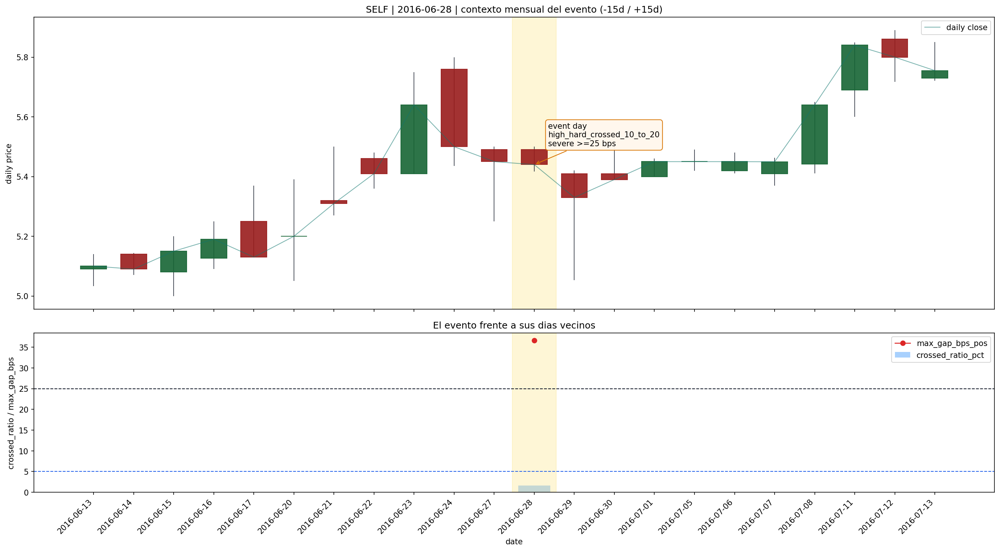

#### 00a Adjusted Proxy Contrast
Esta imagen responde a la pregunta de reconciliacion semantica: la discrepancia de precios viene de datos rotos o de vistas de precio distintas. Compara `daily raw`, `daily adjusted_proxy`, `quote mid raw` y `quote mid split_normalized`, y debajo ensena la cadena de dividendos y splits que produce la diferencia. La decision que cambia es si el inspector debe abrir una incidencia de calidad o cerrar el caso como diferencia legitima de semantica. El error que evita es mezclar series raw y adjusted como si fueran equivalentes. En pipelines reales, esto protege benchmarking, labels diarios y reconciliacion externa frente a falsas alarmas de precio.

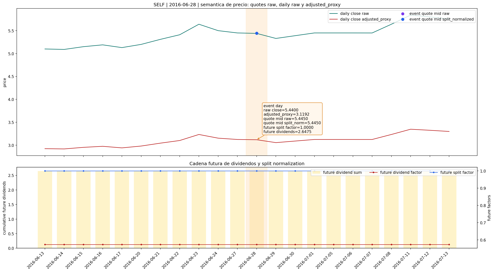

#### 00b Event Month Quotes Context
Esta imagen responde a la pregunta de recurrencia mensual dentro de `quotes`: el problema se concentra en el evento o reaparece en varias sesiones. Arriba concatena sesiones con datos disponibles; abajo resume cobertura diaria, `crossed_ratio_pct` y `max_gap_bps_pos`. La decision que cambia es si el caso debe leerse como episodio puntual o como sintoma de una fase repetida de libro degradado. El error que evita es extrapolar desde un unico dia a todo el mes sin evidencia.

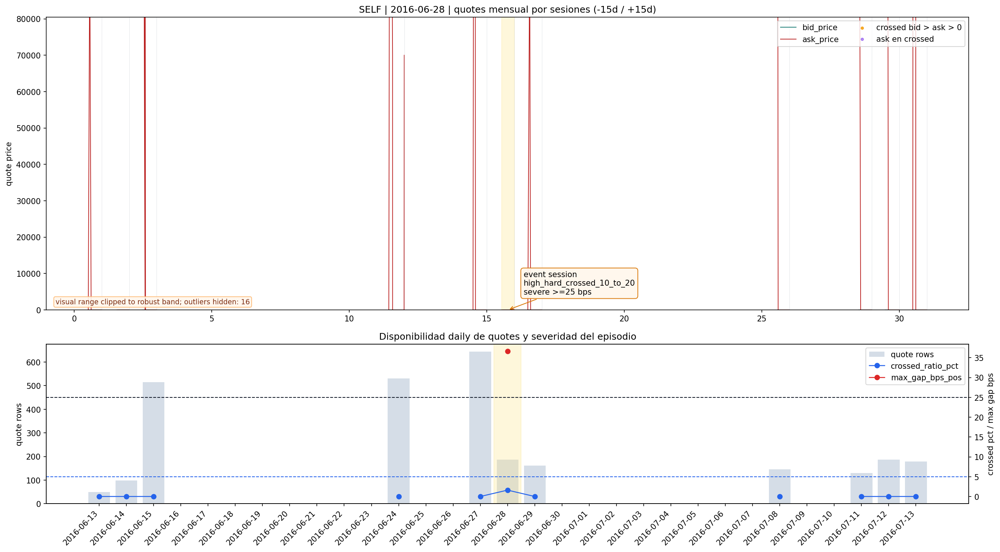

#### 01 Raw Window
Esta imagen responde a la primera pregunta decisiva del caso: el crossed observado es economicamente bastante fuerte para justificar un cambio de clase. Arriba ensena la geometria exacta del tramo conflictivo; abajo convierte esa geometria a bps y la enfrenta a los cortes `5 bps` y `25 bps`. El regimen dominante es `severe >=25 bps`. La decision que cambia es pasar de anomalia interpretable a `review` o `bad`. El error que evita es decidir por apariencia visual sin medir el dano economico real del crossed. En terminos de pipeline, este panel decide si el problema afecta solo a la lectura forense o si invalida simulacion de ejecucion y microstructure features.

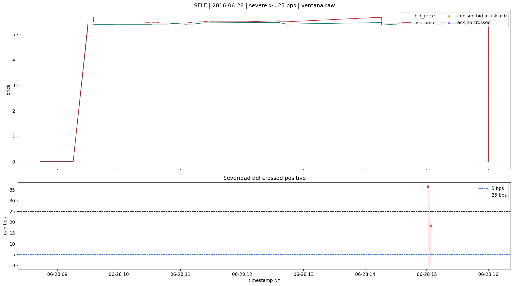

#### 02 Full Session Context
Esta imagen responde a la pregunta de extension intradiaria: el dano esta confinado a un bloque corto o contamina la sesion completa. Arriba se ve toda la sesion `04:00-20:00 NY`; abajo el `gap_bps` firmado. La decision que cambia es si el consumo debe penalizar solo un tramo o desechar el dia entero para uso operativo. El error que evita es tratar una cicatriz local como ruina total o, al reves, minimizar una degradacion distribuida a lo largo del dia. En ejecucion esto decide si la sesion puede seguir usandose con restricciones; en ML decide si las features intradiarias conservan significado economico.

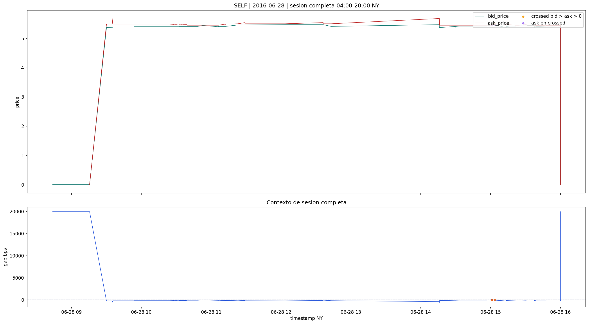

#### 03 Structure Diagnostics
Este panel responde a la pregunta de naturaleza del fallo: contradiccion economica genuina o mezcla con degeneracion estructural. Separa `ask=0` de `ask>0`, muestra la distribucion de `gap_bps` y resume patrones de integerizacion. La decision que cambia es como interpretar el dano: mercado localmente roto, artefacto de representacion o combinacion de ambos. El error que evita es sobrediagnosticar crossed reales cuando parte de la senal proviene de estructura degenerada del libro. Esta lectura afecta directamente a que el caso vaya a exclusion dura, a bandera contextual o a simple reconciliacion tecnica.

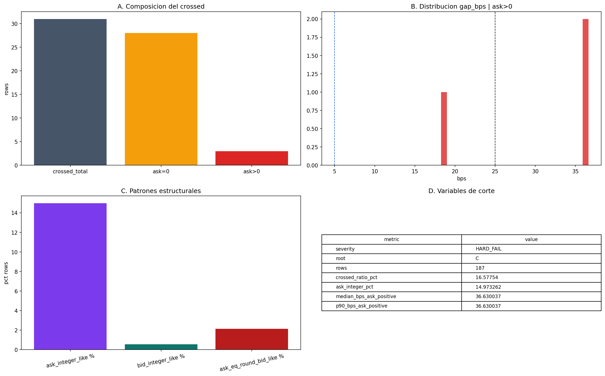

#### 04 Summary Card
Esta tarjeta responde a la pregunta de auditabilidad: cuales son exactamente las variables que sostienen la conclusion. Reune `severity`, `root`, `crossed_ratio_pct`, `ask_integer_pct`, `median_bps_ask_positive` y `p90_bps_ask_positive`. La decision que cambia es pasar de impresion visual a regla verificable. El error que evita es que dos inspectores lleguen a conclusiones distintas mirando la misma imagen sin una base numerica comun. Para gobernanza del proyecto, este panel es el que vuelve reproducible la decision para backtest, ML y auditoria.

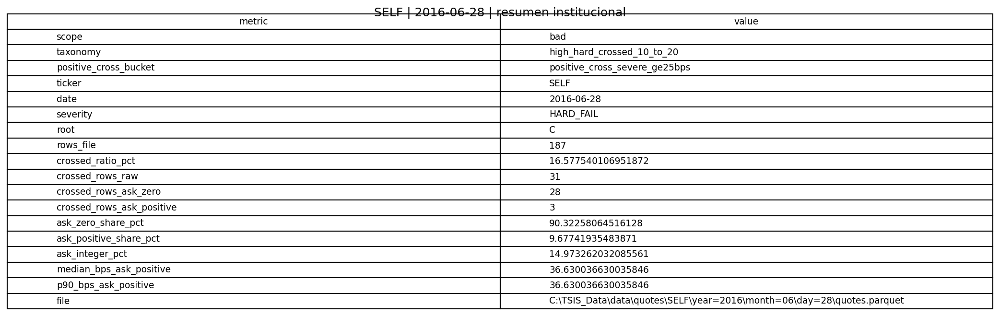

#### 05 Historical Context
Esta imagen responde a la pregunta causal externa: existe un framing historico que ayude a entender por que ocurre el episodio. Puede aportar halt context, explained o not strongly explained. La decision que cambia es cuanto peso se concede al contexto en la narrativa final. El error que evita es doble: ignorar una explicacion real o usarla como excusa para absolver un libro que localmente sigue siendo problematico.

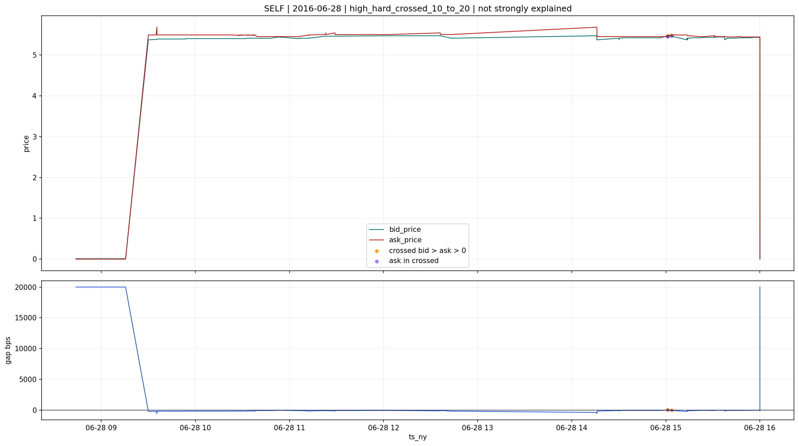

---

### 3. UFAB 2023-03-09

company_name: `Unique Fabricating, Inc.`
primary_exchange: `NYSE American` (`XASE`)
market_locale: `stocks/us`
scope: `bad`
ticker: `UFAB`
date: `2023-03-09`
taxonomy: `medium_file_threshold_edge_hard_many_crosses`
positive_cross_bucket: `positive_cross_severe_ge25bps`
severity: `HARD_FAIL`
root: `C`
rows: `284`
crossed_ratio_pct: `2.464789`
crossed_rows_raw: `7`
crossed_rows_ask_zero: `0`
crossed_rows_ask_positive: `7`
ask_integer_pct: `0.000000`
median_bps_ask_positive: `417.633411`
p90_bps_ask_positive: `622.448980`
file: `C:\TSIS_Data\data\quotes\UFAB\year=2023\month=03\day=09\quotes.parquet`

#### Analisis Forense
La conclusion correcta del caso es que la contradiccion local entre bid y ask ya compromete la credibilidad economica del libro y bloquea su consumo como si fuera mercado normal. La taxonomy historica es `medium_file_threshold_edge_hard_many_crosses` y el regimen positivo dominante es `severe >=25 bps`. Esto importa porque la taxonomy no solo clasifica: resume que tipo de anomalia se esta viendo y que clase de decision contractual puede defenderse despues. La taxonomy `medium_file_threshold_edge_hard_many_crosses` implica que el mismo tipo de dano aparece en un file menos grande y por eso pesa mas: hay menos masa para diluir la anomalia y la exclusion se vuelve mas defendible. El regimen `severe >=25 bps` empuja el caso a una lectura economicamente dura: el crossed deja de ser cosmetico y pasa a cuestionar si el libro sigue siendo interpretable como mercado negociable. En terminos observables, el file tiene `crossed_ratio_pct=2.464789` con `crossed_rows_ask_positive=7` y `crossed_rows_ask_zero=0`. La severidad economica del crossed ask>0 se resume en `median_bps_ask_positive=417.633411` y `p90_bps_ask_positive=622.448980`. Estos dos numeros convierten una forma visual rara en una conclusion operativa sobre si el libro sigue representando o no un mercado negociable. La decision que cambia es exclusion del consumo core del libro. `bad` significa que el estado local ya no puede alimentar ejecucion, mark-to-market intradiario ni aprendizaje de ML como si fuese microestructura defendible. El error que evita es construir decisiones sobre un libro que ha dejado de representar un mercado localmente creible. El patron estructural muestra `ask_integer_pct=0.000000`. Este numero obliga a separar dos explicaciones rivales: contradiccion economica genuina del libro o mezcla con degeneracion estructural / integerizacion. Toda la composicion crossed cae en `ask>0`. Eso endurece la lectura economica del caso: el dano no depende de ceros mecanicos, sino de contradiccion positiva dentro de precios aparentemente vivos. Como `ask_integer_pct` es bajo, la hipotesis de simple degeneracion mecanica pierde fuerza. Eso endurece la interpretacion: el crossed se parece mas a contradiccion economica genuina y menos a artefacto. Existe ademas una imagen historica de certificacion asociada. Su papel es poner el episodio en un marco causal mas amplio: halt, explained, not strongly explained o patron conocido. La regla que protege al proyecto es esta: el contexto externo se usa para explicar por que aparece el episodio, no para absolverlo. El error que evita es degradar el criterio de calidad del libro porque exista una historia plausible alrededor del caso.

#### 00 Event Month Context
Esta imagen responde a la pregunta de persistencia temporal: estamos ante un accidente local o ante una fase mas amplia de inestabilidad. Arriba coloca el evento en la serie `daily` real del mes; abajo compara `crossed_ratio_pct` y `max_gap_bps_pos` del dia contra sus vecinos. La decision que cambia es el peso estructural que se le concede al caso. El error que evita es juzgar igual un shock aislado y una degradacion repetida del libro.

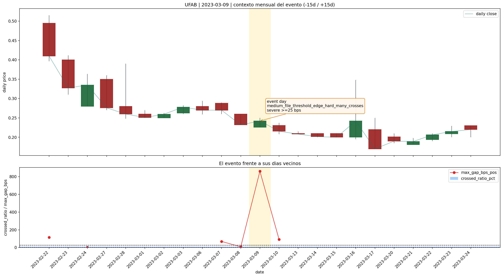

#### 00b Event Month Quotes Context
Esta imagen responde a la pregunta de recurrencia mensual dentro de `quotes`: el problema se concentra en el evento o reaparece en varias sesiones. Arriba concatena sesiones con datos disponibles; abajo resume cobertura diaria, `crossed_ratio_pct` y `max_gap_bps_pos`. La decision que cambia es si el caso debe leerse como episodio puntual o como sintoma de una fase repetida de libro degradado. El error que evita es extrapolar desde un unico dia a todo el mes sin evidencia.

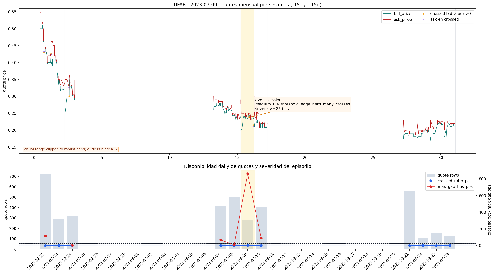

#### 01 Raw Window
Esta imagen responde a la primera pregunta decisiva del caso: el crossed observado es economicamente bastante fuerte para justificar un cambio de clase. Arriba ensena la geometria exacta del tramo conflictivo; abajo convierte esa geometria a bps y la enfrenta a los cortes `5 bps` y `25 bps`. El regimen dominante es `severe >=25 bps`. La decision que cambia es pasar de anomalia interpretable a `review` o `bad`. El error que evita es decidir por apariencia visual sin medir el dano economico real del crossed. En terminos de pipeline, este panel decide si el problema afecta solo a la lectura forense o si invalida simulacion de ejecucion y microstructure features.

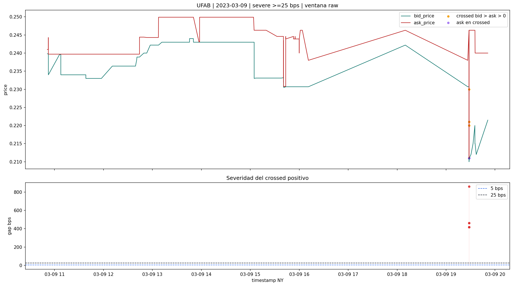

#### 02 Full Session Context
Esta imagen responde a la pregunta de extension intradiaria: el dano esta confinado a un bloque corto o contamina la sesion completa. Arriba se ve toda la sesion `04:00-20:00 NY`; abajo el `gap_bps` firmado. La decision que cambia es si el consumo debe penalizar solo un tramo o desechar el dia entero para uso operativo. El error que evita es tratar una cicatriz local como ruina total o, al reves, minimizar una degradacion distribuida a lo largo del dia. En ejecucion esto decide si la sesion puede seguir usandose con restricciones; en ML decide si las features intradiarias conservan significado economico.

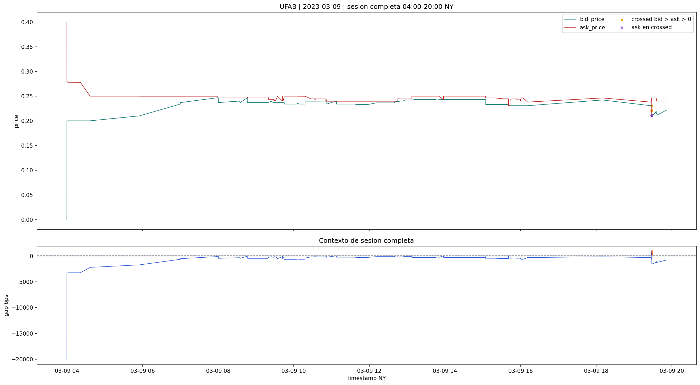

#### 03 Structure Diagnostics
Este panel responde a la pregunta de naturaleza del fallo: contradiccion economica genuina o mezcla con degeneracion estructural. Separa `ask=0` de `ask>0`, muestra la distribucion de `gap_bps` y resume patrones de integerizacion. La decision que cambia es como interpretar el dano: mercado localmente roto, artefacto de representacion o combinacion de ambos. El error que evita es sobrediagnosticar crossed reales cuando parte de la senal proviene de estructura degenerada del libro. Esta lectura afecta directamente a que el caso vaya a exclusion dura, a bandera contextual o a simple reconciliacion tecnica.

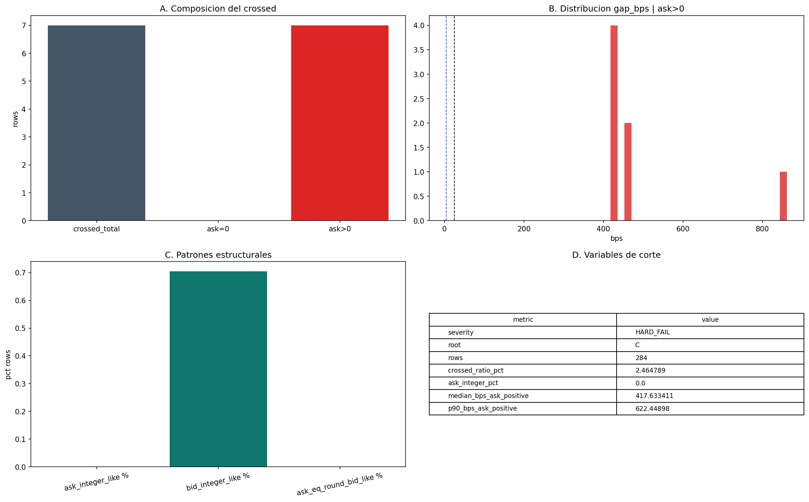

#### 04 Summary Card
Esta tarjeta responde a la pregunta de auditabilidad: cuales son exactamente las variables que sostienen la conclusion. Reune `severity`, `root`, `crossed_ratio_pct`, `ask_integer_pct`, `median_bps_ask_positive` y `p90_bps_ask_positive`. La decision que cambia es pasar de impresion visual a regla verificable. El error que evita es que dos inspectores lleguen a conclusiones distintas mirando la misma imagen sin una base numerica comun. Para gobernanza del proyecto, este panel es el que vuelve reproducible la decision para backtest, ML y auditoria.

#### 05 Historical Context
Esta imagen responde a la pregunta causal externa: existe un framing historico que ayude a entender por que ocurre el episodio. Puede aportar halt context, explained o not strongly explained. La decision que cambia es cuanto peso se concede al contexto en la narrativa final. El error que evita es doble: ignorar una explicacion real o usarla como excusa para absolver un libro que localmente sigue siendo problematico.

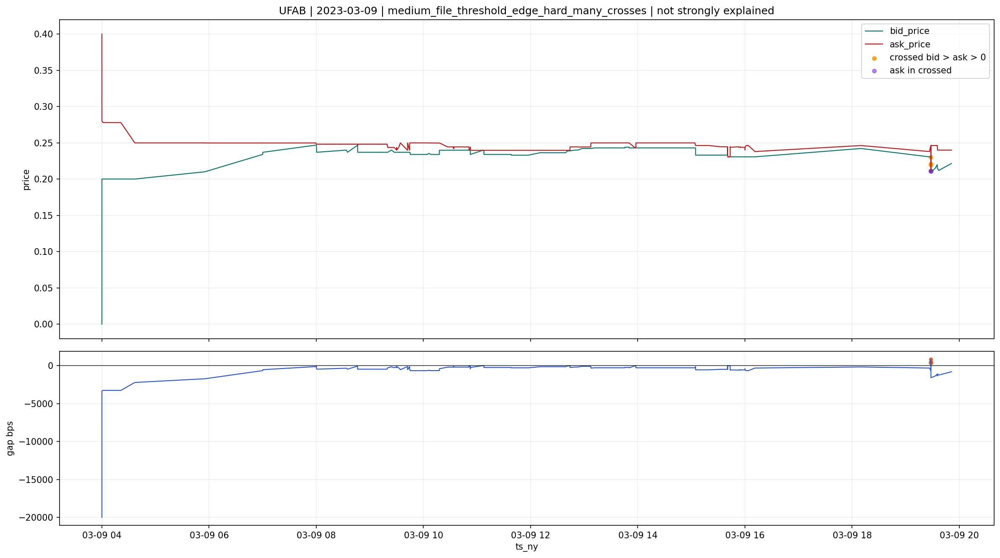

---

### 4. DGLY 2011-10-06

company_name: `Digital Ally, Inc. Common Stock`
primary_exchange: `NASDAQ` (`XNAS`)
market_locale: `stocks/us`
scope: `bad`
ticker: `DGLY`
date: `2011-10-06`
taxonomy: `medium_file_threshold_edge_hard_many_crosses`
positive_cross_bucket: `positive_cross_severe_ge25bps`
severity: `HARD_FAIL`
root: `C`
rows: `201`
crossed_ratio_pct: `4.477612`
crossed_rows_raw: `9`
crossed_rows_ask_zero: `0`
crossed_rows_ask_positive: `9`
ask_integer_pct: `0.000000`
median_bps_ask_positive: `281.690141`
p90_bps_ask_positive: `425.531915`
file: `C:\TSIS_Data\data\quotes\DGLY\year=2011\month=10\day=06\quotes.parquet`

#### Analisis Forense
La conclusion correcta del caso es que la contradiccion local entre bid y ask ya compromete la credibilidad economica del libro y bloquea su consumo como si fuera mercado normal. La taxonomy historica es `medium_file_threshold_edge_hard_many_crosses` y el regimen positivo dominante es `severe >=25 bps`. Esto importa porque la taxonomy no solo clasifica: resume que tipo de anomalia se esta viendo y que clase de decision contractual puede defenderse despues. La taxonomy `medium_file_threshold_edge_hard_many_crosses` implica que el mismo tipo de dano aparece en un file menos grande y por eso pesa mas: hay menos masa para diluir la anomalia y la exclusion se vuelve mas defendible. El regimen `severe >=25 bps` empuja el caso a una lectura economicamente dura: el crossed deja de ser cosmetico y pasa a cuestionar si el libro sigue siendo interpretable como mercado negociable. En terminos observables, el file tiene `crossed_ratio_pct=4.477612` con `crossed_rows_ask_positive=9` y `crossed_rows_ask_zero=0`. La severidad economica del crossed ask>0 se resume en `median_bps_ask_positive=281.690141` y `p90_bps_ask_positive=425.531915`. Estos dos numeros convierten una forma visual rara en una conclusion operativa sobre si el libro sigue representando o no un mercado negociable. La decision que cambia es exclusion del consumo core del libro. `bad` significa que el estado local ya no puede alimentar ejecucion, mark-to-market intradiario ni aprendizaje de ML como si fuese microestructura defendible. El error que evita es construir decisiones sobre un libro que ha dejado de representar un mercado localmente creible. El patron estructural muestra `ask_integer_pct=0.000000`. Este numero obliga a separar dos explicaciones rivales: contradiccion economica genuina del libro o mezcla con degeneracion estructural / integerizacion. Toda la composicion crossed cae en `ask>0`. Eso endurece la lectura economica del caso: el dano no depende de ceros mecanicos, sino de contradiccion positiva dentro de precios aparentemente vivos. Como `ask_integer_pct` es bajo, la hipotesis de simple degeneracion mecanica pierde fuerza. Eso endurece la interpretacion: el crossed se parece mas a contradiccion economica genuina y menos a artefacto. En la capa de semantica de precio del evento aparecen `daily raw close=92400.0000`, `quote mid raw=0.7400`, `quote mid split_normalized=88800.0000`, `daily adjusted_proxy=92400.0000`. La reconciliacion incluye `future_split_factor=0.0000`. La implicacion metodologica es crucial: una discrepancia entre `quotes`, `daily` y una plataforma externa no puede leerse automaticamente como fallo del dataset. Puede ser semantica de precio distinta. El error que evita esta capa es mezclar raw, split-normalized y adjusted dentro del mismo pipeline, rompiendo auditoria, benchmarking y labels. Para pipelines, esto implica exclusion de ejecucion realista, de mark-to-market intradiario defendible y de features microestructurales tratadas como si reflejaran un mercado normal. Solo debe sobrevivir en circuitos forenses o de calidad. Existe ademas una imagen historica de certificacion asociada. Su papel es poner el episodio en un marco causal mas amplio: halt, explained, not strongly explained o patron conocido. La regla que protege al proyecto es esta: el contexto externo se usa para explicar por que aparece el episodio, no para absolverlo. El error que evita es degradar el criterio de calidad del libro porque exista una historia plausible alrededor del caso.

#### 00 Event Month Context
Esta imagen responde a la pregunta de persistencia temporal: estamos ante un accidente local o ante una fase mas amplia de inestabilidad. Arriba coloca el evento en la serie `daily` real del mes; abajo compara `crossed_ratio_pct` y `max_gap_bps_pos` del dia contra sus vecinos. La decision que cambia es el peso estructural que se le concede al caso. El error que evita es juzgar igual un shock aislado y una degradacion repetida del libro.

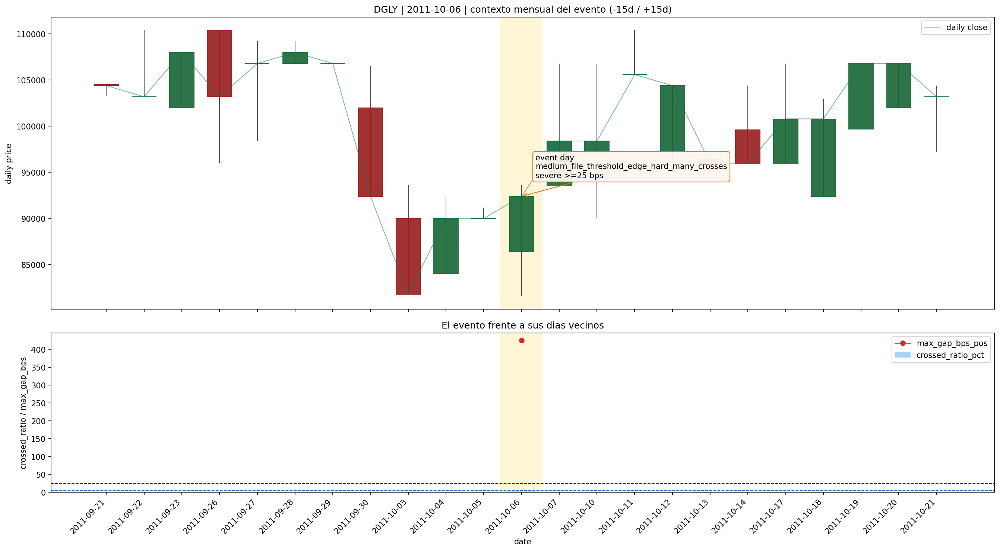

#### 00a Adjusted Proxy Contrast
Esta imagen responde a la pregunta de reconciliacion semantica: la discrepancia de precios viene de datos rotos o de vistas de precio distintas. Compara `daily raw`, `daily adjusted_proxy`, `quote mid raw` y `quote mid split_normalized`, y debajo ensena la cadena de dividendos y splits que produce la diferencia. La decision que cambia es si el inspector debe abrir una incidencia de calidad o cerrar el caso como diferencia legitima de semantica. El error que evita es mezclar series raw y adjusted como si fueran equivalentes. En pipelines reales, esto protege benchmarking, labels diarios y reconciliacion externa frente a falsas alarmas de precio.

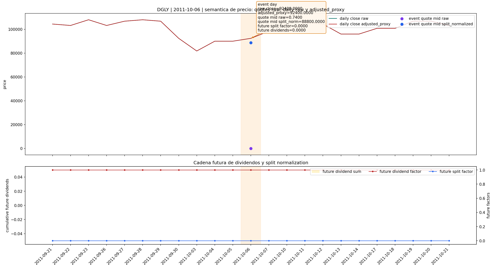

#### 00b Event Month Quotes Context
Esta imagen responde a la pregunta de recurrencia mensual dentro de `quotes`: el problema se concentra en el evento o reaparece en varias sesiones. Arriba concatena sesiones con datos disponibles; abajo resume cobertura diaria, `crossed_ratio_pct` y `max_gap_bps_pos`. La decision que cambia es si el caso debe leerse como episodio puntual o como sintoma de una fase repetida de libro degradado. El error que evita es extrapolar desde un unico dia a todo el mes sin evidencia.

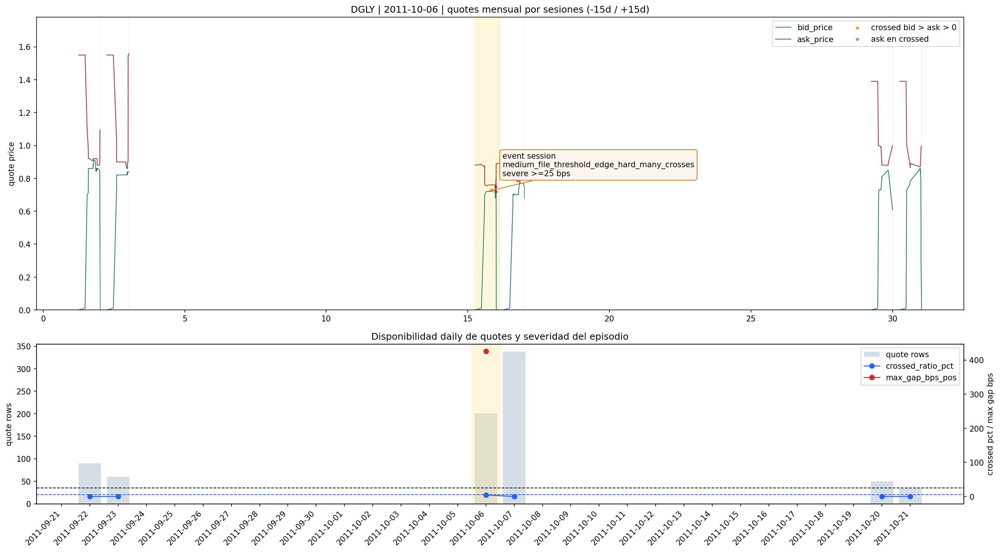

#### 01 Raw Window
Esta imagen responde a la primera pregunta decisiva del caso: el crossed observado es economicamente bastante fuerte para justificar un cambio de clase. Arriba ensena la geometria exacta del tramo conflictivo; abajo convierte esa geometria a bps y la enfrenta a los cortes `5 bps` y `25 bps`. El regimen dominante es `severe >=25 bps`. La decision que cambia es pasar de anomalia interpretable a `review` o `bad`. El error que evita es decidir por apariencia visual sin medir el dano economico real del crossed. En terminos de pipeline, este panel decide si el problema afecta solo a la lectura forense o si invalida simulacion de ejecucion y microstructure features.

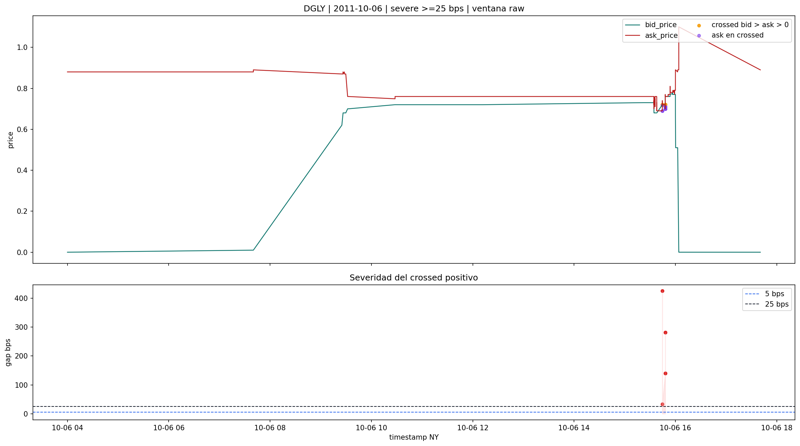

#### 02 Full Session Context
Esta imagen responde a la pregunta de extension intradiaria: el dano esta confinado a un bloque corto o contamina la sesion completa. Arriba se ve toda la sesion `04:00-20:00 NY`; abajo el `gap_bps` firmado. La decision que cambia es si el consumo debe penalizar solo un tramo o desechar el dia entero para uso operativo. El error que evita es tratar una cicatriz local como ruina total o, al reves, minimizar una degradacion distribuida a lo largo del dia. En ejecucion esto decide si la sesion puede seguir usandose con restricciones; en ML decide si las features intradiarias conservan significado economico.

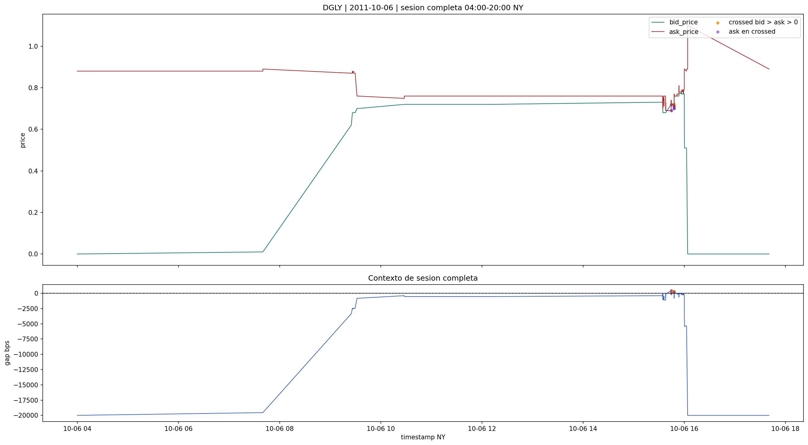

#### 03 Structure Diagnostics
Este panel responde a la pregunta de naturaleza del fallo: contradiccion economica genuina o mezcla con degeneracion estructural. Separa `ask=0` de `ask>0`, muestra la distribucion de `gap_bps` y resume patrones de integerizacion. La decision que cambia es como interpretar el dano: mercado localmente roto, artefacto de representacion o combinacion de ambos. El error que evita es sobrediagnosticar crossed reales cuando parte de la senal proviene de estructura degenerada del libro. Esta lectura afecta directamente a que el caso vaya a exclusion dura, a bandera contextual o a simple reconciliacion tecnica.

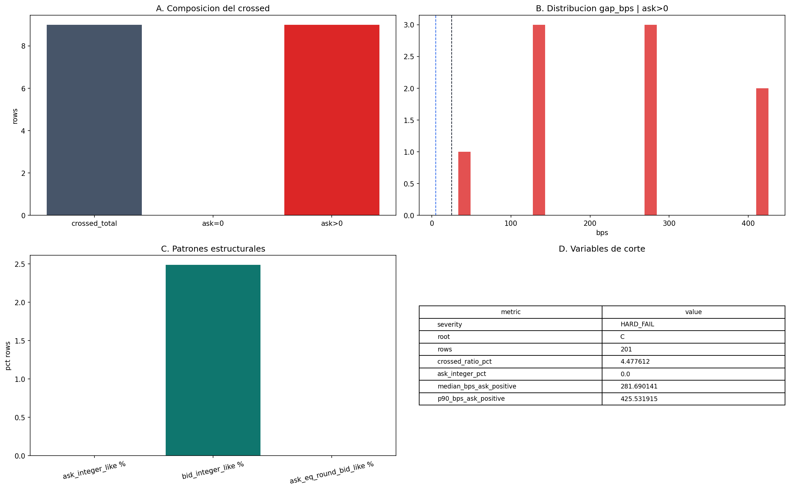

#### 04 Summary Card
Esta tarjeta responde a la pregunta de auditabilidad: cuales son exactamente las variables que sostienen la conclusion. Reune `severity`, `root`, `crossed_ratio_pct`, `ask_integer_pct`, `median_bps_ask_positive` y `p90_bps_ask_positive`. La decision que cambia es pasar de impresion visual a regla verificable. El error que evita es que dos inspectores lleguen a conclusiones distintas mirando la misma imagen sin una base numerica comun. Para gobernanza del proyecto, este panel es el que vuelve reproducible la decision para backtest, ML y auditoria.

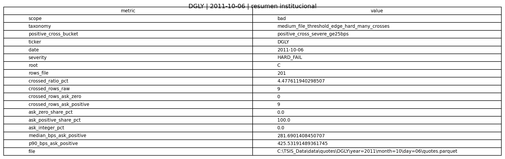

#### 05 Historical Context
Esta imagen responde a la pregunta causal externa: existe un framing historico que ayude a entender por que ocurre el episodio. Puede aportar halt context, explained o not strongly explained. La decision que cambia es cuanto peso se concede al contexto en la narrativa final. El error que evita es doble: ignorar una explicacion real o usarla como excusa para absolver un libro que localmente sigue siendo problematico.

---

### 5. QRHC 2020-10-28

company_name: `Quest Resource Holding Corporation`
primary_exchange: `NASDAQ` (`XNAS`)
market_locale: `stocks/us`
scope: `bad`
ticker: `QRHC`
date: `2020-10-28`
taxonomy: `medium_file_threshold_edge_hard_many_crosses`
positive_cross_bucket: `positive_cross_severe_ge25bps`
severity: `HARD_FAIL`
root: `D`
rows: `240`
crossed_ratio_pct: `3.333333`
crossed_rows_raw: `8`
crossed_rows_ask_zero: `3`
crossed_rows_ask_positive: `5`
ask_integer_pct: `1.666667`
median_bps_ask_positive: `108.108108`
p90_bps_ask_positive: `108.108108`
file: `D:\quotes\QRHC\year=2020\month=10\day=28\quotes.parquet`

#### Analisis Forense
La conclusion correcta del caso es que la contradiccion local entre bid y ask ya compromete la credibilidad economica del libro y bloquea su consumo como si fuera mercado normal. La taxonomy historica es `medium_file_threshold_edge_hard_many_crosses` y el regimen positivo dominante es `severe >=25 bps`. Esto importa porque la taxonomy no solo clasifica: resume que tipo de anomalia se esta viendo y que clase de decision contractual puede defenderse despues. La taxonomy `medium_file_threshold_edge_hard_many_crosses` implica que el mismo tipo de dano aparece en un file menos grande y por eso pesa mas: hay menos masa para diluir la anomalia y la exclusion se vuelve mas defendible. El regimen `severe >=25 bps` empuja el caso a una lectura economicamente dura: el crossed deja de ser cosmetico y pasa a cuestionar si el libro sigue siendo interpretable como mercado negociable. En terminos observables, el file tiene `crossed_ratio_pct=3.333333` con `crossed_rows_ask_positive=5` y `crossed_rows_ask_zero=3`. La severidad economica del crossed ask>0 se resume en `median_bps_ask_positive=108.108108` y `p90_bps_ask_positive=108.108108`. Estos dos numeros convierten una forma visual rara en una conclusion operativa sobre si el libro sigue representando o no un mercado negociable. La decision que cambia es exclusion del consumo core del libro. `bad` significa que el estado local ya no puede alimentar ejecucion, mark-to-market intradiario ni aprendizaje de ML como si fuese microestructura defendible. El error que evita es construir decisiones sobre un libro que ha dejado de representar un mercado localmente creible. El patron estructural muestra `ask_integer_pct=1.666667`. Este numero obliga a separar dos explicaciones rivales: contradiccion economica genuina del libro o mezcla con degeneracion estructural / integerizacion. La composicion esta mezclada entre `ask=0` y `ask>0`. Eso obliga a una lectura dual: parte del patron pertenece a estructura y parte a contradiccion economica genuina, por lo que la decision debe apoyarse en ambas capas y no en una sola narrativa. Como `ask_integer_pct` es bajo, la hipotesis de simple degeneracion mecanica pierde fuerza. Eso endurece la interpretacion: el crossed se parece mas a contradiccion economica genuina y menos a artefacto. Existe ademas una imagen historica de certificacion asociada. Su papel es poner el episodio en un marco causal mas amplio: halt, explained, not strongly explained o patron conocido. La regla que protege al proyecto es esta: el contexto externo se usa para explicar por que aparece el episodio, no para absolverlo. El error que evita es degradar el criterio de calidad del libro porque exista una historia plausible alrededor del caso.

#### 00 Event Month Context
Esta imagen responde a la pregunta de persistencia temporal: estamos ante un accidente local o ante una fase mas amplia de inestabilidad. Arriba coloca el evento en la serie `daily` real del mes; abajo compara `crossed_ratio_pct` y `max_gap_bps_pos` del dia contra sus vecinos. La decision que cambia es el peso estructural que se le concede al caso. El error que evita es juzgar igual un shock aislado y una degradacion repetida del libro.

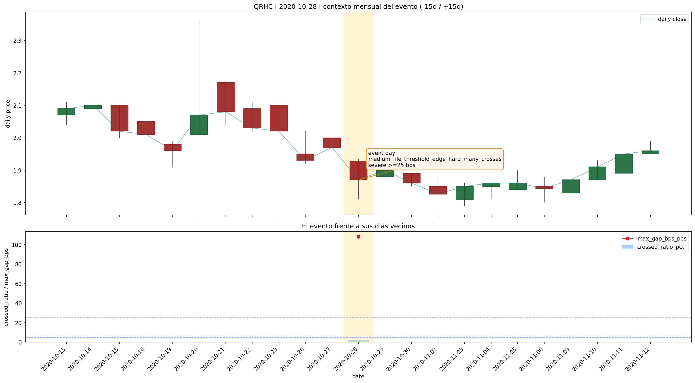

#### 00b Event Month Quotes Context
Esta imagen responde a la pregunta de recurrencia mensual dentro de `quotes`: el problema se concentra en el evento o reaparece en varias sesiones. Arriba concatena sesiones con datos disponibles; abajo resume cobertura diaria, `crossed_ratio_pct` y `max_gap_bps_pos`. La decision que cambia es si el caso debe leerse como episodio puntual o como sintoma de una fase repetida de libro degradado. El error que evita es extrapolar desde un unico dia a todo el mes sin evidencia.

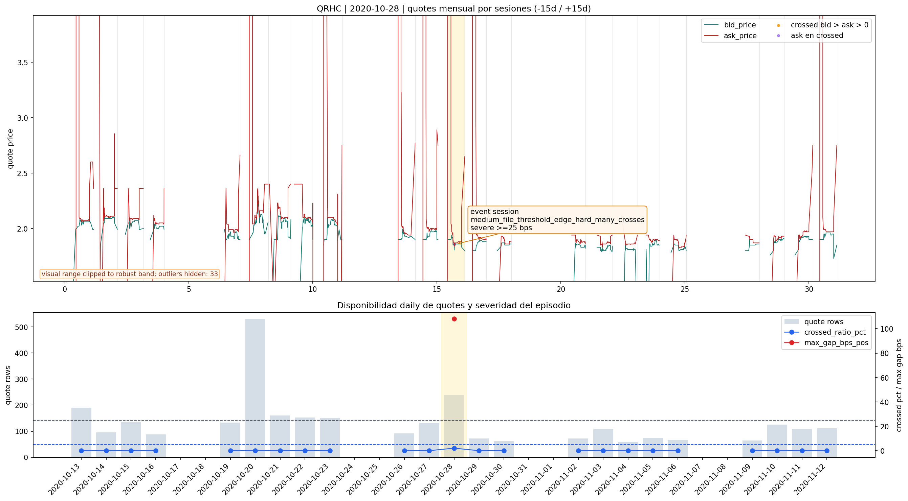

#### 01 Raw Window
Esta imagen responde a la primera pregunta decisiva del caso: el crossed observado es economicamente bastante fuerte para justificar un cambio de clase. Arriba ensena la geometria exacta del tramo conflictivo; abajo convierte esa geometria a bps y la enfrenta a los cortes `5 bps` y `25 bps`. El regimen dominante es `severe >=25 bps`. La decision que cambia es pasar de anomalia interpretable a `review` o `bad`. El error que evita es decidir por apariencia visual sin medir el dano economico real del crossed. En terminos de pipeline, este panel decide si el problema afecta solo a la lectura forense o si invalida simulacion de ejecucion y microstructure features.

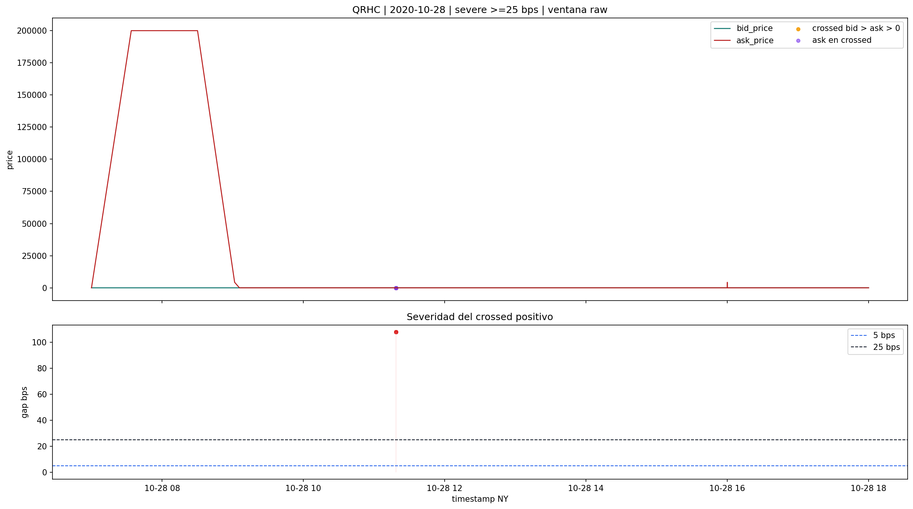

#### 02 Full Session Context
Esta imagen responde a la pregunta de extension intradiaria: el dano esta confinado a un bloque corto o contamina la sesion completa. Arriba se ve toda la sesion `04:00-20:00 NY`; abajo el `gap_bps` firmado. La decision que cambia es si el consumo debe penalizar solo un tramo o desechar el dia entero para uso operativo. El error que evita es tratar una cicatriz local como ruina total o, al reves, minimizar una degradacion distribuida a lo largo del dia. En ejecucion esto decide si la sesion puede seguir usandose con restricciones; en ML decide si las features intradiarias conservan significado economico.

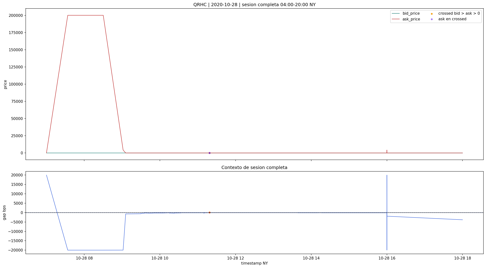

#### 03 Structure Diagnostics
Este panel responde a la pregunta de naturaleza del fallo: contradiccion economica genuina o mezcla con degeneracion estructural. Separa `ask=0` de `ask>0`, muestra la distribucion de `gap_bps` y resume patrones de integerizacion. La decision que cambia es como interpretar el dano: mercado localmente roto, artefacto de representacion o combinacion de ambos. El error que evita es sobrediagnosticar crossed reales cuando parte de la senal proviene de estructura degenerada del libro. Esta lectura afecta directamente a que el caso vaya a exclusion dura, a bandera contextual o a simple reconciliacion tecnica.

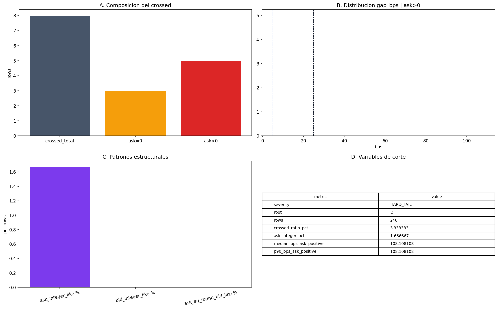

#### 04 Summary Card
Esta tarjeta responde a la pregunta de auditabilidad: cuales son exactamente las variables que sostienen la conclusion. Reune `severity`, `root`, `crossed_ratio_pct`, `ask_integer_pct`, `median_bps_ask_positive` y `p90_bps_ask_positive`. La decision que cambia es pasar de impresion visual a regla verificable. El error que evita es que dos inspectores lleguen a conclusiones distintas mirando la misma imagen sin una base numerica comun. Para gobernanza del proyecto, este panel es el que vuelve reproducible la decision para backtest, ML y auditoria.

---

### 6. PPHM 2007-10-08

company_name: `Peregrine Pharmaceuticals Inc`
primary_exchange: `NASDAQ` (`XNAS`)
market_locale: `stocks/us`
scope: `bad`
ticker: `PPHM`
date: `2007-10-08`
taxonomy: `medium_file_threshold_edge_hard_many_crosses`
positive_cross_bucket: `positive_cross_severe_ge25bps`
severity: `HARD_FAIL`
root: `D`
rows: `531`
crossed_ratio_pct: `4.143126`
crossed_rows_raw: `22`
crossed_rows_ask_zero: `0`
crossed_rows_ask_positive: `22`
ask_integer_pct: `0.000000`
median_bps_ask_positive: `53.587377`
p90_bps_ask_positive: `58.040033`
file: `D:\quotes\PPHM\year=2007\month=10\day=08\quotes.parquet`

#### Analisis Forense
La conclusion correcta del caso es que la contradiccion local entre bid y ask ya compromete la credibilidad economica del libro y bloquea su consumo como si fuera mercado normal. La taxonomy historica es `medium_file_threshold_edge_hard_many_crosses` y el regimen positivo dominante es `severe >=25 bps`. Esto importa porque la taxonomy no solo clasifica: resume que tipo de anomalia se esta viendo y que clase de decision contractual puede defenderse despues. La taxonomy `medium_file_threshold_edge_hard_many_crosses` implica que el mismo tipo de dano aparece en un file menos grande y por eso pesa mas: hay menos masa para diluir la anomalia y la exclusion se vuelve mas defendible. El regimen `severe >=25 bps` empuja el caso a una lectura economicamente dura: el crossed deja de ser cosmetico y pasa a cuestionar si el libro sigue siendo interpretable como mercado negociable. En terminos observables, el file tiene `crossed_ratio_pct=4.143126` con `crossed_rows_ask_positive=22` y `crossed_rows_ask_zero=0`. La severidad economica del crossed ask>0 se resume en `median_bps_ask_positive=53.587377` y `p90_bps_ask_positive=58.040033`. Estos dos numeros convierten una forma visual rara en una conclusion operativa sobre si el libro sigue representando o no un mercado negociable. La decision que cambia es exclusion del consumo core del libro. `bad` significa que el estado local ya no puede alimentar ejecucion, mark-to-market intradiario ni aprendizaje de ML como si fuese microestructura defendible. El error que evita es construir decisiones sobre un libro que ha dejado de representar un mercado localmente creible. El patron estructural muestra `ask_integer_pct=0.000000`. Este numero obliga a separar dos explicaciones rivales: contradiccion economica genuina del libro o mezcla con degeneracion estructural / integerizacion. Toda la composicion crossed cae en `ask>0`. Eso endurece la lectura economica del caso: el dano no depende de ceros mecanicos, sino de contradiccion positiva dentro de precios aparentemente vivos. Como `ask_integer_pct` es bajo, la hipotesis de simple degeneracion mecanica pierde fuerza. Eso endurece la interpretacion: el crossed se parece mas a contradiccion economica genuina y menos a artefacto. En la capa de semantica de precio del evento aparecen `daily raw close=3.2450`, `quote mid raw=0.6640`, `quote mid split_normalized=3.3197`, `daily adjusted_proxy=3.2450`. La reconciliacion incluye `future_split_factor=0.2000`. La implicacion metodologica es crucial: una discrepancia entre `quotes`, `daily` y una plataforma externa no puede leerse automaticamente como fallo del dataset. Puede ser semantica de precio distinta. El error que evita esta capa es mezclar raw, split-normalized y adjusted dentro del mismo pipeline, rompiendo auditoria, benchmarking y labels. Para pipelines, esto implica exclusion de ejecucion realista, de mark-to-market intradiario defendible y de features microestructurales tratadas como si reflejaran un mercado normal. Solo debe sobrevivir en circuitos forenses o de calidad. Existe ademas una imagen historica de certificacion asociada. Su papel es poner el episodio en un marco causal mas amplio: halt, explained, not strongly explained o patron conocido. La regla que protege al proyecto es esta: el contexto externo se usa para explicar por que aparece el episodio, no para absolverlo. El error que evita es degradar el criterio de calidad del libro porque exista una historia plausible alrededor del caso.

#### 00 Event Month Context
Esta imagen responde a la pregunta de persistencia temporal: estamos ante un accidente local o ante una fase mas amplia de inestabilidad. Arriba coloca el evento en la serie `daily` real del mes; abajo compara `crossed_ratio_pct` y `max_gap_bps_pos` del dia contra sus vecinos. La decision que cambia es el peso estructural que se le concede al caso. El error que evita es juzgar igual un shock aislado y una degradacion repetida del libro.

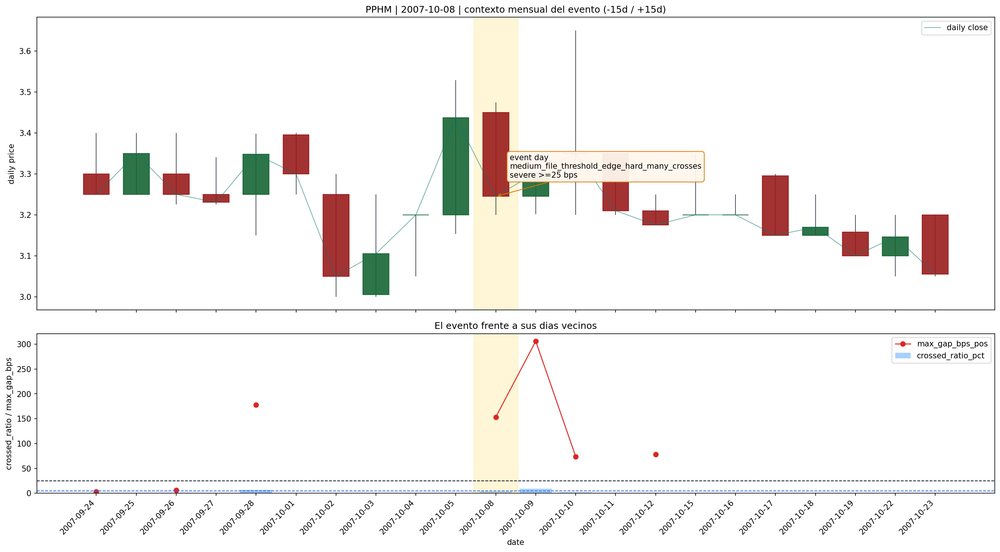

#### 00a Adjusted Proxy Contrast
Esta imagen responde a la pregunta de reconciliacion semantica: la discrepancia de precios viene de datos rotos o de vistas de precio distintas. Compara `daily raw`, `daily adjusted_proxy`, `quote mid raw` y `quote mid split_normalized`, y debajo ensena la cadena de dividendos y splits que produce la diferencia. La decision que cambia es si el inspector debe abrir una incidencia de calidad o cerrar el caso como diferencia legitima de semantica. El error que evita es mezclar series raw y adjusted como si fueran equivalentes. En pipelines reales, esto protege benchmarking, labels diarios y reconciliacion externa frente a falsas alarmas de precio.

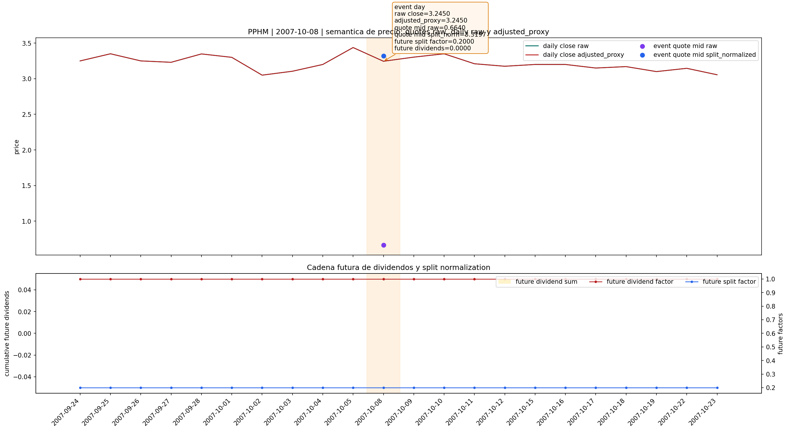

#### 00b Event Month Quotes Context
Esta imagen responde a la pregunta de recurrencia mensual dentro de `quotes`: el problema se concentra en el evento o reaparece en varias sesiones. Arriba concatena sesiones con datos disponibles; abajo resume cobertura diaria, `crossed_ratio_pct` y `max_gap_bps_pos`. La decision que cambia es si el caso debe leerse como episodio puntual o como sintoma de una fase repetida de libro degradado. El error que evita es extrapolar desde un unico dia a todo el mes sin evidencia.

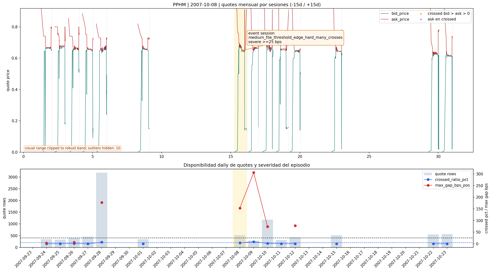

#### 01 Raw Window
Esta imagen responde a la primera pregunta decisiva del caso: el crossed observado es economicamente bastante fuerte para justificar un cambio de clase. Arriba ensena la geometria exacta del tramo conflictivo; abajo convierte esa geometria a bps y la enfrenta a los cortes `5 bps` y `25 bps`. El regimen dominante es `severe >=25 bps`. La decision que cambia es pasar de anomalia interpretable a `review` o `bad`. El error que evita es decidir por apariencia visual sin medir el dano economico real del crossed. En terminos de pipeline, este panel decide si el problema afecta solo a la lectura forense o si invalida simulacion de ejecucion y microstructure features.

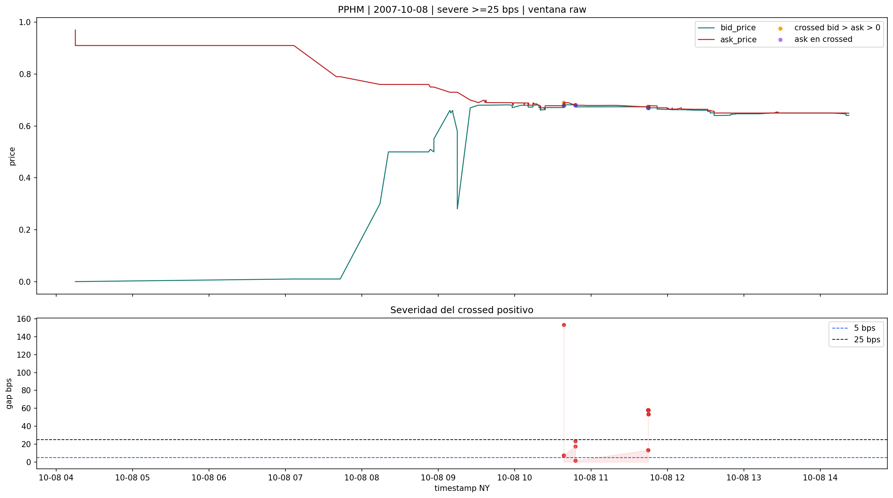

#### 02 Full Session Context
Esta imagen responde a la pregunta de extension intradiaria: el dano esta confinado a un bloque corto o contamina la sesion completa. Arriba se ve toda la sesion `04:00-20:00 NY`; abajo el `gap_bps` firmado. La decision que cambia es si el consumo debe penalizar solo un tramo o desechar el dia entero para uso operativo. El error que evita es tratar una cicatriz local como ruina total o, al reves, minimizar una degradacion distribuida a lo largo del dia. En ejecucion esto decide si la sesion puede seguir usandose con restricciones; en ML decide si las features intradiarias conservan significado economico.

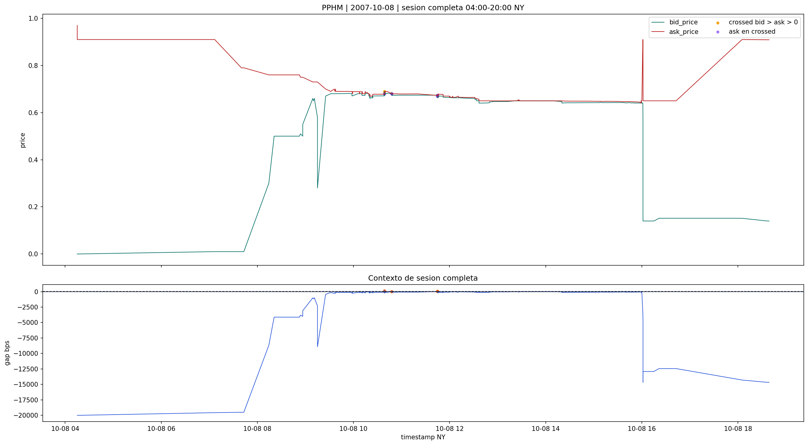

#### 03 Structure Diagnostics
Este panel responde a la pregunta de naturaleza del fallo: contradiccion economica genuina o mezcla con degeneracion estructural. Separa `ask=0` de `ask>0`, muestra la distribucion de `gap_bps` y resume patrones de integerizacion. La decision que cambia es como interpretar el dano: mercado localmente roto, artefacto de representacion o combinacion de ambos. El error que evita es sobrediagnosticar crossed reales cuando parte de la senal proviene de estructura degenerada del libro. Esta lectura afecta directamente a que el caso vaya a exclusion dura, a bandera contextual o a simple reconciliacion tecnica.

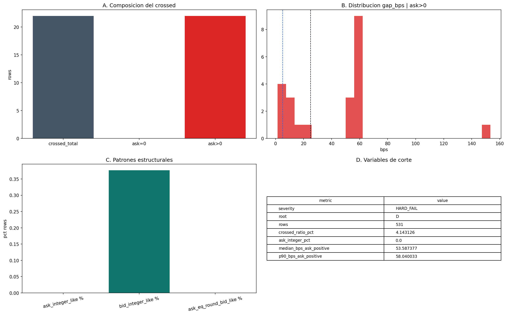

#### 04 Summary Card
Esta tarjeta responde a la pregunta de auditabilidad: cuales son exactamente las variables que sostienen la conclusion. Reune `severity`, `root`, `crossed_ratio_pct`, `ask_integer_pct`, `median_bps_ask_positive` y `p90_bps_ask_positive`. La decision que cambia es pasar de impresion visual a regla verificable. El error que evita es que dos inspectores lleguen a conclusiones distintas mirando la misma imagen sin una base numerica comun. Para gobernanza del proyecto, este panel es el que vuelve reproducible la decision para backtest, ML y auditoria.

---

### 7. TAT 2009-12-30

company_name: `TransAtlantic Petroleum LTD.`
primary_exchange: `NYSE American` (`XASE`)
market_locale: `stocks/us`
scope: `bad`
ticker: `TAT`
date: `2009-12-30`
taxonomy: `medium_file_threshold_edge_hard_many_crosses`
positive_cross_bucket: `positive_cross_severe_ge25bps`
severity: `HARD_FAIL`
root: `C`
rows: `602`
crossed_ratio_pct: `0.996678`
crossed_rows_raw: `6`
crossed_rows_ask_zero: `3`
crossed_rows_ask_positive: `3`
ask_integer_pct: `0.664452`
median_bps_ask_positive: `30.441400`
p90_bps_ask_positive: `54.720499`
file: `C:\TSIS_Data\data\quotes\TAT\year=2009\month=12\day=30\quotes.parquet`

#### Analisis Forense
La conclusion correcta del caso es que la contradiccion local entre bid y ask ya compromete la credibilidad economica del libro y bloquea su consumo como si fuera mercado normal. La taxonomy historica es `medium_file_threshold_edge_hard_many_crosses` y el regimen positivo dominante es `severe >=25 bps`. Esto importa porque la taxonomy no solo clasifica: resume que tipo de anomalia se esta viendo y que clase de decision contractual puede defenderse despues. La taxonomy `medium_file_threshold_edge_hard_many_crosses` implica que el mismo tipo de dano aparece en un file menos grande y por eso pesa mas: hay menos masa para diluir la anomalia y la exclusion se vuelve mas defendible. El regimen `severe >=25 bps` empuja el caso a una lectura economicamente dura: el crossed deja de ser cosmetico y pasa a cuestionar si el libro sigue siendo interpretable como mercado negociable. En terminos observables, el file tiene `crossed_ratio_pct=0.996678` con `crossed_rows_ask_positive=3` y `crossed_rows_ask_zero=3`. La severidad economica del crossed ask>0 se resume en `median_bps_ask_positive=30.441400` y `p90_bps_ask_positive=54.720499`. Estos dos numeros convierten una forma visual rara en una conclusion operativa sobre si el libro sigue representando o no un mercado negociable. La decision que cambia es exclusion del consumo core del libro. `bad` significa que el estado local ya no puede alimentar ejecucion, mark-to-market intradiario ni aprendizaje de ML como si fuese microestructura defendible. El error que evita es construir decisiones sobre un libro que ha dejado de representar un mercado localmente creible. El patron estructural muestra `ask_integer_pct=0.664452`. Este numero obliga a separar dos explicaciones rivales: contradiccion economica genuina del libro o mezcla con degeneracion estructural / integerizacion. La composicion esta mezclada entre `ask=0` y `ask>0`. Eso obliga a una lectura dual: parte del patron pertenece a estructura y parte a contradiccion economica genuina, por lo que la decision debe apoyarse en ambas capas y no en una sola narrativa. Como `ask_integer_pct` es bajo, la hipotesis de simple degeneracion mecanica pierde fuerza. Eso endurece la interpretacion: el crossed se parece mas a contradiccion economica genuina y menos a artefacto. En la capa de semantica de precio del evento aparecen `daily raw close=31.8000`, `quote mid raw=3.2250`, `quote mid split_normalized=32.2500`, `daily adjusted_proxy=31.8000`. La reconciliacion incluye `future_split_factor=0.1000`. La implicacion metodologica es crucial: una discrepancia entre `quotes`, `daily` y una plataforma externa no puede leerse automaticamente como fallo del dataset. Puede ser semantica de precio distinta. El error que evita esta capa es mezclar raw, split-normalized y adjusted dentro del mismo pipeline, rompiendo auditoria, benchmarking y labels. Para pipelines, esto implica exclusion de ejecucion realista, de mark-to-market intradiario defendible y de features microestructurales tratadas como si reflejaran un mercado normal. Solo debe sobrevivir en circuitos forenses o de calidad. Existe ademas una imagen historica de certificacion asociada. Su papel es poner el episodio en un marco causal mas amplio: halt, explained, not strongly explained o patron conocido. La regla que protege al proyecto es esta: el contexto externo se usa para explicar por que aparece el episodio, no para absolverlo. El error que evita es degradar el criterio de calidad del libro porque exista una historia plausible alrededor del caso.

#### 00 Event Month Context
Esta imagen responde a la pregunta de persistencia temporal: estamos ante un accidente local o ante una fase mas amplia de inestabilidad. Arriba coloca el evento en la serie `daily` real del mes; abajo compara `crossed_ratio_pct` y `max_gap_bps_pos` del dia contra sus vecinos. La decision que cambia es el peso estructural que se le concede al caso. El error que evita es juzgar igual un shock aislado y una degradacion repetida del libro.

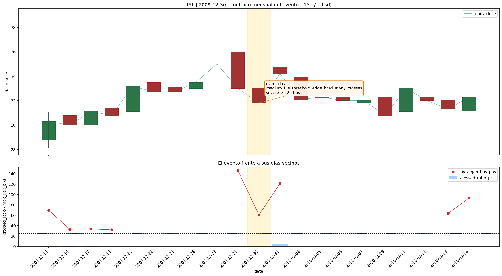

#### 00a Adjusted Proxy Contrast
Esta imagen responde a la pregunta de reconciliacion semantica: la discrepancia de precios viene de datos rotos o de vistas de precio distintas. Compara `daily raw`, `daily adjusted_proxy`, `quote mid raw` y `quote mid split_normalized`, y debajo ensena la cadena de dividendos y splits que produce la diferencia. La decision que cambia es si el inspector debe abrir una incidencia de calidad o cerrar el caso como diferencia legitima de semantica. El error que evita es mezclar series raw y adjusted como si fueran equivalentes. En pipelines reales, esto protege benchmarking, labels diarios y reconciliacion externa frente a falsas alarmas de precio.

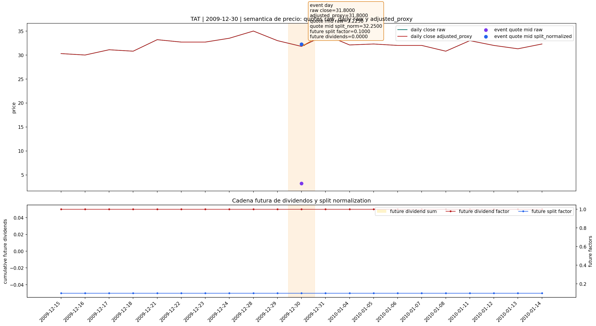

#### 00b Event Month Quotes Context
Esta imagen responde a la pregunta de recurrencia mensual dentro de `quotes`: el problema se concentra en el evento o reaparece en varias sesiones. Arriba concatena sesiones con datos disponibles; abajo resume cobertura diaria, `crossed_ratio_pct` y `max_gap_bps_pos`. La decision que cambia es si el caso debe leerse como episodio puntual o como sintoma de una fase repetida de libro degradado. El error que evita es extrapolar desde un unico dia a todo el mes sin evidencia.

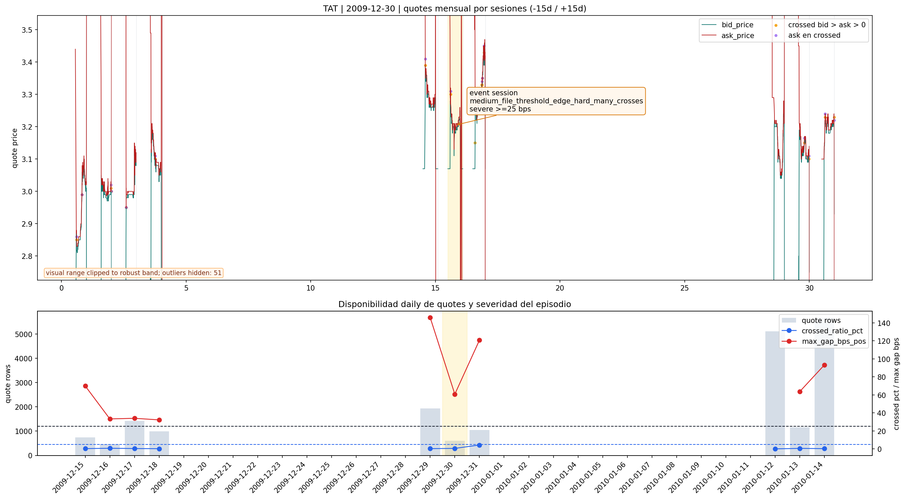

#### 01 Raw Window
Esta imagen responde a la primera pregunta decisiva del caso: el crossed observado es economicamente bastante fuerte para justificar un cambio de clase. Arriba ensena la geometria exacta del tramo conflictivo; abajo convierte esa geometria a bps y la enfrenta a los cortes `5 bps` y `25 bps`. El regimen dominante es `severe >=25 bps`. La decision que cambia es pasar de anomalia interpretable a `review` o `bad`. El error que evita es decidir por apariencia visual sin medir el dano economico real del crossed. En terminos de pipeline, este panel decide si el problema afecta solo a la lectura forense o si invalida simulacion de ejecucion y microstructure features.

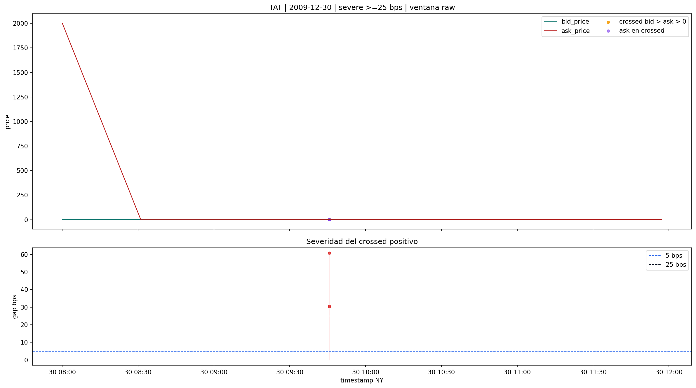

#### 02 Full Session Context
Esta imagen responde a la pregunta de extension intradiaria: el dano esta confinado a un bloque corto o contamina la sesion completa. Arriba se ve toda la sesion `04:00-20:00 NY`; abajo el `gap_bps` firmado. La decision que cambia es si el consumo debe penalizar solo un tramo o desechar el dia entero para uso operativo. El error que evita es tratar una cicatriz local como ruina total o, al reves, minimizar una degradacion distribuida a lo largo del dia. En ejecucion esto decide si la sesion puede seguir usandose con restricciones; en ML decide si las features intradiarias conservan significado economico.

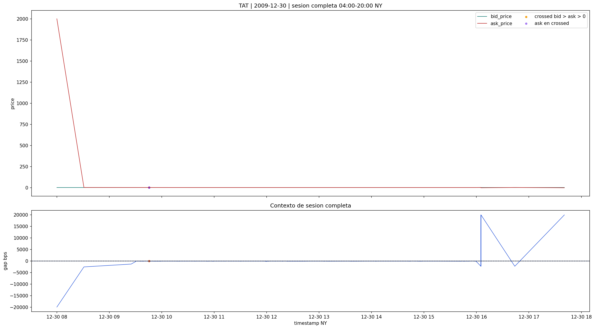

#### 03 Structure Diagnostics
Este panel responde a la pregunta de naturaleza del fallo: contradiccion economica genuina o mezcla con degeneracion estructural. Separa `ask=0` de `ask>0`, muestra la distribucion de `gap_bps` y resume patrones de integerizacion. La decision que cambia es como interpretar el dano: mercado localmente roto, artefacto de representacion o combinacion de ambos. El error que evita es sobrediagnosticar crossed reales cuando parte de la senal proviene de estructura degenerada del libro. Esta lectura afecta directamente a que el caso vaya a exclusion dura, a bandera contextual o a simple reconciliacion tecnica.

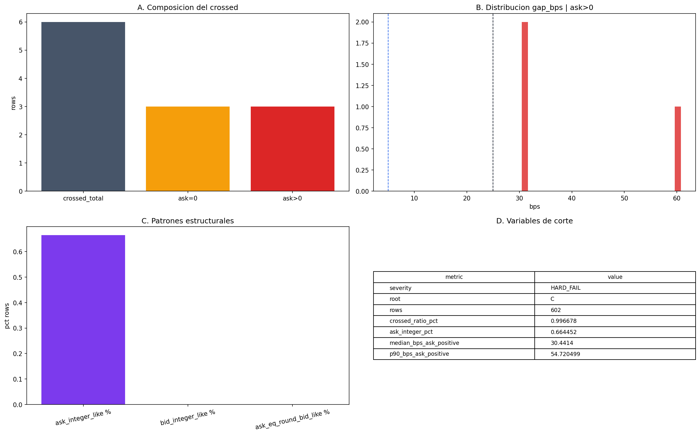

#### 04 Summary Card
Esta tarjeta responde a la pregunta de auditabilidad: cuales son exactamente las variables que sostienen la conclusion. Reune `severity`, `root`, `crossed_ratio_pct`, `ask_integer_pct`, `median_bps_ask_positive` y `p90_bps_ask_positive`. La decision que cambia es pasar de impresion visual a regla verificable. El error que evita es que dos inspectores lleguen a conclusiones distintas mirando la misma imagen sin una base numerica comun. Para gobernanza del proyecto, este panel es el que vuelve reproducible la decision para backtest, ML y auditoria.

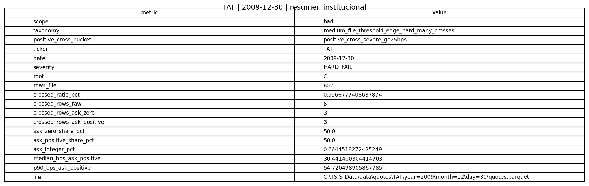

---

### 8. UXG 2007-03-01

company_name: `U S GOLD CORP`
primary_exchange: `NYSE American` (`XASE`)
market_locale: `stocks/us`
scope: `bad`
ticker: `UXG`
date: `2007-03-01`
taxonomy: `medium_file_threshold_edge_hard_many_crosses`
positive_cross_bucket: `positive_cross_moderate_5to25bps`
severity: `HARD_FAIL`
root: `D`
rows: `575`
crossed_ratio_pct: `1.391304`
crossed_rows_raw: `8`
crossed_rows_ask_zero: `0`
crossed_rows_ask_positive: `8`
ask_integer_pct: `0.000000`
median_bps_ask_positive: `21.482277`
p90_bps_ask_positive: `21.652809`
file: `D:\quotes\UXG\year=2007\month=03\day=01\quotes.parquet`

#### Analisis Forense
La conclusion correcta del caso es que la contradiccion local entre bid y ask ya compromete la credibilidad economica del libro y bloquea su consumo como si fuera mercado normal. La taxonomy historica es `medium_file_threshold_edge_hard_many_crosses` y el regimen positivo dominante es `moderate 5-25 bps`. Esto importa porque la taxonomy no solo clasifica: resume que tipo de anomalia se esta viendo y que clase de decision contractual puede defenderse despues. La taxonomy `medium_file_threshold_edge_hard_many_crosses` implica que el mismo tipo de dano aparece en un file menos grande y por eso pesa mas: hay menos masa para diluir la anomalia y la exclusion se vuelve mas defendible. El regimen `moderate 5-25 bps` ya entra en zona donde el crossed tiene capacidad real de contaminar simulacion de ejecucion y features microestructurales, aunque todavia puede requerir lectura contextual antes de exclusion dura. En terminos observables, el file tiene `crossed_ratio_pct=1.391304` con `crossed_rows_ask_positive=8` y `crossed_rows_ask_zero=0`. La severidad economica del crossed ask>0 se resume en `median_bps_ask_positive=21.482277` y `p90_bps_ask_positive=21.652809`. Estos dos numeros convierten una forma visual rara en una conclusion operativa sobre si el libro sigue representando o no un mercado negociable. La decision que cambia es exclusion del consumo core del libro. `bad` significa que el estado local ya no puede alimentar ejecucion, mark-to-market intradiario ni aprendizaje de ML como si fuese microestructura defendible. El error que evita es construir decisiones sobre un libro que ha dejado de representar un mercado localmente creible. El patron estructural muestra `ask_integer_pct=0.000000`. Este numero obliga a separar dos explicaciones rivales: contradiccion economica genuina del libro o mezcla con degeneracion estructural / integerizacion. Toda la composicion crossed cae en `ask>0`. Eso endurece la lectura economica del caso: el dano no depende de ceros mecanicos, sino de contradiccion positiva dentro de precios aparentemente vivos. Como `ask_integer_pct` es bajo, la hipotesis de simple degeneracion mecanica pierde fuerza. Eso endurece la interpretacion: el crossed se parece mas a contradiccion economica genuina y menos a artefacto. Existe ademas una imagen historica de certificacion asociada. Su papel es poner el episodio en un marco causal mas amplio: halt, explained, not strongly explained o patron conocido. La regla que protege al proyecto es esta: el contexto externo se usa para explicar por que aparece el episodio, no para absolverlo. El error que evita es degradar el criterio de calidad del libro porque exista una historia plausible alrededor del caso.

#### 00 Event Month Context
Esta imagen responde a la pregunta de persistencia temporal: estamos ante un accidente local o ante una fase mas amplia de inestabilidad. Arriba coloca el evento en la serie `daily` real del mes; abajo compara `crossed_ratio_pct` y `max_gap_bps_pos` del dia contra sus vecinos. La decision que cambia es el peso estructural que se le concede al caso. El error que evita es juzgar igual un shock aislado y una degradacion repetida del libro.

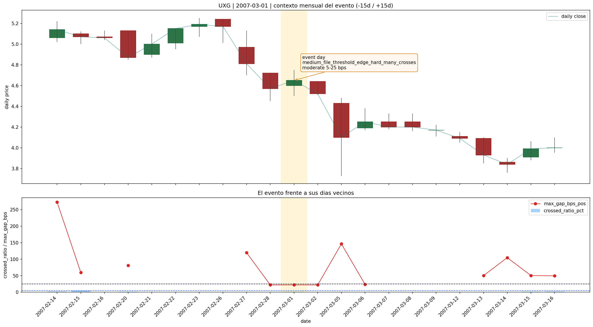

#### 00b Event Month Quotes Context
Esta imagen responde a la pregunta de recurrencia mensual dentro de `quotes`: el problema se concentra en el evento o reaparece en varias sesiones. Arriba concatena sesiones con datos disponibles; abajo resume cobertura diaria, `crossed_ratio_pct` y `max_gap_bps_pos`. La decision que cambia es si el caso debe leerse como episodio puntual o como sintoma de una fase repetida de libro degradado. El error que evita es extrapolar desde un unico dia a todo el mes sin evidencia.

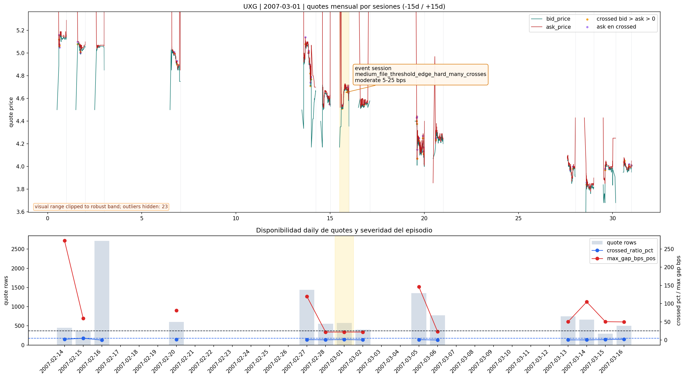

#### 01 Raw Window
Esta imagen responde a la primera pregunta decisiva del caso: el crossed observado es economicamente bastante fuerte para justificar un cambio de clase. Arriba ensena la geometria exacta del tramo conflictivo; abajo convierte esa geometria a bps y la enfrenta a los cortes `5 bps` y `25 bps`. El regimen dominante es `moderate 5-25 bps`. La decision que cambia es pasar de anomalia interpretable a `review` o `bad`. El error que evita es decidir por apariencia visual sin medir el dano economico real del crossed. En terminos de pipeline, este panel decide si el problema afecta solo a la lectura forense o si invalida simulacion de ejecucion y microstructure features.

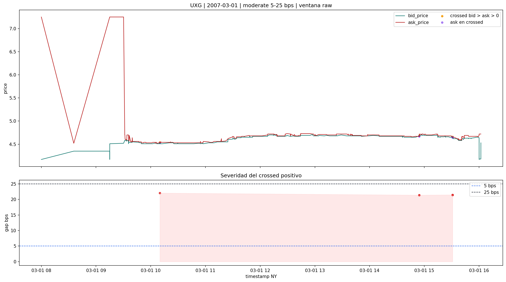

#### 02 Full Session Context
Esta imagen responde a la pregunta de extension intradiaria: el dano esta confinado a un bloque corto o contamina la sesion completa. Arriba se ve toda la sesion `04:00-20:00 NY`; abajo el `gap_bps` firmado. La decision que cambia es si el consumo debe penalizar solo un tramo o desechar el dia entero para uso operativo. El error que evita es tratar una cicatriz local como ruina total o, al reves, minimizar una degradacion distribuida a lo largo del dia. En ejecucion esto decide si la sesion puede seguir usandose con restricciones; en ML decide si las features intradiarias conservan significado economico.

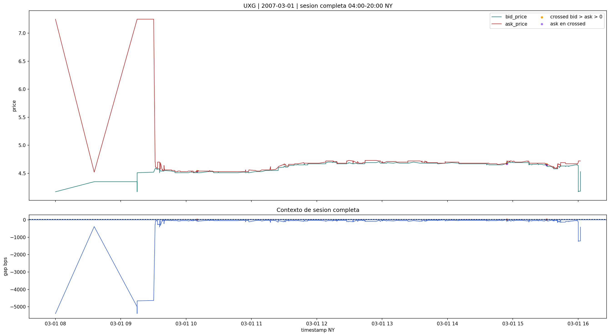

#### 03 Structure Diagnostics
Este panel responde a la pregunta de naturaleza del fallo: contradiccion economica genuina o mezcla con degeneracion estructural. Separa `ask=0` de `ask>0`, muestra la distribucion de `gap_bps` y resume patrones de integerizacion. La decision que cambia es como interpretar el dano: mercado localmente roto, artefacto de representacion o combinacion de ambos. El error que evita es sobrediagnosticar crossed reales cuando parte de la senal proviene de estructura degenerada del libro. Esta lectura afecta directamente a que el caso vaya a exclusion dura, a bandera contextual o a simple reconciliacion tecnica.

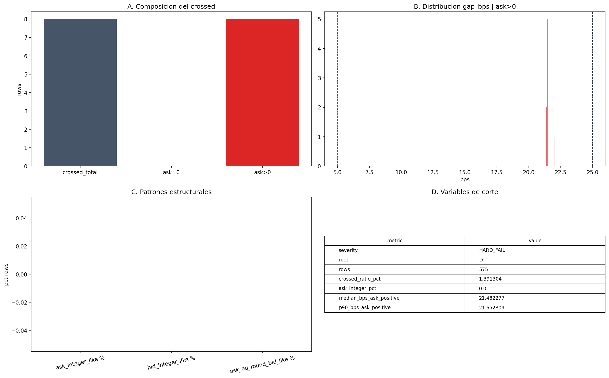

#### 04 Summary Card
Esta tarjeta responde a la pregunta de auditabilidad: cuales son exactamente las variables que sostienen la conclusion. Reune `severity`, `root`, `crossed_ratio_pct`, `ask_integer_pct`, `median_bps_ask_positive` y `p90_bps_ask_positive`. La decision que cambia es pasar de impresion visual a regla verificable. El error que evita es que dos inspectores lleguen a conclusiones distintas mirando la misma imagen sin una base numerica comun. Para gobernanza del proyecto, este panel es el que vuelve reproducible la decision para backtest, ML y auditoria.

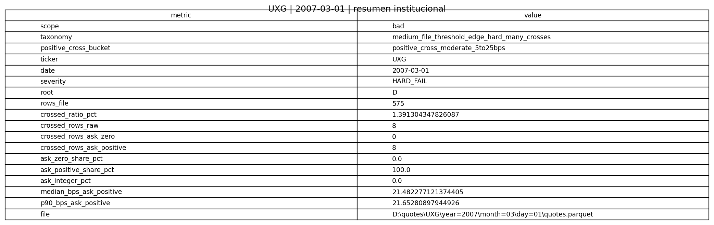

---

### 9. MSW 2005-07-27

company_name: `Ming Shing Group Holdings Limited Ordinary Shares`
primary_exchange: `NASDAQ` (`XNAS`)
market_locale: `stocks/us`
scope: `bad`
ticker: `MSW`
date: `2005-07-27`
taxonomy: `medium_file_threshold_edge_hard_many_crosses`
positive_cross_bucket: `positive_cross_moderate_5to25bps`
severity: `HARD_FAIL`
root: `D`
rows: `264`
crossed_ratio_pct: `3.030303`
crossed_rows_raw: `8`
crossed_rows_ask_zero: `0`
crossed_rows_ask_positive: `8`
ask_integer_pct: `0.757576`
median_bps_ask_positive: `18.885741`
p90_bps_ask_positive: `37.629351`
file: `D:\quotes\MSW\year=2005\month=07\day=27\quotes.parquet`

#### Analisis Forense
La conclusion correcta del caso es que la contradiccion local entre bid y ask ya compromete la credibilidad economica del libro y bloquea su consumo como si fuera mercado normal. La taxonomy historica es `medium_file_threshold_edge_hard_many_crosses` y el regimen positivo dominante es `moderate 5-25 bps`. Esto importa porque la taxonomy no solo clasifica: resume que tipo de anomalia se esta viendo y que clase de decision contractual puede defenderse despues. La taxonomy `medium_file_threshold_edge_hard_many_crosses` implica que el mismo tipo de dano aparece en un file menos grande y por eso pesa mas: hay menos masa para diluir la anomalia y la exclusion se vuelve mas defendible. El regimen `moderate 5-25 bps` ya entra en zona donde el crossed tiene capacidad real de contaminar simulacion de ejecucion y features microestructurales, aunque todavia puede requerir lectura contextual antes de exclusion dura. En terminos observables, el file tiene `crossed_ratio_pct=3.030303` con `crossed_rows_ask_positive=8` y `crossed_rows_ask_zero=0`. La severidad economica del crossed ask>0 se resume en `median_bps_ask_positive=18.885741` y `p90_bps_ask_positive=37.629351`. Estos dos numeros convierten una forma visual rara en una conclusion operativa sobre si el libro sigue representando o no un mercado negociable. La decision que cambia es exclusion del consumo core del libro. `bad` significa que el estado local ya no puede alimentar ejecucion, mark-to-market intradiario ni aprendizaje de ML como si fuese microestructura defendible. El error que evita es construir decisiones sobre un libro que ha dejado de representar un mercado localmente creible. El patron estructural muestra `ask_integer_pct=0.757576`. Este numero obliga a separar dos explicaciones rivales: contradiccion economica genuina del libro o mezcla con degeneracion estructural / integerizacion. Toda la composicion crossed cae en `ask>0`. Eso endurece la lectura economica del caso: el dano no depende de ceros mecanicos, sino de contradiccion positiva dentro de precios aparentemente vivos. Como `ask_integer_pct` es bajo, la hipotesis de simple degeneracion mecanica pierde fuerza. Eso endurece la interpretacion: el crossed se parece mas a contradiccion economica genuina y menos a artefacto. En la capa de semantica de precio del evento aparecen `daily raw close=10.5000`, `quote mid raw=10.6550`, `quote mid split_normalized=10.6550`, `daily adjusted_proxy=8.7295`. Ademas hay `post_event_dividend_sum=1.8000`. La implicacion metodologica es crucial: una discrepancia entre `quotes`, `daily` y una plataforma externa no puede leerse automaticamente como fallo del dataset. Puede ser semantica de precio distinta. El error que evita esta capa es mezclar raw, split-normalized y adjusted dentro del mismo pipeline, rompiendo auditoria, benchmarking y labels. Para pipelines, esto implica exclusion de ejecucion realista, de mark-to-market intradiario defendible y de features microestructurales tratadas como si reflejaran un mercado normal. Solo debe sobrevivir en circuitos forenses o de calidad. Existe ademas una imagen historica de certificacion asociada. Su papel es poner el episodio en un marco causal mas amplio: halt, explained, not strongly explained o patron conocido. La regla que protege al proyecto es esta: el contexto externo se usa para explicar por que aparece el episodio, no para absolverlo. El error que evita es degradar el criterio de calidad del libro porque exista una historia plausible alrededor del caso.

#### 00 Event Month Context
Esta imagen responde a la pregunta de persistencia temporal: estamos ante un accidente local o ante una fase mas amplia de inestabilidad. Arriba coloca el evento en la serie `daily` real del mes; abajo compara `crossed_ratio_pct` y `max_gap_bps_pos` del dia contra sus vecinos. La decision que cambia es el peso estructural que se le concede al caso. El error que evita es juzgar igual un shock aislado y una degradacion repetida del libro.

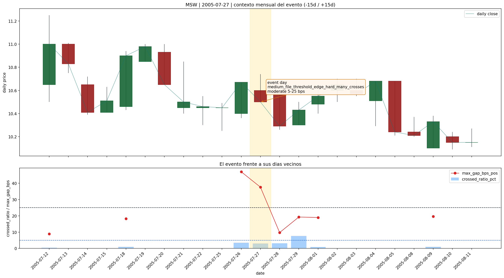

#### 00a Adjusted Proxy Contrast
Esta imagen responde a la pregunta de reconciliacion semantica: la discrepancia de precios viene de datos rotos o de vistas de precio distintas. Compara `daily raw`, `daily adjusted_proxy`, `quote mid raw` y `quote mid split_normalized`, y debajo ensena la cadena de dividendos y splits que produce la diferencia. La decision que cambia es si el inspector debe abrir una incidencia de calidad o cerrar el caso como diferencia legitima de semantica. El error que evita es mezclar series raw y adjusted como si fueran equivalentes. En pipelines reales, esto protege benchmarking, labels diarios y reconciliacion externa frente a falsas alarmas de precio.

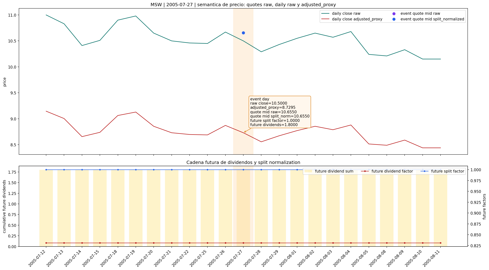

#### 00b Event Month Quotes Context
Esta imagen responde a la pregunta de recurrencia mensual dentro de `quotes`: el problema se concentra en el evento o reaparece en varias sesiones. Arriba concatena sesiones con datos disponibles; abajo resume cobertura diaria, `crossed_ratio_pct` y `max_gap_bps_pos`. La decision que cambia es si el caso debe leerse como episodio puntual o como sintoma de una fase repetida de libro degradado. El error que evita es extrapolar desde un unico dia a todo el mes sin evidencia.

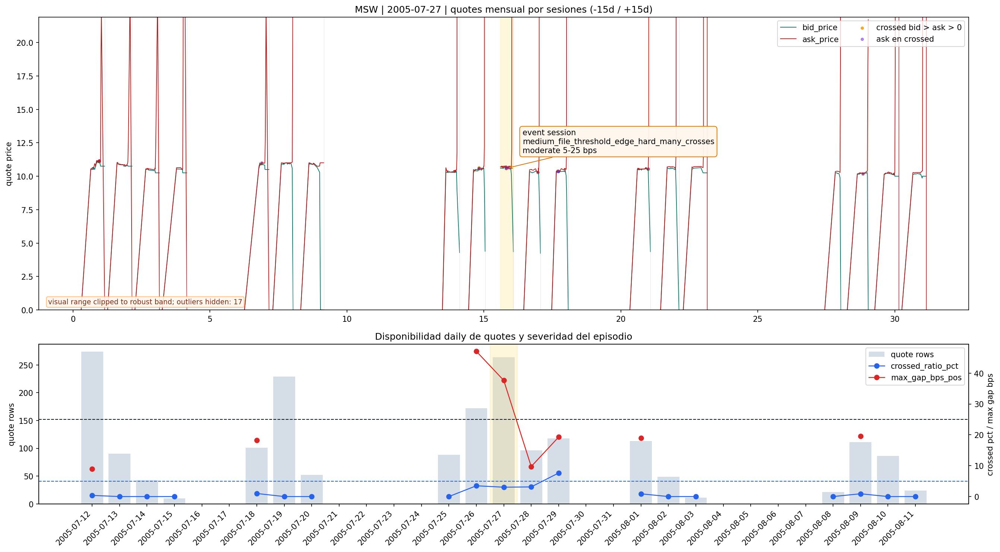

#### 01 Raw Window
Esta imagen responde a la primera pregunta decisiva del caso: el crossed observado es economicamente bastante fuerte para justificar un cambio de clase. Arriba ensena la geometria exacta del tramo conflictivo; abajo convierte esa geometria a bps y la enfrenta a los cortes `5 bps` y `25 bps`. El regimen dominante es `moderate 5-25 bps`. La decision que cambia es pasar de anomalia interpretable a `review` o `bad`. El error que evita es decidir por apariencia visual sin medir el dano economico real del crossed. En terminos de pipeline, este panel decide si el problema afecta solo a la lectura forense o si invalida simulacion de ejecucion y microstructure features.

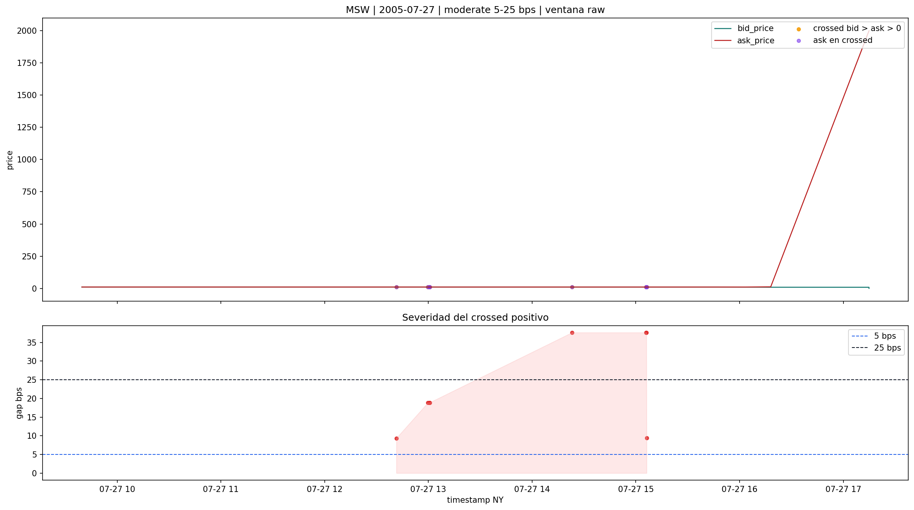

#### 02 Full Session Context
Esta imagen responde a la pregunta de extension intradiaria: el dano esta confinado a un bloque corto o contamina la sesion completa. Arriba se ve toda la sesion `04:00-20:00 NY`; abajo el `gap_bps` firmado. La decision que cambia es si el consumo debe penalizar solo un tramo o desechar el dia entero para uso operativo. El error que evita es tratar una cicatriz local como ruina total o, al reves, minimizar una degradacion distribuida a lo largo del dia. En ejecucion esto decide si la sesion puede seguir usandose con restricciones; en ML decide si las features intradiarias conservan significado economico.

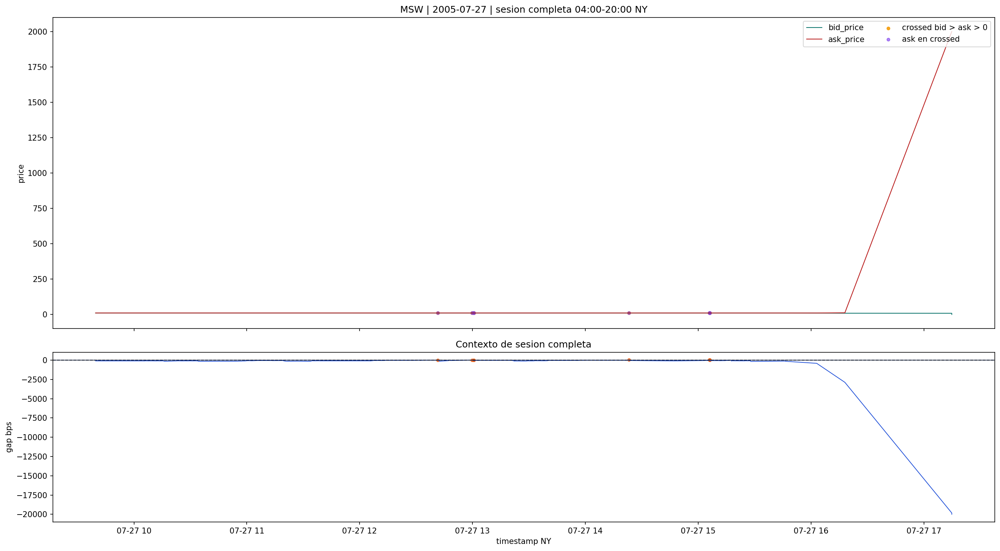

#### 03 Structure Diagnostics
Este panel responde a la pregunta de naturaleza del fallo: contradiccion economica genuina o mezcla con degeneracion estructural. Separa `ask=0` de `ask>0`, muestra la distribucion de `gap_bps` y resume patrones de integerizacion. La decision que cambia es como interpretar el dano: mercado localmente roto, artefacto de representacion o combinacion de ambos. El error que evita es sobrediagnosticar crossed reales cuando parte de la senal proviene de estructura degenerada del libro. Esta lectura afecta directamente a que el caso vaya a exclusion dura, a bandera contextual o a simple reconciliacion tecnica.

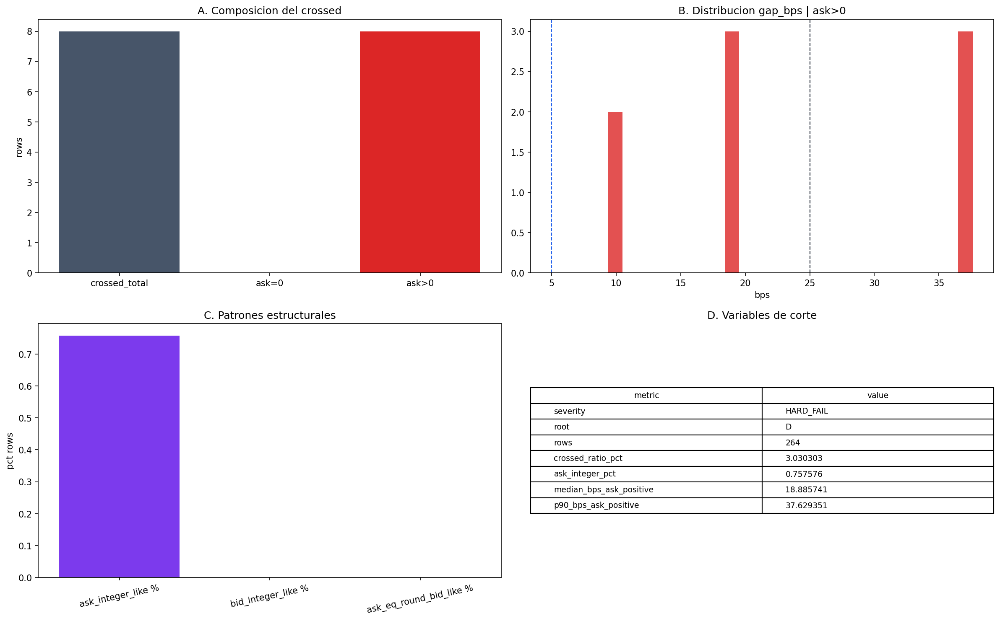

#### 04 Summary Card
Esta tarjeta responde a la pregunta de auditabilidad: cuales son exactamente las variables que sostienen la conclusion. Reune `severity`, `root`, `crossed_ratio_pct`, `ask_integer_pct`, `median_bps_ask_positive` y `p90_bps_ask_positive`. La decision que cambia es pasar de impresion visual a regla verificable. El error que evita es que dos inspectores lleguen a conclusiones distintas mirando la misma imagen sin una base numerica comun. Para gobernanza del proyecto, este panel es el que vuelve reproducible la decision para backtest, ML y auditoria.

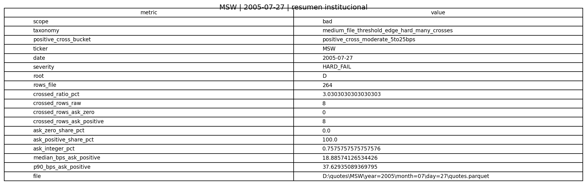

---

### 10. HGSH 2013-04-26

company_name: `China HGS Real Estate, Inc.`
primary_exchange: `NASDAQ` (`XNAS`)
market_locale: `stocks/us`
scope: `bad`
ticker: `HGSH`
date: `2013-04-26`
taxonomy: `medium_file_threshold_edge_hard_many_crosses`
positive_cross_bucket: `positive_cross_moderate_5to25bps`
severity: `HARD_FAIL`
root: `D`
rows: `359`
crossed_ratio_pct: `2.228412`
crossed_rows_raw: `8`
crossed_rows_ask_zero: `6`
crossed_rows_ask_positive: `2`
ask_integer_pct: `1.671309`
median_bps_ask_positive: `8.288438`
p90_bps_ask_positive: `8.288438`
file: `D:\quotes\HGSH\year=2013\month=04\day=26\quotes.parquet`

#### Analisis Forense
La conclusion correcta del caso es que la contradiccion local entre bid y ask ya compromete la credibilidad economica del libro y bloquea su consumo como si fuera mercado normal. La taxonomy historica es `medium_file_threshold_edge_hard_many_crosses` y el regimen positivo dominante es `moderate 5-25 bps`. Esto importa porque la taxonomy no solo clasifica: resume que tipo de anomalia se esta viendo y que clase de decision contractual puede defenderse despues. La taxonomy `medium_file_threshold_edge_hard_many_crosses` implica que el mismo tipo de dano aparece en un file menos grande y por eso pesa mas: hay menos masa para diluir la anomalia y la exclusion se vuelve mas defendible. El regimen `moderate 5-25 bps` ya entra en zona donde el crossed tiene capacidad real de contaminar simulacion de ejecucion y features microestructurales, aunque todavia puede requerir lectura contextual antes de exclusion dura. En terminos observables, el file tiene `crossed_ratio_pct=2.228412` con `crossed_rows_ask_positive=2` y `crossed_rows_ask_zero=6`. La severidad economica del crossed ask>0 se resume en `median_bps_ask_positive=8.288438` y `p90_bps_ask_positive=8.288438`. Estos dos numeros convierten una forma visual rara en una conclusion operativa sobre si el libro sigue representando o no un mercado negociable. La decision que cambia es exclusion del consumo core del libro. `bad` significa que el estado local ya no puede alimentar ejecucion, mark-to-market intradiario ni aprendizaje de ML como si fuese microestructura defendible. El error que evita es construir decisiones sobre un libro que ha dejado de representar un mercado localmente creible. El patron estructural muestra `ask_integer_pct=1.671309`. Este numero obliga a separar dos explicaciones rivales: contradiccion economica genuina del libro o mezcla con degeneracion estructural / integerizacion. La mayor parte del crossed vive en `ask=0`, pero existe una cola `ask>0` que impide absolver el caso como simple glitch. La lectura correcta es mixta: dano estructural dominante con residuo economico que aun puede justificar bandera o exclusion. Como `ask_integer_pct` es bajo, la hipotesis de simple degeneracion mecanica pierde fuerza. Eso endurece la interpretacion: el crossed se parece mas a contradiccion economica genuina y menos a artefacto. Existe ademas una imagen historica de certificacion asociada. Su papel es poner el episodio en un marco causal mas amplio: halt, explained, not strongly explained o patron conocido. La regla que protege al proyecto es esta: el contexto externo se usa para explicar por que aparece el episodio, no para absolverlo. El error que evita es degradar el criterio de calidad del libro porque exista una historia plausible alrededor del caso.

#### 00 Event Month Context
Esta imagen responde a la pregunta de persistencia temporal: estamos ante un accidente local o ante una fase mas amplia de inestabilidad. Arriba coloca el evento en la serie `daily` real del mes; abajo compara `crossed_ratio_pct` y `max_gap_bps_pos` del dia contra sus vecinos. La decision que cambia es el peso estructural que se le concede al caso. El error que evita es juzgar igual un shock aislado y una degradacion repetida del libro.

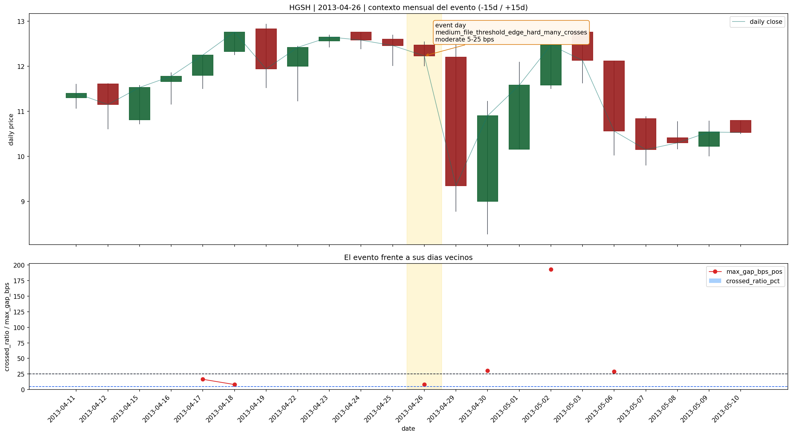

#### 00b Event Month Quotes Context
Esta imagen responde a la pregunta de recurrencia mensual dentro de `quotes`: el problema se concentra en el evento o reaparece en varias sesiones. Arriba concatena sesiones con datos disponibles; abajo resume cobertura diaria, `crossed_ratio_pct` y `max_gap_bps_pos`. La decision que cambia es si el caso debe leerse como episodio puntual o como sintoma de una fase repetida de libro degradado. El error que evita es extrapolar desde un unico dia a todo el mes sin evidencia.

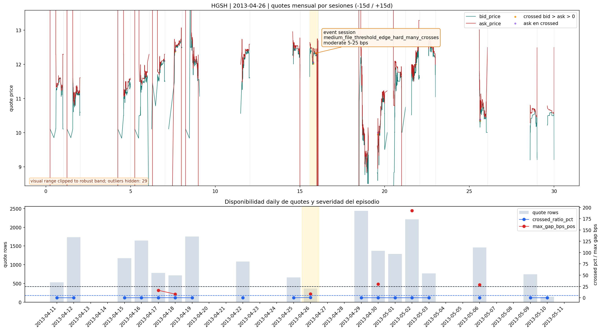

#### 01 Raw Window
Esta imagen responde a la primera pregunta decisiva del caso: el crossed observado es economicamente bastante fuerte para justificar un cambio de clase. Arriba ensena la geometria exacta del tramo conflictivo; abajo convierte esa geometria a bps y la enfrenta a los cortes `5 bps` y `25 bps`. El regimen dominante es `moderate 5-25 bps`. La decision que cambia es pasar de anomalia interpretable a `review` o `bad`. El error que evita es decidir por apariencia visual sin medir el dano economico real del crossed. En terminos de pipeline, este panel decide si el problema afecta solo a la lectura forense o si invalida simulacion de ejecucion y microstructure features.

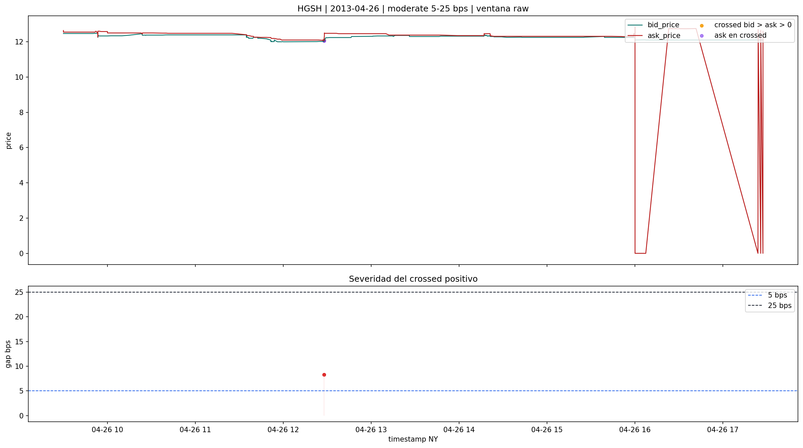

#### 02 Full Session Context
Esta imagen responde a la pregunta de extension intradiaria: el dano esta confinado a un bloque corto o contamina la sesion completa. Arriba se ve toda la sesion `04:00-20:00 NY`; abajo el `gap_bps` firmado. La decision que cambia es si el consumo debe penalizar solo un tramo o desechar el dia entero para uso operativo. El error que evita es tratar una cicatriz local como ruina total o, al reves, minimizar una degradacion distribuida a lo largo del dia. En ejecucion esto decide si la sesion puede seguir usandose con restricciones; en ML decide si las features intradiarias conservan significado economico.

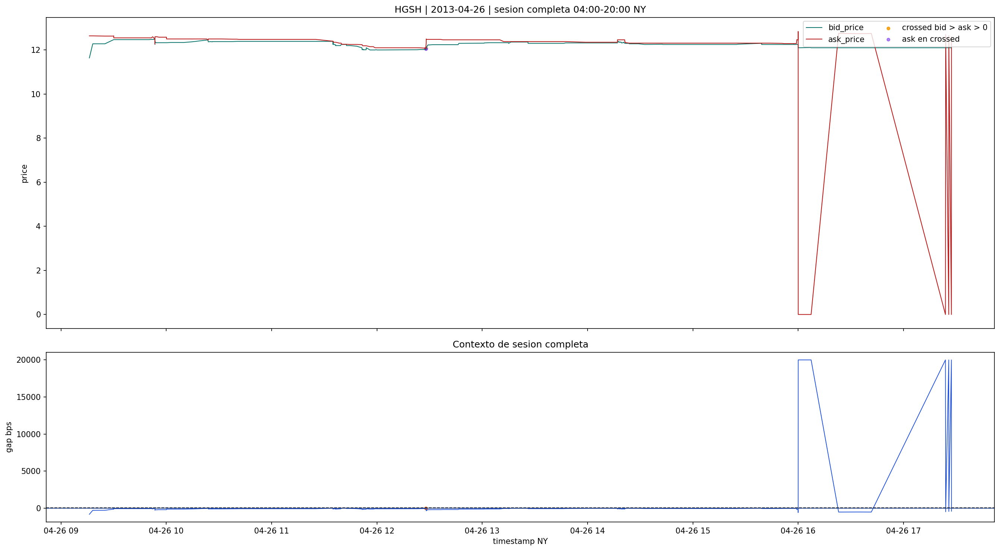

#### 03 Structure Diagnostics
Este panel responde a la pregunta de naturaleza del fallo: contradiccion economica genuina o mezcla con degeneracion estructural. Separa `ask=0` de `ask>0`, muestra la distribucion de `gap_bps` y resume patrones de integerizacion. La decision que cambia es como interpretar el dano: mercado localmente roto, artefacto de representacion o combinacion de ambos. El error que evita es sobrediagnosticar crossed reales cuando parte de la senal proviene de estructura degenerada del libro. Esta lectura afecta directamente a que el caso vaya a exclusion dura, a bandera contextual o a simple reconciliacion tecnica.

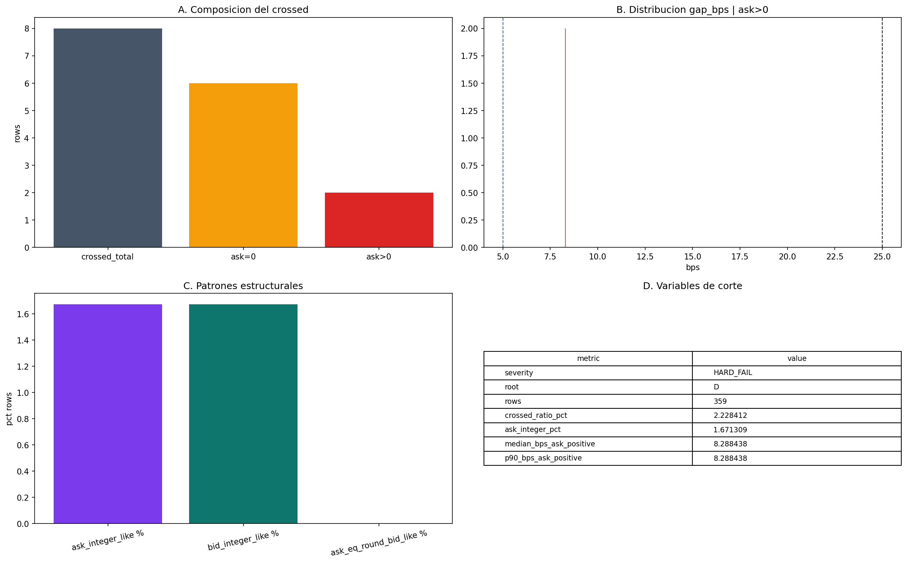

#### 04 Summary Card
Esta tarjeta responde a la pregunta de auditabilidad: cuales son exactamente las variables que sostienen la conclusion. Reune `severity`, `root`, `crossed_ratio_pct`, `ask_integer_pct`, `median_bps_ask_positive` y `p90_bps_ask_positive`. La decision que cambia es pasar de impresion visual a regla verificable. El error que evita es que dos inspectores lleguen a conclusiones distintas mirando la misma imagen sin una base numerica comun. Para gobernanza del proyecto, este panel es el que vuelve reproducible la decision para backtest, ML y auditoria.

---

### 11. BBW 2005-10-26

company_name: `Build-A-Bear Workshop, Inc.`
primary_exchange: `NYSE` (`XNYS`)
market_locale: `stocks/us`
scope: `bad`
ticker: `BBW`
date: `2005-10-26`
taxonomy: `medium_file_threshold_edge_hard_many_crosses`
positive_cross_bucket: `positive_cross_mild_lt5bps`
severity: `HARD_FAIL`
root: `D`
rows: `632`
crossed_ratio_pct: `1.740506`
crossed_rows_raw: `11`
crossed_rows_ask_zero: `1`
crossed_rows_ask_positive: `10`
ask_integer_pct: `21.677215`
median_bps_ask_positive: `4.217712`
p90_bps_ask_positive: `8.587377`
file: `D:\quotes\BBW\year=2005\month=10\day=26\quotes.parquet`

#### Analisis Forense
La conclusion correcta del caso es que la contradiccion local entre bid y ask ya compromete la credibilidad economica del libro y bloquea su consumo como si fuera mercado normal. La taxonomy historica es `medium_file_threshold_edge_hard_many_crosses` y el regimen positivo dominante es `mild <5 bps`. Esto importa porque la taxonomy no solo clasifica: resume que tipo de anomalia se esta viendo y que clase de decision contractual puede defenderse despues. La taxonomy `medium_file_threshold_edge_hard_many_crosses` implica que el mismo tipo de dano aparece en un file menos grande y por eso pesa mas: hay menos masa para diluir la anomalia y la exclusion se vuelve mas defendible. El regimen `mild <5 bps` significa que existe contradiccion economica positiva, pero aun en una banda donde un uso prudente puede seguir siendo defendible si la persistencia y la estructura no agravan el caso. En terminos observables, el file tiene `crossed_ratio_pct=1.740506` con `crossed_rows_ask_positive=10` y `crossed_rows_ask_zero=1`. La severidad economica del crossed ask>0 se resume en `median_bps_ask_positive=4.217712` y `p90_bps_ask_positive=8.587377`. Estos dos numeros convierten una forma visual rara en una conclusion operativa sobre si el libro sigue representando o no un mercado negociable. La decision que cambia es exclusion del consumo core del libro. `bad` significa que el estado local ya no puede alimentar ejecucion, mark-to-market intradiario ni aprendizaje de ML como si fuese microestructura defendible. El error que evita es construir decisiones sobre un libro que ha dejado de representar un mercado localmente creible. El patron estructural muestra `ask_integer_pct=21.677215`. Este numero obliga a separar dos explicaciones rivales: contradiccion economica genuina del libro o mezcla con degeneracion estructural / integerizacion. La mayor parte del crossed vive en `ask>0`, de modo que el corazon del problema sigue siendo economico. La parte `ask=0`, si existe, acompana pero no explica por si sola la anomalia. Como `ask_integer_pct` no es extremo, el caso exige leer geometria del crossed y estructura simultaneamente. No basta un solo numero; hay que combinar severidad, composicion y contexto. En la capa de semantica de precio del evento aparecen `daily raw close=23.3000`, `quote mid raw=23.8700`, `quote mid split_normalized=23.8700`, `daily adjusted_proxy=20.2694`. Ademas hay `post_event_dividend_sum=4.4300`. La implicacion metodologica es crucial: una discrepancia entre `quotes`, `daily` y una plataforma externa no puede leerse automaticamente como fallo del dataset. Puede ser semantica de precio distinta. El error que evita esta capa es mezclar raw, split-normalized y adjusted dentro del mismo pipeline, rompiendo auditoria, benchmarking y labels. Para pipelines, esto implica exclusion de ejecucion realista, de mark-to-market intradiario defendible y de features microestructurales tratadas como si reflejaran un mercado normal. Solo debe sobrevivir en circuitos forenses o de calidad. Existe ademas una imagen historica de certificacion asociada. Su papel es poner el episodio en un marco causal mas amplio: halt, explained, not strongly explained o patron conocido. La regla que protege al proyecto es esta: el contexto externo se usa para explicar por que aparece el episodio, no para absolverlo. El error que evita es degradar el criterio de calidad del libro porque exista una historia plausible alrededor del caso.

#### 00 Event Month Context
Esta imagen responde a la pregunta de persistencia temporal: estamos ante un accidente local o ante una fase mas amplia de inestabilidad. Arriba coloca el evento en la serie `daily` real del mes; abajo compara `crossed_ratio_pct` y `max_gap_bps_pos` del dia contra sus vecinos. La decision que cambia es el peso estructural que se le concede al caso. El error que evita es juzgar igual un shock aislado y una degradacion repetida del libro.

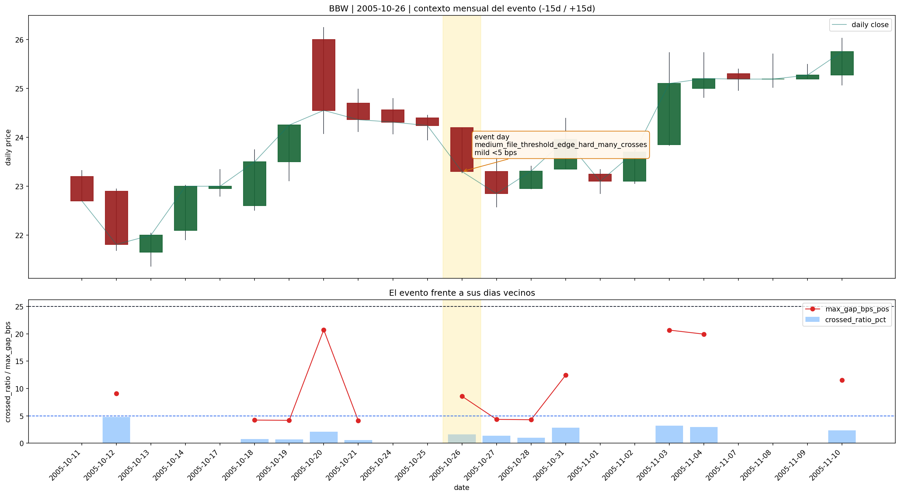

#### 00a Adjusted Proxy Contrast
Esta imagen responde a la pregunta de reconciliacion semantica: la discrepancia de precios viene de datos rotos o de vistas de precio distintas. Compara `daily raw`, `daily adjusted_proxy`, `quote mid raw` y `quote mid split_normalized`, y debajo ensena la cadena de dividendos y splits que produce la diferencia. La decision que cambia es si el inspector debe abrir una incidencia de calidad o cerrar el caso como diferencia legitima de semantica. El error que evita es mezclar series raw y adjusted como si fueran equivalentes. En pipelines reales, esto protege benchmarking, labels diarios y reconciliacion externa frente a falsas alarmas de precio.

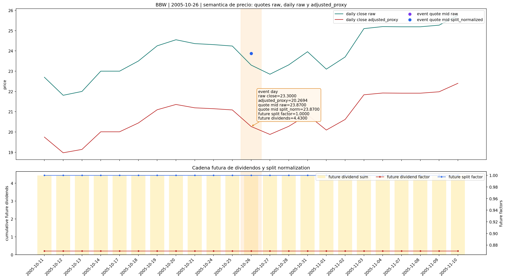

#### 00b Event Month Quotes Context
Esta imagen responde a la pregunta de recurrencia mensual dentro de `quotes`: el problema se concentra en el evento o reaparece en varias sesiones. Arriba concatena sesiones con datos disponibles; abajo resume cobertura diaria, `crossed_ratio_pct` y `max_gap_bps_pos`. La decision que cambia es si el caso debe leerse como episodio puntual o como sintoma de una fase repetida de libro degradado. El error que evita es extrapolar desde un unico dia a todo el mes sin evidencia.

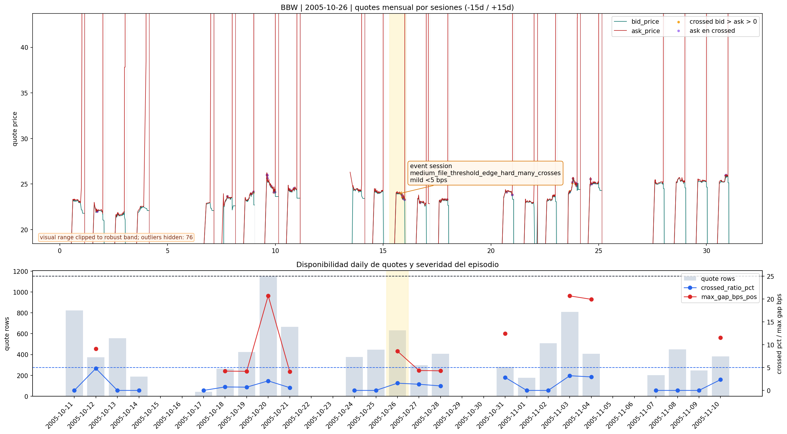

#### 01 Raw Window
Esta imagen responde a la primera pregunta decisiva del caso: el crossed observado es economicamente bastante fuerte para justificar un cambio de clase. Arriba ensena la geometria exacta del tramo conflictivo; abajo convierte esa geometria a bps y la enfrenta a los cortes `5 bps` y `25 bps`. El regimen dominante es `mild <5 bps`. La decision que cambia es pasar de anomalia interpretable a `review` o `bad`. El error que evita es decidir por apariencia visual sin medir el dano economico real del crossed. En terminos de pipeline, este panel decide si el problema afecta solo a la lectura forense o si invalida simulacion de ejecucion y microstructure features.

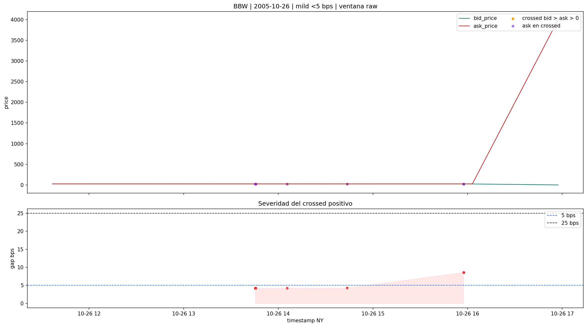

#### 02 Full Session Context
Esta imagen responde a la pregunta de extension intradiaria: el dano esta confinado a un bloque corto o contamina la sesion completa. Arriba se ve toda la sesion `04:00-20:00 NY`; abajo el `gap_bps` firmado. La decision que cambia es si el consumo debe penalizar solo un tramo o desechar el dia entero para uso operativo. El error que evita es tratar una cicatriz local como ruina total o, al reves, minimizar una degradacion distribuida a lo largo del dia. En ejecucion esto decide si la sesion puede seguir usandose con restricciones; en ML decide si las features intradiarias conservan significado economico.

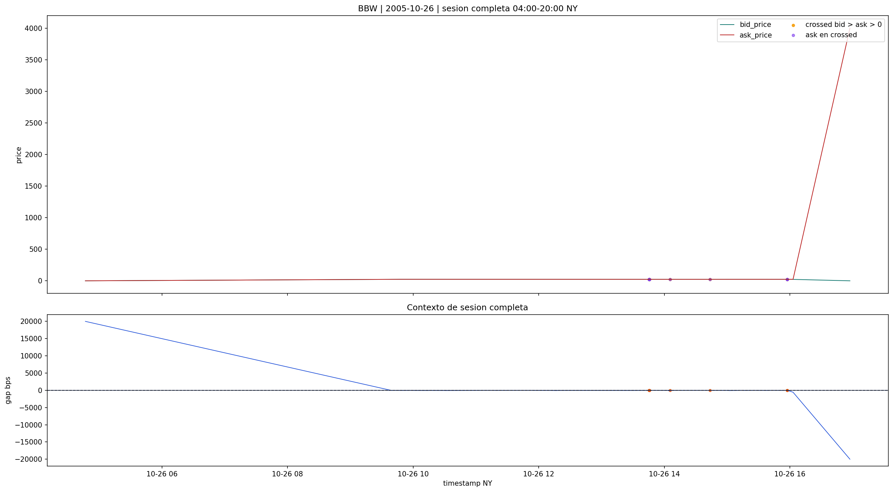

#### 03 Structure Diagnostics
Este panel responde a la pregunta de naturaleza del fallo: contradiccion economica genuina o mezcla con degeneracion estructural. Separa `ask=0` de `ask>0`, muestra la distribucion de `gap_bps` y resume patrones de integerizacion. La decision que cambia es como interpretar el dano: mercado localmente roto, artefacto de representacion o combinacion de ambos. El error que evita es sobrediagnosticar crossed reales cuando parte de la senal proviene de estructura degenerada del libro. Esta lectura afecta directamente a que el caso vaya a exclusion dura, a bandera contextual o a simple reconciliacion tecnica.

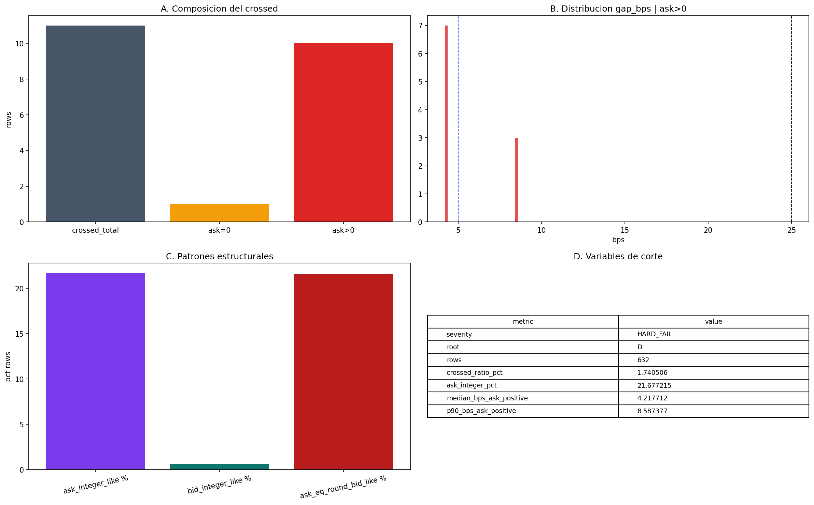

#### 04 Summary Card
Esta tarjeta responde a la pregunta de auditabilidad: cuales son exactamente las variables que sostienen la conclusion. Reune `severity`, `root`, `crossed_ratio_pct`, `ask_integer_pct`, `median_bps_ask_positive` y `p90_bps_ask_positive`. La decision que cambia es pasar de impresion visual a regla verificable. El error que evita es que dos inspectores lleguen a conclusiones distintas mirando la misma imagen sin una base numerica comun. Para gobernanza del proyecto, este panel es el que vuelve reproducible la decision para backtest, ML y auditoria.

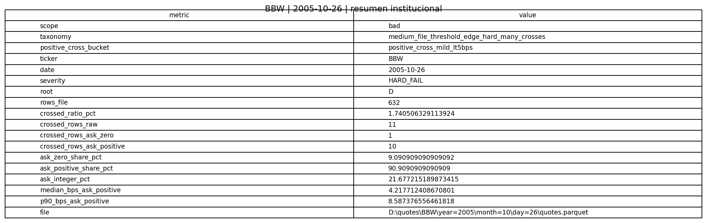

---

### 12. MMA 2006-08-11

company_name: `Mixed Martial Arts Group Limited`
primary_exchange: `NYSE American` (`XASE`)
market_locale: `stocks/us`
scope: `bad`
ticker: `MMA`
date: `2006-08-11`
taxonomy: `medium_file_threshold_edge_hard_many_crosses`
positive_cross_bucket: `positive_cross_mild_lt5bps`
severity: `HARD_FAIL`
root: `D`
rows: `752`
crossed_ratio_pct: `1.329787`
crossed_rows_raw: `10`
crossed_rows_ask_zero: `1`
crossed_rows_ask_positive: `9`
ask_integer_pct: `0.398936`
median_bps_ask_positive: `3.595182`
p90_bps_ask_positive: `7.192693`
file: `D:\quotes\MMA\year=2006\month=08\day=11\quotes.parquet`

#### Analisis Forense
La conclusion correcta del caso es que la contradiccion local entre bid y ask ya compromete la credibilidad economica del libro y bloquea su consumo como si fuera mercado normal. La taxonomy historica es `medium_file_threshold_edge_hard_many_crosses` y el regimen positivo dominante es `mild <5 bps`. Esto importa porque la taxonomy no solo clasifica: resume que tipo de anomalia se esta viendo y que clase de decision contractual puede defenderse despues. La taxonomy `medium_file_threshold_edge_hard_many_crosses` implica que el mismo tipo de dano aparece en un file menos grande y por eso pesa mas: hay menos masa para diluir la anomalia y la exclusion se vuelve mas defendible. El regimen `mild <5 bps` significa que existe contradiccion economica positiva, pero aun en una banda donde un uso prudente puede seguir siendo defendible si la persistencia y la estructura no agravan el caso. En terminos observables, el file tiene `crossed_ratio_pct=1.329787` con `crossed_rows_ask_positive=9` y `crossed_rows_ask_zero=1`. La severidad economica del crossed ask>0 se resume en `median_bps_ask_positive=3.595182` y `p90_bps_ask_positive=7.192693`. Estos dos numeros convierten una forma visual rara en una conclusion operativa sobre si el libro sigue representando o no un mercado negociable. La decision que cambia es exclusion del consumo core del libro. `bad` significa que el estado local ya no puede alimentar ejecucion, mark-to-market intradiario ni aprendizaje de ML como si fuese microestructura defendible. El error que evita es construir decisiones sobre un libro que ha dejado de representar un mercado localmente creible. El patron estructural muestra `ask_integer_pct=0.398936`. Este numero obliga a separar dos explicaciones rivales: contradiccion economica genuina del libro o mezcla con degeneracion estructural / integerizacion. La mayor parte del crossed vive en `ask>0`, de modo que el corazon del problema sigue siendo economico. La parte `ask=0`, si existe, acompana pero no explica por si sola la anomalia. Como `ask_integer_pct` es bajo, la hipotesis de simple degeneracion mecanica pierde fuerza. Eso endurece la interpretacion: el crossed se parece mas a contradiccion economica genuina y menos a artefacto. En la capa de semantica de precio del evento aparecen `daily raw close=27.7500`, `quote mid raw=27.7550`, `quote mid split_normalized=27.7550`, `daily adjusted_proxy=24.3688`. Ademas hay `post_event_dividend_sum=2.9150`. La implicacion metodologica es crucial: una discrepancia entre `quotes`, `daily` y una plataforma externa no puede leerse automaticamente como fallo del dataset. Puede ser semantica de precio distinta. El error que evita esta capa es mezclar raw, split-normalized y adjusted dentro del mismo pipeline, rompiendo auditoria, benchmarking y labels. Para pipelines, esto implica exclusion de ejecucion realista, de mark-to-market intradiario defendible y de features microestructurales tratadas como si reflejaran un mercado normal. Solo debe sobrevivir en circuitos forenses o de calidad. Existe ademas una imagen historica de certificacion asociada. Su papel es poner el episodio en un marco causal mas amplio: halt, explained, not strongly explained o patron conocido. La regla que protege al proyecto es esta: el contexto externo se usa para explicar por que aparece el episodio, no para absolverlo. El error que evita es degradar el criterio de calidad del libro porque exista una historia plausible alrededor del caso.

#### 00 Event Month Context
Esta imagen responde a la pregunta de persistencia temporal: estamos ante un accidente local o ante una fase mas amplia de inestabilidad. Arriba coloca el evento en la serie `daily` real del mes; abajo compara `crossed_ratio_pct` y `max_gap_bps_pos` del dia contra sus vecinos. La decision que cambia es el peso estructural que se le concede al caso. El error que evita es juzgar igual un shock aislado y una degradacion repetida del libro.

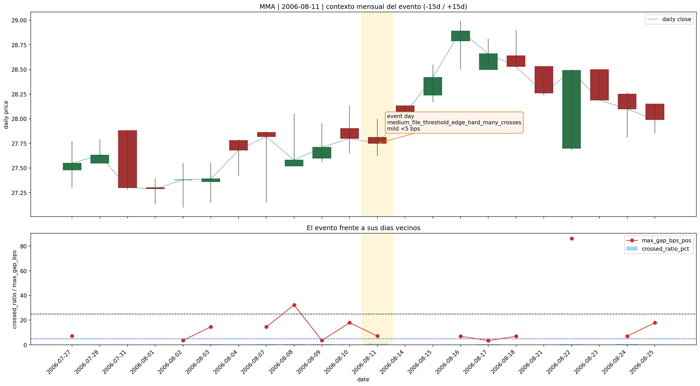

#### 00a Adjusted Proxy Contrast
Esta imagen responde a la pregunta de reconciliacion semantica: la discrepancia de precios viene de datos rotos o de vistas de precio distintas. Compara `daily raw`, `daily adjusted_proxy`, `quote mid raw` y `quote mid split_normalized`, y debajo ensena la cadena de dividendos y splits que produce la diferencia. La decision que cambia es si el inspector debe abrir una incidencia de calidad o cerrar el caso como diferencia legitima de semantica. El error que evita es mezclar series raw y adjusted como si fueran equivalentes. En pipelines reales, esto protege benchmarking, labels diarios y reconciliacion externa frente a falsas alarmas de precio.

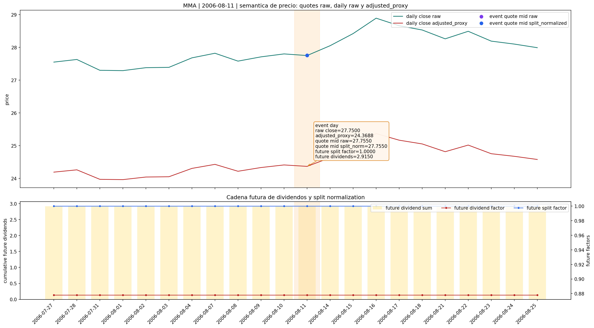

#### 00b Event Month Quotes Context
Esta imagen responde a la pregunta de recurrencia mensual dentro de `quotes`: el problema se concentra en el evento o reaparece en varias sesiones. Arriba concatena sesiones con datos disponibles; abajo resume cobertura diaria, `crossed_ratio_pct` y `max_gap_bps_pos`. La decision que cambia es si el caso debe leerse como episodio puntual o como sintoma de una fase repetida de libro degradado. El error que evita es extrapolar desde un unico dia a todo el mes sin evidencia.

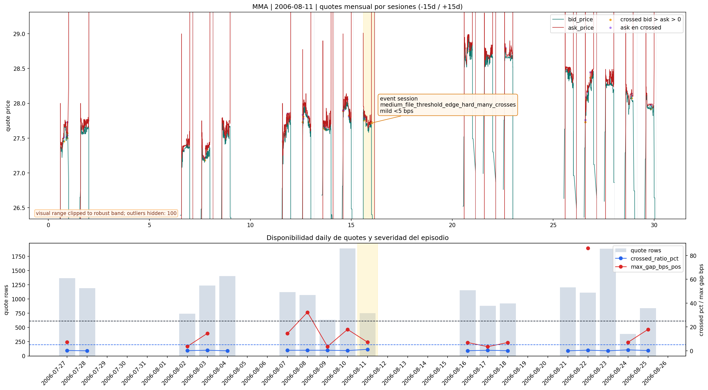

#### 01 Raw Window
Esta imagen responde a la primera pregunta decisiva del caso: el crossed observado es economicamente bastante fuerte para justificar un cambio de clase. Arriba ensena la geometria exacta del tramo conflictivo; abajo convierte esa geometria a bps y la enfrenta a los cortes `5 bps` y `25 bps`. El regimen dominante es `mild <5 bps`. La decision que cambia es pasar de anomalia interpretable a `review` o `bad`. El error que evita es decidir por apariencia visual sin medir el dano economico real del crossed. En terminos de pipeline, este panel decide si el problema afecta solo a la lectura forense o si invalida simulacion de ejecucion y microstructure features.

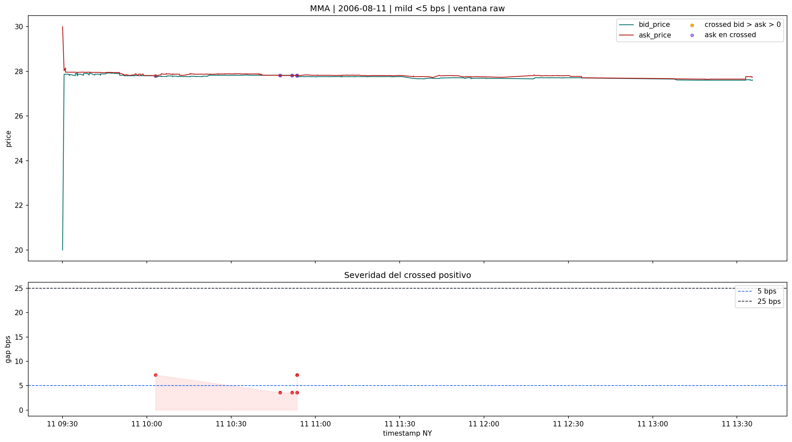

#### 02 Full Session Context
Esta imagen responde a la pregunta de extension intradiaria: el dano esta confinado a un bloque corto o contamina la sesion completa. Arriba se ve toda la sesion `04:00-20:00 NY`; abajo el `gap_bps` firmado. La decision que cambia es si el consumo debe penalizar solo un tramo o desechar el dia entero para uso operativo. El error que evita es tratar una cicatriz local como ruina total o, al reves, minimizar una degradacion distribuida a lo largo del dia. En ejecucion esto decide si la sesion puede seguir usandose con restricciones; en ML decide si las features intradiarias conservan significado economico.

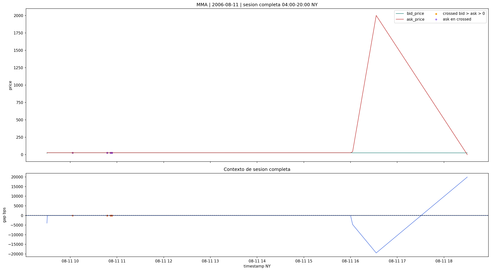

#### 03 Structure Diagnostics
Este panel responde a la pregunta de naturaleza del fallo: contradiccion economica genuina o mezcla con degeneracion estructural. Separa `ask=0` de `ask>0`, muestra la distribucion de `gap_bps` y resume patrones de integerizacion. La decision que cambia es como interpretar el dano: mercado localmente roto, artefacto de representacion o combinacion de ambos. El error que evita es sobrediagnosticar crossed reales cuando parte de la senal proviene de estructura degenerada del libro. Esta lectura afecta directamente a que el caso vaya a exclusion dura, a bandera contextual o a simple reconciliacion tecnica.

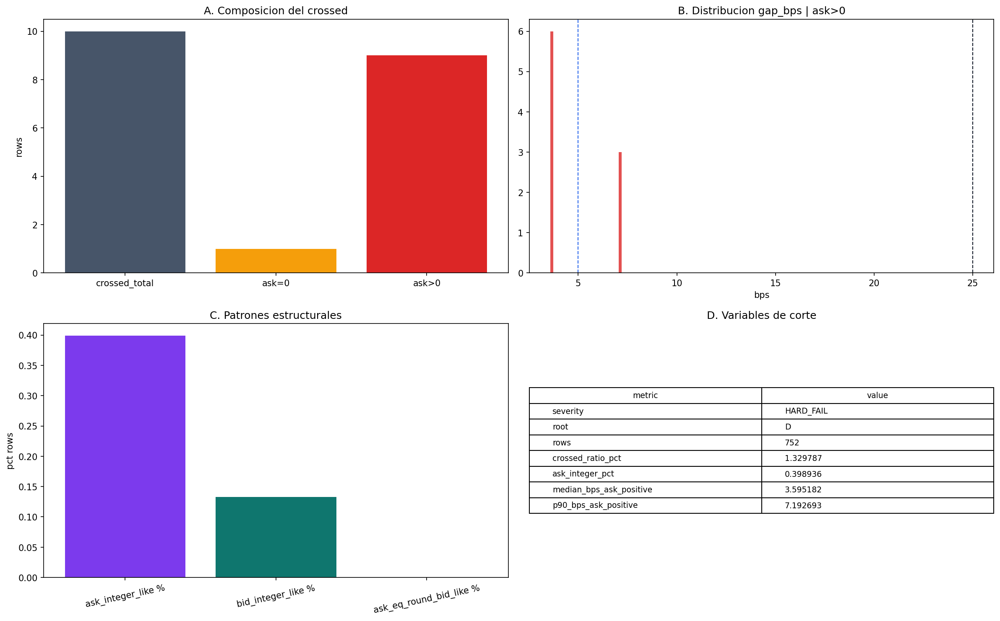

#### 04 Summary Card
Esta tarjeta responde a la pregunta de auditabilidad: cuales son exactamente las variables que sostienen la conclusion. Reune `severity`, `root`, `crossed_ratio_pct`, `ask_integer_pct`, `median_bps_ask_positive` y `p90_bps_ask_positive`. La decision que cambia es pasar de impresion visual a regla verificable. El error que evita es que dos inspectores lleguen a conclusiones distintas mirando la misma imagen sin una base numerica comun. Para gobernanza del proyecto, este panel es el que vuelve reproducible la decision para backtest, ML y auditoria.

---

### 13. PLL 2006-04-28

company_name: `Piedmont Lithium Inc. Common Stock`
primary_exchange: `NASDAQ` (`XNAS`)
market_locale: `stocks/us`
scope: `bad`
ticker: `PLL`
date: `2006-04-28`
taxonomy: `medium_file_threshold_edge_hard_many_crosses`
positive_cross_bucket: `positive_cross_mild_lt5bps`
severity: `HARD_FAIL`
root: `D`
rows: `535`
crossed_ratio_pct: `3.177570`
crossed_rows_raw: `17`
crossed_rows_ask_zero: `14`
crossed_rows_ask_positive: `3`
ask_integer_pct: `3.177570`
median_bps_ask_positive: `3.312904`
p90_bps_ask_positive: `3.312904`
file: `D:\quotes\PLL\year=2006\month=04\day=28\quotes.parquet`

#### Analisis Forense
La conclusion correcta del caso es que la contradiccion local entre bid y ask ya compromete la credibilidad economica del libro y bloquea su consumo como si fuera mercado normal. La taxonomy historica es `medium_file_threshold_edge_hard_many_crosses` y el regimen positivo dominante es `mild <5 bps`. Esto importa porque la taxonomy no solo clasifica: resume que tipo de anomalia se esta viendo y que clase de decision contractual puede defenderse despues. La taxonomy `medium_file_threshold_edge_hard_many_crosses` implica que el mismo tipo de dano aparece en un file menos grande y por eso pesa mas: hay menos masa para diluir la anomalia y la exclusion se vuelve mas defendible. El regimen `mild <5 bps` significa que existe contradiccion economica positiva, pero aun en una banda donde un uso prudente puede seguir siendo defendible si la persistencia y la estructura no agravan el caso. En terminos observables, el file tiene `crossed_ratio_pct=3.177570` con `crossed_rows_ask_positive=3` y `crossed_rows_ask_zero=14`. La severidad economica del crossed ask>0 se resume en `median_bps_ask_positive=3.312904` y `p90_bps_ask_positive=3.312904`. Estos dos numeros convierten una forma visual rara en una conclusion operativa sobre si el libro sigue representando o no un mercado negociable. La decision que cambia es exclusion del consumo core del libro. `bad` significa que el estado local ya no puede alimentar ejecucion, mark-to-market intradiario ni aprendizaje de ML como si fuese microestructura defendible. El error que evita es construir decisiones sobre un libro que ha dejado de representar un mercado localmente creible. El patron estructural muestra `ask_integer_pct=3.177570`. Este numero obliga a separar dos explicaciones rivales: contradiccion economica genuina del libro o mezcla con degeneracion estructural / integerizacion. La mayor parte del crossed vive en `ask=0`, pero existe una cola `ask>0` que impide absolver el caso como simple glitch. La lectura correcta es mixta: dano estructural dominante con residuo economico que aun puede justificar bandera o exclusion. Como `ask_integer_pct` es bajo, la hipotesis de simple degeneracion mecanica pierde fuerza. Eso endurece la interpretacion: el crossed se parece mas a contradiccion economica genuina y menos a artefacto. En la capa de semantica de precio del evento aparecen `daily raw close=30.1800`, `quote mid raw=30.3450`, `quote mid split_normalized=30.3450`, `daily adjusted_proxy=25.0455`. Ademas hay `post_event_dividend_sum=6.7750`. La implicacion metodologica es crucial: una discrepancia entre `quotes`, `daily` y una plataforma externa no puede leerse automaticamente como fallo del dataset. Puede ser semantica de precio distinta. El error que evita esta capa es mezclar raw, split-normalized y adjusted dentro del mismo pipeline, rompiendo auditoria, benchmarking y labels. Para pipelines, esto implica exclusion de ejecucion realista, de mark-to-market intradiario defendible y de features microestructurales tratadas como si reflejaran un mercado normal. Solo debe sobrevivir en circuitos forenses o de calidad. Existe ademas una imagen historica de certificacion asociada. Su papel es poner el episodio en un marco causal mas amplio: halt, explained, not strongly explained o patron conocido. La regla que protege al proyecto es esta: el contexto externo se usa para explicar por que aparece el episodio, no para absolverlo. El error que evita es degradar el criterio de calidad del libro porque exista una historia plausible alrededor del caso.

#### 00 Event Month Context
Esta imagen responde a la pregunta de persistencia temporal: estamos ante un accidente local o ante una fase mas amplia de inestabilidad. Arriba coloca el evento en la serie `daily` real del mes; abajo compara `crossed_ratio_pct` y `max_gap_bps_pos` del dia contra sus vecinos. La decision que cambia es el peso estructural que se le concede al caso. El error que evita es juzgar igual un shock aislado y una degradacion repetida del libro.

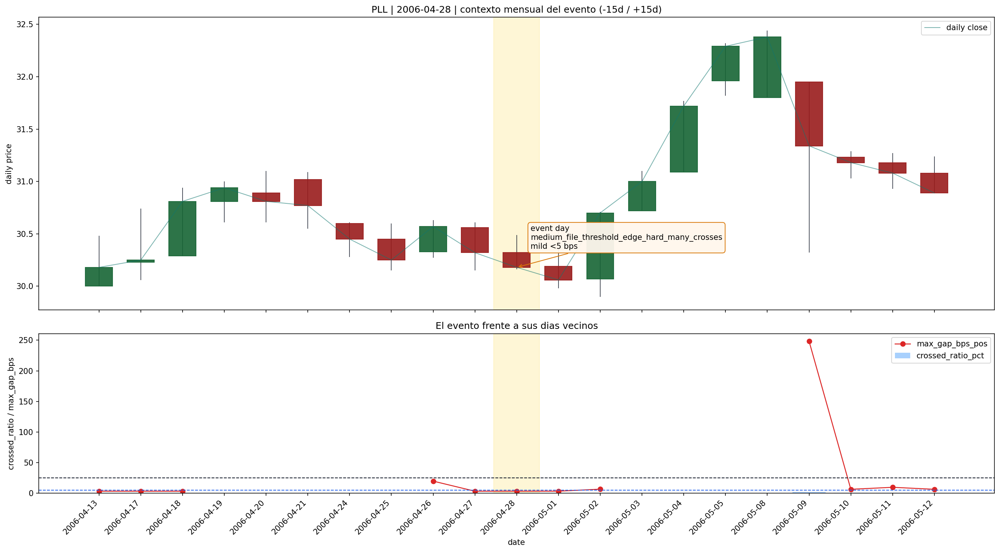

#### 00a Adjusted Proxy Contrast
Esta imagen responde a la pregunta de reconciliacion semantica: la discrepancia de precios viene de datos rotos o de vistas de precio distintas. Compara `daily raw`, `daily adjusted_proxy`, `quote mid raw` y `quote mid split_normalized`, y debajo ensena la cadena de dividendos y splits que produce la diferencia. La decision que cambia es si el inspector debe abrir una incidencia de calidad o cerrar el caso como diferencia legitima de semantica. El error que evita es mezclar series raw y adjusted como si fueran equivalentes. En pipelines reales, esto protege benchmarking, labels diarios y reconciliacion externa frente a falsas alarmas de precio.

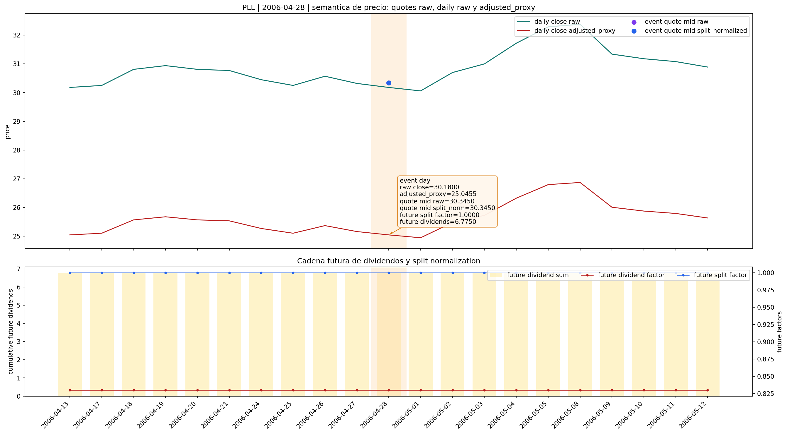

#### 00b Event Month Quotes Context
Esta imagen responde a la pregunta de recurrencia mensual dentro de `quotes`: el problema se concentra en el evento o reaparece en varias sesiones. Arriba concatena sesiones con datos disponibles; abajo resume cobertura diaria, `crossed_ratio_pct` y `max_gap_bps_pos`. La decision que cambia es si el caso debe leerse como episodio puntual o como sintoma de una fase repetida de libro degradado. El error que evita es extrapolar desde un unico dia a todo el mes sin evidencia.

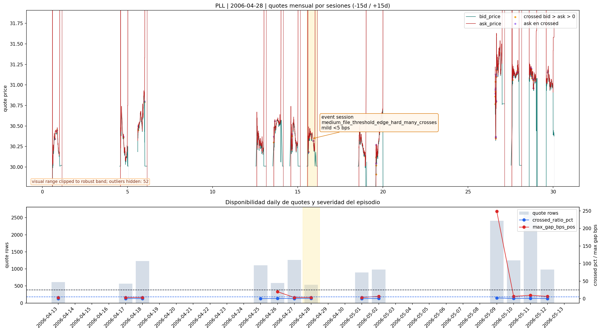

#### 01 Raw Window
Esta imagen responde a la primera pregunta decisiva del caso: el crossed observado es economicamente bastante fuerte para justificar un cambio de clase. Arriba ensena la geometria exacta del tramo conflictivo; abajo convierte esa geometria a bps y la enfrenta a los cortes `5 bps` y `25 bps`. El regimen dominante es `mild <5 bps`. La decision que cambia es pasar de anomalia interpretable a `review` o `bad`. El error que evita es decidir por apariencia visual sin medir el dano economico real del crossed. En terminos de pipeline, este panel decide si el problema afecta solo a la lectura forense o si invalida simulacion de ejecucion y microstructure features.

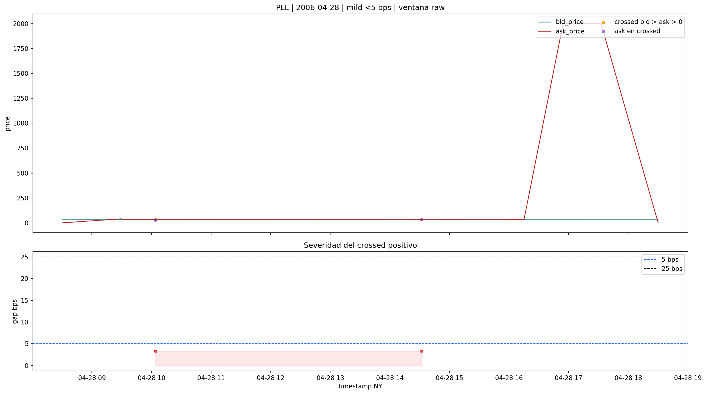

#### 02 Full Session Context
Esta imagen responde a la pregunta de extension intradiaria: el dano esta confinado a un bloque corto o contamina la sesion completa. Arriba se ve toda la sesion `04:00-20:00 NY`; abajo el `gap_bps` firmado. La decision que cambia es si el consumo debe penalizar solo un tramo o desechar el dia entero para uso operativo. El error que evita es tratar una cicatriz local como ruina total o, al reves, minimizar una degradacion distribuida a lo largo del dia. En ejecucion esto decide si la sesion puede seguir usandose con restricciones; en ML decide si las features intradiarias conservan significado economico.

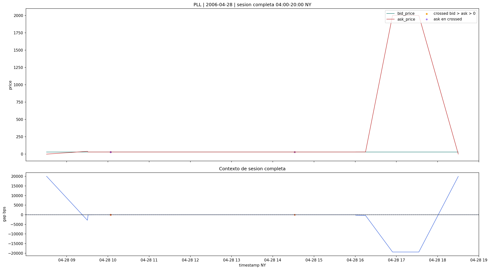

#### 03 Structure Diagnostics
Este panel responde a la pregunta de naturaleza del fallo: contradiccion economica genuina o mezcla con degeneracion estructural. Separa `ask=0` de `ask>0`, muestra la distribucion de `gap_bps` y resume patrones de integerizacion. La decision que cambia es como interpretar el dano: mercado localmente roto, artefacto de representacion o combinacion de ambos. El error que evita es sobrediagnosticar crossed reales cuando parte de la senal proviene de estructura degenerada del libro. Esta lectura afecta directamente a que el caso vaya a exclusion dura, a bandera contextual o a simple reconciliacion tecnica.

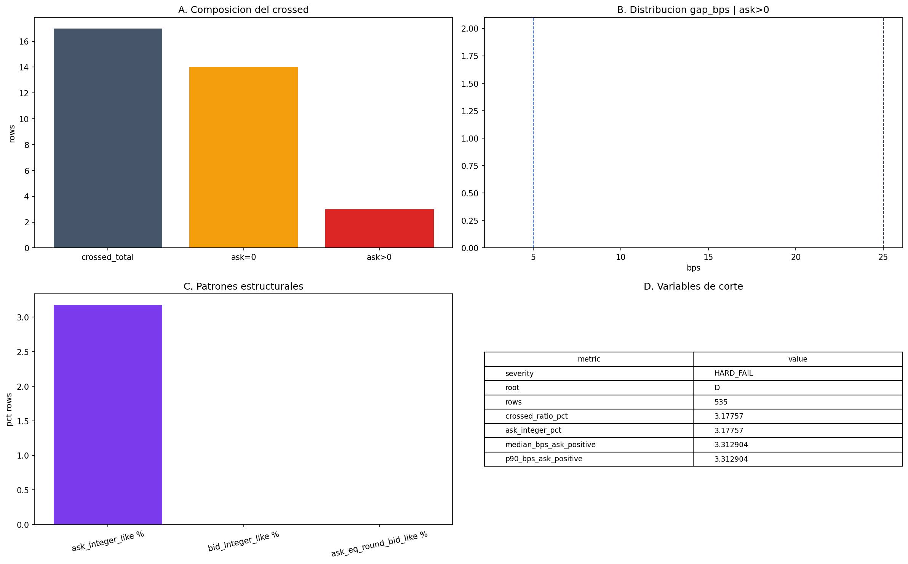

#### 04 Summary Card
Esta tarjeta responde a la pregunta de auditabilidad: cuales son exactamente las variables que sostienen la conclusion. Reune `severity`, `root`, `crossed_ratio_pct`, `ask_integer_pct`, `median_bps_ask_positive` y `p90_bps_ask_positive`. La decision que cambia es pasar de impresion visual a regla verificable. El error que evita es que dos inspectores lleguen a conclusiones distintas mirando la misma imagen sin una base numerica comun. Para gobernanza del proyecto, este panel es el que vuelve reproducible la decision para backtest, ML y auditoria.

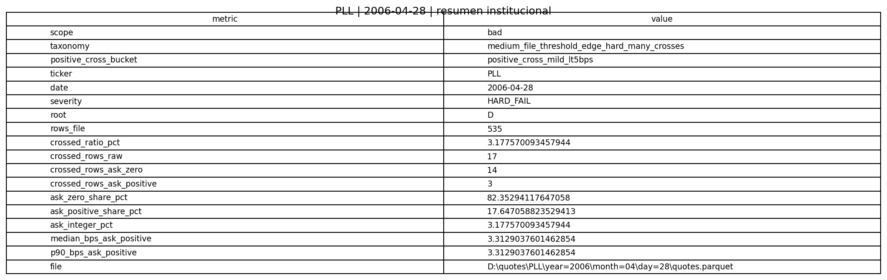

---

### 14. EAC 2005-06-27

company_name: `Edify Acquisition Corp. Class A Common Stock`
primary_exchange: `NASDAQ` (`XNAS`)
market_locale: `stocks/us`
scope: `bad`
ticker: `EAC`
date: `2005-06-27`
taxonomy: `medium_file_threshold_edge_hard_many_crosses`
positive_cross_bucket: `positive_cross_mild_lt5bps`
severity: `HARD_FAIL`
root: `D`
rows: `707`
crossed_ratio_pct: `2.404526`
crossed_rows_raw: `17`
crossed_rows_ask_zero: `1`
crossed_rows_ask_positive: `16`
ask_integer_pct: `0.424328`
median_bps_ask_positive: `2.378406`
p90_bps_ask_positive: `16.562167`
file: `D:\quotes\EAC\year=2005\month=06\day=27\quotes.parquet`

#### Analisis Forense
La conclusion correcta del caso es que la contradiccion local entre bid y ask ya compromete la credibilidad economica del libro y bloquea su consumo como si fuera mercado normal. La taxonomy historica es `medium_file_threshold_edge_hard_many_crosses` y el regimen positivo dominante es `mild <5 bps`. Esto importa porque la taxonomy no solo clasifica: resume que tipo de anomalia se esta viendo y que clase de decision contractual puede defenderse despues. La taxonomy `medium_file_threshold_edge_hard_many_crosses` implica que el mismo tipo de dano aparece en un file menos grande y por eso pesa mas: hay menos masa para diluir la anomalia y la exclusion se vuelve mas defendible. El regimen `mild <5 bps` significa que existe contradiccion economica positiva, pero aun en una banda donde un uso prudente puede seguir siendo defendible si la persistencia y la estructura no agravan el caso. En terminos observables, el file tiene `crossed_ratio_pct=2.404526` con `crossed_rows_ask_positive=16` y `crossed_rows_ask_zero=1`. La severidad economica del crossed ask>0 se resume en `median_bps_ask_positive=2.378406` y `p90_bps_ask_positive=16.562167`. Estos dos numeros convierten una forma visual rara en una conclusion operativa sobre si el libro sigue representando o no un mercado negociable. La decision que cambia es exclusion del consumo core del libro. `bad` significa que el estado local ya no puede alimentar ejecucion, mark-to-market intradiario ni aprendizaje de ML como si fuese microestructura defendible. El error que evita es construir decisiones sobre un libro que ha dejado de representar un mercado localmente creible. El patron estructural muestra `ask_integer_pct=0.424328`. Este numero obliga a separar dos explicaciones rivales: contradiccion economica genuina del libro o mezcla con degeneracion estructural / integerizacion. La mayor parte del crossed vive en `ask>0`, de modo que el corazon del problema sigue siendo economico. La parte `ask=0`, si existe, acompana pero no explica por si sola la anomalia. Como `ask_integer_pct` es bajo, la hipotesis de simple degeneracion mecanica pierde fuerza. Eso endurece la interpretacion: el crossed se parece mas a contradiccion economica genuina y menos a artefacto. En la capa de semantica de precio del evento aparecen `daily raw close=27.8333`, `quote mid raw=41.9425`, `quote mid split_normalized=27.9617`, `daily adjusted_proxy=27.8333`. La reconciliacion incluye `future_split_factor=1.5000`. La implicacion metodologica es crucial: una discrepancia entre `quotes`, `daily` y una plataforma externa no puede leerse automaticamente como fallo del dataset. Puede ser semantica de precio distinta. El error que evita esta capa es mezclar raw, split-normalized y adjusted dentro del mismo pipeline, rompiendo auditoria, benchmarking y labels. Para pipelines, esto implica exclusion de ejecucion realista, de mark-to-market intradiario defendible y de features microestructurales tratadas como si reflejaran un mercado normal. Solo debe sobrevivir en circuitos forenses o de calidad. Existe ademas una imagen historica de certificacion asociada. Su papel es poner el episodio en un marco causal mas amplio: halt, explained, not strongly explained o patron conocido. La regla que protege al proyecto es esta: el contexto externo se usa para explicar por que aparece el episodio, no para absolverlo. El error que evita es degradar el criterio de calidad del libro porque exista una historia plausible alrededor del caso.

#### 00 Event Month Context
Esta imagen responde a la pregunta de persistencia temporal: estamos ante un accidente local o ante una fase mas amplia de inestabilidad. Arriba coloca el evento en la serie `daily` real del mes; abajo compara `crossed_ratio_pct` y `max_gap_bps_pos` del dia contra sus vecinos. La decision que cambia es el peso estructural que se le concede al caso. El error que evita es juzgar igual un shock aislado y una degradacion repetida del libro.

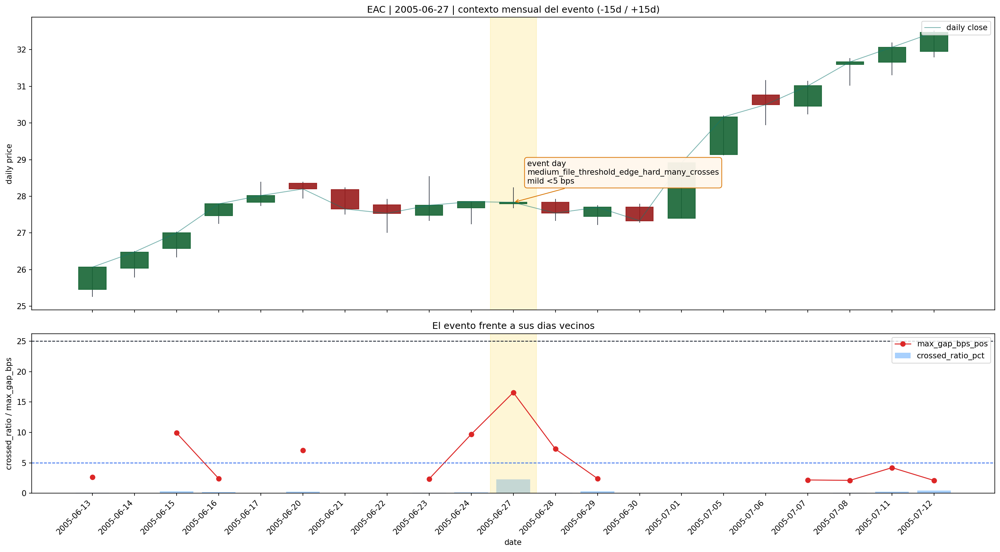

#### 00a Adjusted Proxy Contrast
Esta imagen responde a la pregunta de reconciliacion semantica: la discrepancia de precios viene de datos rotos o de vistas de precio distintas. Compara `daily raw`, `daily adjusted_proxy`, `quote mid raw` y `quote mid split_normalized`, y debajo ensena la cadena de dividendos y splits que produce la diferencia. La decision que cambia es si el inspector debe abrir una incidencia de calidad o cerrar el caso como diferencia legitima de semantica. El error que evita es mezclar series raw y adjusted como si fueran equivalentes. En pipelines reales, esto protege benchmarking, labels diarios y reconciliacion externa frente a falsas alarmas de precio.

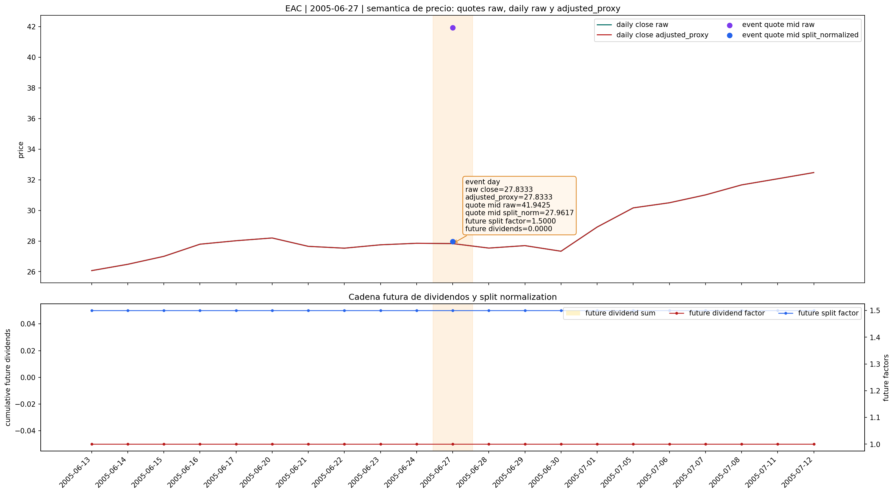

#### 00b Event Month Quotes Context
Esta imagen responde a la pregunta de recurrencia mensual dentro de `quotes`: el problema se concentra en el evento o reaparece en varias sesiones. Arriba concatena sesiones con datos disponibles; abajo resume cobertura diaria, `crossed_ratio_pct` y `max_gap_bps_pos`. La decision que cambia es si el caso debe leerse como episodio puntual o como sintoma de una fase repetida de libro degradado. El error que evita es extrapolar desde un unico dia a todo el mes sin evidencia.

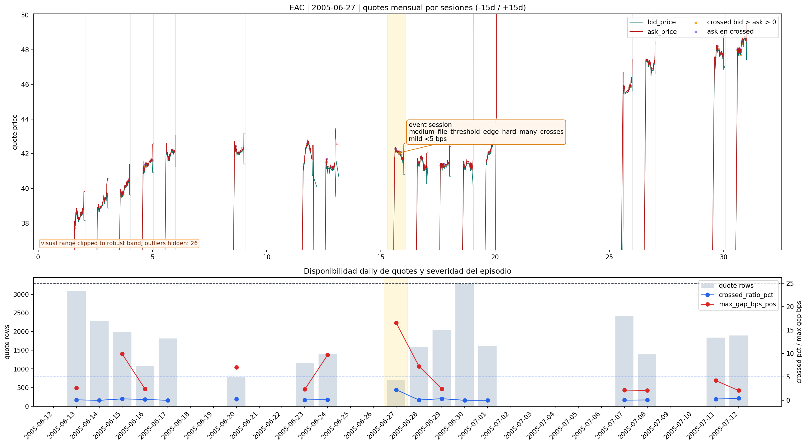

#### 01 Raw Window
Esta imagen responde a la primera pregunta decisiva del caso: el crossed observado es economicamente bastante fuerte para justificar un cambio de clase. Arriba ensena la geometria exacta del tramo conflictivo; abajo convierte esa geometria a bps y la enfrenta a los cortes `5 bps` y `25 bps`. El regimen dominante es `mild <5 bps`. La decision que cambia es pasar de anomalia interpretable a `review` o `bad`. El error que evita es decidir por apariencia visual sin medir el dano economico real del crossed. En terminos de pipeline, este panel decide si el problema afecta solo a la lectura forense o si invalida simulacion de ejecucion y microstructure features.

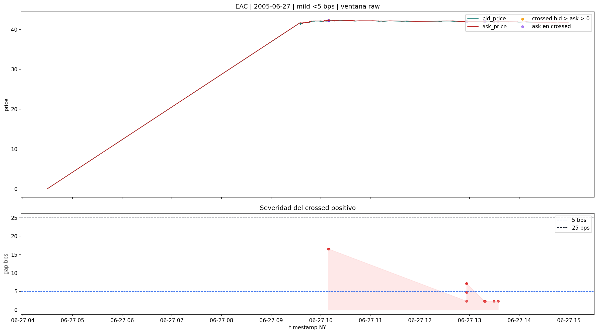

#### 02 Full Session Context
Esta imagen responde a la pregunta de extension intradiaria: el dano esta confinado a un bloque corto o contamina la sesion completa. Arriba se ve toda la sesion `04:00-20:00 NY`; abajo el `gap_bps` firmado. La decision que cambia es si el consumo debe penalizar solo un tramo o desechar el dia entero para uso operativo. El error que evita es tratar una cicatriz local como ruina total o, al reves, minimizar una degradacion distribuida a lo largo del dia. En ejecucion esto decide si la sesion puede seguir usandose con restricciones; en ML decide si las features intradiarias conservan significado economico.

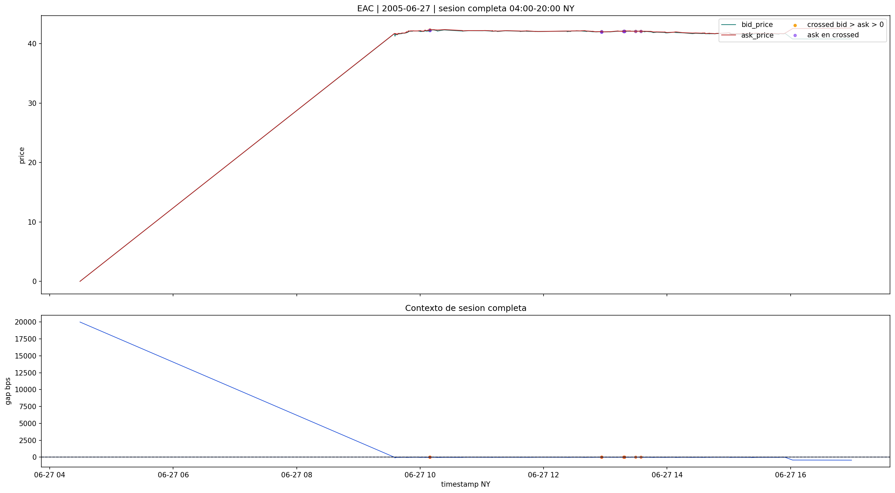

#### 03 Structure Diagnostics
Este panel responde a la pregunta de naturaleza del fallo: contradiccion economica genuina o mezcla con degeneracion estructural. Separa `ask=0` de `ask>0`, muestra la distribucion de `gap_bps` y resume patrones de integerizacion. La decision que cambia es como interpretar el dano: mercado localmente roto, artefacto de representacion o combinacion de ambos. El error que evita es sobrediagnosticar crossed reales cuando parte de la senal proviene de estructura degenerada del libro. Esta lectura afecta directamente a que el caso vaya a exclusion dura, a bandera contextual o a simple reconciliacion tecnica.

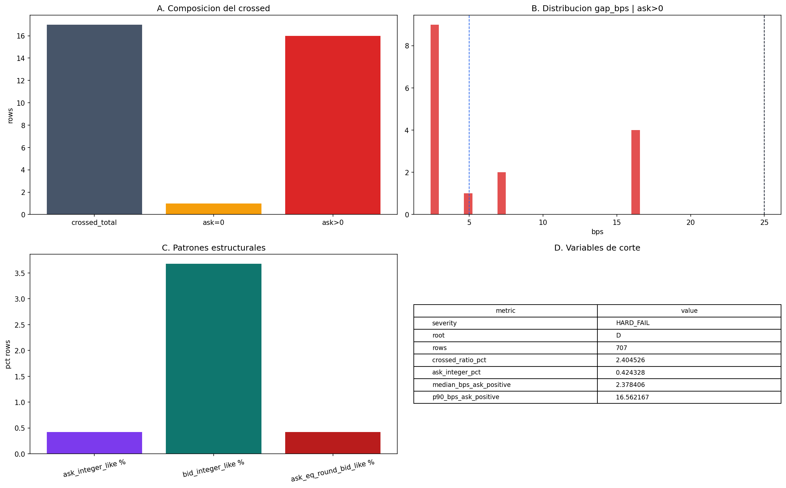

#### 04 Summary Card
Esta tarjeta responde a la pregunta de auditabilidad: cuales son exactamente las variables que sostienen la conclusion. Reune `severity`, `root`, `crossed_ratio_pct`, `ask_integer_pct`, `median_bps_ask_positive` y `p90_bps_ask_positive`. La decision que cambia es pasar de impresion visual a regla verificable. El error que evita es que dos inspectores lleguen a conclusiones distintas mirando la misma imagen sin una base numerica comun. Para gobernanza del proyecto, este panel es el que vuelve reproducible la decision para backtest, ML y auditoria.

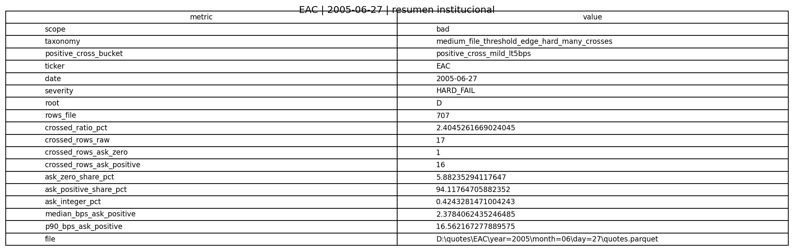

---

### 15. SSN 2017-01-04

company_name: `SAMSON OIL & GAS LTD SPONSORED ADR NEW(AUSTRALIA)`
primary_exchange: `NYSE American` (`XASE`)
market_locale: `stocks/us`
scope: `bad`
ticker: `SSN`
date: `2017-01-04`
taxonomy: `medium_file_threshold_edge_hard_many_crosses`
positive_cross_bucket: `positive_cross_mild_lt5bps`
severity: `HARD_FAIL`
root: `D`
rows: `877`
crossed_ratio_pct: `0.912201`
crossed_rows_raw: `8`
crossed_rows_ask_zero: `0`
crossed_rows_ask_positive: `8`
ask_integer_pct: `0.114025`
median_bps_ask_positive: `1.369769`
p90_bps_ask_positive: `1.369769`
file: `D:\quotes\SSN\year=2017\month=01\day=04\quotes.parquet`

#### Analisis Forense
La conclusion correcta del caso es que la contradiccion local entre bid y ask ya compromete la credibilidad economica del libro y bloquea su consumo como si fuera mercado normal. La taxonomy historica es `medium_file_threshold_edge_hard_many_crosses` y el regimen positivo dominante es `mild <5 bps`. Esto importa porque la taxonomy no solo clasifica: resume que tipo de anomalia se esta viendo y que clase de decision contractual puede defenderse despues. La taxonomy `medium_file_threshold_edge_hard_many_crosses` implica que el mismo tipo de dano aparece en un file menos grande y por eso pesa mas: hay menos masa para diluir la anomalia y la exclusion se vuelve mas defendible. El regimen `mild <5 bps` significa que existe contradiccion economica positiva, pero aun en una banda donde un uso prudente puede seguir siendo defendible si la persistencia y la estructura no agravan el caso. En terminos observables, el file tiene `crossed_ratio_pct=0.912201` con `crossed_rows_ask_positive=8` y `crossed_rows_ask_zero=0`. La severidad economica del crossed ask>0 se resume en `median_bps_ask_positive=1.369769` y `p90_bps_ask_positive=1.369769`. Estos dos numeros convierten una forma visual rara en una conclusion operativa sobre si el libro sigue representando o no un mercado negociable. La decision que cambia es exclusion del consumo core del libro. `bad` significa que el estado local ya no puede alimentar ejecucion, mark-to-market intradiario ni aprendizaje de ML como si fuese microestructura defendible. El error que evita es construir decisiones sobre un libro que ha dejado de representar un mercado localmente creible. El patron estructural muestra `ask_integer_pct=0.114025`. Este numero obliga a separar dos explicaciones rivales: contradiccion economica genuina del libro o mezcla con degeneracion estructural / integerizacion. Toda la composicion crossed cae en `ask>0`. Eso endurece la lectura economica del caso: el dano no depende de ceros mecanicos, sino de contradiccion positiva dentro de precios aparentemente vivos. Como `ask_integer_pct` es bajo, la hipotesis de simple degeneracion mecanica pierde fuerza. Eso endurece la interpretacion: el crossed se parece mas a contradiccion economica genuina y menos a artefacto. Existe ademas una imagen historica de certificacion asociada. Su papel es poner el episodio en un marco causal mas amplio: halt, explained, not strongly explained o patron conocido. La regla que protege al proyecto es esta: el contexto externo se usa para explicar por que aparece el episodio, no para absolverlo. El error que evita es degradar el criterio de calidad del libro porque exista una historia plausible alrededor del caso.

#### 00 Event Month Context
Esta imagen responde a la pregunta de persistencia temporal: estamos ante un accidente local o ante una fase mas amplia de inestabilidad. Arriba coloca el evento en la serie `daily` real del mes; abajo compara `crossed_ratio_pct` y `max_gap_bps_pos` del dia contra sus vecinos. La decision que cambia es el peso estructural que se le concede al caso. El error que evita es juzgar igual un shock aislado y una degradacion repetida del libro.

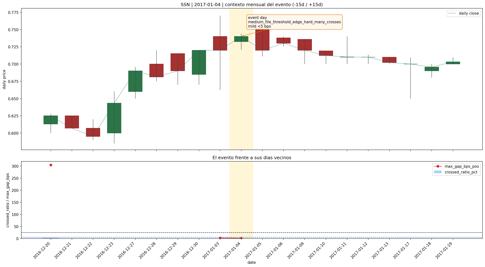

#### 00b Event Month Quotes Context
Esta imagen responde a la pregunta de recurrencia mensual dentro de `quotes`: el problema se concentra en el evento o reaparece en varias sesiones. Arriba concatena sesiones con datos disponibles; abajo resume cobertura diaria, `crossed_ratio_pct` y `max_gap_bps_pos`. La decision que cambia es si el caso debe leerse como episodio puntual o como sintoma de una fase repetida de libro degradado. El error que evita es extrapolar desde un unico dia a todo el mes sin evidencia.

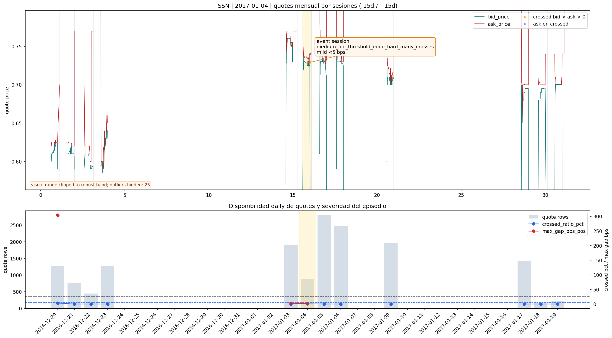

#### 01 Raw Window
Esta imagen responde a la primera pregunta decisiva del caso: el crossed observado es economicamente bastante fuerte para justificar un cambio de clase. Arriba ensena la geometria exacta del tramo conflictivo; abajo convierte esa geometria a bps y la enfrenta a los cortes `5 bps` y `25 bps`. El regimen dominante es `mild <5 bps`. La decision que cambia es pasar de anomalia interpretable a `review` o `bad`. El error que evita es decidir por apariencia visual sin medir el dano economico real del crossed. En terminos de pipeline, este panel decide si el problema afecta solo a la lectura forense o si invalida simulacion de ejecucion y microstructure features.

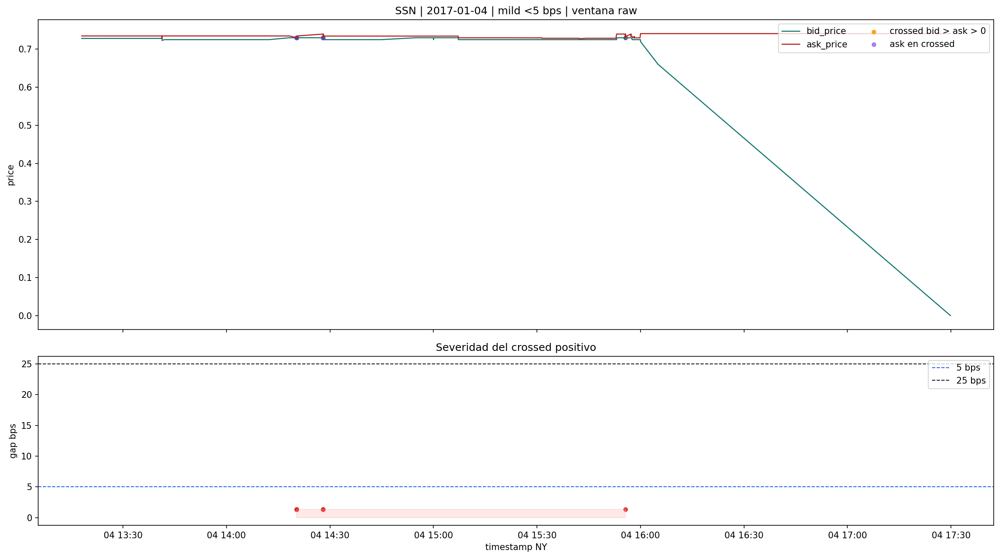

#### 02 Full Session Context
Esta imagen responde a la pregunta de extension intradiaria: el dano esta confinado a un bloque corto o contamina la sesion completa. Arriba se ve toda la sesion `04:00-20:00 NY`; abajo el `gap_bps` firmado. La decision que cambia es si el consumo debe penalizar solo un tramo o desechar el dia entero para uso operativo. El error que evita es tratar una cicatriz local como ruina total o, al reves, minimizar una degradacion distribuida a lo largo del dia. En ejecucion esto decide si la sesion puede seguir usandose con restricciones; en ML decide si las features intradiarias conservan significado economico.

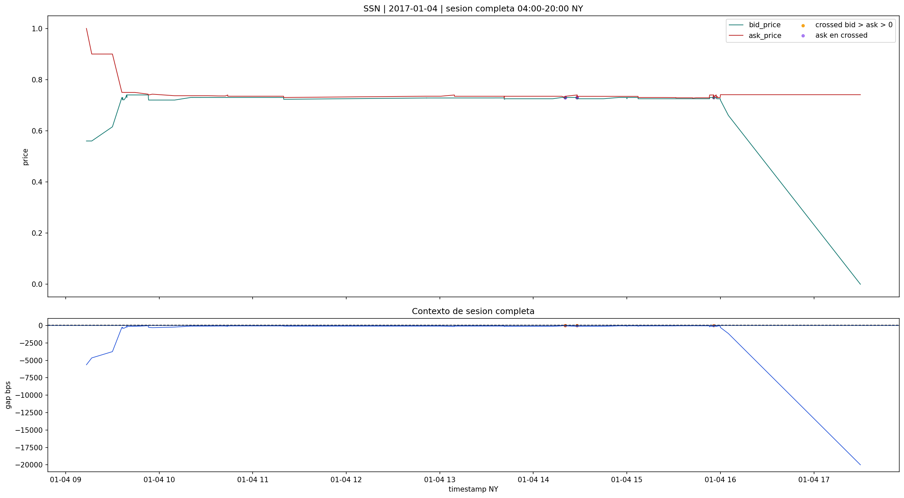

#### 03 Structure Diagnostics
Este panel responde a la pregunta de naturaleza del fallo: contradiccion economica genuina o mezcla con degeneracion estructural. Separa `ask=0` de `ask>0`, muestra la distribucion de `gap_bps` y resume patrones de integerizacion. La decision que cambia es como interpretar el dano: mercado localmente roto, artefacto de representacion o combinacion de ambos. El error que evita es sobrediagnosticar crossed reales cuando parte de la senal proviene de estructura degenerada del libro. Esta lectura afecta directamente a que el caso vaya a exclusion dura, a bandera contextual o a simple reconciliacion tecnica.

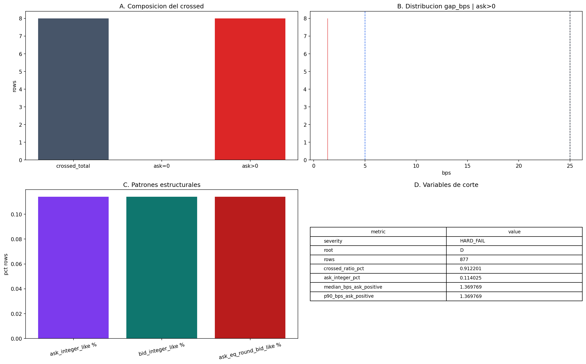

#### 04 Summary Card
Esta tarjeta responde a la pregunta de auditabilidad: cuales son exactamente las variables que sostienen la conclusion. Reune `severity`, `root`, `crossed_ratio_pct`, `ask_integer_pct`, `median_bps_ask_positive` y `p90_bps_ask_positive`. La decision que cambia es pasar de impresion visual a regla verificable. El error que evita es que dos inspectores lleguen a conclusiones distintas mirando la misma imagen sin una base numerica comun. Para gobernanza del proyecto, este panel es el que vuelve reproducible la decision para backtest, ML y auditoria.

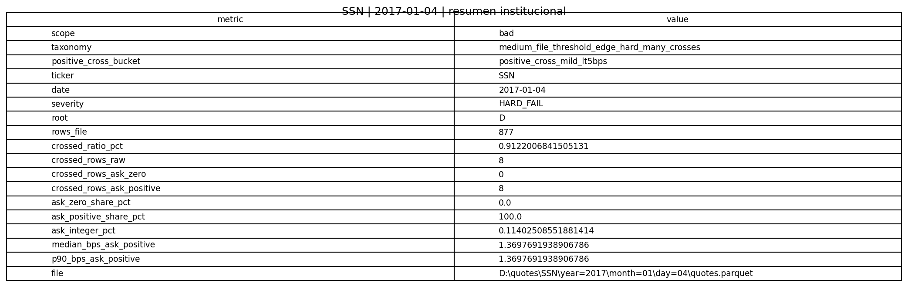

---
