# Quotes Review Cases v0.1

Este documento consolida los casos `review` de `quotes` usando packs visuales completos. Cada caso presenta la ventana raw del crossed positivo, el contexto de sesion completa, diagnosticos estructurales y, cuando existe, la imagen historica de certificacion.

Total cases: `64`

## Menu

1. [CTIC 2006-09-19](#ctic-2006-09-19)
2. [CNTB 2022-06-29](#cntb-2022-06-29)
3. [AEMD 2021-06-21](#aemd-2021-06-21)
4. [MARK 2020-04-28](#mark-2020-04-28)
5. [TOPS 2020-05-26](#tops-2020-05-26)
6. [LPSN 2013-11-25](#lpsn-2013-11-25)
7. [NM 2008-05-05](#nm-2008-05-05)
8. [GRPN 2014-08-26](#grpn-2014-08-26)
9. [TG 2008-01-07](#tg-2008-01-07)
10. [YRCW 2011-05-23](#yrcw-2011-05-23)
11. [ISR 2018-07-10](#isr-2018-07-10)
12. [CATO 2013-07-09](#cato-2013-07-09)
13. [CNSL 2012-05-02](#cnsl-2012-05-02)
14. [VVUS 2009-09-21](#vvus-2009-09-21)
15. [IART 2008-06-03](#iart-2008-06-03)
16. [OFIX 2026-01-14](#ofix-2026-01-14)
17. [HWAY 2015-04-23](#hway-2015-04-23)
18. [UPL 2007-02-22](#upl-2007-02-22)
19. [NTGR 2006-11-13](#ntgr-2006-11-13)
20. [PD 2006-05-26](#pd-2006-05-26)
21. [MON 2005-01-20](#mon-2005-01-20)
22. [UPL 2006-02-03](#upl-2006-02-03)
23. [MBI 2007-04-19](#mbi-2007-04-19)
24. [BZH 2005-02-08](#bzh-2005-02-08)
25. [AWH 2013-02-06](#awh-2013-02-06)
26. [GLXG 2025-04-08](#glxg-2025-04-08)
27. [WLGS 2025-06-11](#wlgs-2025-06-11)
28. [WTO 2024-08-29](#wto-2024-08-29)
29. [PACW 2008-06-19](#pacw-2008-06-19)
30. [BROG 2025-05-27](#brog-2025-05-27)
31. [CPST 2005-09-07](#cpst-2005-09-07)
32. [QNTM 2024-08-16](#qntm-2024-08-16)
33. [DSX 2008-10-08](#dsx-2008-10-08)
34. [IRET 2012-04-16](#iret-2012-04-16)
35. [ARAY 2012-04-23](#aray-2012-04-23)
36. [ACTU 2007-11-13](#actu-2007-11-13)
37. [HWCC 2007-02-27](#hwcc-2007-02-27)
38. [CRME 2008-01-10](#crme-2008-01-10)
39. [DSPG 2008-01-31](#dspg-2008-01-31)
40. [CPST 2010-08-31](#cpst-2010-08-31)
41. [PLAY 2006-02-14](#play-2006-02-14)
42. [MDR 2009-02-11](#mdr-2009-02-11)
43. [BDN 2013-04-03](#bdn-2013-04-03)
44. [EK 2008-09-09](#ek-2008-09-09)
45. [PVA 2015-10-30](#pva-2015-10-30)
46. [SOL 2008-07-17](#sol-2008-07-17)
47. [YHOO 2009-06-04](#yhoo-2009-06-04)
48. [WOOF 2012-08-23](#woof-2012-08-23)
49. [SSRI 2006-09-20](#ssri-2006-09-20)
50. [ATHR 2006-12-28](#athr-2006-12-28)
51. [ALLT 2012-04-04](#allt-2012-04-04)
52. [MTRX 2007-06-28](#mtrx-2007-06-28)
53. [NUS 2010-07-29](#nus-2010-07-29)
54. [SPWR 2008-09-09](#spwr-2008-09-09)
55. [RRGB 2012-07-23](#rrgb-2012-07-23)
56. [DRQ 2006-09-22](#drq-2006-09-22)
57. [FRC 2012-12-11](#frc-2012-12-11)
58. [ADTN 2012-02-24](#adtn-2012-02-24)
59. [APOL 2007-10-25](#apol-2007-10-25)
60. [OIS 2010-01-14](#ois-2010-01-14)
61. [ICON 2014-08-18](#icon-2014-08-18)
62. [UNT 2007-12-04](#unt-2007-12-04)
63. [MON 2010-10-25](#mon-2010-10-25)
64. [DNA 2008-02-01](#dna-2008-02-01)

## Cases

### 1. CTIC 2006-09-19

company_name: `CTI BioPharma Corp. (DE) Common Stock`
primary_exchange: `NASDAQ` (`XNAS`)
market_locale: `stocks/us`
scope: `review`
ticker: `CTIC`
date: `2006-09-19`
taxonomy: `large_file_threshold_edge_hard_many_crosses`
positive_cross_bucket: `positive_cross_severe_ge25bps`
severity: `HARD_FAIL`
root: `D`
rows: `11797`
crossed_ratio_pct: `0.856150`
crossed_rows_raw: `101`
crossed_rows_ask_zero: `0`
crossed_rows_ask_positive: `101`
ask_integer_pct: `0.313639`
median_bps_ask_positive: `114.942529`
p90_bps_ask_positive: `281.690141`
file: `D:\quotes\CTIC\year=2006\month=09\day=19\quotes.parquet`

#### Analisis Forense
La conclusion correcta del caso es que ya existe contradiccion economica real dentro del libro, pero aun no con fuerza suficiente para justificar exclusion dura sin contexto adicional. La taxonomy historica es `large_file_threshold_edge_hard_many_crosses` y el regimen positivo dominante es `severe >=25 bps`. Esto importa porque la taxonomy no solo clasifica: resume que tipo de anomalia se esta viendo y que clase de decision contractual puede defenderse despues. La taxonomy `large_file_threshold_edge_hard_many_crosses` implica un libro grande con muchas contradicciones, pero cerca del borde decisional. La dificultad analitica esta en decidir si el volumen de crossed es ruido absorbible o evidencia de degradacion suficientemente seria. El regimen `severe >=25 bps` empuja el caso a una lectura economicamente dura: el crossed deja de ser cosmetico y pasa a cuestionar si el libro sigue siendo interpretable como mercado negociable. En terminos observables, el file tiene `crossed_ratio_pct=0.856150` con `crossed_rows_ask_positive=101` y `crossed_rows_ask_zero=0`. La severidad economica del crossed ask>0 se resume en `median_bps_ask_positive=114.942529` y `p90_bps_ask_positive=281.690141`. Estos dos numeros convierten una forma visual rara en una conclusion operativa sobre si el libro sigue representando o no un mercado negociable. La decision que cambia es pasar de libro sano a libro util solo bajo cautela. `review` significa: no usar como si fuera ejecucion limpia, conservar para analisis contextual y sensibilidad. El error que evita es tratar como normal un episodio que ya contiene contradiccion economica real y contaminar simulaciones de ejecucion o validaciones demasiado optimistas. El patron estructural muestra `ask_integer_pct=0.313639`. Este numero obliga a separar dos explicaciones rivales: contradiccion economica genuina del libro o mezcla con degeneracion estructural / integerizacion. Toda la composicion crossed cae en `ask>0`. Eso endurece la lectura economica del caso: el dano no depende de ceros mecanicos, sino de contradiccion positiva dentro de precios aparentemente vivos. Como `ask_integer_pct` es bajo, la hipotesis de simple degeneracion mecanica pierde fuerza. Eso endurece la interpretacion: el crossed se parece mas a contradiccion economica genuina y menos a artefacto. En la capa de semantica de precio del evento aparecen `daily raw close=21000.0000`, `quote mid raw=1.7600`, `quote mid split_normalized=21120.0000`, `daily adjusted_proxy=21000.0000`. La reconciliacion incluye `future_split_factor=0.0001`. La implicacion metodologica es crucial: una discrepancia entre `quotes`, `daily` y una plataforma externa no puede leerse automaticamente como fallo del dataset. Puede ser semantica de precio distinta. El error que evita esta capa es mezclar raw, split-normalized y adjusted dentro del mismo pipeline, rompiendo auditoria, benchmarking y labels. Para pipelines, esto bloquea su uso como libro sano en ejecucion y features microestructurales principales, aunque aun puede mantenerse para forense, sensibilidad y estudios donde la anomalia sea parte del objeto de investigacion. Existe ademas una imagen historica de certificacion asociada. Su papel es poner el episodio en un marco causal mas amplio: halt, explained, not strongly explained o patron conocido. La regla que protege al proyecto es esta: el contexto externo se usa para explicar por que aparece el episodio, no para absolverlo. El error que evita es degradar el criterio de calidad del libro porque exista una historia plausible alrededor del caso.

#### 00 Event Month Context
Esta imagen responde a la pregunta de persistencia temporal: estamos ante un accidente local o ante una fase mas amplia de inestabilidad. Arriba coloca el evento en la serie `daily` real del mes; abajo compara `crossed_ratio_pct` y `max_gap_bps_pos` del dia contra sus vecinos. La decision que cambia es el peso estructural que se le concede al caso. El error que evita es juzgar igual un shock aislado y una degradacion repetida del libro.

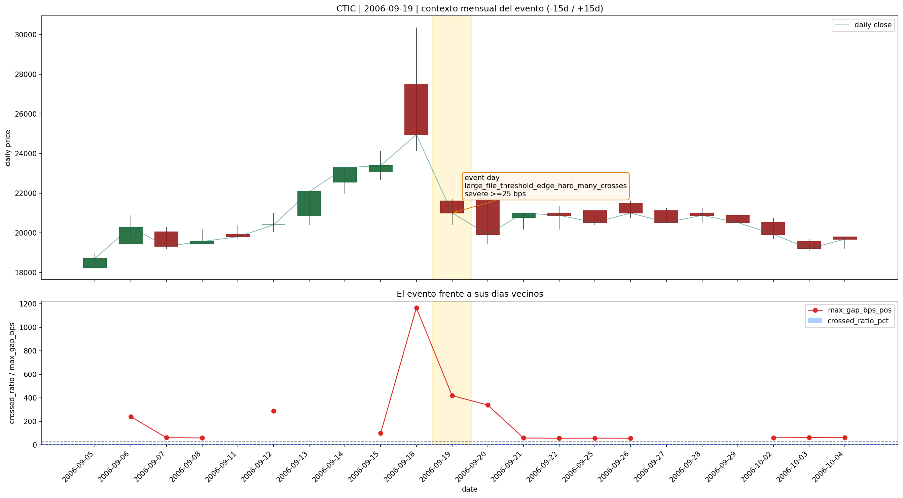

#### 00a Adjusted Proxy Contrast
Esta imagen responde a la pregunta de reconciliacion semantica: la discrepancia de precios viene de datos rotos o de vistas de precio distintas. Compara `daily raw`, `daily adjusted_proxy`, `quote mid raw` y `quote mid split_normalized`, y debajo ensena la cadena de dividendos y splits que produce la diferencia. La decision que cambia es si el inspector debe abrir una incidencia de calidad o cerrar el caso como diferencia legitima de semantica. El error que evita es mezclar series raw y adjusted como si fueran equivalentes. En pipelines reales, esto protege benchmarking, labels diarios y reconciliacion externa frente a falsas alarmas de precio.

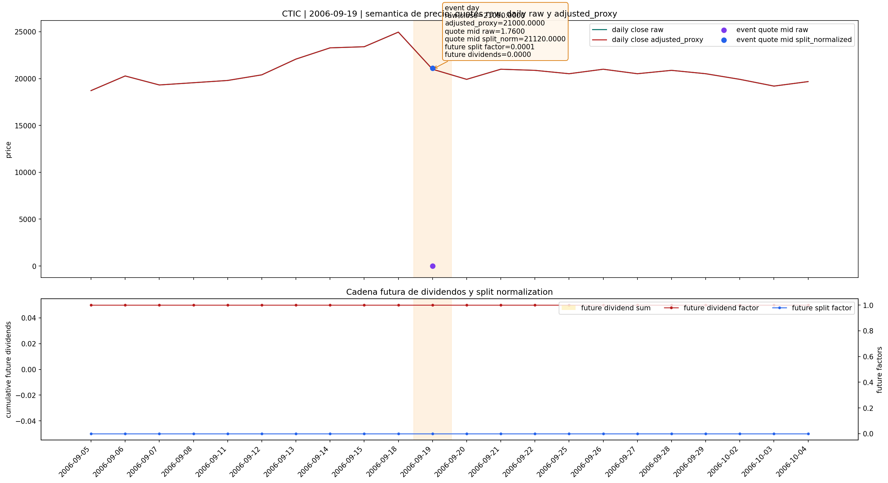

#### 00b Event Month Quotes Context
Esta imagen responde a la pregunta de recurrencia mensual dentro de `quotes`: el problema se concentra en el evento o reaparece en varias sesiones. Arriba concatena sesiones con datos disponibles; abajo resume cobertura diaria, `crossed_ratio_pct` y `max_gap_bps_pos`. La decision que cambia es si el caso debe leerse como episodio puntual o como sintoma de una fase repetida de libro degradado. El error que evita es extrapolar desde un unico dia a todo el mes sin evidencia.

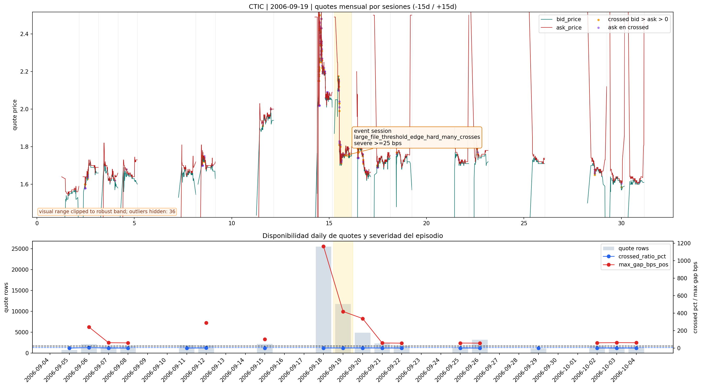

#### 01 Raw Window
Esta imagen responde a la primera pregunta decisiva del caso: el crossed observado es economicamente bastante fuerte para justificar un cambio de clase. Arriba ensena la geometria exacta del tramo conflictivo; abajo convierte esa geometria a bps y la enfrenta a los cortes `5 bps` y `25 bps`. El regimen dominante es `severe >=25 bps`. La decision que cambia es pasar de anomalia interpretable a `review` o `bad`. El error que evita es decidir por apariencia visual sin medir el dano economico real del crossed. En terminos de pipeline, este panel decide si el problema afecta solo a la lectura forense o si invalida simulacion de ejecucion y microstructure features.

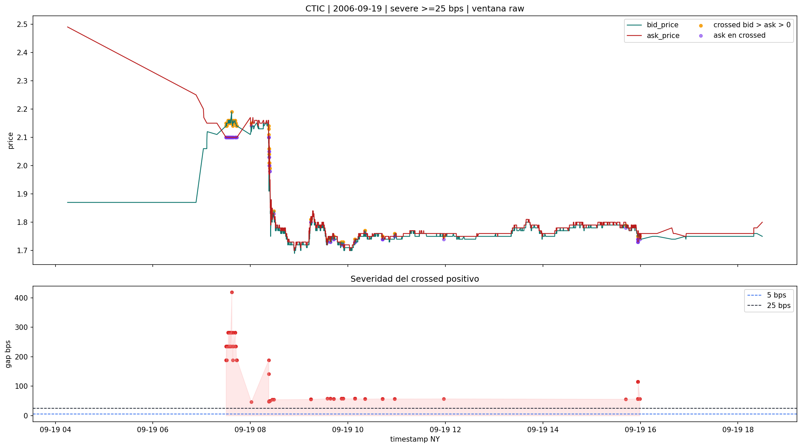

#### 02 Full Session Context
Esta imagen responde a la pregunta de extension intradiaria: el dano esta confinado a un bloque corto o contamina la sesion completa. Arriba se ve toda la sesion `04:00-20:00 NY`; abajo el `gap_bps` firmado. La decision que cambia es si el consumo debe penalizar solo un tramo o desechar el dia entero para uso operativo. El error que evita es tratar una cicatriz local como ruina total o, al reves, minimizar una degradacion distribuida a lo largo del dia. En ejecucion esto decide si la sesion puede seguir usandose con restricciones; en ML decide si las features intradiarias conservan significado economico.

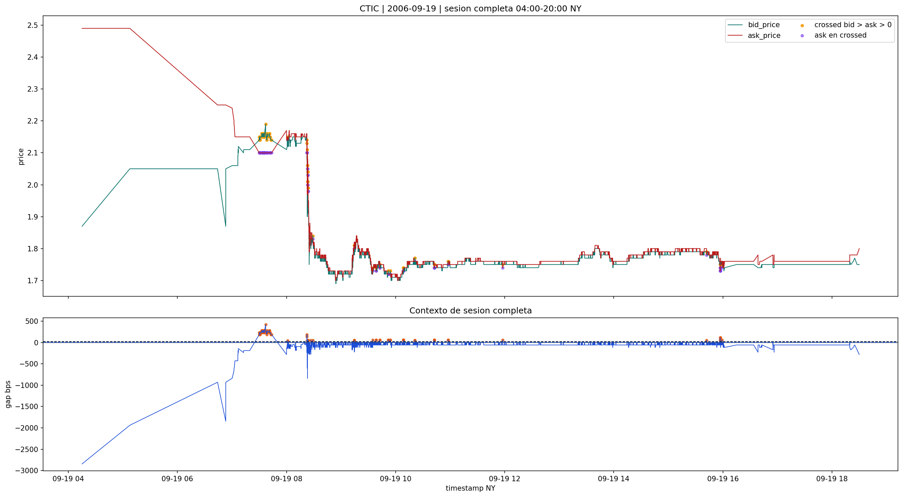

#### 03 Structure Diagnostics
Este panel responde a la pregunta de naturaleza del fallo: contradiccion economica genuina o mezcla con degeneracion estructural. Separa `ask=0` de `ask>0`, muestra la distribucion de `gap_bps` y resume patrones de integerizacion. La decision que cambia es como interpretar el dano: mercado localmente roto, artefacto de representacion o combinacion de ambos. El error que evita es sobrediagnosticar crossed reales cuando parte de la senal proviene de estructura degenerada del libro. Esta lectura afecta directamente a que el caso vaya a exclusion dura, a bandera contextual o a simple reconciliacion tecnica.

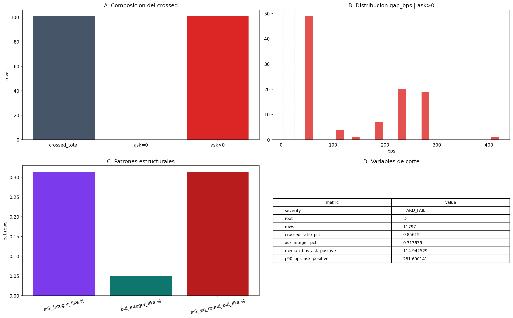

#### 04 Summary Card
Esta tarjeta responde a la pregunta de auditabilidad: cuales son exactamente las variables que sostienen la conclusion. Reune `severity`, `root`, `crossed_ratio_pct`, `ask_integer_pct`, `median_bps_ask_positive` y `p90_bps_ask_positive`. La decision que cambia es pasar de impresion visual a regla verificable. El error que evita es que dos inspectores lleguen a conclusiones distintas mirando la misma imagen sin una base numerica comun. Para gobernanza del proyecto, este panel es el que vuelve reproducible la decision para backtest, ML y auditoria.

#### 05 Historical Context
Esta imagen responde a la pregunta causal externa: existe un framing historico que ayude a entender por que ocurre el episodio. Puede aportar halt context, explained o not strongly explained. La decision que cambia es cuanto peso se concede al contexto en la narrativa final. El error que evita es doble: ignorar una explicacion real o usarla como excusa para absolver un libro que localmente sigue siendo problematico.

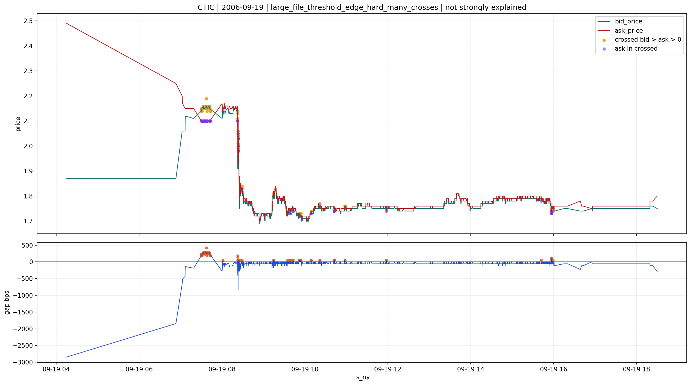

---

### 2. CNTB 2022-06-29

company_name: `Connect Biopharma Holdings Limited Ordinary Shares`
primary_exchange: `NASDAQ` (`XNAS`)
market_locale: `stocks/us`
scope: `review`
ticker: `CNTB`
date: `2022-06-29`
taxonomy: `large_file_threshold_edge_hard_many_crosses`
positive_cross_bucket: `positive_cross_severe_ge25bps`
severity: `HARD_FAIL`
root: `D`
rows: `27634`
crossed_ratio_pct: `1.436636`
crossed_rows_raw: `397`
crossed_rows_ask_zero: `1`
crossed_rows_ask_positive: `396`
ask_integer_pct: `0.770790`
median_bps_ask_positive: `80.646473`
p90_bps_ask_positive: `183.486239`
file: `D:\quotes\CNTB\year=2022\month=06\day=29\quotes.parquet`

#### Analisis Forense
La conclusion correcta del caso es que ya existe contradiccion economica real dentro del libro, pero aun no con fuerza suficiente para justificar exclusion dura sin contexto adicional. La taxonomy historica es `large_file_threshold_edge_hard_many_crosses` y el regimen positivo dominante es `severe >=25 bps`. Esto importa porque la taxonomy no solo clasifica: resume que tipo de anomalia se esta viendo y que clase de decision contractual puede defenderse despues. La taxonomy `large_file_threshold_edge_hard_many_crosses` implica un libro grande con muchas contradicciones, pero cerca del borde decisional. La dificultad analitica esta en decidir si el volumen de crossed es ruido absorbible o evidencia de degradacion suficientemente seria. El regimen `severe >=25 bps` empuja el caso a una lectura economicamente dura: el crossed deja de ser cosmetico y pasa a cuestionar si el libro sigue siendo interpretable como mercado negociable. En terminos observables, el file tiene `crossed_ratio_pct=1.436636` con `crossed_rows_ask_positive=396` y `crossed_rows_ask_zero=1`. La severidad economica del crossed ask>0 se resume en `median_bps_ask_positive=80.646473` y `p90_bps_ask_positive=183.486239`. Estos dos numeros convierten una forma visual rara en una conclusion operativa sobre si el libro sigue representando o no un mercado negociable. La decision que cambia es pasar de libro sano a libro util solo bajo cautela. `review` significa: no usar como si fuera ejecucion limpia, conservar para analisis contextual y sensibilidad. El error que evita es tratar como normal un episodio que ya contiene contradiccion economica real y contaminar simulaciones de ejecucion o validaciones demasiado optimistas. El patron estructural muestra `ask_integer_pct=0.770790`. Este numero obliga a separar dos explicaciones rivales: contradiccion economica genuina del libro o mezcla con degeneracion estructural / integerizacion. La mayor parte del crossed vive en `ask>0`, de modo que el corazon del problema sigue siendo economico. La parte `ask=0`, si existe, acompana pero no explica por si sola la anomalia. Como `ask_integer_pct` es bajo, la hipotesis de simple degeneracion mecanica pierde fuerza. Eso endurece la interpretacion: el crossed se parece mas a contradiccion economica genuina y menos a artefacto. Existe ademas una imagen historica de certificacion asociada. Su papel es poner el episodio en un marco causal mas amplio: halt, explained, not strongly explained o patron conocido. La regla que protege al proyecto es esta: el contexto externo se usa para explicar por que aparece el episodio, no para absolverlo. El error que evita es degradar el criterio de calidad del libro porque exista una historia plausible alrededor del caso.

#### 00 Event Month Context
Esta imagen responde a la pregunta de persistencia temporal: estamos ante un accidente local o ante una fase mas amplia de inestabilidad. Arriba coloca el evento en la serie `daily` real del mes; abajo compara `crossed_ratio_pct` y `max_gap_bps_pos` del dia contra sus vecinos. La decision que cambia es el peso estructural que se le concede al caso. El error que evita es juzgar igual un shock aislado y una degradacion repetida del libro.

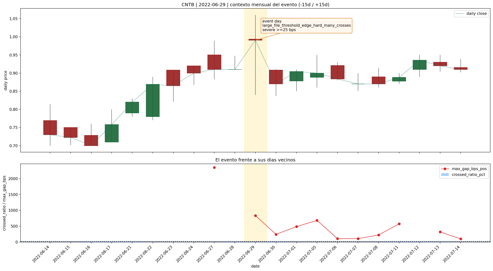

#### 00b Event Month Quotes Context
Esta imagen responde a la pregunta de recurrencia mensual dentro de `quotes`: el problema se concentra en el evento o reaparece en varias sesiones. Arriba concatena sesiones con datos disponibles; abajo resume cobertura diaria, `crossed_ratio_pct` y `max_gap_bps_pos`. La decision que cambia es si el caso debe leerse como episodio puntual o como sintoma de una fase repetida de libro degradado. El error que evita es extrapolar desde un unico dia a todo el mes sin evidencia.

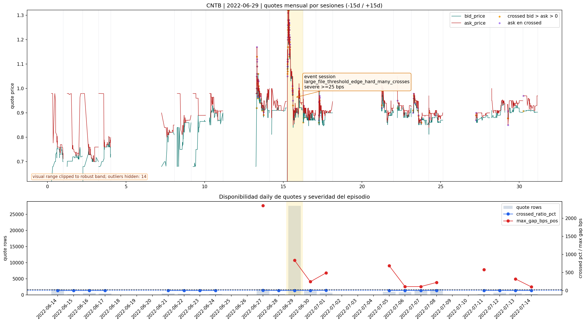

#### 01 Raw Window
Esta imagen responde a la primera pregunta decisiva del caso: el crossed observado es economicamente bastante fuerte para justificar un cambio de clase. Arriba ensena la geometria exacta del tramo conflictivo; abajo convierte esa geometria a bps y la enfrenta a los cortes `5 bps` y `25 bps`. El regimen dominante es `severe >=25 bps`. La decision que cambia es pasar de anomalia interpretable a `review` o `bad`. El error que evita es decidir por apariencia visual sin medir el dano economico real del crossed. En terminos de pipeline, este panel decide si el problema afecta solo a la lectura forense o si invalida simulacion de ejecucion y microstructure features.

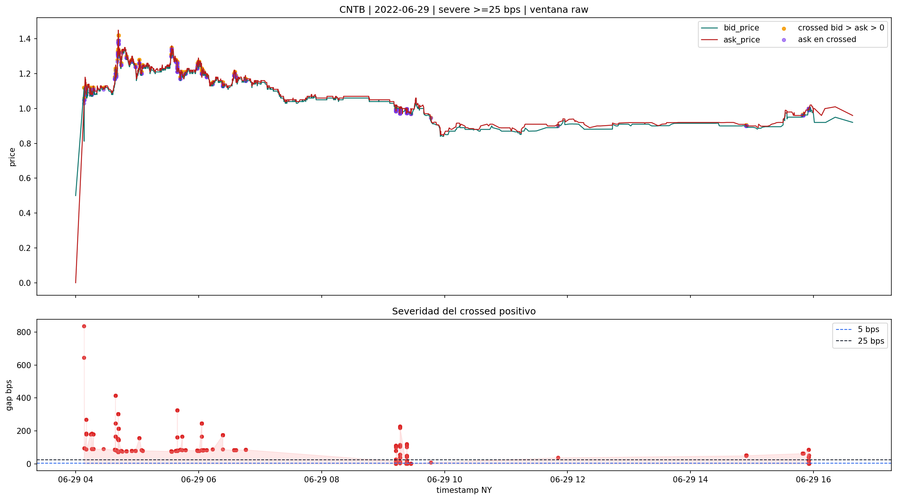

#### 02 Full Session Context
Esta imagen responde a la pregunta de extension intradiaria: el dano esta confinado a un bloque corto o contamina la sesion completa. Arriba se ve toda la sesion `04:00-20:00 NY`; abajo el `gap_bps` firmado. La decision que cambia es si el consumo debe penalizar solo un tramo o desechar el dia entero para uso operativo. El error que evita es tratar una cicatriz local como ruina total o, al reves, minimizar una degradacion distribuida a lo largo del dia. En ejecucion esto decide si la sesion puede seguir usandose con restricciones; en ML decide si las features intradiarias conservan significado economico.

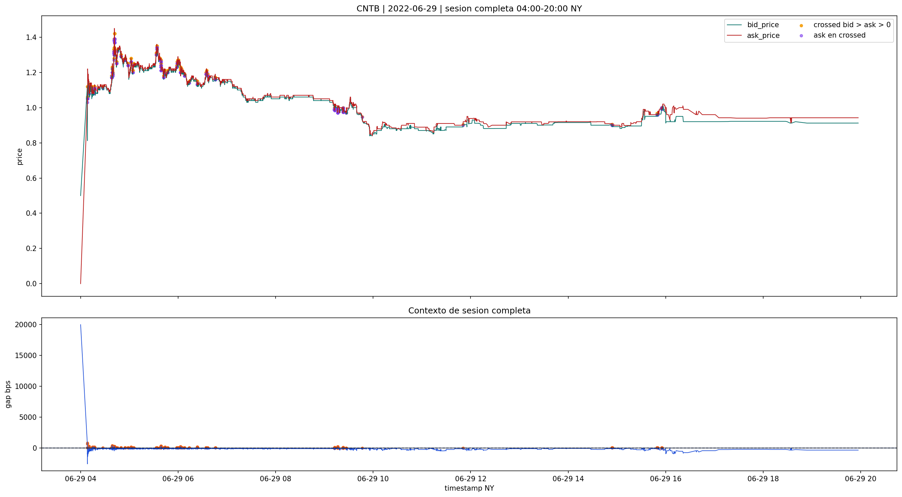

#### 03 Structure Diagnostics
Este panel responde a la pregunta de naturaleza del fallo: contradiccion economica genuina o mezcla con degeneracion estructural. Separa `ask=0` de `ask>0`, muestra la distribucion de `gap_bps` y resume patrones de integerizacion. La decision que cambia es como interpretar el dano: mercado localmente roto, artefacto de representacion o combinacion de ambos. El error que evita es sobrediagnosticar crossed reales cuando parte de la senal proviene de estructura degenerada del libro. Esta lectura afecta directamente a que el caso vaya a exclusion dura, a bandera contextual o a simple reconciliacion tecnica.

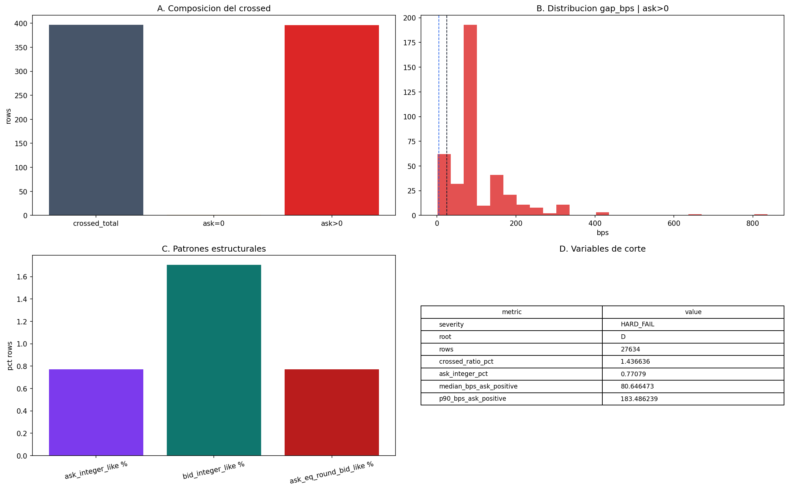

#### 04 Summary Card
Esta tarjeta responde a la pregunta de auditabilidad: cuales son exactamente las variables que sostienen la conclusion. Reune `severity`, `root`, `crossed_ratio_pct`, `ask_integer_pct`, `median_bps_ask_positive` y `p90_bps_ask_positive`. La decision que cambia es pasar de impresion visual a regla verificable. El error que evita es que dos inspectores lleguen a conclusiones distintas mirando la misma imagen sin una base numerica comun. Para gobernanza del proyecto, este panel es el que vuelve reproducible la decision para backtest, ML y auditoria.

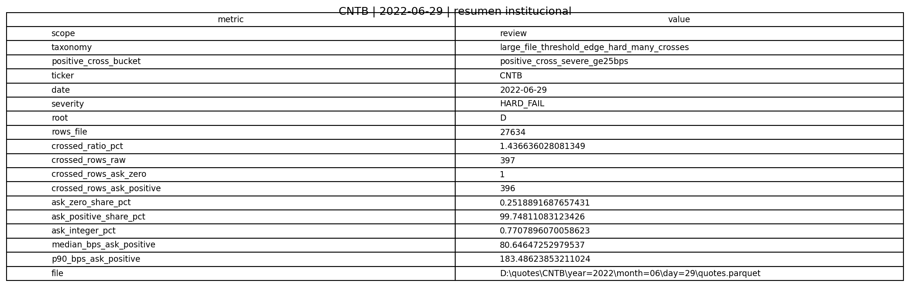

#### 05 Historical Context
Esta imagen responde a la pregunta causal externa: existe un framing historico que ayude a entender por que ocurre el episodio. Puede aportar halt context, explained o not strongly explained. La decision que cambia es cuanto peso se concede al contexto en la narrativa final. El error que evita es doble: ignorar una explicacion real o usarla como excusa para absolver un libro que localmente sigue siendo problematico.

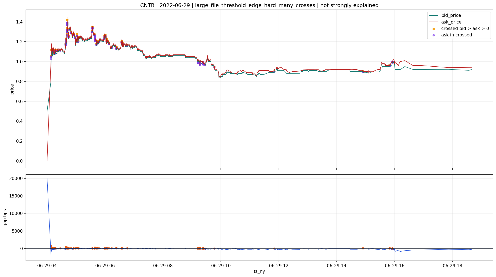

---

### 3. AEMD 2021-06-21

company_name: `AETHLON MEDICAL INC`
primary_exchange: `NASDAQ` (`XNAS`)
market_locale: `stocks/us`
scope: `review`
ticker: `AEMD`
date: `2021-06-21`
taxonomy: `large_file_threshold_edge_hard_many_crosses`
positive_cross_bucket: `positive_cross_severe_ge25bps`
severity: `HARD_FAIL`
root: `D`
rows: `12358`
crossed_ratio_pct: `1.092410`
crossed_rows_raw: `135`
crossed_rows_ask_zero: `0`
crossed_rows_ask_positive: `135`
ask_integer_pct: `0.606894`
median_bps_ask_positive: `78.125000`
p90_bps_ask_positive: `232.558140`
file: `D:\quotes\AEMD\year=2021\month=06\day=21\quotes.parquet`

#### Analisis Forense
La conclusion correcta del caso es que ya existe contradiccion economica real dentro del libro, pero aun no con fuerza suficiente para justificar exclusion dura sin contexto adicional. La taxonomy historica es `large_file_threshold_edge_hard_many_crosses` y el regimen positivo dominante es `severe >=25 bps`. Esto importa porque la taxonomy no solo clasifica: resume que tipo de anomalia se esta viendo y que clase de decision contractual puede defenderse despues. La taxonomy `large_file_threshold_edge_hard_many_crosses` implica un libro grande con muchas contradicciones, pero cerca del borde decisional. La dificultad analitica esta en decidir si el volumen de crossed es ruido absorbible o evidencia de degradacion suficientemente seria. El regimen `severe >=25 bps` empuja el caso a una lectura economicamente dura: el crossed deja de ser cosmetico y pasa a cuestionar si el libro sigue siendo interpretable como mercado negociable. En terminos observables, el file tiene `crossed_ratio_pct=1.092410` con `crossed_rows_ask_positive=135` y `crossed_rows_ask_zero=0`. La severidad economica del crossed ask>0 se resume en `median_bps_ask_positive=78.125000` y `p90_bps_ask_positive=232.558140`. Estos dos numeros convierten una forma visual rara en una conclusion operativa sobre si el libro sigue representando o no un mercado negociable. La decision que cambia es pasar de libro sano a libro util solo bajo cautela. `review` significa: no usar como si fuera ejecucion limpia, conservar para analisis contextual y sensibilidad. El error que evita es tratar como normal un episodio que ya contiene contradiccion economica real y contaminar simulaciones de ejecucion o validaciones demasiado optimistas. El patron estructural muestra `ask_integer_pct=0.606894`. Este numero obliga a separar dos explicaciones rivales: contradiccion economica genuina del libro o mezcla con degeneracion estructural / integerizacion. Toda la composicion crossed cae en `ask>0`. Eso endurece la lectura economica del caso: el dano no depende de ceros mecanicos, sino de contradiccion positiva dentro de precios aparentemente vivos. Como `ask_integer_pct` es bajo, la hipotesis de simple degeneracion mecanica pierde fuerza. Eso endurece la interpretacion: el crossed se parece mas a contradiccion economica genuina y menos a artefacto. En la capa de semantica de precio del evento aparecen `daily raw close=4144.0000`, `quote mid raw=5.1800`, `quote mid split_normalized=4144.0000`, `daily adjusted_proxy=4144.0000`. La reconciliacion incluye `future_split_factor=0.0013`. La implicacion metodologica es crucial: una discrepancia entre `quotes`, `daily` y una plataforma externa no puede leerse automaticamente como fallo del dataset. Puede ser semantica de precio distinta. El error que evita esta capa es mezclar raw, split-normalized y adjusted dentro del mismo pipeline, rompiendo auditoria, benchmarking y labels. Para pipelines, esto bloquea su uso como libro sano en ejecucion y features microestructurales principales, aunque aun puede mantenerse para forense, sensibilidad y estudios donde la anomalia sea parte del objeto de investigacion. Existe ademas una imagen historica de certificacion asociada. Su papel es poner el episodio en un marco causal mas amplio: halt, explained, not strongly explained o patron conocido. La regla que protege al proyecto es esta: el contexto externo se usa para explicar por que aparece el episodio, no para absolverlo. El error que evita es degradar el criterio de calidad del libro porque exista una historia plausible alrededor del caso.

#### 00 Event Month Context
Esta imagen responde a la pregunta de persistencia temporal: estamos ante un accidente local o ante una fase mas amplia de inestabilidad. Arriba coloca el evento en la serie `daily` real del mes; abajo compara `crossed_ratio_pct` y `max_gap_bps_pos` del dia contra sus vecinos. La decision que cambia es el peso estructural que se le concede al caso. El error que evita es juzgar igual un shock aislado y una degradacion repetida del libro.

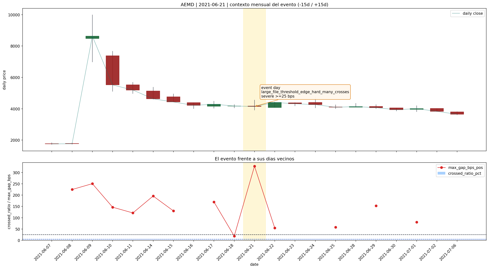

#### 00a Adjusted Proxy Contrast
Esta imagen responde a la pregunta de reconciliacion semantica: la discrepancia de precios viene de datos rotos o de vistas de precio distintas. Compara `daily raw`, `daily adjusted_proxy`, `quote mid raw` y `quote mid split_normalized`, y debajo ensena la cadena de dividendos y splits que produce la diferencia. La decision que cambia es si el inspector debe abrir una incidencia de calidad o cerrar el caso como diferencia legitima de semantica. El error que evita es mezclar series raw y adjusted como si fueran equivalentes. En pipelines reales, esto protege benchmarking, labels diarios y reconciliacion externa frente a falsas alarmas de precio.

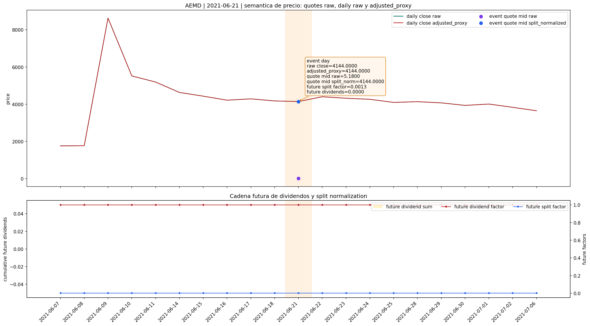

#### 00b Event Month Quotes Context
Esta imagen responde a la pregunta de recurrencia mensual dentro de `quotes`: el problema se concentra en el evento o reaparece en varias sesiones. Arriba concatena sesiones con datos disponibles; abajo resume cobertura diaria, `crossed_ratio_pct` y `max_gap_bps_pos`. La decision que cambia es si el caso debe leerse como episodio puntual o como sintoma de una fase repetida de libro degradado. El error que evita es extrapolar desde un unico dia a todo el mes sin evidencia.

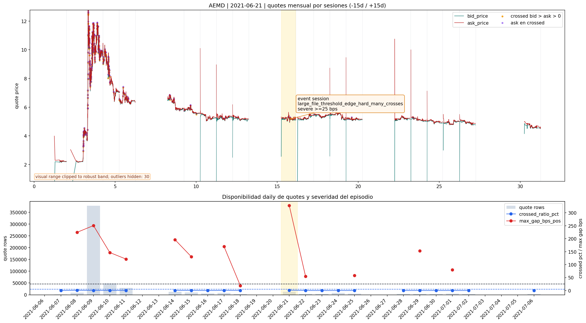

#### 01 Raw Window
Esta imagen responde a la primera pregunta decisiva del caso: el crossed observado es economicamente bastante fuerte para justificar un cambio de clase. Arriba ensena la geometria exacta del tramo conflictivo; abajo convierte esa geometria a bps y la enfrenta a los cortes `5 bps` y `25 bps`. El regimen dominante es `severe >=25 bps`. La decision que cambia es pasar de anomalia interpretable a `review` o `bad`. El error que evita es decidir por apariencia visual sin medir el dano economico real del crossed. En terminos de pipeline, este panel decide si el problema afecta solo a la lectura forense o si invalida simulacion de ejecucion y microstructure features.

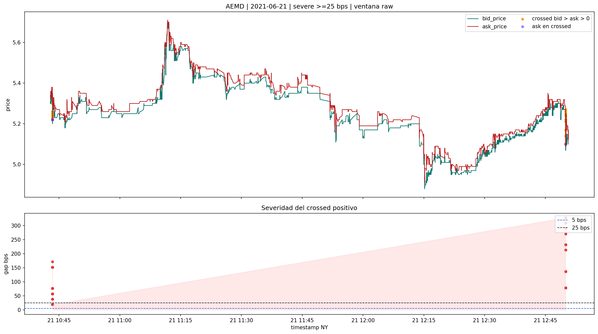

#### 02 Full Session Context
Esta imagen responde a la pregunta de extension intradiaria: el dano esta confinado a un bloque corto o contamina la sesion completa. Arriba se ve toda la sesion `04:00-20:00 NY`; abajo el `gap_bps` firmado. La decision que cambia es si el consumo debe penalizar solo un tramo o desechar el dia entero para uso operativo. El error que evita es tratar una cicatriz local como ruina total o, al reves, minimizar una degradacion distribuida a lo largo del dia. En ejecucion esto decide si la sesion puede seguir usandose con restricciones; en ML decide si las features intradiarias conservan significado economico.

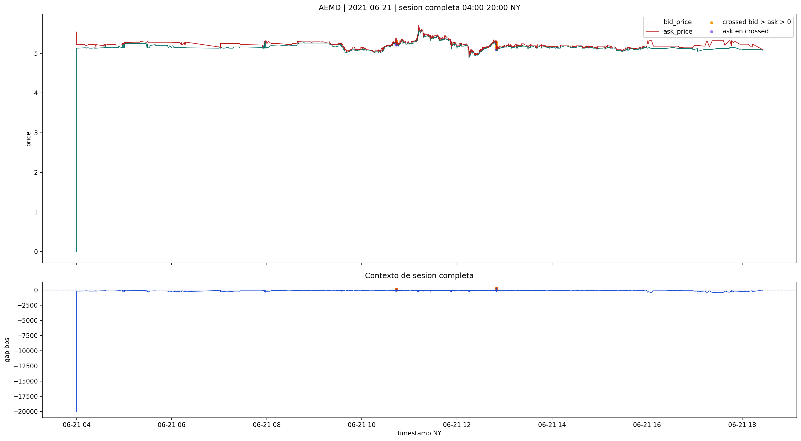

#### 03 Structure Diagnostics
Este panel responde a la pregunta de naturaleza del fallo: contradiccion economica genuina o mezcla con degeneracion estructural. Separa `ask=0` de `ask>0`, muestra la distribucion de `gap_bps` y resume patrones de integerizacion. La decision que cambia es como interpretar el dano: mercado localmente roto, artefacto de representacion o combinacion de ambos. El error que evita es sobrediagnosticar crossed reales cuando parte de la senal proviene de estructura degenerada del libro. Esta lectura afecta directamente a que el caso vaya a exclusion dura, a bandera contextual o a simple reconciliacion tecnica.

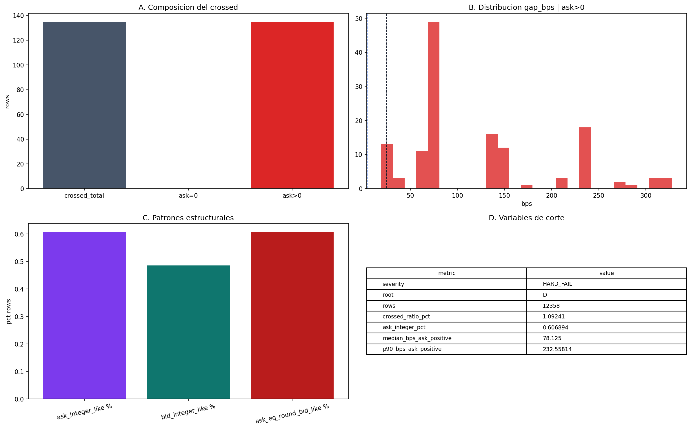

#### 04 Summary Card
Esta tarjeta responde a la pregunta de auditabilidad: cuales son exactamente las variables que sostienen la conclusion. Reune `severity`, `root`, `crossed_ratio_pct`, `ask_integer_pct`, `median_bps_ask_positive` y `p90_bps_ask_positive`. La decision que cambia es pasar de impresion visual a regla verificable. El error que evita es que dos inspectores lleguen a conclusiones distintas mirando la misma imagen sin una base numerica comun. Para gobernanza del proyecto, este panel es el que vuelve reproducible la decision para backtest, ML y auditoria.

---

### 4. MARK 2020-04-28

company_name: `Remark Holdings, Inc.`
primary_exchange: `NASDAQ` (`XNAS`)
market_locale: `stocks/us`
scope: `review`
ticker: `MARK`
date: `2020-04-28`
taxonomy: `large_file_threshold_edge_hard_many_crosses`
positive_cross_bucket: `positive_cross_severe_ge25bps`
severity: `HARD_FAIL`
root: `D`
rows: `10955`
crossed_ratio_pct: `1.013236`
crossed_rows_raw: `111`
crossed_rows_ask_zero: `0`
crossed_rows_ask_positive: `111`
ask_integer_pct: `0.000000`
median_bps_ask_positive: `62.959077`
p90_bps_ask_positive: `179.230364`
file: `D:\quotes\MARK\year=2020\month=04\day=28\quotes.parquet`

#### Analisis Forense
La conclusion correcta del caso es que ya existe contradiccion economica real dentro del libro, pero aun no con fuerza suficiente para justificar exclusion dura sin contexto adicional. La taxonomy historica es `large_file_threshold_edge_hard_many_crosses` y el regimen positivo dominante es `severe >=25 bps`. Esto importa porque la taxonomy no solo clasifica: resume que tipo de anomalia se esta viendo y que clase de decision contractual puede defenderse despues. La taxonomy `large_file_threshold_edge_hard_many_crosses` implica un libro grande con muchas contradicciones, pero cerca del borde decisional. La dificultad analitica esta en decidir si el volumen de crossed es ruido absorbible o evidencia de degradacion suficientemente seria. El regimen `severe >=25 bps` empuja el caso a una lectura economicamente dura: el crossed deja de ser cosmetico y pasa a cuestionar si el libro sigue siendo interpretable como mercado negociable. En terminos observables, el file tiene `crossed_ratio_pct=1.013236` con `crossed_rows_ask_positive=111` y `crossed_rows_ask_zero=0`. La severidad economica del crossed ask>0 se resume en `median_bps_ask_positive=62.959077` y `p90_bps_ask_positive=179.230364`. Estos dos numeros convierten una forma visual rara en una conclusion operativa sobre si el libro sigue representando o no un mercado negociable. La decision que cambia es pasar de libro sano a libro util solo bajo cautela. `review` significa: no usar como si fuera ejecucion limpia, conservar para analisis contextual y sensibilidad. El error que evita es tratar como normal un episodio que ya contiene contradiccion economica real y contaminar simulaciones de ejecucion o validaciones demasiado optimistas. El patron estructural muestra `ask_integer_pct=0.000000`. Este numero obliga a separar dos explicaciones rivales: contradiccion economica genuina del libro o mezcla con degeneracion estructural / integerizacion. Toda la composicion crossed cae en `ask>0`. Eso endurece la lectura economica del caso: el dano no depende de ceros mecanicos, sino de contradiccion positiva dentro de precios aparentemente vivos. Como `ask_integer_pct` es bajo, la hipotesis de simple degeneracion mecanica pierde fuerza. Eso endurece la interpretacion: el crossed se parece mas a contradiccion economica genuina y menos a artefacto. En la capa de semantica de precio del evento aparecen `daily raw close=5.0000`, `quote mid raw=0.4124`, `quote mid split_normalized=4.1245`, `daily adjusted_proxy=5.0000`. La reconciliacion incluye `future_split_factor=0.1000`. La implicacion metodologica es crucial: una discrepancia entre `quotes`, `daily` y una plataforma externa no puede leerse automaticamente como fallo del dataset. Puede ser semantica de precio distinta. El error que evita esta capa es mezclar raw, split-normalized y adjusted dentro del mismo pipeline, rompiendo auditoria, benchmarking y labels. Para pipelines, esto bloquea su uso como libro sano en ejecucion y features microestructurales principales, aunque aun puede mantenerse para forense, sensibilidad y estudios donde la anomalia sea parte del objeto de investigacion. Existe ademas una imagen historica de certificacion asociada. Su papel es poner el episodio en un marco causal mas amplio: halt, explained, not strongly explained o patron conocido. La regla que protege al proyecto es esta: el contexto externo se usa para explicar por que aparece el episodio, no para absolverlo. El error que evita es degradar el criterio de calidad del libro porque exista una historia plausible alrededor del caso.

#### 00 Event Month Context
Esta imagen responde a la pregunta de persistencia temporal: estamos ante un accidente local o ante una fase mas amplia de inestabilidad. Arriba coloca el evento en la serie `daily` real del mes; abajo compara `crossed_ratio_pct` y `max_gap_bps_pos` del dia contra sus vecinos. La decision que cambia es el peso estructural que se le concede al caso. El error que evita es juzgar igual un shock aislado y una degradacion repetida del libro.

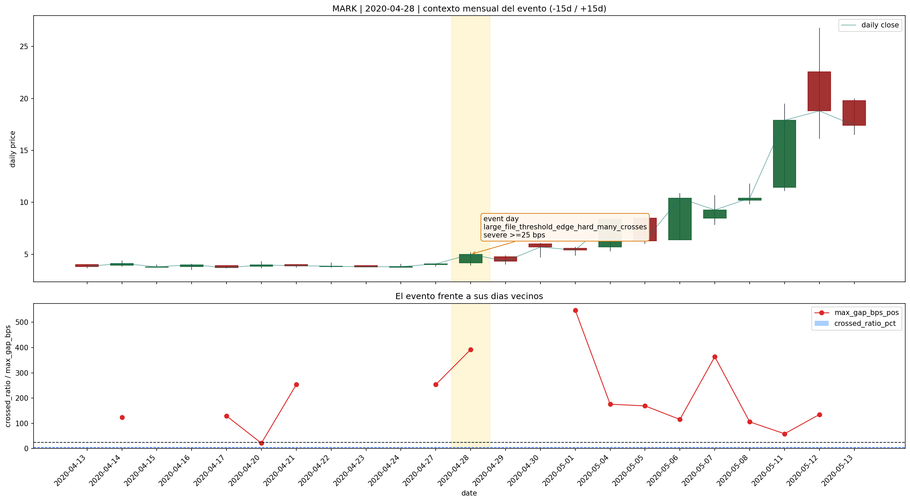

#### 00a Adjusted Proxy Contrast
Esta imagen responde a la pregunta de reconciliacion semantica: la discrepancia de precios viene de datos rotos o de vistas de precio distintas. Compara `daily raw`, `daily adjusted_proxy`, `quote mid raw` y `quote mid split_normalized`, y debajo ensena la cadena de dividendos y splits que produce la diferencia. La decision que cambia es si el inspector debe abrir una incidencia de calidad o cerrar el caso como diferencia legitima de semantica. El error que evita es mezclar series raw y adjusted como si fueran equivalentes. En pipelines reales, esto protege benchmarking, labels diarios y reconciliacion externa frente a falsas alarmas de precio.

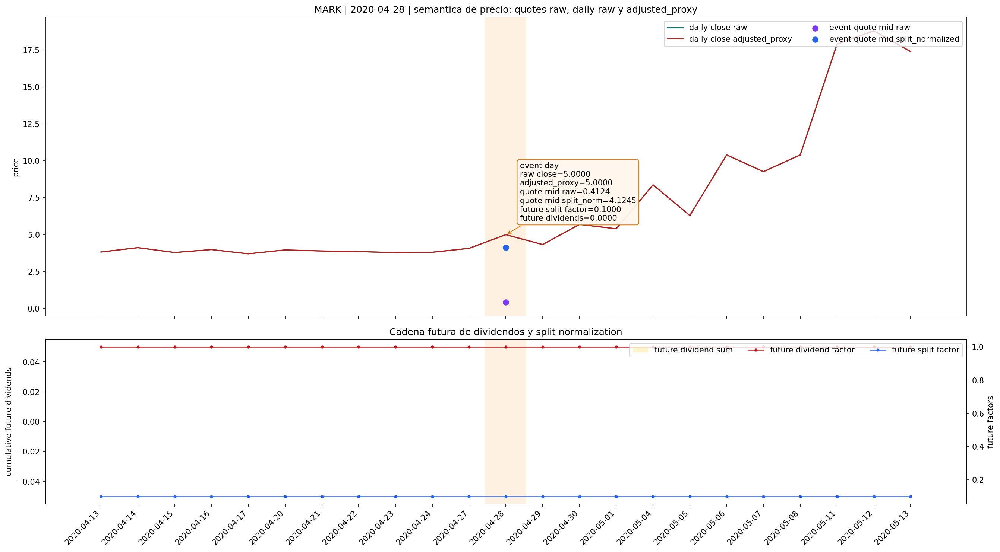

#### 00b Event Month Quotes Context
Esta imagen responde a la pregunta de recurrencia mensual dentro de `quotes`: el problema se concentra en el evento o reaparece en varias sesiones. Arriba concatena sesiones con datos disponibles; abajo resume cobertura diaria, `crossed_ratio_pct` y `max_gap_bps_pos`. La decision que cambia es si el caso debe leerse como episodio puntual o como sintoma de una fase repetida de libro degradado. El error que evita es extrapolar desde un unico dia a todo el mes sin evidencia.

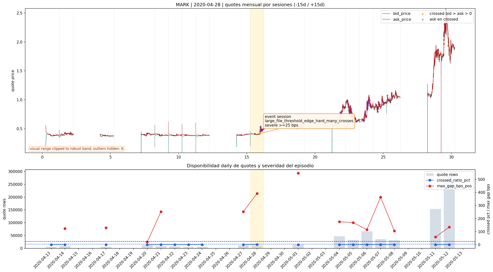

#### 01 Raw Window
Esta imagen responde a la primera pregunta decisiva del caso: el crossed observado es economicamente bastante fuerte para justificar un cambio de clase. Arriba ensena la geometria exacta del tramo conflictivo; abajo convierte esa geometria a bps y la enfrenta a los cortes `5 bps` y `25 bps`. El regimen dominante es `severe >=25 bps`. La decision que cambia es pasar de anomalia interpretable a `review` o `bad`. El error que evita es decidir por apariencia visual sin medir el dano economico real del crossed. En terminos de pipeline, este panel decide si el problema afecta solo a la lectura forense o si invalida simulacion de ejecucion y microstructure features.

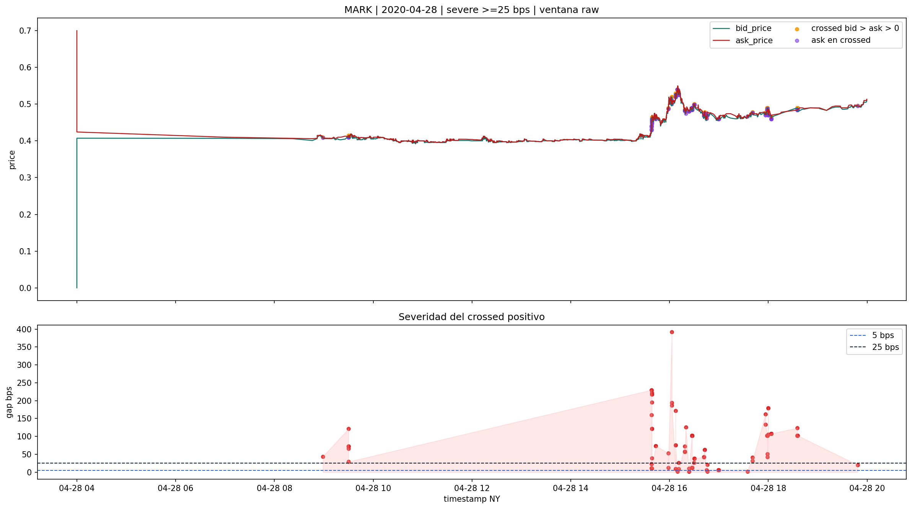

#### 02 Full Session Context
Esta imagen responde a la pregunta de extension intradiaria: el dano esta confinado a un bloque corto o contamina la sesion completa. Arriba se ve toda la sesion `04:00-20:00 NY`; abajo el `gap_bps` firmado. La decision que cambia es si el consumo debe penalizar solo un tramo o desechar el dia entero para uso operativo. El error que evita es tratar una cicatriz local como ruina total o, al reves, minimizar una degradacion distribuida a lo largo del dia. En ejecucion esto decide si la sesion puede seguir usandose con restricciones; en ML decide si las features intradiarias conservan significado economico.

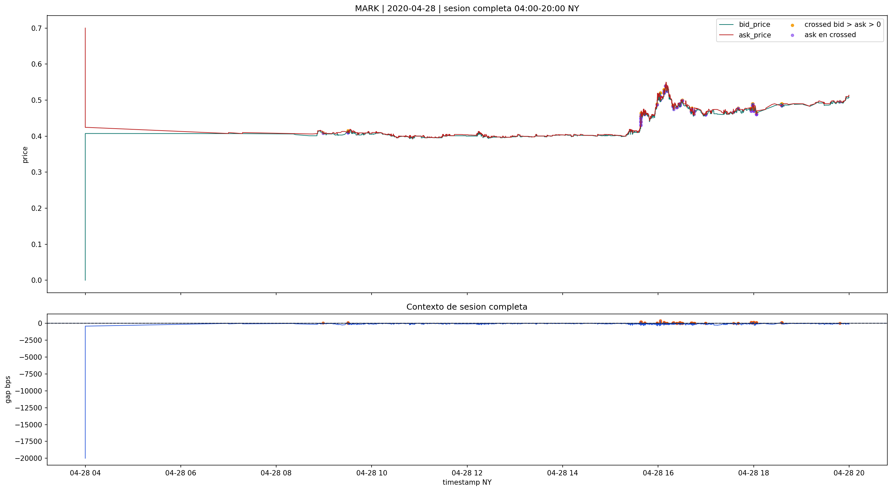

#### 03 Structure Diagnostics
Este panel responde a la pregunta de naturaleza del fallo: contradiccion economica genuina o mezcla con degeneracion estructural. Separa `ask=0` de `ask>0`, muestra la distribucion de `gap_bps` y resume patrones de integerizacion. La decision que cambia es como interpretar el dano: mercado localmente roto, artefacto de representacion o combinacion de ambos. El error que evita es sobrediagnosticar crossed reales cuando parte de la senal proviene de estructura degenerada del libro. Esta lectura afecta directamente a que el caso vaya a exclusion dura, a bandera contextual o a simple reconciliacion tecnica.

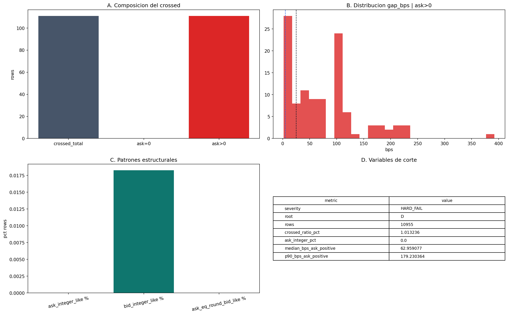

#### 04 Summary Card
Esta tarjeta responde a la pregunta de auditabilidad: cuales son exactamente las variables que sostienen la conclusion. Reune `severity`, `root`, `crossed_ratio_pct`, `ask_integer_pct`, `median_bps_ask_positive` y `p90_bps_ask_positive`. La decision que cambia es pasar de impresion visual a regla verificable. El error que evita es que dos inspectores lleguen a conclusiones distintas mirando la misma imagen sin una base numerica comun. Para gobernanza del proyecto, este panel es el que vuelve reproducible la decision para backtest, ML y auditoria.

---

### 5. TOPS 2020-05-26

company_name: `TOP Ships Inc.`
primary_exchange: `NYSE American` (`XASE`)
market_locale: `stocks/us`
scope: `review`
ticker: `TOPS`
date: `2020-05-26`
taxonomy: `large_file_threshold_edge_hard_many_crosses`
positive_cross_bucket: `positive_cross_severe_ge25bps`
severity: `HARD_FAIL`
root: `C`
rows: `8819`
crossed_ratio_pct: `0.827758`
crossed_rows_raw: `73`
crossed_rows_ask_zero: `0`
crossed_rows_ask_positive: `73`
ask_integer_pct: `0.000000`
median_bps_ask_positive: `41.465100`
p90_bps_ask_positive: `161.186938`
file: `C:\TSIS_Data\data\quotes\TOPS\year=2020\month=05\day=26\quotes.parquet`

#### Analisis Forense
La conclusion correcta del caso es que ya existe contradiccion economica real dentro del libro, pero aun no con fuerza suficiente para justificar exclusion dura sin contexto adicional. La taxonomy historica es `large_file_threshold_edge_hard_many_crosses` y el regimen positivo dominante es `severe >=25 bps`. Esto importa porque la taxonomy no solo clasifica: resume que tipo de anomalia se esta viendo y que clase de decision contractual puede defenderse despues. La taxonomy `large_file_threshold_edge_hard_many_crosses` implica un libro grande con muchas contradicciones, pero cerca del borde decisional. La dificultad analitica esta en decidir si el volumen de crossed es ruido absorbible o evidencia de degradacion suficientemente seria. El regimen `severe >=25 bps` empuja el caso a una lectura economicamente dura: el crossed deja de ser cosmetico y pasa a cuestionar si el libro sigue siendo interpretable como mercado negociable. En terminos observables, el file tiene `crossed_ratio_pct=0.827758` con `crossed_rows_ask_positive=73` y `crossed_rows_ask_zero=0`. La severidad economica del crossed ask>0 se resume en `median_bps_ask_positive=41.465100` y `p90_bps_ask_positive=161.186938`. Estos dos numeros convierten una forma visual rara en una conclusion operativa sobre si el libro sigue representando o no un mercado negociable. La decision que cambia es pasar de libro sano a libro util solo bajo cautela. `review` significa: no usar como si fuera ejecucion limpia, conservar para analisis contextual y sensibilidad. El error que evita es tratar como normal un episodio que ya contiene contradiccion economica real y contaminar simulaciones de ejecucion o validaciones demasiado optimistas. El patron estructural muestra `ask_integer_pct=0.000000`. Este numero obliga a separar dos explicaciones rivales: contradiccion economica genuina del libro o mezcla con degeneracion estructural / integerizacion. Toda la composicion crossed cae en `ask>0`. Eso endurece la lectura economica del caso: el dano no depende de ceros mecanicos, sino de contradiccion positiva dentro de precios aparentemente vivos. Como `ask_integer_pct` es bajo, la hipotesis de simple degeneracion mecanica pierde fuerza. Eso endurece la interpretacion: el crossed se parece mas a contradiccion economica genuina y menos a artefacto. En la capa de semantica de precio del evento aparecen `daily raw close=833.4000`, `quote mid raw=0.1379`, `quote mid split_normalized=827.7000`, `daily adjusted_proxy=833.4000`. La reconciliacion incluye `future_split_factor=0.0002`. La implicacion metodologica es crucial: una discrepancia entre `quotes`, `daily` y una plataforma externa no puede leerse automaticamente como fallo del dataset. Puede ser semantica de precio distinta. El error que evita esta capa es mezclar raw, split-normalized y adjusted dentro del mismo pipeline, rompiendo auditoria, benchmarking y labels. Para pipelines, esto bloquea su uso como libro sano en ejecucion y features microestructurales principales, aunque aun puede mantenerse para forense, sensibilidad y estudios donde la anomalia sea parte del objeto de investigacion. Existe ademas una imagen historica de certificacion asociada. Su papel es poner el episodio en un marco causal mas amplio: halt, explained, not strongly explained o patron conocido. La regla que protege al proyecto es esta: el contexto externo se usa para explicar por que aparece el episodio, no para absolverlo. El error que evita es degradar el criterio de calidad del libro porque exista una historia plausible alrededor del caso.

#### 00 Event Month Context
Esta imagen responde a la pregunta de persistencia temporal: estamos ante un accidente local o ante una fase mas amplia de inestabilidad. Arriba coloca el evento en la serie `daily` real del mes; abajo compara `crossed_ratio_pct` y `max_gap_bps_pos` del dia contra sus vecinos. La decision que cambia es el peso estructural que se le concede al caso. El error que evita es juzgar igual un shock aislado y una degradacion repetida del libro.

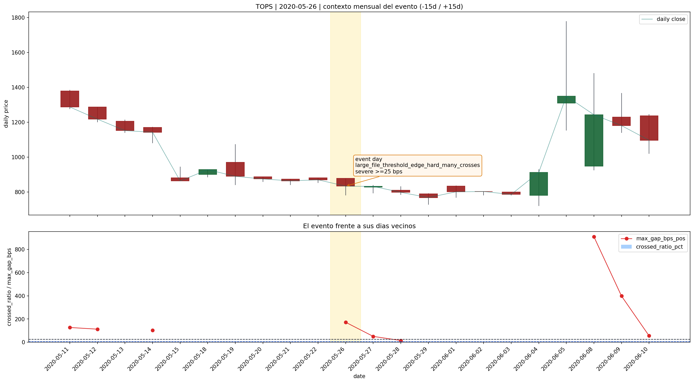

#### 00a Adjusted Proxy Contrast
Esta imagen responde a la pregunta de reconciliacion semantica: la discrepancia de precios viene de datos rotos o de vistas de precio distintas. Compara `daily raw`, `daily adjusted_proxy`, `quote mid raw` y `quote mid split_normalized`, y debajo ensena la cadena de dividendos y splits que produce la diferencia. La decision que cambia es si el inspector debe abrir una incidencia de calidad o cerrar el caso como diferencia legitima de semantica. El error que evita es mezclar series raw y adjusted como si fueran equivalentes. En pipelines reales, esto protege benchmarking, labels diarios y reconciliacion externa frente a falsas alarmas de precio.

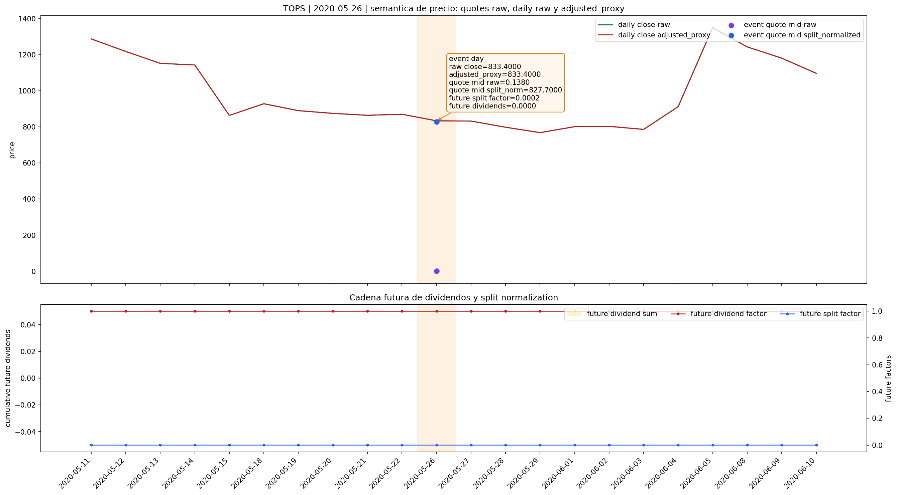

#### 00b Event Month Quotes Context
Esta imagen responde a la pregunta de recurrencia mensual dentro de `quotes`: el problema se concentra en el evento o reaparece en varias sesiones. Arriba concatena sesiones con datos disponibles; abajo resume cobertura diaria, `crossed_ratio_pct` y `max_gap_bps_pos`. La decision que cambia es si el caso debe leerse como episodio puntual o como sintoma de una fase repetida de libro degradado. El error que evita es extrapolar desde un unico dia a todo el mes sin evidencia.

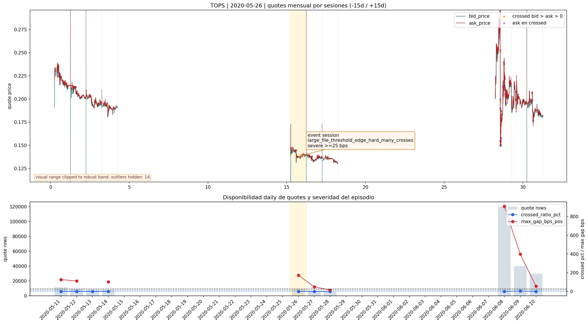

#### 01 Raw Window
Esta imagen responde a la primera pregunta decisiva del caso: el crossed observado es economicamente bastante fuerte para justificar un cambio de clase. Arriba ensena la geometria exacta del tramo conflictivo; abajo convierte esa geometria a bps y la enfrenta a los cortes `5 bps` y `25 bps`. El regimen dominante es `severe >=25 bps`. La decision que cambia es pasar de anomalia interpretable a `review` o `bad`. El error que evita es decidir por apariencia visual sin medir el dano economico real del crossed. En terminos de pipeline, este panel decide si el problema afecta solo a la lectura forense o si invalida simulacion de ejecucion y microstructure features.

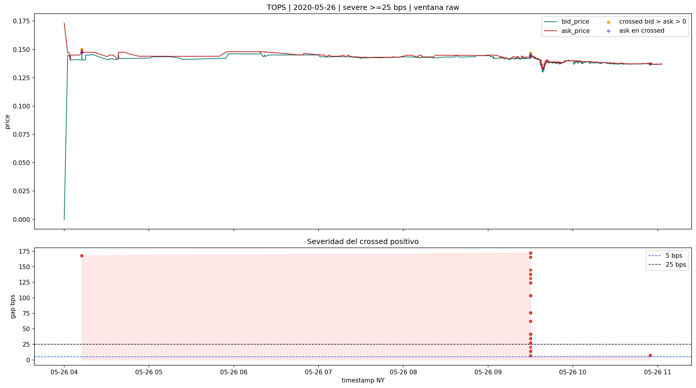

#### 02 Full Session Context
Esta imagen responde a la pregunta de extension intradiaria: el dano esta confinado a un bloque corto o contamina la sesion completa. Arriba se ve toda la sesion `04:00-20:00 NY`; abajo el `gap_bps` firmado. La decision que cambia es si el consumo debe penalizar solo un tramo o desechar el dia entero para uso operativo. El error que evita es tratar una cicatriz local como ruina total o, al reves, minimizar una degradacion distribuida a lo largo del dia. En ejecucion esto decide si la sesion puede seguir usandose con restricciones; en ML decide si las features intradiarias conservan significado economico.

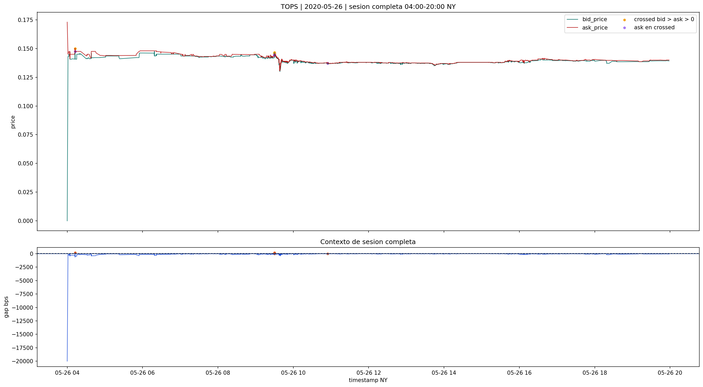

#### 03 Structure Diagnostics
Este panel responde a la pregunta de naturaleza del fallo: contradiccion economica genuina o mezcla con degeneracion estructural. Separa `ask=0` de `ask>0`, muestra la distribucion de `gap_bps` y resume patrones de integerizacion. La decision que cambia es como interpretar el dano: mercado localmente roto, artefacto de representacion o combinacion de ambos. El error que evita es sobrediagnosticar crossed reales cuando parte de la senal proviene de estructura degenerada del libro. Esta lectura afecta directamente a que el caso vaya a exclusion dura, a bandera contextual o a simple reconciliacion tecnica.

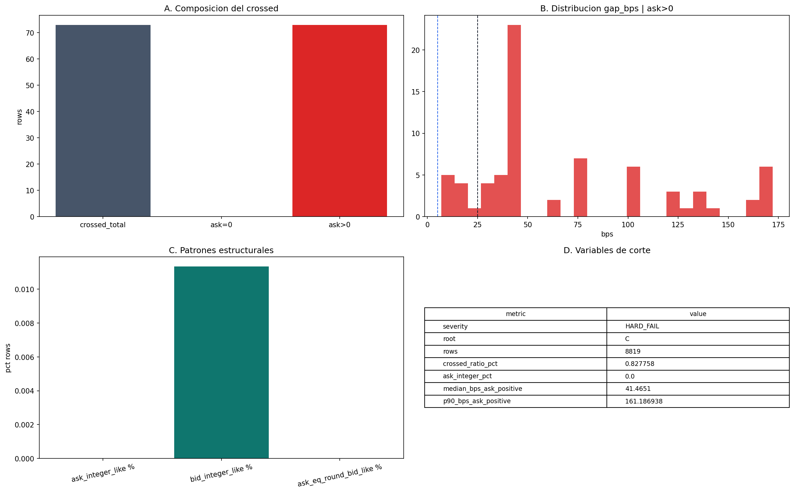

#### 04 Summary Card
Esta tarjeta responde a la pregunta de auditabilidad: cuales son exactamente las variables que sostienen la conclusion. Reune `severity`, `root`, `crossed_ratio_pct`, `ask_integer_pct`, `median_bps_ask_positive` y `p90_bps_ask_positive`. La decision que cambia es pasar de impresion visual a regla verificable. El error que evita es que dos inspectores lleguen a conclusiones distintas mirando la misma imagen sin una base numerica comun. Para gobernanza del proyecto, este panel es el que vuelve reproducible la decision para backtest, ML y auditoria.

---

### 6. LPSN 2013-11-25

company_name: `LivePerson Inc`
primary_exchange: `NASDAQ` (`XNAS`)
market_locale: `stocks/us`
scope: `review`
ticker: `LPSN`
date: `2013-11-25`
taxonomy: `large_file_threshold_edge_hard_many_crosses`
positive_cross_bucket: `positive_cross_severe_ge25bps`
severity: `HARD_FAIL`
root: `D`
rows: `18855`
crossed_ratio_pct: `0.880403`
crossed_rows_raw: `166`
crossed_rows_ask_zero: `157`
crossed_rows_ask_positive: `9`
ask_integer_pct: `1.994166`
median_bps_ask_positive: `25.178347`
p90_bps_ask_positive: `109.565950`
file: `D:\quotes\LPSN\year=2013\month=11\day=25\quotes.parquet`

#### Analisis Forense
La conclusion correcta del caso es que ya existe contradiccion economica real dentro del libro, pero aun no con fuerza suficiente para justificar exclusion dura sin contexto adicional. La taxonomy historica es `large_file_threshold_edge_hard_many_crosses` y el regimen positivo dominante es `severe >=25 bps`. Esto importa porque la taxonomy no solo clasifica: resume que tipo de anomalia se esta viendo y que clase de decision contractual puede defenderse despues. La taxonomy `large_file_threshold_edge_hard_many_crosses` implica un libro grande con muchas contradicciones, pero cerca del borde decisional. La dificultad analitica esta en decidir si el volumen de crossed es ruido absorbible o evidencia de degradacion suficientemente seria. El regimen `severe >=25 bps` empuja el caso a una lectura economicamente dura: el crossed deja de ser cosmetico y pasa a cuestionar si el libro sigue siendo interpretable como mercado negociable. En terminos observables, el file tiene `crossed_ratio_pct=0.880403` con `crossed_rows_ask_positive=9` y `crossed_rows_ask_zero=157`. La severidad economica del crossed ask>0 se resume en `median_bps_ask_positive=25.178347` y `p90_bps_ask_positive=109.565950`. Estos dos numeros convierten una forma visual rara en una conclusion operativa sobre si el libro sigue representando o no un mercado negociable. La decision que cambia es pasar de libro sano a libro util solo bajo cautela. `review` significa: no usar como si fuera ejecucion limpia, conservar para analisis contextual y sensibilidad. El error que evita es tratar como normal un episodio que ya contiene contradiccion economica real y contaminar simulaciones de ejecucion o validaciones demasiado optimistas. El patron estructural muestra `ask_integer_pct=1.994166`. Este numero obliga a separar dos explicaciones rivales: contradiccion economica genuina del libro o mezcla con degeneracion estructural / integerizacion. La mayor parte del crossed vive en `ask=0`, pero existe una cola `ask>0` que impide absolver el caso como simple glitch. La lectura correcta es mixta: dano estructural dominante con residuo economico que aun puede justificar bandera o exclusion. Como `ask_integer_pct` es bajo, la hipotesis de simple degeneracion mecanica pierde fuerza. Eso endurece la interpretacion: el crossed se parece mas a contradiccion economica genuina y menos a artefacto. En la capa de semantica de precio del evento aparecen `daily raw close=177.0000`, `quote mid raw=11.8650`, `quote mid split_normalized=177.9750`, `daily adjusted_proxy=177.0000`. La reconciliacion incluye `future_split_factor=0.0667`. La implicacion metodologica es crucial: una discrepancia entre `quotes`, `daily` y una plataforma externa no puede leerse automaticamente como fallo del dataset. Puede ser semantica de precio distinta. El error que evita esta capa es mezclar raw, split-normalized y adjusted dentro del mismo pipeline, rompiendo auditoria, benchmarking y labels. Para pipelines, esto bloquea su uso como libro sano en ejecucion y features microestructurales principales, aunque aun puede mantenerse para forense, sensibilidad y estudios donde la anomalia sea parte del objeto de investigacion. Existe ademas una imagen historica de certificacion asociada. Su papel es poner el episodio en un marco causal mas amplio: halt, explained, not strongly explained o patron conocido. La regla que protege al proyecto es esta: el contexto externo se usa para explicar por que aparece el episodio, no para absolverlo. El error que evita es degradar el criterio de calidad del libro porque exista una historia plausible alrededor del caso.

#### 00 Event Month Context
Esta imagen responde a la pregunta de persistencia temporal: estamos ante un accidente local o ante una fase mas amplia de inestabilidad. Arriba coloca el evento en la serie `daily` real del mes; abajo compara `crossed_ratio_pct` y `max_gap_bps_pos` del dia contra sus vecinos. La decision que cambia es el peso estructural que se le concede al caso. El error que evita es juzgar igual un shock aislado y una degradacion repetida del libro.

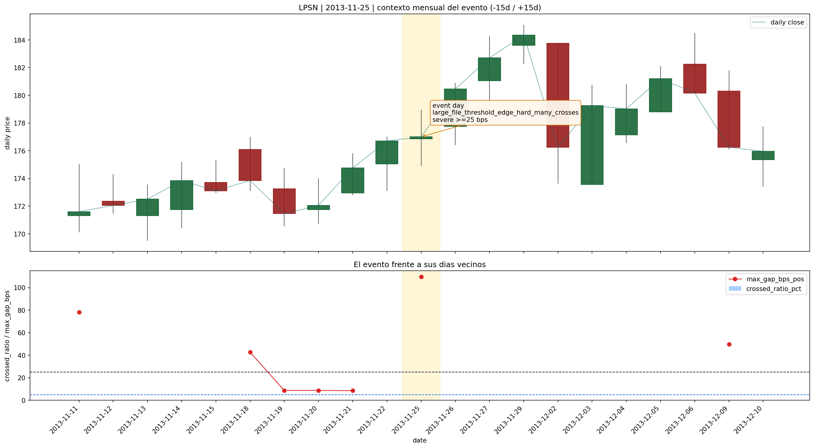

#### 00a Adjusted Proxy Contrast
Esta imagen responde a la pregunta de reconciliacion semantica: la discrepancia de precios viene de datos rotos o de vistas de precio distintas. Compara `daily raw`, `daily adjusted_proxy`, `quote mid raw` y `quote mid split_normalized`, y debajo ensena la cadena de dividendos y splits que produce la diferencia. La decision que cambia es si el inspector debe abrir una incidencia de calidad o cerrar el caso como diferencia legitima de semantica. El error que evita es mezclar series raw y adjusted como si fueran equivalentes. En pipelines reales, esto protege benchmarking, labels diarios y reconciliacion externa frente a falsas alarmas de precio.

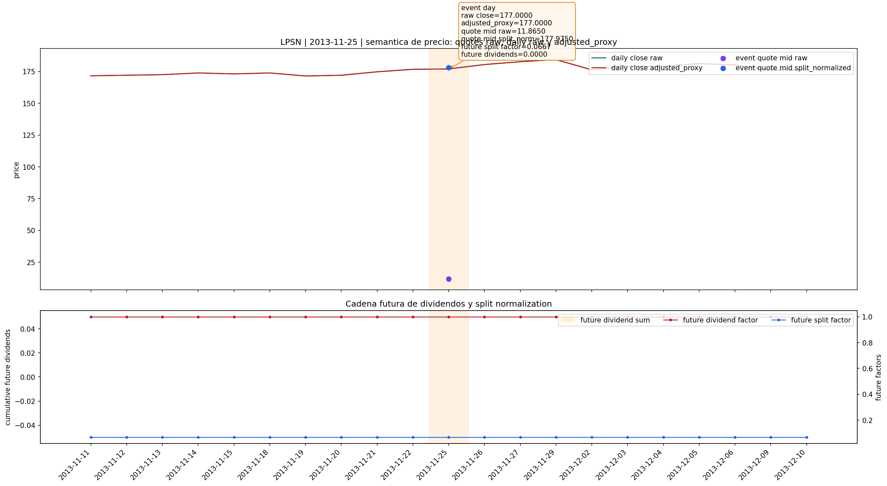

#### 00b Event Month Quotes Context
Esta imagen responde a la pregunta de recurrencia mensual dentro de `quotes`: el problema se concentra en el evento o reaparece en varias sesiones. Arriba concatena sesiones con datos disponibles; abajo resume cobertura diaria, `crossed_ratio_pct` y `max_gap_bps_pos`. La decision que cambia es si el caso debe leerse como episodio puntual o como sintoma de una fase repetida de libro degradado. El error que evita es extrapolar desde un unico dia a todo el mes sin evidencia.

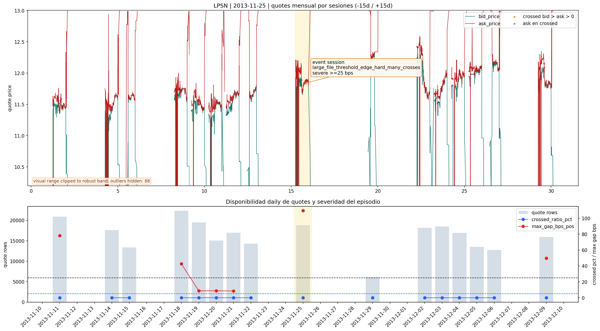

#### 01 Raw Window
Esta imagen responde a la primera pregunta decisiva del caso: el crossed observado es economicamente bastante fuerte para justificar un cambio de clase. Arriba ensena la geometria exacta del tramo conflictivo; abajo convierte esa geometria a bps y la enfrenta a los cortes `5 bps` y `25 bps`. El regimen dominante es `severe >=25 bps`. La decision que cambia es pasar de anomalia interpretable a `review` o `bad`. El error que evita es decidir por apariencia visual sin medir el dano economico real del crossed. En terminos de pipeline, este panel decide si el problema afecta solo a la lectura forense o si invalida simulacion de ejecucion y microstructure features.

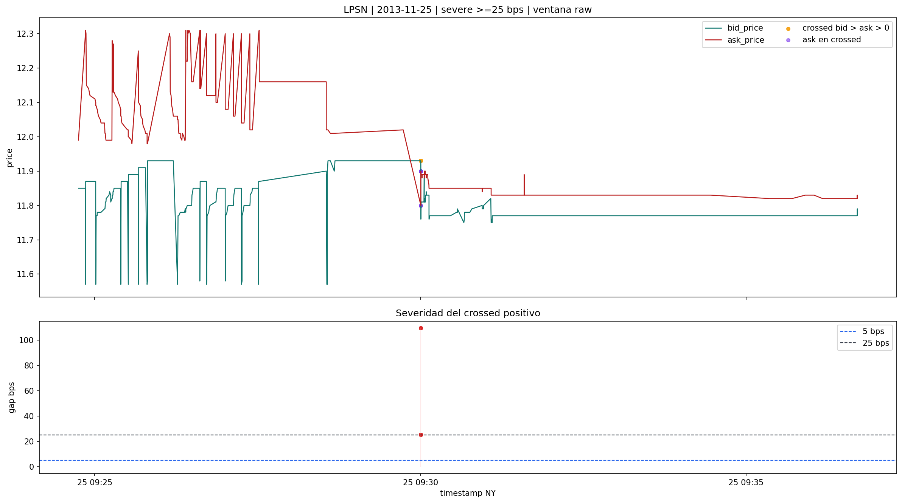

#### 02 Full Session Context
Esta imagen responde a la pregunta de extension intradiaria: el dano esta confinado a un bloque corto o contamina la sesion completa. Arriba se ve toda la sesion `04:00-20:00 NY`; abajo el `gap_bps` firmado. La decision que cambia es si el consumo debe penalizar solo un tramo o desechar el dia entero para uso operativo. El error que evita es tratar una cicatriz local como ruina total o, al reves, minimizar una degradacion distribuida a lo largo del dia. En ejecucion esto decide si la sesion puede seguir usandose con restricciones; en ML decide si las features intradiarias conservan significado economico.

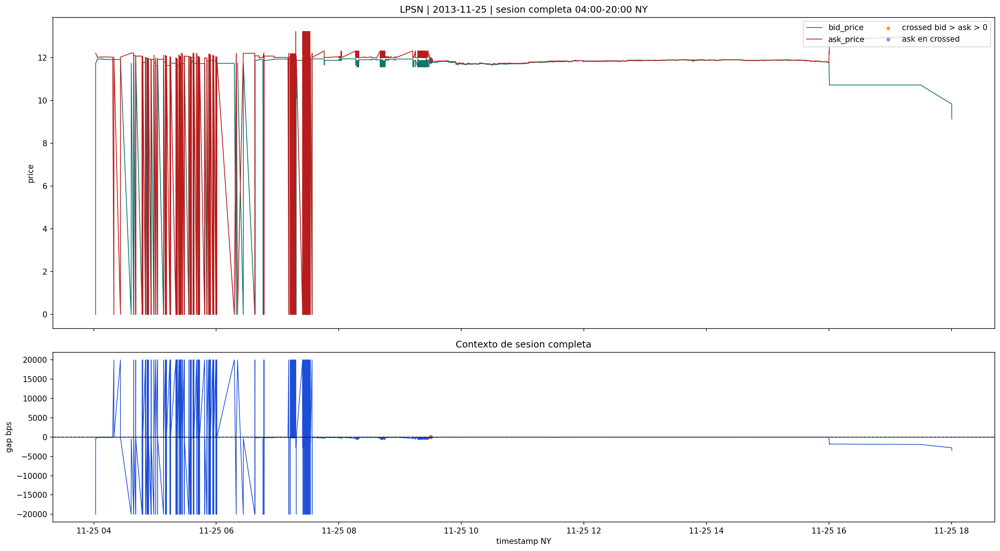

#### 03 Structure Diagnostics
Este panel responde a la pregunta de naturaleza del fallo: contradiccion economica genuina o mezcla con degeneracion estructural. Separa `ask=0` de `ask>0`, muestra la distribucion de `gap_bps` y resume patrones de integerizacion. La decision que cambia es como interpretar el dano: mercado localmente roto, artefacto de representacion o combinacion de ambos. El error que evita es sobrediagnosticar crossed reales cuando parte de la senal proviene de estructura degenerada del libro. Esta lectura afecta directamente a que el caso vaya a exclusion dura, a bandera contextual o a simple reconciliacion tecnica.

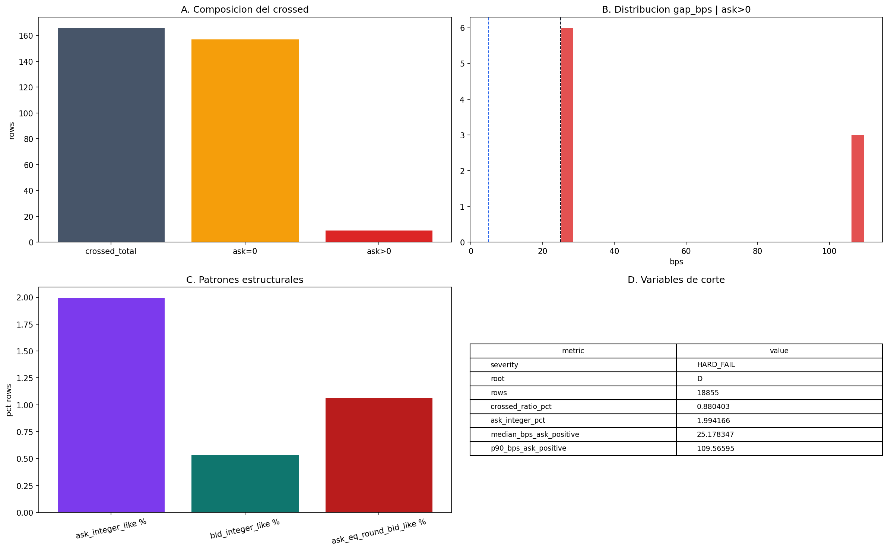

#### 04 Summary Card
Esta tarjeta responde a la pregunta de auditabilidad: cuales son exactamente las variables que sostienen la conclusion. Reune `severity`, `root`, `crossed_ratio_pct`, `ask_integer_pct`, `median_bps_ask_positive` y `p90_bps_ask_positive`. La decision que cambia es pasar de impresion visual a regla verificable. El error que evita es que dos inspectores lleguen a conclusiones distintas mirando la misma imagen sin una base numerica comun. Para gobernanza del proyecto, este panel es el que vuelve reproducible la decision para backtest, ML y auditoria.

---

### 7. NM 2008-05-05

company_name: `Navios Maritime Holdings Inc.`
primary_exchange: `NYSE` (`XNYS`)
market_locale: `stocks/us`
scope: `review`
ticker: `NM`
date: `2008-05-05`
taxonomy: `large_file_threshold_edge_hard_many_crosses`
positive_cross_bucket: `positive_cross_moderate_5to25bps`
severity: `HARD_FAIL`
root: `D`
rows: `12456`
crossed_ratio_pct: `1.525369`
crossed_rows_raw: `190`
crossed_rows_ask_zero: `1`
crossed_rows_ask_positive: `189`
ask_integer_pct: `0.160565`
median_bps_ask_positive: `16.077170`
p90_bps_ask_positive: `40.080160`
file: `D:\quotes\NM\year=2008\month=05\day=05\quotes.parquet`

#### Analisis Forense
La conclusion correcta del caso es que ya existe contradiccion economica real dentro del libro, pero aun no con fuerza suficiente para justificar exclusion dura sin contexto adicional. La taxonomy historica es `large_file_threshold_edge_hard_many_crosses` y el regimen positivo dominante es `moderate 5-25 bps`. Esto importa porque la taxonomy no solo clasifica: resume que tipo de anomalia se esta viendo y que clase de decision contractual puede defenderse despues. La taxonomy `large_file_threshold_edge_hard_many_crosses` implica un libro grande con muchas contradicciones, pero cerca del borde decisional. La dificultad analitica esta en decidir si el volumen de crossed es ruido absorbible o evidencia de degradacion suficientemente seria. El regimen `moderate 5-25 bps` ya entra en zona donde el crossed tiene capacidad real de contaminar simulacion de ejecucion y features microestructurales, aunque todavia puede requerir lectura contextual antes de exclusion dura. En terminos observables, el file tiene `crossed_ratio_pct=1.525369` con `crossed_rows_ask_positive=189` y `crossed_rows_ask_zero=1`. La severidad economica del crossed ask>0 se resume en `median_bps_ask_positive=16.077170` y `p90_bps_ask_positive=40.080160`. Estos dos numeros convierten una forma visual rara en una conclusion operativa sobre si el libro sigue representando o no un mercado negociable. La decision que cambia es pasar de libro sano a libro util solo bajo cautela. `review` significa: no usar como si fuera ejecucion limpia, conservar para analisis contextual y sensibilidad. El error que evita es tratar como normal un episodio que ya contiene contradiccion economica real y contaminar simulaciones de ejecucion o validaciones demasiado optimistas. El patron estructural muestra `ask_integer_pct=0.160565`. Este numero obliga a separar dos explicaciones rivales: contradiccion economica genuina del libro o mezcla con degeneracion estructural / integerizacion. La mayor parte del crossed vive en `ask>0`, de modo que el corazon del problema sigue siendo economico. La parte `ask=0`, si existe, acompana pero no explica por si sola la anomalia. Como `ask_integer_pct` es bajo, la hipotesis de simple degeneracion mecanica pierde fuerza. Eso endurece la interpretacion: el crossed se parece mas a contradiccion economica genuina y menos a artefacto. En la capa de semantica de precio del evento aparecen `daily raw close=125.3000`, `quote mid raw=12.2500`, `quote mid split_normalized=122.5000`, `daily adjusted_proxy=118.6152`. La reconciliacion incluye `future_split_factor=0.1000`. Ademas hay `post_event_dividend_sum=1.8900`. La implicacion metodologica es crucial: una discrepancia entre `quotes`, `daily` y una plataforma externa no puede leerse automaticamente como fallo del dataset. Puede ser semantica de precio distinta. El error que evita esta capa es mezclar raw, split-normalized y adjusted dentro del mismo pipeline, rompiendo auditoria, benchmarking y labels. Para pipelines, esto bloquea su uso como libro sano en ejecucion y features microestructurales principales, aunque aun puede mantenerse para forense, sensibilidad y estudios donde la anomalia sea parte del objeto de investigacion. Existe ademas una imagen historica de certificacion asociada. Su papel es poner el episodio en un marco causal mas amplio: halt, explained, not strongly explained o patron conocido. La regla que protege al proyecto es esta: el contexto externo se usa para explicar por que aparece el episodio, no para absolverlo. El error que evita es degradar el criterio de calidad del libro porque exista una historia plausible alrededor del caso.

#### 00 Event Month Context
Esta imagen responde a la pregunta de persistencia temporal: estamos ante un accidente local o ante una fase mas amplia de inestabilidad. Arriba coloca el evento en la serie `daily` real del mes; abajo compara `crossed_ratio_pct` y `max_gap_bps_pos` del dia contra sus vecinos. La decision que cambia es el peso estructural que se le concede al caso. El error que evita es juzgar igual un shock aislado y una degradacion repetida del libro.

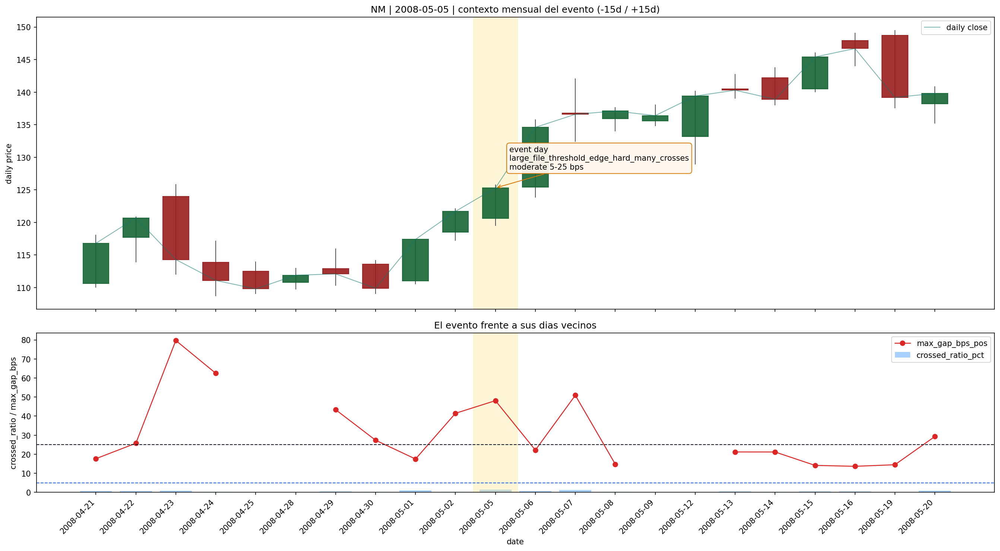

#### 00a Adjusted Proxy Contrast
Esta imagen responde a la pregunta de reconciliacion semantica: la discrepancia de precios viene de datos rotos o de vistas de precio distintas. Compara `daily raw`, `daily adjusted_proxy`, `quote mid raw` y `quote mid split_normalized`, y debajo ensena la cadena de dividendos y splits que produce la diferencia. La decision que cambia es si el inspector debe abrir una incidencia de calidad o cerrar el caso como diferencia legitima de semantica. El error que evita es mezclar series raw y adjusted como si fueran equivalentes. En pipelines reales, esto protege benchmarking, labels diarios y reconciliacion externa frente a falsas alarmas de precio.

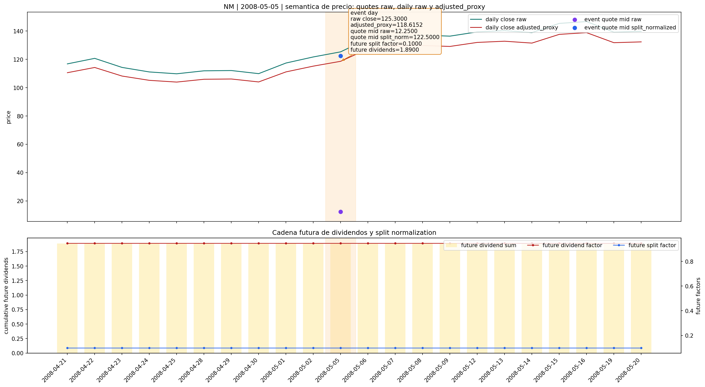

#### 00b Event Month Quotes Context
Esta imagen responde a la pregunta de recurrencia mensual dentro de `quotes`: el problema se concentra en el evento o reaparece en varias sesiones. Arriba concatena sesiones con datos disponibles; abajo resume cobertura diaria, `crossed_ratio_pct` y `max_gap_bps_pos`. La decision que cambia es si el caso debe leerse como episodio puntual o como sintoma de una fase repetida de libro degradado. El error que evita es extrapolar desde un unico dia a todo el mes sin evidencia.

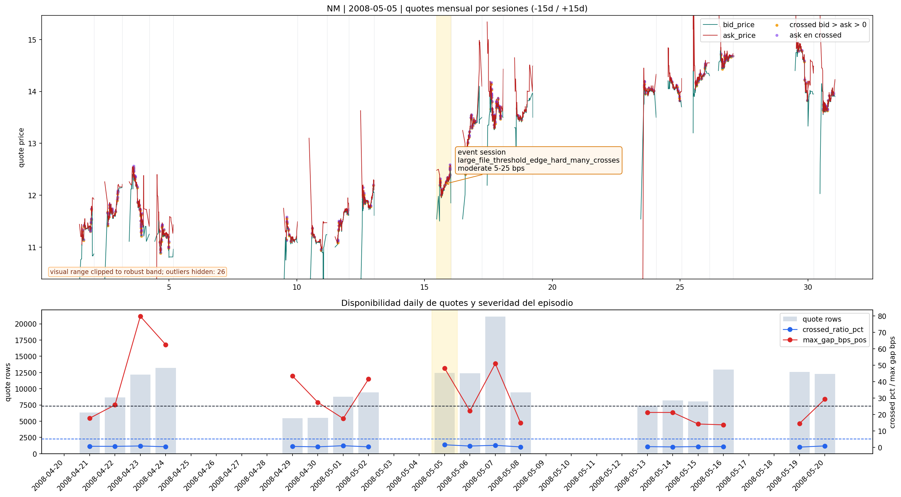

#### 01 Raw Window
Esta imagen responde a la primera pregunta decisiva del caso: el crossed observado es economicamente bastante fuerte para justificar un cambio de clase. Arriba ensena la geometria exacta del tramo conflictivo; abajo convierte esa geometria a bps y la enfrenta a los cortes `5 bps` y `25 bps`. El regimen dominante es `moderate 5-25 bps`. La decision que cambia es pasar de anomalia interpretable a `review` o `bad`. El error que evita es decidir por apariencia visual sin medir el dano economico real del crossed. En terminos de pipeline, este panel decide si el problema afecta solo a la lectura forense o si invalida simulacion de ejecucion y microstructure features.

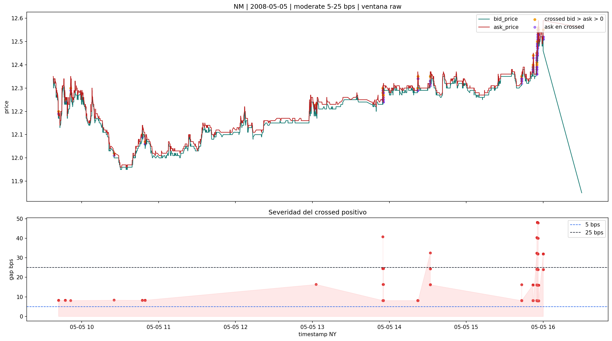

#### 02 Full Session Context
Esta imagen responde a la pregunta de extension intradiaria: el dano esta confinado a un bloque corto o contamina la sesion completa. Arriba se ve toda la sesion `04:00-20:00 NY`; abajo el `gap_bps` firmado. La decision que cambia es si el consumo debe penalizar solo un tramo o desechar el dia entero para uso operativo. El error que evita es tratar una cicatriz local como ruina total o, al reves, minimizar una degradacion distribuida a lo largo del dia. En ejecucion esto decide si la sesion puede seguir usandose con restricciones; en ML decide si las features intradiarias conservan significado economico.

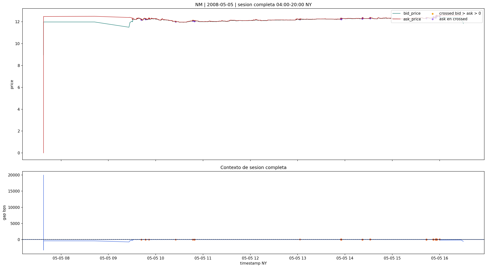

#### 03 Structure Diagnostics
Este panel responde a la pregunta de naturaleza del fallo: contradiccion economica genuina o mezcla con degeneracion estructural. Separa `ask=0` de `ask>0`, muestra la distribucion de `gap_bps` y resume patrones de integerizacion. La decision que cambia es como interpretar el dano: mercado localmente roto, artefacto de representacion o combinacion de ambos. El error que evita es sobrediagnosticar crossed reales cuando parte de la senal proviene de estructura degenerada del libro. Esta lectura afecta directamente a que el caso vaya a exclusion dura, a bandera contextual o a simple reconciliacion tecnica.

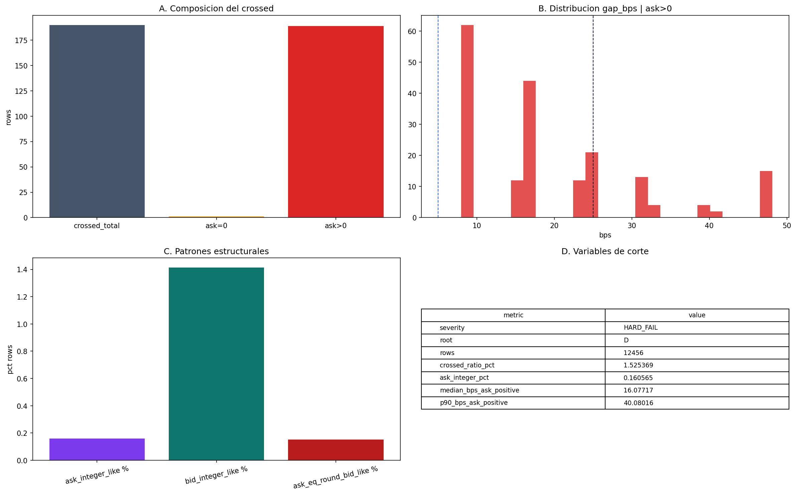

#### 04 Summary Card
Esta tarjeta responde a la pregunta de auditabilidad: cuales son exactamente las variables que sostienen la conclusion. Reune `severity`, `root`, `crossed_ratio_pct`, `ask_integer_pct`, `median_bps_ask_positive` y `p90_bps_ask_positive`. La decision que cambia es pasar de impresion visual a regla verificable. El error que evita es que dos inspectores lleguen a conclusiones distintas mirando la misma imagen sin una base numerica comun. Para gobernanza del proyecto, este panel es el que vuelve reproducible la decision para backtest, ML y auditoria.

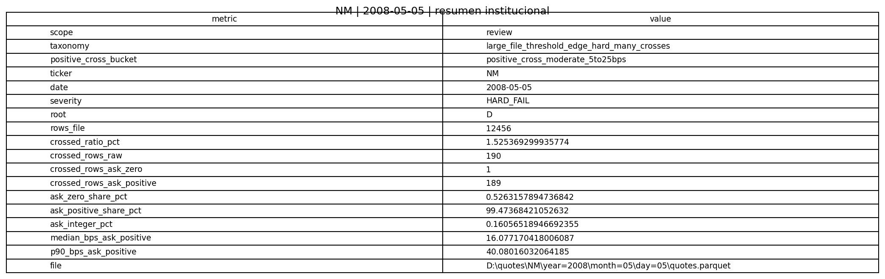

---

### 8. GRPN 2014-08-26

company_name: `Groupon, Inc.Common Stock`
primary_exchange: `NASDAQ` (`XNAS`)
market_locale: `stocks/us`
scope: `review`
ticker: `GRPN`
date: `2014-08-26`
taxonomy: `large_file_threshold_edge_hard_many_crosses`
positive_cross_bucket: `positive_cross_moderate_5to25bps`
severity: `HARD_FAIL`
root: `D`
rows: `40390`
crossed_ratio_pct: `2.297598`
crossed_rows_raw: `928`
crossed_rows_ask_zero: `0`
crossed_rows_ask_positive: `928`
ask_integer_pct: `0.000000`
median_bps_ask_positive: `15.515904`
p90_bps_ask_positive: `15.515904`
file: `D:\quotes\GRPN\year=2014\month=08\day=26\quotes.parquet`

#### Analisis Forense
La conclusion correcta del caso es que ya existe contradiccion economica real dentro del libro, pero aun no con fuerza suficiente para justificar exclusion dura sin contexto adicional. La taxonomy historica es `large_file_threshold_edge_hard_many_crosses` y el regimen positivo dominante es `moderate 5-25 bps`. Esto importa porque la taxonomy no solo clasifica: resume que tipo de anomalia se esta viendo y que clase de decision contractual puede defenderse despues. La taxonomy `large_file_threshold_edge_hard_many_crosses` implica un libro grande con muchas contradicciones, pero cerca del borde decisional. La dificultad analitica esta en decidir si el volumen de crossed es ruido absorbible o evidencia de degradacion suficientemente seria. El regimen `moderate 5-25 bps` ya entra en zona donde el crossed tiene capacidad real de contaminar simulacion de ejecucion y features microestructurales, aunque todavia puede requerir lectura contextual antes de exclusion dura. En terminos observables, el file tiene `crossed_ratio_pct=2.297598` con `crossed_rows_ask_positive=928` y `crossed_rows_ask_zero=0`. La severidad economica del crossed ask>0 se resume en `median_bps_ask_positive=15.515904` y `p90_bps_ask_positive=15.515904`. Estos dos numeros convierten una forma visual rara en una conclusion operativa sobre si el libro sigue representando o no un mercado negociable. La decision que cambia es pasar de libro sano a libro util solo bajo cautela. `review` significa: no usar como si fuera ejecucion limpia, conservar para analisis contextual y sensibilidad. El error que evita es tratar como normal un episodio que ya contiene contradiccion economica real y contaminar simulaciones de ejecucion o validaciones demasiado optimistas. El patron estructural muestra `ask_integer_pct=0.000000`. Este numero obliga a separar dos explicaciones rivales: contradiccion economica genuina del libro o mezcla con degeneracion estructural / integerizacion. Toda la composicion crossed cae en `ask>0`. Eso endurece la lectura economica del caso: el dano no depende de ceros mecanicos, sino de contradiccion positiva dentro de precios aparentemente vivos. Como `ask_integer_pct` es bajo, la hipotesis de simple degeneracion mecanica pierde fuerza. Eso endurece la interpretacion: el crossed se parece mas a contradiccion economica genuina y menos a artefacto. En la capa de semantica de precio del evento aparecen `daily raw close=129.2000`, `quote mid raw=6.4450`, `quote mid split_normalized=128.9000`, `daily adjusted_proxy=129.2000`. La reconciliacion incluye `future_split_factor=0.0500`. La implicacion metodologica es crucial: una discrepancia entre `quotes`, `daily` y una plataforma externa no puede leerse automaticamente como fallo del dataset. Puede ser semantica de precio distinta. El error que evita esta capa es mezclar raw, split-normalized y adjusted dentro del mismo pipeline, rompiendo auditoria, benchmarking y labels. Para pipelines, esto bloquea su uso como libro sano en ejecucion y features microestructurales principales, aunque aun puede mantenerse para forense, sensibilidad y estudios donde la anomalia sea parte del objeto de investigacion. Existe ademas una imagen historica de certificacion asociada. Su papel es poner el episodio en un marco causal mas amplio: halt, explained, not strongly explained o patron conocido. La regla que protege al proyecto es esta: el contexto externo se usa para explicar por que aparece el episodio, no para absolverlo. El error que evita es degradar el criterio de calidad del libro porque exista una historia plausible alrededor del caso.

#### 00 Event Month Context
Esta imagen responde a la pregunta de persistencia temporal: estamos ante un accidente local o ante una fase mas amplia de inestabilidad. Arriba coloca el evento en la serie `daily` real del mes; abajo compara `crossed_ratio_pct` y `max_gap_bps_pos` del dia contra sus vecinos. La decision que cambia es el peso estructural que se le concede al caso. El error que evita es juzgar igual un shock aislado y una degradacion repetida del libro.

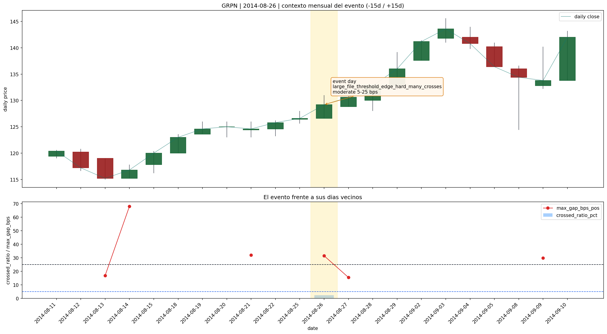

#### 00a Adjusted Proxy Contrast
Esta imagen responde a la pregunta de reconciliacion semantica: la discrepancia de precios viene de datos rotos o de vistas de precio distintas. Compara `daily raw`, `daily adjusted_proxy`, `quote mid raw` y `quote mid split_normalized`, y debajo ensena la cadena de dividendos y splits que produce la diferencia. La decision que cambia es si el inspector debe abrir una incidencia de calidad o cerrar el caso como diferencia legitima de semantica. El error que evita es mezclar series raw y adjusted como si fueran equivalentes. En pipelines reales, esto protege benchmarking, labels diarios y reconciliacion externa frente a falsas alarmas de precio.

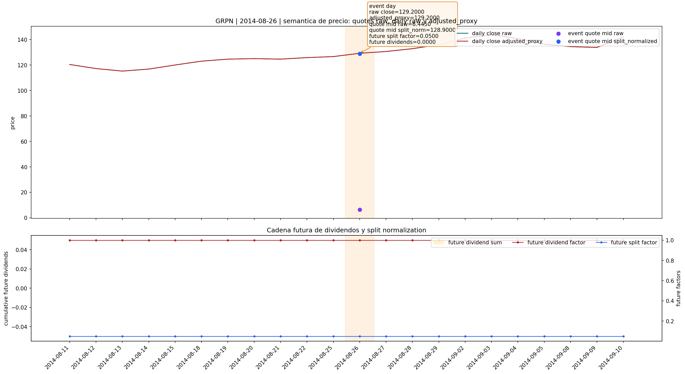

#### 00b Event Month Quotes Context
Esta imagen responde a la pregunta de recurrencia mensual dentro de `quotes`: el problema se concentra en el evento o reaparece en varias sesiones. Arriba concatena sesiones con datos disponibles; abajo resume cobertura diaria, `crossed_ratio_pct` y `max_gap_bps_pos`. La decision que cambia es si el caso debe leerse como episodio puntual o como sintoma de una fase repetida de libro degradado. El error que evita es extrapolar desde un unico dia a todo el mes sin evidencia.

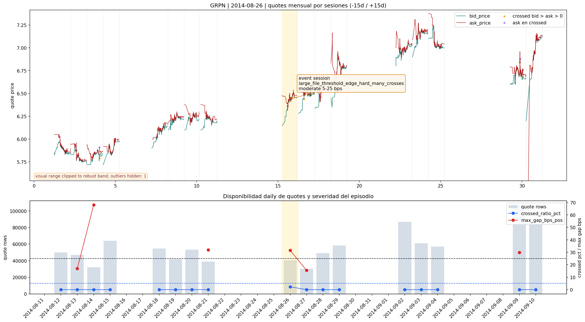

#### 01 Raw Window
Esta imagen responde a la primera pregunta decisiva del caso: el crossed observado es economicamente bastante fuerte para justificar un cambio de clase. Arriba ensena la geometria exacta del tramo conflictivo; abajo convierte esa geometria a bps y la enfrenta a los cortes `5 bps` y `25 bps`. El regimen dominante es `moderate 5-25 bps`. La decision que cambia es pasar de anomalia interpretable a `review` o `bad`. El error que evita es decidir por apariencia visual sin medir el dano economico real del crossed. En terminos de pipeline, este panel decide si el problema afecta solo a la lectura forense o si invalida simulacion de ejecucion y microstructure features.

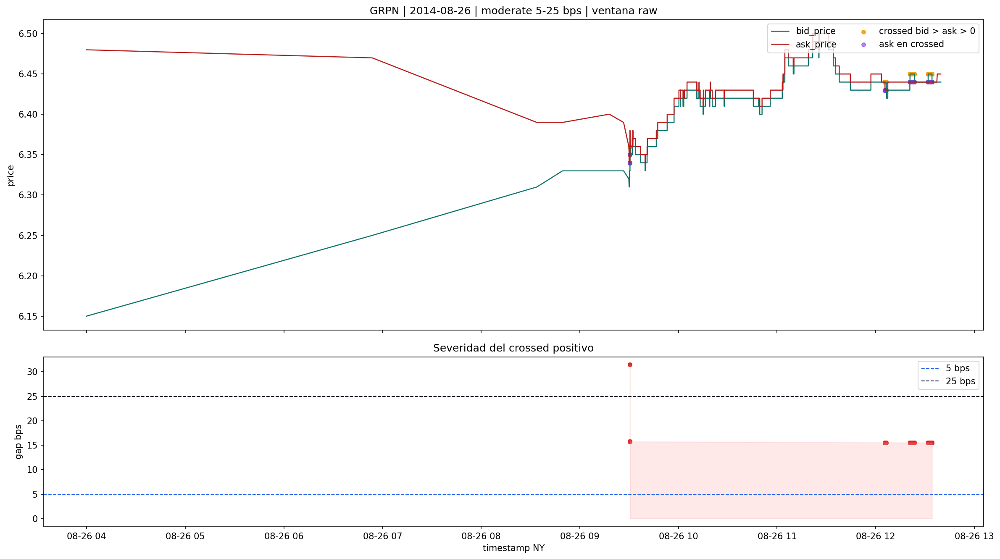

#### 02 Full Session Context
Esta imagen responde a la pregunta de extension intradiaria: el dano esta confinado a un bloque corto o contamina la sesion completa. Arriba se ve toda la sesion `04:00-20:00 NY`; abajo el `gap_bps` firmado. La decision que cambia es si el consumo debe penalizar solo un tramo o desechar el dia entero para uso operativo. El error que evita es tratar una cicatriz local como ruina total o, al reves, minimizar una degradacion distribuida a lo largo del dia. En ejecucion esto decide si la sesion puede seguir usandose con restricciones; en ML decide si las features intradiarias conservan significado economico.

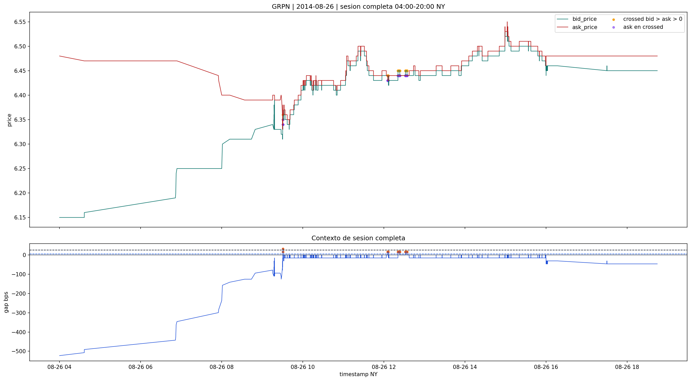

#### 03 Structure Diagnostics
Este panel responde a la pregunta de naturaleza del fallo: contradiccion economica genuina o mezcla con degeneracion estructural. Separa `ask=0` de `ask>0`, muestra la distribucion de `gap_bps` y resume patrones de integerizacion. La decision que cambia es como interpretar el dano: mercado localmente roto, artefacto de representacion o combinacion de ambos. El error que evita es sobrediagnosticar crossed reales cuando parte de la senal proviene de estructura degenerada del libro. Esta lectura afecta directamente a que el caso vaya a exclusion dura, a bandera contextual o a simple reconciliacion tecnica.

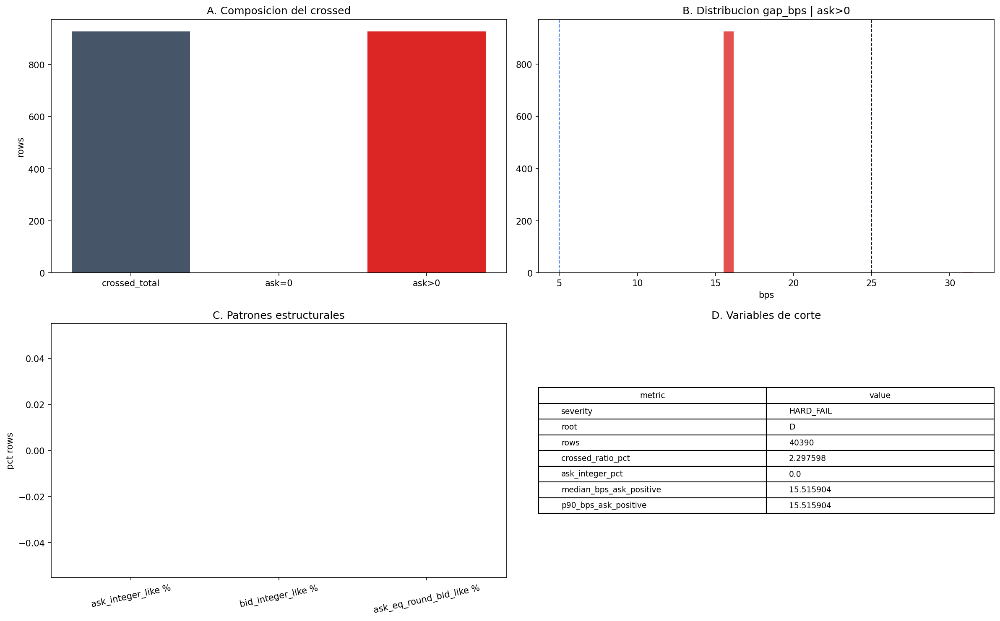

#### 04 Summary Card
Esta tarjeta responde a la pregunta de auditabilidad: cuales son exactamente las variables que sostienen la conclusion. Reune `severity`, `root`, `crossed_ratio_pct`, `ask_integer_pct`, `median_bps_ask_positive` y `p90_bps_ask_positive`. La decision que cambia es pasar de impresion visual a regla verificable. El error que evita es que dos inspectores lleguen a conclusiones distintas mirando la misma imagen sin una base numerica comun. Para gobernanza del proyecto, este panel es el que vuelve reproducible la decision para backtest, ML y auditoria.

---

### 9. TG 2008-01-07

company_name: `Tredegar Corporation`
primary_exchange: `NYSE` (`XNYS`)
market_locale: `stocks/us`
scope: `review`
ticker: `TG`
date: `2008-01-07`
taxonomy: `large_file_threshold_edge_hard_many_crosses`
positive_cross_bucket: `positive_cross_moderate_5to25bps`
severity: `HARD_FAIL`
root: `C`
rows: `9293`
crossed_ratio_pct: `1.850855`
crossed_rows_raw: `172`
crossed_rows_ask_zero: `1`
crossed_rows_ask_positive: `171`
ask_integer_pct: `0.075326`
median_bps_ask_positive: `13.605442`
p90_bps_ask_positive: `20.470829`
file: `C:\TSIS_Data\data\quotes\TG\year=2008\month=01\day=07\quotes.parquet`

#### Analisis Forense
La conclusion correcta del caso es que ya existe contradiccion economica real dentro del libro, pero aun no con fuerza suficiente para justificar exclusion dura sin contexto adicional. La taxonomy historica es `large_file_threshold_edge_hard_many_crosses` y el regimen positivo dominante es `moderate 5-25 bps`. Esto importa porque la taxonomy no solo clasifica: resume que tipo de anomalia se esta viendo y que clase de decision contractual puede defenderse despues. La taxonomy `large_file_threshold_edge_hard_many_crosses` implica un libro grande con muchas contradicciones, pero cerca del borde decisional. La dificultad analitica esta en decidir si el volumen de crossed es ruido absorbible o evidencia de degradacion suficientemente seria. El regimen `moderate 5-25 bps` ya entra en zona donde el crossed tiene capacidad real de contaminar simulacion de ejecucion y features microestructurales, aunque todavia puede requerir lectura contextual antes de exclusion dura. En terminos observables, el file tiene `crossed_ratio_pct=1.850855` con `crossed_rows_ask_positive=171` y `crossed_rows_ask_zero=1`. La severidad economica del crossed ask>0 se resume en `median_bps_ask_positive=13.605442` y `p90_bps_ask_positive=20.470829`. Estos dos numeros convierten una forma visual rara en una conclusion operativa sobre si el libro sigue representando o no un mercado negociable. La decision que cambia es pasar de libro sano a libro util solo bajo cautela. `review` significa: no usar como si fuera ejecucion limpia, conservar para analisis contextual y sensibilidad. El error que evita es tratar como normal un episodio que ya contiene contradiccion economica real y contaminar simulaciones de ejecucion o validaciones demasiado optimistas. El patron estructural muestra `ask_integer_pct=0.075326`. Este numero obliga a separar dos explicaciones rivales: contradiccion economica genuina del libro o mezcla con degeneracion estructural / integerizacion. La mayor parte del crossed vive en `ask>0`, de modo que el corazon del problema sigue siendo economico. La parte `ask=0`, si existe, acompana pero no explica por si sola la anomalia. Como `ask_integer_pct` es bajo, la hipotesis de simple degeneracion mecanica pierde fuerza. Eso endurece la interpretacion: el crossed se parece mas a contradiccion economica genuina y menos a artefacto. En la capa de semantica de precio del evento aparecen `daily raw close=14.6900`, `quote mid raw=14.6800`, `quote mid split_normalized=14.6800`, `daily adjusted_proxy=6.1613`. Ademas hay `post_event_dividend_sum=12.1400`. La implicacion metodologica es crucial: una discrepancia entre `quotes`, `daily` y una plataforma externa no puede leerse automaticamente como fallo del dataset. Puede ser semantica de precio distinta. El error que evita esta capa es mezclar raw, split-normalized y adjusted dentro del mismo pipeline, rompiendo auditoria, benchmarking y labels. Para pipelines, esto bloquea su uso como libro sano en ejecucion y features microestructurales principales, aunque aun puede mantenerse para forense, sensibilidad y estudios donde la anomalia sea parte del objeto de investigacion. Existe ademas una imagen historica de certificacion asociada. Su papel es poner el episodio en un marco causal mas amplio: halt, explained, not strongly explained o patron conocido. La regla que protege al proyecto es esta: el contexto externo se usa para explicar por que aparece el episodio, no para absolverlo. El error que evita es degradar el criterio de calidad del libro porque exista una historia plausible alrededor del caso.

#### 00 Event Month Context
Esta imagen responde a la pregunta de persistencia temporal: estamos ante un accidente local o ante una fase mas amplia de inestabilidad. Arriba coloca el evento en la serie `daily` real del mes; abajo compara `crossed_ratio_pct` y `max_gap_bps_pos` del dia contra sus vecinos. La decision que cambia es el peso estructural que se le concede al caso. El error que evita es juzgar igual un shock aislado y una degradacion repetida del libro.

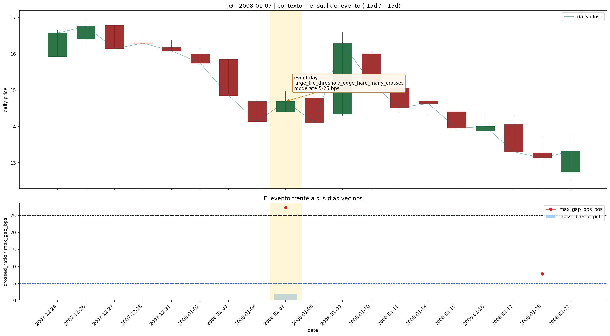

#### 00a Adjusted Proxy Contrast
Esta imagen responde a la pregunta de reconciliacion semantica: la discrepancia de precios viene de datos rotos o de vistas de precio distintas. Compara `daily raw`, `daily adjusted_proxy`, `quote mid raw` y `quote mid split_normalized`, y debajo ensena la cadena de dividendos y splits que produce la diferencia. La decision que cambia es si el inspector debe abrir una incidencia de calidad o cerrar el caso como diferencia legitima de semantica. El error que evita es mezclar series raw y adjusted como si fueran equivalentes. En pipelines reales, esto protege benchmarking, labels diarios y reconciliacion externa frente a falsas alarmas de precio.

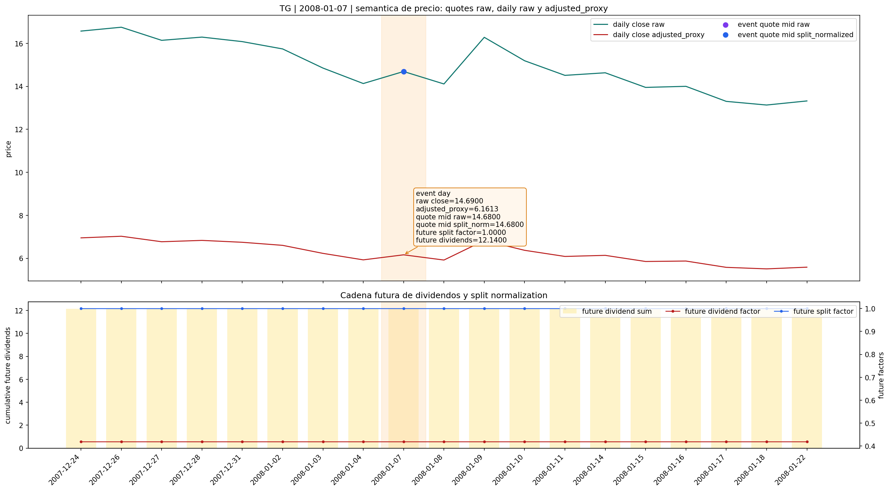

#### 00b Event Month Quotes Context
Esta imagen responde a la pregunta de recurrencia mensual dentro de `quotes`: el problema se concentra en el evento o reaparece en varias sesiones. Arriba concatena sesiones con datos disponibles; abajo resume cobertura diaria, `crossed_ratio_pct` y `max_gap_bps_pos`. La decision que cambia es si el caso debe leerse como episodio puntual o como sintoma de una fase repetida de libro degradado. El error que evita es extrapolar desde un unico dia a todo el mes sin evidencia.

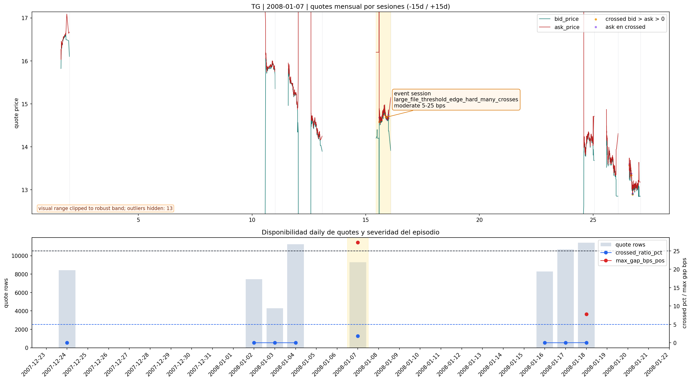

#### 01 Raw Window
Esta imagen responde a la primera pregunta decisiva del caso: el crossed observado es economicamente bastante fuerte para justificar un cambio de clase. Arriba ensena la geometria exacta del tramo conflictivo; abajo convierte esa geometria a bps y la enfrenta a los cortes `5 bps` y `25 bps`. El regimen dominante es `moderate 5-25 bps`. La decision que cambia es pasar de anomalia interpretable a `review` o `bad`. El error que evita es decidir por apariencia visual sin medir el dano economico real del crossed. En terminos de pipeline, este panel decide si el problema afecta solo a la lectura forense o si invalida simulacion de ejecucion y microstructure features.

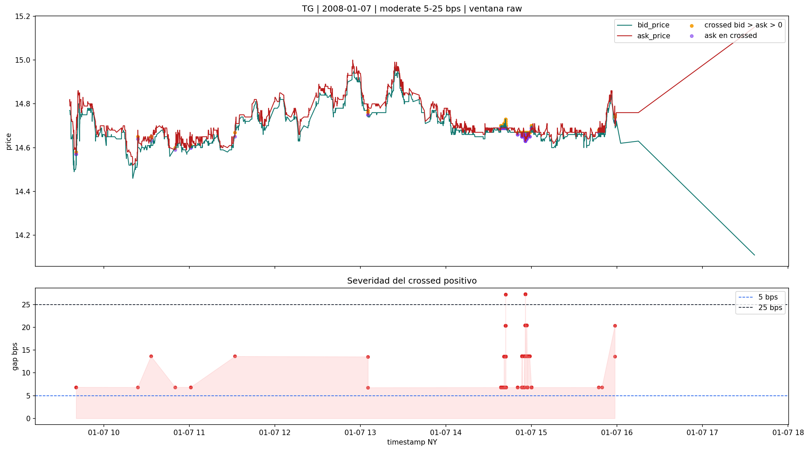

#### 02 Full Session Context
Esta imagen responde a la pregunta de extension intradiaria: el dano esta confinado a un bloque corto o contamina la sesion completa. Arriba se ve toda la sesion `04:00-20:00 NY`; abajo el `gap_bps` firmado. La decision que cambia es si el consumo debe penalizar solo un tramo o desechar el dia entero para uso operativo. El error que evita es tratar una cicatriz local como ruina total o, al reves, minimizar una degradacion distribuida a lo largo del dia. En ejecucion esto decide si la sesion puede seguir usandose con restricciones; en ML decide si las features intradiarias conservan significado economico.

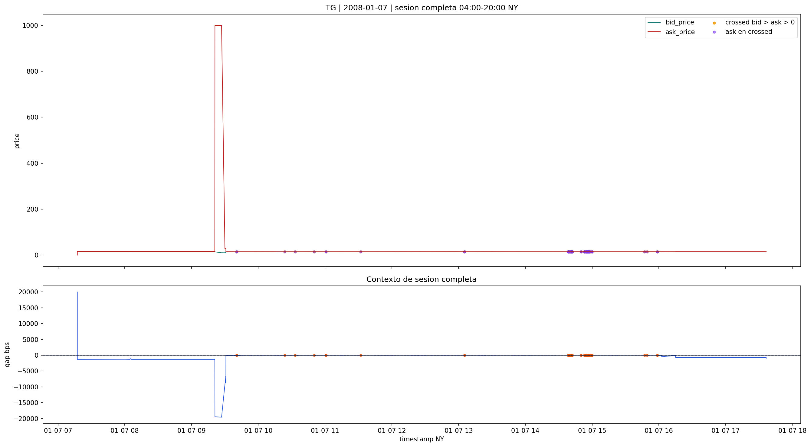

#### 03 Structure Diagnostics
Este panel responde a la pregunta de naturaleza del fallo: contradiccion economica genuina o mezcla con degeneracion estructural. Separa `ask=0` de `ask>0`, muestra la distribucion de `gap_bps` y resume patrones de integerizacion. La decision que cambia es como interpretar el dano: mercado localmente roto, artefacto de representacion o combinacion de ambos. El error que evita es sobrediagnosticar crossed reales cuando parte de la senal proviene de estructura degenerada del libro. Esta lectura afecta directamente a que el caso vaya a exclusion dura, a bandera contextual o a simple reconciliacion tecnica.

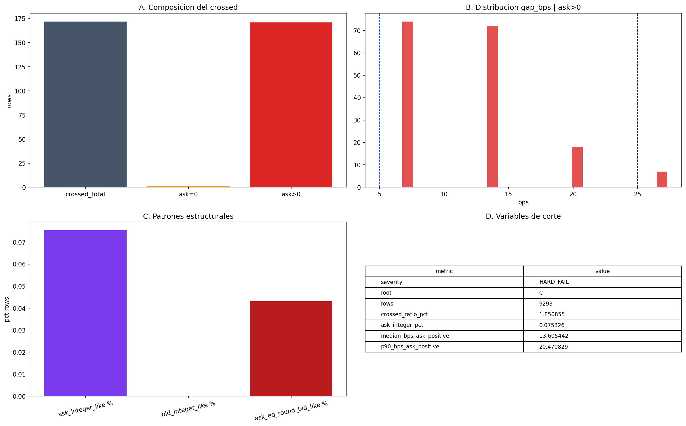

#### 04 Summary Card
Esta tarjeta responde a la pregunta de auditabilidad: cuales son exactamente las variables que sostienen la conclusion. Reune `severity`, `root`, `crossed_ratio_pct`, `ask_integer_pct`, `median_bps_ask_positive` y `p90_bps_ask_positive`. La decision que cambia es pasar de impresion visual a regla verificable. El error que evita es que dos inspectores lleguen a conclusiones distintas mirando la misma imagen sin una base numerica comun. Para gobernanza del proyecto, este panel es el que vuelve reproducible la decision para backtest, ML y auditoria.

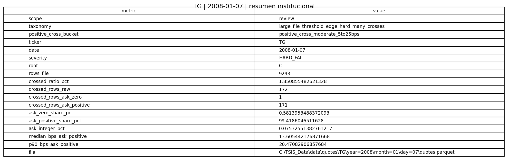

---

### 10. YRCW 2011-05-23

company_name: `YRC Worldwide, Inc.`
primary_exchange: `NASDAQ` (`XNAS`)
market_locale: `stocks/us`
scope: `review`
ticker: `YRCW`
date: `2011-05-23`
taxonomy: `large_file_threshold_edge_hard_many_crosses`
positive_cross_bucket: `positive_cross_moderate_5to25bps`
severity: `HARD_FAIL`
root: `D`
rows: `10631`
crossed_ratio_pct: `2.332800`
crossed_rows_raw: `248`
crossed_rows_ask_zero: `0`
crossed_rows_ask_positive: `248`
ask_integer_pct: `0.000000`
median_bps_ask_positive: `12.507817`
p90_bps_ask_positive: `12.507817`
file: `D:\quotes\YRCW\year=2011\month=05\day=23\quotes.parquet`

#### Analisis Forense
La conclusion correcta del caso es que ya existe contradiccion economica real dentro del libro, pero aun no con fuerza suficiente para justificar exclusion dura sin contexto adicional. La taxonomy historica es `large_file_threshold_edge_hard_many_crosses` y el regimen positivo dominante es `moderate 5-25 bps`. Esto importa porque la taxonomy no solo clasifica: resume que tipo de anomalia se esta viendo y que clase de decision contractual puede defenderse despues. La taxonomy `large_file_threshold_edge_hard_many_crosses` implica un libro grande con muchas contradicciones, pero cerca del borde decisional. La dificultad analitica esta en decidir si el volumen de crossed es ruido absorbible o evidencia de degradacion suficientemente seria. El regimen `moderate 5-25 bps` ya entra en zona donde el crossed tiene capacidad real de contaminar simulacion de ejecucion y features microestructurales, aunque todavia puede requerir lectura contextual antes de exclusion dura. En terminos observables, el file tiene `crossed_ratio_pct=2.332800` con `crossed_rows_ask_positive=248` y `crossed_rows_ask_zero=0`. La severidad economica del crossed ask>0 se resume en `median_bps_ask_positive=12.507817` y `p90_bps_ask_positive=12.507817`. Estos dos numeros convierten una forma visual rara en una conclusion operativa sobre si el libro sigue representando o no un mercado negociable. La decision que cambia es pasar de libro sano a libro util solo bajo cautela. `review` significa: no usar como si fuera ejecucion limpia, conservar para analisis contextual y sensibilidad. El error que evita es tratar como normal un episodio que ya contiene contradiccion economica real y contaminar simulaciones de ejecucion o validaciones demasiado optimistas. El patron estructural muestra `ask_integer_pct=0.000000`. Este numero obliga a separar dos explicaciones rivales: contradiccion economica genuina del libro o mezcla con degeneracion estructural / integerizacion. Toda la composicion crossed cae en `ask>0`. Eso endurece la lectura economica del caso: el dano no depende de ceros mecanicos, sino de contradiccion positiva dentro de precios aparentemente vivos. Como `ask_integer_pct` es bajo, la hipotesis de simple degeneracion mecanica pierde fuerza. Eso endurece la interpretacion: el crossed se parece mas a contradiccion economica genuina y menos a artefacto. En la capa de semantica de precio del evento aparecen `daily raw close=242.2500`, `quote mid raw=0.8090`, `quote mid split_normalized=242.6850`, `daily adjusted_proxy=242.2500`. La reconciliacion incluye `future_split_factor=0.0033`. La implicacion metodologica es crucial: una discrepancia entre `quotes`, `daily` y una plataforma externa no puede leerse automaticamente como fallo del dataset. Puede ser semantica de precio distinta. El error que evita esta capa es mezclar raw, split-normalized y adjusted dentro del mismo pipeline, rompiendo auditoria, benchmarking y labels. Para pipelines, esto bloquea su uso como libro sano en ejecucion y features microestructurales principales, aunque aun puede mantenerse para forense, sensibilidad y estudios donde la anomalia sea parte del objeto de investigacion. Existe ademas una imagen historica de certificacion asociada. Su papel es poner el episodio en un marco causal mas amplio: halt, explained, not strongly explained o patron conocido. La regla que protege al proyecto es esta: el contexto externo se usa para explicar por que aparece el episodio, no para absolverlo. El error que evita es degradar el criterio de calidad del libro porque exista una historia plausible alrededor del caso.

#### 00 Event Month Context
Esta imagen responde a la pregunta de persistencia temporal: estamos ante un accidente local o ante una fase mas amplia de inestabilidad. Arriba coloca el evento en la serie `daily` real del mes; abajo compara `crossed_ratio_pct` y `max_gap_bps_pos` del dia contra sus vecinos. La decision que cambia es el peso estructural que se le concede al caso. El error que evita es juzgar igual un shock aislado y una degradacion repetida del libro.

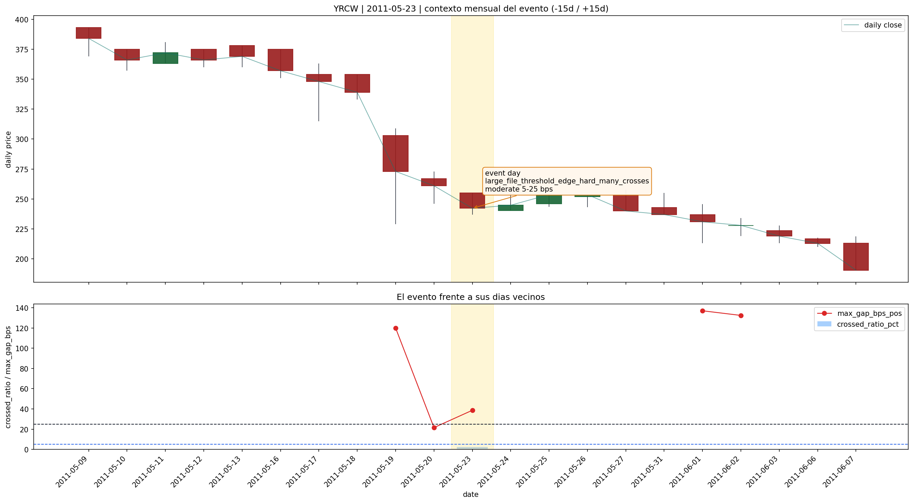

#### 00a Adjusted Proxy Contrast
Esta imagen responde a la pregunta de reconciliacion semantica: la discrepancia de precios viene de datos rotos o de vistas de precio distintas. Compara `daily raw`, `daily adjusted_proxy`, `quote mid raw` y `quote mid split_normalized`, y debajo ensena la cadena de dividendos y splits que produce la diferencia. La decision que cambia es si el inspector debe abrir una incidencia de calidad o cerrar el caso como diferencia legitima de semantica. El error que evita es mezclar series raw y adjusted como si fueran equivalentes. En pipelines reales, esto protege benchmarking, labels diarios y reconciliacion externa frente a falsas alarmas de precio.

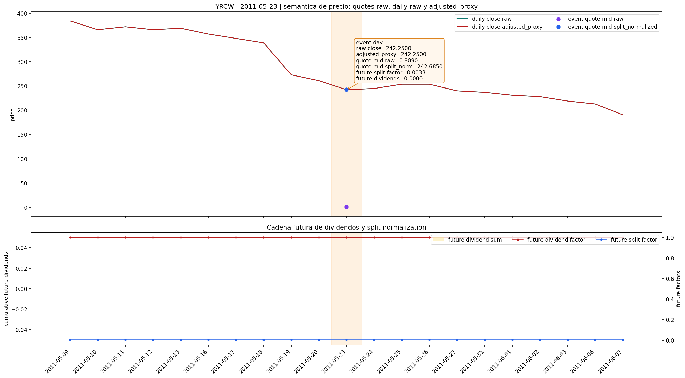

#### 00b Event Month Quotes Context
Esta imagen responde a la pregunta de recurrencia mensual dentro de `quotes`: el problema se concentra en el evento o reaparece en varias sesiones. Arriba concatena sesiones con datos disponibles; abajo resume cobertura diaria, `crossed_ratio_pct` y `max_gap_bps_pos`. La decision que cambia es si el caso debe leerse como episodio puntual o como sintoma de una fase repetida de libro degradado. El error que evita es extrapolar desde un unico dia a todo el mes sin evidencia.

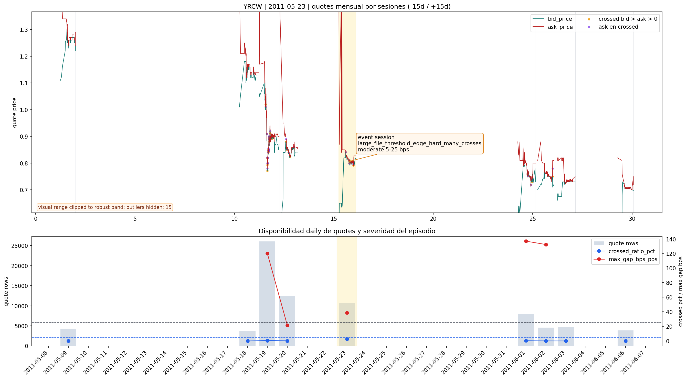

#### 01 Raw Window
Esta imagen responde a la primera pregunta decisiva del caso: el crossed observado es economicamente bastante fuerte para justificar un cambio de clase. Arriba ensena la geometria exacta del tramo conflictivo; abajo convierte esa geometria a bps y la enfrenta a los cortes `5 bps` y `25 bps`. El regimen dominante es `moderate 5-25 bps`. La decision que cambia es pasar de anomalia interpretable a `review` o `bad`. El error que evita es decidir por apariencia visual sin medir el dano economico real del crossed. En terminos de pipeline, este panel decide si el problema afecta solo a la lectura forense o si invalida simulacion de ejecucion y microstructure features.

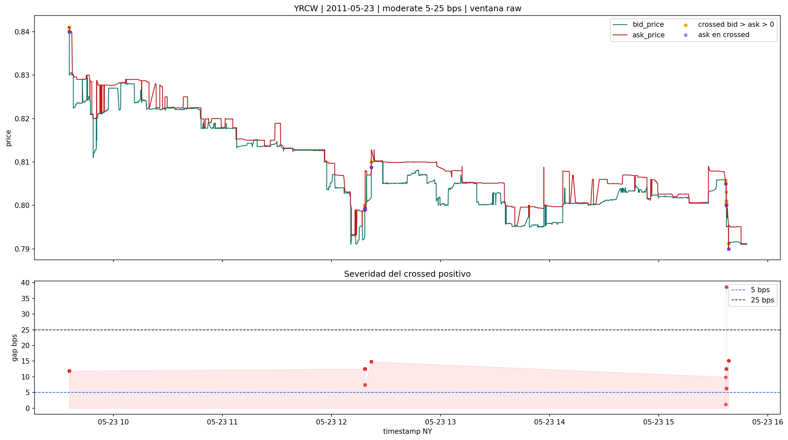

#### 02 Full Session Context
Esta imagen responde a la pregunta de extension intradiaria: el dano esta confinado a un bloque corto o contamina la sesion completa. Arriba se ve toda la sesion `04:00-20:00 NY`; abajo el `gap_bps` firmado. La decision que cambia es si el consumo debe penalizar solo un tramo o desechar el dia entero para uso operativo. El error que evita es tratar una cicatriz local como ruina total o, al reves, minimizar una degradacion distribuida a lo largo del dia. En ejecucion esto decide si la sesion puede seguir usandose con restricciones; en ML decide si las features intradiarias conservan significado economico.

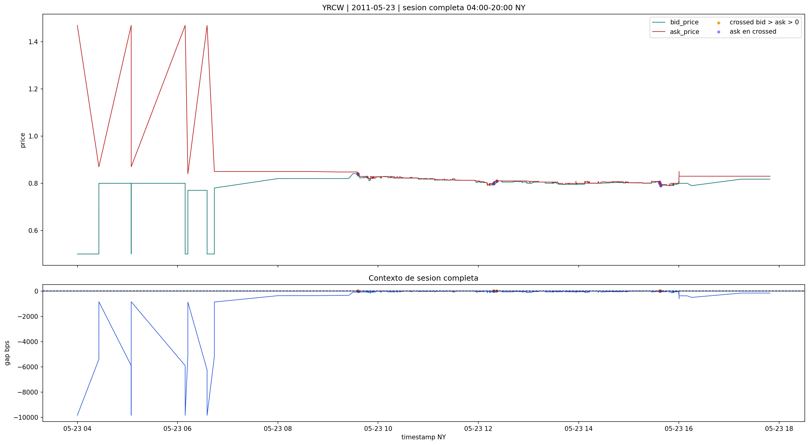

#### 03 Structure Diagnostics
Este panel responde a la pregunta de naturaleza del fallo: contradiccion economica genuina o mezcla con degeneracion estructural. Separa `ask=0` de `ask>0`, muestra la distribucion de `gap_bps` y resume patrones de integerizacion. La decision que cambia es como interpretar el dano: mercado localmente roto, artefacto de representacion o combinacion de ambos. El error que evita es sobrediagnosticar crossed reales cuando parte de la senal proviene de estructura degenerada del libro. Esta lectura afecta directamente a que el caso vaya a exclusion dura, a bandera contextual o a simple reconciliacion tecnica.

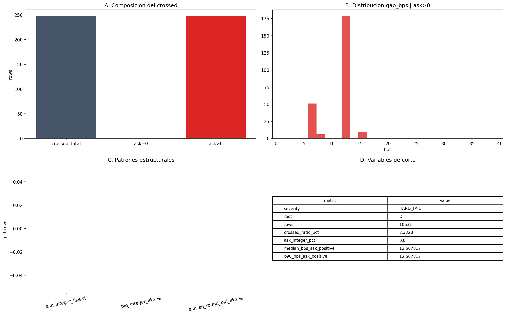

#### 04 Summary Card
Esta tarjeta responde a la pregunta de auditabilidad: cuales son exactamente las variables que sostienen la conclusion. Reune `severity`, `root`, `crossed_ratio_pct`, `ask_integer_pct`, `median_bps_ask_positive` y `p90_bps_ask_positive`. La decision que cambia es pasar de impresion visual a regla verificable. El error que evita es que dos inspectores lleguen a conclusiones distintas mirando la misma imagen sin una base numerica comun. Para gobernanza del proyecto, este panel es el que vuelve reproducible la decision para backtest, ML y auditoria.

---

### 11. ISR 2018-07-10

company_name: `IsoRay, Inc.`
primary_exchange: `NYSE American` (`XASE`)
market_locale: `stocks/us`
scope: `review`
ticker: `ISR`
date: `2018-07-10`
taxonomy: `large_file_threshold_edge_hard_many_crosses`
positive_cross_bucket: `positive_cross_moderate_5to25bps`
severity: `HARD_FAIL`
root: `D`
rows: `8816`
crossed_ratio_pct: `1.814882`
crossed_rows_raw: `160`
crossed_rows_ask_zero: `0`
crossed_rows_ask_positive: `160`
ask_integer_pct: `0.000000`
median_bps_ask_positive: `11.386280`
p90_bps_ask_positive: `110.795455`
file: `D:\quotes\ISR\year=2018\month=07\day=10\quotes.parquet`

#### Analisis Forense
La conclusion correcta del caso es que ya existe contradiccion economica real dentro del libro, pero aun no con fuerza suficiente para justificar exclusion dura sin contexto adicional. La taxonomy historica es `large_file_threshold_edge_hard_many_crosses` y el regimen positivo dominante es `moderate 5-25 bps`. Esto importa porque la taxonomy no solo clasifica: resume que tipo de anomalia se esta viendo y que clase de decision contractual puede defenderse despues. La taxonomy `large_file_threshold_edge_hard_many_crosses` implica un libro grande con muchas contradicciones, pero cerca del borde decisional. La dificultad analitica esta en decidir si el volumen de crossed es ruido absorbible o evidencia de degradacion suficientemente seria. El regimen `moderate 5-25 bps` ya entra en zona donde el crossed tiene capacidad real de contaminar simulacion de ejecucion y features microestructurales, aunque todavia puede requerir lectura contextual antes de exclusion dura. En terminos observables, el file tiene `crossed_ratio_pct=1.814882` con `crossed_rows_ask_positive=160` y `crossed_rows_ask_zero=0`. La severidad economica del crossed ask>0 se resume en `median_bps_ask_positive=11.386280` y `p90_bps_ask_positive=110.795455`. Estos dos numeros convierten una forma visual rara en una conclusion operativa sobre si el libro sigue representando o no un mercado negociable. La decision que cambia es pasar de libro sano a libro util solo bajo cautela. `review` significa: no usar como si fuera ejecucion limpia, conservar para analisis contextual y sensibilidad. El error que evita es tratar como normal un episodio que ya contiene contradiccion economica real y contaminar simulaciones de ejecucion o validaciones demasiado optimistas. El patron estructural muestra `ask_integer_pct=0.000000`. Este numero obliga a separar dos explicaciones rivales: contradiccion economica genuina del libro o mezcla con degeneracion estructural / integerizacion. Toda la composicion crossed cae en `ask>0`. Eso endurece la lectura economica del caso: el dano no depende de ceros mecanicos, sino de contradiccion positiva dentro de precios aparentemente vivos. Como `ask_integer_pct` es bajo, la hipotesis de simple degeneracion mecanica pierde fuerza. Eso endurece la interpretacion: el crossed se parece mas a contradiccion economica genuina y menos a artefacto. Existe ademas una imagen historica de certificacion asociada. Su papel es poner el episodio en un marco causal mas amplio: halt, explained, not strongly explained o patron conocido. La regla que protege al proyecto es esta: el contexto externo se usa para explicar por que aparece el episodio, no para absolverlo. El error que evita es degradar el criterio de calidad del libro porque exista una historia plausible alrededor del caso.

#### 00 Event Month Context
Esta imagen responde a la pregunta de persistencia temporal: estamos ante un accidente local o ante una fase mas amplia de inestabilidad. Arriba coloca el evento en la serie `daily` real del mes; abajo compara `crossed_ratio_pct` y `max_gap_bps_pos` del dia contra sus vecinos. La decision que cambia es el peso estructural que se le concede al caso. El error que evita es juzgar igual un shock aislado y una degradacion repetida del libro.

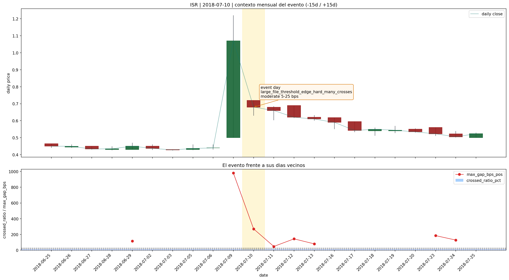

#### 00b Event Month Quotes Context
Esta imagen responde a la pregunta de recurrencia mensual dentro de `quotes`: el problema se concentra en el evento o reaparece en varias sesiones. Arriba concatena sesiones con datos disponibles; abajo resume cobertura diaria, `crossed_ratio_pct` y `max_gap_bps_pos`. La decision que cambia es si el caso debe leerse como episodio puntual o como sintoma de una fase repetida de libro degradado. El error que evita es extrapolar desde un unico dia a todo el mes sin evidencia.

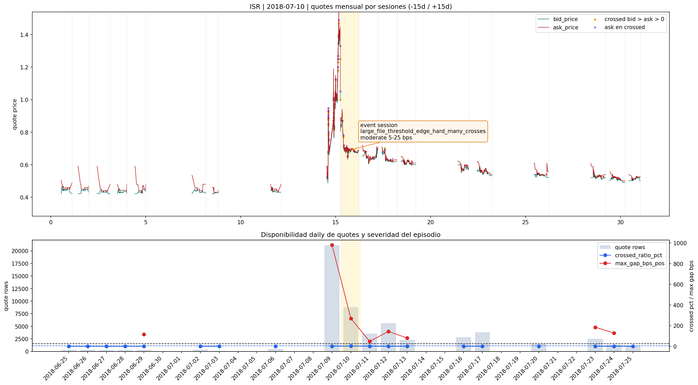

#### 01 Raw Window
Esta imagen responde a la primera pregunta decisiva del caso: el crossed observado es economicamente bastante fuerte para justificar un cambio de clase. Arriba ensena la geometria exacta del tramo conflictivo; abajo convierte esa geometria a bps y la enfrenta a los cortes `5 bps` y `25 bps`. El regimen dominante es `moderate 5-25 bps`. La decision que cambia es pasar de anomalia interpretable a `review` o `bad`. El error que evita es decidir por apariencia visual sin medir el dano economico real del crossed. En terminos de pipeline, este panel decide si el problema afecta solo a la lectura forense o si invalida simulacion de ejecucion y microstructure features.

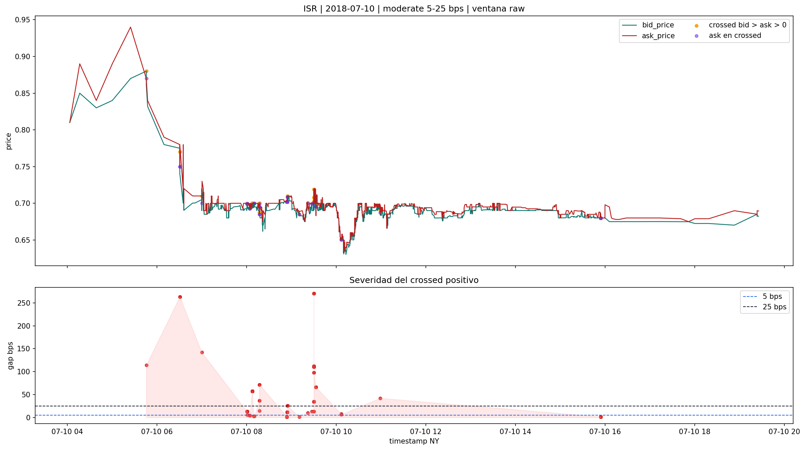

#### 02 Full Session Context
Esta imagen responde a la pregunta de extension intradiaria: el dano esta confinado a un bloque corto o contamina la sesion completa. Arriba se ve toda la sesion `04:00-20:00 NY`; abajo el `gap_bps` firmado. La decision que cambia es si el consumo debe penalizar solo un tramo o desechar el dia entero para uso operativo. El error que evita es tratar una cicatriz local como ruina total o, al reves, minimizar una degradacion distribuida a lo largo del dia. En ejecucion esto decide si la sesion puede seguir usandose con restricciones; en ML decide si las features intradiarias conservan significado economico.

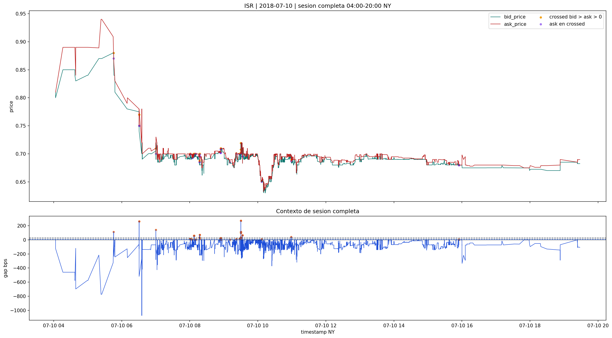

#### 03 Structure Diagnostics
Este panel responde a la pregunta de naturaleza del fallo: contradiccion economica genuina o mezcla con degeneracion estructural. Separa `ask=0` de `ask>0`, muestra la distribucion de `gap_bps` y resume patrones de integerizacion. La decision que cambia es como interpretar el dano: mercado localmente roto, artefacto de representacion o combinacion de ambos. El error que evita es sobrediagnosticar crossed reales cuando parte de la senal proviene de estructura degenerada del libro. Esta lectura afecta directamente a que el caso vaya a exclusion dura, a bandera contextual o a simple reconciliacion tecnica.

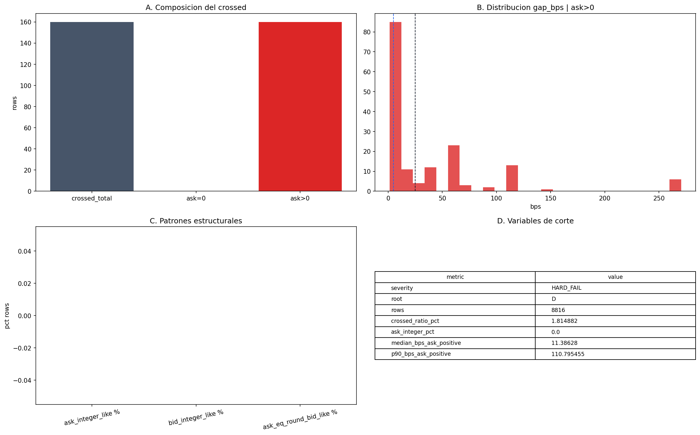

#### 04 Summary Card
Esta tarjeta responde a la pregunta de auditabilidad: cuales son exactamente las variables que sostienen la conclusion. Reune `severity`, `root`, `crossed_ratio_pct`, `ask_integer_pct`, `median_bps_ask_positive` y `p90_bps_ask_positive`. La decision que cambia es pasar de impresion visual a regla verificable. El error que evita es que dos inspectores lleguen a conclusiones distintas mirando la misma imagen sin una base numerica comun. Para gobernanza del proyecto, este panel es el que vuelve reproducible la decision para backtest, ML y auditoria.

---

### 12. CATO 2013-07-09

company_name: `CATO CORP`
primary_exchange: `NYSE` (`XNYS`)
market_locale: `stocks/us`
scope: `review`
ticker: `CATO`
date: `2013-07-09`
taxonomy: `large_file_threshold_edge_hard_many_crosses`
positive_cross_bucket: `positive_cross_moderate_5to25bps`
severity: `HARD_FAIL`
root: `D`
rows: `12200`
crossed_ratio_pct: `3.409836`
crossed_rows_raw: `416`
crossed_rows_ask_zero: `415`
crossed_rows_ask_positive: `1`
ask_integer_pct: `3.885246`
median_bps_ask_positive: `11.133791`
p90_bps_ask_positive: `11.133791`
file: `D:\quotes\CATO\year=2013\month=07\day=09\quotes.parquet`

#### Analisis Forense
La conclusion correcta del caso es que ya existe contradiccion economica real dentro del libro, pero aun no con fuerza suficiente para justificar exclusion dura sin contexto adicional. La taxonomy historica es `large_file_threshold_edge_hard_many_crosses` y el regimen positivo dominante es `moderate 5-25 bps`. Esto importa porque la taxonomy no solo clasifica: resume que tipo de anomalia se esta viendo y que clase de decision contractual puede defenderse despues. La taxonomy `large_file_threshold_edge_hard_many_crosses` implica un libro grande con muchas contradicciones, pero cerca del borde decisional. La dificultad analitica esta en decidir si el volumen de crossed es ruido absorbible o evidencia de degradacion suficientemente seria. El regimen `moderate 5-25 bps` ya entra en zona donde el crossed tiene capacidad real de contaminar simulacion de ejecucion y features microestructurales, aunque todavia puede requerir lectura contextual antes de exclusion dura. En terminos observables, el file tiene `crossed_ratio_pct=3.409836` con `crossed_rows_ask_positive=1` y `crossed_rows_ask_zero=415`. La severidad economica del crossed ask>0 se resume en `median_bps_ask_positive=11.133791` y `p90_bps_ask_positive=11.133791`. Estos dos numeros convierten una forma visual rara en una conclusion operativa sobre si el libro sigue representando o no un mercado negociable. La decision que cambia es pasar de libro sano a libro util solo bajo cautela. `review` significa: no usar como si fuera ejecucion limpia, conservar para analisis contextual y sensibilidad. El error que evita es tratar como normal un episodio que ya contiene contradiccion economica real y contaminar simulaciones de ejecucion o validaciones demasiado optimistas. El patron estructural muestra `ask_integer_pct=3.885246`. Este numero obliga a separar dos explicaciones rivales: contradiccion economica genuina del libro o mezcla con degeneracion estructural / integerizacion. La mayor parte del crossed vive en `ask=0`, pero existe una cola `ask>0` que impide absolver el caso como simple glitch. La lectura correcta es mixta: dano estructural dominante con residuo economico que aun puede justificar bandera o exclusion. Como `ask_integer_pct` es bajo, la hipotesis de simple degeneracion mecanica pierde fuerza. Eso endurece la interpretacion: el crossed se parece mas a contradiccion economica genuina y menos a artefacto. En la capa de semantica de precio del evento aparecen `daily raw close=26.9100`, `quote mid raw=26.6950`, `quote mid split_normalized=26.6950`, `daily adjusted_proxy=17.8691`. Ademas hay `post_event_dividend_sum=10.4000`. La implicacion metodologica es crucial: una discrepancia entre `quotes`, `daily` y una plataforma externa no puede leerse automaticamente como fallo del dataset. Puede ser semantica de precio distinta. El error que evita esta capa es mezclar raw, split-normalized y adjusted dentro del mismo pipeline, rompiendo auditoria, benchmarking y labels. Para pipelines, esto bloquea su uso como libro sano en ejecucion y features microestructurales principales, aunque aun puede mantenerse para forense, sensibilidad y estudios donde la anomalia sea parte del objeto de investigacion. Existe ademas una imagen historica de certificacion asociada. Su papel es poner el episodio en un marco causal mas amplio: halt, explained, not strongly explained o patron conocido. La regla que protege al proyecto es esta: el contexto externo se usa para explicar por que aparece el episodio, no para absolverlo. El error que evita es degradar el criterio de calidad del libro porque exista una historia plausible alrededor del caso.

#### 00 Event Month Context
Esta imagen responde a la pregunta de persistencia temporal: estamos ante un accidente local o ante una fase mas amplia de inestabilidad. Arriba coloca el evento en la serie `daily` real del mes; abajo compara `crossed_ratio_pct` y `max_gap_bps_pos` del dia contra sus vecinos. La decision que cambia es el peso estructural que se le concede al caso. El error que evita es juzgar igual un shock aislado y una degradacion repetida del libro.

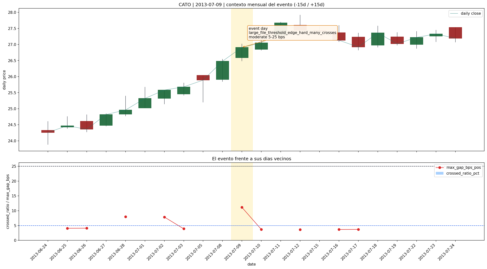

#### 00a Adjusted Proxy Contrast
Esta imagen responde a la pregunta de reconciliacion semantica: la discrepancia de precios viene de datos rotos o de vistas de precio distintas. Compara `daily raw`, `daily adjusted_proxy`, `quote mid raw` y `quote mid split_normalized`, y debajo ensena la cadena de dividendos y splits que produce la diferencia. La decision que cambia es si el inspector debe abrir una incidencia de calidad o cerrar el caso como diferencia legitima de semantica. El error que evita es mezclar series raw y adjusted como si fueran equivalentes. En pipelines reales, esto protege benchmarking, labels diarios y reconciliacion externa frente a falsas alarmas de precio.

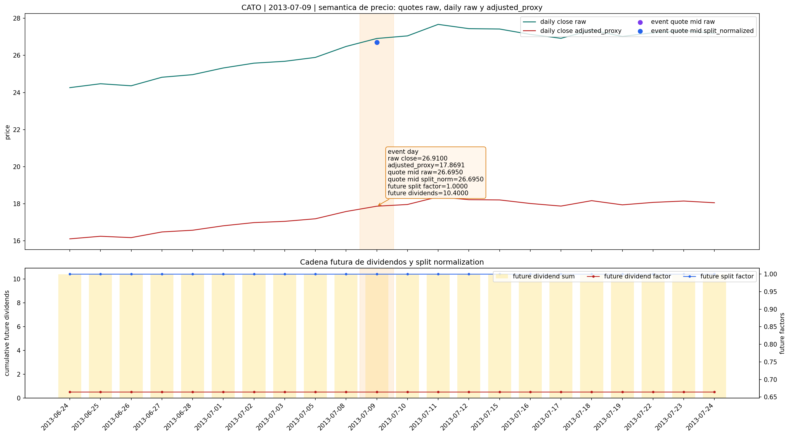

#### 00b Event Month Quotes Context
Esta imagen responde a la pregunta de recurrencia mensual dentro de `quotes`: el problema se concentra en el evento o reaparece en varias sesiones. Arriba concatena sesiones con datos disponibles; abajo resume cobertura diaria, `crossed_ratio_pct` y `max_gap_bps_pos`. La decision que cambia es si el caso debe leerse como episodio puntual o como sintoma de una fase repetida de libro degradado. El error que evita es extrapolar desde un unico dia a todo el mes sin evidencia.

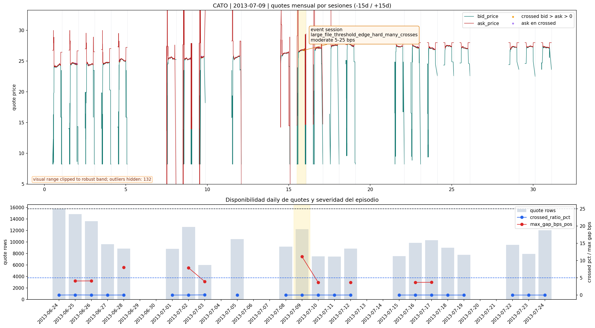

#### 01 Raw Window
Esta imagen responde a la primera pregunta decisiva del caso: el crossed observado es economicamente bastante fuerte para justificar un cambio de clase. Arriba ensena la geometria exacta del tramo conflictivo; abajo convierte esa geometria a bps y la enfrenta a los cortes `5 bps` y `25 bps`. El regimen dominante es `moderate 5-25 bps`. La decision que cambia es pasar de anomalia interpretable a `review` o `bad`. El error que evita es decidir por apariencia visual sin medir el dano economico real del crossed. En terminos de pipeline, este panel decide si el problema afecta solo a la lectura forense o si invalida simulacion de ejecucion y microstructure features.

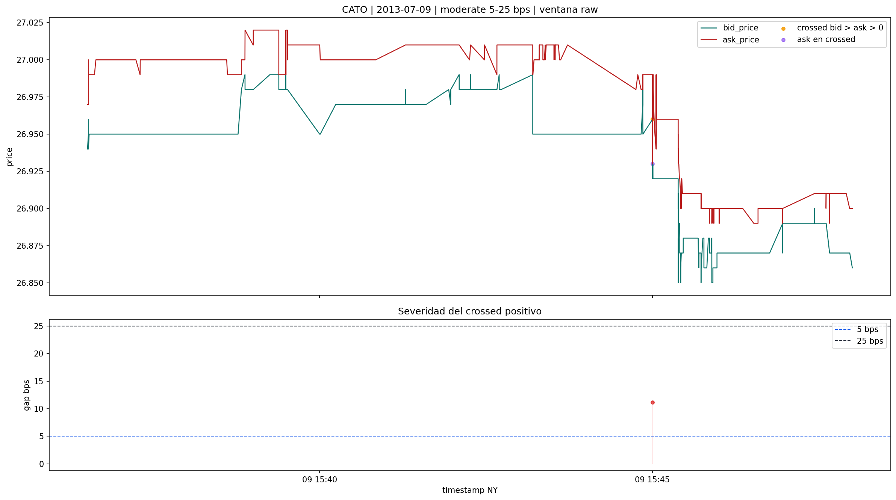

#### 02 Full Session Context
Esta imagen responde a la pregunta de extension intradiaria: el dano esta confinado a un bloque corto o contamina la sesion completa. Arriba se ve toda la sesion `04:00-20:00 NY`; abajo el `gap_bps` firmado. La decision que cambia es si el consumo debe penalizar solo un tramo o desechar el dia entero para uso operativo. El error que evita es tratar una cicatriz local como ruina total o, al reves, minimizar una degradacion distribuida a lo largo del dia. En ejecucion esto decide si la sesion puede seguir usandose con restricciones; en ML decide si las features intradiarias conservan significado economico.

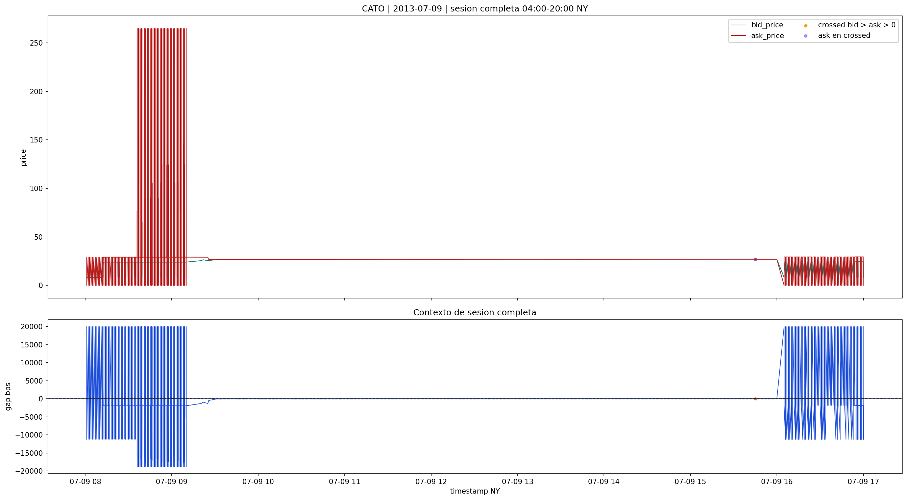

#### 03 Structure Diagnostics
Este panel responde a la pregunta de naturaleza del fallo: contradiccion economica genuina o mezcla con degeneracion estructural. Separa `ask=0` de `ask>0`, muestra la distribucion de `gap_bps` y resume patrones de integerizacion. La decision que cambia es como interpretar el dano: mercado localmente roto, artefacto de representacion o combinacion de ambos. El error que evita es sobrediagnosticar crossed reales cuando parte de la senal proviene de estructura degenerada del libro. Esta lectura afecta directamente a que el caso vaya a exclusion dura, a bandera contextual o a simple reconciliacion tecnica.

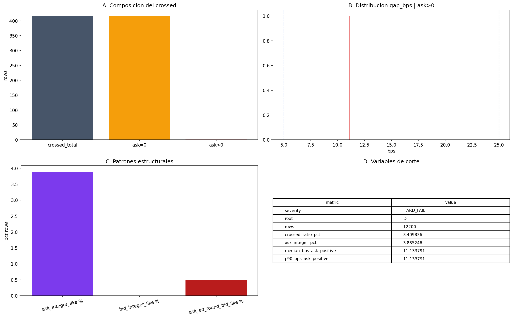

#### 04 Summary Card
Esta tarjeta responde a la pregunta de auditabilidad: cuales son exactamente las variables que sostienen la conclusion. Reune `severity`, `root`, `crossed_ratio_pct`, `ask_integer_pct`, `median_bps_ask_positive` y `p90_bps_ask_positive`. La decision que cambia es pasar de impresion visual a regla verificable. El error que evita es que dos inspectores lleguen a conclusiones distintas mirando la misma imagen sin una base numerica comun. Para gobernanza del proyecto, este panel es el que vuelve reproducible la decision para backtest, ML y auditoria.

---

### 13. CNSL 2012-05-02

company_name: `Consolidated Communications Holdings, Inc.`
primary_exchange: `NASDAQ` (`XNAS`)
market_locale: `stocks/us`
scope: `review`
ticker: `CNSL`
date: `2012-05-02`
taxonomy: `large_file_threshold_edge_hard_many_crosses`
positive_cross_bucket: `positive_cross_moderate_5to25bps`
severity: `HARD_FAIL`
root: `D`
rows: `10225`
crossed_ratio_pct: `0.889976`
crossed_rows_raw: `91`
crossed_rows_ask_zero: `1`
crossed_rows_ask_positive: `90`
ask_integer_pct: `0.234719`
median_bps_ask_positive: `10.025063`
p90_bps_ask_positive: `15.727392`
file: `D:\quotes\CNSL\year=2012\month=05\day=02\quotes.parquet`

#### Analisis Forense
La conclusion correcta del caso es que ya existe contradiccion economica real dentro del libro, pero aun no con fuerza suficiente para justificar exclusion dura sin contexto adicional. La taxonomy historica es `large_file_threshold_edge_hard_many_crosses` y el regimen positivo dominante es `moderate 5-25 bps`. Esto importa porque la taxonomy no solo clasifica: resume que tipo de anomalia se esta viendo y que clase de decision contractual puede defenderse despues. La taxonomy `large_file_threshold_edge_hard_many_crosses` implica un libro grande con muchas contradicciones, pero cerca del borde decisional. La dificultad analitica esta en decidir si el volumen de crossed es ruido absorbible o evidencia de degradacion suficientemente seria. El regimen `moderate 5-25 bps` ya entra en zona donde el crossed tiene capacidad real de contaminar simulacion de ejecucion y features microestructurales, aunque todavia puede requerir lectura contextual antes de exclusion dura. En terminos observables, el file tiene `crossed_ratio_pct=0.889976` con `crossed_rows_ask_positive=90` y `crossed_rows_ask_zero=1`. La severidad economica del crossed ask>0 se resume en `median_bps_ask_positive=10.025063` y `p90_bps_ask_positive=15.727392`. Estos dos numeros convierten una forma visual rara en una conclusion operativa sobre si el libro sigue representando o no un mercado negociable. La decision que cambia es pasar de libro sano a libro util solo bajo cautela. `review` significa: no usar como si fuera ejecucion limpia, conservar para analisis contextual y sensibilidad. El error que evita es tratar como normal un episodio que ya contiene contradiccion economica real y contaminar simulaciones de ejecucion o validaciones demasiado optimistas. El patron estructural muestra `ask_integer_pct=0.234719`. Este numero obliga a separar dos explicaciones rivales: contradiccion economica genuina del libro o mezcla con degeneracion estructural / integerizacion. La mayor parte del crossed vive en `ask>0`, de modo que el corazon del problema sigue siendo economico. La parte `ask=0`, si existe, acompana pero no explica por si sola la anomalia. Como `ask_integer_pct` es bajo, la hipotesis de simple degeneracion mecanica pierde fuerza. Eso endurece la interpretacion: el crossed se parece mas a contradiccion economica genuina y menos a artefacto. En la capa de semantica de precio del evento aparecen `daily raw close=19.1300`, `quote mid raw=19.1000`, `quote mid split_normalized=19.1000`, `daily adjusted_proxy=9.4430`. Ademas hay `post_event_dividend_sum=10.8466`. La implicacion metodologica es crucial: una discrepancia entre `quotes`, `daily` y una plataforma externa no puede leerse automaticamente como fallo del dataset. Puede ser semantica de precio distinta. El error que evita esta capa es mezclar raw, split-normalized y adjusted dentro del mismo pipeline, rompiendo auditoria, benchmarking y labels. Para pipelines, esto bloquea su uso como libro sano en ejecucion y features microestructurales principales, aunque aun puede mantenerse para forense, sensibilidad y estudios donde la anomalia sea parte del objeto de investigacion. Existe ademas una imagen historica de certificacion asociada. Su papel es poner el episodio en un marco causal mas amplio: halt, explained, not strongly explained o patron conocido. La regla que protege al proyecto es esta: el contexto externo se usa para explicar por que aparece el episodio, no para absolverlo. El error que evita es degradar el criterio de calidad del libro porque exista una historia plausible alrededor del caso.

#### 00 Event Month Context
Esta imagen responde a la pregunta de persistencia temporal: estamos ante un accidente local o ante una fase mas amplia de inestabilidad. Arriba coloca el evento en la serie `daily` real del mes; abajo compara `crossed_ratio_pct` y `max_gap_bps_pos` del dia contra sus vecinos. La decision que cambia es el peso estructural que se le concede al caso. El error que evita es juzgar igual un shock aislado y una degradacion repetida del libro.

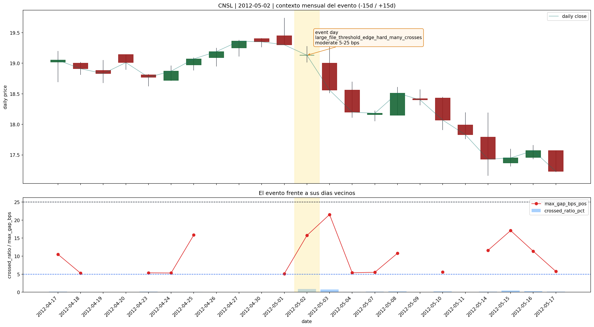

#### 00a Adjusted Proxy Contrast
Esta imagen responde a la pregunta de reconciliacion semantica: la discrepancia de precios viene de datos rotos o de vistas de precio distintas. Compara `daily raw`, `daily adjusted_proxy`, `quote mid raw` y `quote mid split_normalized`, y debajo ensena la cadena de dividendos y splits que produce la diferencia. La decision que cambia es si el inspector debe abrir una incidencia de calidad o cerrar el caso como diferencia legitima de semantica. El error que evita es mezclar series raw y adjusted como si fueran equivalentes. En pipelines reales, esto protege benchmarking, labels diarios y reconciliacion externa frente a falsas alarmas de precio.

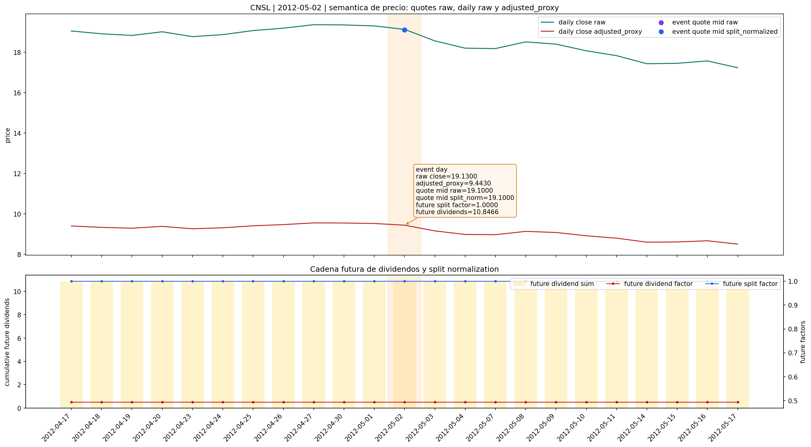

#### 00b Event Month Quotes Context
Esta imagen responde a la pregunta de recurrencia mensual dentro de `quotes`: el problema se concentra en el evento o reaparece en varias sesiones. Arriba concatena sesiones con datos disponibles; abajo resume cobertura diaria, `crossed_ratio_pct` y `max_gap_bps_pos`. La decision que cambia es si el caso debe leerse como episodio puntual o como sintoma de una fase repetida de libro degradado. El error que evita es extrapolar desde un unico dia a todo el mes sin evidencia.

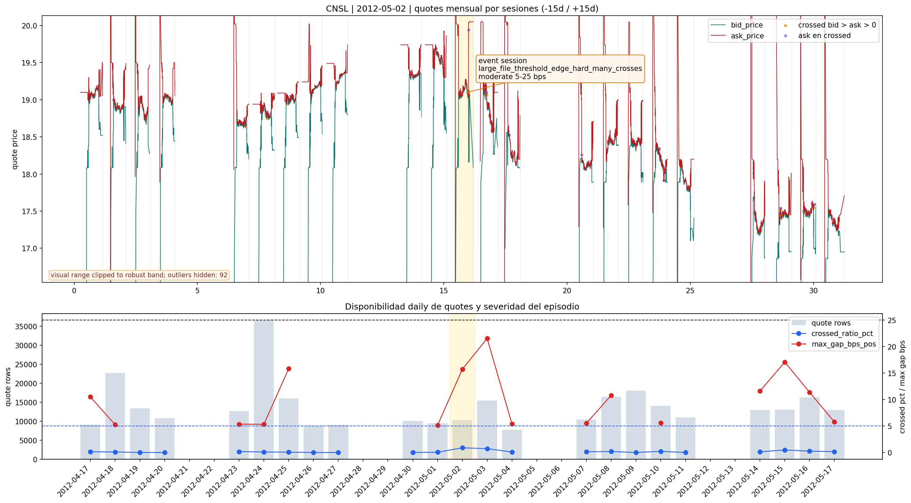

#### 01 Raw Window
Esta imagen responde a la primera pregunta decisiva del caso: el crossed observado es economicamente bastante fuerte para justificar un cambio de clase. Arriba ensena la geometria exacta del tramo conflictivo; abajo convierte esa geometria a bps y la enfrenta a los cortes `5 bps` y `25 bps`. El regimen dominante es `moderate 5-25 bps`. La decision que cambia es pasar de anomalia interpretable a `review` o `bad`. El error que evita es decidir por apariencia visual sin medir el dano economico real del crossed. En terminos de pipeline, este panel decide si el problema afecta solo a la lectura forense o si invalida simulacion de ejecucion y microstructure features.

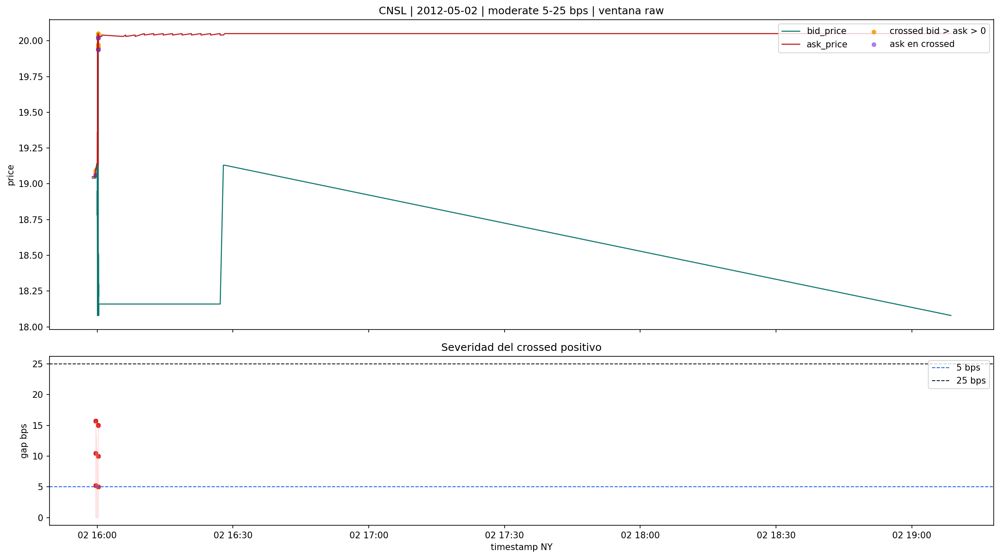

#### 02 Full Session Context
Esta imagen responde a la pregunta de extension intradiaria: el dano esta confinado a un bloque corto o contamina la sesion completa. Arriba se ve toda la sesion `04:00-20:00 NY`; abajo el `gap_bps` firmado. La decision que cambia es si el consumo debe penalizar solo un tramo o desechar el dia entero para uso operativo. El error que evita es tratar una cicatriz local como ruina total o, al reves, minimizar una degradacion distribuida a lo largo del dia. En ejecucion esto decide si la sesion puede seguir usandose con restricciones; en ML decide si las features intradiarias conservan significado economico.

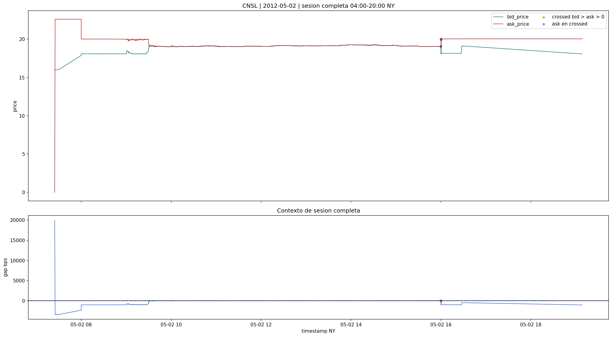

#### 03 Structure Diagnostics
Este panel responde a la pregunta de naturaleza del fallo: contradiccion economica genuina o mezcla con degeneracion estructural. Separa `ask=0` de `ask>0`, muestra la distribucion de `gap_bps` y resume patrones de integerizacion. La decision que cambia es como interpretar el dano: mercado localmente roto, artefacto de representacion o combinacion de ambos. El error que evita es sobrediagnosticar crossed reales cuando parte de la senal proviene de estructura degenerada del libro. Esta lectura afecta directamente a que el caso vaya a exclusion dura, a bandera contextual o a simple reconciliacion tecnica.

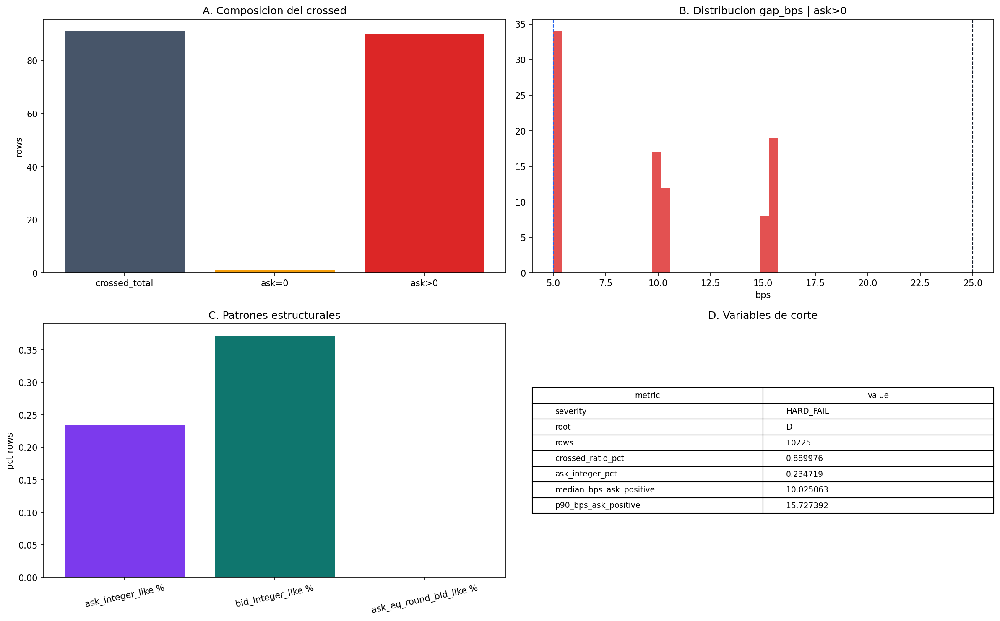

#### 04 Summary Card
Esta tarjeta responde a la pregunta de auditabilidad: cuales son exactamente las variables que sostienen la conclusion. Reune `severity`, `root`, `crossed_ratio_pct`, `ask_integer_pct`, `median_bps_ask_positive` y `p90_bps_ask_positive`. La decision que cambia es pasar de impresion visual a regla verificable. El error que evita es que dos inspectores lleguen a conclusiones distintas mirando la misma imagen sin una base numerica comun. Para gobernanza del proyecto, este panel es el que vuelve reproducible la decision para backtest, ML y auditoria.

---

### 14. VVUS 2009-09-21

company_name: `Vivus Inc`
primary_exchange: `NASDAQ` (`XNAS`)
market_locale: `stocks/us`
scope: `review`
ticker: `VVUS`
date: `2009-09-21`
taxonomy: `large_file_threshold_edge_hard_many_crosses`
positive_cross_bucket: `positive_cross_moderate_5to25bps`
severity: `HARD_FAIL`
root: `C`
rows: `77127`
crossed_ratio_pct: `1.358798`
crossed_rows_raw: `1048`
crossed_rows_ask_zero: `1`
crossed_rows_ask_positive: `1047`
ask_integer_pct: `0.068718`
median_bps_ask_positive: `8.806693`
p90_bps_ask_positive: `26.623944`
file: `C:\TSIS_Data\data\quotes\VVUS\year=2009\month=09\day=21\quotes.parquet`

#### Analisis Forense
La conclusion correcta del caso es que ya existe contradiccion economica real dentro del libro, pero aun no con fuerza suficiente para justificar exclusion dura sin contexto adicional. La taxonomy historica es `large_file_threshold_edge_hard_many_crosses` y el regimen positivo dominante es `moderate 5-25 bps`. Esto importa porque la taxonomy no solo clasifica: resume que tipo de anomalia se esta viendo y que clase de decision contractual puede defenderse despues. La taxonomy `large_file_threshold_edge_hard_many_crosses` implica un libro grande con muchas contradicciones, pero cerca del borde decisional. La dificultad analitica esta en decidir si el volumen de crossed es ruido absorbible o evidencia de degradacion suficientemente seria. El regimen `moderate 5-25 bps` ya entra en zona donde el crossed tiene capacidad real de contaminar simulacion de ejecucion y features microestructurales, aunque todavia puede requerir lectura contextual antes de exclusion dura. En terminos observables, el file tiene `crossed_ratio_pct=1.358798` con `crossed_rows_ask_positive=1047` y `crossed_rows_ask_zero=1`. La severidad economica del crossed ask>0 se resume en `median_bps_ask_positive=8.806693` y `p90_bps_ask_positive=26.623944`. Estos dos numeros convierten una forma visual rara en una conclusion operativa sobre si el libro sigue representando o no un mercado negociable. La decision que cambia es pasar de libro sano a libro util solo bajo cautela. `review` significa: no usar como si fuera ejecucion limpia, conservar para analisis contextual y sensibilidad. El error que evita es tratar como normal un episodio que ya contiene contradiccion economica real y contaminar simulaciones de ejecucion o validaciones demasiado optimistas. El patron estructural muestra `ask_integer_pct=0.068718`. Este numero obliga a separar dos explicaciones rivales: contradiccion economica genuina del libro o mezcla con degeneracion estructural / integerizacion. La mayor parte del crossed vive en `ask>0`, de modo que el corazon del problema sigue siendo economico. La parte `ask=0`, si existe, acompana pero no explica por si sola la anomalia. Como `ask_integer_pct` es bajo, la hipotesis de simple degeneracion mecanica pierde fuerza. Eso endurece la interpretacion: el crossed se parece mas a contradiccion economica genuina y menos a artefacto. En la capa de semantica de precio del evento aparecen `daily raw close=114.8000`, `quote mid raw=11.5450`, `quote mid split_normalized=115.4500`, `daily adjusted_proxy=114.8000`. La reconciliacion incluye `future_split_factor=0.1000`. La implicacion metodologica es crucial: una discrepancia entre `quotes`, `daily` y una plataforma externa no puede leerse automaticamente como fallo del dataset. Puede ser semantica de precio distinta. El error que evita esta capa es mezclar raw, split-normalized y adjusted dentro del mismo pipeline, rompiendo auditoria, benchmarking y labels. Para pipelines, esto bloquea su uso como libro sano en ejecucion y features microestructurales principales, aunque aun puede mantenerse para forense, sensibilidad y estudios donde la anomalia sea parte del objeto de investigacion. Existe ademas una imagen historica de certificacion asociada. Su papel es poner el episodio en un marco causal mas amplio: halt, explained, not strongly explained o patron conocido. La regla que protege al proyecto es esta: el contexto externo se usa para explicar por que aparece el episodio, no para absolverlo. El error que evita es degradar el criterio de calidad del libro porque exista una historia plausible alrededor del caso.

#### 00 Event Month Context
Esta imagen responde a la pregunta de persistencia temporal: estamos ante un accidente local o ante una fase mas amplia de inestabilidad. Arriba coloca el evento en la serie `daily` real del mes; abajo compara `crossed_ratio_pct` y `max_gap_bps_pos` del dia contra sus vecinos. La decision que cambia es el peso estructural que se le concede al caso. El error que evita es juzgar igual un shock aislado y una degradacion repetida del libro.

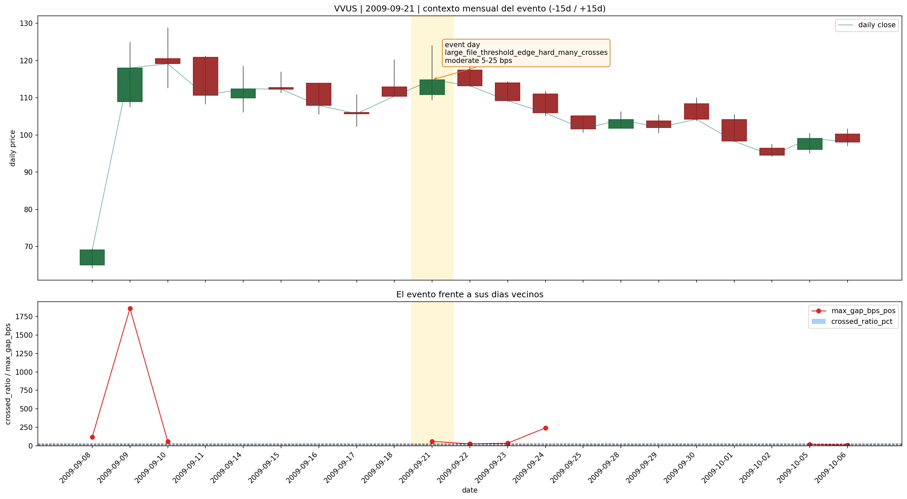

#### 00a Adjusted Proxy Contrast
Esta imagen responde a la pregunta de reconciliacion semantica: la discrepancia de precios viene de datos rotos o de vistas de precio distintas. Compara `daily raw`, `daily adjusted_proxy`, `quote mid raw` y `quote mid split_normalized`, y debajo ensena la cadena de dividendos y splits que produce la diferencia. La decision que cambia es si el inspector debe abrir una incidencia de calidad o cerrar el caso como diferencia legitima de semantica. El error que evita es mezclar series raw y adjusted como si fueran equivalentes. En pipelines reales, esto protege benchmarking, labels diarios y reconciliacion externa frente a falsas alarmas de precio.

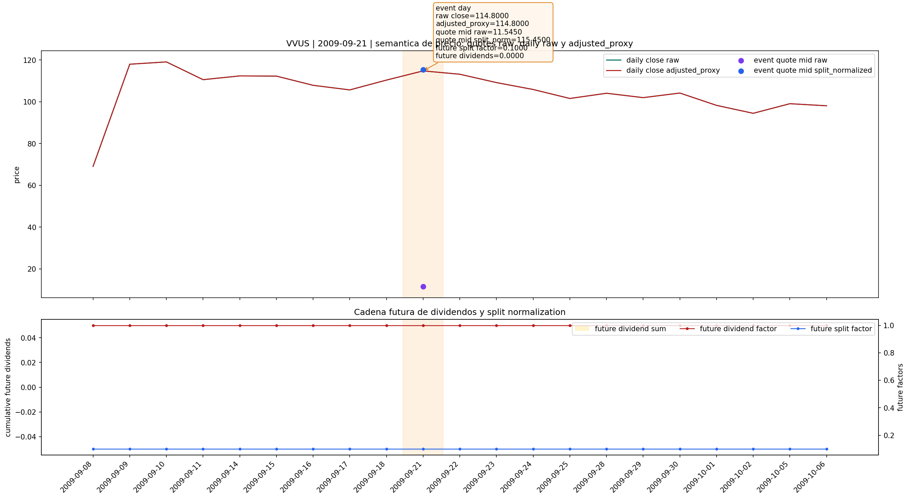

#### 00b Event Month Quotes Context
Esta imagen responde a la pregunta de recurrencia mensual dentro de `quotes`: el problema se concentra en el evento o reaparece en varias sesiones. Arriba concatena sesiones con datos disponibles; abajo resume cobertura diaria, `crossed_ratio_pct` y `max_gap_bps_pos`. La decision que cambia es si el caso debe leerse como episodio puntual o como sintoma de una fase repetida de libro degradado. El error que evita es extrapolar desde un unico dia a todo el mes sin evidencia.

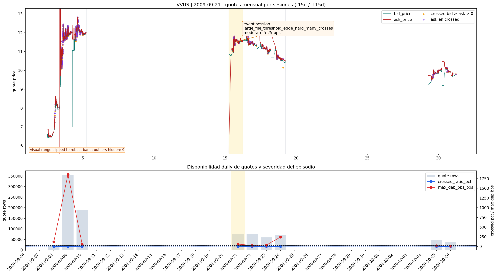

#### 01 Raw Window
Esta imagen responde a la primera pregunta decisiva del caso: el crossed observado es economicamente bastante fuerte para justificar un cambio de clase. Arriba ensena la geometria exacta del tramo conflictivo; abajo convierte esa geometria a bps y la enfrenta a los cortes `5 bps` y `25 bps`. El regimen dominante es `moderate 5-25 bps`. La decision que cambia es pasar de anomalia interpretable a `review` o `bad`. El error que evita es decidir por apariencia visual sin medir el dano economico real del crossed. En terminos de pipeline, este panel decide si el problema afecta solo a la lectura forense o si invalida simulacion de ejecucion y microstructure features.

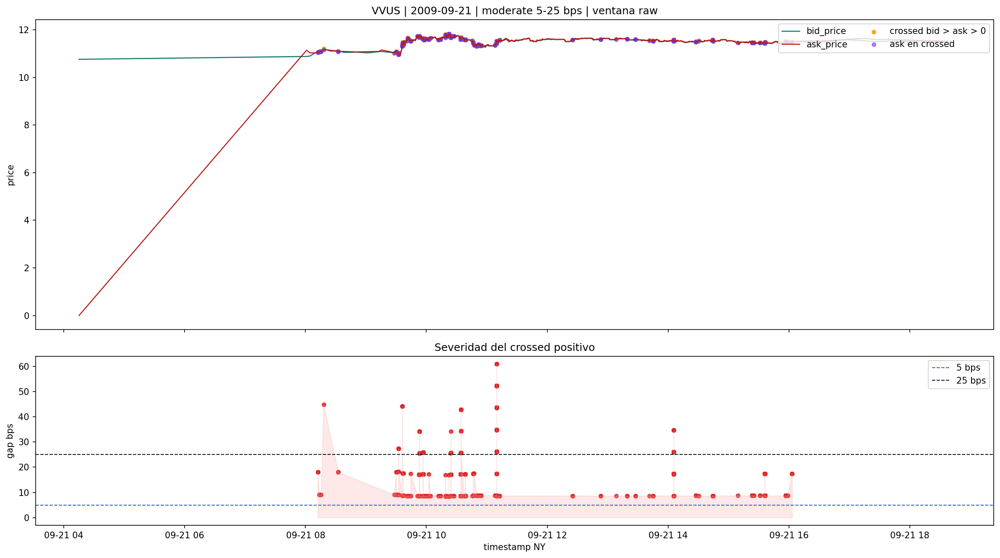

#### 02 Full Session Context
Esta imagen responde a la pregunta de extension intradiaria: el dano esta confinado a un bloque corto o contamina la sesion completa. Arriba se ve toda la sesion `04:00-20:00 NY`; abajo el `gap_bps` firmado. La decision que cambia es si el consumo debe penalizar solo un tramo o desechar el dia entero para uso operativo. El error que evita es tratar una cicatriz local como ruina total o, al reves, minimizar una degradacion distribuida a lo largo del dia. En ejecucion esto decide si la sesion puede seguir usandose con restricciones; en ML decide si las features intradiarias conservan significado economico.

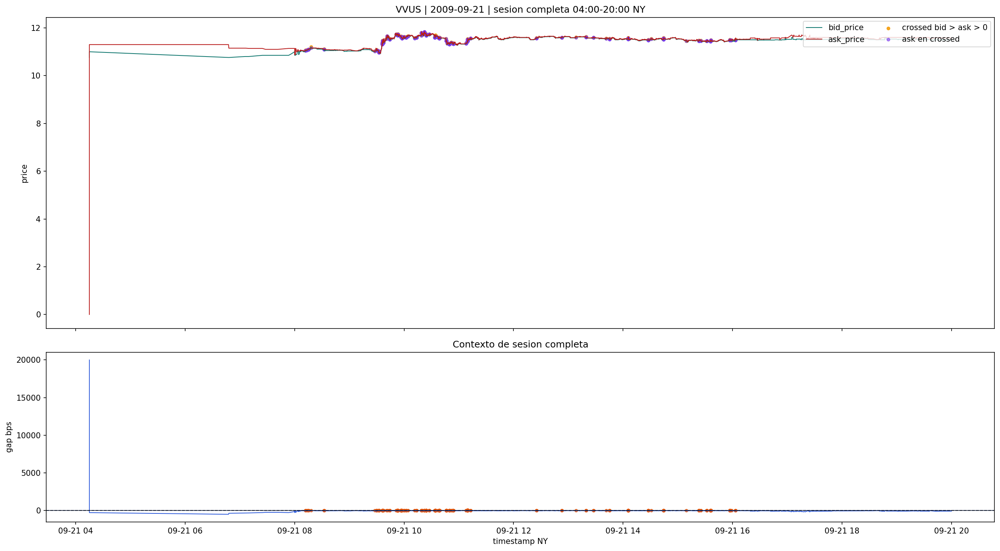

#### 03 Structure Diagnostics
Este panel responde a la pregunta de naturaleza del fallo: contradiccion economica genuina o mezcla con degeneracion estructural. Separa `ask=0` de `ask>0`, muestra la distribucion de `gap_bps` y resume patrones de integerizacion. La decision que cambia es como interpretar el dano: mercado localmente roto, artefacto de representacion o combinacion de ambos. El error que evita es sobrediagnosticar crossed reales cuando parte de la senal proviene de estructura degenerada del libro. Esta lectura afecta directamente a que el caso vaya a exclusion dura, a bandera contextual o a simple reconciliacion tecnica.

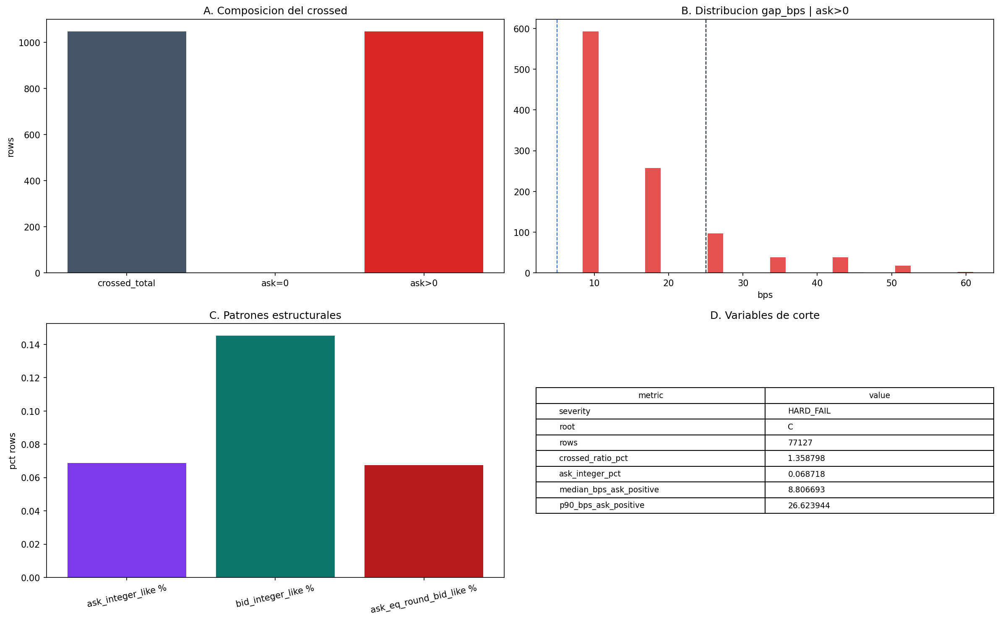

#### 04 Summary Card
Esta tarjeta responde a la pregunta de auditabilidad: cuales son exactamente las variables que sostienen la conclusion. Reune `severity`, `root`, `crossed_ratio_pct`, `ask_integer_pct`, `median_bps_ask_positive` y `p90_bps_ask_positive`. La decision que cambia es pasar de impresion visual a regla verificable. El error que evita es que dos inspectores lleguen a conclusiones distintas mirando la misma imagen sin una base numerica comun. Para gobernanza del proyecto, este panel es el que vuelve reproducible la decision para backtest, ML y auditoria.

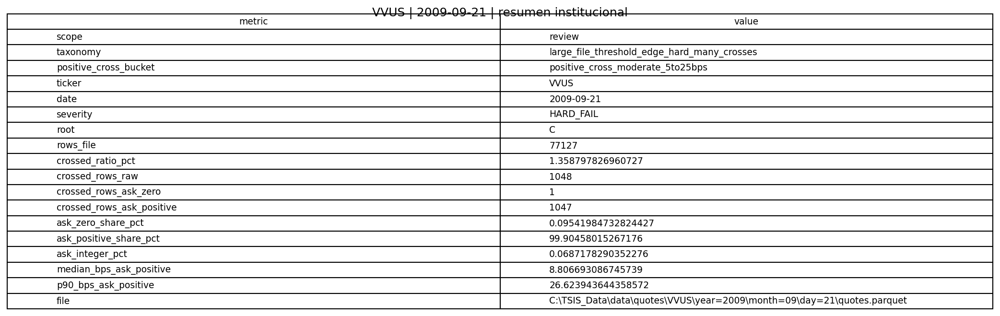

---

### 15. IART 2008-06-03

company_name: `Integra LifeSciences Holdings`
primary_exchange: `NASDAQ` (`XNAS`)
market_locale: `stocks/us`
scope: `review`
ticker: `IART`
date: `2008-06-03`
taxonomy: `large_file_threshold_edge_hard_many_crosses`
positive_cross_bucket: `positive_cross_moderate_5to25bps`
severity: `HARD_FAIL`
root: `D`
rows: `7178`
crossed_ratio_pct: `2.215102`
crossed_rows_raw: `159`
crossed_rows_ask_zero: `158`
crossed_rows_ask_positive: `1`
ask_integer_pct: `3.622179`
median_bps_ask_positive: `7.300158`
p90_bps_ask_positive: `7.300158`
file: `D:\quotes\IART\year=2008\month=06\day=03\quotes.parquet`

#### Analisis Forense
La conclusion correcta del caso es que ya existe contradiccion economica real dentro del libro, pero aun no con fuerza suficiente para justificar exclusion dura sin contexto adicional. La taxonomy historica es `large_file_threshold_edge_hard_many_crosses` y el regimen positivo dominante es `moderate 5-25 bps`. Esto importa porque la taxonomy no solo clasifica: resume que tipo de anomalia se esta viendo y que clase de decision contractual puede defenderse despues. La taxonomy `large_file_threshold_edge_hard_many_crosses` implica un libro grande con muchas contradicciones, pero cerca del borde decisional. La dificultad analitica esta en decidir si el volumen de crossed es ruido absorbible o evidencia de degradacion suficientemente seria. El regimen `moderate 5-25 bps` ya entra en zona donde el crossed tiene capacidad real de contaminar simulacion de ejecucion y features microestructurales, aunque todavia puede requerir lectura contextual antes de exclusion dura. En terminos observables, el file tiene `crossed_ratio_pct=2.215102` con `crossed_rows_ask_positive=1` y `crossed_rows_ask_zero=158`. La severidad economica del crossed ask>0 se resume en `median_bps_ask_positive=7.300158` y `p90_bps_ask_positive=7.300158`. Estos dos numeros convierten una forma visual rara en una conclusion operativa sobre si el libro sigue representando o no un mercado negociable. La decision que cambia es pasar de libro sano a libro util solo bajo cautela. `review` significa: no usar como si fuera ejecucion limpia, conservar para analisis contextual y sensibilidad. El error que evita es tratar como normal un episodio que ya contiene contradiccion economica real y contaminar simulaciones de ejecucion o validaciones demasiado optimistas. El patron estructural muestra `ask_integer_pct=3.622179`. Este numero obliga a separar dos explicaciones rivales: contradiccion economica genuina del libro o mezcla con degeneracion estructural / integerizacion. La mayor parte del crossed vive en `ask=0`, pero existe una cola `ask>0` que impide absolver el caso como simple glitch. La lectura correcta es mixta: dano estructural dominante con residuo economico que aun puede justificar bandera o exclusion. Como `ask_integer_pct` es bajo, la hipotesis de simple degeneracion mecanica pierde fuerza. Eso endurece la interpretacion: el crossed se parece mas a contradiccion economica genuina y menos a artefacto. En la capa de semantica de precio del evento aparecen `daily raw close=20.6650`, `quote mid raw=41.4000`, `quote mid split_normalized=20.7000`, `daily adjusted_proxy=20.6650`. La reconciliacion incluye `future_split_factor=2.0000`. La implicacion metodologica es crucial: una discrepancia entre `quotes`, `daily` y una plataforma externa no puede leerse automaticamente como fallo del dataset. Puede ser semantica de precio distinta. El error que evita esta capa es mezclar raw, split-normalized y adjusted dentro del mismo pipeline, rompiendo auditoria, benchmarking y labels. Para pipelines, esto bloquea su uso como libro sano en ejecucion y features microestructurales principales, aunque aun puede mantenerse para forense, sensibilidad y estudios donde la anomalia sea parte del objeto de investigacion. Existe ademas una imagen historica de certificacion asociada. Su papel es poner el episodio en un marco causal mas amplio: halt, explained, not strongly explained o patron conocido. La regla que protege al proyecto es esta: el contexto externo se usa para explicar por que aparece el episodio, no para absolverlo. El error que evita es degradar el criterio de calidad del libro porque exista una historia plausible alrededor del caso.

#### 00 Event Month Context
Esta imagen responde a la pregunta de persistencia temporal: estamos ante un accidente local o ante una fase mas amplia de inestabilidad. Arriba coloca el evento en la serie `daily` real del mes; abajo compara `crossed_ratio_pct` y `max_gap_bps_pos` del dia contra sus vecinos. La decision que cambia es el peso estructural que se le concede al caso. El error que evita es juzgar igual un shock aislado y una degradacion repetida del libro.

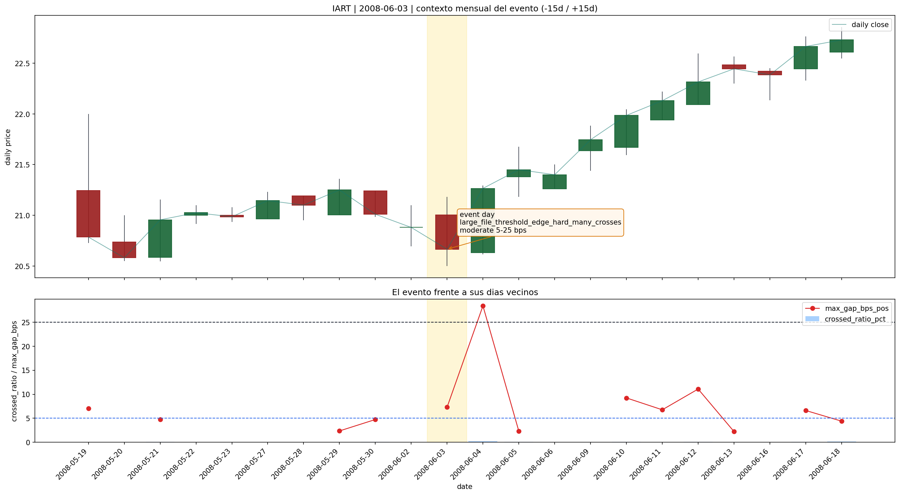

#### 00a Adjusted Proxy Contrast
Esta imagen responde a la pregunta de reconciliacion semantica: la discrepancia de precios viene de datos rotos o de vistas de precio distintas. Compara `daily raw`, `daily adjusted_proxy`, `quote mid raw` y `quote mid split_normalized`, y debajo ensena la cadena de dividendos y splits que produce la diferencia. La decision que cambia es si el inspector debe abrir una incidencia de calidad o cerrar el caso como diferencia legitima de semantica. El error que evita es mezclar series raw y adjusted como si fueran equivalentes. En pipelines reales, esto protege benchmarking, labels diarios y reconciliacion externa frente a falsas alarmas de precio.

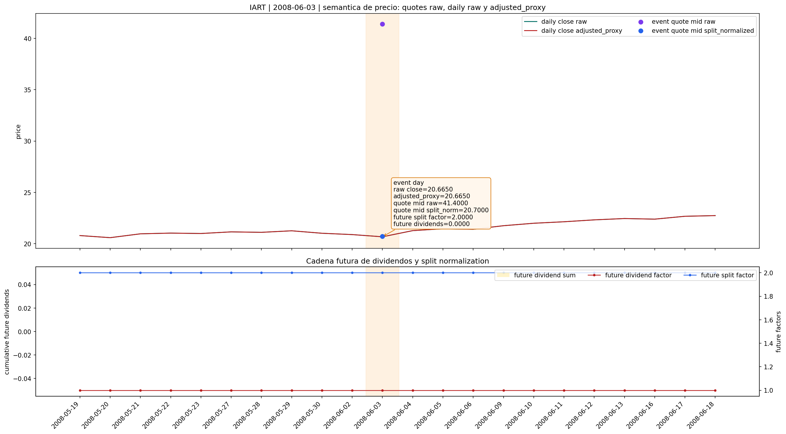

#### 00b Event Month Quotes Context
Esta imagen responde a la pregunta de recurrencia mensual dentro de `quotes`: el problema se concentra en el evento o reaparece en varias sesiones. Arriba concatena sesiones con datos disponibles; abajo resume cobertura diaria, `crossed_ratio_pct` y `max_gap_bps_pos`. La decision que cambia es si el caso debe leerse como episodio puntual o como sintoma de una fase repetida de libro degradado. El error que evita es extrapolar desde un unico dia a todo el mes sin evidencia.

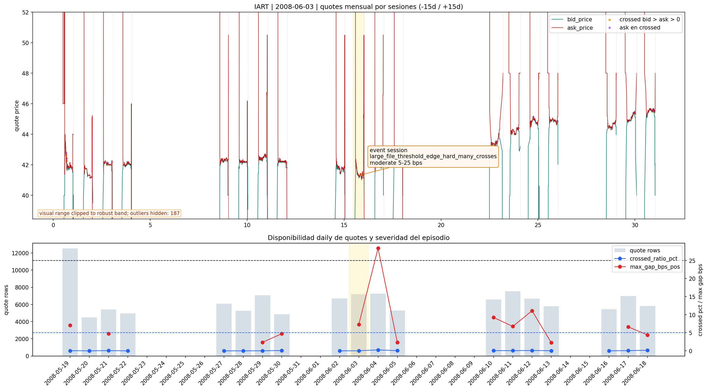

#### 01 Raw Window
Esta imagen responde a la primera pregunta decisiva del caso: el crossed observado es economicamente bastante fuerte para justificar un cambio de clase. Arriba ensena la geometria exacta del tramo conflictivo; abajo convierte esa geometria a bps y la enfrenta a los cortes `5 bps` y `25 bps`. El regimen dominante es `moderate 5-25 bps`. La decision que cambia es pasar de anomalia interpretable a `review` o `bad`. El error que evita es decidir por apariencia visual sin medir el dano economico real del crossed. En terminos de pipeline, este panel decide si el problema afecta solo a la lectura forense o si invalida simulacion de ejecucion y microstructure features.

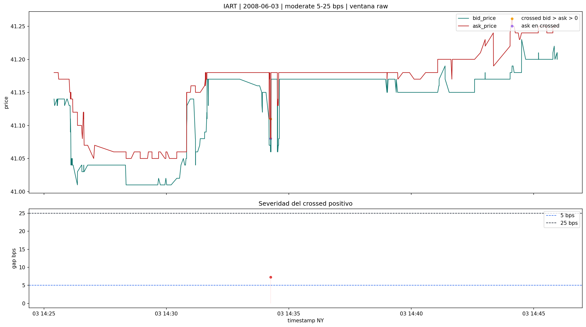

#### 02 Full Session Context
Esta imagen responde a la pregunta de extension intradiaria: el dano esta confinado a un bloque corto o contamina la sesion completa. Arriba se ve toda la sesion `04:00-20:00 NY`; abajo el `gap_bps` firmado. La decision que cambia es si el consumo debe penalizar solo un tramo o desechar el dia entero para uso operativo. El error que evita es tratar una cicatriz local como ruina total o, al reves, minimizar una degradacion distribuida a lo largo del dia. En ejecucion esto decide si la sesion puede seguir usandose con restricciones; en ML decide si las features intradiarias conservan significado economico.

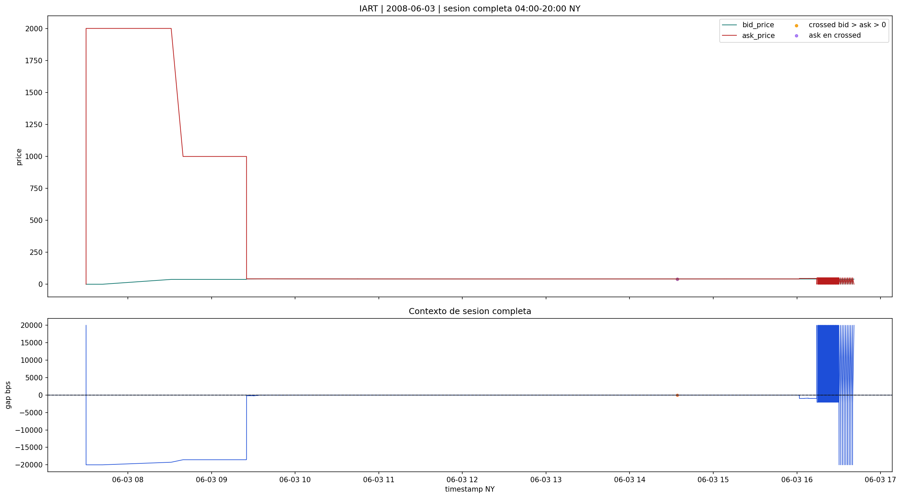

#### 03 Structure Diagnostics
Este panel responde a la pregunta de naturaleza del fallo: contradiccion economica genuina o mezcla con degeneracion estructural. Separa `ask=0` de `ask>0`, muestra la distribucion de `gap_bps` y resume patrones de integerizacion. La decision que cambia es como interpretar el dano: mercado localmente roto, artefacto de representacion o combinacion de ambos. El error que evita es sobrediagnosticar crossed reales cuando parte de la senal proviene de estructura degenerada del libro. Esta lectura afecta directamente a que el caso vaya a exclusion dura, a bandera contextual o a simple reconciliacion tecnica.

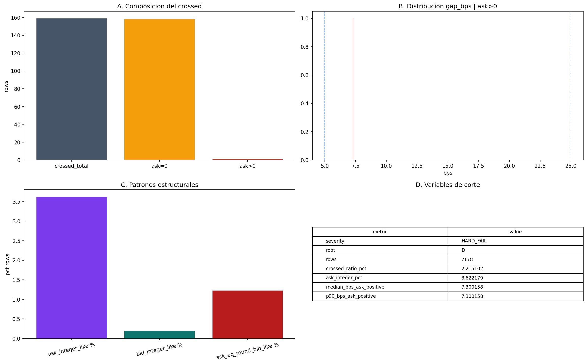

#### 04 Summary Card
Esta tarjeta responde a la pregunta de auditabilidad: cuales son exactamente las variables que sostienen la conclusion. Reune `severity`, `root`, `crossed_ratio_pct`, `ask_integer_pct`, `median_bps_ask_positive` y `p90_bps_ask_positive`. La decision que cambia es pasar de impresion visual a regla verificable. El error que evita es que dos inspectores lleguen a conclusiones distintas mirando la misma imagen sin una base numerica comun. Para gobernanza del proyecto, este panel es el que vuelve reproducible la decision para backtest, ML y auditoria.

---

### 16. OFIX 2026-01-14

company_name: `Orthofix Medical Inc. Common Stock (DE)`
primary_exchange: `NASDAQ` (`XNAS`)
market_locale: `stocks/us`
scope: `review`
ticker: `OFIX`
date: `2026-01-14`
taxonomy: `large_file_threshold_edge_hard_many_crosses`
positive_cross_bucket: `positive_cross_moderate_5to25bps`
severity: `HARD_FAIL`
root: `D`
rows: `5852`
crossed_ratio_pct: `1.093643`
crossed_rows_raw: `64`
crossed_rows_ask_zero: `58`
crossed_rows_ask_positive: `6`
ask_integer_pct: `9.073821`
median_bps_ask_positive: `7.005254`
p90_bps_ask_positive: `10.505428`
file: `D:\quotes\OFIX\year=2026\month=01\day=14\quotes.parquet`

#### Analisis Forense
La conclusion correcta del caso es que ya existe contradiccion economica real dentro del libro, pero aun no con fuerza suficiente para justificar exclusion dura sin contexto adicional. La taxonomy historica es `large_file_threshold_edge_hard_many_crosses` y el regimen positivo dominante es `moderate 5-25 bps`. Esto importa porque la taxonomy no solo clasifica: resume que tipo de anomalia se esta viendo y que clase de decision contractual puede defenderse despues. La taxonomy `large_file_threshold_edge_hard_many_crosses` implica un libro grande con muchas contradicciones, pero cerca del borde decisional. La dificultad analitica esta en decidir si el volumen de crossed es ruido absorbible o evidencia de degradacion suficientemente seria. El regimen `moderate 5-25 bps` ya entra en zona donde el crossed tiene capacidad real de contaminar simulacion de ejecucion y features microestructurales, aunque todavia puede requerir lectura contextual antes de exclusion dura. En terminos observables, el file tiene `crossed_ratio_pct=1.093643` con `crossed_rows_ask_positive=6` y `crossed_rows_ask_zero=58`. La severidad economica del crossed ask>0 se resume en `median_bps_ask_positive=7.005254` y `p90_bps_ask_positive=10.505428`. Estos dos numeros convierten una forma visual rara en una conclusion operativa sobre si el libro sigue representando o no un mercado negociable. La decision que cambia es pasar de libro sano a libro util solo bajo cautela. `review` significa: no usar como si fuera ejecucion limpia, conservar para analisis contextual y sensibilidad. El error que evita es tratar como normal un episodio que ya contiene contradiccion economica real y contaminar simulaciones de ejecucion o validaciones demasiado optimistas. El patron estructural muestra `ask_integer_pct=9.073821`. Este numero obliga a separar dos explicaciones rivales: contradiccion economica genuina del libro o mezcla con degeneracion estructural / integerizacion. La mayor parte del crossed vive en `ask=0`, pero existe una cola `ask>0` que impide absolver el caso como simple glitch. La lectura correcta es mixta: dano estructural dominante con residuo economico que aun puede justificar bandera o exclusion. Como `ask_integer_pct` no es extremo, el caso exige leer geometria del crossed y estructura simultaneamente. No basta un solo numero; hay que combinar severidad, composicion y contexto. Existe ademas una imagen historica de certificacion asociada. Su papel es poner el episodio en un marco causal mas amplio: halt, explained, not strongly explained o patron conocido. La regla que protege al proyecto es esta: el contexto externo se usa para explicar por que aparece el episodio, no para absolverlo. El error que evita es degradar el criterio de calidad del libro porque exista una historia plausible alrededor del caso.

#### 00 Event Month Context
Esta imagen responde a la pregunta de persistencia temporal: estamos ante un accidente local o ante una fase mas amplia de inestabilidad. Arriba coloca el evento en la serie `daily` real del mes; abajo compara `crossed_ratio_pct` y `max_gap_bps_pos` del dia contra sus vecinos. La decision que cambia es el peso estructural que se le concede al caso. El error que evita es juzgar igual un shock aislado y una degradacion repetida del libro.

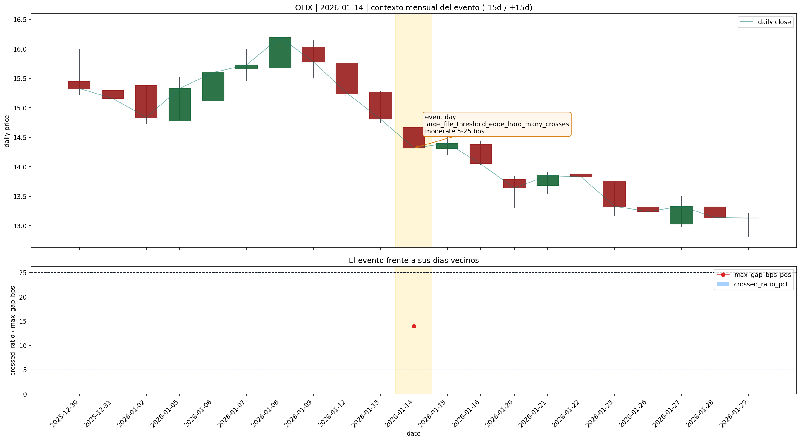

#### 00b Event Month Quotes Context
Esta imagen responde a la pregunta de recurrencia mensual dentro de `quotes`: el problema se concentra en el evento o reaparece en varias sesiones. Arriba concatena sesiones con datos disponibles; abajo resume cobertura diaria, `crossed_ratio_pct` y `max_gap_bps_pos`. La decision que cambia es si el caso debe leerse como episodio puntual o como sintoma de una fase repetida de libro degradado. El error que evita es extrapolar desde un unico dia a todo el mes sin evidencia.

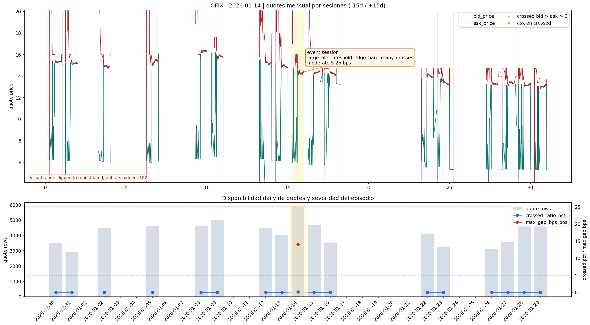

#### 01 Raw Window
Esta imagen responde a la primera pregunta decisiva del caso: el crossed observado es economicamente bastante fuerte para justificar un cambio de clase. Arriba ensena la geometria exacta del tramo conflictivo; abajo convierte esa geometria a bps y la enfrenta a los cortes `5 bps` y `25 bps`. El regimen dominante es `moderate 5-25 bps`. La decision que cambia es pasar de anomalia interpretable a `review` o `bad`. El error que evita es decidir por apariencia visual sin medir el dano economico real del crossed. En terminos de pipeline, este panel decide si el problema afecta solo a la lectura forense o si invalida simulacion de ejecucion y microstructure features.

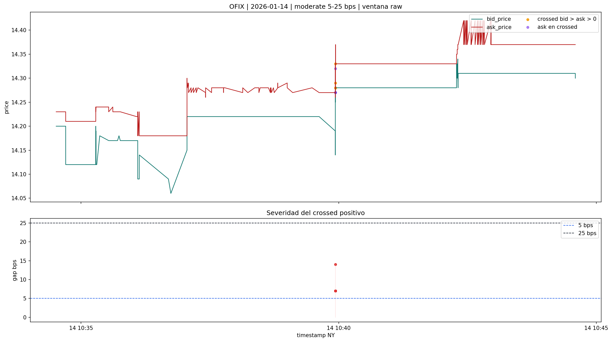

#### 02 Full Session Context
Esta imagen responde a la pregunta de extension intradiaria: el dano esta confinado a un bloque corto o contamina la sesion completa. Arriba se ve toda la sesion `04:00-20:00 NY`; abajo el `gap_bps` firmado. La decision que cambia es si el consumo debe penalizar solo un tramo o desechar el dia entero para uso operativo. El error que evita es tratar una cicatriz local como ruina total o, al reves, minimizar una degradacion distribuida a lo largo del dia. En ejecucion esto decide si la sesion puede seguir usandose con restricciones; en ML decide si las features intradiarias conservan significado economico.

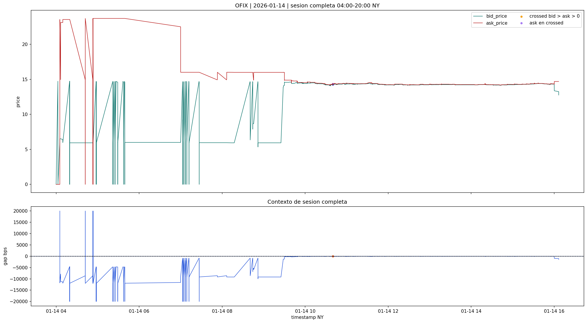

#### 03 Structure Diagnostics
Este panel responde a la pregunta de naturaleza del fallo: contradiccion economica genuina o mezcla con degeneracion estructural. Separa `ask=0` de `ask>0`, muestra la distribucion de `gap_bps` y resume patrones de integerizacion. La decision que cambia es como interpretar el dano: mercado localmente roto, artefacto de representacion o combinacion de ambos. El error que evita es sobrediagnosticar crossed reales cuando parte de la senal proviene de estructura degenerada del libro. Esta lectura afecta directamente a que el caso vaya a exclusion dura, a bandera contextual o a simple reconciliacion tecnica.

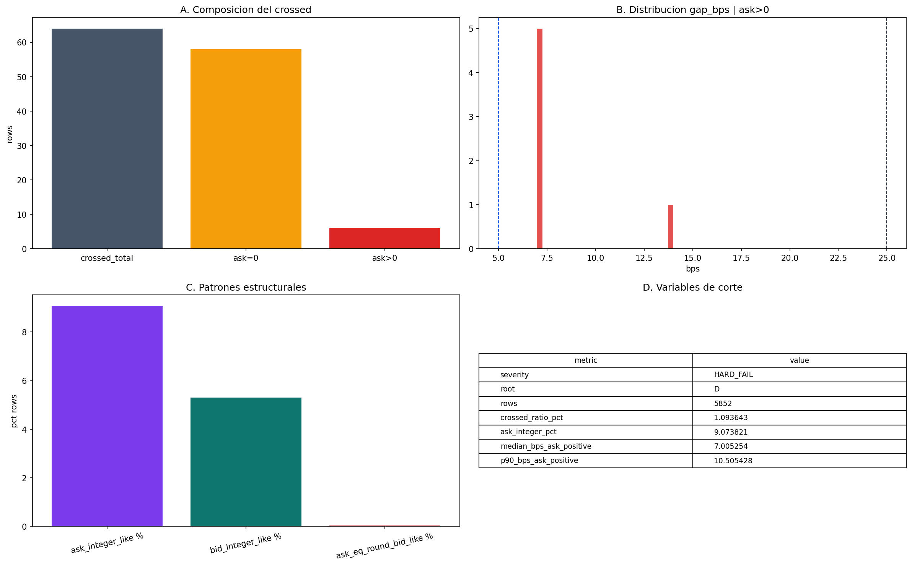

#### 04 Summary Card
Esta tarjeta responde a la pregunta de auditabilidad: cuales son exactamente las variables que sostienen la conclusion. Reune `severity`, `root`, `crossed_ratio_pct`, `ask_integer_pct`, `median_bps_ask_positive` y `p90_bps_ask_positive`. La decision que cambia es pasar de impresion visual a regla verificable. El error que evita es que dos inspectores lleguen a conclusiones distintas mirando la misma imagen sin una base numerica comun. Para gobernanza del proyecto, este panel es el que vuelve reproducible la decision para backtest, ML y auditoria.

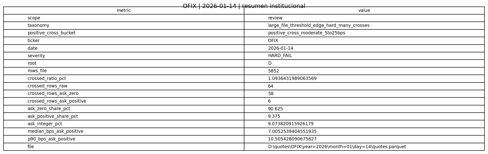

---

### 17. HWAY 2015-04-23

company_name: `Healthways, Inc.`
primary_exchange: `NASDAQ` (`XNAS`)
market_locale: `stocks/us`
scope: `review`
ticker: `HWAY`
date: `2015-04-23`
taxonomy: `large_file_threshold_edge_hard_many_crosses`
positive_cross_bucket: `positive_cross_moderate_5to25bps`
severity: `HARD_FAIL`
root: `D`
rows: `12899`
crossed_ratio_pct: `0.814017`
crossed_rows_raw: `105`
crossed_rows_ask_zero: `4`
crossed_rows_ask_positive: `101`
ask_integer_pct: `4.480968`
median_bps_ask_positive: `5.126891`
p90_bps_ask_positive: `15.372790`
file: `D:\quotes\HWAY\year=2015\month=04\day=23\quotes.parquet`

#### Analisis Forense
La conclusion correcta del caso es que ya existe contradiccion economica real dentro del libro, pero aun no con fuerza suficiente para justificar exclusion dura sin contexto adicional. La taxonomy historica es `large_file_threshold_edge_hard_many_crosses` y el regimen positivo dominante es `moderate 5-25 bps`. Esto importa porque la taxonomy no solo clasifica: resume que tipo de anomalia se esta viendo y que clase de decision contractual puede defenderse despues. La taxonomy `large_file_threshold_edge_hard_many_crosses` implica un libro grande con muchas contradicciones, pero cerca del borde decisional. La dificultad analitica esta en decidir si el volumen de crossed es ruido absorbible o evidencia de degradacion suficientemente seria. El regimen `moderate 5-25 bps` ya entra en zona donde el crossed tiene capacidad real de contaminar simulacion de ejecucion y features microestructurales, aunque todavia puede requerir lectura contextual antes de exclusion dura. En terminos observables, el file tiene `crossed_ratio_pct=0.814017` con `crossed_rows_ask_positive=101` y `crossed_rows_ask_zero=4`. La severidad economica del crossed ask>0 se resume en `median_bps_ask_positive=5.126891` y `p90_bps_ask_positive=15.372790`. Estos dos numeros convierten una forma visual rara en una conclusion operativa sobre si el libro sigue representando o no un mercado negociable. La decision que cambia es pasar de libro sano a libro util solo bajo cautela. `review` significa: no usar como si fuera ejecucion limpia, conservar para analisis contextual y sensibilidad. El error que evita es tratar como normal un episodio que ya contiene contradiccion economica real y contaminar simulaciones de ejecucion o validaciones demasiado optimistas. El patron estructural muestra `ask_integer_pct=4.480968`. Este numero obliga a separar dos explicaciones rivales: contradiccion economica genuina del libro o mezcla con degeneracion estructural / integerizacion. La mayor parte del crossed vive en `ask>0`, de modo que el corazon del problema sigue siendo economico. La parte `ask=0`, si existe, acompana pero no explica por si sola la anomalia. Como `ask_integer_pct` es bajo, la hipotesis de simple degeneracion mecanica pierde fuerza. Eso endurece la interpretacion: el crossed se parece mas a contradiccion economica genuina y menos a artefacto. En la capa de semantica de precio del evento aparecen `daily raw close=19.5000`, `quote mid raw=19.4200`, `quote mid split_normalized=19.4200`, `daily adjusted_proxy=19.1662`. Ademas hay `post_event_dividend_sum=0.4563`. La implicacion metodologica es crucial: una discrepancia entre `quotes`, `daily` y una plataforma externa no puede leerse automaticamente como fallo del dataset. Puede ser semantica de precio distinta. El error que evita esta capa es mezclar raw, split-normalized y adjusted dentro del mismo pipeline, rompiendo auditoria, benchmarking y labels. Para pipelines, esto bloquea su uso como libro sano en ejecucion y features microestructurales principales, aunque aun puede mantenerse para forense, sensibilidad y estudios donde la anomalia sea parte del objeto de investigacion. Existe ademas una imagen historica de certificacion asociada. Su papel es poner el episodio en un marco causal mas amplio: halt, explained, not strongly explained o patron conocido. La regla que protege al proyecto es esta: el contexto externo se usa para explicar por que aparece el episodio, no para absolverlo. El error que evita es degradar el criterio de calidad del libro porque exista una historia plausible alrededor del caso.

#### 00 Event Month Context
Esta imagen responde a la pregunta de persistencia temporal: estamos ante un accidente local o ante una fase mas amplia de inestabilidad. Arriba coloca el evento en la serie `daily` real del mes; abajo compara `crossed_ratio_pct` y `max_gap_bps_pos` del dia contra sus vecinos. La decision que cambia es el peso estructural que se le concede al caso. El error que evita es juzgar igual un shock aislado y una degradacion repetida del libro.

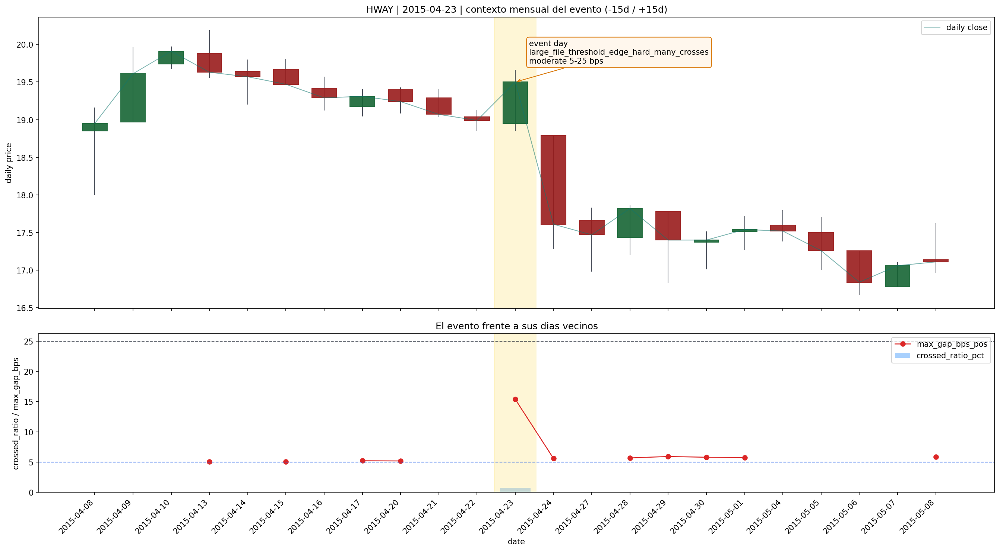

#### 00a Adjusted Proxy Contrast
Esta imagen responde a la pregunta de reconciliacion semantica: la discrepancia de precios viene de datos rotos o de vistas de precio distintas. Compara `daily raw`, `daily adjusted_proxy`, `quote mid raw` y `quote mid split_normalized`, y debajo ensena la cadena de dividendos y splits que produce la diferencia. La decision que cambia es si el inspector debe abrir una incidencia de calidad o cerrar el caso como diferencia legitima de semantica. El error que evita es mezclar series raw y adjusted como si fueran equivalentes. En pipelines reales, esto protege benchmarking, labels diarios y reconciliacion externa frente a falsas alarmas de precio.

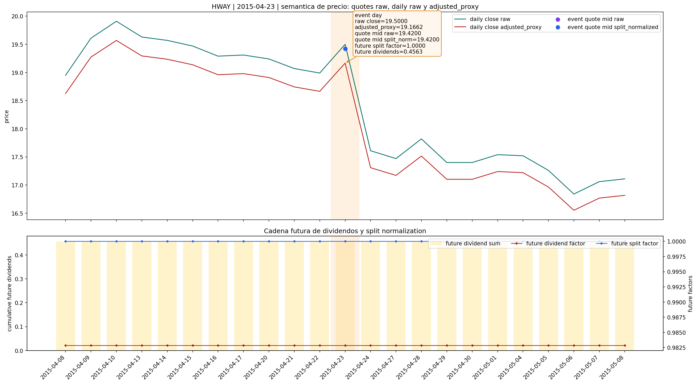

#### 00b Event Month Quotes Context
Esta imagen responde a la pregunta de recurrencia mensual dentro de `quotes`: el problema se concentra en el evento o reaparece en varias sesiones. Arriba concatena sesiones con datos disponibles; abajo resume cobertura diaria, `crossed_ratio_pct` y `max_gap_bps_pos`. La decision que cambia es si el caso debe leerse como episodio puntual o como sintoma de una fase repetida de libro degradado. El error que evita es extrapolar desde un unico dia a todo el mes sin evidencia.

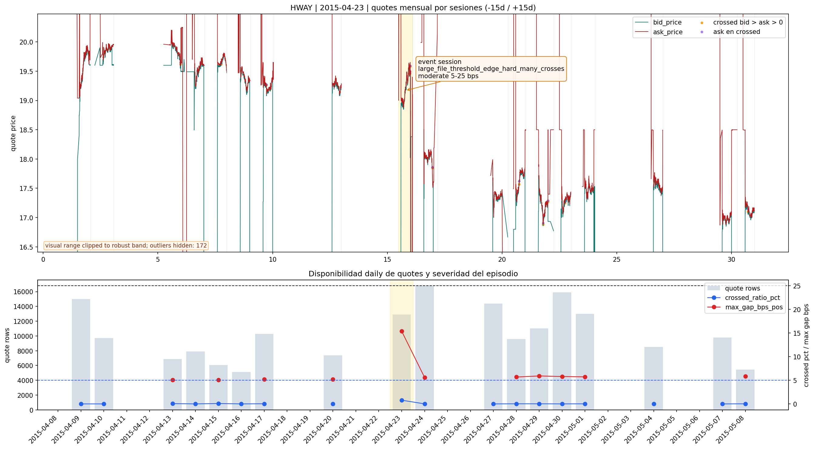

#### 01 Raw Window
Esta imagen responde a la primera pregunta decisiva del caso: el crossed observado es economicamente bastante fuerte para justificar un cambio de clase. Arriba ensena la geometria exacta del tramo conflictivo; abajo convierte esa geometria a bps y la enfrenta a los cortes `5 bps` y `25 bps`. El regimen dominante es `moderate 5-25 bps`. La decision que cambia es pasar de anomalia interpretable a `review` o `bad`. El error que evita es decidir por apariencia visual sin medir el dano economico real del crossed. En terminos de pipeline, este panel decide si el problema afecta solo a la lectura forense o si invalida simulacion de ejecucion y microstructure features.

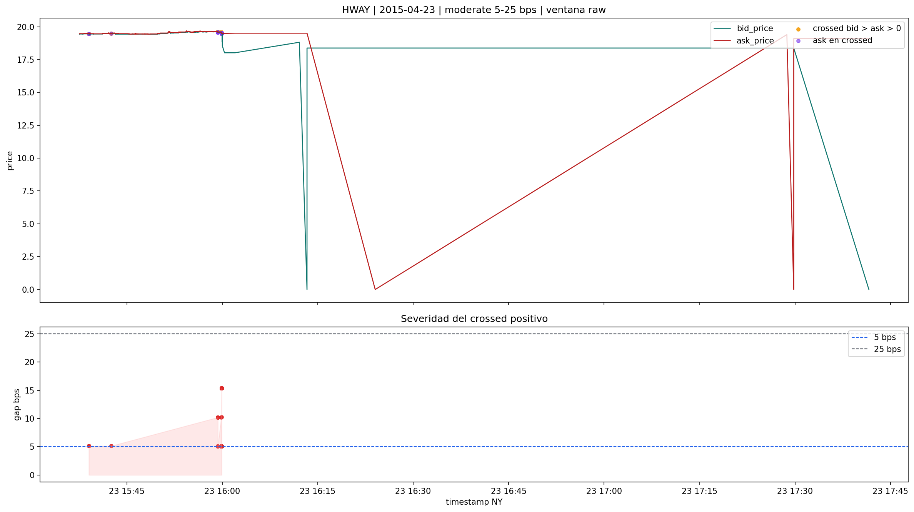

#### 02 Full Session Context
Esta imagen responde a la pregunta de extension intradiaria: el dano esta confinado a un bloque corto o contamina la sesion completa. Arriba se ve toda la sesion `04:00-20:00 NY`; abajo el `gap_bps` firmado. La decision que cambia es si el consumo debe penalizar solo un tramo o desechar el dia entero para uso operativo. El error que evita es tratar una cicatriz local como ruina total o, al reves, minimizar una degradacion distribuida a lo largo del dia. En ejecucion esto decide si la sesion puede seguir usandose con restricciones; en ML decide si las features intradiarias conservan significado economico.

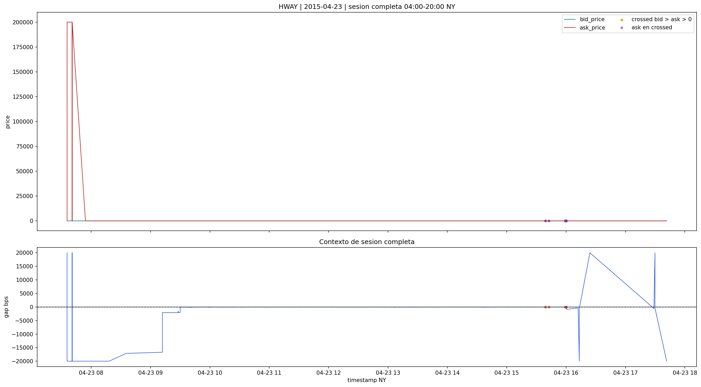

#### 03 Structure Diagnostics
Este panel responde a la pregunta de naturaleza del fallo: contradiccion economica genuina o mezcla con degeneracion estructural. Separa `ask=0` de `ask>0`, muestra la distribucion de `gap_bps` y resume patrones de integerizacion. La decision que cambia es como interpretar el dano: mercado localmente roto, artefacto de representacion o combinacion de ambos. El error que evita es sobrediagnosticar crossed reales cuando parte de la senal proviene de estructura degenerada del libro. Esta lectura afecta directamente a que el caso vaya a exclusion dura, a bandera contextual o a simple reconciliacion tecnica.

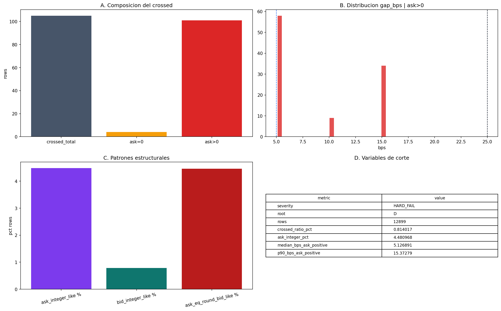

#### 04 Summary Card
Esta tarjeta responde a la pregunta de auditabilidad: cuales son exactamente las variables que sostienen la conclusion. Reune `severity`, `root`, `crossed_ratio_pct`, `ask_integer_pct`, `median_bps_ask_positive` y `p90_bps_ask_positive`. La decision que cambia es pasar de impresion visual a regla verificable. El error que evita es que dos inspectores lleguen a conclusiones distintas mirando la misma imagen sin una base numerica comun. Para gobernanza del proyecto, este panel es el que vuelve reproducible la decision para backtest, ML y auditoria.

---

### 18. UPL 2007-02-22

company_name: `ULTRA PETROLEUM CORP`
primary_exchange: `NYSE` (`XNYS`)
market_locale: `stocks/us`
scope: `review`
ticker: `UPL`
date: `2007-02-22`
taxonomy: `large_file_threshold_edge_hard_many_crosses`
positive_cross_bucket: `positive_cross_mild_lt5bps`
severity: `HARD_FAIL`
root: `C`
rows: `6900`
crossed_ratio_pct: `2.884058`
crossed_rows_raw: `199`
crossed_rows_ask_zero: `0`
crossed_rows_ask_positive: `199`
ask_integer_pct: `3.043478`
median_bps_ask_positive: `3.942440`
p90_bps_ask_positive: `10.252792`
file: `C:\TSIS_Data\data\quotes\UPL\year=2007\month=02\day=22\quotes.parquet`

#### Analisis Forense
La conclusion correcta del caso es que ya existe contradiccion economica real dentro del libro, pero aun no con fuerza suficiente para justificar exclusion dura sin contexto adicional. La taxonomy historica es `large_file_threshold_edge_hard_many_crosses` y el regimen positivo dominante es `mild <5 bps`. Esto importa porque la taxonomy no solo clasifica: resume que tipo de anomalia se esta viendo y que clase de decision contractual puede defenderse despues. La taxonomy `large_file_threshold_edge_hard_many_crosses` implica un libro grande con muchas contradicciones, pero cerca del borde decisional. La dificultad analitica esta en decidir si el volumen de crossed es ruido absorbible o evidencia de degradacion suficientemente seria. El regimen `mild <5 bps` significa que existe contradiccion economica positiva, pero aun en una banda donde un uso prudente puede seguir siendo defendible si la persistencia y la estructura no agravan el caso. En terminos observables, el file tiene `crossed_ratio_pct=2.884058` con `crossed_rows_ask_positive=199` y `crossed_rows_ask_zero=0`. La severidad economica del crossed ask>0 se resume en `median_bps_ask_positive=3.942440` y `p90_bps_ask_positive=10.252792`. Estos dos numeros convierten una forma visual rara en una conclusion operativa sobre si el libro sigue representando o no un mercado negociable. La decision que cambia es pasar de libro sano a libro util solo bajo cautela. `review` significa: no usar como si fuera ejecucion limpia, conservar para analisis contextual y sensibilidad. El error que evita es tratar como normal un episodio que ya contiene contradiccion economica real y contaminar simulaciones de ejecucion o validaciones demasiado optimistas. El patron estructural muestra `ask_integer_pct=3.043478`. Este numero obliga a separar dos explicaciones rivales: contradiccion economica genuina del libro o mezcla con degeneracion estructural / integerizacion. Toda la composicion crossed cae en `ask>0`. Eso endurece la lectura economica del caso: el dano no depende de ceros mecanicos, sino de contradiccion positiva dentro de precios aparentemente vivos. Como `ask_integer_pct` es bajo, la hipotesis de simple degeneracion mecanica pierde fuerza. Eso endurece la interpretacion: el crossed se parece mas a contradiccion economica genuina y menos a artefacto. Existe ademas una imagen historica de certificacion asociada. Su papel es poner el episodio en un marco causal mas amplio: halt, explained, not strongly explained o patron conocido. La regla que protege al proyecto es esta: el contexto externo se usa para explicar por que aparece el episodio, no para absolverlo. El error que evita es degradar el criterio de calidad del libro porque exista una historia plausible alrededor del caso.

#### 00 Event Month Context
Esta imagen responde a la pregunta de persistencia temporal: estamos ante un accidente local o ante una fase mas amplia de inestabilidad. Arriba coloca el evento en la serie `daily` real del mes; abajo compara `crossed_ratio_pct` y `max_gap_bps_pos` del dia contra sus vecinos. La decision que cambia es el peso estructural que se le concede al caso. El error que evita es juzgar igual un shock aislado y una degradacion repetida del libro.

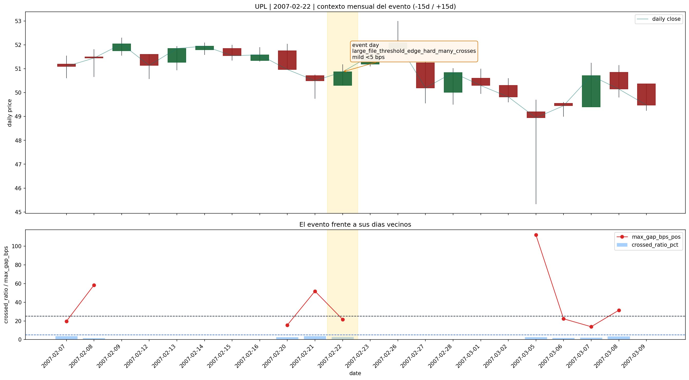

#### 00b Event Month Quotes Context
Esta imagen responde a la pregunta de recurrencia mensual dentro de `quotes`: el problema se concentra en el evento o reaparece en varias sesiones. Arriba concatena sesiones con datos disponibles; abajo resume cobertura diaria, `crossed_ratio_pct` y `max_gap_bps_pos`. La decision que cambia es si el caso debe leerse como episodio puntual o como sintoma de una fase repetida de libro degradado. El error que evita es extrapolar desde un unico dia a todo el mes sin evidencia.

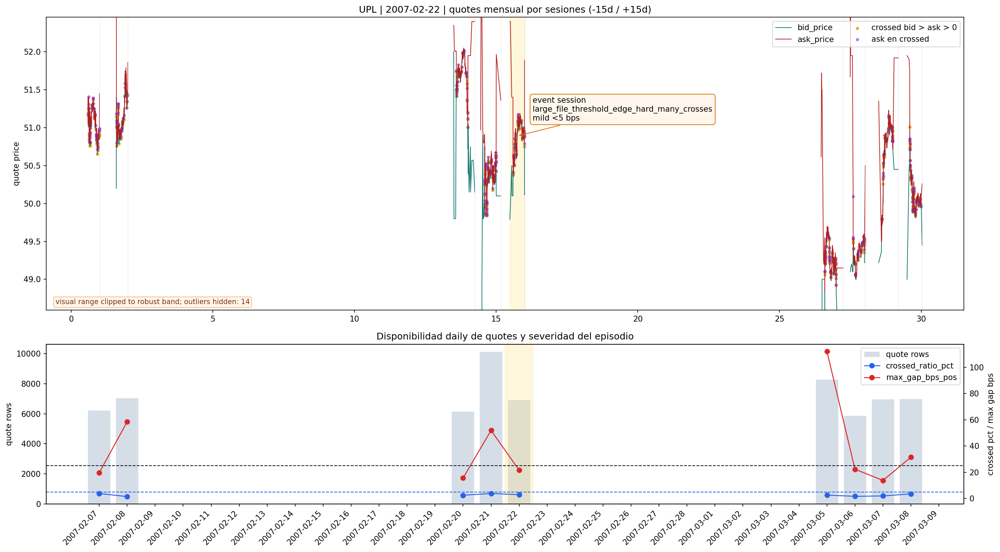

#### 01 Raw Window
Esta imagen responde a la primera pregunta decisiva del caso: el crossed observado es economicamente bastante fuerte para justificar un cambio de clase. Arriba ensena la geometria exacta del tramo conflictivo; abajo convierte esa geometria a bps y la enfrenta a los cortes `5 bps` y `25 bps`. El regimen dominante es `mild <5 bps`. La decision que cambia es pasar de anomalia interpretable a `review` o `bad`. El error que evita es decidir por apariencia visual sin medir el dano economico real del crossed. En terminos de pipeline, este panel decide si el problema afecta solo a la lectura forense o si invalida simulacion de ejecucion y microstructure features.

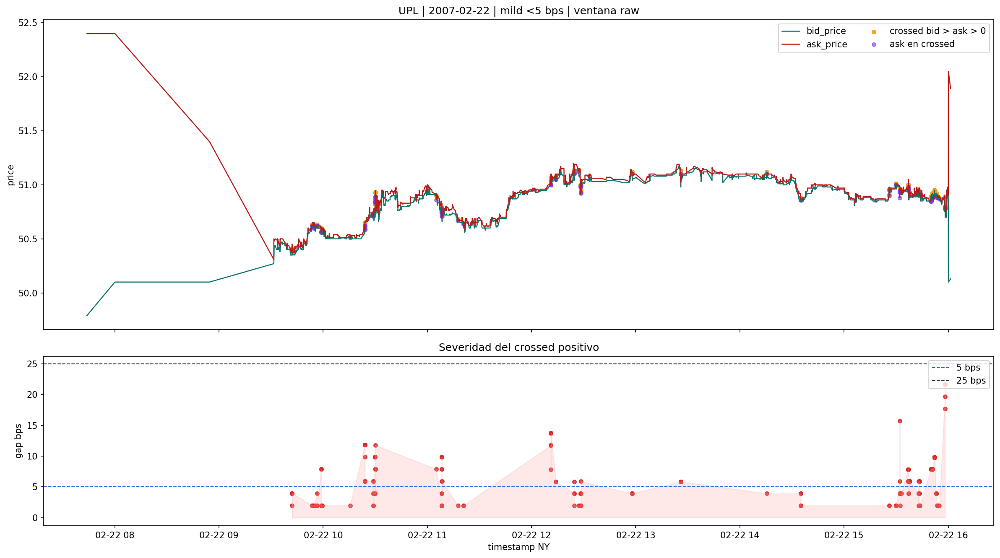

#### 02 Full Session Context
Esta imagen responde a la pregunta de extension intradiaria: el dano esta confinado a un bloque corto o contamina la sesion completa. Arriba se ve toda la sesion `04:00-20:00 NY`; abajo el `gap_bps` firmado. La decision que cambia es si el consumo debe penalizar solo un tramo o desechar el dia entero para uso operativo. El error que evita es tratar una cicatriz local como ruina total o, al reves, minimizar una degradacion distribuida a lo largo del dia. En ejecucion esto decide si la sesion puede seguir usandose con restricciones; en ML decide si las features intradiarias conservan significado economico.

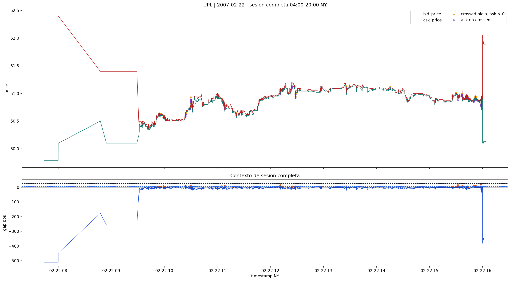

#### 03 Structure Diagnostics
Este panel responde a la pregunta de naturaleza del fallo: contradiccion economica genuina o mezcla con degeneracion estructural. Separa `ask=0` de `ask>0`, muestra la distribucion de `gap_bps` y resume patrones de integerizacion. La decision que cambia es como interpretar el dano: mercado localmente roto, artefacto de representacion o combinacion de ambos. El error que evita es sobrediagnosticar crossed reales cuando parte de la senal proviene de estructura degenerada del libro. Esta lectura afecta directamente a que el caso vaya a exclusion dura, a bandera contextual o a simple reconciliacion tecnica.

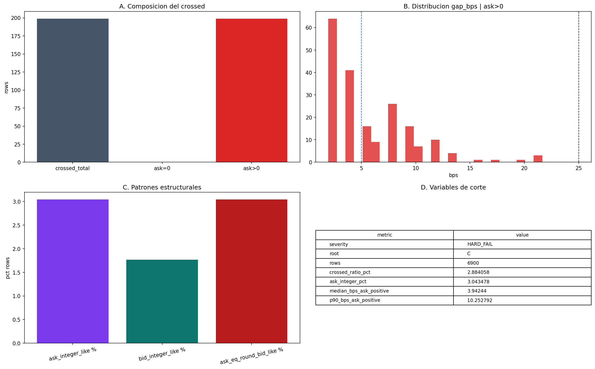

#### 04 Summary Card
Esta tarjeta responde a la pregunta de auditabilidad: cuales son exactamente las variables que sostienen la conclusion. Reune `severity`, `root`, `crossed_ratio_pct`, `ask_integer_pct`, `median_bps_ask_positive` y `p90_bps_ask_positive`. La decision que cambia es pasar de impresion visual a regla verificable. El error que evita es que dos inspectores lleguen a conclusiones distintas mirando la misma imagen sin una base numerica comun. Para gobernanza del proyecto, este panel es el que vuelve reproducible la decision para backtest, ML y auditoria.

---

### 19. NTGR 2006-11-13

company_name: `NETGEAR, Inc.`
primary_exchange: `NASDAQ` (`XNAS`)
market_locale: `stocks/us`
scope: `review`
ticker: `NTGR`
date: `2006-11-13`
taxonomy: `large_file_threshold_edge_hard_many_crosses`
positive_cross_bucket: `positive_cross_mild_lt5bps`
severity: `HARD_FAIL`
root: `D`
rows: `9477`
crossed_ratio_pct: `1.055186`
crossed_rows_raw: `100`
crossed_rows_ask_zero: `0`
crossed_rows_ask_positive: `100`
ask_integer_pct: `2.416376`
median_bps_ask_positive: `3.740415`
p90_bps_ask_positive: `11.121008`
file: `D:\quotes\NTGR\year=2006\month=11\day=13\quotes.parquet`

#### Analisis Forense
La conclusion correcta del caso es que ya existe contradiccion economica real dentro del libro, pero aun no con fuerza suficiente para justificar exclusion dura sin contexto adicional. La taxonomy historica es `large_file_threshold_edge_hard_many_crosses` y el regimen positivo dominante es `mild <5 bps`. Esto importa porque la taxonomy no solo clasifica: resume que tipo de anomalia se esta viendo y que clase de decision contractual puede defenderse despues. La taxonomy `large_file_threshold_edge_hard_many_crosses` implica un libro grande con muchas contradicciones, pero cerca del borde decisional. La dificultad analitica esta en decidir si el volumen de crossed es ruido absorbible o evidencia de degradacion suficientemente seria. El regimen `mild <5 bps` significa que existe contradiccion economica positiva, pero aun en una banda donde un uso prudente puede seguir siendo defendible si la persistencia y la estructura no agravan el caso. En terminos observables, el file tiene `crossed_ratio_pct=1.055186` con `crossed_rows_ask_positive=100` y `crossed_rows_ask_zero=0`. La severidad economica del crossed ask>0 se resume en `median_bps_ask_positive=3.740415` y `p90_bps_ask_positive=11.121008`. Estos dos numeros convierten una forma visual rara en una conclusion operativa sobre si el libro sigue representando o no un mercado negociable. La decision que cambia es pasar de libro sano a libro util solo bajo cautela. `review` significa: no usar como si fuera ejecucion limpia, conservar para analisis contextual y sensibilidad. El error que evita es tratar como normal un episodio que ya contiene contradiccion economica real y contaminar simulaciones de ejecucion o validaciones demasiado optimistas. El patron estructural muestra `ask_integer_pct=2.416376`. Este numero obliga a separar dos explicaciones rivales: contradiccion economica genuina del libro o mezcla con degeneracion estructural / integerizacion. Toda la composicion crossed cae en `ask>0`. Eso endurece la lectura economica del caso: el dano no depende de ceros mecanicos, sino de contradiccion positiva dentro de precios aparentemente vivos. Como `ask_integer_pct` es bajo, la hipotesis de simple degeneracion mecanica pierde fuerza. Eso endurece la interpretacion: el crossed se parece mas a contradiccion economica genuina y menos a artefacto. Existe ademas una imagen historica de certificacion asociada. Su papel es poner el episodio en un marco causal mas amplio: halt, explained, not strongly explained o patron conocido. La regla que protege al proyecto es esta: el contexto externo se usa para explicar por que aparece el episodio, no para absolverlo. El error que evita es degradar el criterio de calidad del libro porque exista una historia plausible alrededor del caso.

#### 00 Event Month Context
Esta imagen responde a la pregunta de persistencia temporal: estamos ante un accidente local o ante una fase mas amplia de inestabilidad. Arriba coloca el evento en la serie `daily` real del mes; abajo compara `crossed_ratio_pct` y `max_gap_bps_pos` del dia contra sus vecinos. La decision que cambia es el peso estructural que se le concede al caso. El error que evita es juzgar igual un shock aislado y una degradacion repetida del libro.

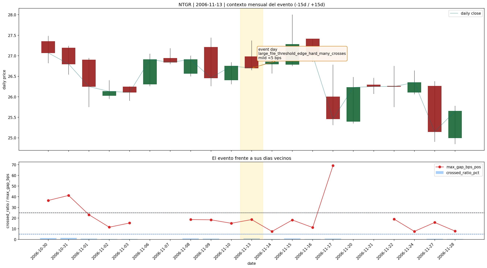

#### 00b Event Month Quotes Context
Esta imagen responde a la pregunta de recurrencia mensual dentro de `quotes`: el problema se concentra en el evento o reaparece en varias sesiones. Arriba concatena sesiones con datos disponibles; abajo resume cobertura diaria, `crossed_ratio_pct` y `max_gap_bps_pos`. La decision que cambia es si el caso debe leerse como episodio puntual o como sintoma de una fase repetida de libro degradado. El error que evita es extrapolar desde un unico dia a todo el mes sin evidencia.

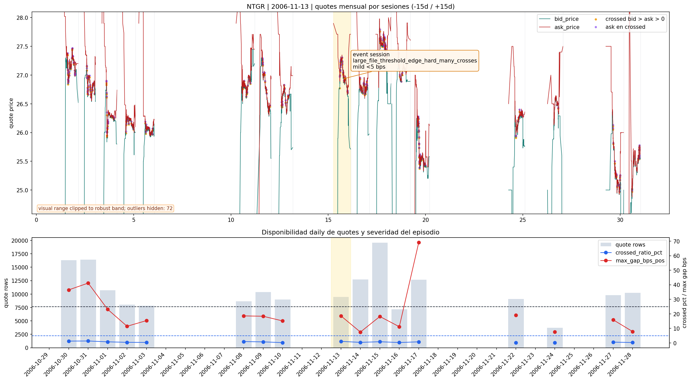

#### 01 Raw Window
Esta imagen responde a la primera pregunta decisiva del caso: el crossed observado es economicamente bastante fuerte para justificar un cambio de clase. Arriba ensena la geometria exacta del tramo conflictivo; abajo convierte esa geometria a bps y la enfrenta a los cortes `5 bps` y `25 bps`. El regimen dominante es `mild <5 bps`. La decision que cambia es pasar de anomalia interpretable a `review` o `bad`. El error que evita es decidir por apariencia visual sin medir el dano economico real del crossed. En terminos de pipeline, este panel decide si el problema afecta solo a la lectura forense o si invalida simulacion de ejecucion y microstructure features.

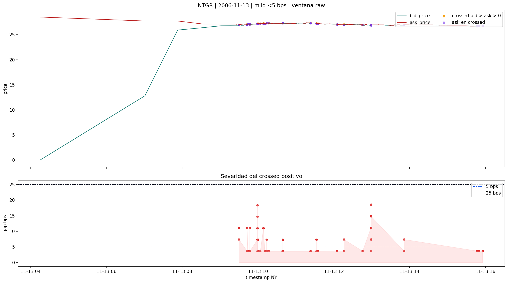

#### 02 Full Session Context
Esta imagen responde a la pregunta de extension intradiaria: el dano esta confinado a un bloque corto o contamina la sesion completa. Arriba se ve toda la sesion `04:00-20:00 NY`; abajo el `gap_bps` firmado. La decision que cambia es si el consumo debe penalizar solo un tramo o desechar el dia entero para uso operativo. El error que evita es tratar una cicatriz local como ruina total o, al reves, minimizar una degradacion distribuida a lo largo del dia. En ejecucion esto decide si la sesion puede seguir usandose con restricciones; en ML decide si las features intradiarias conservan significado economico.

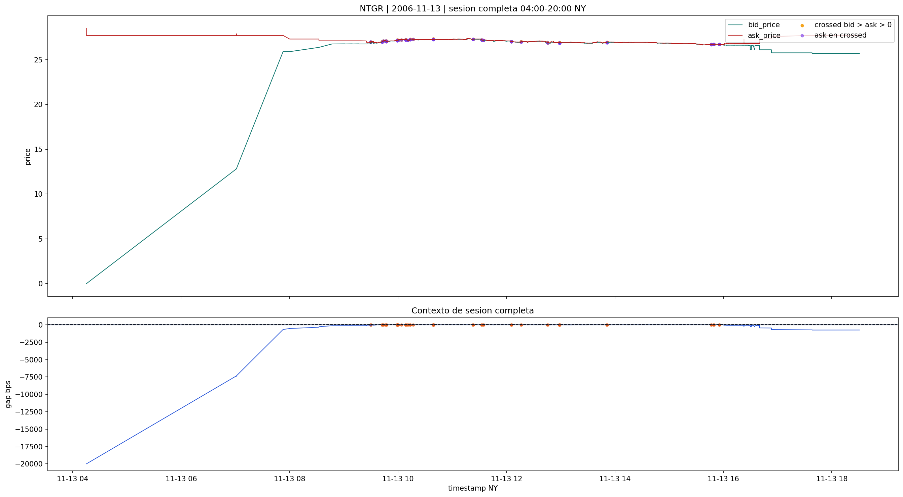

#### 03 Structure Diagnostics
Este panel responde a la pregunta de naturaleza del fallo: contradiccion economica genuina o mezcla con degeneracion estructural. Separa `ask=0` de `ask>0`, muestra la distribucion de `gap_bps` y resume patrones de integerizacion. La decision que cambia es como interpretar el dano: mercado localmente roto, artefacto de representacion o combinacion de ambos. El error que evita es sobrediagnosticar crossed reales cuando parte de la senal proviene de estructura degenerada del libro. Esta lectura afecta directamente a que el caso vaya a exclusion dura, a bandera contextual o a simple reconciliacion tecnica.

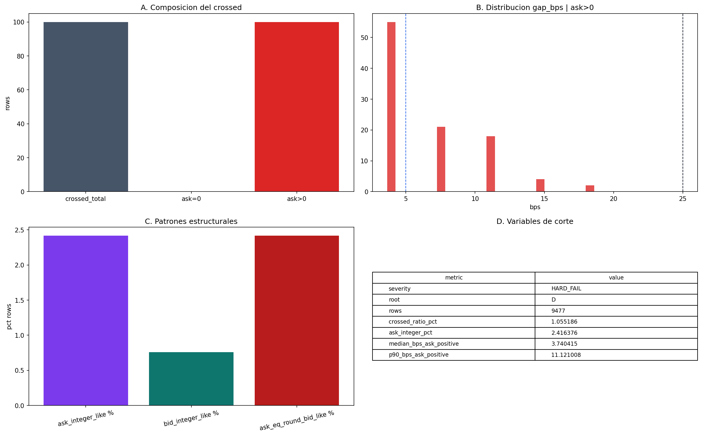

#### 04 Summary Card
Esta tarjeta responde a la pregunta de auditabilidad: cuales son exactamente las variables que sostienen la conclusion. Reune `severity`, `root`, `crossed_ratio_pct`, `ask_integer_pct`, `median_bps_ask_positive` y `p90_bps_ask_positive`. La decision que cambia es pasar de impresion visual a regla verificable. El error que evita es que dos inspectores lleguen a conclusiones distintas mirando la misma imagen sin una base numerica comun. Para gobernanza del proyecto, este panel es el que vuelve reproducible la decision para backtest, ML y auditoria.

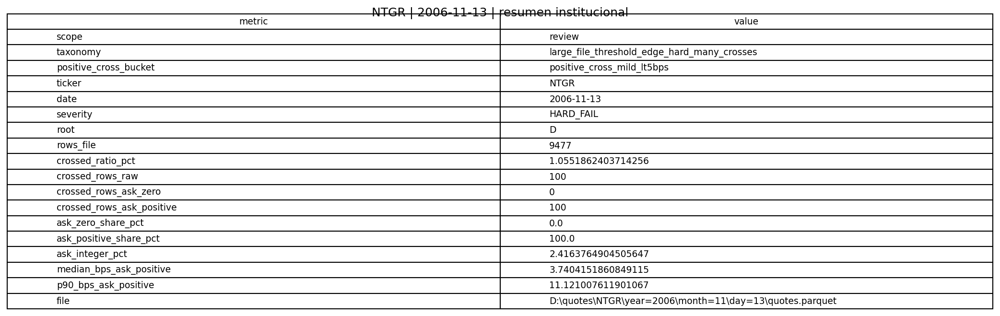

---

### 20. PD 2006-05-26

company_name: `PagerDuty, Inc.`
primary_exchange: `NYSE` (`XNYS`)
market_locale: `stocks/us`
scope: `review`
ticker: `PD`
date: `2006-05-26`
taxonomy: `large_file_threshold_edge_hard_many_crosses`
positive_cross_bucket: `positive_cross_mild_lt5bps`
severity: `HARD_FAIL`
root: `C`
rows: `32824`
crossed_ratio_pct: `2.946015`
crossed_rows_raw: `967`
crossed_rows_ask_zero: `0`
crossed_rows_ask_positive: `967`
ask_integer_pct: `1.084572`
median_bps_ask_positive: `2.291738`
p90_bps_ask_positive: `7.006563`
file: `C:\TSIS_Data\data\quotes\PD\year=2006\month=05\day=26\quotes.parquet`

#### Analisis Forense
La conclusion correcta del caso es que ya existe contradiccion economica real dentro del libro, pero aun no con fuerza suficiente para justificar exclusion dura sin contexto adicional. La taxonomy historica es `large_file_threshold_edge_hard_many_crosses` y el regimen positivo dominante es `mild <5 bps`. Esto importa porque la taxonomy no solo clasifica: resume que tipo de anomalia se esta viendo y que clase de decision contractual puede defenderse despues. La taxonomy `large_file_threshold_edge_hard_many_crosses` implica un libro grande con muchas contradicciones, pero cerca del borde decisional. La dificultad analitica esta en decidir si el volumen de crossed es ruido absorbible o evidencia de degradacion suficientemente seria. El regimen `mild <5 bps` significa que existe contradiccion economica positiva, pero aun en una banda donde un uso prudente puede seguir siendo defendible si la persistencia y la estructura no agravan el caso. En terminos observables, el file tiene `crossed_ratio_pct=2.946015` con `crossed_rows_ask_positive=967` y `crossed_rows_ask_zero=0`. La severidad economica del crossed ask>0 se resume en `median_bps_ask_positive=2.291738` y `p90_bps_ask_positive=7.006563`. Estos dos numeros convierten una forma visual rara en una conclusion operativa sobre si el libro sigue representando o no un mercado negociable. La decision que cambia es pasar de libro sano a libro util solo bajo cautela. `review` significa: no usar como si fuera ejecucion limpia, conservar para analisis contextual y sensibilidad. El error que evita es tratar como normal un episodio que ya contiene contradiccion economica real y contaminar simulaciones de ejecucion o validaciones demasiado optimistas. El patron estructural muestra `ask_integer_pct=1.084572`. Este numero obliga a separar dos explicaciones rivales: contradiccion economica genuina del libro o mezcla con degeneracion estructural / integerizacion. Toda la composicion crossed cae en `ask>0`. Eso endurece la lectura economica del caso: el dano no depende de ceros mecanicos, sino de contradiccion positiva dentro de precios aparentemente vivos. Como `ask_integer_pct` es bajo, la hipotesis de simple degeneracion mecanica pierde fuerza. Eso endurece la interpretacion: el crossed se parece mas a contradiccion economica genuina y menos a artefacto. En la capa de semantica de precio del evento aparecen `daily raw close=88.2600`, `quote mid raw=87.1750`, `quote mid split_normalized=87.1750`, `daily adjusted_proxy=87.7306`. Ademas hay `post_event_dividend_sum=0.6000`. La implicacion metodologica es crucial: una discrepancia entre `quotes`, `daily` y una plataforma externa no puede leerse automaticamente como fallo del dataset. Puede ser semantica de precio distinta. El error que evita esta capa es mezclar raw, split-normalized y adjusted dentro del mismo pipeline, rompiendo auditoria, benchmarking y labels. Para pipelines, esto empuja a conservar el caso fuera de ejecucion limpia, pero todavia puede mantenerse en investigacion contextual y en analisis de sensibilidad donde interese entender fronteras de tolerancia. Existe ademas una imagen historica de certificacion asociada. Su papel es poner el episodio en un marco causal mas amplio: halt, explained, not strongly explained o patron conocido. La regla que protege al proyecto es esta: el contexto externo se usa para explicar por que aparece el episodio, no para absolverlo. El error que evita es degradar el criterio de calidad del libro porque exista una historia plausible alrededor del caso.

#### 00 Event Month Context
Esta imagen responde a la pregunta de persistencia temporal: estamos ante un accidente local o ante una fase mas amplia de inestabilidad. Arriba coloca el evento en la serie `daily` real del mes; abajo compara `crossed_ratio_pct` y `max_gap_bps_pos` del dia contra sus vecinos. La decision que cambia es el peso estructural que se le concede al caso. El error que evita es juzgar igual un shock aislado y una degradacion repetida del libro.

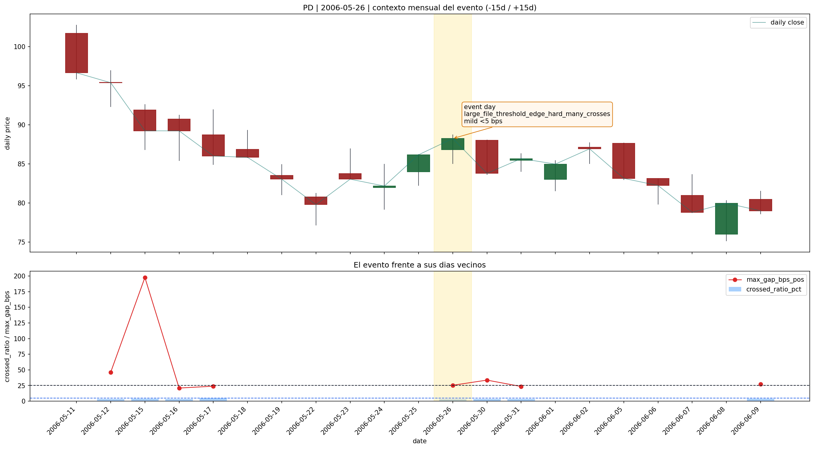

#### 00a Adjusted Proxy Contrast
Esta imagen responde a la pregunta de reconciliacion semantica: la discrepancia de precios viene de datos rotos o de vistas de precio distintas. Compara `daily raw`, `daily adjusted_proxy`, `quote mid raw` y `quote mid split_normalized`, y debajo ensena la cadena de dividendos y splits que produce la diferencia. La decision que cambia es si el inspector debe abrir una incidencia de calidad o cerrar el caso como diferencia legitima de semantica. El error que evita es mezclar series raw y adjusted como si fueran equivalentes. En pipelines reales, esto protege benchmarking, labels diarios y reconciliacion externa frente a falsas alarmas de precio.

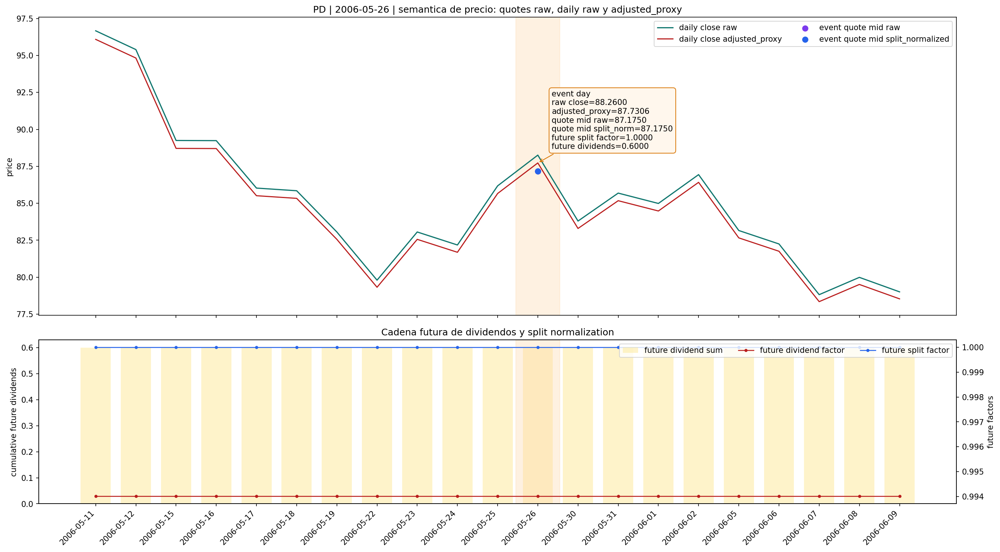

#### 00b Event Month Quotes Context
Esta imagen responde a la pregunta de recurrencia mensual dentro de `quotes`: el problema se concentra en el evento o reaparece en varias sesiones. Arriba concatena sesiones con datos disponibles; abajo resume cobertura diaria, `crossed_ratio_pct` y `max_gap_bps_pos`. La decision que cambia es si el caso debe leerse como episodio puntual o como sintoma de una fase repetida de libro degradado. El error que evita es extrapolar desde un unico dia a todo el mes sin evidencia.

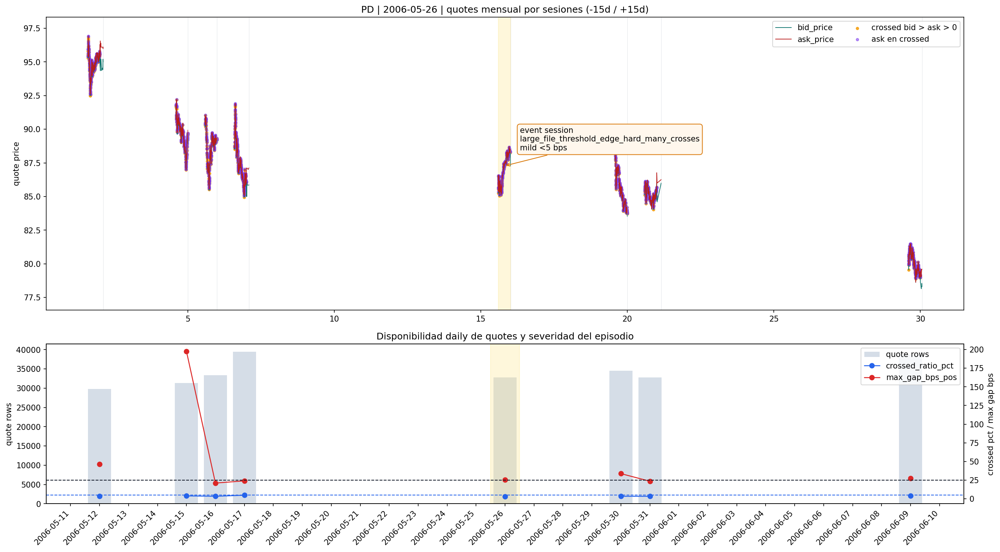

#### 01 Raw Window
Esta imagen responde a la primera pregunta decisiva del caso: el crossed observado es economicamente bastante fuerte para justificar un cambio de clase. Arriba ensena la geometria exacta del tramo conflictivo; abajo convierte esa geometria a bps y la enfrenta a los cortes `5 bps` y `25 bps`. El regimen dominante es `mild <5 bps`. La decision que cambia es pasar de anomalia interpretable a `review` o `bad`. El error que evita es decidir por apariencia visual sin medir el dano economico real del crossed. En terminos de pipeline, este panel decide si el problema afecta solo a la lectura forense o si invalida simulacion de ejecucion y microstructure features.

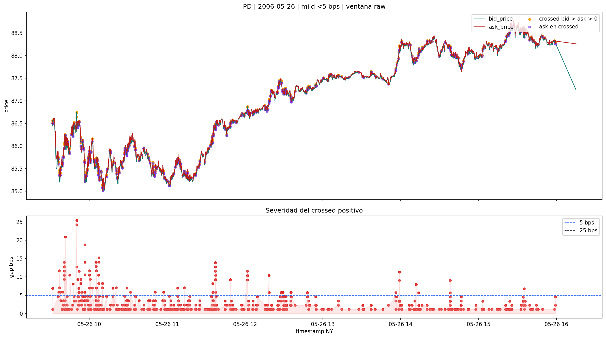

#### 02 Full Session Context
Esta imagen responde a la pregunta de extension intradiaria: el dano esta confinado a un bloque corto o contamina la sesion completa. Arriba se ve toda la sesion `04:00-20:00 NY`; abajo el `gap_bps` firmado. La decision que cambia es si el consumo debe penalizar solo un tramo o desechar el dia entero para uso operativo. El error que evita es tratar una cicatriz local como ruina total o, al reves, minimizar una degradacion distribuida a lo largo del dia. En ejecucion esto decide si la sesion puede seguir usandose con restricciones; en ML decide si las features intradiarias conservan significado economico.

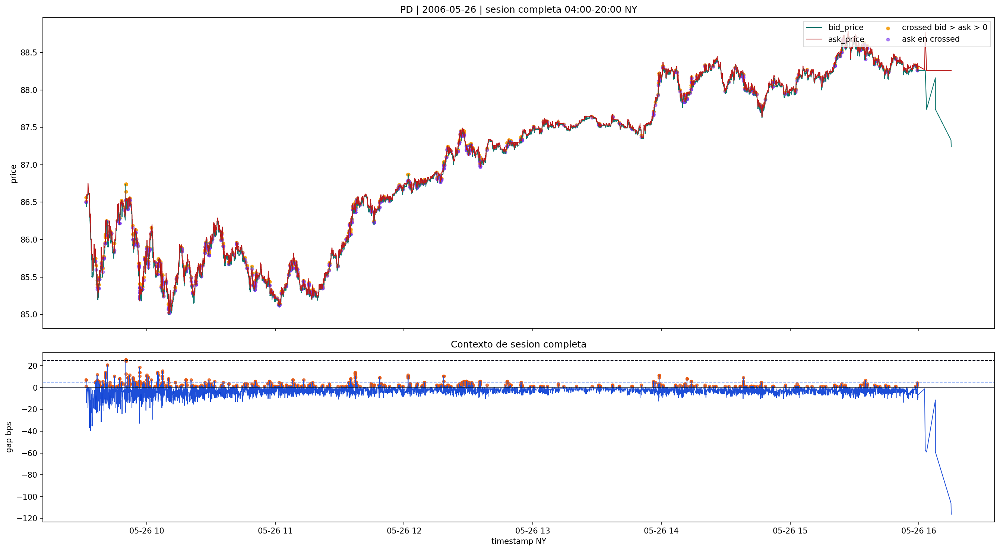

#### 03 Structure Diagnostics
Este panel responde a la pregunta de naturaleza del fallo: contradiccion economica genuina o mezcla con degeneracion estructural. Separa `ask=0` de `ask>0`, muestra la distribucion de `gap_bps` y resume patrones de integerizacion. La decision que cambia es como interpretar el dano: mercado localmente roto, artefacto de representacion o combinacion de ambos. El error que evita es sobrediagnosticar crossed reales cuando parte de la senal proviene de estructura degenerada del libro. Esta lectura afecta directamente a que el caso vaya a exclusion dura, a bandera contextual o a simple reconciliacion tecnica.

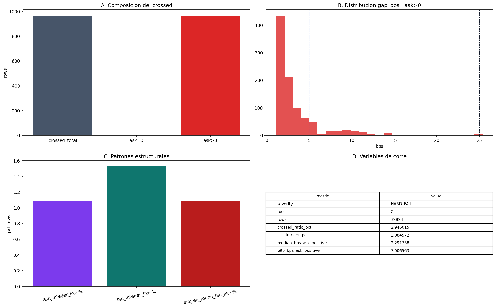

#### 04 Summary Card
Esta tarjeta responde a la pregunta de auditabilidad: cuales son exactamente las variables que sostienen la conclusion. Reune `severity`, `root`, `crossed_ratio_pct`, `ask_integer_pct`, `median_bps_ask_positive` y `p90_bps_ask_positive`. La decision que cambia es pasar de impresion visual a regla verificable. El error que evita es que dos inspectores lleguen a conclusiones distintas mirando la misma imagen sin una base numerica comun. Para gobernanza del proyecto, este panel es el que vuelve reproducible la decision para backtest, ML y auditoria.

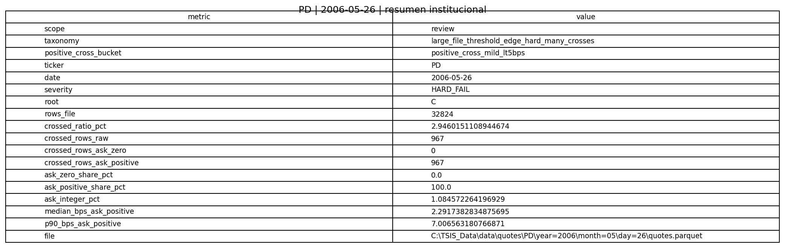

---

### 21. MON 2005-01-20

company_name: `Monument Circle Acquisition Corp. Class A Common Stock`
primary_exchange: `NASDAQ` (`XNAS`)
market_locale: `stocks/us`
scope: `review`
ticker: `MON`
date: `2005-01-20`
taxonomy: `large_file_threshold_edge_hard_many_crosses`
positive_cross_bucket: `positive_cross_mild_lt5bps`
severity: `HARD_FAIL`
root: `D`
rows: `5850`
crossed_ratio_pct: `1.213675`
crossed_rows_raw: `71`
crossed_rows_ask_zero: `3`
crossed_rows_ask_positive: `68`
ask_integer_pct: `0.290598`
median_bps_ask_positive: `1.714825`
p90_bps_ask_positive: `12.020263`
file: `D:\quotes\MON\year=2005\month=01\day=20\quotes.parquet`

#### Analisis Forense
La conclusion correcta del caso es que ya existe contradiccion economica real dentro del libro, pero aun no con fuerza suficiente para justificar exclusion dura sin contexto adicional. La taxonomy historica es `large_file_threshold_edge_hard_many_crosses` y el regimen positivo dominante es `mild <5 bps`. Esto importa porque la taxonomy no solo clasifica: resume que tipo de anomalia se esta viendo y que clase de decision contractual puede defenderse despues. La taxonomy `large_file_threshold_edge_hard_many_crosses` implica un libro grande con muchas contradicciones, pero cerca del borde decisional. La dificultad analitica esta en decidir si el volumen de crossed es ruido absorbible o evidencia de degradacion suficientemente seria. El regimen `mild <5 bps` significa que existe contradiccion economica positiva, pero aun en una banda donde un uso prudente puede seguir siendo defendible si la persistencia y la estructura no agravan el caso. En terminos observables, el file tiene `crossed_ratio_pct=1.213675` con `crossed_rows_ask_positive=68` y `crossed_rows_ask_zero=3`. La severidad economica del crossed ask>0 se resume en `median_bps_ask_positive=1.714825` y `p90_bps_ask_positive=12.020263`. Estos dos numeros convierten una forma visual rara en una conclusion operativa sobre si el libro sigue representando o no un mercado negociable. La decision que cambia es pasar de libro sano a libro util solo bajo cautela. `review` significa: no usar como si fuera ejecucion limpia, conservar para analisis contextual y sensibilidad. El error que evita es tratar como normal un episodio que ya contiene contradiccion economica real y contaminar simulaciones de ejecucion o validaciones demasiado optimistas. El patron estructural muestra `ask_integer_pct=0.290598`. Este numero obliga a separar dos explicaciones rivales: contradiccion economica genuina del libro o mezcla con degeneracion estructural / integerizacion. La mayor parte del crossed vive en `ask>0`, de modo que el corazon del problema sigue siendo economico. La parte `ask=0`, si existe, acompana pero no explica por si sola la anomalia. Como `ask_integer_pct` es bajo, la hipotesis de simple degeneracion mecanica pierde fuerza. Eso endurece la interpretacion: el crossed se parece mas a contradiccion economica genuina y menos a artefacto. En la capa de semantica de precio del evento aparecen `daily raw close=29.2000`, `quote mid raw=58.4550`, `quote mid split_normalized=29.2275`, `daily adjusted_proxy=28.9319`. La reconciliacion incluye `future_split_factor=2.0000`. Ademas hay `post_event_dividend_sum=17.8600`. La implicacion metodologica es crucial: una discrepancia entre `quotes`, `daily` y una plataforma externa no puede leerse automaticamente como fallo del dataset. Puede ser semantica de precio distinta. El error que evita esta capa es mezclar raw, split-normalized y adjusted dentro del mismo pipeline, rompiendo auditoria, benchmarking y labels. Para pipelines, esto empuja a conservar el caso fuera de ejecucion limpia, pero todavia puede mantenerse en investigacion contextual y en analisis de sensibilidad donde interese entender fronteras de tolerancia. Existe ademas una imagen historica de certificacion asociada. Su papel es poner el episodio en un marco causal mas amplio: halt, explained, not strongly explained o patron conocido. La regla que protege al proyecto es esta: el contexto externo se usa para explicar por que aparece el episodio, no para absolverlo. El error que evita es degradar el criterio de calidad del libro porque exista una historia plausible alrededor del caso.

#### 00 Event Month Context
Esta imagen responde a la pregunta de persistencia temporal: estamos ante un accidente local o ante una fase mas amplia de inestabilidad. Arriba coloca el evento en la serie `daily` real del mes; abajo compara `crossed_ratio_pct` y `max_gap_bps_pos` del dia contra sus vecinos. La decision que cambia es el peso estructural que se le concede al caso. El error que evita es juzgar igual un shock aislado y una degradacion repetida del libro.

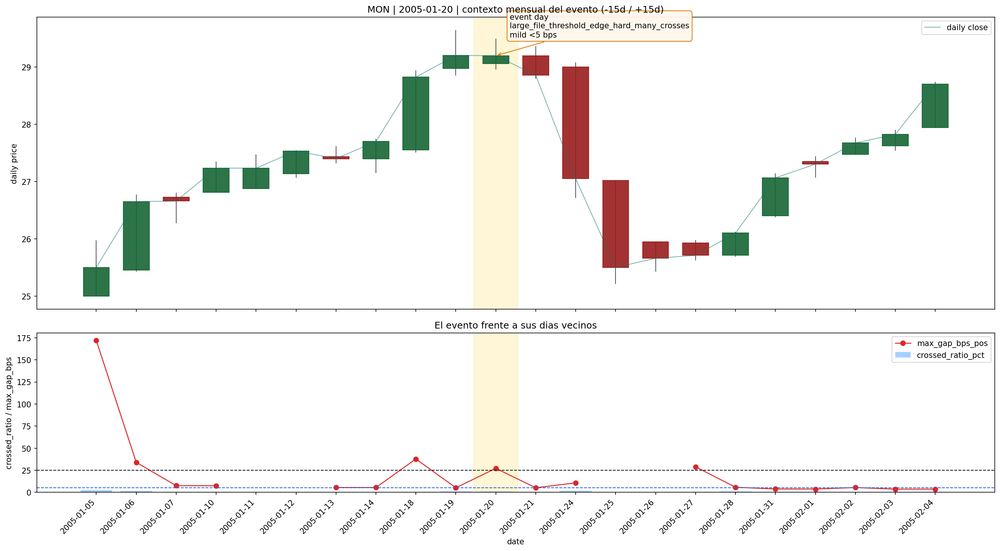

#### 00a Adjusted Proxy Contrast
Esta imagen responde a la pregunta de reconciliacion semantica: la discrepancia de precios viene de datos rotos o de vistas de precio distintas. Compara `daily raw`, `daily adjusted_proxy`, `quote mid raw` y `quote mid split_normalized`, y debajo ensena la cadena de dividendos y splits que produce la diferencia. La decision que cambia es si el inspector debe abrir una incidencia de calidad o cerrar el caso como diferencia legitima de semantica. El error que evita es mezclar series raw y adjusted como si fueran equivalentes. En pipelines reales, esto protege benchmarking, labels diarios y reconciliacion externa frente a falsas alarmas de precio.

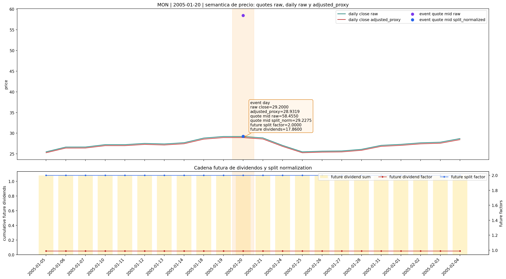

#### 00b Event Month Quotes Context
Esta imagen responde a la pregunta de recurrencia mensual dentro de `quotes`: el problema se concentra en el evento o reaparece en varias sesiones. Arriba concatena sesiones con datos disponibles; abajo resume cobertura diaria, `crossed_ratio_pct` y `max_gap_bps_pos`. La decision que cambia es si el caso debe leerse como episodio puntual o como sintoma de una fase repetida de libro degradado. El error que evita es extrapolar desde un unico dia a todo el mes sin evidencia.

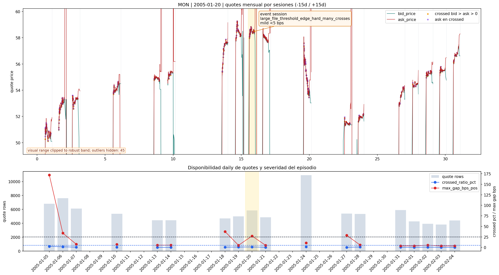

#### 01 Raw Window
Esta imagen responde a la primera pregunta decisiva del caso: el crossed observado es economicamente bastante fuerte para justificar un cambio de clase. Arriba ensena la geometria exacta del tramo conflictivo; abajo convierte esa geometria a bps y la enfrenta a los cortes `5 bps` y `25 bps`. El regimen dominante es `mild <5 bps`. La decision que cambia es pasar de anomalia interpretable a `review` o `bad`. El error que evita es decidir por apariencia visual sin medir el dano economico real del crossed. En terminos de pipeline, este panel decide si el problema afecta solo a la lectura forense o si invalida simulacion de ejecucion y microstructure features.

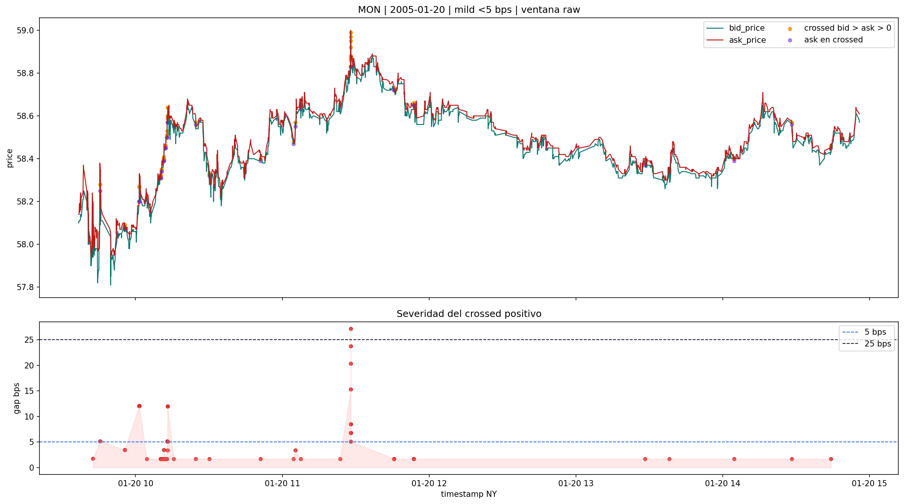

#### 02 Full Session Context
Esta imagen responde a la pregunta de extension intradiaria: el dano esta confinado a un bloque corto o contamina la sesion completa. Arriba se ve toda la sesion `04:00-20:00 NY`; abajo el `gap_bps` firmado. La decision que cambia es si el consumo debe penalizar solo un tramo o desechar el dia entero para uso operativo. El error que evita es tratar una cicatriz local como ruina total o, al reves, minimizar una degradacion distribuida a lo largo del dia. En ejecucion esto decide si la sesion puede seguir usandose con restricciones; en ML decide si las features intradiarias conservan significado economico.

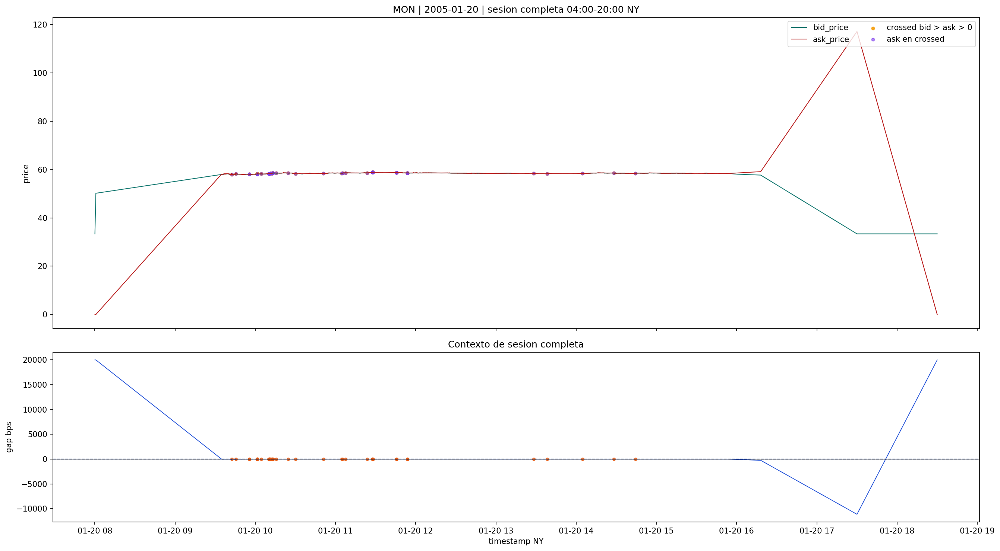

#### 03 Structure Diagnostics
Este panel responde a la pregunta de naturaleza del fallo: contradiccion economica genuina o mezcla con degeneracion estructural. Separa `ask=0` de `ask>0`, muestra la distribucion de `gap_bps` y resume patrones de integerizacion. La decision que cambia es como interpretar el dano: mercado localmente roto, artefacto de representacion o combinacion de ambos. El error que evita es sobrediagnosticar crossed reales cuando parte de la senal proviene de estructura degenerada del libro. Esta lectura afecta directamente a que el caso vaya a exclusion dura, a bandera contextual o a simple reconciliacion tecnica.

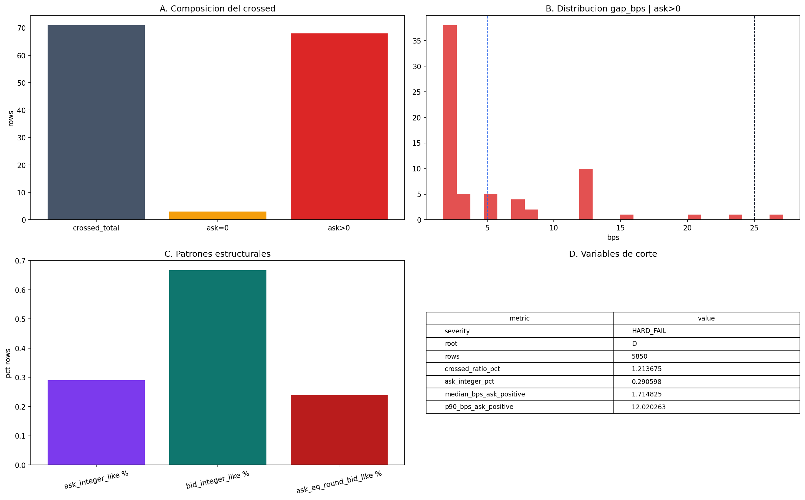

#### 04 Summary Card
Esta tarjeta responde a la pregunta de auditabilidad: cuales son exactamente las variables que sostienen la conclusion. Reune `severity`, `root`, `crossed_ratio_pct`, `ask_integer_pct`, `median_bps_ask_positive` y `p90_bps_ask_positive`. La decision que cambia es pasar de impresion visual a regla verificable. El error que evita es que dos inspectores lleguen a conclusiones distintas mirando la misma imagen sin una base numerica comun. Para gobernanza del proyecto, este panel es el que vuelve reproducible la decision para backtest, ML y auditoria.

---

### 22. UPL 2006-02-03

company_name: `ULTRA PETROLEUM CORP`
primary_exchange: `NYSE` (`XNYS`)
market_locale: `stocks/us`
scope: `review`
ticker: `UPL`
date: `2006-02-03`
taxonomy: `large_file_threshold_edge_hard_many_crosses`
positive_cross_bucket: `positive_cross_mild_lt5bps`
severity: `HARD_FAIL`
root: `D`
rows: `3234`
crossed_ratio_pct: `1.886209`
crossed_rows_raw: `61`
crossed_rows_ask_zero: `0`
crossed_rows_ask_positive: `61`
ask_integer_pct: `2.628324`
median_bps_ask_positive: `1.533625`
p90_bps_ask_positive: `6.146281`
file: `D:\quotes\UPL\year=2006\month=02\day=03\quotes.parquet`

#### Analisis Forense
La conclusion correcta del caso es que ya existe contradiccion economica real dentro del libro, pero aun no con fuerza suficiente para justificar exclusion dura sin contexto adicional. La taxonomy historica es `large_file_threshold_edge_hard_many_crosses` y el regimen positivo dominante es `mild <5 bps`. Esto importa porque la taxonomy no solo clasifica: resume que tipo de anomalia se esta viendo y que clase de decision contractual puede defenderse despues. La taxonomy `large_file_threshold_edge_hard_many_crosses` implica un libro grande con muchas contradicciones, pero cerca del borde decisional. La dificultad analitica esta en decidir si el volumen de crossed es ruido absorbible o evidencia de degradacion suficientemente seria. El regimen `mild <5 bps` significa que existe contradiccion economica positiva, pero aun en una banda donde un uso prudente puede seguir siendo defendible si la persistencia y la estructura no agravan el caso. En terminos observables, el file tiene `crossed_ratio_pct=1.886209` con `crossed_rows_ask_positive=61` y `crossed_rows_ask_zero=0`. La severidad economica del crossed ask>0 se resume en `median_bps_ask_positive=1.533625` y `p90_bps_ask_positive=6.146281`. Estos dos numeros convierten una forma visual rara en una conclusion operativa sobre si el libro sigue representando o no un mercado negociable. La decision que cambia es pasar de libro sano a libro util solo bajo cautela. `review` significa: no usar como si fuera ejecucion limpia, conservar para analisis contextual y sensibilidad. El error que evita es tratar como normal un episodio que ya contiene contradiccion economica real y contaminar simulaciones de ejecucion o validaciones demasiado optimistas. El patron estructural muestra `ask_integer_pct=2.628324`. Este numero obliga a separar dos explicaciones rivales: contradiccion economica genuina del libro o mezcla con degeneracion estructural / integerizacion. Toda la composicion crossed cae en `ask>0`. Eso endurece la lectura economica del caso: el dano no depende de ceros mecanicos, sino de contradiccion positiva dentro de precios aparentemente vivos. Como `ask_integer_pct` es bajo, la hipotesis de simple degeneracion mecanica pierde fuerza. Eso endurece la interpretacion: el crossed se parece mas a contradiccion economica genuina y menos a artefacto. Existe ademas una imagen historica de certificacion asociada. Su papel es poner el episodio en un marco causal mas amplio: halt, explained, not strongly explained o patron conocido. La regla que protege al proyecto es esta: el contexto externo se usa para explicar por que aparece el episodio, no para absolverlo. El error que evita es degradar el criterio de calidad del libro porque exista una historia plausible alrededor del caso.

#### 00 Event Month Context
Esta imagen responde a la pregunta de persistencia temporal: estamos ante un accidente local o ante una fase mas amplia de inestabilidad. Arriba coloca el evento en la serie `daily` real del mes; abajo compara `crossed_ratio_pct` y `max_gap_bps_pos` del dia contra sus vecinos. La decision que cambia es el peso estructural que se le concede al caso. El error que evita es juzgar igual un shock aislado y una degradacion repetida del libro.

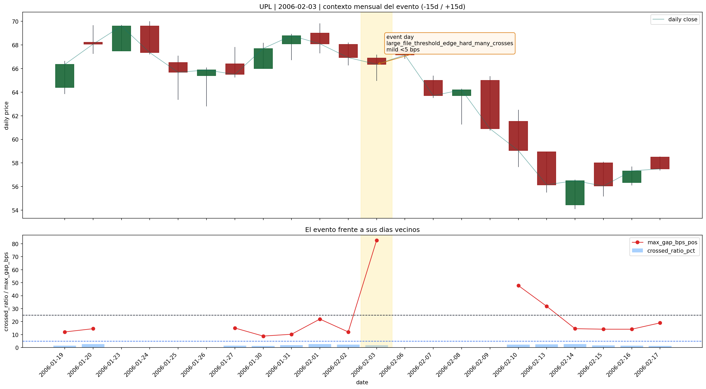

#### 00b Event Month Quotes Context
Esta imagen responde a la pregunta de recurrencia mensual dentro de `quotes`: el problema se concentra en el evento o reaparece en varias sesiones. Arriba concatena sesiones con datos disponibles; abajo resume cobertura diaria, `crossed_ratio_pct` y `max_gap_bps_pos`. La decision que cambia es si el caso debe leerse como episodio puntual o como sintoma de una fase repetida de libro degradado. El error que evita es extrapolar desde un unico dia a todo el mes sin evidencia.

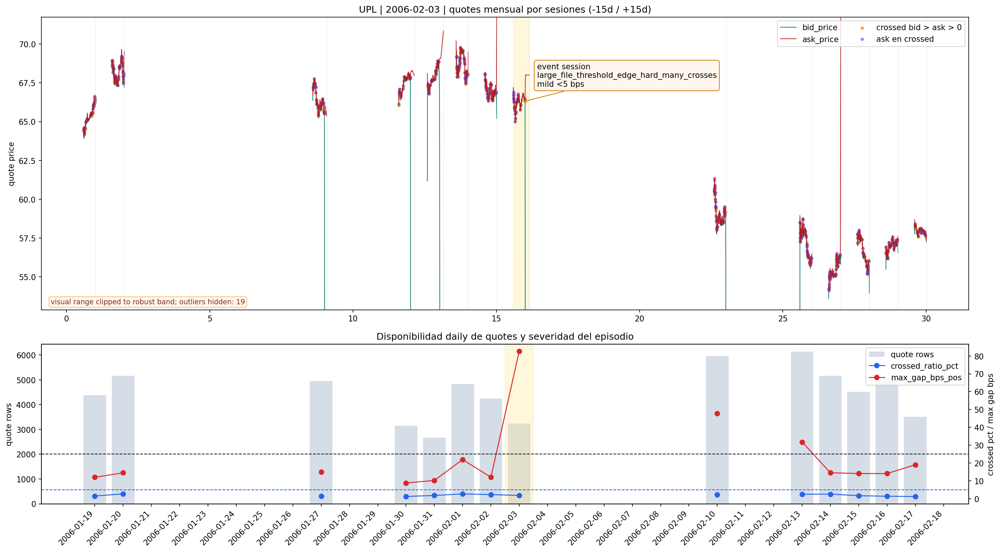

#### 01 Raw Window
Esta imagen responde a la primera pregunta decisiva del caso: el crossed observado es economicamente bastante fuerte para justificar un cambio de clase. Arriba ensena la geometria exacta del tramo conflictivo; abajo convierte esa geometria a bps y la enfrenta a los cortes `5 bps` y `25 bps`. El regimen dominante es `mild <5 bps`. La decision que cambia es pasar de anomalia interpretable a `review` o `bad`. El error que evita es decidir por apariencia visual sin medir el dano economico real del crossed. En terminos de pipeline, este panel decide si el problema afecta solo a la lectura forense o si invalida simulacion de ejecucion y microstructure features.

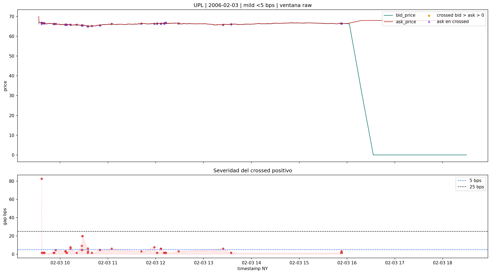

#### 02 Full Session Context
Esta imagen responde a la pregunta de extension intradiaria: el dano esta confinado a un bloque corto o contamina la sesion completa. Arriba se ve toda la sesion `04:00-20:00 NY`; abajo el `gap_bps` firmado. La decision que cambia es si el consumo debe penalizar solo un tramo o desechar el dia entero para uso operativo. El error que evita es tratar una cicatriz local como ruina total o, al reves, minimizar una degradacion distribuida a lo largo del dia. En ejecucion esto decide si la sesion puede seguir usandose con restricciones; en ML decide si las features intradiarias conservan significado economico.

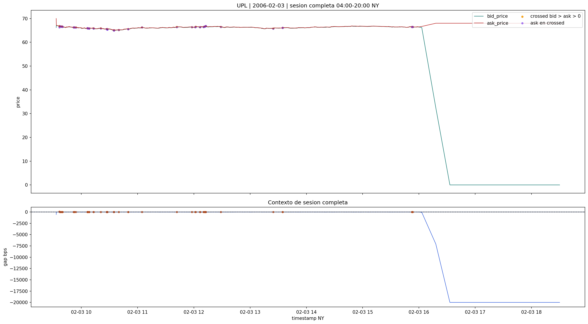

#### 03 Structure Diagnostics
Este panel responde a la pregunta de naturaleza del fallo: contradiccion economica genuina o mezcla con degeneracion estructural. Separa `ask=0` de `ask>0`, muestra la distribucion de `gap_bps` y resume patrones de integerizacion. La decision que cambia es como interpretar el dano: mercado localmente roto, artefacto de representacion o combinacion de ambos. El error que evita es sobrediagnosticar crossed reales cuando parte de la senal proviene de estructura degenerada del libro. Esta lectura afecta directamente a que el caso vaya a exclusion dura, a bandera contextual o a simple reconciliacion tecnica.

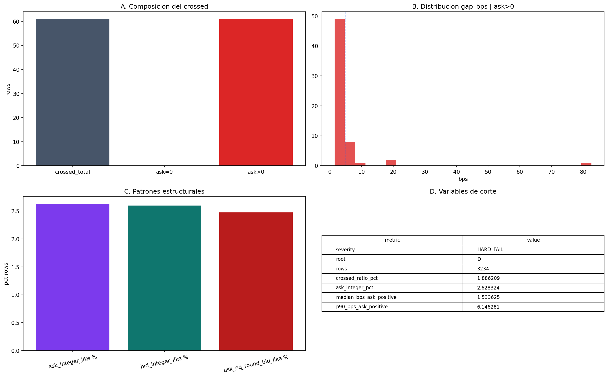

#### 04 Summary Card
Esta tarjeta responde a la pregunta de auditabilidad: cuales son exactamente las variables que sostienen la conclusion. Reune `severity`, `root`, `crossed_ratio_pct`, `ask_integer_pct`, `median_bps_ask_positive` y `p90_bps_ask_positive`. La decision que cambia es pasar de impresion visual a regla verificable. El error que evita es que dos inspectores lleguen a conclusiones distintas mirando la misma imagen sin una base numerica comun. Para gobernanza del proyecto, este panel es el que vuelve reproducible la decision para backtest, ML y auditoria.

---

### 23. MBI 2007-04-19

company_name: `MBIA Inc.`
primary_exchange: `NYSE` (`XNYS`)
market_locale: `stocks/us`
scope: `review`
ticker: `MBI`
date: `2007-04-19`
taxonomy: `large_file_threshold_edge_hard_many_crosses`
positive_cross_bucket: `positive_cross_mild_lt5bps`
severity: `HARD_FAIL`
root: `C`
rows: `18222`
crossed_ratio_pct: `0.982329`
crossed_rows_raw: `179`
crossed_rows_ask_zero: `0`
crossed_rows_ask_positive: `179`
ask_integer_pct: `2.700033`
median_bps_ask_positive: `1.476778`
p90_bps_ask_positive: `4.717953`
file: `C:\TSIS_Data\data\quotes\MBI\year=2007\month=04\day=19\quotes.parquet`

#### Analisis Forense
La conclusion correcta del caso es que ya existe contradiccion economica real dentro del libro, pero aun no con fuerza suficiente para justificar exclusion dura sin contexto adicional. La taxonomy historica es `large_file_threshold_edge_hard_many_crosses` y el regimen positivo dominante es `mild <5 bps`. Esto importa porque la taxonomy no solo clasifica: resume que tipo de anomalia se esta viendo y que clase de decision contractual puede defenderse despues. La taxonomy `large_file_threshold_edge_hard_many_crosses` implica un libro grande con muchas contradicciones, pero cerca del borde decisional. La dificultad analitica esta en decidir si el volumen de crossed es ruido absorbible o evidencia de degradacion suficientemente seria. El regimen `mild <5 bps` significa que existe contradiccion economica positiva, pero aun en una banda donde un uso prudente puede seguir siendo defendible si la persistencia y la estructura no agravan el caso. En terminos observables, el file tiene `crossed_ratio_pct=0.982329` con `crossed_rows_ask_positive=179` y `crossed_rows_ask_zero=0`. La severidad economica del crossed ask>0 se resume en `median_bps_ask_positive=1.476778` y `p90_bps_ask_positive=4.717953`. Estos dos numeros convierten una forma visual rara en una conclusion operativa sobre si el libro sigue representando o no un mercado negociable. La decision que cambia es pasar de libro sano a libro util solo bajo cautela. `review` significa: no usar como si fuera ejecucion limpia, conservar para analisis contextual y sensibilidad. El error que evita es tratar como normal un episodio que ya contiene contradiccion economica real y contaminar simulaciones de ejecucion o validaciones demasiado optimistas. El patron estructural muestra `ask_integer_pct=2.700033`. Este numero obliga a separar dos explicaciones rivales: contradiccion economica genuina del libro o mezcla con degeneracion estructural / integerizacion. Toda la composicion crossed cae en `ask>0`. Eso endurece la lectura economica del caso: el dano no depende de ceros mecanicos, sino de contradiccion positiva dentro de precios aparentemente vivos. Como `ask_integer_pct` es bajo, la hipotesis de simple degeneracion mecanica pierde fuerza. Eso endurece la interpretacion: el crossed se parece mas a contradiccion economica genuina y menos a artefacto. En la capa de semantica de precio del evento aparecen `daily raw close=67.8600`, `quote mid raw=68.0750`, `quote mid split_normalized=68.0750`, `daily adjusted_proxy=37.8404`. Ademas hay `post_event_dividend_sum=9.0200`. La implicacion metodologica es crucial: una discrepancia entre `quotes`, `daily` y una plataforma externa no puede leerse automaticamente como fallo del dataset. Puede ser semantica de precio distinta. El error que evita esta capa es mezclar raw, split-normalized y adjusted dentro del mismo pipeline, rompiendo auditoria, benchmarking y labels. Para pipelines, esto empuja a conservar el caso fuera de ejecucion limpia, pero todavia puede mantenerse en investigacion contextual y en analisis de sensibilidad donde interese entender fronteras de tolerancia. Existe ademas una imagen historica de certificacion asociada. Su papel es poner el episodio en un marco causal mas amplio: halt, explained, not strongly explained o patron conocido. La regla que protege al proyecto es esta: el contexto externo se usa para explicar por que aparece el episodio, no para absolverlo. El error que evita es degradar el criterio de calidad del libro porque exista una historia plausible alrededor del caso.

#### 00 Event Month Context
Esta imagen responde a la pregunta de persistencia temporal: estamos ante un accidente local o ante una fase mas amplia de inestabilidad. Arriba coloca el evento en la serie `daily` real del mes; abajo compara `crossed_ratio_pct` y `max_gap_bps_pos` del dia contra sus vecinos. La decision que cambia es el peso estructural que se le concede al caso. El error que evita es juzgar igual un shock aislado y una degradacion repetida del libro.

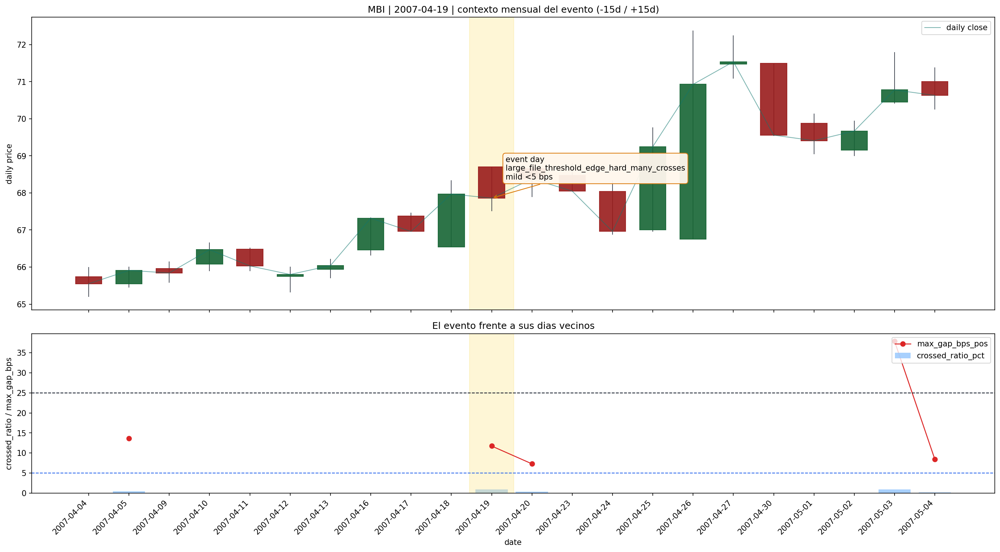

#### 00a Adjusted Proxy Contrast
Esta imagen responde a la pregunta de reconciliacion semantica: la discrepancia de precios viene de datos rotos o de vistas de precio distintas. Compara `daily raw`, `daily adjusted_proxy`, `quote mid raw` y `quote mid split_normalized`, y debajo ensena la cadena de dividendos y splits que produce la diferencia. La decision que cambia es si el inspector debe abrir una incidencia de calidad o cerrar el caso como diferencia legitima de semantica. El error que evita es mezclar series raw y adjusted como si fueran equivalentes. En pipelines reales, esto protege benchmarking, labels diarios y reconciliacion externa frente a falsas alarmas de precio.

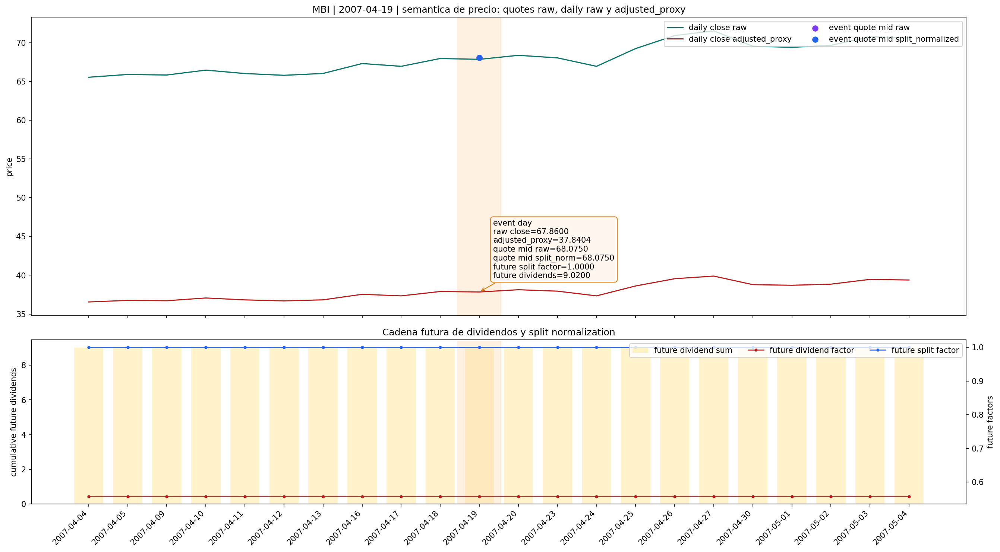

#### 00b Event Month Quotes Context
Esta imagen responde a la pregunta de recurrencia mensual dentro de `quotes`: el problema se concentra en el evento o reaparece en varias sesiones. Arriba concatena sesiones con datos disponibles; abajo resume cobertura diaria, `crossed_ratio_pct` y `max_gap_bps_pos`. La decision que cambia es si el caso debe leerse como episodio puntual o como sintoma de una fase repetida de libro degradado. El error que evita es extrapolar desde un unico dia a todo el mes sin evidencia.

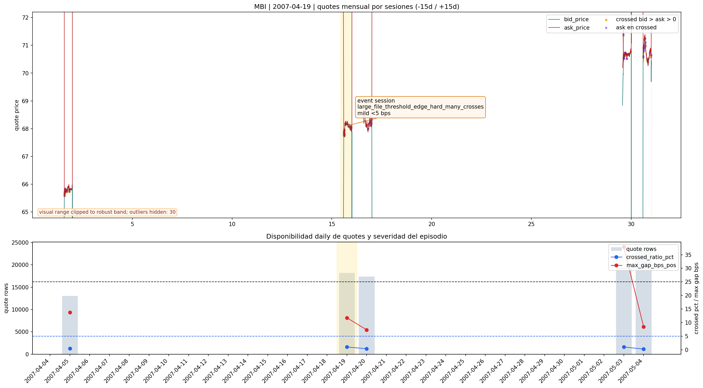

#### 01 Raw Window
Esta imagen responde a la primera pregunta decisiva del caso: el crossed observado es economicamente bastante fuerte para justificar un cambio de clase. Arriba ensena la geometria exacta del tramo conflictivo; abajo convierte esa geometria a bps y la enfrenta a los cortes `5 bps` y `25 bps`. El regimen dominante es `mild <5 bps`. La decision que cambia es pasar de anomalia interpretable a `review` o `bad`. El error que evita es decidir por apariencia visual sin medir el dano economico real del crossed. En terminos de pipeline, este panel decide si el problema afecta solo a la lectura forense o si invalida simulacion de ejecucion y microstructure features.

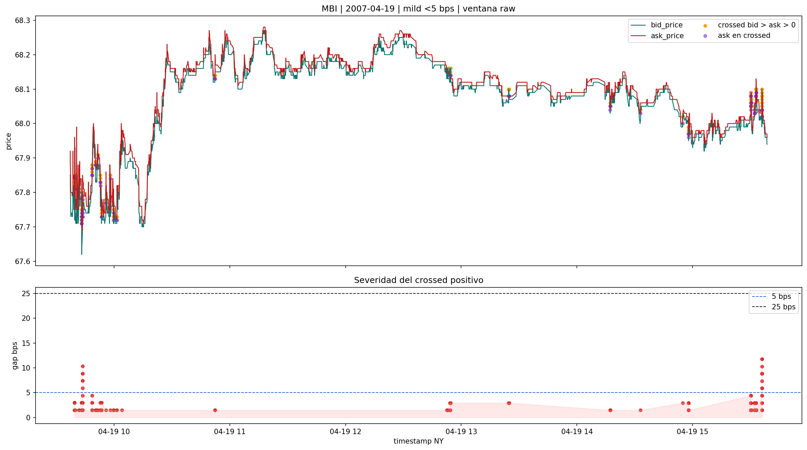

#### 02 Full Session Context
Esta imagen responde a la pregunta de extension intradiaria: el dano esta confinado a un bloque corto o contamina la sesion completa. Arriba se ve toda la sesion `04:00-20:00 NY`; abajo el `gap_bps` firmado. La decision que cambia es si el consumo debe penalizar solo un tramo o desechar el dia entero para uso operativo. El error que evita es tratar una cicatriz local como ruina total o, al reves, minimizar una degradacion distribuida a lo largo del dia. En ejecucion esto decide si la sesion puede seguir usandose con restricciones; en ML decide si las features intradiarias conservan significado economico.

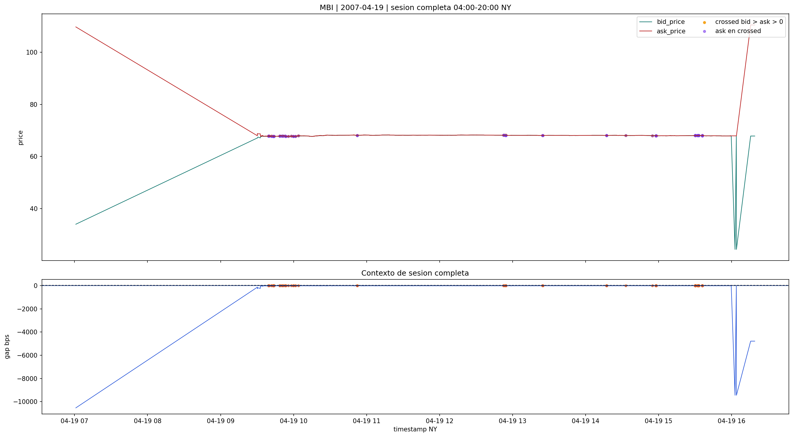

#### 03 Structure Diagnostics
Este panel responde a la pregunta de naturaleza del fallo: contradiccion economica genuina o mezcla con degeneracion estructural. Separa `ask=0` de `ask>0`, muestra la distribucion de `gap_bps` y resume patrones de integerizacion. La decision que cambia es como interpretar el dano: mercado localmente roto, artefacto de representacion o combinacion de ambos. El error que evita es sobrediagnosticar crossed reales cuando parte de la senal proviene de estructura degenerada del libro. Esta lectura afecta directamente a que el caso vaya a exclusion dura, a bandera contextual o a simple reconciliacion tecnica.

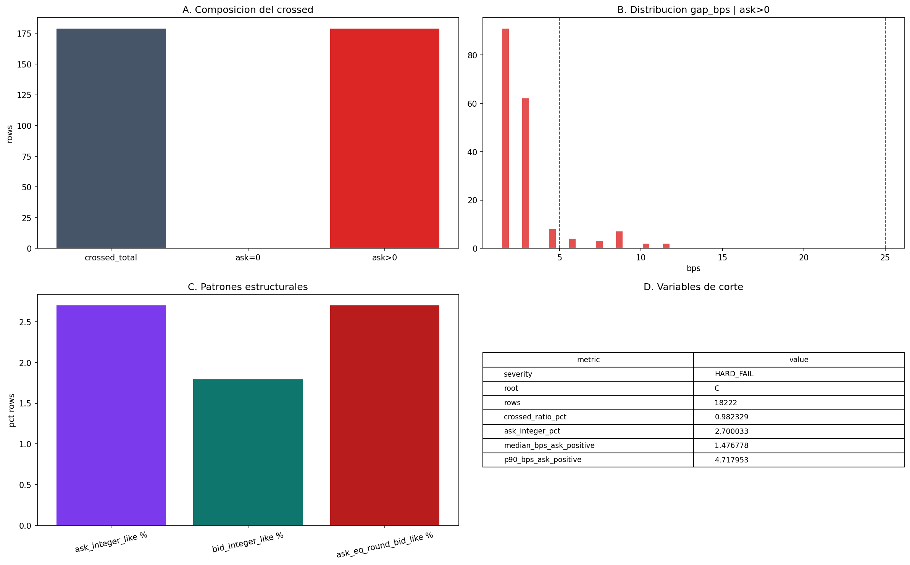

#### 04 Summary Card
Esta tarjeta responde a la pregunta de auditabilidad: cuales son exactamente las variables que sostienen la conclusion. Reune `severity`, `root`, `crossed_ratio_pct`, `ask_integer_pct`, `median_bps_ask_positive` y `p90_bps_ask_positive`. La decision que cambia es pasar de impresion visual a regla verificable. El error que evita es que dos inspectores lleguen a conclusiones distintas mirando la misma imagen sin una base numerica comun. Para gobernanza del proyecto, este panel es el que vuelve reproducible la decision para backtest, ML y auditoria.

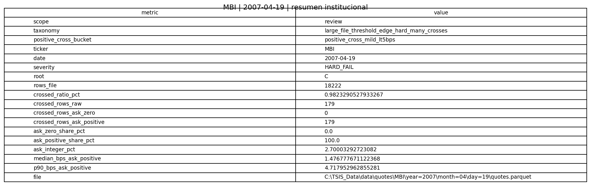

---

### 24. BZH 2005-02-08

company_name: `Beazer Homes USA, Inc. New`
primary_exchange: `NYSE` (`XNYS`)
market_locale: `stocks/us`
scope: `review`
ticker: `BZH`
date: `2005-02-08`
taxonomy: `large_file_threshold_edge_hard_many_crosses`
positive_cross_bucket: `positive_cross_mild_lt5bps`
severity: `HARD_FAIL`
root: `D`
rows: `2735`
crossed_ratio_pct: `4.058501`
crossed_rows_raw: `111`
crossed_rows_ask_zero: `15`
crossed_rows_ask_positive: `96`
ask_integer_pct: `3.254113`
median_bps_ask_positive: `1.213151`
p90_bps_ask_positive: `5.513378`
file: `D:\quotes\BZH\year=2005\month=02\day=08\quotes.parquet`

#### Analisis Forense
La conclusion correcta del caso es que ya existe contradiccion economica real dentro del libro, pero aun no con fuerza suficiente para justificar exclusion dura sin contexto adicional. La taxonomy historica es `large_file_threshold_edge_hard_many_crosses` y el regimen positivo dominante es `mild <5 bps`. Esto importa porque la taxonomy no solo clasifica: resume que tipo de anomalia se esta viendo y que clase de decision contractual puede defenderse despues. La taxonomy `large_file_threshold_edge_hard_many_crosses` implica un libro grande con muchas contradicciones, pero cerca del borde decisional. La dificultad analitica esta en decidir si el volumen de crossed es ruido absorbible o evidencia de degradacion suficientemente seria. El regimen `mild <5 bps` significa que existe contradiccion economica positiva, pero aun en una banda donde un uso prudente puede seguir siendo defendible si la persistencia y la estructura no agravan el caso. En terminos observables, el file tiene `crossed_ratio_pct=4.058501` con `crossed_rows_ask_positive=96` y `crossed_rows_ask_zero=15`. La severidad economica del crossed ask>0 se resume en `median_bps_ask_positive=1.213151` y `p90_bps_ask_positive=5.513378`. Estos dos numeros convierten una forma visual rara en una conclusion operativa sobre si el libro sigue representando o no un mercado negociable. La decision que cambia es pasar de libro sano a libro util solo bajo cautela. `review` significa: no usar como si fuera ejecucion limpia, conservar para analisis contextual y sensibilidad. El error que evita es tratar como normal un episodio que ya contiene contradiccion economica real y contaminar simulaciones de ejecucion o validaciones demasiado optimistas. El patron estructural muestra `ask_integer_pct=3.254113`. Este numero obliga a separar dos explicaciones rivales: contradiccion economica genuina del libro o mezcla con degeneracion estructural / integerizacion. La mayor parte del crossed vive en `ask>0`, de modo que el corazon del problema sigue siendo economico. La parte `ask=0`, si existe, acompana pero no explica por si sola la anomalia. Como `ask_integer_pct` es bajo, la hipotesis de simple degeneracion mecanica pierde fuerza. Eso endurece la interpretacion: el crossed se parece mas a contradiccion economica genuina y menos a artefacto. En la capa de semantica de precio del evento aparecen `daily raw close=842.5000`, `quote mid raw=165.5100`, `quote mid split_normalized=827.5500`, `daily adjusted_proxy=842.5000`. La reconciliacion incluye `future_split_factor=0.2000`. La implicacion metodologica es crucial: una discrepancia entre `quotes`, `daily` y una plataforma externa no puede leerse automaticamente como fallo del dataset. Puede ser semantica de precio distinta. El error que evita esta capa es mezclar raw, split-normalized y adjusted dentro del mismo pipeline, rompiendo auditoria, benchmarking y labels. Para pipelines, esto empuja a conservar el caso fuera de ejecucion limpia, pero todavia puede mantenerse en investigacion contextual y en analisis de sensibilidad donde interese entender fronteras de tolerancia. Existe ademas una imagen historica de certificacion asociada. Su papel es poner el episodio en un marco causal mas amplio: halt, explained, not strongly explained o patron conocido. La regla que protege al proyecto es esta: el contexto externo se usa para explicar por que aparece el episodio, no para absolverlo. El error que evita es degradar el criterio de calidad del libro porque exista una historia plausible alrededor del caso.

#### 00 Event Month Context
Esta imagen responde a la pregunta de persistencia temporal: estamos ante un accidente local o ante una fase mas amplia de inestabilidad. Arriba coloca el evento en la serie `daily` real del mes; abajo compara `crossed_ratio_pct` y `max_gap_bps_pos` del dia contra sus vecinos. La decision que cambia es el peso estructural que se le concede al caso. El error que evita es juzgar igual un shock aislado y una degradacion repetida del libro.

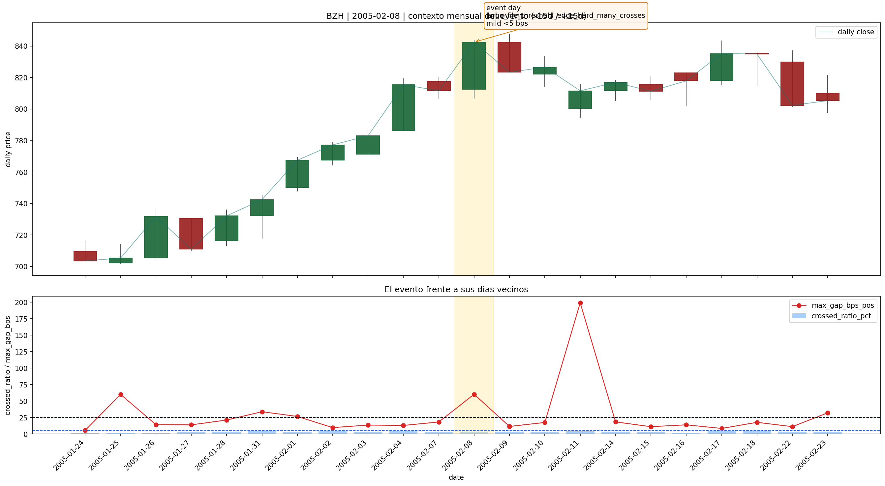

#### 00a Adjusted Proxy Contrast
Esta imagen responde a la pregunta de reconciliacion semantica: la discrepancia de precios viene de datos rotos o de vistas de precio distintas. Compara `daily raw`, `daily adjusted_proxy`, `quote mid raw` y `quote mid split_normalized`, y debajo ensena la cadena de dividendos y splits que produce la diferencia. La decision que cambia es si el inspector debe abrir una incidencia de calidad o cerrar el caso como diferencia legitima de semantica. El error que evita es mezclar series raw y adjusted como si fueran equivalentes. En pipelines reales, esto protege benchmarking, labels diarios y reconciliacion externa frente a falsas alarmas de precio.

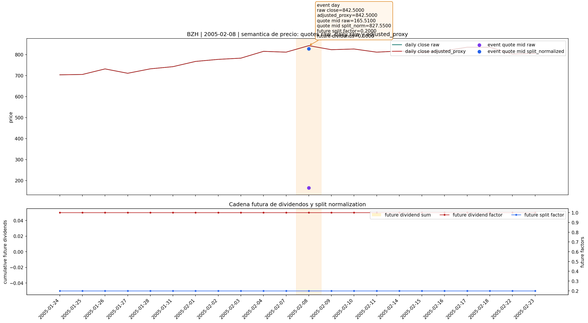

#### 00b Event Month Quotes Context
Esta imagen responde a la pregunta de recurrencia mensual dentro de `quotes`: el problema se concentra en el evento o reaparece en varias sesiones. Arriba concatena sesiones con datos disponibles; abajo resume cobertura diaria, `crossed_ratio_pct` y `max_gap_bps_pos`. La decision que cambia es si el caso debe leerse como episodio puntual o como sintoma de una fase repetida de libro degradado. El error que evita es extrapolar desde un unico dia a todo el mes sin evidencia.

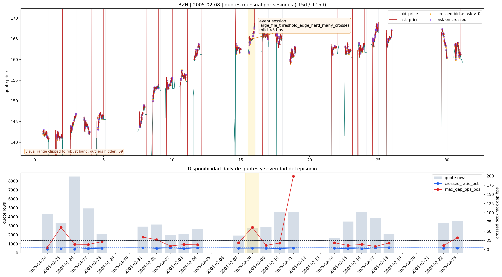

#### 01 Raw Window
Esta imagen responde a la primera pregunta decisiva del caso: el crossed observado es economicamente bastante fuerte para justificar un cambio de clase. Arriba ensena la geometria exacta del tramo conflictivo; abajo convierte esa geometria a bps y la enfrenta a los cortes `5 bps` y `25 bps`. El regimen dominante es `mild <5 bps`. La decision que cambia es pasar de anomalia interpretable a `review` o `bad`. El error que evita es decidir por apariencia visual sin medir el dano economico real del crossed. En terminos de pipeline, este panel decide si el problema afecta solo a la lectura forense o si invalida simulacion de ejecucion y microstructure features.

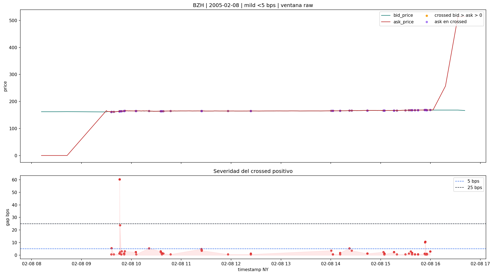

#### 02 Full Session Context
Esta imagen responde a la pregunta de extension intradiaria: el dano esta confinado a un bloque corto o contamina la sesion completa. Arriba se ve toda la sesion `04:00-20:00 NY`; abajo el `gap_bps` firmado. La decision que cambia es si el consumo debe penalizar solo un tramo o desechar el dia entero para uso operativo. El error que evita es tratar una cicatriz local como ruina total o, al reves, minimizar una degradacion distribuida a lo largo del dia. En ejecucion esto decide si la sesion puede seguir usandose con restricciones; en ML decide si las features intradiarias conservan significado economico.

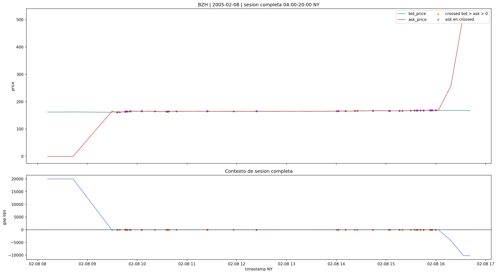

#### 03 Structure Diagnostics
Este panel responde a la pregunta de naturaleza del fallo: contradiccion economica genuina o mezcla con degeneracion estructural. Separa `ask=0` de `ask>0`, muestra la distribucion de `gap_bps` y resume patrones de integerizacion. La decision que cambia es como interpretar el dano: mercado localmente roto, artefacto de representacion o combinacion de ambos. El error que evita es sobrediagnosticar crossed reales cuando parte de la senal proviene de estructura degenerada del libro. Esta lectura afecta directamente a que el caso vaya a exclusion dura, a bandera contextual o a simple reconciliacion tecnica.

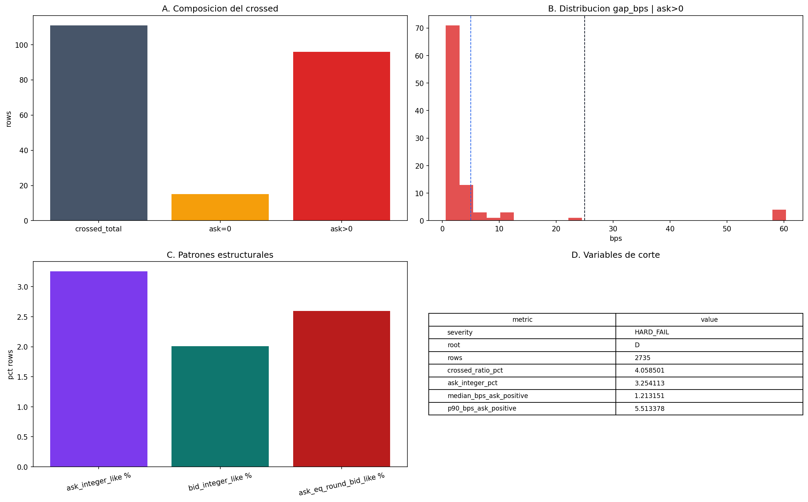

#### 04 Summary Card
Esta tarjeta responde a la pregunta de auditabilidad: cuales son exactamente las variables que sostienen la conclusion. Reune `severity`, `root`, `crossed_ratio_pct`, `ask_integer_pct`, `median_bps_ask_positive` y `p90_bps_ask_positive`. La decision que cambia es pasar de impresion visual a regla verificable. El error que evita es que dos inspectores lleguen a conclusiones distintas mirando la misma imagen sin una base numerica comun. Para gobernanza del proyecto, este panel es el que vuelve reproducible la decision para backtest, ML y auditoria.

---

### 25. AWH 2013-02-06

company_name: `Allied World Assurance Co Hld Lt`
primary_exchange: `NYSE` (`XNYS`)
market_locale: `stocks/us`
scope: `review`
ticker: `AWH`
date: `2013-02-06`
taxonomy: `large_file_threshold_edge_hard_many_crosses`
positive_cross_bucket: `positive_cross_mild_lt5bps`
severity: `HARD_FAIL`
root: `D`
rows: `9366`
crossed_ratio_pct: `0.982276`
crossed_rows_raw: `92`
crossed_rows_ask_zero: `91`
crossed_rows_ask_positive: `1`
ask_integer_pct: `2.359599`
median_bps_ask_positive: `1.173502`
p90_bps_ask_positive: `1.173502`
file: `D:\quotes\AWH\year=2013\month=02\day=06\quotes.parquet`

#### Analisis Forense
La conclusion correcta del caso es que ya existe contradiccion economica real dentro del libro, pero aun no con fuerza suficiente para justificar exclusion dura sin contexto adicional. La taxonomy historica es `large_file_threshold_edge_hard_many_crosses` y el regimen positivo dominante es `mild <5 bps`. Esto importa porque la taxonomy no solo clasifica: resume que tipo de anomalia se esta viendo y que clase de decision contractual puede defenderse despues. La taxonomy `large_file_threshold_edge_hard_many_crosses` implica un libro grande con muchas contradicciones, pero cerca del borde decisional. La dificultad analitica esta en decidir si el volumen de crossed es ruido absorbible o evidencia de degradacion suficientemente seria. El regimen `mild <5 bps` significa que existe contradiccion economica positiva, pero aun en una banda donde un uso prudente puede seguir siendo defendible si la persistencia y la estructura no agravan el caso. En terminos observables, el file tiene `crossed_ratio_pct=0.982276` con `crossed_rows_ask_positive=1` y `crossed_rows_ask_zero=91`. La severidad economica del crossed ask>0 se resume en `median_bps_ask_positive=1.173502` y `p90_bps_ask_positive=1.173502`. Estos dos numeros convierten una forma visual rara en una conclusion operativa sobre si el libro sigue representando o no un mercado negociable. La decision que cambia es pasar de libro sano a libro util solo bajo cautela. `review` significa: no usar como si fuera ejecucion limpia, conservar para analisis contextual y sensibilidad. El error que evita es tratar como normal un episodio que ya contiene contradiccion economica real y contaminar simulaciones de ejecucion o validaciones demasiado optimistas. El patron estructural muestra `ask_integer_pct=2.359599`. Este numero obliga a separar dos explicaciones rivales: contradiccion economica genuina del libro o mezcla con degeneracion estructural / integerizacion. La mayor parte del crossed vive en `ask=0`, pero existe una cola `ask>0` que impide absolver el caso como simple glitch. La lectura correcta es mixta: dano estructural dominante con residuo economico que aun puede justificar bandera o exclusion. Como `ask_integer_pct` es bajo, la hipotesis de simple degeneracion mecanica pierde fuerza. Eso endurece la interpretacion: el crossed se parece mas a contradiccion economica genuina y menos a artefacto. En la capa de semantica de precio del evento aparecen `daily raw close=426.3000`, `quote mid raw=85.1850`, `quote mid split_normalized=425.9250`, `daily adjusted_proxy=419.5764`. La reconciliacion incluye `future_split_factor=0.2000`. Ademas hay `post_event_dividend_sum=10.0950`. La implicacion metodologica es crucial: una discrepancia entre `quotes`, `daily` y una plataforma externa no puede leerse automaticamente como fallo del dataset. Puede ser semantica de precio distinta. El error que evita esta capa es mezclar raw, split-normalized y adjusted dentro del mismo pipeline, rompiendo auditoria, benchmarking y labels. Para pipelines, esto empuja a conservar el caso fuera de ejecucion limpia, pero todavia puede mantenerse en investigacion contextual y en analisis de sensibilidad donde interese entender fronteras de tolerancia. Existe ademas una imagen historica de certificacion asociada. Su papel es poner el episodio en un marco causal mas amplio: halt, explained, not strongly explained o patron conocido. La regla que protege al proyecto es esta: el contexto externo se usa para explicar por que aparece el episodio, no para absolverlo. El error que evita es degradar el criterio de calidad del libro porque exista una historia plausible alrededor del caso.

#### 00 Event Month Context
Esta imagen responde a la pregunta de persistencia temporal: estamos ante un accidente local o ante una fase mas amplia de inestabilidad. Arriba coloca el evento en la serie `daily` real del mes; abajo compara `crossed_ratio_pct` y `max_gap_bps_pos` del dia contra sus vecinos. La decision que cambia es el peso estructural que se le concede al caso. El error que evita es juzgar igual un shock aislado y una degradacion repetida del libro.

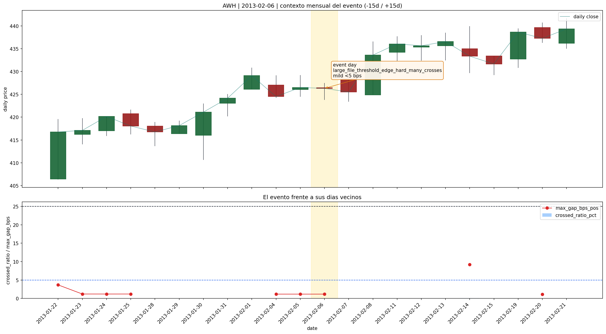

#### 00a Adjusted Proxy Contrast
Esta imagen responde a la pregunta de reconciliacion semantica: la discrepancia de precios viene de datos rotos o de vistas de precio distintas. Compara `daily raw`, `daily adjusted_proxy`, `quote mid raw` y `quote mid split_normalized`, y debajo ensena la cadena de dividendos y splits que produce la diferencia. La decision que cambia es si el inspector debe abrir una incidencia de calidad o cerrar el caso como diferencia legitima de semantica. El error que evita es mezclar series raw y adjusted como si fueran equivalentes. En pipelines reales, esto protege benchmarking, labels diarios y reconciliacion externa frente a falsas alarmas de precio.

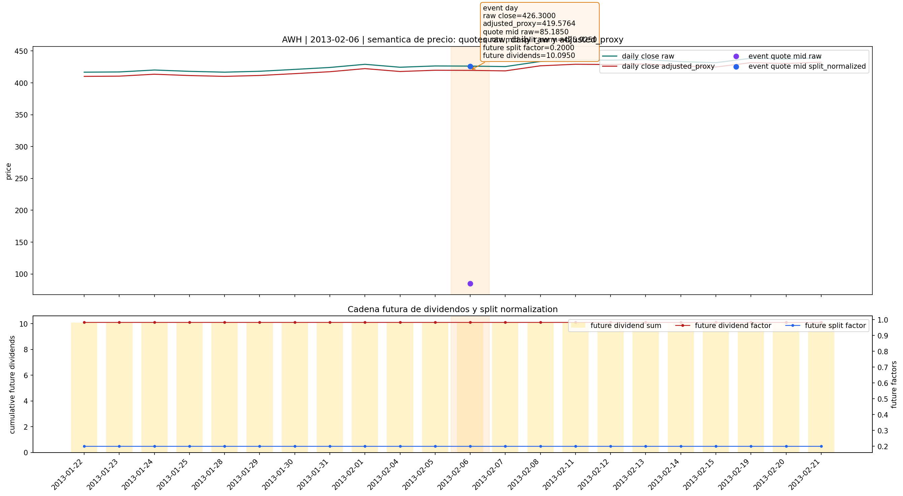

#### 00b Event Month Quotes Context
Esta imagen responde a la pregunta de recurrencia mensual dentro de `quotes`: el problema se concentra en el evento o reaparece en varias sesiones. Arriba concatena sesiones con datos disponibles; abajo resume cobertura diaria, `crossed_ratio_pct` y `max_gap_bps_pos`. La decision que cambia es si el caso debe leerse como episodio puntual o como sintoma de una fase repetida de libro degradado. El error que evita es extrapolar desde un unico dia a todo el mes sin evidencia.

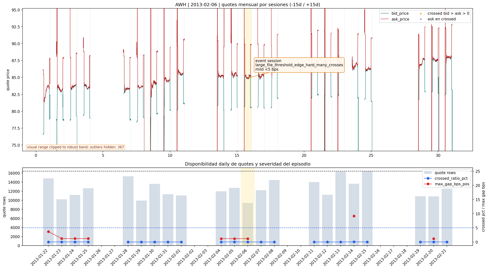

#### 01 Raw Window
Esta imagen responde a la primera pregunta decisiva del caso: el crossed observado es economicamente bastante fuerte para justificar un cambio de clase. Arriba ensena la geometria exacta del tramo conflictivo; abajo convierte esa geometria a bps y la enfrenta a los cortes `5 bps` y `25 bps`. El regimen dominante es `mild <5 bps`. La decision que cambia es pasar de anomalia interpretable a `review` o `bad`. El error que evita es decidir por apariencia visual sin medir el dano economico real del crossed. En terminos de pipeline, este panel decide si el problema afecta solo a la lectura forense o si invalida simulacion de ejecucion y microstructure features.

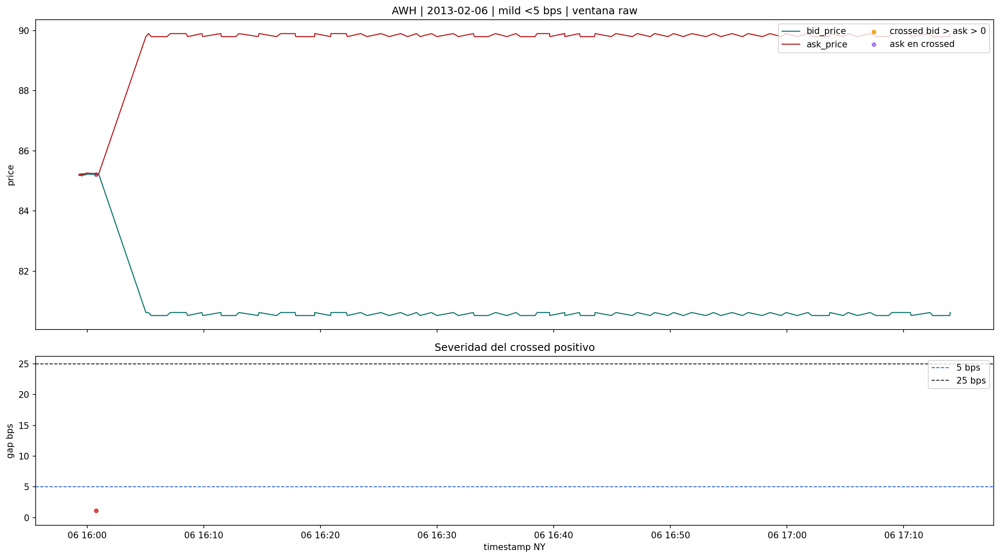

#### 02 Full Session Context
Esta imagen responde a la pregunta de extension intradiaria: el dano esta confinado a un bloque corto o contamina la sesion completa. Arriba se ve toda la sesion `04:00-20:00 NY`; abajo el `gap_bps` firmado. La decision que cambia es si el consumo debe penalizar solo un tramo o desechar el dia entero para uso operativo. El error que evita es tratar una cicatriz local como ruina total o, al reves, minimizar una degradacion distribuida a lo largo del dia. En ejecucion esto decide si la sesion puede seguir usandose con restricciones; en ML decide si las features intradiarias conservan significado economico.

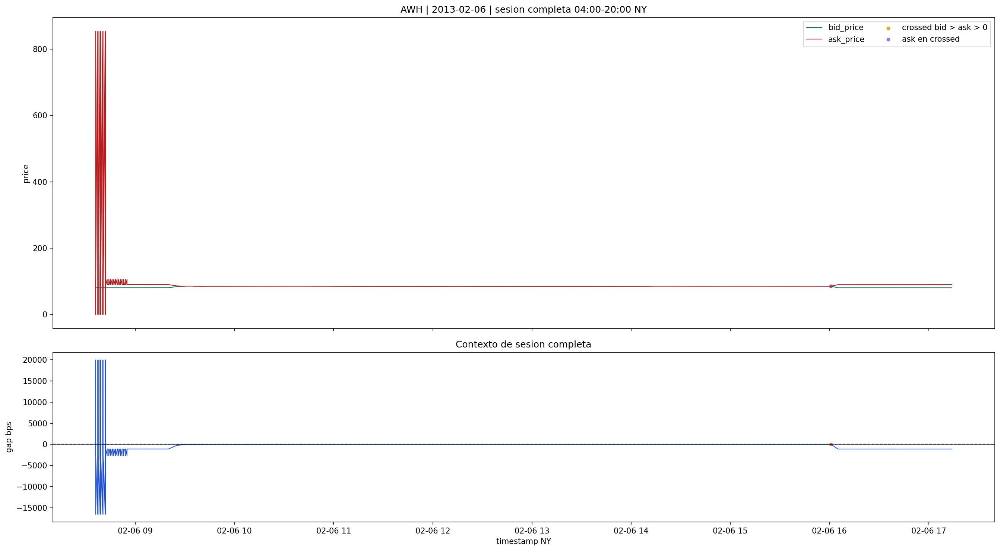

#### 03 Structure Diagnostics
Este panel responde a la pregunta de naturaleza del fallo: contradiccion economica genuina o mezcla con degeneracion estructural. Separa `ask=0` de `ask>0`, muestra la distribucion de `gap_bps` y resume patrones de integerizacion. La decision que cambia es como interpretar el dano: mercado localmente roto, artefacto de representacion o combinacion de ambos. El error que evita es sobrediagnosticar crossed reales cuando parte de la senal proviene de estructura degenerada del libro. Esta lectura afecta directamente a que el caso vaya a exclusion dura, a bandera contextual o a simple reconciliacion tecnica.

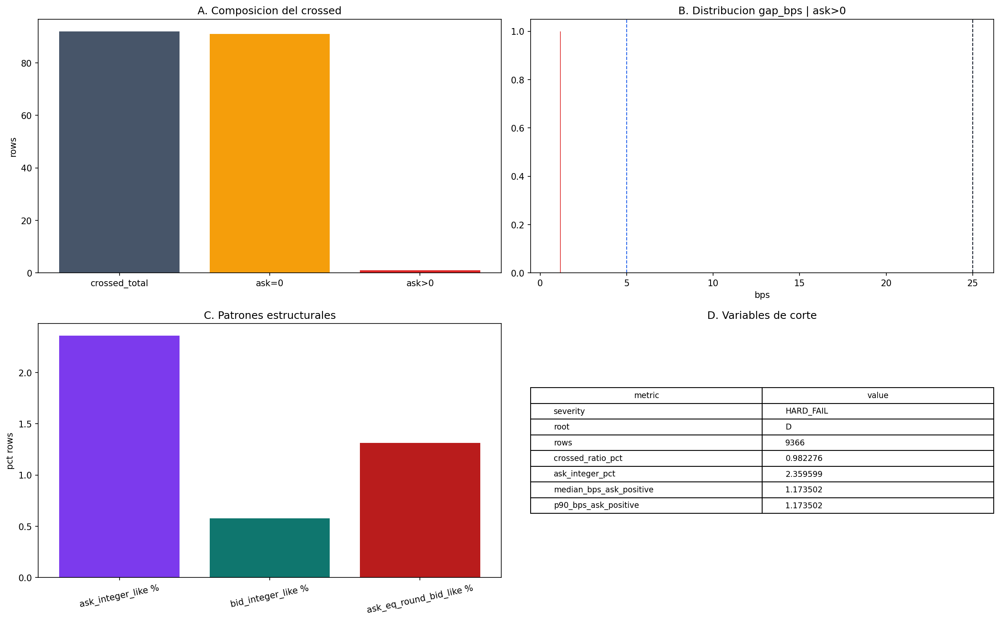

#### 04 Summary Card
Esta tarjeta responde a la pregunta de auditabilidad: cuales son exactamente las variables que sostienen la conclusion. Reune `severity`, `root`, `crossed_ratio_pct`, `ask_integer_pct`, `median_bps_ask_positive` y `p90_bps_ask_positive`. La decision que cambia es pasar de impresion visual a regla verificable. El error que evita es que dos inspectores lleguen a conclusiones distintas mirando la misma imagen sin una base numerica comun. Para gobernanza del proyecto, este panel es el que vuelve reproducible la decision para backtest, ML y auditoria.

---

### 26. GLXG 2025-04-08

company_name: `Galaxy Payroll Group Limited Class A Ordinary Shares`
primary_exchange: `NASDAQ` (`XNAS`)
market_locale: `stocks/us`
scope: `review`
ticker: `GLXG`
date: `2025-04-08`
taxonomy: `persistent_soft_crossed_mid_large_scale`
positive_cross_bucket: `positive_cross_severe_ge25bps`
severity: `SOFT_FAIL`
root: `D`
rows: `384850`
crossed_ratio_pct: `0.442250`
crossed_rows_raw: `1702`
crossed_rows_ask_zero: `0`
crossed_rows_ask_positive: `1702`
ask_integer_pct: `1.089256`
median_bps_ask_positive: `55.710306`
p90_bps_ask_positive: `191.693291`
file: `D:\quotes\GLXG\year=2025\month=04\day=08\quotes.parquet`

#### Analisis Forense
La conclusion correcta del caso es que ya existe contradiccion economica real dentro del libro, pero aun no con fuerza suficiente para justificar exclusion dura sin contexto adicional. La taxonomy historica es `persistent_soft_crossed_mid_large_scale` y el regimen positivo dominante es `severe >=25 bps`. Esto importa porque la taxonomy no solo clasifica: resume que tipo de anomalia se esta viendo y que clase de decision contractual puede defenderse despues. La taxonomy `persistent_soft_crossed_mid_large_scale` implica un problema repetido y distribuido, no un simple pinchazo local. Por eso empuja a `review`: ya hay dano real, aunque no necesariamente exclusion dura universal. El regimen `severe >=25 bps` empuja el caso a una lectura economicamente dura: el crossed deja de ser cosmetico y pasa a cuestionar si el libro sigue siendo interpretable como mercado negociable. En terminos observables, el file tiene `crossed_ratio_pct=0.442250` con `crossed_rows_ask_positive=1702` y `crossed_rows_ask_zero=0`. La severidad economica del crossed ask>0 se resume en `median_bps_ask_positive=55.710306` y `p90_bps_ask_positive=191.693291`. Estos dos numeros convierten una forma visual rara en una conclusion operativa sobre si el libro sigue representando o no un mercado negociable. La decision que cambia es pasar de libro sano a libro util solo bajo cautela. `review` significa: no usar como si fuera ejecucion limpia, conservar para analisis contextual y sensibilidad. El error que evita es tratar como normal un episodio que ya contiene contradiccion economica real y contaminar simulaciones de ejecucion o validaciones demasiado optimistas. El patron estructural muestra `ask_integer_pct=1.089256`. Este numero obliga a separar dos explicaciones rivales: contradiccion economica genuina del libro o mezcla con degeneracion estructural / integerizacion. Toda la composicion crossed cae en `ask>0`. Eso endurece la lectura economica del caso: el dano no depende de ceros mecanicos, sino de contradiccion positiva dentro de precios aparentemente vivos. Como `ask_integer_pct` es bajo, la hipotesis de simple degeneracion mecanica pierde fuerza. Eso endurece la interpretacion: el crossed se parece mas a contradiccion economica genuina y menos a artefacto. En la capa de semantica de precio del evento aparecen `daily raw close=9.4930`, `quote mid raw=1.9000`, `quote mid split_normalized=19.0000`, `daily adjusted_proxy=9.4930`. La reconciliacion incluye `future_split_factor=0.1000`. La implicacion metodologica es crucial: una discrepancia entre `quotes`, `daily` y una plataforma externa no puede leerse automaticamente como fallo del dataset. Puede ser semantica de precio distinta. El error que evita esta capa es mezclar raw, split-normalized y adjusted dentro del mismo pipeline, rompiendo auditoria, benchmarking y labels. Para pipelines, esto bloquea su uso como libro sano en ejecucion y features microestructurales principales, aunque aun puede mantenerse para forense, sensibilidad y estudios donde la anomalia sea parte del objeto de investigacion. Existe ademas una imagen historica de certificacion asociada. Su papel es poner el episodio en un marco causal mas amplio: halt, explained, not strongly explained o patron conocido. La regla que protege al proyecto es esta: el contexto externo se usa para explicar por que aparece el episodio, no para absolverlo. El error que evita es degradar el criterio de calidad del libro porque exista una historia plausible alrededor del caso.

#### 00 Event Month Context
Esta imagen responde a la pregunta de persistencia temporal: estamos ante un accidente local o ante una fase mas amplia de inestabilidad. Arriba coloca el evento en la serie `daily` real del mes; abajo compara `crossed_ratio_pct` y `max_gap_bps_pos` del dia contra sus vecinos. La decision que cambia es el peso estructural que se le concede al caso. El error que evita es juzgar igual un shock aislado y una degradacion repetida del libro.

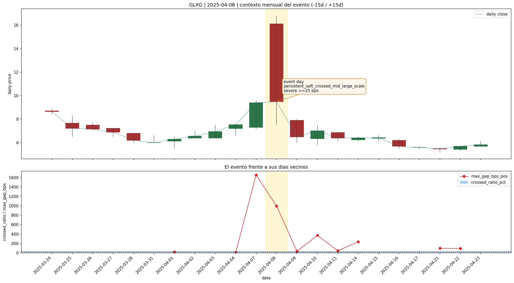

#### 00a Adjusted Proxy Contrast
Esta imagen responde a la pregunta de reconciliacion semantica: la discrepancia de precios viene de datos rotos o de vistas de precio distintas. Compara `daily raw`, `daily adjusted_proxy`, `quote mid raw` y `quote mid split_normalized`, y debajo ensena la cadena de dividendos y splits que produce la diferencia. La decision que cambia es si el inspector debe abrir una incidencia de calidad o cerrar el caso como diferencia legitima de semantica. El error que evita es mezclar series raw y adjusted como si fueran equivalentes. En pipelines reales, esto protege benchmarking, labels diarios y reconciliacion externa frente a falsas alarmas de precio.

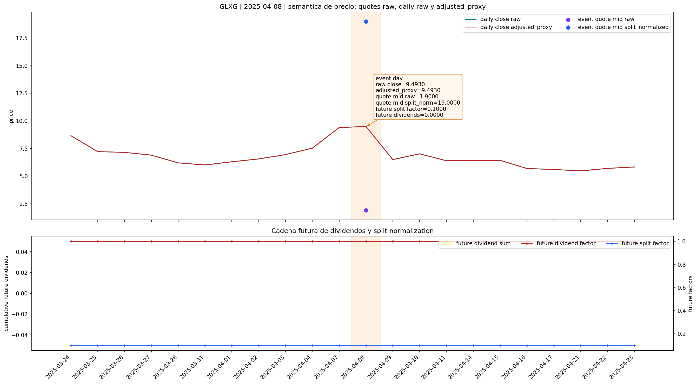

#### 00b Event Month Quotes Context
Esta imagen responde a la pregunta de recurrencia mensual dentro de `quotes`: el problema se concentra en el evento o reaparece en varias sesiones. Arriba concatena sesiones con datos disponibles; abajo resume cobertura diaria, `crossed_ratio_pct` y `max_gap_bps_pos`. La decision que cambia es si el caso debe leerse como episodio puntual o como sintoma de una fase repetida de libro degradado. El error que evita es extrapolar desde un unico dia a todo el mes sin evidencia.

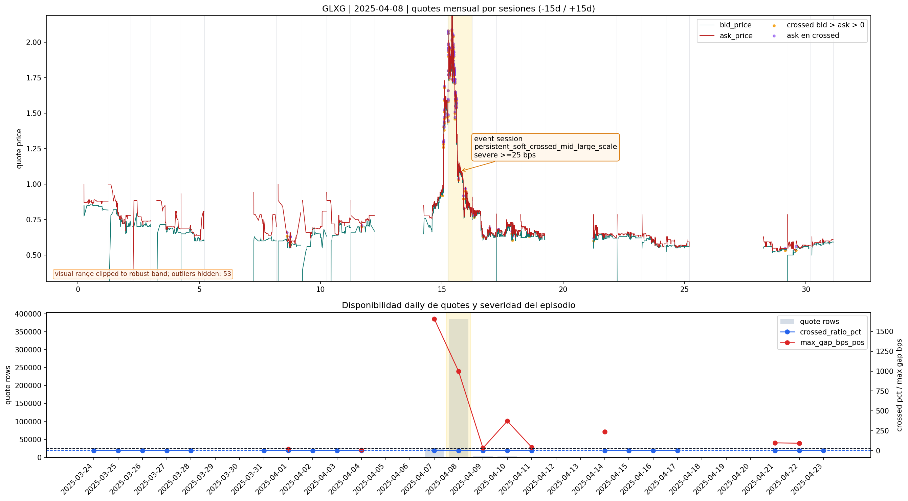

#### 01 Raw Window
Esta imagen responde a la primera pregunta decisiva del caso: el crossed observado es economicamente bastante fuerte para justificar un cambio de clase. Arriba ensena la geometria exacta del tramo conflictivo; abajo convierte esa geometria a bps y la enfrenta a los cortes `5 bps` y `25 bps`. El regimen dominante es `severe >=25 bps`. La decision que cambia es pasar de anomalia interpretable a `review` o `bad`. El error que evita es decidir por apariencia visual sin medir el dano economico real del crossed. En terminos de pipeline, este panel decide si el problema afecta solo a la lectura forense o si invalida simulacion de ejecucion y microstructure features.

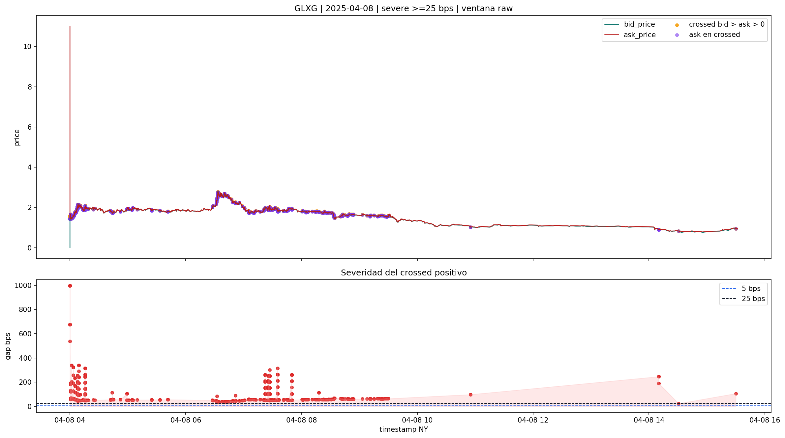

#### 02 Full Session Context
Esta imagen responde a la pregunta de extension intradiaria: el dano esta confinado a un bloque corto o contamina la sesion completa. Arriba se ve toda la sesion `04:00-20:00 NY`; abajo el `gap_bps` firmado. La decision que cambia es si el consumo debe penalizar solo un tramo o desechar el dia entero para uso operativo. El error que evita es tratar una cicatriz local como ruina total o, al reves, minimizar una degradacion distribuida a lo largo del dia. En ejecucion esto decide si la sesion puede seguir usandose con restricciones; en ML decide si las features intradiarias conservan significado economico.

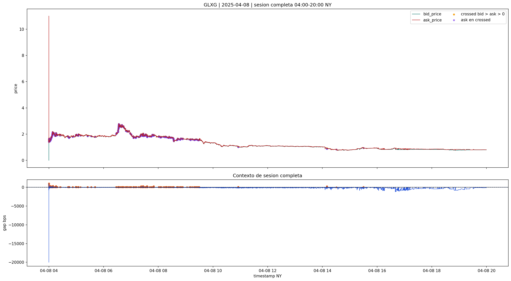

#### 03 Structure Diagnostics
Este panel responde a la pregunta de naturaleza del fallo: contradiccion economica genuina o mezcla con degeneracion estructural. Separa `ask=0` de `ask>0`, muestra la distribucion de `gap_bps` y resume patrones de integerizacion. La decision que cambia es como interpretar el dano: mercado localmente roto, artefacto de representacion o combinacion de ambos. El error que evita es sobrediagnosticar crossed reales cuando parte de la senal proviene de estructura degenerada del libro. Esta lectura afecta directamente a que el caso vaya a exclusion dura, a bandera contextual o a simple reconciliacion tecnica.

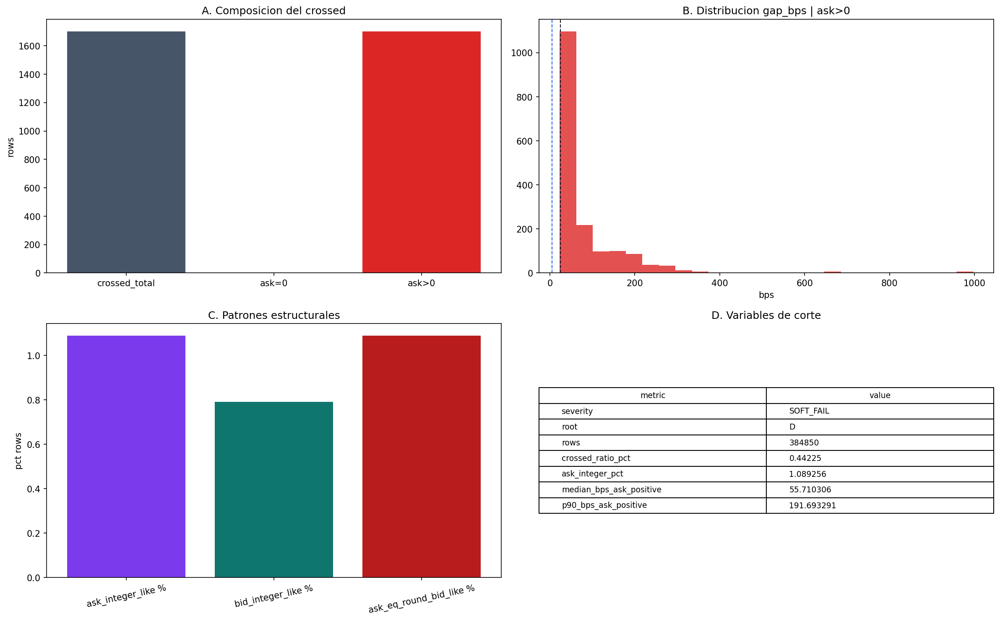

#### 04 Summary Card
Esta tarjeta responde a la pregunta de auditabilidad: cuales son exactamente las variables que sostienen la conclusion. Reune `severity`, `root`, `crossed_ratio_pct`, `ask_integer_pct`, `median_bps_ask_positive` y `p90_bps_ask_positive`. La decision que cambia es pasar de impresion visual a regla verificable. El error que evita es que dos inspectores lleguen a conclusiones distintas mirando la misma imagen sin una base numerica comun. Para gobernanza del proyecto, este panel es el que vuelve reproducible la decision para backtest, ML y auditoria.

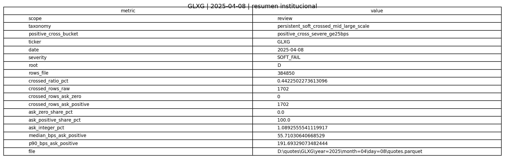

#### 05 Historical Context
Esta imagen responde a la pregunta causal externa: existe un framing historico que ayude a entender por que ocurre el episodio. Puede aportar halt context, explained o not strongly explained. La decision que cambia es cuanto peso se concede al contexto en la narrativa final. El error que evita es doble: ignorar una explicacion real o usarla como excusa para absolver un libro que localmente sigue siendo problematico.

---

### 27. WLGS 2025-06-11

company_name: `Wang & Lee Group, Inc. Ordinary Shares`
primary_exchange: `NASDAQ` (`XNAS`)
market_locale: `stocks/us`
scope: `review`
ticker: `WLGS`
date: `2025-06-11`
taxonomy: `persistent_soft_crossed_mid_large_scale`
positive_cross_bucket: `positive_cross_severe_ge25bps`
severity: `SOFT_FAIL`
root: `D`
rows: `61388`
crossed_ratio_pct: `0.469147`
crossed_rows_raw: `288`
crossed_rows_ask_zero: `0`
crossed_rows_ask_positive: `288`
ask_integer_pct: `0.000000`
median_bps_ask_positive: `42.193280`
p90_bps_ask_positive: `202.020202`
file: `D:\quotes\WLGS\year=2025\month=06\day=11\quotes.parquet`

#### Analisis Forense
La conclusion correcta del caso es que ya existe contradiccion economica real dentro del libro, pero aun no con fuerza suficiente para justificar exclusion dura sin contexto adicional. La taxonomy historica es `persistent_soft_crossed_mid_large_scale` y el regimen positivo dominante es `severe >=25 bps`. Esto importa porque la taxonomy no solo clasifica: resume que tipo de anomalia se esta viendo y que clase de decision contractual puede defenderse despues. La taxonomy `persistent_soft_crossed_mid_large_scale` implica un problema repetido y distribuido, no un simple pinchazo local. Por eso empuja a `review`: ya hay dano real, aunque no necesariamente exclusion dura universal. El regimen `severe >=25 bps` empuja el caso a una lectura economicamente dura: el crossed deja de ser cosmetico y pasa a cuestionar si el libro sigue siendo interpretable como mercado negociable. En terminos observables, el file tiene `crossed_ratio_pct=0.469147` con `crossed_rows_ask_positive=288` y `crossed_rows_ask_zero=0`. La severidad economica del crossed ask>0 se resume en `median_bps_ask_positive=42.193280` y `p90_bps_ask_positive=202.020202`. Estos dos numeros convierten una forma visual rara en una conclusion operativa sobre si el libro sigue representando o no un mercado negociable. La decision que cambia es pasar de libro sano a libro util solo bajo cautela. `review` significa: no usar como si fuera ejecucion limpia, conservar para analisis contextual y sensibilidad. El error que evita es tratar como normal un episodio que ya contiene contradiccion economica real y contaminar simulaciones de ejecucion o validaciones demasiado optimistas. El patron estructural muestra `ask_integer_pct=0.000000`. Este numero obliga a separar dos explicaciones rivales: contradiccion economica genuina del libro o mezcla con degeneracion estructural / integerizacion. Toda la composicion crossed cae en `ask>0`. Eso endurece la lectura economica del caso: el dano no depende de ceros mecanicos, sino de contradiccion positiva dentro de precios aparentemente vivos. Como `ask_integer_pct` es bajo, la hipotesis de simple degeneracion mecanica pierde fuerza. Eso endurece la interpretacion: el crossed se parece mas a contradiccion economica genuina y menos a artefacto. En la capa de semantica de precio del evento aparecen `daily raw close=22.0500`, `quote mid raw=0.0837`, `quote mid split_normalized=20.9250`, `daily adjusted_proxy=22.0500`. La reconciliacion incluye `future_split_factor=0.0040`. La implicacion metodologica es crucial: una discrepancia entre `quotes`, `daily` y una plataforma externa no puede leerse automaticamente como fallo del dataset. Puede ser semantica de precio distinta. El error que evita esta capa es mezclar raw, split-normalized y adjusted dentro del mismo pipeline, rompiendo auditoria, benchmarking y labels. Para pipelines, esto bloquea su uso como libro sano en ejecucion y features microestructurales principales, aunque aun puede mantenerse para forense, sensibilidad y estudios donde la anomalia sea parte del objeto de investigacion. Existe ademas una imagen historica de certificacion asociada. Su papel es poner el episodio en un marco causal mas amplio: halt, explained, not strongly explained o patron conocido. La regla que protege al proyecto es esta: el contexto externo se usa para explicar por que aparece el episodio, no para absolverlo. El error que evita es degradar el criterio de calidad del libro porque exista una historia plausible alrededor del caso.

#### 00 Event Month Context
Esta imagen responde a la pregunta de persistencia temporal: estamos ante un accidente local o ante una fase mas amplia de inestabilidad. Arriba coloca el evento en la serie `daily` real del mes; abajo compara `crossed_ratio_pct` y `max_gap_bps_pos` del dia contra sus vecinos. La decision que cambia es el peso estructural que se le concede al caso. El error que evita es juzgar igual un shock aislado y una degradacion repetida del libro.

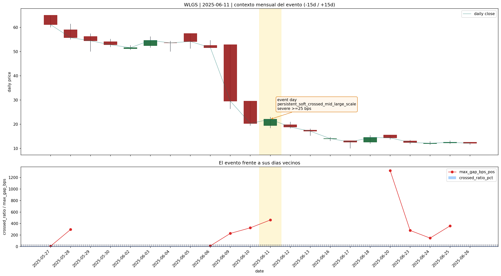

#### 00a Adjusted Proxy Contrast
Esta imagen responde a la pregunta de reconciliacion semantica: la discrepancia de precios viene de datos rotos o de vistas de precio distintas. Compara `daily raw`, `daily adjusted_proxy`, `quote mid raw` y `quote mid split_normalized`, y debajo ensena la cadena de dividendos y splits que produce la diferencia. La decision que cambia es si el inspector debe abrir una incidencia de calidad o cerrar el caso como diferencia legitima de semantica. El error que evita es mezclar series raw y adjusted como si fueran equivalentes. En pipelines reales, esto protege benchmarking, labels diarios y reconciliacion externa frente a falsas alarmas de precio.

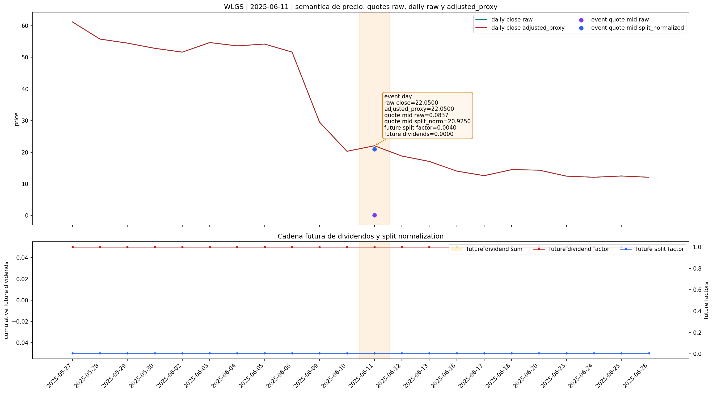

#### 00b Event Month Quotes Context
Esta imagen responde a la pregunta de recurrencia mensual dentro de `quotes`: el problema se concentra en el evento o reaparece en varias sesiones. Arriba concatena sesiones con datos disponibles; abajo resume cobertura diaria, `crossed_ratio_pct` y `max_gap_bps_pos`. La decision que cambia es si el caso debe leerse como episodio puntual o como sintoma de una fase repetida de libro degradado. El error que evita es extrapolar desde un unico dia a todo el mes sin evidencia.

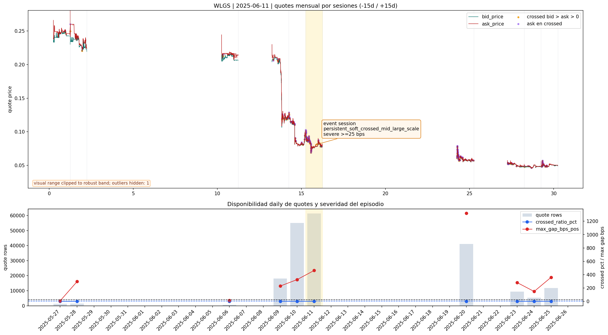

#### 01 Raw Window
Esta imagen responde a la primera pregunta decisiva del caso: el crossed observado es economicamente bastante fuerte para justificar un cambio de clase. Arriba ensena la geometria exacta del tramo conflictivo; abajo convierte esa geometria a bps y la enfrenta a los cortes `5 bps` y `25 bps`. El regimen dominante es `severe >=25 bps`. La decision que cambia es pasar de anomalia interpretable a `review` o `bad`. El error que evita es decidir por apariencia visual sin medir el dano economico real del crossed. En terminos de pipeline, este panel decide si el problema afecta solo a la lectura forense o si invalida simulacion de ejecucion y microstructure features.

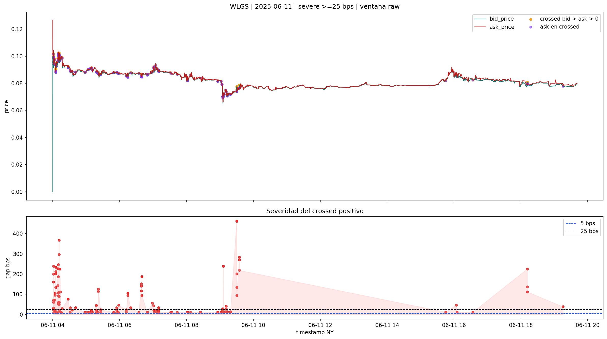

#### 02 Full Session Context
Esta imagen responde a la pregunta de extension intradiaria: el dano esta confinado a un bloque corto o contamina la sesion completa. Arriba se ve toda la sesion `04:00-20:00 NY`; abajo el `gap_bps` firmado. La decision que cambia es si el consumo debe penalizar solo un tramo o desechar el dia entero para uso operativo. El error que evita es tratar una cicatriz local como ruina total o, al reves, minimizar una degradacion distribuida a lo largo del dia. En ejecucion esto decide si la sesion puede seguir usandose con restricciones; en ML decide si las features intradiarias conservan significado economico.

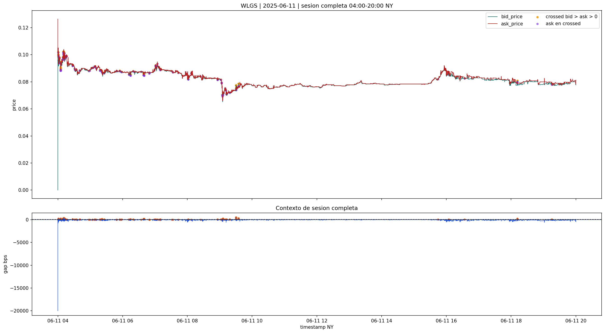

#### 03 Structure Diagnostics
Este panel responde a la pregunta de naturaleza del fallo: contradiccion economica genuina o mezcla con degeneracion estructural. Separa `ask=0` de `ask>0`, muestra la distribucion de `gap_bps` y resume patrones de integerizacion. La decision que cambia es como interpretar el dano: mercado localmente roto, artefacto de representacion o combinacion de ambos. El error que evita es sobrediagnosticar crossed reales cuando parte de la senal proviene de estructura degenerada del libro. Esta lectura afecta directamente a que el caso vaya a exclusion dura, a bandera contextual o a simple reconciliacion tecnica.

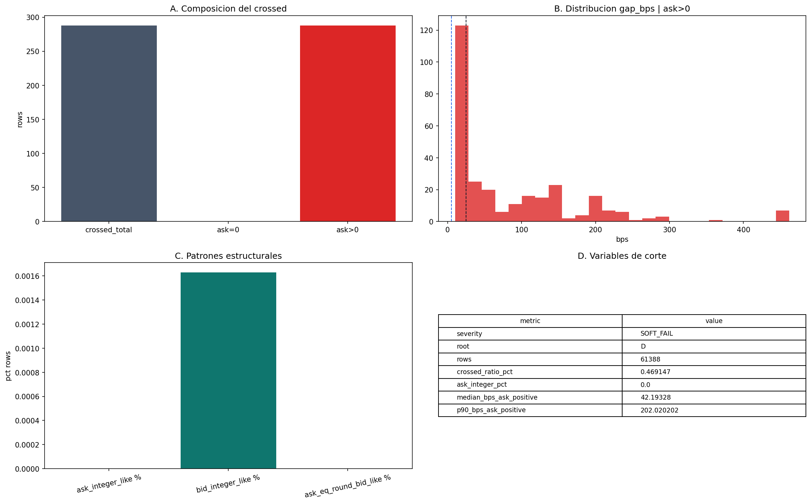

#### 04 Summary Card
Esta tarjeta responde a la pregunta de auditabilidad: cuales son exactamente las variables que sostienen la conclusion. Reune `severity`, `root`, `crossed_ratio_pct`, `ask_integer_pct`, `median_bps_ask_positive` y `p90_bps_ask_positive`. La decision que cambia es pasar de impresion visual a regla verificable. El error que evita es que dos inspectores lleguen a conclusiones distintas mirando la misma imagen sin una base numerica comun. Para gobernanza del proyecto, este panel es el que vuelve reproducible la decision para backtest, ML y auditoria.

#### 05 Historical Context
Esta imagen responde a la pregunta causal externa: existe un framing historico que ayude a entender por que ocurre el episodio. Puede aportar halt context, explained o not strongly explained. La decision que cambia es cuanto peso se concede al contexto en la narrativa final. El error que evita es doble: ignorar una explicacion real o usarla como excusa para absolver un libro que localmente sigue siendo problematico.

---

### 28. WTO 2024-08-29

company_name: `UTime Limited Class A Ordinary Shares`
primary_exchange: `NASDAQ` (`XNAS`)
market_locale: `stocks/us`
scope: `review`
ticker: `WTO`
date: `2024-08-29`
taxonomy: `persistent_soft_crossed_mid_large_scale`
positive_cross_bucket: `positive_cross_severe_ge25bps`
severity: `SOFT_FAIL`
root: `D`
rows: `151203`
crossed_ratio_pct: `0.361104`
crossed_rows_raw: `546`
crossed_rows_ask_zero: `0`
crossed_rows_ask_positive: `546`
ask_integer_pct: `0.000000`
median_bps_ask_positive: `39.395929`
p90_bps_ask_positive: `147.384740`
file: `D:\quotes\WTO\year=2024\month=08\day=29\quotes.parquet`

#### Analisis Forense
La conclusion correcta del caso es que ya existe contradiccion economica real dentro del libro, pero aun no con fuerza suficiente para justificar exclusion dura sin contexto adicional. La taxonomy historica es `persistent_soft_crossed_mid_large_scale` y el regimen positivo dominante es `severe >=25 bps`. Esto importa porque la taxonomy no solo clasifica: resume que tipo de anomalia se esta viendo y que clase de decision contractual puede defenderse despues. La taxonomy `persistent_soft_crossed_mid_large_scale` implica un problema repetido y distribuido, no un simple pinchazo local. Por eso empuja a `review`: ya hay dano real, aunque no necesariamente exclusion dura universal. El regimen `severe >=25 bps` empuja el caso a una lectura economicamente dura: el crossed deja de ser cosmetico y pasa a cuestionar si el libro sigue siendo interpretable como mercado negociable. En terminos observables, el file tiene `crossed_ratio_pct=0.361104` con `crossed_rows_ask_positive=546` y `crossed_rows_ask_zero=0`. La severidad economica del crossed ask>0 se resume en `median_bps_ask_positive=39.395929` y `p90_bps_ask_positive=147.384740`. Estos dos numeros convierten una forma visual rara en una conclusion operativa sobre si el libro sigue representando o no un mercado negociable. La decision que cambia es pasar de libro sano a libro util solo bajo cautela. `review` significa: no usar como si fuera ejecucion limpia, conservar para analisis contextual y sensibilidad. El error que evita es tratar como normal un episodio que ya contiene contradiccion economica real y contaminar simulaciones de ejecucion o validaciones demasiado optimistas. El patron estructural muestra `ask_integer_pct=0.000000`. Este numero obliga a separar dos explicaciones rivales: contradiccion economica genuina del libro o mezcla con degeneracion estructural / integerizacion. Toda la composicion crossed cae en `ask>0`. Eso endurece la lectura economica del caso: el dano no depende de ceros mecanicos, sino de contradiccion positiva dentro de precios aparentemente vivos. Como `ask_integer_pct` es bajo, la hipotesis de simple degeneracion mecanica pierde fuerza. Eso endurece la interpretacion: el crossed se parece mas a contradiccion economica genuina y menos a artefacto. En la capa de semantica de precio del evento aparecen `daily raw close=11325.0000`, `quote mid raw=0.0815`, `quote mid split_normalized=10193.7500`, `daily adjusted_proxy=11325.0000`. La reconciliacion incluye `future_split_factor=0.0000`. La implicacion metodologica es crucial: una discrepancia entre `quotes`, `daily` y una plataforma externa no puede leerse automaticamente como fallo del dataset. Puede ser semantica de precio distinta. El error que evita esta capa es mezclar raw, split-normalized y adjusted dentro del mismo pipeline, rompiendo auditoria, benchmarking y labels. Para pipelines, esto bloquea su uso como libro sano en ejecucion y features microestructurales principales, aunque aun puede mantenerse para forense, sensibilidad y estudios donde la anomalia sea parte del objeto de investigacion. Existe ademas una imagen historica de certificacion asociada. Su papel es poner el episodio en un marco causal mas amplio: halt, explained, not strongly explained o patron conocido. La regla que protege al proyecto es esta: el contexto externo se usa para explicar por que aparece el episodio, no para absolverlo. El error que evita es degradar el criterio de calidad del libro porque exista una historia plausible alrededor del caso.

#### 00 Event Month Context
Esta imagen responde a la pregunta de persistencia temporal: estamos ante un accidente local o ante una fase mas amplia de inestabilidad. Arriba coloca el evento en la serie `daily` real del mes; abajo compara `crossed_ratio_pct` y `max_gap_bps_pos` del dia contra sus vecinos. La decision que cambia es el peso estructural que se le concede al caso. El error que evita es juzgar igual un shock aislado y una degradacion repetida del libro.

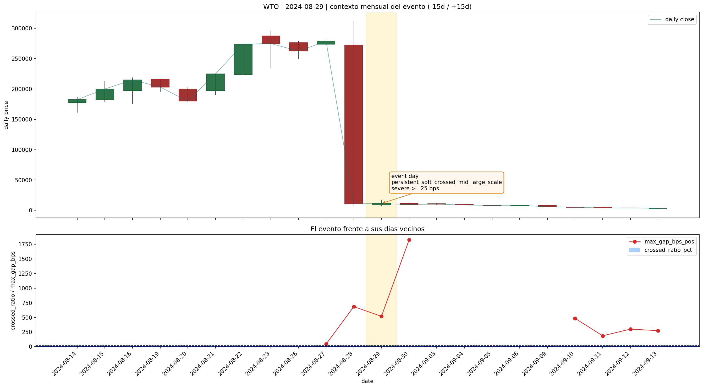

#### 00a Adjusted Proxy Contrast
Esta imagen responde a la pregunta de reconciliacion semantica: la discrepancia de precios viene de datos rotos o de vistas de precio distintas. Compara `daily raw`, `daily adjusted_proxy`, `quote mid raw` y `quote mid split_normalized`, y debajo ensena la cadena de dividendos y splits que produce la diferencia. La decision que cambia es si el inspector debe abrir una incidencia de calidad o cerrar el caso como diferencia legitima de semantica. El error que evita es mezclar series raw y adjusted como si fueran equivalentes. En pipelines reales, esto protege benchmarking, labels diarios y reconciliacion externa frente a falsas alarmas de precio.

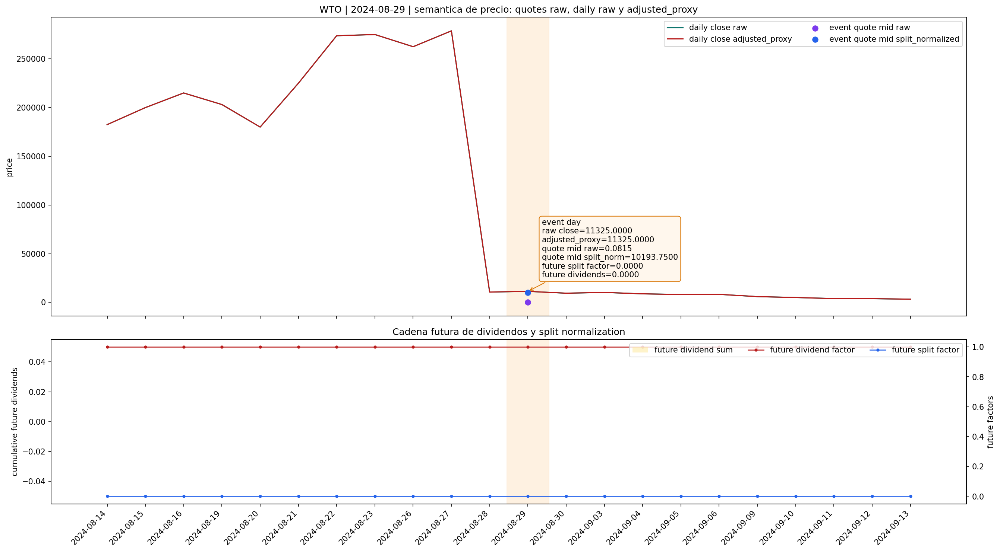

#### 00b Event Month Quotes Context
Esta imagen responde a la pregunta de recurrencia mensual dentro de `quotes`: el problema se concentra en el evento o reaparece en varias sesiones. Arriba concatena sesiones con datos disponibles; abajo resume cobertura diaria, `crossed_ratio_pct` y `max_gap_bps_pos`. La decision que cambia es si el caso debe leerse como episodio puntual o como sintoma de una fase repetida de libro degradado. El error que evita es extrapolar desde un unico dia a todo el mes sin evidencia.

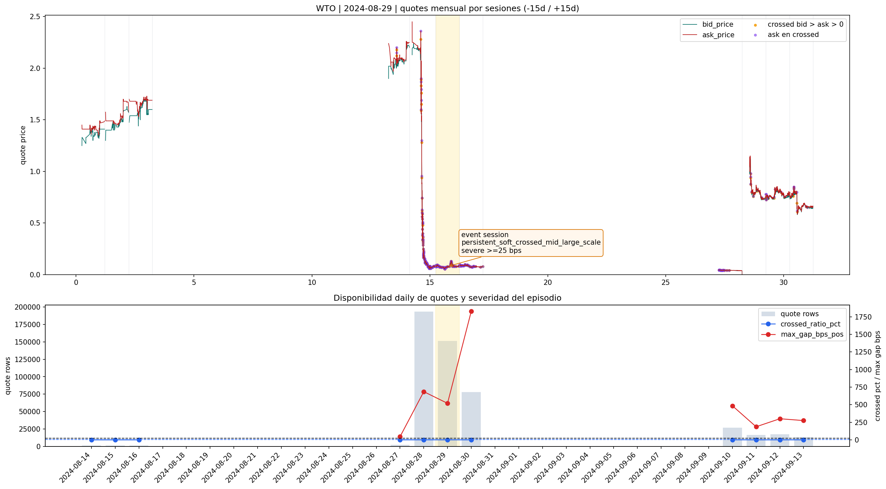

#### 01 Raw Window
Esta imagen responde a la primera pregunta decisiva del caso: el crossed observado es economicamente bastante fuerte para justificar un cambio de clase. Arriba ensena la geometria exacta del tramo conflictivo; abajo convierte esa geometria a bps y la enfrenta a los cortes `5 bps` y `25 bps`. El regimen dominante es `severe >=25 bps`. La decision que cambia es pasar de anomalia interpretable a `review` o `bad`. El error que evita es decidir por apariencia visual sin medir el dano economico real del crossed. En terminos de pipeline, este panel decide si el problema afecta solo a la lectura forense o si invalida simulacion de ejecucion y microstructure features.

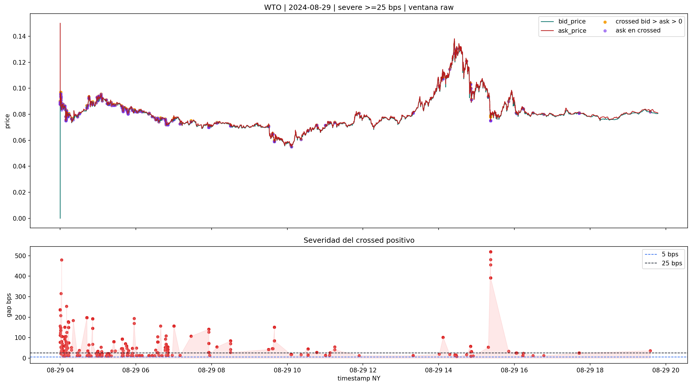

#### 02 Full Session Context
Esta imagen responde a la pregunta de extension intradiaria: el dano esta confinado a un bloque corto o contamina la sesion completa. Arriba se ve toda la sesion `04:00-20:00 NY`; abajo el `gap_bps` firmado. La decision que cambia es si el consumo debe penalizar solo un tramo o desechar el dia entero para uso operativo. El error que evita es tratar una cicatriz local como ruina total o, al reves, minimizar una degradacion distribuida a lo largo del dia. En ejecucion esto decide si la sesion puede seguir usandose con restricciones; en ML decide si las features intradiarias conservan significado economico.

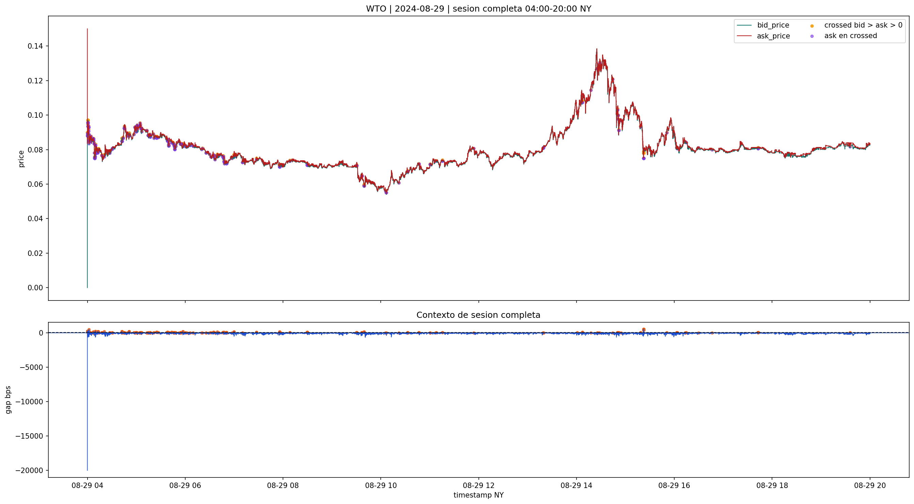

#### 03 Structure Diagnostics
Este panel responde a la pregunta de naturaleza del fallo: contradiccion economica genuina o mezcla con degeneracion estructural. Separa `ask=0` de `ask>0`, muestra la distribucion de `gap_bps` y resume patrones de integerizacion. La decision que cambia es como interpretar el dano: mercado localmente roto, artefacto de representacion o combinacion de ambos. El error que evita es sobrediagnosticar crossed reales cuando parte de la senal proviene de estructura degenerada del libro. Esta lectura afecta directamente a que el caso vaya a exclusion dura, a bandera contextual o a simple reconciliacion tecnica.

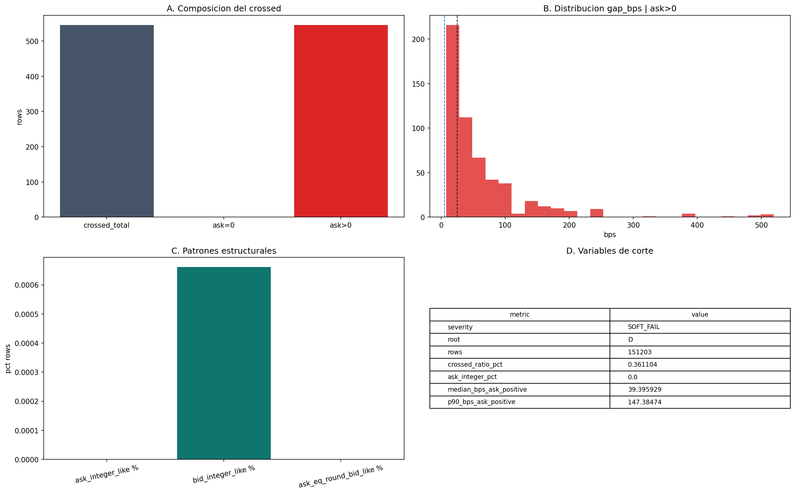

#### 04 Summary Card
Esta tarjeta responde a la pregunta de auditabilidad: cuales son exactamente las variables que sostienen la conclusion. Reune `severity`, `root`, `crossed_ratio_pct`, `ask_integer_pct`, `median_bps_ask_positive` y `p90_bps_ask_positive`. La decision que cambia es pasar de impresion visual a regla verificable. El error que evita es que dos inspectores lleguen a conclusiones distintas mirando la misma imagen sin una base numerica comun. Para gobernanza del proyecto, este panel es el que vuelve reproducible la decision para backtest, ML y auditoria.

---

### 29. PACW 2008-06-19

company_name: `PacWest Bancorp`
primary_exchange: `NASDAQ` (`XNAS`)
market_locale: `stocks/us`
scope: `review`
ticker: `PACW`
date: `2008-06-19`
taxonomy: `persistent_soft_crossed_mid_large_scale`
positive_cross_bucket: `positive_cross_severe_ge25bps`
severity: `SOFT_FAIL`
root: `D`
rows: `11615`
crossed_ratio_pct: `0.602669`
crossed_rows_raw: `70`
crossed_rows_ask_zero: `66`
crossed_rows_ask_positive: `4`
ask_integer_pct: `1.239776`
median_bps_ask_positive: `29.985007`
p90_bps_ask_positive: `29.985007`
file: `D:\quotes\PACW\year=2008\month=06\day=19\quotes.parquet`

#### Analisis Forense
La conclusion correcta del caso es que ya existe contradiccion economica real dentro del libro, pero aun no con fuerza suficiente para justificar exclusion dura sin contexto adicional. La taxonomy historica es `persistent_soft_crossed_mid_large_scale` y el regimen positivo dominante es `severe >=25 bps`. Esto importa porque la taxonomy no solo clasifica: resume que tipo de anomalia se esta viendo y que clase de decision contractual puede defenderse despues. La taxonomy `persistent_soft_crossed_mid_large_scale` implica un problema repetido y distribuido, no un simple pinchazo local. Por eso empuja a `review`: ya hay dano real, aunque no necesariamente exclusion dura universal. El regimen `severe >=25 bps` empuja el caso a una lectura economicamente dura: el crossed deja de ser cosmetico y pasa a cuestionar si el libro sigue siendo interpretable como mercado negociable. En terminos observables, el file tiene `crossed_ratio_pct=0.602669` con `crossed_rows_ask_positive=4` y `crossed_rows_ask_zero=66`. La severidad economica del crossed ask>0 se resume en `median_bps_ask_positive=29.985007` y `p90_bps_ask_positive=29.985007`. Estos dos numeros convierten una forma visual rara en una conclusion operativa sobre si el libro sigue representando o no un mercado negociable. La decision que cambia es pasar de libro sano a libro util solo bajo cautela. `review` significa: no usar como si fuera ejecucion limpia, conservar para analisis contextual y sensibilidad. El error que evita es tratar como normal un episodio que ya contiene contradiccion economica real y contaminar simulaciones de ejecucion o validaciones demasiado optimistas. El patron estructural muestra `ask_integer_pct=1.239776`. Este numero obliga a separar dos explicaciones rivales: contradiccion economica genuina del libro o mezcla con degeneracion estructural / integerizacion. La mayor parte del crossed vive en `ask=0`, pero existe una cola `ask>0` que impide absolver el caso como simple glitch. La lectura correcta es mixta: dano estructural dominante con residuo economico que aun puede justificar bandera o exclusion. Como `ask_integer_pct` es bajo, la hipotesis de simple degeneracion mecanica pierde fuerza. Eso endurece la interpretacion: el crossed se parece mas a contradiccion economica genuina y menos a artefacto. En la capa de semantica de precio del evento aparecen `daily raw close=16.8600`, `quote mid raw=16.4400`, `quote mid split_normalized=16.4400`, `daily adjusted_proxy=8.3517`. Ademas hay `post_event_dividend_sum=18.6100`. La implicacion metodologica es crucial: una discrepancia entre `quotes`, `daily` y una plataforma externa no puede leerse automaticamente como fallo del dataset. Puede ser semantica de precio distinta. El error que evita esta capa es mezclar raw, split-normalized y adjusted dentro del mismo pipeline, rompiendo auditoria, benchmarking y labels. Para pipelines, esto bloquea su uso como libro sano en ejecucion y features microestructurales principales, aunque aun puede mantenerse para forense, sensibilidad y estudios donde la anomalia sea parte del objeto de investigacion. Existe ademas una imagen historica de certificacion asociada. Su papel es poner el episodio en un marco causal mas amplio: halt, explained, not strongly explained o patron conocido. La regla que protege al proyecto es esta: el contexto externo se usa para explicar por que aparece el episodio, no para absolverlo. El error que evita es degradar el criterio de calidad del libro porque exista una historia plausible alrededor del caso.

#### 00 Event Month Context
Esta imagen responde a la pregunta de persistencia temporal: estamos ante un accidente local o ante una fase mas amplia de inestabilidad. Arriba coloca el evento en la serie `daily` real del mes; abajo compara `crossed_ratio_pct` y `max_gap_bps_pos` del dia contra sus vecinos. La decision que cambia es el peso estructural que se le concede al caso. El error que evita es juzgar igual un shock aislado y una degradacion repetida del libro.

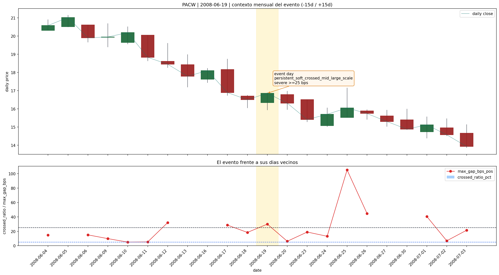

#### 00a Adjusted Proxy Contrast
Esta imagen responde a la pregunta de reconciliacion semantica: la discrepancia de precios viene de datos rotos o de vistas de precio distintas. Compara `daily raw`, `daily adjusted_proxy`, `quote mid raw` y `quote mid split_normalized`, y debajo ensena la cadena de dividendos y splits que produce la diferencia. La decision que cambia es si el inspector debe abrir una incidencia de calidad o cerrar el caso como diferencia legitima de semantica. El error que evita es mezclar series raw y adjusted como si fueran equivalentes. En pipelines reales, esto protege benchmarking, labels diarios y reconciliacion externa frente a falsas alarmas de precio.

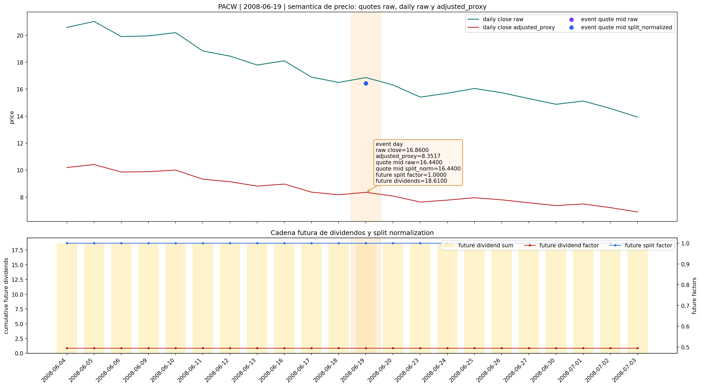

#### 00b Event Month Quotes Context
Esta imagen responde a la pregunta de recurrencia mensual dentro de `quotes`: el problema se concentra en el evento o reaparece en varias sesiones. Arriba concatena sesiones con datos disponibles; abajo resume cobertura diaria, `crossed_ratio_pct` y `max_gap_bps_pos`. La decision que cambia es si el caso debe leerse como episodio puntual o como sintoma de una fase repetida de libro degradado. El error que evita es extrapolar desde un unico dia a todo el mes sin evidencia.

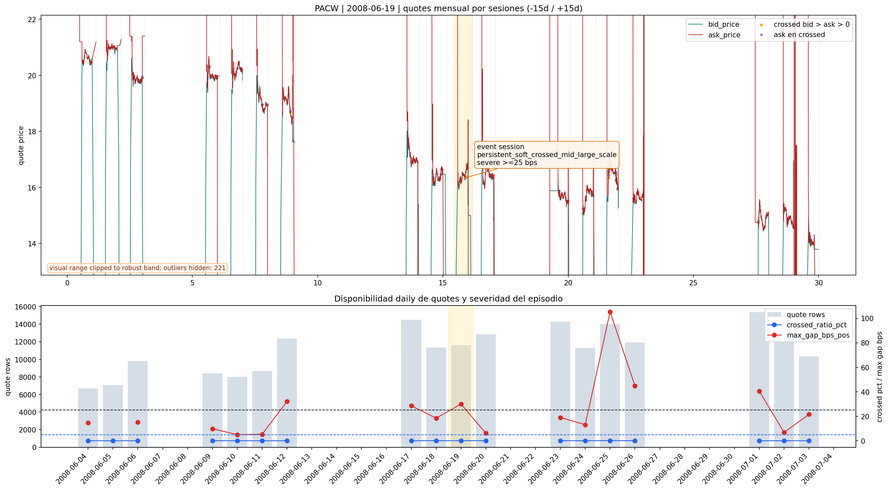

#### 01 Raw Window
Esta imagen responde a la primera pregunta decisiva del caso: el crossed observado es economicamente bastante fuerte para justificar un cambio de clase. Arriba ensena la geometria exacta del tramo conflictivo; abajo convierte esa geometria a bps y la enfrenta a los cortes `5 bps` y `25 bps`. El regimen dominante es `severe >=25 bps`. La decision que cambia es pasar de anomalia interpretable a `review` o `bad`. El error que evita es decidir por apariencia visual sin medir el dano economico real del crossed. En terminos de pipeline, este panel decide si el problema afecta solo a la lectura forense o si invalida simulacion de ejecucion y microstructure features.

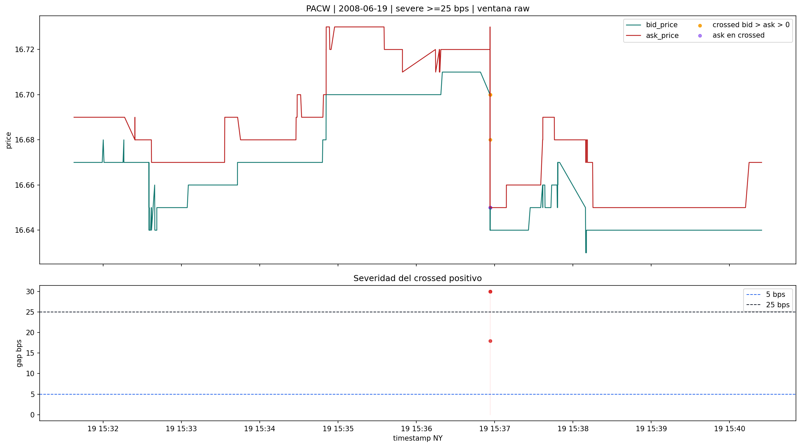

#### 02 Full Session Context
Esta imagen responde a la pregunta de extension intradiaria: el dano esta confinado a un bloque corto o contamina la sesion completa. Arriba se ve toda la sesion `04:00-20:00 NY`; abajo el `gap_bps` firmado. La decision que cambia es si el consumo debe penalizar solo un tramo o desechar el dia entero para uso operativo. El error que evita es tratar una cicatriz local como ruina total o, al reves, minimizar una degradacion distribuida a lo largo del dia. En ejecucion esto decide si la sesion puede seguir usandose con restricciones; en ML decide si las features intradiarias conservan significado economico.

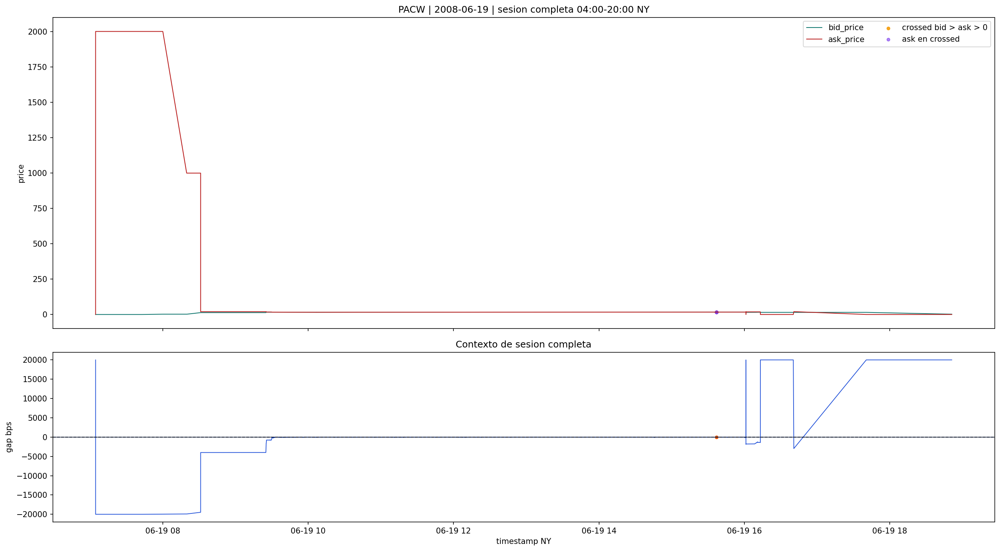

#### 03 Structure Diagnostics
Este panel responde a la pregunta de naturaleza del fallo: contradiccion economica genuina o mezcla con degeneracion estructural. Separa `ask=0` de `ask>0`, muestra la distribucion de `gap_bps` y resume patrones de integerizacion. La decision que cambia es como interpretar el dano: mercado localmente roto, artefacto de representacion o combinacion de ambos. El error que evita es sobrediagnosticar crossed reales cuando parte de la senal proviene de estructura degenerada del libro. Esta lectura afecta directamente a que el caso vaya a exclusion dura, a bandera contextual o a simple reconciliacion tecnica.

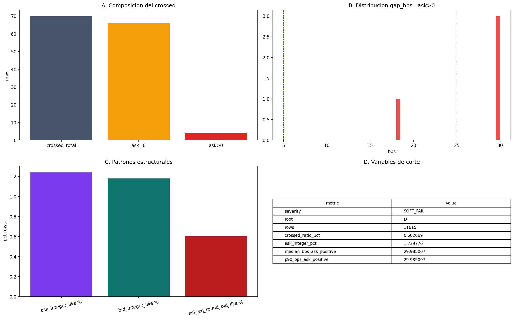

#### 04 Summary Card
Esta tarjeta responde a la pregunta de auditabilidad: cuales son exactamente las variables que sostienen la conclusion. Reune `severity`, `root`, `crossed_ratio_pct`, `ask_integer_pct`, `median_bps_ask_positive` y `p90_bps_ask_positive`. La decision que cambia es pasar de impresion visual a regla verificable. El error que evita es que dos inspectores lleguen a conclusiones distintas mirando la misma imagen sin una base numerica comun. Para gobernanza del proyecto, este panel es el que vuelve reproducible la decision para backtest, ML y auditoria.

---

### 30. BROG 2025-05-27

company_name: `Brooge Energy Limited Ordinary Shares`
primary_exchange: `NASDAQ` (`XNAS`)
market_locale: `stocks/us`
scope: `review`
ticker: `BROG`
date: `2025-05-27`
taxonomy: `persistent_soft_crossed_mid_large_scale`
positive_cross_bucket: `positive_cross_severe_ge25bps`
severity: `SOFT_FAIL`
root: `D`
rows: `35236`
crossed_ratio_pct: `0.411511`
crossed_rows_raw: `145`
crossed_rows_ask_zero: `0`
crossed_rows_ask_positive: `145`
ask_integer_pct: `4.001589`
median_bps_ask_positive: `28.612303`
p90_bps_ask_positive: `70.472163`
file: `D:\quotes\BROG\year=2025\month=05\day=27\quotes.parquet`

#### Analisis Forense
La conclusion correcta del caso es que ya existe contradiccion economica real dentro del libro, pero aun no con fuerza suficiente para justificar exclusion dura sin contexto adicional. La taxonomy historica es `persistent_soft_crossed_mid_large_scale` y el regimen positivo dominante es `severe >=25 bps`. Esto importa porque la taxonomy no solo clasifica: resume que tipo de anomalia se esta viendo y que clase de decision contractual puede defenderse despues. La taxonomy `persistent_soft_crossed_mid_large_scale` implica un problema repetido y distribuido, no un simple pinchazo local. Por eso empuja a `review`: ya hay dano real, aunque no necesariamente exclusion dura universal. El regimen `severe >=25 bps` empuja el caso a una lectura economicamente dura: el crossed deja de ser cosmetico y pasa a cuestionar si el libro sigue siendo interpretable como mercado negociable. En terminos observables, el file tiene `crossed_ratio_pct=0.411511` con `crossed_rows_ask_positive=145` y `crossed_rows_ask_zero=0`. La severidad economica del crossed ask>0 se resume en `median_bps_ask_positive=28.612303` y `p90_bps_ask_positive=70.472163`. Estos dos numeros convierten una forma visual rara en una conclusion operativa sobre si el libro sigue representando o no un mercado negociable. La decision que cambia es pasar de libro sano a libro util solo bajo cautela. `review` significa: no usar como si fuera ejecucion limpia, conservar para analisis contextual y sensibilidad. El error que evita es tratar como normal un episodio que ya contiene contradiccion economica real y contaminar simulaciones de ejecucion o validaciones demasiado optimistas. El patron estructural muestra `ask_integer_pct=4.001589`. Este numero obliga a separar dos explicaciones rivales: contradiccion economica genuina del libro o mezcla con degeneracion estructural / integerizacion. Toda la composicion crossed cae en `ask>0`. Eso endurece la lectura economica del caso: el dano no depende de ceros mecanicos, sino de contradiccion positiva dentro de precios aparentemente vivos. Como `ask_integer_pct` es bajo, la hipotesis de simple degeneracion mecanica pierde fuerza. Eso endurece la interpretacion: el crossed se parece mas a contradiccion economica genuina y menos a artefacto. Existe ademas una imagen historica de certificacion asociada. Su papel es poner el episodio en un marco causal mas amplio: halt, explained, not strongly explained o patron conocido. La regla que protege al proyecto es esta: el contexto externo se usa para explicar por que aparece el episodio, no para absolverlo. El error que evita es degradar el criterio de calidad del libro porque exista una historia plausible alrededor del caso.

#### 00 Event Month Context
Esta imagen responde a la pregunta de persistencia temporal: estamos ante un accidente local o ante una fase mas amplia de inestabilidad. Arriba coloca el evento en la serie `daily` real del mes; abajo compara `crossed_ratio_pct` y `max_gap_bps_pos` del dia contra sus vecinos. La decision que cambia es el peso estructural que se le concede al caso. El error que evita es juzgar igual un shock aislado y una degradacion repetida del libro.

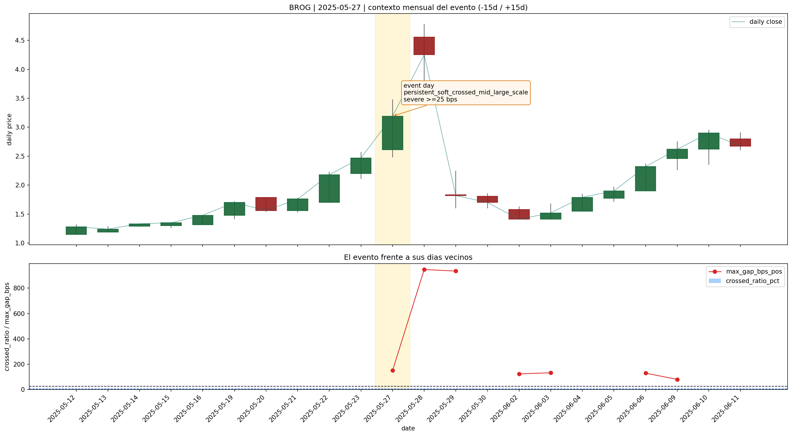

#### 00b Event Month Quotes Context
Esta imagen responde a la pregunta de recurrencia mensual dentro de `quotes`: el problema se concentra en el evento o reaparece en varias sesiones. Arriba concatena sesiones con datos disponibles; abajo resume cobertura diaria, `crossed_ratio_pct` y `max_gap_bps_pos`. La decision que cambia es si el caso debe leerse como episodio puntual o como sintoma de una fase repetida de libro degradado. El error que evita es extrapolar desde un unico dia a todo el mes sin evidencia.

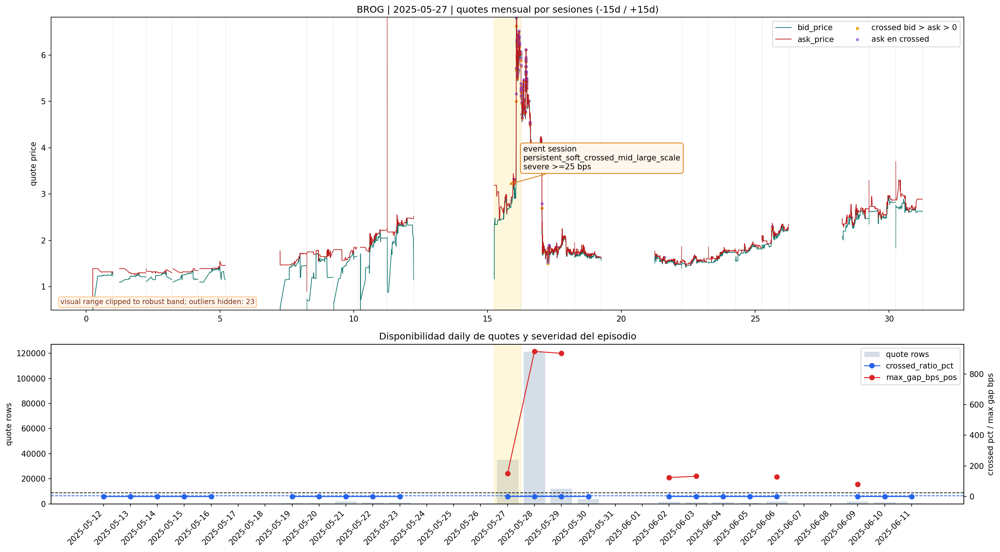

#### 01 Raw Window
Esta imagen responde a la primera pregunta decisiva del caso: el crossed observado es economicamente bastante fuerte para justificar un cambio de clase. Arriba ensena la geometria exacta del tramo conflictivo; abajo convierte esa geometria a bps y la enfrenta a los cortes `5 bps` y `25 bps`. El regimen dominante es `severe >=25 bps`. La decision que cambia es pasar de anomalia interpretable a `review` o `bad`. El error que evita es decidir por apariencia visual sin medir el dano economico real del crossed. En terminos de pipeline, este panel decide si el problema afecta solo a la lectura forense o si invalida simulacion de ejecucion y microstructure features.

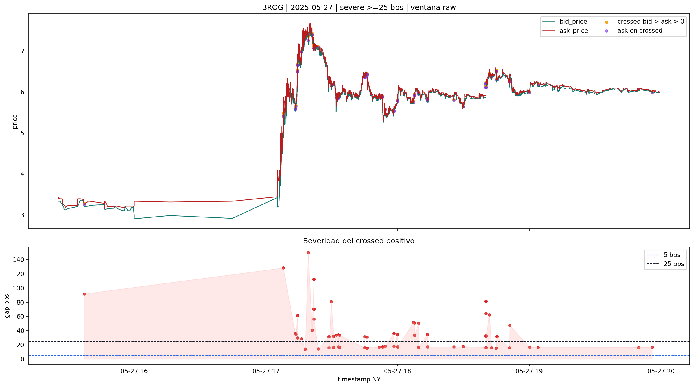

#### 02 Full Session Context
Esta imagen responde a la pregunta de extension intradiaria: el dano esta confinado a un bloque corto o contamina la sesion completa. Arriba se ve toda la sesion `04:00-20:00 NY`; abajo el `gap_bps` firmado. La decision que cambia es si el consumo debe penalizar solo un tramo o desechar el dia entero para uso operativo. El error que evita es tratar una cicatriz local como ruina total o, al reves, minimizar una degradacion distribuida a lo largo del dia. En ejecucion esto decide si la sesion puede seguir usandose con restricciones; en ML decide si las features intradiarias conservan significado economico.

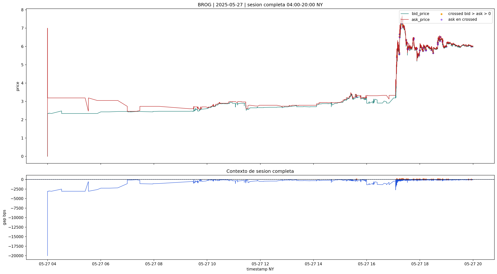

#### 03 Structure Diagnostics
Este panel responde a la pregunta de naturaleza del fallo: contradiccion economica genuina o mezcla con degeneracion estructural. Separa `ask=0` de `ask>0`, muestra la distribucion de `gap_bps` y resume patrones de integerizacion. La decision que cambia es como interpretar el dano: mercado localmente roto, artefacto de representacion o combinacion de ambos. El error que evita es sobrediagnosticar crossed reales cuando parte de la senal proviene de estructura degenerada del libro. Esta lectura afecta directamente a que el caso vaya a exclusion dura, a bandera contextual o a simple reconciliacion tecnica.

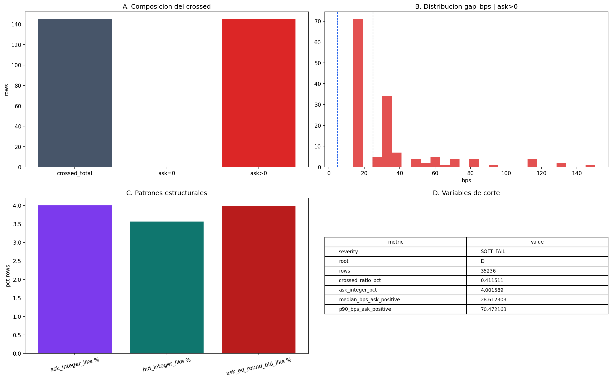

#### 04 Summary Card
Esta tarjeta responde a la pregunta de auditabilidad: cuales son exactamente las variables que sostienen la conclusion. Reune `severity`, `root`, `crossed_ratio_pct`, `ask_integer_pct`, `median_bps_ask_positive` y `p90_bps_ask_positive`. La decision que cambia es pasar de impresion visual a regla verificable. El error que evita es que dos inspectores lleguen a conclusiones distintas mirando la misma imagen sin una base numerica comun. Para gobernanza del proyecto, este panel es el que vuelve reproducible la decision para backtest, ML y auditoria.

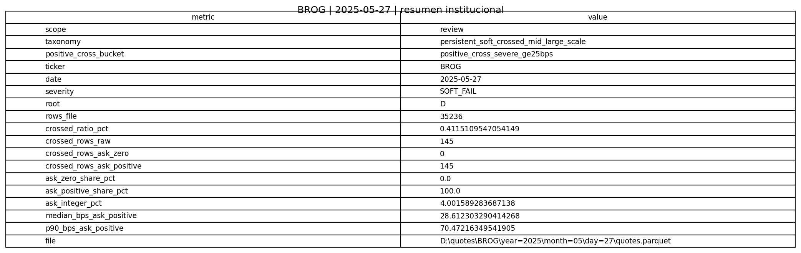

---

### 31. CPST 2005-09-07

company_name: `Capstone Turbine Corp`
primary_exchange: `NASDAQ` (`XNAS`)
market_locale: `stocks/us`
scope: `review`
ticker: `CPST`
date: `2005-09-07`
taxonomy: `persistent_soft_crossed_mid_large_scale`
positive_cross_bucket: `positive_cross_moderate_5to25bps`
severity: `SOFT_FAIL`
root: `D`
rows: `16593`
crossed_ratio_pct: `0.301332`
crossed_rows_raw: `50`
crossed_rows_ask_zero: `0`
crossed_rows_ask_positive: `50`
ask_integer_pct: `3.628036`
median_bps_ask_positive: `19.782394`
p90_bps_ask_positive: `20.060181`
file: `D:\quotes\CPST\year=2005\month=09\day=07\quotes.parquet`

#### Analisis Forense
La conclusion correcta del caso es que ya existe contradiccion economica real dentro del libro, pero aun no con fuerza suficiente para justificar exclusion dura sin contexto adicional. La taxonomy historica es `persistent_soft_crossed_mid_large_scale` y el regimen positivo dominante es `moderate 5-25 bps`. Esto importa porque la taxonomy no solo clasifica: resume que tipo de anomalia se esta viendo y que clase de decision contractual puede defenderse despues. La taxonomy `persistent_soft_crossed_mid_large_scale` implica un problema repetido y distribuido, no un simple pinchazo local. Por eso empuja a `review`: ya hay dano real, aunque no necesariamente exclusion dura universal. El regimen `moderate 5-25 bps` ya entra en zona donde el crossed tiene capacidad real de contaminar simulacion de ejecucion y features microestructurales, aunque todavia puede requerir lectura contextual antes de exclusion dura. En terminos observables, el file tiene `crossed_ratio_pct=0.301332` con `crossed_rows_ask_positive=50` y `crossed_rows_ask_zero=0`. La severidad economica del crossed ask>0 se resume en `median_bps_ask_positive=19.782394` y `p90_bps_ask_positive=20.060181`. Estos dos numeros convierten una forma visual rara en una conclusion operativa sobre si el libro sigue representando o no un mercado negociable. La decision que cambia es pasar de libro sano a libro util solo bajo cautela. `review` significa: no usar como si fuera ejecucion limpia, conservar para analisis contextual y sensibilidad. El error que evita es tratar como normal un episodio que ya contiene contradiccion economica real y contaminar simulaciones de ejecucion o validaciones demasiado optimistas. El patron estructural muestra `ask_integer_pct=3.628036`. Este numero obliga a separar dos explicaciones rivales: contradiccion economica genuina del libro o mezcla con degeneracion estructural / integerizacion. Toda la composicion crossed cae en `ask>0`. Eso endurece la lectura economica del caso: el dano no depende de ceros mecanicos, sino de contradiccion positiva dentro de precios aparentemente vivos. Como `ask_integer_pct` es bajo, la hipotesis de simple degeneracion mecanica pierde fuerza. Eso endurece la interpretacion: el crossed se parece mas a contradiccion economica genuina y menos a artefacto. Existe ademas una imagen historica de certificacion asociada. Su papel es poner el episodio en un marco causal mas amplio: halt, explained, not strongly explained o patron conocido. La regla que protege al proyecto es esta: el contexto externo se usa para explicar por que aparece el episodio, no para absolverlo. El error que evita es degradar el criterio de calidad del libro porque exista una historia plausible alrededor del caso.

#### 00 Event Month Context
Esta imagen responde a la pregunta de persistencia temporal: estamos ante un accidente local o ante una fase mas amplia de inestabilidad. Arriba coloca el evento en la serie `daily` real del mes; abajo compara `crossed_ratio_pct` y `max_gap_bps_pos` del dia contra sus vecinos. La decision que cambia es el peso estructural que se le concede al caso. El error que evita es juzgar igual un shock aislado y una degradacion repetida del libro.

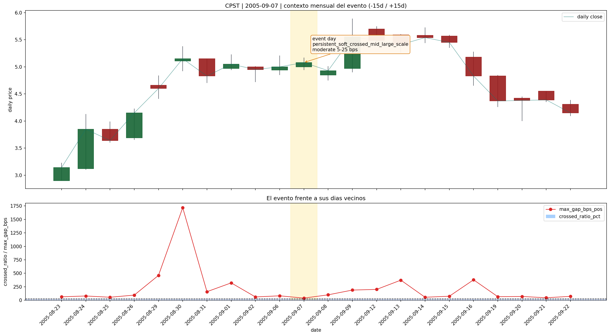

#### 00b Event Month Quotes Context
Esta imagen responde a la pregunta de recurrencia mensual dentro de `quotes`: el problema se concentra en el evento o reaparece en varias sesiones. Arriba concatena sesiones con datos disponibles; abajo resume cobertura diaria, `crossed_ratio_pct` y `max_gap_bps_pos`. La decision que cambia es si el caso debe leerse como episodio puntual o como sintoma de una fase repetida de libro degradado. El error que evita es extrapolar desde un unico dia a todo el mes sin evidencia.

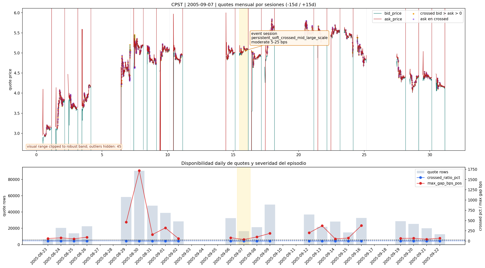

#### 01 Raw Window
Esta imagen responde a la primera pregunta decisiva del caso: el crossed observado es economicamente bastante fuerte para justificar un cambio de clase. Arriba ensena la geometria exacta del tramo conflictivo; abajo convierte esa geometria a bps y la enfrenta a los cortes `5 bps` y `25 bps`. El regimen dominante es `moderate 5-25 bps`. La decision que cambia es pasar de anomalia interpretable a `review` o `bad`. El error que evita es decidir por apariencia visual sin medir el dano economico real del crossed. En terminos de pipeline, este panel decide si el problema afecta solo a la lectura forense o si invalida simulacion de ejecucion y microstructure features.

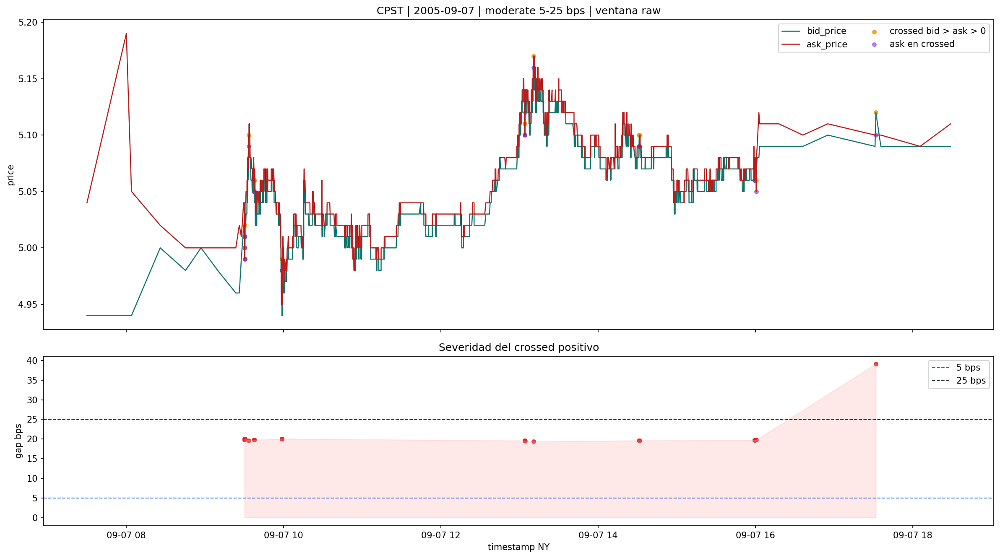

#### 02 Full Session Context
Esta imagen responde a la pregunta de extension intradiaria: el dano esta confinado a un bloque corto o contamina la sesion completa. Arriba se ve toda la sesion `04:00-20:00 NY`; abajo el `gap_bps` firmado. La decision que cambia es si el consumo debe penalizar solo un tramo o desechar el dia entero para uso operativo. El error que evita es tratar una cicatriz local como ruina total o, al reves, minimizar una degradacion distribuida a lo largo del dia. En ejecucion esto decide si la sesion puede seguir usandose con restricciones; en ML decide si las features intradiarias conservan significado economico.

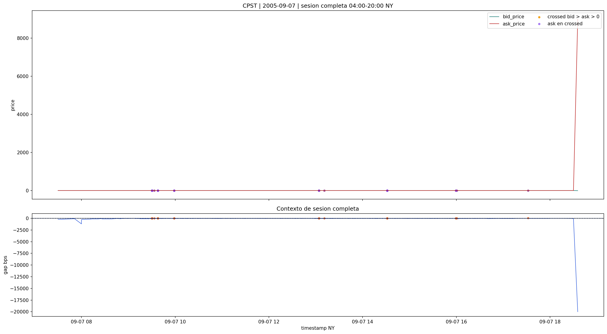

#### 03 Structure Diagnostics
Este panel responde a la pregunta de naturaleza del fallo: contradiccion economica genuina o mezcla con degeneracion estructural. Separa `ask=0` de `ask>0`, muestra la distribucion de `gap_bps` y resume patrones de integerizacion. La decision que cambia es como interpretar el dano: mercado localmente roto, artefacto de representacion o combinacion de ambos. El error que evita es sobrediagnosticar crossed reales cuando parte de la senal proviene de estructura degenerada del libro. Esta lectura afecta directamente a que el caso vaya a exclusion dura, a bandera contextual o a simple reconciliacion tecnica.

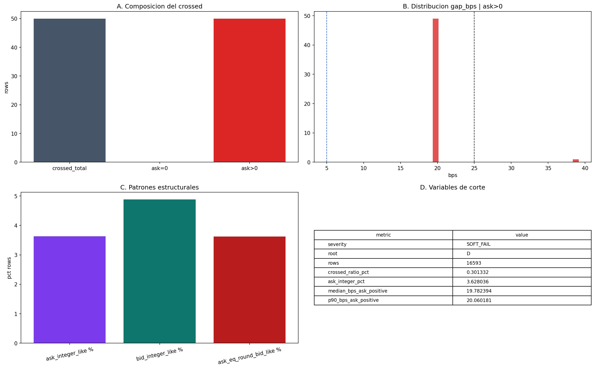

#### 04 Summary Card
Esta tarjeta responde a la pregunta de auditabilidad: cuales son exactamente las variables que sostienen la conclusion. Reune `severity`, `root`, `crossed_ratio_pct`, `ask_integer_pct`, `median_bps_ask_positive` y `p90_bps_ask_positive`. La decision que cambia es pasar de impresion visual a regla verificable. El error que evita es que dos inspectores lleguen a conclusiones distintas mirando la misma imagen sin una base numerica comun. Para gobernanza del proyecto, este panel es el que vuelve reproducible la decision para backtest, ML y auditoria.

---

### 32. QNTM 2024-08-16

company_name: `Quantum Biopharma Ltd. Class B Subordinate Voting Shares`
primary_exchange: `NASDAQ` (`XNAS`)
market_locale: `stocks/us`
scope: `review`
ticker: `QNTM`
date: `2024-08-16`
taxonomy: `persistent_soft_crossed_mid_large_scale`
positive_cross_bucket: `positive_cross_moderate_5to25bps`
severity: `SOFT_FAIL`
root: `D`
rows: `24003`
crossed_ratio_pct: `0.374953`
crossed_rows_raw: `90`
crossed_rows_ask_zero: `0`
crossed_rows_ask_positive: `90`
ask_integer_pct: `4.670250`
median_bps_ask_positive: `18.885741`
p90_bps_ask_positive: `75.372902`
file: `D:\quotes\QNTM\year=2024\month=08\day=16\quotes.parquet`

#### Analisis Forense
La conclusion correcta del caso es que ya existe contradiccion economica real dentro del libro, pero aun no con fuerza suficiente para justificar exclusion dura sin contexto adicional. La taxonomy historica es `persistent_soft_crossed_mid_large_scale` y el regimen positivo dominante es `moderate 5-25 bps`. Esto importa porque la taxonomy no solo clasifica: resume que tipo de anomalia se esta viendo y que clase de decision contractual puede defenderse despues. La taxonomy `persistent_soft_crossed_mid_large_scale` implica un problema repetido y distribuido, no un simple pinchazo local. Por eso empuja a `review`: ya hay dano real, aunque no necesariamente exclusion dura universal. El regimen `moderate 5-25 bps` ya entra en zona donde el crossed tiene capacidad real de contaminar simulacion de ejecucion y features microestructurales, aunque todavia puede requerir lectura contextual antes de exclusion dura. En terminos observables, el file tiene `crossed_ratio_pct=0.374953` con `crossed_rows_ask_positive=90` y `crossed_rows_ask_zero=0`. La severidad economica del crossed ask>0 se resume en `median_bps_ask_positive=18.885741` y `p90_bps_ask_positive=75.372902`. Estos dos numeros convierten una forma visual rara en una conclusion operativa sobre si el libro sigue representando o no un mercado negociable. La decision que cambia es pasar de libro sano a libro util solo bajo cautela. `review` significa: no usar como si fuera ejecucion limpia, conservar para analisis contextual y sensibilidad. El error que evita es tratar como normal un episodio que ya contiene contradiccion economica real y contaminar simulaciones de ejecucion o validaciones demasiado optimistas. El patron estructural muestra `ask_integer_pct=4.670250`. Este numero obliga a separar dos explicaciones rivales: contradiccion economica genuina del libro o mezcla con degeneracion estructural / integerizacion. Toda la composicion crossed cae en `ask>0`. Eso endurece la lectura economica del caso: el dano no depende de ceros mecanicos, sino de contradiccion positiva dentro de precios aparentemente vivos. Como `ask_integer_pct` es bajo, la hipotesis de simple degeneracion mecanica pierde fuerza. Eso endurece la interpretacion: el crossed se parece mas a contradiccion economica genuina y menos a artefacto. Existe ademas una imagen historica de certificacion asociada. Su papel es poner el episodio en un marco causal mas amplio: halt, explained, not strongly explained o patron conocido. La regla que protege al proyecto es esta: el contexto externo se usa para explicar por que aparece el episodio, no para absolverlo. El error que evita es degradar el criterio de calidad del libro porque exista una historia plausible alrededor del caso.

#### 00 Event Month Context
Esta imagen responde a la pregunta de persistencia temporal: estamos ante un accidente local o ante una fase mas amplia de inestabilidad. Arriba coloca el evento en la serie `daily` real del mes; abajo compara `crossed_ratio_pct` y `max_gap_bps_pos` del dia contra sus vecinos. La decision que cambia es el peso estructural que se le concede al caso. El error que evita es juzgar igual un shock aislado y una degradacion repetida del libro.

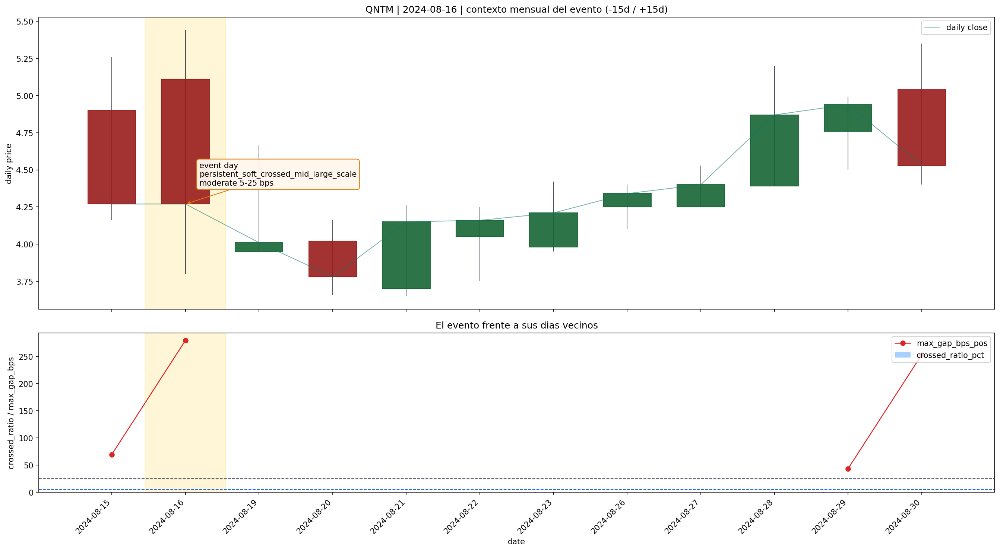

#### 00b Event Month Quotes Context
Esta imagen responde a la pregunta de recurrencia mensual dentro de `quotes`: el problema se concentra en el evento o reaparece en varias sesiones. Arriba concatena sesiones con datos disponibles; abajo resume cobertura diaria, `crossed_ratio_pct` y `max_gap_bps_pos`. La decision que cambia es si el caso debe leerse como episodio puntual o como sintoma de una fase repetida de libro degradado. El error que evita es extrapolar desde un unico dia a todo el mes sin evidencia.

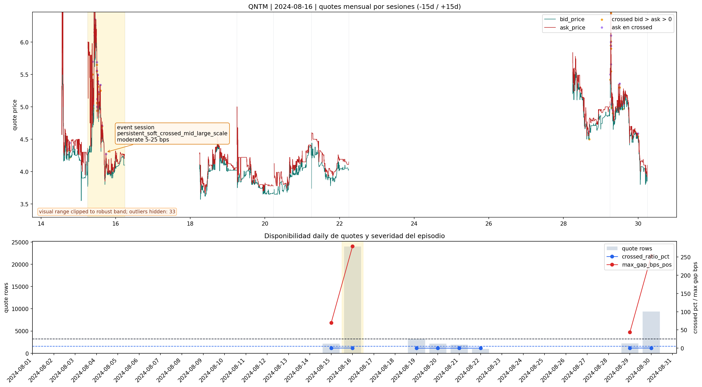

#### 01 Raw Window
Esta imagen responde a la primera pregunta decisiva del caso: el crossed observado es economicamente bastante fuerte para justificar un cambio de clase. Arriba ensena la geometria exacta del tramo conflictivo; abajo convierte esa geometria a bps y la enfrenta a los cortes `5 bps` y `25 bps`. El regimen dominante es `moderate 5-25 bps`. La decision que cambia es pasar de anomalia interpretable a `review` o `bad`. El error que evita es decidir por apariencia visual sin medir el dano economico real del crossed. En terminos de pipeline, este panel decide si el problema afecta solo a la lectura forense o si invalida simulacion de ejecucion y microstructure features.

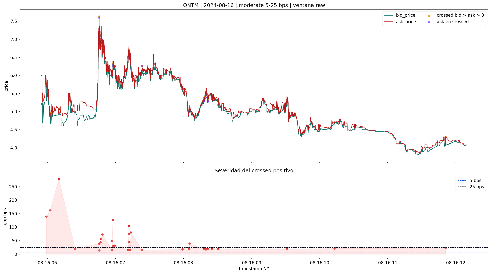

#### 02 Full Session Context
Esta imagen responde a la pregunta de extension intradiaria: el dano esta confinado a un bloque corto o contamina la sesion completa. Arriba se ve toda la sesion `04:00-20:00 NY`; abajo el `gap_bps` firmado. La decision que cambia es si el consumo debe penalizar solo un tramo o desechar el dia entero para uso operativo. El error que evita es tratar una cicatriz local como ruina total o, al reves, minimizar una degradacion distribuida a lo largo del dia. En ejecucion esto decide si la sesion puede seguir usandose con restricciones; en ML decide si las features intradiarias conservan significado economico.

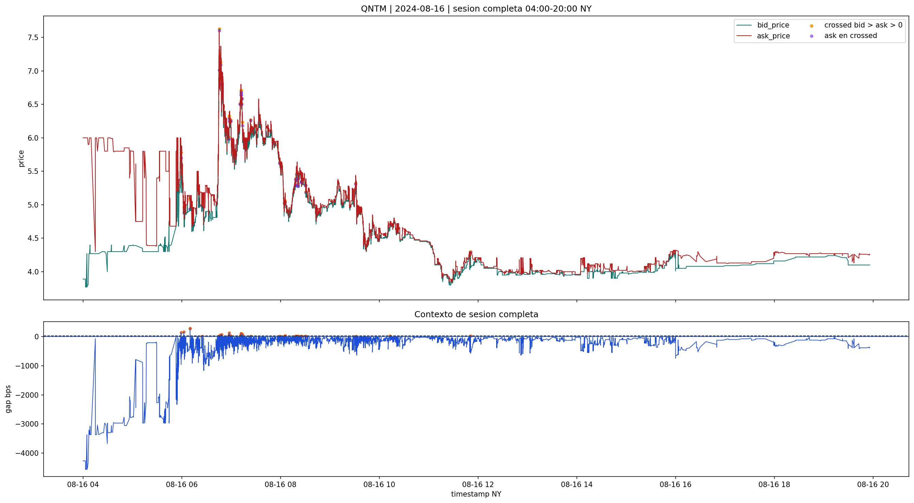

#### 03 Structure Diagnostics
Este panel responde a la pregunta de naturaleza del fallo: contradiccion economica genuina o mezcla con degeneracion estructural. Separa `ask=0` de `ask>0`, muestra la distribucion de `gap_bps` y resume patrones de integerizacion. La decision que cambia es como interpretar el dano: mercado localmente roto, artefacto de representacion o combinacion de ambos. El error que evita es sobrediagnosticar crossed reales cuando parte de la senal proviene de estructura degenerada del libro. Esta lectura afecta directamente a que el caso vaya a exclusion dura, a bandera contextual o a simple reconciliacion tecnica.

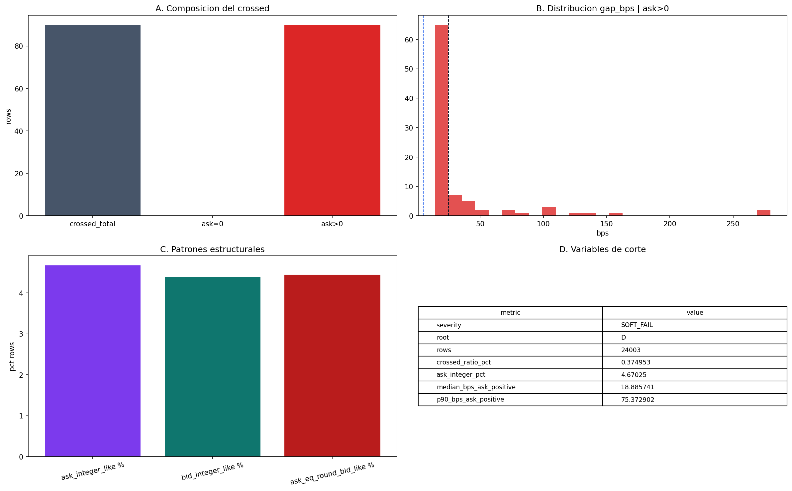

#### 04 Summary Card
Esta tarjeta responde a la pregunta de auditabilidad: cuales son exactamente las variables que sostienen la conclusion. Reune `severity`, `root`, `crossed_ratio_pct`, `ask_integer_pct`, `median_bps_ask_positive` y `p90_bps_ask_positive`. La decision que cambia es pasar de impresion visual a regla verificable. El error que evita es que dos inspectores lleguen a conclusiones distintas mirando la misma imagen sin una base numerica comun. Para gobernanza del proyecto, este panel es el que vuelve reproducible la decision para backtest, ML y auditoria.

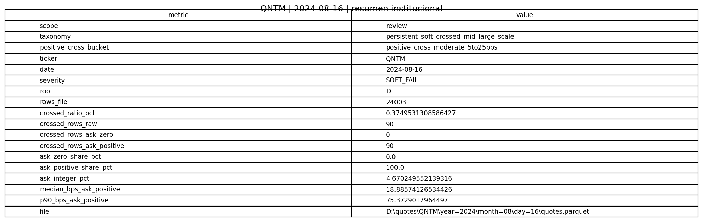

---

### 33. DSX 2008-10-08

company_name: `Diana Shipping, Inc.`
primary_exchange: `NYSE` (`XNYS`)
market_locale: `stocks/us`
scope: `review`
ticker: `DSX`
date: `2008-10-08`
taxonomy: `persistent_soft_crossed_mid_large_scale`
positive_cross_bucket: `positive_cross_moderate_5to25bps`
severity: `SOFT_FAIL`
root: `D`
rows: `84905`
crossed_ratio_pct: `0.382781`
crossed_rows_raw: `325`
crossed_rows_ask_zero: `0`
crossed_rows_ask_positive: `325`
ask_integer_pct: `1.353277`
median_bps_ask_positive: `13.651877`
p90_bps_ask_positive: `50.779833`
file: `D:\quotes\DSX\year=2008\month=10\day=08\quotes.parquet`

#### Analisis Forense
La conclusion correcta del caso es que ya existe contradiccion economica real dentro del libro, pero aun no con fuerza suficiente para justificar exclusion dura sin contexto adicional. La taxonomy historica es `persistent_soft_crossed_mid_large_scale` y el regimen positivo dominante es `moderate 5-25 bps`. Esto importa porque la taxonomy no solo clasifica: resume que tipo de anomalia se esta viendo y que clase de decision contractual puede defenderse despues. La taxonomy `persistent_soft_crossed_mid_large_scale` implica un problema repetido y distribuido, no un simple pinchazo local. Por eso empuja a `review`: ya hay dano real, aunque no necesariamente exclusion dura universal. El regimen `moderate 5-25 bps` ya entra en zona donde el crossed tiene capacidad real de contaminar simulacion de ejecucion y features microestructurales, aunque todavia puede requerir lectura contextual antes de exclusion dura. En terminos observables, el file tiene `crossed_ratio_pct=0.382781` con `crossed_rows_ask_positive=325` y `crossed_rows_ask_zero=0`. La severidad economica del crossed ask>0 se resume en `median_bps_ask_positive=13.651877` y `p90_bps_ask_positive=50.779833`. Estos dos numeros convierten una forma visual rara en una conclusion operativa sobre si el libro sigue representando o no un mercado negociable. La decision que cambia es pasar de libro sano a libro util solo bajo cautela. `review` significa: no usar como si fuera ejecucion limpia, conservar para analisis contextual y sensibilidad. El error que evita es tratar como normal un episodio que ya contiene contradiccion economica real y contaminar simulaciones de ejecucion o validaciones demasiado optimistas. El patron estructural muestra `ask_integer_pct=1.353277`. Este numero obliga a separar dos explicaciones rivales: contradiccion economica genuina del libro o mezcla con degeneracion estructural / integerizacion. Toda la composicion crossed cae en `ask>0`. Eso endurece la lectura economica del caso: el dano no depende de ceros mecanicos, sino de contradiccion positiva dentro de precios aparentemente vivos. Como `ask_integer_pct` es bajo, la hipotesis de simple degeneracion mecanica pierde fuerza. Eso endurece la interpretacion: el crossed se parece mas a contradiccion economica genuina y menos a artefacto. En la capa de semantica de precio del evento aparecen `daily raw close=12.3647`, `quote mid raw=14.1300`, `quote mid split_normalized=11.2718`, `daily adjusted_proxy=8.8443`. La reconciliacion incluye `future_split_factor=1.2536`. Ademas hay `post_event_dividend_sum=2.6850`. La implicacion metodologica es crucial: una discrepancia entre `quotes`, `daily` y una plataforma externa no puede leerse automaticamente como fallo del dataset. Puede ser semantica de precio distinta. El error que evita esta capa es mezclar raw, split-normalized y adjusted dentro del mismo pipeline, rompiendo auditoria, benchmarking y labels. Para pipelines, esto bloquea su uso como libro sano en ejecucion y features microestructurales principales, aunque aun puede mantenerse para forense, sensibilidad y estudios donde la anomalia sea parte del objeto de investigacion. Existe ademas una imagen historica de certificacion asociada. Su papel es poner el episodio en un marco causal mas amplio: halt, explained, not strongly explained o patron conocido. La regla que protege al proyecto es esta: el contexto externo se usa para explicar por que aparece el episodio, no para absolverlo. El error que evita es degradar el criterio de calidad del libro porque exista una historia plausible alrededor del caso.

#### 00 Event Month Context
Esta imagen responde a la pregunta de persistencia temporal: estamos ante un accidente local o ante una fase mas amplia de inestabilidad. Arriba coloca el evento en la serie `daily` real del mes; abajo compara `crossed_ratio_pct` y `max_gap_bps_pos` del dia contra sus vecinos. La decision que cambia es el peso estructural que se le concede al caso. El error que evita es juzgar igual un shock aislado y una degradacion repetida del libro.

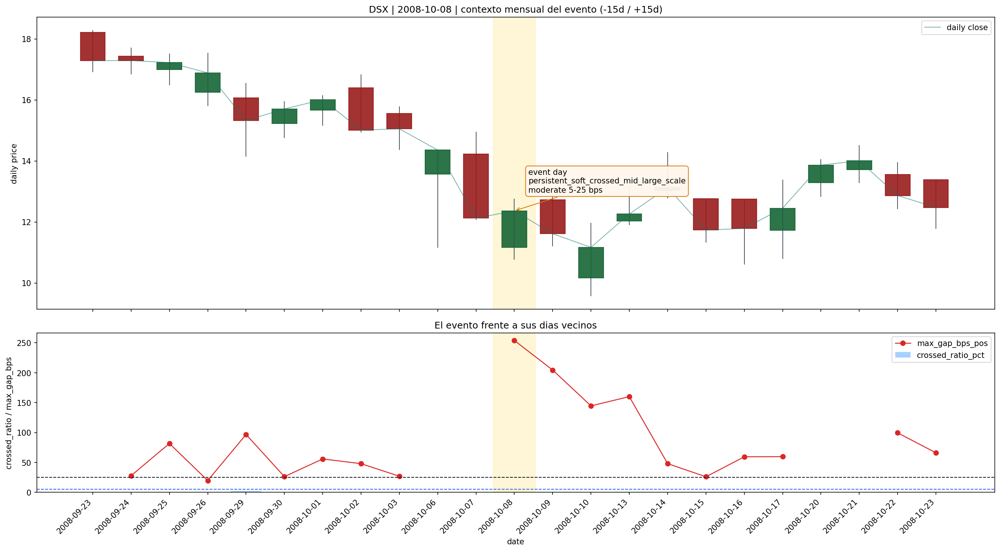

#### 00a Adjusted Proxy Contrast
Esta imagen responde a la pregunta de reconciliacion semantica: la discrepancia de precios viene de datos rotos o de vistas de precio distintas. Compara `daily raw`, `daily adjusted_proxy`, `quote mid raw` y `quote mid split_normalized`, y debajo ensena la cadena de dividendos y splits que produce la diferencia. La decision que cambia es si el inspector debe abrir una incidencia de calidad o cerrar el caso como diferencia legitima de semantica. El error que evita es mezclar series raw y adjusted como si fueran equivalentes. En pipelines reales, esto protege benchmarking, labels diarios y reconciliacion externa frente a falsas alarmas de precio.

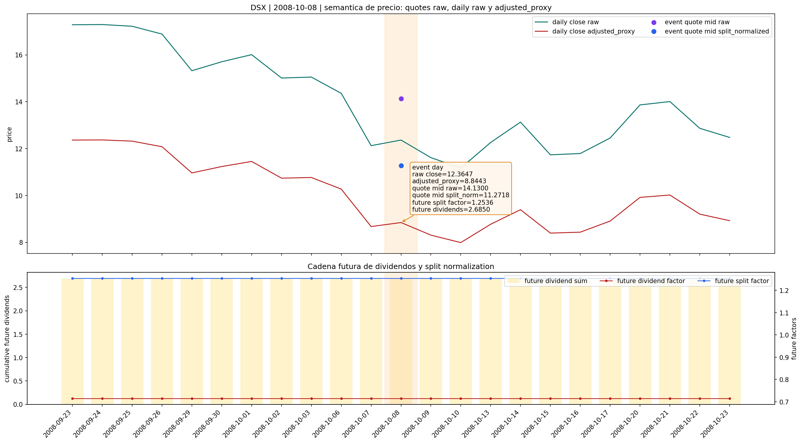

#### 00b Event Month Quotes Context
Esta imagen responde a la pregunta de recurrencia mensual dentro de `quotes`: el problema se concentra en el evento o reaparece en varias sesiones. Arriba concatena sesiones con datos disponibles; abajo resume cobertura diaria, `crossed_ratio_pct` y `max_gap_bps_pos`. La decision que cambia es si el caso debe leerse como episodio puntual o como sintoma de una fase repetida de libro degradado. El error que evita es extrapolar desde un unico dia a todo el mes sin evidencia.

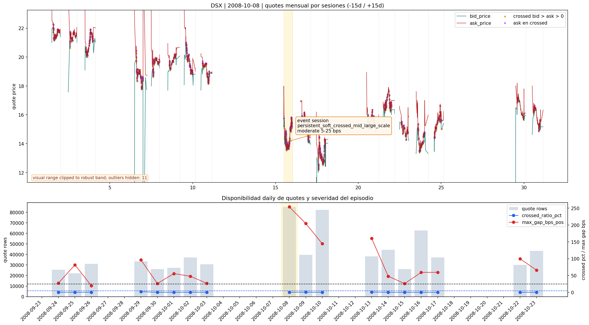

#### 01 Raw Window
Esta imagen responde a la primera pregunta decisiva del caso: el crossed observado es economicamente bastante fuerte para justificar un cambio de clase. Arriba ensena la geometria exacta del tramo conflictivo; abajo convierte esa geometria a bps y la enfrenta a los cortes `5 bps` y `25 bps`. El regimen dominante es `moderate 5-25 bps`. La decision que cambia es pasar de anomalia interpretable a `review` o `bad`. El error que evita es decidir por apariencia visual sin medir el dano economico real del crossed. En terminos de pipeline, este panel decide si el problema afecta solo a la lectura forense o si invalida simulacion de ejecucion y microstructure features.

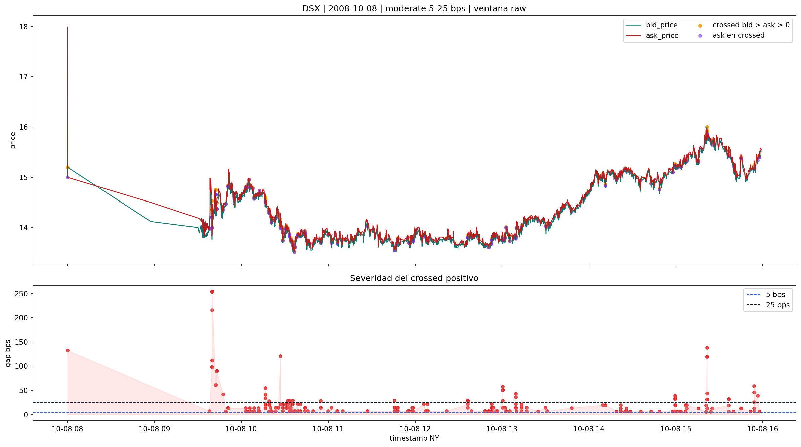

#### 02 Full Session Context
Esta imagen responde a la pregunta de extension intradiaria: el dano esta confinado a un bloque corto o contamina la sesion completa. Arriba se ve toda la sesion `04:00-20:00 NY`; abajo el `gap_bps` firmado. La decision que cambia es si el consumo debe penalizar solo un tramo o desechar el dia entero para uso operativo. El error que evita es tratar una cicatriz local como ruina total o, al reves, minimizar una degradacion distribuida a lo largo del dia. En ejecucion esto decide si la sesion puede seguir usandose con restricciones; en ML decide si las features intradiarias conservan significado economico.

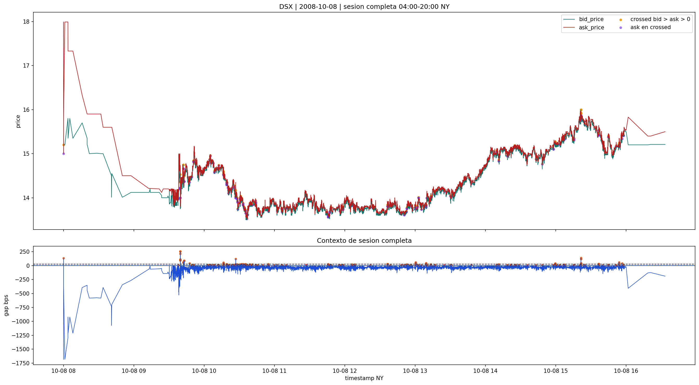

#### 03 Structure Diagnostics
Este panel responde a la pregunta de naturaleza del fallo: contradiccion economica genuina o mezcla con degeneracion estructural. Separa `ask=0` de `ask>0`, muestra la distribucion de `gap_bps` y resume patrones de integerizacion. La decision que cambia es como interpretar el dano: mercado localmente roto, artefacto de representacion o combinacion de ambos. El error que evita es sobrediagnosticar crossed reales cuando parte de la senal proviene de estructura degenerada del libro. Esta lectura afecta directamente a que el caso vaya a exclusion dura, a bandera contextual o a simple reconciliacion tecnica.

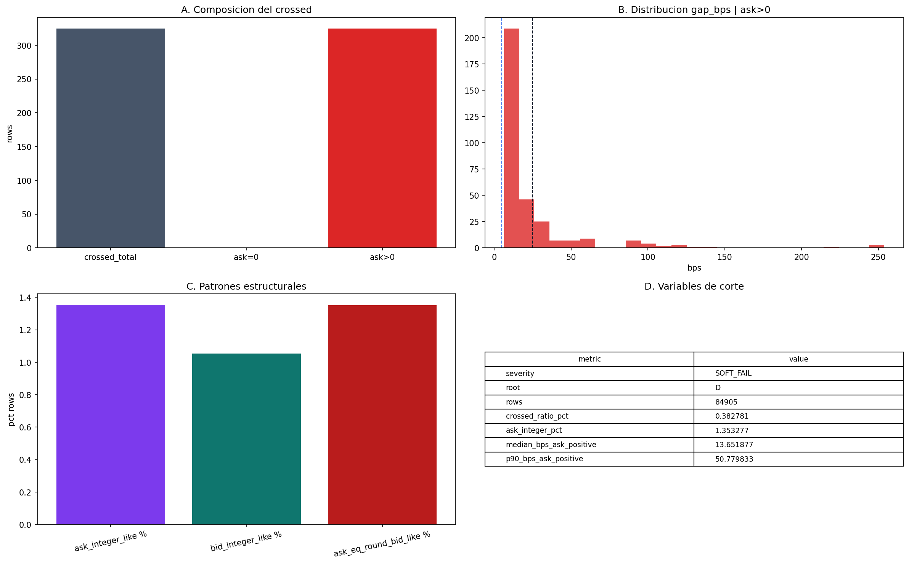

#### 04 Summary Card
Esta tarjeta responde a la pregunta de auditabilidad: cuales son exactamente las variables que sostienen la conclusion. Reune `severity`, `root`, `crossed_ratio_pct`, `ask_integer_pct`, `median_bps_ask_positive` y `p90_bps_ask_positive`. La decision que cambia es pasar de impresion visual a regla verificable. El error que evita es que dos inspectores lleguen a conclusiones distintas mirando la misma imagen sin una base numerica comun. Para gobernanza del proyecto, este panel es el que vuelve reproducible la decision para backtest, ML y auditoria.

---

### 34. IRET 2012-04-16

company_name: `Investors Real Estate Trust`
primary_exchange: `NYSE` (`XNYS`)
market_locale: `stocks/us`
scope: `review`
ticker: `IRET`
date: `2012-04-16`
taxonomy: `persistent_soft_crossed_mid_large_scale`
positive_cross_bucket: `positive_cross_moderate_5to25bps`
severity: `SOFT_FAIL`
root: `D`
rows: `11997`
crossed_ratio_pct: `0.575144`
crossed_rows_raw: `69`
crossed_rows_ask_zero: `6`
crossed_rows_ask_positive: `63`
ask_integer_pct: `0.050013`
median_bps_ask_positive: `13.614704`
p90_bps_ask_positive: `27.137042`
file: `D:\quotes\IRET\year=2012\month=04\day=16\quotes.parquet`

#### Analisis Forense
La conclusion correcta del caso es que ya existe contradiccion economica real dentro del libro, pero aun no con fuerza suficiente para justificar exclusion dura sin contexto adicional. La taxonomy historica es `persistent_soft_crossed_mid_large_scale` y el regimen positivo dominante es `moderate 5-25 bps`. Esto importa porque la taxonomy no solo clasifica: resume que tipo de anomalia se esta viendo y que clase de decision contractual puede defenderse despues. La taxonomy `persistent_soft_crossed_mid_large_scale` implica un problema repetido y distribuido, no un simple pinchazo local. Por eso empuja a `review`: ya hay dano real, aunque no necesariamente exclusion dura universal. El regimen `moderate 5-25 bps` ya entra en zona donde el crossed tiene capacidad real de contaminar simulacion de ejecucion y features microestructurales, aunque todavia puede requerir lectura contextual antes de exclusion dura. En terminos observables, el file tiene `crossed_ratio_pct=0.575144` con `crossed_rows_ask_positive=63` y `crossed_rows_ask_zero=6`. La severidad economica del crossed ask>0 se resume en `median_bps_ask_positive=13.614704` y `p90_bps_ask_positive=27.137042`. Estos dos numeros convierten una forma visual rara en una conclusion operativa sobre si el libro sigue representando o no un mercado negociable. La decision que cambia es pasar de libro sano a libro util solo bajo cautela. `review` significa: no usar como si fuera ejecucion limpia, conservar para analisis contextual y sensibilidad. El error que evita es tratar como normal un episodio que ya contiene contradiccion economica real y contaminar simulaciones de ejecucion o validaciones demasiado optimistas. El patron estructural muestra `ask_integer_pct=0.050013`. Este numero obliga a separar dos explicaciones rivales: contradiccion economica genuina del libro o mezcla con degeneracion estructural / integerizacion. La mayor parte del crossed vive en `ask>0`, de modo que el corazon del problema sigue siendo economico. La parte `ask=0`, si existe, acompana pero no explica por si sola la anomalia. Como `ask_integer_pct` es bajo, la hipotesis de simple degeneracion mecanica pierde fuerza. Eso endurece la interpretacion: el crossed se parece mas a contradiccion economica genuina y menos a artefacto. En la capa de semantica de precio del evento aparecen `daily raw close=7.2700`, `quote mid raw=7.3150`, `quote mid split_normalized=7.3150`, `daily adjusted_proxy=5.6362`. Ademas hay `post_event_dividend_sum=2.3167`. La implicacion metodologica es crucial: una discrepancia entre `quotes`, `daily` y una plataforma externa no puede leerse automaticamente como fallo del dataset. Puede ser semantica de precio distinta. El error que evita esta capa es mezclar raw, split-normalized y adjusted dentro del mismo pipeline, rompiendo auditoria, benchmarking y labels. Para pipelines, esto bloquea su uso como libro sano en ejecucion y features microestructurales principales, aunque aun puede mantenerse para forense, sensibilidad y estudios donde la anomalia sea parte del objeto de investigacion. Existe ademas una imagen historica de certificacion asociada. Su papel es poner el episodio en un marco causal mas amplio: halt, explained, not strongly explained o patron conocido. La regla que protege al proyecto es esta: el contexto externo se usa para explicar por que aparece el episodio, no para absolverlo. El error que evita es degradar el criterio de calidad del libro porque exista una historia plausible alrededor del caso.

#### 00 Event Month Context
Esta imagen responde a la pregunta de persistencia temporal: estamos ante un accidente local o ante una fase mas amplia de inestabilidad. Arriba coloca el evento en la serie `daily` real del mes; abajo compara `crossed_ratio_pct` y `max_gap_bps_pos` del dia contra sus vecinos. La decision que cambia es el peso estructural que se le concede al caso. El error que evita es juzgar igual un shock aislado y una degradacion repetida del libro.

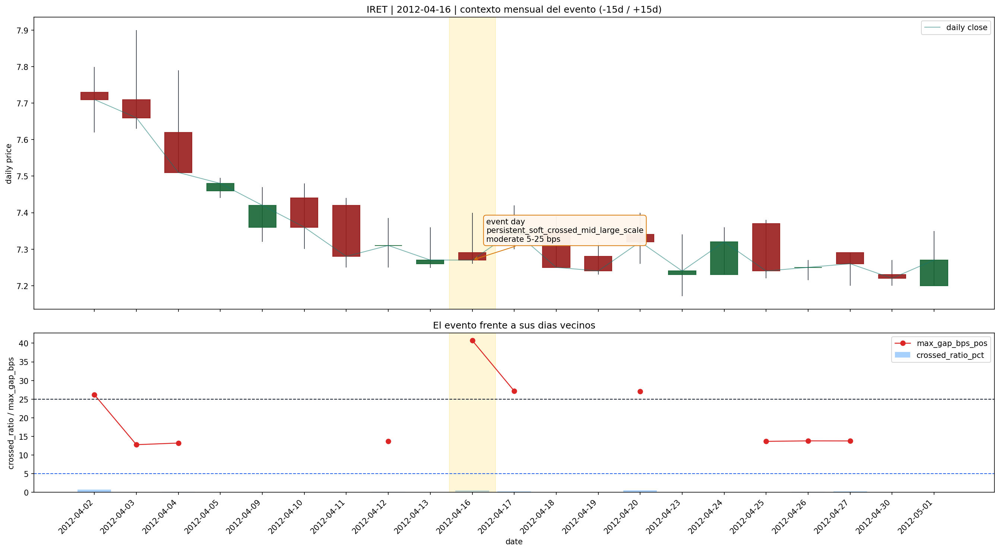

#### 00a Adjusted Proxy Contrast
Esta imagen responde a la pregunta de reconciliacion semantica: la discrepancia de precios viene de datos rotos o de vistas de precio distintas. Compara `daily raw`, `daily adjusted_proxy`, `quote mid raw` y `quote mid split_normalized`, y debajo ensena la cadena de dividendos y splits que produce la diferencia. La decision que cambia es si el inspector debe abrir una incidencia de calidad o cerrar el caso como diferencia legitima de semantica. El error que evita es mezclar series raw y adjusted como si fueran equivalentes. En pipelines reales, esto protege benchmarking, labels diarios y reconciliacion externa frente a falsas alarmas de precio.

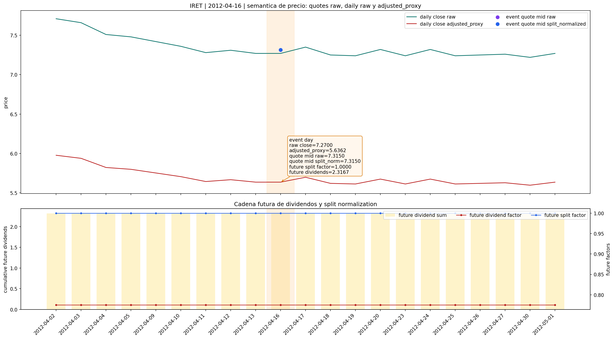

#### 00b Event Month Quotes Context
Esta imagen responde a la pregunta de recurrencia mensual dentro de `quotes`: el problema se concentra en el evento o reaparece en varias sesiones. Arriba concatena sesiones con datos disponibles; abajo resume cobertura diaria, `crossed_ratio_pct` y `max_gap_bps_pos`. La decision que cambia es si el caso debe leerse como episodio puntual o como sintoma de una fase repetida de libro degradado. El error que evita es extrapolar desde un unico dia a todo el mes sin evidencia.

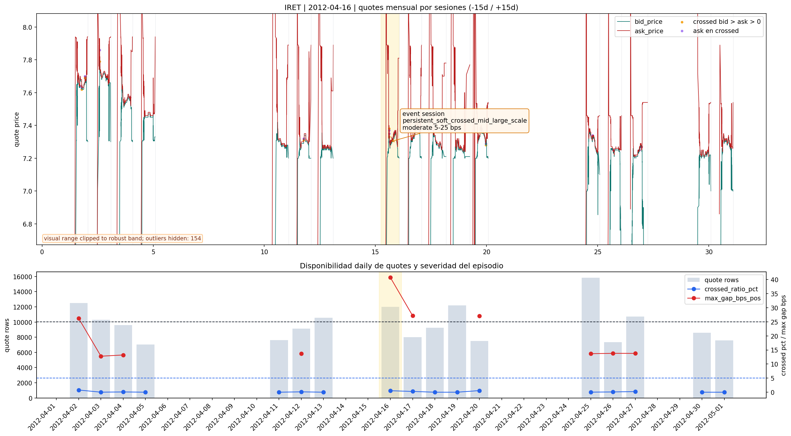

#### 01 Raw Window
Esta imagen responde a la primera pregunta decisiva del caso: el crossed observado es economicamente bastante fuerte para justificar un cambio de clase. Arriba ensena la geometria exacta del tramo conflictivo; abajo convierte esa geometria a bps y la enfrenta a los cortes `5 bps` y `25 bps`. El regimen dominante es `moderate 5-25 bps`. La decision que cambia es pasar de anomalia interpretable a `review` o `bad`. El error que evita es decidir por apariencia visual sin medir el dano economico real del crossed. En terminos de pipeline, este panel decide si el problema afecta solo a la lectura forense o si invalida simulacion de ejecucion y microstructure features.

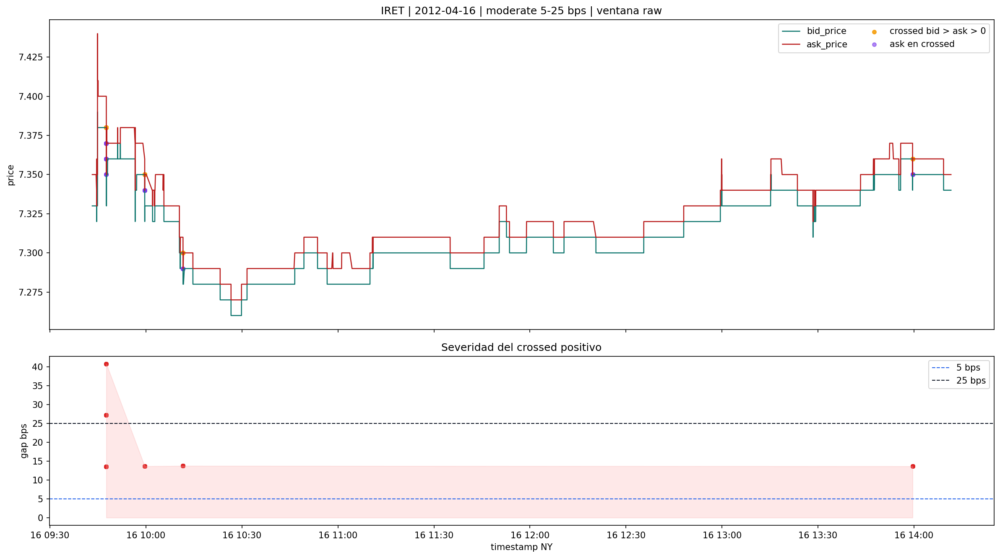

#### 02 Full Session Context
Esta imagen responde a la pregunta de extension intradiaria: el dano esta confinado a un bloque corto o contamina la sesion completa. Arriba se ve toda la sesion `04:00-20:00 NY`; abajo el `gap_bps` firmado. La decision que cambia es si el consumo debe penalizar solo un tramo o desechar el dia entero para uso operativo. El error que evita es tratar una cicatriz local como ruina total o, al reves, minimizar una degradacion distribuida a lo largo del dia. En ejecucion esto decide si la sesion puede seguir usandose con restricciones; en ML decide si las features intradiarias conservan significado economico.

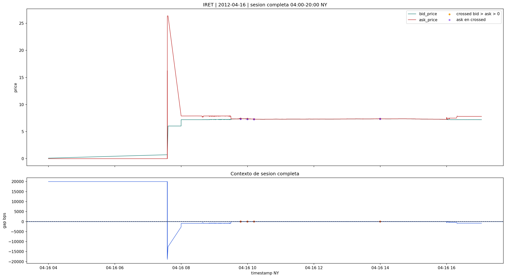

#### 03 Structure Diagnostics
Este panel responde a la pregunta de naturaleza del fallo: contradiccion economica genuina o mezcla con degeneracion estructural. Separa `ask=0` de `ask>0`, muestra la distribucion de `gap_bps` y resume patrones de integerizacion. La decision que cambia es como interpretar el dano: mercado localmente roto, artefacto de representacion o combinacion de ambos. El error que evita es sobrediagnosticar crossed reales cuando parte de la senal proviene de estructura degenerada del libro. Esta lectura afecta directamente a que el caso vaya a exclusion dura, a bandera contextual o a simple reconciliacion tecnica.

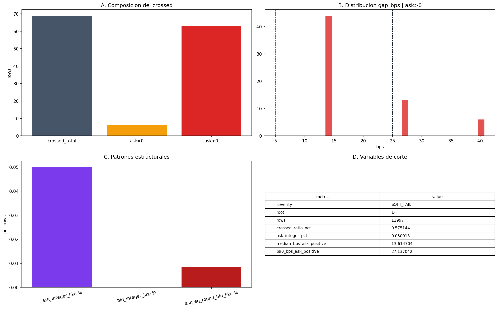

#### 04 Summary Card
Esta tarjeta responde a la pregunta de auditabilidad: cuales son exactamente las variables que sostienen la conclusion. Reune `severity`, `root`, `crossed_ratio_pct`, `ask_integer_pct`, `median_bps_ask_positive` y `p90_bps_ask_positive`. La decision que cambia es pasar de impresion visual a regla verificable. El error que evita es que dos inspectores lleguen a conclusiones distintas mirando la misma imagen sin una base numerica comun. Para gobernanza del proyecto, este panel es el que vuelve reproducible la decision para backtest, ML y auditoria.

---

### 35. ARAY 2012-04-23

company_name: `Accuray Incorporated`
primary_exchange: `NASDAQ` (`XNAS`)
market_locale: `stocks/us`
scope: `review`
ticker: `ARAY`
date: `2012-04-23`
taxonomy: `persistent_soft_crossed_mid_large_scale`
positive_cross_bucket: `positive_cross_moderate_5to25bps`
severity: `SOFT_FAIL`
root: `D`
rows: `18295`
crossed_ratio_pct: `0.366220`
crossed_rows_raw: `67`
crossed_rows_ask_zero: `1`
crossed_rows_ask_positive: `66`
ask_integer_pct: `0.071058`
median_bps_ask_positive: `13.504389`
p90_bps_ask_positive: `26.881720`
file: `D:\quotes\ARAY\year=2012\month=04\day=23\quotes.parquet`

#### Analisis Forense
La conclusion correcta del caso es que ya existe contradiccion economica real dentro del libro, pero aun no con fuerza suficiente para justificar exclusion dura sin contexto adicional. La taxonomy historica es `persistent_soft_crossed_mid_large_scale` y el regimen positivo dominante es `moderate 5-25 bps`. Esto importa porque la taxonomy no solo clasifica: resume que tipo de anomalia se esta viendo y que clase de decision contractual puede defenderse despues. La taxonomy `persistent_soft_crossed_mid_large_scale` implica un problema repetido y distribuido, no un simple pinchazo local. Por eso empuja a `review`: ya hay dano real, aunque no necesariamente exclusion dura universal. El regimen `moderate 5-25 bps` ya entra en zona donde el crossed tiene capacidad real de contaminar simulacion de ejecucion y features microestructurales, aunque todavia puede requerir lectura contextual antes de exclusion dura. En terminos observables, el file tiene `crossed_ratio_pct=0.366220` con `crossed_rows_ask_positive=66` y `crossed_rows_ask_zero=1`. La severidad economica del crossed ask>0 se resume en `median_bps_ask_positive=13.504389` y `p90_bps_ask_positive=26.881720`. Estos dos numeros convierten una forma visual rara en una conclusion operativa sobre si el libro sigue representando o no un mercado negociable. La decision que cambia es pasar de libro sano a libro util solo bajo cautela. `review` significa: no usar como si fuera ejecucion limpia, conservar para analisis contextual y sensibilidad. El error que evita es tratar como normal un episodio que ya contiene contradiccion economica real y contaminar simulaciones de ejecucion o validaciones demasiado optimistas. El patron estructural muestra `ask_integer_pct=0.071058`. Este numero obliga a separar dos explicaciones rivales: contradiccion economica genuina del libro o mezcla con degeneracion estructural / integerizacion. La mayor parte del crossed vive en `ask>0`, de modo que el corazon del problema sigue siendo economico. La parte `ask=0`, si existe, acompana pero no explica por si sola la anomalia. Como `ask_integer_pct` es bajo, la hipotesis de simple degeneracion mecanica pierde fuerza. Eso endurece la interpretacion: el crossed se parece mas a contradiccion economica genuina y menos a artefacto. Existe ademas una imagen historica de certificacion asociada. Su papel es poner el episodio en un marco causal mas amplio: halt, explained, not strongly explained o patron conocido. La regla que protege al proyecto es esta: el contexto externo se usa para explicar por que aparece el episodio, no para absolverlo. El error que evita es degradar el criterio de calidad del libro porque exista una historia plausible alrededor del caso.

#### 00 Event Month Context
Esta imagen responde a la pregunta de persistencia temporal: estamos ante un accidente local o ante una fase mas amplia de inestabilidad. Arriba coloca el evento en la serie `daily` real del mes; abajo compara `crossed_ratio_pct` y `max_gap_bps_pos` del dia contra sus vecinos. La decision que cambia es el peso estructural que se le concede al caso. El error que evita es juzgar igual un shock aislado y una degradacion repetida del libro.

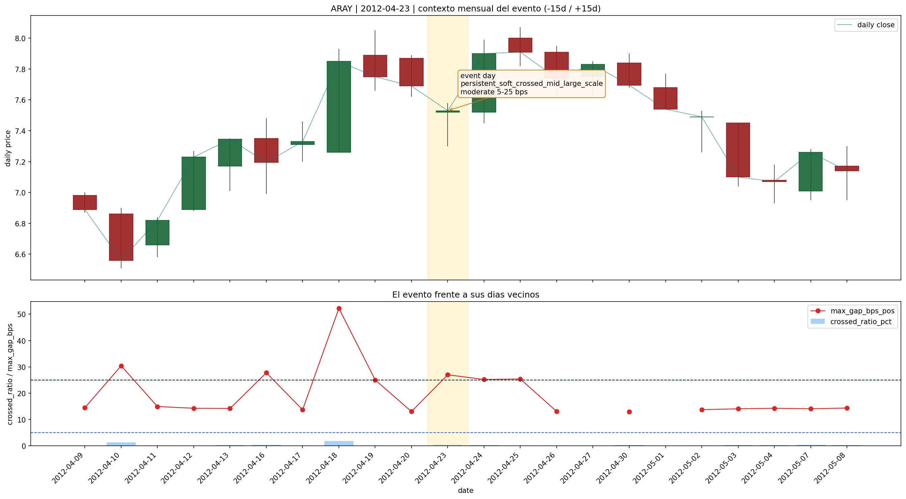

#### 00b Event Month Quotes Context
Esta imagen responde a la pregunta de recurrencia mensual dentro de `quotes`: el problema se concentra en el evento o reaparece en varias sesiones. Arriba concatena sesiones con datos disponibles; abajo resume cobertura diaria, `crossed_ratio_pct` y `max_gap_bps_pos`. La decision que cambia es si el caso debe leerse como episodio puntual o como sintoma de una fase repetida de libro degradado. El error que evita es extrapolar desde un unico dia a todo el mes sin evidencia.

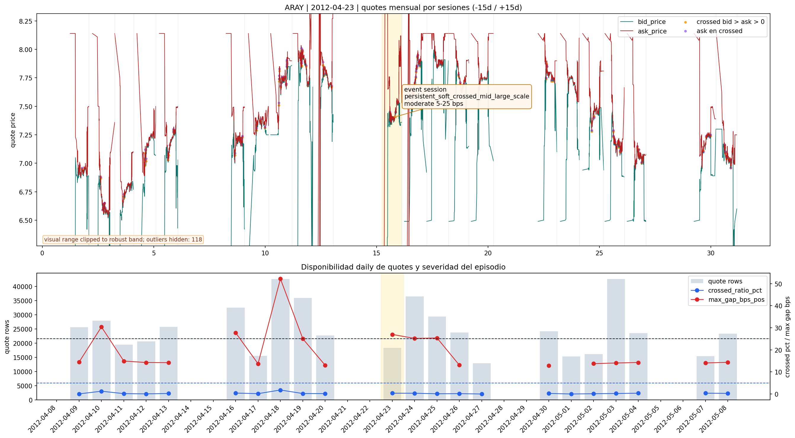

#### 01 Raw Window
Esta imagen responde a la primera pregunta decisiva del caso: el crossed observado es economicamente bastante fuerte para justificar un cambio de clase. Arriba ensena la geometria exacta del tramo conflictivo; abajo convierte esa geometria a bps y la enfrenta a los cortes `5 bps` y `25 bps`. El regimen dominante es `moderate 5-25 bps`. La decision que cambia es pasar de anomalia interpretable a `review` o `bad`. El error que evita es decidir por apariencia visual sin medir el dano economico real del crossed. En terminos de pipeline, este panel decide si el problema afecta solo a la lectura forense o si invalida simulacion de ejecucion y microstructure features.

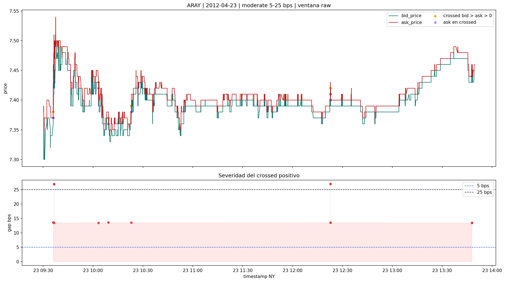

#### 02 Full Session Context
Esta imagen responde a la pregunta de extension intradiaria: el dano esta confinado a un bloque corto o contamina la sesion completa. Arriba se ve toda la sesion `04:00-20:00 NY`; abajo el `gap_bps` firmado. La decision que cambia es si el consumo debe penalizar solo un tramo o desechar el dia entero para uso operativo. El error que evita es tratar una cicatriz local como ruina total o, al reves, minimizar una degradacion distribuida a lo largo del dia. En ejecucion esto decide si la sesion puede seguir usandose con restricciones; en ML decide si las features intradiarias conservan significado economico.

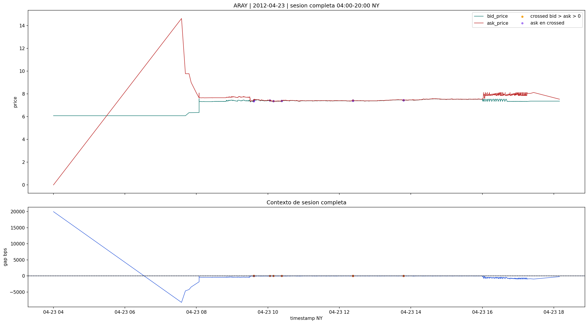

#### 03 Structure Diagnostics
Este panel responde a la pregunta de naturaleza del fallo: contradiccion economica genuina o mezcla con degeneracion estructural. Separa `ask=0` de `ask>0`, muestra la distribucion de `gap_bps` y resume patrones de integerizacion. La decision que cambia es como interpretar el dano: mercado localmente roto, artefacto de representacion o combinacion de ambos. El error que evita es sobrediagnosticar crossed reales cuando parte de la senal proviene de estructura degenerada del libro. Esta lectura afecta directamente a que el caso vaya a exclusion dura, a bandera contextual o a simple reconciliacion tecnica.

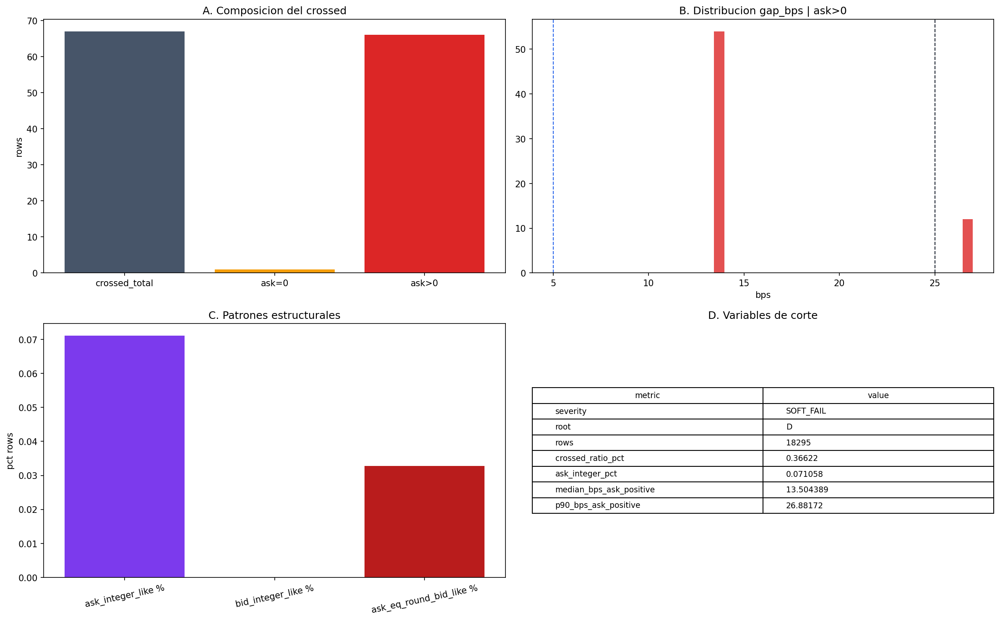

#### 04 Summary Card
Esta tarjeta responde a la pregunta de auditabilidad: cuales son exactamente las variables que sostienen la conclusion. Reune `severity`, `root`, `crossed_ratio_pct`, `ask_integer_pct`, `median_bps_ask_positive` y `p90_bps_ask_positive`. La decision que cambia es pasar de impresion visual a regla verificable. El error que evita es que dos inspectores lleguen a conclusiones distintas mirando la misma imagen sin una base numerica comun. Para gobernanza del proyecto, este panel es el que vuelve reproducible la decision para backtest, ML y auditoria.

---

### 36. ACTU 2007-11-13

company_name: `Actuate Therapeutics, Inc. Common stock`
primary_exchange: `NASDAQ` (`XNAS`)
market_locale: `stocks/us`
scope: `review`
ticker: `ACTU`
date: `2007-11-13`
taxonomy: `persistent_soft_crossed_mid_large_scale`
positive_cross_bucket: `positive_cross_moderate_5to25bps`
severity: `SOFT_FAIL`
root: `D`
rows: `12530`
crossed_ratio_pct: `0.598563`
crossed_rows_raw: `75`
crossed_rows_ask_zero: `1`
crossed_rows_ask_positive: `74`
ask_integer_pct: `0.670391`
median_bps_ask_positive: `13.377926`
p90_bps_ask_positive: `26.709761`
file: `D:\quotes\ACTU\year=2007\month=11\day=13\quotes.parquet`

#### Analisis Forense
La conclusion correcta del caso es que ya existe contradiccion economica real dentro del libro, pero aun no con fuerza suficiente para justificar exclusion dura sin contexto adicional. La taxonomy historica es `persistent_soft_crossed_mid_large_scale` y el regimen positivo dominante es `moderate 5-25 bps`. Esto importa porque la taxonomy no solo clasifica: resume que tipo de anomalia se esta viendo y que clase de decision contractual puede defenderse despues. La taxonomy `persistent_soft_crossed_mid_large_scale` implica un problema repetido y distribuido, no un simple pinchazo local. Por eso empuja a `review`: ya hay dano real, aunque no necesariamente exclusion dura universal. El regimen `moderate 5-25 bps` ya entra en zona donde el crossed tiene capacidad real de contaminar simulacion de ejecucion y features microestructurales, aunque todavia puede requerir lectura contextual antes de exclusion dura. En terminos observables, el file tiene `crossed_ratio_pct=0.598563` con `crossed_rows_ask_positive=74` y `crossed_rows_ask_zero=1`. La severidad economica del crossed ask>0 se resume en `median_bps_ask_positive=13.377926` y `p90_bps_ask_positive=26.709761`. Estos dos numeros convierten una forma visual rara en una conclusion operativa sobre si el libro sigue representando o no un mercado negociable. La decision que cambia es pasar de libro sano a libro util solo bajo cautela. `review` significa: no usar como si fuera ejecucion limpia, conservar para analisis contextual y sensibilidad. El error que evita es tratar como normal un episodio que ya contiene contradiccion economica real y contaminar simulaciones de ejecucion o validaciones demasiado optimistas. El patron estructural muestra `ask_integer_pct=0.670391`. Este numero obliga a separar dos explicaciones rivales: contradiccion economica genuina del libro o mezcla con degeneracion estructural / integerizacion. La mayor parte del crossed vive en `ask>0`, de modo que el corazon del problema sigue siendo economico. La parte `ask=0`, si existe, acompana pero no explica por si sola la anomalia. Como `ask_integer_pct` es bajo, la hipotesis de simple degeneracion mecanica pierde fuerza. Eso endurece la interpretacion: el crossed se parece mas a contradiccion economica genuina y menos a artefacto. Existe ademas una imagen historica de certificacion asociada. Su papel es poner el episodio en un marco causal mas amplio: halt, explained, not strongly explained o patron conocido. La regla que protege al proyecto es esta: el contexto externo se usa para explicar por que aparece el episodio, no para absolverlo. El error que evita es degradar el criterio de calidad del libro porque exista una historia plausible alrededor del caso.

#### 00 Event Month Context
Esta imagen responde a la pregunta de persistencia temporal: estamos ante un accidente local o ante una fase mas amplia de inestabilidad. Arriba coloca el evento en la serie `daily` real del mes; abajo compara `crossed_ratio_pct` y `max_gap_bps_pos` del dia contra sus vecinos. La decision que cambia es el peso estructural que se le concede al caso. El error que evita es juzgar igual un shock aislado y una degradacion repetida del libro.

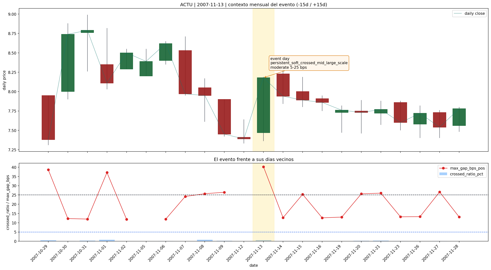

#### 00b Event Month Quotes Context
Esta imagen responde a la pregunta de recurrencia mensual dentro de `quotes`: el problema se concentra en el evento o reaparece en varias sesiones. Arriba concatena sesiones con datos disponibles; abajo resume cobertura diaria, `crossed_ratio_pct` y `max_gap_bps_pos`. La decision que cambia es si el caso debe leerse como episodio puntual o como sintoma de una fase repetida de libro degradado. El error que evita es extrapolar desde un unico dia a todo el mes sin evidencia.

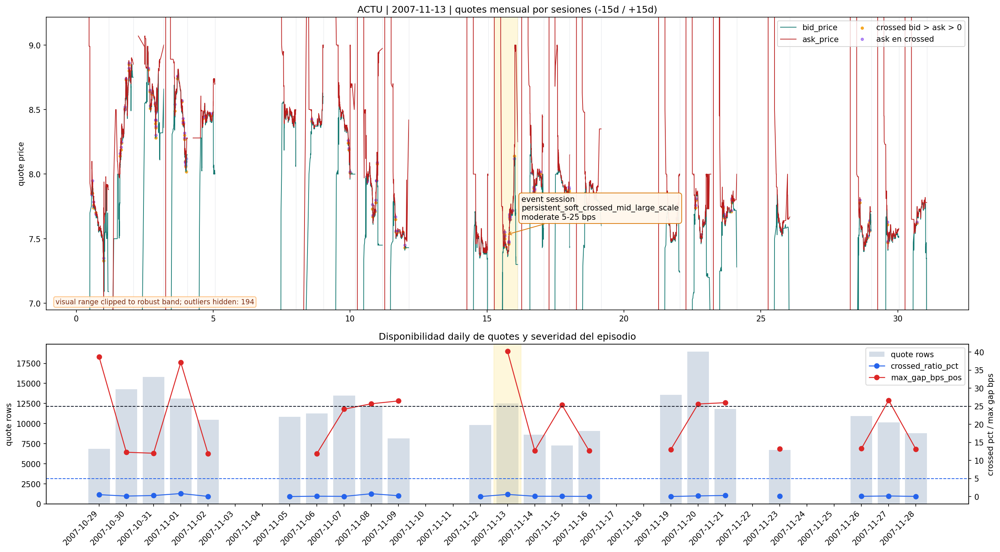

#### 01 Raw Window
Esta imagen responde a la primera pregunta decisiva del caso: el crossed observado es economicamente bastante fuerte para justificar un cambio de clase. Arriba ensena la geometria exacta del tramo conflictivo; abajo convierte esa geometria a bps y la enfrenta a los cortes `5 bps` y `25 bps`. El regimen dominante es `moderate 5-25 bps`. La decision que cambia es pasar de anomalia interpretable a `review` o `bad`. El error que evita es decidir por apariencia visual sin medir el dano economico real del crossed. En terminos de pipeline, este panel decide si el problema afecta solo a la lectura forense o si invalida simulacion de ejecucion y microstructure features.

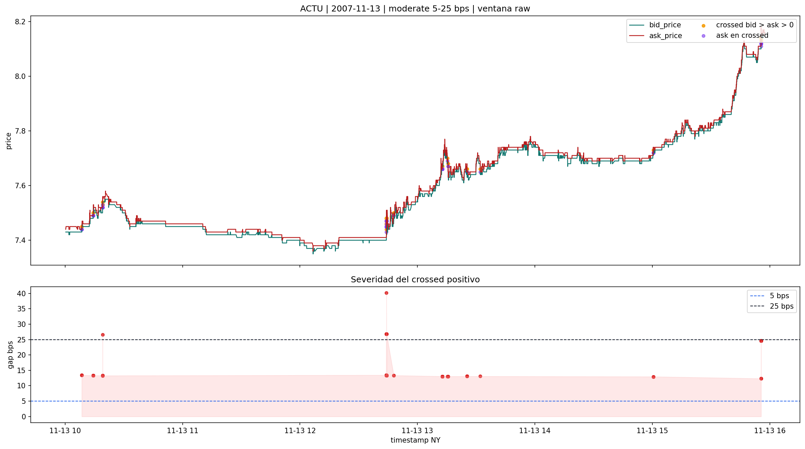

#### 02 Full Session Context
Esta imagen responde a la pregunta de extension intradiaria: el dano esta confinado a un bloque corto o contamina la sesion completa. Arriba se ve toda la sesion `04:00-20:00 NY`; abajo el `gap_bps` firmado. La decision que cambia es si el consumo debe penalizar solo un tramo o desechar el dia entero para uso operativo. El error que evita es tratar una cicatriz local como ruina total o, al reves, minimizar una degradacion distribuida a lo largo del dia. En ejecucion esto decide si la sesion puede seguir usandose con restricciones; en ML decide si las features intradiarias conservan significado economico.

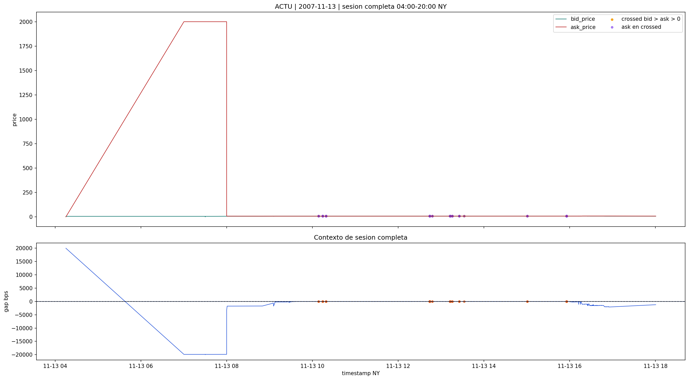

#### 03 Structure Diagnostics
Este panel responde a la pregunta de naturaleza del fallo: contradiccion economica genuina o mezcla con degeneracion estructural. Separa `ask=0` de `ask>0`, muestra la distribucion de `gap_bps` y resume patrones de integerizacion. La decision que cambia es como interpretar el dano: mercado localmente roto, artefacto de representacion o combinacion de ambos. El error que evita es sobrediagnosticar crossed reales cuando parte de la senal proviene de estructura degenerada del libro. Esta lectura afecta directamente a que el caso vaya a exclusion dura, a bandera contextual o a simple reconciliacion tecnica.

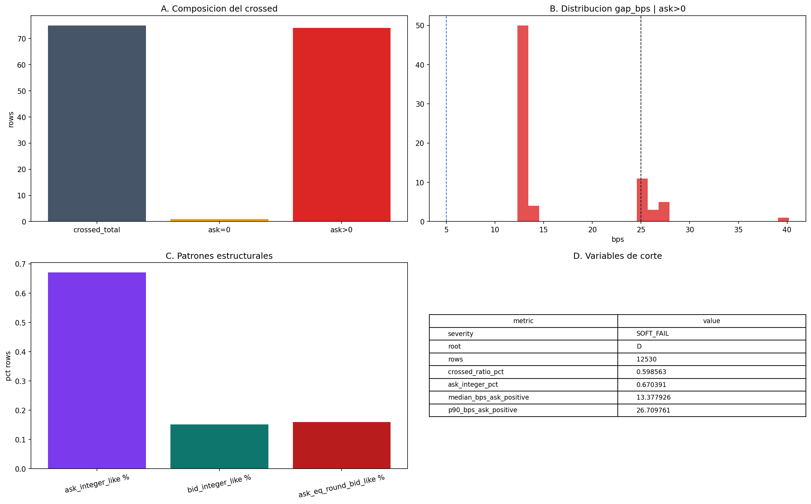

#### 04 Summary Card
Esta tarjeta responde a la pregunta de auditabilidad: cuales son exactamente las variables que sostienen la conclusion. Reune `severity`, `root`, `crossed_ratio_pct`, `ask_integer_pct`, `median_bps_ask_positive` y `p90_bps_ask_positive`. La decision que cambia es pasar de impresion visual a regla verificable. El error que evita es que dos inspectores lleguen a conclusiones distintas mirando la misma imagen sin una base numerica comun. Para gobernanza del proyecto, este panel es el que vuelve reproducible la decision para backtest, ML y auditoria.

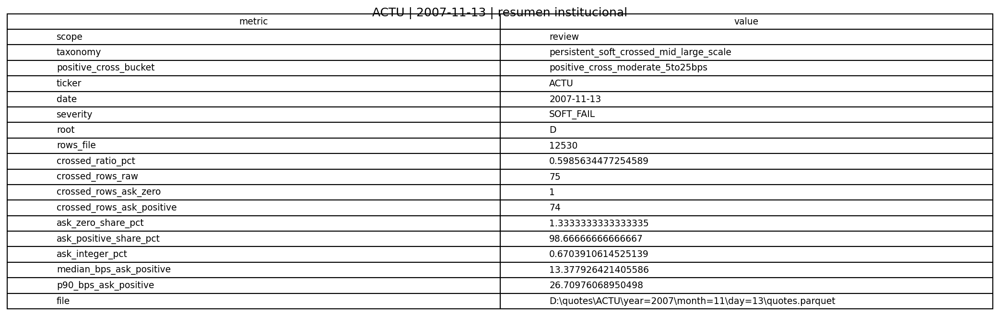

---

### 37. HWCC 2007-02-27

company_name: `Houston Wire & Cable Company`
primary_exchange: `NASDAQ` (`XNAS`)
market_locale: `stocks/us`
scope: `review`
ticker: `HWCC`
date: `2007-02-27`
taxonomy: `persistent_soft_crossed_mid_large_scale`
positive_cross_bucket: `positive_cross_moderate_5to25bps`
severity: `SOFT_FAIL`
root: `D`
rows: `11803`
crossed_ratio_pct: `0.728628`
crossed_rows_raw: `86`
crossed_rows_ask_zero: `2`
crossed_rows_ask_positive: `84`
ask_integer_pct: `2.058799`
median_bps_ask_positive: `12.128563`
p90_bps_ask_positive: `68.534570`
file: `D:\quotes\HWCC\year=2007\month=02\day=27\quotes.parquet`

#### Analisis Forense
La conclusion correcta del caso es que ya existe contradiccion economica real dentro del libro, pero aun no con fuerza suficiente para justificar exclusion dura sin contexto adicional. La taxonomy historica es `persistent_soft_crossed_mid_large_scale` y el regimen positivo dominante es `moderate 5-25 bps`. Esto importa porque la taxonomy no solo clasifica: resume que tipo de anomalia se esta viendo y que clase de decision contractual puede defenderse despues. La taxonomy `persistent_soft_crossed_mid_large_scale` implica un problema repetido y distribuido, no un simple pinchazo local. Por eso empuja a `review`: ya hay dano real, aunque no necesariamente exclusion dura universal. El regimen `moderate 5-25 bps` ya entra en zona donde el crossed tiene capacidad real de contaminar simulacion de ejecucion y features microestructurales, aunque todavia puede requerir lectura contextual antes de exclusion dura. En terminos observables, el file tiene `crossed_ratio_pct=0.728628` con `crossed_rows_ask_positive=84` y `crossed_rows_ask_zero=2`. La severidad economica del crossed ask>0 se resume en `median_bps_ask_positive=12.128563` y `p90_bps_ask_positive=68.534570`. Estos dos numeros convierten una forma visual rara en una conclusion operativa sobre si el libro sigue representando o no un mercado negociable. La decision que cambia es pasar de libro sano a libro util solo bajo cautela. `review` significa: no usar como si fuera ejecucion limpia, conservar para analisis contextual y sensibilidad. El error que evita es tratar como normal un episodio que ya contiene contradiccion economica real y contaminar simulaciones de ejecucion o validaciones demasiado optimistas. El patron estructural muestra `ask_integer_pct=2.058799`. Este numero obliga a separar dos explicaciones rivales: contradiccion economica genuina del libro o mezcla con degeneracion estructural / integerizacion. La mayor parte del crossed vive en `ask>0`, de modo que el corazon del problema sigue siendo economico. La parte `ask=0`, si existe, acompana pero no explica por si sola la anomalia. Como `ask_integer_pct` es bajo, la hipotesis de simple degeneracion mecanica pierde fuerza. Eso endurece la interpretacion: el crossed se parece mas a contradiccion economica genuina y menos a artefacto. En la capa de semantica de precio del evento aparecen `daily raw close=25.1700`, `quote mid raw=25.0050`, `quote mid split_normalized=25.0050`, `daily adjusted_proxy=19.5708`. Ademas hay `post_event_dividend_sum=3.3450`. La implicacion metodologica es crucial: una discrepancia entre `quotes`, `daily` y una plataforma externa no puede leerse automaticamente como fallo del dataset. Puede ser semantica de precio distinta. El error que evita esta capa es mezclar raw, split-normalized y adjusted dentro del mismo pipeline, rompiendo auditoria, benchmarking y labels. Para pipelines, esto bloquea su uso como libro sano en ejecucion y features microestructurales principales, aunque aun puede mantenerse para forense, sensibilidad y estudios donde la anomalia sea parte del objeto de investigacion. Existe ademas una imagen historica de certificacion asociada. Su papel es poner el episodio en un marco causal mas amplio: halt, explained, not strongly explained o patron conocido. La regla que protege al proyecto es esta: el contexto externo se usa para explicar por que aparece el episodio, no para absolverlo. El error que evita es degradar el criterio de calidad del libro porque exista una historia plausible alrededor del caso.

#### 00 Event Month Context
Esta imagen responde a la pregunta de persistencia temporal: estamos ante un accidente local o ante una fase mas amplia de inestabilidad. Arriba coloca el evento en la serie `daily` real del mes; abajo compara `crossed_ratio_pct` y `max_gap_bps_pos` del dia contra sus vecinos. La decision que cambia es el peso estructural que se le concede al caso. El error que evita es juzgar igual un shock aislado y una degradacion repetida del libro.

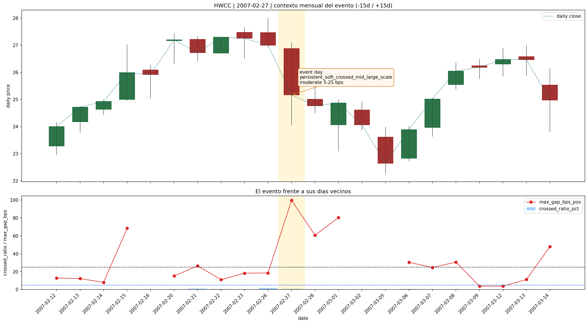

#### 00a Adjusted Proxy Contrast
Esta imagen responde a la pregunta de reconciliacion semantica: la discrepancia de precios viene de datos rotos o de vistas de precio distintas. Compara `daily raw`, `daily adjusted_proxy`, `quote mid raw` y `quote mid split_normalized`, y debajo ensena la cadena de dividendos y splits que produce la diferencia. La decision que cambia es si el inspector debe abrir una incidencia de calidad o cerrar el caso como diferencia legitima de semantica. El error que evita es mezclar series raw y adjusted como si fueran equivalentes. En pipelines reales, esto protege benchmarking, labels diarios y reconciliacion externa frente a falsas alarmas de precio.

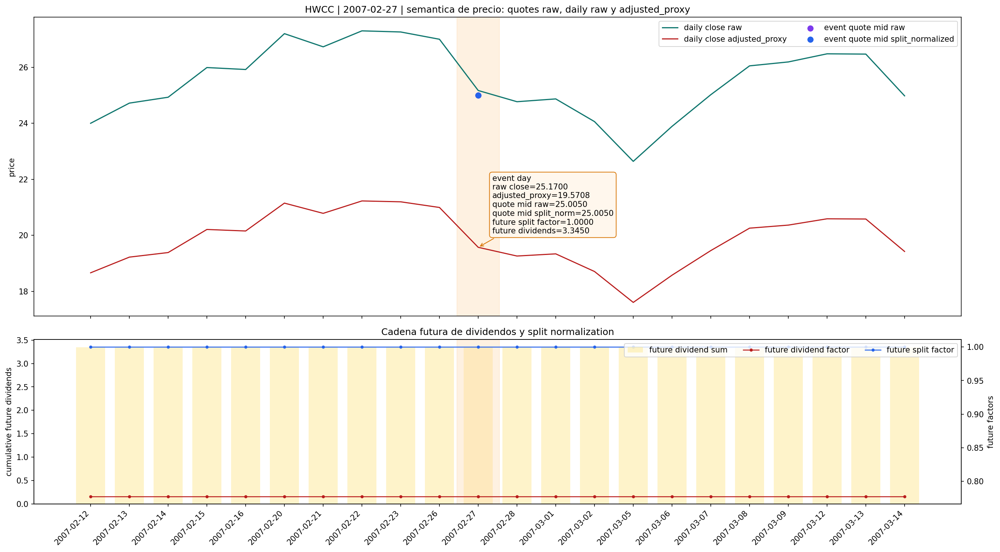

#### 00b Event Month Quotes Context
Esta imagen responde a la pregunta de recurrencia mensual dentro de `quotes`: el problema se concentra en el evento o reaparece en varias sesiones. Arriba concatena sesiones con datos disponibles; abajo resume cobertura diaria, `crossed_ratio_pct` y `max_gap_bps_pos`. La decision que cambia es si el caso debe leerse como episodio puntual o como sintoma de una fase repetida de libro degradado. El error que evita es extrapolar desde un unico dia a todo el mes sin evidencia.

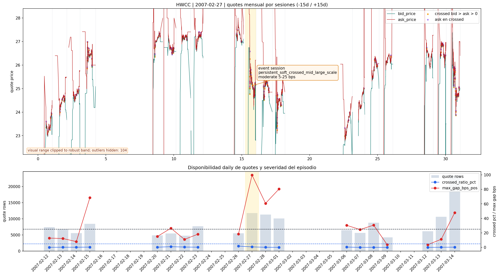

#### 01 Raw Window
Esta imagen responde a la primera pregunta decisiva del caso: el crossed observado es economicamente bastante fuerte para justificar un cambio de clase. Arriba ensena la geometria exacta del tramo conflictivo; abajo convierte esa geometria a bps y la enfrenta a los cortes `5 bps` y `25 bps`. El regimen dominante es `moderate 5-25 bps`. La decision que cambia es pasar de anomalia interpretable a `review` o `bad`. El error que evita es decidir por apariencia visual sin medir el dano economico real del crossed. En terminos de pipeline, este panel decide si el problema afecta solo a la lectura forense o si invalida simulacion de ejecucion y microstructure features.

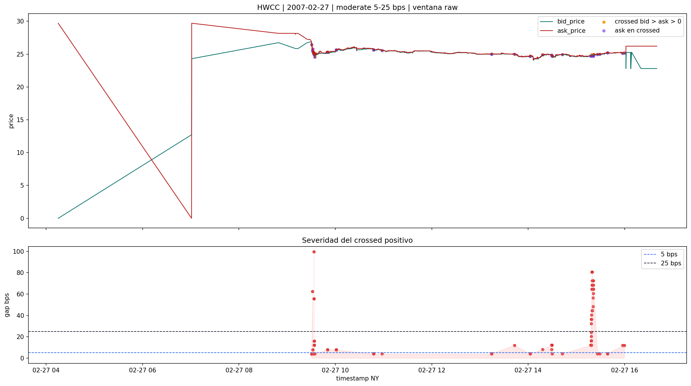

#### 02 Full Session Context
Esta imagen responde a la pregunta de extension intradiaria: el dano esta confinado a un bloque corto o contamina la sesion completa. Arriba se ve toda la sesion `04:00-20:00 NY`; abajo el `gap_bps` firmado. La decision que cambia es si el consumo debe penalizar solo un tramo o desechar el dia entero para uso operativo. El error que evita es tratar una cicatriz local como ruina total o, al reves, minimizar una degradacion distribuida a lo largo del dia. En ejecucion esto decide si la sesion puede seguir usandose con restricciones; en ML decide si las features intradiarias conservan significado economico.

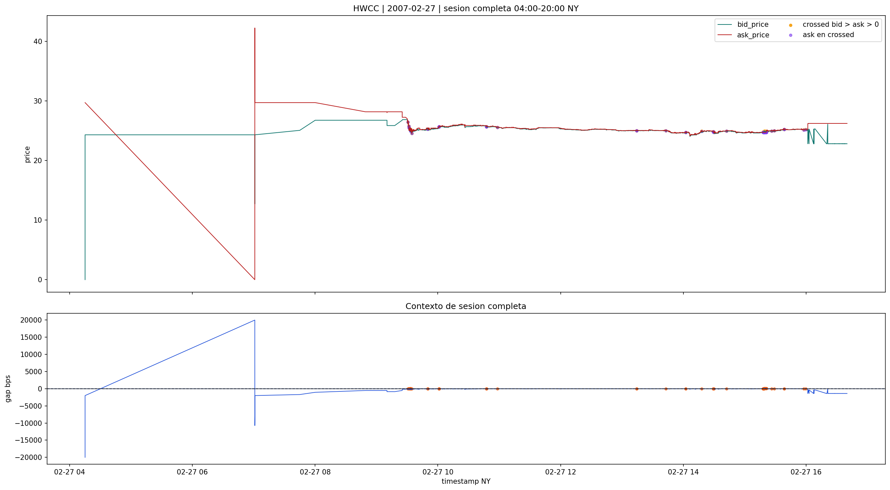

#### 03 Structure Diagnostics
Este panel responde a la pregunta de naturaleza del fallo: contradiccion economica genuina o mezcla con degeneracion estructural. Separa `ask=0` de `ask>0`, muestra la distribucion de `gap_bps` y resume patrones de integerizacion. La decision que cambia es como interpretar el dano: mercado localmente roto, artefacto de representacion o combinacion de ambos. El error que evita es sobrediagnosticar crossed reales cuando parte de la senal proviene de estructura degenerada del libro. Esta lectura afecta directamente a que el caso vaya a exclusion dura, a bandera contextual o a simple reconciliacion tecnica.

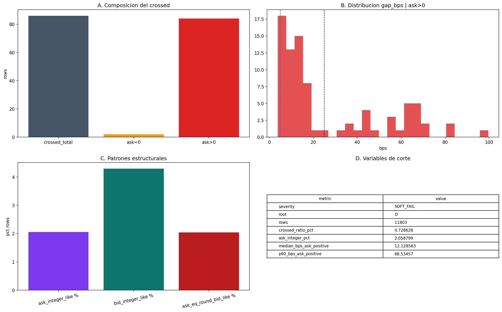

#### 04 Summary Card
Esta tarjeta responde a la pregunta de auditabilidad: cuales son exactamente las variables que sostienen la conclusion. Reune `severity`, `root`, `crossed_ratio_pct`, `ask_integer_pct`, `median_bps_ask_positive` y `p90_bps_ask_positive`. La decision que cambia es pasar de impresion visual a regla verificable. El error que evita es que dos inspectores lleguen a conclusiones distintas mirando la misma imagen sin una base numerica comun. Para gobernanza del proyecto, este panel es el que vuelve reproducible la decision para backtest, ML y auditoria.

---

### 38. CRME 2008-01-10

company_name: `Cardiome Pharma Corporation`
primary_exchange: `NASDAQ` (`XNAS`)
market_locale: `stocks/us`
scope: `review`
ticker: `CRME`
date: `2008-01-10`
taxonomy: `persistent_soft_crossed_mid_large_scale`
positive_cross_bucket: `positive_cross_moderate_5to25bps`
severity: `SOFT_FAIL`
root: `D`
rows: `14606`
crossed_ratio_pct: `0.520334`
crossed_rows_raw: `76`
crossed_rows_ask_zero: `1`
crossed_rows_ask_positive: `75`
ask_integer_pct: `0.157470`
median_bps_ask_positive: `11.954573`
p90_bps_ask_positive: `23.866348`
file: `D:\quotes\CRME\year=2008\month=01\day=10\quotes.parquet`

#### Analisis Forense
La conclusion correcta del caso es que ya existe contradiccion economica real dentro del libro, pero aun no con fuerza suficiente para justificar exclusion dura sin contexto adicional. La taxonomy historica es `persistent_soft_crossed_mid_large_scale` y el regimen positivo dominante es `moderate 5-25 bps`. Esto importa porque la taxonomy no solo clasifica: resume que tipo de anomalia se esta viendo y que clase de decision contractual puede defenderse despues. La taxonomy `persistent_soft_crossed_mid_large_scale` implica un problema repetido y distribuido, no un simple pinchazo local. Por eso empuja a `review`: ya hay dano real, aunque no necesariamente exclusion dura universal. El regimen `moderate 5-25 bps` ya entra en zona donde el crossed tiene capacidad real de contaminar simulacion de ejecucion y features microestructurales, aunque todavia puede requerir lectura contextual antes de exclusion dura. En terminos observables, el file tiene `crossed_ratio_pct=0.520334` con `crossed_rows_ask_positive=75` y `crossed_rows_ask_zero=1`. La severidad economica del crossed ask>0 se resume en `median_bps_ask_positive=11.954573` y `p90_bps_ask_positive=23.866348`. Estos dos numeros convierten una forma visual rara en una conclusion operativa sobre si el libro sigue representando o no un mercado negociable. La decision que cambia es pasar de libro sano a libro util solo bajo cautela. `review` significa: no usar como si fuera ejecucion limpia, conservar para analisis contextual y sensibilidad. El error que evita es tratar como normal un episodio que ya contiene contradiccion economica real y contaminar simulaciones de ejecucion o validaciones demasiado optimistas. El patron estructural muestra `ask_integer_pct=0.157470`. Este numero obliga a separar dos explicaciones rivales: contradiccion economica genuina del libro o mezcla con degeneracion estructural / integerizacion. La mayor parte del crossed vive en `ask>0`, de modo que el corazon del problema sigue siendo economico. La parte `ask=0`, si existe, acompana pero no explica por si sola la anomalia. Como `ask_integer_pct` es bajo, la hipotesis de simple degeneracion mecanica pierde fuerza. Eso endurece la interpretacion: el crossed se parece mas a contradiccion economica genuina y menos a artefacto. Existe ademas una imagen historica de certificacion asociada. Su papel es poner el episodio en un marco causal mas amplio: halt, explained, not strongly explained o patron conocido. La regla que protege al proyecto es esta: el contexto externo se usa para explicar por que aparece el episodio, no para absolverlo. El error que evita es degradar el criterio de calidad del libro porque exista una historia plausible alrededor del caso.

#### 00 Event Month Context
Esta imagen responde a la pregunta de persistencia temporal: estamos ante un accidente local o ante una fase mas amplia de inestabilidad. Arriba coloca el evento en la serie `daily` real del mes; abajo compara `crossed_ratio_pct` y `max_gap_bps_pos` del dia contra sus vecinos. La decision que cambia es el peso estructural que se le concede al caso. El error que evita es juzgar igual un shock aislado y una degradacion repetida del libro.

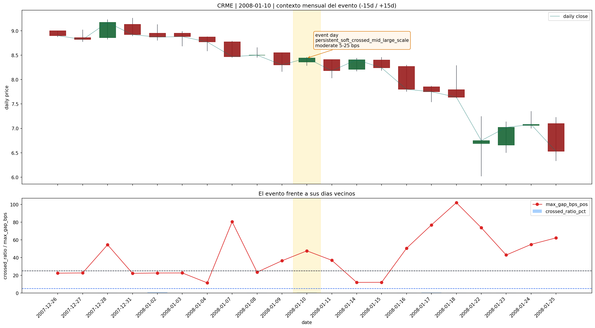

#### 00b Event Month Quotes Context
Esta imagen responde a la pregunta de recurrencia mensual dentro de `quotes`: el problema se concentra en el evento o reaparece en varias sesiones. Arriba concatena sesiones con datos disponibles; abajo resume cobertura diaria, `crossed_ratio_pct` y `max_gap_bps_pos`. La decision que cambia es si el caso debe leerse como episodio puntual o como sintoma de una fase repetida de libro degradado. El error que evita es extrapolar desde un unico dia a todo el mes sin evidencia.

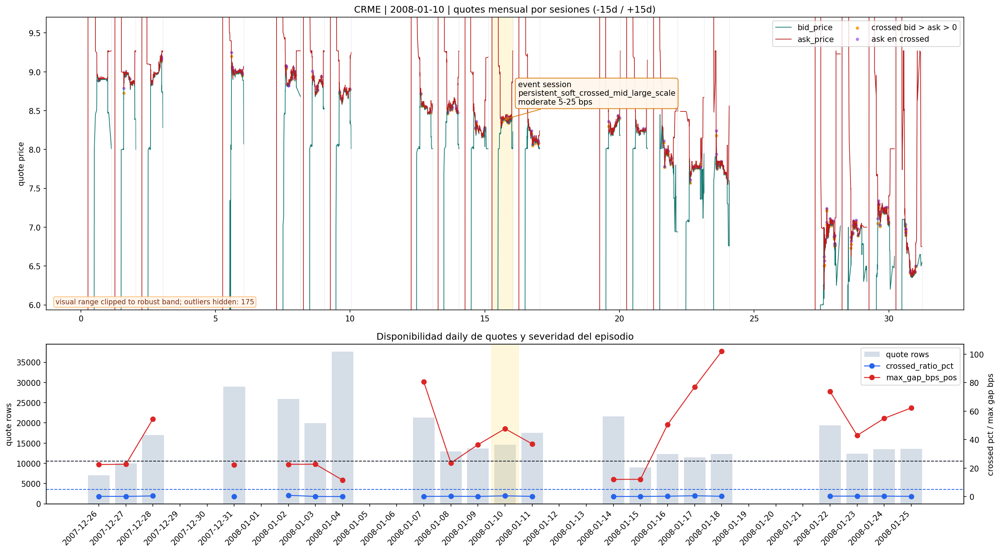

#### 01 Raw Window
Esta imagen responde a la primera pregunta decisiva del caso: el crossed observado es economicamente bastante fuerte para justificar un cambio de clase. Arriba ensena la geometria exacta del tramo conflictivo; abajo convierte esa geometria a bps y la enfrenta a los cortes `5 bps` y `25 bps`. El regimen dominante es `moderate 5-25 bps`. La decision que cambia es pasar de anomalia interpretable a `review` o `bad`. El error que evita es decidir por apariencia visual sin medir el dano economico real del crossed. En terminos de pipeline, este panel decide si el problema afecta solo a la lectura forense o si invalida simulacion de ejecucion y microstructure features.

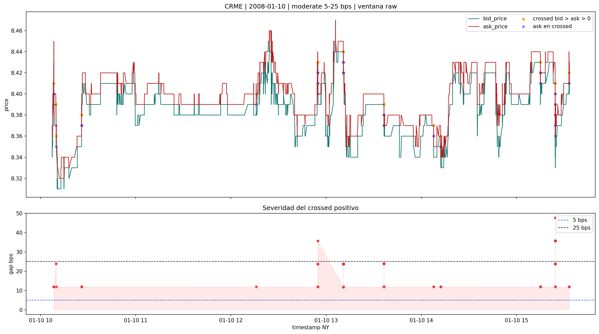

#### 02 Full Session Context
Esta imagen responde a la pregunta de extension intradiaria: el dano esta confinado a un bloque corto o contamina la sesion completa. Arriba se ve toda la sesion `04:00-20:00 NY`; abajo el `gap_bps` firmado. La decision que cambia es si el consumo debe penalizar solo un tramo o desechar el dia entero para uso operativo. El error que evita es tratar una cicatriz local como ruina total o, al reves, minimizar una degradacion distribuida a lo largo del dia. En ejecucion esto decide si la sesion puede seguir usandose con restricciones; en ML decide si las features intradiarias conservan significado economico.

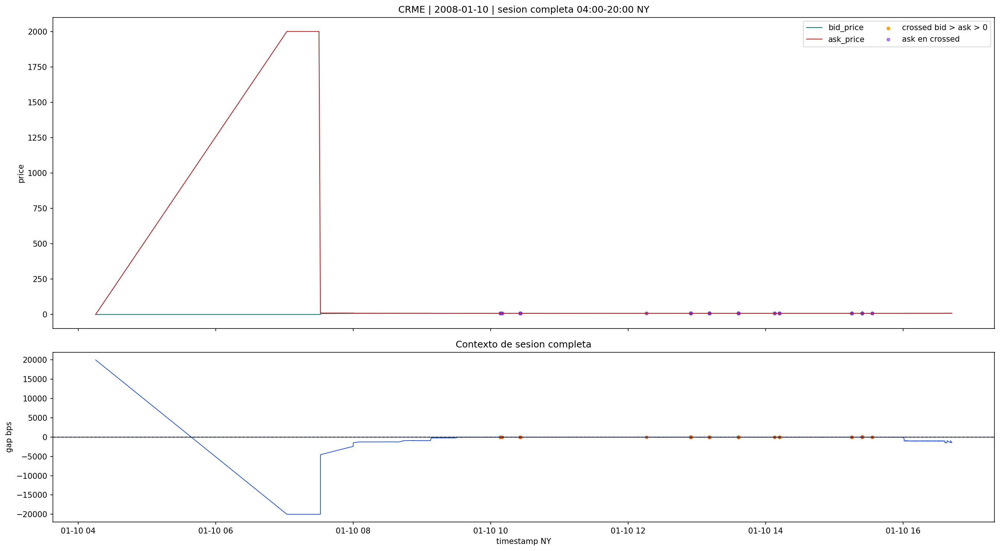

#### 03 Structure Diagnostics
Este panel responde a la pregunta de naturaleza del fallo: contradiccion economica genuina o mezcla con degeneracion estructural. Separa `ask=0` de `ask>0`, muestra la distribucion de `gap_bps` y resume patrones de integerizacion. La decision que cambia es como interpretar el dano: mercado localmente roto, artefacto de representacion o combinacion de ambos. El error que evita es sobrediagnosticar crossed reales cuando parte de la senal proviene de estructura degenerada del libro. Esta lectura afecta directamente a que el caso vaya a exclusion dura, a bandera contextual o a simple reconciliacion tecnica.

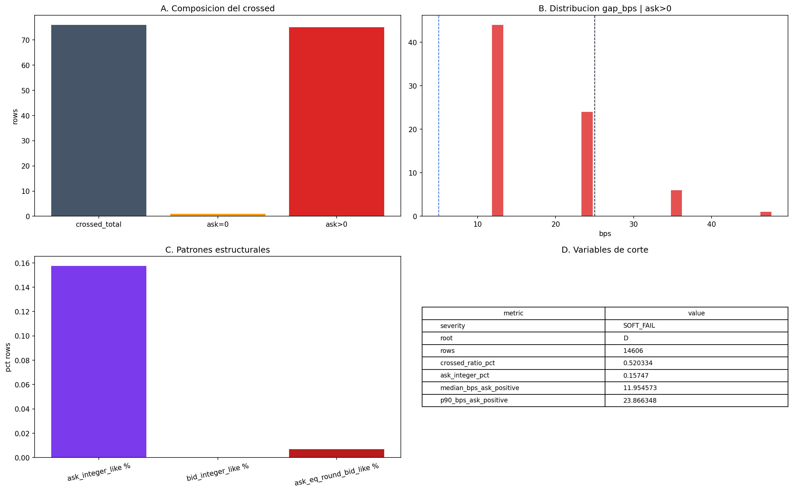

#### 04 Summary Card
Esta tarjeta responde a la pregunta de auditabilidad: cuales son exactamente las variables que sostienen la conclusion. Reune `severity`, `root`, `crossed_ratio_pct`, `ask_integer_pct`, `median_bps_ask_positive` y `p90_bps_ask_positive`. La decision que cambia es pasar de impresion visual a regla verificable. El error que evita es que dos inspectores lleguen a conclusiones distintas mirando la misma imagen sin una base numerica comun. Para gobernanza del proyecto, este panel es el que vuelve reproducible la decision para backtest, ML y auditoria.

---

### 39. DSPG 2008-01-31

company_name: `DSP Group Inc`
primary_exchange: `NASDAQ` (`XNAS`)
market_locale: `stocks/us`
scope: `review`
ticker: `DSPG`
date: `2008-01-31`
taxonomy: `persistent_soft_crossed_mid_large_scale`
positive_cross_bucket: `positive_cross_moderate_5to25bps`
severity: `SOFT_FAIL`
root: `D`
rows: `13106`
crossed_ratio_pct: `0.572257`
crossed_rows_raw: `75`
crossed_rows_ask_zero: `1`
crossed_rows_ask_positive: `74`
ask_integer_pct: `2.311918`
median_bps_ask_positive: `9.583134`
p90_bps_ask_positive: `26.235243`
file: `D:\quotes\DSPG\year=2008\month=01\day=31\quotes.parquet`

#### Analisis Forense
La conclusion correcta del caso es que ya existe contradiccion economica real dentro del libro, pero aun no con fuerza suficiente para justificar exclusion dura sin contexto adicional. La taxonomy historica es `persistent_soft_crossed_mid_large_scale` y el regimen positivo dominante es `moderate 5-25 bps`. Esto importa porque la taxonomy no solo clasifica: resume que tipo de anomalia se esta viendo y que clase de decision contractual puede defenderse despues. La taxonomy `persistent_soft_crossed_mid_large_scale` implica un problema repetido y distribuido, no un simple pinchazo local. Por eso empuja a `review`: ya hay dano real, aunque no necesariamente exclusion dura universal. El regimen `moderate 5-25 bps` ya entra en zona donde el crossed tiene capacidad real de contaminar simulacion de ejecucion y features microestructurales, aunque todavia puede requerir lectura contextual antes de exclusion dura. En terminos observables, el file tiene `crossed_ratio_pct=0.572257` con `crossed_rows_ask_positive=74` y `crossed_rows_ask_zero=1`. La severidad economica del crossed ask>0 se resume en `median_bps_ask_positive=9.583134` y `p90_bps_ask_positive=26.235243`. Estos dos numeros convierten una forma visual rara en una conclusion operativa sobre si el libro sigue representando o no un mercado negociable. La decision que cambia es pasar de libro sano a libro util solo bajo cautela. `review` significa: no usar como si fuera ejecucion limpia, conservar para analisis contextual y sensibilidad. El error que evita es tratar como normal un episodio que ya contiene contradiccion economica real y contaminar simulaciones de ejecucion o validaciones demasiado optimistas. El patron estructural muestra `ask_integer_pct=2.311918`. Este numero obliga a separar dos explicaciones rivales: contradiccion economica genuina del libro o mezcla con degeneracion estructural / integerizacion. La mayor parte del crossed vive en `ask>0`, de modo que el corazon del problema sigue siendo economico. La parte `ask=0`, si existe, acompana pero no explica por si sola la anomalia. Como `ask_integer_pct` es bajo, la hipotesis de simple degeneracion mecanica pierde fuerza. Eso endurece la interpretacion: el crossed se parece mas a contradiccion economica genuina y menos a artefacto. Existe ademas una imagen historica de certificacion asociada. Su papel es poner el episodio en un marco causal mas amplio: halt, explained, not strongly explained o patron conocido. La regla que protege al proyecto es esta: el contexto externo se usa para explicar por que aparece el episodio, no para absolverlo. El error que evita es degradar el criterio de calidad del libro porque exista una historia plausible alrededor del caso.

#### 00 Event Month Context
Esta imagen responde a la pregunta de persistencia temporal: estamos ante un accidente local o ante una fase mas amplia de inestabilidad. Arriba coloca el evento en la serie `daily` real del mes; abajo compara `crossed_ratio_pct` y `max_gap_bps_pos` del dia contra sus vecinos. La decision que cambia es el peso estructural que se le concede al caso. El error que evita es juzgar igual un shock aislado y una degradacion repetida del libro.

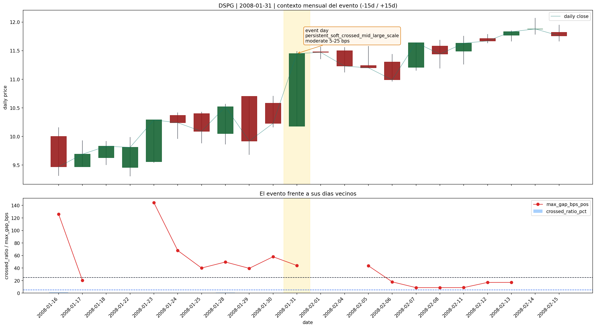

#### 00b Event Month Quotes Context
Esta imagen responde a la pregunta de recurrencia mensual dentro de `quotes`: el problema se concentra en el evento o reaparece en varias sesiones. Arriba concatena sesiones con datos disponibles; abajo resume cobertura diaria, `crossed_ratio_pct` y `max_gap_bps_pos`. La decision que cambia es si el caso debe leerse como episodio puntual o como sintoma de una fase repetida de libro degradado. El error que evita es extrapolar desde un unico dia a todo el mes sin evidencia.

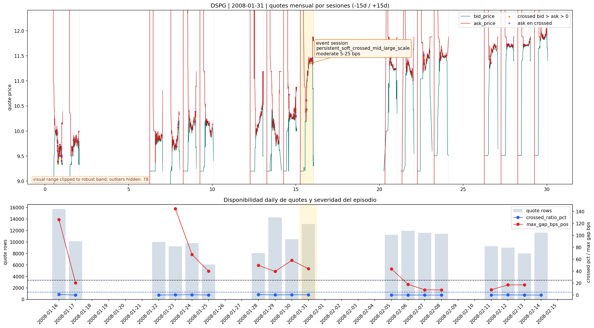

#### 01 Raw Window
Esta imagen responde a la primera pregunta decisiva del caso: el crossed observado es economicamente bastante fuerte para justificar un cambio de clase. Arriba ensena la geometria exacta del tramo conflictivo; abajo convierte esa geometria a bps y la enfrenta a los cortes `5 bps` y `25 bps`. El regimen dominante es `moderate 5-25 bps`. La decision que cambia es pasar de anomalia interpretable a `review` o `bad`. El error que evita es decidir por apariencia visual sin medir el dano economico real del crossed. En terminos de pipeline, este panel decide si el problema afecta solo a la lectura forense o si invalida simulacion de ejecucion y microstructure features.

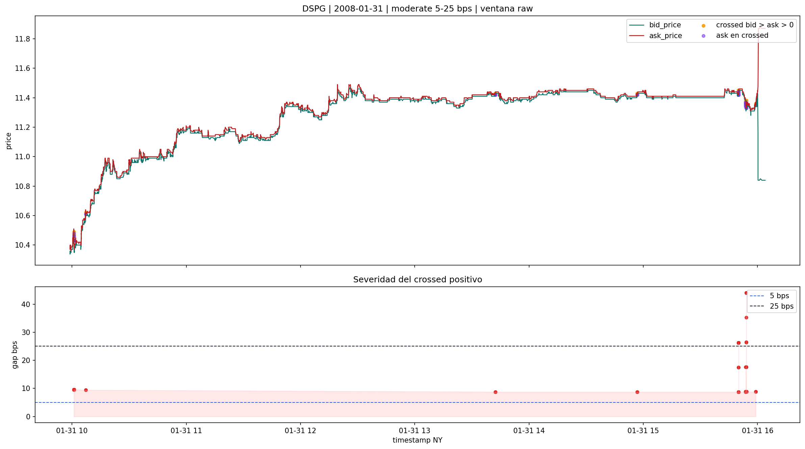

#### 02 Full Session Context
Esta imagen responde a la pregunta de extension intradiaria: el dano esta confinado a un bloque corto o contamina la sesion completa. Arriba se ve toda la sesion `04:00-20:00 NY`; abajo el `gap_bps` firmado. La decision que cambia es si el consumo debe penalizar solo un tramo o desechar el dia entero para uso operativo. El error que evita es tratar una cicatriz local como ruina total o, al reves, minimizar una degradacion distribuida a lo largo del dia. En ejecucion esto decide si la sesion puede seguir usandose con restricciones; en ML decide si las features intradiarias conservan significado economico.

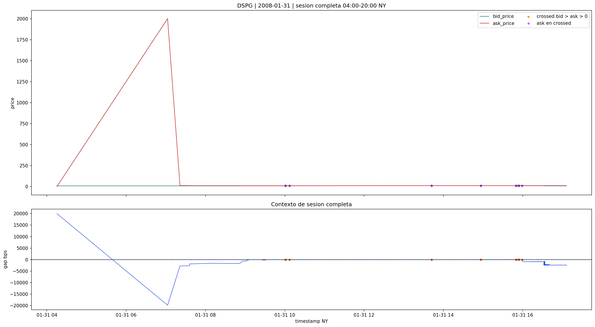

#### 03 Structure Diagnostics
Este panel responde a la pregunta de naturaleza del fallo: contradiccion economica genuina o mezcla con degeneracion estructural. Separa `ask=0` de `ask>0`, muestra la distribucion de `gap_bps` y resume patrones de integerizacion. La decision que cambia es como interpretar el dano: mercado localmente roto, artefacto de representacion o combinacion de ambos. El error que evita es sobrediagnosticar crossed reales cuando parte de la senal proviene de estructura degenerada del libro. Esta lectura afecta directamente a que el caso vaya a exclusion dura, a bandera contextual o a simple reconciliacion tecnica.

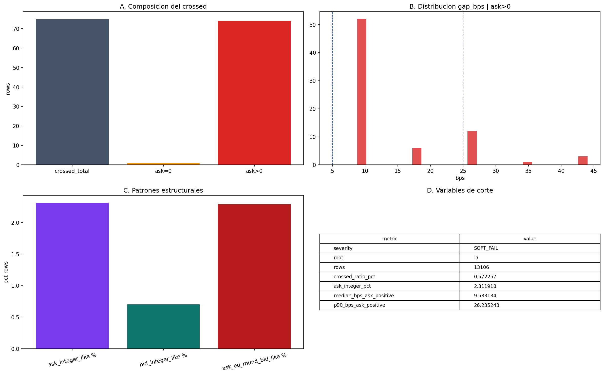

#### 04 Summary Card
Esta tarjeta responde a la pregunta de auditabilidad: cuales son exactamente las variables que sostienen la conclusion. Reune `severity`, `root`, `crossed_ratio_pct`, `ask_integer_pct`, `median_bps_ask_positive` y `p90_bps_ask_positive`. La decision que cambia es pasar de impresion visual a regla verificable. El error que evita es que dos inspectores lleguen a conclusiones distintas mirando la misma imagen sin una base numerica comun. Para gobernanza del proyecto, este panel es el que vuelve reproducible la decision para backtest, ML y auditoria.

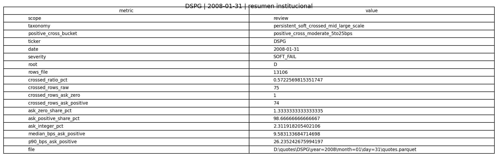

---

### 40. CPST 2010-08-31

company_name: `Capstone Turbine Corp`
primary_exchange: `NASDAQ` (`XNAS`)
market_locale: `stocks/us`
scope: `review`
ticker: `CPST`
date: `2010-08-31`
taxonomy: `persistent_soft_crossed_mid_large_scale`
positive_cross_bucket: `positive_cross_moderate_5to25bps`
severity: `SOFT_FAIL`
root: `D`
rows: `11086`
crossed_ratio_pct: `0.351795`
crossed_rows_raw: `39`
crossed_rows_ask_zero: `0`
crossed_rows_ask_positive: `39`
ask_integer_pct: `0.009020`
median_bps_ask_positive: `9.309542`
p90_bps_ask_positive: `10.730169`
file: `D:\quotes\CPST\year=2010\month=08\day=31\quotes.parquet`

#### Analisis Forense
La conclusion correcta del caso es que ya existe contradiccion economica real dentro del libro, pero aun no con fuerza suficiente para justificar exclusion dura sin contexto adicional. La taxonomy historica es `persistent_soft_crossed_mid_large_scale` y el regimen positivo dominante es `moderate 5-25 bps`. Esto importa porque la taxonomy no solo clasifica: resume que tipo de anomalia se esta viendo y que clase de decision contractual puede defenderse despues. La taxonomy `persistent_soft_crossed_mid_large_scale` implica un problema repetido y distribuido, no un simple pinchazo local. Por eso empuja a `review`: ya hay dano real, aunque no necesariamente exclusion dura universal. El regimen `moderate 5-25 bps` ya entra en zona donde el crossed tiene capacidad real de contaminar simulacion de ejecucion y features microestructurales, aunque todavia puede requerir lectura contextual antes de exclusion dura. En terminos observables, el file tiene `crossed_ratio_pct=0.351795` con `crossed_rows_ask_positive=39` y `crossed_rows_ask_zero=0`. La severidad economica del crossed ask>0 se resume en `median_bps_ask_positive=9.309542` y `p90_bps_ask_positive=10.730169`. Estos dos numeros convierten una forma visual rara en una conclusion operativa sobre si el libro sigue representando o no un mercado negociable. La decision que cambia es pasar de libro sano a libro util solo bajo cautela. `review` significa: no usar como si fuera ejecucion limpia, conservar para analisis contextual y sensibilidad. El error que evita es tratar como normal un episodio que ya contiene contradiccion economica real y contaminar simulaciones de ejecucion o validaciones demasiado optimistas. El patron estructural muestra `ask_integer_pct=0.009020`. Este numero obliga a separar dos explicaciones rivales: contradiccion economica genuina del libro o mezcla con degeneracion estructural / integerizacion. Toda la composicion crossed cae en `ask>0`. Eso endurece la lectura economica del caso: el dano no depende de ceros mecanicos, sino de contradiccion positiva dentro de precios aparentemente vivos. Como `ask_integer_pct` es bajo, la hipotesis de simple degeneracion mecanica pierde fuerza. Eso endurece la interpretacion: el crossed se parece mas a contradiccion economica genuina y menos a artefacto. Existe ademas una imagen historica de certificacion asociada. Su papel es poner el episodio en un marco causal mas amplio: halt, explained, not strongly explained o patron conocido. La regla que protege al proyecto es esta: el contexto externo se usa para explicar por que aparece el episodio, no para absolverlo. El error que evita es degradar el criterio de calidad del libro porque exista una historia plausible alrededor del caso.

#### 00 Event Month Context
Esta imagen responde a la pregunta de persistencia temporal: estamos ante un accidente local o ante una fase mas amplia de inestabilidad. Arriba coloca el evento en la serie `daily` real del mes; abajo compara `crossed_ratio_pct` y `max_gap_bps_pos` del dia contra sus vecinos. La decision que cambia es el peso estructural que se le concede al caso. El error que evita es juzgar igual un shock aislado y una degradacion repetida del libro.

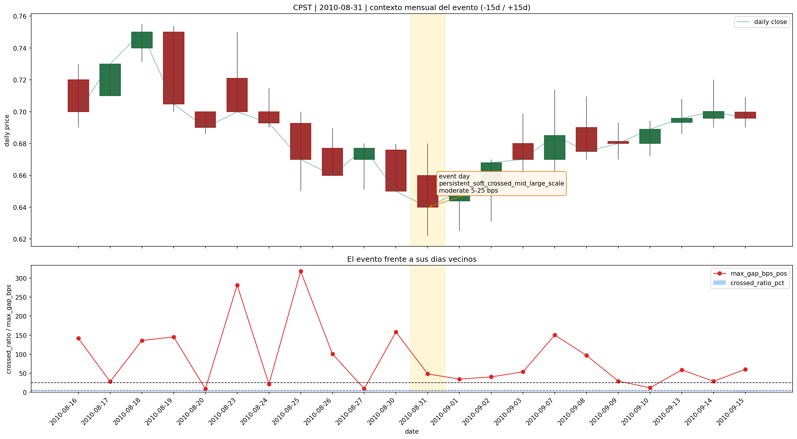

#### 00b Event Month Quotes Context
Esta imagen responde a la pregunta de recurrencia mensual dentro de `quotes`: el problema se concentra en el evento o reaparece en varias sesiones. Arriba concatena sesiones con datos disponibles; abajo resume cobertura diaria, `crossed_ratio_pct` y `max_gap_bps_pos`. La decision que cambia es si el caso debe leerse como episodio puntual o como sintoma de una fase repetida de libro degradado. El error que evita es extrapolar desde un unico dia a todo el mes sin evidencia.

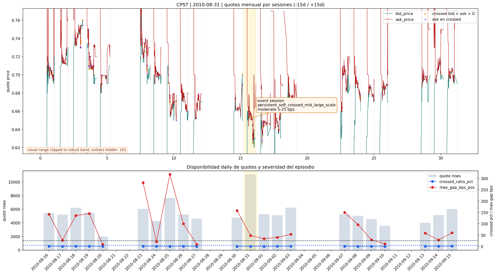

#### 01 Raw Window
Esta imagen responde a la primera pregunta decisiva del caso: el crossed observado es economicamente bastante fuerte para justificar un cambio de clase. Arriba ensena la geometria exacta del tramo conflictivo; abajo convierte esa geometria a bps y la enfrenta a los cortes `5 bps` y `25 bps`. El regimen dominante es `moderate 5-25 bps`. La decision que cambia es pasar de anomalia interpretable a `review` o `bad`. El error que evita es decidir por apariencia visual sin medir el dano economico real del crossed. En terminos de pipeline, este panel decide si el problema afecta solo a la lectura forense o si invalida simulacion de ejecucion y microstructure features.

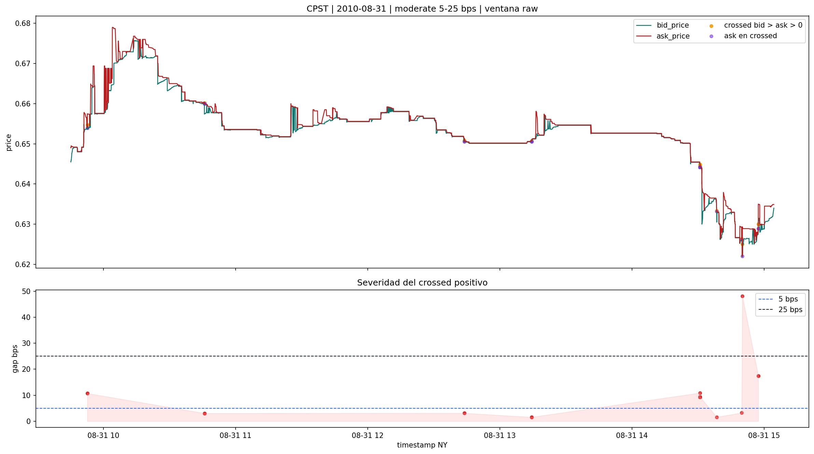

#### 02 Full Session Context
Esta imagen responde a la pregunta de extension intradiaria: el dano esta confinado a un bloque corto o contamina la sesion completa. Arriba se ve toda la sesion `04:00-20:00 NY`; abajo el `gap_bps` firmado. La decision que cambia es si el consumo debe penalizar solo un tramo o desechar el dia entero para uso operativo. El error que evita es tratar una cicatriz local como ruina total o, al reves, minimizar una degradacion distribuida a lo largo del dia. En ejecucion esto decide si la sesion puede seguir usandose con restricciones; en ML decide si las features intradiarias conservan significado economico.

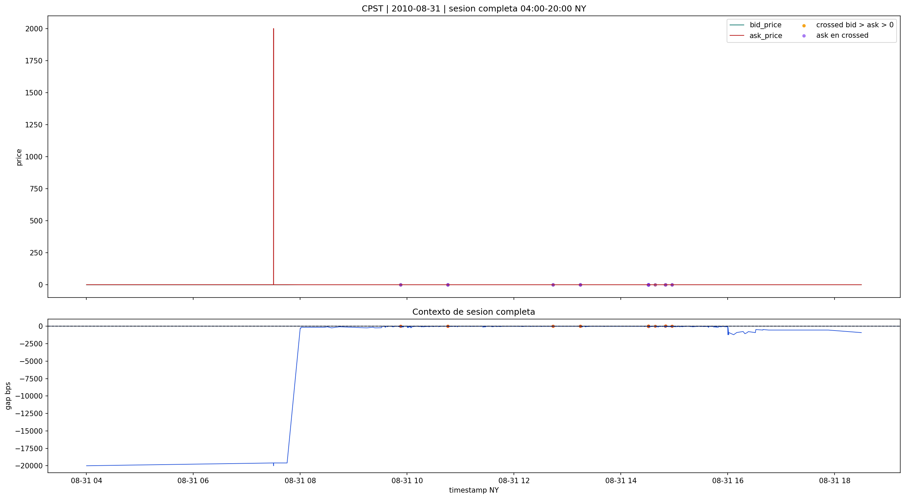

#### 03 Structure Diagnostics
Este panel responde a la pregunta de naturaleza del fallo: contradiccion economica genuina o mezcla con degeneracion estructural. Separa `ask=0` de `ask>0`, muestra la distribucion de `gap_bps` y resume patrones de integerizacion. La decision que cambia es como interpretar el dano: mercado localmente roto, artefacto de representacion o combinacion de ambos. El error que evita es sobrediagnosticar crossed reales cuando parte de la senal proviene de estructura degenerada del libro. Esta lectura afecta directamente a que el caso vaya a exclusion dura, a bandera contextual o a simple reconciliacion tecnica.

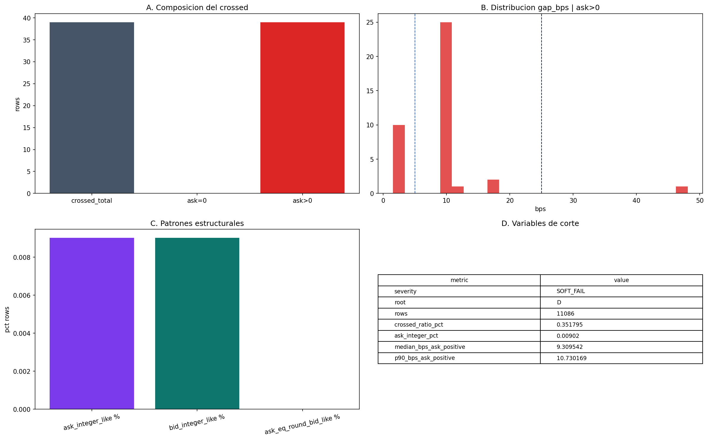

#### 04 Summary Card
Esta tarjeta responde a la pregunta de auditabilidad: cuales son exactamente las variables que sostienen la conclusion. Reune `severity`, `root`, `crossed_ratio_pct`, `ask_integer_pct`, `median_bps_ask_positive` y `p90_bps_ask_positive`. La decision que cambia es pasar de impresion visual a regla verificable. El error que evita es que dos inspectores lleguen a conclusiones distintas mirando la misma imagen sin una base numerica comun. Para gobernanza del proyecto, este panel es el que vuelve reproducible la decision para backtest, ML y auditoria.

---

### 41. PLAY 2006-02-14

company_name: `Dave & Buster's Entertainment, Inc.`
primary_exchange: `NASDAQ` (`XNAS`)
market_locale: `stocks/us`
scope: `review`
ticker: `PLAY`
date: `2006-02-14`
taxonomy: `persistent_soft_crossed_mid_large_scale`
positive_cross_bucket: `positive_cross_moderate_5to25bps`
severity: `SOFT_FAIL`
root: `C`
rows: `11467`
crossed_ratio_pct: `0.340106`
crossed_rows_raw: `39`
crossed_rows_ask_zero: `0`
crossed_rows_ask_positive: `39`
ask_integer_pct: `7.264324`
median_bps_ask_positive: `7.745933`
p90_bps_ask_positive: `19.316206`
file: `C:\TSIS_Data\data\quotes\PLAY\year=2006\month=02\day=14\quotes.parquet`

#### Analisis Forense
La conclusion correcta del caso es que ya existe contradiccion economica real dentro del libro, pero aun no con fuerza suficiente para justificar exclusion dura sin contexto adicional. La taxonomy historica es `persistent_soft_crossed_mid_large_scale` y el regimen positivo dominante es `moderate 5-25 bps`. Esto importa porque la taxonomy no solo clasifica: resume que tipo de anomalia se esta viendo y que clase de decision contractual puede defenderse despues. La taxonomy `persistent_soft_crossed_mid_large_scale` implica un problema repetido y distribuido, no un simple pinchazo local. Por eso empuja a `review`: ya hay dano real, aunque no necesariamente exclusion dura universal. El regimen `moderate 5-25 bps` ya entra en zona donde el crossed tiene capacidad real de contaminar simulacion de ejecucion y features microestructurales, aunque todavia puede requerir lectura contextual antes de exclusion dura. En terminos observables, el file tiene `crossed_ratio_pct=0.340106` con `crossed_rows_ask_positive=39` y `crossed_rows_ask_zero=0`. La severidad economica del crossed ask>0 se resume en `median_bps_ask_positive=7.745933` y `p90_bps_ask_positive=19.316206`. Estos dos numeros convierten una forma visual rara en una conclusion operativa sobre si el libro sigue representando o no un mercado negociable. La decision que cambia es pasar de libro sano a libro util solo bajo cautela. `review` significa: no usar como si fuera ejecucion limpia, conservar para analisis contextual y sensibilidad. El error que evita es tratar como normal un episodio que ya contiene contradiccion economica real y contaminar simulaciones de ejecucion o validaciones demasiado optimistas. El patron estructural muestra `ask_integer_pct=7.264324`. Este numero obliga a separar dos explicaciones rivales: contradiccion economica genuina del libro o mezcla con degeneracion estructural / integerizacion. Toda la composicion crossed cae en `ask>0`. Eso endurece la lectura economica del caso: el dano no depende de ceros mecanicos, sino de contradiccion positiva dentro de precios aparentemente vivos. Como `ask_integer_pct` no es extremo, el caso exige leer geometria del crossed y estructura simultaneamente. No basta un solo numero; hay que combinar severidad, composicion y contexto. En la capa de semantica de precio del evento aparecen `daily raw close=25.9900`, `quote mid raw=26.0400`, `quote mid split_normalized=26.0400`, `daily adjusted_proxy=24.4584`. Ademas hay `post_event_dividend_sum=0.9200`. La implicacion metodologica es crucial: una discrepancia entre `quotes`, `daily` y una plataforma externa no puede leerse automaticamente como fallo del dataset. Puede ser semantica de precio distinta. El error que evita esta capa es mezclar raw, split-normalized y adjusted dentro del mismo pipeline, rompiendo auditoria, benchmarking y labels. Para pipelines, esto bloquea su uso como libro sano en ejecucion y features microestructurales principales, aunque aun puede mantenerse para forense, sensibilidad y estudios donde la anomalia sea parte del objeto de investigacion. Existe ademas una imagen historica de certificacion asociada. Su papel es poner el episodio en un marco causal mas amplio: halt, explained, not strongly explained o patron conocido. La regla que protege al proyecto es esta: el contexto externo se usa para explicar por que aparece el episodio, no para absolverlo. El error que evita es degradar el criterio de calidad del libro porque exista una historia plausible alrededor del caso.

#### 00 Event Month Context
Esta imagen responde a la pregunta de persistencia temporal: estamos ante un accidente local o ante una fase mas amplia de inestabilidad. Arriba coloca el evento en la serie `daily` real del mes; abajo compara `crossed_ratio_pct` y `max_gap_bps_pos` del dia contra sus vecinos. La decision que cambia es el peso estructural que se le concede al caso. El error que evita es juzgar igual un shock aislado y una degradacion repetida del libro.

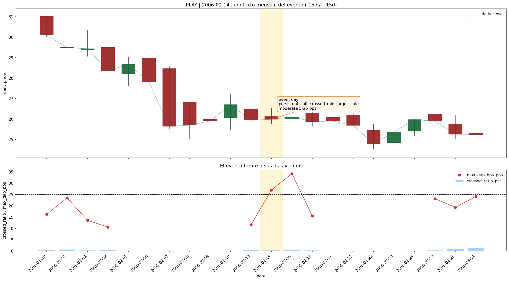

#### 00a Adjusted Proxy Contrast
Esta imagen responde a la pregunta de reconciliacion semantica: la discrepancia de precios viene de datos rotos o de vistas de precio distintas. Compara `daily raw`, `daily adjusted_proxy`, `quote mid raw` y `quote mid split_normalized`, y debajo ensena la cadena de dividendos y splits que produce la diferencia. La decision que cambia es si el inspector debe abrir una incidencia de calidad o cerrar el caso como diferencia legitima de semantica. El error que evita es mezclar series raw y adjusted como si fueran equivalentes. En pipelines reales, esto protege benchmarking, labels diarios y reconciliacion externa frente a falsas alarmas de precio.

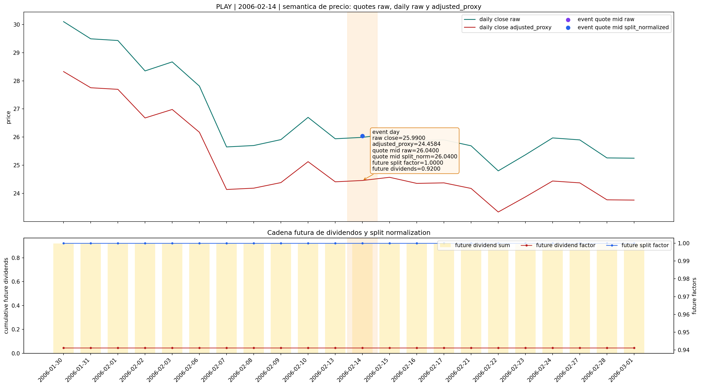

#### 00b Event Month Quotes Context
Esta imagen responde a la pregunta de recurrencia mensual dentro de `quotes`: el problema se concentra en el evento o reaparece en varias sesiones. Arriba concatena sesiones con datos disponibles; abajo resume cobertura diaria, `crossed_ratio_pct` y `max_gap_bps_pos`. La decision que cambia es si el caso debe leerse como episodio puntual o como sintoma de una fase repetida de libro degradado. El error que evita es extrapolar desde un unico dia a todo el mes sin evidencia.

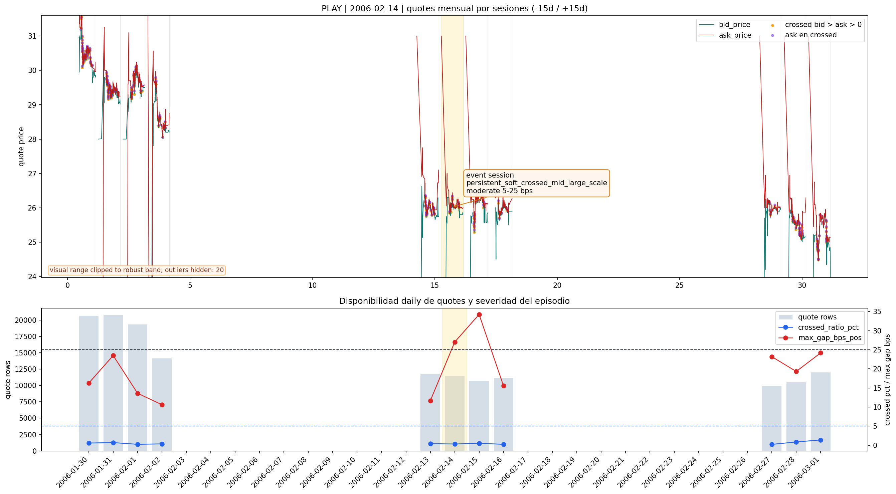

#### 01 Raw Window
Esta imagen responde a la primera pregunta decisiva del caso: el crossed observado es economicamente bastante fuerte para justificar un cambio de clase. Arriba ensena la geometria exacta del tramo conflictivo; abajo convierte esa geometria a bps y la enfrenta a los cortes `5 bps` y `25 bps`. El regimen dominante es `moderate 5-25 bps`. La decision que cambia es pasar de anomalia interpretable a `review` o `bad`. El error que evita es decidir por apariencia visual sin medir el dano economico real del crossed. En terminos de pipeline, este panel decide si el problema afecta solo a la lectura forense o si invalida simulacion de ejecucion y microstructure features.

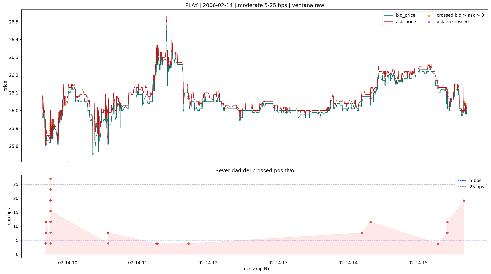

#### 02 Full Session Context
Esta imagen responde a la pregunta de extension intradiaria: el dano esta confinado a un bloque corto o contamina la sesion completa. Arriba se ve toda la sesion `04:00-20:00 NY`; abajo el `gap_bps` firmado. La decision que cambia es si el consumo debe penalizar solo un tramo o desechar el dia entero para uso operativo. El error que evita es tratar una cicatriz local como ruina total o, al reves, minimizar una degradacion distribuida a lo largo del dia. En ejecucion esto decide si la sesion puede seguir usandose con restricciones; en ML decide si las features intradiarias conservan significado economico.

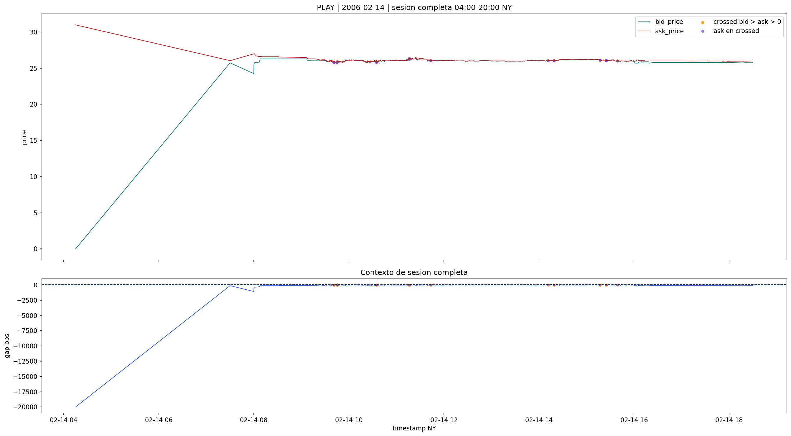

#### 03 Structure Diagnostics
Este panel responde a la pregunta de naturaleza del fallo: contradiccion economica genuina o mezcla con degeneracion estructural. Separa `ask=0` de `ask>0`, muestra la distribucion de `gap_bps` y resume patrones de integerizacion. La decision que cambia es como interpretar el dano: mercado localmente roto, artefacto de representacion o combinacion de ambos. El error que evita es sobrediagnosticar crossed reales cuando parte de la senal proviene de estructura degenerada del libro. Esta lectura afecta directamente a que el caso vaya a exclusion dura, a bandera contextual o a simple reconciliacion tecnica.

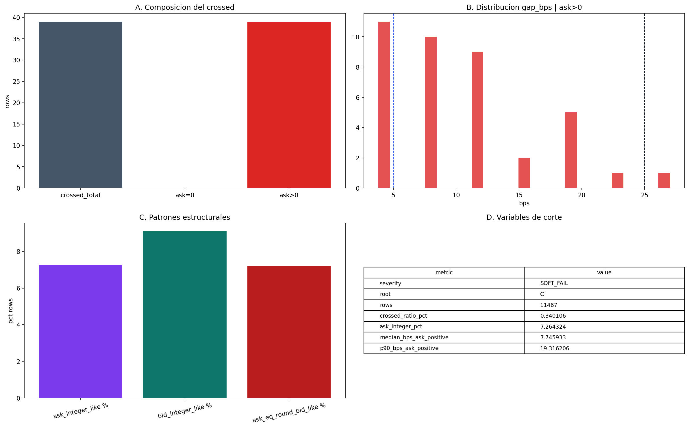

#### 04 Summary Card
Esta tarjeta responde a la pregunta de auditabilidad: cuales son exactamente las variables que sostienen la conclusion. Reune `severity`, `root`, `crossed_ratio_pct`, `ask_integer_pct`, `median_bps_ask_positive` y `p90_bps_ask_positive`. La decision que cambia es pasar de impresion visual a regla verificable. El error que evita es que dos inspectores lleguen a conclusiones distintas mirando la misma imagen sin una base numerica comun. Para gobernanza del proyecto, este panel es el que vuelve reproducible la decision para backtest, ML y auditoria.

---

### 42. MDR 2009-02-11

company_name: `McDermott International`
primary_exchange: `NYSE` (`XNYS`)
market_locale: `stocks/us`
scope: `review`
ticker: `MDR`
date: `2009-02-11`
taxonomy: `persistent_soft_crossed_mid_large_scale`
positive_cross_bucket: `positive_cross_moderate_5to25bps`
severity: `SOFT_FAIL`
root: `D`
rows: `69669`
crossed_ratio_pct: `0.340180`
crossed_rows_raw: `237`
crossed_rows_ask_zero: `0`
crossed_rows_ask_positive: `237`
ask_integer_pct: `1.469807`
median_bps_ask_positive: `7.654038`
p90_bps_ask_positive: `15.003751`
file: `D:\quotes\MDR\year=2009\month=02\day=11\quotes.parquet`

#### Analisis Forense
La conclusion correcta del caso es que ya existe contradiccion economica real dentro del libro, pero aun no con fuerza suficiente para justificar exclusion dura sin contexto adicional. La taxonomy historica es `persistent_soft_crossed_mid_large_scale` y el regimen positivo dominante es `moderate 5-25 bps`. Esto importa porque la taxonomy no solo clasifica: resume que tipo de anomalia se esta viendo y que clase de decision contractual puede defenderse despues. La taxonomy `persistent_soft_crossed_mid_large_scale` implica un problema repetido y distribuido, no un simple pinchazo local. Por eso empuja a `review`: ya hay dano real, aunque no necesariamente exclusion dura universal. El regimen `moderate 5-25 bps` ya entra en zona donde el crossed tiene capacidad real de contaminar simulacion de ejecucion y features microestructurales, aunque todavia puede requerir lectura contextual antes de exclusion dura. En terminos observables, el file tiene `crossed_ratio_pct=0.340180` con `crossed_rows_ask_positive=237` y `crossed_rows_ask_zero=0`. La severidad economica del crossed ask>0 se resume en `median_bps_ask_positive=7.654038` y `p90_bps_ask_positive=15.003751`. Estos dos numeros convierten una forma visual rara en una conclusion operativa sobre si el libro sigue representando o no un mercado negociable. La decision que cambia es pasar de libro sano a libro util solo bajo cautela. `review` significa: no usar como si fuera ejecucion limpia, conservar para analisis contextual y sensibilidad. El error que evita es tratar como normal un episodio que ya contiene contradiccion economica real y contaminar simulaciones de ejecucion o validaciones demasiado optimistas. El patron estructural muestra `ask_integer_pct=1.469807`. Este numero obliga a separar dos explicaciones rivales: contradiccion economica genuina del libro o mezcla con degeneracion estructural / integerizacion. Toda la composicion crossed cae en `ask>0`. Eso endurece la lectura economica del caso: el dano no depende de ceros mecanicos, sino de contradiccion positiva dentro de precios aparentemente vivos. Como `ask_integer_pct` es bajo, la hipotesis de simple degeneracion mecanica pierde fuerza. Eso endurece la interpretacion: el crossed se parece mas a contradiccion economica genuina y menos a artefacto. En la capa de semantica de precio del evento aparecen `daily raw close=39.6000`, `quote mid raw=13.0850`, `quote mid split_normalized=39.2550`, `daily adjusted_proxy=39.6000`. La reconciliacion incluye `future_split_factor=0.3333`. La implicacion metodologica es crucial: una discrepancia entre `quotes`, `daily` y una plataforma externa no puede leerse automaticamente como fallo del dataset. Puede ser semantica de precio distinta. El error que evita esta capa es mezclar raw, split-normalized y adjusted dentro del mismo pipeline, rompiendo auditoria, benchmarking y labels. Para pipelines, esto bloquea su uso como libro sano en ejecucion y features microestructurales principales, aunque aun puede mantenerse para forense, sensibilidad y estudios donde la anomalia sea parte del objeto de investigacion. Existe ademas una imagen historica de certificacion asociada. Su papel es poner el episodio en un marco causal mas amplio: halt, explained, not strongly explained o patron conocido. La regla que protege al proyecto es esta: el contexto externo se usa para explicar por que aparece el episodio, no para absolverlo. El error que evita es degradar el criterio de calidad del libro porque exista una historia plausible alrededor del caso.

#### 00 Event Month Context
Esta imagen responde a la pregunta de persistencia temporal: estamos ante un accidente local o ante una fase mas amplia de inestabilidad. Arriba coloca el evento en la serie `daily` real del mes; abajo compara `crossed_ratio_pct` y `max_gap_bps_pos` del dia contra sus vecinos. La decision que cambia es el peso estructural que se le concede al caso. El error que evita es juzgar igual un shock aislado y una degradacion repetida del libro.

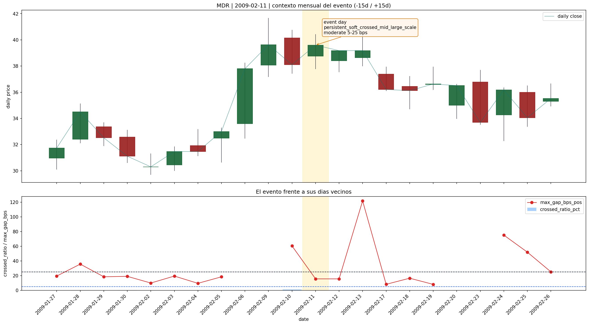

#### 00a Adjusted Proxy Contrast
Esta imagen responde a la pregunta de reconciliacion semantica: la discrepancia de precios viene de datos rotos o de vistas de precio distintas. Compara `daily raw`, `daily adjusted_proxy`, `quote mid raw` y `quote mid split_normalized`, y debajo ensena la cadena de dividendos y splits que produce la diferencia. La decision que cambia es si el inspector debe abrir una incidencia de calidad o cerrar el caso como diferencia legitima de semantica. El error que evita es mezclar series raw y adjusted como si fueran equivalentes. En pipelines reales, esto protege benchmarking, labels diarios y reconciliacion externa frente a falsas alarmas de precio.

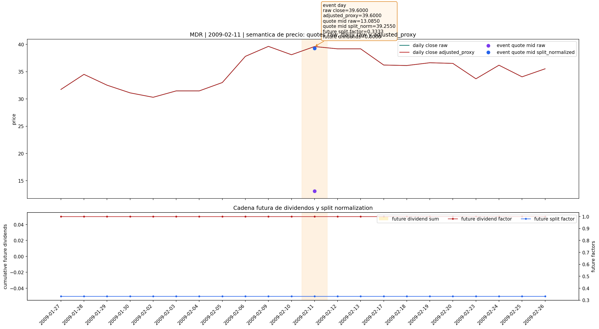

#### 00b Event Month Quotes Context
Esta imagen responde a la pregunta de recurrencia mensual dentro de `quotes`: el problema se concentra en el evento o reaparece en varias sesiones. Arriba concatena sesiones con datos disponibles; abajo resume cobertura diaria, `crossed_ratio_pct` y `max_gap_bps_pos`. La decision que cambia es si el caso debe leerse como episodio puntual o como sintoma de una fase repetida de libro degradado. El error que evita es extrapolar desde un unico dia a todo el mes sin evidencia.

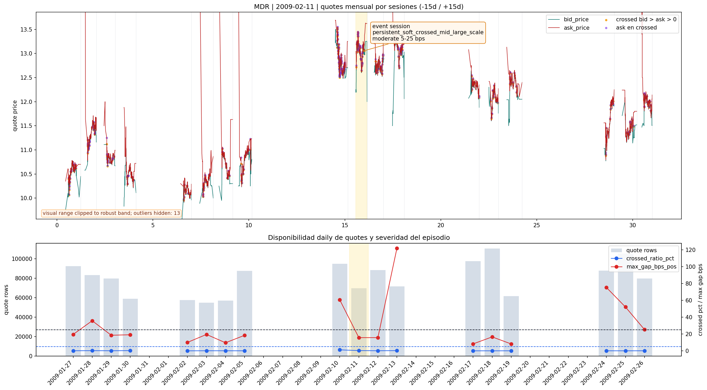

#### 01 Raw Window
Esta imagen responde a la primera pregunta decisiva del caso: el crossed observado es economicamente bastante fuerte para justificar un cambio de clase. Arriba ensena la geometria exacta del tramo conflictivo; abajo convierte esa geometria a bps y la enfrenta a los cortes `5 bps` y `25 bps`. El regimen dominante es `moderate 5-25 bps`. La decision que cambia es pasar de anomalia interpretable a `review` o `bad`. El error que evita es decidir por apariencia visual sin medir el dano economico real del crossed. En terminos de pipeline, este panel decide si el problema afecta solo a la lectura forense o si invalida simulacion de ejecucion y microstructure features.

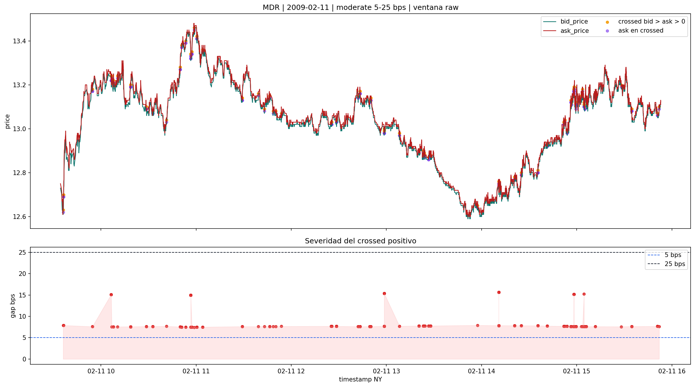

#### 02 Full Session Context
Esta imagen responde a la pregunta de extension intradiaria: el dano esta confinado a un bloque corto o contamina la sesion completa. Arriba se ve toda la sesion `04:00-20:00 NY`; abajo el `gap_bps` firmado. La decision que cambia es si el consumo debe penalizar solo un tramo o desechar el dia entero para uso operativo. El error que evita es tratar una cicatriz local como ruina total o, al reves, minimizar una degradacion distribuida a lo largo del dia. En ejecucion esto decide si la sesion puede seguir usandose con restricciones; en ML decide si las features intradiarias conservan significado economico.

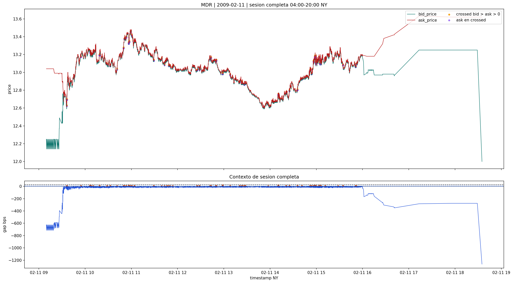

#### 03 Structure Diagnostics
Este panel responde a la pregunta de naturaleza del fallo: contradiccion economica genuina o mezcla con degeneracion estructural. Separa `ask=0` de `ask>0`, muestra la distribucion de `gap_bps` y resume patrones de integerizacion. La decision que cambia es como interpretar el dano: mercado localmente roto, artefacto de representacion o combinacion de ambos. El error que evita es sobrediagnosticar crossed reales cuando parte de la senal proviene de estructura degenerada del libro. Esta lectura afecta directamente a que el caso vaya a exclusion dura, a bandera contextual o a simple reconciliacion tecnica.

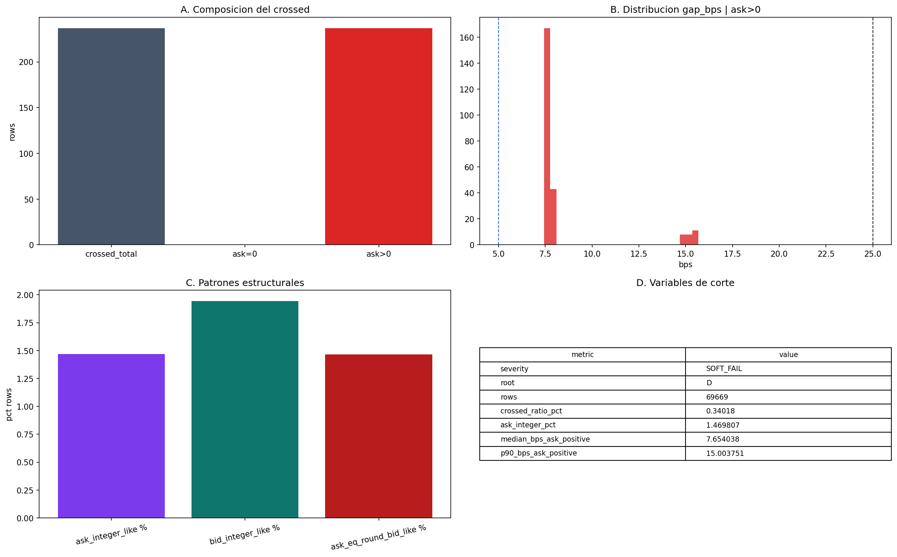

#### 04 Summary Card
Esta tarjeta responde a la pregunta de auditabilidad: cuales son exactamente las variables que sostienen la conclusion. Reune `severity`, `root`, `crossed_ratio_pct`, `ask_integer_pct`, `median_bps_ask_positive` y `p90_bps_ask_positive`. La decision que cambia es pasar de impresion visual a regla verificable. El error que evita es que dos inspectores lleguen a conclusiones distintas mirando la misma imagen sin una base numerica comun. Para gobernanza del proyecto, este panel es el que vuelve reproducible la decision para backtest, ML y auditoria.

---

### 43. BDN 2013-04-03

company_name: `Brandywine Realty Trust`
primary_exchange: `NYSE` (`XNYS`)
market_locale: `stocks/us`
scope: `review`
ticker: `BDN`
date: `2013-04-03`
taxonomy: `persistent_soft_crossed_mid_large_scale`
positive_cross_bucket: `positive_cross_moderate_5to25bps`
severity: `SOFT_FAIL`
root: `D`
rows: `22913`
crossed_ratio_pct: `0.728844`
crossed_rows_raw: `167`
crossed_rows_ask_zero: `0`
crossed_rows_ask_positive: `167`
ask_integer_pct: `0.017457`
median_bps_ask_positive: `6.745363`
p90_bps_ask_positive: `6.768264`
file: `D:\quotes\BDN\year=2013\month=04\day=03\quotes.parquet`

#### Analisis Forense
La conclusion correcta del caso es que ya existe contradiccion economica real dentro del libro, pero aun no con fuerza suficiente para justificar exclusion dura sin contexto adicional. La taxonomy historica es `persistent_soft_crossed_mid_large_scale` y el regimen positivo dominante es `moderate 5-25 bps`. Esto importa porque la taxonomy no solo clasifica: resume que tipo de anomalia se esta viendo y que clase de decision contractual puede defenderse despues. La taxonomy `persistent_soft_crossed_mid_large_scale` implica un problema repetido y distribuido, no un simple pinchazo local. Por eso empuja a `review`: ya hay dano real, aunque no necesariamente exclusion dura universal. El regimen `moderate 5-25 bps` ya entra en zona donde el crossed tiene capacidad real de contaminar simulacion de ejecucion y features microestructurales, aunque todavia puede requerir lectura contextual antes de exclusion dura. En terminos observables, el file tiene `crossed_ratio_pct=0.728844` con `crossed_rows_ask_positive=167` y `crossed_rows_ask_zero=0`. La severidad economica del crossed ask>0 se resume en `median_bps_ask_positive=6.745363` y `p90_bps_ask_positive=6.768264`. Estos dos numeros convierten una forma visual rara en una conclusion operativa sobre si el libro sigue representando o no un mercado negociable. La decision que cambia es pasar de libro sano a libro util solo bajo cautela. `review` significa: no usar como si fuera ejecucion limpia, conservar para analisis contextual y sensibilidad. El error que evita es tratar como normal un episodio que ya contiene contradiccion economica real y contaminar simulaciones de ejecucion o validaciones demasiado optimistas. El patron estructural muestra `ask_integer_pct=0.017457`. Este numero obliga a separar dos explicaciones rivales: contradiccion economica genuina del libro o mezcla con degeneracion estructural / integerizacion. Toda la composicion crossed cae en `ask>0`. Eso endurece la lectura economica del caso: el dano no depende de ceros mecanicos, sino de contradiccion positiva dentro de precios aparentemente vivos. Como `ask_integer_pct` es bajo, la hipotesis de simple degeneracion mecanica pierde fuerza. Eso endurece la interpretacion: el crossed se parece mas a contradiccion economica genuina y menos a artefacto. En la capa de semantica de precio del evento aparecen `daily raw close=14.7200`, `quote mid raw=14.7150`, `quote mid split_normalized=14.7150`, `daily adjusted_proxy=7.6691`. Ademas hay `post_event_dividend_sum=8.5300`. La implicacion metodologica es crucial: una discrepancia entre `quotes`, `daily` y una plataforma externa no puede leerse automaticamente como fallo del dataset. Puede ser semantica de precio distinta. El error que evita esta capa es mezclar raw, split-normalized y adjusted dentro del mismo pipeline, rompiendo auditoria, benchmarking y labels. Para pipelines, esto bloquea su uso como libro sano en ejecucion y features microestructurales principales, aunque aun puede mantenerse para forense, sensibilidad y estudios donde la anomalia sea parte del objeto de investigacion. Existe ademas una imagen historica de certificacion asociada. Su papel es poner el episodio en un marco causal mas amplio: halt, explained, not strongly explained o patron conocido. La regla que protege al proyecto es esta: el contexto externo se usa para explicar por que aparece el episodio, no para absolverlo. El error que evita es degradar el criterio de calidad del libro porque exista una historia plausible alrededor del caso.

#### 00 Event Month Context
Esta imagen responde a la pregunta de persistencia temporal: estamos ante un accidente local o ante una fase mas amplia de inestabilidad. Arriba coloca el evento en la serie `daily` real del mes; abajo compara `crossed_ratio_pct` y `max_gap_bps_pos` del dia contra sus vecinos. La decision que cambia es el peso estructural que se le concede al caso. El error que evita es juzgar igual un shock aislado y una degradacion repetida del libro.

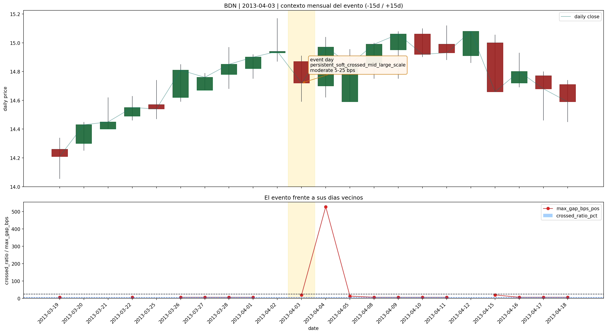

#### 00a Adjusted Proxy Contrast
Esta imagen responde a la pregunta de reconciliacion semantica: la discrepancia de precios viene de datos rotos o de vistas de precio distintas. Compara `daily raw`, `daily adjusted_proxy`, `quote mid raw` y `quote mid split_normalized`, y debajo ensena la cadena de dividendos y splits que produce la diferencia. La decision que cambia es si el inspector debe abrir una incidencia de calidad o cerrar el caso como diferencia legitima de semantica. El error que evita es mezclar series raw y adjusted como si fueran equivalentes. En pipelines reales, esto protege benchmarking, labels diarios y reconciliacion externa frente a falsas alarmas de precio.

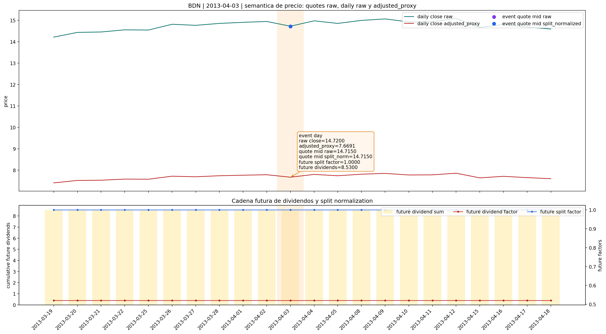

#### 00b Event Month Quotes Context
Esta imagen responde a la pregunta de recurrencia mensual dentro de `quotes`: el problema se concentra en el evento o reaparece en varias sesiones. Arriba concatena sesiones con datos disponibles; abajo resume cobertura diaria, `crossed_ratio_pct` y `max_gap_bps_pos`. La decision que cambia es si el caso debe leerse como episodio puntual o como sintoma de una fase repetida de libro degradado. El error que evita es extrapolar desde un unico dia a todo el mes sin evidencia.

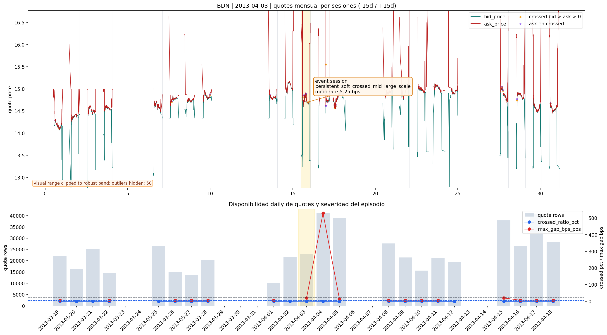

#### 01 Raw Window
Esta imagen responde a la primera pregunta decisiva del caso: el crossed observado es economicamente bastante fuerte para justificar un cambio de clase. Arriba ensena la geometria exacta del tramo conflictivo; abajo convierte esa geometria a bps y la enfrenta a los cortes `5 bps` y `25 bps`. El regimen dominante es `moderate 5-25 bps`. La decision que cambia es pasar de anomalia interpretable a `review` o `bad`. El error que evita es decidir por apariencia visual sin medir el dano economico real del crossed. En terminos de pipeline, este panel decide si el problema afecta solo a la lectura forense o si invalida simulacion de ejecucion y microstructure features.

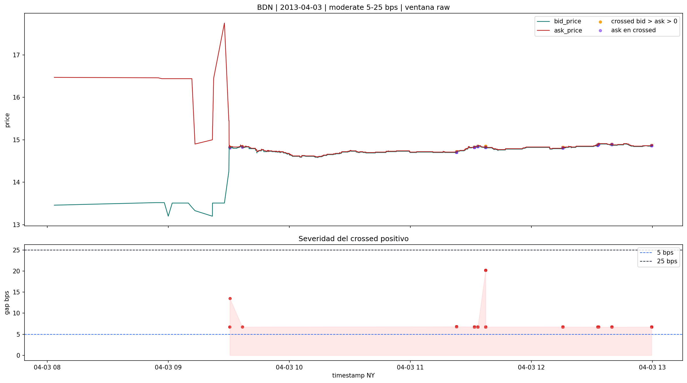

#### 02 Full Session Context
Esta imagen responde a la pregunta de extension intradiaria: el dano esta confinado a un bloque corto o contamina la sesion completa. Arriba se ve toda la sesion `04:00-20:00 NY`; abajo el `gap_bps` firmado. La decision que cambia es si el consumo debe penalizar solo un tramo o desechar el dia entero para uso operativo. El error que evita es tratar una cicatriz local como ruina total o, al reves, minimizar una degradacion distribuida a lo largo del dia. En ejecucion esto decide si la sesion puede seguir usandose con restricciones; en ML decide si las features intradiarias conservan significado economico.

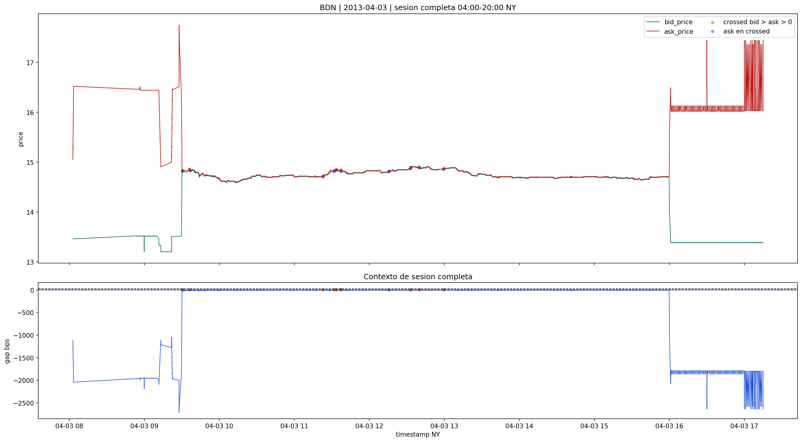

#### 03 Structure Diagnostics
Este panel responde a la pregunta de naturaleza del fallo: contradiccion economica genuina o mezcla con degeneracion estructural. Separa `ask=0` de `ask>0`, muestra la distribucion de `gap_bps` y resume patrones de integerizacion. La decision que cambia es como interpretar el dano: mercado localmente roto, artefacto de representacion o combinacion de ambos. El error que evita es sobrediagnosticar crossed reales cuando parte de la senal proviene de estructura degenerada del libro. Esta lectura afecta directamente a que el caso vaya a exclusion dura, a bandera contextual o a simple reconciliacion tecnica.

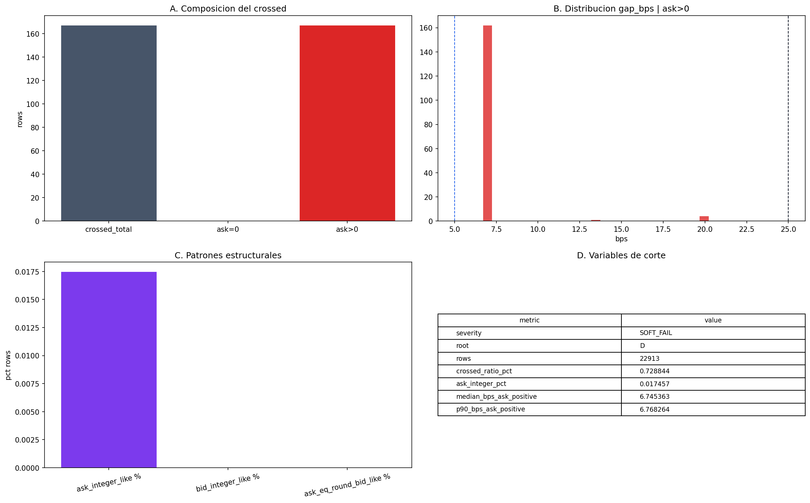

#### 04 Summary Card
Esta tarjeta responde a la pregunta de auditabilidad: cuales son exactamente las variables que sostienen la conclusion. Reune `severity`, `root`, `crossed_ratio_pct`, `ask_integer_pct`, `median_bps_ask_positive` y `p90_bps_ask_positive`. La decision que cambia es pasar de impresion visual a regla verificable. El error que evita es que dos inspectores lleguen a conclusiones distintas mirando la misma imagen sin una base numerica comun. Para gobernanza del proyecto, este panel es el que vuelve reproducible la decision para backtest, ML y auditoria.

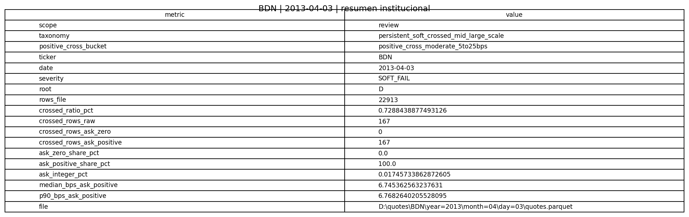

---

### 44. EK 2008-09-09

company_name: `EASTMAN KODAK CO`
primary_exchange: `NYSE` (`XNYS`)
market_locale: `stocks/us`
scope: `review`
ticker: `EK`
date: `2008-09-09`
taxonomy: `persistent_soft_crossed_mid_large_scale`
positive_cross_bucket: `positive_cross_moderate_5to25bps`
severity: `SOFT_FAIL`
root: `D`
rows: `68876`
crossed_ratio_pct: `0.471862`
crossed_rows_raw: `325`
crossed_rows_ask_zero: `0`
crossed_rows_ask_positive: `325`
ask_integer_pct: `0.226494`
median_bps_ask_positive: `6.432937`
p90_bps_ask_positive: `19.150974`
file: `D:\quotes\EK\year=2008\month=09\day=09\quotes.parquet`

#### Analisis Forense
La conclusion correcta del caso es que ya existe contradiccion economica real dentro del libro, pero aun no con fuerza suficiente para justificar exclusion dura sin contexto adicional. La taxonomy historica es `persistent_soft_crossed_mid_large_scale` y el regimen positivo dominante es `moderate 5-25 bps`. Esto importa porque la taxonomy no solo clasifica: resume que tipo de anomalia se esta viendo y que clase de decision contractual puede defenderse despues. La taxonomy `persistent_soft_crossed_mid_large_scale` implica un problema repetido y distribuido, no un simple pinchazo local. Por eso empuja a `review`: ya hay dano real, aunque no necesariamente exclusion dura universal. El regimen `moderate 5-25 bps` ya entra en zona donde el crossed tiene capacidad real de contaminar simulacion de ejecucion y features microestructurales, aunque todavia puede requerir lectura contextual antes de exclusion dura. En terminos observables, el file tiene `crossed_ratio_pct=0.471862` con `crossed_rows_ask_positive=325` y `crossed_rows_ask_zero=0`. La severidad economica del crossed ask>0 se resume en `median_bps_ask_positive=6.432937` y `p90_bps_ask_positive=19.150974`. Estos dos numeros convierten una forma visual rara en una conclusion operativa sobre si el libro sigue representando o no un mercado negociable. La decision que cambia es pasar de libro sano a libro util solo bajo cautela. `review` significa: no usar como si fuera ejecucion limpia, conservar para analisis contextual y sensibilidad. El error que evita es tratar como normal un episodio que ya contiene contradiccion economica real y contaminar simulaciones de ejecucion o validaciones demasiado optimistas. El patron estructural muestra `ask_integer_pct=0.226494`. Este numero obliga a separar dos explicaciones rivales: contradiccion economica genuina del libro o mezcla con degeneracion estructural / integerizacion. Toda la composicion crossed cae en `ask>0`. Eso endurece la lectura economica del caso: el dano no depende de ceros mecanicos, sino de contradiccion positiva dentro de precios aparentemente vivos. Como `ask_integer_pct` es bajo, la hipotesis de simple degeneracion mecanica pierde fuerza. Eso endurece la interpretacion: el crossed se parece mas a contradiccion economica genuina y menos a artefacto. En la capa de semantica de precio del evento aparecen `daily raw close=14.9600`, `quote mid raw=15.2900`, `quote mid split_normalized=15.2900`, `daily adjusted_proxy=14.6228`. Ademas hay `post_event_dividend_sum=0.2500`. La implicacion metodologica es crucial: una discrepancia entre `quotes`, `daily` y una plataforma externa no puede leerse automaticamente como fallo del dataset. Puede ser semantica de precio distinta. El error que evita esta capa es mezclar raw, split-normalized y adjusted dentro del mismo pipeline, rompiendo auditoria, benchmarking y labels. Para pipelines, esto bloquea su uso como libro sano en ejecucion y features microestructurales principales, aunque aun puede mantenerse para forense, sensibilidad y estudios donde la anomalia sea parte del objeto de investigacion. Existe ademas una imagen historica de certificacion asociada. Su papel es poner el episodio en un marco causal mas amplio: halt, explained, not strongly explained o patron conocido. La regla que protege al proyecto es esta: el contexto externo se usa para explicar por que aparece el episodio, no para absolverlo. El error que evita es degradar el criterio de calidad del libro porque exista una historia plausible alrededor del caso.

#### 00 Event Month Context
Esta imagen responde a la pregunta de persistencia temporal: estamos ante un accidente local o ante una fase mas amplia de inestabilidad. Arriba coloca el evento en la serie `daily` real del mes; abajo compara `crossed_ratio_pct` y `max_gap_bps_pos` del dia contra sus vecinos. La decision que cambia es el peso estructural que se le concede al caso. El error que evita es juzgar igual un shock aislado y una degradacion repetida del libro.

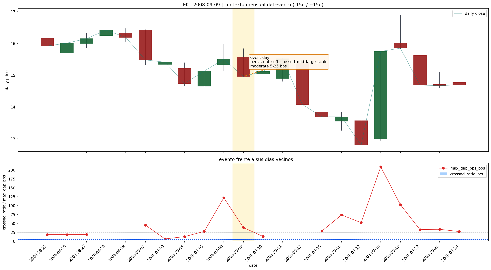

#### 00a Adjusted Proxy Contrast
Esta imagen responde a la pregunta de reconciliacion semantica: la discrepancia de precios viene de datos rotos o de vistas de precio distintas. Compara `daily raw`, `daily adjusted_proxy`, `quote mid raw` y `quote mid split_normalized`, y debajo ensena la cadena de dividendos y splits que produce la diferencia. La decision que cambia es si el inspector debe abrir una incidencia de calidad o cerrar el caso como diferencia legitima de semantica. El error que evita es mezclar series raw y adjusted como si fueran equivalentes. En pipelines reales, esto protege benchmarking, labels diarios y reconciliacion externa frente a falsas alarmas de precio.

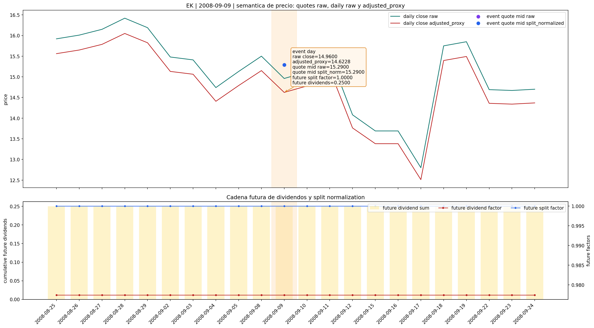

#### 00b Event Month Quotes Context
Esta imagen responde a la pregunta de recurrencia mensual dentro de `quotes`: el problema se concentra en el evento o reaparece en varias sesiones. Arriba concatena sesiones con datos disponibles; abajo resume cobertura diaria, `crossed_ratio_pct` y `max_gap_bps_pos`. La decision que cambia es si el caso debe leerse como episodio puntual o como sintoma de una fase repetida de libro degradado. El error que evita es extrapolar desde un unico dia a todo el mes sin evidencia.

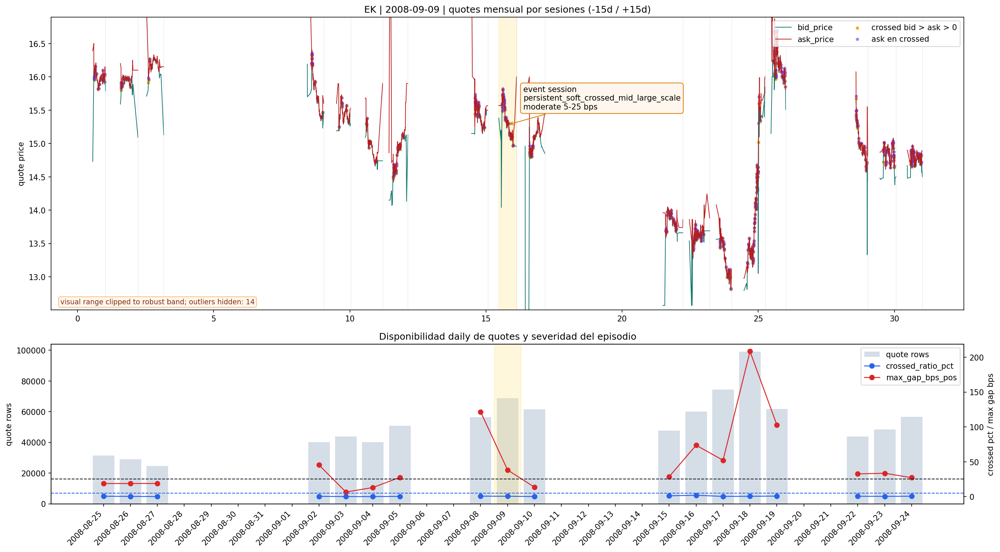

#### 01 Raw Window
Esta imagen responde a la primera pregunta decisiva del caso: el crossed observado es economicamente bastante fuerte para justificar un cambio de clase. Arriba ensena la geometria exacta del tramo conflictivo; abajo convierte esa geometria a bps y la enfrenta a los cortes `5 bps` y `25 bps`. El regimen dominante es `moderate 5-25 bps`. La decision que cambia es pasar de anomalia interpretable a `review` o `bad`. El error que evita es decidir por apariencia visual sin medir el dano economico real del crossed. En terminos de pipeline, este panel decide si el problema afecta solo a la lectura forense o si invalida simulacion de ejecucion y microstructure features.

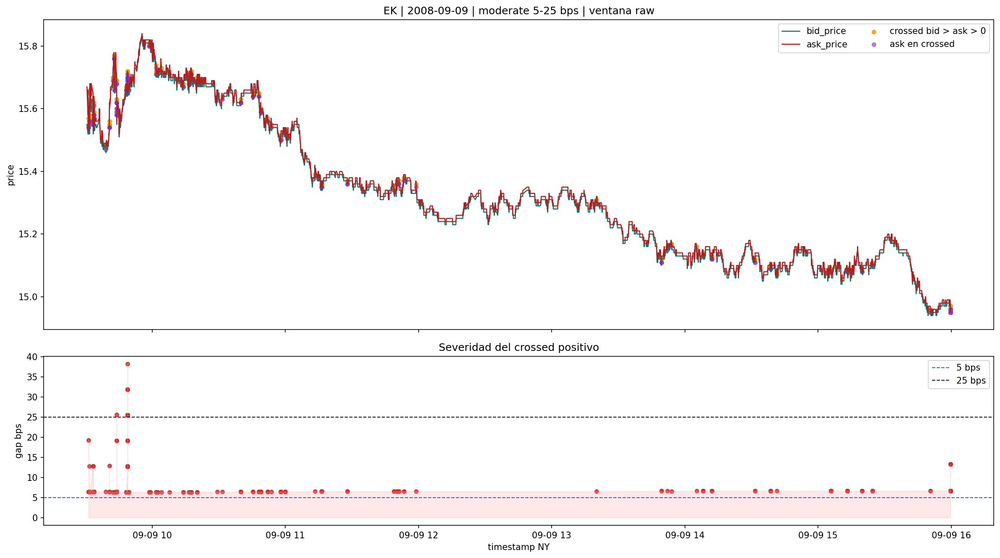

#### 02 Full Session Context
Esta imagen responde a la pregunta de extension intradiaria: el dano esta confinado a un bloque corto o contamina la sesion completa. Arriba se ve toda la sesion `04:00-20:00 NY`; abajo el `gap_bps` firmado. La decision que cambia es si el consumo debe penalizar solo un tramo o desechar el dia entero para uso operativo. El error que evita es tratar una cicatriz local como ruina total o, al reves, minimizar una degradacion distribuida a lo largo del dia. En ejecucion esto decide si la sesion puede seguir usandose con restricciones; en ML decide si las features intradiarias conservan significado economico.

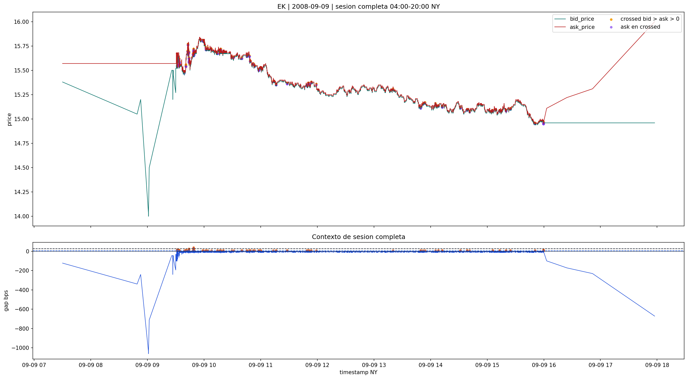

#### 03 Structure Diagnostics
Este panel responde a la pregunta de naturaleza del fallo: contradiccion economica genuina o mezcla con degeneracion estructural. Separa `ask=0` de `ask>0`, muestra la distribucion de `gap_bps` y resume patrones de integerizacion. La decision que cambia es como interpretar el dano: mercado localmente roto, artefacto de representacion o combinacion de ambos. El error que evita es sobrediagnosticar crossed reales cuando parte de la senal proviene de estructura degenerada del libro. Esta lectura afecta directamente a que el caso vaya a exclusion dura, a bandera contextual o a simple reconciliacion tecnica.

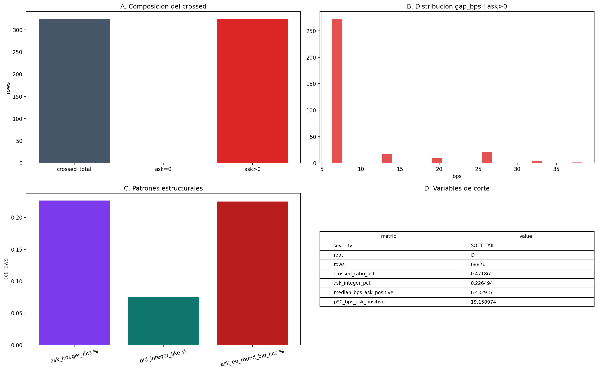

#### 04 Summary Card
Esta tarjeta responde a la pregunta de auditabilidad: cuales son exactamente las variables que sostienen la conclusion. Reune `severity`, `root`, `crossed_ratio_pct`, `ask_integer_pct`, `median_bps_ask_positive` y `p90_bps_ask_positive`. La decision que cambia es pasar de impresion visual a regla verificable. El error que evita es que dos inspectores lleguen a conclusiones distintas mirando la misma imagen sin una base numerica comun. Para gobernanza del proyecto, este panel es el que vuelve reproducible la decision para backtest, ML y auditoria.

---

### 45. PVA 2015-10-30

company_name: `PENN VIRGINIA CORP`
primary_exchange: `NYSE` (`XNYS`)
market_locale: `stocks/us`
scope: `review`
ticker: `PVA`
date: `2015-10-30`
taxonomy: `persistent_soft_crossed_mid_large_scale`
positive_cross_bucket: `positive_cross_moderate_5to25bps`
severity: `SOFT_FAIL`
root: `D`
rows: `14259`
crossed_ratio_pct: `0.554036`
crossed_rows_raw: `79`
crossed_rows_ask_zero: `0`
crossed_rows_ask_positive: `79`
ask_integer_pct: `0.000000`
median_bps_ask_positive: `6.251954`
p90_bps_ask_positive: `30.893695`
file: `D:\quotes\PVA\year=2015\month=10\day=30\quotes.parquet`

#### Analisis Forense
La conclusion correcta del caso es que ya existe contradiccion economica real dentro del libro, pero aun no con fuerza suficiente para justificar exclusion dura sin contexto adicional. La taxonomy historica es `persistent_soft_crossed_mid_large_scale` y el regimen positivo dominante es `moderate 5-25 bps`. Esto importa porque la taxonomy no solo clasifica: resume que tipo de anomalia se esta viendo y que clase de decision contractual puede defenderse despues. La taxonomy `persistent_soft_crossed_mid_large_scale` implica un problema repetido y distribuido, no un simple pinchazo local. Por eso empuja a `review`: ya hay dano real, aunque no necesariamente exclusion dura universal. El regimen `moderate 5-25 bps` ya entra en zona donde el crossed tiene capacidad real de contaminar simulacion de ejecucion y features microestructurales, aunque todavia puede requerir lectura contextual antes de exclusion dura. En terminos observables, el file tiene `crossed_ratio_pct=0.554036` con `crossed_rows_ask_positive=79` y `crossed_rows_ask_zero=0`. La severidad economica del crossed ask>0 se resume en `median_bps_ask_positive=6.251954` y `p90_bps_ask_positive=30.893695`. Estos dos numeros convierten una forma visual rara en una conclusion operativa sobre si el libro sigue representando o no un mercado negociable. La decision que cambia es pasar de libro sano a libro util solo bajo cautela. `review` significa: no usar como si fuera ejecucion limpia, conservar para analisis contextual y sensibilidad. El error que evita es tratar como normal un episodio que ya contiene contradiccion economica real y contaminar simulaciones de ejecucion o validaciones demasiado optimistas. El patron estructural muestra `ask_integer_pct=0.000000`. Este numero obliga a separar dos explicaciones rivales: contradiccion economica genuina del libro o mezcla con degeneracion estructural / integerizacion. Toda la composicion crossed cae en `ask>0`. Eso endurece la lectura economica del caso: el dano no depende de ceros mecanicos, sino de contradiccion positiva dentro de precios aparentemente vivos. Como `ask_integer_pct` es bajo, la hipotesis de simple degeneracion mecanica pierde fuerza. Eso endurece la interpretacion: el crossed se parece mas a contradiccion economica genuina y menos a artefacto. Existe ademas una imagen historica de certificacion asociada. Su papel es poner el episodio en un marco causal mas amplio: halt, explained, not strongly explained o patron conocido. La regla que protege al proyecto es esta: el contexto externo se usa para explicar por que aparece el episodio, no para absolverlo. El error que evita es degradar el criterio de calidad del libro porque exista una historia plausible alrededor del caso.

#### 00 Event Month Context
Esta imagen responde a la pregunta de persistencia temporal: estamos ante un accidente local o ante una fase mas amplia de inestabilidad. Arriba coloca el evento en la serie `daily` real del mes; abajo compara `crossed_ratio_pct` y `max_gap_bps_pos` del dia contra sus vecinos. La decision que cambia es el peso estructural que se le concede al caso. El error que evita es juzgar igual un shock aislado y una degradacion repetida del libro.

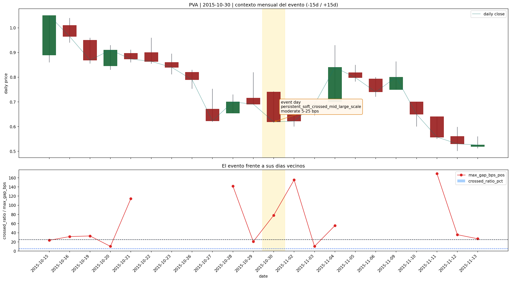

#### 00b Event Month Quotes Context
Esta imagen responde a la pregunta de recurrencia mensual dentro de `quotes`: el problema se concentra en el evento o reaparece en varias sesiones. Arriba concatena sesiones con datos disponibles; abajo resume cobertura diaria, `crossed_ratio_pct` y `max_gap_bps_pos`. La decision que cambia es si el caso debe leerse como episodio puntual o como sintoma de una fase repetida de libro degradado. El error que evita es extrapolar desde un unico dia a todo el mes sin evidencia.

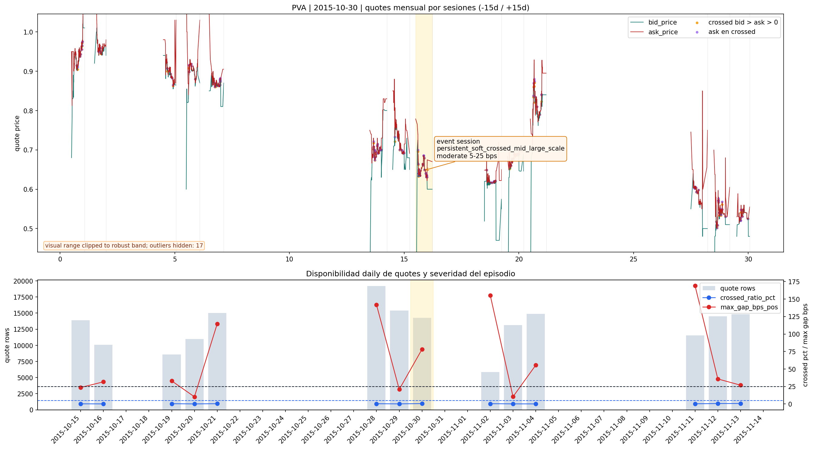

#### 01 Raw Window
Esta imagen responde a la primera pregunta decisiva del caso: el crossed observado es economicamente bastante fuerte para justificar un cambio de clase. Arriba ensena la geometria exacta del tramo conflictivo; abajo convierte esa geometria a bps y la enfrenta a los cortes `5 bps` y `25 bps`. El regimen dominante es `moderate 5-25 bps`. La decision que cambia es pasar de anomalia interpretable a `review` o `bad`. El error que evita es decidir por apariencia visual sin medir el dano economico real del crossed. En terminos de pipeline, este panel decide si el problema afecta solo a la lectura forense o si invalida simulacion de ejecucion y microstructure features.

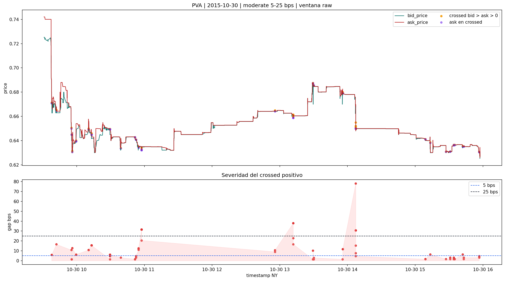

#### 02 Full Session Context
Esta imagen responde a la pregunta de extension intradiaria: el dano esta confinado a un bloque corto o contamina la sesion completa. Arriba se ve toda la sesion `04:00-20:00 NY`; abajo el `gap_bps` firmado. La decision que cambia es si el consumo debe penalizar solo un tramo o desechar el dia entero para uso operativo. El error que evita es tratar una cicatriz local como ruina total o, al reves, minimizar una degradacion distribuida a lo largo del dia. En ejecucion esto decide si la sesion puede seguir usandose con restricciones; en ML decide si las features intradiarias conservan significado economico.

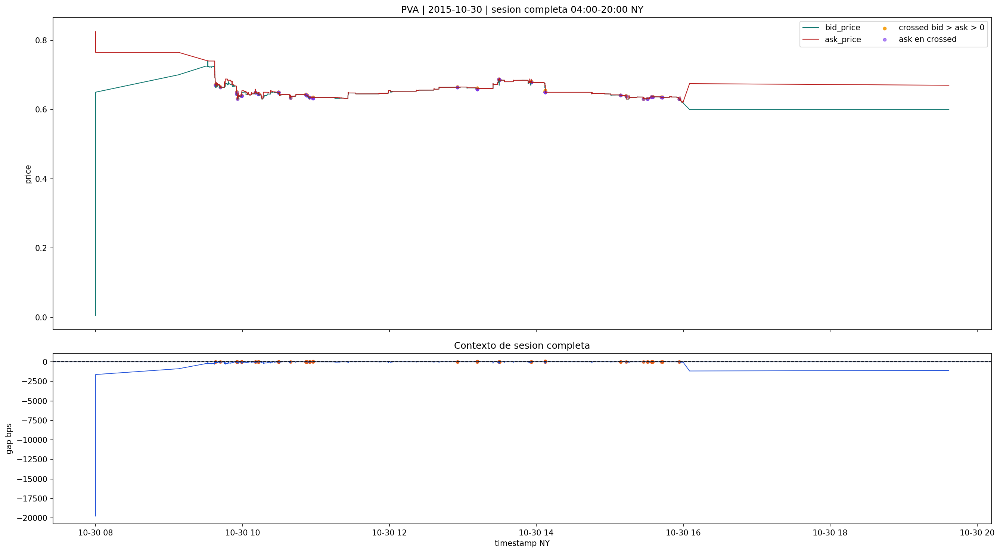

#### 03 Structure Diagnostics
Este panel responde a la pregunta de naturaleza del fallo: contradiccion economica genuina o mezcla con degeneracion estructural. Separa `ask=0` de `ask>0`, muestra la distribucion de `gap_bps` y resume patrones de integerizacion. La decision que cambia es como interpretar el dano: mercado localmente roto, artefacto de representacion o combinacion de ambos. El error que evita es sobrediagnosticar crossed reales cuando parte de la senal proviene de estructura degenerada del libro. Esta lectura afecta directamente a que el caso vaya a exclusion dura, a bandera contextual o a simple reconciliacion tecnica.

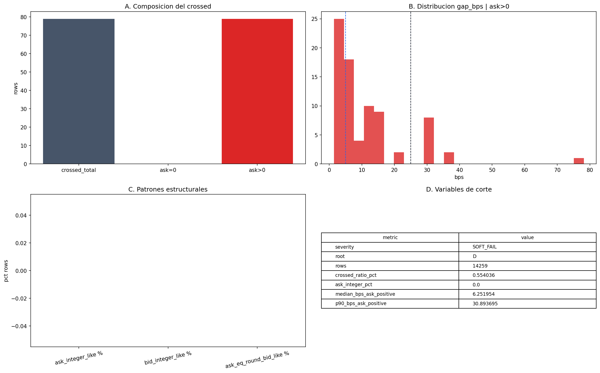

#### 04 Summary Card
Esta tarjeta responde a la pregunta de auditabilidad: cuales son exactamente las variables que sostienen la conclusion. Reune `severity`, `root`, `crossed_ratio_pct`, `ask_integer_pct`, `median_bps_ask_positive` y `p90_bps_ask_positive`. La decision que cambia es pasar de impresion visual a regla verificable. El error que evita es que dos inspectores lleguen a conclusiones distintas mirando la misma imagen sin una base numerica comun. Para gobernanza del proyecto, este panel es el que vuelve reproducible la decision para backtest, ML y auditoria.

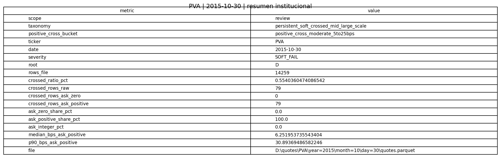

---

### 46. SOL 2008-07-17

company_name: `RENESOLA LTD SPONSORED ADS (VG )`
primary_exchange: `NYSE` (`XNYS`)
market_locale: `stocks/us`
scope: `review`
ticker: `SOL`
date: `2008-07-17`
taxonomy: `persistent_soft_crossed_mid_large_scale`
positive_cross_bucket: `positive_cross_moderate_5to25bps`
severity: `SOFT_FAIL`
root: `C`
rows: `57228`
crossed_ratio_pct: `0.440344`
crossed_rows_raw: `252`
crossed_rows_ask_zero: `0`
crossed_rows_ask_positive: `252`
ask_integer_pct: `0.113581`
median_bps_ask_positive: `6.228589`
p90_bps_ask_positive: `17.728428`
file: `C:\TSIS_Data\data\quotes\SOL\year=2008\month=07\day=17\quotes.parquet`

#### Analisis Forense
La conclusion correcta del caso es que ya existe contradiccion economica real dentro del libro, pero aun no con fuerza suficiente para justificar exclusion dura sin contexto adicional. La taxonomy historica es `persistent_soft_crossed_mid_large_scale` y el regimen positivo dominante es `moderate 5-25 bps`. Esto importa porque la taxonomy no solo clasifica: resume que tipo de anomalia se esta viendo y que clase de decision contractual puede defenderse despues. La taxonomy `persistent_soft_crossed_mid_large_scale` implica un problema repetido y distribuido, no un simple pinchazo local. Por eso empuja a `review`: ya hay dano real, aunque no necesariamente exclusion dura universal. El regimen `moderate 5-25 bps` ya entra en zona donde el crossed tiene capacidad real de contaminar simulacion de ejecucion y features microestructurales, aunque todavia puede requerir lectura contextual antes de exclusion dura. En terminos observables, el file tiene `crossed_ratio_pct=0.440344` con `crossed_rows_ask_positive=252` y `crossed_rows_ask_zero=0`. La severidad economica del crossed ask>0 se resume en `median_bps_ask_positive=6.228589` y `p90_bps_ask_positive=17.728428`. Estos dos numeros convierten una forma visual rara en una conclusion operativa sobre si el libro sigue representando o no un mercado negociable. La decision que cambia es pasar de libro sano a libro util solo bajo cautela. `review` significa: no usar como si fuera ejecucion limpia, conservar para analisis contextual y sensibilidad. El error que evita es tratar como normal un episodio que ya contiene contradiccion economica real y contaminar simulaciones de ejecucion o validaciones demasiado optimistas. El patron estructural muestra `ask_integer_pct=0.113581`. Este numero obliga a separar dos explicaciones rivales: contradiccion economica genuina del libro o mezcla con degeneracion estructural / integerizacion. Toda la composicion crossed cae en `ask>0`. Eso endurece la lectura economica del caso: el dano no depende de ceros mecanicos, sino de contradiccion positiva dentro de precios aparentemente vivos. Como `ask_integer_pct` es bajo, la hipotesis de simple degeneracion mecanica pierde fuerza. Eso endurece la interpretacion: el crossed se parece mas a contradiccion economica genuina y menos a artefacto. En la capa de semantica de precio del evento aparecen `daily raw close=79.4500`, `quote mid raw=16.3150`, `quote mid split_normalized=81.5750`, `daily adjusted_proxy=79.4500`. La reconciliacion incluye `future_split_factor=0.2000`. La implicacion metodologica es crucial: una discrepancia entre `quotes`, `daily` y una plataforma externa no puede leerse automaticamente como fallo del dataset. Puede ser semantica de precio distinta. El error que evita esta capa es mezclar raw, split-normalized y adjusted dentro del mismo pipeline, rompiendo auditoria, benchmarking y labels. Para pipelines, esto bloquea su uso como libro sano en ejecucion y features microestructurales principales, aunque aun puede mantenerse para forense, sensibilidad y estudios donde la anomalia sea parte del objeto de investigacion. Existe ademas una imagen historica de certificacion asociada. Su papel es poner el episodio en un marco causal mas amplio: halt, explained, not strongly explained o patron conocido. La regla que protege al proyecto es esta: el contexto externo se usa para explicar por que aparece el episodio, no para absolverlo. El error que evita es degradar el criterio de calidad del libro porque exista una historia plausible alrededor del caso.

#### 00 Event Month Context
Esta imagen responde a la pregunta de persistencia temporal: estamos ante un accidente local o ante una fase mas amplia de inestabilidad. Arriba coloca el evento en la serie `daily` real del mes; abajo compara `crossed_ratio_pct` y `max_gap_bps_pos` del dia contra sus vecinos. La decision que cambia es el peso estructural que se le concede al caso. El error que evita es juzgar igual un shock aislado y una degradacion repetida del libro.

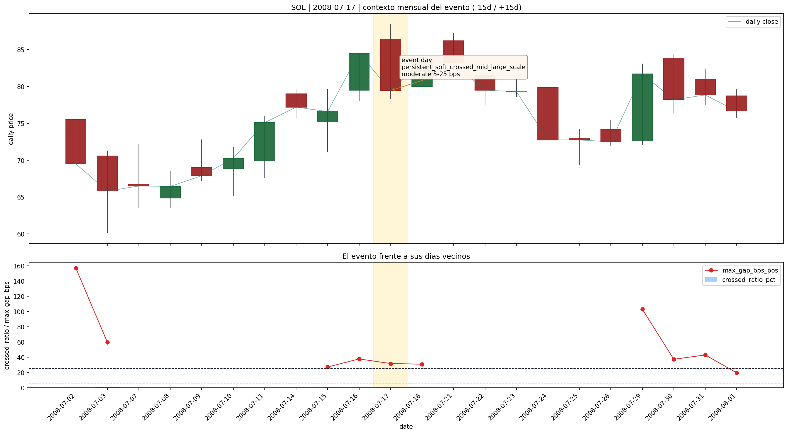

#### 00a Adjusted Proxy Contrast
Esta imagen responde a la pregunta de reconciliacion semantica: la discrepancia de precios viene de datos rotos o de vistas de precio distintas. Compara `daily raw`, `daily adjusted_proxy`, `quote mid raw` y `quote mid split_normalized`, y debajo ensena la cadena de dividendos y splits que produce la diferencia. La decision que cambia es si el inspector debe abrir una incidencia de calidad o cerrar el caso como diferencia legitima de semantica. El error que evita es mezclar series raw y adjusted como si fueran equivalentes. En pipelines reales, esto protege benchmarking, labels diarios y reconciliacion externa frente a falsas alarmas de precio.

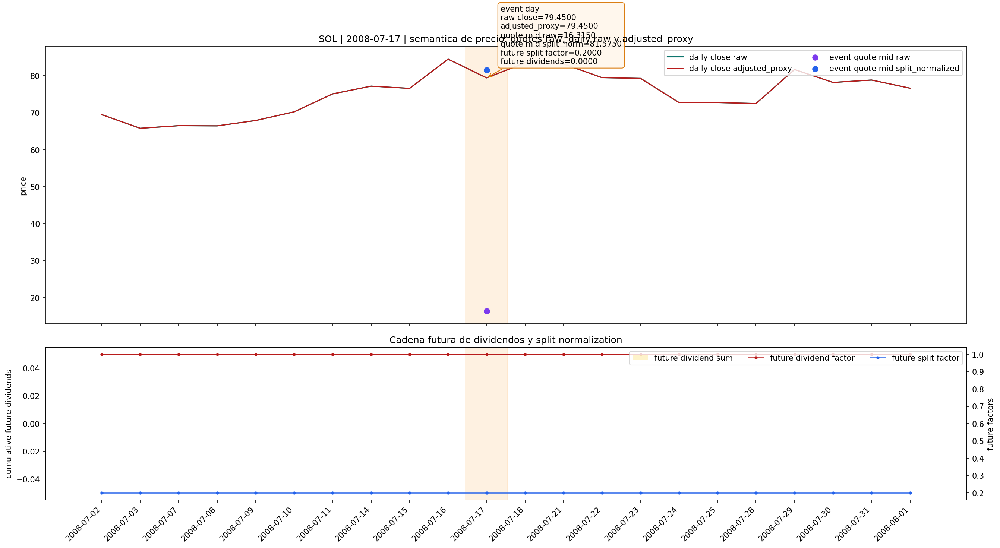

#### 00b Event Month Quotes Context
Esta imagen responde a la pregunta de recurrencia mensual dentro de `quotes`: el problema se concentra en el evento o reaparece en varias sesiones. Arriba concatena sesiones con datos disponibles; abajo resume cobertura diaria, `crossed_ratio_pct` y `max_gap_bps_pos`. La decision que cambia es si el caso debe leerse como episodio puntual o como sintoma de una fase repetida de libro degradado. El error que evita es extrapolar desde un unico dia a todo el mes sin evidencia.

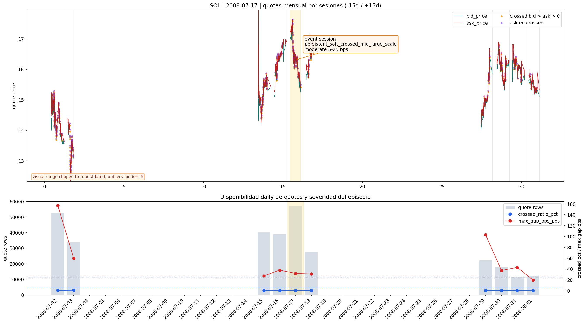

#### 01 Raw Window
Esta imagen responde a la primera pregunta decisiva del caso: el crossed observado es economicamente bastante fuerte para justificar un cambio de clase. Arriba ensena la geometria exacta del tramo conflictivo; abajo convierte esa geometria a bps y la enfrenta a los cortes `5 bps` y `25 bps`. El regimen dominante es `moderate 5-25 bps`. La decision que cambia es pasar de anomalia interpretable a `review` o `bad`. El error que evita es decidir por apariencia visual sin medir el dano economico real del crossed. En terminos de pipeline, este panel decide si el problema afecta solo a la lectura forense o si invalida simulacion de ejecucion y microstructure features.

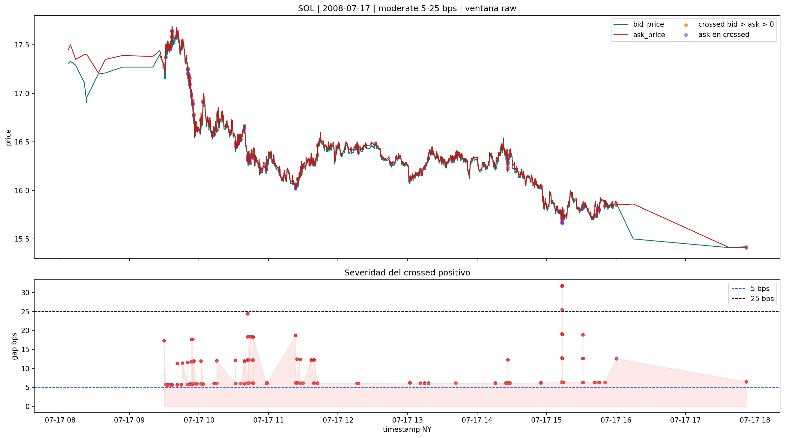

#### 02 Full Session Context
Esta imagen responde a la pregunta de extension intradiaria: el dano esta confinado a un bloque corto o contamina la sesion completa. Arriba se ve toda la sesion `04:00-20:00 NY`; abajo el `gap_bps` firmado. La decision que cambia es si el consumo debe penalizar solo un tramo o desechar el dia entero para uso operativo. El error que evita es tratar una cicatriz local como ruina total o, al reves, minimizar una degradacion distribuida a lo largo del dia. En ejecucion esto decide si la sesion puede seguir usandose con restricciones; en ML decide si las features intradiarias conservan significado economico.

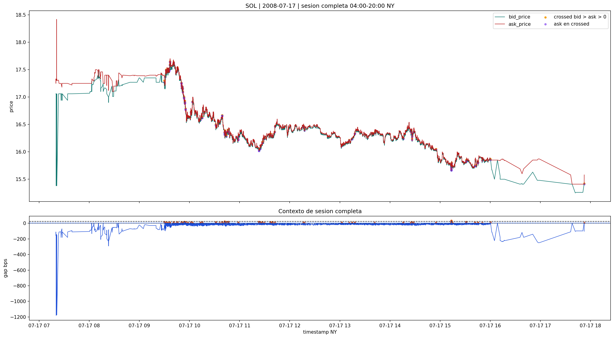

#### 03 Structure Diagnostics
Este panel responde a la pregunta de naturaleza del fallo: contradiccion economica genuina o mezcla con degeneracion estructural. Separa `ask=0` de `ask>0`, muestra la distribucion de `gap_bps` y resume patrones de integerizacion. La decision que cambia es como interpretar el dano: mercado localmente roto, artefacto de representacion o combinacion de ambos. El error que evita es sobrediagnosticar crossed reales cuando parte de la senal proviene de estructura degenerada del libro. Esta lectura afecta directamente a que el caso vaya a exclusion dura, a bandera contextual o a simple reconciliacion tecnica.

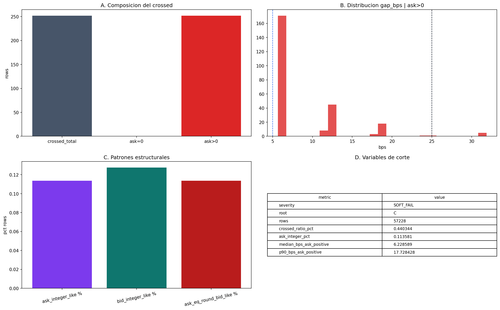

#### 04 Summary Card
Esta tarjeta responde a la pregunta de auditabilidad: cuales son exactamente las variables que sostienen la conclusion. Reune `severity`, `root`, `crossed_ratio_pct`, `ask_integer_pct`, `median_bps_ask_positive` y `p90_bps_ask_positive`. La decision que cambia es pasar de impresion visual a regla verificable. El error que evita es que dos inspectores lleguen a conclusiones distintas mirando la misma imagen sin una base numerica comun. Para gobernanza del proyecto, este panel es el que vuelve reproducible la decision para backtest, ML y auditoria.

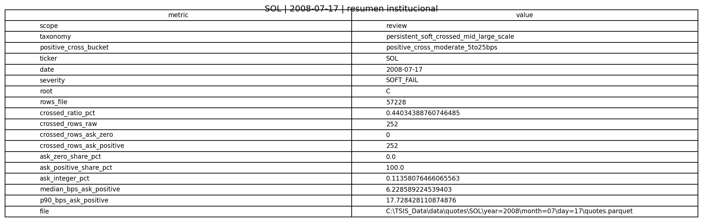

---

### 47. YHOO 2009-06-04

company_name: `Yahoo Inc`
primary_exchange: `NASDAQ` (`XNAS`)
market_locale: `stocks/us`
scope: `review`
ticker: `YHOO`
date: `2009-06-04`
taxonomy: `persistent_soft_crossed_mid_large_scale`
positive_cross_bucket: `positive_cross_moderate_5to25bps`
severity: `SOFT_FAIL`
root: `C`
rows: `186039`
crossed_ratio_pct: `0.339714`
crossed_rows_raw: `632`
crossed_rows_ask_zero: `0`
crossed_rows_ask_positive: `632`
ask_integer_pct: `0.000000`
median_bps_ask_positive: `6.155740`
p90_bps_ask_positive: `6.201550`
file: `C:\TSIS_Data\data\quotes\YHOO\year=2009\month=06\day=04\quotes.parquet`

#### Analisis Forense
La conclusion correcta del caso es que ya existe contradiccion economica real dentro del libro, pero aun no con fuerza suficiente para justificar exclusion dura sin contexto adicional. La taxonomy historica es `persistent_soft_crossed_mid_large_scale` y el regimen positivo dominante es `moderate 5-25 bps`. Esto importa porque la taxonomy no solo clasifica: resume que tipo de anomalia se esta viendo y que clase de decision contractual puede defenderse despues. La taxonomy `persistent_soft_crossed_mid_large_scale` implica un problema repetido y distribuido, no un simple pinchazo local. Por eso empuja a `review`: ya hay dano real, aunque no necesariamente exclusion dura universal. El regimen `moderate 5-25 bps` ya entra en zona donde el crossed tiene capacidad real de contaminar simulacion de ejecucion y features microestructurales, aunque todavia puede requerir lectura contextual antes de exclusion dura. En terminos observables, el file tiene `crossed_ratio_pct=0.339714` con `crossed_rows_ask_positive=632` y `crossed_rows_ask_zero=0`. La severidad economica del crossed ask>0 se resume en `median_bps_ask_positive=6.155740` y `p90_bps_ask_positive=6.201550`. Estos dos numeros convierten una forma visual rara en una conclusion operativa sobre si el libro sigue representando o no un mercado negociable. La decision que cambia es pasar de libro sano a libro util solo bajo cautela. `review` significa: no usar como si fuera ejecucion limpia, conservar para analisis contextual y sensibilidad. El error que evita es tratar como normal un episodio que ya contiene contradiccion economica real y contaminar simulaciones de ejecucion o validaciones demasiado optimistas. El patron estructural muestra `ask_integer_pct=0.000000`. Este numero obliga a separar dos explicaciones rivales: contradiccion economica genuina del libro o mezcla con degeneracion estructural / integerizacion. Toda la composicion crossed cae en `ask>0`. Eso endurece la lectura economica del caso: el dano no depende de ceros mecanicos, sino de contradiccion positiva dentro de precios aparentemente vivos. Como `ask_integer_pct` es bajo, la hipotesis de simple degeneracion mecanica pierde fuerza. Eso endurece la interpretacion: el crossed se parece mas a contradiccion economica genuina y menos a artefacto. Existe ademas una imagen historica de certificacion asociada. Su papel es poner el episodio en un marco causal mas amplio: halt, explained, not strongly explained o patron conocido. La regla que protege al proyecto es esta: el contexto externo se usa para explicar por que aparece el episodio, no para absolverlo. El error que evita es degradar el criterio de calidad del libro porque exista una historia plausible alrededor del caso.

#### 00 Event Month Context
Esta imagen responde a la pregunta de persistencia temporal: estamos ante un accidente local o ante una fase mas amplia de inestabilidad. Arriba coloca el evento en la serie `daily` real del mes; abajo compara `crossed_ratio_pct` y `max_gap_bps_pos` del dia contra sus vecinos. La decision que cambia es el peso estructural que se le concede al caso. El error que evita es juzgar igual un shock aislado y una degradacion repetida del libro.

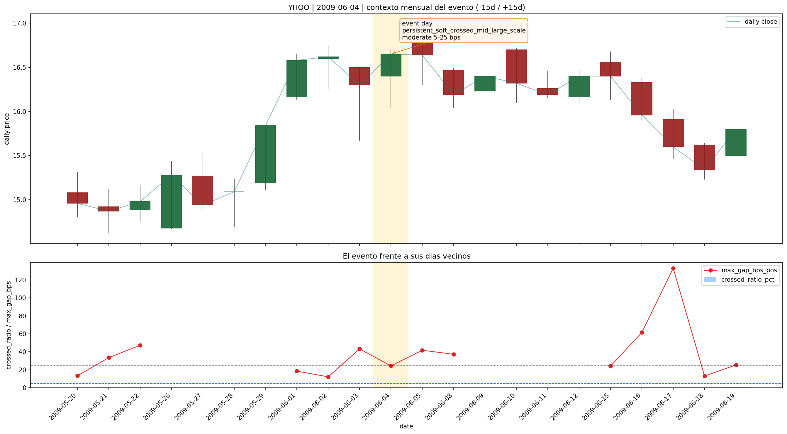

#### 00b Event Month Quotes Context
Esta imagen responde a la pregunta de recurrencia mensual dentro de `quotes`: el problema se concentra en el evento o reaparece en varias sesiones. Arriba concatena sesiones con datos disponibles; abajo resume cobertura diaria, `crossed_ratio_pct` y `max_gap_bps_pos`. La decision que cambia es si el caso debe leerse como episodio puntual o como sintoma de una fase repetida de libro degradado. El error que evita es extrapolar desde un unico dia a todo el mes sin evidencia.

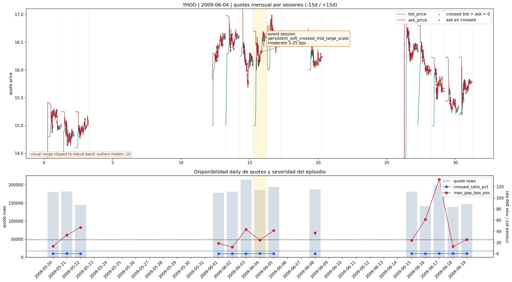

#### 01 Raw Window
Esta imagen responde a la primera pregunta decisiva del caso: el crossed observado es economicamente bastante fuerte para justificar un cambio de clase. Arriba ensena la geometria exacta del tramo conflictivo; abajo convierte esa geometria a bps y la enfrenta a los cortes `5 bps` y `25 bps`. El regimen dominante es `moderate 5-25 bps`. La decision que cambia es pasar de anomalia interpretable a `review` o `bad`. El error que evita es decidir por apariencia visual sin medir el dano economico real del crossed. En terminos de pipeline, este panel decide si el problema afecta solo a la lectura forense o si invalida simulacion de ejecucion y microstructure features.

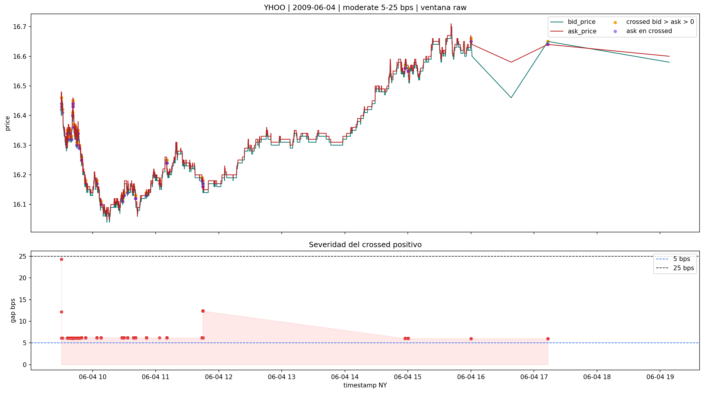

#### 02 Full Session Context
Esta imagen responde a la pregunta de extension intradiaria: el dano esta confinado a un bloque corto o contamina la sesion completa. Arriba se ve toda la sesion `04:00-20:00 NY`; abajo el `gap_bps` firmado. La decision que cambia es si el consumo debe penalizar solo un tramo o desechar el dia entero para uso operativo. El error que evita es tratar una cicatriz local como ruina total o, al reves, minimizar una degradacion distribuida a lo largo del dia. En ejecucion esto decide si la sesion puede seguir usandose con restricciones; en ML decide si las features intradiarias conservan significado economico.

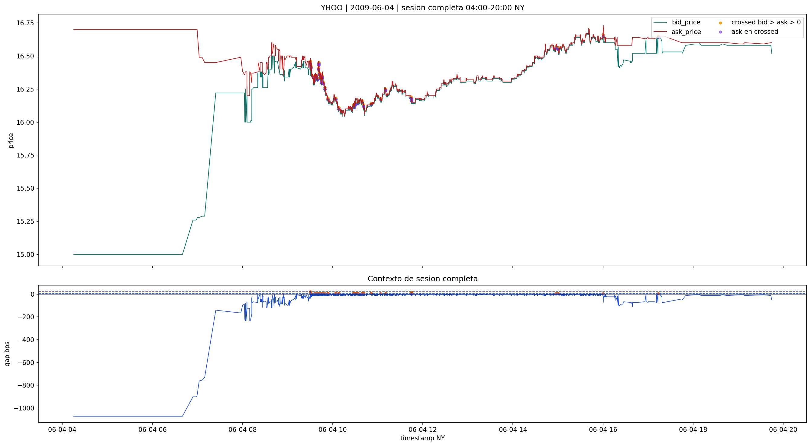

#### 03 Structure Diagnostics
Este panel responde a la pregunta de naturaleza del fallo: contradiccion economica genuina o mezcla con degeneracion estructural. Separa `ask=0` de `ask>0`, muestra la distribucion de `gap_bps` y resume patrones de integerizacion. La decision que cambia es como interpretar el dano: mercado localmente roto, artefacto de representacion o combinacion de ambos. El error que evita es sobrediagnosticar crossed reales cuando parte de la senal proviene de estructura degenerada del libro. Esta lectura afecta directamente a que el caso vaya a exclusion dura, a bandera contextual o a simple reconciliacion tecnica.

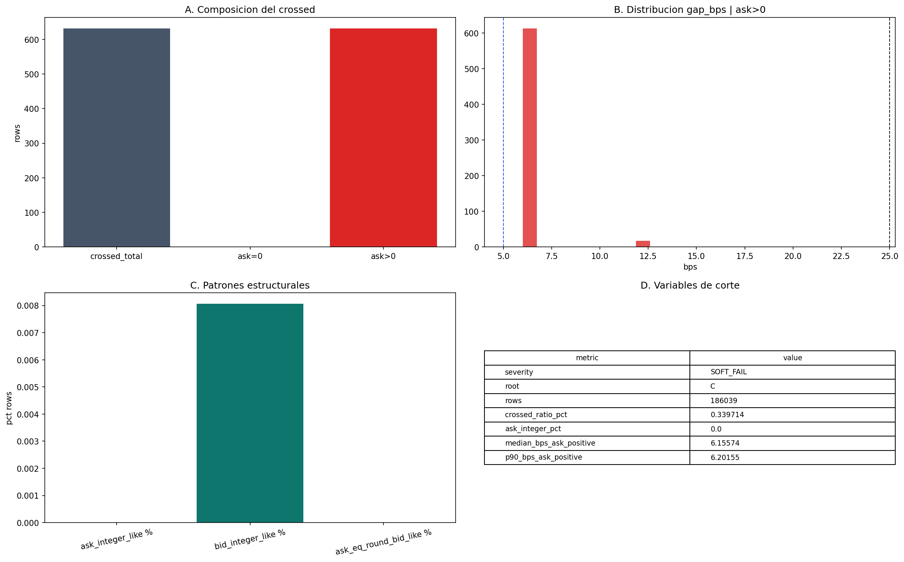

#### 04 Summary Card
Esta tarjeta responde a la pregunta de auditabilidad: cuales son exactamente las variables que sostienen la conclusion. Reune `severity`, `root`, `crossed_ratio_pct`, `ask_integer_pct`, `median_bps_ask_positive` y `p90_bps_ask_positive`. La decision que cambia es pasar de impresion visual a regla verificable. El error que evita es que dos inspectores lleguen a conclusiones distintas mirando la misma imagen sin una base numerica comun. Para gobernanza del proyecto, este panel es el que vuelve reproducible la decision para backtest, ML y auditoria.

---

### 48. WOOF 2012-08-23

company_name: `Petco Health and Wellness Company, Inc. Class A Common Stock`
primary_exchange: `NASDAQ` (`XNAS`)
market_locale: `stocks/us`
scope: `review`
ticker: `WOOF`
date: `2012-08-23`
taxonomy: `persistent_soft_crossed_mid_large_scale`
positive_cross_bucket: `positive_cross_moderate_5to25bps`
severity: `SOFT_FAIL`
root: `C`
rows: `13921`
crossed_ratio_pct: `0.502837`
crossed_rows_raw: `70`
crossed_rows_ask_zero: `0`
crossed_rows_ask_positive: `70`
ask_integer_pct: `0.021550`
median_bps_ask_positive: `5.334756`
p90_bps_ask_positive: `15.928640`
file: `C:\TSIS_Data\data\quotes\WOOF\year=2012\month=08\day=23\quotes.parquet`

#### Analisis Forense
La conclusion correcta del caso es que ya existe contradiccion economica real dentro del libro, pero aun no con fuerza suficiente para justificar exclusion dura sin contexto adicional. La taxonomy historica es `persistent_soft_crossed_mid_large_scale` y el regimen positivo dominante es `moderate 5-25 bps`. Esto importa porque la taxonomy no solo clasifica: resume que tipo de anomalia se esta viendo y que clase de decision contractual puede defenderse despues. La taxonomy `persistent_soft_crossed_mid_large_scale` implica un problema repetido y distribuido, no un simple pinchazo local. Por eso empuja a `review`: ya hay dano real, aunque no necesariamente exclusion dura universal. El regimen `moderate 5-25 bps` ya entra en zona donde el crossed tiene capacidad real de contaminar simulacion de ejecucion y features microestructurales, aunque todavia puede requerir lectura contextual antes de exclusion dura. En terminos observables, el file tiene `crossed_ratio_pct=0.502837` con `crossed_rows_ask_positive=70` y `crossed_rows_ask_zero=0`. La severidad economica del crossed ask>0 se resume en `median_bps_ask_positive=5.334756` y `p90_bps_ask_positive=15.928640`. Estos dos numeros convierten una forma visual rara en una conclusion operativa sobre si el libro sigue representando o no un mercado negociable. La decision que cambia es pasar de libro sano a libro util solo bajo cautela. `review` significa: no usar como si fuera ejecucion limpia, conservar para analisis contextual y sensibilidad. El error que evita es tratar como normal un episodio que ya contiene contradiccion economica real y contaminar simulaciones de ejecucion o validaciones demasiado optimistas. El patron estructural muestra `ask_integer_pct=0.021550`. Este numero obliga a separar dos explicaciones rivales: contradiccion economica genuina del libro o mezcla con degeneracion estructural / integerizacion. Toda la composicion crossed cae en `ask>0`. Eso endurece la lectura economica del caso: el dano no depende de ceros mecanicos, sino de contradiccion positiva dentro de precios aparentemente vivos. Como `ask_integer_pct` es bajo, la hipotesis de simple degeneracion mecanica pierde fuerza. Eso endurece la interpretacion: el crossed se parece mas a contradiccion economica genuina y menos a artefacto. Existe ademas una imagen historica de certificacion asociada. Su papel es poner el episodio en un marco causal mas amplio: halt, explained, not strongly explained o patron conocido. La regla que protege al proyecto es esta: el contexto externo se usa para explicar por que aparece el episodio, no para absolverlo. El error que evita es degradar el criterio de calidad del libro porque exista una historia plausible alrededor del caso.

#### 00 Event Month Context
Esta imagen responde a la pregunta de persistencia temporal: estamos ante un accidente local o ante una fase mas amplia de inestabilidad. Arriba coloca el evento en la serie `daily` real del mes; abajo compara `crossed_ratio_pct` y `max_gap_bps_pos` del dia contra sus vecinos. La decision que cambia es el peso estructural que se le concede al caso. El error que evita es juzgar igual un shock aislado y una degradacion repetida del libro.

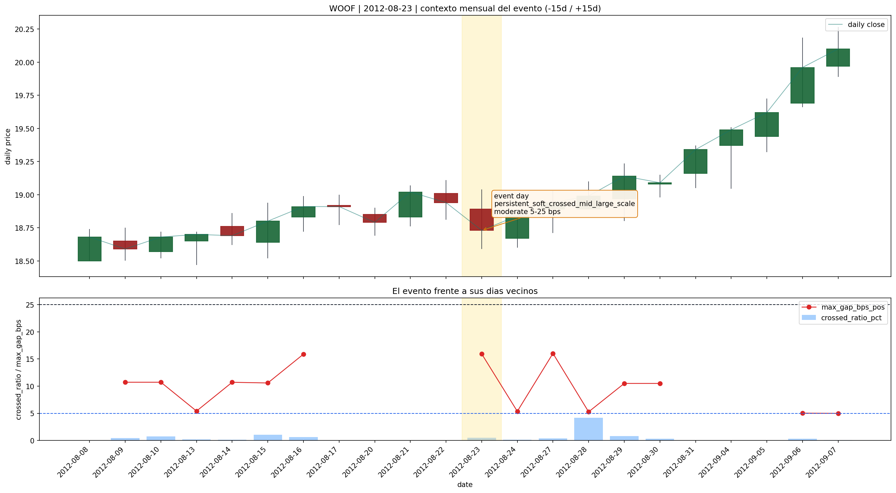

#### 00b Event Month Quotes Context
Esta imagen responde a la pregunta de recurrencia mensual dentro de `quotes`: el problema se concentra en el evento o reaparece en varias sesiones. Arriba concatena sesiones con datos disponibles; abajo resume cobertura diaria, `crossed_ratio_pct` y `max_gap_bps_pos`. La decision que cambia es si el caso debe leerse como episodio puntual o como sintoma de una fase repetida de libro degradado. El error que evita es extrapolar desde un unico dia a todo el mes sin evidencia.

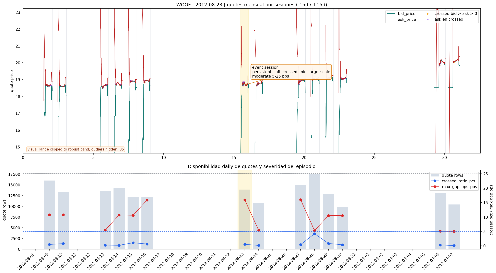

#### 01 Raw Window
Esta imagen responde a la primera pregunta decisiva del caso: el crossed observado es economicamente bastante fuerte para justificar un cambio de clase. Arriba ensena la geometria exacta del tramo conflictivo; abajo convierte esa geometria a bps y la enfrenta a los cortes `5 bps` y `25 bps`. El regimen dominante es `moderate 5-25 bps`. La decision que cambia es pasar de anomalia interpretable a `review` o `bad`. El error que evita es decidir por apariencia visual sin medir el dano economico real del crossed. En terminos de pipeline, este panel decide si el problema afecta solo a la lectura forense o si invalida simulacion de ejecucion y microstructure features.

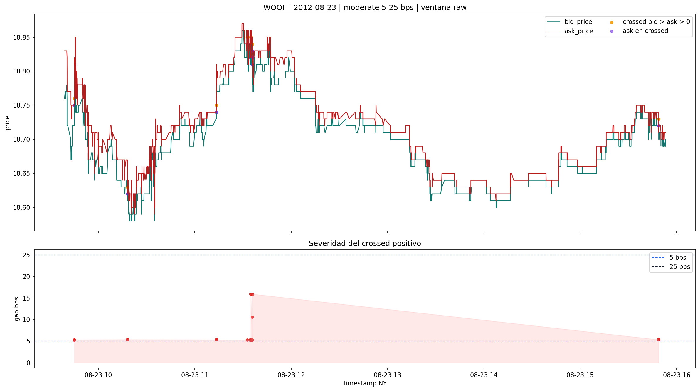

#### 02 Full Session Context
Esta imagen responde a la pregunta de extension intradiaria: el dano esta confinado a un bloque corto o contamina la sesion completa. Arriba se ve toda la sesion `04:00-20:00 NY`; abajo el `gap_bps` firmado. La decision que cambia es si el consumo debe penalizar solo un tramo o desechar el dia entero para uso operativo. El error que evita es tratar una cicatriz local como ruina total o, al reves, minimizar una degradacion distribuida a lo largo del dia. En ejecucion esto decide si la sesion puede seguir usandose con restricciones; en ML decide si las features intradiarias conservan significado economico.

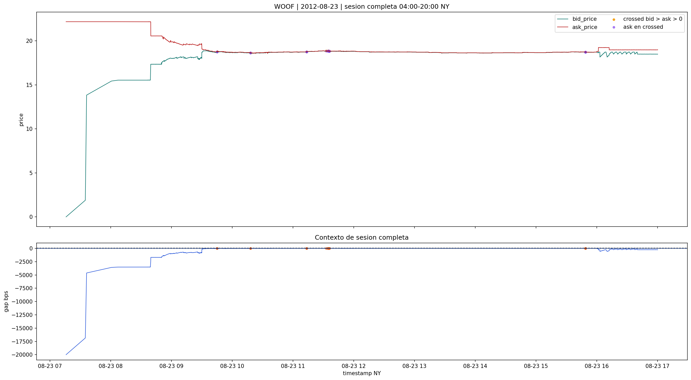

#### 03 Structure Diagnostics
Este panel responde a la pregunta de naturaleza del fallo: contradiccion economica genuina o mezcla con degeneracion estructural. Separa `ask=0` de `ask>0`, muestra la distribucion de `gap_bps` y resume patrones de integerizacion. La decision que cambia es como interpretar el dano: mercado localmente roto, artefacto de representacion o combinacion de ambos. El error que evita es sobrediagnosticar crossed reales cuando parte de la senal proviene de estructura degenerada del libro. Esta lectura afecta directamente a que el caso vaya a exclusion dura, a bandera contextual o a simple reconciliacion tecnica.

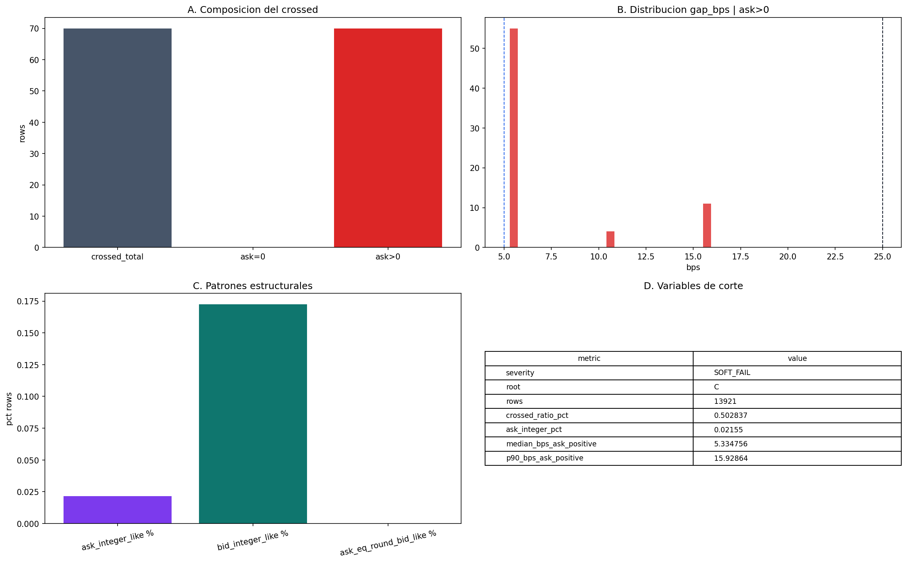

#### 04 Summary Card
Esta tarjeta responde a la pregunta de auditabilidad: cuales son exactamente las variables que sostienen la conclusion. Reune `severity`, `root`, `crossed_ratio_pct`, `ask_integer_pct`, `median_bps_ask_positive` y `p90_bps_ask_positive`. La decision que cambia es pasar de impresion visual a regla verificable. El error que evita es que dos inspectores lleguen a conclusiones distintas mirando la misma imagen sin una base numerica comun. Para gobernanza del proyecto, este panel es el que vuelve reproducible la decision para backtest, ML y auditoria.

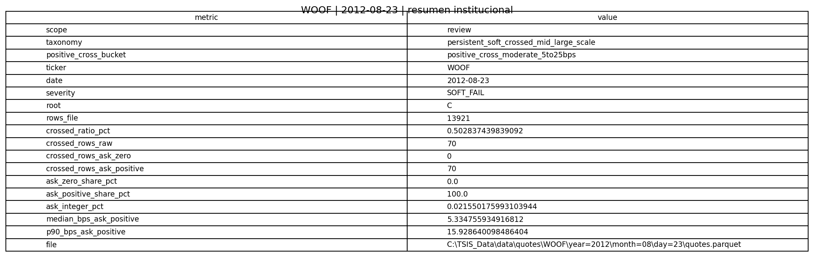

---

### 49. SSRI 2006-09-20

company_name: `Silver Standard Resources`
primary_exchange: `NASDAQ` (`XNAS`)
market_locale: `stocks/us`
scope: `review`
ticker: `SSRI`
date: `2006-09-20`
taxonomy: `persistent_soft_crossed_mid_large_scale`
positive_cross_bucket: `positive_cross_mild_lt5bps`
severity: `SOFT_FAIL`
root: `C`
rows: `11435`
crossed_ratio_pct: `0.682116`
crossed_rows_raw: `78`
crossed_rows_ask_zero: `0`
crossed_rows_ask_positive: `78`
ask_integer_pct: `0.577175`
median_bps_ask_positive: `4.767580`
p90_bps_ask_positive: `18.912530`
file: `C:\TSIS_Data\data\quotes\SSRI\year=2006\month=09\day=20\quotes.parquet`

#### Analisis Forense
La conclusion correcta del caso es que ya existe contradiccion economica real dentro del libro, pero aun no con fuerza suficiente para justificar exclusion dura sin contexto adicional. La taxonomy historica es `persistent_soft_crossed_mid_large_scale` y el regimen positivo dominante es `mild <5 bps`. Esto importa porque la taxonomy no solo clasifica: resume que tipo de anomalia se esta viendo y que clase de decision contractual puede defenderse despues. La taxonomy `persistent_soft_crossed_mid_large_scale` implica un problema repetido y distribuido, no un simple pinchazo local. Por eso empuja a `review`: ya hay dano real, aunque no necesariamente exclusion dura universal. El regimen `mild <5 bps` significa que existe contradiccion economica positiva, pero aun en una banda donde un uso prudente puede seguir siendo defendible si la persistencia y la estructura no agravan el caso. En terminos observables, el file tiene `crossed_ratio_pct=0.682116` con `crossed_rows_ask_positive=78` y `crossed_rows_ask_zero=0`. La severidad economica del crossed ask>0 se resume en `median_bps_ask_positive=4.767580` y `p90_bps_ask_positive=18.912530`. Estos dos numeros convierten una forma visual rara en una conclusion operativa sobre si el libro sigue representando o no un mercado negociable. La decision que cambia es pasar de libro sano a libro util solo bajo cautela. `review` significa: no usar como si fuera ejecucion limpia, conservar para analisis contextual y sensibilidad. El error que evita es tratar como normal un episodio que ya contiene contradiccion economica real y contaminar simulaciones de ejecucion o validaciones demasiado optimistas. El patron estructural muestra `ask_integer_pct=0.577175`. Este numero obliga a separar dos explicaciones rivales: contradiccion economica genuina del libro o mezcla con degeneracion estructural / integerizacion. Toda la composicion crossed cae en `ask>0`. Eso endurece la lectura economica del caso: el dano no depende de ceros mecanicos, sino de contradiccion positiva dentro de precios aparentemente vivos. Como `ask_integer_pct` es bajo, la hipotesis de simple degeneracion mecanica pierde fuerza. Eso endurece la interpretacion: el crossed se parece mas a contradiccion economica genuina y menos a artefacto. Existe ademas una imagen historica de certificacion asociada. Su papel es poner el episodio en un marco causal mas amplio: halt, explained, not strongly explained o patron conocido. La regla que protege al proyecto es esta: el contexto externo se usa para explicar por que aparece el episodio, no para absolverlo. El error que evita es degradar el criterio de calidad del libro porque exista una historia plausible alrededor del caso.

#### 00 Event Month Context
Esta imagen responde a la pregunta de persistencia temporal: estamos ante un accidente local o ante una fase mas amplia de inestabilidad. Arriba coloca el evento en la serie `daily` real del mes; abajo compara `crossed_ratio_pct` y `max_gap_bps_pos` del dia contra sus vecinos. La decision que cambia es el peso estructural que se le concede al caso. El error que evita es juzgar igual un shock aislado y una degradacion repetida del libro.

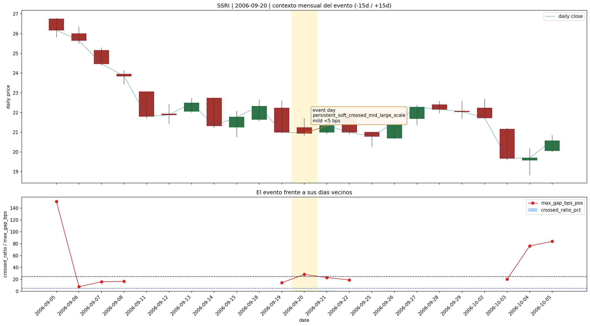

#### 00b Event Month Quotes Context
Esta imagen responde a la pregunta de recurrencia mensual dentro de `quotes`: el problema se concentra en el evento o reaparece en varias sesiones. Arriba concatena sesiones con datos disponibles; abajo resume cobertura diaria, `crossed_ratio_pct` y `max_gap_bps_pos`. La decision que cambia es si el caso debe leerse como episodio puntual o como sintoma de una fase repetida de libro degradado. El error que evita es extrapolar desde un unico dia a todo el mes sin evidencia.

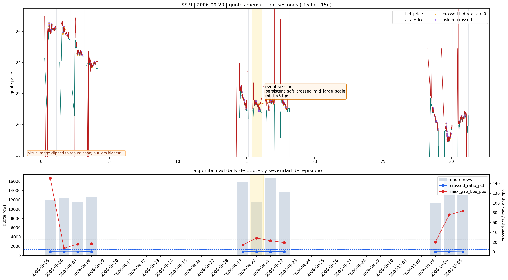

#### 01 Raw Window
Esta imagen responde a la primera pregunta decisiva del caso: el crossed observado es economicamente bastante fuerte para justificar un cambio de clase. Arriba ensena la geometria exacta del tramo conflictivo; abajo convierte esa geometria a bps y la enfrenta a los cortes `5 bps` y `25 bps`. El regimen dominante es `mild <5 bps`. La decision que cambia es pasar de anomalia interpretable a `review` o `bad`. El error que evita es decidir por apariencia visual sin medir el dano economico real del crossed. En terminos de pipeline, este panel decide si el problema afecta solo a la lectura forense o si invalida simulacion de ejecucion y microstructure features.

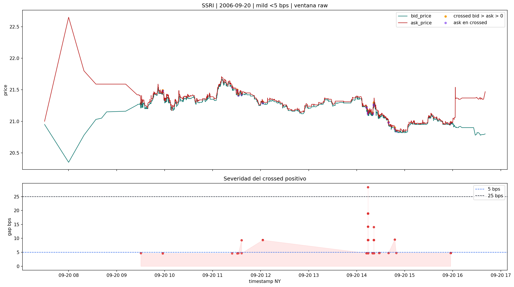

#### 02 Full Session Context
Esta imagen responde a la pregunta de extension intradiaria: el dano esta confinado a un bloque corto o contamina la sesion completa. Arriba se ve toda la sesion `04:00-20:00 NY`; abajo el `gap_bps` firmado. La decision que cambia es si el consumo debe penalizar solo un tramo o desechar el dia entero para uso operativo. El error que evita es tratar una cicatriz local como ruina total o, al reves, minimizar una degradacion distribuida a lo largo del dia. En ejecucion esto decide si la sesion puede seguir usandose con restricciones; en ML decide si las features intradiarias conservan significado economico.

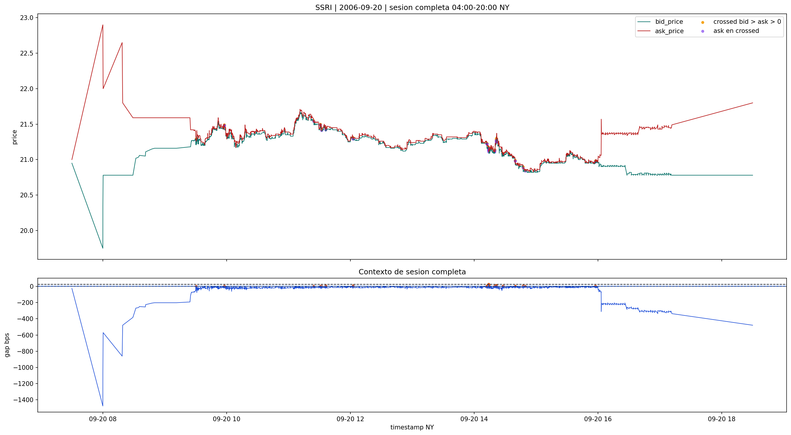

#### 03 Structure Diagnostics
Este panel responde a la pregunta de naturaleza del fallo: contradiccion economica genuina o mezcla con degeneracion estructural. Separa `ask=0` de `ask>0`, muestra la distribucion de `gap_bps` y resume patrones de integerizacion. La decision que cambia es como interpretar el dano: mercado localmente roto, artefacto de representacion o combinacion de ambos. El error que evita es sobrediagnosticar crossed reales cuando parte de la senal proviene de estructura degenerada del libro. Esta lectura afecta directamente a que el caso vaya a exclusion dura, a bandera contextual o a simple reconciliacion tecnica.

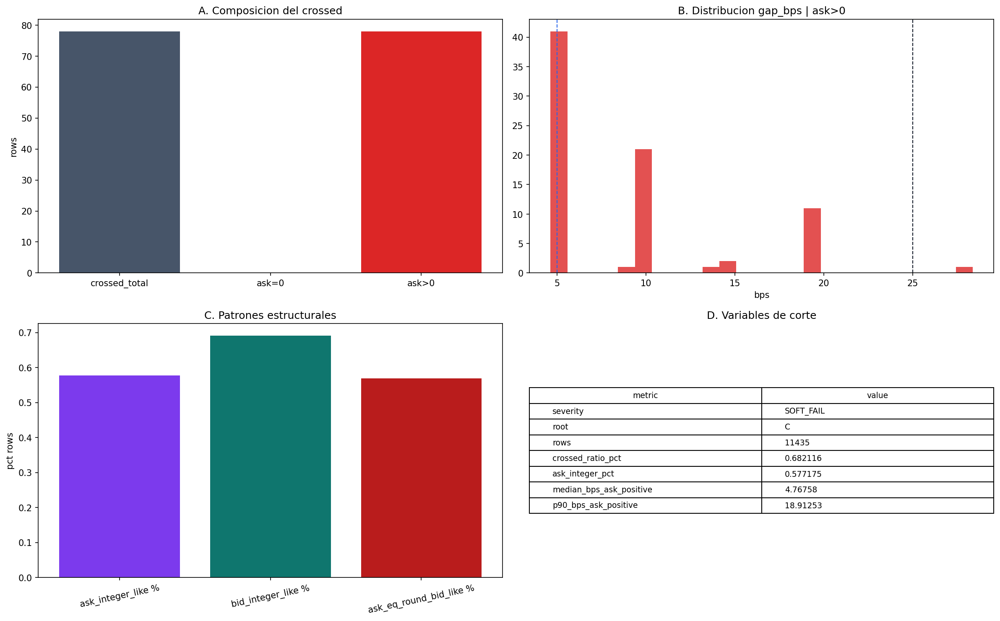

#### 04 Summary Card
Esta tarjeta responde a la pregunta de auditabilidad: cuales son exactamente las variables que sostienen la conclusion. Reune `severity`, `root`, `crossed_ratio_pct`, `ask_integer_pct`, `median_bps_ask_positive` y `p90_bps_ask_positive`. La decision que cambia es pasar de impresion visual a regla verificable. El error que evita es que dos inspectores lleguen a conclusiones distintas mirando la misma imagen sin una base numerica comun. Para gobernanza del proyecto, este panel es el que vuelve reproducible la decision para backtest, ML y auditoria.

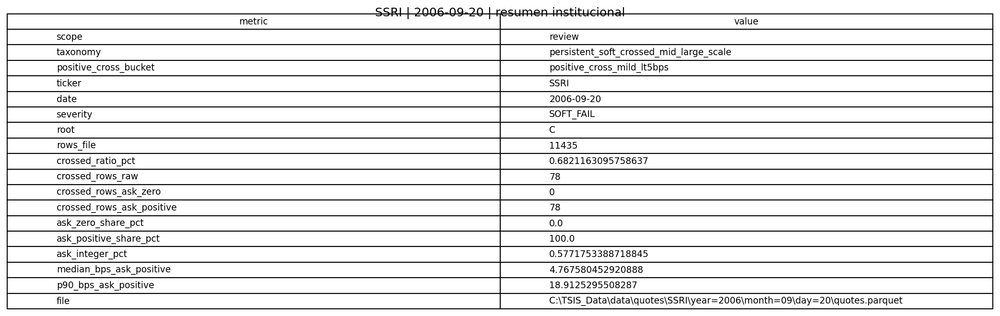

---

### 50. ATHR 2006-12-28

company_name: `Aether Holdings, Inc. Common Stock`
primary_exchange: `NASDAQ` (`XNAS`)
market_locale: `stocks/us`
scope: `review`
ticker: `ATHR`
date: `2006-12-28`
taxonomy: `persistent_soft_crossed_mid_large_scale`
positive_cross_bucket: `positive_cross_mild_lt5bps`
severity: `SOFT_FAIL`
root: `D`
rows: `10881`
crossed_ratio_pct: `0.551420`
crossed_rows_raw: `60`
crossed_rows_ask_zero: `1`
crossed_rows_ask_positive: `59`
ask_integer_pct: `0.018381`
median_bps_ask_positive: `4.693734`
p90_bps_ask_positive: `14.010181`
file: `D:\quotes\ATHR\year=2006\month=12\day=28\quotes.parquet`

#### Analisis Forense
La conclusion correcta del caso es que ya existe contradiccion economica real dentro del libro, pero aun no con fuerza suficiente para justificar exclusion dura sin contexto adicional. La taxonomy historica es `persistent_soft_crossed_mid_large_scale` y el regimen positivo dominante es `mild <5 bps`. Esto importa porque la taxonomy no solo clasifica: resume que tipo de anomalia se esta viendo y que clase de decision contractual puede defenderse despues. La taxonomy `persistent_soft_crossed_mid_large_scale` implica un problema repetido y distribuido, no un simple pinchazo local. Por eso empuja a `review`: ya hay dano real, aunque no necesariamente exclusion dura universal. El regimen `mild <5 bps` significa que existe contradiccion economica positiva, pero aun en una banda donde un uso prudente puede seguir siendo defendible si la persistencia y la estructura no agravan el caso. En terminos observables, el file tiene `crossed_ratio_pct=0.551420` con `crossed_rows_ask_positive=59` y `crossed_rows_ask_zero=1`. La severidad economica del crossed ask>0 se resume en `median_bps_ask_positive=4.693734` y `p90_bps_ask_positive=14.010181`. Estos dos numeros convierten una forma visual rara en una conclusion operativa sobre si el libro sigue representando o no un mercado negociable. La decision que cambia es pasar de libro sano a libro util solo bajo cautela. `review` significa: no usar como si fuera ejecucion limpia, conservar para analisis contextual y sensibilidad. El error que evita es tratar como normal un episodio que ya contiene contradiccion economica real y contaminar simulaciones de ejecucion o validaciones demasiado optimistas. El patron estructural muestra `ask_integer_pct=0.018381`. Este numero obliga a separar dos explicaciones rivales: contradiccion economica genuina del libro o mezcla con degeneracion estructural / integerizacion. La mayor parte del crossed vive en `ask>0`, de modo que el corazon del problema sigue siendo economico. La parte `ask=0`, si existe, acompana pero no explica por si sola la anomalia. Como `ask_integer_pct` es bajo, la hipotesis de simple degeneracion mecanica pierde fuerza. Eso endurece la interpretacion: el crossed se parece mas a contradiccion economica genuina y menos a artefacto. Existe ademas una imagen historica de certificacion asociada. Su papel es poner el episodio en un marco causal mas amplio: halt, explained, not strongly explained o patron conocido. La regla que protege al proyecto es esta: el contexto externo se usa para explicar por que aparece el episodio, no para absolverlo. El error que evita es degradar el criterio de calidad del libro porque exista una historia plausible alrededor del caso.

#### 00 Event Month Context
Esta imagen responde a la pregunta de persistencia temporal: estamos ante un accidente local o ante una fase mas amplia de inestabilidad. Arriba coloca el evento en la serie `daily` real del mes; abajo compara `crossed_ratio_pct` y `max_gap_bps_pos` del dia contra sus vecinos. La decision que cambia es el peso estructural que se le concede al caso. El error que evita es juzgar igual un shock aislado y una degradacion repetida del libro.

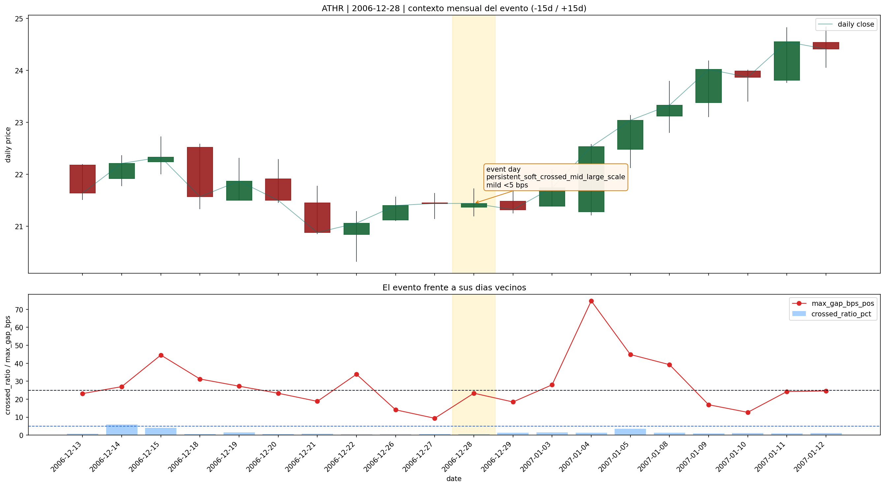

#### 00b Event Month Quotes Context
Esta imagen responde a la pregunta de recurrencia mensual dentro de `quotes`: el problema se concentra en el evento o reaparece en varias sesiones. Arriba concatena sesiones con datos disponibles; abajo resume cobertura diaria, `crossed_ratio_pct` y `max_gap_bps_pos`. La decision que cambia es si el caso debe leerse como episodio puntual o como sintoma de una fase repetida de libro degradado. El error que evita es extrapolar desde un unico dia a todo el mes sin evidencia.

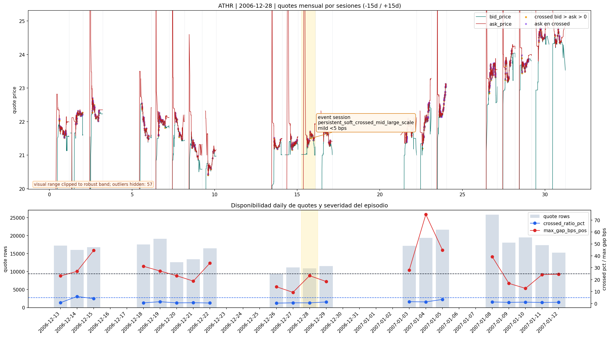

#### 01 Raw Window
Esta imagen responde a la primera pregunta decisiva del caso: el crossed observado es economicamente bastante fuerte para justificar un cambio de clase. Arriba ensena la geometria exacta del tramo conflictivo; abajo convierte esa geometria a bps y la enfrenta a los cortes `5 bps` y `25 bps`. El regimen dominante es `mild <5 bps`. La decision que cambia es pasar de anomalia interpretable a `review` o `bad`. El error que evita es decidir por apariencia visual sin medir el dano economico real del crossed. En terminos de pipeline, este panel decide si el problema afecta solo a la lectura forense o si invalida simulacion de ejecucion y microstructure features.

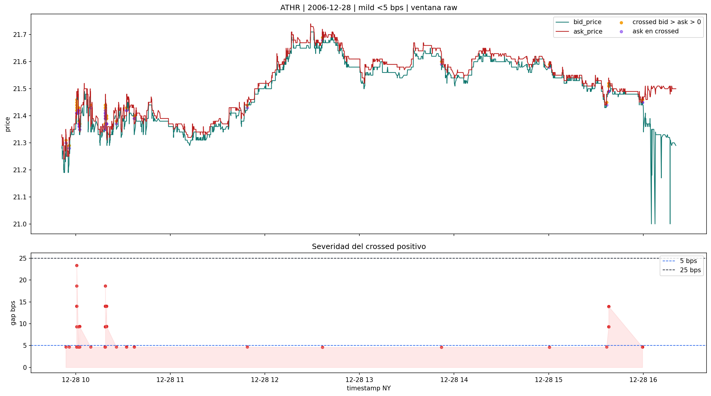

#### 02 Full Session Context
Esta imagen responde a la pregunta de extension intradiaria: el dano esta confinado a un bloque corto o contamina la sesion completa. Arriba se ve toda la sesion `04:00-20:00 NY`; abajo el `gap_bps` firmado. La decision que cambia es si el consumo debe penalizar solo un tramo o desechar el dia entero para uso operativo. El error que evita es tratar una cicatriz local como ruina total o, al reves, minimizar una degradacion distribuida a lo largo del dia. En ejecucion esto decide si la sesion puede seguir usandose con restricciones; en ML decide si las features intradiarias conservan significado economico.

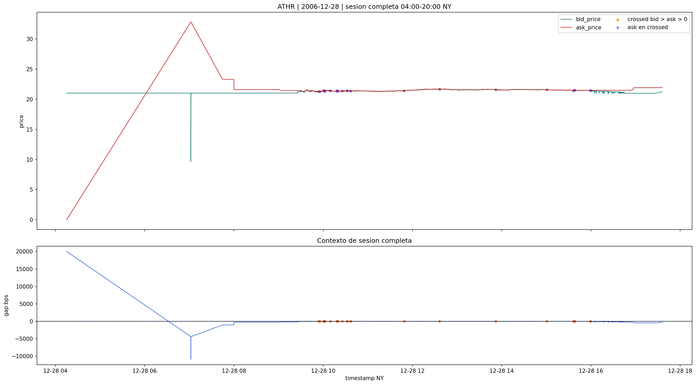

#### 03 Structure Diagnostics
Este panel responde a la pregunta de naturaleza del fallo: contradiccion economica genuina o mezcla con degeneracion estructural. Separa `ask=0` de `ask>0`, muestra la distribucion de `gap_bps` y resume patrones de integerizacion. La decision que cambia es como interpretar el dano: mercado localmente roto, artefacto de representacion o combinacion de ambos. El error que evita es sobrediagnosticar crossed reales cuando parte de la senal proviene de estructura degenerada del libro. Esta lectura afecta directamente a que el caso vaya a exclusion dura, a bandera contextual o a simple reconciliacion tecnica.

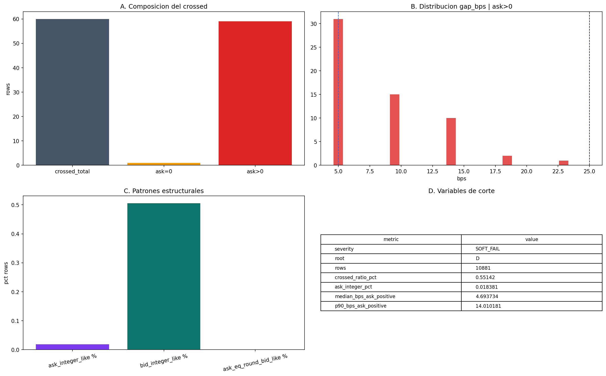

#### 04 Summary Card
Esta tarjeta responde a la pregunta de auditabilidad: cuales son exactamente las variables que sostienen la conclusion. Reune `severity`, `root`, `crossed_ratio_pct`, `ask_integer_pct`, `median_bps_ask_positive` y `p90_bps_ask_positive`. La decision que cambia es pasar de impresion visual a regla verificable. El error que evita es que dos inspectores lleguen a conclusiones distintas mirando la misma imagen sin una base numerica comun. Para gobernanza del proyecto, este panel es el que vuelve reproducible la decision para backtest, ML y auditoria.

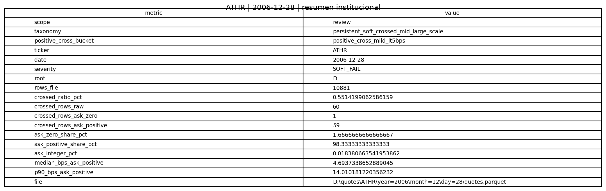

---

### 51. ALLT 2012-04-04

company_name: `Allot Ltd. Ordinary Shares`
primary_exchange: `NASDAQ` (`XNAS`)
market_locale: `stocks/us`
scope: `review`
ticker: `ALLT`
date: `2012-04-04`
taxonomy: `persistent_soft_crossed_mid_large_scale`
positive_cross_bucket: `positive_cross_mild_lt5bps`
severity: `SOFT_FAIL`
root: `D`
rows: `21671`
crossed_ratio_pct: `0.530663`
crossed_rows_raw: `115`
crossed_rows_ask_zero: `70`
crossed_rows_ask_positive: `45`
ask_integer_pct: `0.599880`
median_bps_ask_positive: `4.471272`
p90_bps_ask_positive: `75.471698`
file: `D:\quotes\ALLT\year=2012\month=04\day=04\quotes.parquet`

#### Analisis Forense
La conclusion correcta del caso es que ya existe contradiccion economica real dentro del libro, pero aun no con fuerza suficiente para justificar exclusion dura sin contexto adicional. La taxonomy historica es `persistent_soft_crossed_mid_large_scale` y el regimen positivo dominante es `mild <5 bps`. Esto importa porque la taxonomy no solo clasifica: resume que tipo de anomalia se esta viendo y que clase de decision contractual puede defenderse despues. La taxonomy `persistent_soft_crossed_mid_large_scale` implica un problema repetido y distribuido, no un simple pinchazo local. Por eso empuja a `review`: ya hay dano real, aunque no necesariamente exclusion dura universal. El regimen `mild <5 bps` significa que existe contradiccion economica positiva, pero aun en una banda donde un uso prudente puede seguir siendo defendible si la persistencia y la estructura no agravan el caso. En terminos observables, el file tiene `crossed_ratio_pct=0.530663` con `crossed_rows_ask_positive=45` y `crossed_rows_ask_zero=70`. La severidad economica del crossed ask>0 se resume en `median_bps_ask_positive=4.471272` y `p90_bps_ask_positive=75.471698`. Estos dos numeros convierten una forma visual rara en una conclusion operativa sobre si el libro sigue representando o no un mercado negociable. La decision que cambia es pasar de libro sano a libro util solo bajo cautela. `review` significa: no usar como si fuera ejecucion limpia, conservar para analisis contextual y sensibilidad. El error que evita es tratar como normal un episodio que ya contiene contradiccion economica real y contaminar simulaciones de ejecucion o validaciones demasiado optimistas. El patron estructural muestra `ask_integer_pct=0.599880`. Este numero obliga a separar dos explicaciones rivales: contradiccion economica genuina del libro o mezcla con degeneracion estructural / integerizacion. La composicion esta mezclada entre `ask=0` y `ask>0`. Eso obliga a una lectura dual: parte del patron pertenece a estructura y parte a contradiccion economica genuina, por lo que la decision debe apoyarse en ambas capas y no en una sola narrativa. Como `ask_integer_pct` es bajo, la hipotesis de simple degeneracion mecanica pierde fuerza. Eso endurece la interpretacion: el crossed se parece mas a contradiccion economica genuina y menos a artefacto. Existe ademas una imagen historica de certificacion asociada. Su papel es poner el episodio en un marco causal mas amplio: halt, explained, not strongly explained o patron conocido. La regla que protege al proyecto es esta: el contexto externo se usa para explicar por que aparece el episodio, no para absolverlo. El error que evita es degradar el criterio de calidad del libro porque exista una historia plausible alrededor del caso.

#### 00 Event Month Context
Esta imagen responde a la pregunta de persistencia temporal: estamos ante un accidente local o ante una fase mas amplia de inestabilidad. Arriba coloca el evento en la serie `daily` real del mes; abajo compara `crossed_ratio_pct` y `max_gap_bps_pos` del dia contra sus vecinos. La decision que cambia es el peso estructural que se le concede al caso. El error que evita es juzgar igual un shock aislado y una degradacion repetida del libro.

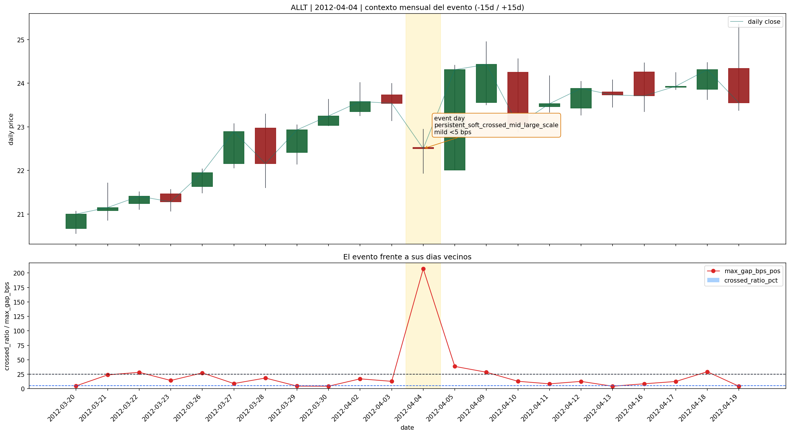

#### 00b Event Month Quotes Context
Esta imagen responde a la pregunta de recurrencia mensual dentro de `quotes`: el problema se concentra en el evento o reaparece en varias sesiones. Arriba concatena sesiones con datos disponibles; abajo resume cobertura diaria, `crossed_ratio_pct` y `max_gap_bps_pos`. La decision que cambia es si el caso debe leerse como episodio puntual o como sintoma de una fase repetida de libro degradado. El error que evita es extrapolar desde un unico dia a todo el mes sin evidencia.

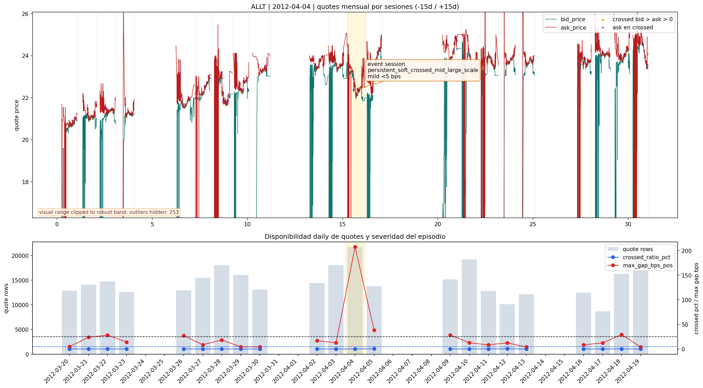

#### 01 Raw Window
Esta imagen responde a la primera pregunta decisiva del caso: el crossed observado es economicamente bastante fuerte para justificar un cambio de clase. Arriba ensena la geometria exacta del tramo conflictivo; abajo convierte esa geometria a bps y la enfrenta a los cortes `5 bps` y `25 bps`. El regimen dominante es `mild <5 bps`. La decision que cambia es pasar de anomalia interpretable a `review` o `bad`. El error que evita es decidir por apariencia visual sin medir el dano economico real del crossed. En terminos de pipeline, este panel decide si el problema afecta solo a la lectura forense o si invalida simulacion de ejecucion y microstructure features.

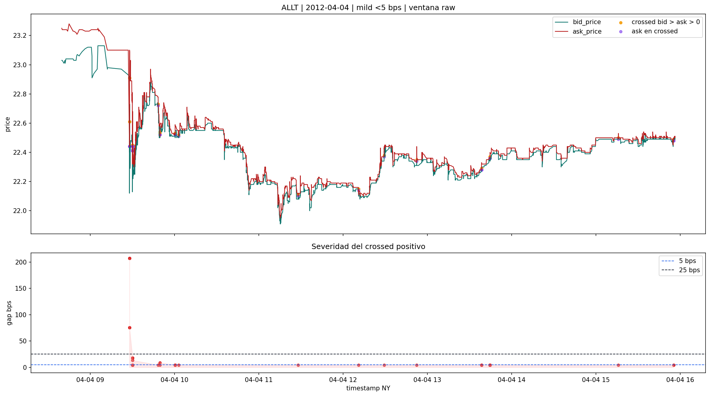

#### 02 Full Session Context
Esta imagen responde a la pregunta de extension intradiaria: el dano esta confinado a un bloque corto o contamina la sesion completa. Arriba se ve toda la sesion `04:00-20:00 NY`; abajo el `gap_bps` firmado. La decision que cambia es si el consumo debe penalizar solo un tramo o desechar el dia entero para uso operativo. El error que evita es tratar una cicatriz local como ruina total o, al reves, minimizar una degradacion distribuida a lo largo del dia. En ejecucion esto decide si la sesion puede seguir usandose con restricciones; en ML decide si las features intradiarias conservan significado economico.

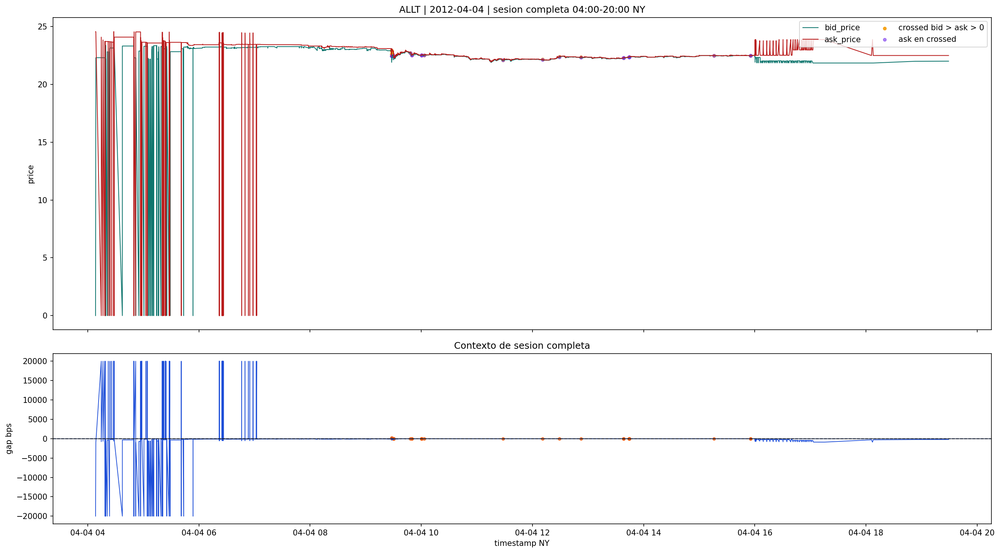

#### 03 Structure Diagnostics
Este panel responde a la pregunta de naturaleza del fallo: contradiccion economica genuina o mezcla con degeneracion estructural. Separa `ask=0` de `ask>0`, muestra la distribucion de `gap_bps` y resume patrones de integerizacion. La decision que cambia es como interpretar el dano: mercado localmente roto, artefacto de representacion o combinacion de ambos. El error que evita es sobrediagnosticar crossed reales cuando parte de la senal proviene de estructura degenerada del libro. Esta lectura afecta directamente a que el caso vaya a exclusion dura, a bandera contextual o a simple reconciliacion tecnica.

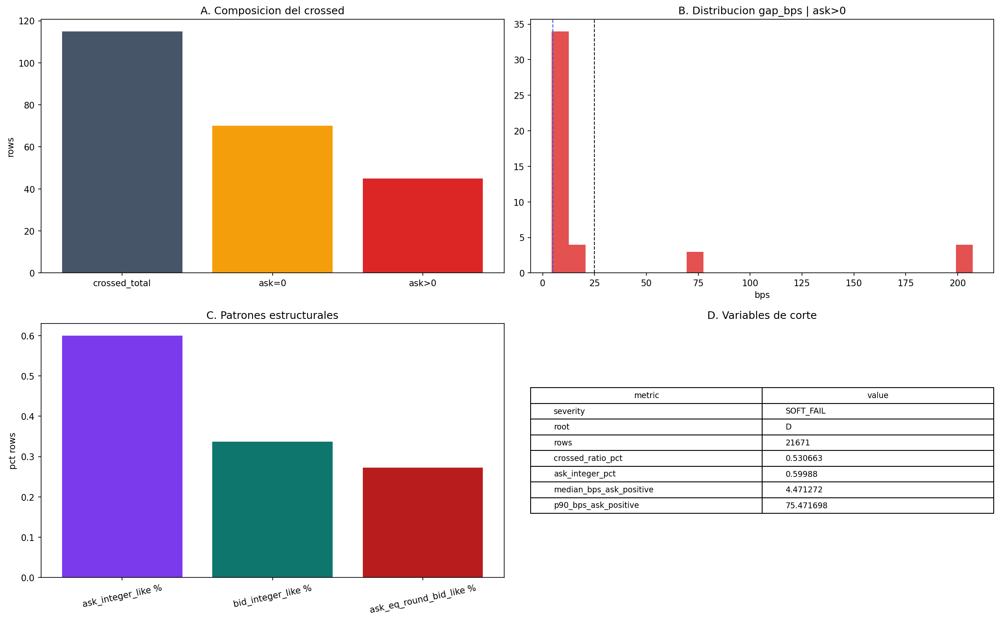

#### 04 Summary Card
Esta tarjeta responde a la pregunta de auditabilidad: cuales son exactamente las variables que sostienen la conclusion. Reune `severity`, `root`, `crossed_ratio_pct`, `ask_integer_pct`, `median_bps_ask_positive` y `p90_bps_ask_positive`. La decision que cambia es pasar de impresion visual a regla verificable. El error que evita es que dos inspectores lleguen a conclusiones distintas mirando la misma imagen sin una base numerica comun. Para gobernanza del proyecto, este panel es el que vuelve reproducible la decision para backtest, ML y auditoria.

---

### 52. MTRX 2007-06-28

company_name: `Matrix Service Co`
primary_exchange: `NASDAQ` (`XNAS`)
market_locale: `stocks/us`
scope: `review`
ticker: `MTRX`
date: `2007-06-28`
taxonomy: `persistent_soft_crossed_mid_large_scale`
positive_cross_bucket: `positive_cross_mild_lt5bps`
severity: `SOFT_FAIL`
root: `C`
rows: `12892`
crossed_ratio_pct: `0.356810`
crossed_rows_raw: `46`
crossed_rows_ask_zero: `1`
crossed_rows_ask_positive: `45`
ask_integer_pct: `0.915296`
median_bps_ask_positive: `4.004004`
p90_bps_ask_positive: `6.430132`
file: `C:\TSIS_Data\data\quotes\MTRX\year=2007\month=06\day=28\quotes.parquet`

#### Analisis Forense
La conclusion correcta del caso es que ya existe contradiccion economica real dentro del libro, pero aun no con fuerza suficiente para justificar exclusion dura sin contexto adicional. La taxonomy historica es `persistent_soft_crossed_mid_large_scale` y el regimen positivo dominante es `mild <5 bps`. Esto importa porque la taxonomy no solo clasifica: resume que tipo de anomalia se esta viendo y que clase de decision contractual puede defenderse despues. La taxonomy `persistent_soft_crossed_mid_large_scale` implica un problema repetido y distribuido, no un simple pinchazo local. Por eso empuja a `review`: ya hay dano real, aunque no necesariamente exclusion dura universal. El regimen `mild <5 bps` significa que existe contradiccion economica positiva, pero aun en una banda donde un uso prudente puede seguir siendo defendible si la persistencia y la estructura no agravan el caso. En terminos observables, el file tiene `crossed_ratio_pct=0.356810` con `crossed_rows_ask_positive=45` y `crossed_rows_ask_zero=1`. La severidad economica del crossed ask>0 se resume en `median_bps_ask_positive=4.004004` y `p90_bps_ask_positive=6.430132`. Estos dos numeros convierten una forma visual rara en una conclusion operativa sobre si el libro sigue representando o no un mercado negociable. La decision que cambia es pasar de libro sano a libro util solo bajo cautela. `review` significa: no usar como si fuera ejecucion limpia, conservar para analisis contextual y sensibilidad. El error que evita es tratar como normal un episodio que ya contiene contradiccion economica real y contaminar simulaciones de ejecucion o validaciones demasiado optimistas. El patron estructural muestra `ask_integer_pct=0.915296`. Este numero obliga a separar dos explicaciones rivales: contradiccion economica genuina del libro o mezcla con degeneracion estructural / integerizacion. La mayor parte del crossed vive en `ask>0`, de modo que el corazon del problema sigue siendo economico. La parte `ask=0`, si existe, acompana pero no explica por si sola la anomalia. Como `ask_integer_pct` es bajo, la hipotesis de simple degeneracion mecanica pierde fuerza. Eso endurece la interpretacion: el crossed se parece mas a contradiccion economica genuina y menos a artefacto. Existe ademas una imagen historica de certificacion asociada. Su papel es poner el episodio en un marco causal mas amplio: halt, explained, not strongly explained o patron conocido. La regla que protege al proyecto es esta: el contexto externo se usa para explicar por que aparece el episodio, no para absolverlo. El error que evita es degradar el criterio de calidad del libro porque exista una historia plausible alrededor del caso.

#### 00 Event Month Context
Esta imagen responde a la pregunta de persistencia temporal: estamos ante un accidente local o ante una fase mas amplia de inestabilidad. Arriba coloca el evento en la serie `daily` real del mes; abajo compara `crossed_ratio_pct` y `max_gap_bps_pos` del dia contra sus vecinos. La decision que cambia es el peso estructural que se le concede al caso. El error que evita es juzgar igual un shock aislado y una degradacion repetida del libro.

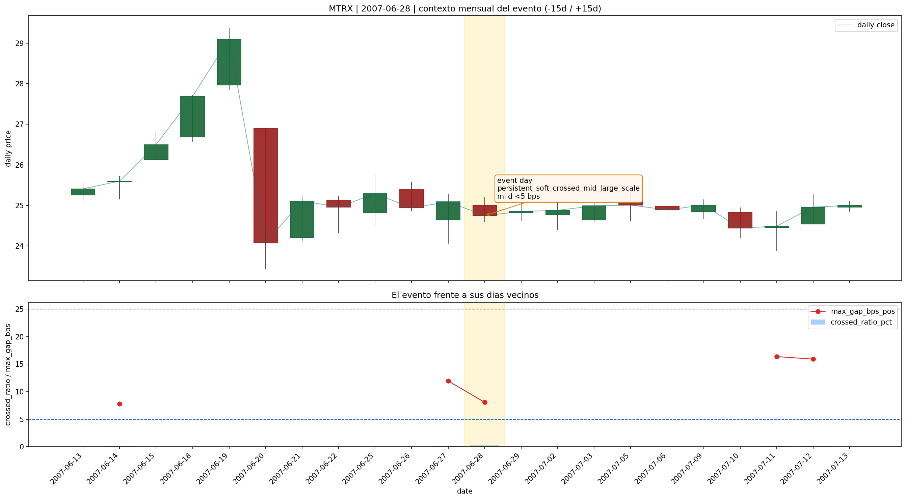

#### 00b Event Month Quotes Context
Esta imagen responde a la pregunta de recurrencia mensual dentro de `quotes`: el problema se concentra en el evento o reaparece en varias sesiones. Arriba concatena sesiones con datos disponibles; abajo resume cobertura diaria, `crossed_ratio_pct` y `max_gap_bps_pos`. La decision que cambia es si el caso debe leerse como episodio puntual o como sintoma de una fase repetida de libro degradado. El error que evita es extrapolar desde un unico dia a todo el mes sin evidencia.

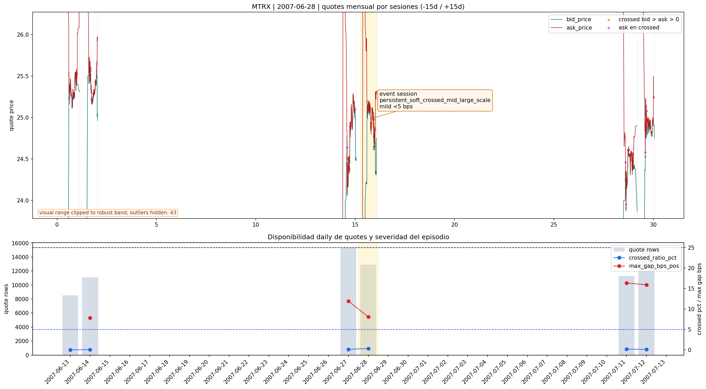

#### 01 Raw Window
Esta imagen responde a la primera pregunta decisiva del caso: el crossed observado es economicamente bastante fuerte para justificar un cambio de clase. Arriba ensena la geometria exacta del tramo conflictivo; abajo convierte esa geometria a bps y la enfrenta a los cortes `5 bps` y `25 bps`. El regimen dominante es `mild <5 bps`. La decision que cambia es pasar de anomalia interpretable a `review` o `bad`. El error que evita es decidir por apariencia visual sin medir el dano economico real del crossed. En terminos de pipeline, este panel decide si el problema afecta solo a la lectura forense o si invalida simulacion de ejecucion y microstructure features.

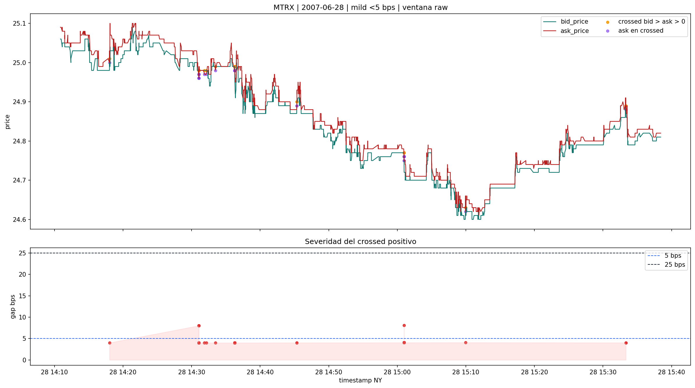

#### 02 Full Session Context
Esta imagen responde a la pregunta de extension intradiaria: el dano esta confinado a un bloque corto o contamina la sesion completa. Arriba se ve toda la sesion `04:00-20:00 NY`; abajo el `gap_bps` firmado. La decision que cambia es si el consumo debe penalizar solo un tramo o desechar el dia entero para uso operativo. El error que evita es tratar una cicatriz local como ruina total o, al reves, minimizar una degradacion distribuida a lo largo del dia. En ejecucion esto decide si la sesion puede seguir usandose con restricciones; en ML decide si las features intradiarias conservan significado economico.

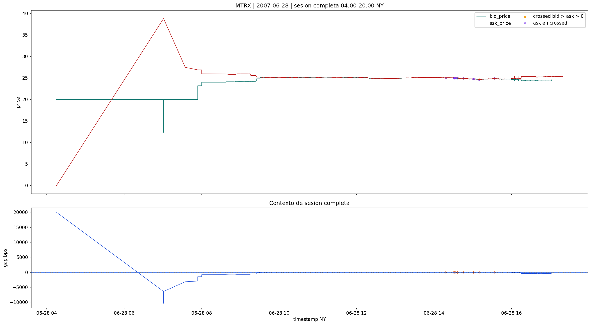

#### 03 Structure Diagnostics
Este panel responde a la pregunta de naturaleza del fallo: contradiccion economica genuina o mezcla con degeneracion estructural. Separa `ask=0` de `ask>0`, muestra la distribucion de `gap_bps` y resume patrones de integerizacion. La decision que cambia es como interpretar el dano: mercado localmente roto, artefacto de representacion o combinacion de ambos. El error que evita es sobrediagnosticar crossed reales cuando parte de la senal proviene de estructura degenerada del libro. Esta lectura afecta directamente a que el caso vaya a exclusion dura, a bandera contextual o a simple reconciliacion tecnica.

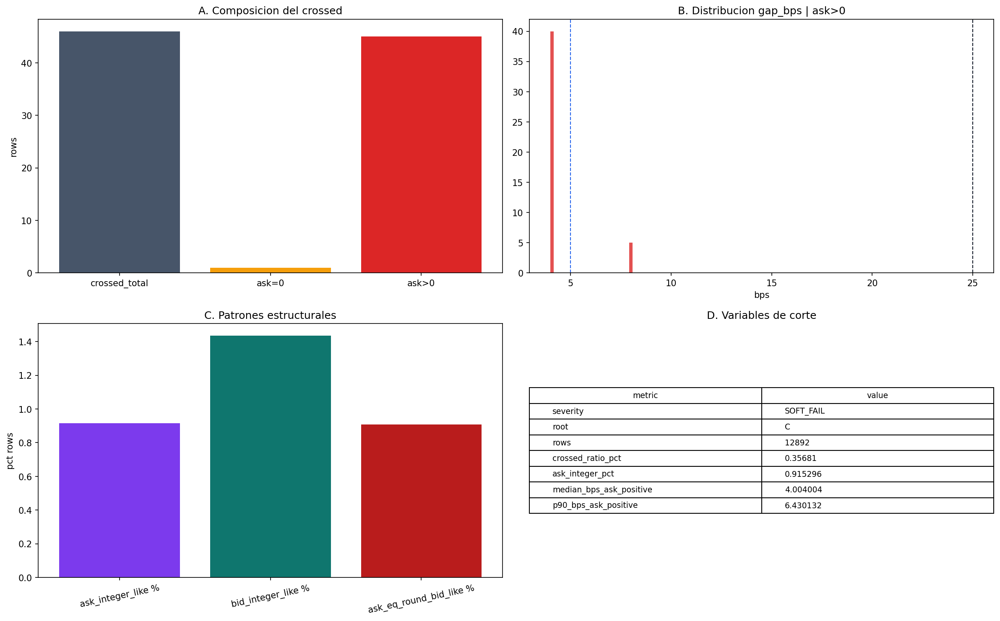

#### 04 Summary Card
Esta tarjeta responde a la pregunta de auditabilidad: cuales son exactamente las variables que sostienen la conclusion. Reune `severity`, `root`, `crossed_ratio_pct`, `ask_integer_pct`, `median_bps_ask_positive` y `p90_bps_ask_positive`. La decision que cambia es pasar de impresion visual a regla verificable. El error que evita es que dos inspectores lleguen a conclusiones distintas mirando la misma imagen sin una base numerica comun. Para gobernanza del proyecto, este panel es el que vuelve reproducible la decision para backtest, ML y auditoria.

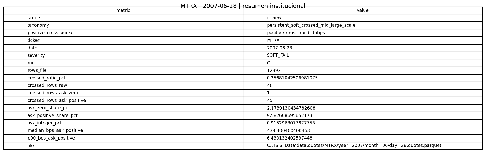

---

### 53. NUS 2010-07-29

company_name: `NuSkin Enterprises, Inc.`
primary_exchange: `NYSE` (`XNYS`)
market_locale: `stocks/us`
scope: `review`
ticker: `NUS`
date: `2010-07-29`
taxonomy: `persistent_soft_crossed_mid_large_scale`
positive_cross_bucket: `positive_cross_mild_lt5bps`
severity: `SOFT_FAIL`
root: `D`
rows: `25113`
crossed_ratio_pct: `0.457930`
crossed_rows_raw: `115`
crossed_rows_ask_zero: `0`
crossed_rows_ask_positive: `115`
ask_integer_pct: `2.528571`
median_bps_ask_positive: `3.575898`
p90_bps_ask_positive: `9.142080`
file: `D:\quotes\NUS\year=2010\month=07\day=29\quotes.parquet`

#### Analisis Forense
La conclusion correcta del caso es que ya existe contradiccion economica real dentro del libro, pero aun no con fuerza suficiente para justificar exclusion dura sin contexto adicional. La taxonomy historica es `persistent_soft_crossed_mid_large_scale` y el regimen positivo dominante es `mild <5 bps`. Esto importa porque la taxonomy no solo clasifica: resume que tipo de anomalia se esta viendo y que clase de decision contractual puede defenderse despues. La taxonomy `persistent_soft_crossed_mid_large_scale` implica un problema repetido y distribuido, no un simple pinchazo local. Por eso empuja a `review`: ya hay dano real, aunque no necesariamente exclusion dura universal. El regimen `mild <5 bps` significa que existe contradiccion economica positiva, pero aun en una banda donde un uso prudente puede seguir siendo defendible si la persistencia y la estructura no agravan el caso. En terminos observables, el file tiene `crossed_ratio_pct=0.457930` con `crossed_rows_ask_positive=115` y `crossed_rows_ask_zero=0`. La severidad economica del crossed ask>0 se resume en `median_bps_ask_positive=3.575898` y `p90_bps_ask_positive=9.142080`. Estos dos numeros convierten una forma visual rara en una conclusion operativa sobre si el libro sigue representando o no un mercado negociable. La decision que cambia es pasar de libro sano a libro util solo bajo cautela. `review` significa: no usar como si fuera ejecucion limpia, conservar para analisis contextual y sensibilidad. El error que evita es tratar como normal un episodio que ya contiene contradiccion economica real y contaminar simulaciones de ejecucion o validaciones demasiado optimistas. El patron estructural muestra `ask_integer_pct=2.528571`. Este numero obliga a separar dos explicaciones rivales: contradiccion economica genuina del libro o mezcla con degeneracion estructural / integerizacion. Toda la composicion crossed cae en `ask>0`. Eso endurece la lectura economica del caso: el dano no depende de ceros mecanicos, sino de contradiccion positiva dentro de precios aparentemente vivos. Como `ask_integer_pct` es bajo, la hipotesis de simple degeneracion mecanica pierde fuerza. Eso endurece la interpretacion: el crossed se parece mas a contradiccion economica genuina y menos a artefacto. En la capa de semantica de precio del evento aparecen `daily raw close=28.9500`, `quote mid raw=28.6250`, `quote mid split_normalized=28.6250`, `daily adjusted_proxy=15.7907`. Ademas hay `post_event_dividend_sum=18.0800`. La implicacion metodologica es crucial: una discrepancia entre `quotes`, `daily` y una plataforma externa no puede leerse automaticamente como fallo del dataset. Puede ser semantica de precio distinta. El error que evita esta capa es mezclar raw, split-normalized y adjusted dentro del mismo pipeline, rompiendo auditoria, benchmarking y labels. Para pipelines, esto empuja a conservar el caso fuera de ejecucion limpia, pero todavia puede mantenerse en investigacion contextual y en analisis de sensibilidad donde interese entender fronteras de tolerancia. Existe ademas una imagen historica de certificacion asociada. Su papel es poner el episodio en un marco causal mas amplio: halt, explained, not strongly explained o patron conocido. La regla que protege al proyecto es esta: el contexto externo se usa para explicar por que aparece el episodio, no para absolverlo. El error que evita es degradar el criterio de calidad del libro porque exista una historia plausible alrededor del caso.

#### 00 Event Month Context
Esta imagen responde a la pregunta de persistencia temporal: estamos ante un accidente local o ante una fase mas amplia de inestabilidad. Arriba coloca el evento en la serie `daily` real del mes; abajo compara `crossed_ratio_pct` y `max_gap_bps_pos` del dia contra sus vecinos. La decision que cambia es el peso estructural que se le concede al caso. El error que evita es juzgar igual un shock aislado y una degradacion repetida del libro.

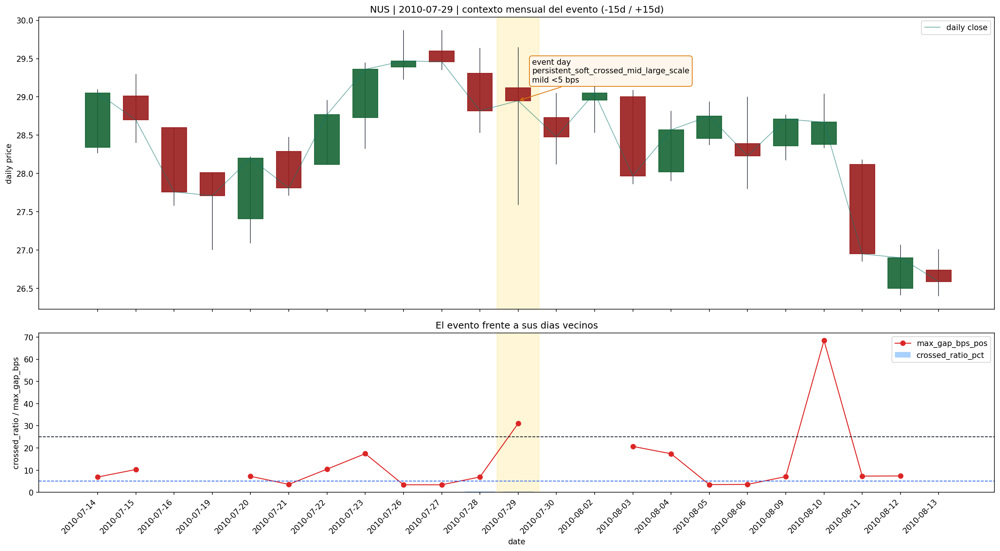

#### 00a Adjusted Proxy Contrast
Esta imagen responde a la pregunta de reconciliacion semantica: la discrepancia de precios viene de datos rotos o de vistas de precio distintas. Compara `daily raw`, `daily adjusted_proxy`, `quote mid raw` y `quote mid split_normalized`, y debajo ensena la cadena de dividendos y splits que produce la diferencia. La decision que cambia es si el inspector debe abrir una incidencia de calidad o cerrar el caso como diferencia legitima de semantica. El error que evita es mezclar series raw y adjusted como si fueran equivalentes. En pipelines reales, esto protege benchmarking, labels diarios y reconciliacion externa frente a falsas alarmas de precio.

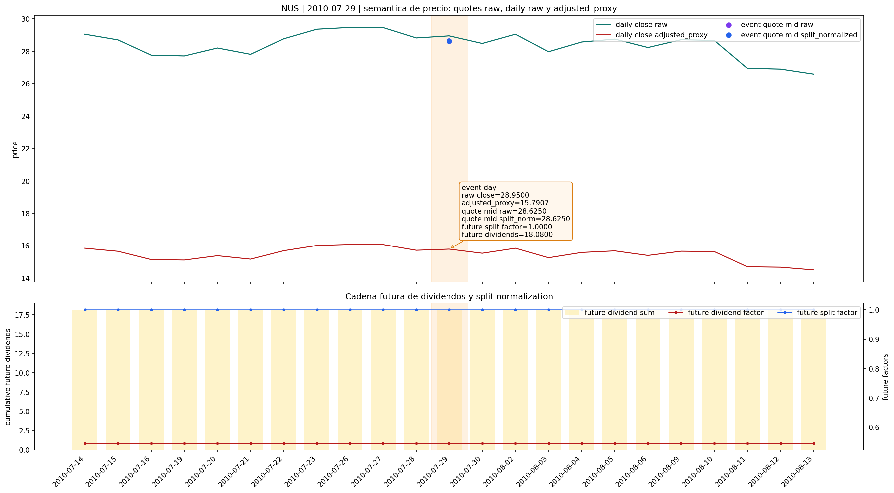

#### 00b Event Month Quotes Context
Esta imagen responde a la pregunta de recurrencia mensual dentro de `quotes`: el problema se concentra en el evento o reaparece en varias sesiones. Arriba concatena sesiones con datos disponibles; abajo resume cobertura diaria, `crossed_ratio_pct` y `max_gap_bps_pos`. La decision que cambia es si el caso debe leerse como episodio puntual o como sintoma de una fase repetida de libro degradado. El error que evita es extrapolar desde un unico dia a todo el mes sin evidencia.

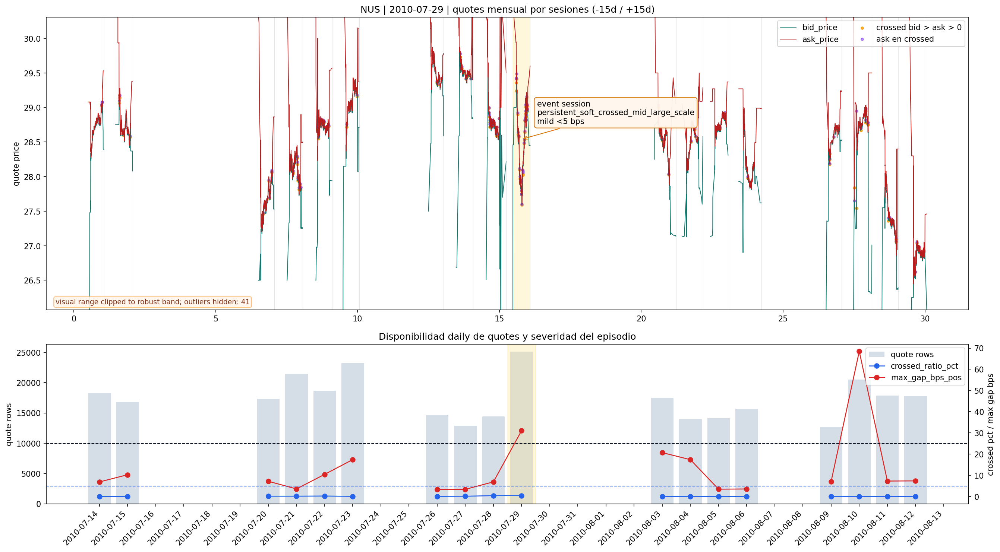

#### 01 Raw Window
Esta imagen responde a la primera pregunta decisiva del caso: el crossed observado es economicamente bastante fuerte para justificar un cambio de clase. Arriba ensena la geometria exacta del tramo conflictivo; abajo convierte esa geometria a bps y la enfrenta a los cortes `5 bps` y `25 bps`. El regimen dominante es `mild <5 bps`. La decision que cambia es pasar de anomalia interpretable a `review` o `bad`. El error que evita es decidir por apariencia visual sin medir el dano economico real del crossed. En terminos de pipeline, este panel decide si el problema afecta solo a la lectura forense o si invalida simulacion de ejecucion y microstructure features.

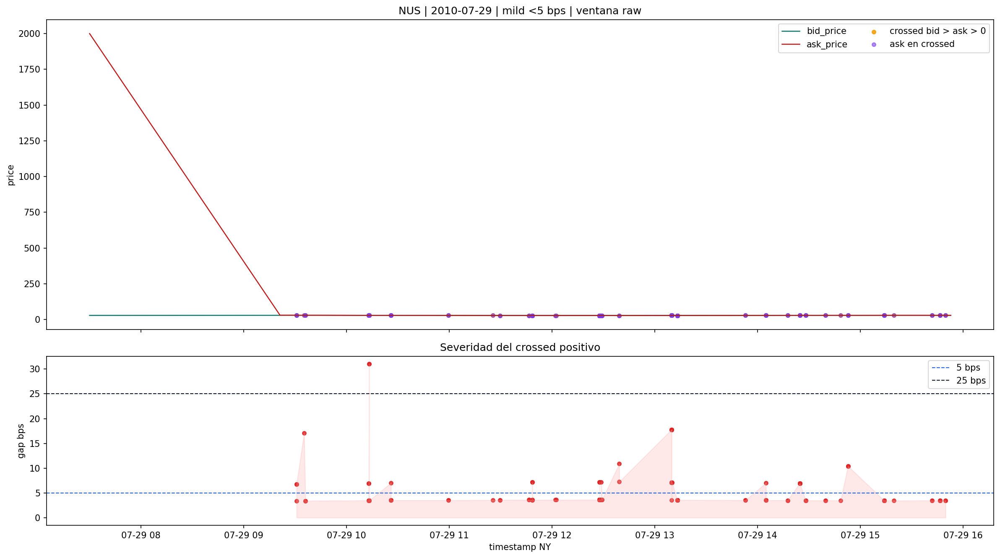

#### 02 Full Session Context
Esta imagen responde a la pregunta de extension intradiaria: el dano esta confinado a un bloque corto o contamina la sesion completa. Arriba se ve toda la sesion `04:00-20:00 NY`; abajo el `gap_bps` firmado. La decision que cambia es si el consumo debe penalizar solo un tramo o desechar el dia entero para uso operativo. El error que evita es tratar una cicatriz local como ruina total o, al reves, minimizar una degradacion distribuida a lo largo del dia. En ejecucion esto decide si la sesion puede seguir usandose con restricciones; en ML decide si las features intradiarias conservan significado economico.

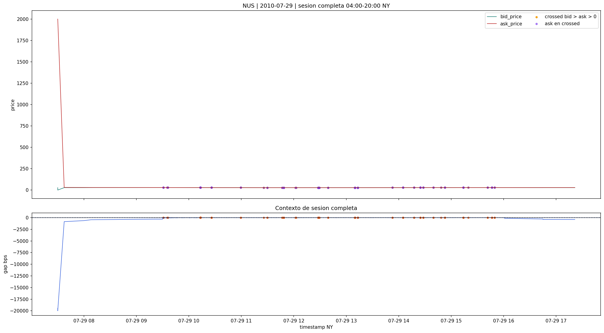

#### 03 Structure Diagnostics
Este panel responde a la pregunta de naturaleza del fallo: contradiccion economica genuina o mezcla con degeneracion estructural. Separa `ask=0` de `ask>0`, muestra la distribucion de `gap_bps` y resume patrones de integerizacion. La decision que cambia es como interpretar el dano: mercado localmente roto, artefacto de representacion o combinacion de ambos. El error que evita es sobrediagnosticar crossed reales cuando parte de la senal proviene de estructura degenerada del libro. Esta lectura afecta directamente a que el caso vaya a exclusion dura, a bandera contextual o a simple reconciliacion tecnica.

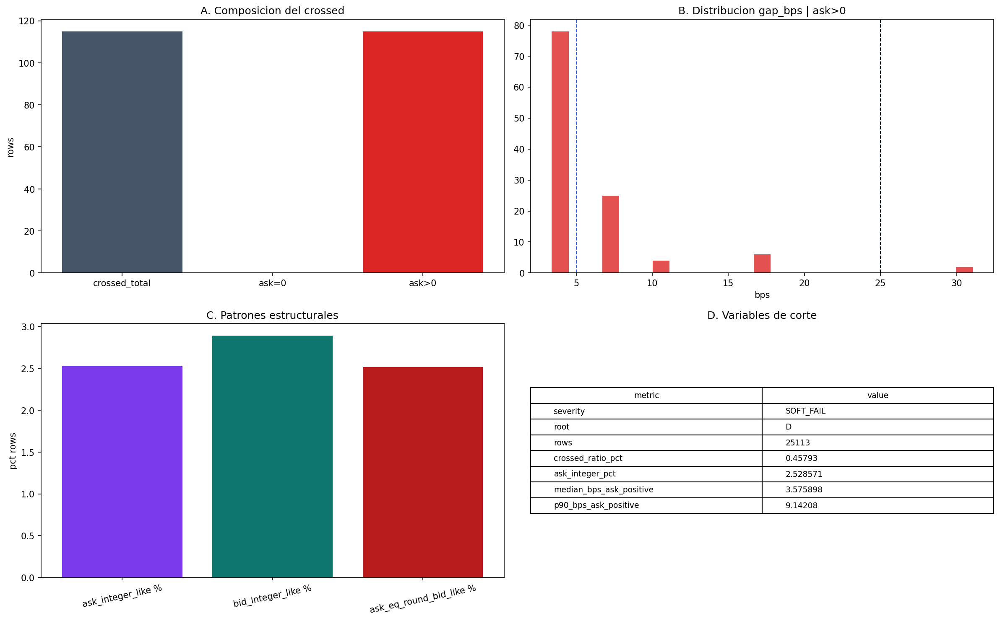

#### 04 Summary Card
Esta tarjeta responde a la pregunta de auditabilidad: cuales son exactamente las variables que sostienen la conclusion. Reune `severity`, `root`, `crossed_ratio_pct`, `ask_integer_pct`, `median_bps_ask_positive` y `p90_bps_ask_positive`. La decision que cambia es pasar de impresion visual a regla verificable. El error que evita es que dos inspectores lleguen a conclusiones distintas mirando la misma imagen sin una base numerica comun. Para gobernanza del proyecto, este panel es el que vuelve reproducible la decision para backtest, ML y auditoria.

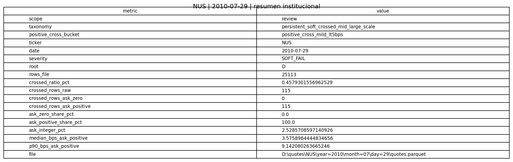

---

### 54. SPWR 2008-09-09

company_name: `SunPower Corporation Common Stock`
primary_exchange: `NASDAQ` (`XNAS`)
market_locale: `stocks/us`
scope: `review`
ticker: `SPWR`
date: `2008-09-09`
taxonomy: `persistent_soft_crossed_mid_large_scale`
positive_cross_bucket: `positive_cross_mild_lt5bps`
severity: `SOFT_FAIL`
root: `C`
rows: `79789`
crossed_ratio_pct: `0.496309`
crossed_rows_raw: `396`
crossed_rows_ask_zero: `1`
crossed_rows_ask_positive: `395`
ask_integer_pct: `1.600471`
median_bps_ask_positive: `3.430728`
p90_bps_ask_positive: `12.410953`
file: `C:\TSIS_Data\data\quotes\SPWR\year=2008\month=09\day=09\quotes.parquet`

#### Analisis Forense
La conclusion correcta del caso es que ya existe contradiccion economica real dentro del libro, pero aun no con fuerza suficiente para justificar exclusion dura sin contexto adicional. La taxonomy historica es `persistent_soft_crossed_mid_large_scale` y el regimen positivo dominante es `mild <5 bps`. Esto importa porque la taxonomy no solo clasifica: resume que tipo de anomalia se esta viendo y que clase de decision contractual puede defenderse despues. La taxonomy `persistent_soft_crossed_mid_large_scale` implica un problema repetido y distribuido, no un simple pinchazo local. Por eso empuja a `review`: ya hay dano real, aunque no necesariamente exclusion dura universal. El regimen `mild <5 bps` significa que existe contradiccion economica positiva, pero aun en una banda donde un uso prudente puede seguir siendo defendible si la persistencia y la estructura no agravan el caso. En terminos observables, el file tiene `crossed_ratio_pct=0.496309` con `crossed_rows_ask_positive=395` y `crossed_rows_ask_zero=1`. La severidad economica del crossed ask>0 se resume en `median_bps_ask_positive=3.430728` y `p90_bps_ask_positive=12.410953`. Estos dos numeros convierten una forma visual rara en una conclusion operativa sobre si el libro sigue representando o no un mercado negociable. La decision que cambia es pasar de libro sano a libro util solo bajo cautela. `review` significa: no usar como si fuera ejecucion limpia, conservar para analisis contextual y sensibilidad. El error que evita es tratar como normal un episodio que ya contiene contradiccion economica real y contaminar simulaciones de ejecucion o validaciones demasiado optimistas. El patron estructural muestra `ask_integer_pct=1.600471`. Este numero obliga a separar dos explicaciones rivales: contradiccion economica genuina del libro o mezcla con degeneracion estructural / integerizacion. La mayor parte del crossed vive en `ask>0`, de modo que el corazon del problema sigue siendo economico. La parte `ask=0`, si existe, acompana pero no explica por si sola la anomalia. Como `ask_integer_pct` es bajo, la hipotesis de simple degeneracion mecanica pierde fuerza. Eso endurece la interpretacion: el crossed se parece mas a contradiccion economica genuina y menos a artefacto. Existe ademas una imagen historica de certificacion asociada. Su papel es poner el episodio en un marco causal mas amplio: halt, explained, not strongly explained o patron conocido. La regla que protege al proyecto es esta: el contexto externo se usa para explicar por que aparece el episodio, no para absolverlo. El error que evita es degradar el criterio de calidad del libro porque exista una historia plausible alrededor del caso.

#### 00 Event Month Context
Esta imagen responde a la pregunta de persistencia temporal: estamos ante un accidente local o ante una fase mas amplia de inestabilidad. Arriba coloca el evento en la serie `daily` real del mes; abajo compara `crossed_ratio_pct` y `max_gap_bps_pos` del dia contra sus vecinos. La decision que cambia es el peso estructural que se le concede al caso. El error que evita es juzgar igual un shock aislado y una degradacion repetida del libro.

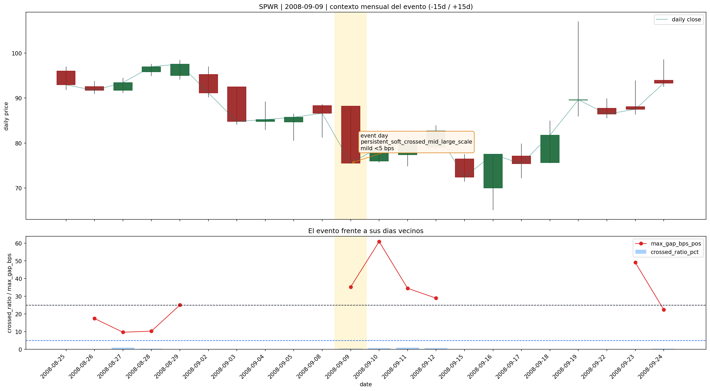

#### 00b Event Month Quotes Context
Esta imagen responde a la pregunta de recurrencia mensual dentro de `quotes`: el problema se concentra en el evento o reaparece en varias sesiones. Arriba concatena sesiones con datos disponibles; abajo resume cobertura diaria, `crossed_ratio_pct` y `max_gap_bps_pos`. La decision que cambia es si el caso debe leerse como episodio puntual o como sintoma de una fase repetida de libro degradado. El error que evita es extrapolar desde un unico dia a todo el mes sin evidencia.

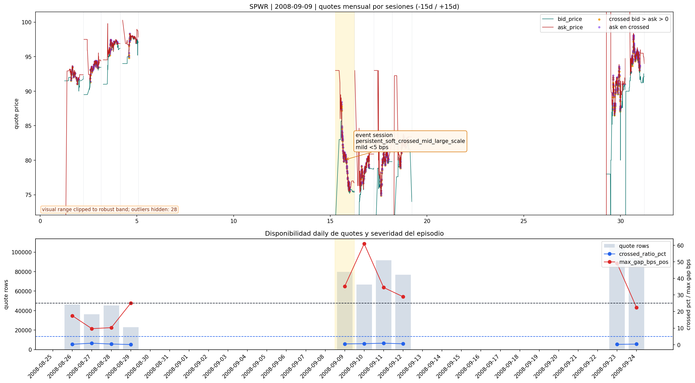

#### 01 Raw Window
Esta imagen responde a la primera pregunta decisiva del caso: el crossed observado es economicamente bastante fuerte para justificar un cambio de clase. Arriba ensena la geometria exacta del tramo conflictivo; abajo convierte esa geometria a bps y la enfrenta a los cortes `5 bps` y `25 bps`. El regimen dominante es `mild <5 bps`. La decision que cambia es pasar de anomalia interpretable a `review` o `bad`. El error que evita es decidir por apariencia visual sin medir el dano economico real del crossed. En terminos de pipeline, este panel decide si el problema afecta solo a la lectura forense o si invalida simulacion de ejecucion y microstructure features.

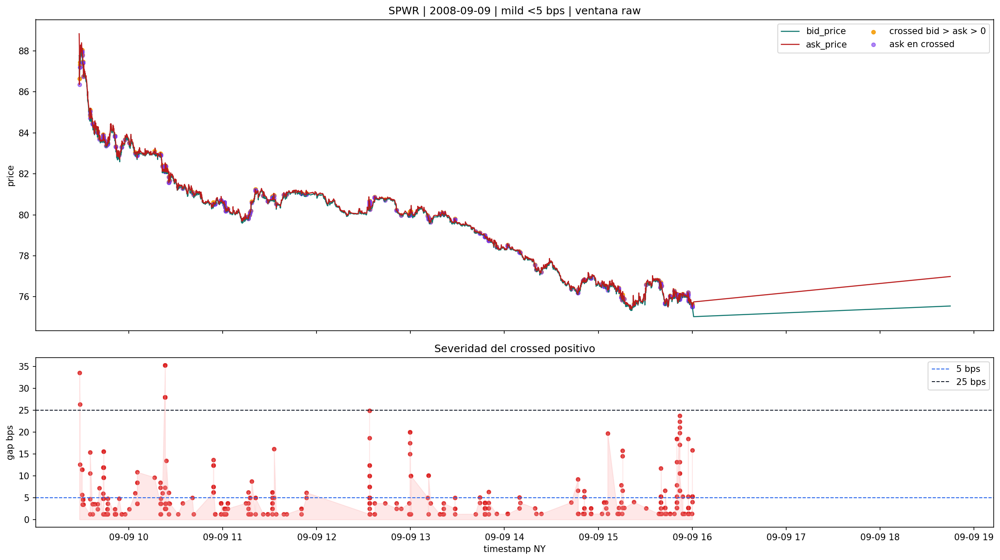

#### 02 Full Session Context
Esta imagen responde a la pregunta de extension intradiaria: el dano esta confinado a un bloque corto o contamina la sesion completa. Arriba se ve toda la sesion `04:00-20:00 NY`; abajo el `gap_bps` firmado. La decision que cambia es si el consumo debe penalizar solo un tramo o desechar el dia entero para uso operativo. El error que evita es tratar una cicatriz local como ruina total o, al reves, minimizar una degradacion distribuida a lo largo del dia. En ejecucion esto decide si la sesion puede seguir usandose con restricciones; en ML decide si las features intradiarias conservan significado economico.

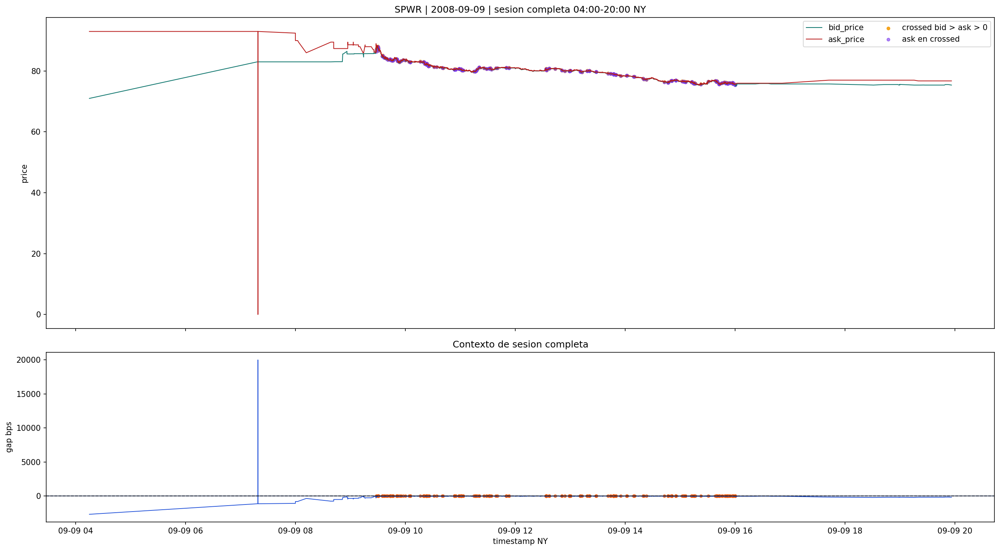

#### 03 Structure Diagnostics
Este panel responde a la pregunta de naturaleza del fallo: contradiccion economica genuina o mezcla con degeneracion estructural. Separa `ask=0` de `ask>0`, muestra la distribucion de `gap_bps` y resume patrones de integerizacion. La decision que cambia es como interpretar el dano: mercado localmente roto, artefacto de representacion o combinacion de ambos. El error que evita es sobrediagnosticar crossed reales cuando parte de la senal proviene de estructura degenerada del libro. Esta lectura afecta directamente a que el caso vaya a exclusion dura, a bandera contextual o a simple reconciliacion tecnica.

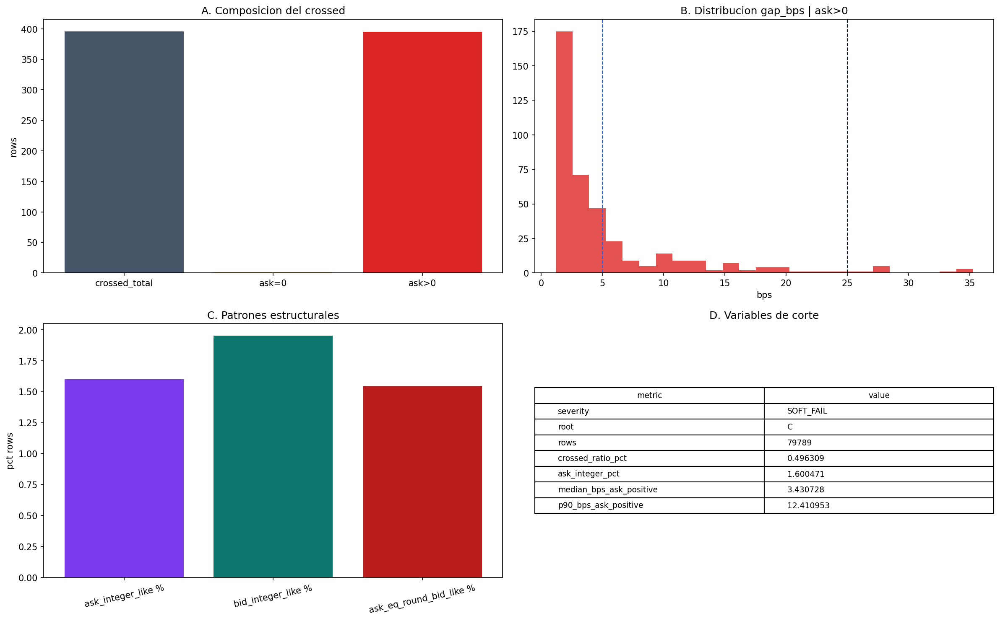

#### 04 Summary Card
Esta tarjeta responde a la pregunta de auditabilidad: cuales son exactamente las variables que sostienen la conclusion. Reune `severity`, `root`, `crossed_ratio_pct`, `ask_integer_pct`, `median_bps_ask_positive` y `p90_bps_ask_positive`. La decision que cambia es pasar de impresion visual a regla verificable. El error que evita es que dos inspectores lleguen a conclusiones distintas mirando la misma imagen sin una base numerica comun. Para gobernanza del proyecto, este panel es el que vuelve reproducible la decision para backtest, ML y auditoria.

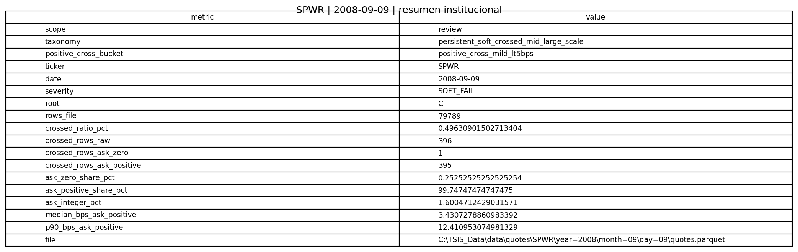

---

### 55. RRGB 2012-07-23

company_name: `Red Robin Gourmet Burgers Inc`
primary_exchange: `NASDAQ` (`XNAS`)
market_locale: `stocks/us`
scope: `review`
ticker: `RRGB`
date: `2012-07-23`
taxonomy: `persistent_soft_crossed_mid_large_scale`
positive_cross_bucket: `positive_cross_mild_lt5bps`
severity: `SOFT_FAIL`
root: `C`
rows: `12655`
crossed_ratio_pct: `0.300277`
crossed_rows_raw: `38`
crossed_rows_ask_zero: `5`
crossed_rows_ask_positive: `33`
ask_integer_pct: `0.640063`
median_bps_ask_positive: `3.349523`
p90_bps_ask_positive: `20.168067`
file: `C:\TSIS_Data\data\quotes\RRGB\year=2012\month=07\day=23\quotes.parquet`

#### Analisis Forense
La conclusion correcta del caso es que ya existe contradiccion economica real dentro del libro, pero aun no con fuerza suficiente para justificar exclusion dura sin contexto adicional. La taxonomy historica es `persistent_soft_crossed_mid_large_scale` y el regimen positivo dominante es `mild <5 bps`. Esto importa porque la taxonomy no solo clasifica: resume que tipo de anomalia se esta viendo y que clase de decision contractual puede defenderse despues. La taxonomy `persistent_soft_crossed_mid_large_scale` implica un problema repetido y distribuido, no un simple pinchazo local. Por eso empuja a `review`: ya hay dano real, aunque no necesariamente exclusion dura universal. El regimen `mild <5 bps` significa que existe contradiccion economica positiva, pero aun en una banda donde un uso prudente puede seguir siendo defendible si la persistencia y la estructura no agravan el caso. En terminos observables, el file tiene `crossed_ratio_pct=0.300277` con `crossed_rows_ask_positive=33` y `crossed_rows_ask_zero=5`. La severidad economica del crossed ask>0 se resume en `median_bps_ask_positive=3.349523` y `p90_bps_ask_positive=20.168067`. Estos dos numeros convierten una forma visual rara en una conclusion operativa sobre si el libro sigue representando o no un mercado negociable. La decision que cambia es pasar de libro sano a libro util solo bajo cautela. `review` significa: no usar como si fuera ejecucion limpia, conservar para analisis contextual y sensibilidad. El error que evita es tratar como normal un episodio que ya contiene contradiccion economica real y contaminar simulaciones de ejecucion o validaciones demasiado optimistas. El patron estructural muestra `ask_integer_pct=0.640063`. Este numero obliga a separar dos explicaciones rivales: contradiccion economica genuina del libro o mezcla con degeneracion estructural / integerizacion. La mayor parte del crossed vive en `ask>0`, de modo que el corazon del problema sigue siendo economico. La parte `ask=0`, si existe, acompana pero no explica por si sola la anomalia. Como `ask_integer_pct` es bajo, la hipotesis de simple degeneracion mecanica pierde fuerza. Eso endurece la interpretacion: el crossed se parece mas a contradiccion economica genuina y menos a artefacto. Existe ademas una imagen historica de certificacion asociada. Su papel es poner el episodio en un marco causal mas amplio: halt, explained, not strongly explained o patron conocido. La regla que protege al proyecto es esta: el contexto externo se usa para explicar por que aparece el episodio, no para absolverlo. El error que evita es degradar el criterio de calidad del libro porque exista una historia plausible alrededor del caso.

#### 00 Event Month Context
Esta imagen responde a la pregunta de persistencia temporal: estamos ante un accidente local o ante una fase mas amplia de inestabilidad. Arriba coloca el evento en la serie `daily` real del mes; abajo compara `crossed_ratio_pct` y `max_gap_bps_pos` del dia contra sus vecinos. La decision que cambia es el peso estructural que se le concede al caso. El error que evita es juzgar igual un shock aislado y una degradacion repetida del libro.

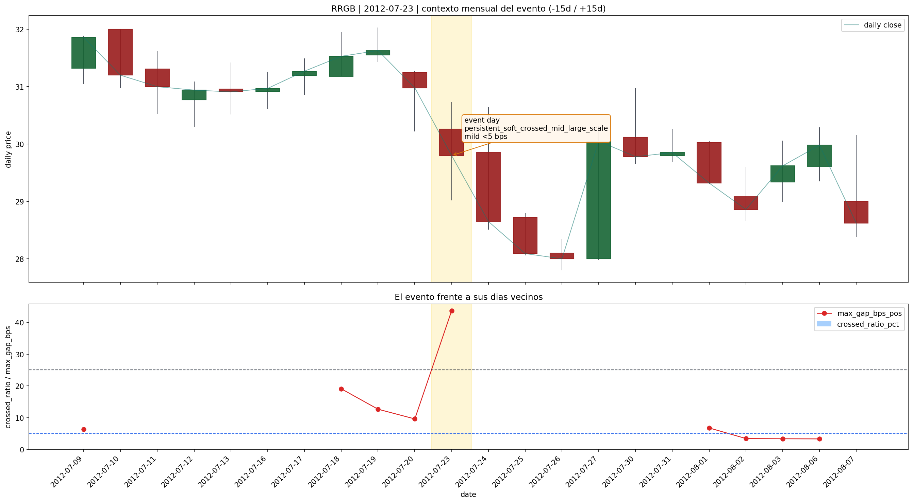

#### 00b Event Month Quotes Context
Esta imagen responde a la pregunta de recurrencia mensual dentro de `quotes`: el problema se concentra en el evento o reaparece en varias sesiones. Arriba concatena sesiones con datos disponibles; abajo resume cobertura diaria, `crossed_ratio_pct` y `max_gap_bps_pos`. La decision que cambia es si el caso debe leerse como episodio puntual o como sintoma de una fase repetida de libro degradado. El error que evita es extrapolar desde un unico dia a todo el mes sin evidencia.

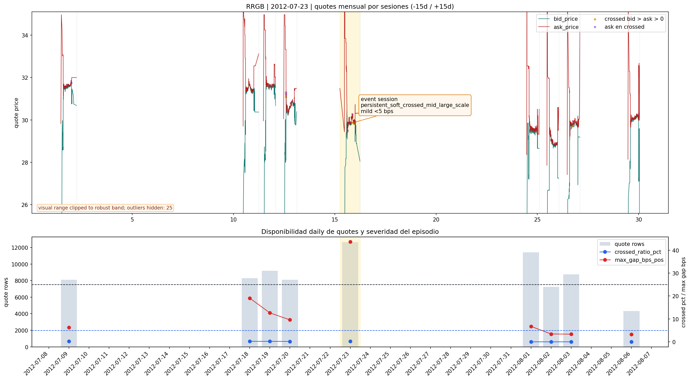

#### 01 Raw Window
Esta imagen responde a la primera pregunta decisiva del caso: el crossed observado es economicamente bastante fuerte para justificar un cambio de clase. Arriba ensena la geometria exacta del tramo conflictivo; abajo convierte esa geometria a bps y la enfrenta a los cortes `5 bps` y `25 bps`. El regimen dominante es `mild <5 bps`. La decision que cambia es pasar de anomalia interpretable a `review` o `bad`. El error que evita es decidir por apariencia visual sin medir el dano economico real del crossed. En terminos de pipeline, este panel decide si el problema afecta solo a la lectura forense o si invalida simulacion de ejecucion y microstructure features.

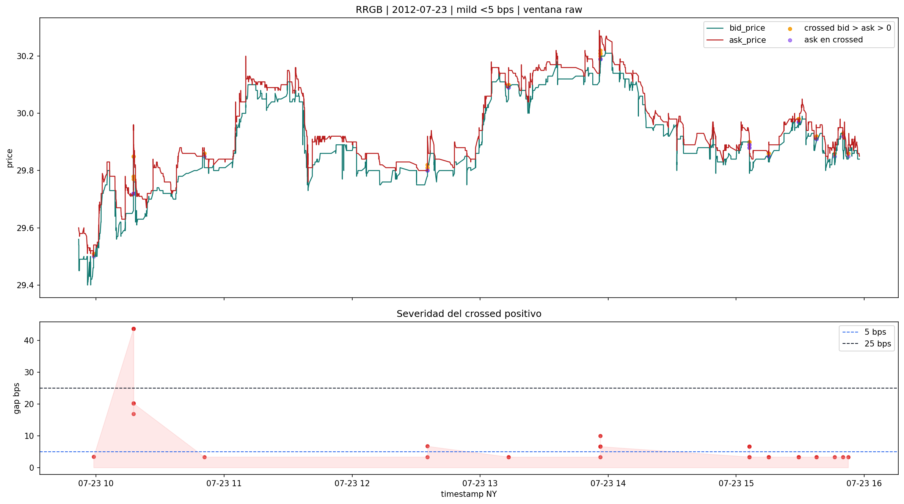

#### 02 Full Session Context
Esta imagen responde a la pregunta de extension intradiaria: el dano esta confinado a un bloque corto o contamina la sesion completa. Arriba se ve toda la sesion `04:00-20:00 NY`; abajo el `gap_bps` firmado. La decision que cambia es si el consumo debe penalizar solo un tramo o desechar el dia entero para uso operativo. El error que evita es tratar una cicatriz local como ruina total o, al reves, minimizar una degradacion distribuida a lo largo del dia. En ejecucion esto decide si la sesion puede seguir usandose con restricciones; en ML decide si las features intradiarias conservan significado economico.

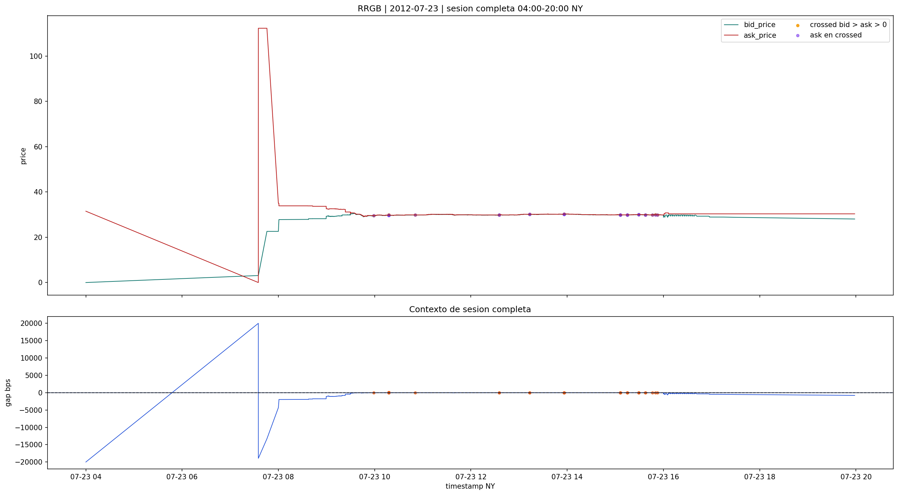

#### 03 Structure Diagnostics
Este panel responde a la pregunta de naturaleza del fallo: contradiccion economica genuina o mezcla con degeneracion estructural. Separa `ask=0` de `ask>0`, muestra la distribucion de `gap_bps` y resume patrones de integerizacion. La decision que cambia es como interpretar el dano: mercado localmente roto, artefacto de representacion o combinacion de ambos. El error que evita es sobrediagnosticar crossed reales cuando parte de la senal proviene de estructura degenerada del libro. Esta lectura afecta directamente a que el caso vaya a exclusion dura, a bandera contextual o a simple reconciliacion tecnica.

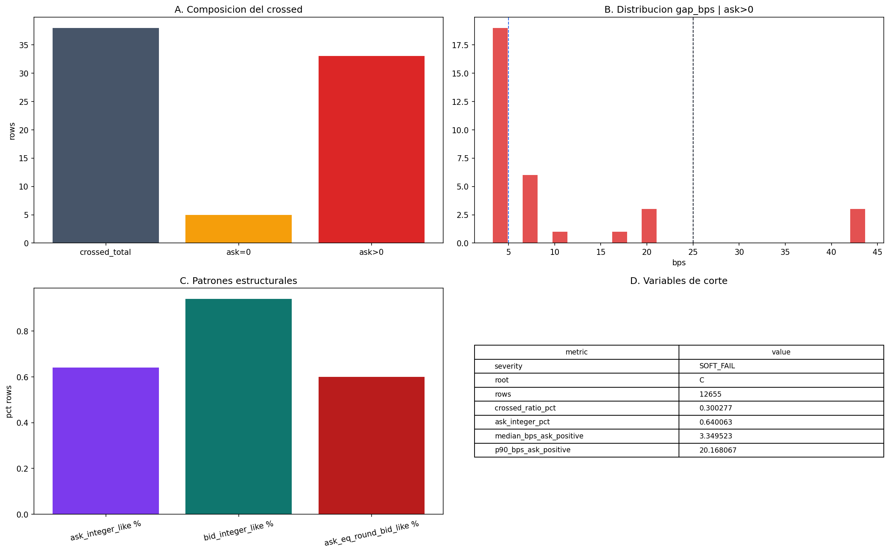

#### 04 Summary Card
Esta tarjeta responde a la pregunta de auditabilidad: cuales son exactamente las variables que sostienen la conclusion. Reune `severity`, `root`, `crossed_ratio_pct`, `ask_integer_pct`, `median_bps_ask_positive` y `p90_bps_ask_positive`. La decision que cambia es pasar de impresion visual a regla verificable. El error que evita es que dos inspectores lleguen a conclusiones distintas mirando la misma imagen sin una base numerica comun. Para gobernanza del proyecto, este panel es el que vuelve reproducible la decision para backtest, ML y auditoria.

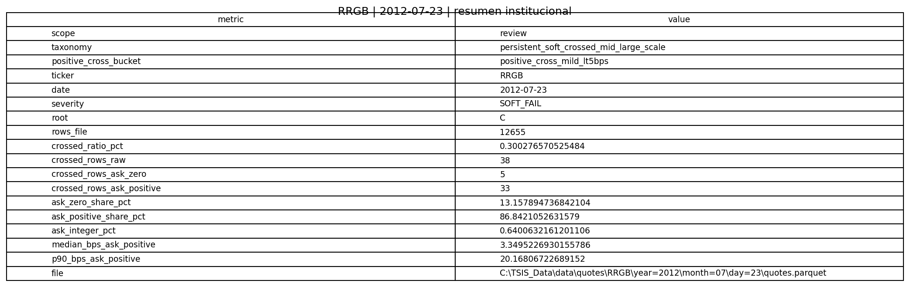

---

### 56. DRQ 2006-09-22

company_name: `Dril-Quip, Inc.`
primary_exchange: `NYSE` (`XNYS`)
market_locale: `stocks/us`
scope: `review`
ticker: `DRQ`
date: `2006-09-22`
taxonomy: `persistent_soft_crossed_mid_large_scale`
positive_cross_bucket: `positive_cross_mild_lt5bps`
severity: `SOFT_FAIL`
root: `D`
rows: `11484`
crossed_ratio_pct: `0.339603`
crossed_rows_raw: `39`
crossed_rows_ask_zero: `1`
crossed_rows_ask_positive: `38`
ask_integer_pct: `1.236503`
median_bps_ask_positive: `3.095019`
p90_bps_ask_positive: `5.666182`
file: `D:\quotes\DRQ\year=2006\month=09\day=22\quotes.parquet`

#### Analisis Forense
La conclusion correcta del caso es que ya existe contradiccion economica real dentro del libro, pero aun no con fuerza suficiente para justificar exclusion dura sin contexto adicional. La taxonomy historica es `persistent_soft_crossed_mid_large_scale` y el regimen positivo dominante es `mild <5 bps`. Esto importa porque la taxonomy no solo clasifica: resume que tipo de anomalia se esta viendo y que clase de decision contractual puede defenderse despues. La taxonomy `persistent_soft_crossed_mid_large_scale` implica un problema repetido y distribuido, no un simple pinchazo local. Por eso empuja a `review`: ya hay dano real, aunque no necesariamente exclusion dura universal. El regimen `mild <5 bps` significa que existe contradiccion economica positiva, pero aun en una banda donde un uso prudente puede seguir siendo defendible si la persistencia y la estructura no agravan el caso. En terminos observables, el file tiene `crossed_ratio_pct=0.339603` con `crossed_rows_ask_positive=38` y `crossed_rows_ask_zero=1`. La severidad economica del crossed ask>0 se resume en `median_bps_ask_positive=3.095019` y `p90_bps_ask_positive=5.666182`. Estos dos numeros convierten una forma visual rara en una conclusion operativa sobre si el libro sigue representando o no un mercado negociable. La decision que cambia es pasar de libro sano a libro util solo bajo cautela. `review` significa: no usar como si fuera ejecucion limpia, conservar para analisis contextual y sensibilidad. El error que evita es tratar como normal un episodio que ya contiene contradiccion economica real y contaminar simulaciones de ejecucion o validaciones demasiado optimistas. El patron estructural muestra `ask_integer_pct=1.236503`. Este numero obliga a separar dos explicaciones rivales: contradiccion economica genuina del libro o mezcla con degeneracion estructural / integerizacion. La mayor parte del crossed vive en `ask>0`, de modo que el corazon del problema sigue siendo economico. La parte `ask=0`, si existe, acompana pero no explica por si sola la anomalia. Como `ask_integer_pct` es bajo, la hipotesis de simple degeneracion mecanica pierde fuerza. Eso endurece la interpretacion: el crossed se parece mas a contradiccion economica genuina y menos a artefacto. En la capa de semantica de precio del evento aparecen `daily raw close=31.5550`, `quote mid raw=63.6850`, `quote mid split_normalized=31.8425`, `daily adjusted_proxy=31.5550`. La reconciliacion incluye `future_split_factor=2.0000`. La implicacion metodologica es crucial: una discrepancia entre `quotes`, `daily` y una plataforma externa no puede leerse automaticamente como fallo del dataset. Puede ser semantica de precio distinta. El error que evita esta capa es mezclar raw, split-normalized y adjusted dentro del mismo pipeline, rompiendo auditoria, benchmarking y labels. Para pipelines, esto empuja a conservar el caso fuera de ejecucion limpia, pero todavia puede mantenerse en investigacion contextual y en analisis de sensibilidad donde interese entender fronteras de tolerancia. Existe ademas una imagen historica de certificacion asociada. Su papel es poner el episodio en un marco causal mas amplio: halt, explained, not strongly explained o patron conocido. La regla que protege al proyecto es esta: el contexto externo se usa para explicar por que aparece el episodio, no para absolverlo. El error que evita es degradar el criterio de calidad del libro porque exista una historia plausible alrededor del caso.

#### 00 Event Month Context
Esta imagen responde a la pregunta de persistencia temporal: estamos ante un accidente local o ante una fase mas amplia de inestabilidad. Arriba coloca el evento en la serie `daily` real del mes; abajo compara `crossed_ratio_pct` y `max_gap_bps_pos` del dia contra sus vecinos. La decision que cambia es el peso estructural que se le concede al caso. El error que evita es juzgar igual un shock aislado y una degradacion repetida del libro.

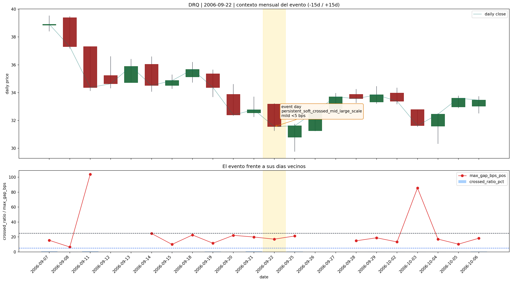

#### 00a Adjusted Proxy Contrast
Esta imagen responde a la pregunta de reconciliacion semantica: la discrepancia de precios viene de datos rotos o de vistas de precio distintas. Compara `daily raw`, `daily adjusted_proxy`, `quote mid raw` y `quote mid split_normalized`, y debajo ensena la cadena de dividendos y splits que produce la diferencia. La decision que cambia es si el inspector debe abrir una incidencia de calidad o cerrar el caso como diferencia legitima de semantica. El error que evita es mezclar series raw y adjusted como si fueran equivalentes. En pipelines reales, esto protege benchmarking, labels diarios y reconciliacion externa frente a falsas alarmas de precio.

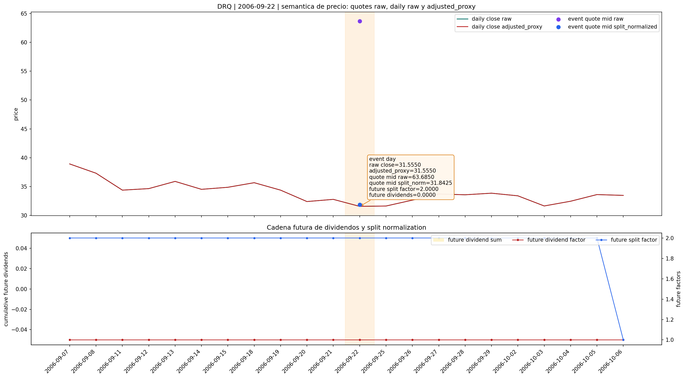

#### 00b Event Month Quotes Context
Esta imagen responde a la pregunta de recurrencia mensual dentro de `quotes`: el problema se concentra en el evento o reaparece en varias sesiones. Arriba concatena sesiones con datos disponibles; abajo resume cobertura diaria, `crossed_ratio_pct` y `max_gap_bps_pos`. La decision que cambia es si el caso debe leerse como episodio puntual o como sintoma de una fase repetida de libro degradado. El error que evita es extrapolar desde un unico dia a todo el mes sin evidencia.

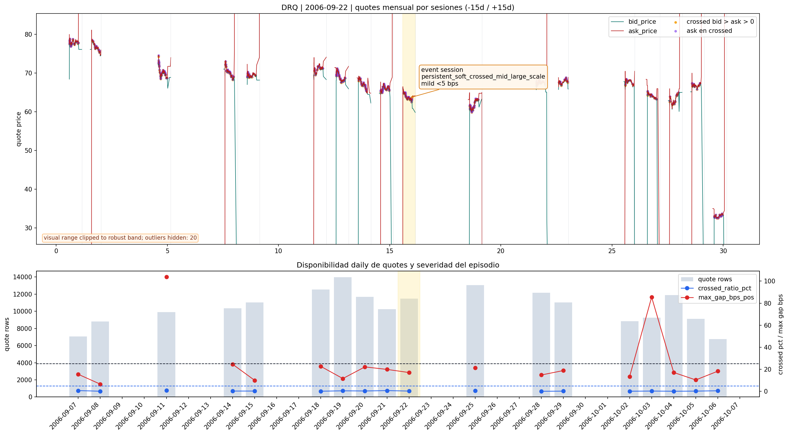

#### 01 Raw Window
Esta imagen responde a la primera pregunta decisiva del caso: el crossed observado es economicamente bastante fuerte para justificar un cambio de clase. Arriba ensena la geometria exacta del tramo conflictivo; abajo convierte esa geometria a bps y la enfrenta a los cortes `5 bps` y `25 bps`. El regimen dominante es `mild <5 bps`. La decision que cambia es pasar de anomalia interpretable a `review` o `bad`. El error que evita es decidir por apariencia visual sin medir el dano economico real del crossed. En terminos de pipeline, este panel decide si el problema afecta solo a la lectura forense o si invalida simulacion de ejecucion y microstructure features.

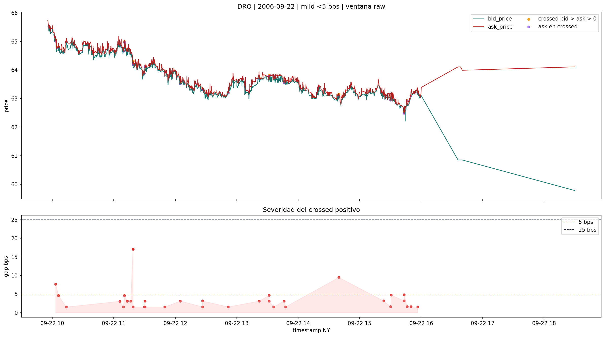

#### 02 Full Session Context
Esta imagen responde a la pregunta de extension intradiaria: el dano esta confinado a un bloque corto o contamina la sesion completa. Arriba se ve toda la sesion `04:00-20:00 NY`; abajo el `gap_bps` firmado. La decision que cambia es si el consumo debe penalizar solo un tramo o desechar el dia entero para uso operativo. El error que evita es tratar una cicatriz local como ruina total o, al reves, minimizar una degradacion distribuida a lo largo del dia. En ejecucion esto decide si la sesion puede seguir usandose con restricciones; en ML decide si las features intradiarias conservan significado economico.

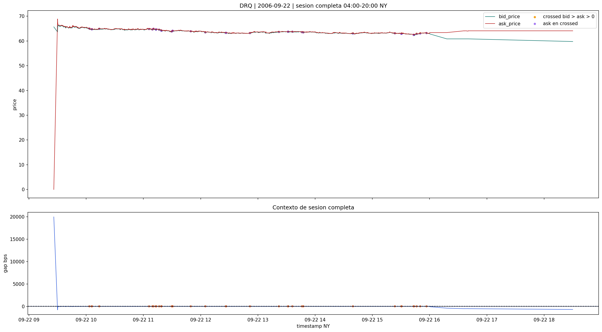

#### 03 Structure Diagnostics
Este panel responde a la pregunta de naturaleza del fallo: contradiccion economica genuina o mezcla con degeneracion estructural. Separa `ask=0` de `ask>0`, muestra la distribucion de `gap_bps` y resume patrones de integerizacion. La decision que cambia es como interpretar el dano: mercado localmente roto, artefacto de representacion o combinacion de ambos. El error que evita es sobrediagnosticar crossed reales cuando parte de la senal proviene de estructura degenerada del libro. Esta lectura afecta directamente a que el caso vaya a exclusion dura, a bandera contextual o a simple reconciliacion tecnica.

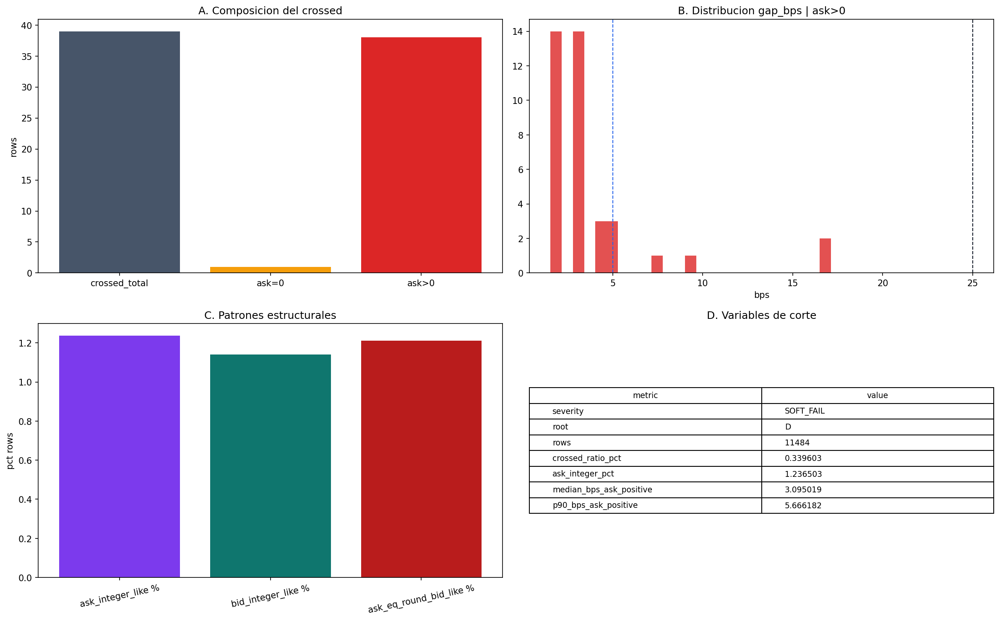

#### 04 Summary Card
Esta tarjeta responde a la pregunta de auditabilidad: cuales son exactamente las variables que sostienen la conclusion. Reune `severity`, `root`, `crossed_ratio_pct`, `ask_integer_pct`, `median_bps_ask_positive` y `p90_bps_ask_positive`. La decision que cambia es pasar de impresion visual a regla verificable. El error que evita es que dos inspectores lleguen a conclusiones distintas mirando la misma imagen sin una base numerica comun. Para gobernanza del proyecto, este panel es el que vuelve reproducible la decision para backtest, ML y auditoria.

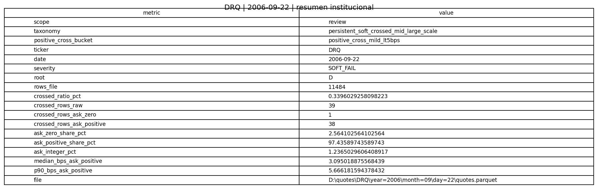

---

### 57. FRC 2012-12-11

company_name: `First Republic Bank`
primary_exchange: `NYSE` (`XNYS`)
market_locale: `stocks/us`
scope: `review`
ticker: `FRC`
date: `2012-12-11`
taxonomy: `persistent_soft_crossed_mid_large_scale`
positive_cross_bucket: `positive_cross_mild_lt5bps`
severity: `SOFT_FAIL`
root: `D`
rows: `11261`
crossed_ratio_pct: `0.523932`
crossed_rows_raw: `59`
crossed_rows_ask_zero: `46`
crossed_rows_ask_positive: `13`
ask_integer_pct: `2.379895`
median_bps_ask_positive: `3.029844`
p90_bps_ask_positive: `3.053901`
file: `D:\quotes\FRC\year=2012\month=12\day=11\quotes.parquet`

#### Analisis Forense
La conclusion correcta del caso es que ya existe contradiccion economica real dentro del libro, pero aun no con fuerza suficiente para justificar exclusion dura sin contexto adicional. La taxonomy historica es `persistent_soft_crossed_mid_large_scale` y el regimen positivo dominante es `mild <5 bps`. Esto importa porque la taxonomy no solo clasifica: resume que tipo de anomalia se esta viendo y que clase de decision contractual puede defenderse despues. La taxonomy `persistent_soft_crossed_mid_large_scale` implica un problema repetido y distribuido, no un simple pinchazo local. Por eso empuja a `review`: ya hay dano real, aunque no necesariamente exclusion dura universal. El regimen `mild <5 bps` significa que existe contradiccion economica positiva, pero aun en una banda donde un uso prudente puede seguir siendo defendible si la persistencia y la estructura no agravan el caso. En terminos observables, el file tiene `crossed_ratio_pct=0.523932` con `crossed_rows_ask_positive=13` y `crossed_rows_ask_zero=46`. La severidad economica del crossed ask>0 se resume en `median_bps_ask_positive=3.029844` y `p90_bps_ask_positive=3.053901`. Estos dos numeros convierten una forma visual rara en una conclusion operativa sobre si el libro sigue representando o no un mercado negociable. La decision que cambia es pasar de libro sano a libro util solo bajo cautela. `review` significa: no usar como si fuera ejecucion limpia, conservar para analisis contextual y sensibilidad. El error que evita es tratar como normal un episodio que ya contiene contradiccion economica real y contaminar simulaciones de ejecucion o validaciones demasiado optimistas. El patron estructural muestra `ask_integer_pct=2.379895`. Este numero obliga a separar dos explicaciones rivales: contradiccion economica genuina del libro o mezcla con degeneracion estructural / integerizacion. La mayor parte del crossed vive en `ask=0`, pero existe una cola `ask>0` que impide absolver el caso como simple glitch. La lectura correcta es mixta: dano estructural dominante con residuo economico que aun puede justificar bandera o exclusion. Como `ask_integer_pct` es bajo, la hipotesis de simple degeneracion mecanica pierde fuerza. Eso endurece la interpretacion: el crossed se parece mas a contradiccion economica genuina y menos a artefacto. En la capa de semantica de precio del evento aparecen `daily raw close=32.7000`, `quote mid raw=32.8950`, `quote mid split_normalized=32.8950`, `daily adjusted_proxy=26.3179`. Ademas hay `post_event_dividend_sum=7.3000`. La implicacion metodologica es crucial: una discrepancia entre `quotes`, `daily` y una plataforma externa no puede leerse automaticamente como fallo del dataset. Puede ser semantica de precio distinta. El error que evita esta capa es mezclar raw, split-normalized y adjusted dentro del mismo pipeline, rompiendo auditoria, benchmarking y labels. Para pipelines, esto empuja a conservar el caso fuera de ejecucion limpia, pero todavia puede mantenerse en investigacion contextual y en analisis de sensibilidad donde interese entender fronteras de tolerancia. Existe ademas una imagen historica de certificacion asociada. Su papel es poner el episodio en un marco causal mas amplio: halt, explained, not strongly explained o patron conocido. La regla que protege al proyecto es esta: el contexto externo se usa para explicar por que aparece el episodio, no para absolverlo. El error que evita es degradar el criterio de calidad del libro porque exista una historia plausible alrededor del caso.

#### 00 Event Month Context
Esta imagen responde a la pregunta de persistencia temporal: estamos ante un accidente local o ante una fase mas amplia de inestabilidad. Arriba coloca el evento en la serie `daily` real del mes; abajo compara `crossed_ratio_pct` y `max_gap_bps_pos` del dia contra sus vecinos. La decision que cambia es el peso estructural que se le concede al caso. El error que evita es juzgar igual un shock aislado y una degradacion repetida del libro.

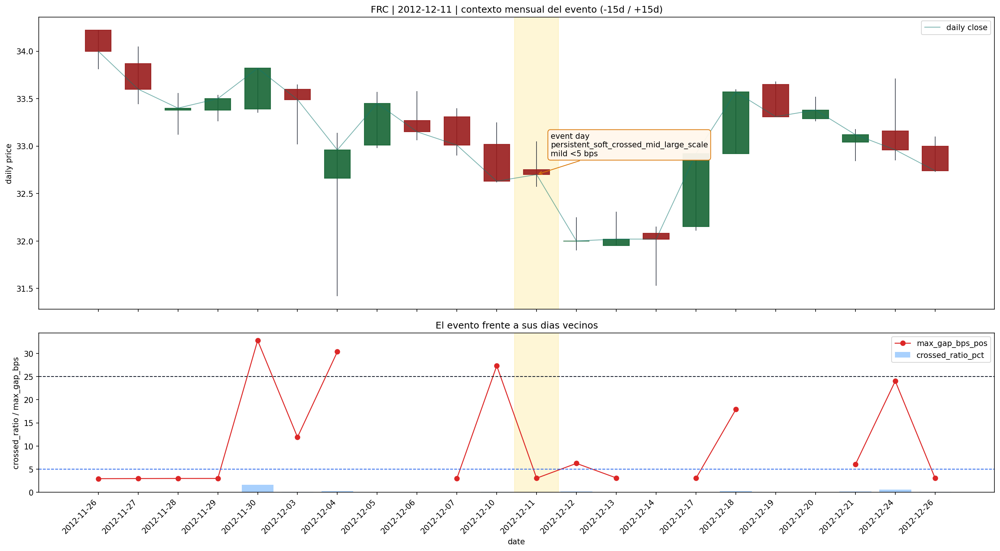

#### 00a Adjusted Proxy Contrast
Esta imagen responde a la pregunta de reconciliacion semantica: la discrepancia de precios viene de datos rotos o de vistas de precio distintas. Compara `daily raw`, `daily adjusted_proxy`, `quote mid raw` y `quote mid split_normalized`, y debajo ensena la cadena de dividendos y splits que produce la diferencia. La decision que cambia es si el inspector debe abrir una incidencia de calidad o cerrar el caso como diferencia legitima de semantica. El error que evita es mezclar series raw y adjusted como si fueran equivalentes. En pipelines reales, esto protege benchmarking, labels diarios y reconciliacion externa frente a falsas alarmas de precio.

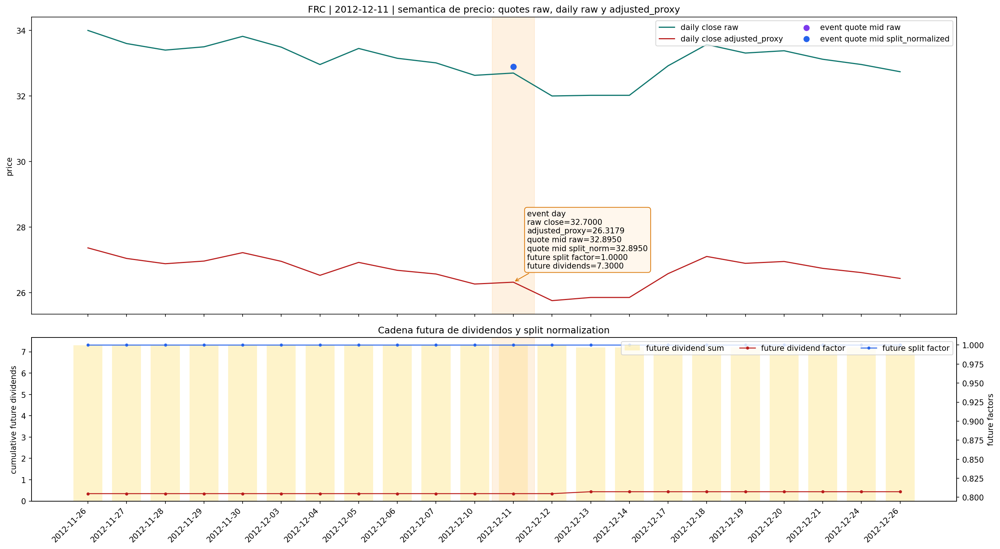

#### 00b Event Month Quotes Context
Esta imagen responde a la pregunta de recurrencia mensual dentro de `quotes`: el problema se concentra en el evento o reaparece en varias sesiones. Arriba concatena sesiones con datos disponibles; abajo resume cobertura diaria, `crossed_ratio_pct` y `max_gap_bps_pos`. La decision que cambia es si el caso debe leerse como episodio puntual o como sintoma de una fase repetida de libro degradado. El error que evita es extrapolar desde un unico dia a todo el mes sin evidencia.

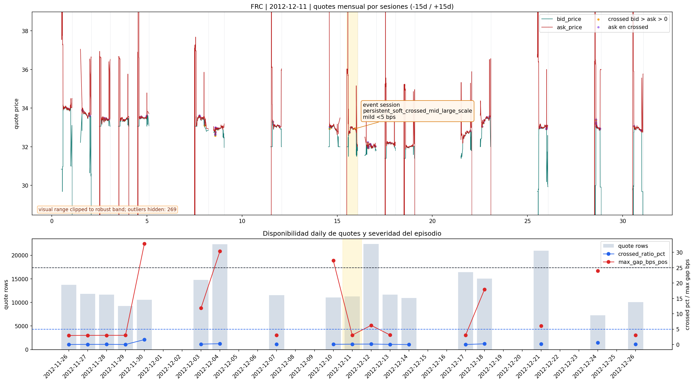

#### 01 Raw Window
Esta imagen responde a la primera pregunta decisiva del caso: el crossed observado es economicamente bastante fuerte para justificar un cambio de clase. Arriba ensena la geometria exacta del tramo conflictivo; abajo convierte esa geometria a bps y la enfrenta a los cortes `5 bps` y `25 bps`. El regimen dominante es `mild <5 bps`. La decision que cambia es pasar de anomalia interpretable a `review` o `bad`. El error que evita es decidir por apariencia visual sin medir el dano economico real del crossed. En terminos de pipeline, este panel decide si el problema afecta solo a la lectura forense o si invalida simulacion de ejecucion y microstructure features.

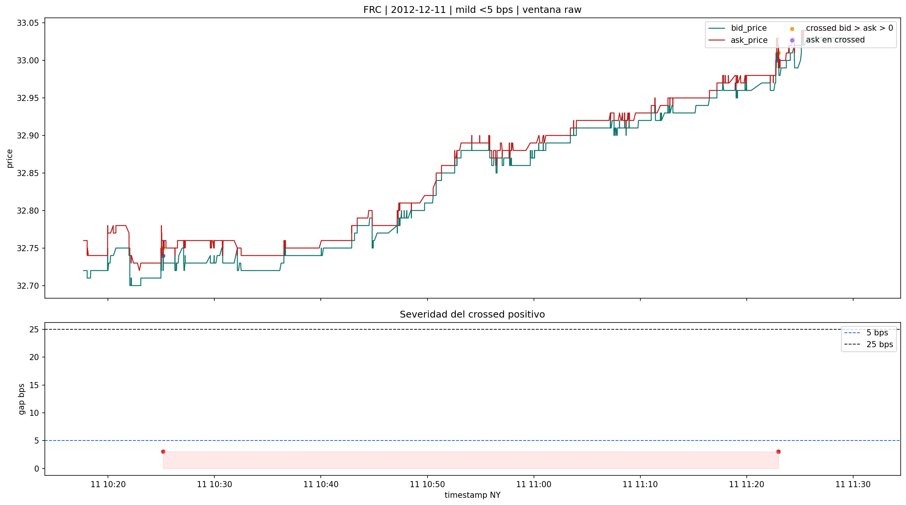

#### 02 Full Session Context
Esta imagen responde a la pregunta de extension intradiaria: el dano esta confinado a un bloque corto o contamina la sesion completa. Arriba se ve toda la sesion `04:00-20:00 NY`; abajo el `gap_bps` firmado. La decision que cambia es si el consumo debe penalizar solo un tramo o desechar el dia entero para uso operativo. El error que evita es tratar una cicatriz local como ruina total o, al reves, minimizar una degradacion distribuida a lo largo del dia. En ejecucion esto decide si la sesion puede seguir usandose con restricciones; en ML decide si las features intradiarias conservan significado economico.

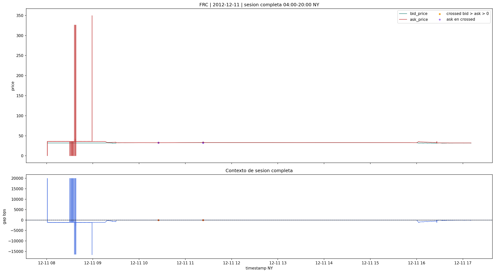

#### 03 Structure Diagnostics
Este panel responde a la pregunta de naturaleza del fallo: contradiccion economica genuina o mezcla con degeneracion estructural. Separa `ask=0` de `ask>0`, muestra la distribucion de `gap_bps` y resume patrones de integerizacion. La decision que cambia es como interpretar el dano: mercado localmente roto, artefacto de representacion o combinacion de ambos. El error que evita es sobrediagnosticar crossed reales cuando parte de la senal proviene de estructura degenerada del libro. Esta lectura afecta directamente a que el caso vaya a exclusion dura, a bandera contextual o a simple reconciliacion tecnica.

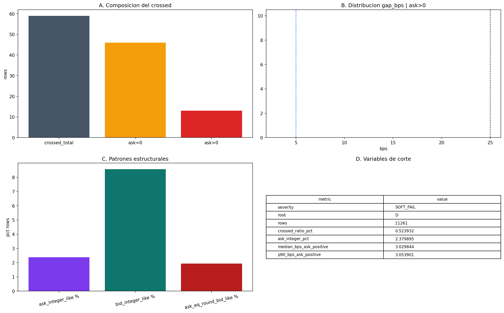

#### 04 Summary Card
Esta tarjeta responde a la pregunta de auditabilidad: cuales son exactamente las variables que sostienen la conclusion. Reune `severity`, `root`, `crossed_ratio_pct`, `ask_integer_pct`, `median_bps_ask_positive` y `p90_bps_ask_positive`. La decision que cambia es pasar de impresion visual a regla verificable. El error que evita es que dos inspectores lleguen a conclusiones distintas mirando la misma imagen sin una base numerica comun. Para gobernanza del proyecto, este panel es el que vuelve reproducible la decision para backtest, ML y auditoria.

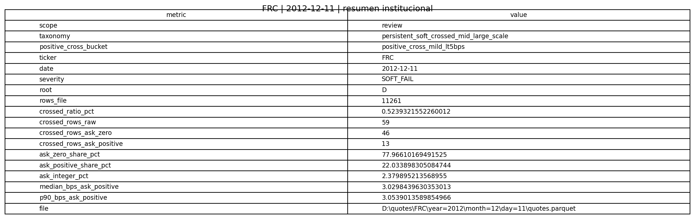

---

### 58. ADTN 2012-02-24

company_name: `Adtran Inc`
primary_exchange: `NASDAQ` (`XNAS`)
market_locale: `stocks/us`
scope: `review`
ticker: `ADTN`
date: `2012-02-24`
taxonomy: `persistent_soft_crossed_mid_large_scale`
positive_cross_bucket: `positive_cross_mild_lt5bps`
severity: `SOFT_FAIL`
root: `D`
rows: `18124`
crossed_ratio_pct: `0.496579`
crossed_rows_raw: `90`
crossed_rows_ask_zero: `1`
crossed_rows_ask_positive: `89`
ask_integer_pct: `0.502097`
median_bps_ask_positive: `2.661344`
p90_bps_ask_positive: `5.263158`
file: `D:\quotes\ADTN\year=2012\month=02\day=24\quotes.parquet`

#### Analisis Forense
La conclusion correcta del caso es que ya existe contradiccion economica real dentro del libro, pero aun no con fuerza suficiente para justificar exclusion dura sin contexto adicional. La taxonomy historica es `persistent_soft_crossed_mid_large_scale` y el regimen positivo dominante es `mild <5 bps`. Esto importa porque la taxonomy no solo clasifica: resume que tipo de anomalia se esta viendo y que clase de decision contractual puede defenderse despues. La taxonomy `persistent_soft_crossed_mid_large_scale` implica un problema repetido y distribuido, no un simple pinchazo local. Por eso empuja a `review`: ya hay dano real, aunque no necesariamente exclusion dura universal. El regimen `mild <5 bps` significa que existe contradiccion economica positiva, pero aun en una banda donde un uso prudente puede seguir siendo defendible si la persistencia y la estructura no agravan el caso. En terminos observables, el file tiene `crossed_ratio_pct=0.496579` con `crossed_rows_ask_positive=89` y `crossed_rows_ask_zero=1`. La severidad economica del crossed ask>0 se resume en `median_bps_ask_positive=2.661344` y `p90_bps_ask_positive=5.263158`. Estos dos numeros convierten una forma visual rara en una conclusion operativa sobre si el libro sigue representando o no un mercado negociable. La decision que cambia es pasar de libro sano a libro util solo bajo cautela. `review` significa: no usar como si fuera ejecucion limpia, conservar para analisis contextual y sensibilidad. El error que evita es tratar como normal un episodio que ya contiene contradiccion economica real y contaminar simulaciones de ejecucion o validaciones demasiado optimistas. El patron estructural muestra `ask_integer_pct=0.502097`. Este numero obliga a separar dos explicaciones rivales: contradiccion economica genuina del libro o mezcla con degeneracion estructural / integerizacion. La mayor parte del crossed vive en `ask>0`, de modo que el corazon del problema sigue siendo economico. La parte `ask=0`, si existe, acompana pero no explica por si sola la anomalia. Como `ask_integer_pct` es bajo, la hipotesis de simple degeneracion mecanica pierde fuerza. Eso endurece la interpretacion: el crossed se parece mas a contradiccion economica genuina y menos a artefacto. En la capa de semantica de precio del evento aparecen `daily raw close=37.6100`, `quote mid raw=37.5850`, `quote mid split_normalized=37.5850`, `daily adjusted_proxy=36.2797`. Ademas hay `post_event_dividend_sum=0.4500`. La implicacion metodologica es crucial: una discrepancia entre `quotes`, `daily` y una plataforma externa no puede leerse automaticamente como fallo del dataset. Puede ser semantica de precio distinta. El error que evita esta capa es mezclar raw, split-normalized y adjusted dentro del mismo pipeline, rompiendo auditoria, benchmarking y labels. Para pipelines, esto empuja a conservar el caso fuera de ejecucion limpia, pero todavia puede mantenerse en investigacion contextual y en analisis de sensibilidad donde interese entender fronteras de tolerancia. Existe ademas una imagen historica de certificacion asociada. Su papel es poner el episodio en un marco causal mas amplio: halt, explained, not strongly explained o patron conocido. La regla que protege al proyecto es esta: el contexto externo se usa para explicar por que aparece el episodio, no para absolverlo. El error que evita es degradar el criterio de calidad del libro porque exista una historia plausible alrededor del caso.

#### 00 Event Month Context
Esta imagen responde a la pregunta de persistencia temporal: estamos ante un accidente local o ante una fase mas amplia de inestabilidad. Arriba coloca el evento en la serie `daily` real del mes; abajo compara `crossed_ratio_pct` y `max_gap_bps_pos` del dia contra sus vecinos. La decision que cambia es el peso estructural que se le concede al caso. El error que evita es juzgar igual un shock aislado y una degradacion repetida del libro.

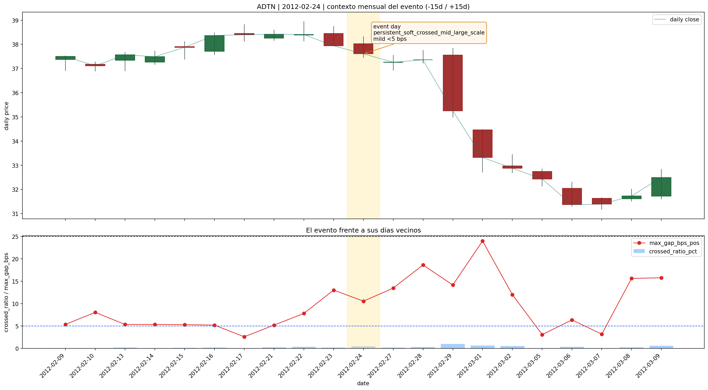

#### 00a Adjusted Proxy Contrast
Esta imagen responde a la pregunta de reconciliacion semantica: la discrepancia de precios viene de datos rotos o de vistas de precio distintas. Compara `daily raw`, `daily adjusted_proxy`, `quote mid raw` y `quote mid split_normalized`, y debajo ensena la cadena de dividendos y splits que produce la diferencia. La decision que cambia es si el inspector debe abrir una incidencia de calidad o cerrar el caso como diferencia legitima de semantica. El error que evita es mezclar series raw y adjusted como si fueran equivalentes. En pipelines reales, esto protege benchmarking, labels diarios y reconciliacion externa frente a falsas alarmas de precio.

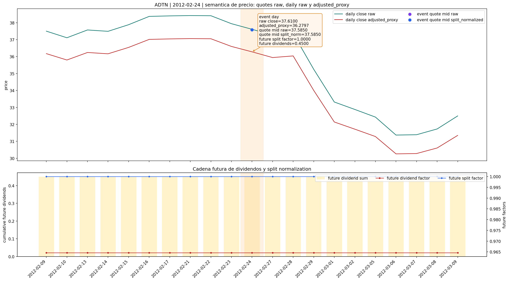

#### 00b Event Month Quotes Context
Esta imagen responde a la pregunta de recurrencia mensual dentro de `quotes`: el problema se concentra en el evento o reaparece en varias sesiones. Arriba concatena sesiones con datos disponibles; abajo resume cobertura diaria, `crossed_ratio_pct` y `max_gap_bps_pos`. La decision que cambia es si el caso debe leerse como episodio puntual o como sintoma de una fase repetida de libro degradado. El error que evita es extrapolar desde un unico dia a todo el mes sin evidencia.

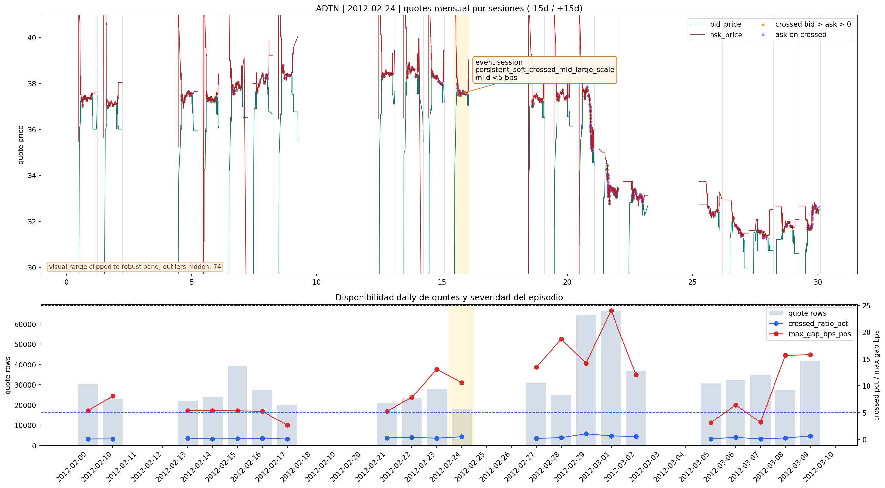

#### 01 Raw Window
Esta imagen responde a la primera pregunta decisiva del caso: el crossed observado es economicamente bastante fuerte para justificar un cambio de clase. Arriba ensena la geometria exacta del tramo conflictivo; abajo convierte esa geometria a bps y la enfrenta a los cortes `5 bps` y `25 bps`. El regimen dominante es `mild <5 bps`. La decision que cambia es pasar de anomalia interpretable a `review` o `bad`. El error que evita es decidir por apariencia visual sin medir el dano economico real del crossed. En terminos de pipeline, este panel decide si el problema afecta solo a la lectura forense o si invalida simulacion de ejecucion y microstructure features.

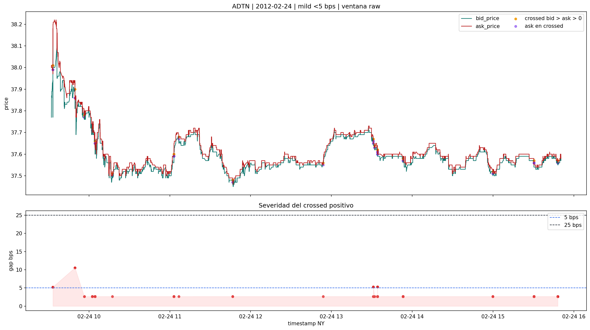

#### 02 Full Session Context
Esta imagen responde a la pregunta de extension intradiaria: el dano esta confinado a un bloque corto o contamina la sesion completa. Arriba se ve toda la sesion `04:00-20:00 NY`; abajo el `gap_bps` firmado. La decision que cambia es si el consumo debe penalizar solo un tramo o desechar el dia entero para uso operativo. El error que evita es tratar una cicatriz local como ruina total o, al reves, minimizar una degradacion distribuida a lo largo del dia. En ejecucion esto decide si la sesion puede seguir usandose con restricciones; en ML decide si las features intradiarias conservan significado economico.

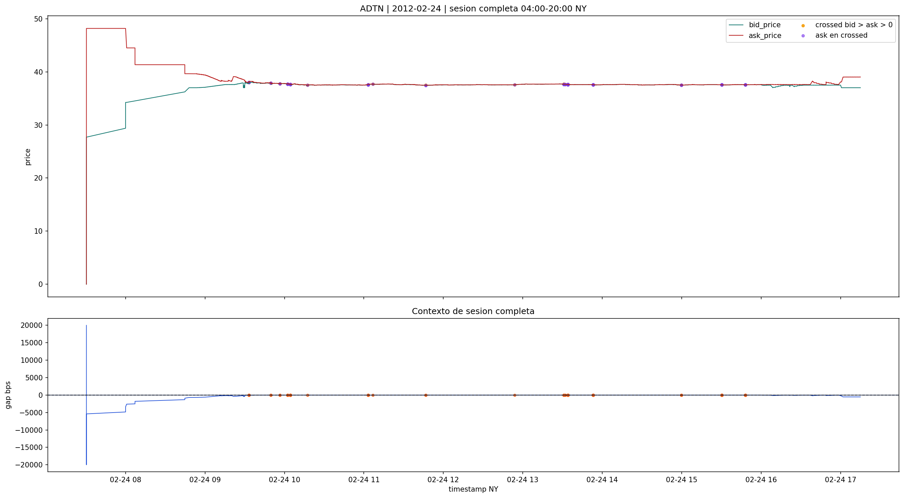

#### 03 Structure Diagnostics
Este panel responde a la pregunta de naturaleza del fallo: contradiccion economica genuina o mezcla con degeneracion estructural. Separa `ask=0` de `ask>0`, muestra la distribucion de `gap_bps` y resume patrones de integerizacion. La decision que cambia es como interpretar el dano: mercado localmente roto, artefacto de representacion o combinacion de ambos. El error que evita es sobrediagnosticar crossed reales cuando parte de la senal proviene de estructura degenerada del libro. Esta lectura afecta directamente a que el caso vaya a exclusion dura, a bandera contextual o a simple reconciliacion tecnica.

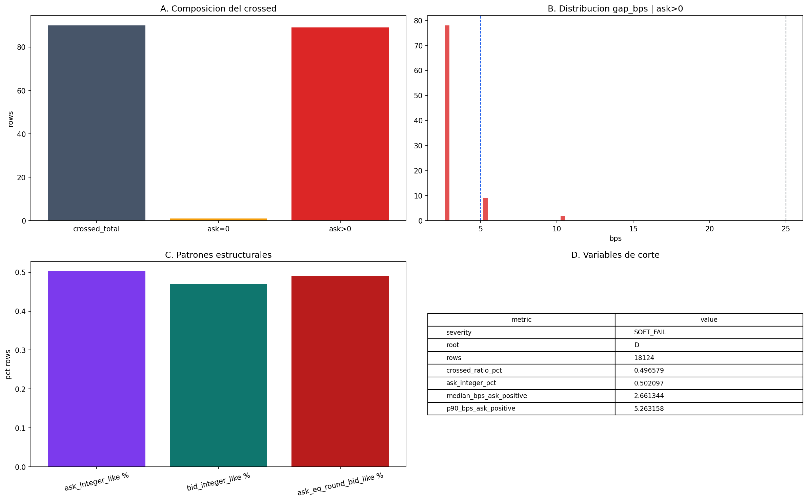

#### 04 Summary Card
Esta tarjeta responde a la pregunta de auditabilidad: cuales son exactamente las variables que sostienen la conclusion. Reune `severity`, `root`, `crossed_ratio_pct`, `ask_integer_pct`, `median_bps_ask_positive` y `p90_bps_ask_positive`. La decision que cambia es pasar de impresion visual a regla verificable. El error que evita es que dos inspectores lleguen a conclusiones distintas mirando la misma imagen sin una base numerica comun. Para gobernanza del proyecto, este panel es el que vuelve reproducible la decision para backtest, ML y auditoria.

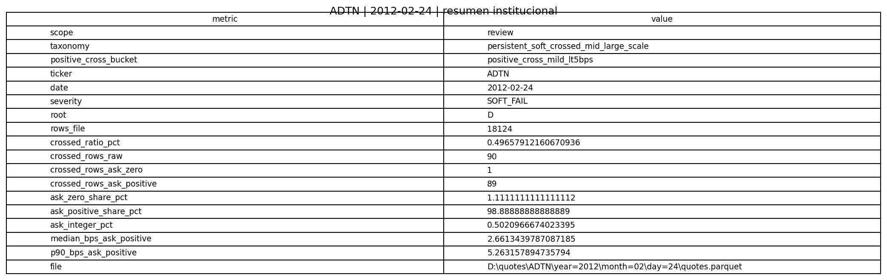

---

### 59. APOL 2007-10-25

company_name: `Apollo Education Group Inc Class A`
primary_exchange: `NASDAQ` (`XNAS`)
market_locale: `stocks/us`
scope: `review`
ticker: `APOL`
date: `2007-10-25`
taxonomy: `persistent_soft_crossed_mid_large_scale`
positive_cross_bucket: `positive_cross_mild_lt5bps`
severity: `SOFT_FAIL`
root: `D`
rows: `53281`
crossed_ratio_pct: `0.489856`
crossed_rows_raw: `261`
crossed_rows_ask_zero: `1`
crossed_rows_ask_positive: `260`
ask_integer_pct: `3.736792`
median_bps_ask_positive: `2.606882`
p90_bps_ask_positive: `12.052226`
file: `D:\quotes\APOL\year=2007\month=10\day=25\quotes.parquet`

#### Analisis Forense
La conclusion correcta del caso es que ya existe contradiccion economica real dentro del libro, pero aun no con fuerza suficiente para justificar exclusion dura sin contexto adicional. La taxonomy historica es `persistent_soft_crossed_mid_large_scale` y el regimen positivo dominante es `mild <5 bps`. Esto importa porque la taxonomy no solo clasifica: resume que tipo de anomalia se esta viendo y que clase de decision contractual puede defenderse despues. La taxonomy `persistent_soft_crossed_mid_large_scale` implica un problema repetido y distribuido, no un simple pinchazo local. Por eso empuja a `review`: ya hay dano real, aunque no necesariamente exclusion dura universal. El regimen `mild <5 bps` significa que existe contradiccion economica positiva, pero aun en una banda donde un uso prudente puede seguir siendo defendible si la persistencia y la estructura no agravan el caso. En terminos observables, el file tiene `crossed_ratio_pct=0.489856` con `crossed_rows_ask_positive=260` y `crossed_rows_ask_zero=1`. La severidad economica del crossed ask>0 se resume en `median_bps_ask_positive=2.606882` y `p90_bps_ask_positive=12.052226`. Estos dos numeros convierten una forma visual rara en una conclusion operativa sobre si el libro sigue representando o no un mercado negociable. La decision que cambia es pasar de libro sano a libro util solo bajo cautela. `review` significa: no usar como si fuera ejecucion limpia, conservar para analisis contextual y sensibilidad. El error que evita es tratar como normal un episodio que ya contiene contradiccion economica real y contaminar simulaciones de ejecucion o validaciones demasiado optimistas. El patron estructural muestra `ask_integer_pct=3.736792`. Este numero obliga a separar dos explicaciones rivales: contradiccion economica genuina del libro o mezcla con degeneracion estructural / integerizacion. La mayor parte del crossed vive en `ask>0`, de modo que el corazon del problema sigue siendo economico. La parte `ask=0`, si existe, acompana pero no explica por si sola la anomalia. Como `ask_integer_pct` es bajo, la hipotesis de simple degeneracion mecanica pierde fuerza. Eso endurece la interpretacion: el crossed se parece mas a contradiccion economica genuina y menos a artefacto. Existe ademas una imagen historica de certificacion asociada. Su papel es poner el episodio en un marco causal mas amplio: halt, explained, not strongly explained o patron conocido. La regla que protege al proyecto es esta: el contexto externo se usa para explicar por que aparece el episodio, no para absolverlo. El error que evita es degradar el criterio de calidad del libro porque exista una historia plausible alrededor del caso.

#### 00 Event Month Context
Esta imagen responde a la pregunta de persistencia temporal: estamos ante un accidente local o ante una fase mas amplia de inestabilidad. Arriba coloca el evento en la serie `daily` real del mes; abajo compara `crossed_ratio_pct` y `max_gap_bps_pos` del dia contra sus vecinos. La decision que cambia es el peso estructural que se le concede al caso. El error que evita es juzgar igual un shock aislado y una degradacion repetida del libro.

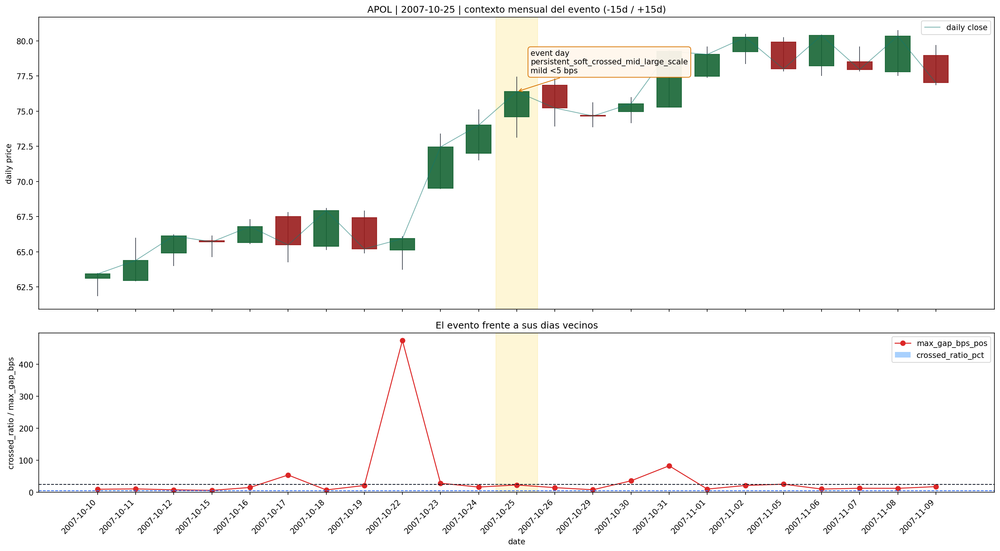

#### 00b Event Month Quotes Context
Esta imagen responde a la pregunta de recurrencia mensual dentro de `quotes`: el problema se concentra en el evento o reaparece en varias sesiones. Arriba concatena sesiones con datos disponibles; abajo resume cobertura diaria, `crossed_ratio_pct` y `max_gap_bps_pos`. La decision que cambia es si el caso debe leerse como episodio puntual o como sintoma de una fase repetida de libro degradado. El error que evita es extrapolar desde un unico dia a todo el mes sin evidencia.

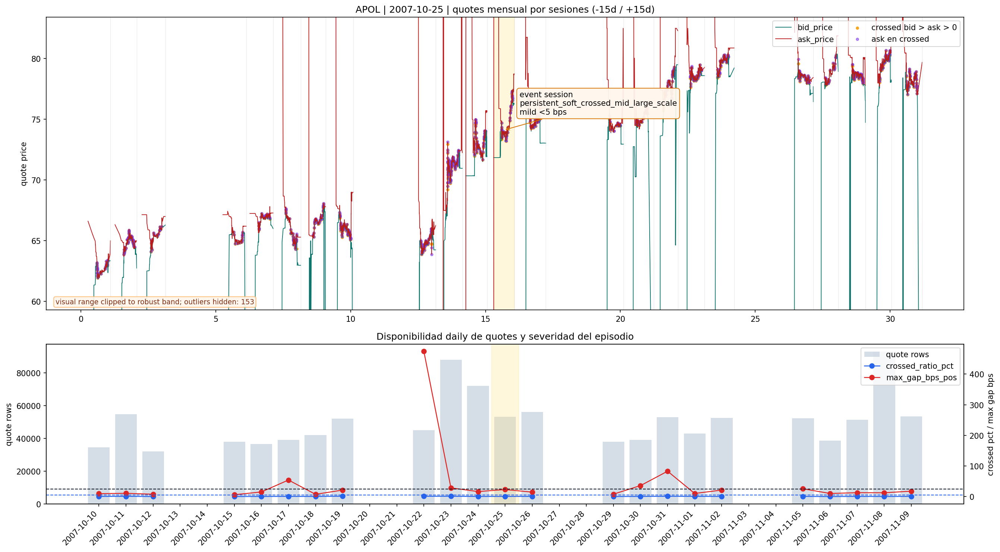

#### 01 Raw Window
Esta imagen responde a la primera pregunta decisiva del caso: el crossed observado es economicamente bastante fuerte para justificar un cambio de clase. Arriba ensena la geometria exacta del tramo conflictivo; abajo convierte esa geometria a bps y la enfrenta a los cortes `5 bps` y `25 bps`. El regimen dominante es `mild <5 bps`. La decision que cambia es pasar de anomalia interpretable a `review` o `bad`. El error que evita es decidir por apariencia visual sin medir el dano economico real del crossed. En terminos de pipeline, este panel decide si el problema afecta solo a la lectura forense o si invalida simulacion de ejecucion y microstructure features.

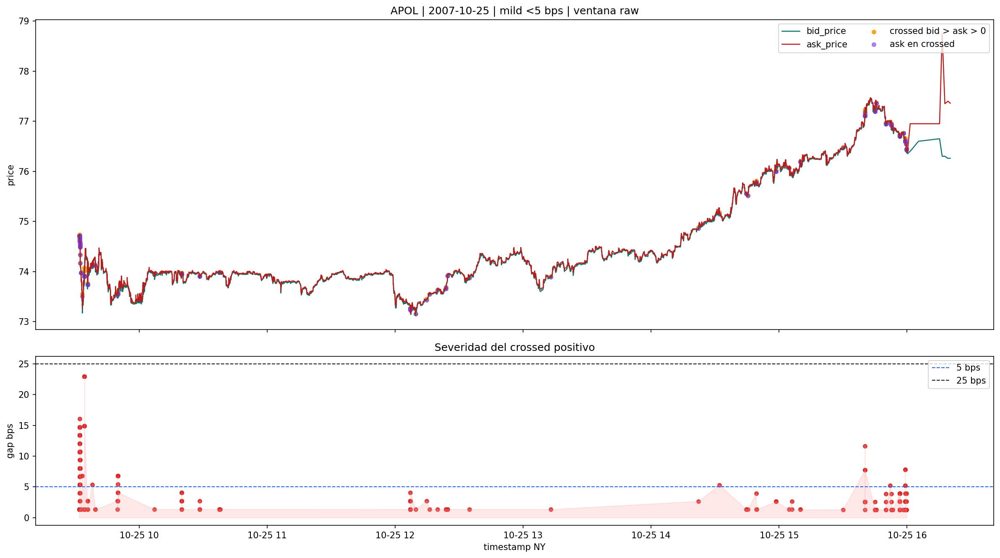

#### 02 Full Session Context
Esta imagen responde a la pregunta de extension intradiaria: el dano esta confinado a un bloque corto o contamina la sesion completa. Arriba se ve toda la sesion `04:00-20:00 NY`; abajo el `gap_bps` firmado. La decision que cambia es si el consumo debe penalizar solo un tramo o desechar el dia entero para uso operativo. El error que evita es tratar una cicatriz local como ruina total o, al reves, minimizar una degradacion distribuida a lo largo del dia. En ejecucion esto decide si la sesion puede seguir usandose con restricciones; en ML decide si las features intradiarias conservan significado economico.

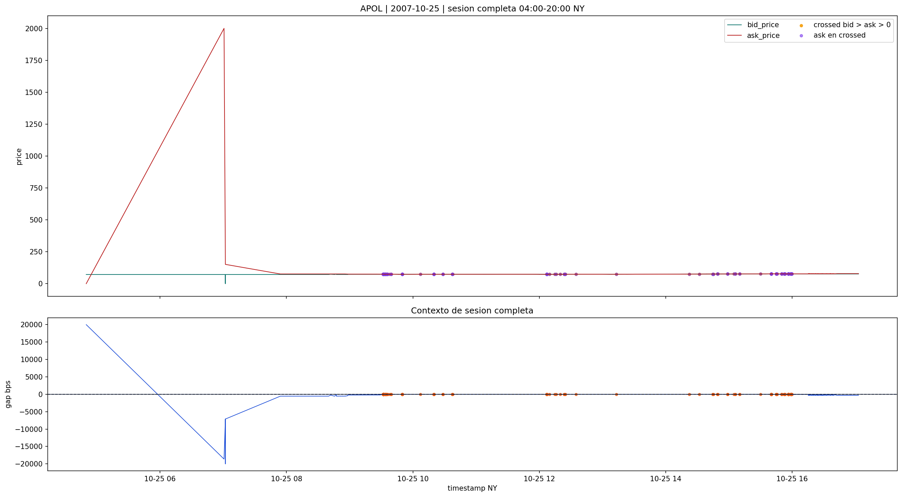

#### 03 Structure Diagnostics
Este panel responde a la pregunta de naturaleza del fallo: contradiccion economica genuina o mezcla con degeneracion estructural. Separa `ask=0` de `ask>0`, muestra la distribucion de `gap_bps` y resume patrones de integerizacion. La decision que cambia es como interpretar el dano: mercado localmente roto, artefacto de representacion o combinacion de ambos. El error que evita es sobrediagnosticar crossed reales cuando parte de la senal proviene de estructura degenerada del libro. Esta lectura afecta directamente a que el caso vaya a exclusion dura, a bandera contextual o a simple reconciliacion tecnica.

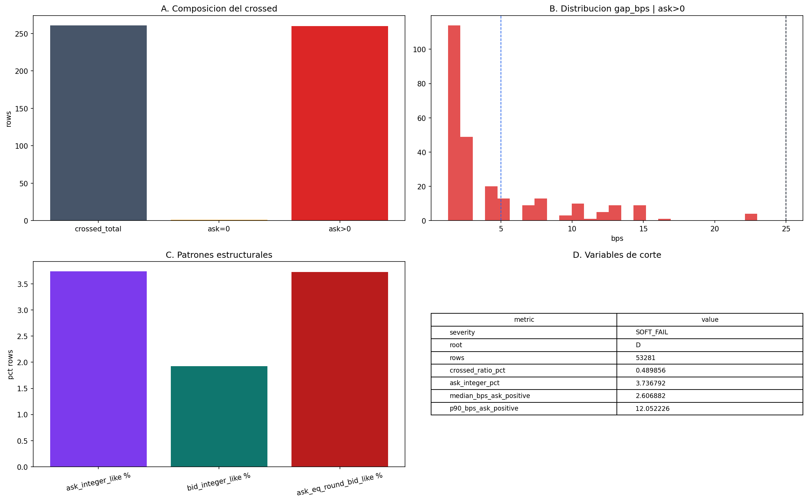

#### 04 Summary Card
Esta tarjeta responde a la pregunta de auditabilidad: cuales son exactamente las variables que sostienen la conclusion. Reune `severity`, `root`, `crossed_ratio_pct`, `ask_integer_pct`, `median_bps_ask_positive` y `p90_bps_ask_positive`. La decision que cambia es pasar de impresion visual a regla verificable. El error que evita es que dos inspectores lleguen a conclusiones distintas mirando la misma imagen sin una base numerica comun. Para gobernanza del proyecto, este panel es el que vuelve reproducible la decision para backtest, ML y auditoria.

---

### 60. OIS 2010-01-14

company_name: `OIL STATES INTERNATIONAL, INC.`
primary_exchange: `NYSE` (`XNYS`)
market_locale: `stocks/us`
scope: `review`
ticker: `OIS`
date: `2010-01-14`
taxonomy: `persistent_soft_crossed_mid_large_scale`
positive_cross_bucket: `positive_cross_mild_lt5bps`
severity: `SOFT_FAIL`
root: `D`
rows: `18048`
crossed_ratio_pct: `0.326906`
crossed_rows_raw: `59`
crossed_rows_ask_zero: `0`
crossed_rows_ask_positive: `59`
ask_integer_pct: `0.548537`
median_bps_ask_positive: `2.447681`
p90_bps_ask_positive: `7.353842`
file: `D:\quotes\OIS\year=2010\month=01\day=14\quotes.parquet`

#### Analisis Forense
La conclusion correcta del caso es que ya existe contradiccion economica real dentro del libro, pero aun no con fuerza suficiente para justificar exclusion dura sin contexto adicional. La taxonomy historica es `persistent_soft_crossed_mid_large_scale` y el regimen positivo dominante es `mild <5 bps`. Esto importa porque la taxonomy no solo clasifica: resume que tipo de anomalia se esta viendo y que clase de decision contractual puede defenderse despues. La taxonomy `persistent_soft_crossed_mid_large_scale` implica un problema repetido y distribuido, no un simple pinchazo local. Por eso empuja a `review`: ya hay dano real, aunque no necesariamente exclusion dura universal. El regimen `mild <5 bps` significa que existe contradiccion economica positiva, pero aun en una banda donde un uso prudente puede seguir siendo defendible si la persistencia y la estructura no agravan el caso. En terminos observables, el file tiene `crossed_ratio_pct=0.326906` con `crossed_rows_ask_positive=59` y `crossed_rows_ask_zero=0`. La severidad economica del crossed ask>0 se resume en `median_bps_ask_positive=2.447681` y `p90_bps_ask_positive=7.353842`. Estos dos numeros convierten una forma visual rara en una conclusion operativa sobre si el libro sigue representando o no un mercado negociable. La decision que cambia es pasar de libro sano a libro util solo bajo cautela. `review` significa: no usar como si fuera ejecucion limpia, conservar para analisis contextual y sensibilidad. El error que evita es tratar como normal un episodio que ya contiene contradiccion economica real y contaminar simulaciones de ejecucion o validaciones demasiado optimistas. El patron estructural muestra `ask_integer_pct=0.548537`. Este numero obliga a separar dos explicaciones rivales: contradiccion economica genuina del libro o mezcla con degeneracion estructural / integerizacion. Toda la composicion crossed cae en `ask>0`. Eso endurece la lectura economica del caso: el dano no depende de ceros mecanicos, sino de contradiccion positiva dentro de precios aparentemente vivos. Como `ask_integer_pct` es bajo, la hipotesis de simple degeneracion mecanica pierde fuerza. Eso endurece la interpretacion: el crossed se parece mas a contradiccion economica genuina y menos a artefacto. Existe ademas una imagen historica de certificacion asociada. Su papel es poner el episodio en un marco causal mas amplio: halt, explained, not strongly explained o patron conocido. La regla que protege al proyecto es esta: el contexto externo se usa para explicar por que aparece el episodio, no para absolverlo. El error que evita es degradar el criterio de calidad del libro porque exista una historia plausible alrededor del caso.

#### 00 Event Month Context
Esta imagen responde a la pregunta de persistencia temporal: estamos ante un accidente local o ante una fase mas amplia de inestabilidad. Arriba coloca el evento en la serie `daily` real del mes; abajo compara `crossed_ratio_pct` y `max_gap_bps_pos` del dia contra sus vecinos. La decision que cambia es el peso estructural que se le concede al caso. El error que evita es juzgar igual un shock aislado y una degradacion repetida del libro.

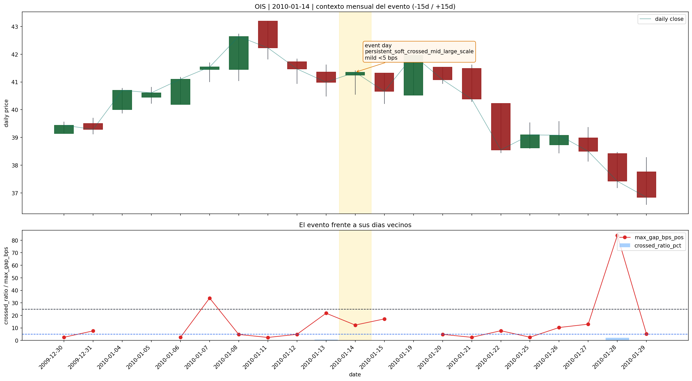

#### 00b Event Month Quotes Context
Esta imagen responde a la pregunta de recurrencia mensual dentro de `quotes`: el problema se concentra en el evento o reaparece en varias sesiones. Arriba concatena sesiones con datos disponibles; abajo resume cobertura diaria, `crossed_ratio_pct` y `max_gap_bps_pos`. La decision que cambia es si el caso debe leerse como episodio puntual o como sintoma de una fase repetida de libro degradado. El error que evita es extrapolar desde un unico dia a todo el mes sin evidencia.

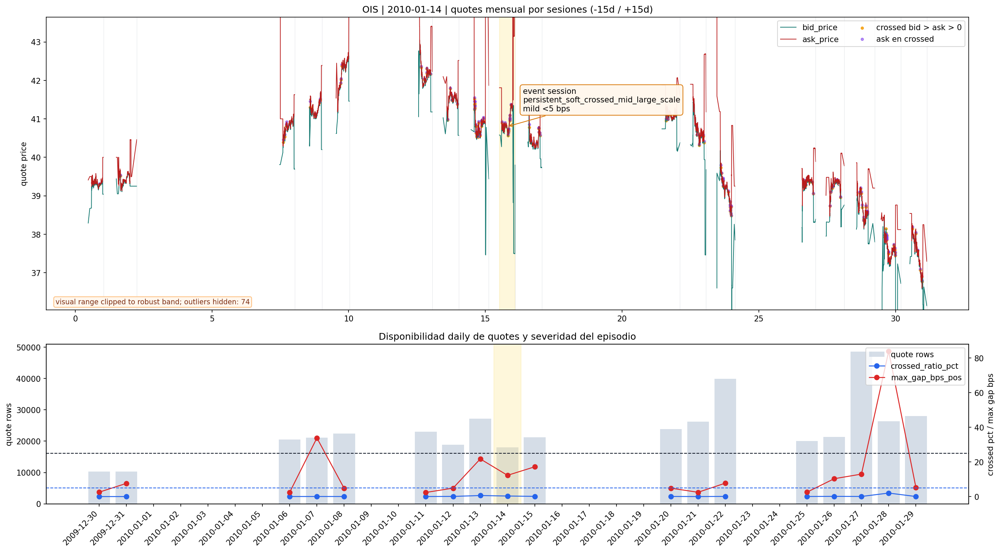

#### 01 Raw Window
Esta imagen responde a la primera pregunta decisiva del caso: el crossed observado es economicamente bastante fuerte para justificar un cambio de clase. Arriba ensena la geometria exacta del tramo conflictivo; abajo convierte esa geometria a bps y la enfrenta a los cortes `5 bps` y `25 bps`. El regimen dominante es `mild <5 bps`. La decision que cambia es pasar de anomalia interpretable a `review` o `bad`. El error que evita es decidir por apariencia visual sin medir el dano economico real del crossed. En terminos de pipeline, este panel decide si el problema afecta solo a la lectura forense o si invalida simulacion de ejecucion y microstructure features.

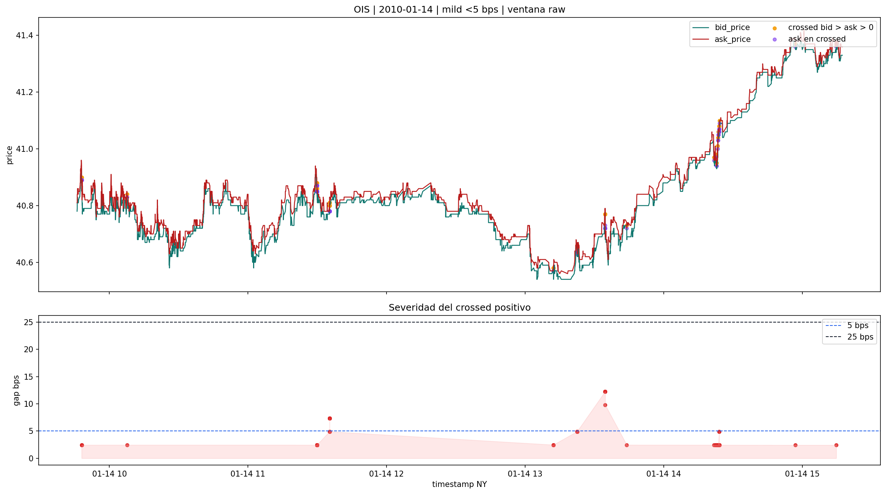

#### 02 Full Session Context
Esta imagen responde a la pregunta de extension intradiaria: el dano esta confinado a un bloque corto o contamina la sesion completa. Arriba se ve toda la sesion `04:00-20:00 NY`; abajo el `gap_bps` firmado. La decision que cambia es si el consumo debe penalizar solo un tramo o desechar el dia entero para uso operativo. El error que evita es tratar una cicatriz local como ruina total o, al reves, minimizar una degradacion distribuida a lo largo del dia. En ejecucion esto decide si la sesion puede seguir usandose con restricciones; en ML decide si las features intradiarias conservan significado economico.

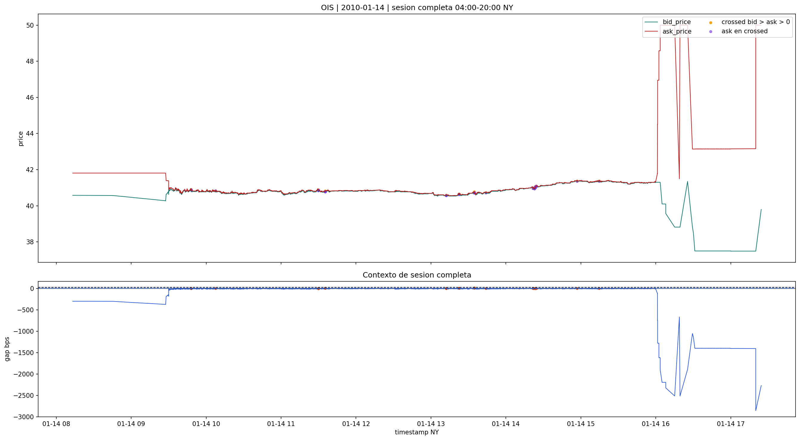

#### 03 Structure Diagnostics
Este panel responde a la pregunta de naturaleza del fallo: contradiccion economica genuina o mezcla con degeneracion estructural. Separa `ask=0` de `ask>0`, muestra la distribucion de `gap_bps` y resume patrones de integerizacion. La decision que cambia es como interpretar el dano: mercado localmente roto, artefacto de representacion o combinacion de ambos. El error que evita es sobrediagnosticar crossed reales cuando parte de la senal proviene de estructura degenerada del libro. Esta lectura afecta directamente a que el caso vaya a exclusion dura, a bandera contextual o a simple reconciliacion tecnica.

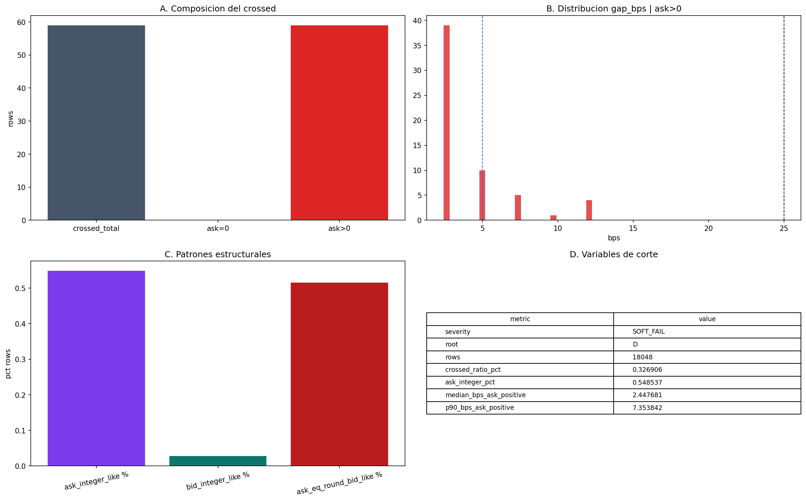

#### 04 Summary Card
Esta tarjeta responde a la pregunta de auditabilidad: cuales son exactamente las variables que sostienen la conclusion. Reune `severity`, `root`, `crossed_ratio_pct`, `ask_integer_pct`, `median_bps_ask_positive` y `p90_bps_ask_positive`. La decision que cambia es pasar de impresion visual a regla verificable. El error que evita es que dos inspectores lleguen a conclusiones distintas mirando la misma imagen sin una base numerica comun. Para gobernanza del proyecto, este panel es el que vuelve reproducible la decision para backtest, ML y auditoria.

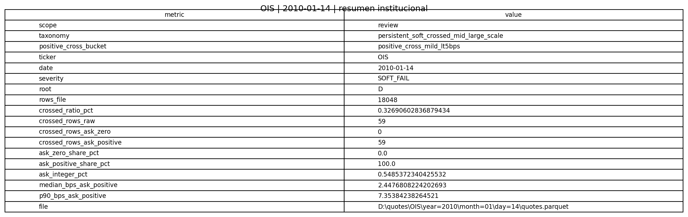

---

### 61. ICON 2014-08-18

company_name: `Iconix Brand Group, Inc.`
primary_exchange: `NASDAQ` (`XNAS`)
market_locale: `stocks/us`
scope: `review`
ticker: `ICON`
date: `2014-08-18`
taxonomy: `persistent_soft_crossed_mid_large_scale`
positive_cross_bucket: `positive_cross_mild_lt5bps`
severity: `SOFT_FAIL`
root: `D`
rows: `11394`
crossed_ratio_pct: `0.517816`
crossed_rows_raw: `59`
crossed_rows_ask_zero: `2`
crossed_rows_ask_positive: `57`
ask_integer_pct: `0.035106`
median_bps_ask_positive: `2.430429`
p90_bps_ask_positive: `2.434571`
file: `D:\quotes\ICON\year=2014\month=08\day=18\quotes.parquet`

#### Analisis Forense
La conclusion correcta del caso es que ya existe contradiccion economica real dentro del libro, pero aun no con fuerza suficiente para justificar exclusion dura sin contexto adicional. La taxonomy historica es `persistent_soft_crossed_mid_large_scale` y el regimen positivo dominante es `mild <5 bps`. Esto importa porque la taxonomy no solo clasifica: resume que tipo de anomalia se esta viendo y que clase de decision contractual puede defenderse despues. La taxonomy `persistent_soft_crossed_mid_large_scale` implica un problema repetido y distribuido, no un simple pinchazo local. Por eso empuja a `review`: ya hay dano real, aunque no necesariamente exclusion dura universal. El regimen `mild <5 bps` significa que existe contradiccion economica positiva, pero aun en una banda donde un uso prudente puede seguir siendo defendible si la persistencia y la estructura no agravan el caso. En terminos observables, el file tiene `crossed_ratio_pct=0.517816` con `crossed_rows_ask_positive=57` y `crossed_rows_ask_zero=2`. La severidad economica del crossed ask>0 se resume en `median_bps_ask_positive=2.430429` y `p90_bps_ask_positive=2.434571`. Estos dos numeros convierten una forma visual rara en una conclusion operativa sobre si el libro sigue representando o no un mercado negociable. La decision que cambia es pasar de libro sano a libro util solo bajo cautela. `review` significa: no usar como si fuera ejecucion limpia, conservar para analisis contextual y sensibilidad. El error que evita es tratar como normal un episodio que ya contiene contradiccion economica real y contaminar simulaciones de ejecucion o validaciones demasiado optimistas. El patron estructural muestra `ask_integer_pct=0.035106`. Este numero obliga a separar dos explicaciones rivales: contradiccion economica genuina del libro o mezcla con degeneracion estructural / integerizacion. La mayor parte del crossed vive en `ask>0`, de modo que el corazon del problema sigue siendo economico. La parte `ask=0`, si existe, acompana pero no explica por si sola la anomalia. Como `ask_integer_pct` es bajo, la hipotesis de simple degeneracion mecanica pierde fuerza. Eso endurece la interpretacion: el crossed se parece mas a contradiccion economica genuina y menos a artefacto. En la capa de semantica de precio del evento aparecen `daily raw close=82280.0000`, `quote mid raw=41.2000`, `quote mid split_normalized=82400.0000`, `daily adjusted_proxy=81663.8006`. La reconciliacion incluye `future_split_factor=0.0005`. Ademas hay `post_event_dividend_sum=0.2350`. La implicacion metodologica es crucial: una discrepancia entre `quotes`, `daily` y una plataforma externa no puede leerse automaticamente como fallo del dataset. Puede ser semantica de precio distinta. El error que evita esta capa es mezclar raw, split-normalized y adjusted dentro del mismo pipeline, rompiendo auditoria, benchmarking y labels. Para pipelines, esto empuja a conservar el caso fuera de ejecucion limpia, pero todavia puede mantenerse en investigacion contextual y en analisis de sensibilidad donde interese entender fronteras de tolerancia. Existe ademas una imagen historica de certificacion asociada. Su papel es poner el episodio en un marco causal mas amplio: halt, explained, not strongly explained o patron conocido. La regla que protege al proyecto es esta: el contexto externo se usa para explicar por que aparece el episodio, no para absolverlo. El error que evita es degradar el criterio de calidad del libro porque exista una historia plausible alrededor del caso.

#### 00 Event Month Context
Esta imagen responde a la pregunta de persistencia temporal: estamos ante un accidente local o ante una fase mas amplia de inestabilidad. Arriba coloca el evento en la serie `daily` real del mes; abajo compara `crossed_ratio_pct` y `max_gap_bps_pos` del dia contra sus vecinos. La decision que cambia es el peso estructural que se le concede al caso. El error que evita es juzgar igual un shock aislado y una degradacion repetida del libro.

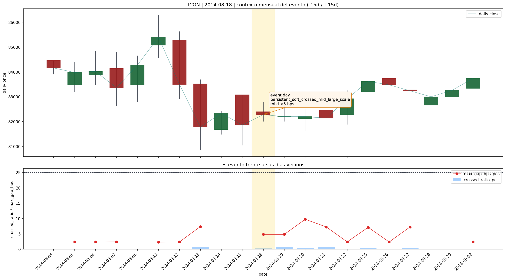

#### 00a Adjusted Proxy Contrast
Esta imagen responde a la pregunta de reconciliacion semantica: la discrepancia de precios viene de datos rotos o de vistas de precio distintas. Compara `daily raw`, `daily adjusted_proxy`, `quote mid raw` y `quote mid split_normalized`, y debajo ensena la cadena de dividendos y splits que produce la diferencia. La decision que cambia es si el inspector debe abrir una incidencia de calidad o cerrar el caso como diferencia legitima de semantica. El error que evita es mezclar series raw y adjusted como si fueran equivalentes. En pipelines reales, esto protege benchmarking, labels diarios y reconciliacion externa frente a falsas alarmas de precio.

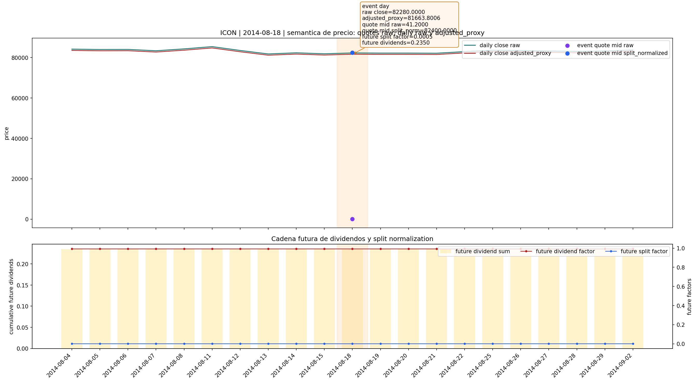

#### 00b Event Month Quotes Context
Esta imagen responde a la pregunta de recurrencia mensual dentro de `quotes`: el problema se concentra en el evento o reaparece en varias sesiones. Arriba concatena sesiones con datos disponibles; abajo resume cobertura diaria, `crossed_ratio_pct` y `max_gap_bps_pos`. La decision que cambia es si el caso debe leerse como episodio puntual o como sintoma de una fase repetida de libro degradado. El error que evita es extrapolar desde un unico dia a todo el mes sin evidencia.

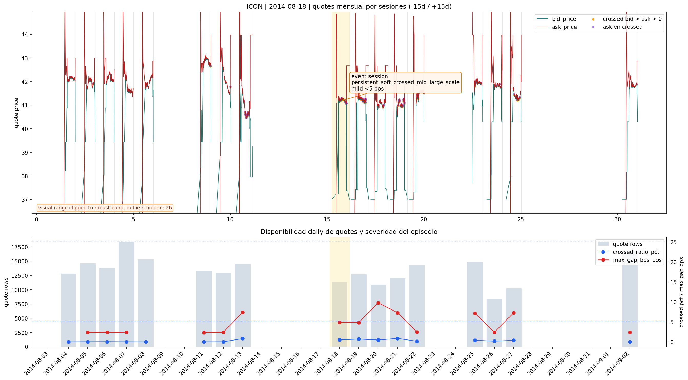

#### 01 Raw Window
Esta imagen responde a la primera pregunta decisiva del caso: el crossed observado es economicamente bastante fuerte para justificar un cambio de clase. Arriba ensena la geometria exacta del tramo conflictivo; abajo convierte esa geometria a bps y la enfrenta a los cortes `5 bps` y `25 bps`. El regimen dominante es `mild <5 bps`. La decision que cambia es pasar de anomalia interpretable a `review` o `bad`. El error que evita es decidir por apariencia visual sin medir el dano economico real del crossed. En terminos de pipeline, este panel decide si el problema afecta solo a la lectura forense o si invalida simulacion de ejecucion y microstructure features.

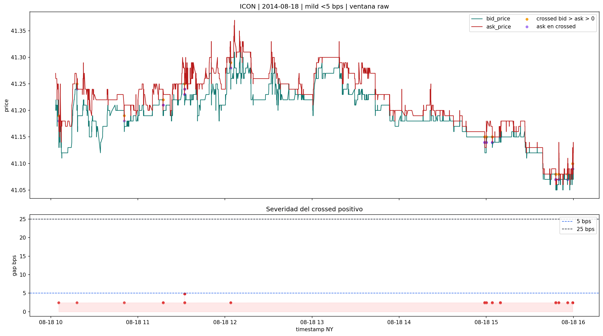

#### 02 Full Session Context
Esta imagen responde a la pregunta de extension intradiaria: el dano esta confinado a un bloque corto o contamina la sesion completa. Arriba se ve toda la sesion `04:00-20:00 NY`; abajo el `gap_bps` firmado. La decision que cambia es si el consumo debe penalizar solo un tramo o desechar el dia entero para uso operativo. El error que evita es tratar una cicatriz local como ruina total o, al reves, minimizar una degradacion distribuida a lo largo del dia. En ejecucion esto decide si la sesion puede seguir usandose con restricciones; en ML decide si las features intradiarias conservan significado economico.

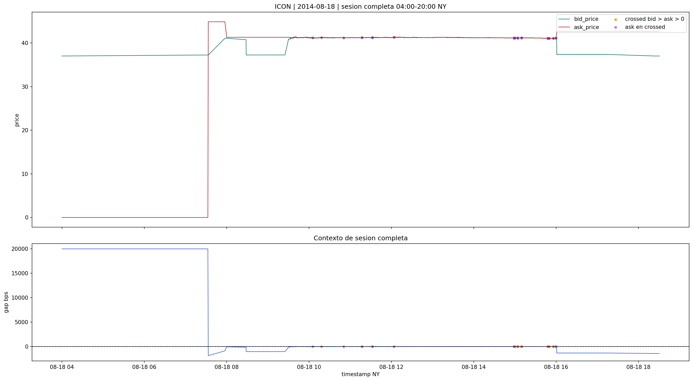

#### 03 Structure Diagnostics
Este panel responde a la pregunta de naturaleza del fallo: contradiccion economica genuina o mezcla con degeneracion estructural. Separa `ask=0` de `ask>0`, muestra la distribucion de `gap_bps` y resume patrones de integerizacion. La decision que cambia es como interpretar el dano: mercado localmente roto, artefacto de representacion o combinacion de ambos. El error que evita es sobrediagnosticar crossed reales cuando parte de la senal proviene de estructura degenerada del libro. Esta lectura afecta directamente a que el caso vaya a exclusion dura, a bandera contextual o a simple reconciliacion tecnica.

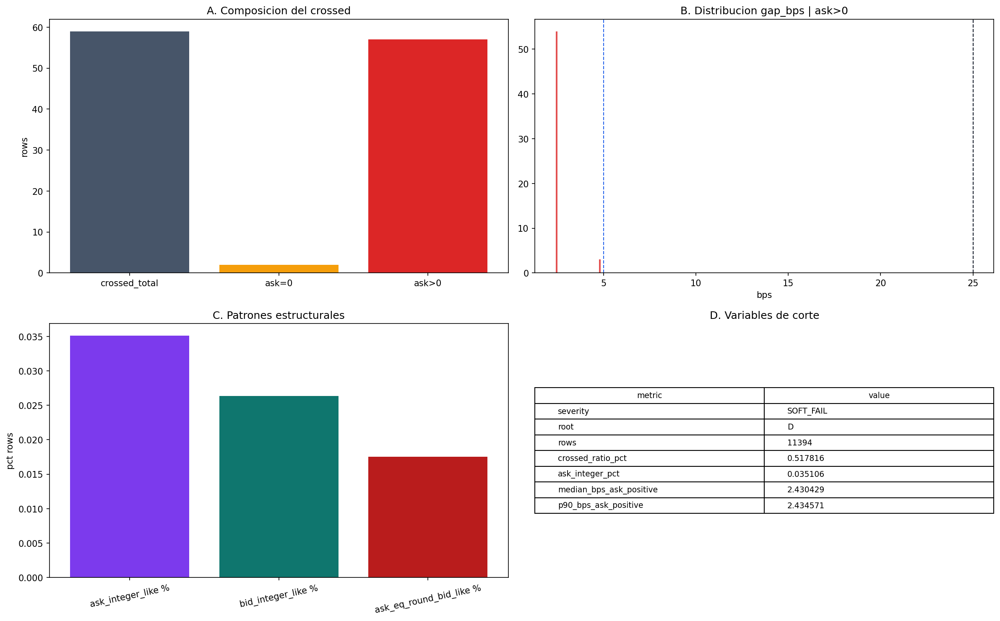

#### 04 Summary Card
Esta tarjeta responde a la pregunta de auditabilidad: cuales son exactamente las variables que sostienen la conclusion. Reune `severity`, `root`, `crossed_ratio_pct`, `ask_integer_pct`, `median_bps_ask_positive` y `p90_bps_ask_positive`. La decision que cambia es pasar de impresion visual a regla verificable. El error que evita es que dos inspectores lleguen a conclusiones distintas mirando la misma imagen sin una base numerica comun. Para gobernanza del proyecto, este panel es el que vuelve reproducible la decision para backtest, ML y auditoria.

---

### 62. UNT 2007-12-04

company_name: `UNIT Corporation`
primary_exchange: `NYSE` (`XNYS`)
market_locale: `stocks/us`
scope: `review`
ticker: `UNT`
date: `2007-12-04`
taxonomy: `persistent_soft_crossed_mid_large_scale`
positive_cross_bucket: `positive_cross_mild_lt5bps`
severity: `SOFT_FAIL`
root: `C`
rows: `10162`
crossed_ratio_pct: `0.364102`
crossed_rows_raw: `37`
crossed_rows_ask_zero: `0`
crossed_rows_ask_positive: `37`
ask_integer_pct: `2.076363`
median_bps_ask_positive: `2.217049`
p90_bps_ask_positive: `2.217049`
file: `C:\TSIS_Data\data\quotes\UNT\year=2007\month=12\day=04\quotes.parquet`

#### Analisis Forense
La conclusion correcta del caso es que ya existe contradiccion economica real dentro del libro, pero aun no con fuerza suficiente para justificar exclusion dura sin contexto adicional. La taxonomy historica es `persistent_soft_crossed_mid_large_scale` y el regimen positivo dominante es `mild <5 bps`. Esto importa porque la taxonomy no solo clasifica: resume que tipo de anomalia se esta viendo y que clase de decision contractual puede defenderse despues. La taxonomy `persistent_soft_crossed_mid_large_scale` implica un problema repetido y distribuido, no un simple pinchazo local. Por eso empuja a `review`: ya hay dano real, aunque no necesariamente exclusion dura universal. El regimen `mild <5 bps` significa que existe contradiccion economica positiva, pero aun en una banda donde un uso prudente puede seguir siendo defendible si la persistencia y la estructura no agravan el caso. En terminos observables, el file tiene `crossed_ratio_pct=0.364102` con `crossed_rows_ask_positive=37` y `crossed_rows_ask_zero=0`. La severidad economica del crossed ask>0 se resume en `median_bps_ask_positive=2.217049` y `p90_bps_ask_positive=2.217049`. Estos dos numeros convierten una forma visual rara en una conclusion operativa sobre si el libro sigue representando o no un mercado negociable. La decision que cambia es pasar de libro sano a libro util solo bajo cautela. `review` significa: no usar como si fuera ejecucion limpia, conservar para analisis contextual y sensibilidad. El error que evita es tratar como normal un episodio que ya contiene contradiccion economica real y contaminar simulaciones de ejecucion o validaciones demasiado optimistas. El patron estructural muestra `ask_integer_pct=2.076363`. Este numero obliga a separar dos explicaciones rivales: contradiccion economica genuina del libro o mezcla con degeneracion estructural / integerizacion. Toda la composicion crossed cae en `ask>0`. Eso endurece la lectura economica del caso: el dano no depende de ceros mecanicos, sino de contradiccion positiva dentro de precios aparentemente vivos. Como `ask_integer_pct` es bajo, la hipotesis de simple degeneracion mecanica pierde fuerza. Eso endurece la interpretacion: el crossed se parece mas a contradiccion economica genuina y menos a artefacto. Existe ademas una imagen historica de certificacion asociada. Su papel es poner el episodio en un marco causal mas amplio: halt, explained, not strongly explained o patron conocido. La regla que protege al proyecto es esta: el contexto externo se usa para explicar por que aparece el episodio, no para absolverlo. El error que evita es degradar el criterio de calidad del libro porque exista una historia plausible alrededor del caso.

#### 00 Event Month Context
Esta imagen responde a la pregunta de persistencia temporal: estamos ante un accidente local o ante una fase mas amplia de inestabilidad. Arriba coloca el evento en la serie `daily` real del mes; abajo compara `crossed_ratio_pct` y `max_gap_bps_pos` del dia contra sus vecinos. La decision que cambia es el peso estructural que se le concede al caso. El error que evita es juzgar igual un shock aislado y una degradacion repetida del libro.

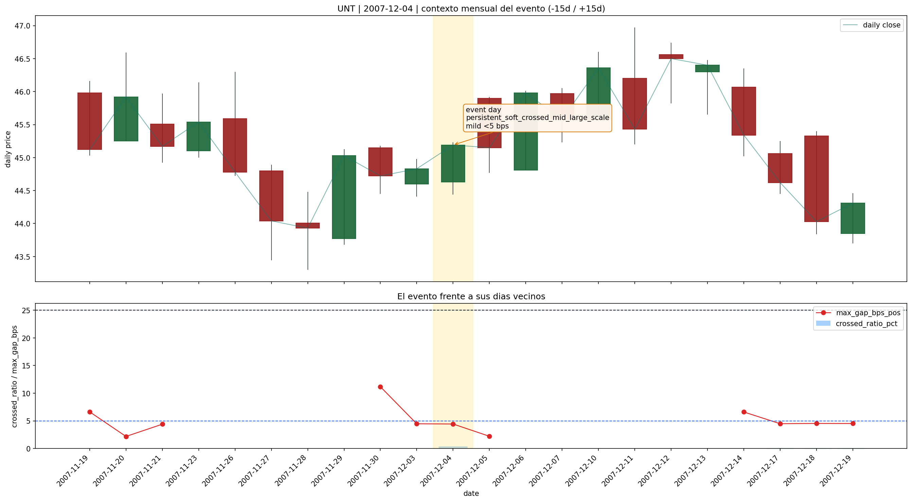

#### 00b Event Month Quotes Context
Esta imagen responde a la pregunta de recurrencia mensual dentro de `quotes`: el problema se concentra en el evento o reaparece en varias sesiones. Arriba concatena sesiones con datos disponibles; abajo resume cobertura diaria, `crossed_ratio_pct` y `max_gap_bps_pos`. La decision que cambia es si el caso debe leerse como episodio puntual o como sintoma de una fase repetida de libro degradado. El error que evita es extrapolar desde un unico dia a todo el mes sin evidencia.

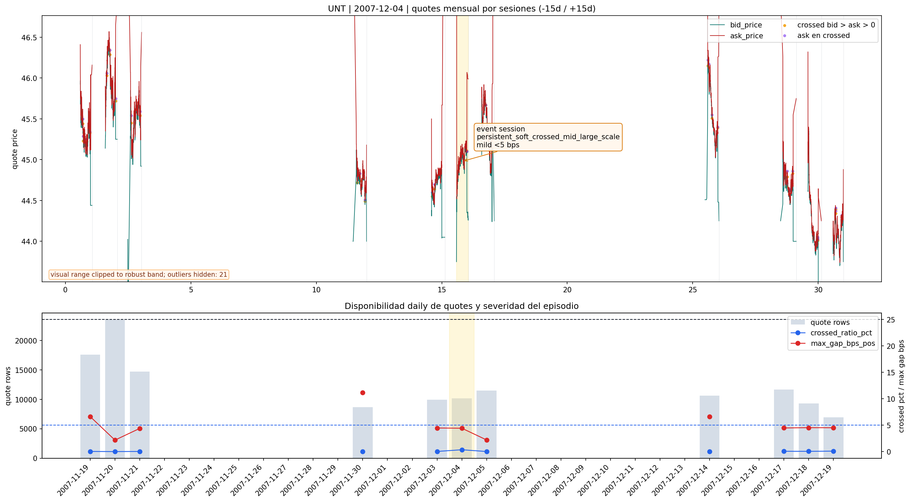

#### 01 Raw Window
Esta imagen responde a la primera pregunta decisiva del caso: el crossed observado es economicamente bastante fuerte para justificar un cambio de clase. Arriba ensena la geometria exacta del tramo conflictivo; abajo convierte esa geometria a bps y la enfrenta a los cortes `5 bps` y `25 bps`. El regimen dominante es `mild <5 bps`. La decision que cambia es pasar de anomalia interpretable a `review` o `bad`. El error que evita es decidir por apariencia visual sin medir el dano economico real del crossed. En terminos de pipeline, este panel decide si el problema afecta solo a la lectura forense o si invalida simulacion de ejecucion y microstructure features.

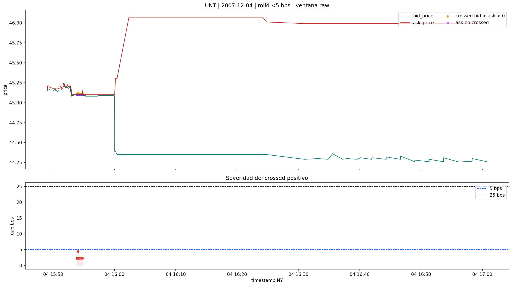

#### 02 Full Session Context
Esta imagen responde a la pregunta de extension intradiaria: el dano esta confinado a un bloque corto o contamina la sesion completa. Arriba se ve toda la sesion `04:00-20:00 NY`; abajo el `gap_bps` firmado. La decision que cambia es si el consumo debe penalizar solo un tramo o desechar el dia entero para uso operativo. El error que evita es tratar una cicatriz local como ruina total o, al reves, minimizar una degradacion distribuida a lo largo del dia. En ejecucion esto decide si la sesion puede seguir usandose con restricciones; en ML decide si las features intradiarias conservan significado economico.

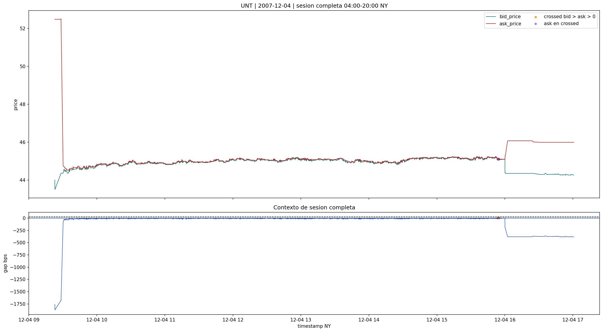

#### 03 Structure Diagnostics
Este panel responde a la pregunta de naturaleza del fallo: contradiccion economica genuina o mezcla con degeneracion estructural. Separa `ask=0` de `ask>0`, muestra la distribucion de `gap_bps` y resume patrones de integerizacion. La decision que cambia es como interpretar el dano: mercado localmente roto, artefacto de representacion o combinacion de ambos. El error que evita es sobrediagnosticar crossed reales cuando parte de la senal proviene de estructura degenerada del libro. Esta lectura afecta directamente a que el caso vaya a exclusion dura, a bandera contextual o a simple reconciliacion tecnica.

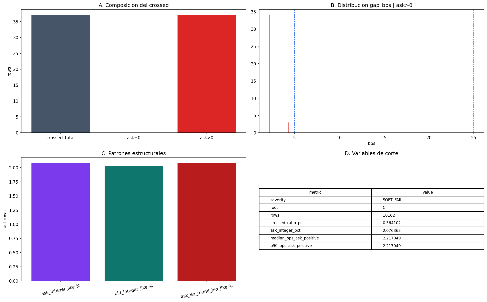

#### 04 Summary Card
Esta tarjeta responde a la pregunta de auditabilidad: cuales son exactamente las variables que sostienen la conclusion. Reune `severity`, `root`, `crossed_ratio_pct`, `ask_integer_pct`, `median_bps_ask_positive` y `p90_bps_ask_positive`. La decision que cambia es pasar de impresion visual a regla verificable. El error que evita es que dos inspectores lleguen a conclusiones distintas mirando la misma imagen sin una base numerica comun. Para gobernanza del proyecto, este panel es el que vuelve reproducible la decision para backtest, ML y auditoria.

---

### 63. MON 2010-10-25

company_name: `Monument Circle Acquisition Corp. Class A Common Stock`
primary_exchange: `NASDAQ` (`XNAS`)
market_locale: `stocks/us`
scope: `review`
ticker: `MON`
date: `2010-10-25`
taxonomy: `persistent_soft_crossed_mid_large_scale`
positive_cross_bucket: `positive_cross_mild_lt5bps`
severity: `SOFT_FAIL`
root: `D`
rows: `98947`
crossed_ratio_pct: `0.452768`
crossed_rows_raw: `448`
crossed_rows_ask_zero: `0`
crossed_rows_ask_positive: `448`
ask_integer_pct: `1.160217`
median_bps_ask_positive: `1.701404`
p90_bps_ask_positive: `3.398471`
file: `D:\quotes\MON\year=2010\month=10\day=25\quotes.parquet`

#### Analisis Forense
La conclusion correcta del caso es que ya existe contradiccion economica real dentro del libro, pero aun no con fuerza suficiente para justificar exclusion dura sin contexto adicional. La taxonomy historica es `persistent_soft_crossed_mid_large_scale` y el regimen positivo dominante es `mild <5 bps`. Esto importa porque la taxonomy no solo clasifica: resume que tipo de anomalia se esta viendo y que clase de decision contractual puede defenderse despues. La taxonomy `persistent_soft_crossed_mid_large_scale` implica un problema repetido y distribuido, no un simple pinchazo local. Por eso empuja a `review`: ya hay dano real, aunque no necesariamente exclusion dura universal. El regimen `mild <5 bps` significa que existe contradiccion economica positiva, pero aun en una banda donde un uso prudente puede seguir siendo defendible si la persistencia y la estructura no agravan el caso. En terminos observables, el file tiene `crossed_ratio_pct=0.452768` con `crossed_rows_ask_positive=448` y `crossed_rows_ask_zero=0`. La severidad economica del crossed ask>0 se resume en `median_bps_ask_positive=1.701404` y `p90_bps_ask_positive=3.398471`. Estos dos numeros convierten una forma visual rara en una conclusion operativa sobre si el libro sigue representando o no un mercado negociable. La decision que cambia es pasar de libro sano a libro util solo bajo cautela. `review` significa: no usar como si fuera ejecucion limpia, conservar para analisis contextual y sensibilidad. El error que evita es tratar como normal un episodio que ya contiene contradiccion economica real y contaminar simulaciones de ejecucion o validaciones demasiado optimistas. El patron estructural muestra `ask_integer_pct=1.160217`. Este numero obliga a separar dos explicaciones rivales: contradiccion economica genuina del libro o mezcla con degeneracion estructural / integerizacion. Toda la composicion crossed cae en `ask>0`. Eso endurece la lectura economica del caso: el dano no depende de ceros mecanicos, sino de contradiccion positiva dentro de precios aparentemente vivos. Como `ask_integer_pct` es bajo, la hipotesis de simple degeneracion mecanica pierde fuerza. Eso endurece la interpretacion: el crossed se parece mas a contradiccion economica genuina y menos a artefacto. En la capa de semantica de precio del evento aparecen `daily raw close=58.7100`, `quote mid raw=59.3000`, `quote mid split_normalized=59.3000`, `daily adjusted_proxy=48.8794`. Ademas hay `post_event_dividend_sum=13.1600`. La implicacion metodologica es crucial: una discrepancia entre `quotes`, `daily` y una plataforma externa no puede leerse automaticamente como fallo del dataset. Puede ser semantica de precio distinta. El error que evita esta capa es mezclar raw, split-normalized y adjusted dentro del mismo pipeline, rompiendo auditoria, benchmarking y labels. Para pipelines, esto empuja a conservar el caso fuera de ejecucion limpia, pero todavia puede mantenerse en investigacion contextual y en analisis de sensibilidad donde interese entender fronteras de tolerancia. Existe ademas una imagen historica de certificacion asociada. Su papel es poner el episodio en un marco causal mas amplio: halt, explained, not strongly explained o patron conocido. La regla que protege al proyecto es esta: el contexto externo se usa para explicar por que aparece el episodio, no para absolverlo. El error que evita es degradar el criterio de calidad del libro porque exista una historia plausible alrededor del caso.

#### 00 Event Month Context
Esta imagen responde a la pregunta de persistencia temporal: estamos ante un accidente local o ante una fase mas amplia de inestabilidad. Arriba coloca el evento en la serie `daily` real del mes; abajo compara `crossed_ratio_pct` y `max_gap_bps_pos` del dia contra sus vecinos. La decision que cambia es el peso estructural que se le concede al caso. El error que evita es juzgar igual un shock aislado y una degradacion repetida del libro.

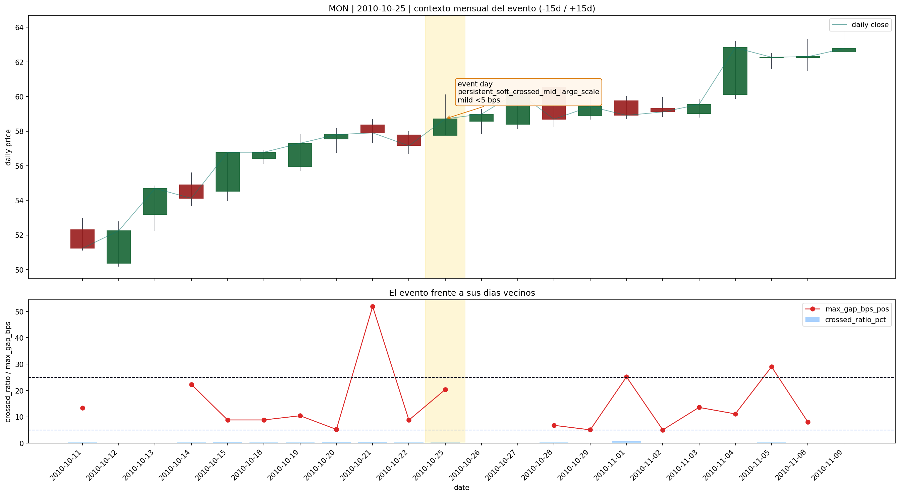

#### 00a Adjusted Proxy Contrast
Esta imagen responde a la pregunta de reconciliacion semantica: la discrepancia de precios viene de datos rotos o de vistas de precio distintas. Compara `daily raw`, `daily adjusted_proxy`, `quote mid raw` y `quote mid split_normalized`, y debajo ensena la cadena de dividendos y splits que produce la diferencia. La decision que cambia es si el inspector debe abrir una incidencia de calidad o cerrar el caso como diferencia legitima de semantica. El error que evita es mezclar series raw y adjusted como si fueran equivalentes. En pipelines reales, esto protege benchmarking, labels diarios y reconciliacion externa frente a falsas alarmas de precio.

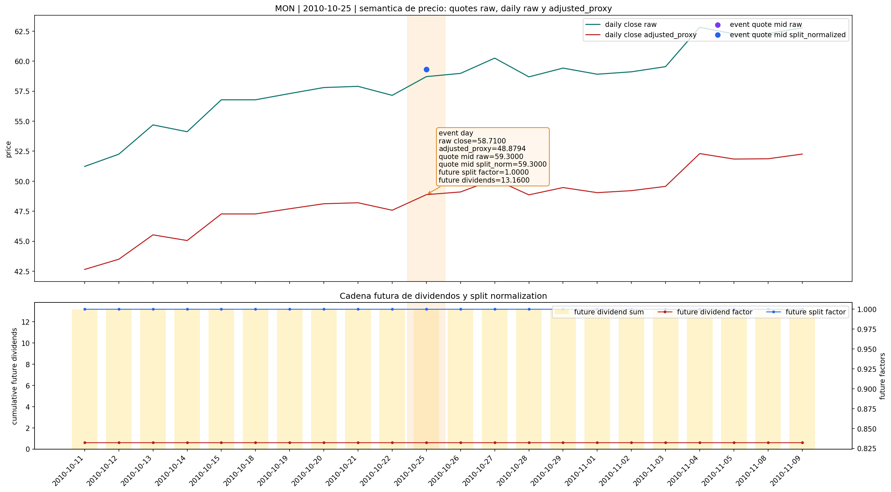

#### 00b Event Month Quotes Context
Esta imagen responde a la pregunta de recurrencia mensual dentro de `quotes`: el problema se concentra en el evento o reaparece en varias sesiones. Arriba concatena sesiones con datos disponibles; abajo resume cobertura diaria, `crossed_ratio_pct` y `max_gap_bps_pos`. La decision que cambia es si el caso debe leerse como episodio puntual o como sintoma de una fase repetida de libro degradado. El error que evita es extrapolar desde un unico dia a todo el mes sin evidencia.

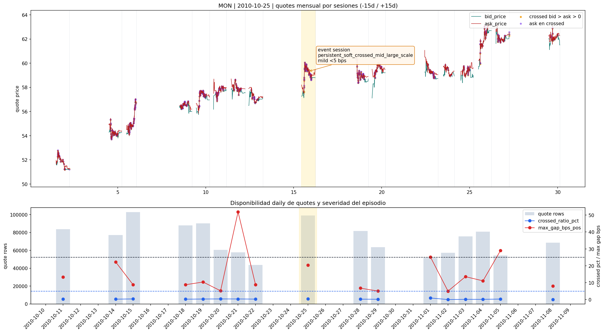

#### 01 Raw Window
Esta imagen responde a la primera pregunta decisiva del caso: el crossed observado es economicamente bastante fuerte para justificar un cambio de clase. Arriba ensena la geometria exacta del tramo conflictivo; abajo convierte esa geometria a bps y la enfrenta a los cortes `5 bps` y `25 bps`. El regimen dominante es `mild <5 bps`. La decision que cambia es pasar de anomalia interpretable a `review` o `bad`. El error que evita es decidir por apariencia visual sin medir el dano economico real del crossed. En terminos de pipeline, este panel decide si el problema afecta solo a la lectura forense o si invalida simulacion de ejecucion y microstructure features.

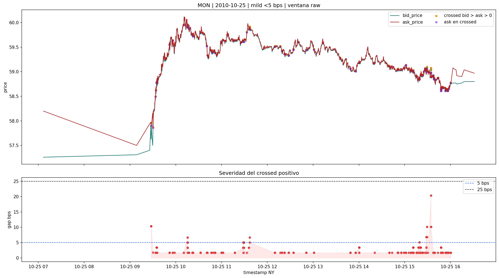

#### 02 Full Session Context
Esta imagen responde a la pregunta de extension intradiaria: el dano esta confinado a un bloque corto o contamina la sesion completa. Arriba se ve toda la sesion `04:00-20:00 NY`; abajo el `gap_bps` firmado. La decision que cambia es si el consumo debe penalizar solo un tramo o desechar el dia entero para uso operativo. El error que evita es tratar una cicatriz local como ruina total o, al reves, minimizar una degradacion distribuida a lo largo del dia. En ejecucion esto decide si la sesion puede seguir usandose con restricciones; en ML decide si las features intradiarias conservan significado economico.

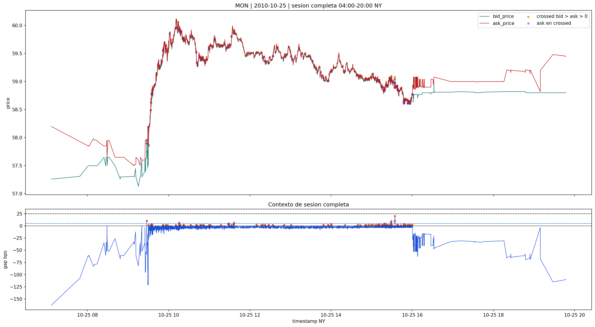

#### 03 Structure Diagnostics
Este panel responde a la pregunta de naturaleza del fallo: contradiccion economica genuina o mezcla con degeneracion estructural. Separa `ask=0` de `ask>0`, muestra la distribucion de `gap_bps` y resume patrones de integerizacion. La decision que cambia es como interpretar el dano: mercado localmente roto, artefacto de representacion o combinacion de ambos. El error que evita es sobrediagnosticar crossed reales cuando parte de la senal proviene de estructura degenerada del libro. Esta lectura afecta directamente a que el caso vaya a exclusion dura, a bandera contextual o a simple reconciliacion tecnica.

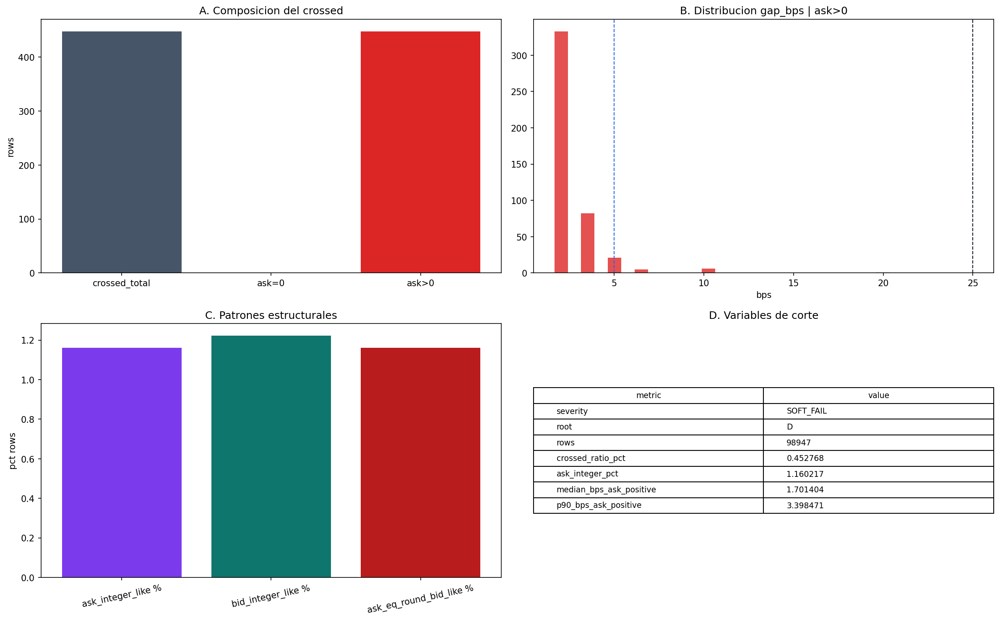

#### 04 Summary Card
Esta tarjeta responde a la pregunta de auditabilidad: cuales son exactamente las variables que sostienen la conclusion. Reune `severity`, `root`, `crossed_ratio_pct`, `ask_integer_pct`, `median_bps_ask_positive` y `p90_bps_ask_positive`. La decision que cambia es pasar de impresion visual a regla verificable. El error que evita es que dos inspectores lleguen a conclusiones distintas mirando la misma imagen sin una base numerica comun. Para gobernanza del proyecto, este panel es el que vuelve reproducible la decision para backtest, ML y auditoria.

---

### 64. DNA 2008-02-01

company_name: `Ginkgo Bioworks Holdings, Inc.`
primary_exchange: `NYSE` (`XNYS`)
market_locale: `stocks/us`
scope: `review`
ticker: `DNA`
date: `2008-02-01`
taxonomy: `persistent_soft_crossed_mid_large_scale`
positive_cross_bucket: `positive_cross_mild_lt5bps`
severity: `SOFT_FAIL`
root: `C`
rows: `38107`
crossed_ratio_pct: `0.467106`
crossed_rows_raw: `178`
crossed_rows_ask_zero: `0`
crossed_rows_ask_positive: `178`
ask_integer_pct: `3.490172`
median_bps_ask_positive: `1.418742`
p90_bps_ask_positive: `4.221487`
file: `C:\TSIS_Data\data\quotes\DNA\year=2008\month=02\day=01\quotes.parquet`

#### Analisis Forense
La conclusion correcta del caso es que ya existe contradiccion economica real dentro del libro, pero aun no con fuerza suficiente para justificar exclusion dura sin contexto adicional. La taxonomy historica es `persistent_soft_crossed_mid_large_scale` y el regimen positivo dominante es `mild <5 bps`. Esto importa porque la taxonomy no solo clasifica: resume que tipo de anomalia se esta viendo y que clase de decision contractual puede defenderse despues. La taxonomy `persistent_soft_crossed_mid_large_scale` implica un problema repetido y distribuido, no un simple pinchazo local. Por eso empuja a `review`: ya hay dano real, aunque no necesariamente exclusion dura universal. El regimen `mild <5 bps` significa que existe contradiccion economica positiva, pero aun en una banda donde un uso prudente puede seguir siendo defendible si la persistencia y la estructura no agravan el caso. En terminos observables, el file tiene `crossed_ratio_pct=0.467106` con `crossed_rows_ask_positive=178` y `crossed_rows_ask_zero=0`. La severidad economica del crossed ask>0 se resume en `median_bps_ask_positive=1.418742` y `p90_bps_ask_positive=4.221487`. Estos dos numeros convierten una forma visual rara en una conclusion operativa sobre si el libro sigue representando o no un mercado negociable. La decision que cambia es pasar de libro sano a libro util solo bajo cautela. `review` significa: no usar como si fuera ejecucion limpia, conservar para analisis contextual y sensibilidad. El error que evita es tratar como normal un episodio que ya contiene contradiccion economica real y contaminar simulaciones de ejecucion o validaciones demasiado optimistas. El patron estructural muestra `ask_integer_pct=3.490172`. Este numero obliga a separar dos explicaciones rivales: contradiccion economica genuina del libro o mezcla con degeneracion estructural / integerizacion. Toda la composicion crossed cae en `ask>0`. Eso endurece la lectura economica del caso: el dano no depende de ceros mecanicos, sino de contradiccion positiva dentro de precios aparentemente vivos. Como `ask_integer_pct` es bajo, la hipotesis de simple degeneracion mecanica pierde fuerza. Eso endurece la interpretacion: el crossed se parece mas a contradiccion economica genuina y menos a artefacto. En la capa de semantica de precio del evento aparecen `daily raw close=2832.4000`, `quote mid raw=70.5950`, `quote mid split_normalized=2823.8000`, `daily adjusted_proxy=2832.4000`. La reconciliacion incluye `future_split_factor=0.0250`. La implicacion metodologica es crucial: una discrepancia entre `quotes`, `daily` y una plataforma externa no puede leerse automaticamente como fallo del dataset. Puede ser semantica de precio distinta. El error que evita esta capa es mezclar raw, split-normalized y adjusted dentro del mismo pipeline, rompiendo auditoria, benchmarking y labels. Para pipelines, esto empuja a conservar el caso fuera de ejecucion limpia, pero todavia puede mantenerse en investigacion contextual y en analisis de sensibilidad donde interese entender fronteras de tolerancia. Existe ademas una imagen historica de certificacion asociada. Su papel es poner el episodio en un marco causal mas amplio: halt, explained, not strongly explained o patron conocido. La regla que protege al proyecto es esta: el contexto externo se usa para explicar por que aparece el episodio, no para absolverlo. El error que evita es degradar el criterio de calidad del libro porque exista una historia plausible alrededor del caso.

#### 00 Event Month Context
Esta imagen responde a la pregunta de persistencia temporal: estamos ante un accidente local o ante una fase mas amplia de inestabilidad. Arriba coloca el evento en la serie `daily` real del mes; abajo compara `crossed_ratio_pct` y `max_gap_bps_pos` del dia contra sus vecinos. La decision que cambia es el peso estructural que se le concede al caso. El error que evita es juzgar igual un shock aislado y una degradacion repetida del libro.

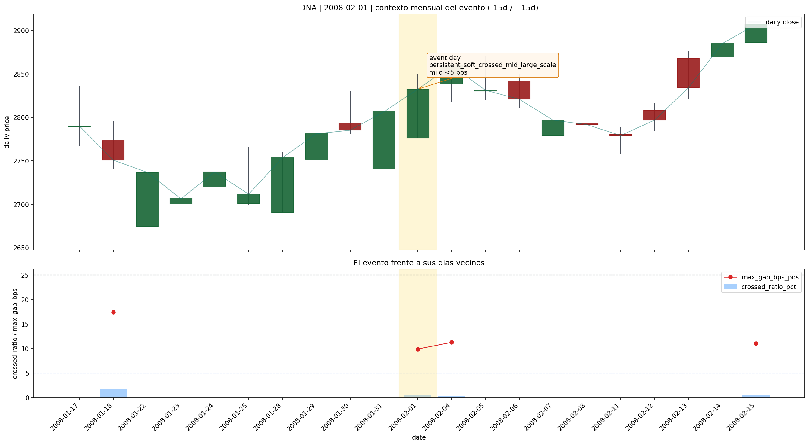

#### 00a Adjusted Proxy Contrast
Esta imagen responde a la pregunta de reconciliacion semantica: la discrepancia de precios viene de datos rotos o de vistas de precio distintas. Compara `daily raw`, `daily adjusted_proxy`, `quote mid raw` y `quote mid split_normalized`, y debajo ensena la cadena de dividendos y splits que produce la diferencia. La decision que cambia es si el inspector debe abrir una incidencia de calidad o cerrar el caso como diferencia legitima de semantica. El error que evita es mezclar series raw y adjusted como si fueran equivalentes. En pipelines reales, esto protege benchmarking, labels diarios y reconciliacion externa frente a falsas alarmas de precio.

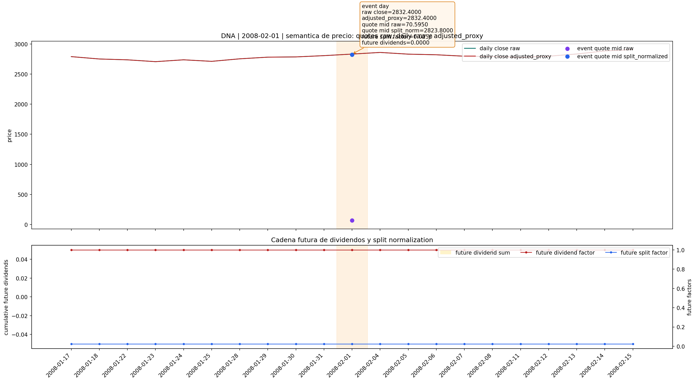

#### 00b Event Month Quotes Context
Esta imagen responde a la pregunta de recurrencia mensual dentro de `quotes`: el problema se concentra en el evento o reaparece en varias sesiones. Arriba concatena sesiones con datos disponibles; abajo resume cobertura diaria, `crossed_ratio_pct` y `max_gap_bps_pos`. La decision que cambia es si el caso debe leerse como episodio puntual o como sintoma de una fase repetida de libro degradado. El error que evita es extrapolar desde un unico dia a todo el mes sin evidencia.

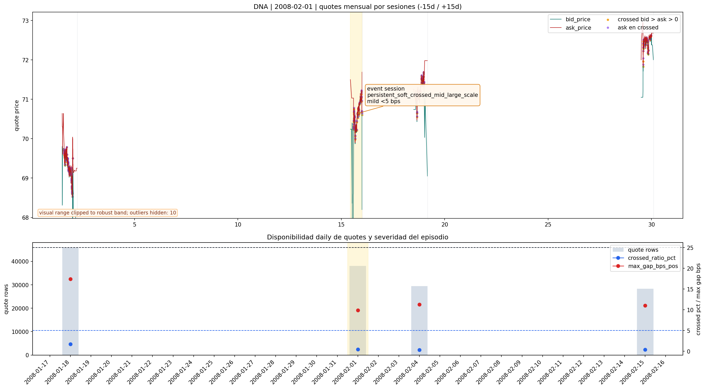

#### 01 Raw Window
Esta imagen responde a la primera pregunta decisiva del caso: el crossed observado es economicamente bastante fuerte para justificar un cambio de clase. Arriba ensena la geometria exacta del tramo conflictivo; abajo convierte esa geometria a bps y la enfrenta a los cortes `5 bps` y `25 bps`. El regimen dominante es `mild <5 bps`. La decision que cambia es pasar de anomalia interpretable a `review` o `bad`. El error que evita es decidir por apariencia visual sin medir el dano economico real del crossed. En terminos de pipeline, este panel decide si el problema afecta solo a la lectura forense o si invalida simulacion de ejecucion y microstructure features.

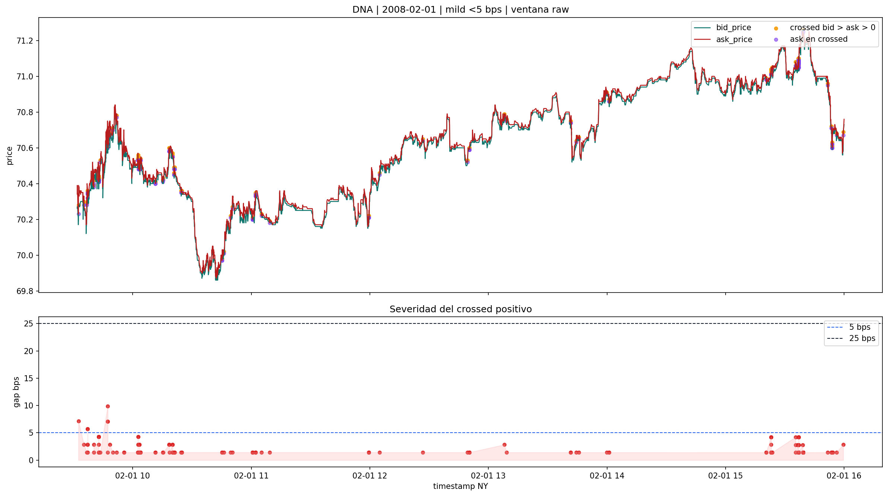

#### 02 Full Session Context
Esta imagen responde a la pregunta de extension intradiaria: el dano esta confinado a un bloque corto o contamina la sesion completa. Arriba se ve toda la sesion `04:00-20:00 NY`; abajo el `gap_bps` firmado. La decision que cambia es si el consumo debe penalizar solo un tramo o desechar el dia entero para uso operativo. El error que evita es tratar una cicatriz local como ruina total o, al reves, minimizar una degradacion distribuida a lo largo del dia. En ejecucion esto decide si la sesion puede seguir usandose con restricciones; en ML decide si las features intradiarias conservan significado economico.

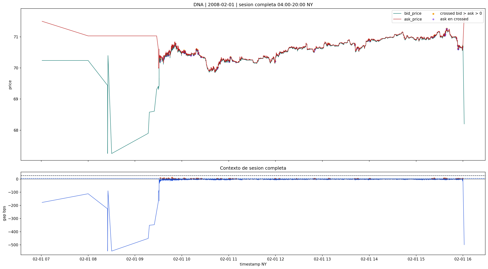

#### 03 Structure Diagnostics
Este panel responde a la pregunta de naturaleza del fallo: contradiccion economica genuina o mezcla con degeneracion estructural. Separa `ask=0` de `ask>0`, muestra la distribucion de `gap_bps` y resume patrones de integerizacion. La decision que cambia es como interpretar el dano: mercado localmente roto, artefacto de representacion o combinacion de ambos. El error que evita es sobrediagnosticar crossed reales cuando parte de la senal proviene de estructura degenerada del libro. Esta lectura afecta directamente a que el caso vaya a exclusion dura, a bandera contextual o a simple reconciliacion tecnica.

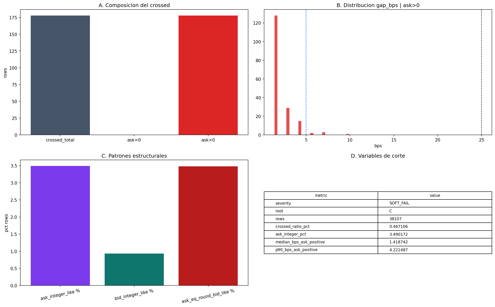

#### 04 Summary Card
Esta tarjeta responde a la pregunta de auditabilidad: cuales son exactamente las variables que sostienen la conclusion. Reune `severity`, `root`, `crossed_ratio_pct`, `ask_integer_pct`, `median_bps_ask_positive` y `p90_bps_ask_positive`. La decision que cambia es pasar de impresion visual a regla verificable. El error que evita es que dos inspectores lleguen a conclusiones distintas mirando la misma imagen sin una base numerica comun. Para gobernanza del proyecto, este panel es el que vuelve reproducible la decision para backtest, ML y auditoria.

---
