# Quotes Good Cases v0.1

Este documento consolida una muestra historica representativa de la franja `good` de `quotes`. No enumera exhaustivamente todo el universo bueno: selecciona ejemplos de las familias buenas principales para justificar como se ve un libro sano, un residuo micro-noise aceptable, un persistent soft low compatible con consumo principal y un caso de rollover UTC limpio.

Total cases: `12`

## Menu

1. [BCOV 2013-08-13](#bcov-2013-08-13)
2. [TOF 2010-09-01](#tof-2010-09-01)
3. [TOF 2010-08-16](#tof-2010-08-16)
4. [SCNX 2025-10-23](#scnx-2025-10-23)
5. [AMC 2024-05-14](#amc-2024-05-14)
6. [REPL 2025-07-30](#repl-2025-07-30)
7. [AMC 2022-04-05](#amc-2022-04-05)
8. [AMC 2021-09-10](#amc-2021-09-10)
9. [YHOO 2017-06-09](#yhoo-2017-06-09)
10. [AMC 2022-02-01](#amc-2022-02-01)
11. [FCEL 2021-03-10](#fcel-2021-03-10)
12. [CRON 2019-01-31](#cron-2019-01-31)

## Cases

### 1. BCOV 2013-08-13

company_name: `Brightcove, Inc.`
primary_exchange: `NASDAQ` (`XNAS`)
market_locale: `stocks/us`
scope: `good`
ticker: `BCOV`
date: `2013-08-13`
taxonomy: `clean_pass_or_other`
positive_cross_bucket: `no_positive_cross`
severity: `PASS`
root: `D`
rows: `2599200`
crossed_ratio_pct: `0.000000`
crossed_rows_raw: `0`
crossed_rows_ask_zero: `0`
crossed_rows_ask_positive: `0`
ask_integer_pct: `0.000000`
median_bps_ask_positive: `0.000000`
p90_bps_ask_positive: `0.000000`
file: `D:\quotes\BCOV\year=2013\month=08\day=13\quotes.parquet`

#### Analisis Forense
La conclusion correcta del caso es que el libro mantiene semantica economica util. El residuo observado no cambia de forma material la lectura del spread ni invalida el uso operativo normal del dia. La taxonomy historica es `clean_pass_or_other` y el regimen positivo dominante es `no positive cross`. Esto importa porque la taxonomy no solo clasifica: resume que tipo de anomalia se esta viendo y que clase de decision contractual puede defenderse despues. La taxonomy `clean_pass_or_other` implica que el bloque no necesita defensa causal compleja: el libro ya pasa su prueba economica minima y no exige reinterpretacion forense intensa. El regimen `no positive cross` significa que el caso no presenta contradiccion economica positiva directa; cualquier rareza restante debe interpretarse como estructura, cobertura o residuo no decisional. En terminos observables, el file tiene `crossed_ratio_pct=0.000000` sin filas `bid > ask > 0`; `crossed_rows_ask_positive=0` y `crossed_rows_ask_zero=0`. El hecho que esto prueba es que no aparece contradiccion economica positiva material. La decision que cambia es no escalar el caso artificialmente a `review` o `bad`. El error metodologico que evita es castigar rarezas visuales o ruido de libro sin dano economico real. Para backtest y ML esto protege el universo util: evita etiquetar como patologico un dia que sigue siendo compatible con consumo principal. El patron estructural muestra `ask_integer_pct=0.000000`. Este numero obliga a separar dos explicaciones rivales: contradiccion economica genuina del libro o mezcla con degeneracion estructural / integerizacion. Como no hay crossed material en el file, la composicion `ask=0` vs `ask>0` no es el eje que decide el caso. Como `ask_integer_pct` es bajo, la hipotesis de simple degeneracion mecanica pierde fuerza. Eso endurece la interpretacion: el crossed se parece mas a contradiccion economica genuina y menos a artefacto. Existe ademas una imagen historica de certificacion asociada. Su papel es poner el episodio en un marco causal mas amplio: halt, explained, not strongly explained o patron conocido. La regla que protege al proyecto es esta: el contexto externo se usa para explicar por que aparece el episodio, no para absolverlo. El error que evita es degradar el criterio de calidad del libro porque exista una historia plausible alrededor del caso.

#### 00 Event Month Context
Esta imagen responde a la pregunta de persistencia temporal: estamos ante un accidente local o ante una fase mas amplia de inestabilidad. Arriba coloca el evento en la serie `daily` real del mes; abajo compara `crossed_ratio_pct` y `max_gap_bps_pos` del dia contra sus vecinos. La decision que cambia es el peso estructural que se le concede al caso. El error que evita es juzgar igual un shock aislado y una degradacion repetida del libro.

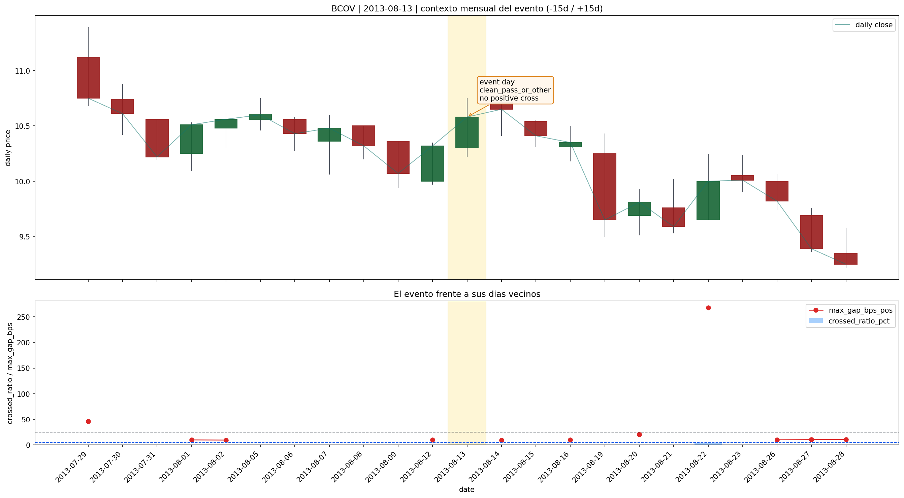

#### 00b Event Month Quotes Context
Esta imagen responde a la pregunta de recurrencia mensual dentro de `quotes`: el problema se concentra en el evento o reaparece en varias sesiones. Arriba concatena sesiones con datos disponibles; abajo resume cobertura diaria, `crossed_ratio_pct` y `max_gap_bps_pos`. La decision que cambia es si el caso debe leerse como episodio puntual o como sintoma de una fase repetida de libro degradado. El error que evita es extrapolar desde un unico dia a todo el mes sin evidencia.

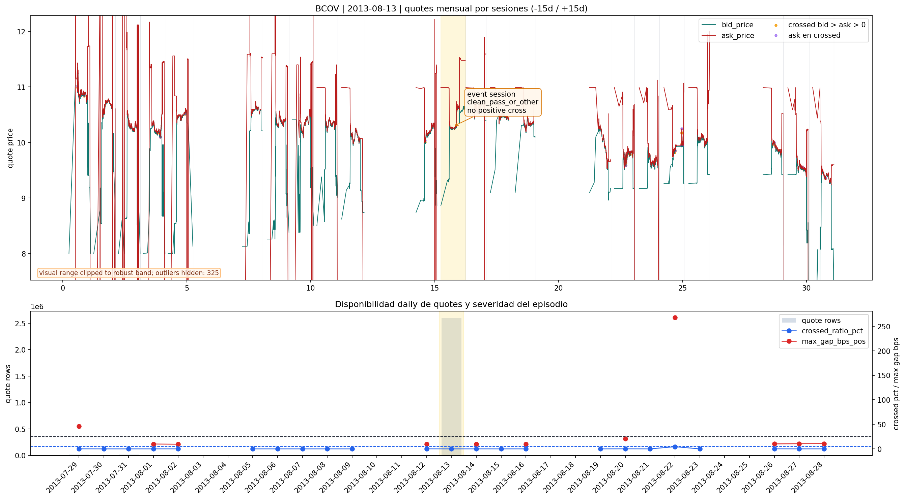

#### 01 Raw Window
Esta imagen responde a la primera pregunta decisiva: existe contradiccion economica positiva local o no. Arriba se comparan `bid_price` y `ask_price`; abajo se ve el `gap_bps` firmado. Si aqui no aparece `bid > ask > 0` material, no hay base para endurecer la clasificacion. La decision que protege es no convertir ruido inocuo en patologia.

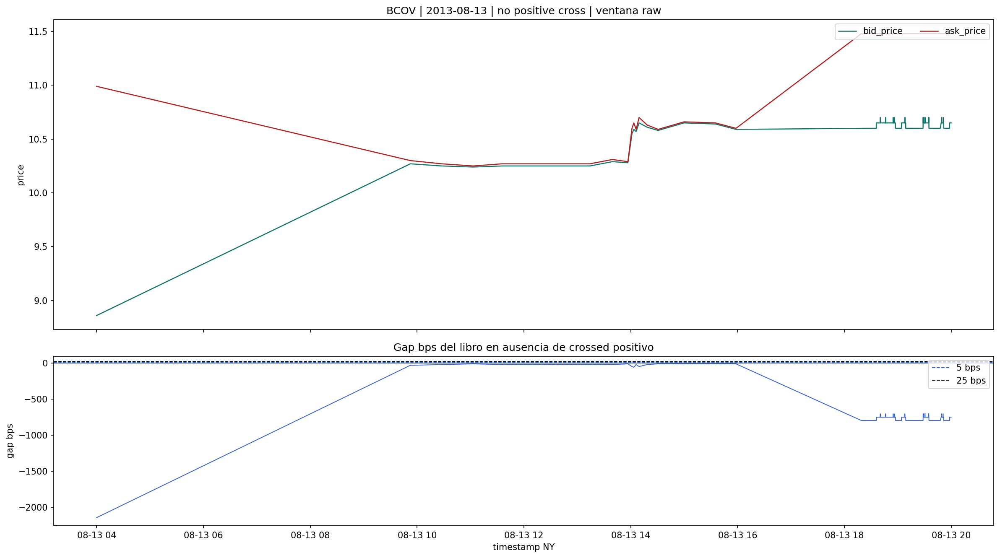

#### 02 Full Session Context
Esta imagen responde a la pregunta de extension intradiaria: el dano esta confinado a un bloque corto o contamina la sesion completa. Arriba se ve toda la sesion `04:00-20:00 NY`; abajo el `gap_bps` firmado. La decision que cambia es si el consumo debe penalizar solo un tramo o desechar el dia entero para uso operativo. El error que evita es tratar una cicatriz local como ruina total o, al reves, minimizar una degradacion distribuida a lo largo del dia. En ejecucion esto decide si la sesion puede seguir usandose con restricciones; en ML decide si las features intradiarias conservan significado economico.

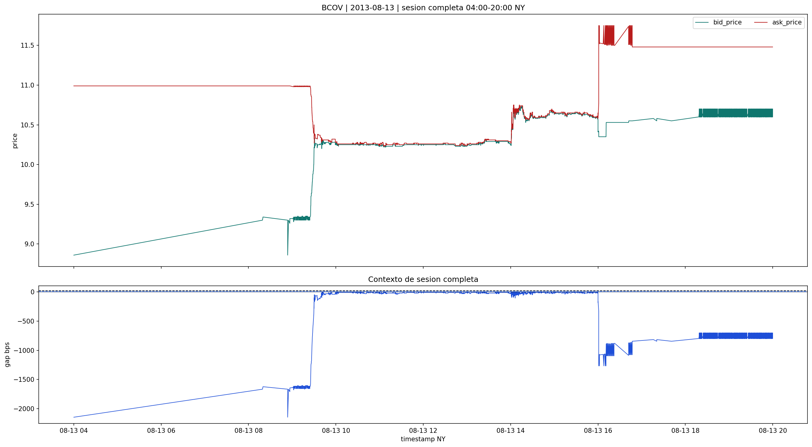

#### 03 Structure Diagnostics
Este panel responde a la pregunta de naturaleza del fallo: contradiccion economica genuina o mezcla con degeneracion estructural. Separa `ask=0` de `ask>0`, muestra la distribucion de `gap_bps` y resume patrones de integerizacion. La decision que cambia es como interpretar el dano: mercado localmente roto, artefacto de representacion o combinacion de ambos. El error que evita es sobrediagnosticar crossed reales cuando parte de la senal proviene de estructura degenerada del libro. Esta lectura afecta directamente a que el caso vaya a exclusion dura, a bandera contextual o a simple reconciliacion tecnica.

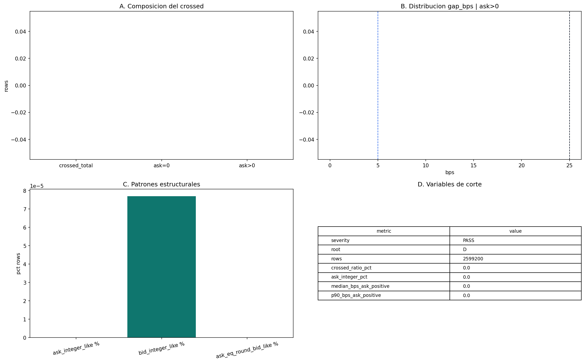

#### 04 Summary Card
Esta tarjeta responde a la pregunta de auditabilidad: cuales son exactamente las variables que sostienen la conclusion. Reune `severity`, `root`, `crossed_ratio_pct`, `ask_integer_pct`, `median_bps_ask_positive` y `p90_bps_ask_positive`. La decision que cambia es pasar de impresion visual a regla verificable. El error que evita es que dos inspectores lleguen a conclusiones distintas mirando la misma imagen sin una base numerica comun. Para gobernanza del proyecto, este panel es el que vuelve reproducible la decision para backtest, ML y auditoria.

---

### 2. TOF 2010-09-01

company_name: `TOFUTTI BRANDS INC`
primary_exchange: `NYSE American` (`XASE`)
market_locale: `stocks/us`
scope: `good`
ticker: `TOF`
date: `2010-09-01`
taxonomy: `clean_pass_or_other`
positive_cross_bucket: `no_positive_cross`
severity: `PASS`
root: `C`
rows: `466649`
crossed_ratio_pct: `0.000000`
crossed_rows_raw: `0`
crossed_rows_ask_zero: `0`
crossed_rows_ask_positive: `0`
ask_integer_pct: `0.000000`
median_bps_ask_positive: `0.000000`
p90_bps_ask_positive: `0.000000`
file: `C:\TSIS_Data\data\quotes\TOF\year=2010\month=09\day=01\quotes.parquet`

#### Analisis Forense
La conclusion correcta del caso es que el libro mantiene semantica economica util. El residuo observado no cambia de forma material la lectura del spread ni invalida el uso operativo normal del dia. La taxonomy historica es `clean_pass_or_other` y el regimen positivo dominante es `no positive cross`. Esto importa porque la taxonomy no solo clasifica: resume que tipo de anomalia se esta viendo y que clase de decision contractual puede defenderse despues. La taxonomy `clean_pass_or_other` implica que el bloque no necesita defensa causal compleja: el libro ya pasa su prueba economica minima y no exige reinterpretacion forense intensa. El regimen `no positive cross` significa que el caso no presenta contradiccion economica positiva directa; cualquier rareza restante debe interpretarse como estructura, cobertura o residuo no decisional. En terminos observables, el file tiene `crossed_ratio_pct=0.000000` sin filas `bid > ask > 0`; `crossed_rows_ask_positive=0` y `crossed_rows_ask_zero=0`. El hecho que esto prueba es que no aparece contradiccion economica positiva material. La decision que cambia es no escalar el caso artificialmente a `review` o `bad`. El error metodologico que evita es castigar rarezas visuales o ruido de libro sin dano economico real. Para backtest y ML esto protege el universo util: evita etiquetar como patologico un dia que sigue siendo compatible con consumo principal. El patron estructural muestra `ask_integer_pct=0.000000`. Este numero obliga a separar dos explicaciones rivales: contradiccion economica genuina del libro o mezcla con degeneracion estructural / integerizacion. Como no hay crossed material en el file, la composicion `ask=0` vs `ask>0` no es el eje que decide el caso. Como `ask_integer_pct` es bajo, la hipotesis de simple degeneracion mecanica pierde fuerza. Eso endurece la interpretacion: el crossed se parece mas a contradiccion economica genuina y menos a artefacto. Existe ademas una imagen historica de certificacion asociada. Su papel es poner el episodio en un marco causal mas amplio: halt, explained, not strongly explained o patron conocido. La regla que protege al proyecto es esta: el contexto externo se usa para explicar por que aparece el episodio, no para absolverlo. El error que evita es degradar el criterio de calidad del libro porque exista una historia plausible alrededor del caso.

#### 00 Event Month Context
Esta imagen responde a la pregunta de persistencia temporal: estamos ante un accidente local o ante una fase mas amplia de inestabilidad. Arriba coloca el evento en la serie `daily` real del mes; abajo compara `crossed_ratio_pct` y `max_gap_bps_pos` del dia contra sus vecinos. La decision que cambia es el peso estructural que se le concede al caso. El error que evita es juzgar igual un shock aislado y una degradacion repetida del libro.

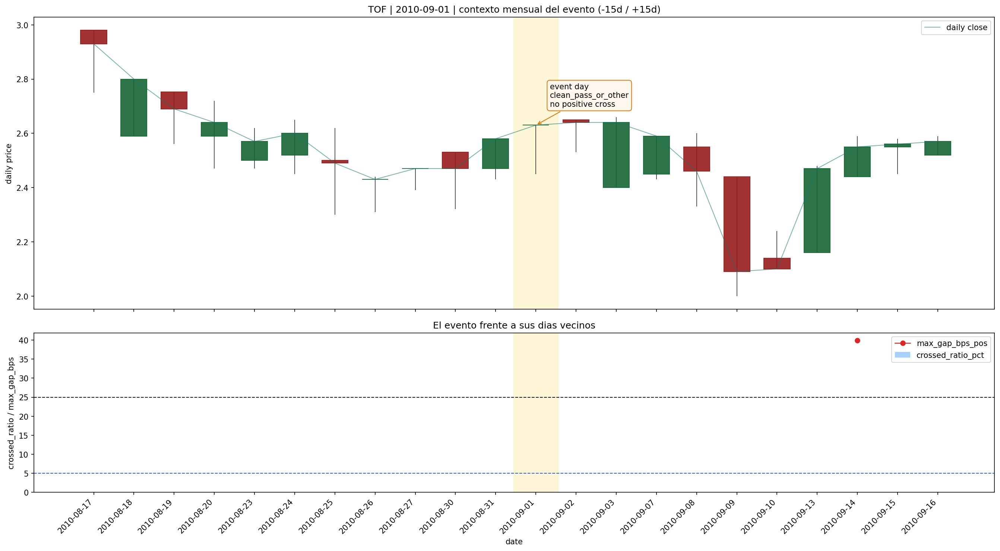

#### 00b Event Month Quotes Context
Esta imagen responde a la pregunta de recurrencia mensual dentro de `quotes`: el problema se concentra en el evento o reaparece en varias sesiones. Arriba concatena sesiones con datos disponibles; abajo resume cobertura diaria, `crossed_ratio_pct` y `max_gap_bps_pos`. La decision que cambia es si el caso debe leerse como episodio puntual o como sintoma de una fase repetida de libro degradado. El error que evita es extrapolar desde un unico dia a todo el mes sin evidencia.

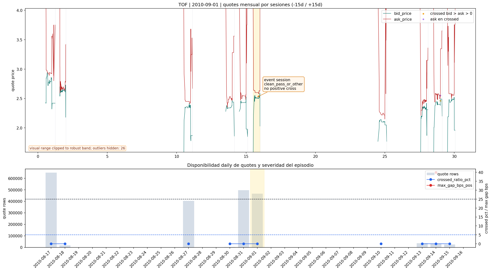

#### 01 Raw Window
Esta imagen responde a la primera pregunta decisiva: existe contradiccion economica positiva local o no. Arriba se comparan `bid_price` y `ask_price`; abajo se ve el `gap_bps` firmado. Si aqui no aparece `bid > ask > 0` material, no hay base para endurecer la clasificacion. La decision que protege es no convertir ruido inocuo en patologia.

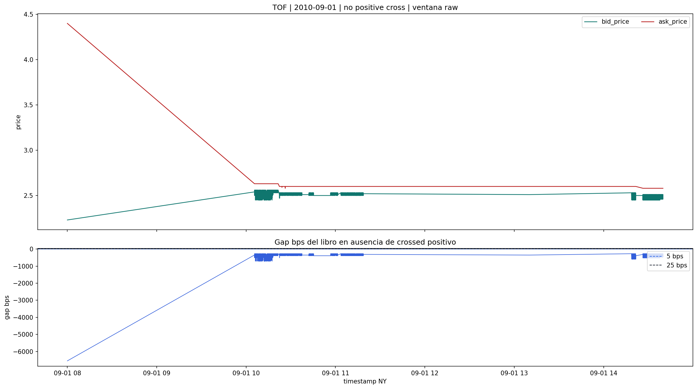

#### 02 Full Session Context
Esta imagen responde a la pregunta de extension intradiaria: el dano esta confinado a un bloque corto o contamina la sesion completa. Arriba se ve toda la sesion `04:00-20:00 NY`; abajo el `gap_bps` firmado. La decision que cambia es si el consumo debe penalizar solo un tramo o desechar el dia entero para uso operativo. El error que evita es tratar una cicatriz local como ruina total o, al reves, minimizar una degradacion distribuida a lo largo del dia. En ejecucion esto decide si la sesion puede seguir usandose con restricciones; en ML decide si las features intradiarias conservan significado economico.

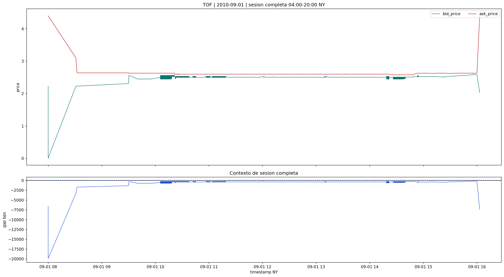

#### 03 Structure Diagnostics
Este panel responde a la pregunta de naturaleza del fallo: contradiccion economica genuina o mezcla con degeneracion estructural. Separa `ask=0` de `ask>0`, muestra la distribucion de `gap_bps` y resume patrones de integerizacion. La decision que cambia es como interpretar el dano: mercado localmente roto, artefacto de representacion o combinacion de ambos. El error que evita es sobrediagnosticar crossed reales cuando parte de la senal proviene de estructura degenerada del libro. Esta lectura afecta directamente a que el caso vaya a exclusion dura, a bandera contextual o a simple reconciliacion tecnica.

#### 04 Summary Card
Esta tarjeta responde a la pregunta de auditabilidad: cuales son exactamente las variables que sostienen la conclusion. Reune `severity`, `root`, `crossed_ratio_pct`, `ask_integer_pct`, `median_bps_ask_positive` y `p90_bps_ask_positive`. La decision que cambia es pasar de impresion visual a regla verificable. El error que evita es que dos inspectores lleguen a conclusiones distintas mirando la misma imagen sin una base numerica comun. Para gobernanza del proyecto, este panel es el que vuelve reproducible la decision para backtest, ML y auditoria.

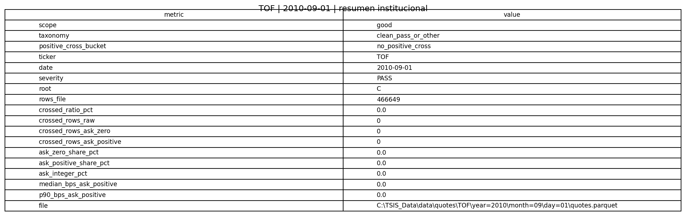

---

### 3. TOF 2010-08-16

company_name: `TOFUTTI BRANDS INC`
primary_exchange: `NYSE American` (`XASE`)
market_locale: `stocks/us`
scope: `good`
ticker: `TOF`
date: `2010-08-16`
taxonomy: `clean_pass_or_other`
positive_cross_bucket: `no_positive_cross`
severity: `PASS`
root: `C`
rows: `439265`
crossed_ratio_pct: `0.000000`
crossed_rows_raw: `0`
crossed_rows_ask_zero: `0`
crossed_rows_ask_positive: `0`
ask_integer_pct: `0.000000`
median_bps_ask_positive: `0.000000`
p90_bps_ask_positive: `0.000000`
file: `C:\TSIS_Data\data\quotes\TOF\year=2010\month=08\day=16\quotes.parquet`

#### Analisis Forense
La conclusion correcta del caso es que el libro mantiene semantica economica util. El residuo observado no cambia de forma material la lectura del spread ni invalida el uso operativo normal del dia. La taxonomy historica es `clean_pass_or_other` y el regimen positivo dominante es `no positive cross`. Esto importa porque la taxonomy no solo clasifica: resume que tipo de anomalia se esta viendo y que clase de decision contractual puede defenderse despues. La taxonomy `clean_pass_or_other` implica que el bloque no necesita defensa causal compleja: el libro ya pasa su prueba economica minima y no exige reinterpretacion forense intensa. El regimen `no positive cross` significa que el caso no presenta contradiccion economica positiva directa; cualquier rareza restante debe interpretarse como estructura, cobertura o residuo no decisional. En terminos observables, el file tiene `crossed_ratio_pct=0.000000` sin filas `bid > ask > 0`; `crossed_rows_ask_positive=0` y `crossed_rows_ask_zero=0`. El hecho que esto prueba es que no aparece contradiccion economica positiva material. La decision que cambia es no escalar el caso artificialmente a `review` o `bad`. El error metodologico que evita es castigar rarezas visuales o ruido de libro sin dano economico real. Para backtest y ML esto protege el universo util: evita etiquetar como patologico un dia que sigue siendo compatible con consumo principal. El patron estructural muestra `ask_integer_pct=0.000000`. Este numero obliga a separar dos explicaciones rivales: contradiccion economica genuina del libro o mezcla con degeneracion estructural / integerizacion. Como no hay crossed material en el file, la composicion `ask=0` vs `ask>0` no es el eje que decide el caso. Como `ask_integer_pct` es bajo, la hipotesis de simple degeneracion mecanica pierde fuerza. Eso endurece la interpretacion: el crossed se parece mas a contradiccion economica genuina y menos a artefacto. Existe ademas una imagen historica de certificacion asociada. Su papel es poner el episodio en un marco causal mas amplio: halt, explained, not strongly explained o patron conocido. La regla que protege al proyecto es esta: el contexto externo se usa para explicar por que aparece el episodio, no para absolverlo. El error que evita es degradar el criterio de calidad del libro porque exista una historia plausible alrededor del caso.

#### 00 Event Month Context
Esta imagen responde a la pregunta de persistencia temporal: estamos ante un accidente local o ante una fase mas amplia de inestabilidad. Arriba coloca el evento en la serie `daily` real del mes; abajo compara `crossed_ratio_pct` y `max_gap_bps_pos` del dia contra sus vecinos. La decision que cambia es el peso estructural que se le concede al caso. El error que evita es juzgar igual un shock aislado y una degradacion repetida del libro.

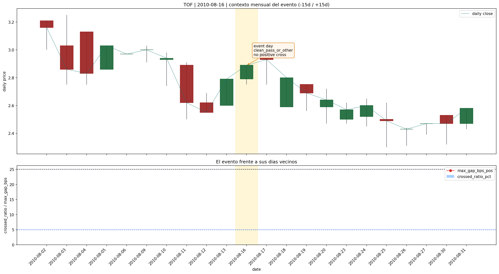

#### 00b Event Month Quotes Context
Esta imagen responde a la pregunta de recurrencia mensual dentro de `quotes`: el problema se concentra en el evento o reaparece en varias sesiones. Arriba concatena sesiones con datos disponibles; abajo resume cobertura diaria, `crossed_ratio_pct` y `max_gap_bps_pos`. La decision que cambia es si el caso debe leerse como episodio puntual o como sintoma de una fase repetida de libro degradado. El error que evita es extrapolar desde un unico dia a todo el mes sin evidencia.

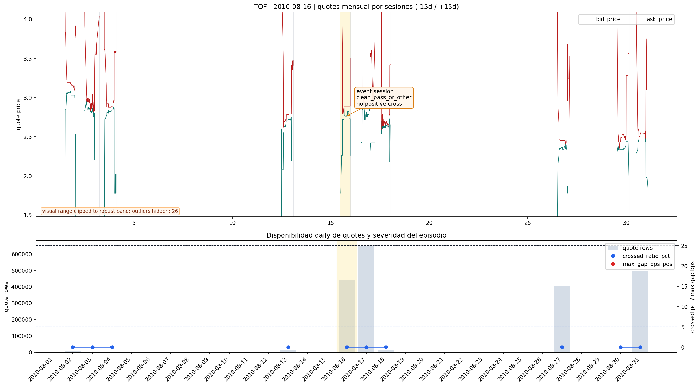

#### 01 Raw Window
Esta imagen responde a la primera pregunta decisiva: existe contradiccion economica positiva local o no. Arriba se comparan `bid_price` y `ask_price`; abajo se ve el `gap_bps` firmado. Si aqui no aparece `bid > ask > 0` material, no hay base para endurecer la clasificacion. La decision que protege es no convertir ruido inocuo en patologia.

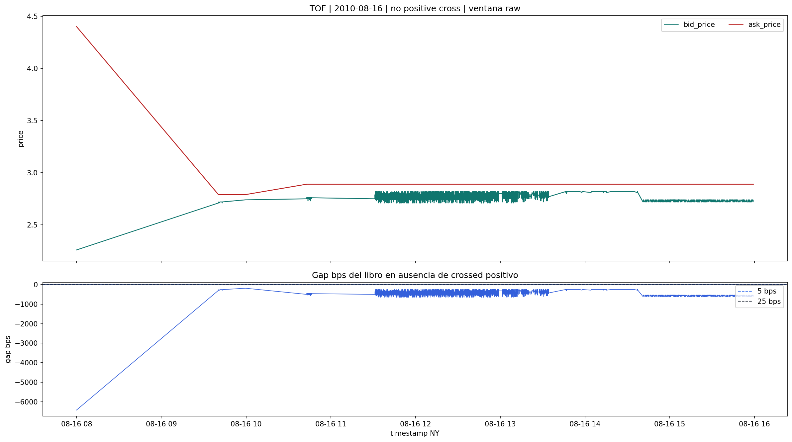

#### 02 Full Session Context
Esta imagen responde a la pregunta de extension intradiaria: el dano esta confinado a un bloque corto o contamina la sesion completa. Arriba se ve toda la sesion `04:00-20:00 NY`; abajo el `gap_bps` firmado. La decision que cambia es si el consumo debe penalizar solo un tramo o desechar el dia entero para uso operativo. El error que evita es tratar una cicatriz local como ruina total o, al reves, minimizar una degradacion distribuida a lo largo del dia. En ejecucion esto decide si la sesion puede seguir usandose con restricciones; en ML decide si las features intradiarias conservan significado economico.

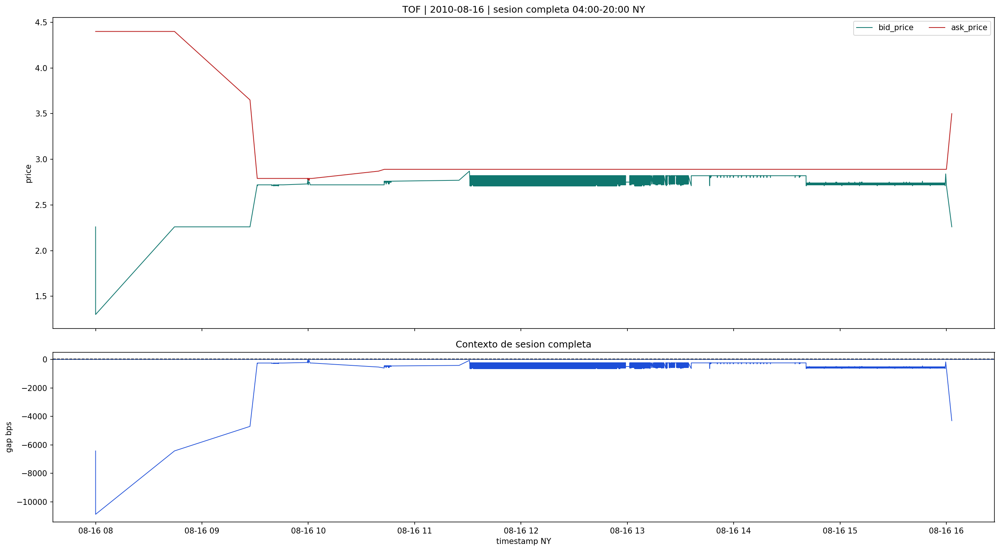

#### 03 Structure Diagnostics
Este panel responde a la pregunta de naturaleza del fallo: contradiccion economica genuina o mezcla con degeneracion estructural. Separa `ask=0` de `ask>0`, muestra la distribucion de `gap_bps` y resume patrones de integerizacion. La decision que cambia es como interpretar el dano: mercado localmente roto, artefacto de representacion o combinacion de ambos. El error que evita es sobrediagnosticar crossed reales cuando parte de la senal proviene de estructura degenerada del libro. Esta lectura afecta directamente a que el caso vaya a exclusion dura, a bandera contextual o a simple reconciliacion tecnica.

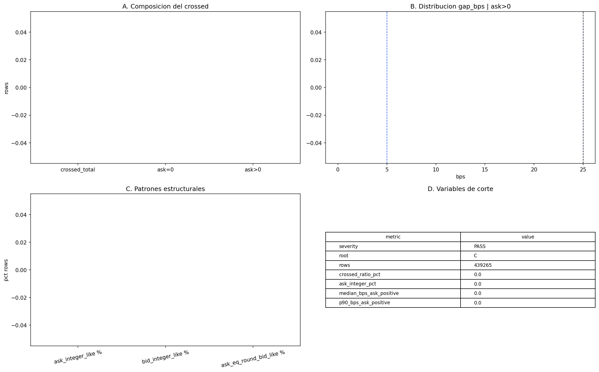

#### 04 Summary Card
Esta tarjeta responde a la pregunta de auditabilidad: cuales son exactamente las variables que sostienen la conclusion. Reune `severity`, `root`, `crossed_ratio_pct`, `ask_integer_pct`, `median_bps_ask_positive` y `p90_bps_ask_positive`. La decision que cambia es pasar de impresion visual a regla verificable. El error que evita es que dos inspectores lleguen a conclusiones distintas mirando la misma imagen sin una base numerica comun. Para gobernanza del proyecto, este panel es el que vuelve reproducible la decision para backtest, ML y auditoria.

---

### 4. SCNX 2025-10-23

company_name: `Scienture Holdings, Inc. Common Stock`
primary_exchange: `NASDAQ` (`XNAS`)
market_locale: `stocks/us`
scope: `good`
ticker: `SCNX`
date: `2025-10-23`
taxonomy: `persistent_soft_crossed_low`
positive_cross_bucket: `positive_cross_severe_ge25bps`
severity: `SOFT_FAIL`
root: `D`
rows: `827571`
crossed_ratio_pct: `0.307768`
crossed_rows_raw: `2547`
crossed_rows_ask_zero: `4`
crossed_rows_ask_positive: `2543`
ask_integer_pct: `0.498205`
median_bps_ask_positive: `45.766590`
p90_bps_ask_positive: `117.905444`
file: `D:\quotes\SCNX\year=2025\month=10\day=23\quotes.parquet`

#### Analisis Forense
La conclusion correcta del caso es que el libro mantiene semantica economica util. El residuo observado no cambia de forma material la lectura del spread ni invalida el uso operativo normal del dia. La taxonomy historica es `persistent_soft_crossed_low` y el regimen positivo dominante es `severe >=25 bps`. Esto importa porque la taxonomy no solo clasifica: resume que tipo de anomalia se esta viendo y que clase de decision contractual puede defenderse despues. La taxonomy `persistent_soft_crossed_low` implica persistencia real de crossed, aunque en una banda todavia compatible con uso principal si el dano economico sigue contenido. El regimen `severe >=25 bps` empuja el caso a una lectura economicamente dura: el crossed deja de ser cosmetico y pasa a cuestionar si el libro sigue siendo interpretable como mercado negociable. En terminos observables, el file tiene `crossed_ratio_pct=0.307768` con `crossed_rows_ask_positive=2543` y `crossed_rows_ask_zero=4`. La severidad economica del crossed ask>0 se resume en `median_bps_ask_positive=45.766590` y `p90_bps_ask_positive=117.905444`. Estos dos numeros convierten una forma visual rara en una conclusion operativa sobre si el libro sigue representando o no un mercado negociable. La decision que cambia es mantener el caso dentro de la franja util, aunque con lectura consciente de que existe una huella positiva leve o acotada. En `good`, el objetivo no es negar toda irregularidad, sino demostrar que la anomalia no destruye la semantica economica minima del libro ni invalida su uso principal. El error que evita esta lectura es sobrecastigar micro-residuos y encoger artificialmente el universo util para backtest y ML. El patron estructural muestra `ask_integer_pct=0.498205`. Este numero obliga a separar dos explicaciones rivales: contradiccion economica genuina del libro o mezcla con degeneracion estructural / integerizacion. La mayor parte del crossed vive en `ask>0`, de modo que el corazon del problema sigue siendo economico. La parte `ask=0`, si existe, acompana pero no explica por si sola la anomalia. Como `ask_integer_pct` es bajo, la hipotesis de simple degeneracion mecanica pierde fuerza. Eso endurece la interpretacion: el crossed se parece mas a contradiccion economica genuina y menos a artefacto. Existe ademas una imagen historica de certificacion asociada. Su papel es poner el episodio en un marco causal mas amplio: halt, explained, not strongly explained o patron conocido. La regla que protege al proyecto es esta: el contexto externo se usa para explicar por que aparece el episodio, no para absolverlo. El error que evita es degradar el criterio de calidad del libro porque exista una historia plausible alrededor del caso.

#### 00 Event Month Context
Esta imagen responde a la pregunta de persistencia temporal: estamos ante un accidente local o ante una fase mas amplia de inestabilidad. Arriba coloca el evento en la serie `daily` real del mes; abajo compara `crossed_ratio_pct` y `max_gap_bps_pos` del dia contra sus vecinos. La decision que cambia es el peso estructural que se le concede al caso. El error que evita es juzgar igual un shock aislado y una degradacion repetida del libro.

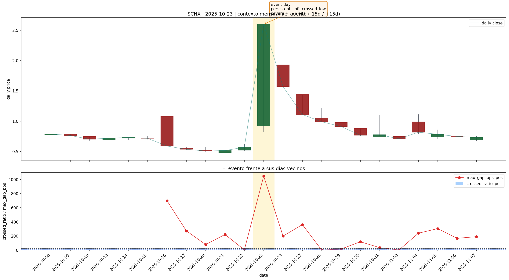

#### 00b Event Month Quotes Context
Esta imagen responde a la pregunta de recurrencia mensual dentro de `quotes`: el problema se concentra en el evento o reaparece en varias sesiones. Arriba concatena sesiones con datos disponibles; abajo resume cobertura diaria, `crossed_ratio_pct` y `max_gap_bps_pos`. La decision que cambia es si el caso debe leerse como episodio puntual o como sintoma de una fase repetida de libro degradado. El error que evita es extrapolar desde un unico dia a todo el mes sin evidencia.

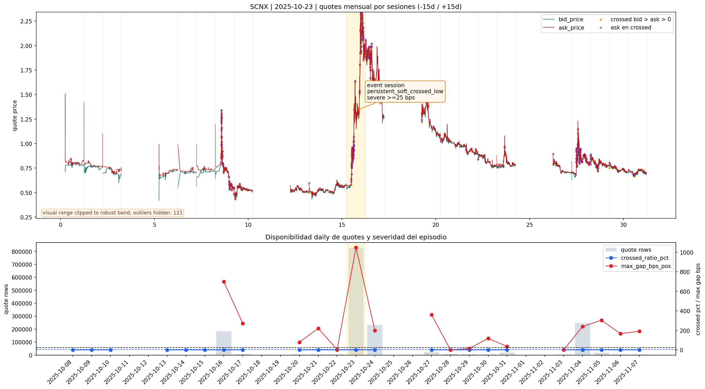

#### 01 Raw Window
Esta imagen responde a la primera pregunta decisiva del caso: el crossed observado, si existe, sigue siendo compatible con permanencia en `good` o no. Arriba ensena la geometria exacta del tramo conflictivo; abajo convierte esa geometria a bps y la enfrenta a los cortes `5 bps` y `25 bps`. El regimen dominante es `severe >=25 bps`. La decision que cambia es demostrar que el residuo permanece por debajo del dano que obligaria a mover el caso a `review` o `bad`. El error que evita es expulsar del universo util episodios leves cuyo impacto sobre ejecucion y features sigue siendo tolerable.

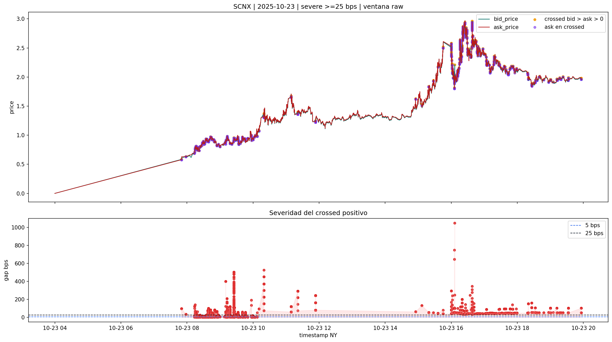

#### 02 Full Session Context
Esta imagen responde a la pregunta de extension intradiaria: el dano esta confinado a un bloque corto o contamina la sesion completa. Arriba se ve toda la sesion `04:00-20:00 NY`; abajo el `gap_bps` firmado. La decision que cambia es si el consumo debe penalizar solo un tramo o desechar el dia entero para uso operativo. El error que evita es tratar una cicatriz local como ruina total o, al reves, minimizar una degradacion distribuida a lo largo del dia. En ejecucion esto decide si la sesion puede seguir usandose con restricciones; en ML decide si las features intradiarias conservan significado economico.

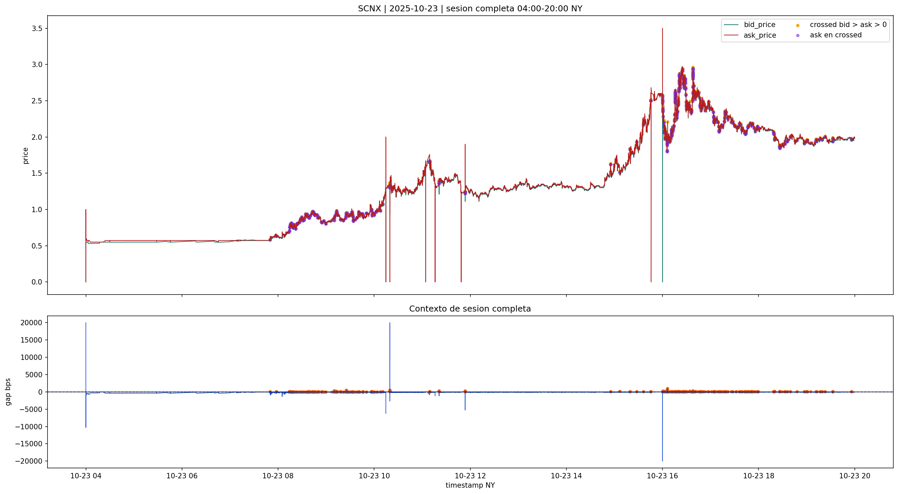

#### 03 Structure Diagnostics
Este panel responde a la pregunta de naturaleza del fallo: contradiccion economica genuina o mezcla con degeneracion estructural. Separa `ask=0` de `ask>0`, muestra la distribucion de `gap_bps` y resume patrones de integerizacion. La decision que cambia es como interpretar el dano: mercado localmente roto, artefacto de representacion o combinacion de ambos. El error que evita es sobrediagnosticar crossed reales cuando parte de la senal proviene de estructura degenerada del libro. Esta lectura afecta directamente a que el caso vaya a exclusion dura, a bandera contextual o a simple reconciliacion tecnica.

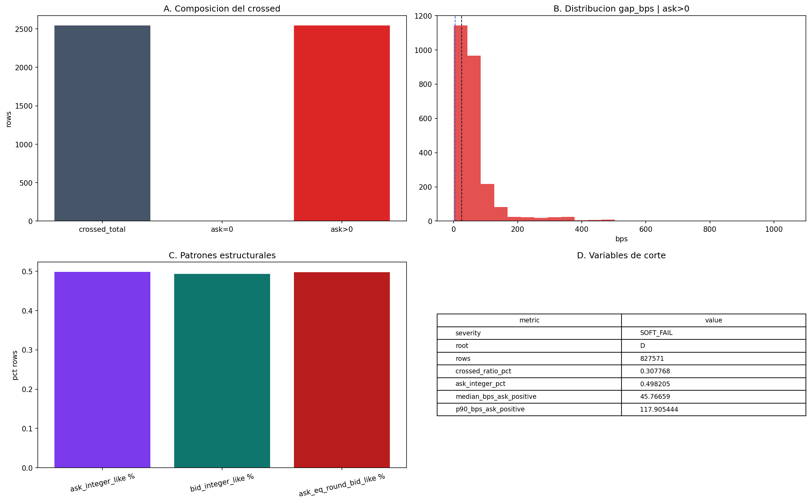

#### 04 Summary Card
Esta tarjeta responde a la pregunta de auditabilidad: cuales son exactamente las variables que sostienen la conclusion. Reune `severity`, `root`, `crossed_ratio_pct`, `ask_integer_pct`, `median_bps_ask_positive` y `p90_bps_ask_positive`. La decision que cambia es pasar de impresion visual a regla verificable. El error que evita es que dos inspectores lleguen a conclusiones distintas mirando la misma imagen sin una base numerica comun. Para gobernanza del proyecto, este panel es el que vuelve reproducible la decision para backtest, ML y auditoria.

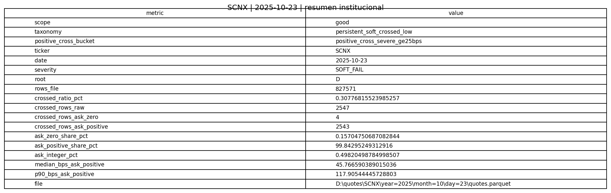

---

### 5. AMC 2024-05-14

company_name: `AMER MORT ACCEPT(SHS BENE INT`
primary_exchange: `NYSE American` (`XASE`)
market_locale: `stocks/us`
scope: `good`
ticker: `AMC`
date: `2024-05-14`
taxonomy: `persistent_soft_crossed_low`
positive_cross_bucket: `positive_cross_severe_ge25bps`
severity: `SOFT_FAIL`
root: `D`
rows: `1654368`
crossed_ratio_pct: `0.263726`
crossed_rows_raw: `4363`
crossed_rows_ask_zero: `22`
crossed_rows_ask_positive: `4341`
ask_integer_pct: `1.133666`
median_bps_ask_positive: `19.821606`
p90_bps_ask_positive: `115.990058`
file: `D:\quotes\AMC\year=2024\month=05\day=14\quotes.parquet`

#### Analisis Forense
La conclusion correcta del caso es que el libro mantiene semantica economica util. El residuo observado no cambia de forma material la lectura del spread ni invalida el uso operativo normal del dia. La taxonomy historica es `persistent_soft_crossed_low` y el regimen positivo dominante es `severe >=25 bps`. Esto importa porque la taxonomy no solo clasifica: resume que tipo de anomalia se esta viendo y que clase de decision contractual puede defenderse despues. La taxonomy `persistent_soft_crossed_low` implica persistencia real de crossed, aunque en una banda todavia compatible con uso principal si el dano economico sigue contenido. El regimen `severe >=25 bps` empuja el caso a una lectura economicamente dura: el crossed deja de ser cosmetico y pasa a cuestionar si el libro sigue siendo interpretable como mercado negociable. En terminos observables, el file tiene `crossed_ratio_pct=0.263726` con `crossed_rows_ask_positive=4341` y `crossed_rows_ask_zero=22`. La severidad economica del crossed ask>0 se resume en `median_bps_ask_positive=19.821606` y `p90_bps_ask_positive=115.990058`. Estos dos numeros convierten una forma visual rara en una conclusion operativa sobre si el libro sigue representando o no un mercado negociable. La decision que cambia es mantener el caso dentro de la franja util, aunque con lectura consciente de que existe una huella positiva leve o acotada. En `good`, el objetivo no es negar toda irregularidad, sino demostrar que la anomalia no destruye la semantica economica minima del libro ni invalida su uso principal. El error que evita esta lectura es sobrecastigar micro-residuos y encoger artificialmente el universo util para backtest y ML. El patron estructural muestra `ask_integer_pct=1.133666`. Este numero obliga a separar dos explicaciones rivales: contradiccion economica genuina del libro o mezcla con degeneracion estructural / integerizacion. La mayor parte del crossed vive en `ask>0`, de modo que el corazon del problema sigue siendo economico. La parte `ask=0`, si existe, acompana pero no explica por si sola la anomalia. Como `ask_integer_pct` es bajo, la hipotesis de simple degeneracion mecanica pierde fuerza. Eso endurece la interpretacion: el crossed se parece mas a contradiccion economica genuina y menos a artefacto. Existe ademas una imagen historica de certificacion asociada. Su papel es poner el episodio en un marco causal mas amplio: halt, explained, not strongly explained o patron conocido. La regla que protege al proyecto es esta: el contexto externo se usa para explicar por que aparece el episodio, no para absolverlo. El error que evita es degradar el criterio de calidad del libro porque exista una historia plausible alrededor del caso.

#### 00 Event Month Context
Esta imagen responde a la pregunta de persistencia temporal: estamos ante un accidente local o ante una fase mas amplia de inestabilidad. Arriba coloca el evento en la serie `daily` real del mes; abajo compara `crossed_ratio_pct` y `max_gap_bps_pos` del dia contra sus vecinos. La decision que cambia es el peso estructural que se le concede al caso. El error que evita es juzgar igual un shock aislado y una degradacion repetida del libro.

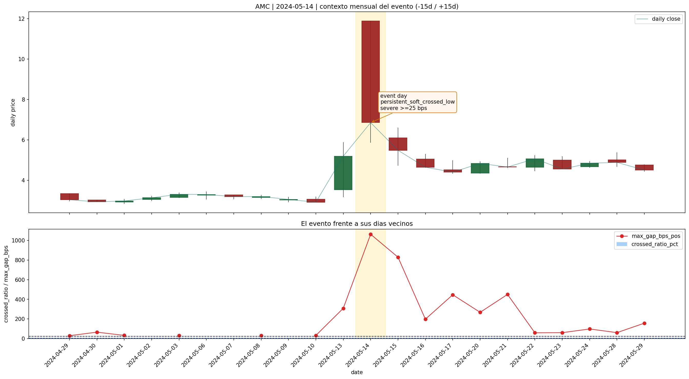

#### 00b Event Month Quotes Context
Esta imagen responde a la pregunta de recurrencia mensual dentro de `quotes`: el problema se concentra en el evento o reaparece en varias sesiones. Arriba concatena sesiones con datos disponibles; abajo resume cobertura diaria, `crossed_ratio_pct` y `max_gap_bps_pos`. La decision que cambia es si el caso debe leerse como episodio puntual o como sintoma de una fase repetida de libro degradado. El error que evita es extrapolar desde un unico dia a todo el mes sin evidencia.

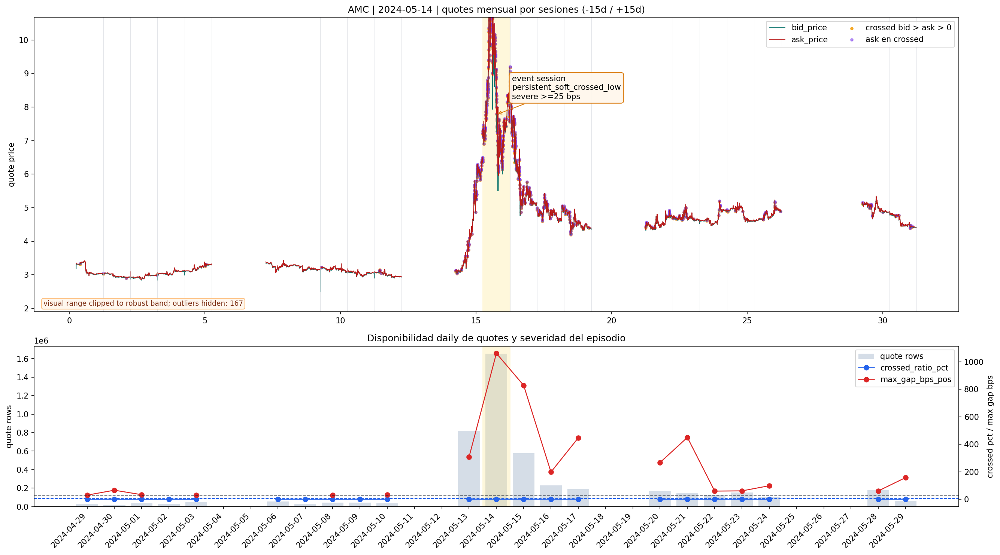

#### 01 Raw Window
Esta imagen responde a la primera pregunta decisiva del caso: el crossed observado, si existe, sigue siendo compatible con permanencia en `good` o no. Arriba ensena la geometria exacta del tramo conflictivo; abajo convierte esa geometria a bps y la enfrenta a los cortes `5 bps` y `25 bps`. El regimen dominante es `severe >=25 bps`. La decision que cambia es demostrar que el residuo permanece por debajo del dano que obligaria a mover el caso a `review` o `bad`. El error que evita es expulsar del universo util episodios leves cuyo impacto sobre ejecucion y features sigue siendo tolerable.

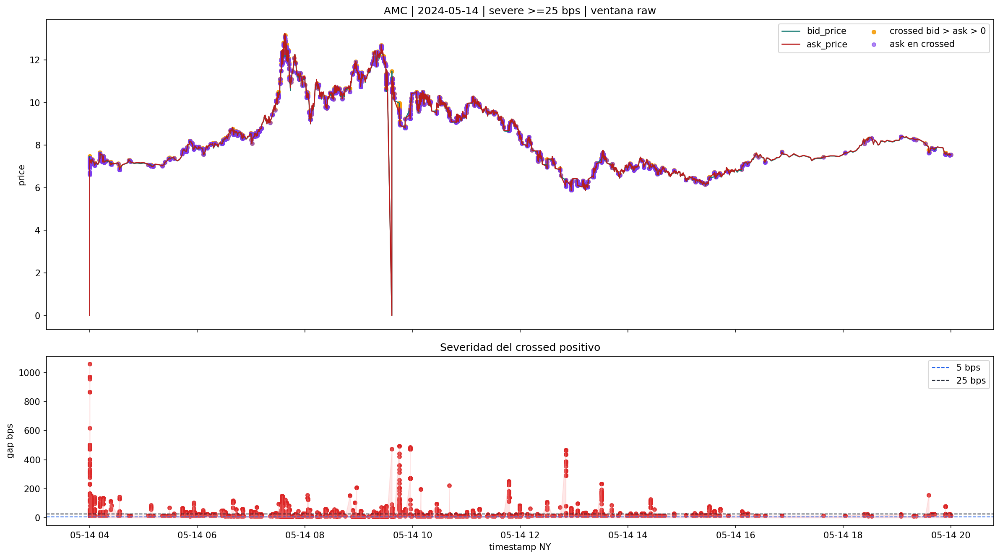

#### 02 Full Session Context
Esta imagen responde a la pregunta de extension intradiaria: el dano esta confinado a un bloque corto o contamina la sesion completa. Arriba se ve toda la sesion `04:00-20:00 NY`; abajo el `gap_bps` firmado. La decision que cambia es si el consumo debe penalizar solo un tramo o desechar el dia entero para uso operativo. El error que evita es tratar una cicatriz local como ruina total o, al reves, minimizar una degradacion distribuida a lo largo del dia. En ejecucion esto decide si la sesion puede seguir usandose con restricciones; en ML decide si las features intradiarias conservan significado economico.

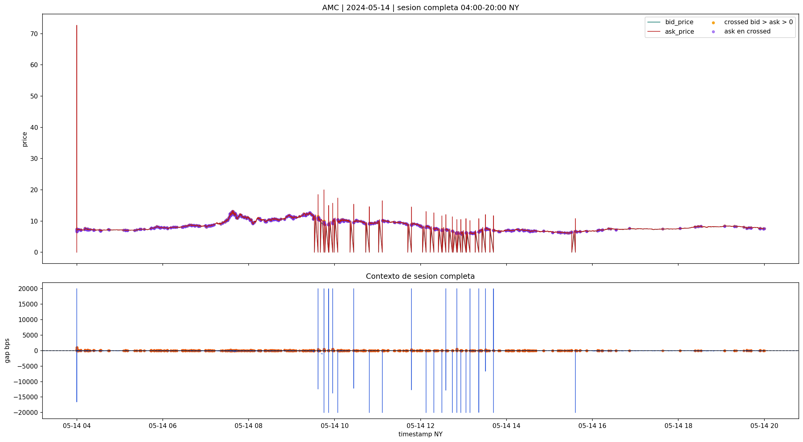

#### 03 Structure Diagnostics
Este panel responde a la pregunta de naturaleza del fallo: contradiccion economica genuina o mezcla con degeneracion estructural. Separa `ask=0` de `ask>0`, muestra la distribucion de `gap_bps` y resume patrones de integerizacion. La decision que cambia es como interpretar el dano: mercado localmente roto, artefacto de representacion o combinacion de ambos. El error que evita es sobrediagnosticar crossed reales cuando parte de la senal proviene de estructura degenerada del libro. Esta lectura afecta directamente a que el caso vaya a exclusion dura, a bandera contextual o a simple reconciliacion tecnica.

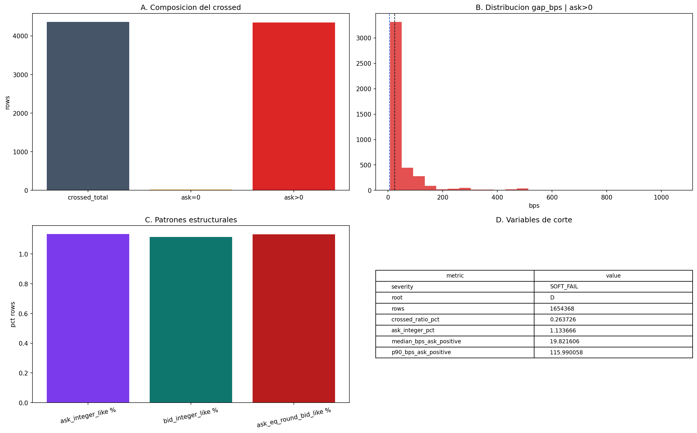

#### 04 Summary Card
Esta tarjeta responde a la pregunta de auditabilidad: cuales son exactamente las variables que sostienen la conclusion. Reune `severity`, `root`, `crossed_ratio_pct`, `ask_integer_pct`, `median_bps_ask_positive` y `p90_bps_ask_positive`. La decision que cambia es pasar de impresion visual a regla verificable. El error que evita es que dos inspectores lleguen a conclusiones distintas mirando la misma imagen sin una base numerica comun. Para gobernanza del proyecto, este panel es el que vuelve reproducible la decision para backtest, ML y auditoria.

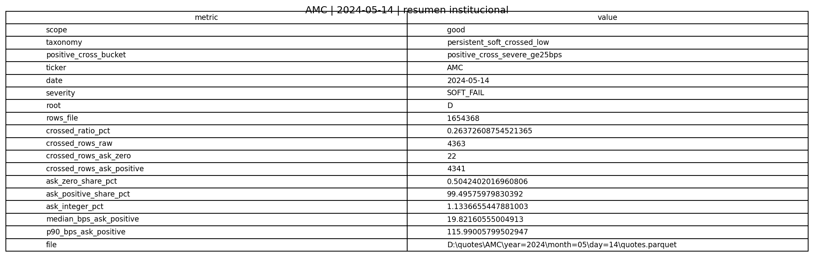

---

### 6. REPL 2025-07-30

company_name: `Replimune Group, Inc.`
primary_exchange: `NASDAQ` (`XNAS`)
market_locale: `stocks/us`
scope: `good`
ticker: `REPL`
date: `2025-07-30`
taxonomy: `persistent_soft_crossed_low`
positive_cross_bucket: `positive_cross_severe_ge25bps`
severity: `SOFT_FAIL`
root: `D`
rows: `1256438`
crossed_ratio_pct: `0.316052`
crossed_rows_raw: `3971`
crossed_rows_ask_zero: `1`
crossed_rows_ask_positive: `3970`
ask_integer_pct: `1.198308`
median_bps_ask_positive: `17.196905`
p90_bps_ask_positive: `44.543430`
file: `D:\quotes\REPL\year=2025\month=07\day=30\quotes.parquet`

#### Analisis Forense
La conclusion correcta del caso es que el libro mantiene semantica economica util. El residuo observado no cambia de forma material la lectura del spread ni invalida el uso operativo normal del dia. La taxonomy historica es `persistent_soft_crossed_low` y el regimen positivo dominante es `severe >=25 bps`. Esto importa porque la taxonomy no solo clasifica: resume que tipo de anomalia se esta viendo y que clase de decision contractual puede defenderse despues. La taxonomy `persistent_soft_crossed_low` implica persistencia real de crossed, aunque en una banda todavia compatible con uso principal si el dano economico sigue contenido. El regimen `severe >=25 bps` empuja el caso a una lectura economicamente dura: el crossed deja de ser cosmetico y pasa a cuestionar si el libro sigue siendo interpretable como mercado negociable. En terminos observables, el file tiene `crossed_ratio_pct=0.316052` con `crossed_rows_ask_positive=3970` y `crossed_rows_ask_zero=1`. La severidad economica del crossed ask>0 se resume en `median_bps_ask_positive=17.196905` y `p90_bps_ask_positive=44.543430`. Estos dos numeros convierten una forma visual rara en una conclusion operativa sobre si el libro sigue representando o no un mercado negociable. La decision que cambia es mantener el caso dentro de la franja util, aunque con lectura consciente de que existe una huella positiva leve o acotada. En `good`, el objetivo no es negar toda irregularidad, sino demostrar que la anomalia no destruye la semantica economica minima del libro ni invalida su uso principal. El error que evita esta lectura es sobrecastigar micro-residuos y encoger artificialmente el universo util para backtest y ML. El patron estructural muestra `ask_integer_pct=1.198308`. Este numero obliga a separar dos explicaciones rivales: contradiccion economica genuina del libro o mezcla con degeneracion estructural / integerizacion. La mayor parte del crossed vive en `ask>0`, de modo que el corazon del problema sigue siendo economico. La parte `ask=0`, si existe, acompana pero no explica por si sola la anomalia. Como `ask_integer_pct` es bajo, la hipotesis de simple degeneracion mecanica pierde fuerza. Eso endurece la interpretacion: el crossed se parece mas a contradiccion economica genuina y menos a artefacto. Existe ademas una imagen historica de certificacion asociada. Su papel es poner el episodio en un marco causal mas amplio: halt, explained, not strongly explained o patron conocido. La regla que protege al proyecto es esta: el contexto externo se usa para explicar por que aparece el episodio, no para absolverlo. El error que evita es degradar el criterio de calidad del libro porque exista una historia plausible alrededor del caso.

#### 00 Event Month Context
Esta imagen responde a la pregunta de persistencia temporal: estamos ante un accidente local o ante una fase mas amplia de inestabilidad. Arriba coloca el evento en la serie `daily` real del mes; abajo compara `crossed_ratio_pct` y `max_gap_bps_pos` del dia contra sus vecinos. La decision que cambia es el peso estructural que se le concede al caso. El error que evita es juzgar igual un shock aislado y una degradacion repetida del libro.

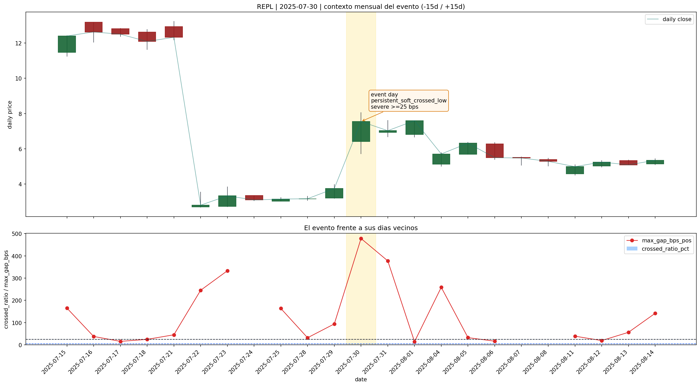

#### 00b Event Month Quotes Context
Esta imagen responde a la pregunta de recurrencia mensual dentro de `quotes`: el problema se concentra en el evento o reaparece en varias sesiones. Arriba concatena sesiones con datos disponibles; abajo resume cobertura diaria, `crossed_ratio_pct` y `max_gap_bps_pos`. La decision que cambia es si el caso debe leerse como episodio puntual o como sintoma de una fase repetida de libro degradado. El error que evita es extrapolar desde un unico dia a todo el mes sin evidencia.

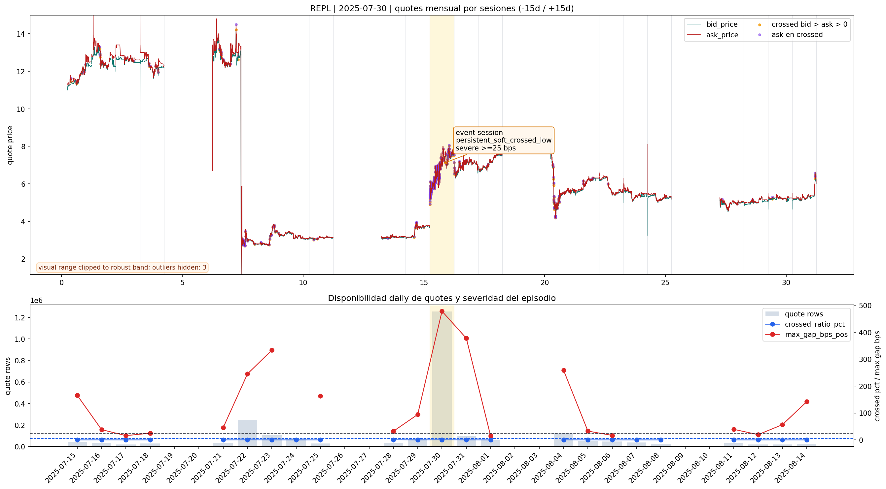

#### 01 Raw Window
Esta imagen responde a la primera pregunta decisiva del caso: el crossed observado, si existe, sigue siendo compatible con permanencia en `good` o no. Arriba ensena la geometria exacta del tramo conflictivo; abajo convierte esa geometria a bps y la enfrenta a los cortes `5 bps` y `25 bps`. El regimen dominante es `severe >=25 bps`. La decision que cambia es demostrar que el residuo permanece por debajo del dano que obligaria a mover el caso a `review` o `bad`. El error que evita es expulsar del universo util episodios leves cuyo impacto sobre ejecucion y features sigue siendo tolerable.

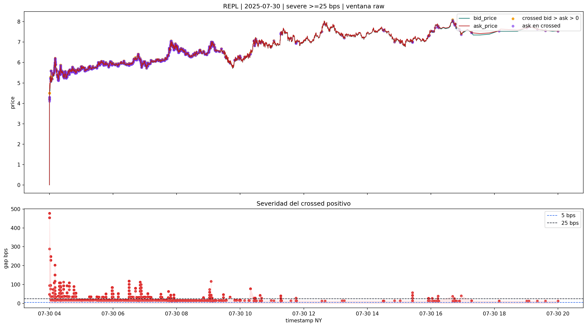

#### 02 Full Session Context
Esta imagen responde a la pregunta de extension intradiaria: el dano esta confinado a un bloque corto o contamina la sesion completa. Arriba se ve toda la sesion `04:00-20:00 NY`; abajo el `gap_bps` firmado. La decision que cambia es si el consumo debe penalizar solo un tramo o desechar el dia entero para uso operativo. El error que evita es tratar una cicatriz local como ruina total o, al reves, minimizar una degradacion distribuida a lo largo del dia. En ejecucion esto decide si la sesion puede seguir usandose con restricciones; en ML decide si las features intradiarias conservan significado economico.

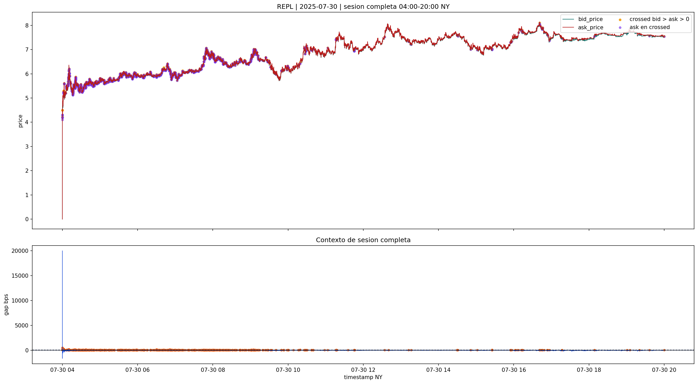

#### 03 Structure Diagnostics
Este panel responde a la pregunta de naturaleza del fallo: contradiccion economica genuina o mezcla con degeneracion estructural. Separa `ask=0` de `ask>0`, muestra la distribucion de `gap_bps` y resume patrones de integerizacion. La decision que cambia es como interpretar el dano: mercado localmente roto, artefacto de representacion o combinacion de ambos. El error que evita es sobrediagnosticar crossed reales cuando parte de la senal proviene de estructura degenerada del libro. Esta lectura afecta directamente a que el caso vaya a exclusion dura, a bandera contextual o a simple reconciliacion tecnica.

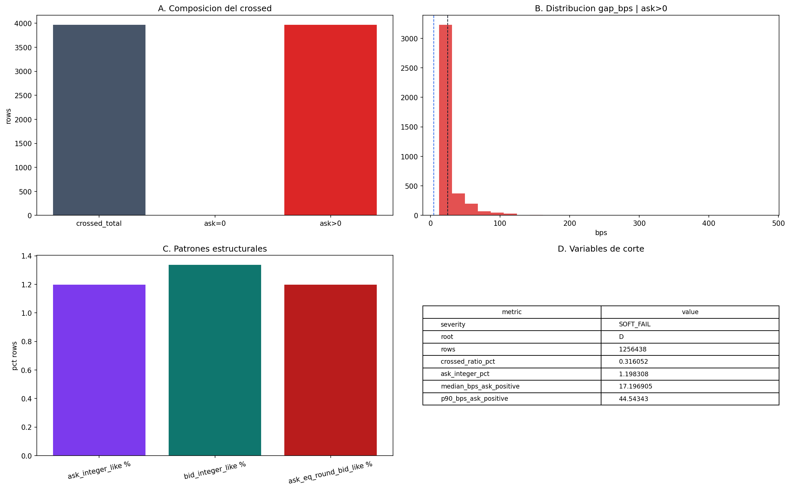

#### 04 Summary Card
Esta tarjeta responde a la pregunta de auditabilidad: cuales son exactamente las variables que sostienen la conclusion. Reune `severity`, `root`, `crossed_ratio_pct`, `ask_integer_pct`, `median_bps_ask_positive` y `p90_bps_ask_positive`. La decision que cambia es pasar de impresion visual a regla verificable. El error que evita es que dos inspectores lleguen a conclusiones distintas mirando la misma imagen sin una base numerica comun. Para gobernanza del proyecto, este panel es el que vuelve reproducible la decision para backtest, ML y auditoria.

---

### 7. AMC 2022-04-05

company_name: `AMER MORT ACCEPT(SHS BENE INT`
primary_exchange: `NYSE American` (`XASE`)
market_locale: `stocks/us`
scope: `good`
ticker: `AMC`
date: `2022-04-05`
taxonomy: `soft_crossed_micro_noise`
positive_cross_bucket: `positive_cross_moderate_5to25bps`
severity: `SOFT_FAIL`
root: `D`
rows: `599412`
crossed_ratio_pct: `0.014848`
crossed_rows_raw: `89`
crossed_rows_ask_zero: `0`
crossed_rows_ask_positive: `89`
ask_integer_pct: `0.332159`
median_bps_ask_positive: `4.704775`
p90_bps_ask_positive: `9.376465`
file: `D:\quotes\AMC\year=2022\month=04\day=05\quotes.parquet`

#### Analisis Forense
La conclusion correcta del caso es que el libro mantiene semantica economica util. El residuo observado no cambia de forma material la lectura del spread ni invalida el uso operativo normal del dia. La taxonomy historica es `soft_crossed_micro_noise` y el regimen positivo dominante es `moderate 5-25 bps`. Esto importa porque la taxonomy no solo clasifica: resume que tipo de anomalia se esta viendo y que clase de decision contractual puede defenderse despues. La taxonomy `soft_crossed_micro_noise` implica que existen micro-contradicciones locales, pero tan pequenas o escasas que la prioridad institucional es no sobrecastigar residuo inocuo. El regimen `moderate 5-25 bps` ya entra en zona donde el crossed tiene capacidad real de contaminar simulacion de ejecucion y features microestructurales, aunque todavia puede requerir lectura contextual antes de exclusion dura. En terminos observables, el file tiene `crossed_ratio_pct=0.014848` con `crossed_rows_ask_positive=89` y `crossed_rows_ask_zero=0`. La severidad economica del crossed ask>0 se resume en `median_bps_ask_positive=4.704775` y `p90_bps_ask_positive=9.376465`. Estos dos numeros convierten una forma visual rara en una conclusion operativa sobre si el libro sigue representando o no un mercado negociable. La decision que cambia es mantener el caso dentro de la franja util, aunque con lectura consciente de que existe una huella positiva leve o acotada. En `good`, el objetivo no es negar toda irregularidad, sino demostrar que la anomalia no destruye la semantica economica minima del libro ni invalida su uso principal. El error que evita esta lectura es sobrecastigar micro-residuos y encoger artificialmente el universo util para backtest y ML. El patron estructural muestra `ask_integer_pct=0.332159`. Este numero obliga a separar dos explicaciones rivales: contradiccion economica genuina del libro o mezcla con degeneracion estructural / integerizacion. Toda la composicion crossed cae en `ask>0`. Eso endurece la lectura economica del caso: el dano no depende de ceros mecanicos, sino de contradiccion positiva dentro de precios aparentemente vivos. Como `ask_integer_pct` es bajo, la hipotesis de simple degeneracion mecanica pierde fuerza. Eso endurece la interpretacion: el crossed se parece mas a contradiccion economica genuina y menos a artefacto. En la capa de semantica de precio del evento aparecen `daily raw close=212.1000`, `quote mid raw=21.6650`, `quote mid split_normalized=216.6500`, `daily adjusted_proxy=212.1000`. La reconciliacion incluye `future_split_factor=0.1000`. La implicacion metodologica es crucial: una discrepancia entre `quotes`, `daily` y una plataforma externa no puede leerse automaticamente como fallo del dataset. Puede ser semantica de precio distinta. El error que evita esta capa es mezclar raw, split-normalized y adjusted dentro del mismo pipeline, rompiendo auditoria, benchmarking y labels. Para pipelines, esto significa que el caso puede seguir entrando en consumo principal con la salvedad de que cualquier residuo observado debe quedar trazado como tolerado y no ignorado por completo. Existe ademas una imagen historica de certificacion asociada. Su papel es poner el episodio en un marco causal mas amplio: halt, explained, not strongly explained o patron conocido. La regla que protege al proyecto es esta: el contexto externo se usa para explicar por que aparece el episodio, no para absolverlo. El error que evita es degradar el criterio de calidad del libro porque exista una historia plausible alrededor del caso.

#### 00 Event Month Context
Esta imagen responde a la pregunta de persistencia temporal: estamos ante un accidente local o ante una fase mas amplia de inestabilidad. Arriba coloca el evento en la serie `daily` real del mes; abajo compara `crossed_ratio_pct` y `max_gap_bps_pos` del dia contra sus vecinos. La decision que cambia es el peso estructural que se le concede al caso. El error que evita es juzgar igual un shock aislado y una degradacion repetida del libro.

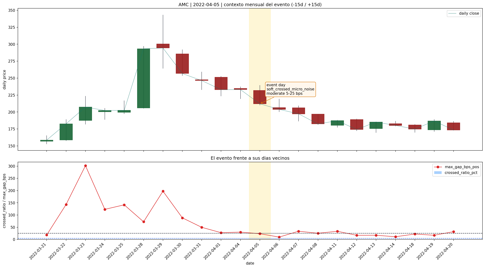

#### 00a Adjusted Proxy Contrast
Esta imagen responde a la pregunta de reconciliacion semantica: la discrepancia de precios viene de datos rotos o de vistas de precio distintas. Compara `daily raw`, `daily adjusted_proxy`, `quote mid raw` y `quote mid split_normalized`, y debajo ensena la cadena de dividendos y splits que produce la diferencia. La decision que cambia es si el inspector debe abrir una incidencia de calidad o cerrar el caso como diferencia legitima de semantica. El error que evita es mezclar series raw y adjusted como si fueran equivalentes. En pipelines reales, esto protege benchmarking, labels diarios y reconciliacion externa frente a falsas alarmas de precio.

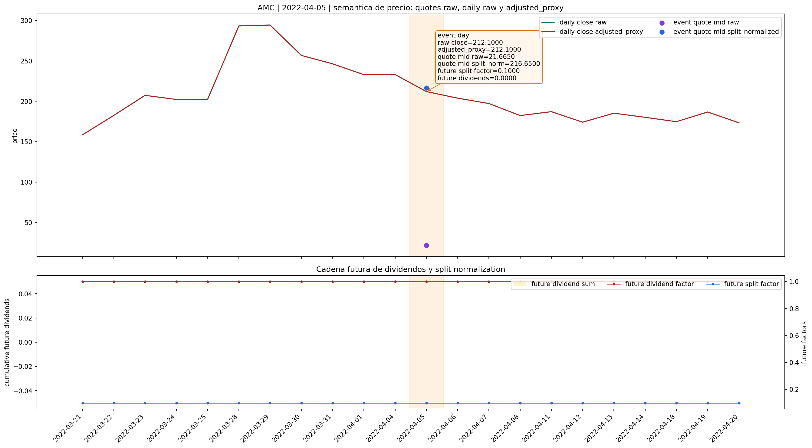

#### 00b Event Month Quotes Context
Esta imagen responde a la pregunta de recurrencia mensual dentro de `quotes`: el problema se concentra en el evento o reaparece en varias sesiones. Arriba concatena sesiones con datos disponibles; abajo resume cobertura diaria, `crossed_ratio_pct` y `max_gap_bps_pos`. La decision que cambia es si el caso debe leerse como episodio puntual o como sintoma de una fase repetida de libro degradado. El error que evita es extrapolar desde un unico dia a todo el mes sin evidencia.

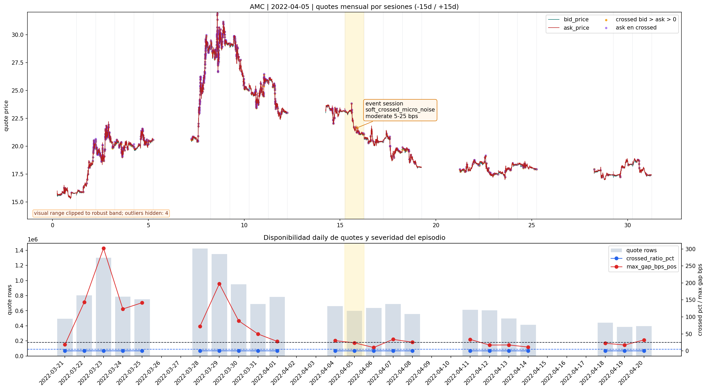

#### 01 Raw Window
Esta imagen responde a la primera pregunta decisiva del caso: el crossed observado, si existe, sigue siendo compatible con permanencia en `good` o no. Arriba ensena la geometria exacta del tramo conflictivo; abajo convierte esa geometria a bps y la enfrenta a los cortes `5 bps` y `25 bps`. El regimen dominante es `moderate 5-25 bps`. La decision que cambia es demostrar que el residuo permanece por debajo del dano que obligaria a mover el caso a `review` o `bad`. El error que evita es expulsar del universo util episodios leves cuyo impacto sobre ejecucion y features sigue siendo tolerable.

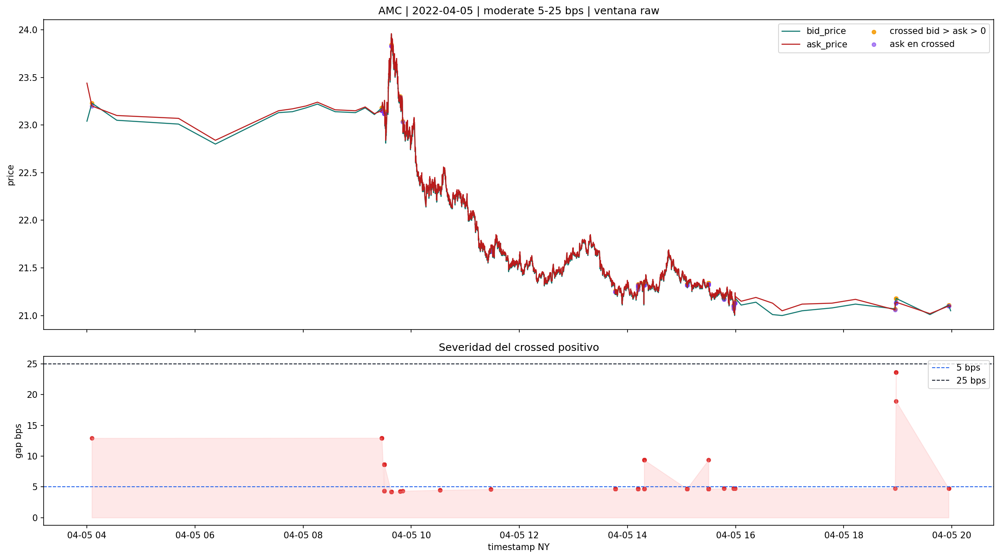

#### 02 Full Session Context
Esta imagen responde a la pregunta de extension intradiaria: el dano esta confinado a un bloque corto o contamina la sesion completa. Arriba se ve toda la sesion `04:00-20:00 NY`; abajo el `gap_bps` firmado. La decision que cambia es si el consumo debe penalizar solo un tramo o desechar el dia entero para uso operativo. El error que evita es tratar una cicatriz local como ruina total o, al reves, minimizar una degradacion distribuida a lo largo del dia. En ejecucion esto decide si la sesion puede seguir usandose con restricciones; en ML decide si las features intradiarias conservan significado economico.

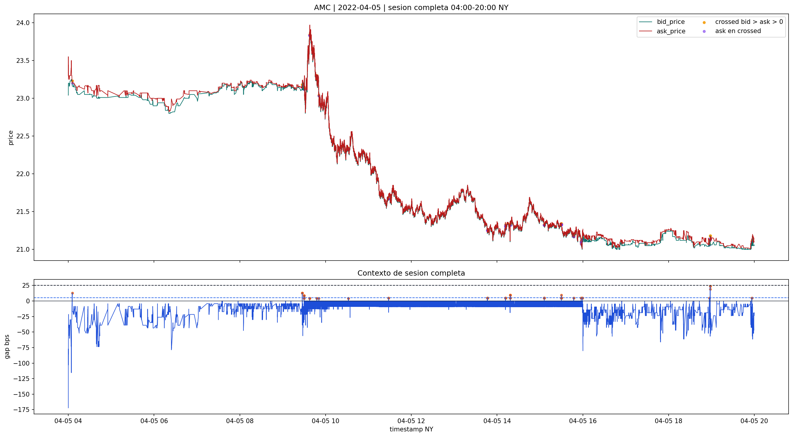

#### 03 Structure Diagnostics
Este panel responde a la pregunta de naturaleza del fallo: contradiccion economica genuina o mezcla con degeneracion estructural. Separa `ask=0` de `ask>0`, muestra la distribucion de `gap_bps` y resume patrones de integerizacion. La decision que cambia es como interpretar el dano: mercado localmente roto, artefacto de representacion o combinacion de ambos. El error que evita es sobrediagnosticar crossed reales cuando parte de la senal proviene de estructura degenerada del libro. Esta lectura afecta directamente a que el caso vaya a exclusion dura, a bandera contextual o a simple reconciliacion tecnica.

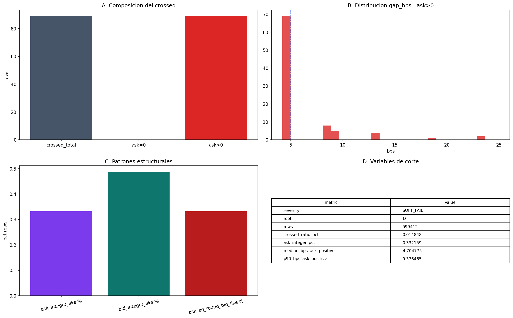

#### 04 Summary Card
Esta tarjeta responde a la pregunta de auditabilidad: cuales son exactamente las variables que sostienen la conclusion. Reune `severity`, `root`, `crossed_ratio_pct`, `ask_integer_pct`, `median_bps_ask_positive` y `p90_bps_ask_positive`. La decision que cambia es pasar de impresion visual a regla verificable. El error que evita es que dos inspectores lleguen a conclusiones distintas mirando la misma imagen sin una base numerica comun. Para gobernanza del proyecto, este panel es el que vuelve reproducible la decision para backtest, ML y auditoria.

---

### 8. AMC 2021-09-10

company_name: `AMER MORT ACCEPT(SHS BENE INT`
primary_exchange: `NYSE American` (`XASE`)
market_locale: `stocks/us`
scope: `good`
ticker: `AMC`
date: `2021-09-10`
taxonomy: `soft_crossed_micro_noise`
positive_cross_bucket: `positive_cross_moderate_5to25bps`
severity: `SOFT_FAIL`
root: `D`
rows: `800742`
crossed_ratio_pct: `0.026600`
crossed_rows_raw: `213`
crossed_rows_ask_zero: `0`
crossed_rows_ask_positive: `213`
ask_integer_pct: `1.563675`
median_bps_ask_positive: `2.030251`
p90_bps_ask_positive: `7.964954`
file: `D:\quotes\AMC\year=2021\month=09\day=10\quotes.parquet`

#### Analisis Forense
La conclusion correcta del caso es que el libro mantiene semantica economica util. El residuo observado no cambia de forma material la lectura del spread ni invalida el uso operativo normal del dia. La taxonomy historica es `soft_crossed_micro_noise` y el regimen positivo dominante es `moderate 5-25 bps`. Esto importa porque la taxonomy no solo clasifica: resume que tipo de anomalia se esta viendo y que clase de decision contractual puede defenderse despues. La taxonomy `soft_crossed_micro_noise` implica que existen micro-contradicciones locales, pero tan pequenas o escasas que la prioridad institucional es no sobrecastigar residuo inocuo. El regimen `moderate 5-25 bps` ya entra en zona donde el crossed tiene capacidad real de contaminar simulacion de ejecucion y features microestructurales, aunque todavia puede requerir lectura contextual antes de exclusion dura. En terminos observables, el file tiene `crossed_ratio_pct=0.026600` con `crossed_rows_ask_positive=213` y `crossed_rows_ask_zero=0`. La severidad economica del crossed ask>0 se resume en `median_bps_ask_positive=2.030251` y `p90_bps_ask_positive=7.964954`. Estos dos numeros convierten una forma visual rara en una conclusion operativa sobre si el libro sigue representando o no un mercado negociable. La decision que cambia es mantener el caso dentro de la franja util, aunque con lectura consciente de que existe una huella positiva leve o acotada. En `good`, el objetivo no es negar toda irregularidad, sino demostrar que la anomalia no destruye la semantica economica minima del libro ni invalida su uso principal. El error que evita esta lectura es sobrecastigar micro-residuos y encoger artificialmente el universo util para backtest y ML. El patron estructural muestra `ask_integer_pct=1.563675`. Este numero obliga a separar dos explicaciones rivales: contradiccion economica genuina del libro o mezcla con degeneracion estructural / integerizacion. Toda la composicion crossed cae en `ask>0`. Eso endurece la lectura economica del caso: el dano no depende de ceros mecanicos, sino de contradiccion positiva dentro de precios aparentemente vivos. Como `ask_integer_pct` es bajo, la hipotesis de simple degeneracion mecanica pierde fuerza. Eso endurece la interpretacion: el crossed se parece mas a contradiccion economica genuina y menos a artefacto. En la capa de semantica de precio del evento aparecen `daily raw close=501.6000`, `quote mid raw=50.8750`, `quote mid split_normalized=508.7500`, `daily adjusted_proxy=501.6000`. La reconciliacion incluye `future_split_factor=0.1000`. La implicacion metodologica es crucial: una discrepancia entre `quotes`, `daily` y una plataforma externa no puede leerse automaticamente como fallo del dataset. Puede ser semantica de precio distinta. El error que evita esta capa es mezclar raw, split-normalized y adjusted dentro del mismo pipeline, rompiendo auditoria, benchmarking y labels. Para pipelines, esto significa que el caso puede seguir entrando en consumo principal con la salvedad de que cualquier residuo observado debe quedar trazado como tolerado y no ignorado por completo. Existe ademas una imagen historica de certificacion asociada. Su papel es poner el episodio en un marco causal mas amplio: halt, explained, not strongly explained o patron conocido. La regla que protege al proyecto es esta: el contexto externo se usa para explicar por que aparece el episodio, no para absolverlo. El error que evita es degradar el criterio de calidad del libro porque exista una historia plausible alrededor del caso.

#### 00 Event Month Context
Esta imagen responde a la pregunta de persistencia temporal: estamos ante un accidente local o ante una fase mas amplia de inestabilidad. Arriba coloca el evento en la serie `daily` real del mes; abajo compara `crossed_ratio_pct` y `max_gap_bps_pos` del dia contra sus vecinos. La decision que cambia es el peso estructural que se le concede al caso. El error que evita es juzgar igual un shock aislado y una degradacion repetida del libro.

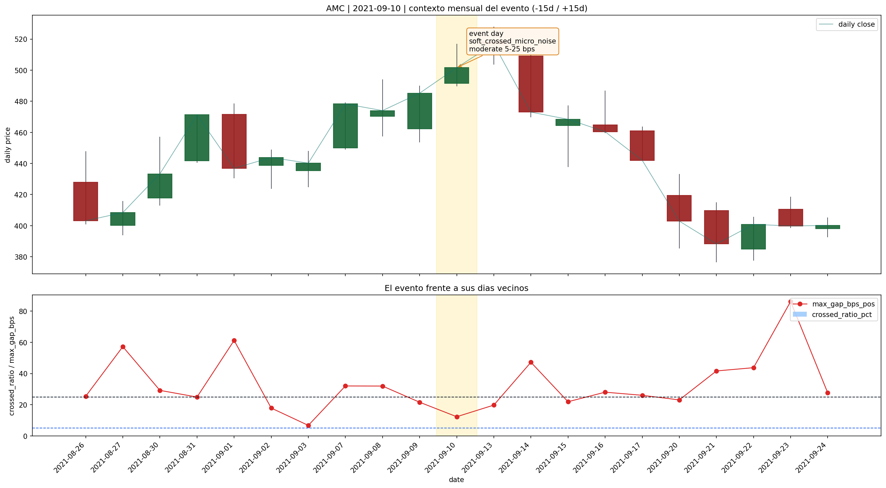

#### 00a Adjusted Proxy Contrast
Esta imagen responde a la pregunta de reconciliacion semantica: la discrepancia de precios viene de datos rotos o de vistas de precio distintas. Compara `daily raw`, `daily adjusted_proxy`, `quote mid raw` y `quote mid split_normalized`, y debajo ensena la cadena de dividendos y splits que produce la diferencia. La decision que cambia es si el inspector debe abrir una incidencia de calidad o cerrar el caso como diferencia legitima de semantica. El error que evita es mezclar series raw y adjusted como si fueran equivalentes. En pipelines reales, esto protege benchmarking, labels diarios y reconciliacion externa frente a falsas alarmas de precio.

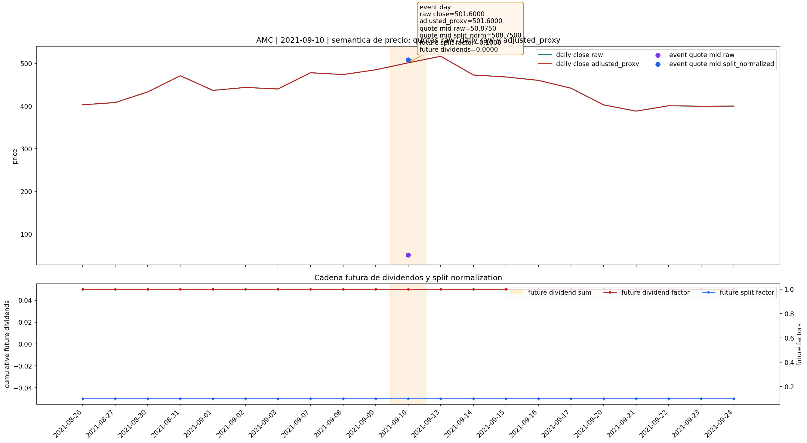

#### 00b Event Month Quotes Context
Esta imagen responde a la pregunta de recurrencia mensual dentro de `quotes`: el problema se concentra en el evento o reaparece en varias sesiones. Arriba concatena sesiones con datos disponibles; abajo resume cobertura diaria, `crossed_ratio_pct` y `max_gap_bps_pos`. La decision que cambia es si el caso debe leerse como episodio puntual o como sintoma de una fase repetida de libro degradado. El error que evita es extrapolar desde un unico dia a todo el mes sin evidencia.

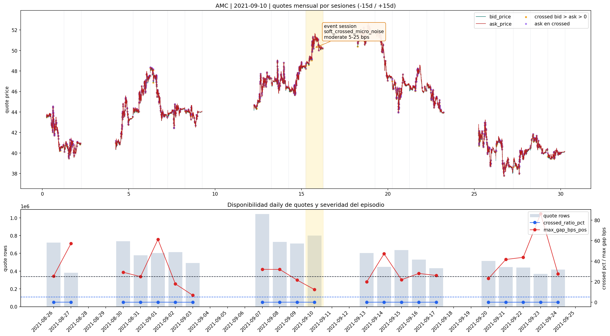

#### 01 Raw Window
Esta imagen responde a la primera pregunta decisiva del caso: el crossed observado, si existe, sigue siendo compatible con permanencia en `good` o no. Arriba ensena la geometria exacta del tramo conflictivo; abajo convierte esa geometria a bps y la enfrenta a los cortes `5 bps` y `25 bps`. El regimen dominante es `moderate 5-25 bps`. La decision que cambia es demostrar que el residuo permanece por debajo del dano que obligaria a mover el caso a `review` o `bad`. El error que evita es expulsar del universo util episodios leves cuyo impacto sobre ejecucion y features sigue siendo tolerable.

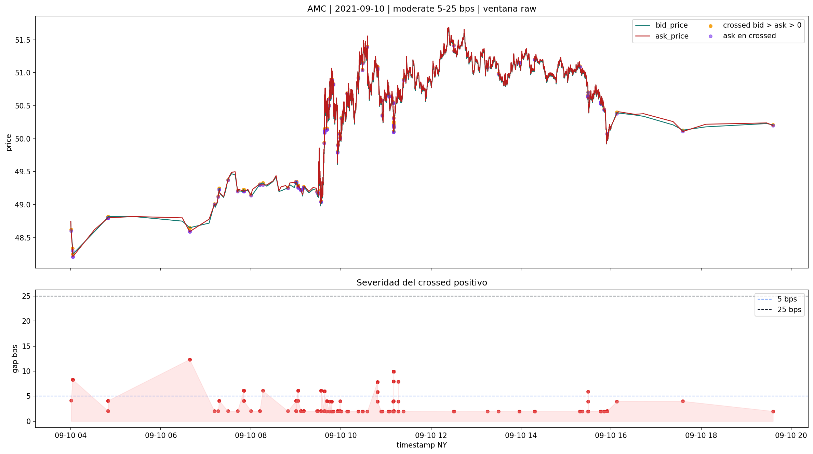

#### 02 Full Session Context
Esta imagen responde a la pregunta de extension intradiaria: el dano esta confinado a un bloque corto o contamina la sesion completa. Arriba se ve toda la sesion `04:00-20:00 NY`; abajo el `gap_bps` firmado. La decision que cambia es si el consumo debe penalizar solo un tramo o desechar el dia entero para uso operativo. El error que evita es tratar una cicatriz local como ruina total o, al reves, minimizar una degradacion distribuida a lo largo del dia. En ejecucion esto decide si la sesion puede seguir usandose con restricciones; en ML decide si las features intradiarias conservan significado economico.

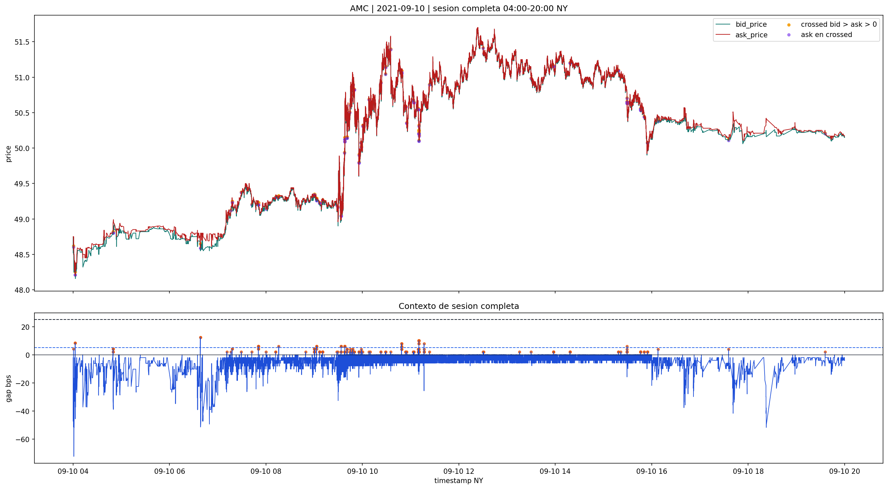

#### 03 Structure Diagnostics
Este panel responde a la pregunta de naturaleza del fallo: contradiccion economica genuina o mezcla con degeneracion estructural. Separa `ask=0` de `ask>0`, muestra la distribucion de `gap_bps` y resume patrones de integerizacion. La decision que cambia es como interpretar el dano: mercado localmente roto, artefacto de representacion o combinacion de ambos. El error que evita es sobrediagnosticar crossed reales cuando parte de la senal proviene de estructura degenerada del libro. Esta lectura afecta directamente a que el caso vaya a exclusion dura, a bandera contextual o a simple reconciliacion tecnica.

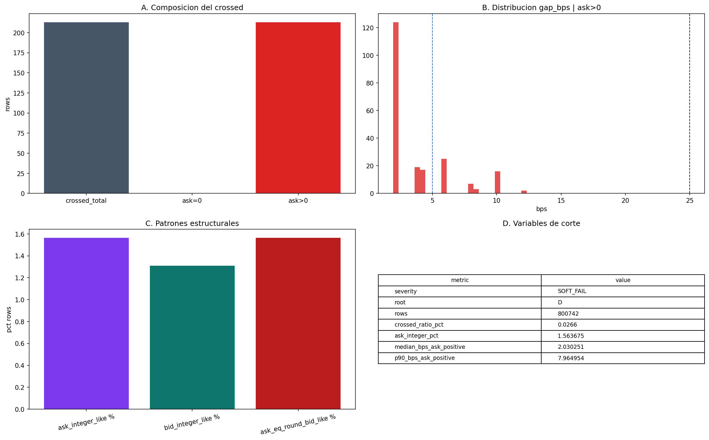

#### 04 Summary Card
Esta tarjeta responde a la pregunta de auditabilidad: cuales son exactamente las variables que sostienen la conclusion. Reune `severity`, `root`, `crossed_ratio_pct`, `ask_integer_pct`, `median_bps_ask_positive` y `p90_bps_ask_positive`. La decision que cambia es pasar de impresion visual a regla verificable. El error que evita es que dos inspectores lleguen a conclusiones distintas mirando la misma imagen sin una base numerica comun. Para gobernanza del proyecto, este panel es el que vuelve reproducible la decision para backtest, ML y auditoria.

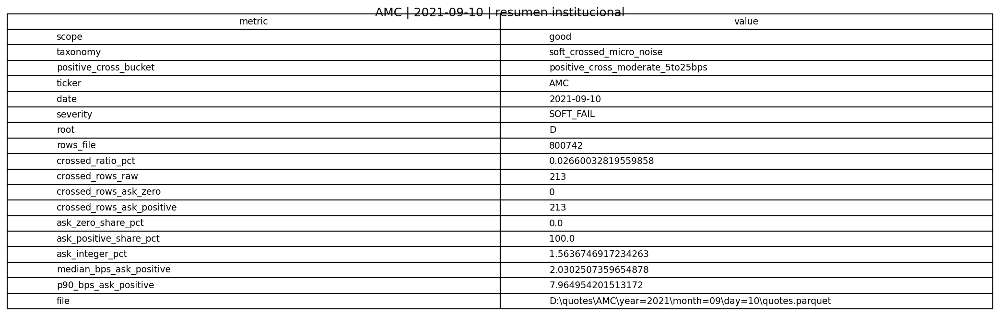

---

### 9. YHOO 2017-06-09

company_name: `Yahoo Inc`
primary_exchange: `NASDAQ` (`XNAS`)
market_locale: `stocks/us`
scope: `good`
ticker: `YHOO`
date: `2017-06-09`
taxonomy: `soft_crossed_micro_noise`
positive_cross_bucket: `positive_cross_mild_lt5bps`
severity: `SOFT_FAIL`
root: `C`
rows: `954816`
crossed_ratio_pct: `0.029325`
crossed_rows_raw: `280`
crossed_rows_ask_zero: `3`
crossed_rows_ask_positive: `277`
ask_integer_pct: `1.134983`
median_bps_ask_positive: `1.799047`
p90_bps_ask_positive: `3.535443`
file: `C:\TSIS_Data\data\quotes\YHOO\year=2017\month=06\day=09\quotes.parquet`

#### Analisis Forense
La conclusion correcta del caso es que el libro mantiene semantica economica util. El residuo observado no cambia de forma material la lectura del spread ni invalida el uso operativo normal del dia. La taxonomy historica es `soft_crossed_micro_noise` y el regimen positivo dominante es `mild <5 bps`. Esto importa porque la taxonomy no solo clasifica: resume que tipo de anomalia se esta viendo y que clase de decision contractual puede defenderse despues. La taxonomy `soft_crossed_micro_noise` implica que existen micro-contradicciones locales, pero tan pequenas o escasas que la prioridad institucional es no sobrecastigar residuo inocuo. El regimen `mild <5 bps` significa que existe contradiccion economica positiva, pero aun en una banda donde un uso prudente puede seguir siendo defendible si la persistencia y la estructura no agravan el caso. En terminos observables, el file tiene `crossed_ratio_pct=0.029325` con `crossed_rows_ask_positive=277` y `crossed_rows_ask_zero=3`. La severidad economica del crossed ask>0 se resume en `median_bps_ask_positive=1.799047` y `p90_bps_ask_positive=3.535443`. Estos dos numeros convierten una forma visual rara en una conclusion operativa sobre si el libro sigue representando o no un mercado negociable. La decision que cambia es mantener el caso dentro de la franja util, aunque con lectura consciente de que existe una huella positiva leve o acotada. En `good`, el objetivo no es negar toda irregularidad, sino demostrar que la anomalia no destruye la semantica economica minima del libro ni invalida su uso principal. El error que evita esta lectura es sobrecastigar micro-residuos y encoger artificialmente el universo util para backtest y ML. El patron estructural muestra `ask_integer_pct=1.134983`. Este numero obliga a separar dos explicaciones rivales: contradiccion economica genuina del libro o mezcla con degeneracion estructural / integerizacion. La mayor parte del crossed vive en `ask>0`, de modo que el corazon del problema sigue siendo economico. La parte `ask=0`, si existe, acompana pero no explica por si sola la anomalia. Como `ask_integer_pct` es bajo, la hipotesis de simple degeneracion mecanica pierde fuerza. Eso endurece la interpretacion: el crossed se parece mas a contradiccion economica genuina y menos a artefacto. Existe ademas una imagen historica de certificacion asociada. Su papel es poner el episodio en un marco causal mas amplio: halt, explained, not strongly explained o patron conocido. La regla que protege al proyecto es esta: el contexto externo se usa para explicar por que aparece el episodio, no para absolverlo. El error que evita es degradar el criterio de calidad del libro porque exista una historia plausible alrededor del caso.

#### 00 Event Month Context
Esta imagen responde a la pregunta de persistencia temporal: estamos ante un accidente local o ante una fase mas amplia de inestabilidad. Arriba coloca el evento en la serie `daily` real del mes; abajo compara `crossed_ratio_pct` y `max_gap_bps_pos` del dia contra sus vecinos. La decision que cambia es el peso estructural que se le concede al caso. El error que evita es juzgar igual un shock aislado y una degradacion repetida del libro.

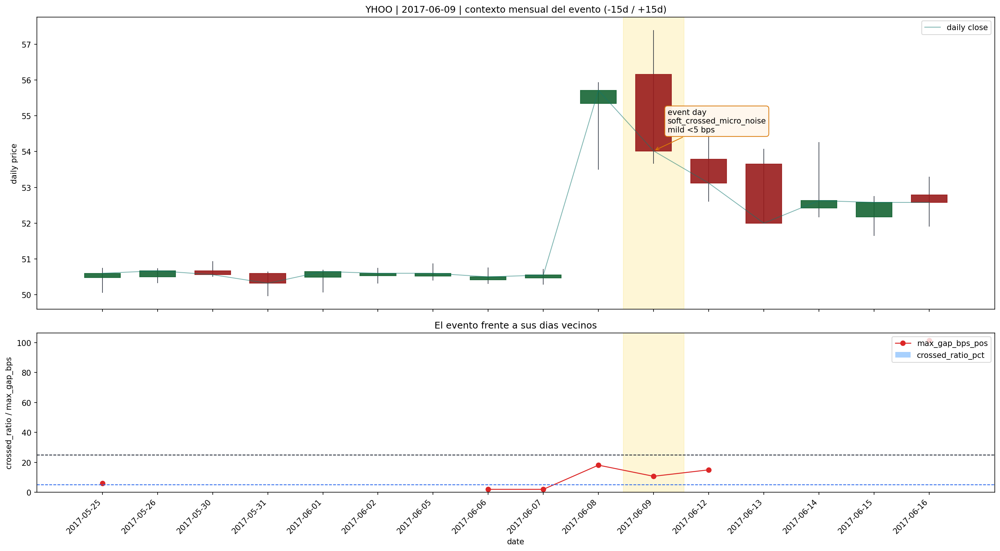

#### 00b Event Month Quotes Context
Esta imagen responde a la pregunta de recurrencia mensual dentro de `quotes`: el problema se concentra en el evento o reaparece en varias sesiones. Arriba concatena sesiones con datos disponibles; abajo resume cobertura diaria, `crossed_ratio_pct` y `max_gap_bps_pos`. La decision que cambia es si el caso debe leerse como episodio puntual o como sintoma de una fase repetida de libro degradado. El error que evita es extrapolar desde un unico dia a todo el mes sin evidencia.

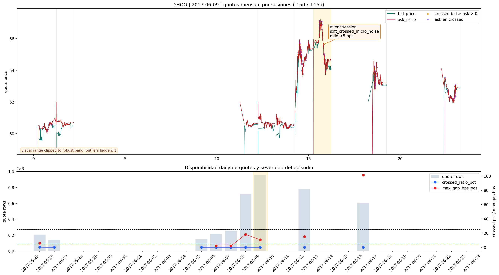

#### 01 Raw Window
Esta imagen responde a la primera pregunta decisiva del caso: el crossed observado, si existe, sigue siendo compatible con permanencia en `good` o no. Arriba ensena la geometria exacta del tramo conflictivo; abajo convierte esa geometria a bps y la enfrenta a los cortes `5 bps` y `25 bps`. El regimen dominante es `mild <5 bps`. La decision que cambia es demostrar que el residuo permanece por debajo del dano que obligaria a mover el caso a `review` o `bad`. El error que evita es expulsar del universo util episodios leves cuyo impacto sobre ejecucion y features sigue siendo tolerable.

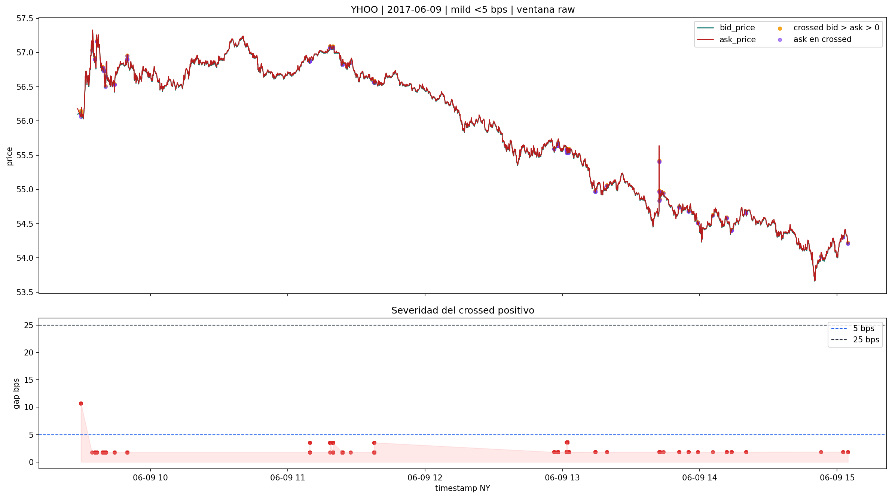

#### 02 Full Session Context
Esta imagen responde a la pregunta de extension intradiaria: el dano esta confinado a un bloque corto o contamina la sesion completa. Arriba se ve toda la sesion `04:00-20:00 NY`; abajo el `gap_bps` firmado. La decision que cambia es si el consumo debe penalizar solo un tramo o desechar el dia entero para uso operativo. El error que evita es tratar una cicatriz local como ruina total o, al reves, minimizar una degradacion distribuida a lo largo del dia. En ejecucion esto decide si la sesion puede seguir usandose con restricciones; en ML decide si las features intradiarias conservan significado economico.

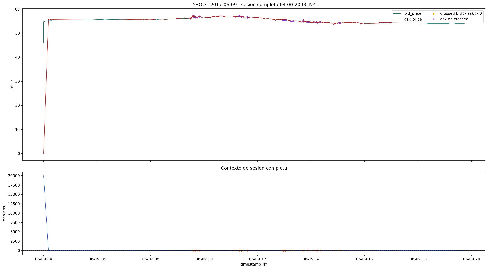

#### 03 Structure Diagnostics
Este panel responde a la pregunta de naturaleza del fallo: contradiccion economica genuina o mezcla con degeneracion estructural. Separa `ask=0` de `ask>0`, muestra la distribucion de `gap_bps` y resume patrones de integerizacion. La decision que cambia es como interpretar el dano: mercado localmente roto, artefacto de representacion o combinacion de ambos. El error que evita es sobrediagnosticar crossed reales cuando parte de la senal proviene de estructura degenerada del libro. Esta lectura afecta directamente a que el caso vaya a exclusion dura, a bandera contextual o a simple reconciliacion tecnica.

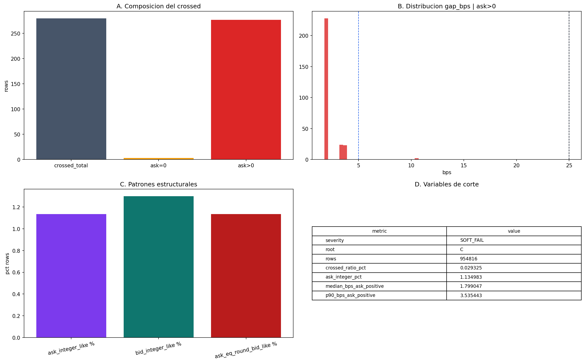

#### 04 Summary Card
Esta tarjeta responde a la pregunta de auditabilidad: cuales son exactamente las variables que sostienen la conclusion. Reune `severity`, `root`, `crossed_ratio_pct`, `ask_integer_pct`, `median_bps_ask_positive` y `p90_bps_ask_positive`. La decision que cambia es pasar de impresion visual a regla verificable. El error que evita es que dos inspectores lleguen a conclusiones distintas mirando la misma imagen sin una base numerica comun. Para gobernanza del proyecto, este panel es el que vuelve reproducible la decision para backtest, ML y auditoria.

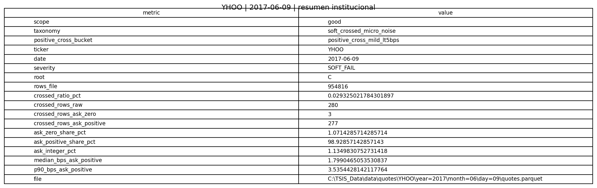

---

### 10. AMC 2022-02-01

company_name: `AMER MORT ACCEPT(SHS BENE INT`
primary_exchange: `NYSE American` (`XASE`)
market_locale: `stocks/us`
scope: `good`
ticker: `AMC`
date: `2022-02-01`
taxonomy: `utc_rollover_large_day_clean`
positive_cross_bucket: `positive_cross_severe_ge25bps`
severity: `SOFT_FAIL`
root: `D`
rows: `888266`
crossed_ratio_pct: `0.047733`
crossed_rows_raw: `424`
crossed_rows_ask_zero: `0`
crossed_rows_ask_positive: `424`
ask_integer_pct: `1.415680`
median_bps_ask_positive: `11.142061`
p90_bps_ask_positive: `25.844840`
file: `D:\quotes\AMC\year=2022\month=02\day=01\quotes.parquet`

#### Analisis Forense
La conclusion correcta del caso es que el libro mantiene semantica economica util. El residuo observado no cambia de forma material la lectura del spread ni invalida el uso operativo normal del dia. La taxonomy historica es `utc_rollover_large_day_clean` y el regimen positivo dominante es `severe >=25 bps`. Esto importa porque la taxonomy no solo clasifica: resume que tipo de anomalia se esta viendo y que clase de decision contractual puede defenderse despues. La taxonomy `utc_rollover_large_day_clean` implica que parte de la rareza pertenece al eje temporal y no al eje economico del spread; su lectura correcta evita castigar como libro roto un efecto de rollover bien entendido. El regimen `severe >=25 bps` empuja el caso a una lectura economicamente dura: el crossed deja de ser cosmetico y pasa a cuestionar si el libro sigue siendo interpretable como mercado negociable. En terminos observables, el file tiene `crossed_ratio_pct=0.047733` con `crossed_rows_ask_positive=424` y `crossed_rows_ask_zero=0`. La severidad economica del crossed ask>0 se resume en `median_bps_ask_positive=11.142061` y `p90_bps_ask_positive=25.844840`. Estos dos numeros convierten una forma visual rara en una conclusion operativa sobre si el libro sigue representando o no un mercado negociable. La decision que cambia es mantener el caso dentro de la franja util, aunque con lectura consciente de que existe una huella positiva leve o acotada. En `good`, el objetivo no es negar toda irregularidad, sino demostrar que la anomalia no destruye la semantica economica minima del libro ni invalida su uso principal. El error que evita esta lectura es sobrecastigar micro-residuos y encoger artificialmente el universo util para backtest y ML. El patron estructural muestra `ask_integer_pct=1.415680`. Este numero obliga a separar dos explicaciones rivales: contradiccion economica genuina del libro o mezcla con degeneracion estructural / integerizacion. Toda la composicion crossed cae en `ask>0`. Eso endurece la lectura economica del caso: el dano no depende de ceros mecanicos, sino de contradiccion positiva dentro de precios aparentemente vivos. Como `ask_integer_pct` es bajo, la hipotesis de simple degeneracion mecanica pierde fuerza. Eso endurece la interpretacion: el crossed se parece mas a contradiccion economica genuina y menos a artefacto. En la capa de semantica de precio del evento aparecen `daily raw close=168.6000`, `quote mid raw=17.4200`, `quote mid split_normalized=174.2000`, `daily adjusted_proxy=168.6000`. La reconciliacion incluye `future_split_factor=0.1000`. La implicacion metodologica es crucial: una discrepancia entre `quotes`, `daily` y una plataforma externa no puede leerse automaticamente como fallo del dataset. Puede ser semantica de precio distinta. El error que evita esta capa es mezclar raw, split-normalized y adjusted dentro del mismo pipeline, rompiendo auditoria, benchmarking y labels. Para pipelines, esto significa que el caso puede seguir entrando en consumo principal con la salvedad de que cualquier residuo observado debe quedar trazado como tolerado y no ignorado por completo. Existe ademas una imagen historica de certificacion asociada. Su papel es poner el episodio en un marco causal mas amplio: halt, explained, not strongly explained o patron conocido. La regla que protege al proyecto es esta: el contexto externo se usa para explicar por que aparece el episodio, no para absolverlo. El error que evita es degradar el criterio de calidad del libro porque exista una historia plausible alrededor del caso.

#### 00 Event Month Context
Esta imagen responde a la pregunta de persistencia temporal: estamos ante un accidente local o ante una fase mas amplia de inestabilidad. Arriba coloca el evento en la serie `daily` real del mes; abajo compara `crossed_ratio_pct` y `max_gap_bps_pos` del dia contra sus vecinos. La decision que cambia es el peso estructural que se le concede al caso. El error que evita es juzgar igual un shock aislado y una degradacion repetida del libro.

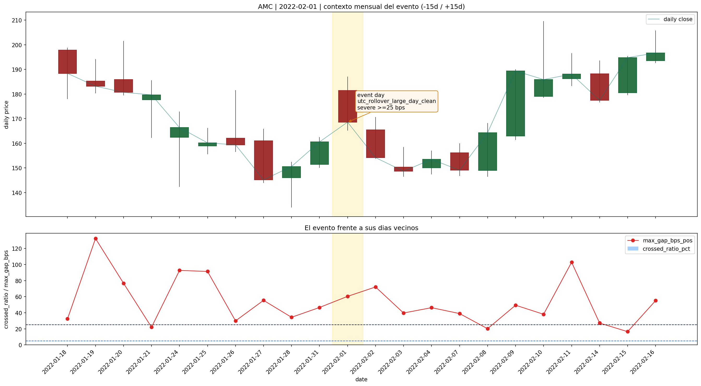

#### 00a Adjusted Proxy Contrast
Esta imagen responde a la pregunta de reconciliacion semantica: la discrepancia de precios viene de datos rotos o de vistas de precio distintas. Compara `daily raw`, `daily adjusted_proxy`, `quote mid raw` y `quote mid split_normalized`, y debajo ensena la cadena de dividendos y splits que produce la diferencia. La decision que cambia es si el inspector debe abrir una incidencia de calidad o cerrar el caso como diferencia legitima de semantica. El error que evita es mezclar series raw y adjusted como si fueran equivalentes. En pipelines reales, esto protege benchmarking, labels diarios y reconciliacion externa frente a falsas alarmas de precio.

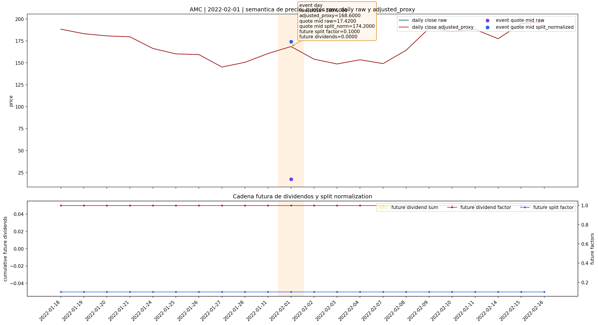

#### 00b Event Month Quotes Context
Esta imagen responde a la pregunta de recurrencia mensual dentro de `quotes`: el problema se concentra en el evento o reaparece en varias sesiones. Arriba concatena sesiones con datos disponibles; abajo resume cobertura diaria, `crossed_ratio_pct` y `max_gap_bps_pos`. La decision que cambia es si el caso debe leerse como episodio puntual o como sintoma de una fase repetida de libro degradado. El error que evita es extrapolar desde un unico dia a todo el mes sin evidencia.

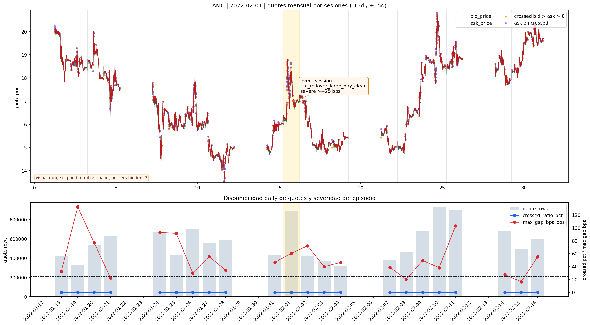

#### 01 Raw Window
Esta imagen responde a la primera pregunta decisiva del caso: el crossed observado, si existe, sigue siendo compatible con permanencia en `good` o no. Arriba ensena la geometria exacta del tramo conflictivo; abajo convierte esa geometria a bps y la enfrenta a los cortes `5 bps` y `25 bps`. El regimen dominante es `severe >=25 bps`. La decision que cambia es demostrar que el residuo permanece por debajo del dano que obligaria a mover el caso a `review` o `bad`. El error que evita es expulsar del universo util episodios leves cuyo impacto sobre ejecucion y features sigue siendo tolerable.

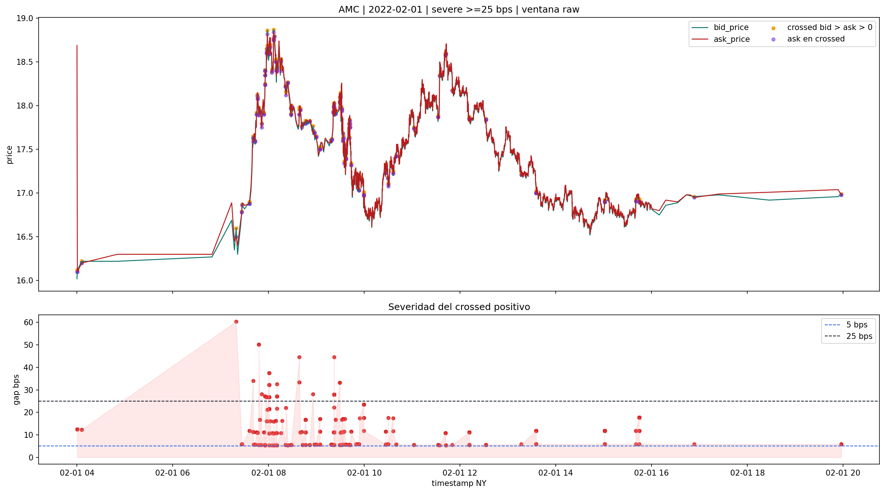

#### 02 Full Session Context
Esta imagen responde a la pregunta de extension intradiaria: el dano esta confinado a un bloque corto o contamina la sesion completa. Arriba se ve toda la sesion `04:00-20:00 NY`; abajo el `gap_bps` firmado. La decision que cambia es si el consumo debe penalizar solo un tramo o desechar el dia entero para uso operativo. El error que evita es tratar una cicatriz local como ruina total o, al reves, minimizar una degradacion distribuida a lo largo del dia. En ejecucion esto decide si la sesion puede seguir usandose con restricciones; en ML decide si las features intradiarias conservan significado economico.

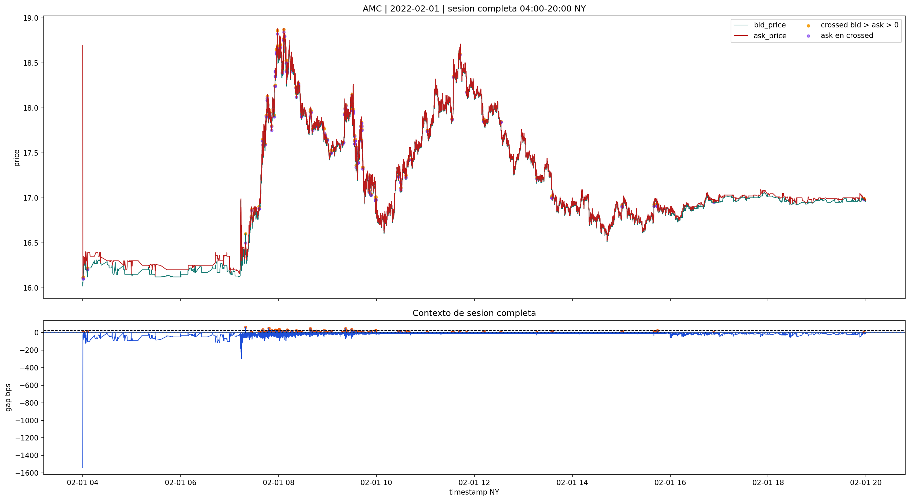

#### 03 Structure Diagnostics
Este panel responde a la pregunta de naturaleza del fallo: contradiccion economica genuina o mezcla con degeneracion estructural. Separa `ask=0` de `ask>0`, muestra la distribucion de `gap_bps` y resume patrones de integerizacion. La decision que cambia es como interpretar el dano: mercado localmente roto, artefacto de representacion o combinacion de ambos. El error que evita es sobrediagnosticar crossed reales cuando parte de la senal proviene de estructura degenerada del libro. Esta lectura afecta directamente a que el caso vaya a exclusion dura, a bandera contextual o a simple reconciliacion tecnica.

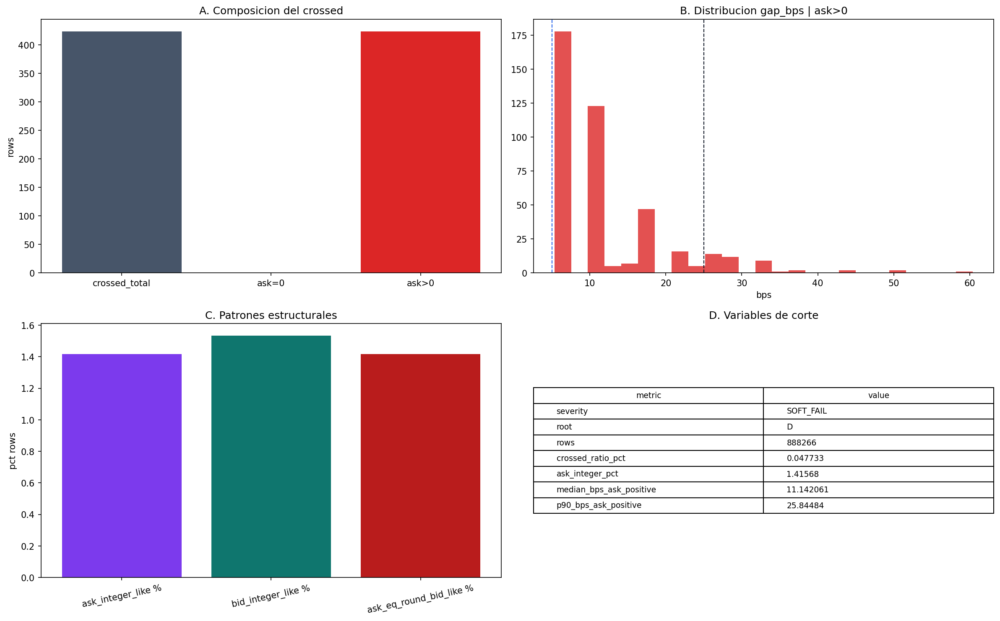

#### 04 Summary Card
Esta tarjeta responde a la pregunta de auditabilidad: cuales son exactamente las variables que sostienen la conclusion. Reune `severity`, `root`, `crossed_ratio_pct`, `ask_integer_pct`, `median_bps_ask_positive` y `p90_bps_ask_positive`. La decision que cambia es pasar de impresion visual a regla verificable. El error que evita es que dos inspectores lleguen a conclusiones distintas mirando la misma imagen sin una base numerica comun. Para gobernanza del proyecto, este panel es el que vuelve reproducible la decision para backtest, ML y auditoria.

---

### 11. FCEL 2021-03-10

company_name: `FuelCell Energy Inc  NEW (DE)`
primary_exchange: `NASDAQ` (`XNAS`)
market_locale: `stocks/us`
scope: `good`
ticker: `FCEL`
date: `2021-03-10`
taxonomy: `utc_rollover_large_day_clean`
positive_cross_bucket: `positive_cross_moderate_5to25bps`
severity: `SOFT_FAIL`
root: `D`
rows: `878357`
crossed_ratio_pct: `0.009222`
crossed_rows_raw: `81`
crossed_rows_ask_zero: `0`
crossed_rows_ask_positive: `81`
ask_integer_pct: `1.003920`
median_bps_ask_positive: `6.228589`
p90_bps_ask_positive: `24.645718`
file: `D:\quotes\FCEL\year=2021\month=03\day=10\quotes.parquet`

#### Analisis Forense
La conclusion correcta del caso es que el libro mantiene semantica economica util. El residuo observado no cambia de forma material la lectura del spread ni invalida el uso operativo normal del dia. La taxonomy historica es `utc_rollover_large_day_clean` y el regimen positivo dominante es `moderate 5-25 bps`. Esto importa porque la taxonomy no solo clasifica: resume que tipo de anomalia se esta viendo y que clase de decision contractual puede defenderse despues. La taxonomy `utc_rollover_large_day_clean` implica que parte de la rareza pertenece al eje temporal y no al eje economico del spread; su lectura correcta evita castigar como libro roto un efecto de rollover bien entendido. El regimen `moderate 5-25 bps` ya entra en zona donde el crossed tiene capacidad real de contaminar simulacion de ejecucion y features microestructurales, aunque todavia puede requerir lectura contextual antes de exclusion dura. En terminos observables, el file tiene `crossed_ratio_pct=0.009222` con `crossed_rows_ask_positive=81` y `crossed_rows_ask_zero=0`. La severidad economica del crossed ask>0 se resume en `median_bps_ask_positive=6.228589` y `p90_bps_ask_positive=24.645718`. Estos dos numeros convierten una forma visual rara en una conclusion operativa sobre si el libro sigue representando o no un mercado negociable. La decision que cambia es mantener el caso dentro de la franja util, aunque con lectura consciente de que existe una huella positiva leve o acotada. En `good`, el objetivo no es negar toda irregularidad, sino demostrar que la anomalia no destruye la semantica economica minima del libro ni invalida su uso principal. El error que evita esta lectura es sobrecastigar micro-residuos y encoger artificialmente el universo util para backtest y ML. El patron estructural muestra `ask_integer_pct=1.003920`. Este numero obliga a separar dos explicaciones rivales: contradiccion economica genuina del libro o mezcla con degeneracion estructural / integerizacion. Toda la composicion crossed cae en `ask>0`. Eso endurece la lectura economica del caso: el dano no depende de ceros mecanicos, sino de contradiccion positiva dentro de precios aparentemente vivos. Como `ask_integer_pct` es bajo, la hipotesis de simple degeneracion mecanica pierde fuerza. Eso endurece la interpretacion: el crossed se parece mas a contradiccion economica genuina y menos a artefacto. En la capa de semantica de precio del evento aparecen `daily raw close=488.4000`, `quote mid raw=16.2850`, `quote mid split_normalized=488.5500`, `daily adjusted_proxy=488.4000`. La reconciliacion incluye `future_split_factor=0.0333`. La implicacion metodologica es crucial: una discrepancia entre `quotes`, `daily` y una plataforma externa no puede leerse automaticamente como fallo del dataset. Puede ser semantica de precio distinta. El error que evita esta capa es mezclar raw, split-normalized y adjusted dentro del mismo pipeline, rompiendo auditoria, benchmarking y labels. Para pipelines, esto significa que el caso puede seguir entrando en consumo principal con la salvedad de que cualquier residuo observado debe quedar trazado como tolerado y no ignorado por completo. Existe ademas una imagen historica de certificacion asociada. Su papel es poner el episodio en un marco causal mas amplio: halt, explained, not strongly explained o patron conocido. La regla que protege al proyecto es esta: el contexto externo se usa para explicar por que aparece el episodio, no para absolverlo. El error que evita es degradar el criterio de calidad del libro porque exista una historia plausible alrededor del caso.

#### 00 Event Month Context
Esta imagen responde a la pregunta de persistencia temporal: estamos ante un accidente local o ante una fase mas amplia de inestabilidad. Arriba coloca el evento en la serie `daily` real del mes; abajo compara `crossed_ratio_pct` y `max_gap_bps_pos` del dia contra sus vecinos. La decision que cambia es el peso estructural que se le concede al caso. El error que evita es juzgar igual un shock aislado y una degradacion repetida del libro.

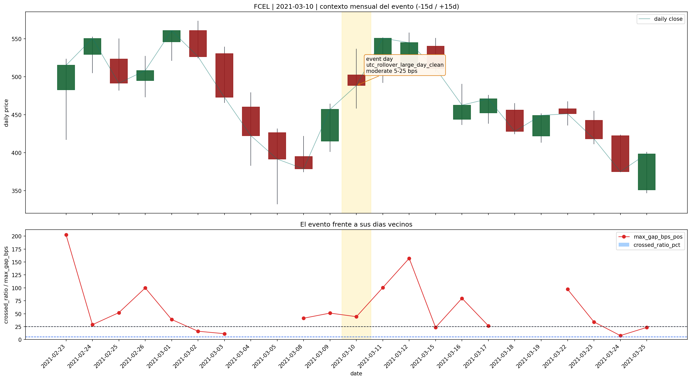

#### 00a Adjusted Proxy Contrast
Esta imagen responde a la pregunta de reconciliacion semantica: la discrepancia de precios viene de datos rotos o de vistas de precio distintas. Compara `daily raw`, `daily adjusted_proxy`, `quote mid raw` y `quote mid split_normalized`, y debajo ensena la cadena de dividendos y splits que produce la diferencia. La decision que cambia es si el inspector debe abrir una incidencia de calidad o cerrar el caso como diferencia legitima de semantica. El error que evita es mezclar series raw y adjusted como si fueran equivalentes. En pipelines reales, esto protege benchmarking, labels diarios y reconciliacion externa frente a falsas alarmas de precio.

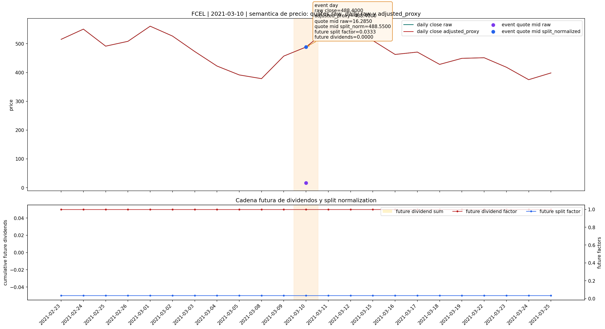

#### 00b Event Month Quotes Context
Esta imagen responde a la pregunta de recurrencia mensual dentro de `quotes`: el problema se concentra en el evento o reaparece en varias sesiones. Arriba concatena sesiones con datos disponibles; abajo resume cobertura diaria, `crossed_ratio_pct` y `max_gap_bps_pos`. La decision que cambia es si el caso debe leerse como episodio puntual o como sintoma de una fase repetida de libro degradado. El error que evita es extrapolar desde un unico dia a todo el mes sin evidencia.

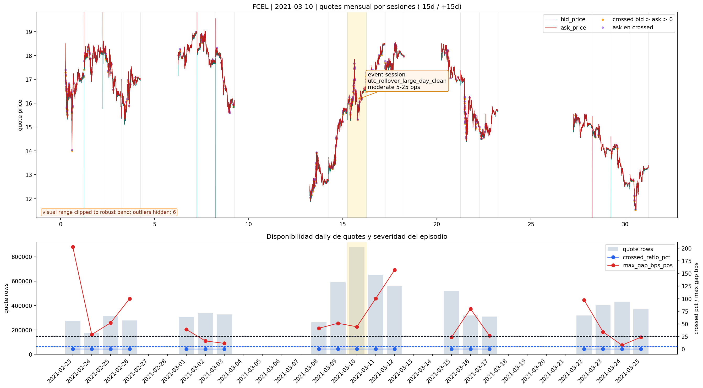

#### 01 Raw Window
Esta imagen responde a la primera pregunta decisiva del caso: el crossed observado, si existe, sigue siendo compatible con permanencia en `good` o no. Arriba ensena la geometria exacta del tramo conflictivo; abajo convierte esa geometria a bps y la enfrenta a los cortes `5 bps` y `25 bps`. El regimen dominante es `moderate 5-25 bps`. La decision que cambia es demostrar que el residuo permanece por debajo del dano que obligaria a mover el caso a `review` o `bad`. El error que evita es expulsar del universo util episodios leves cuyo impacto sobre ejecucion y features sigue siendo tolerable.

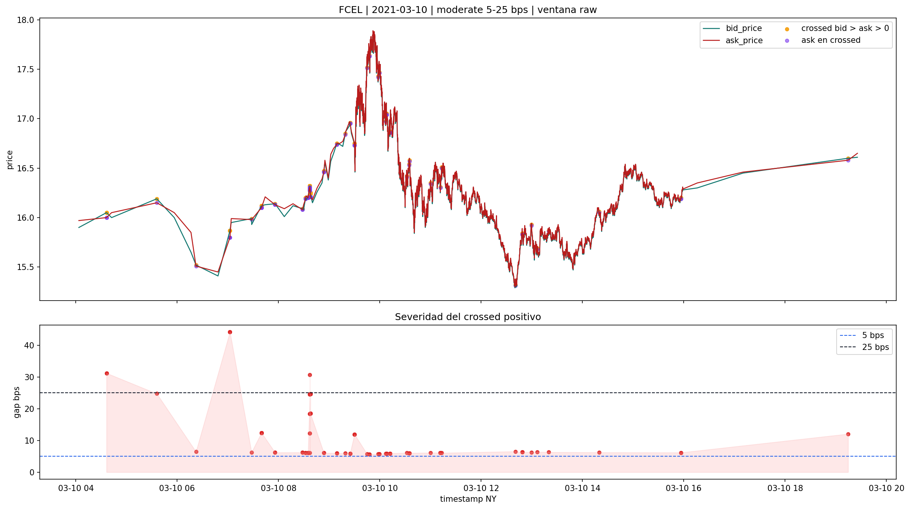

#### 02 Full Session Context
Esta imagen responde a la pregunta de extension intradiaria: el dano esta confinado a un bloque corto o contamina la sesion completa. Arriba se ve toda la sesion `04:00-20:00 NY`; abajo el `gap_bps` firmado. La decision que cambia es si el consumo debe penalizar solo un tramo o desechar el dia entero para uso operativo. El error que evita es tratar una cicatriz local como ruina total o, al reves, minimizar una degradacion distribuida a lo largo del dia. En ejecucion esto decide si la sesion puede seguir usandose con restricciones; en ML decide si las features intradiarias conservan significado economico.

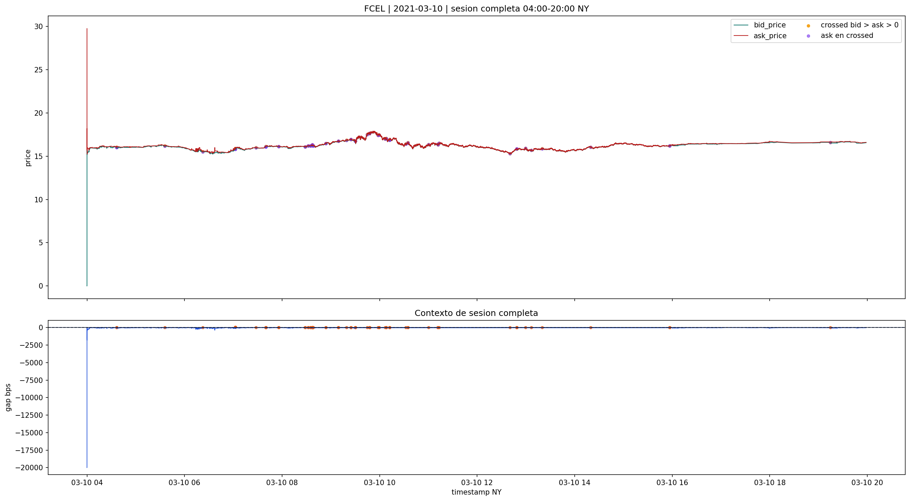

#### 03 Structure Diagnostics
Este panel responde a la pregunta de naturaleza del fallo: contradiccion economica genuina o mezcla con degeneracion estructural. Separa `ask=0` de `ask>0`, muestra la distribucion de `gap_bps` y resume patrones de integerizacion. La decision que cambia es como interpretar el dano: mercado localmente roto, artefacto de representacion o combinacion de ambos. El error que evita es sobrediagnosticar crossed reales cuando parte de la senal proviene de estructura degenerada del libro. Esta lectura afecta directamente a que el caso vaya a exclusion dura, a bandera contextual o a simple reconciliacion tecnica.

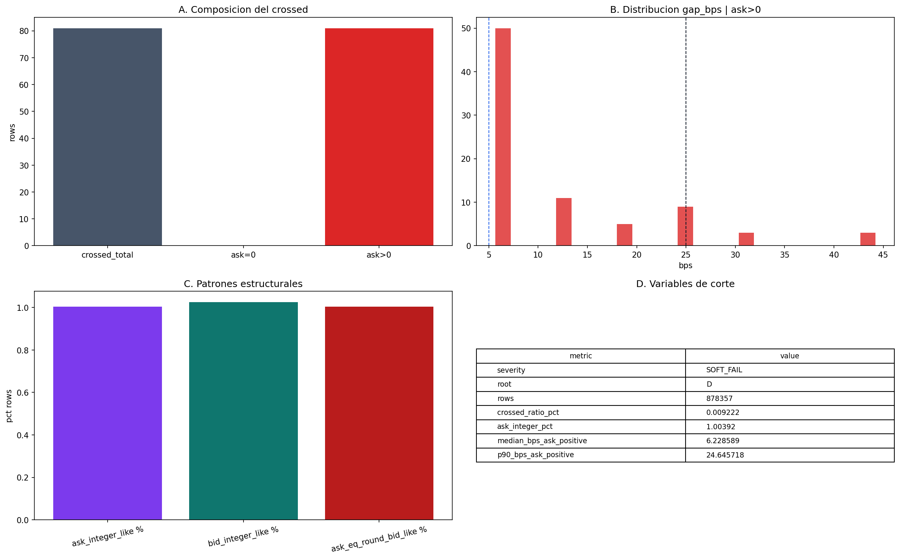

#### 04 Summary Card
Esta tarjeta responde a la pregunta de auditabilidad: cuales son exactamente las variables que sostienen la conclusion. Reune `severity`, `root`, `crossed_ratio_pct`, `ask_integer_pct`, `median_bps_ask_positive` y `p90_bps_ask_positive`. La decision que cambia es pasar de impresion visual a regla verificable. El error que evita es que dos inspectores lleguen a conclusiones distintas mirando la misma imagen sin una base numerica comun. Para gobernanza del proyecto, este panel es el que vuelve reproducible la decision para backtest, ML y auditoria.

---

### 12. CRON 2019-01-31

company_name: `Cronos Group Inc. Common Share`
primary_exchange: `NASDAQ` (`XNAS`)
market_locale: `stocks/us`
scope: `good`
ticker: `CRON`
date: `2019-01-31`
taxonomy: `utc_rollover_large_day_clean`
positive_cross_bucket: `positive_cross_moderate_5to25bps`
severity: `SOFT_FAIL`
root: `D`
rows: `869066`
crossed_ratio_pct: `0.004142`
crossed_rows_raw: `36`
crossed_rows_ask_zero: `0`
crossed_rows_ask_positive: `36`
ask_integer_pct: `1.852218`
median_bps_ask_positive: `5.021341`
p90_bps_ask_positive: `5.372012`
file: `D:\quotes\CRON\year=2019\month=01\day=31\quotes.parquet`

#### Analisis Forense
La conclusion correcta del caso es que el libro mantiene semantica economica util. El residuo observado no cambia de forma material la lectura del spread ni invalida el uso operativo normal del dia. La taxonomy historica es `utc_rollover_large_day_clean` y el regimen positivo dominante es `moderate 5-25 bps`. Esto importa porque la taxonomy no solo clasifica: resume que tipo de anomalia se esta viendo y que clase de decision contractual puede defenderse despues. La taxonomy `utc_rollover_large_day_clean` implica que parte de la rareza pertenece al eje temporal y no al eje economico del spread; su lectura correcta evita castigar como libro roto un efecto de rollover bien entendido. El regimen `moderate 5-25 bps` ya entra en zona donde el crossed tiene capacidad real de contaminar simulacion de ejecucion y features microestructurales, aunque todavia puede requerir lectura contextual antes de exclusion dura. En terminos observables, el file tiene `crossed_ratio_pct=0.004142` con `crossed_rows_ask_positive=36` y `crossed_rows_ask_zero=0`. La severidad economica del crossed ask>0 se resume en `median_bps_ask_positive=5.021341` y `p90_bps_ask_positive=5.372012`. Estos dos numeros convierten una forma visual rara en una conclusion operativa sobre si el libro sigue representando o no un mercado negociable. La decision que cambia es mantener el caso dentro de la franja util, aunque con lectura consciente de que existe una huella positiva leve o acotada. En `good`, el objetivo no es negar toda irregularidad, sino demostrar que la anomalia no destruye la semantica economica minima del libro ni invalida su uso principal. El error que evita esta lectura es sobrecastigar micro-residuos y encoger artificialmente el universo util para backtest y ML. El patron estructural muestra `ask_integer_pct=1.852218`. Este numero obliga a separar dos explicaciones rivales: contradiccion economica genuina del libro o mezcla con degeneracion estructural / integerizacion. Toda la composicion crossed cae en `ask>0`. Eso endurece la lectura economica del caso: el dano no depende de ceros mecanicos, sino de contradiccion positiva dentro de precios aparentemente vivos. Como `ask_integer_pct` es bajo, la hipotesis de simple degeneracion mecanica pierde fuerza. Eso endurece la interpretacion: el crossed se parece mas a contradiccion economica genuina y menos a artefacto. Existe ademas una imagen historica de certificacion asociada. Su papel es poner el episodio en un marco causal mas amplio: halt, explained, not strongly explained o patron conocido. La regla que protege al proyecto es esta: el contexto externo se usa para explicar por que aparece el episodio, no para absolverlo. El error que evita es degradar el criterio de calidad del libro porque exista una historia plausible alrededor del caso.

#### 00 Event Month Context
Esta imagen responde a la pregunta de persistencia temporal: estamos ante un accidente local o ante una fase mas amplia de inestabilidad. Arriba coloca el evento en la serie `daily` real del mes; abajo compara `crossed_ratio_pct` y `max_gap_bps_pos` del dia contra sus vecinos. La decision que cambia es el peso estructural que se le concede al caso. El error que evita es juzgar igual un shock aislado y una degradacion repetida del libro.

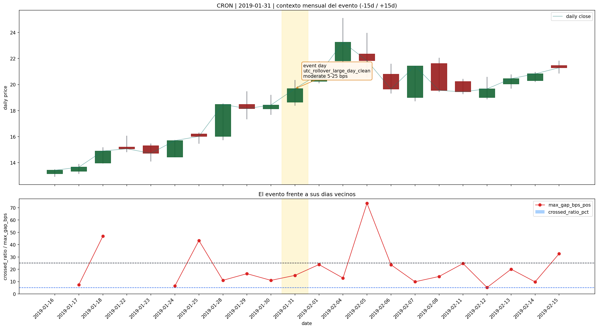

#### 00b Event Month Quotes Context
Esta imagen responde a la pregunta de recurrencia mensual dentro de `quotes`: el problema se concentra en el evento o reaparece en varias sesiones. Arriba concatena sesiones con datos disponibles; abajo resume cobertura diaria, `crossed_ratio_pct` y `max_gap_bps_pos`. La decision que cambia es si el caso debe leerse como episodio puntual o como sintoma de una fase repetida de libro degradado. El error que evita es extrapolar desde un unico dia a todo el mes sin evidencia.

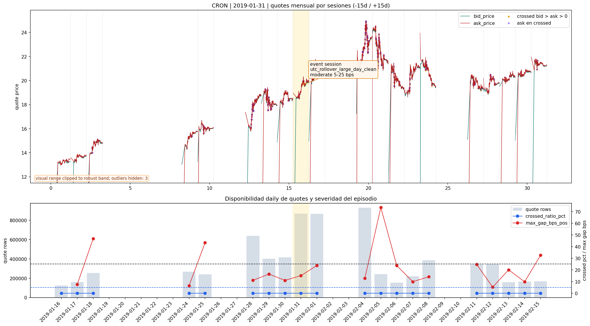

#### 01 Raw Window
Esta imagen responde a la primera pregunta decisiva del caso: el crossed observado, si existe, sigue siendo compatible con permanencia en `good` o no. Arriba ensena la geometria exacta del tramo conflictivo; abajo convierte esa geometria a bps y la enfrenta a los cortes `5 bps` y `25 bps`. El regimen dominante es `moderate 5-25 bps`. La decision que cambia es demostrar que el residuo permanece por debajo del dano que obligaria a mover el caso a `review` o `bad`. El error que evita es expulsar del universo util episodios leves cuyo impacto sobre ejecucion y features sigue siendo tolerable.

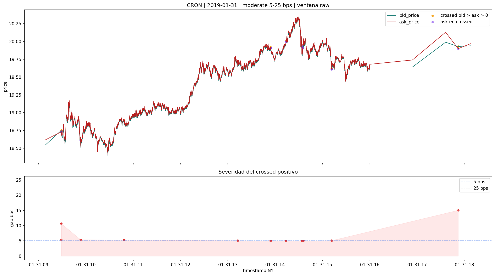

#### 02 Full Session Context
Esta imagen responde a la pregunta de extension intradiaria: el dano esta confinado a un bloque corto o contamina la sesion completa. Arriba se ve toda la sesion `04:00-20:00 NY`; abajo el `gap_bps` firmado. La decision que cambia es si el consumo debe penalizar solo un tramo o desechar el dia entero para uso operativo. El error que evita es tratar una cicatriz local como ruina total o, al reves, minimizar una degradacion distribuida a lo largo del dia. En ejecucion esto decide si la sesion puede seguir usandose con restricciones; en ML decide si las features intradiarias conservan significado economico.

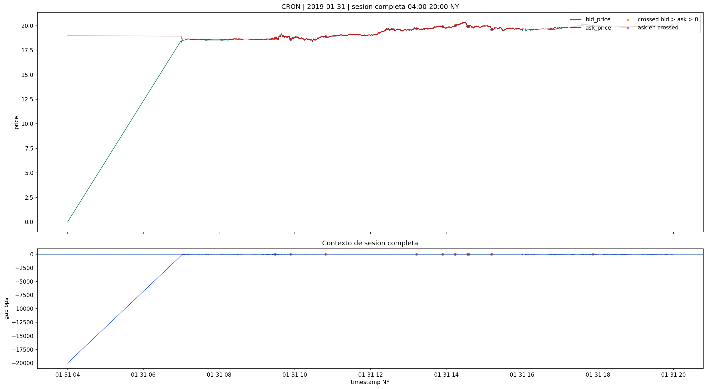

#### 03 Structure Diagnostics
Este panel responde a la pregunta de naturaleza del fallo: contradiccion economica genuina o mezcla con degeneracion estructural. Separa `ask=0` de `ask>0`, muestra la distribucion de `gap_bps` y resume patrones de integerizacion. La decision que cambia es como interpretar el dano: mercado localmente roto, artefacto de representacion o combinacion de ambos. El error que evita es sobrediagnosticar crossed reales cuando parte de la senal proviene de estructura degenerada del libro. Esta lectura afecta directamente a que el caso vaya a exclusion dura, a bandera contextual o a simple reconciliacion tecnica.

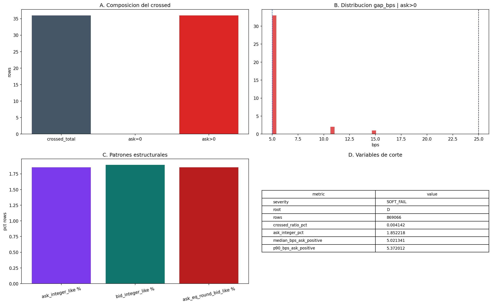

#### 04 Summary Card
Esta tarjeta responde a la pregunta de auditabilidad: cuales son exactamente las variables que sostienen la conclusion. Reune `severity`, `root`, `crossed_ratio_pct`, `ask_integer_pct`, `median_bps_ask_positive` y `p90_bps_ask_positive`. La decision que cambia es pasar de impresion visual a regla verificable. El error que evita es que dos inspectores lleguen a conclusiones distintas mirando la misma imagen sin una base numerica comun. Para gobernanza del proyecto, este panel es el que vuelve reproducible la decision para backtest, ML y auditoria.

---
