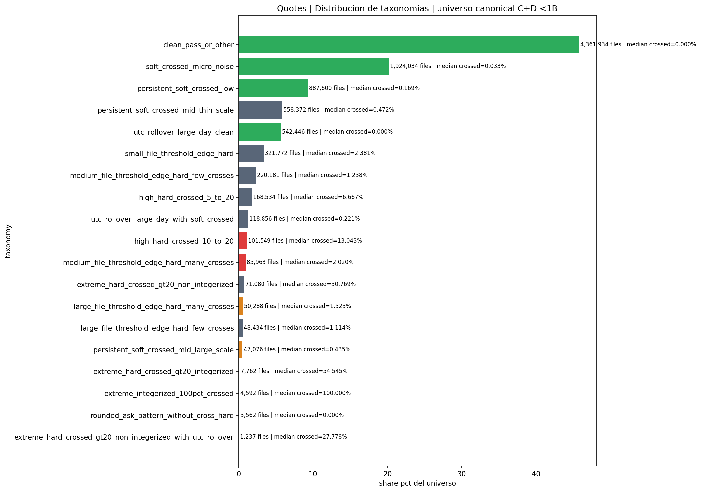
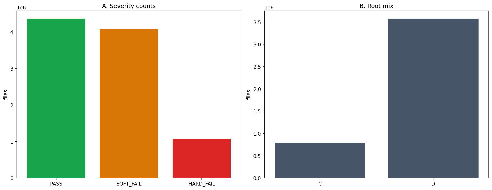
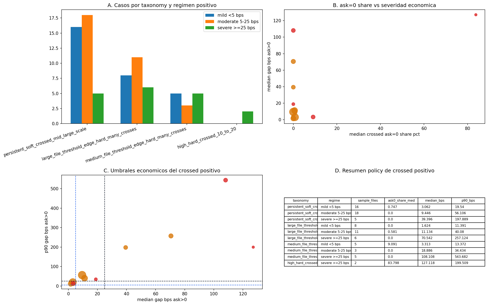
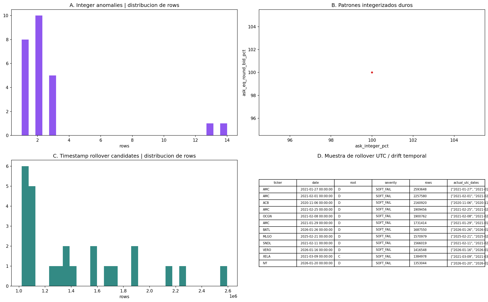
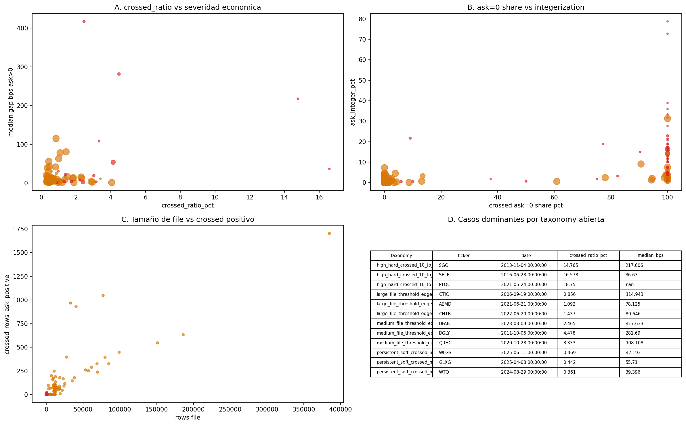

# Quotes Inspection Readout v0.1

## Rol

Este documento cierra institucionalmente el bloque `quotes` como sintesis de:

- evidencia poblacional del universo auditado;
- evidencia forense ejemplar de los casos que siguen abiertos para decision;
- y enlaces a los dossiers donde se ve cada caso con detalle.

No sustituye a la auditoria historica `v2`.
Su funcion es traducir esa auditoria a una lectura institucional clara para humanos y agentes.

## A quien va dirigido

Este documento debe poder leerlo alguien que no conozca el proyecto.

Por eso la pregunta correcta aqui no es solo:

- cuantas observaciones hay;

sino tambien:

- que significa cada grafico;
- que decision operativa soporta;
- y que parte del universo representa realmente.

## Fuentes de autoridad

- `04_quotes_full_C_D_methodology.ipynb`
- `04_quotes_full_C_D_methodology.md`
- `04_quotes_full_C_D_closeout.ipynb`
- `04_quotes_full_C_D_closeout.md`
- `quotes_label_taxonomy_and_cut_policy.md`
- `quotes_dataset_contract_v0_1.md`
- `quotes_consumption_policy.md`
- `quotes_open_casepacks_audit_v0_1.md`

## Procedencia de las imagenes

Las imagenes embebidas en este readout no se han redibujado manualmente para este documento.
Proceden del pipeline historico de `quotes` ya institucionalizado y de sus artefactos exportados.

Ruta de los assets usados aqui:

- `01_foundations/inspection_dossiers/quotes/evidence_assets/global_policy/`

Manifest asociado:

- `01_foundations/inspection_dossiers/quotes/evidence_assets/global_policy/quotes_global_policy_manifest.csv`

Codigo generador principal ya existente:

- `scripts/inspection/quotes/quotes_case_panel.py`

Por tanto, este readout:

- reutiliza imagenes ya exportadas;
- no introduce una fuente visual paralela nueva;
- y solo endurece la lectura analitica y la interpretacion institucional de esos mismos paneles.

## Que se esta auditando exactamente

La unidad operativa natural de `quotes` es:

- `ticker-date-file`

Es decir:

- un ticker;
- un dia;
- y el archivo de `quotes` que contiene el libro observado de ese dia.

En este bloque no estamos auditando "retornos" ni "velas" primero.
Estamos auditando la calidad local del libro `bid/ask`.

## Regla de lectura obligatoria

En `quotes` deben separarse siempre tres planos:

1. masa poblacional total auditada;
2. taxonomias o familias de problema;
3. casos forenses ejemplares del inspector final.

La confusion mas peligrosa seria esta:

- ver mas de `1M` de `HARD_FAIL`;
- despues ver solo `15 bad`;
- y pensar que los `15` son todo el problema.

Eso seria falso.

La lectura correcta es:

- los conteos poblacionales describen todo el universo;
- las taxonomias lo agrupan en familias interpretables;
- y los `case packs` muestran solo las familias abiertas que siguen siendo decisionales.

## Resultado agregado

- `PASS`: `4,365,496`
- `SOFT_FAIL`: `4,078,384`
- `HARD_FAIL`: `1,081,392`

El universo total resumido aqui es de `9,525,272` archivos `ticker-date-file`.

Traduccion a inspeccion final:

- `review` abiertos trasladados al dossier final: `64`
- `bad` abiertos trasladados al dossier final: `15`
- `good` documentado: muestra representativa de `12` casos

## Como leer la evidencia poblacional

La capa poblacional responde tres preguntas:

1. cuanta masa hay;
2. donde esta esa masa;
3. de que tipo es.

Los graficos siguientes no son decoracion.
Cada uno responde una pregunta distinta.

## 1. Taxonomy Distribution

### Que muestra

Muestra la distribucion completa del universo por taxonomias.
Cada barra horizontal es una familia de comportamiento del libro.

Ejemplos de familias:

- `clean_pass_or_other`
- `soft_crossed_micro_noise`
- `persistent_soft_crossed_low`
- `utc_rollover_large_day_clean`
- `high_hard_crossed_10_to_20`

El color resume el bloque contractual:

- verde: franja buena;
- naranja: franja `review`;
- rojo: franja `bad`.

### Responde

- que familias absorben la mayor parte del universo;
- si la masa dominante vive en zonas benignas o en colas duras;
- y donde empieza realmente la cola conflictiva.

### No responde

- no decide por si solo la gravedad economica de cada familia;
- no distingue todavia entre crossed economico real y degradacion estructural;
- no decide consumo final sin apoyo de los paneles siguientes.

### Consecuencia

Evita confundir frecuencia con gravedad.
Una familia puede ser enorme y relativamente benigna.
Otra puede ser pequena y metodologicamente peligrosa.

### Lectura analitica

La taxonomia dominante es `clean_pass_or_other` con `4,361,934` archivos, es decir `45.793%` del universo.
Eso significa que casi la mitad de la masa total ya cae en una bolsa limpia o residualmente no conflictiva.

La segunda familia mas grande no es roja, sino `soft_crossed_micro_noise` con `1,924,034` archivos (`20.199%`).
La tercera es `persistent_soft_crossed_low` con `887,600` (`9.318%`).
Solo estas tres primeras familias ya concentran `75.311%` del universo.

Si se anaden `persistent_soft_crossed_mid_thin_scale` (`5.862%`) y `utc_rollover_large_day_clean` (`5.695%`), las cinco primeras familias suman `86.868%`.
La consecuencia es fuerte: la masa principal de `quotes` vive en bloques limpios, micro-ruidosos o bien explicados, no en patologia dura sin interpretar.

Las familias visualmente mas alarmantes son mucho mas pequenas de lo que su nombre puede sugerir:

- `high_hard_crossed_10_to_20` representa `1.066%`;
- `extreme_hard_crossed_gt20_non_integerized` `0.746%`;
- `extreme_hard_crossed_gt20_integerized` `0.081%`;
- `extreme_integerized_100pct_crossed` `0.048%`.

Eso no las vuelve inocuas.
Lo que significa es otra cosa:

- son colas pequenas pero potencialmente destructivas para ejecucion o simulacion;
- no deben usarse para describir el estado general del dataset.

Tambien es importante leer juntas las familias de rollover UTC.
`utc_rollover_large_day_clean` aporta `542,446` archivos (`5.695%`) y `utc_rollover_large_day_with_soft_crossed` otros `118,856` (`1.248%`).
En conjunto son `661,302` archivos (`6.943%`), una masa mayor que muchas familias duras individuales.
Eso obliga a no interpretar toda irregularidad visible como crossed economico: una parte material del universo responde a geografia temporal, no a libro roto.

## 2. Severity And Root Mix

### Que muestra

Este panel tiene dos partes:

- izquierda: masa total por severidad (`PASS`, `SOFT_FAIL`, `HARD_FAIL`);
- derecha: mezcla por `root`.

`root` resume la familia base de deteccion historica.

### Responde

- cuanta masa cae en cada nivel de severidad;
- y si esa masa esta sesgada hacia un origen historico concreto o no.

### No responde

- no decide por si solo `good`, `review` o `bad`;
- no separa todavia causas economicas, estructurales o temporales;
- no explica la geometria interna de cada familia.

### Consecuencia

Fija que `severity` es una alarma temprana, no un veredicto final.
Sirve para no ignorar un problema, pero no basta para decidir consumo o exclusion contractual.

### Lectura analitica

La mezcla por severidad es:

- `PASS = 4,365,496` (`45.831%`)
- `SOFT_FAIL = 4,078,384` (`42.816%`)
- `HARD_FAIL = 1,081,392` (`11.353%`)

La lectura correcta no es que el universo este mayoritariamente roto.
La lectura correcta es que esta muy repartido entre limpio y tension leve, con una cola dura relativamente acotada.
`PASS + SOFT_FAIL` suman `88.647%`.

Eso significa que casi nueve de cada diez archivos no viven en una patologia dura final, aunque si exista una franja grande de casos que requieren contextualizacion.

Por `root`, la mezcla es sorprendentemente estable:

- `root C`: `44.675% PASS`, `42.675% SOFT_FAIL`, `12.651% HARD_FAIL`
- `root D`: `46.094% PASS`, `42.849% SOFT_FAIL`, `11.057% HARD_FAIL`

La diferencia en `HARD_FAIL` entre `C` y `D` es de solo `1.594` puntos porcentuales.
Eso quiere decir que el problema no esta localizado en un unico origen historico de deteccion.
Ambos roots producen una mezcla parecida.

El numero que mas facilmente puede inducir a error es `1,081,392 HARD_FAIL`.
Visualmente parece una masa enorme, y lo es.
Pero en el closeout final no toda esa masa queda abierta para decision humana.
Gran parte ya esta absorbida por familias entendidas como integerizacion extrema, threshold edge o rollover.
La consecuencia es que severidad sirve para abrir la alarma, pero no para decidir sola consumo o exclusion final.

## 3. Positive Cross Policy

### Que muestra

Este grafico entra en el nucleo economico de `quotes`.
No todo crossed importa igual.

El panel analiza el crossed positivo:

- filas con `bid > ask > 0`

y lo separa por severidad economica:

- `mild < 5 bps`
- `moderate 5-25 bps`
- `severe >= 25 bps`

### Responde

- cuanto crossed positivo hay en las familias abiertas;
- cuanto de ese crossed vive en `ask=0` frente a `ask>0`;
- y cuan interpretable es en terminos economicos reales.

### No responde

- no resume el universo entero;
- no sustituye la lectura visual caso por caso;
- no explica por si solo integerizacion o rollover temporal.

### Consecuencia

Justifica por que dos casos con crossed pueden acabar en bloques distintos.
La diferencia no es solo la existencia del crossed, sino su severidad economica, su persistencia y su composicion.

### Lectura analitica

Este panel demuestra que "crossed" no es una variable binaria suficiente.
Hay taxonomias donde el crossed positivo es economicamente interpretable y otras donde el valor en bps queda dominado por `ask=0`.

Casos abiertos que importan de verdad:

- `persistent_soft_crossed_mid_large_scale`: el crossed positivo es practicamente todo `ask>0` (`100%` mediano en la muestra positiva) y su severidad tipica cambia mucho por bucket:
  - mild: mediana `3.062` bps;
  - moderate: `9.446` bps;
  - severe: `39.396` bps.

- `large_file_threshold_edge_hard_many_crosses`: tambien es casi enteramente `ask>0` en los buckets positivos (`99.4%-100%`), con tres regimenes claros:
  - mild: `1.624` bps;
  - moderate: `11.134` bps;
  - severe: `70.542` bps.

- `medium_file_threshold_edge_hard_many_crosses`: vuelve a mostrar una mezcla economicamente fuerte:
  - mild: `3.313` bps;
  - moderate: `18.886` bps;
  - severe: `108.108` bps.

- `high_hard_crossed_10_to_20`: aqui el matiz cambia.
  La mediana positiva es altisima (`127.118` bps), pero la mediana de composicion sigue siendo `83.798% ask=0` y solo `16.202% ask>0`.
  O sea, visualmente parece un crossed positivo gigantesco, pero buena parte de la geometria del problema sigue muy contaminada por cero estructural en `ask`.

La consecuencia institucional es que la misma palabra "crossed" encierra al menos dos mundos:

- crossed economico con `ask>0`, donde los bps son interpretables como tension real del libro;
- crossed mecanico o degradado por `ask=0`, donde el valor aparente puede parecer enorme y, sin embargo, no representar bien una oportunidad o un fallo economico interpretable.

Sin esta lectura numerica, un inspector podria sobreelevar `high_hard_crossed_10_to_20` por su mediana extrema y subestimar `large_file_threshold_edge_hard_many_crosses`, cuando este ultimo combina:

- masa abierta relevante;
- casi todo `ask>0`;
- y buckets severos con `70+` bps mediano y `257+` bps en la cola `p90`.

## 4. Integer And Timestamp Diagnostics

### Que muestra

Este panel ensena dos familias de problemas que no deben confundirse con crossed economico real:

- integerizacion o patrones mecanicos del libro;
- rollover UTC o drift temporal.

### Responde

- si el problema dominante parece representacional en vez de economico;
- si la irregularidad visible proviene de timestamp o de particion diaria;
- y si un crossed aparente debe leerse como microestructura real o como artefacto.

### No responde

- no cuantifica por si solo el impacto de ejecucion final;
- no decide consumo sin contexto de taxonomia y severidad;
- no sustituye el dossier forense del caso concreto.

### Consecuencia

Evita falsos diagnosticos causales.
Sin este panel, un investigador podria atribuir a microestructura economica lo que en realidad es integerizacion degenerada o un rollover UTC.

### Lectura analitica

Los casos de integerizacion no son una intuicion vaga, sino una morfologia extremadamente compacta.
En la muestra de `integer_anomaly_cd_lt1b.parquet`, los casos visibles tienen simultaneamente:

- `m.crossed_ratio_pct = 100`
- `m.ask_integer_pct = 100`
- `m.ask_eq_round_bid_pct = 100`

La lectura correcta no es "hay crossed muy agresivo", sino "el libro ha colapsado en un patron mecanico donde el ask entero coincide de forma degenerada con el bid redondeado".
Eso importa porque una lectura puramente economica del crossed aqui seria falsa desde la base.

El subpanel temporal cuenta otra historia distinta.
En `timestamp_view_cd_lt1b.parquet` aparecen dias enormes como:

- `AMC 2021-01-27` con `2,593,648` filas;
- `AMC 2021-02-01` con `2,257,580`;
- `ACB 2020-11-06` con `2,160,920`.

Todos cruzan dos fechas UTC dentro del mismo archivo.
Eso demuestra que parte de la masa `SOFT_FAIL` vive en archivos gigantes donde el problema dominante es de corte temporal y rollover, no de libro economicamente inviable.

La consecuencia metodologica es fuerte:

- si el inspector viera solo un porcentaje pequeno de crossed sin este panel, podria etiquetar como sospechoso un archivo cuya verdadera explicacion es geografia UTC;
- si viera solo integerizacion sin el panel, podria creer que observa microestructura extrema cuando en realidad observa una representacion degenerada.

## 5. Open Bucket Diagnostics

### Que muestra

Este grafico ya no habla del universo entero.
Habla especificamente de las familias abiertas que el closeout dejo vivas para decision final.

Esas familias son:

- `persistent_soft_crossed_mid_large_scale`
- `large_file_threshold_edge_hard_many_crosses`
- `medium_file_threshold_edge_hard_many_crosses`
- `high_hard_crossed_10_to_20`

### Responde

- que tamano poblacional real tiene cada bolsa abierta;
- como cambia su composicion economica interna;
- y donde merece gastar tiempo humano de alta calidad.

### No responde

- no reemplaza la lectura visual caso por caso;
- no demuestra por si solo si un caso individual acaba en `review` o `bad`;
- no reabre familias ya cerradas del universo.

### Consecuencia

Justifica el recorte humano.
La revision forense no debe gastarse en millones de archivos indiferenciados, sino en las bolsas que aun pueden cambiar una decision contractual.

### Lectura analitica

Las cuatro familias abiertas son pequenas frente al universo total, pero no equivalentes entre si:

- `high_hard_crossed_10_to_20` = `101,549` archivos (`1.066%` del universo)
- `medium_file_threshold_edge_hard_many_crosses` = `85,963` (`0.902%`)
- `large_file_threshold_edge_hard_many_crosses` = `50,288` (`0.528%`)
- `persistent_soft_crossed_mid_large_scale` = `47,076` (`0.494%`)

Sumadas representan `284,876` archivos, solo `2.991%` del universo auditado.
Ese es el dato clave del panel.
La incertidumbre institucional realmente decisional ya no vive en millones de archivos indistintos, sino en una cola de alrededor del `3%`.

Pero esa cola no es trivial.
Dentro de ella, `high_hard_crossed_10_to_20` es la familia mas grande, aunque no necesariamente la mas interpretable economicamente por su contaminacion alta de `ask=0`.
`large_file_threshold_edge_hard_many_crosses`, en cambio, es mas pequena pero probablemente mas peligrosa para consumo de ejecucion cuando cae en buckets positivos severos, porque su crossed vive casi totalmente en `ask>0`.

La consecuencia relativa es:

- una familia puede ser la mayor del open bucket y aun asi no ser la primera prioridad economica;
- otra puede ser mas pequena, pero mas limpia en semantica de crossed positivo y por tanto mas relevante para simulacion de fills o mark-to-market.

## Lectura institucional de la poblacion

- La taxonomia dominante es `clean_pass_or_other` con `45.793%` del universo resumido por `taxonomy summary`.
- La masa `HARD_FAIL` existe y es grande, pero no toda esa masa queda abierta para decision final.
- El closeout historico absorbio gran parte del residuo duro en familias ya entendidas.
- La franja abierta y decisional del inspector final se reduce a cuatro taxonomias:
  - `persistent_soft_crossed_mid_large_scale`
  - `large_file_threshold_edge_hard_many_crosses`
  - `medium_file_threshold_edge_hard_many_crosses`
  - `high_hard_crossed_10_to_20`

La lectura inteligente de esta seccion es:

- el problema de `quotes` no es masivo y homogeneo;
- es heterogeneo, jerarquico y segmentable;
- por eso la solucion correcta no es "aceptar todo" ni "bloquear todo";
- la solucion correcta es una arquitectura de vistas, taxonomias y policies de consumo.

La suma de `clean_pass_or_other`, `soft_crossed_micro_noise`, `persistent_soft_crossed_low`, `persistent_soft_crossed_mid_thin_scale` y `utc_rollover_large_day_clean` es `8,274,386` archivos, es decir `86.868%` del universo.
Eso significa que casi nueve de cada diez archivos ya viven en cinco familias bastante bien entendidas, aunque no todas sean "buenas" en sentido ingenuo.

La cola dura y visualmente mas espectacular existe, pero esta atomizada:

- todas las familias `extreme_*` juntas apenas superan el `0.889%`;
- la familia `rounded_ask_pattern_without_cross_hard` es solo `0.037%`;
- y la familia `extreme_hard_crossed_gt20_non_integerized_with_utc_rollover` es `0.013%`.

Eso obliga a una lectura institucional madura:

- no negar la cola dura;
- pero tampoco permitir que esa cola describa el dataset entero.

## Como leer la evidencia forense ejemplar

Los dossiers de casos no intentan enumerar el universo entero.
Su funcion es otra:

- ensenar como se ve fisicamente cada familia abierta;
- justificar por que un caso acaba en `review` o `bad`;
- y mostrar, cuando existe, si el contexto externo explica el episodio sin rehabilitarlo.

La implicacion mas importante es:

- un dossier de casos no es una estadistica;
- es una prueba visual y conceptual de decision.

Sirve para que un lector pueda responder:

- "entiendo por que este bucket queda abierto";
- "entiendo por que no se reclasifica como `good`";
- "entiendo por que el contexto externo no absuelve automaticamente al libro".

## Evidencia forense ejemplar

La traslacion a `01_foundations` conserva exactamente la bolsa abierta del historico `v2`:

- `review`: `64` casos
- `bad`: `15` casos

La franja `good` no es una enumeracion exhaustiva del universo bueno.
Se documenta como muestra representativa para justificar:

- como se ve un libro sano;
- como se ve un micro-noise aceptable;
- como se ve un `persistent_soft_crossed_low` compatible con consumo principal;
- y como se ve un `utc_rollover_large_day_clean`.

La consecuencia de esto es importante:

- `good` no pretende probar que "todo lo bueno es identico";
- pretende probar que las familias buenas principales tienen una morfologia defendible y consumible.

Eso basta para la decision institucional actual porque:

- la franja realmente conflictiva no esta en `good`;
- esta en la frontera entre `review` y `bad`.

## Dossiers

- [Quotes Good Cases v0.1](good_justification/quotes_good_cases_v0_1.md)
- [Quotes Review Cases v0.1](flagged_case_evidence_packs/quotes_review_cases_v0_1.md)
- [Quotes Bad Cases v0.1](bad_case_evidence_packs/quotes_bad_cases_v0_1.md)
- [Quotes Open Casepacks Audit v0.1](quotes_open_casepacks_audit_v0_1.md)

## Como debe usar esto un inspector

Orden correcto de lectura:

1. leer la masa poblacional y las taxonomias;
2. entender que familias quedan abiertas;
3. bajar al dossier correspondiente;
4. ver el caso con sus imagenes;
5. distinguir siempre:
   - explicacion causal externa;
   - y calidad local del libro.

Si un lector quiere saber:

- "cuanto problema hay en total",

debe quedarse en la capa poblacional.

Si quiere saber:

- "como se ve y por que se decidio `review` o `bad`",

debe ir al dossier forense.

Si quiere saber:

- "puedo usar `quotes` para ejecucion y microestructura?",

debe combinar ambas capas:

- poblacion para entender la masa real del problema;
- y forense para entender la naturaleza economica del fallo.

## Veredicto operacional

- `quotes_raw` sigue siendo la vista primaria para ejecucion y microestructura.
- `split_normalized` se usa para reconciliar escala mecanica entre `quotes` y `daily`.
- `adjusted` es la vista economica canonica para retornos y labels diarios.
- `adjusted_proxy` se mantiene como herramienta diagnostica de contraste externo, no como verdad economica final del modulo.

Esto tiene consecuencias claras:

- usar `adjusted` para simulacion de ejecucion seria un error;
- usar `quotes_raw` como serie economica interdiaria primaria tambien lo seria;
- y usar comparaciones externas sin separar `raw`, `split_normalized` y `adjusted_proxy` produciria diagnosticos falsos.

Por tanto, este `readout` no solo cierra `quotes`.
Tambien justifica por que la arquitectura del proyecto necesita varias vistas de precio y varias politicas de consumo.

## Conclusion

`quotes` queda cerrado institucionalmente en doble lectura:

- evidencia poblacional global;
- y evidencia forense de las familias abiertas.

La unica parte no exhaustiva por diseno es `good`, y esa condicion queda declarada explicitamente como muestra representativa.
