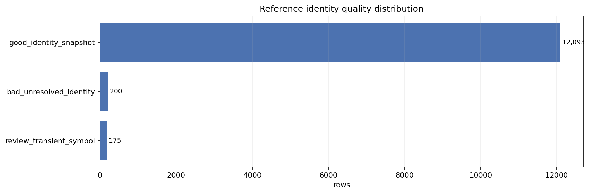
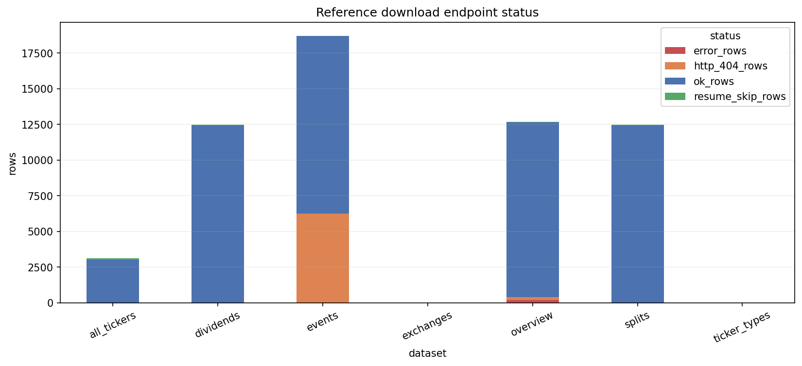
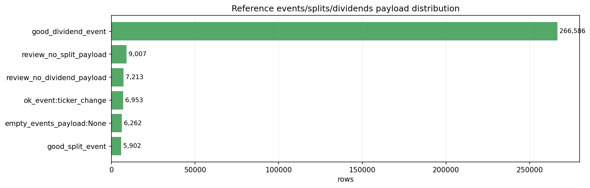
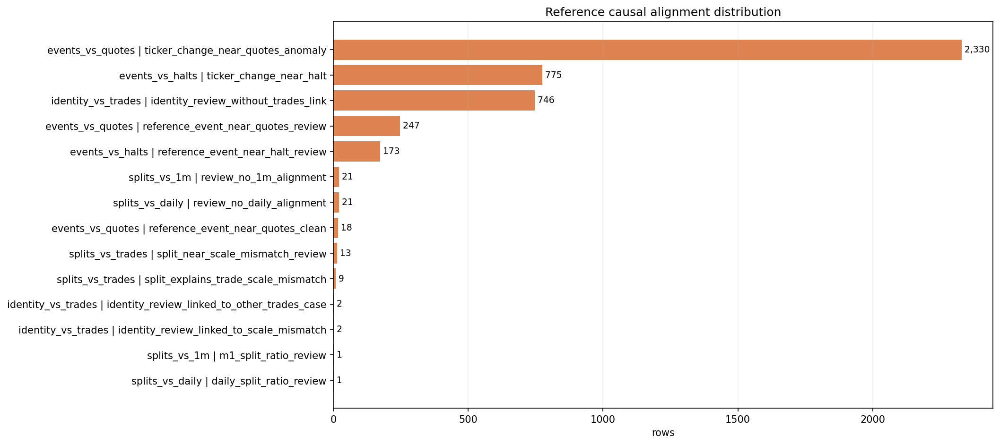
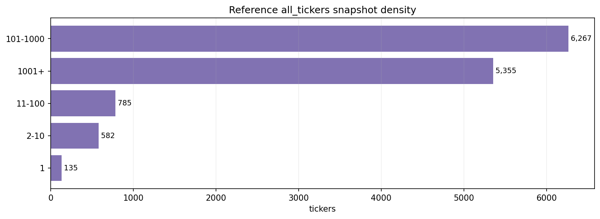

# Reference Inspection Readout v0.2

Fecha: 2026-06-13
Estado: modern_dossier_complete_for_foundation_promotion

## 1. Veredicto

`reference_v0_1` queda promovido de foundation minima documental a dossier inspector moderno.

La promocion de 2026-06-13 no reaudita desde cero. Absorbe la auditoria historica y la certificacion preservadas, las cruza con el estado actual de `01_foundations` y materializa evidence assets ligeros, visuales y casepacks.

Decision:

```text
reference = historical_deep_audit_closed + modern_dossier_complete_for_foundation_promotion
```

No cambia el consumo sensible:

- no habilita alpha;
- no habilita live;
- no habilita RL;
- no convierte ticker changes en continuidad economica cerrada;
- no convierte all_tickers en universe final;
- no convierte overview market cap en serie diaria PTI.

## 2. Fuentes leidas

Auditoria historica:

- `01_research/01_auditoria_RAW_DATA/00_data_certification/auditoria/reference/03_reference_root_cause_audit_phase1_closeout.md`
- `01_research/01_auditoria_RAW_DATA/00_data_certification/auditoria/reference/04_reference_causal_overlay_closeout.md`
- `01_research/01_auditoria_RAW_DATA/00_data_certification/auditoria/reference/04_reference_closeout.md`
- `01_research/01_auditoria_RAW_DATA/00_data_certification/auditoria/reference/cache_v2/manifest.json`

Certification:

- `01_research/01_auditoria_RAW_DATA/00_data_certification/certification/reference/00_reference_current_state.md`
- `01_research/01_auditoria_RAW_DATA/00_data_certification/certification/reference/01_reference_causal_value.md`
- `01_research/01_auditoria_RAW_DATA/00_data_certification/certification/reference/02_reference_closeout.md`

Foundation actual:

- `reference_institutional_closeout_v0_1.md`
- `reference_modernization_gap_audit_2026-06-12.md`
- `reference_dataset_contract_v0_1.md`
- `reference_registry_entry.yaml`
- `reference_consumption_policy.md`
- `reference_validators.md`
- canonical schemas de `reference`.

## 3. Assets activos

Run manifest:

- `evidence_assets/run_manifest.json`

Assets:

- `evidence_assets/historical_cache_inventory/reference_historical_cache_inventory_v0_1.md`
- `evidence_assets/historical_certification_inventory/reference_certification_inventory_v0_1.md`
- `evidence_assets/physical_root_audit/reference_physical_root_audit_summary_v0_1.md`
- `evidence_assets/population_summary/reference_population_summary_v0_1.md`
- `evidence_assets/population_visual_overview/reference_population_visual_manifest_v0_1.md`
- `evidence_assets/case_manifest/reference_case_manifest_v0_1.md`

Builder:

- `scripts/inspection/reference/build_reference_inspection_pack.py`

Build guide:

- `build_reference_inspection_pack.md`

## 4. Root fisico

Root actual:

```text
E:/TSIS/data/reference
```

Audit fisico:

- subfamilies: `8`
- `all_tickers`: `3,109` parquet files;
- `overview`: `12,468` ticker dirs / parquet files;
- `events`: `12,468` ticker dirs / parquet files;
- `splits`: `12,468` ticker dirs / parquet files;
- `dividends`: `12,468` ticker dirs / parquet files;
- `exchanges`: `1` parquet file;
- `ticker_types`: `1` parquet file;
- `_run`: `3` operational files.

Que muestra:

- el root operativo actual existe y conserva las subfamilias esperadas.

Responde:

- si `reference` es localizable fisicamente y si su layout general coincide con el contrato.

No responde:

- si cada fila individual es semanticamente correcta.

Consecuencia:

- el root fisico puede seguir registrado como raiz canonica, con `01_research` como provenance historico read-only.

## 5. Mapa poblacional visual

### 5.1. Identidad



Que muestra:

- `good_identity_snapshot = 12,093`;
- `bad_unresolved_identity = 200`;
- `review_transient_symbol = 175`.

Responde:

- si la identidad principal queda recuperada de forma masiva.

No responde:

- si ticker changes cierran continuidad economica.

Consecuencia:

- identidad es usable como foundation layer con flags `review` y `bad` preservadas.

### 5.2. Download endpoints



Que muestra:

- `overview` tiene `200` errores/404 que coinciden con residuo duro de identidad;
- `events` tiene `6,250` 404, historicamente interpretados como semantica de no-events;
- `splits` y `dividends` tienen `12,443` ok cada uno;
- `all_tickers` tiene `3,032` ok y `77` resume-skip;
- `exchanges` y `ticker_types` aparecen como resume-skip operativo, no fallo funcional.

Responde:

- que endpoints tienen residuo real y que endpoints tienen semantica operacional especial.

No responde:

- si cada payload de evento/corporate action es causalmente relevante.

Consecuencia:

- `overview 404` debe quedar como residuo de identidad; `events 404` no debe tratarse como corrupcion masiva.

### 5.3. Payload events/splits/dividends



Que muestra:

- `events`: `6,953` ticker_change y `6,262` empty payloads;
- `splits`: `5,902` good split events y `9,007` no split payload;
- `dividends`: `266,586` good dividend events y `7,213` no dividend payload.

Responde:

- que subfamilias tienen payload real y cuales tienen placeholders.

No responde:

- si cada evento impacta mercado.

Consecuencia:

- dividends es fuerte y no esta vacio;
- splits es real pero sparse;
- events es principalmente capa de ticker_change.

### 5.4. Causal alignment



Que muestra:

- `ticker_change_near_halt = 775`;
- `ticker_change_near_quotes_anomaly = 2,330`;
- `split_explains_trade_scale_mismatch = 9`;
- `split_near_scale_mismatch_review = 13`;
- `review_no_daily_alignment = 21`;
- `review_no_1m_alignment = 21`.

Responde:

- donde `reference` tiene valor explicativo frente a `halts`, `quotes`, `trades`, `daily` y `1m`.

No responde:

- causalidad limpia por caso individual.

Consecuencia:

- `events->halts` y `splits->trades` son los frentes de mayor confianza;
- `events->quotes` es detector fuerte, pero queda en review.

### 5.5. Listing snapshot density



Que muestra:

- `all_tickers` resume `13,124` tickers y `12,977,501` snapshot rows.

Responde:

- si `all_tickers` es una capa temporal de presencia, no un inventario unico.

No responde:

- universe membership final para cada fecha de backtest.

Consecuencia:

- puede alimentar universe support y coverage, pero no sustituye un universe builder PTI.

## 6. Casepacks

Manifest:

- `evidence_assets/case_manifest/reference_case_manifest_v0_1.md`

Casepacks activos:

- `good_justification/reference_good_identity_and_payload_cases_v0_1.md`
- `flagged_case_evidence_packs/reference_review_identity_and_quotes_cases_v0_1.md`
- `bad_case_evidence_packs/reference_bad_unresolved_identity_cases_v0_1.md`
- `causal_case_evidence_packs/reference_causal_overlay_cases_v0_1.md`
- `coverage_case_evidence_packs/reference_presence_coverage_cases_v0_1.md`

Que muestran:

- casos representativos derivados de indices historicos;
- good identity/payload;
- review identity/quotes;
- bad unresolved identity;
- causal overlays;
- coverage/presence limits.

Responden:

- que familias concretas sostienen cada estado operativo.

No responden:

- no son auditoria exhaustiva visual caso a caso de todos los eventos.

Consecuencia:

- son suficientes para que el dossier moderno tenga trazabilidad caso/familia sin copiar caches pesados.

## 7. Estados de calidad

### Good

- `good_identity_snapshot`
- `good_split_event`
- `good_dividend_event`
- `split_explains_trade_scale_mismatch`
- `ticker_change_near_halt` cuando el caso visual es coherente

### Review

- `review_transient_symbol`
- `review_instrument_type_ambiguity`
- `review_no_split_payload`
- `review_no_dividend_payload`
- `split_near_scale_mismatch_review`
- `ticker_change_near_quotes_anomaly`
- `reference_event_near_halt_review`
- `reference_event_near_quotes_review`
- `identity_review_residual`

### Bad

- `bad_unresolved_identity`

No emerge una familia causal agregada `bad` dominante en market overlay.

## 8. Decision de consumo

Permitido bajo policy vigente:

- corporate actions service;
- price view builders;
- daily adjusted;
- 1m split-normalized;
- universe support;
- lt1b coverage audits;
- event overlays;
- forensic/research review.

Restringido:

- backtest core;
- backtest extended;
- ML;
- execution simulator.

Bloqueado sin contrato nuevo:

- alpha;
- live;
- RL;
- ticker_change como senal de trading;
- all_tickers como universe final;
- overview market cap como membership diaria PTI.

## 9. Notebooks

No se crea notebook moderno nuevo en esta promocion.

Justificacion:

- ya existe notebook historico de root-cause audit bajo `01_research`;
- la logica estable vive ahora en builder residente;
- los visuales estables quedan exportados como PNG;
- las conclusiones quedan promovidas a markdown institucional;
- los casepacks permiten lectura humana sin reabrir un notebook pesado.

Si en el futuro se necesita navegacion interactiva por ticker/evento, debe crearse un notebook launcher que lea los assets y no encierre logica pesada.

## 10. Gaps cerrados frente al audit de 2026-06-12

Cerrado:

- evidence assets activos bajo `01_foundations`;
- physical root audit;
- historical cache inventory;
- certification inventory;
- population summary;
- population visual overview;
- manifests;
- casepacks por estado/familia;
- builder residente;
- build guide;
- traceability audit;
- readout moderno general-a-particular.

Permanece restringido por contrato:

- continuity/remap service;
- ML/backtest event features;
- live/RL;
- universe PTI final;
- uso de `overview.market_cap` como serie diaria.

## 11. Veredicto final

`reference` ya no debe figurar como pendiente de upgrade inspector moderno basico.

Estado correcto:

```text
modern_dossier_complete_for_foundation_promotion
```

La proxima carpeta del Harness, si el humano lo aprueba, debe ser `halts`, porque su auditoria historica es profunda pero su promocion en `01_foundations` todavia esta incompleta.

