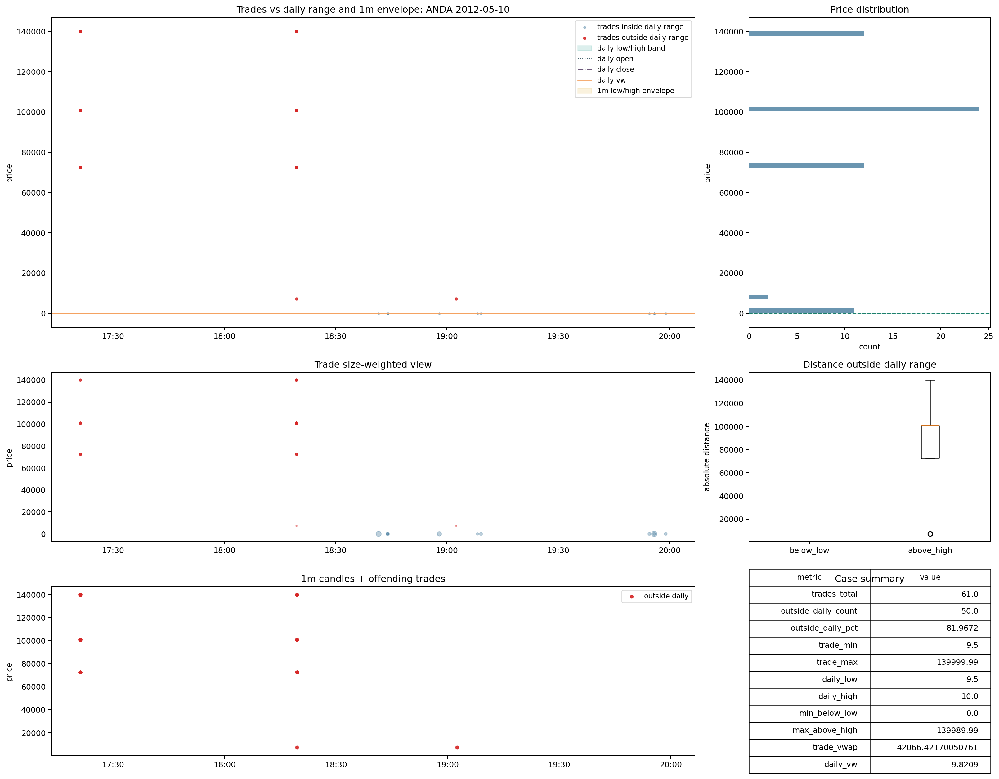

# Trades Bad Cases v0.1

## 1. Rol

Este dossier muestra la cola `bad` real de `trades`. En el cierre actual esa cola vive en `bad_data`.

Lo decisivo aqui no es la frecuencia. Es la frontera semantica que marca:

- despues de separar comparabilidad, microestructura y faltas de referencia,
- aun quedan files cuyo patron deja de ser defendible como flujo de ejecucion normal.

## 2. Principio rector

`bad_data` en `trades` no significa simplemente que el file discrepe de `daily` o `1m`. Significa que el patron observado destruye la lectura economica del flujo:

- o por outliers de escala grotesca;
- o por una masa ofensora que domina el `VWAP` y el rango util;
- o por una estructura de prints que ya no parece mercado interpretable, sino residuo que contamina cualquier simulacion.

### Responde

- si el file ha cruzado la frontera donde deja de ser defendible como flujo economico;
- si el dano sigue siendo de comparabilidad o ya es dano intrinseco del tape;
- si la rehabilitacion prudente todavia tiene sentido o ya no.

### No responde

- si el dataset entero de `trades` esta muerto;
- si un bucket grande de `review` deberia endurecerse por analogia;
- ni si el caso merece alguna forma de consumo productivo normal.

## 3. Caso BWL.A 2009-03-26

### Que muestra la imagen

- el file contiene prints gigantes muy por encima del rango diario y del sobre `1m`;
- el histograma y la tabla resumen ensenan que unos pocos prints dominan la escala del file;
- el `trade_vwap` queda destruido frente a `daily_vw` por observaciones que no se comportan como simple microestructura fina.

### Que pregunta responde

Responde a si el conflicto es reconciliable como escala o si el propio tape ya esta economicamente roto. La imagen apoya la segunda lectura.

### Que conclusion debe sacar el lector

Este no es un caso de comparabilidad delicada ni de odd-lot dominante. Es un caso donde el file deja de representar de forma creible el flujo del dia.

### Que decision cambia

- no puede ir a `recoverable_with_flag`;
- no puede entrar en ejecucion simulada normal;
- no puede alimentar labels microestructurales como si fuera tape sano.

### Que error metodologico evita

Evita llamar `reference_scale_mismatch` a casos donde el raw contiene observaciones tan desmesuradas que cualquier reconciliacion de escala seguiria dejando el file economicamente roto.

### Que no debe concluir

- no debe concluir que todo `outside` grande es `bad_data`;
- no debe concluir que un solo print raro basta para condenar un file;
- debe concluir algo mas fuerte: aqui la masa ofensora ya cambia el significado economico del file.

### Que pipeline afecta

- ejecucion: queda fuera;
- ML microestructural: solo sirve como etiqueta de dano o anomalia;
- forensic: si, como ejemplo de frontera dura;
- benchmark o retorno: no debe intervenir como observacion primaria.

## 4. Caso ANDA 2012-05-10

### Lectura analitica

- se observa un patron de outside que no puede reducirse a un simple borde del rango diario;
- la masa ofensora altera de manera material la interpretacion del file;
- el conflicto ya no parece reversible mediante flags prudentes.

### Que pregunta responde

Responde a si la cola `bad` es contable o real. Este caso prueba que es real: existe una familia donde la rehabilitacion deja de ser defendible.

### Que conclusion debe sacar el lector

La imagen prueba que la cola `bad` no es una abstraccion contable. Existen files donde el dano residual sigue siendo cualitativamente distinto de la franja `review`.

### Consecuencia

La consecuencia institucional es clara: el proyecto necesita conservar una cola `bad` pequena pero no vacia, porque sin ella acabaria blanqueando files que destruyen cualquier simulacion seria.

### Que decision cambia

- el file queda fuera de `recoverable_with_flag`;
- queda reservado a `bad` y `forensic_only`.

## 5. Conclusion del bloque bad

La cola `bad_data` es pequena en el full final, pero es real. Su rol institucional no es desacreditar todo `trades`, sino fijar donde termina la rehabilitacion razonable.

El error mas peligroso seria minimizarla por ser pequena. Su importancia no viene del volumen, sino de que marca el punto en el que el tape deja de ser defendible incluso despues de separar conflictos explicables.
