# Trades Bad Data | muestra estratificada

## Rol

Este dossier documenta `60` casos de la muestra estratificada de `bad_data`, pero arranca con un mapa general del universo `57f` para que el inspector no lea los casos aislados sin contexto.

## Que significa esta familia

Frontera semantica donde el flujo deja de ser defendible como tape de ejecucion. Responde a la pregunta de si el file conserva valor economico o solo valor forense.

## Responde

- si el tape ya cruza la frontera donde deja de ser defendible economicamente
- si el dano es intrinseco y no simple conflicto de comparabilidad

## No responde

- si todo outside severo es automaticamente `bad_data`
- si el dataset completo esta muerto por tener una cola `bad`

## Consecuencia

- excluir de ejecucion, benchmarking y labels productivos
- conservar solo valor forense o de deteccion de dano

## Mapa general del universo

- `57f` contiene `9,429,112` files en total.
- `bad_data` contiene `15,869` files (`0.168%` del universo).

**Que muestra**

- La distribucion final del universo completo por `acceptance_label` en el cierre real `57f`.
- Permite ver que `bad_data` es una cola pequena del universo y no la masa dominante del bloque.

**Responde**

- Cuanta masa total hay en `trades` y donde cae `bad_data` dentro del universo completo.
- Si el inspector esta viendo una patologia dominante del dataset o una cola dura acotada.

**No responde**

- No responde todavia a que tipo de `bad_data` domina internamente.
- No responde a por que un caso individual concreto cae en rechazo duro.

**Consecuencia**

- Evita leer los casos de `bad_data` como si describieran el dataset entero.

## Mapa general de firmas duras dentro de `bad_data`

**Que muestra**

- La composicion interna de `bad_data` en `57f` por firmas fuertes de fallo.
- `trade_price_outside_daily_range = 9,606` (`60.53%`).
- `scale_bucket_vw = nan = 4,247` (`26.76%`).
- `outside_daily_regular_pct = 100% = 5,707` (`35.96%`).
- `outside_1m_regular_pct = 100% = 4,910` (`30.94%`).
- `negative_or_zero_size_rows = 695` (`4.38%`).
- `duplicate_excess_ratio_gt_hard_cap = 1,329` (`8.37%`).

**Responde**

- Si `bad_data` esta dominado sobre todo por colapso de escala/rango o por integridad estructural del tape.
- Que parte de la cola dura se ve bien con el panel de precio actual y que parte exige paneles complementarios.

**No responde**

- No responde a la causalidad exacta de cada file individual.
- No responde a si todos los casos con una firma dura deben leerse exactamente igual.

**Consecuencia**

- Justifica que `bad_data` no se trate como una sola familia visual.
- Justifica por que este dossier anade panel de integridad y tablas concretas de filas invalidas cuando aplica.

## Casos

### ASTI | 2007-12-24

**Que muestra**

- Panel rico del tape raw frente a `daily` y `1m` para `ASTI` el `2007-12-24`.
- `n_trades = 937`, `outside_daily_regular_pct = 100.00%`, `outside_1m_regular_pct = nan%`.
- `trade_vwap_vs_daily_vw_diff_pct_raw = nan%`, `duplicate_exact_ratio_pct_raw = 11.31%`, `odd_lot_trade_pct = 0.00%`.

**Responde**

- Subfamilia donde el panel de precio ya demuestra por si mismo una ruptura semantica: tape y arbitros viven en escalas incompatibles o el porcentaje fuera de rango es practicamente total.
- El fallo se ve de forma directa en el panel de precio: el tape y los arbitros no conviven en una misma geometria defendible.
- La lectura correcta exige mirar la separacion vertical entre prints y arbitros y el hecho de que el conflicto de rango sea practicamente total.
- Aqui el panel actual si responde bien a por que el file cae en `bad_data`.
- El 11.31% de duplicacion exacta obliga a sospechar dano de tape o bursts mecanicos, no solo ruido visual.
- La decision que justifica es exclusion de ejecucion simulada, labels y benchmarking; solo queda valor forense.

**No responde**

- No responde a si la duplicacion es la causa principal del rechazo; puede empeorar el caso, pero no explica por si sola la geometria rota.
- No responde a si existiria una reconciliacion de escala defendible; el colapso ya es demasiado extremo para tratarlo como simple normalizacion.

**Consecuencia**

- Excluir de ejecucion simulada, labels y benchmarking.
- Conservar solo valor forense o de deteccion de dano severo.

**Grupos duplicados exactos mas relevantes**

| ts_ny | price | size | count |
|---|---|---|---|
| 2007-12-24 12:42:56.587 | 20.8 | 100 | 7 |
| 2007-12-24 12:12:05.243 | 20.48 | 100 | 6 |
| 2007-12-24 09:50:14.557 | 20.27 | 100 | 5 |
| 2007-12-24 10:51:15.040 | 20.3 | 100 | 4 |
| 2007-12-24 11:17:28.150 | 20.24 | 100 | 3 |
| 2007-12-24 11:39:45.013 | 20.31 | 200 | 3 |
| 2007-12-24 11:49:20.207 | 20.39 | 120 | 3 |
| 2007-12-24 12:12:24.120 | 20.48 | 100 | 3 |
| 2007-12-24 12:23:21.533 | 20.58 | 100 | 3 |
| 2007-12-24 12:50:52.767 | 21.0 | 300 | 3 |

### ASTI | 2009-10-27

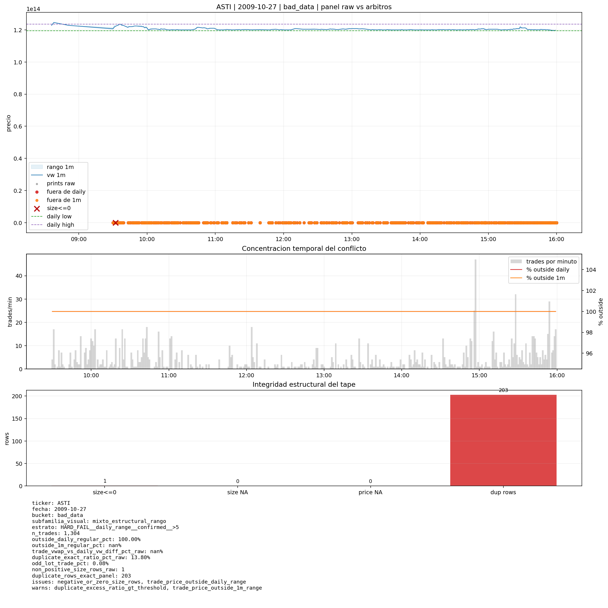

**Que muestra**

- Panel rico del tape raw frente a `daily` y `1m` para `ASTI` el `2009-10-27`.
- `n_trades = 1,304`, `outside_daily_regular_pct = 100.00%`, `outside_1m_regular_pct = nan%`.
- `trade_vwap_vs_daily_vw_diff_pct_raw = nan%`, `duplicate_exact_ratio_pct_raw = 13.80%`, `odd_lot_trade_pct = 0.08%`.

**Responde**

- Subfamilia mixta donde hay conflicto visual de rango, pero tambien senales de integridad del tape. El rechazo no debe apoyarse en una sola capa de evidencia.
- El caso combina conflicto de rango con senales de integridad del tape.
- La lectura correcta no es elegir una sola causa, sino reconocer que hay dano mixto: lo visual protesta y la estructura interna tambien.
- La clasificacion a `bad_data` se apoya en ambas capas de evidencia y no solo en el porcentaje outside.
- El 13.80% de duplicacion exacta obliga a sospechar dano de tape o bursts mecanicos, no solo ruido visual.
- La presencia de `negative_or_zero_size_rows` mueve la causalidad desde el precio hacia la integridad estructural del tape.
- La decision que justifica es exclusion de ejecucion simulada, labels y benchmarking; solo queda valor forense.

**No responde**

- No responde a una unica causa limpia; obliga a aceptar que hay mezcla de fenomenos.
- No absuelve el file aunque una de las dos capas parezca mas suave que la otra.

**Consecuencia**

- Excluir el file y tratarlo como rechazo duro, no como caso de reconciliacion fina.
- Mantener el requisito de una segunda imagen de integridad cuando se presente al inspector.

**Filas invalidas exactas (`size <= 0`)**

| ts_ny | price | size | exchange | conditions |
|---|---|---|---|---|
| 2009-10-27 09:32:19.840 | 6.11 | 0 | 11 | 16 |

**Grupos duplicados exactos mas relevantes**

| ts_ny | price | size | count |
|---|---|---|---|
| 2009-10-27 14:57:11.680 | 6.0 | 100 | 6 |
| 2009-10-27 11:01:43.010 | 6.02 | 100 | 5 |
| 2009-10-27 14:32:05.577 | 6.0 | 100 | 5 |
| 2009-10-27 10:24:11.193 | 6.0 | 100 | 4 |
| 2009-10-27 12:04:14.273 | 6.0 | 100 | 4 |
| 2009-10-27 14:06:52.540 | 6.0 | 100 | 4 |
| 2009-10-27 14:48:53.387 | 6.0 | 100 | 4 |
| 2009-10-27 14:57:11.687 | 6.0 | 100 | 4 |
| 2009-10-27 15:42:48.170 | 6.0 | 100 | 4 |
| 2009-10-27 10:22:51.410 | 6.01 | 100 | 3 |

### ASTI | 2010-11-26

**Que muestra**

- Panel rico del tape raw frente a `daily` y `1m` para `ASTI` el `2010-11-26`.
- `n_trades = 372`, `outside_daily_regular_pct = 100.00%`, `outside_1m_regular_pct = 100.00%`.
- `trade_vwap_vs_daily_vw_diff_pct_raw = nan%`, `duplicate_exact_ratio_pct_raw = 16.94%`, `odd_lot_trade_pct = 0.00%`.

**Responde**

- Subfamilia donde el panel de precio ya demuestra por si mismo una ruptura semantica: tape y arbitros viven en escalas incompatibles o el porcentaje fuera de rango es practicamente total.
- El fallo se ve de forma directa en el panel de precio: el tape y los arbitros no conviven en una misma geometria defendible.
- La lectura correcta exige mirar la separacion vertical entre prints y arbitros y el hecho de que el conflicto de rango sea practicamente total.
- Aqui el panel actual si responde bien a por que el file cae en `bad_data`.
- El 16.94% de duplicacion exacta obliga a sospechar dano de tape o bursts mecanicos, no solo ruido visual.
- La decision que justifica es exclusion de ejecucion simulada, labels y benchmarking; solo queda valor forense.

**No responde**

- No responde a si la duplicacion es la causa principal del rechazo; puede empeorar el caso, pero no explica por si sola la geometria rota.
- No responde a si existiria una reconciliacion de escala defendible; el colapso ya es demasiado extremo para tratarlo como simple normalizacion.

**Consecuencia**

- Excluir de ejecucion simulada, labels y benchmarking.
- Conservar solo valor forense o de deteccion de dano severo.

**Grupos duplicados exactos mas relevantes**

| ts_ny | price | size | count |
|---|---|---|---|
| 2010-11-26 12:38:28.940 | 3.37 | 100 | 6 |
| 2010-11-26 12:22:09.277 | 3.36 | 100 | 5 |
| 2010-11-26 11:02:25.633 | 3.37 | 100 | 3 |
| 2010-11-26 12:02:01.727 | 3.36 | 100 | 3 |
| 2010-11-26 12:22:09.310 | 3.36 | 100 | 3 |
| 2010-11-26 12:58:49.030 | 3.36 | 100 | 3 |
| 2010-11-26 12:59:03.797 | 3.38 | 100 | 3 |
| 2010-11-26 12:59:03.800 | 3.4 | 100 | 3 |
| 2010-11-26 09:30:00.757 | 3.35 | 7360 | 2 |
| 2010-11-26 09:39:14.840 | 3.35 | 100 | 2 |

### ASTI | 2011-01-05

**Que muestra**

- Panel rico del tape raw frente a `daily` y `1m` para `ASTI` el `2011-01-05`.
- `n_trades = 1,969`, `outside_daily_regular_pct = 100.00%`, `outside_1m_regular_pct = 100.00%`.
- `trade_vwap_vs_daily_vw_diff_pct_raw = nan%`, `duplicate_exact_ratio_pct_raw = 10.01%`, `odd_lot_trade_pct = 0.00%`.

**Responde**

- Subfamilia donde el panel de precio ya demuestra por si mismo una ruptura semantica: tape y arbitros viven en escalas incompatibles o el porcentaje fuera de rango es practicamente total.
- El fallo se ve de forma directa en el panel de precio: el tape y los arbitros no conviven en una misma geometria defendible.
- La lectura correcta exige mirar la separacion vertical entre prints y arbitros y el hecho de que el conflicto de rango sea practicamente total.
- Aqui el panel actual si responde bien a por que el file cae en `bad_data`.
- El 10.01% de duplicacion exacta obliga a sospechar dano de tape o bursts mecanicos, no solo ruido visual.
- La decision que justifica es exclusion de ejecucion simulada, labels y benchmarking; solo queda valor forense.

**No responde**

- No responde a si la duplicacion es la causa principal del rechazo; puede empeorar el caso, pero no explica por si sola la geometria rota.
- No responde a si existiria una reconciliacion de escala defendible; el colapso ya es demasiado extremo para tratarlo como simple normalizacion.

**Consecuencia**

- Excluir de ejecucion simulada, labels y benchmarking.
- Conservar solo valor forense o de deteccion de dano severo.

**Grupos duplicados exactos mas relevantes**

| ts_ny | price | size | count |
|---|---|---|---|
| 2011-01-05 10:50:53.350 | 3.74 | 100 | 17 |
| 2011-01-05 14:43:29.733 | 3.66 | 100 | 15 |
| 2011-01-05 14:46:42.130 | 3.67 | 100 | 12 |
| 2011-01-05 09:49:42.737 | 3.78 | 100 | 6 |
| 2011-01-05 10:15:44.753 | 3.76 | 100 | 6 |
| 2011-01-05 10:34:56.613 | 3.74 | 100 | 6 |
| 2011-01-05 10:50:48.270 | 3.74 | 100 | 6 |
| 2011-01-05 14:46:42.127 | 3.67 | 100 | 6 |
| 2011-01-05 10:07:58.620 | 3.75 | 400 | 5 |
| 2011-01-05 12:04:44.303 | 3.7 | 100 | 5 |

### DCTH | 2005-12-29

**Que muestra**

- Panel rico del tape raw frente a `daily` y `1m` para `DCTH` el `2005-12-29`.
- `n_trades = 45`, `outside_daily_regular_pct = 100.00%`, `outside_1m_regular_pct = 100.00%`.
- `trade_vwap_vs_daily_vw_diff_pct_raw = nan%`, `duplicate_exact_ratio_pct_raw = 13.33%`, `odd_lot_trade_pct = 0.00%`.

**Responde**

- Subfamilia donde el panel de precio ya demuestra por si mismo una ruptura semantica: tape y arbitros viven en escalas incompatibles o el porcentaje fuera de rango es practicamente total.
- El fallo se ve de forma directa en el panel de precio: el tape y los arbitros no conviven en una misma geometria defendible.
- La lectura correcta exige mirar la separacion vertical entre prints y arbitros y el hecho de que el conflicto de rango sea practicamente total.
- Aqui el panel actual si responde bien a por que el file cae en `bad_data`.
- El 13.33% de duplicacion exacta obliga a sospechar dano de tape o bursts mecanicos, no solo ruido visual.
- La decision que justifica es exclusion de ejecucion simulada, labels y benchmarking; solo queda valor forense.

**No responde**

- No responde a si la duplicacion es la causa principal del rechazo; puede empeorar el caso, pero no explica por si sola la geometria rota.
- No responde a si existiria una reconciliacion de escala defendible; el colapso ya es demasiado extremo para tratarlo como simple normalizacion.

**Consecuencia**

- Excluir de ejecucion simulada, labels y benchmarking.
- Conservar solo valor forense o de deteccion de dano severo.

**Grupos duplicados exactos mas relevantes**

| ts_ny | price | size | count |
|---|---|---|---|
| 2005-12-29 09:43:32.176 | 3.33 | 100 | 2 |
| 2005-12-29 12:00:04.944 | 3.3 | 100 | 2 |
| 2005-12-29 12:42:02.210 | 3.26 | 100 | 2 |

### WSBF | 2009-08-14

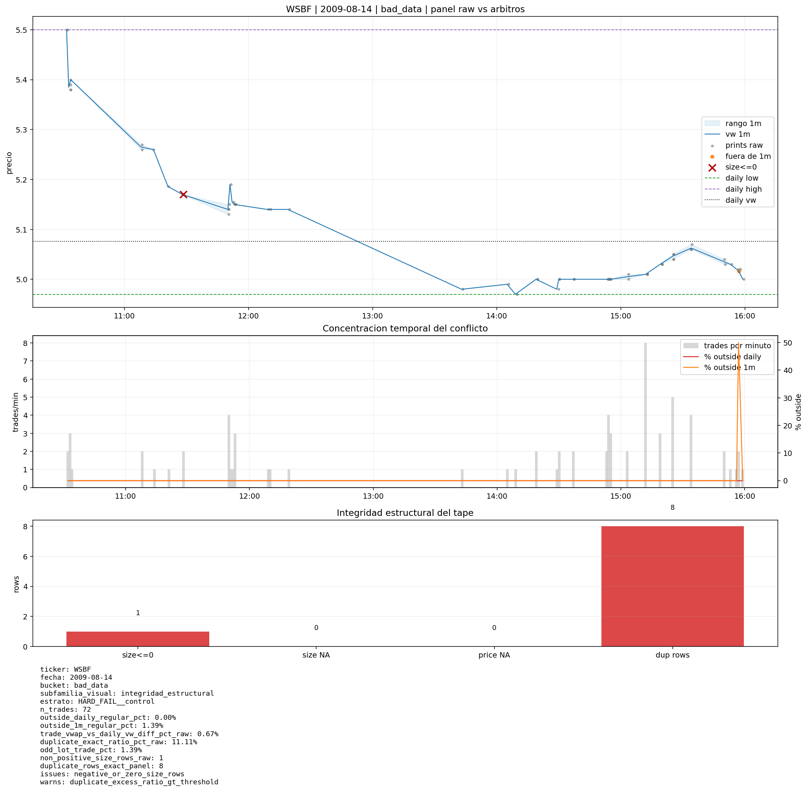

**Que muestra**

- Panel rico del tape raw frente a `daily` y `1m` para `WSBF` el `2009-08-14`.
- `n_trades = 72`, `outside_daily_regular_pct = 0.00%`, `outside_1m_regular_pct = 1.39%`.
- `trade_vwap_vs_daily_vw_diff_pct_raw = 0.67%`, `duplicate_exact_ratio_pct_raw = 11.11%`, `odd_lot_trade_pct = 1.39%`.

**Responde**

- Subfamilia donde el motivo principal del rechazo no vive en la trayectoria del precio, sino en la integridad del tape: sizes no validos, duplicacion dura o estructura interna corrupta.
- El precio puede parecer casi normal, asi que la causalidad principal no vive en la geometria del panel superior.
- La lectura correcta depende del panel de integridad: sizes no validos, duplicados o rows estructuralmente invalidos.
- Aqui el panel de precio por si solo no basta; el panel de integridad es el que justifica el rechazo.
- El 11.11% de duplicacion exacta obliga a sospechar dano de tape o bursts mecanicos, no solo ruido visual.
- La presencia de `negative_or_zero_size_rows` mueve la causalidad desde el precio hacia la integridad estructural del tape.
- La decision que justifica es exclusion de ejecucion simulada, labels y benchmarking; solo queda valor forense.

**No responde**

- No responde a si una sola fila invalida bastaria siempre para condenar cualquier file; la clasificacion depende del contexto estructural total.
- No responde a la rehabilitacion del caso; solo justifica por que hoy sigue en la cola dura.

**Consecuencia**

- Mantener el caso en `bad_data` por integridad estructural del tape.
- Usar el panel de integridad, la `X` roja y las tablas exactas como trio minimo de prueba para esta subfamilia.

**Filas invalidas exactas (`size <= 0`)**

| ts_ny | price | size | exchange | conditions |
|---|---|---|---|---|
| 2009-08-14 11:28:21.807 | 5.17 | 0 | 11 | 16 |

**Grupos duplicados exactos mas relevantes**

| ts_ny | price | size | count |
|---|---|---|---|
| 2009-08-14 14:19:48.117 | 5.0 | 100 | 2 |
| 2009-08-14 14:30:21.800 | 5.0 | 100 | 2 |
| 2009-08-14 15:12:45.323 | 5.01 | 100 | 2 |
| 2009-08-14 15:25:34.047 | 5.05 | 100 | 2 |

### CWBC | 2006-01-10

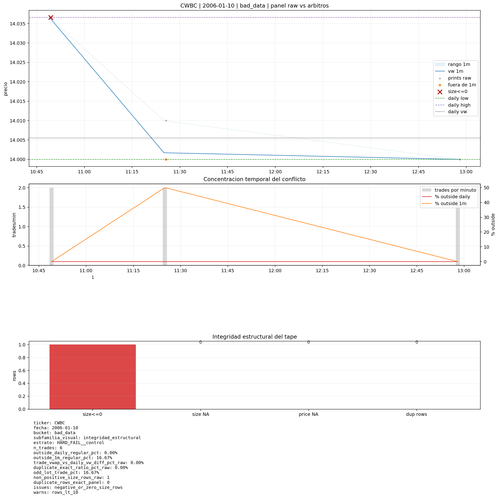

**Que muestra**

- Panel rico del tape raw frente a `daily` y `1m` para `CWBC` el `2006-01-10`.
- `n_trades = 6`, `outside_daily_regular_pct = 0.00%`, `outside_1m_regular_pct = 16.67%`.
- `trade_vwap_vs_daily_vw_diff_pct_raw = 0.00%`, `duplicate_exact_ratio_pct_raw = 0.00%`, `odd_lot_trade_pct = 16.67%`.

**Responde**

- Subfamilia donde el motivo principal del rechazo no vive en la trayectoria del precio, sino en la integridad del tape: sizes no validos, duplicacion dura o estructura interna corrupta.
- El precio puede parecer casi normal, asi que la causalidad principal no vive en la geometria del panel superior.
- La lectura correcta depende del panel de integridad: sizes no validos, duplicados o rows estructuralmente invalidos.
- Aqui el panel de precio por si solo no basta; el panel de integridad es el que justifica el rechazo.
- La presencia de `negative_or_zero_size_rows` mueve la causalidad desde el precio hacia la integridad estructural del tape.
- La advertencia `rows_lt_10` limita fuertemente la defensa estadistica del file y endurece la lectura del caso.
- La decision que justifica es exclusion de ejecucion simulada, labels y benchmarking; solo queda valor forense.

**No responde**

- No responde a si una sola fila invalida bastaria siempre para condenar cualquier file; la clasificacion depende del contexto estructural total.
- No responde a la rehabilitacion del caso; solo justifica por que hoy sigue en la cola dura.

**Consecuencia**

- Mantener el caso en `bad_data` por integridad estructural del tape.
- Usar el panel de integridad, la `X` roja y las tablas exactas como trio minimo de prueba para esta subfamilia.

**Filas invalidas exactas (`size <= 0`)**

| ts_ny | price | size | exchange | conditions |
|---|---|---|---|---|
| 2006-01-10 10:49:23.911 | 14.0366 | 0 | 12 | 16 |

### FSB | 2006-05-03

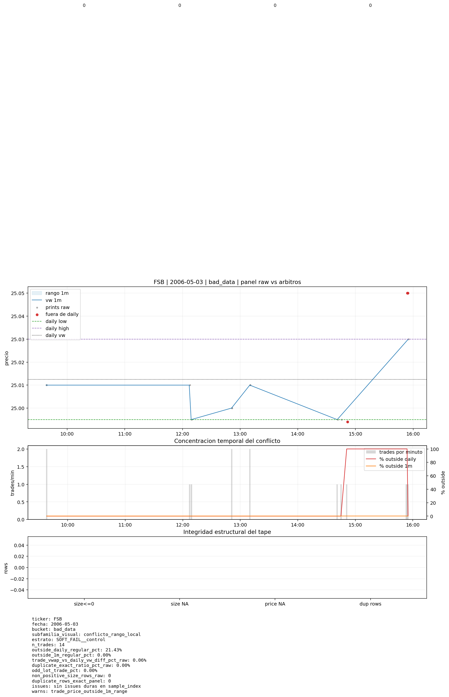

**Que muestra**

- Panel rico del tape raw frente a `daily` y `1m` para `FSB` el `2006-05-03`.
- `n_trades = 14`, `outside_daily_regular_pct = 21.43%`, `outside_1m_regular_pct = 0.00%`.
- `trade_vwap_vs_daily_vw_diff_pct_raw = 0.06%`, `duplicate_exact_ratio_pct_raw = 0.00%`, `odd_lot_trade_pct = 0.00%`.

**Responde**

- Subfamilia donde el conflicto vive en un subconjunto relevante del rango o del arbitro intraminuto, aunque no haya colapso total de escala.
- El conflicto vive en una franja local del rango o del arbitro intraminuto, sin llegar a colapso total de escala.
- Eso exige leer el panel minuto a minuto y no quedarse solo con la impresion global de la nube de precios.
- La clasificacion a `bad_data` aqui depende de que el file ya no conserve una reconciliacion economica defendible.
- La decision que justifica es exclusion de ejecucion simulada, labels y benchmarking; solo queda valor forense.

**No responde**

- No responde a colapso total de escala; ese seria otro subtipo.
- No responde por si solo a dano estructural del tape salvo que aparezca en `issues_list` o en el panel de integridad.

**Consecuencia**

- Excluir el file del flujo productivo aunque el dano no sea un colapso absoluto.
- Conservarlo como caso forense de rango local severo.

### GIA | 2010-09-01

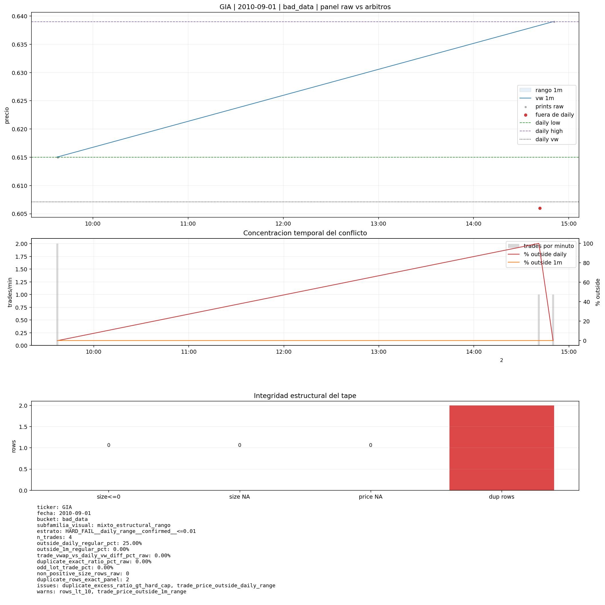

**Que muestra**

- Panel rico del tape raw frente a `daily` y `1m` para `GIA` el `2010-09-01`.
- `n_trades = 4`, `outside_daily_regular_pct = 25.00%`, `outside_1m_regular_pct = 0.00%`.
- `trade_vwap_vs_daily_vw_diff_pct_raw = 0.00%`, `duplicate_exact_ratio_pct_raw = 0.00%`, `odd_lot_trade_pct = 0.00%`.

**Responde**

- Subfamilia mixta donde hay conflicto visual de rango, pero tambien senales de integridad del tape. El rechazo no debe apoyarse en una sola capa de evidencia.
- El caso combina conflicto de rango con senales de integridad del tape.
- La lectura correcta no es elegir una sola causa, sino reconocer que hay dano mixto: lo visual protesta y la estructura interna tambien.
- La clasificacion a `bad_data` se apoya en ambas capas de evidencia y no solo en el porcentaje outside.
- La marca `duplicate_excess_ratio_gt_hard_cap` indica que la duplicacion ya no es solo un warn cosmetico, sino una firma dura del rechazo.
- La advertencia `rows_lt_10` limita fuertemente la defensa estadistica del file y endurece la lectura del caso.
- La decision que justifica es exclusion de ejecucion simulada, labels y benchmarking; solo queda valor forense.

**No responde**

- No responde a una unica causa limpia; obliga a aceptar que hay mezcla de fenomenos.
- No absuelve el file aunque una de las dos capas parezca mas suave que la otra.

**Consecuencia**

- Excluir el file y tratarlo como rechazo duro, no como caso de reconciliacion fina.
- Mantener el requisito de una segunda imagen de integridad cuando se presente al inspector.

**Grupos duplicados exactos mas relevantes**

| ts_ny | price | size | count |
|---|---|---|---|
| 2010-09-01 09:37:55.172 | 0.615 | 100 | 2 |

### NTN | 2007-08-14

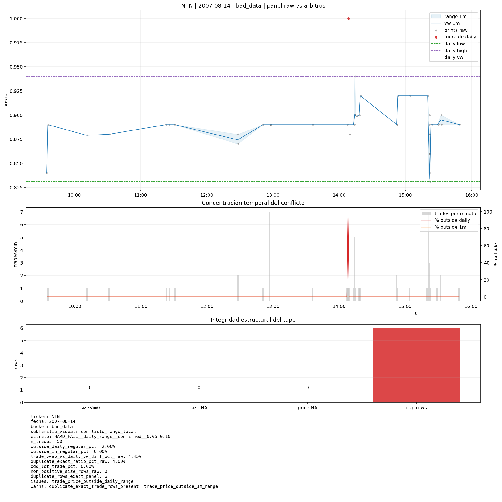

**Que muestra**

- Panel rico del tape raw frente a `daily` y `1m` para `NTN` el `2007-08-14`.
- `n_trades = 50`, `outside_daily_regular_pct = 2.00%`, `outside_1m_regular_pct = 0.00%`.
- `trade_vwap_vs_daily_vw_diff_pct_raw = 4.45%`, `duplicate_exact_ratio_pct_raw = 4.00%`, `odd_lot_trade_pct = 0.00%`.

**Responde**

- Subfamilia donde el conflicto vive en un subconjunto relevante del rango o del arbitro intraminuto, aunque no haya colapso total de escala.
- El conflicto vive en una franja local del rango o del arbitro intraminuto, sin llegar a colapso total de escala.
- Eso exige leer el panel minuto a minuto y no quedarse solo con la impresion global de la nube de precios.
- La clasificacion a `bad_data` aqui depende de que el file ya no conserve una reconciliacion economica defendible.
- La decision que justifica es exclusion de ejecucion simulada, labels y benchmarking; solo queda valor forense.

**No responde**

- No responde a colapso total de escala; ese seria otro subtipo.
- No responde por si solo a dano estructural del tape salvo que aparezca en `issues_list` o en el panel de integridad.

**Consecuencia**

- Excluir el file del flujo productivo aunque el dano no sea un colapso absoluto.
- Conservarlo como caso forense de rango local severo.

**Grupos duplicados exactos mas relevantes**

| ts_ny | price | size | count |
|---|---|---|---|
| 2007-08-14 12:57:50.956 | 0.89 | 200 | 2 |
| 2007-08-14 12:57:50.956 | 0.89 | 300 | 2 |
| 2007-08-14 14:14:42.026 | 0.9 | 100 | 2 |

### TOPS | 2012-06-21

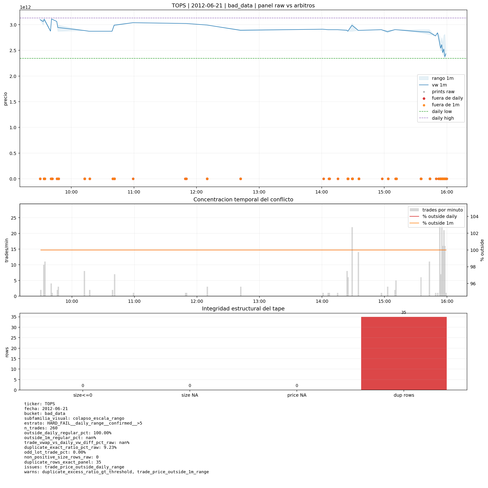

**Que muestra**

- Panel rico del tape raw frente a `daily` y `1m` para `TOPS` el `2012-06-21`.
- `n_trades = 260`, `outside_daily_regular_pct = 100.00%`, `outside_1m_regular_pct = nan%`.
- `trade_vwap_vs_daily_vw_diff_pct_raw = nan%`, `duplicate_exact_ratio_pct_raw = 9.23%`, `odd_lot_trade_pct = 0.00%`.

**Responde**

- Subfamilia donde el panel de precio ya demuestra por si mismo una ruptura semantica: tape y arbitros viven en escalas incompatibles o el porcentaje fuera de rango es practicamente total.
- El fallo se ve de forma directa en el panel de precio: el tape y los arbitros no conviven en una misma geometria defendible.
- La lectura correcta exige mirar la separacion vertical entre prints y arbitros y el hecho de que el conflicto de rango sea practicamente total.
- Aqui el panel actual si responde bien a por que el file cae en `bad_data`.
- El 9.23% de duplicacion exacta obliga a sospechar dano de tape o bursts mecanicos, no solo ruido visual.
- La decision que justifica es exclusion de ejecucion simulada, labels y benchmarking; solo queda valor forense.

**No responde**

- No responde a si la duplicacion es la causa principal del rechazo; puede empeorar el caso, pero no explica por si sola la geometria rota.
- No responde a si existiria una reconciliacion de escala defendible; el colapso ya es demasiado extremo para tratarlo como simple normalizacion.

**Consecuencia**

- Excluir de ejecucion simulada, labels y benchmarking.
- Conservar solo valor forense o de deteccion de dano severo.

**Grupos duplicados exactos mas relevantes**

| ts_ny | price | size | count |
|---|---|---|---|
| 2012-06-21 10:12:42.291 | 1.91 | 100 | 3 |
| 2012-06-21 14:29:25.507 | 1.95 | 100 | 3 |
| 2012-06-21 15:57:53.151 | 1.82 | 100 | 3 |
| 2012-06-21 09:30:00.301 | 2.05 | 1124 | 2 |
| 2012-06-21 09:34:20.484 | 2.04 | 100 | 2 |
| 2012-06-21 10:12:42.227 | 1.91 | 200 | 2 |
| 2012-06-21 14:24:55.489 | 1.91 | 100 | 2 |
| 2012-06-21 14:29:25.487 | 1.95 | 100 | 2 |
| 2012-06-21 14:29:25.508 | 1.95 | 100 | 2 |
| 2012-06-21 14:29:25.964 | 1.99 | 100 | 2 |

### ASTI | 2009-06-05

**Que muestra**

- Panel rico del tape raw frente a `daily` y `1m` para `ASTI` el `2009-06-05`.
- `n_trades = 808`, `outside_daily_regular_pct = 100.00%`, `outside_1m_regular_pct = 100.00%`.
- `trade_vwap_vs_daily_vw_diff_pct_raw = nan%`, `duplicate_exact_ratio_pct_raw = 4.58%`, `odd_lot_trade_pct = 0.00%`.

**Responde**

- Subfamilia donde el panel de precio ya demuestra por si mismo una ruptura semantica: tape y arbitros viven en escalas incompatibles o el porcentaje fuera de rango es practicamente total.
- El fallo se ve de forma directa en el panel de precio: el tape y los arbitros no conviven en una misma geometria defendible.
- La lectura correcta exige mirar la separacion vertical entre prints y arbitros y el hecho de que el conflicto de rango sea practicamente total.
- Aqui el panel actual si responde bien a por que el file cae en `bad_data`.
- La decision que justifica es exclusion de ejecucion simulada, labels y benchmarking; solo queda valor forense.

**No responde**

- No responde a si la duplicacion es la causa principal del rechazo; puede empeorar el caso, pero no explica por si sola la geometria rota.
- No responde a si existiria una reconciliacion de escala defendible; el colapso ya es demasiado extremo para tratarlo como simple normalizacion.

**Consecuencia**

- Excluir de ejecucion simulada, labels y benchmarking.
- Conservar solo valor forense o de deteccion de dano severo.

**Grupos duplicados exactos mas relevantes**

| ts_ny | price | size | count |
|---|---|---|---|
| 2009-06-05 11:10:09.710 | 6.99 | 100 | 3 |
| 2009-06-05 09:30:01.890 | 7.1 | 7668 | 2 |
| 2009-06-05 09:30:19.337 | 6.91 | 100 | 2 |
| 2009-06-05 09:30:45.590 | 6.99 | 100 | 2 |
| 2009-06-05 09:31:22.343 | 7.1 | 100 | 2 |
| 2009-06-05 09:33:11.300 | 7.06 | 100 | 2 |
| 2009-06-05 10:08:01.767 | 6.71 | 1300 | 2 |
| 2009-06-05 10:08:01.783 | 6.71 | 100 | 2 |
| 2009-06-05 10:16:18.950 | 6.48 | 100 | 2 |
| 2009-06-05 10:28:20.337 | 6.7 | 100 | 2 |

### ASTI | 2011-04-04

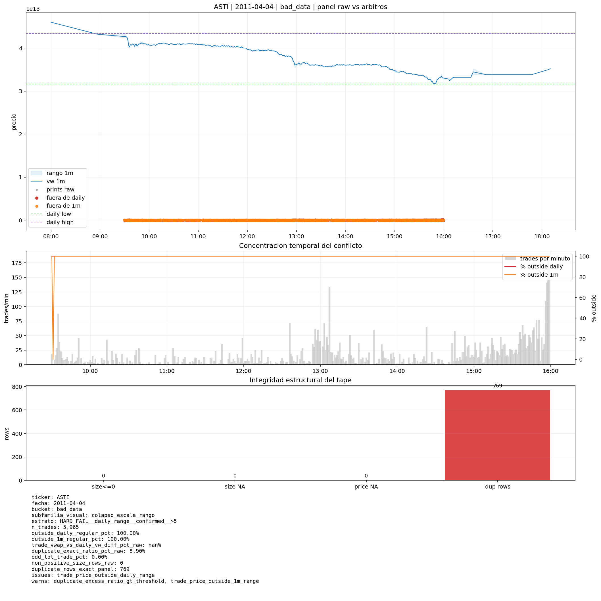

**Que muestra**

- Panel rico del tape raw frente a `daily` y `1m` para `ASTI` el `2011-04-04`.
- `n_trades = 5,965`, `outside_daily_regular_pct = 100.00%`, `outside_1m_regular_pct = 100.00%`.
- `trade_vwap_vs_daily_vw_diff_pct_raw = nan%`, `duplicate_exact_ratio_pct_raw = 8.90%`, `odd_lot_trade_pct = 0.00%`.

**Responde**

- Subfamilia donde el panel de precio ya demuestra por si mismo una ruptura semantica: tape y arbitros viven en escalas incompatibles o el porcentaje fuera de rango es practicamente total.
- El fallo se ve de forma directa en el panel de precio: el tape y los arbitros no conviven en una misma geometria defendible.
- La lectura correcta exige mirar la separacion vertical entre prints y arbitros y el hecho de que el conflicto de rango sea practicamente total.
- Aqui el panel actual si responde bien a por que el file cae en `bad_data`.
- El 8.90% de duplicacion exacta obliga a sospechar dano de tape o bursts mecanicos, no solo ruido visual.
- La decision que justifica es exclusion de ejecucion simulada, labels y benchmarking; solo queda valor forense.

**No responde**

- No responde a si la duplicacion es la causa principal del rechazo; puede empeorar el caso, pero no explica por si sola la geometria rota.
- No responde a si existiria una reconciliacion de escala defendible; el colapso ya es demasiado extremo para tratarlo como simple normalizacion.

**Consecuencia**

- Excluir de ejecucion simulada, labels y benchmarking.
- Conservar solo valor forense o de deteccion de dano severo.

**Grupos duplicados exactos mas relevantes**

| ts_ny | price | size | count |
|---|---|---|---|
| 2011-04-04 10:13:05.747 | 2.05 | 100 | 10 |
| 2011-04-04 09:51:11.653 | 2.07 | 100 | 6 |
| 2011-04-04 12:54:48.690 | 1.9 | 100 | 6 |
| 2011-04-04 13:05:05.710 | 1.81 | 100 | 6 |
| 2011-04-04 15:51:09.197 | 1.6 | 100 | 6 |
| 2011-04-04 15:56:44.520 | 1.655 | 100 | 6 |
| 2011-04-04 09:51:11.680 | 2.07 | 100 | 5 |
| 2011-04-04 12:06:31.570 | 1.97 | 100 | 5 |
| 2011-04-04 12:45:44.243 | 1.92 | 100 | 5 |
| 2011-04-04 12:46:49.873 | 1.9 | 100 | 5 |

### ASTI | 2012-03-02

**Que muestra**

- Panel rico del tape raw frente a `daily` y `1m` para `ASTI` el `2012-03-02`.
- `n_trades = 420`, `outside_daily_regular_pct = 100.00%`, `outside_1m_regular_pct = 100.00%`.
- `trade_vwap_vs_daily_vw_diff_pct_raw = nan%`, `duplicate_exact_ratio_pct_raw = 4.76%`, `odd_lot_trade_pct = 0.00%`.

**Responde**

- Subfamilia donde el panel de precio ya demuestra por si mismo una ruptura semantica: tape y arbitros viven en escalas incompatibles o el porcentaje fuera de rango es practicamente total.
- El fallo se ve de forma directa en el panel de precio: el tape y los arbitros no conviven en una misma geometria defendible.
- La lectura correcta exige mirar la separacion vertical entre prints y arbitros y el hecho de que el conflicto de rango sea practicamente total.
- Aqui el panel actual si responde bien a por que el file cae en `bad_data`.
- La decision que justifica es exclusion de ejecucion simulada, labels y benchmarking; solo queda valor forense.

**No responde**

- No responde a si la duplicacion es la causa principal del rechazo; puede empeorar el caso, pero no explica por si sola la geometria rota.
- No responde a si existiria una reconciliacion de escala defendible; el colapso ya es demasiado extremo para tratarlo como simple normalizacion.

**Consecuencia**

- Excluir de ejecucion simulada, labels y benchmarking.
- Conservar solo valor forense o de deteccion de dano severo.

**Grupos duplicados exactos mas relevantes**

| ts_ny | price | size | count |
|---|---|---|---|
| 2012-03-02 15:58:04.590 | 0.8299 | 100 | 4 |
| 2012-03-02 13:33:33.477 | 0.8 | 100 | 3 |
| 2012-03-02 15:56:33.310 | 0.825 | 100 | 3 |
| 2012-03-02 15:57:12.677 | 0.8299 | 100 | 3 |
| 2012-03-02 09:30:00.063 | 0.77 | 4000 | 2 |
| 2012-03-02 09:37:03.297 | 0.8 | 100 | 2 |
| 2012-03-02 09:37:03.467 | 0.8 | 100 | 2 |
| 2012-03-02 10:30:59.650 | 0.7799 | 100 | 2 |
| 2012-03-02 13:33:33.530 | 0.8 | 100 | 2 |
| 2012-03-02 14:41:43.360 | 0.7999 | 100 | 2 |

### CZNC | 2005-08-12

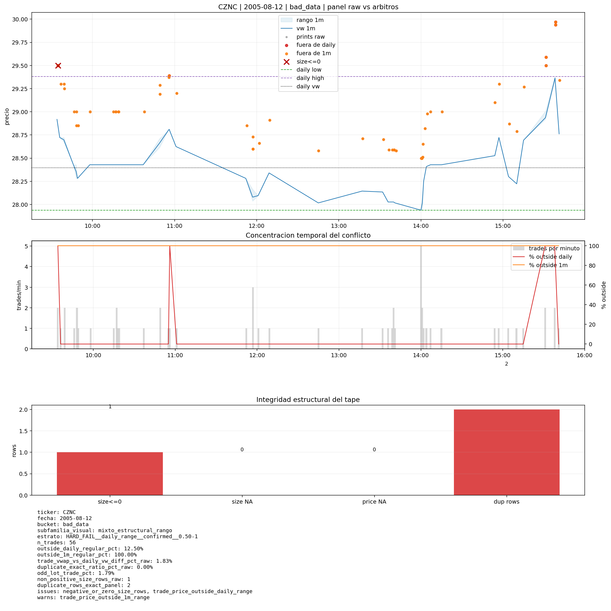

**Que muestra**

- Panel rico del tape raw frente a `daily` y `1m` para `CZNC` el `2005-08-12`.
- `n_trades = 56`, `outside_daily_regular_pct = 12.50%`, `outside_1m_regular_pct = 100.00%`.
- `trade_vwap_vs_daily_vw_diff_pct_raw = 1.83%`, `duplicate_exact_ratio_pct_raw = 0.00%`, `odd_lot_trade_pct = 1.79%`.

**Responde**

- Subfamilia mixta donde hay conflicto visual de rango, pero tambien senales de integridad del tape. El rechazo no debe apoyarse en una sola capa de evidencia.
- El caso combina conflicto de rango con senales de integridad del tape.
- La lectura correcta no es elegir una sola causa, sino reconocer que hay dano mixto: lo visual protesta y la estructura interna tambien.
- La clasificacion a `bad_data` se apoya en ambas capas de evidencia y no solo en el porcentaje outside.
- La presencia de `negative_or_zero_size_rows` mueve la causalidad desde el precio hacia la integridad estructural del tape.
- La decision que justifica es exclusion de ejecucion simulada, labels y benchmarking; solo queda valor forense.

**No responde**

- No responde a una unica causa limpia; obliga a aceptar que hay mezcla de fenomenos.
- No absuelve el file aunque una de las dos capas parezca mas suave que la otra.

**Consecuencia**

- Excluir el file y tratarlo como rechazo duro, no como caso de reconciliacion fina.
- Mantener el requisito de una segunda imagen de integridad cuando se presente al inspector.

**Filas invalidas exactas (`size <= 0`)**

| ts_ny | price | size | exchange | conditions |
|---|---|---|---|---|
| 2005-08-12 09:34:49 | 29.5 | 0 | 12 | 16 |

**Grupos duplicados exactos mas relevantes**

| ts_ny | price | size | count |
|---|---|---|---|
| 2005-08-12 13:40:27 | 28.59 | 100 | 2 |

### PMD | 2010-11-16

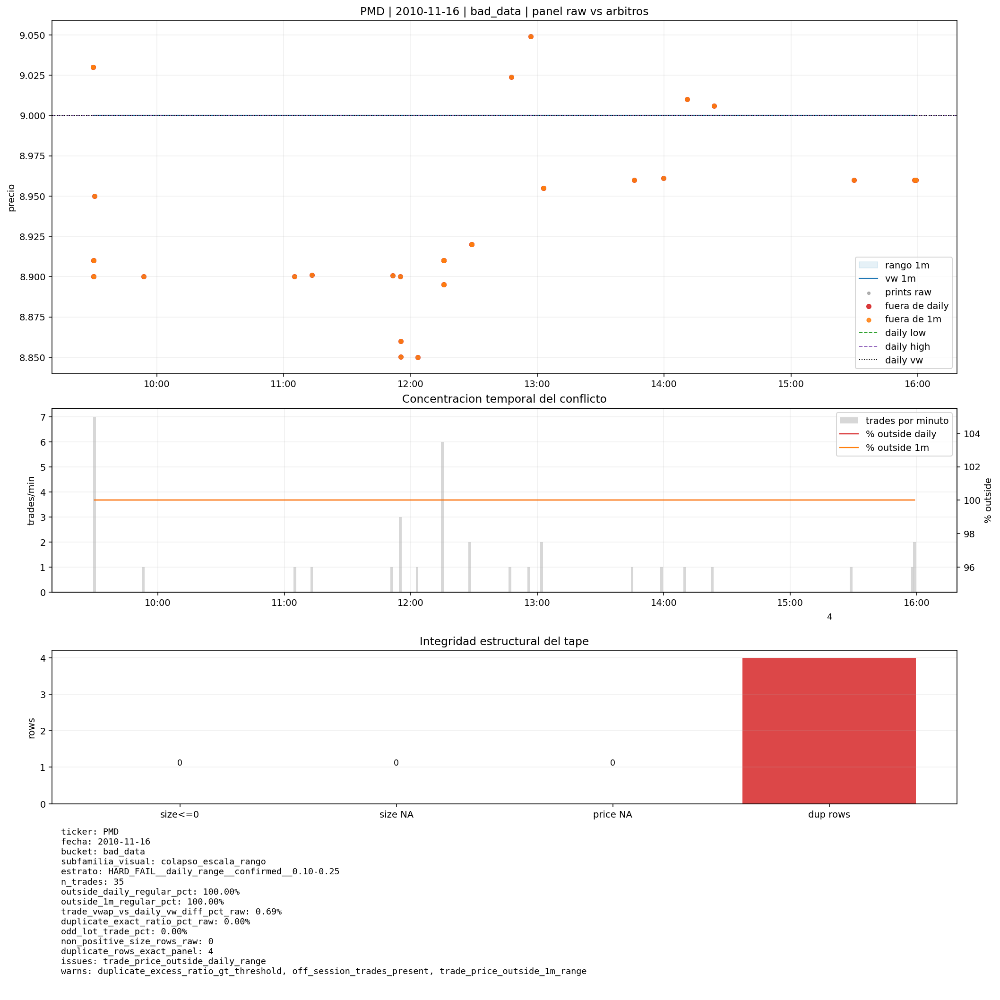

**Que muestra**

- Panel rico del tape raw frente a `daily` y `1m` para `PMD` el `2010-11-16`.
- `n_trades = 35`, `outside_daily_regular_pct = 100.00%`, `outside_1m_regular_pct = 100.00%`.
- `trade_vwap_vs_daily_vw_diff_pct_raw = 0.69%`, `duplicate_exact_ratio_pct_raw = 0.00%`, `odd_lot_trade_pct = 0.00%`.

**Responde**

- Subfamilia donde el panel de precio ya demuestra por si mismo una ruptura semantica: tape y arbitros viven en escalas incompatibles o el porcentaje fuera de rango es practicamente total.
- El fallo se ve de forma directa en el panel de precio: el tape y los arbitros no conviven en una misma geometria defendible.
- La lectura correcta exige mirar la separacion vertical entre prints y arbitros y el hecho de que el conflicto de rango sea practicamente total.
- Aqui el panel actual si responde bien a por que el file cae en `bad_data`.
- La decision que justifica es exclusion de ejecucion simulada, labels y benchmarking; solo queda valor forense.

**No responde**

- No responde a si la duplicacion es la causa principal del rechazo; puede empeorar el caso, pero no explica por si sola la geometria rota.
- No responde a si existiria una reconciliacion de escala defendible; el colapso ya es demasiado extremo para tratarlo como simple normalizacion.

**Consecuencia**

- Excluir de ejecucion simulada, labels y benchmarking.
- Conservar solo valor forense o de deteccion de dano severo.

**Grupos duplicados exactos mas relevantes**

| ts_ny | price | size | count |
|---|---|---|---|
| 2010-11-16 09:30:00.267 | 9.03 | 250 | 2 |
| 2010-11-16 12:15:50.510 | 8.91 | 100 | 2 |

### PMD | 2011-01-28

**Que muestra**

- Panel rico del tape raw frente a `daily` y `1m` para `PMD` el `2011-01-28`.
- `n_trades = 36`, `outside_daily_regular_pct = 100.00%`, `outside_1m_regular_pct = 100.00%`.
- `trade_vwap_vs_daily_vw_diff_pct_raw = 0.72%`, `duplicate_exact_ratio_pct_raw = 5.56%`, `odd_lot_trade_pct = 0.00%`.

**Responde**

- Subfamilia donde el panel de precio ya demuestra por si mismo una ruptura semantica: tape y arbitros viven en escalas incompatibles o el porcentaje fuera de rango es practicamente total.
- El fallo se ve de forma directa en el panel de precio: el tape y los arbitros no conviven en una misma geometria defendible.
- La lectura correcta exige mirar la separacion vertical entre prints y arbitros y el hecho de que el conflicto de rango sea practicamente total.
- Aqui el panel actual si responde bien a por que el file cae en `bad_data`.
- El 5.56% de duplicacion exacta obliga a sospechar dano de tape o bursts mecanicos, no solo ruido visual.
- La decision que justifica es exclusion de ejecucion simulada, labels y benchmarking; solo queda valor forense.

**No responde**

- No responde a si la duplicacion es la causa principal del rechazo; puede empeorar el caso, pero no explica por si sola la geometria rota.
- No responde a si existiria una reconciliacion de escala defendible; el colapso ya es demasiado extremo para tratarlo como simple normalizacion.

**Consecuencia**

- Excluir de ejecucion simulada, labels y benchmarking.
- Conservar solo valor forense o de deteccion de dano severo.

**Grupos duplicados exactos mas relevantes**

| ts_ny | price | size | count |
|---|---|---|---|
| 2011-01-28 15:58:43.820 | 8.39 | 100 | 2 |
| 2011-01-28 15:59:53.100 | 8.36 | 100 | 2 |

### PMD | 2011-12-13

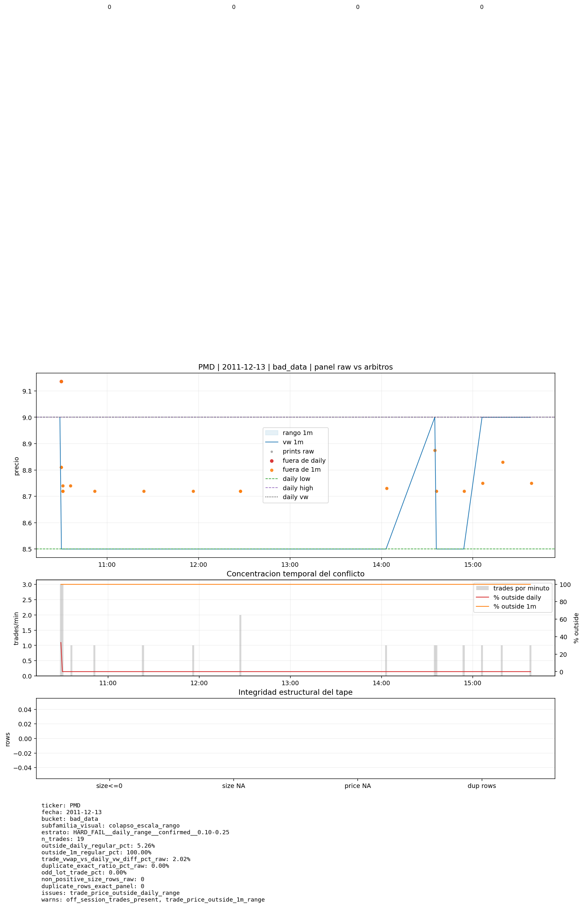

**Que muestra**

- Panel rico del tape raw frente a `daily` y `1m` para `PMD` el `2011-12-13`.
- `n_trades = 19`, `outside_daily_regular_pct = 5.26%`, `outside_1m_regular_pct = 100.00%`.
- `trade_vwap_vs_daily_vw_diff_pct_raw = 2.02%`, `duplicate_exact_ratio_pct_raw = 0.00%`, `odd_lot_trade_pct = 0.00%`.

**Responde**

- Subfamilia donde el panel de precio ya demuestra por si mismo una ruptura semantica: tape y arbitros viven en escalas incompatibles o el porcentaje fuera de rango es practicamente total.
- El fallo se ve de forma directa en el panel de precio: el tape y los arbitros no conviven en una misma geometria defendible.
- La lectura correcta exige mirar la separacion vertical entre prints y arbitros y el hecho de que el conflicto de rango sea practicamente total.
- Aqui el panel actual si responde bien a por que el file cae en `bad_data`.
- La decision que justifica es exclusion de ejecucion simulada, labels y benchmarking; solo queda valor forense.

**No responde**

- No responde a si la duplicacion es la causa principal del rechazo; puede empeorar el caso, pero no explica por si sola la geometria rota.
- No responde a si existiria una reconciliacion de escala defendible; el colapso ya es demasiado extremo para tratarlo como simple normalizacion.

**Consecuencia**

- Excluir de ejecucion simulada, labels y benchmarking.
- Conservar solo valor forense o de deteccion de dano severo.

### PMD | 2012-06-28

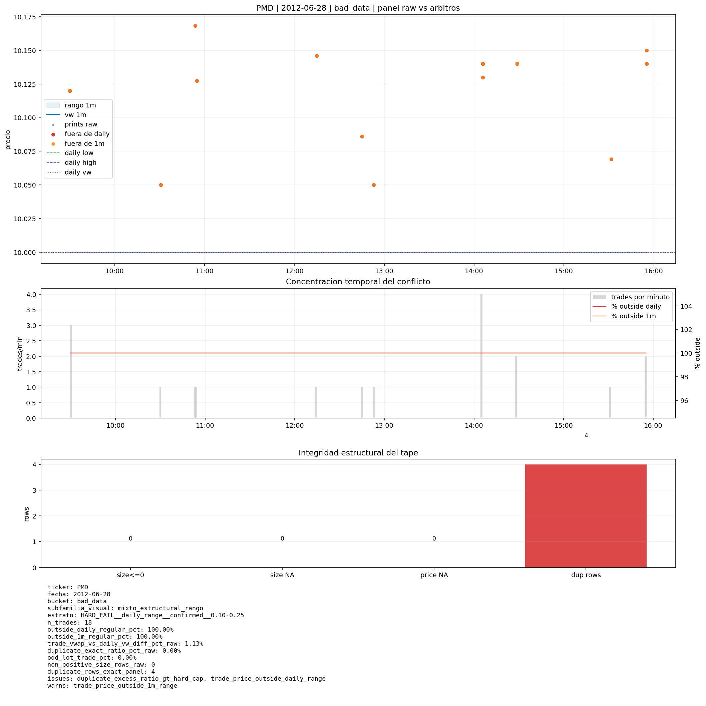

**Que muestra**

- Panel rico del tape raw frente a `daily` y `1m` para `PMD` el `2012-06-28`.
- `n_trades = 18`, `outside_daily_regular_pct = 100.00%`, `outside_1m_regular_pct = 100.00%`.
- `trade_vwap_vs_daily_vw_diff_pct_raw = 1.13%`, `duplicate_exact_ratio_pct_raw = 0.00%`, `odd_lot_trade_pct = 0.00%`.

**Responde**

- Subfamilia mixta donde hay conflicto visual de rango, pero tambien senales de integridad del tape. El rechazo no debe apoyarse en una sola capa de evidencia.
- El caso combina conflicto de rango con senales de integridad del tape.
- La lectura correcta no es elegir una sola causa, sino reconocer que hay dano mixto: lo visual protesta y la estructura interna tambien.
- La clasificacion a `bad_data` se apoya en ambas capas de evidencia y no solo en el porcentaje outside.
- La marca `duplicate_excess_ratio_gt_hard_cap` indica que la duplicacion ya no es solo un warn cosmetico, sino una firma dura del rechazo.
- La decision que justifica es exclusion de ejecucion simulada, labels y benchmarking; solo queda valor forense.

**No responde**

- No responde a una unica causa limpia; obliga a aceptar que hay mezcla de fenomenos.
- No absuelve el file aunque una de las dos capas parezca mas suave que la otra.

**Consecuencia**

- Excluir el file y tratarlo como rechazo duro, no como caso de reconciliacion fina.
- Mantener el requisito de una segunda imagen de integridad cuando se presente al inspector.

**Grupos duplicados exactos mas relevantes**

| ts_ny | price | size | count |
|---|---|---|---|
| 2012-06-28 09:30:00.187 | 10.12 | 600 | 2 |
| 2012-06-28 14:05:48.603 | 10.14 | 200 | 2 |

### ESA.U | 2011-04-25

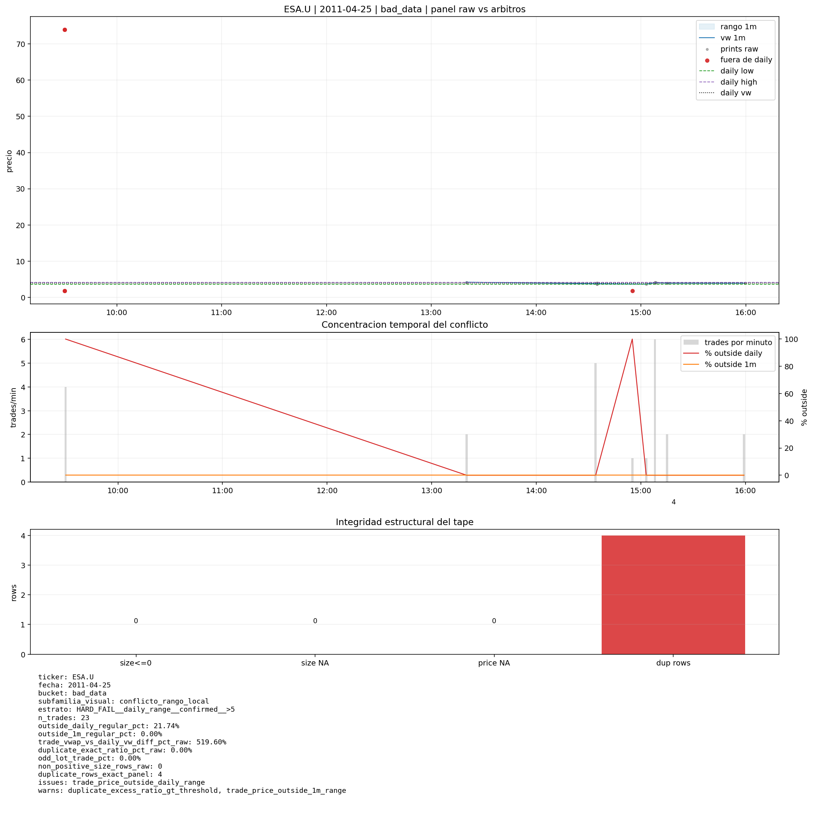

**Que muestra**

- Panel rico del tape raw frente a `daily` y `1m` para `ESA.U` el `2011-04-25`.
- `n_trades = 23`, `outside_daily_regular_pct = 21.74%`, `outside_1m_regular_pct = 0.00%`.
- `trade_vwap_vs_daily_vw_diff_pct_raw = 519.60%`, `duplicate_exact_ratio_pct_raw = 0.00%`, `odd_lot_trade_pct = 0.00%`.

**Responde**

- Subfamilia donde el conflicto vive en un subconjunto relevante del rango o del arbitro intraminuto, aunque no haya colapso total de escala.
- El conflicto vive en una franja local del rango o del arbitro intraminuto, sin llegar a colapso total de escala.
- Eso exige leer el panel minuto a minuto y no quedarse solo con la impresion global de la nube de precios.
- La clasificacion a `bad_data` aqui depende de que el file ya no conserve una reconciliacion economica defendible.
- La decision que justifica es exclusion de ejecucion simulada, labels y benchmarking; solo queda valor forense.

**No responde**

- No responde a colapso total de escala; ese seria otro subtipo.
- No responde por si solo a dano estructural del tape salvo que aparezca en `issues_list` o en el panel de integridad.

**Consecuencia**

- Excluir el file del flujo productivo aunque el dano no sea un colapso absoluto.
- Conservarlo como caso forense de rango local severo.

**Grupos duplicados exactos mas relevantes**

| ts_ny | price | size | count |
|---|---|---|---|
| 2011-04-25 09:30:00.718 | 73.92 | 1000 | 2 |
| 2011-04-25 09:30:10.501 | 1.83 | 100 | 2 |

### IHT | 2009-02-25

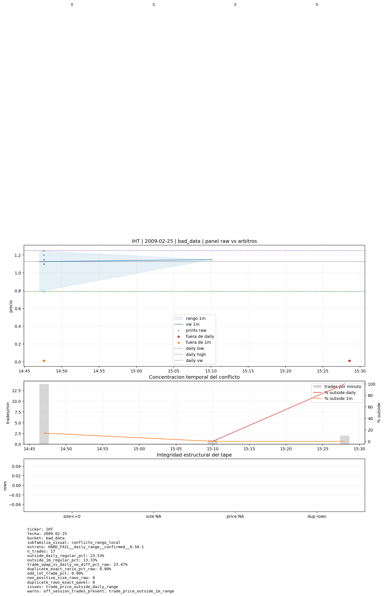

**Que muestra**

- Panel rico del tape raw frente a `daily` y `1m` para `IHT` el `2009-02-25`.
- `n_trades = 17`, `outside_daily_regular_pct = 23.53%`, `outside_1m_regular_pct = 13.33%`.
- `trade_vwap_vs_daily_vw_diff_pct_raw = 23.47%`, `duplicate_exact_ratio_pct_raw = 0.00%`, `odd_lot_trade_pct = 0.00%`.

**Responde**

- Subfamilia donde el conflicto vive en un subconjunto relevante del rango o del arbitro intraminuto, aunque no haya colapso total de escala.
- El conflicto vive en una franja local del rango o del arbitro intraminuto, sin llegar a colapso total de escala.
- Eso exige leer el panel minuto a minuto y no quedarse solo con la impresion global de la nube de precios.
- La clasificacion a `bad_data` aqui depende de que el file ya no conserve una reconciliacion economica defendible.
- La decision que justifica es exclusion de ejecucion simulada, labels y benchmarking; solo queda valor forense.

**No responde**

- No responde a colapso total de escala; ese seria otro subtipo.
- No responde por si solo a dano estructural del tape salvo que aparezca en `issues_list` o en el panel de integridad.

**Consecuencia**

- Excluir el file del flujo productivo aunque el dano no sea un colapso absoluto.
- Conservarlo como caso forense de rango local severo.

### TOPS | 2014-09-29

**Que muestra**

- Panel rico del tape raw frente a `daily` y `1m` para `TOPS` el `2014-09-29`.
- `n_trades = 61`, `outside_daily_regular_pct = 100.00%`, `outside_1m_regular_pct = 100.00%`.
- `trade_vwap_vs_daily_vw_diff_pct_raw = nan%`, `duplicate_exact_ratio_pct_raw = 13.11%`, `odd_lot_trade_pct = 22.95%`.

**Responde**

- Subfamilia donde el panel de precio ya demuestra por si mismo una ruptura semantica: tape y arbitros viven en escalas incompatibles o el porcentaje fuera de rango es practicamente total.
- El fallo se ve de forma directa en el panel de precio: el tape y los arbitros no conviven en una misma geometria defendible.
- La lectura correcta exige mirar la separacion vertical entre prints y arbitros y el hecho de que el conflicto de rango sea practicamente total.
- Aqui el panel actual si responde bien a por que el file cae en `bad_data`.
- El 13.11% de duplicacion exacta obliga a sospechar dano de tape o bursts mecanicos, no solo ruido visual.
- La decision que justifica es exclusion de ejecucion simulada, labels y benchmarking; solo queda valor forense.

**No responde**

- No responde a si la duplicacion es la causa principal del rechazo; puede empeorar el caso, pero no explica por si sola la geometria rota.
- No responde a si existiria una reconciliacion de escala defendible; el colapso ya es demasiado extremo para tratarlo como simple normalizacion.

**Consecuencia**

- Excluir de ejecucion simulada, labels y benchmarking.
- Conservar solo valor forense o de deteccion de dano severo.

**Grupos duplicados exactos mas relevantes**

| ts_ny | price | size | count |
|---|---|---|---|
| 2014-09-29 11:55:35.257 | 1.9 | 100 | 4 |
| 2014-09-29 11:06:42.104 | 1.89 | 66 | 3 |
| 2014-09-29 13:40:20.726 | 1.9 | 100 | 3 |
| 2014-09-29 10:38:58.536 | 1.88 | 200 | 2 |
| 2014-09-29 11:06:42.104 | 1.89 | 13 | 2 |
| 2014-09-29 11:06:42.114 | 1.889 | 200 | 2 |
| 2014-09-29 14:07:34.079 | 1.891 | 200 | 2 |
| 2014-09-29 15:01:56.227 | 1.9 | 100 | 2 |
| 2014-09-29 15:01:56.228 | 1.9 | 100 | 2 |

### ANTX | 2015-05-27

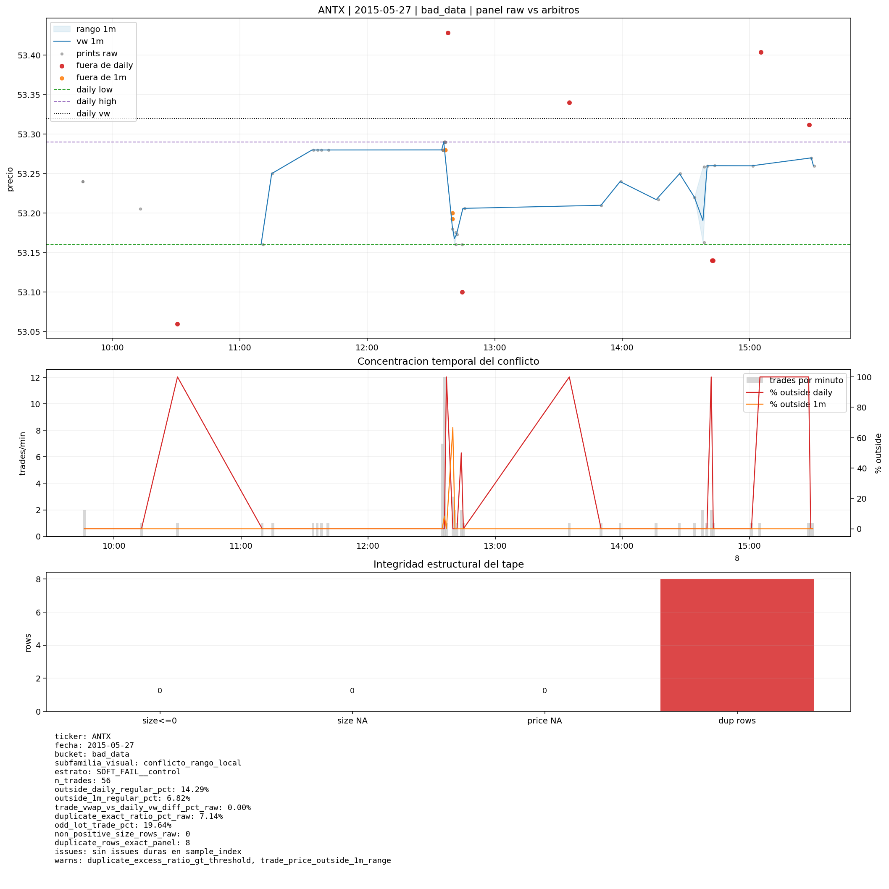

**Que muestra**

- Panel rico del tape raw frente a `daily` y `1m` para `ANTX` el `2015-05-27`.
- `n_trades = 56`, `outside_daily_regular_pct = 14.29%`, `outside_1m_regular_pct = 6.82%`.
- `trade_vwap_vs_daily_vw_diff_pct_raw = 0.00%`, `duplicate_exact_ratio_pct_raw = 7.14%`, `odd_lot_trade_pct = 19.64%`.

**Responde**

- Subfamilia donde el conflicto vive en un subconjunto relevante del rango o del arbitro intraminuto, aunque no haya colapso total de escala.
- El conflicto vive en una franja local del rango o del arbitro intraminuto, sin llegar a colapso total de escala.
- Eso exige leer el panel minuto a minuto y no quedarse solo con la impresion global de la nube de precios.
- La clasificacion a `bad_data` aqui depende de que el file ya no conserve una reconciliacion economica defendible.
- El 7.14% de duplicacion exacta obliga a sospechar dano de tape o bursts mecanicos, no solo ruido visual.
- La decision que justifica es exclusion de ejecucion simulada, labels y benchmarking; solo queda valor forense.

**No responde**

- No responde a colapso total de escala; ese seria otro subtipo.
- No responde por si solo a dano estructural del tape salvo que aparezca en `issues_list` o en el panel de integridad.

**Consecuencia**

- Excluir el file del flujo productivo aunque el dano no sea un colapso absoluto.
- Conservarlo como caso forense de rango local severo.

**Grupos duplicados exactos mas relevantes**

| ts_ny | price | size | count |
|---|---|---|---|
| 2015-05-27 12:35:31.140 | 53.28 | 100 | 2 |
| 2015-05-27 12:35:39.061 | 53.28 | 100 | 2 |
| 2015-05-27 12:36:22.540 | 53.29 | 200 | 2 |
| 2015-05-27 12:36:22.567 | 53.29 | 200 | 2 |

### ASTI | 2013-02-14

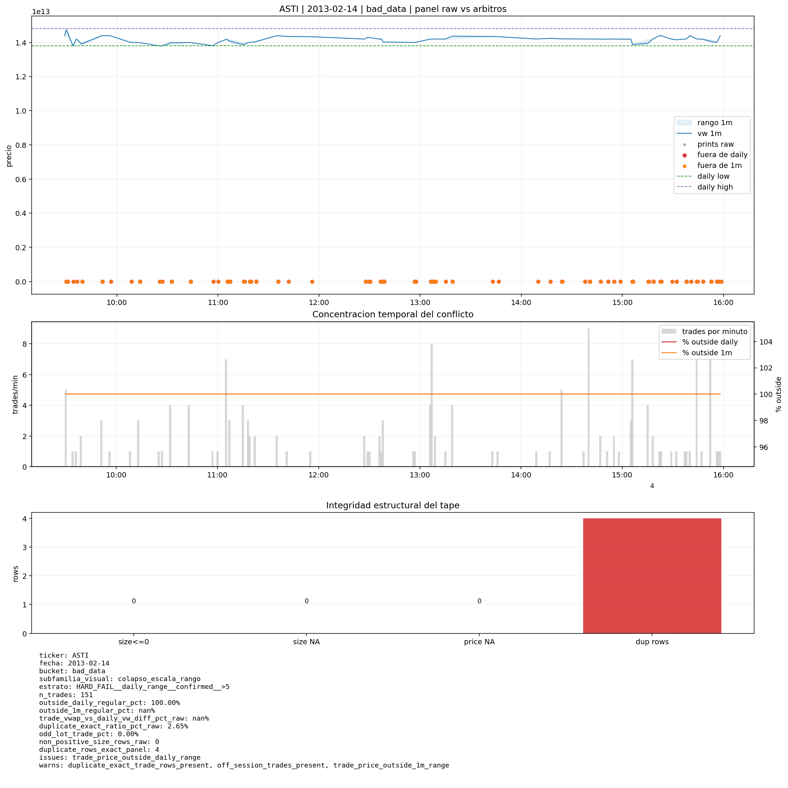

**Que muestra**

- Panel rico del tape raw frente a `daily` y `1m` para `ASTI` el `2013-02-14`.
- `n_trades = 151`, `outside_daily_regular_pct = 100.00%`, `outside_1m_regular_pct = nan%`.
- `trade_vwap_vs_daily_vw_diff_pct_raw = nan%`, `duplicate_exact_ratio_pct_raw = 2.65%`, `odd_lot_trade_pct = 0.00%`.

**Responde**

- Subfamilia donde el panel de precio ya demuestra por si mismo una ruptura semantica: tape y arbitros viven en escalas incompatibles o el porcentaje fuera de rango es practicamente total.
- El fallo se ve de forma directa en el panel de precio: el tape y los arbitros no conviven en una misma geometria defendible.
- La lectura correcta exige mirar la separacion vertical entre prints y arbitros y el hecho de que el conflicto de rango sea practicamente total.
- Aqui el panel actual si responde bien a por que el file cae en `bad_data`.
- La decision que justifica es exclusion de ejecucion simulada, labels y benchmarking; solo queda valor forense.

**No responde**

- No responde a si la duplicacion es la causa principal del rechazo; puede empeorar el caso, pero no explica por si sola la geometria rota.
- No responde a si existiria una reconciliacion de escala defendible; el colapso ya es demasiado extremo para tratarlo como simple normalizacion.

**Consecuencia**

- Excluir de ejecucion simulada, labels y benchmarking.
- Conservar solo valor forense o de deteccion de dano severo.

**Grupos duplicados exactos mas relevantes**

| ts_ny | price | size | count |
|---|---|---|---|
| 2013-02-14 13:07:23.645 | 0.71 | 100 | 2 |
| 2013-02-14 14:40:47.489 | 0.71 | 100 | 2 |

### CBAN | 2015-02-20

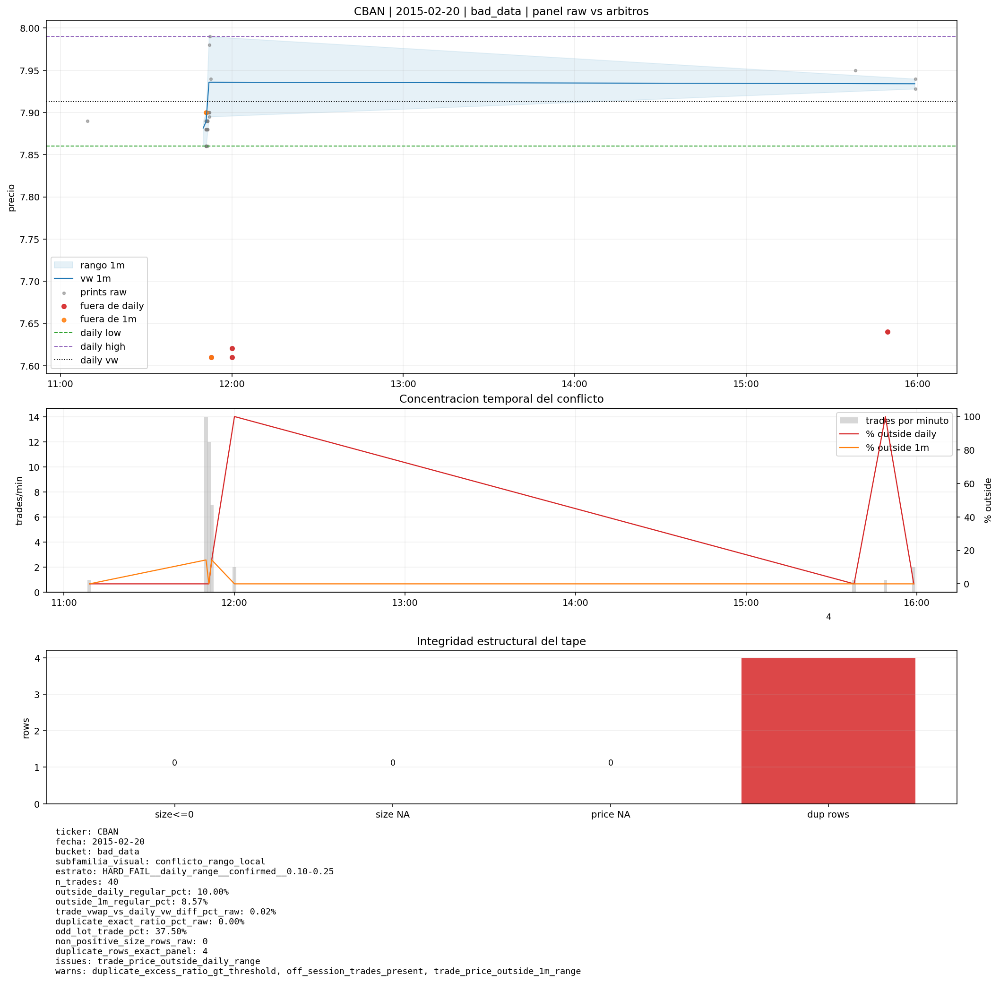

**Que muestra**

- Panel rico del tape raw frente a `daily` y `1m` para `CBAN` el `2015-02-20`.
- `n_trades = 40`, `outside_daily_regular_pct = 10.00%`, `outside_1m_regular_pct = 8.57%`.
- `trade_vwap_vs_daily_vw_diff_pct_raw = 0.02%`, `duplicate_exact_ratio_pct_raw = 0.00%`, `odd_lot_trade_pct = 37.50%`.

**Responde**

- Subfamilia donde el conflicto vive en un subconjunto relevante del rango o del arbitro intraminuto, aunque no haya colapso total de escala.
- El conflicto vive en una franja local del rango o del arbitro intraminuto, sin llegar a colapso total de escala.
- Eso exige leer el panel minuto a minuto y no quedarse solo con la impresion global de la nube de precios.
- La clasificacion a `bad_data` aqui depende de que el file ya no conserve una reconciliacion economica defendible.
- El 37.50% de odd-lots empuja la lectura hacia microestructura fina; evita leer el caso como pura ruptura economica gruesa.
- La decision que justifica es exclusion de ejecucion simulada, labels y benchmarking; solo queda valor forense.

**No responde**

- No responde a colapso total de escala; ese seria otro subtipo.
- No responde por si solo a dano estructural del tape salvo que aparezca en `issues_list` o en el panel de integridad.

**Consecuencia**

- Excluir el file del flujo productivo aunque el dano no sea un colapso absoluto.
- Conservarlo como caso forense de rango local severo.

**Grupos duplicados exactos mas relevantes**

| ts_ny | price | size | count |
|---|---|---|---|
| 2015-02-20 11:50:56.617 | 7.86 | 100 | 2 |
| 2015-02-20 11:50:56.620 | 7.86 | 100 | 2 |

### LCUT | 2017-05-22

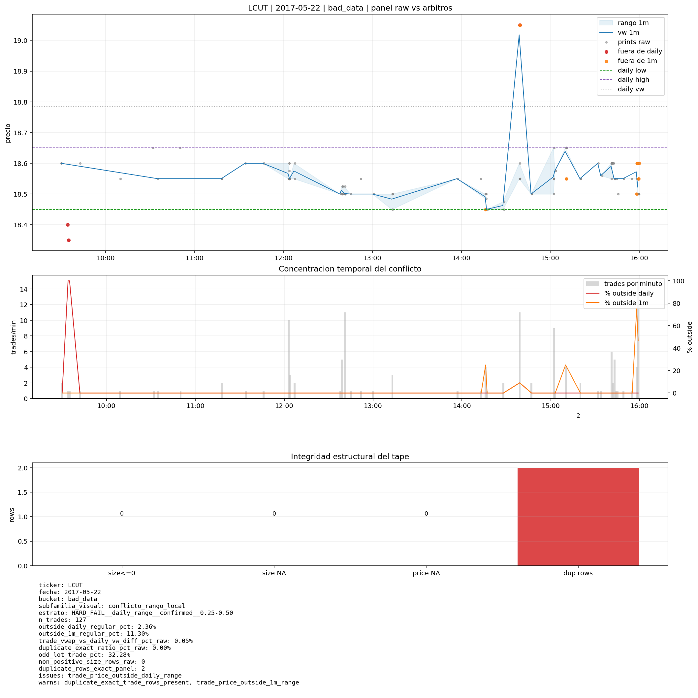

**Que muestra**

- Panel rico del tape raw frente a `daily` y `1m` para `LCUT` el `2017-05-22`.
- `n_trades = 127`, `outside_daily_regular_pct = 2.36%`, `outside_1m_regular_pct = 11.30%`.
- `trade_vwap_vs_daily_vw_diff_pct_raw = 0.05%`, `duplicate_exact_ratio_pct_raw = 0.00%`, `odd_lot_trade_pct = 32.28%`.

**Responde**

- Subfamilia donde el conflicto vive en un subconjunto relevante del rango o del arbitro intraminuto, aunque no haya colapso total de escala.
- El conflicto vive en una franja local del rango o del arbitro intraminuto, sin llegar a colapso total de escala.
- Eso exige leer el panel minuto a minuto y no quedarse solo con la impresion global de la nube de precios.
- La clasificacion a `bad_data` aqui depende de que el file ya no conserve una reconciliacion economica defendible.
- El 32.28% de odd-lots empuja la lectura hacia microestructura fina; evita leer el caso como pura ruptura economica gruesa.
- La decision que justifica es exclusion de ejecucion simulada, labels y benchmarking; solo queda valor forense.

**No responde**

- No responde a colapso total de escala; ese seria otro subtipo.
- No responde por si solo a dano estructural del tape salvo que aparezca en `issues_list` o en el panel de integridad.

**Consecuencia**

- Excluir el file del flujo productivo aunque el dano no sea un colapso absoluto.
- Conservarlo como caso forense de rango local severo.

**Grupos duplicados exactos mas relevantes**

| ts_ny | price | size | count |
|---|---|---|---|
| 2017-05-22 12:03:53.579028 | 18.55 | 100 | 2 |

### PMD | 2018-01-03

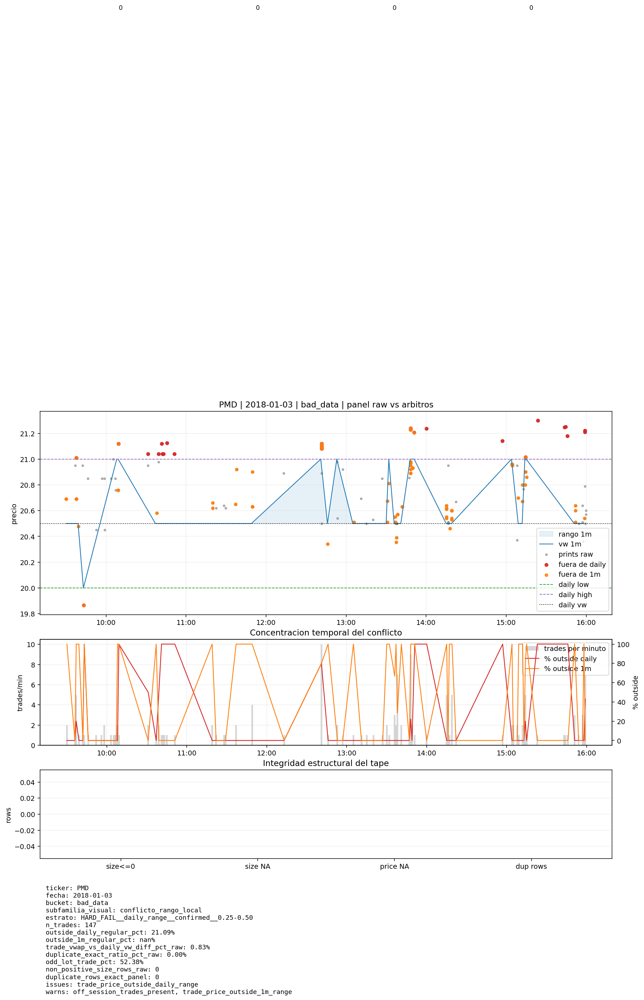

**Que muestra**

- Panel rico del tape raw frente a `daily` y `1m` para `PMD` el `2018-01-03`.
- `n_trades = 147`, `outside_daily_regular_pct = 21.09%`, `outside_1m_regular_pct = nan%`.
- `trade_vwap_vs_daily_vw_diff_pct_raw = 0.83%`, `duplicate_exact_ratio_pct_raw = 0.00%`, `odd_lot_trade_pct = 52.38%`.

**Responde**

- Subfamilia donde el conflicto vive en un subconjunto relevante del rango o del arbitro intraminuto, aunque no haya colapso total de escala.
- El conflicto vive en una franja local del rango o del arbitro intraminuto, sin llegar a colapso total de escala.
- Eso exige leer el panel minuto a minuto y no quedarse solo con la impresion global de la nube de precios.
- La clasificacion a `bad_data` aqui depende de que el file ya no conserve una reconciliacion economica defendible.
- El 52.38% de odd-lots empuja la lectura hacia microestructura fina; evita leer el caso como pura ruptura economica gruesa.
- La decision que justifica es exclusion de ejecucion simulada, labels y benchmarking; solo queda valor forense.

**No responde**

- No responde a colapso total de escala; ese seria otro subtipo.
- No responde por si solo a dano estructural del tape salvo que aparezca en `issues_list` o en el panel de integridad.

**Consecuencia**

- Excluir el file del flujo productivo aunque el dano no sea un colapso absoluto.
- Conservarlo como caso forense de rango local severo.

### RELV | 2018-09-18

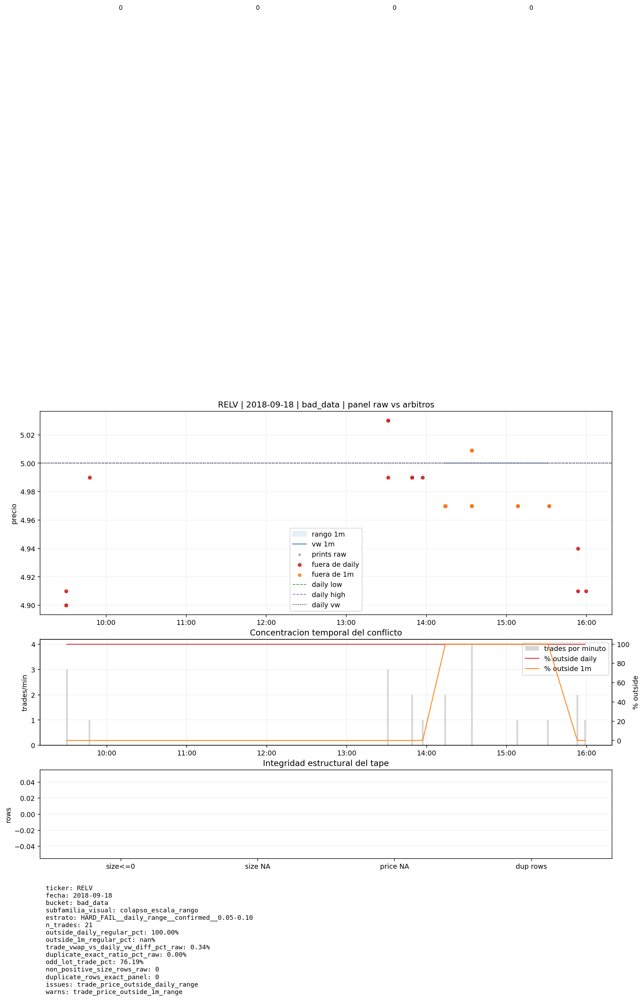

**Que muestra**

- Panel rico del tape raw frente a `daily` y `1m` para `RELV` el `2018-09-18`.
- `n_trades = 21`, `outside_daily_regular_pct = 100.00%`, `outside_1m_regular_pct = nan%`.
- `trade_vwap_vs_daily_vw_diff_pct_raw = 0.34%`, `duplicate_exact_ratio_pct_raw = 0.00%`, `odd_lot_trade_pct = 76.19%`.

**Responde**

- Subfamilia donde el panel de precio ya demuestra por si mismo una ruptura semantica: tape y arbitros viven en escalas incompatibles o el porcentaje fuera de rango es practicamente total.
- El fallo se ve de forma directa en el panel de precio: el tape y los arbitros no conviven en una misma geometria defendible.
- La lectura correcta exige mirar la separacion vertical entre prints y arbitros y el hecho de que el conflicto de rango sea practicamente total.
- Aqui el panel actual si responde bien a por que el file cae en `bad_data`.
- El 76.19% de odd-lots empuja la lectura hacia microestructura fina; evita leer el caso como pura ruptura economica gruesa.
- La decision que justifica es exclusion de ejecucion simulada, labels y benchmarking; solo queda valor forense.

**No responde**

- No responde a si la duplicacion es la causa principal del rechazo; puede empeorar el caso, pero no explica por si sola la geometria rota.
- No responde a si existiria una reconciliacion de escala defendible; el colapso ya es demasiado extremo para tratarlo como simple normalizacion.

**Consecuencia**

- Excluir de ejecucion simulada, labels y benchmarking.
- Conservar solo valor forense o de deteccion de dano severo.

### SMIT | 2014-06-17

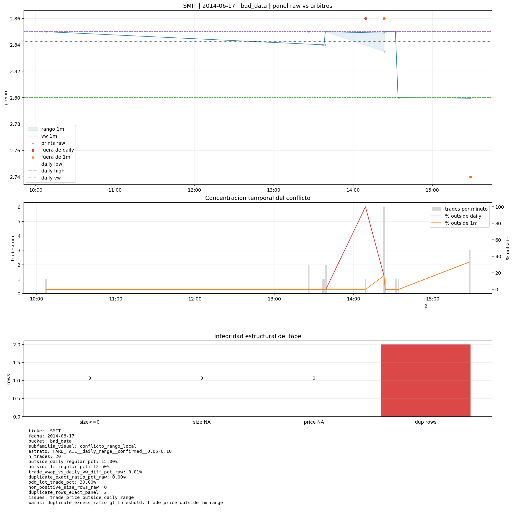

**Que muestra**

- Panel rico del tape raw frente a `daily` y `1m` para `SMIT` el `2014-06-17`.
- `n_trades = 20`, `outside_daily_regular_pct = 15.00%`, `outside_1m_regular_pct = 12.50%`.
- `trade_vwap_vs_daily_vw_diff_pct_raw = 0.01%`, `duplicate_exact_ratio_pct_raw = 0.00%`, `odd_lot_trade_pct = 30.00%`.

**Responde**

- Subfamilia donde el conflicto vive en un subconjunto relevante del rango o del arbitro intraminuto, aunque no haya colapso total de escala.
- El conflicto vive en una franja local del rango o del arbitro intraminuto, sin llegar a colapso total de escala.
- Eso exige leer el panel minuto a minuto y no quedarse solo con la impresion global de la nube de precios.
- La clasificacion a `bad_data` aqui depende de que el file ya no conserve una reconciliacion economica defendible.
- El 30.00% de odd-lots empuja la lectura hacia microestructura fina; evita leer el caso como pura ruptura economica gruesa.
- La decision que justifica es exclusion de ejecucion simulada, labels y benchmarking; solo queda valor forense.

**No responde**

- No responde a colapso total de escala; ese seria otro subtipo.
- No responde por si solo a dano estructural del tape salvo que aparezca en `issues_list` o en el panel de integridad.

**Consecuencia**

- Excluir el file del flujo productivo aunque el dano no sea un colapso absoluto.
- Conservarlo como caso forense de rango local severo.

**Grupos duplicados exactos mas relevantes**

| ts_ny | price | size | count |
|---|---|---|---|
| 2014-06-17 13:39:00.299 | 2.85 | 305 | 2 |

### GPRK | 2017-03-21

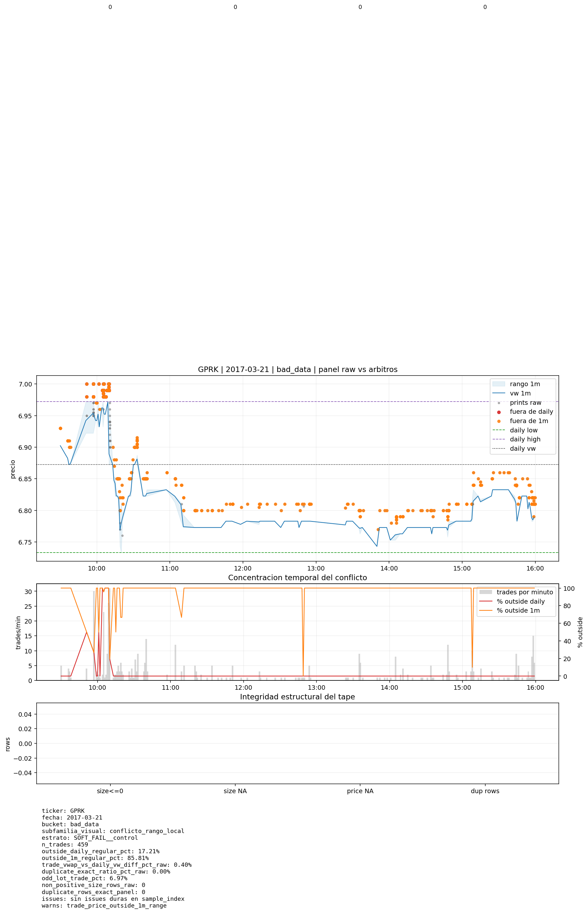

**Que muestra**

- Panel rico del tape raw frente a `daily` y `1m` para `GPRK` el `2017-03-21`.
- `n_trades = 459`, `outside_daily_regular_pct = 17.21%`, `outside_1m_regular_pct = 85.81%`.
- `trade_vwap_vs_daily_vw_diff_pct_raw = 0.40%`, `duplicate_exact_ratio_pct_raw = 0.00%`, `odd_lot_trade_pct = 6.97%`.

**Responde**

- Subfamilia donde el conflicto vive en un subconjunto relevante del rango o del arbitro intraminuto, aunque no haya colapso total de escala.
- El conflicto vive en una franja local del rango o del arbitro intraminuto, sin llegar a colapso total de escala.
- Eso exige leer el panel minuto a minuto y no quedarse solo con la impresion global de la nube de precios.
- La clasificacion a `bad_data` aqui depende de que el file ya no conserve una reconciliacion economica defendible.
- La decision que justifica es exclusion de ejecucion simulada, labels y benchmarking; solo queda valor forense.

**No responde**

- No responde a colapso total de escala; ese seria otro subtipo.
- No responde por si solo a dano estructural del tape salvo que aparezca en `issues_list` o en el panel de integridad.

**Consecuencia**

- Excluir el file del flujo productivo aunque el dano no sea un colapso absoluto.
- Conservarlo como caso forense de rango local severo.

### PMD | 2014-12-18

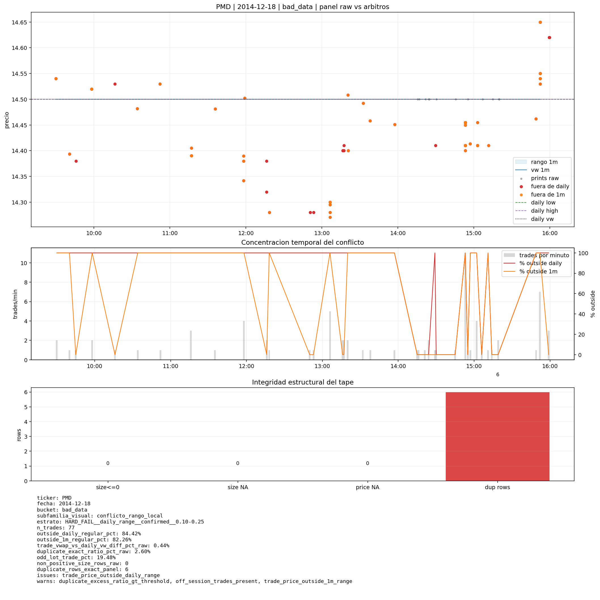

**Que muestra**

- Panel rico del tape raw frente a `daily` y `1m` para `PMD` el `2014-12-18`.
- `n_trades = 77`, `outside_daily_regular_pct = 84.42%`, `outside_1m_regular_pct = 82.26%`.
- `trade_vwap_vs_daily_vw_diff_pct_raw = 0.44%`, `duplicate_exact_ratio_pct_raw = 2.60%`, `odd_lot_trade_pct = 19.48%`.

**Responde**

- Subfamilia donde el conflicto vive en un subconjunto relevante del rango o del arbitro intraminuto, aunque no haya colapso total de escala.
- El conflicto vive en una franja local del rango o del arbitro intraminuto, sin llegar a colapso total de escala.
- Eso exige leer el panel minuto a minuto y no quedarse solo con la impresion global de la nube de precios.
- La clasificacion a `bad_data` aqui depende de que el file ya no conserve una reconciliacion economica defendible.
- La decision que justifica es exclusion de ejecucion simulada, labels y benchmarking; solo queda valor forense.

**No responde**

- No responde a colapso total de escala; ese seria otro subtipo.
- No responde por si solo a dano estructural del tape salvo que aparezca en `issues_list` o en el panel de integridad.

**Consecuencia**

- Excluir el file del flujo productivo aunque el dano no sea un colapso absoluto.
- Conservarlo como caso forense de rango local severo.

**Grupos duplicados exactos mas relevantes**

| ts_ny | price | size | count |
|---|---|---|---|
| 2014-12-18 09:30:00.135 | 14.54 | 172 | 2 |
| 2014-12-18 14:53:17.459 | 14.455 | 100 | 2 |
| 2014-12-18 15:02:52.253 | 14.41 | 100 | 2 |

### PMD | 2015-12-30

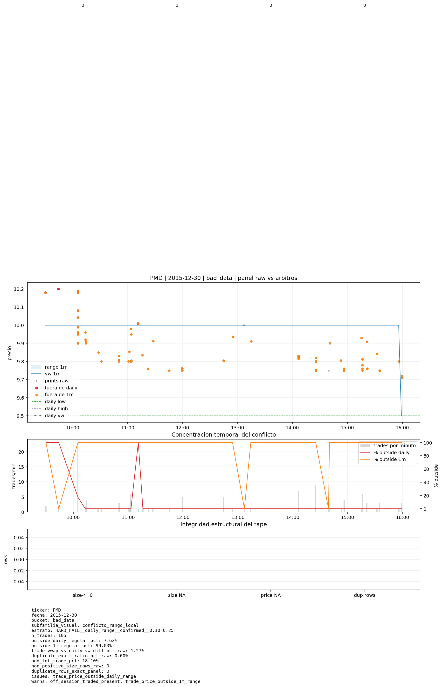

**Que muestra**

- Panel rico del tape raw frente a `daily` y `1m` para `PMD` el `2015-12-30`.
- `n_trades = 105`, `outside_daily_regular_pct = 7.62%`, `outside_1m_regular_pct = 99.03%`.
- `trade_vwap_vs_daily_vw_diff_pct_raw = 1.27%`, `duplicate_exact_ratio_pct_raw = 0.00%`, `odd_lot_trade_pct = 18.10%`.

**Responde**

- Subfamilia donde el conflicto vive en un subconjunto relevante del rango o del arbitro intraminuto, aunque no haya colapso total de escala.
- El conflicto vive en una franja local del rango o del arbitro intraminuto, sin llegar a colapso total de escala.
- Eso exige leer el panel minuto a minuto y no quedarse solo con la impresion global de la nube de precios.
- La clasificacion a `bad_data` aqui depende de que el file ya no conserve una reconciliacion economica defendible.
- La decision que justifica es exclusion de ejecucion simulada, labels y benchmarking; solo queda valor forense.

**No responde**

- No responde a colapso total de escala; ese seria otro subtipo.
- No responde por si solo a dano estructural del tape salvo que aparezca en `issues_list` o en el panel de integridad.

**Consecuencia**

- Excluir el file del flujo productivo aunque el dano no sea un colapso absoluto.
- Conservarlo como caso forense de rango local severo.

### QRTEA | 2018-07-19

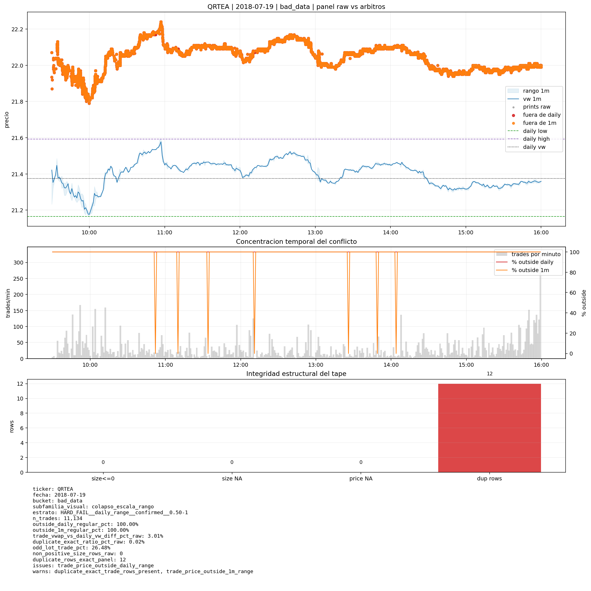

**Que muestra**

- Panel rico del tape raw frente a `daily` y `1m` para `QRTEA` el `2018-07-19`.
- `n_trades = 11,134`, `outside_daily_regular_pct = 100.00%`, `outside_1m_regular_pct = 100.00%`.
- `trade_vwap_vs_daily_vw_diff_pct_raw = 3.01%`, `duplicate_exact_ratio_pct_raw = 0.02%`, `odd_lot_trade_pct = 26.48%`.

**Responde**

- Subfamilia donde el panel de precio ya demuestra por si mismo una ruptura semantica: tape y arbitros viven en escalas incompatibles o el porcentaje fuera de rango es practicamente total.
- El fallo se ve de forma directa en el panel de precio: el tape y los arbitros no conviven en una misma geometria defendible.
- La lectura correcta exige mirar la separacion vertical entre prints y arbitros y el hecho de que el conflicto de rango sea practicamente total.
- Aqui el panel actual si responde bien a por que el file cae en `bad_data`.
- El 26.48% de odd-lots empuja la lectura hacia microestructura fina; evita leer el caso como pura ruptura economica gruesa.
- La decision que justifica es exclusion de ejecucion simulada, labels y benchmarking; solo queda valor forense.

**No responde**

- No responde a si la duplicacion es la causa principal del rechazo; puede empeorar el caso, pero no explica por si sola la geometria rota.
- No responde a si existiria una reconciliacion de escala defendible; el colapso ya es demasiado extremo para tratarlo como simple normalizacion.

**Consecuencia**

- Excluir de ejecucion simulada, labels y benchmarking.
- Conservar solo valor forense o de deteccion de dano severo.

**Grupos duplicados exactos mas relevantes**

| ts_ny | price | size | count |
|---|---|---|---|
| 2018-07-19 11:31:45.145171 | 22.11 | 100 | 2 |
| 2018-07-19 12:56:42.942553 | 22.08 | 100 | 2 |
| 2018-07-19 14:35:09.868126 | 21.98 | 100 | 2 |
| 2018-07-19 15:04:19.500253 | 21.97 | 100 | 2 |
| 2018-07-19 15:54:32.365938 | 22.0 | 200 | 2 |
| 2018-07-19 15:55:59.861462 | 22.0 | 100 | 2 |

### RELV | 2016-12-09

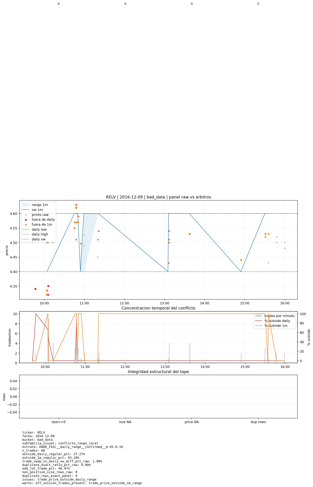

**Que muestra**

- Panel rico del tape raw frente a `daily` y `1m` para `RELV` el `2016-12-09`.
- `n_trades = 66`, `outside_daily_regular_pct = 27.27%`, `outside_1m_regular_pct = 93.18%`.
- `trade_vwap_vs_daily_vw_diff_pct_raw = 1.98%`, `duplicate_exact_ratio_pct_raw = 0.00%`, `odd_lot_trade_pct = 46.97%`.

**Responde**

- Subfamilia donde el conflicto vive en un subconjunto relevante del rango o del arbitro intraminuto, aunque no haya colapso total de escala.
- El conflicto vive en una franja local del rango o del arbitro intraminuto, sin llegar a colapso total de escala.
- Eso exige leer el panel minuto a minuto y no quedarse solo con la impresion global de la nube de precios.
- La clasificacion a `bad_data` aqui depende de que el file ya no conserve una reconciliacion economica defendible.
- El 46.97% de odd-lots empuja la lectura hacia microestructura fina; evita leer el caso como pura ruptura economica gruesa.
- La decision que justifica es exclusion de ejecucion simulada, labels y benchmarking; solo queda valor forense.

**No responde**

- No responde a colapso total de escala; ese seria otro subtipo.
- No responde por si solo a dano estructural del tape salvo que aparezca en `issues_list` o en el panel de integridad.

**Consecuencia**

- Excluir el file del flujo productivo aunque el dano no sea un colapso absoluto.
- Conservarlo como caso forense de rango local severo.

### RELV | 2017-08-10

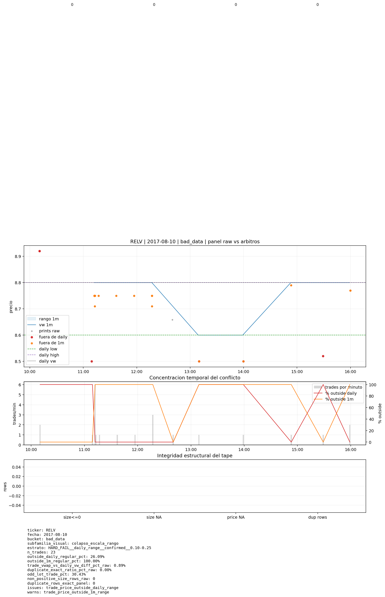

**Que muestra**

- Panel rico del tape raw frente a `daily` y `1m` para `RELV` el `2017-08-10`.
- `n_trades = 23`, `outside_daily_regular_pct = 26.09%`, `outside_1m_regular_pct = 100.00%`.
- `trade_vwap_vs_daily_vw_diff_pct_raw = 0.89%`, `duplicate_exact_ratio_pct_raw = 0.00%`, `odd_lot_trade_pct = 30.43%`.

**Responde**

- Subfamilia donde el panel de precio ya demuestra por si mismo una ruptura semantica: tape y arbitros viven en escalas incompatibles o el porcentaje fuera de rango es practicamente total.
- El fallo se ve de forma directa en el panel de precio: el tape y los arbitros no conviven en una misma geometria defendible.
- La lectura correcta exige mirar la separacion vertical entre prints y arbitros y el hecho de que el conflicto de rango sea practicamente total.
- Aqui el panel actual si responde bien a por que el file cae en `bad_data`.
- El 30.43% de odd-lots empuja la lectura hacia microestructura fina; evita leer el caso como pura ruptura economica gruesa.
- La decision que justifica es exclusion de ejecucion simulada, labels y benchmarking; solo queda valor forense.

**No responde**

- No responde a si la duplicacion es la causa principal del rechazo; puede empeorar el caso, pero no explica por si sola la geometria rota.
- No responde a si existiria una reconciliacion de escala defendible; el colapso ya es demasiado extremo para tratarlo como simple normalizacion.

**Consecuencia**

- Excluir de ejecucion simulada, labels y benchmarking.
- Conservar solo valor forense o de deteccion de dano severo.

### SBSI | 2017-05-19

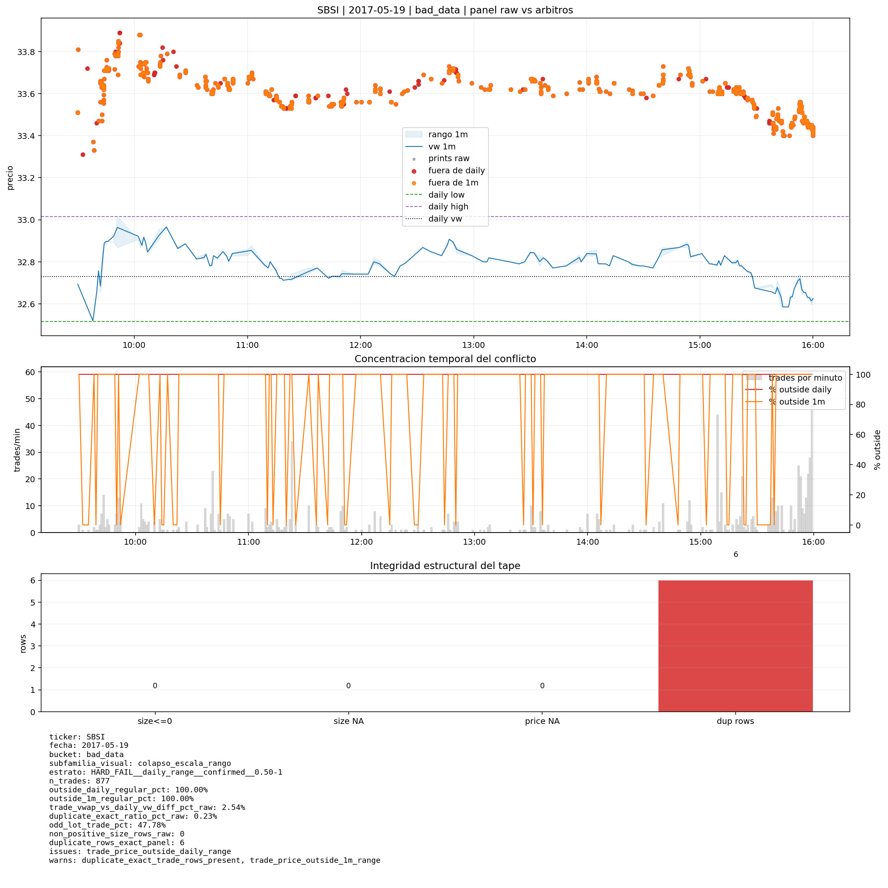

**Que muestra**

- Panel rico del tape raw frente a `daily` y `1m` para `SBSI` el `2017-05-19`.
- `n_trades = 877`, `outside_daily_regular_pct = 100.00%`, `outside_1m_regular_pct = 100.00%`.
- `trade_vwap_vs_daily_vw_diff_pct_raw = 2.54%`, `duplicate_exact_ratio_pct_raw = 0.23%`, `odd_lot_trade_pct = 47.78%`.

**Responde**

- Subfamilia donde el panel de precio ya demuestra por si mismo una ruptura semantica: tape y arbitros viven en escalas incompatibles o el porcentaje fuera de rango es practicamente total.
- El fallo se ve de forma directa en el panel de precio: el tape y los arbitros no conviven en una misma geometria defendible.
- La lectura correcta exige mirar la separacion vertical entre prints y arbitros y el hecho de que el conflicto de rango sea practicamente total.
- Aqui el panel actual si responde bien a por que el file cae en `bad_data`.
- El 47.78% de odd-lots empuja la lectura hacia microestructura fina; evita leer el caso como pura ruptura economica gruesa.
- La decision que justifica es exclusion de ejecucion simulada, labels y benchmarking; solo queda valor forense.

**No responde**

- No responde a si la duplicacion es la causa principal del rechazo; puede empeorar el caso, pero no explica por si sola la geometria rota.
- No responde a si existiria una reconciliacion de escala defendible; el colapso ya es demasiado extremo para tratarlo como simple normalizacion.

**Consecuencia**

- Excluir de ejecucion simulada, labels y benchmarking.
- Conservar solo valor forense o de deteccion de dano severo.

**Grupos duplicados exactos mas relevantes**

| ts_ny | price | size | count |
|---|---|---|---|
| 2017-05-19 09:43:41.902924 | 33.62 | 100 | 2 |
| 2017-05-19 10:03:04.872117 | 33.73 | 100 | 2 |
| 2017-05-19 14:40:25.721050 | 33.69 | 100 | 2 |

### TOPS | 2013-12-26

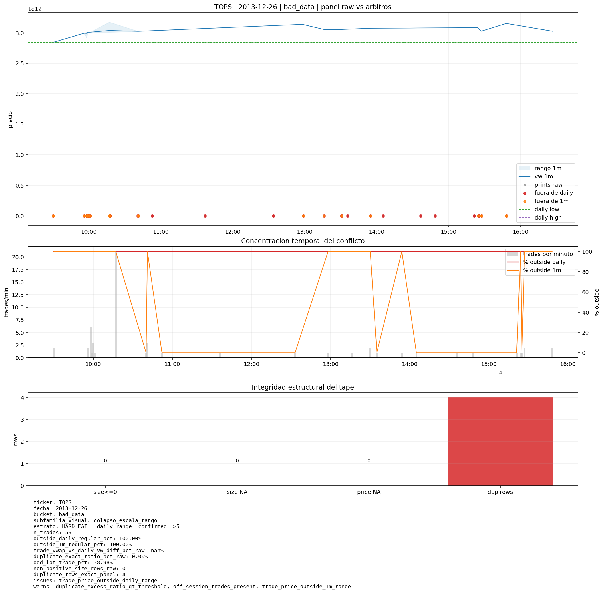

**Que muestra**

- Panel rico del tape raw frente a `daily` y `1m` para `TOPS` el `2013-12-26`.
- `n_trades = 59`, `outside_daily_regular_pct = 100.00%`, `outside_1m_regular_pct = 100.00%`.
- `trade_vwap_vs_daily_vw_diff_pct_raw = nan%`, `duplicate_exact_ratio_pct_raw = 0.00%`, `odd_lot_trade_pct = 38.98%`.

**Responde**

- Subfamilia donde el panel de precio ya demuestra por si mismo una ruptura semantica: tape y arbitros viven en escalas incompatibles o el porcentaje fuera de rango es practicamente total.
- El fallo se ve de forma directa en el panel de precio: el tape y los arbitros no conviven en una misma geometria defendible.
- La lectura correcta exige mirar la separacion vertical entre prints y arbitros y el hecho de que el conflicto de rango sea practicamente total.
- Aqui el panel actual si responde bien a por que el file cae en `bad_data`.
- El 38.98% de odd-lots empuja la lectura hacia microestructura fina; evita leer el caso como pura ruptura economica gruesa.
- La decision que justifica es exclusion de ejecucion simulada, labels y benchmarking; solo queda valor forense.

**No responde**

- No responde a si la duplicacion es la causa principal del rechazo; puede empeorar el caso, pero no explica por si sola la geometria rota.
- No responde a si existiria una reconciliacion de escala defendible; el colapso ya es demasiado extremo para tratarlo como simple normalizacion.

**Consecuencia**

- Excluir de ejecucion simulada, labels y benchmarking.
- Conservar solo valor forense o de deteccion de dano severo.

**Grupos duplicados exactos mas relevantes**

| ts_ny | price | size | count |
|---|---|---|---|
| 2013-12-26 09:30:00.573 | 1.88 | 133 | 2 |
| 2013-12-26 10:17:19.793 | 2.0 | 1 | 2 |

### TOPS | 2015-01-22

**Que muestra**

- Panel rico del tape raw frente a `daily` y `1m` para `TOPS` el `2015-01-22`.
- `n_trades = 96`, `outside_daily_regular_pct = 100.00%`, `outside_1m_regular_pct = 100.00%`.
- `trade_vwap_vs_daily_vw_diff_pct_raw = nan%`, `duplicate_exact_ratio_pct_raw = 6.25%`, `odd_lot_trade_pct = 7.29%`.

**Responde**

- Subfamilia donde el panel de precio ya demuestra por si mismo una ruptura semantica: tape y arbitros viven en escalas incompatibles o el porcentaje fuera de rango es practicamente total.
- El fallo se ve de forma directa en el panel de precio: el tape y los arbitros no conviven en una misma geometria defendible.
- La lectura correcta exige mirar la separacion vertical entre prints y arbitros y el hecho de que el conflicto de rango sea practicamente total.
- Aqui el panel actual si responde bien a por que el file cae en `bad_data`.
- El 6.25% de duplicacion exacta obliga a sospechar dano de tape o bursts mecanicos, no solo ruido visual.
- La decision que justifica es exclusion de ejecucion simulada, labels y benchmarking; solo queda valor forense.

**No responde**

- No responde a si la duplicacion es la causa principal del rechazo; puede empeorar el caso, pero no explica por si sola la geometria rota.
- No responde a si existiria una reconciliacion de escala defendible; el colapso ya es demasiado extremo para tratarlo como simple normalizacion.

**Consecuencia**

- Excluir de ejecucion simulada, labels y benchmarking.
- Conservar solo valor forense o de deteccion de dano severo.

**Grupos duplicados exactos mas relevantes**

| ts_ny | price | size | count |
|---|---|---|---|
| 2015-01-22 09:30:00.525 | 1.1 | 1823 | 2 |
| 2015-01-22 10:09:21.767 | 1.11 | 200 | 2 |
| 2015-01-22 11:15:23.860 | 1.1 | 100 | 2 |
| 2015-01-22 11:57:05.525 | 1.1 | 100 | 2 |
| 2015-01-22 12:36:13.150 | 1.17 | 100 | 2 |
| 2015-01-22 12:36:13.150 | 1.18 | 100 | 2 |
| 2015-01-22 12:36:13.151 | 1.15 | 100 | 2 |
| 2015-01-22 15:09:54.917 | 1.11 | 200 | 2 |
| 2015-01-22 15:28:18.953 | 1.08 | 100 | 2 |

### TOPS | 2016-07-07

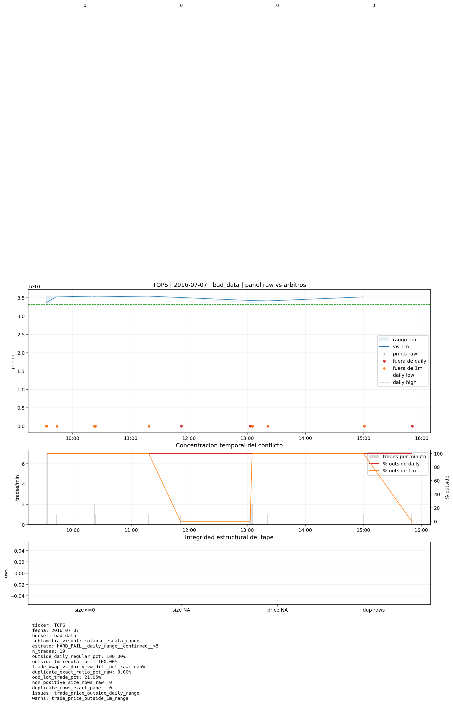

**Que muestra**

- Panel rico del tape raw frente a `daily` y `1m` para `TOPS` el `2016-07-07`.
- `n_trades = 19`, `outside_daily_regular_pct = 100.00%`, `outside_1m_regular_pct = 100.00%`.
- `trade_vwap_vs_daily_vw_diff_pct_raw = nan%`, `duplicate_exact_ratio_pct_raw = 0.00%`, `odd_lot_trade_pct = 21.05%`.

**Responde**

- Subfamilia donde el panel de precio ya demuestra por si mismo una ruptura semantica: tape y arbitros viven en escalas incompatibles o el porcentaje fuera de rango es practicamente total.
- El fallo se ve de forma directa en el panel de precio: el tape y los arbitros no conviven en una misma geometria defendible.
- La lectura correcta exige mirar la separacion vertical entre prints y arbitros y el hecho de que el conflicto de rango sea practicamente total.
- Aqui el panel actual si responde bien a por que el file cae en `bad_data`.
- La decision que justifica es exclusion de ejecucion simulada, labels y benchmarking; solo queda valor forense.

**No responde**

- No responde a si la duplicacion es la causa principal del rechazo; puede empeorar el caso, pero no explica por si sola la geometria rota.
- No responde a si existiria una reconciliacion de escala defendible; el colapso ya es demasiado extremo para tratarlo como simple normalizacion.

**Consecuencia**

- Excluir de ejecucion simulada, labels y benchmarking.
- Conservar solo valor forense o de deteccion de dano severo.

### KELYB | 2016-06-02

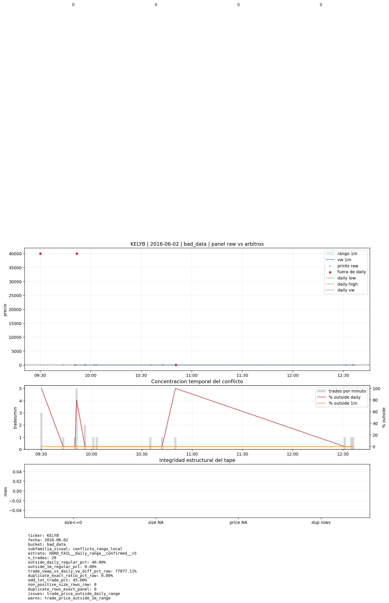

**Que muestra**

- Panel rico del tape raw frente a `daily` y `1m` para `KELYB` el `2016-06-02`.
- `n_trades = 20`, `outside_daily_regular_pct = 40.00%`, `outside_1m_regular_pct = 0.00%`.
- `trade_vwap_vs_daily_vw_diff_pct_raw = 77877.11%`, `duplicate_exact_ratio_pct_raw = 0.00%`, `odd_lot_trade_pct = 45.00%`.

**Responde**

- Subfamilia donde el conflicto vive en un subconjunto relevante del rango o del arbitro intraminuto, aunque no haya colapso total de escala.
- El conflicto vive en una franja local del rango o del arbitro intraminuto, sin llegar a colapso total de escala.
- Eso exige leer el panel minuto a minuto y no quedarse solo con la impresion global de la nube de precios.
- La clasificacion a `bad_data` aqui depende de que el file ya no conserve una reconciliacion economica defendible.
- El 45.00% de odd-lots empuja la lectura hacia microestructura fina; evita leer el caso como pura ruptura economica gruesa.
- La decision que justifica es exclusion de ejecucion simulada, labels y benchmarking; solo queda valor forense.

**No responde**

- No responde a colapso total de escala; ese seria otro subtipo.
- No responde por si solo a dano estructural del tape salvo que aparezca en `issues_list` o en el panel de integridad.

**Consecuencia**

- Excluir el file del flujo productivo aunque el dano no sea un colapso absoluto.
- Conservarlo como caso forense de rango local severo.

### IHC | 2020-11-27

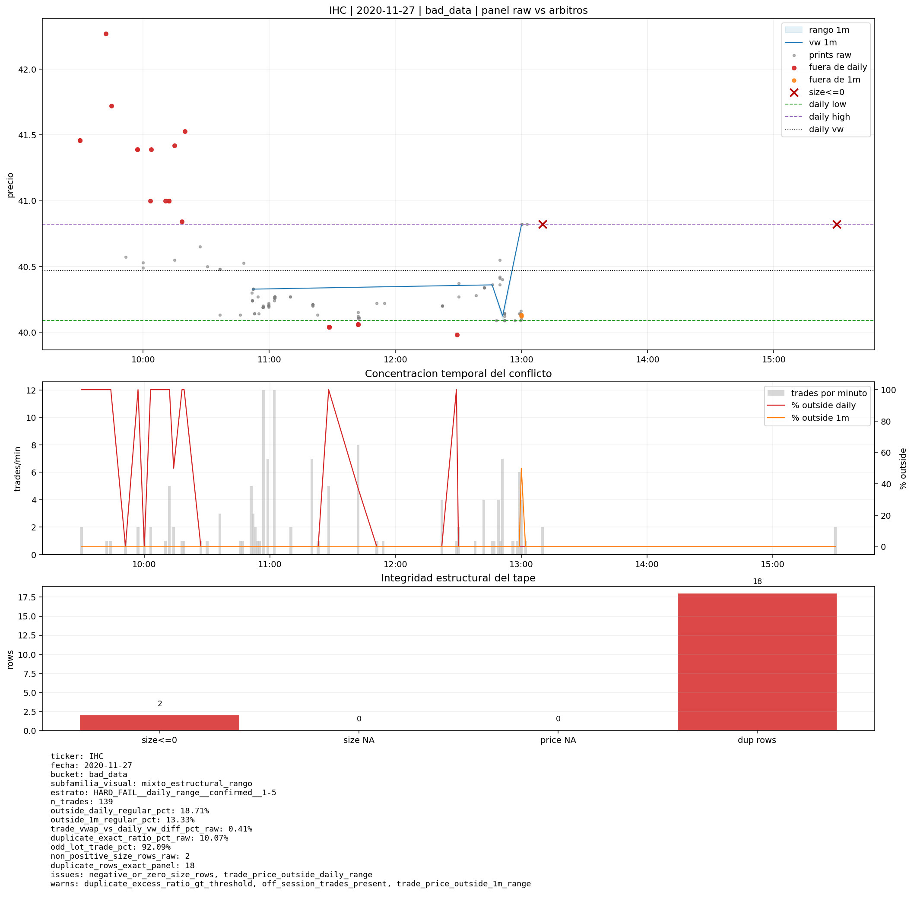

**Que muestra**

- Panel rico del tape raw frente a `daily` y `1m` para `IHC` el `2020-11-27`.
- `n_trades = 139`, `outside_daily_regular_pct = 18.71%`, `outside_1m_regular_pct = 13.33%`.
- `trade_vwap_vs_daily_vw_diff_pct_raw = 0.41%`, `duplicate_exact_ratio_pct_raw = 10.07%`, `odd_lot_trade_pct = 92.09%`.

**Responde**

- Subfamilia mixta donde hay conflicto visual de rango, pero tambien senales de integridad del tape. El rechazo no debe apoyarse en una sola capa de evidencia.
- El caso combina conflicto de rango con senales de integridad del tape.
- La lectura correcta no es elegir una sola causa, sino reconocer que hay dano mixto: lo visual protesta y la estructura interna tambien.
- La clasificacion a `bad_data` se apoya en ambas capas de evidencia y no solo en el porcentaje outside.
- El 92.09% de odd-lots empuja la lectura hacia microestructura fina; evita leer el caso como pura ruptura economica gruesa.
- El 10.07% de duplicacion exacta obliga a sospechar dano de tape o bursts mecanicos, no solo ruido visual.
- La presencia de `negative_or_zero_size_rows` mueve la causalidad desde el precio hacia la integridad estructural del tape.
- La decision que justifica es exclusion de ejecucion simulada, labels y benchmarking; solo queda valor forense.

**No responde**

- No responde a una unica causa limpia; obliga a aceptar que hay mezcla de fenomenos.
- No absuelve el file aunque una de las dos capas parezca mas suave que la otra.

**Consecuencia**

- Excluir el file y tratarlo como rechazo duro, no como caso de reconciliacion fina.
- Mantener el requisito de una segunda imagen de integridad cuando se presente al inspector.

**Filas invalidas exactas (`size <= 0`)**

| ts_ny | price | size | exchange | conditions |
|---|---|---|---|---|
| 2020-11-27 13:10:00.002130 | 40.82 | 0 | 10 | 38, 41 |
| 2020-11-27 15:30:00.001822 | 40.82 | 0 | 10 | 38, 41 |

**Grupos duplicados exactos mas relevantes**

| ts_ny | price | size | count |
|---|---|---|---|
| 2020-11-27 09:30:00.863257 | 41.46 | 58 | 2 |
| 2020-11-27 09:57:09.315526 | 41.39 | 1 | 2 |
| 2020-11-27 10:51:59.335401 | 40.24 | 3 | 2 |
| 2020-11-27 10:57:01.787411 | 40.19 | 3 | 2 |
| 2020-11-27 10:59:43.143195 | 40.2 | 3 | 2 |
| 2020-11-27 11:10:02.757936 | 40.27 | 3 | 2 |
| 2020-11-27 11:42:10.054231 | 40.06 | 3 | 2 |
| 2020-11-27 12:22:16.544771 | 40.2 | 3 | 2 |
| 2020-11-27 12:22:16.544780 | 40.2 | 3 | 2 |

### AIM | 2021-06-24

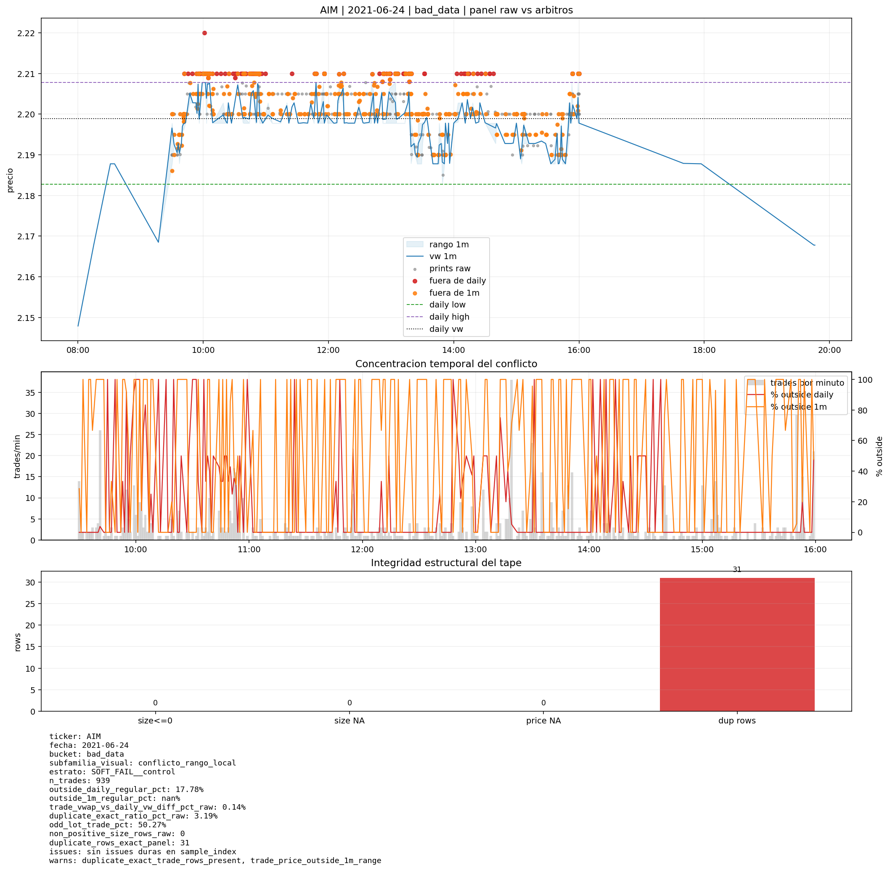

**Que muestra**

- Panel rico del tape raw frente a `daily` y `1m` para `AIM` el `2021-06-24`.
- `n_trades = 939`, `outside_daily_regular_pct = 17.78%`, `outside_1m_regular_pct = nan%`.
- `trade_vwap_vs_daily_vw_diff_pct_raw = 0.14%`, `duplicate_exact_ratio_pct_raw = 3.19%`, `odd_lot_trade_pct = 50.27%`.

**Responde**

- Subfamilia donde el conflicto vive en un subconjunto relevante del rango o del arbitro intraminuto, aunque no haya colapso total de escala.
- El conflicto vive en una franja local del rango o del arbitro intraminuto, sin llegar a colapso total de escala.
- Eso exige leer el panel minuto a minuto y no quedarse solo con la impresion global de la nube de precios.
- La clasificacion a `bad_data` aqui depende de que el file ya no conserve una reconciliacion economica defendible.
- El 50.27% de odd-lots empuja la lectura hacia microestructura fina; evita leer el caso como pura ruptura economica gruesa.
- La decision que justifica es exclusion de ejecucion simulada, labels y benchmarking; solo queda valor forense.

**No responde**

- No responde a colapso total de escala; ese seria otro subtipo.
- No responde por si solo a dano estructural del tape salvo que aparezca en `issues_list` o en el panel de integridad.

**Consecuencia**

- Excluir el file del flujo productivo aunque el dano no sea un colapso absoluto.
- Conservarlo como caso forense de rango local severo.

**Grupos duplicados exactos mas relevantes**

| ts_ny | price | size | count |
|---|---|---|---|
| 2021-06-24 10:02:42.416120 | 2.21 | 100 | 3 |
| 2021-06-24 09:41:11.025683 | 2.2 | 100 | 2 |
| 2021-06-24 09:59:42.368528 | 2.21 | 22 | 2 |
| 2021-06-24 10:02:42.416365 | 2.21 | 100 | 2 |
| 2021-06-24 10:09:35.172292 | 2.2 | 100 | 2 |
| 2021-06-24 10:23:53.779030 | 2.2 | 100 | 2 |
| 2021-06-24 10:39:33.434375 | 2.2 | 100 | 2 |
| 2021-06-24 13:19:18.039542 | 2.2 | 100 | 2 |
| 2021-06-24 13:25:13.694266 | 2.19 | 100 | 2 |
| 2021-06-24 13:35:09.791735 | 2.2 | 100 | 2 |

### ALTS | 2020-06-18

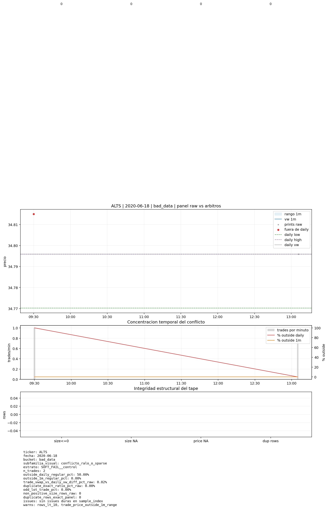

**Que muestra**

- Panel rico del tape raw frente a `daily` y `1m` para `ALTS` el `2020-06-18`.
- `n_trades = 2`, `outside_daily_regular_pct = 50.00%`, `outside_1m_regular_pct = 0.00%`.
- `trade_vwap_vs_daily_vw_diff_pct_raw = 0.02%`, `duplicate_exact_ratio_pct_raw = 0.00%`, `odd_lot_trade_pct = 0.00%`.

**Responde**

- Subfamilia donde el conflicto se apoya en muy pocas filas o en una muestra excesivamente rala. La gravedad no nace solo de la geometria del precio, sino de la imposibilidad de defender el file como tape estable.
- La gravedad nace en parte de la escasez del tape: muy pocas filas pueden romper el rango sin dejar una firma visual espectacular.
- Eso obliga a leer el caso como file poco defendible, no como simple outlier bonito en un tape robusto.
- El panel actual necesita leerse junto a `n_trades`, `rows_lt_10` y la concentracion del conflicto.
- La advertencia `rows_lt_10` limita fuertemente la defensa estadistica del file y endurece la lectura del caso.
- La decision que justifica es exclusion de ejecucion simulada, labels y benchmarking; solo queda valor forense.

**No responde**

- No responde a un patron estable de tape; precisamente el problema es que el file no tiene suficiente densidad para defenderlo.
- No debe leerse como simple ruido puntual en un tape robusto.

**Consecuencia**

- Mantener el file fuera de ejecucion y labels productivos.
- Usarlo solo como evidencia de frontera metodologica o para forense.

### ALTS | 2020-09-22

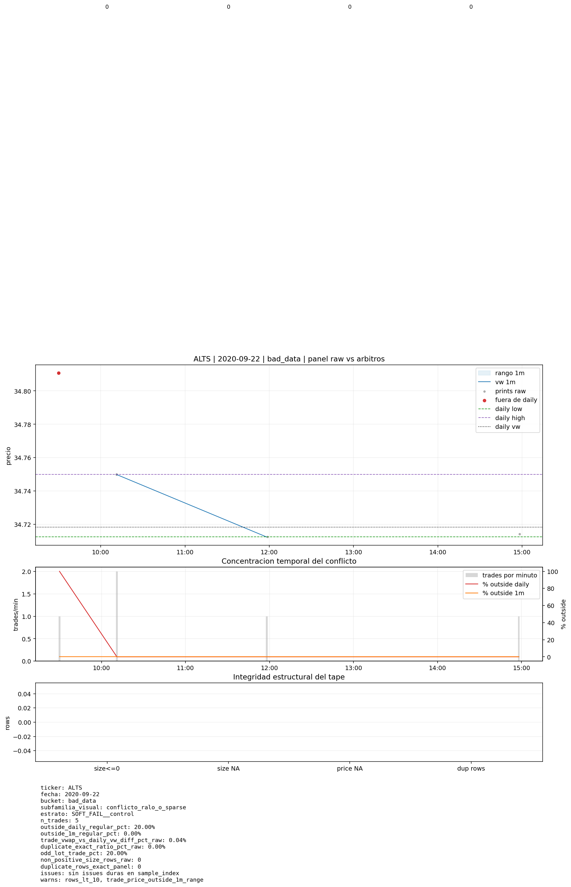

**Que muestra**

- Panel rico del tape raw frente a `daily` y `1m` para `ALTS` el `2020-09-22`.
- `n_trades = 5`, `outside_daily_regular_pct = 20.00%`, `outside_1m_regular_pct = 0.00%`.
- `trade_vwap_vs_daily_vw_diff_pct_raw = 0.04%`, `duplicate_exact_ratio_pct_raw = 0.00%`, `odd_lot_trade_pct = 20.00%`.

**Responde**

- Subfamilia donde el conflicto se apoya en muy pocas filas o en una muestra excesivamente rala. La gravedad no nace solo de la geometria del precio, sino de la imposibilidad de defender el file como tape estable.
- La gravedad nace en parte de la escasez del tape: muy pocas filas pueden romper el rango sin dejar una firma visual espectacular.
- Eso obliga a leer el caso como file poco defendible, no como simple outlier bonito en un tape robusto.
- El panel actual necesita leerse junto a `n_trades`, `rows_lt_10` y la concentracion del conflicto.
- La advertencia `rows_lt_10` limita fuertemente la defensa estadistica del file y endurece la lectura del caso.
- La decision que justifica es exclusion de ejecucion simulada, labels y benchmarking; solo queda valor forense.

**No responde**

- No responde a un patron estable de tape; precisamente el problema es que el file no tiene suficiente densidad para defenderlo.
- No debe leerse como simple ruido puntual en un tape robusto.

**Consecuencia**

- Mantener el file fuera de ejecucion y labels productivos.
- Usarlo solo como evidencia de frontera metodologica o para forense.

### BH.A | 2025-01-15

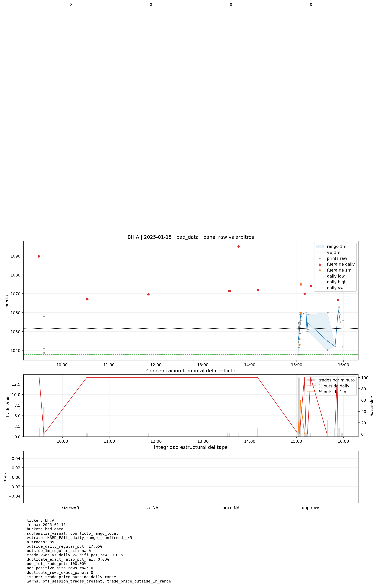

**Que muestra**

- Panel rico del tape raw frente a `daily` y `1m` para `BH.A` el `2025-01-15`.
- `n_trades = 85`, `outside_daily_regular_pct = 17.65%`, `outside_1m_regular_pct = nan%`.
- `trade_vwap_vs_daily_vw_diff_pct_raw = 0.03%`, `duplicate_exact_ratio_pct_raw = 0.00%`, `odd_lot_trade_pct = 100.00%`.

**Responde**

- Subfamilia donde el conflicto vive en un subconjunto relevante del rango o del arbitro intraminuto, aunque no haya colapso total de escala.
- El conflicto vive en una franja local del rango o del arbitro intraminuto, sin llegar a colapso total de escala.
- Eso exige leer el panel minuto a minuto y no quedarse solo con la impresion global de la nube de precios.
- La clasificacion a `bad_data` aqui depende de que el file ya no conserve una reconciliacion economica defendible.
- El 100.00% de odd-lots empuja la lectura hacia microestructura fina; evita leer el caso como pura ruptura economica gruesa.
- La decision que justifica es exclusion de ejecucion simulada, labels y benchmarking; solo queda valor forense.

**No responde**

- No responde a colapso total de escala; ese seria otro subtipo.
- No responde por si solo a dano estructural del tape salvo que aparezca en `issues_list` o en el panel de integridad.

**Consecuencia**

- Excluir el file del flujo productivo aunque el dano no sea un colapso absoluto.
- Conservarlo como caso forense de rango local severo.

### CRSA | 2021-03-16

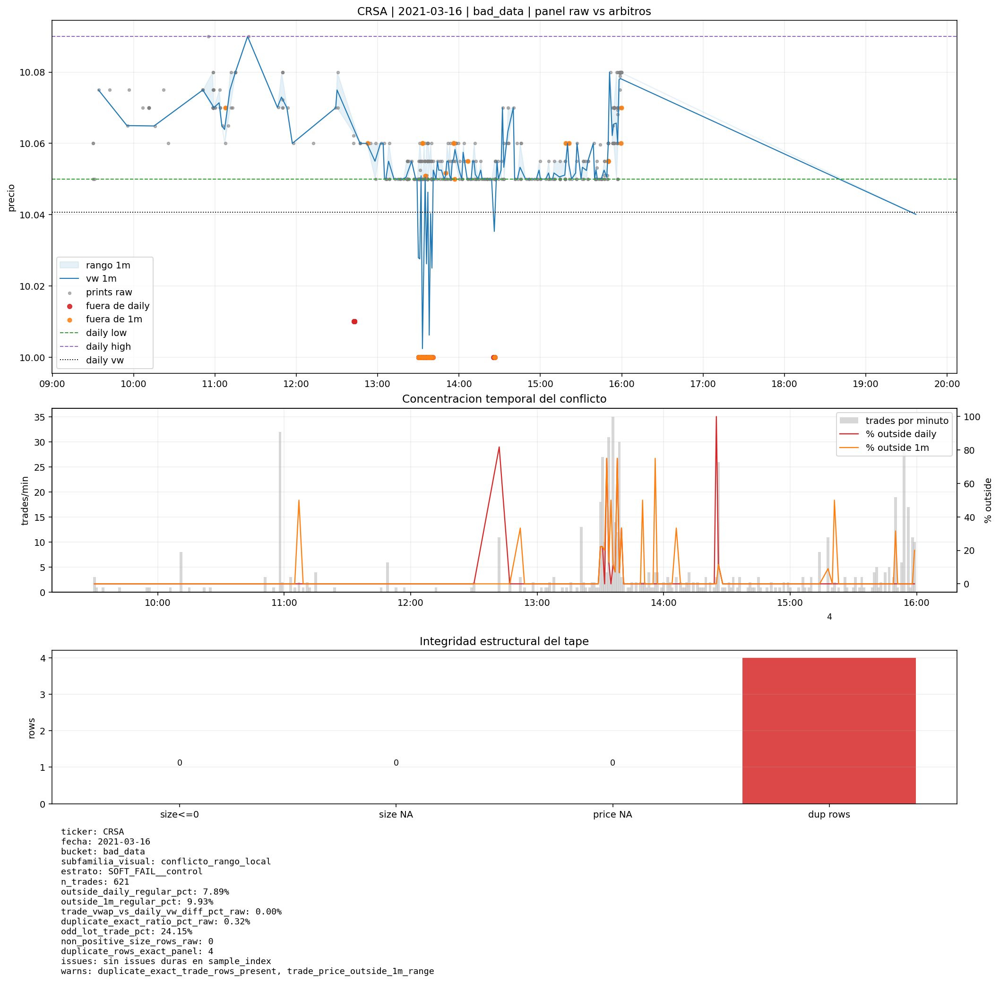

**Que muestra**

- Panel rico del tape raw frente a `daily` y `1m` para `CRSA` el `2021-03-16`.
- `n_trades = 621`, `outside_daily_regular_pct = 7.89%`, `outside_1m_regular_pct = 9.93%`.
- `trade_vwap_vs_daily_vw_diff_pct_raw = 0.00%`, `duplicate_exact_ratio_pct_raw = 0.32%`, `odd_lot_trade_pct = 24.15%`.

**Responde**

- Subfamilia donde el conflicto vive en un subconjunto relevante del rango o del arbitro intraminuto, aunque no haya colapso total de escala.
- El conflicto vive en una franja local del rango o del arbitro intraminuto, sin llegar a colapso total de escala.
- Eso exige leer el panel minuto a minuto y no quedarse solo con la impresion global de la nube de precios.
- La clasificacion a `bad_data` aqui depende de que el file ya no conserve una reconciliacion economica defendible.
- La decision que justifica es exclusion de ejecucion simulada, labels y benchmarking; solo queda valor forense.

**No responde**

- No responde a colapso total de escala; ese seria otro subtipo.
- No responde por si solo a dano estructural del tape salvo que aparezca en `issues_list` o en el panel de integridad.

**Consecuencia**

- Excluir el file del flujo productivo aunque el dano no sea un colapso absoluto.
- Conservarlo como caso forense de rango local severo.

**Grupos duplicados exactos mas relevantes**

| ts_ny | price | size | count |
|---|---|---|---|
| 2021-03-16 10:51:04.615887 | 10.075 | 500 | 2 |
| 2021-03-16 15:14:18.501948 | 10.05 | 100 | 2 |

### GLBL | 2024-11-01

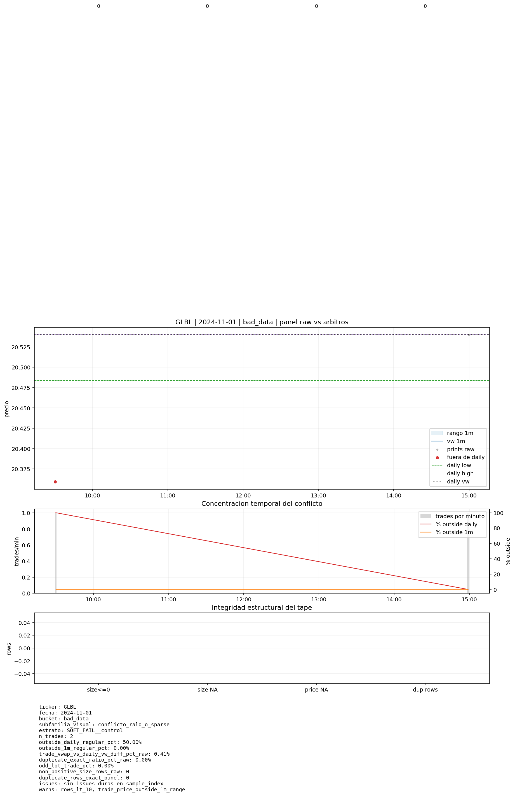

**Que muestra**

- Panel rico del tape raw frente a `daily` y `1m` para `GLBL` el `2024-11-01`.
- `n_trades = 2`, `outside_daily_regular_pct = 50.00%`, `outside_1m_regular_pct = 0.00%`.
- `trade_vwap_vs_daily_vw_diff_pct_raw = 0.41%`, `duplicate_exact_ratio_pct_raw = 0.00%`, `odd_lot_trade_pct = 0.00%`.

**Responde**

- Subfamilia donde el conflicto se apoya en muy pocas filas o en una muestra excesivamente rala. La gravedad no nace solo de la geometria del precio, sino de la imposibilidad de defender el file como tape estable.
- La gravedad nace en parte de la escasez del tape: muy pocas filas pueden romper el rango sin dejar una firma visual espectacular.
- Eso obliga a leer el caso como file poco defendible, no como simple outlier bonito en un tape robusto.
- El panel actual necesita leerse junto a `n_trades`, `rows_lt_10` y la concentracion del conflicto.
- La advertencia `rows_lt_10` limita fuertemente la defensa estadistica del file y endurece la lectura del caso.
- La decision que justifica es exclusion de ejecucion simulada, labels y benchmarking; solo queda valor forense.

**No responde**

- No responde a un patron estable de tape; precisamente el problema es que el file no tiene suficiente densidad para defenderlo.
- No debe leerse como simple ruido puntual en un tape robusto.

**Consecuencia**

- Mantener el file fuera de ejecucion y labels productivos.
- Usarlo solo como evidencia de frontera metodologica o para forense.

### HAIN | 2021-01-14

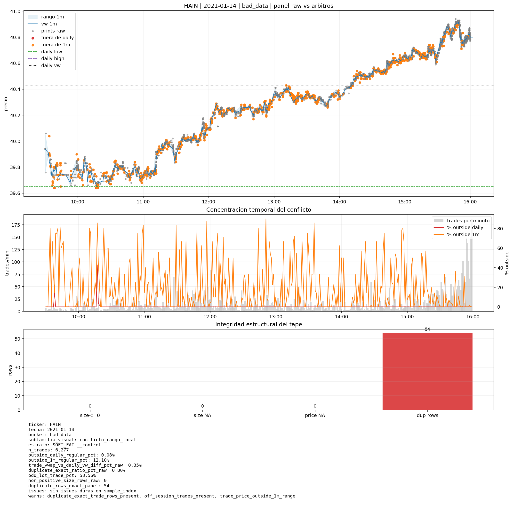

**Que muestra**

- Panel rico del tape raw frente a `daily` y `1m` para `HAIN` el `2021-01-14`.
- `n_trades = 6,277`, `outside_daily_regular_pct = 0.08%`, `outside_1m_regular_pct = 12.10%`.
- `trade_vwap_vs_daily_vw_diff_pct_raw = 0.35%`, `duplicate_exact_ratio_pct_raw = 0.80%`, `odd_lot_trade_pct = 58.56%`.

**Responde**

- Subfamilia donde el conflicto vive en un subconjunto relevante del rango o del arbitro intraminuto, aunque no haya colapso total de escala.
- El conflicto vive en una franja local del rango o del arbitro intraminuto, sin llegar a colapso total de escala.
- Eso exige leer el panel minuto a minuto y no quedarse solo con la impresion global de la nube de precios.
- La clasificacion a `bad_data` aqui depende de que el file ya no conserve una reconciliacion economica defendible.
- El 58.56% de odd-lots empuja la lectura hacia microestructura fina; evita leer el caso como pura ruptura economica gruesa.
- La decision que justifica es exclusion de ejecucion simulada, labels y benchmarking; solo queda valor forense.

**No responde**

- No responde a colapso total de escala; ese seria otro subtipo.
- No responde por si solo a dano estructural del tape salvo que aparezca en `issues_list` o en el panel de integridad.

**Consecuencia**

- Excluir el file del flujo productivo aunque el dano no sea un colapso absoluto.
- Conservarlo como caso forense de rango local severo.

**Grupos duplicados exactos mas relevantes**

| ts_ny | price | size | count |
|---|---|---|---|
| 2021-01-14 12:18:51.620112 | 40.25 | 1 | 3 |
| 2021-01-14 14:19:27.024560 | 40.51 | 2 | 3 |
| 2021-01-14 09:35:12.191683 | 39.86 | 200 | 2 |
| 2021-01-14 10:06:16.914523 | 39.87 | 100 | 2 |
| 2021-01-14 11:47:56.311106 | 40.01 | 100 | 2 |
| 2021-01-14 11:49:05.200285 | 40.0 | 100 | 2 |
| 2021-01-14 11:49:05.200295 | 40.0 | 100 | 2 |
| 2021-01-14 11:51:08.037089 | 40.0 | 100 | 2 |
| 2021-01-14 12:01:40.223643 | 40.1 | 1 | 2 |
| 2021-01-14 12:23:08.816968 | 40.26 | 1 | 2 |

### IQST | 2025-08-29

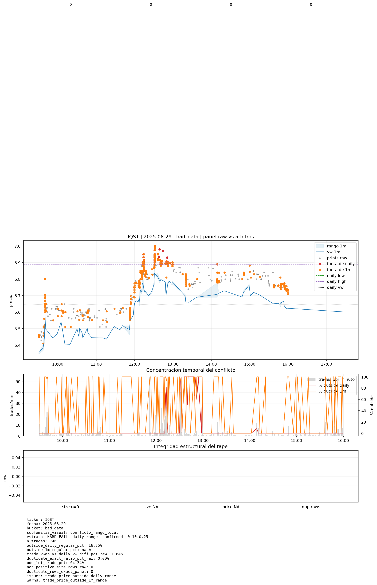

**Que muestra**

- Panel rico del tape raw frente a `daily` y `1m` para `IQST` el `2025-08-29`.
- `n_trades = 746`, `outside_daily_regular_pct = 16.35%`, `outside_1m_regular_pct = nan%`.
- `trade_vwap_vs_daily_vw_diff_pct_raw = 1.64%`, `duplicate_exact_ratio_pct_raw = 0.00%`, `odd_lot_trade_pct = 64.34%`.

**Responde**

- Subfamilia donde el conflicto vive en un subconjunto relevante del rango o del arbitro intraminuto, aunque no haya colapso total de escala.
- El conflicto vive en una franja local del rango o del arbitro intraminuto, sin llegar a colapso total de escala.
- Eso exige leer el panel minuto a minuto y no quedarse solo con la impresion global de la nube de precios.
- La clasificacion a `bad_data` aqui depende de que el file ya no conserve una reconciliacion economica defendible.
- El 64.34% de odd-lots empuja la lectura hacia microestructura fina; evita leer el caso como pura ruptura economica gruesa.
- La decision que justifica es exclusion de ejecucion simulada, labels y benchmarking; solo queda valor forense.

**No responde**

- No responde a colapso total de escala; ese seria otro subtipo.
- No responde por si solo a dano estructural del tape salvo que aparezca en `issues_list` o en el panel de integridad.

**Consecuencia**

- Excluir el file del flujo productivo aunque el dano no sea un colapso absoluto.
- Conservarlo como caso forense de rango local severo.

### LENS | 2025-06-12

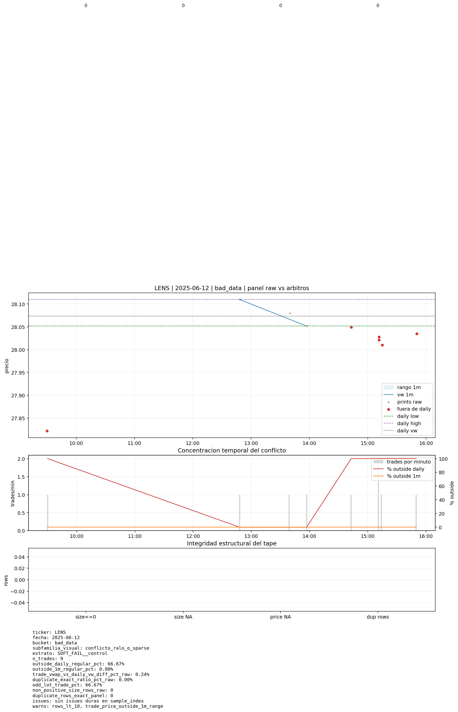

**Que muestra**

- Panel rico del tape raw frente a `daily` y `1m` para `LENS` el `2025-06-12`.
- `n_trades = 9`, `outside_daily_regular_pct = 66.67%`, `outside_1m_regular_pct = 0.00%`.
- `trade_vwap_vs_daily_vw_diff_pct_raw = 0.24%`, `duplicate_exact_ratio_pct_raw = 0.00%`, `odd_lot_trade_pct = 66.67%`.

**Responde**

- Subfamilia donde el conflicto se apoya en muy pocas filas o en una muestra excesivamente rala. La gravedad no nace solo de la geometria del precio, sino de la imposibilidad de defender el file como tape estable.
- La gravedad nace en parte de la escasez del tape: muy pocas filas pueden romper el rango sin dejar una firma visual espectacular.
- Eso obliga a leer el caso como file poco defendible, no como simple outlier bonito en un tape robusto.
- El panel actual necesita leerse junto a `n_trades`, `rows_lt_10` y la concentracion del conflicto.
- El 66.67% de odd-lots empuja la lectura hacia microestructura fina; evita leer el caso como pura ruptura economica gruesa.
- La advertencia `rows_lt_10` limita fuertemente la defensa estadistica del file y endurece la lectura del caso.
- La decision que justifica es exclusion de ejecucion simulada, labels y benchmarking; solo queda valor forense.

**No responde**

- No responde a un patron estable de tape; precisamente el problema es que el file no tiene suficiente densidad para defenderlo.
- No debe leerse como simple ruido puntual en un tape robusto.

**Consecuencia**

- Mantener el file fuera de ejecucion y labels productivos.
- Usarlo solo como evidencia de frontera metodologica o para forense.

### LENS | 2025-12-12

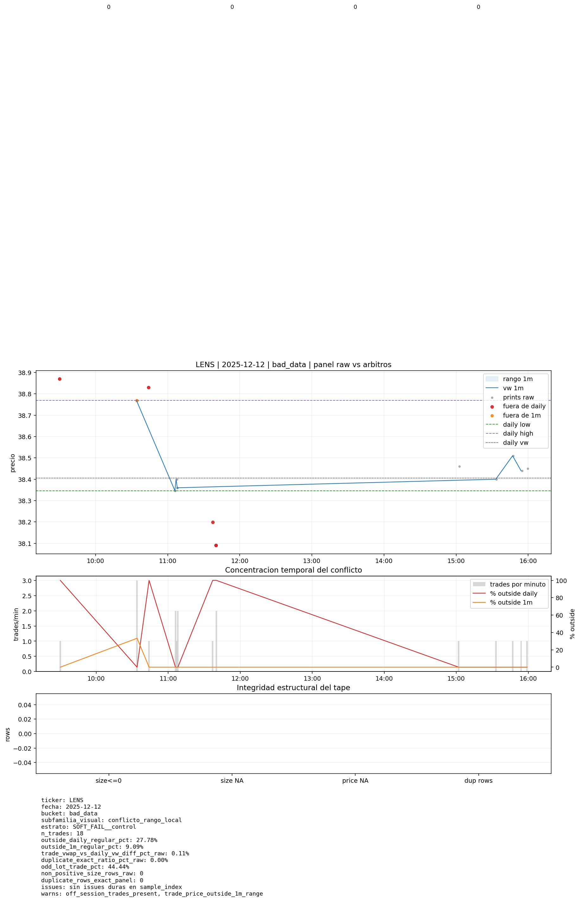

**Que muestra**

- Panel rico del tape raw frente a `daily` y `1m` para `LENS` el `2025-12-12`.
- `n_trades = 18`, `outside_daily_regular_pct = 27.78%`, `outside_1m_regular_pct = 9.09%`.
- `trade_vwap_vs_daily_vw_diff_pct_raw = 0.11%`, `duplicate_exact_ratio_pct_raw = 0.00%`, `odd_lot_trade_pct = 44.44%`.

**Responde**

- Subfamilia donde el conflicto vive en un subconjunto relevante del rango o del arbitro intraminuto, aunque no haya colapso total de escala.
- El conflicto vive en una franja local del rango o del arbitro intraminuto, sin llegar a colapso total de escala.
- Eso exige leer el panel minuto a minuto y no quedarse solo con la impresion global de la nube de precios.
- La clasificacion a `bad_data` aqui depende de que el file ya no conserve una reconciliacion economica defendible.
- El 44.44% de odd-lots empuja la lectura hacia microestructura fina; evita leer el caso como pura ruptura economica gruesa.
- La decision que justifica es exclusion de ejecucion simulada, labels y benchmarking; solo queda valor forense.

**No responde**

- No responde a colapso total de escala; ese seria otro subtipo.
- No responde por si solo a dano estructural del tape salvo que aparezca en `issues_list` o en el panel de integridad.

**Consecuencia**

- Excluir el file del flujo productivo aunque el dano no sea un colapso absoluto.
- Conservarlo como caso forense de rango local severo.

### NEWTI | 2019-01-03

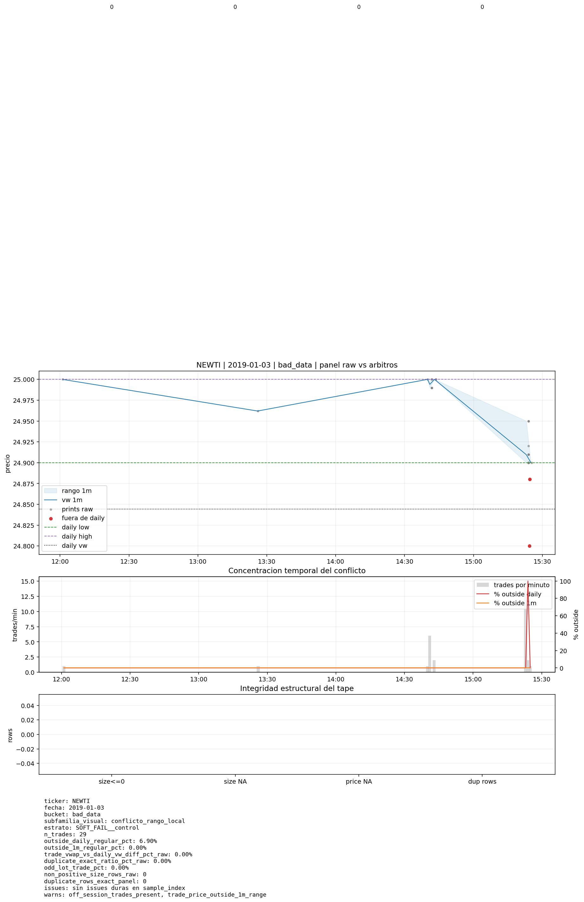

**Que muestra**

- Panel rico del tape raw frente a `daily` y `1m` para `NEWTI` el `2019-01-03`.
- `n_trades = 29`, `outside_daily_regular_pct = 6.90%`, `outside_1m_regular_pct = 0.00%`.
- `trade_vwap_vs_daily_vw_diff_pct_raw = 0.00%`, `duplicate_exact_ratio_pct_raw = 0.00%`, `odd_lot_trade_pct = 0.00%`.

**Responde**

- Subfamilia donde el conflicto vive en un subconjunto relevante del rango o del arbitro intraminuto, aunque no haya colapso total de escala.
- El conflicto vive en una franja local del rango o del arbitro intraminuto, sin llegar a colapso total de escala.
- Eso exige leer el panel minuto a minuto y no quedarse solo con la impresion global de la nube de precios.
- La clasificacion a `bad_data` aqui depende de que el file ya no conserve una reconciliacion economica defendible.
- La decision que justifica es exclusion de ejecucion simulada, labels y benchmarking; solo queda valor forense.

**No responde**

- No responde a colapso total de escala; ese seria otro subtipo.
- No responde por si solo a dano estructural del tape salvo que aparezca en `issues_list` o en el panel de integridad.

**Consecuencia**

- Excluir el file del flujo productivo aunque el dano no sea un colapso absoluto.
- Conservarlo como caso forense de rango local severo.

### SFE | 2023-03-01

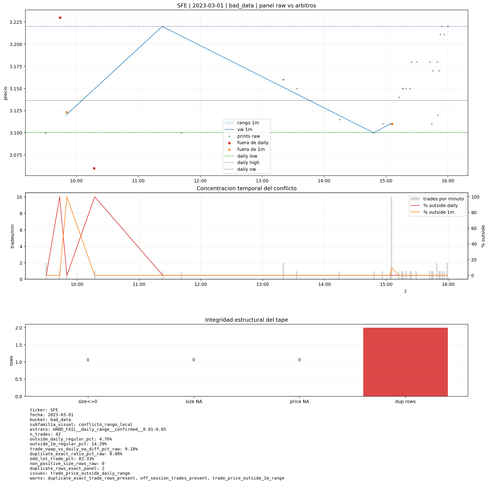

**Que muestra**

- Panel rico del tape raw frente a `daily` y `1m` para `SFE` el `2023-03-01`.
- `n_trades = 42`, `outside_daily_regular_pct = 4.76%`, `outside_1m_regular_pct = 14.29%`.
- `trade_vwap_vs_daily_vw_diff_pct_raw = 0.18%`, `duplicate_exact_ratio_pct_raw = 0.00%`, `odd_lot_trade_pct = 83.33%`.

**Responde**

- Subfamilia donde el conflicto vive en un subconjunto relevante del rango o del arbitro intraminuto, aunque no haya colapso total de escala.
- El conflicto vive en una franja local del rango o del arbitro intraminuto, sin llegar a colapso total de escala.
- Eso exige leer el panel minuto a minuto y no quedarse solo con la impresion global de la nube de precios.
- La clasificacion a `bad_data` aqui depende de que el file ya no conserve una reconciliacion economica defendible.
- El 83.33% de odd-lots empuja la lectura hacia microestructura fina; evita leer el caso como pura ruptura economica gruesa.
- La decision que justifica es exclusion de ejecucion simulada, labels y benchmarking; solo queda valor forense.

**No responde**

- No responde a colapso total de escala; ese seria otro subtipo.
- No responde por si solo a dano estructural del tape salvo que aparezca en `issues_list` o en el panel de integridad.

**Consecuencia**

- Excluir el file del flujo productivo aunque el dano no sea un colapso absoluto.
- Conservarlo como caso forense de rango local severo.

**Grupos duplicados exactos mas relevantes**

| ts_ny | price | size | count |
|---|---|---|---|
| 2023-03-01 15:05:59.918500 | 3.11 | 8 | 2 |

### AIM | 2023-10-16

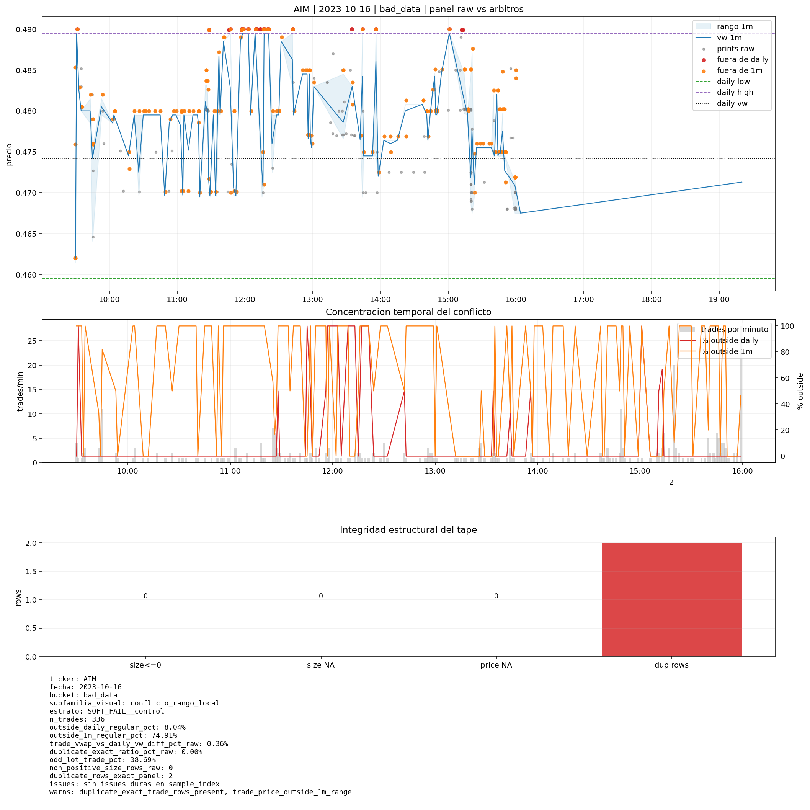

**Que muestra**

- Panel rico del tape raw frente a `daily` y `1m` para `AIM` el `2023-10-16`.
- `n_trades = 336`, `outside_daily_regular_pct = 8.04%`, `outside_1m_regular_pct = 74.91%`.
- `trade_vwap_vs_daily_vw_diff_pct_raw = 0.36%`, `duplicate_exact_ratio_pct_raw = 0.00%`, `odd_lot_trade_pct = 38.69%`.

**Responde**

- Subfamilia donde el conflicto vive en un subconjunto relevante del rango o del arbitro intraminuto, aunque no haya colapso total de escala.
- El conflicto vive en una franja local del rango o del arbitro intraminuto, sin llegar a colapso total de escala.
- Eso exige leer el panel minuto a minuto y no quedarse solo con la impresion global de la nube de precios.
- La clasificacion a `bad_data` aqui depende de que el file ya no conserve una reconciliacion economica defendible.
- El 38.69% de odd-lots empuja la lectura hacia microestructura fina; evita leer el caso como pura ruptura economica gruesa.
- La decision que justifica es exclusion de ejecucion simulada, labels y benchmarking; solo queda valor forense.

**No responde**

- No responde a colapso total de escala; ese seria otro subtipo.
- No responde por si solo a dano estructural del tape salvo que aparezca en `issues_list` o en el panel de integridad.

**Consecuencia**

- Excluir el file del flujo productivo aunque el dano no sea un colapso absoluto.
- Conservarlo como caso forense de rango local severo.

**Grupos duplicados exactos mas relevantes**

| ts_ny | price | size | count |
|---|---|---|---|
| 2023-10-16 09:30:00.094903 | 0.462 | 1661 | 2 |

### METC | 2020-05-26

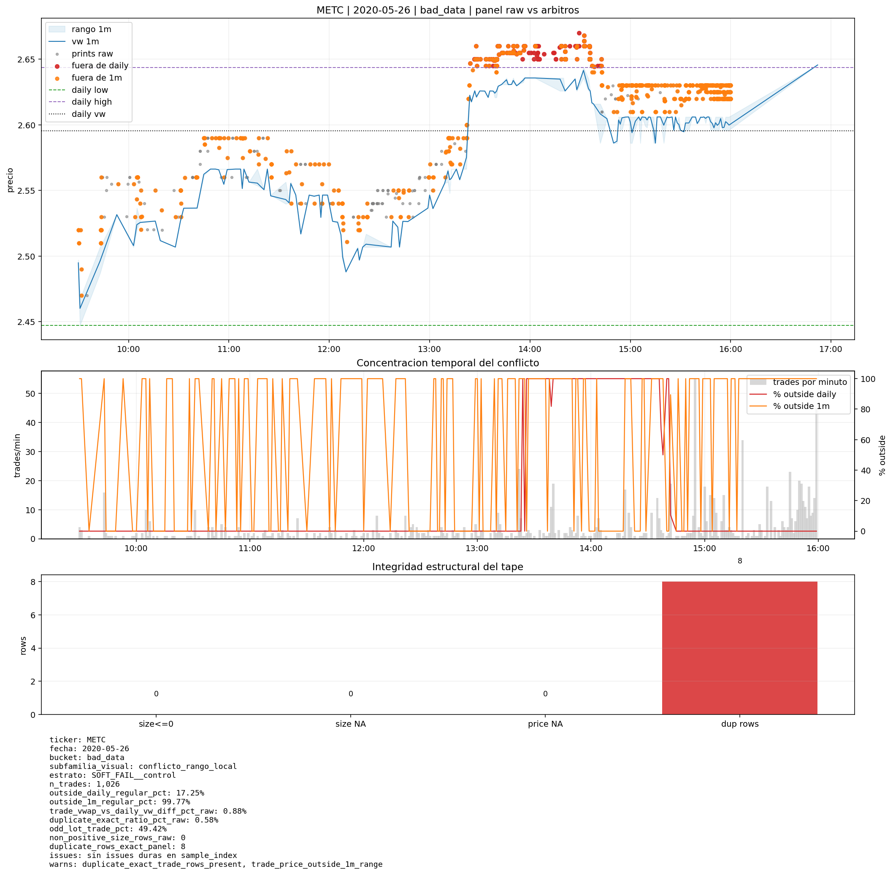

**Que muestra**

- Panel rico del tape raw frente a `daily` y `1m` para `METC` el `2020-05-26`.
- `n_trades = 1,026`, `outside_daily_regular_pct = 17.25%`, `outside_1m_regular_pct = 99.77%`.
- `trade_vwap_vs_daily_vw_diff_pct_raw = 0.88%`, `duplicate_exact_ratio_pct_raw = 0.58%`, `odd_lot_trade_pct = 49.42%`.

**Responde**

- Subfamilia donde el conflicto vive en un subconjunto relevante del rango o del arbitro intraminuto, aunque no haya colapso total de escala.
- El conflicto vive en una franja local del rango o del arbitro intraminuto, sin llegar a colapso total de escala.
- Eso exige leer el panel minuto a minuto y no quedarse solo con la impresion global de la nube de precios.
- La clasificacion a `bad_data` aqui depende de que el file ya no conserve una reconciliacion economica defendible.
- El 49.42% de odd-lots empuja la lectura hacia microestructura fina; evita leer el caso como pura ruptura economica gruesa.
- La decision que justifica es exclusion de ejecucion simulada, labels y benchmarking; solo queda valor forense.

**No responde**

- No responde a colapso total de escala; ese seria otro subtipo.
- No responde por si solo a dano estructural del tape salvo que aparezca en `issues_list` o en el panel de integridad.

**Consecuencia**

- Excluir el file del flujo productivo aunque el dano no sea un colapso absoluto.
- Conservarlo como caso forense de rango local severo.

**Grupos duplicados exactos mas relevantes**

| ts_ny | price | size | count |
|---|---|---|---|
| 2020-05-26 10:07:33.129514 | 2.53 | 3 | 2 |
| 2020-05-26 13:22:15.309343 | 2.6 | 100 | 2 |
| 2020-05-26 14:35:39.968893 | 2.65 | 100 | 2 |
| 2020-05-26 14:42:57.515493 | 2.64 | 100 | 2 |

### QRTEA | 2019-11-08

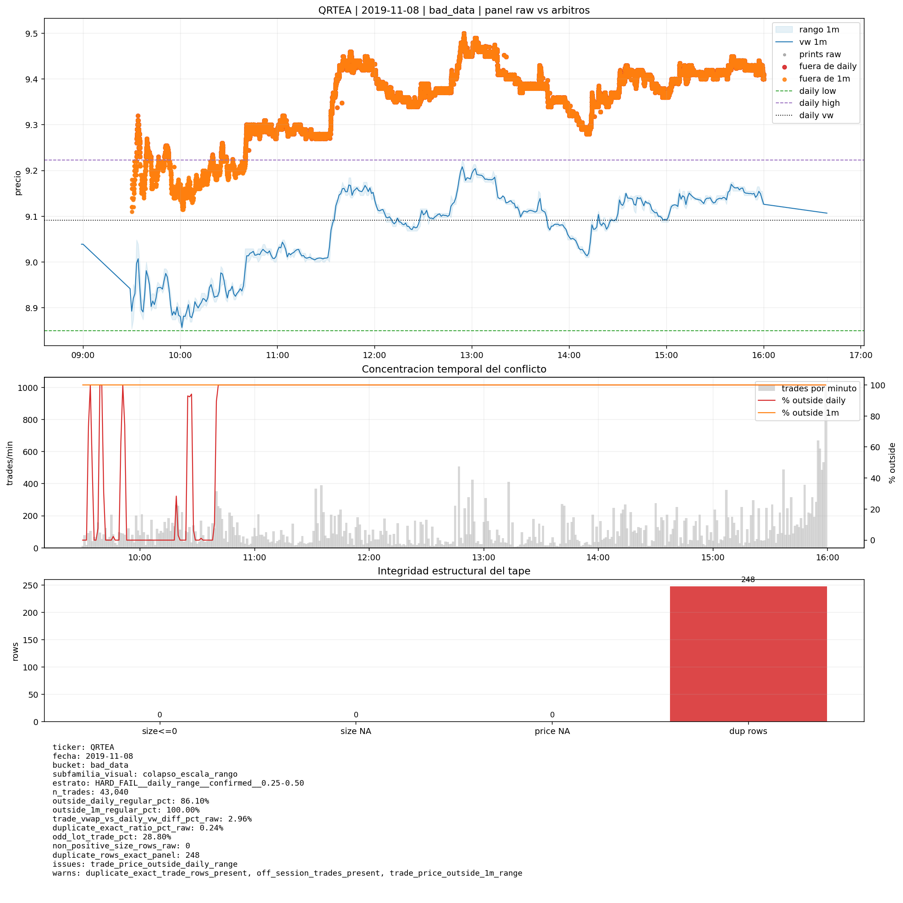

**Que muestra**

- Panel rico del tape raw frente a `daily` y `1m` para `QRTEA` el `2019-11-08`.
- `n_trades = 43,040`, `outside_daily_regular_pct = 86.10%`, `outside_1m_regular_pct = 100.00%`.
- `trade_vwap_vs_daily_vw_diff_pct_raw = 2.96%`, `duplicate_exact_ratio_pct_raw = 0.24%`, `odd_lot_trade_pct = 28.80%`.

**Responde**

- Subfamilia donde el panel de precio ya demuestra por si mismo una ruptura semantica: tape y arbitros viven en escalas incompatibles o el porcentaje fuera de rango es practicamente total.
- El fallo se ve de forma directa en el panel de precio: el tape y los arbitros no conviven en una misma geometria defendible.
- La lectura correcta exige mirar la separacion vertical entre prints y arbitros y el hecho de que el conflicto de rango sea practicamente total.
- Aqui el panel actual si responde bien a por que el file cae en `bad_data`.
- El 28.80% de odd-lots empuja la lectura hacia microestructura fina; evita leer el caso como pura ruptura economica gruesa.
- La decision que justifica es exclusion de ejecucion simulada, labels y benchmarking; solo queda valor forense.

**No responde**

- No responde a si la duplicacion es la causa principal del rechazo; puede empeorar el caso, pero no explica por si sola la geometria rota.
- No responde a si existiria una reconciliacion de escala defendible; el colapso ya es demasiado extremo para tratarlo como simple normalizacion.

**Consecuencia**

- Excluir de ejecucion simulada, labels y benchmarking.
- Conservar solo valor forense o de deteccion de dano severo.

**Grupos duplicados exactos mas relevantes**

| ts_ny | price | size | count |
|---|---|---|---|
| 2019-11-08 15:56:54.846343 | 9.42 | 100 | 4 |
| 2019-11-08 10:41:12.007301 | 9.2715 | 100 | 3 |
| 2019-11-08 15:56:54.846312 | 9.42 | 200 | 3 |
| 2019-11-08 09:39:55.508632 | 9.25 | 100 | 2 |
| 2019-11-08 10:01:49.928360 | 9.12 | 100 | 2 |
| 2019-11-08 10:10:15.513113 | 9.18 | 100 | 2 |
| 2019-11-08 10:19:54.882109 | 9.23 | 100 | 2 |
| 2019-11-08 10:20:29.577793 | 9.22 | 100 | 2 |
| 2019-11-08 10:20:30.981965 | 9.21 | 100 | 2 |
| 2019-11-08 10:21:46.086267 | 9.19 | 100 | 2 |

### RELV | 2019-12-26

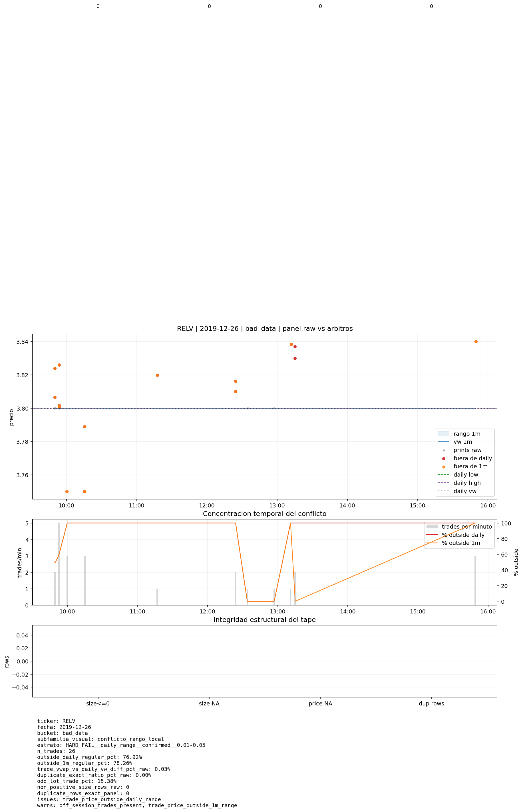

**Que muestra**

- Panel rico del tape raw frente a `daily` y `1m` para `RELV` el `2019-12-26`.
- `n_trades = 26`, `outside_daily_regular_pct = 76.92%`, `outside_1m_regular_pct = 78.26%`.
- `trade_vwap_vs_daily_vw_diff_pct_raw = 0.03%`, `duplicate_exact_ratio_pct_raw = 0.00%`, `odd_lot_trade_pct = 15.38%`.

**Responde**

- Subfamilia donde el conflicto vive en un subconjunto relevante del rango o del arbitro intraminuto, aunque no haya colapso total de escala.
- El conflicto vive en una franja local del rango o del arbitro intraminuto, sin llegar a colapso total de escala.
- Eso exige leer el panel minuto a minuto y no quedarse solo con la impresion global de la nube de precios.
- La clasificacion a `bad_data` aqui depende de que el file ya no conserve una reconciliacion economica defendible.
- La decision que justifica es exclusion de ejecucion simulada, labels y benchmarking; solo queda valor forense.

**No responde**

- No responde a colapso total de escala; ese seria otro subtipo.
- No responde por si solo a dano estructural del tape salvo que aparezca en `issues_list` o en el panel de integridad.

**Consecuencia**

- Excluir el file del flujo productivo aunque el dano no sea un colapso absoluto.
- Conservarlo como caso forense de rango local severo.

### TTSH | 2021-11-18

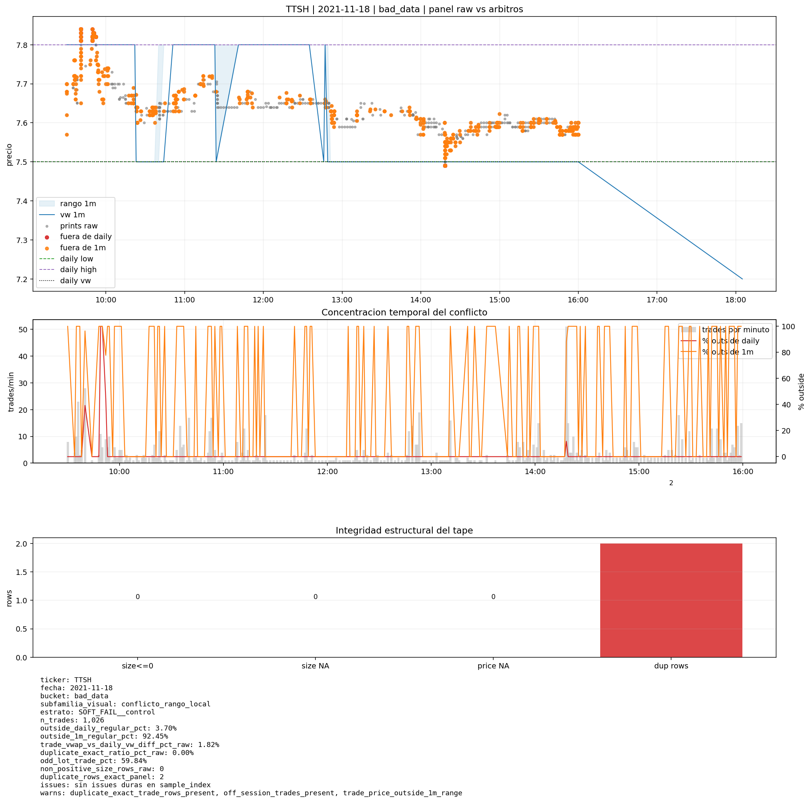

**Que muestra**

- Panel rico del tape raw frente a `daily` y `1m` para `TTSH` el `2021-11-18`.
- `n_trades = 1,026`, `outside_daily_regular_pct = 3.70%`, `outside_1m_regular_pct = 92.45%`.
- `trade_vwap_vs_daily_vw_diff_pct_raw = 1.82%`, `duplicate_exact_ratio_pct_raw = 0.00%`, `odd_lot_trade_pct = 59.84%`.

**Responde**

- Subfamilia donde el conflicto vive en un subconjunto relevante del rango o del arbitro intraminuto, aunque no haya colapso total de escala.
- El conflicto vive en una franja local del rango o del arbitro intraminuto, sin llegar a colapso total de escala.
- Eso exige leer el panel minuto a minuto y no quedarse solo con la impresion global de la nube de precios.
- La clasificacion a `bad_data` aqui depende de que el file ya no conserve una reconciliacion economica defendible.
- El 59.84% de odd-lots empuja la lectura hacia microestructura fina; evita leer el caso como pura ruptura economica gruesa.
- La decision que justifica es exclusion de ejecucion simulada, labels y benchmarking; solo queda valor forense.

**No responde**

- No responde a colapso total de escala; ese seria otro subtipo.
- No responde por si solo a dano estructural del tape salvo que aparezca en `issues_list` o en el panel de integridad.

**Consecuencia**

- Excluir el file del flujo productivo aunque el dano no sea un colapso absoluto.
- Conservarlo como caso forense de rango local severo.

**Grupos duplicados exactos mas relevantes**

| ts_ny | price | size | count |
|---|---|---|---|
| 2021-11-18 09:40:55.377422 | 7.82 | 200 | 2 |

### NCL | 2023-12-19

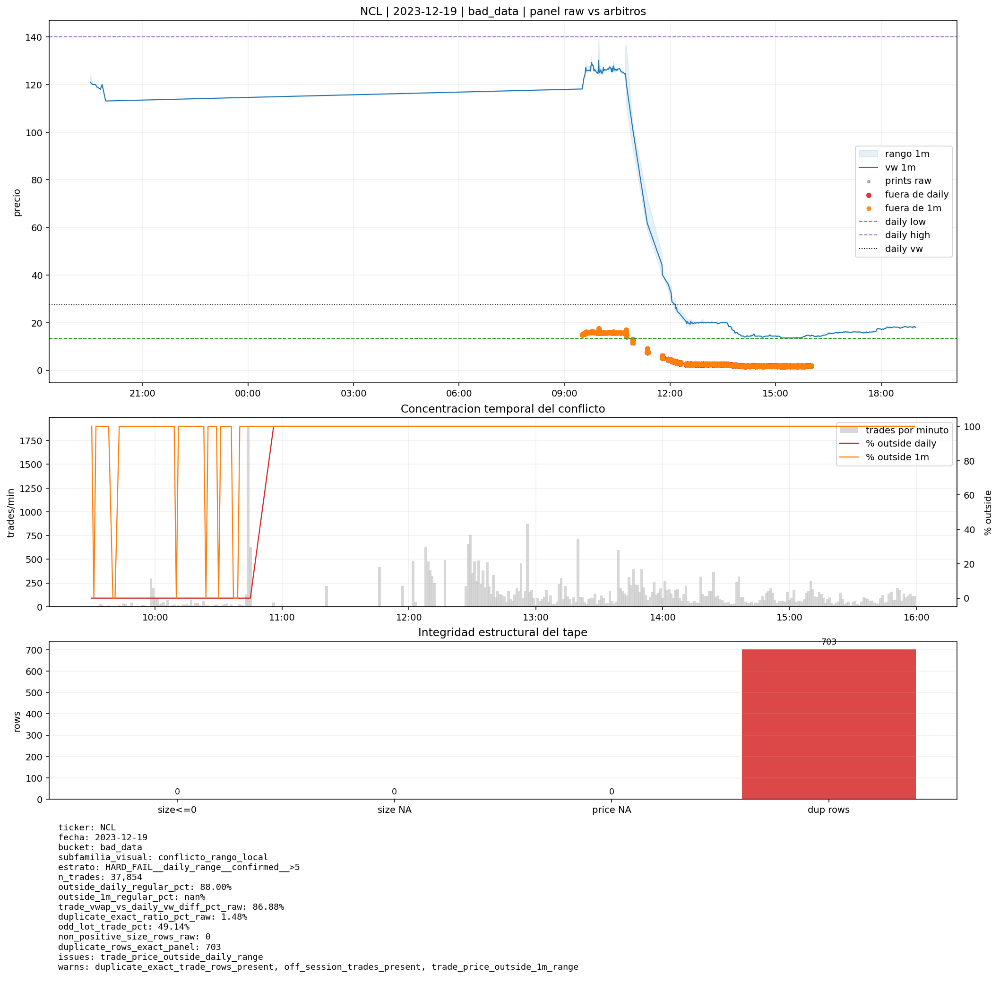

**Que muestra**

- Panel rico del tape raw frente a `daily` y `1m` para `NCL` el `2023-12-19`.
- `n_trades = 37,854`, `outside_daily_regular_pct = 88.00%`, `outside_1m_regular_pct = nan%`.
- `trade_vwap_vs_daily_vw_diff_pct_raw = 86.88%`, `duplicate_exact_ratio_pct_raw = 1.48%`, `odd_lot_trade_pct = 49.14%`.

**Responde**

- Subfamilia donde el conflicto vive en un subconjunto relevante del rango o del arbitro intraminuto, aunque no haya colapso total de escala.
- El conflicto vive en una franja local del rango o del arbitro intraminuto, sin llegar a colapso total de escala.
- Eso exige leer el panel minuto a minuto y no quedarse solo con la impresion global de la nube de precios.
- La clasificacion a `bad_data` aqui depende de que el file ya no conserve una reconciliacion economica defendible.
- El 49.14% de odd-lots empuja la lectura hacia microestructura fina; evita leer el caso como pura ruptura economica gruesa.
- La decision que justifica es exclusion de ejecucion simulada, labels y benchmarking; solo queda valor forense.

**No responde**

- No responde a colapso total de escala; ese seria otro subtipo.
- No responde por si solo a dano estructural del tape salvo que aparezca en `issues_list` o en el panel de integridad.

**Consecuencia**

- Excluir el file del flujo productivo aunque el dano no sea un colapso absoluto.
- Conservarlo como caso forense de rango local severo.

**Grupos duplicados exactos mas relevantes**

| ts_ny | price | size | count |
|---|---|---|---|
| 2023-12-19 10:44:33.369312 | 15.5 | 100 | 9 |
| 2023-12-19 10:44:33.369209 | 15.5 | 100 | 8 |
| 2023-12-19 10:44:33.369216 | 15.5 | 100 | 5 |
| 2023-12-19 10:44:33.369288 | 15.5 | 100 | 4 |
| 2023-12-19 10:44:33.382113 | 15.5 | 100 | 4 |
| 2023-12-19 10:44:33.332393 | 15.5 | 100 | 3 |
| 2023-12-19 10:44:33.343694 | 15.5 | 100 | 3 |
| 2023-12-19 10:44:33.369294 | 15.5 | 100 | 3 |
| 2023-12-19 10:44:33.369318 | 15.5 | 100 | 3 |
| 2023-12-19 10:44:33.369321 | 15.5 | 100 | 3 |

### DTCK | 2026-02-19

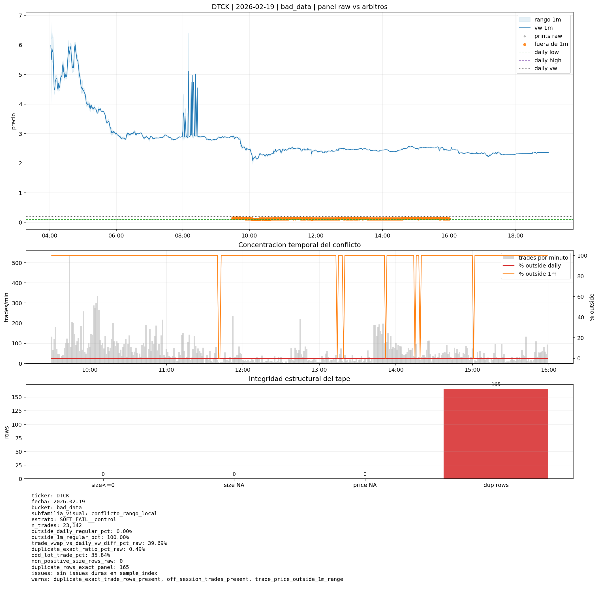

**Que muestra**

- Panel rico del tape raw frente a `daily` y `1m` para `DTCK` el `2026-02-19`.
- `n_trades = 23,142`, `outside_daily_regular_pct = 0.00%`, `outside_1m_regular_pct = 100.00%`.
- `trade_vwap_vs_daily_vw_diff_pct_raw = 39.69%`, `duplicate_exact_ratio_pct_raw = 0.49%`, `odd_lot_trade_pct = 35.84%`.

**Responde**

- Subfamilia donde el conflicto vive en un subconjunto relevante del rango o del arbitro intraminuto, aunque no haya colapso total de escala.
- El conflicto vive en una franja local del rango o del arbitro intraminuto, sin llegar a colapso total de escala.
- Eso exige leer el panel minuto a minuto y no quedarse solo con la impresion global de la nube de precios.
- La clasificacion a `bad_data` aqui depende de que el file ya no conserve una reconciliacion economica defendible.
- El 35.84% de odd-lots empuja la lectura hacia microestructura fina; evita leer el caso como pura ruptura economica gruesa.
- La decision que justifica es exclusion de ejecucion simulada, labels y benchmarking; solo queda valor forense.

**No responde**

- No responde a colapso total de escala; ese seria otro subtipo.
- No responde por si solo a dano estructural del tape salvo que aparezca en `issues_list` o en el panel de integridad.

**Consecuencia**

- Excluir el file del flujo productivo aunque el dano no sea un colapso absoluto.
- Conservarlo como caso forense de rango local severo.

**Grupos duplicados exactos mas relevantes**

| ts_ny | price | size | count |
|---|---|---|---|
| 2026-02-19 10:03:48.477491 | 0.1171 | 200 | 4 |
| 2026-02-19 10:06:09.861274 | 0.1 | 1 | 3 |
| 2026-02-19 11:00:20.272326 | 0.1239 | 200 | 3 |
| 2026-02-19 12:42:19.948422 | 0.126 | 500 | 3 |
| 2026-02-19 09:30:29.376417 | 0.1449 | 250 | 2 |
| 2026-02-19 09:41:47.920393 | 0.1403 | 200 | 2 |
| 2026-02-19 09:42:03.472759 | 0.1402 | 120 | 2 |
| 2026-02-19 09:44:39.064378 | 0.1321 | 2000 | 2 |
| 2026-02-19 09:44:39.084324 | 0.1314 | 75 | 2 |
| 2026-02-19 09:44:39.086781 | 0.1311 | 75 | 2 |

