# Trades Good | enumeracion completa

## Rol

Este dossier documenta `106` casos de la muestra base del cierre real `57f/full_clean_fast_same_schema` para la familia `good`.

No son ejemplos elegidos a dedo. Proceden del manifest estratificado reproducible materializado para el inspector.

## Que significa esta familia

Cola pristine donde `trades`, `daily` y `1m` alinean con limpieza. Responde a la pregunta de como luce una firma casi impecable del tape.

## Responde

- como luce una firma realmente limpia del tape
- que patron sirve como referencia de alineacion casi impecable

## No responde

- cuanta masa util tiene todo el bloque
- si todo lo no-good es inservible

## Consecuencia

- fijar el patron pristine sin sobrerrepresentarlo
- evitar leer `good` como proxy de utilidad total

## Casos

### BH | 2010-11-22

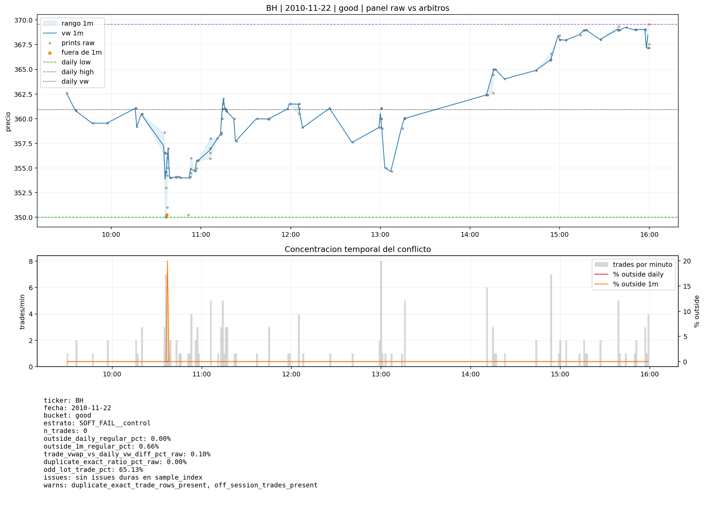

**Que muestra**

- Panel rico del tape raw frente a `daily` y `1m` para `BH` el `2010-11-22`.
- `n_trades = 152`, `outside_daily_regular_pct = 0.00%`, `outside_1m_regular_pct = 0.66%`.
- `trade_vwap_vs_daily_vw_diff_pct_raw = 0.10%`, `duplicate_exact_ratio_pct_raw = 0.00%`, `odd_lot_trade_pct = 65.13%`.

**Responde**

- Cola pristine donde `trades`, `daily` y `1m` alinean con limpieza. Responde a la pregunta de como luce una firma casi impecable del tape.
- Responde a si el conflicto dominante vive en la escala (`~1x`), en la comparabilidad frente a `daily` (0.00%) o frente a `1m` (0.66%).
- El 65.13% de odd-lots empuja la lectura hacia microestructura fina; evita leer el caso como pura ruptura economica gruesa.
- La decision que justifica es que el file puede usarse como patron de tape limpio, no como medida de masa util del bloque.

### BH | 2011-04-29

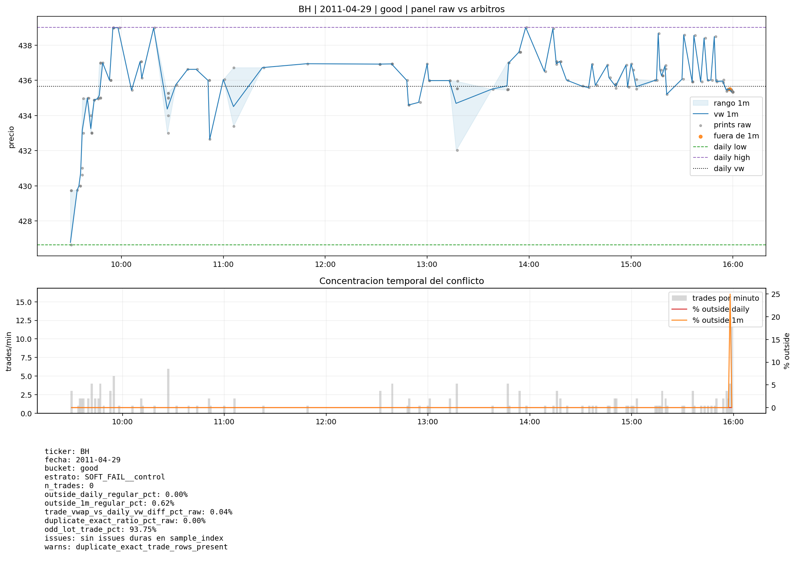

**Que muestra**

- Panel rico del tape raw frente a `daily` y `1m` para `BH` el `2011-04-29`.
- `n_trades = 160`, `outside_daily_regular_pct = 0.00%`, `outside_1m_regular_pct = 0.62%`.
- `trade_vwap_vs_daily_vw_diff_pct_raw = 0.04%`, `duplicate_exact_ratio_pct_raw = 0.00%`, `odd_lot_trade_pct = 93.75%`.

**Responde**

- Cola pristine donde `trades`, `daily` y `1m` alinean con limpieza. Responde a la pregunta de como luce una firma casi impecable del tape.
- Responde a si el conflicto dominante vive en la escala (`~1x`), en la comparabilidad frente a `daily` (0.00%) o frente a `1m` (0.62%).
- El 93.75% de odd-lots empuja la lectura hacia microestructura fina; evita leer el caso como pura ruptura economica gruesa.
- La decision que justifica es que el file puede usarse como patron de tape limpio, no como medida de masa util del bloque.

### BH | 2012-04-16

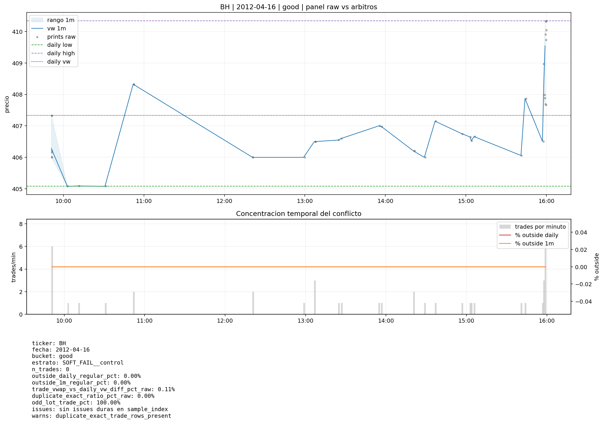

**Que muestra**

- Panel rico del tape raw frente a `daily` y `1m` para `BH` el `2012-04-16`.
- `n_trades = 43`, `outside_daily_regular_pct = 0.00%`, `outside_1m_regular_pct = 0.00%`.
- `trade_vwap_vs_daily_vw_diff_pct_raw = 0.11%`, `duplicate_exact_ratio_pct_raw = 0.00%`, `odd_lot_trade_pct = 100.00%`.

**Responde**

- Cola pristine donde `trades`, `daily` y `1m` alinean con limpieza. Responde a la pregunta de como luce una firma casi impecable del tape.
- Responde a si el conflicto dominante vive en la escala (`~1x`), en la comparabilidad frente a `daily` (0.00%) o frente a `1m` (0.00%).
- El 100.00% de odd-lots empuja la lectura hacia microestructura fina; evita leer el caso como pura ruptura economica gruesa.
- La decision que justifica es que el file puede usarse como patron de tape limpio, no como medida de masa util del bloque.

### BH | 2012-10-26

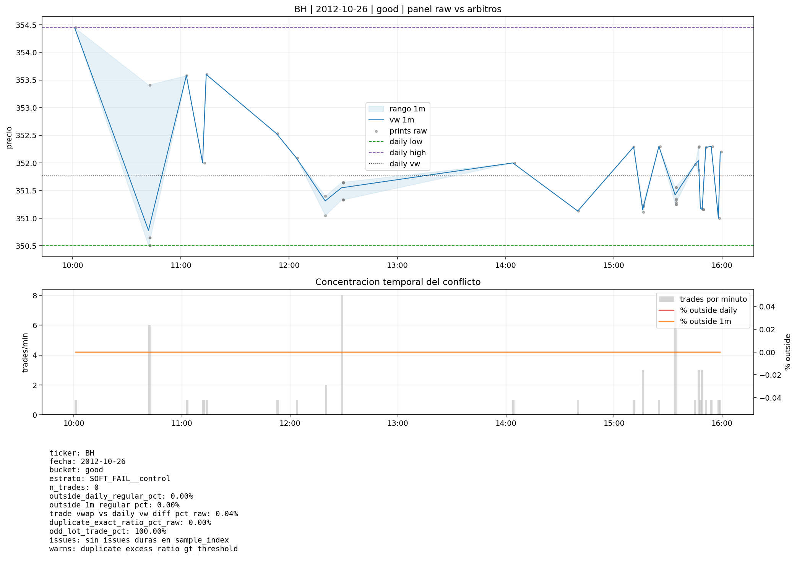

**Que muestra**

- Panel rico del tape raw frente a `daily` y `1m` para `BH` el `2012-10-26`.
- `n_trades = 48`, `outside_daily_regular_pct = 0.00%`, `outside_1m_regular_pct = 0.00%`.
- `trade_vwap_vs_daily_vw_diff_pct_raw = 0.04%`, `duplicate_exact_ratio_pct_raw = 0.00%`, `odd_lot_trade_pct = 100.00%`.

**Responde**

- Cola pristine donde `trades`, `daily` y `1m` alinean con limpieza. Responde a la pregunta de como luce una firma casi impecable del tape.
- Responde a si el conflicto dominante vive en la escala (`~1x`), en la comparabilidad frente a `daily` (0.00%) o frente a `1m` (0.00%).
- El 100.00% de odd-lots empuja la lectura hacia microestructura fina; evita leer el caso como pura ruptura economica gruesa.
- La decision que justifica es que el file puede usarse como patron de tape limpio, no como medida de masa util del bloque.

### BH | 2012-11-06

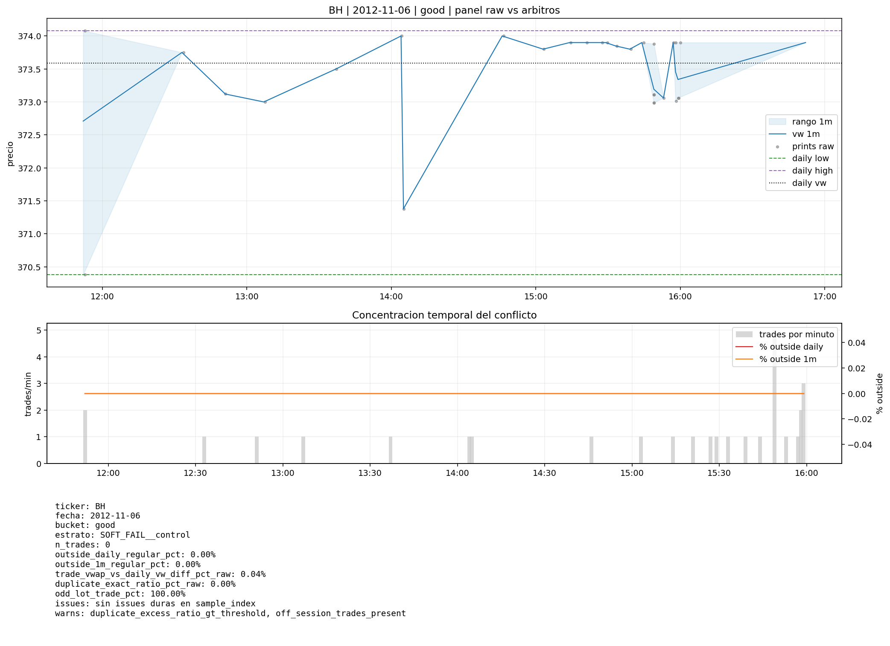

**Que muestra**

- Panel rico del tape raw frente a `daily` y `1m` para `BH` el `2012-11-06`.
- `n_trades = 29`, `outside_daily_regular_pct = 0.00%`, `outside_1m_regular_pct = 0.00%`.
- `trade_vwap_vs_daily_vw_diff_pct_raw = 0.04%`, `duplicate_exact_ratio_pct_raw = 0.00%`, `odd_lot_trade_pct = 100.00%`.

**Responde**

- Cola pristine donde `trades`, `daily` y `1m` alinean con limpieza. Responde a la pregunta de como luce una firma casi impecable del tape.
- Responde a si el conflicto dominante vive en la escala (`~1x`), en la comparabilidad frente a `daily` (0.00%) o frente a `1m` (0.00%).
- El 100.00% de odd-lots empuja la lectura hacia microestructura fina; evita leer el caso como pura ruptura economica gruesa.
- La decision que justifica es que el file puede usarse como patron de tape limpio, no como medida de masa util del bloque.

### BH | 2012-11-21

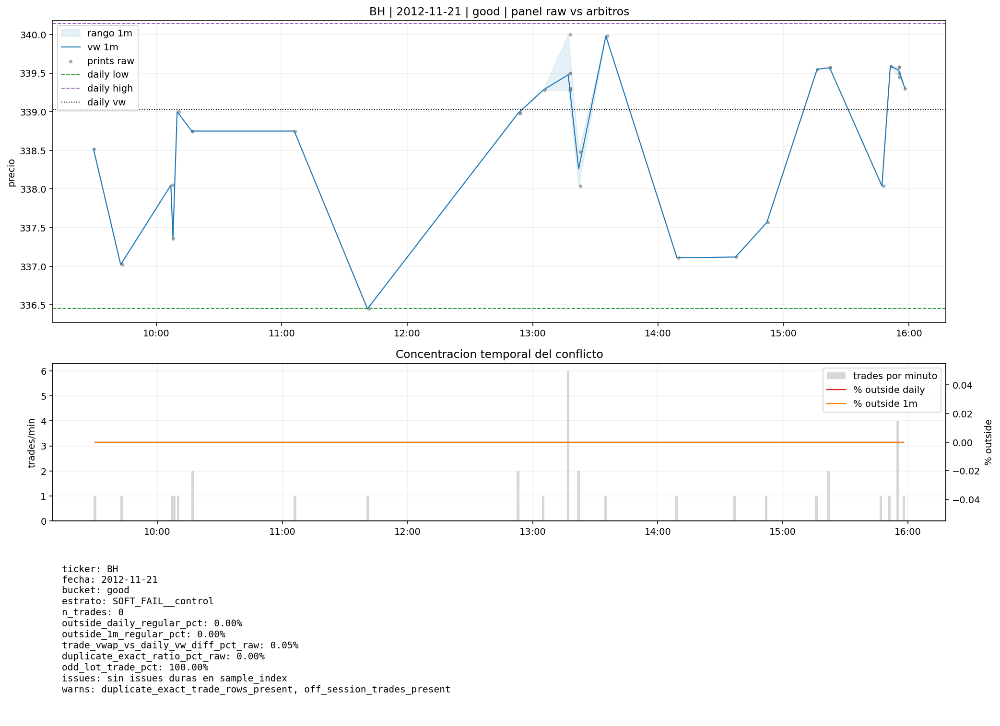

**Que muestra**

- Panel rico del tape raw frente a `daily` y `1m` para `BH` el `2012-11-21`.
- `n_trades = 34`, `outside_daily_regular_pct = 0.00%`, `outside_1m_regular_pct = 0.00%`.
- `trade_vwap_vs_daily_vw_diff_pct_raw = 0.05%`, `duplicate_exact_ratio_pct_raw = 0.00%`, `odd_lot_trade_pct = 100.00%`.

**Responde**

- Cola pristine donde `trades`, `daily` y `1m` alinean con limpieza. Responde a la pregunta de como luce una firma casi impecable del tape.
- Responde a si el conflicto dominante vive en la escala (`~1x`), en la comparabilidad frente a `daily` (0.00%) o frente a `1m` (0.00%).
- El 100.00% de odd-lots empuja la lectura hacia microestructura fina; evita leer el caso como pura ruptura economica gruesa.
- La decision que justifica es que el file puede usarse como patron de tape limpio, no como medida de masa util del bloque.

### BH | 2012-12-03

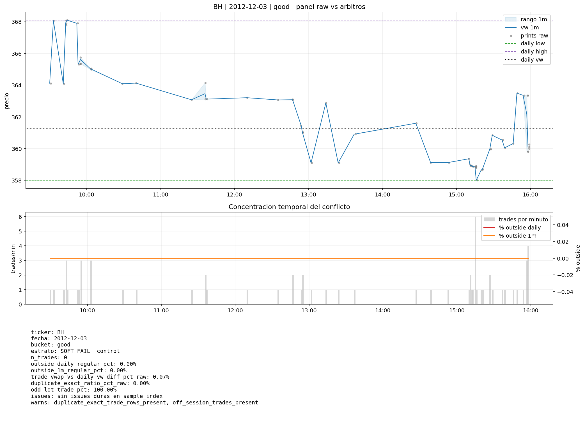

**Que muestra**

- Panel rico del tape raw frente a `daily` y `1m` para `BH` el `2012-12-03`.
- `n_trades = 64`, `outside_daily_regular_pct = 0.00%`, `outside_1m_regular_pct = 0.00%`.
- `trade_vwap_vs_daily_vw_diff_pct_raw = 0.07%`, `duplicate_exact_ratio_pct_raw = 0.00%`, `odd_lot_trade_pct = 100.00%`.

**Responde**

- Cola pristine donde `trades`, `daily` y `1m` alinean con limpieza. Responde a la pregunta de como luce una firma casi impecable del tape.
- Responde a si el conflicto dominante vive en la escala (`~1x`), en la comparabilidad frente a `daily` (0.00%) o frente a `1m` (0.00%).
- El 100.00% de odd-lots empuja la lectura hacia microestructura fina; evita leer el caso como pura ruptura economica gruesa.
- La decision que justifica es que el file puede usarse como patron de tape limpio, no como medida de masa util del bloque.

### ALTS | 2016-01-19

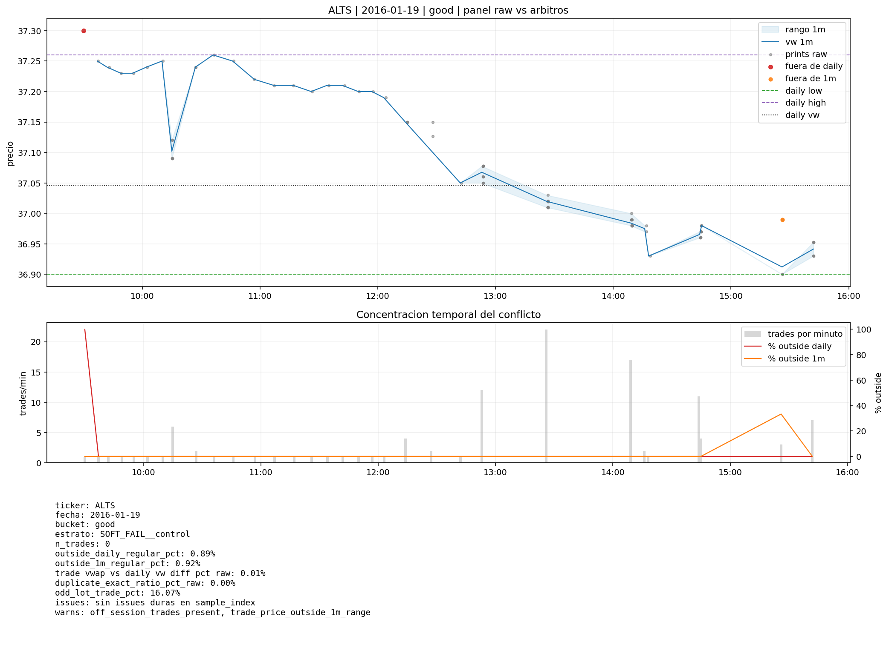

**Que muestra**

- Panel rico del tape raw frente a `daily` y `1m` para `ALTS` el `2016-01-19`.
- `n_trades = 112`, `outside_daily_regular_pct = 0.89%`, `outside_1m_regular_pct = 0.92%`.
- `trade_vwap_vs_daily_vw_diff_pct_raw = 0.01%`, `duplicate_exact_ratio_pct_raw = 0.00%`, `odd_lot_trade_pct = 16.07%`.

**Responde**

- Cola pristine donde `trades`, `daily` y `1m` alinean con limpieza. Responde a la pregunta de como luce una firma casi impecable del tape.
- Responde a si el conflicto dominante vive en la escala (`~1x`), en la comparabilidad frente a `daily` (0.89%) o frente a `1m` (0.92%).
- La decision que justifica es que el file puede usarse como patron de tape limpio, no como medida de masa util del bloque.

### BH | 2013-10-17

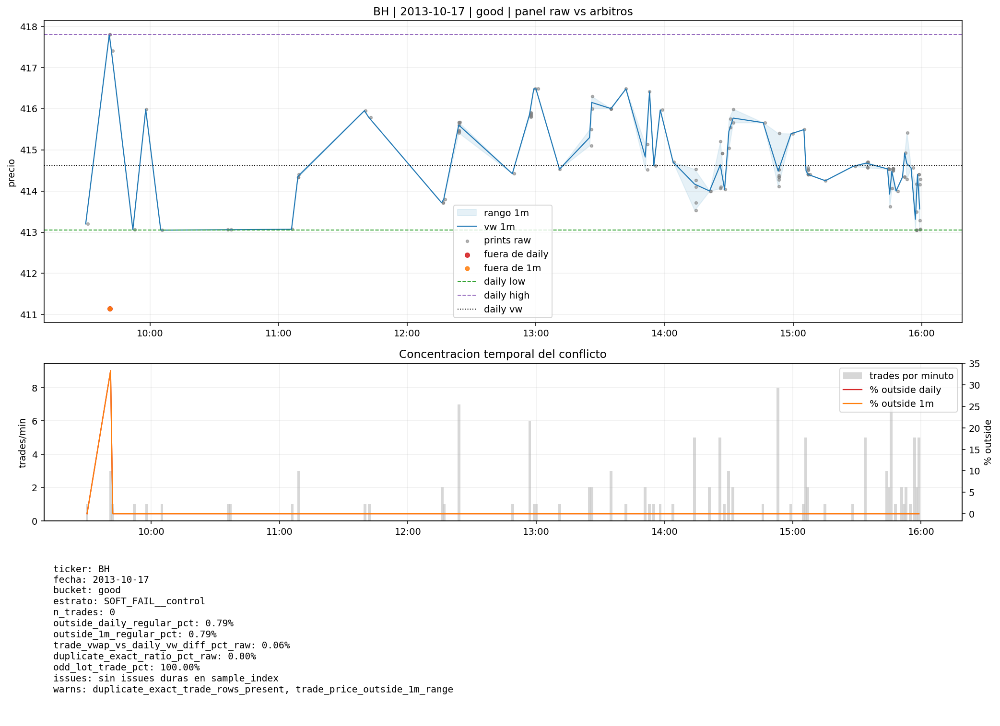

**Que muestra**

- Panel rico del tape raw frente a `daily` y `1m` para `BH` el `2013-10-17`.
- `n_trades = 126`, `outside_daily_regular_pct = 0.79%`, `outside_1m_regular_pct = 0.79%`.
- `trade_vwap_vs_daily_vw_diff_pct_raw = 0.06%`, `duplicate_exact_ratio_pct_raw = 0.00%`, `odd_lot_trade_pct = 100.00%`.

**Responde**

- Cola pristine donde `trades`, `daily` y `1m` alinean con limpieza. Responde a la pregunta de como luce una firma casi impecable del tape.
- Responde a si el conflicto dominante vive en la escala (`~1x`), en la comparabilidad frente a `daily` (0.79%) o frente a `1m` (0.79%).
- El 100.00% de odd-lots empuja la lectura hacia microestructura fina; evita leer el caso como pura ruptura economica gruesa.
- La decision que justifica es que el file puede usarse como patron de tape limpio, no como medida de masa util del bloque.

### BH.A | 2018-08-17

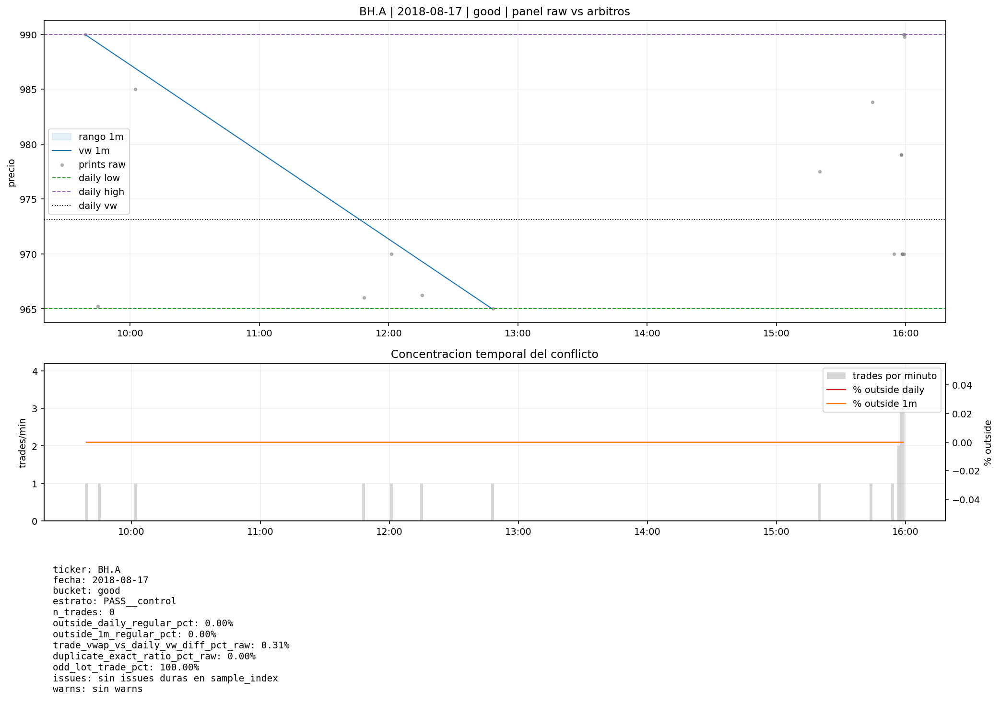

**Que muestra**

- Panel rico del tape raw frente a `daily` y `1m` para `BH.A` el `2018-08-17`.
- `n_trades = 19`, `outside_daily_regular_pct = 0.00%`, `outside_1m_regular_pct = 0.00%`.
- `trade_vwap_vs_daily_vw_diff_pct_raw = 0.31%`, `duplicate_exact_ratio_pct_raw = 0.00%`, `odd_lot_trade_pct = 100.00%`.

**Responde**

- Cola pristine donde `trades`, `daily` y `1m` alinean con limpieza. Responde a la pregunta de como luce una firma casi impecable del tape.
- Responde a si el conflicto dominante vive en la escala (`~1x`), en la comparabilidad frente a `daily` (0.00%) o frente a `1m` (0.00%).
- El 100.00% de odd-lots empuja la lectura hacia microestructura fina; evita leer el caso como pura ruptura economica gruesa.
- La decision que justifica es que el file puede usarse como patron de tape limpio, no como medida de masa util del bloque.

### BH.A | 2018-10-02

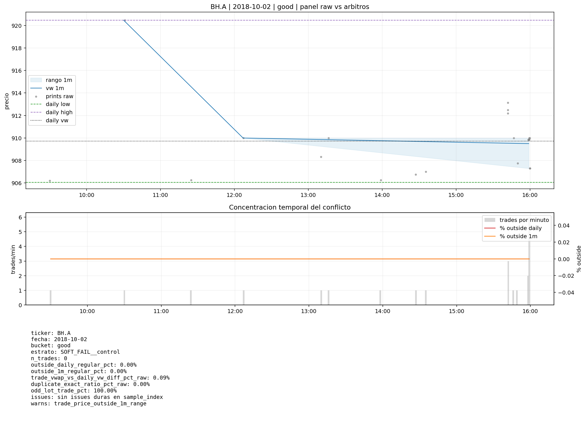

**Que muestra**

- Panel rico del tape raw frente a `daily` y `1m` para `BH.A` el `2018-10-02`.
- `n_trades = 22`, `outside_daily_regular_pct = 0.00%`, `outside_1m_regular_pct = 0.00%`.
- `trade_vwap_vs_daily_vw_diff_pct_raw = 0.09%`, `duplicate_exact_ratio_pct_raw = 0.00%`, `odd_lot_trade_pct = 100.00%`.

**Responde**

- Cola pristine donde `trades`, `daily` y `1m` alinean con limpieza. Responde a la pregunta de como luce una firma casi impecable del tape.
- Responde a si el conflicto dominante vive en la escala (`~1x`), en la comparabilidad frente a `daily` (0.00%) o frente a `1m` (0.00%).
- El 100.00% de odd-lots empuja la lectura hacia microestructura fina; evita leer el caso como pura ruptura economica gruesa.
- La decision que justifica es que el file puede usarse como patron de tape limpio, no como medida de masa util del bloque.

### BH.A | 2018-11-09

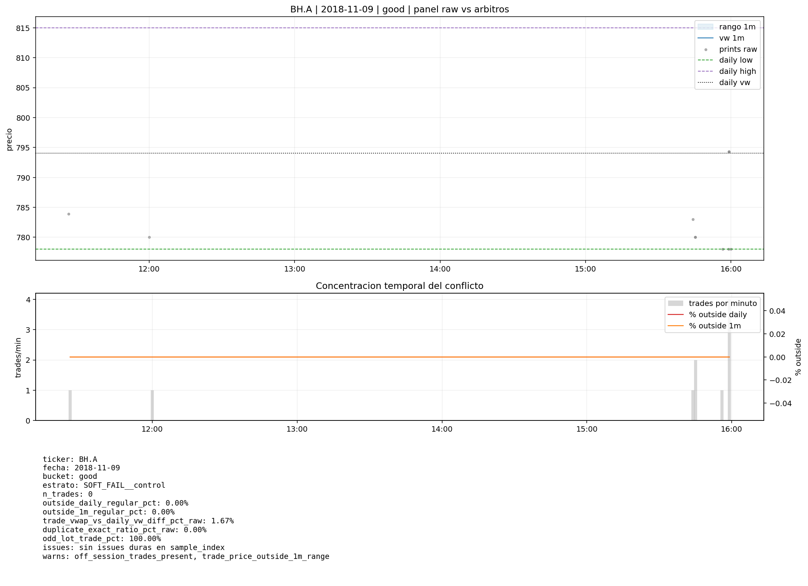

**Que muestra**

- Panel rico del tape raw frente a `daily` y `1m` para `BH.A` el `2018-11-09`.
- `n_trades = 10`, `outside_daily_regular_pct = 0.00%`, `outside_1m_regular_pct = 0.00%`.
- `trade_vwap_vs_daily_vw_diff_pct_raw = 1.67%`, `duplicate_exact_ratio_pct_raw = 0.00%`, `odd_lot_trade_pct = 100.00%`.

**Responde**

- Cola pristine donde `trades`, `daily` y `1m` alinean con limpieza. Responde a la pregunta de como luce una firma casi impecable del tape.
- Responde a si el conflicto dominante vive en la escala (`~1x`), en la comparabilidad frente a `daily` (0.00%) o frente a `1m` (0.00%).
- El 100.00% de odd-lots empuja la lectura hacia microestructura fina; evita leer el caso como pura ruptura economica gruesa.
- La decision que justifica es que el file puede usarse como patron de tape limpio, no como medida de masa util del bloque.

### CBR | 2015-12-24

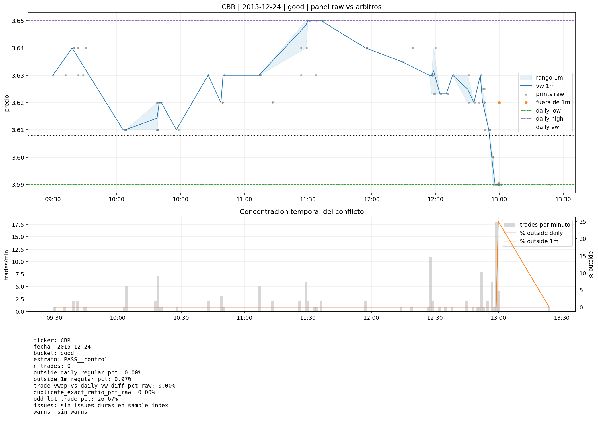

**Que muestra**

- Panel rico del tape raw frente a `daily` y `1m` para `CBR` el `2015-12-24`.
- `n_trades = 120`, `outside_daily_regular_pct = 0.00%`, `outside_1m_regular_pct = 0.97%`.
- `trade_vwap_vs_daily_vw_diff_pct_raw = 0.00%`, `duplicate_exact_ratio_pct_raw = 0.00%`, `odd_lot_trade_pct = 26.67%`.

**Responde**

- Cola pristine donde `trades`, `daily` y `1m` alinean con limpieza. Responde a la pregunta de como luce una firma casi impecable del tape.
- Responde a si el conflicto dominante vive en la escala (`~1x`), en la comparabilidad frente a `daily` (0.00%) o frente a `1m` (0.97%).
- El 26.67% de odd-lots empuja la lectura hacia microestructura fina; evita leer el caso como pura ruptura economica gruesa.
- La decision que justifica es que el file puede usarse como patron de tape limpio, no como medida de masa util del bloque.

### CLSN | 2016-05-16

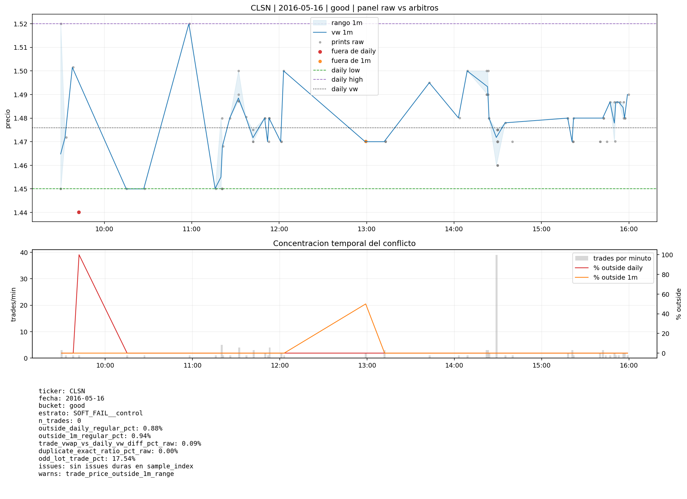

**Que muestra**

- Panel rico del tape raw frente a `daily` y `1m` para `CLSN` el `2016-05-16`.
- `n_trades = 114`, `outside_daily_regular_pct = 0.88%`, `outside_1m_regular_pct = 0.94%`.
- `trade_vwap_vs_daily_vw_diff_pct_raw = 0.09%`, `duplicate_exact_ratio_pct_raw = 0.00%`, `odd_lot_trade_pct = 17.54%`.

**Responde**

- Cola pristine donde `trades`, `daily` y `1m` alinean con limpieza. Responde a la pregunta de como luce una firma casi impecable del tape.
- Responde a si el conflicto dominante vive en la escala (`~1x`), en la comparabilidad frente a `daily` (0.88%) o frente a `1m` (0.94%).
- La decision que justifica es que el file puede usarse como patron de tape limpio, no como medida de masa util del bloque.

### DIT | 2018-04-02

**Que muestra**

- Panel rico del tape raw frente a `daily` y `1m` para `DIT` el `2018-04-02`.
- `n_trades = 2`, `outside_daily_regular_pct = 0.00%`, `outside_1m_regular_pct = 0.00%`.
- `trade_vwap_vs_daily_vw_diff_pct_raw = 0.00%`, `duplicate_exact_ratio_pct_raw = 0.00%`, `odd_lot_trade_pct = 100.00%`.

**Responde**

- Cola pristine donde `trades`, `daily` y `1m` alinean con limpieza. Responde a la pregunta de como luce una firma casi impecable del tape.
- Responde a si el conflicto dominante vive en la escala (`~1x`), en la comparabilidad frente a `daily` (0.00%) o frente a `1m` (0.00%).
- El 100.00% de odd-lots empuja la lectura hacia microestructura fina; evita leer el caso como pura ruptura economica gruesa.
- La decision que justifica es que el file puede usarse como patron de tape limpio, no como medida de masa util del bloque.

### DIT | 2018-04-19

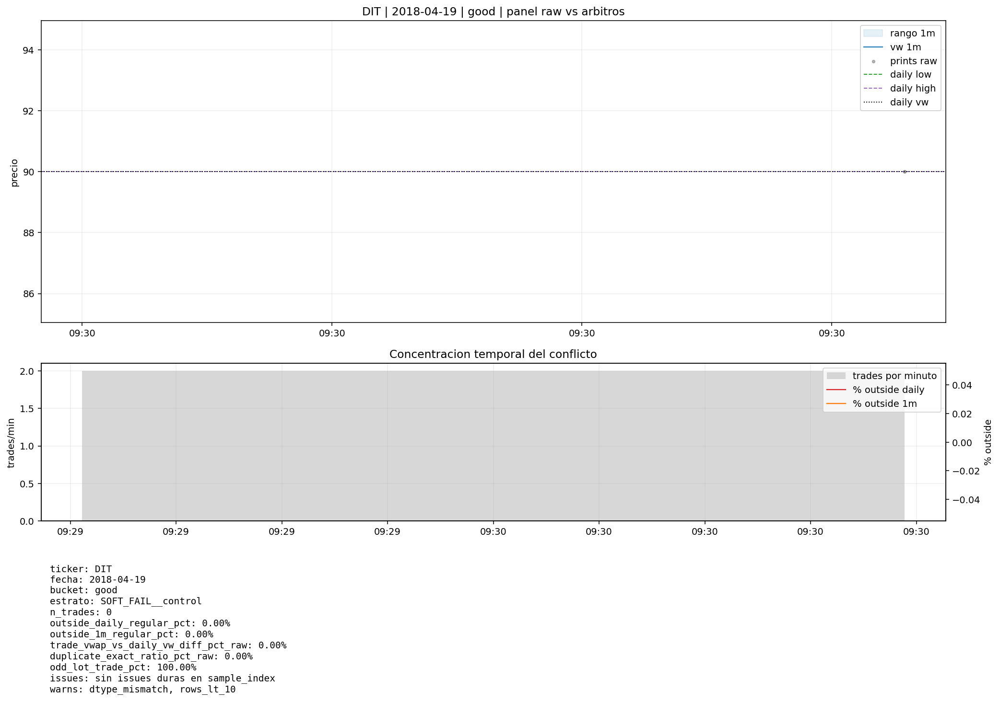

**Que muestra**

- Panel rico del tape raw frente a `daily` y `1m` para `DIT` el `2018-04-19`.
- `n_trades = 2`, `outside_daily_regular_pct = 0.00%`, `outside_1m_regular_pct = 0.00%`.
- `trade_vwap_vs_daily_vw_diff_pct_raw = 0.00%`, `duplicate_exact_ratio_pct_raw = 0.00%`, `odd_lot_trade_pct = 100.00%`.

**Responde**

- Cola pristine donde `trades`, `daily` y `1m` alinean con limpieza. Responde a la pregunta de como luce una firma casi impecable del tape.
- Responde a si el conflicto dominante vive en la escala (`~1x`), en la comparabilidad frente a `daily` (0.00%) o frente a `1m` (0.00%).
- El 100.00% de odd-lots empuja la lectura hacia microestructura fina; evita leer el caso como pura ruptura economica gruesa.
- La decision que justifica es que el file puede usarse como patron de tape limpio, no como medida de masa util del bloque.

### DIT | 2018-05-15

**Que muestra**

- Panel rico del tape raw frente a `daily` y `1m` para `DIT` el `2018-05-15`.
- `n_trades = 3`, `outside_daily_regular_pct = 0.00%`, `outside_1m_regular_pct = 0.00%`.
- `trade_vwap_vs_daily_vw_diff_pct_raw = 0.00%`, `duplicate_exact_ratio_pct_raw = 0.00%`, `odd_lot_trade_pct = 100.00%`.

**Responde**

- Cola pristine donde `trades`, `daily` y `1m` alinean con limpieza. Responde a la pregunta de como luce una firma casi impecable del tape.
- Responde a si el conflicto dominante vive en la escala (`~1x`), en la comparabilidad frente a `daily` (0.00%) o frente a `1m` (0.00%).
- El 100.00% de odd-lots empuja la lectura hacia microestructura fina; evita leer el caso como pura ruptura economica gruesa.
- La decision que justifica es que el file puede usarse como patron de tape limpio, no como medida de masa util del bloque.

### DIT | 2018-06-06

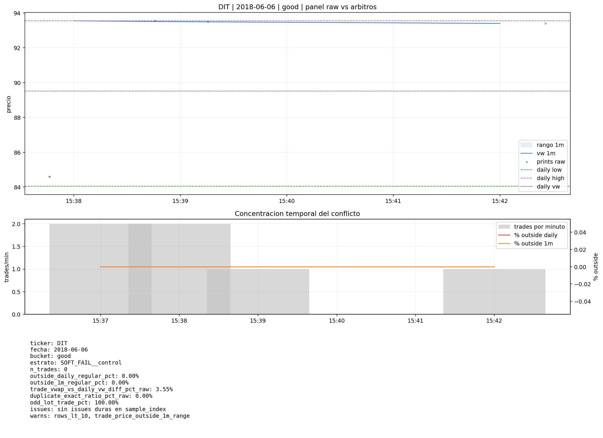

**Que muestra**

- Panel rico del tape raw frente a `daily` y `1m` para `DIT` el `2018-06-06`.
- `n_trades = 6`, `outside_daily_regular_pct = 0.00%`, `outside_1m_regular_pct = 0.00%`.
- `trade_vwap_vs_daily_vw_diff_pct_raw = 3.55%`, `duplicate_exact_ratio_pct_raw = 0.00%`, `odd_lot_trade_pct = 100.00%`.

**Responde**

- Cola pristine donde `trades`, `daily` y `1m` alinean con limpieza. Responde a la pregunta de como luce una firma casi impecable del tape.
- Responde a si el conflicto dominante vive en la escala (`near_1x`), en la comparabilidad frente a `daily` (0.00%) o frente a `1m` (0.00%).
- El 100.00% de odd-lots empuja la lectura hacia microestructura fina; evita leer el caso como pura ruptura economica gruesa.
- La decision que justifica es que el file puede usarse como patron de tape limpio, no como medida de masa util del bloque.

### DIT | 2018-08-01

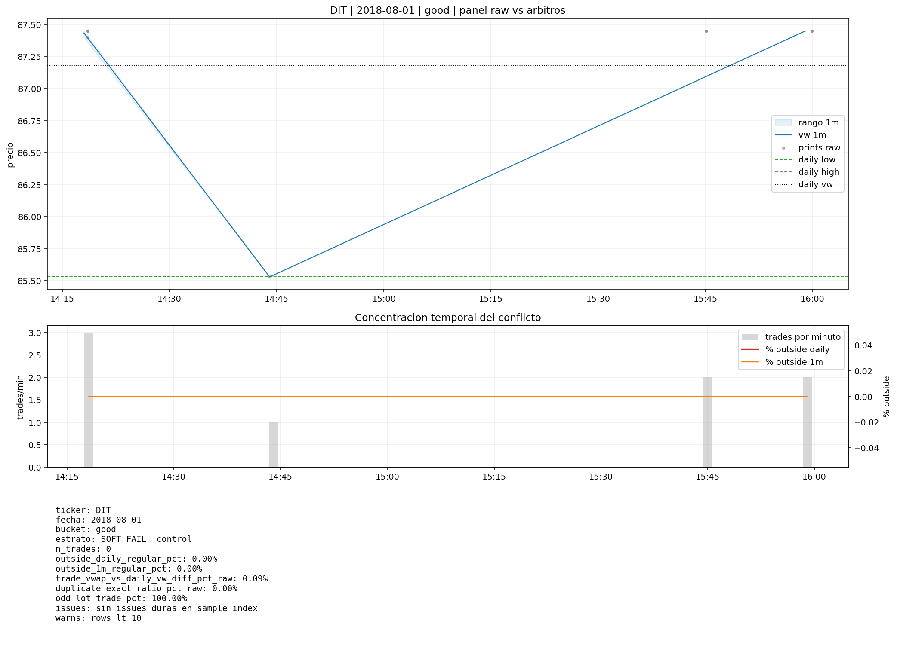

**Que muestra**

- Panel rico del tape raw frente a `daily` y `1m` para `DIT` el `2018-08-01`.
- `n_trades = 8`, `outside_daily_regular_pct = 0.00%`, `outside_1m_regular_pct = 0.00%`.
- `trade_vwap_vs_daily_vw_diff_pct_raw = 0.09%`, `duplicate_exact_ratio_pct_raw = 0.00%`, `odd_lot_trade_pct = 100.00%`.

**Responde**

- Cola pristine donde `trades`, `daily` y `1m` alinean con limpieza. Responde a la pregunta de como luce una firma casi impecable del tape.
- Responde a si el conflicto dominante vive en la escala (`~1x`), en la comparabilidad frente a `daily` (0.00%) o frente a `1m` (0.00%).
- El 100.00% de odd-lots empuja la lectura hacia microestructura fina; evita leer el caso como pura ruptura economica gruesa.
- La decision que justifica es que el file puede usarse como patron de tape limpio, no como medida de masa util del bloque.

### DIT | 2018-08-13

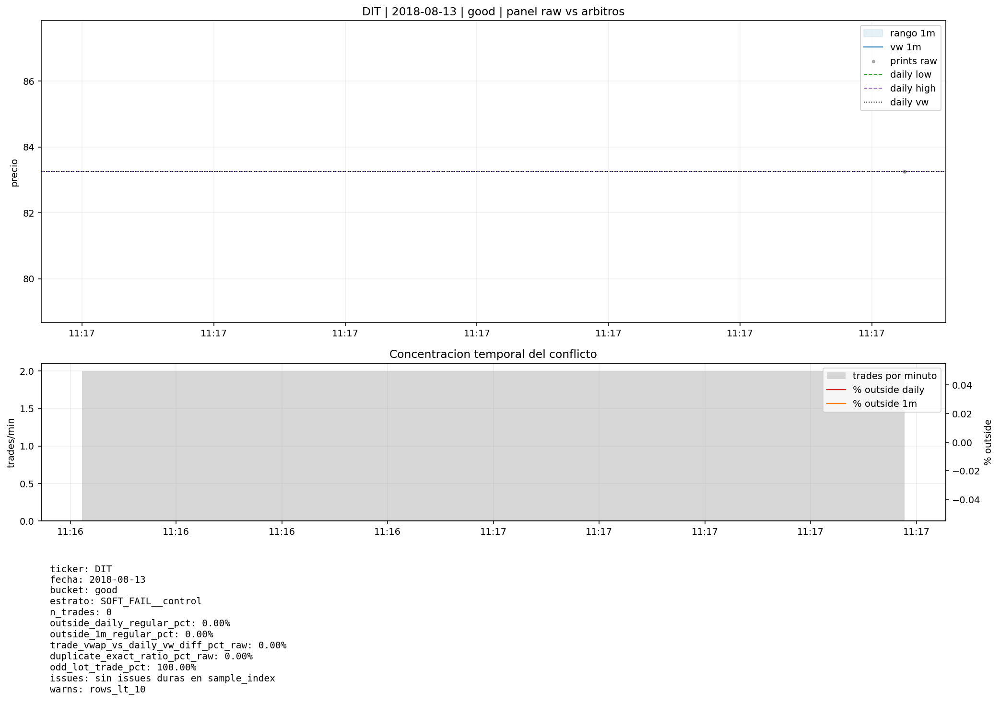

**Que muestra**

- Panel rico del tape raw frente a `daily` y `1m` para `DIT` el `2018-08-13`.
- `n_trades = 2`, `outside_daily_regular_pct = 0.00%`, `outside_1m_regular_pct = 0.00%`.
- `trade_vwap_vs_daily_vw_diff_pct_raw = 0.00%`, `duplicate_exact_ratio_pct_raw = 0.00%`, `odd_lot_trade_pct = 100.00%`.

**Responde**

- Cola pristine donde `trades`, `daily` y `1m` alinean con limpieza. Responde a la pregunta de como luce una firma casi impecable del tape.
- Responde a si el conflicto dominante vive en la escala (`~1x`), en la comparabilidad frente a `daily` (0.00%) o frente a `1m` (0.00%).
- El 100.00% de odd-lots empuja la lectura hacia microestructura fina; evita leer el caso como pura ruptura economica gruesa.
- La decision que justifica es que el file puede usarse como patron de tape limpio, no como medida de masa util del bloque.

### DIT | 2018-08-16

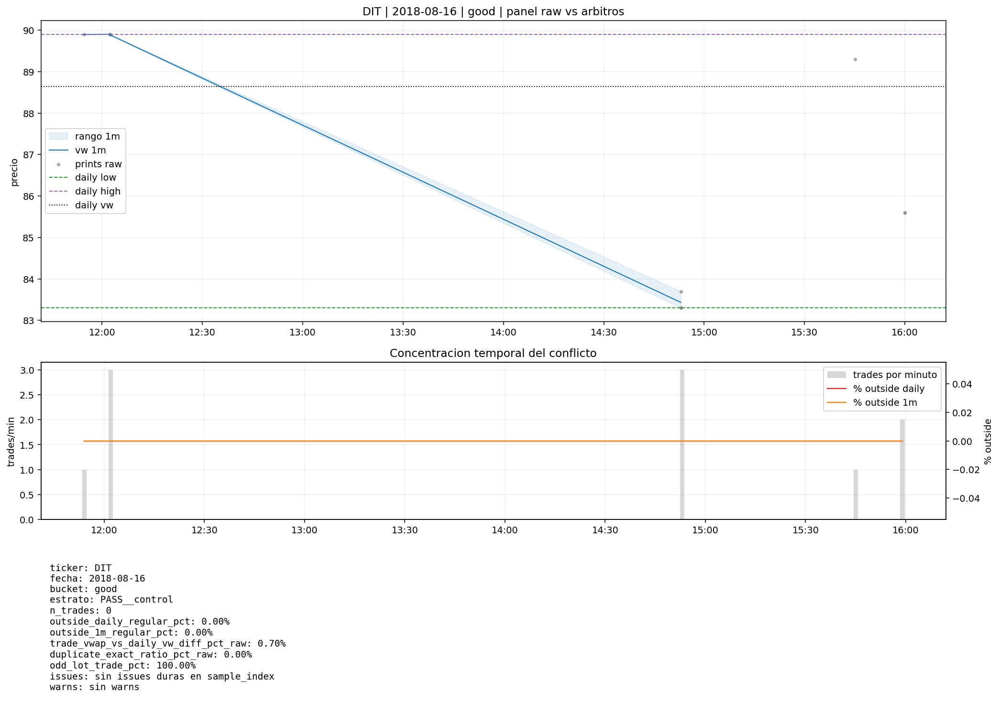

**Que muestra**

- Panel rico del tape raw frente a `daily` y `1m` para `DIT` el `2018-08-16`.
- `n_trades = 10`, `outside_daily_regular_pct = 0.00%`, `outside_1m_regular_pct = 0.00%`.
- `trade_vwap_vs_daily_vw_diff_pct_raw = 0.70%`, `duplicate_exact_ratio_pct_raw = 0.00%`, `odd_lot_trade_pct = 100.00%`.

**Responde**

- Cola pristine donde `trades`, `daily` y `1m` alinean con limpieza. Responde a la pregunta de como luce una firma casi impecable del tape.
- Responde a si el conflicto dominante vive en la escala (`~1x`), en la comparabilidad frente a `daily` (0.00%) o frente a `1m` (0.00%).
- El 100.00% de odd-lots empuja la lectura hacia microestructura fina; evita leer el caso como pura ruptura economica gruesa.
- La decision que justifica es que el file puede usarse como patron de tape limpio, no como medida de masa util del bloque.

### DIT | 2018-12-07

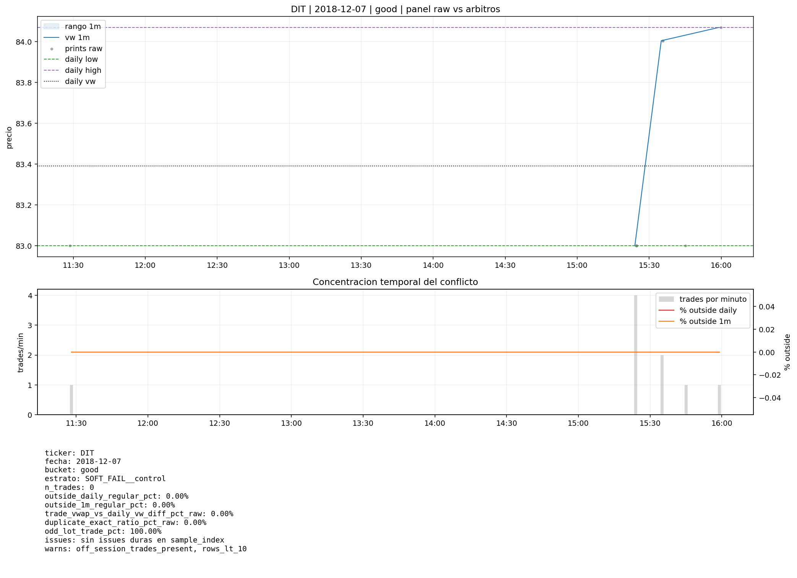

**Que muestra**

- Panel rico del tape raw frente a `daily` y `1m` para `DIT` el `2018-12-07`.
- `n_trades = 9`, `outside_daily_regular_pct = 0.00%`, `outside_1m_regular_pct = 0.00%`.
- `trade_vwap_vs_daily_vw_diff_pct_raw = 0.00%`, `duplicate_exact_ratio_pct_raw = 0.00%`, `odd_lot_trade_pct = 100.00%`.

**Responde**

- Cola pristine donde `trades`, `daily` y `1m` alinean con limpieza. Responde a la pregunta de como luce una firma casi impecable del tape.
- Responde a si el conflicto dominante vive en la escala (`~1x`), en la comparabilidad frente a `daily` (0.00%) o frente a `1m` (0.00%).
- El 100.00% de odd-lots empuja la lectura hacia microestructura fina; evita leer el caso como pura ruptura economica gruesa.
- La decision que justifica es que el file puede usarse como patron de tape limpio, no como medida de masa util del bloque.

### DIT | 2018-12-19

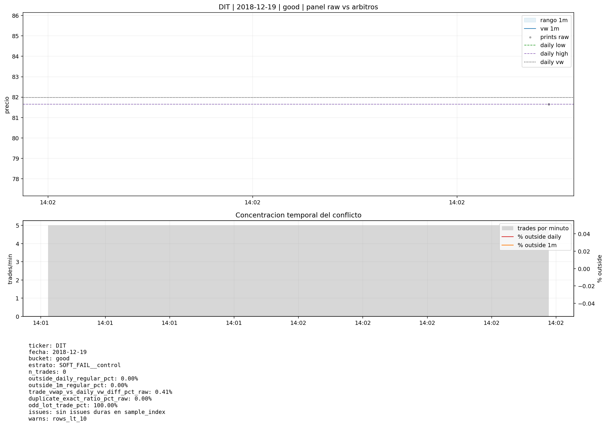

**Que muestra**

- Panel rico del tape raw frente a `daily` y `1m` para `DIT` el `2018-12-19`.
- `n_trades = 5`, `outside_daily_regular_pct = 0.00%`, `outside_1m_regular_pct = 0.00%`.
- `trade_vwap_vs_daily_vw_diff_pct_raw = 0.41%`, `duplicate_exact_ratio_pct_raw = 0.00%`, `odd_lot_trade_pct = 100.00%`.

**Responde**

- Cola pristine donde `trades`, `daily` y `1m` alinean con limpieza. Responde a la pregunta de como luce una firma casi impecable del tape.
- Responde a si el conflicto dominante vive en la escala (`~1x`), en la comparabilidad frente a `daily` (0.00%) o frente a `1m` (0.00%).
- El 100.00% de odd-lots empuja la lectura hacia microestructura fina; evita leer el caso como pura ruptura economica gruesa.
- La decision que justifica es que el file puede usarse como patron de tape limpio, no como medida de masa util del bloque.

### GSD | 2017-05-30

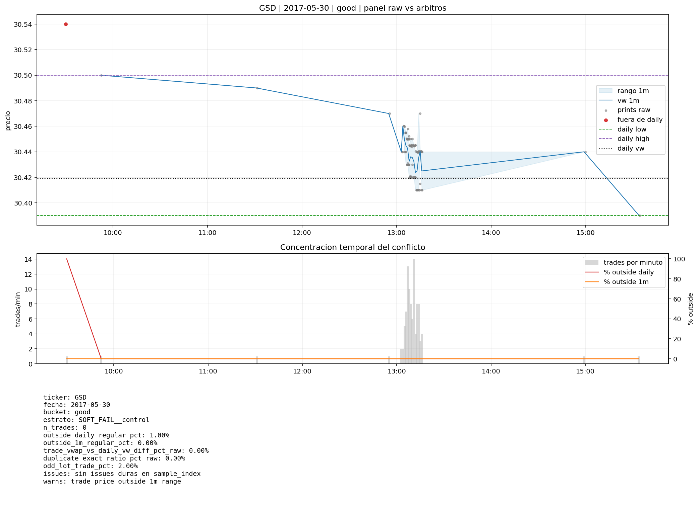

**Que muestra**

- Panel rico del tape raw frente a `daily` y `1m` para `GSD` el `2017-05-30`.
- `n_trades = 100`, `outside_daily_regular_pct = 1.00%`, `outside_1m_regular_pct = 0.00%`.
- `trade_vwap_vs_daily_vw_diff_pct_raw = 0.00%`, `duplicate_exact_ratio_pct_raw = 0.00%`, `odd_lot_trade_pct = 2.00%`.

**Responde**

- Cola pristine donde `trades`, `daily` y `1m` alinean con limpieza. Responde a la pregunta de como luce una firma casi impecable del tape.
- Responde a si el conflicto dominante vive en la escala (`~1x`), en la comparabilidad frente a `daily` (1.00%) o frente a `1m` (0.00%).
- La decision que justifica es que el file puede usarse como patron de tape limpio, no como medida de masa util del bloque.

### NLST | 2017-01-12

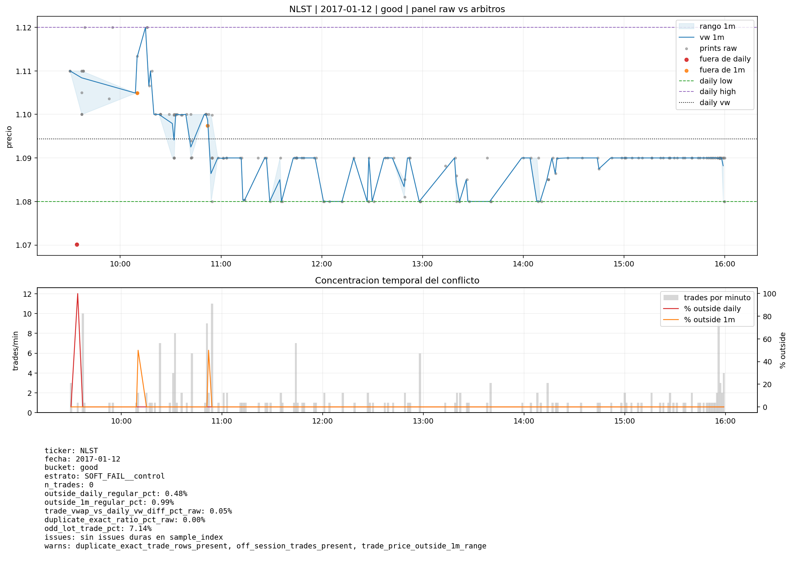

**Que muestra**

- Panel rico del tape raw frente a `daily` y `1m` para `NLST` el `2017-01-12`.
- `n_trades = 210`, `outside_daily_regular_pct = 0.48%`, `outside_1m_regular_pct = 0.99%`.
- `trade_vwap_vs_daily_vw_diff_pct_raw = 0.05%`, `duplicate_exact_ratio_pct_raw = 0.00%`, `odd_lot_trade_pct = 7.14%`.

**Responde**

- Cola pristine donde `trades`, `daily` y `1m` alinean con limpieza. Responde a la pregunta de como luce una firma casi impecable del tape.
- Responde a si el conflicto dominante vive en la escala (`~1x`), en la comparabilidad frente a `daily` (0.48%) o frente a `1m` (0.99%).
- La decision que justifica es que el file puede usarse como patron de tape limpio, no como medida de masa util del bloque.

### OOMA | 2016-12-08

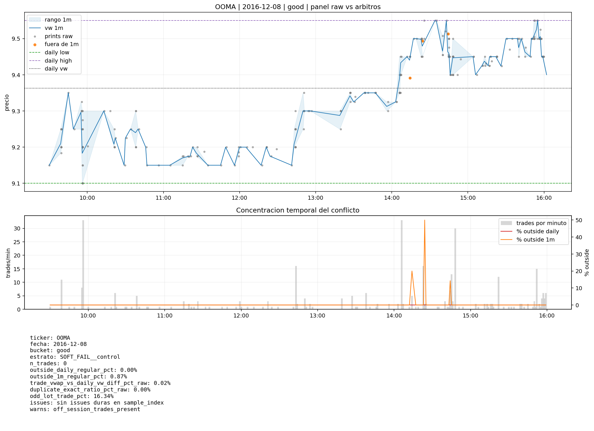

**Que muestra**

- Panel rico del tape raw frente a `daily` y `1m` para `OOMA` el `2016-12-08`.
- `n_trades = 361`, `outside_daily_regular_pct = 0.00%`, `outside_1m_regular_pct = 0.87%`.
- `trade_vwap_vs_daily_vw_diff_pct_raw = 0.02%`, `duplicate_exact_ratio_pct_raw = 0.00%`, `odd_lot_trade_pct = 16.34%`.

**Responde**

- Cola pristine donde `trades`, `daily` y `1m` alinean con limpieza. Responde a la pregunta de como luce una firma casi impecable del tape.
- Responde a si el conflicto dominante vive en la escala (`~1x`), en la comparabilidad frente a `daily` (0.00%) o frente a `1m` (0.87%).
- La decision que justifica es que el file puede usarse como patron de tape limpio, no como medida de masa util del bloque.

### BH.A | 2019-05-23

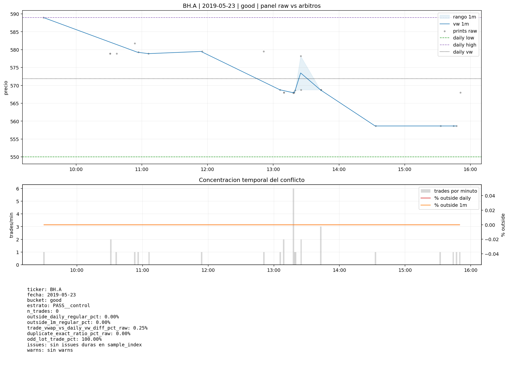

**Que muestra**

- Panel rico del tape raw frente a `daily` y `1m` para `BH.A` el `2019-05-23`.
- `n_trades = 30`, `outside_daily_regular_pct = 0.00%`, `outside_1m_regular_pct = 0.00%`.
- `trade_vwap_vs_daily_vw_diff_pct_raw = 0.25%`, `duplicate_exact_ratio_pct_raw = 0.00%`, `odd_lot_trade_pct = 100.00%`.

**Responde**

- Cola pristine donde `trades`, `daily` y `1m` alinean con limpieza. Responde a la pregunta de como luce una firma casi impecable del tape.
- Responde a si el conflicto dominante vive en la escala (`~1x`), en la comparabilidad frente a `daily` (0.00%) o frente a `1m` (0.00%).
- El 100.00% de odd-lots empuja la lectura hacia microestructura fina; evita leer el caso como pura ruptura economica gruesa.
- La decision que justifica es que el file puede usarse como patron de tape limpio, no como medida de masa util del bloque.

### BH.A | 2019-07-02

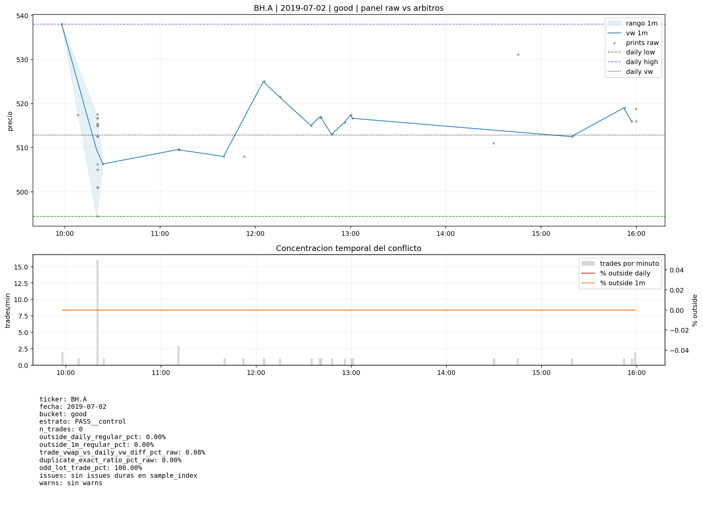

**Que muestra**

- Panel rico del tape raw frente a `daily` y `1m` para `BH.A` el `2019-07-02`.
- `n_trades = 41`, `outside_daily_regular_pct = 0.00%`, `outside_1m_regular_pct = 0.00%`.
- `trade_vwap_vs_daily_vw_diff_pct_raw = 0.08%`, `duplicate_exact_ratio_pct_raw = 0.00%`, `odd_lot_trade_pct = 100.00%`.

**Responde**

- Cola pristine donde `trades`, `daily` y `1m` alinean con limpieza. Responde a la pregunta de como luce una firma casi impecable del tape.
- Responde a si el conflicto dominante vive en la escala (`~1x`), en la comparabilidad frente a `daily` (0.00%) o frente a `1m` (0.00%).
- El 100.00% de odd-lots empuja la lectura hacia microestructura fina; evita leer el caso como pura ruptura economica gruesa.
- La decision que justifica es que el file puede usarse como patron de tape limpio, no como medida de masa util del bloque.

### BH.A | 2019-07-18

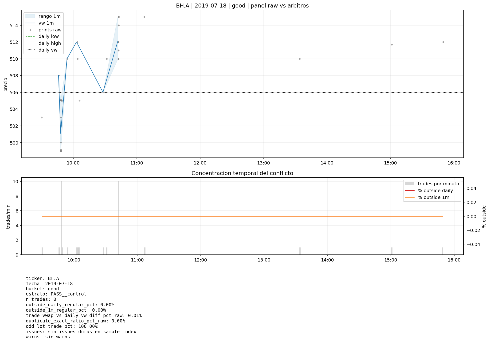

**Que muestra**

- Panel rico del tape raw frente a `daily` y `1m` para `BH.A` el `2019-07-18`.
- `n_trades = 33`, `outside_daily_regular_pct = 0.00%`, `outside_1m_regular_pct = 0.00%`.
- `trade_vwap_vs_daily_vw_diff_pct_raw = 0.01%`, `duplicate_exact_ratio_pct_raw = 0.00%`, `odd_lot_trade_pct = 100.00%`.

**Responde**

- Cola pristine donde `trades`, `daily` y `1m` alinean con limpieza. Responde a la pregunta de como luce una firma casi impecable del tape.
- Responde a si el conflicto dominante vive en la escala (`~1x`), en la comparabilidad frente a `daily` (0.00%) o frente a `1m` (0.00%).
- El 100.00% de odd-lots empuja la lectura hacia microestructura fina; evita leer el caso como pura ruptura economica gruesa.
- La decision que justifica es que el file puede usarse como patron de tape limpio, no como medida de masa util del bloque.

### BH.A | 2019-07-25

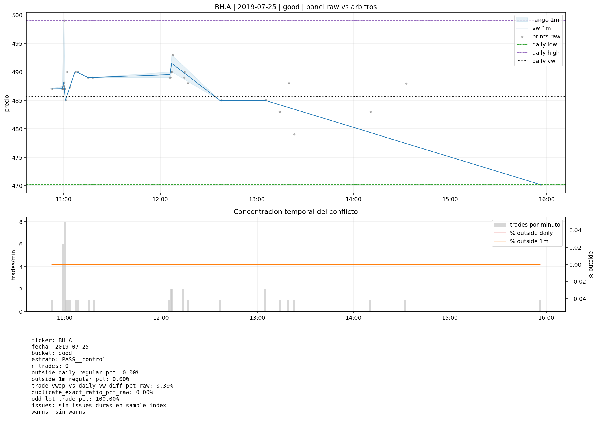

**Que muestra**

- Panel rico del tape raw frente a `daily` y `1m` para `BH.A` el `2019-07-25`.
- `n_trades = 39`, `outside_daily_regular_pct = 0.00%`, `outside_1m_regular_pct = 0.00%`.
- `trade_vwap_vs_daily_vw_diff_pct_raw = 0.30%`, `duplicate_exact_ratio_pct_raw = 0.00%`, `odd_lot_trade_pct = 100.00%`.

**Responde**

- Cola pristine donde `trades`, `daily` y `1m` alinean con limpieza. Responde a la pregunta de como luce una firma casi impecable del tape.
- Responde a si el conflicto dominante vive en la escala (`~1x`), en la comparabilidad frente a `daily` (0.00%) o frente a `1m` (0.00%).
- El 100.00% de odd-lots empuja la lectura hacia microestructura fina; evita leer el caso como pura ruptura economica gruesa.
- La decision que justifica es que el file puede usarse como patron de tape limpio, no como medida de masa util del bloque.

### BH.A | 2019-07-31

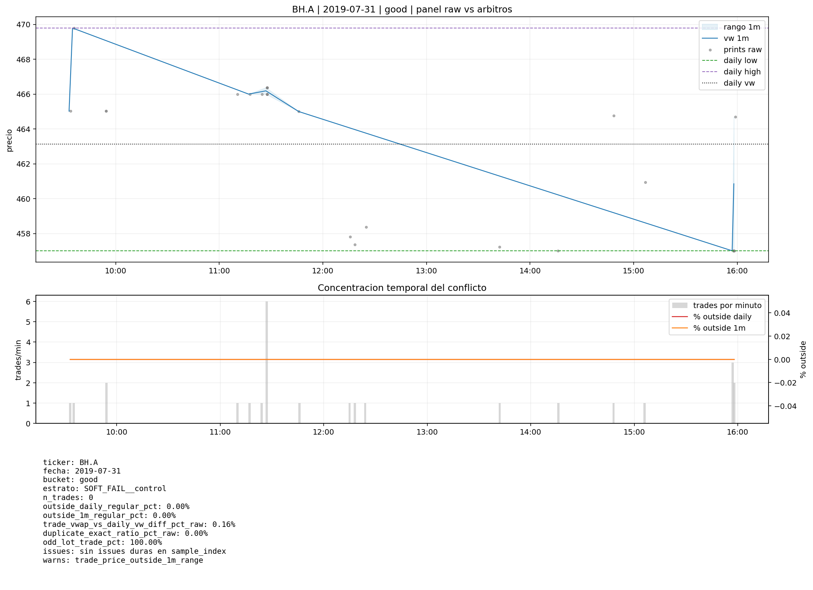

**Que muestra**

- Panel rico del tape raw frente a `daily` y `1m` para `BH.A` el `2019-07-31`.
- `n_trades = 26`, `outside_daily_regular_pct = 0.00%`, `outside_1m_regular_pct = 0.00%`.
- `trade_vwap_vs_daily_vw_diff_pct_raw = 0.16%`, `duplicate_exact_ratio_pct_raw = 0.00%`, `odd_lot_trade_pct = 100.00%`.

**Responde**

- Cola pristine donde `trades`, `daily` y `1m` alinean con limpieza. Responde a la pregunta de como luce una firma casi impecable del tape.
- Responde a si el conflicto dominante vive en la escala (`~1x`), en la comparabilidad frente a `daily` (0.00%) o frente a `1m` (0.00%).
- El 100.00% de odd-lots empuja la lectura hacia microestructura fina; evita leer el caso como pura ruptura economica gruesa.
- La decision que justifica es que el file puede usarse como patron de tape limpio, no como medida de masa util del bloque.

### BH.A | 2020-02-10

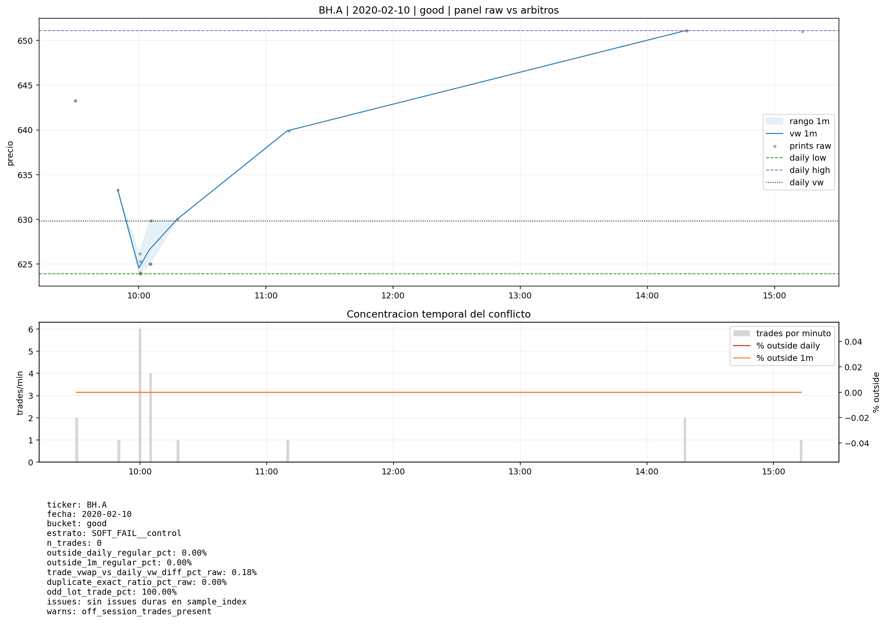

**Que muestra**

- Panel rico del tape raw frente a `daily` y `1m` para `BH.A` el `2020-02-10`.
- `n_trades = 18`, `outside_daily_regular_pct = 0.00%`, `outside_1m_regular_pct = 0.00%`.
- `trade_vwap_vs_daily_vw_diff_pct_raw = 0.18%`, `duplicate_exact_ratio_pct_raw = 0.00%`, `odd_lot_trade_pct = 100.00%`.

**Responde**

- Cola pristine donde `trades`, `daily` y `1m` alinean con limpieza. Responde a la pregunta de como luce una firma casi impecable del tape.
- Responde a si el conflicto dominante vive en la escala (`~1x`), en la comparabilidad frente a `daily` (0.00%) o frente a `1m` (0.00%).
- El 100.00% de odd-lots empuja la lectura hacia microestructura fina; evita leer el caso como pura ruptura economica gruesa.
- La decision que justifica es que el file puede usarse como patron de tape limpio, no como medida de masa util del bloque.

### BH.A | 2023-07-20

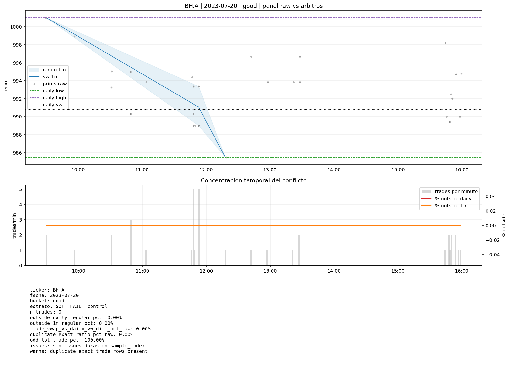

**Que muestra**

- Panel rico del tape raw frente a `daily` y `1m` para `BH.A` el `2023-07-20`.
- `n_trades = 38`, `outside_daily_regular_pct = 0.00%`, `outside_1m_regular_pct = 0.00%`.
- `trade_vwap_vs_daily_vw_diff_pct_raw = 0.06%`, `duplicate_exact_ratio_pct_raw = 0.00%`, `odd_lot_trade_pct = 100.00%`.

**Responde**

- Cola pristine donde `trades`, `daily` y `1m` alinean con limpieza. Responde a la pregunta de como luce una firma casi impecable del tape.
- Responde a si el conflicto dominante vive en la escala (`~1x`), en la comparabilidad frente a `daily` (0.00%) o frente a `1m` (0.00%).
- El 100.00% de odd-lots empuja la lectura hacia microestructura fina; evita leer el caso como pura ruptura economica gruesa.
- La decision que justifica es que el file puede usarse como patron de tape limpio, no como medida de masa util del bloque.

### BH.A | 2023-10-27

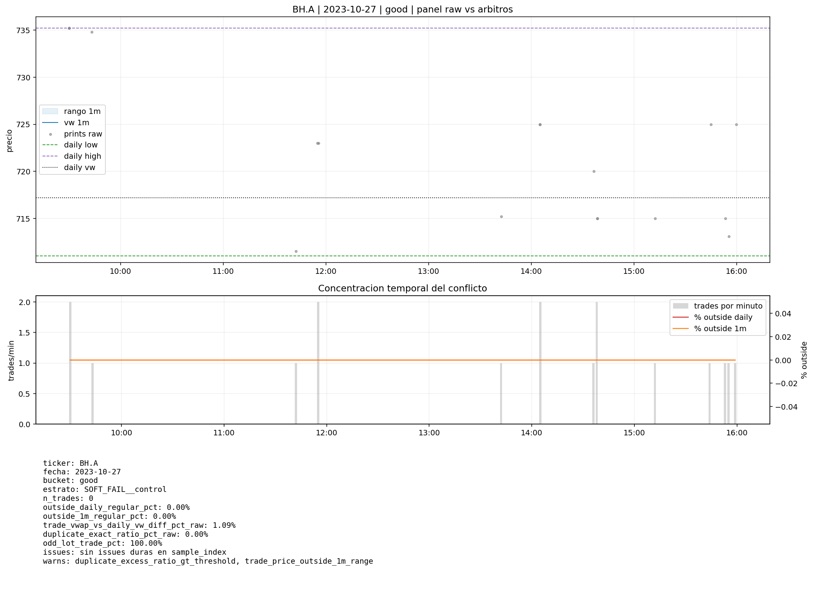

**Que muestra**

- Panel rico del tape raw frente a `daily` y `1m` para `BH.A` el `2023-10-27`.
- `n_trades = 17`, `outside_daily_regular_pct = 0.00%`, `outside_1m_regular_pct = 0.00%`.
- `trade_vwap_vs_daily_vw_diff_pct_raw = 1.09%`, `duplicate_exact_ratio_pct_raw = 0.00%`, `odd_lot_trade_pct = 100.00%`.

**Responde**

- Cola pristine donde `trades`, `daily` y `1m` alinean con limpieza. Responde a la pregunta de como luce una firma casi impecable del tape.
- Responde a si el conflicto dominante vive en la escala (`~1x`), en la comparabilidad frente a `daily` (0.00%) o frente a `1m` (0.00%).
- El 100.00% de odd-lots empuja la lectura hacia microestructura fina; evita leer el caso como pura ruptura economica gruesa.
- La decision que justifica es que el file puede usarse como patron de tape limpio, no como medida de masa util del bloque.

### BHRB | 2022-11-29

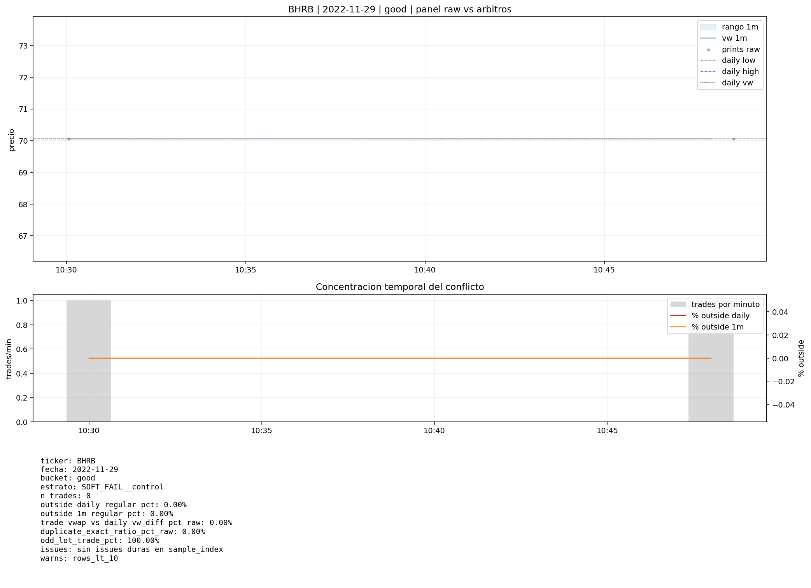

**Que muestra**

- Panel rico del tape raw frente a `daily` y `1m` para `BHRB` el `2022-11-29`.
- `n_trades = 2`, `outside_daily_regular_pct = 0.00%`, `outside_1m_regular_pct = 0.00%`.
- `trade_vwap_vs_daily_vw_diff_pct_raw = 0.00%`, `duplicate_exact_ratio_pct_raw = 0.00%`, `odd_lot_trade_pct = 100.00%`.

**Responde**

- Cola pristine donde `trades`, `daily` y `1m` alinean con limpieza. Responde a la pregunta de como luce una firma casi impecable del tape.
- Responde a si el conflicto dominante vive en la escala (`~1x`), en la comparabilidad frente a `daily` (0.00%) o frente a `1m` (0.00%).
- El 100.00% de odd-lots empuja la lectura hacia microestructura fina; evita leer el caso como pura ruptura economica gruesa.
- La decision que justifica es que el file puede usarse como patron de tape limpio, no como medida de masa util del bloque.

### BHRB | 2022-12-20

**Que muestra**

- Panel rico del tape raw frente a `daily` y `1m` para `BHRB` el `2022-12-20`.
- `n_trades = 1`, `outside_daily_regular_pct = 0.00%`, `outside_1m_regular_pct = 0.00%`.
- `trade_vwap_vs_daily_vw_diff_pct_raw = 0.00%`, `duplicate_exact_ratio_pct_raw = 0.00%`, `odd_lot_trade_pct = 100.00%`.

**Responde**

- Cola pristine donde `trades`, `daily` y `1m` alinean con limpieza. Responde a la pregunta de como luce una firma casi impecable del tape.
- Responde a si el conflicto dominante vive en la escala (`~1x`), en la comparabilidad frente a `daily` (0.00%) o frente a `1m` (0.00%).
- El 100.00% de odd-lots empuja la lectura hacia microestructura fina; evita leer el caso como pura ruptura economica gruesa.
- La decision que justifica es que el file puede usarse como patron de tape limpio, no como medida de masa util del bloque.

### BHRB | 2022-12-23

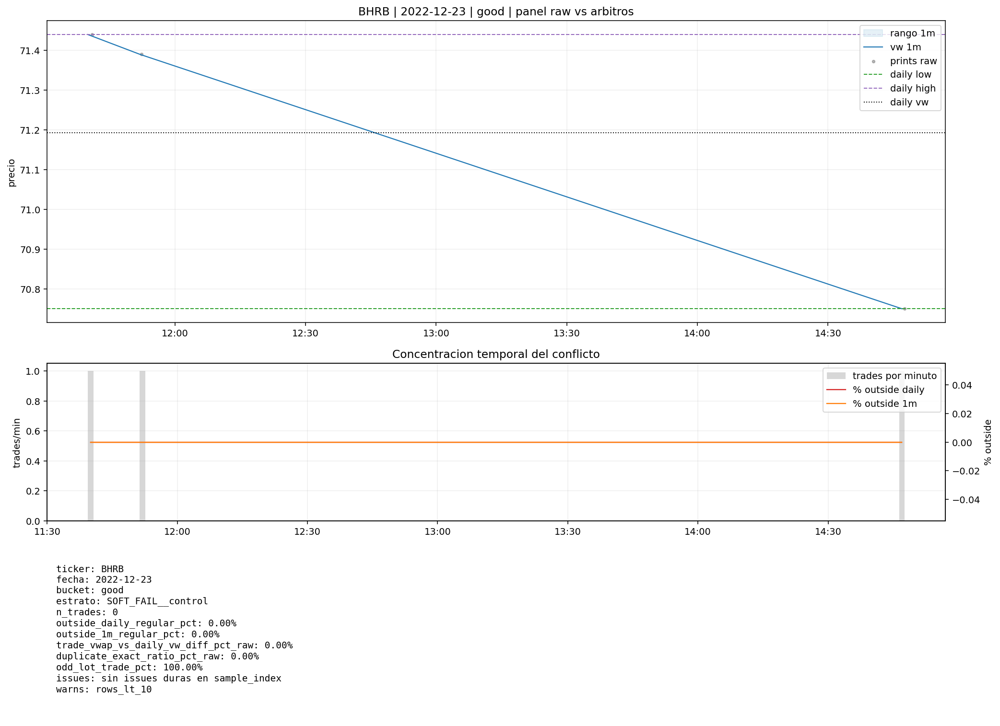

**Que muestra**

- Panel rico del tape raw frente a `daily` y `1m` para `BHRB` el `2022-12-23`.
- `n_trades = 3`, `outside_daily_regular_pct = 0.00%`, `outside_1m_regular_pct = 0.00%`.
- `trade_vwap_vs_daily_vw_diff_pct_raw = 0.00%`, `duplicate_exact_ratio_pct_raw = 0.00%`, `odd_lot_trade_pct = 100.00%`.

**Responde**

- Cola pristine donde `trades`, `daily` y `1m` alinean con limpieza. Responde a la pregunta de como luce una firma casi impecable del tape.
- Responde a si el conflicto dominante vive en la escala (`~1x`), en la comparabilidad frente a `daily` (0.00%) o frente a `1m` (0.00%).
- El 100.00% de odd-lots empuja la lectura hacia microestructura fina; evita leer el caso como pura ruptura economica gruesa.
- La decision que justifica es que el file puede usarse como patron de tape limpio, no como medida de masa util del bloque.

### BHRB | 2022-12-29

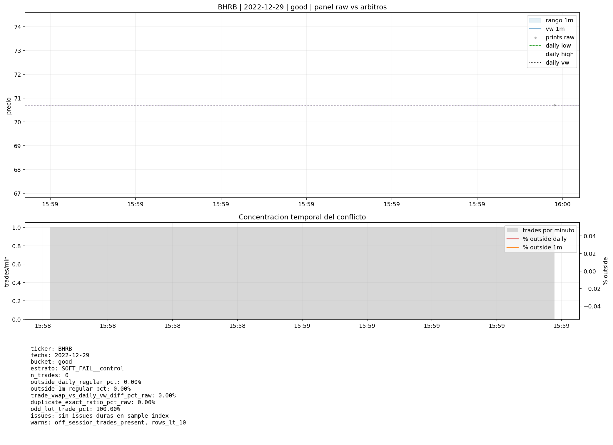

**Que muestra**

- Panel rico del tape raw frente a `daily` y `1m` para `BHRB` el `2022-12-29`.
- `n_trades = 1`, `outside_daily_regular_pct = 0.00%`, `outside_1m_regular_pct = 0.00%`.
- `trade_vwap_vs_daily_vw_diff_pct_raw = 0.00%`, `duplicate_exact_ratio_pct_raw = 0.00%`, `odd_lot_trade_pct = 100.00%`.

**Responde**

- Cola pristine donde `trades`, `daily` y `1m` alinean con limpieza. Responde a la pregunta de como luce una firma casi impecable del tape.
- Responde a si el conflicto dominante vive en la escala (`~1x`), en la comparabilidad frente a `daily` (0.00%) o frente a `1m` (0.00%).
- El 100.00% de odd-lots empuja la lectura hacia microestructura fina; evita leer el caso como pura ruptura economica gruesa.
- La decision que justifica es que el file puede usarse como patron de tape limpio, no como medida de masa util del bloque.

### BHRB | 2023-01-11

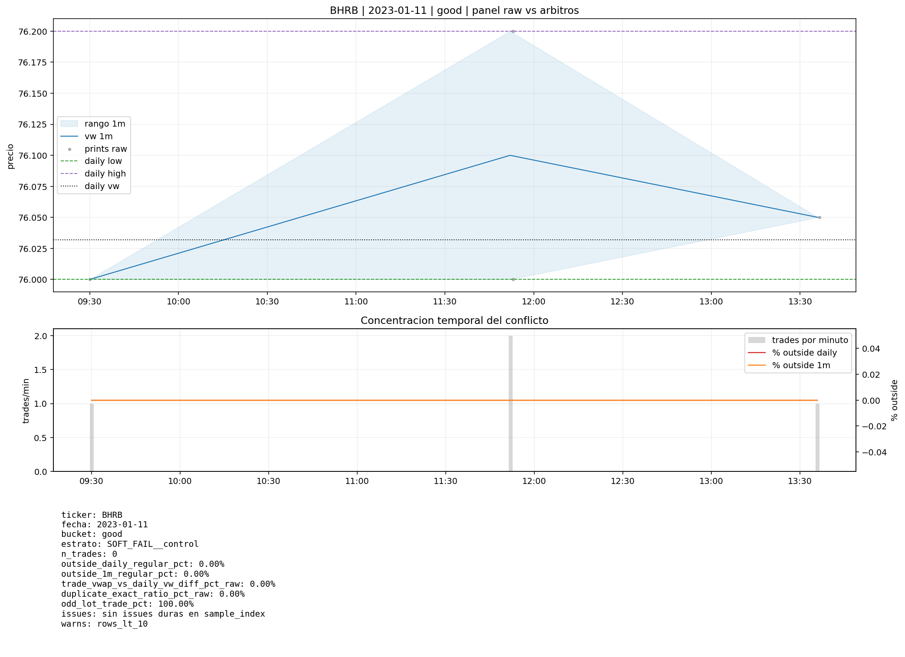

**Que muestra**

- Panel rico del tape raw frente a `daily` y `1m` para `BHRB` el `2023-01-11`.
- `n_trades = 4`, `outside_daily_regular_pct = 0.00%`, `outside_1m_regular_pct = 0.00%`.
- `trade_vwap_vs_daily_vw_diff_pct_raw = 0.00%`, `duplicate_exact_ratio_pct_raw = 0.00%`, `odd_lot_trade_pct = 100.00%`.

**Responde**

- Cola pristine donde `trades`, `daily` y `1m` alinean con limpieza. Responde a la pregunta de como luce una firma casi impecable del tape.
- Responde a si el conflicto dominante vive en la escala (`~1x`), en la comparabilidad frente a `daily` (0.00%) o frente a `1m` (0.00%).
- El 100.00% de odd-lots empuja la lectura hacia microestructura fina; evita leer el caso como pura ruptura economica gruesa.
- La decision que justifica es que el file puede usarse como patron de tape limpio, no como medida de masa util del bloque.

### BHRB | 2023-02-27

**Que muestra**

- Panel rico del tape raw frente a `daily` y `1m` para `BHRB` el `2023-02-27`.
- `n_trades = 1`, `outside_daily_regular_pct = 0.00%`, `outside_1m_regular_pct = 0.00%`.
- `trade_vwap_vs_daily_vw_diff_pct_raw = 0.00%`, `duplicate_exact_ratio_pct_raw = 0.00%`, `odd_lot_trade_pct = 100.00%`.

**Responde**

- Cola pristine donde `trades`, `daily` y `1m` alinean con limpieza. Responde a la pregunta de como luce una firma casi impecable del tape.
- Responde a si el conflicto dominante vive en la escala (`~1x`), en la comparabilidad frente a `daily` (0.00%) o frente a `1m` (0.00%).
- El 100.00% de odd-lots empuja la lectura hacia microestructura fina; evita leer el caso como pura ruptura economica gruesa.
- La decision que justifica es que el file puede usarse como patron de tape limpio, no como medida de masa util del bloque.

### BHRB | 2023-03-17

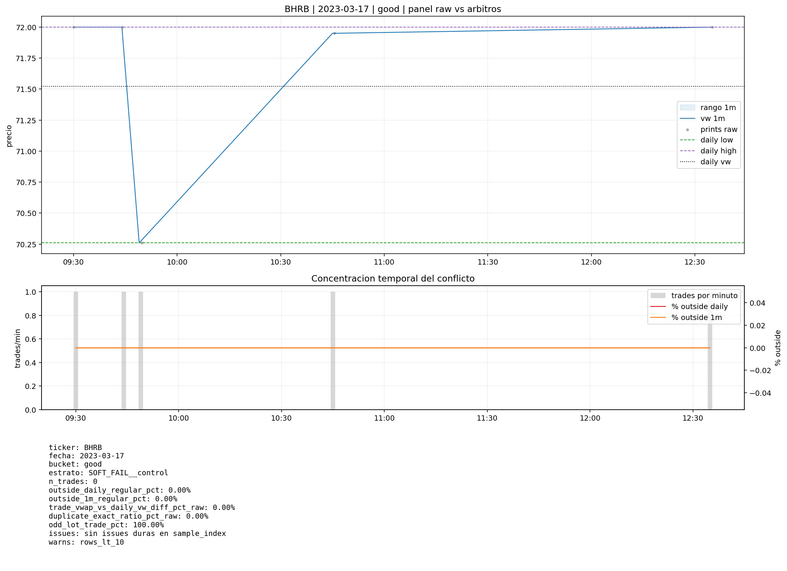

**Que muestra**

- Panel rico del tape raw frente a `daily` y `1m` para `BHRB` el `2023-03-17`.
- `n_trades = 5`, `outside_daily_regular_pct = 0.00%`, `outside_1m_regular_pct = 0.00%`.
- `trade_vwap_vs_daily_vw_diff_pct_raw = 0.00%`, `duplicate_exact_ratio_pct_raw = 0.00%`, `odd_lot_trade_pct = 100.00%`.

**Responde**

- Cola pristine donde `trades`, `daily` y `1m` alinean con limpieza. Responde a la pregunta de como luce una firma casi impecable del tape.
- Responde a si el conflicto dominante vive en la escala (`~1x`), en la comparabilidad frente a `daily` (0.00%) o frente a `1m` (0.00%).
- El 100.00% de odd-lots empuja la lectura hacia microestructura fina; evita leer el caso como pura ruptura economica gruesa.
- La decision que justifica es que el file puede usarse como patron de tape limpio, no como medida de masa util del bloque.

### BHRB | 2023-04-06

**Que muestra**

- Panel rico del tape raw frente a `daily` y `1m` para `BHRB` el `2023-04-06`.
- `n_trades = 1`, `outside_daily_regular_pct = 0.00%`, `outside_1m_regular_pct = 0.00%`.
- `trade_vwap_vs_daily_vw_diff_pct_raw = 0.00%`, `duplicate_exact_ratio_pct_raw = 0.00%`, `odd_lot_trade_pct = 100.00%`.

**Responde**

- Cola pristine donde `trades`, `daily` y `1m` alinean con limpieza. Responde a la pregunta de como luce una firma casi impecable del tape.
- Responde a si el conflicto dominante vive en la escala (`~1x`), en la comparabilidad frente a `daily` (0.00%) o frente a `1m` (0.00%).
- El 100.00% de odd-lots empuja la lectura hacia microestructura fina; evita leer el caso como pura ruptura economica gruesa.
- La decision que justifica es que el file puede usarse como patron de tape limpio, no como medida de masa util del bloque.

### DIT | 2019-01-04

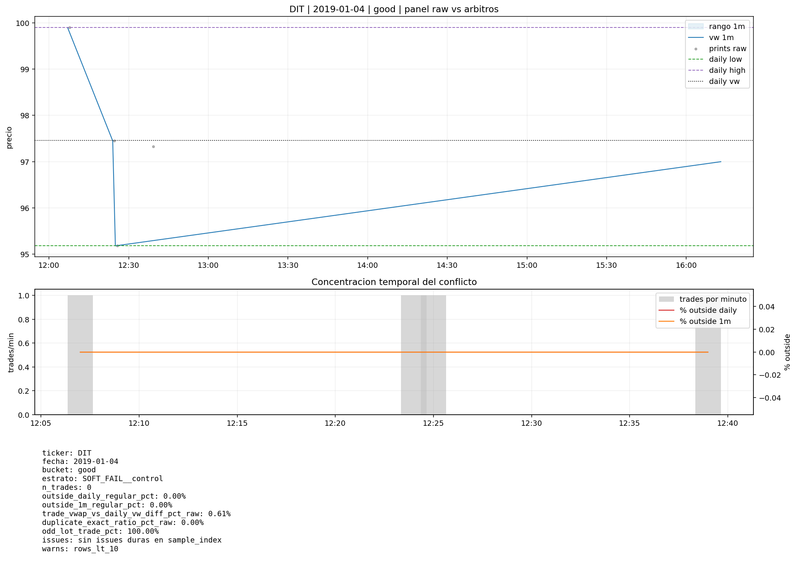

**Que muestra**

- Panel rico del tape raw frente a `daily` y `1m` para `DIT` el `2019-01-04`.
- `n_trades = 4`, `outside_daily_regular_pct = 0.00%`, `outside_1m_regular_pct = 0.00%`.
- `trade_vwap_vs_daily_vw_diff_pct_raw = 0.61%`, `duplicate_exact_ratio_pct_raw = 0.00%`, `odd_lot_trade_pct = 100.00%`.

**Responde**

- Cola pristine donde `trades`, `daily` y `1m` alinean con limpieza. Responde a la pregunta de como luce una firma casi impecable del tape.
- Responde a si el conflicto dominante vive en la escala (`~1x`), en la comparabilidad frente a `daily` (0.00%) o frente a `1m` (0.00%).
- El 100.00% de odd-lots empuja la lectura hacia microestructura fina; evita leer el caso como pura ruptura economica gruesa.
- La decision que justifica es que el file puede usarse como patron de tape limpio, no como medida de masa util del bloque.

### DIT | 2019-01-07

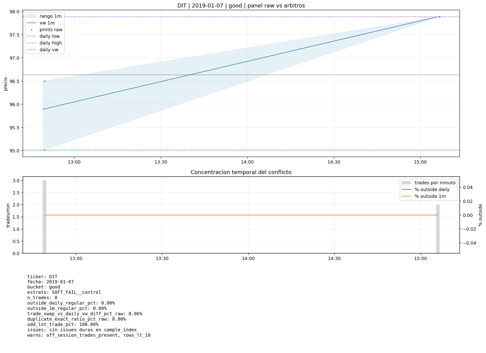

**Que muestra**

- Panel rico del tape raw frente a `daily` y `1m` para `DIT` el `2019-01-07`.
- `n_trades = 5`, `outside_daily_regular_pct = 0.00%`, `outside_1m_regular_pct = 0.00%`.
- `trade_vwap_vs_daily_vw_diff_pct_raw = 0.06%`, `duplicate_exact_ratio_pct_raw = 0.00%`, `odd_lot_trade_pct = 100.00%`.

**Responde**

- Cola pristine donde `trades`, `daily` y `1m` alinean con limpieza. Responde a la pregunta de como luce una firma casi impecable del tape.
- Responde a si el conflicto dominante vive en la escala (`~1x`), en la comparabilidad frente a `daily` (0.00%) o frente a `1m` (0.00%).
- El 100.00% de odd-lots empuja la lectura hacia microestructura fina; evita leer el caso como pura ruptura economica gruesa.
- La decision que justifica es que el file puede usarse como patron de tape limpio, no como medida de masa util del bloque.

### DIT | 2019-01-15

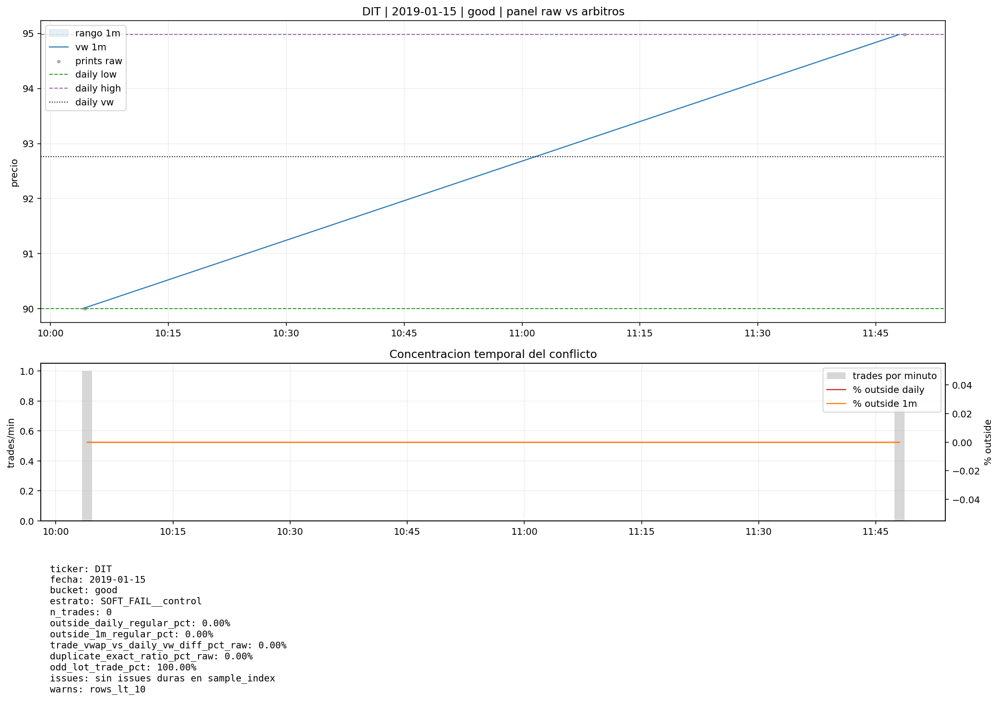

**Que muestra**

- Panel rico del tape raw frente a `daily` y `1m` para `DIT` el `2019-01-15`.
- `n_trades = 2`, `outside_daily_regular_pct = 0.00%`, `outside_1m_regular_pct = 0.00%`.
- `trade_vwap_vs_daily_vw_diff_pct_raw = 0.00%`, `duplicate_exact_ratio_pct_raw = 0.00%`, `odd_lot_trade_pct = 100.00%`.

**Responde**

- Cola pristine donde `trades`, `daily` y `1m` alinean con limpieza. Responde a la pregunta de como luce una firma casi impecable del tape.
- Responde a si el conflicto dominante vive en la escala (`~1x`), en la comparabilidad frente a `daily` (0.00%) o frente a `1m` (0.00%).
- El 100.00% de odd-lots empuja la lectura hacia microestructura fina; evita leer el caso como pura ruptura economica gruesa.
- La decision que justifica es que el file puede usarse como patron de tape limpio, no como medida de masa util del bloque.

### DIT | 2019-01-18

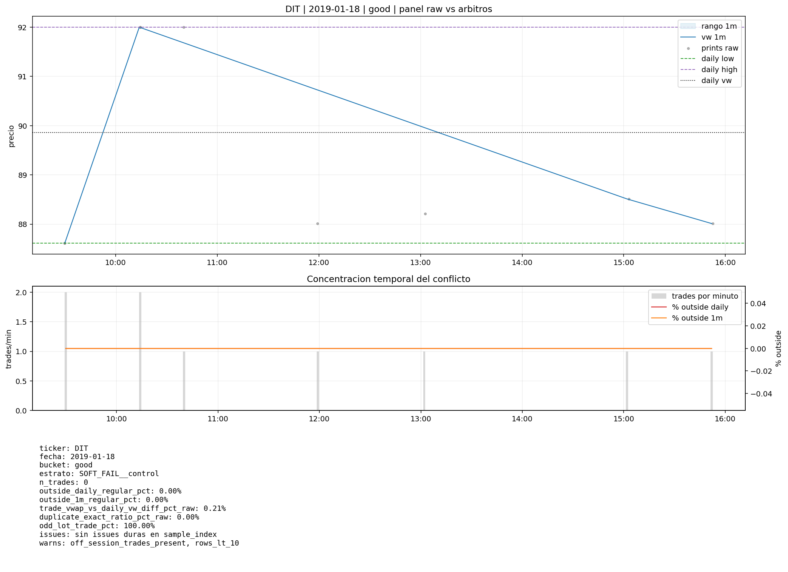

**Que muestra**

- Panel rico del tape raw frente a `daily` y `1m` para `DIT` el `2019-01-18`.
- `n_trades = 9`, `outside_daily_regular_pct = 0.00%`, `outside_1m_regular_pct = 0.00%`.
- `trade_vwap_vs_daily_vw_diff_pct_raw = 0.21%`, `duplicate_exact_ratio_pct_raw = 0.00%`, `odd_lot_trade_pct = 100.00%`.

**Responde**

- Cola pristine donde `trades`, `daily` y `1m` alinean con limpieza. Responde a la pregunta de como luce una firma casi impecable del tape.
- Responde a si el conflicto dominante vive en la escala (`~1x`), en la comparabilidad frente a `daily` (0.00%) o frente a `1m` (0.00%).
- El 100.00% de odd-lots empuja la lectura hacia microestructura fina; evita leer el caso como pura ruptura economica gruesa.
- La decision que justifica es que el file puede usarse como patron de tape limpio, no como medida de masa util del bloque.

### DIT | 2019-01-30

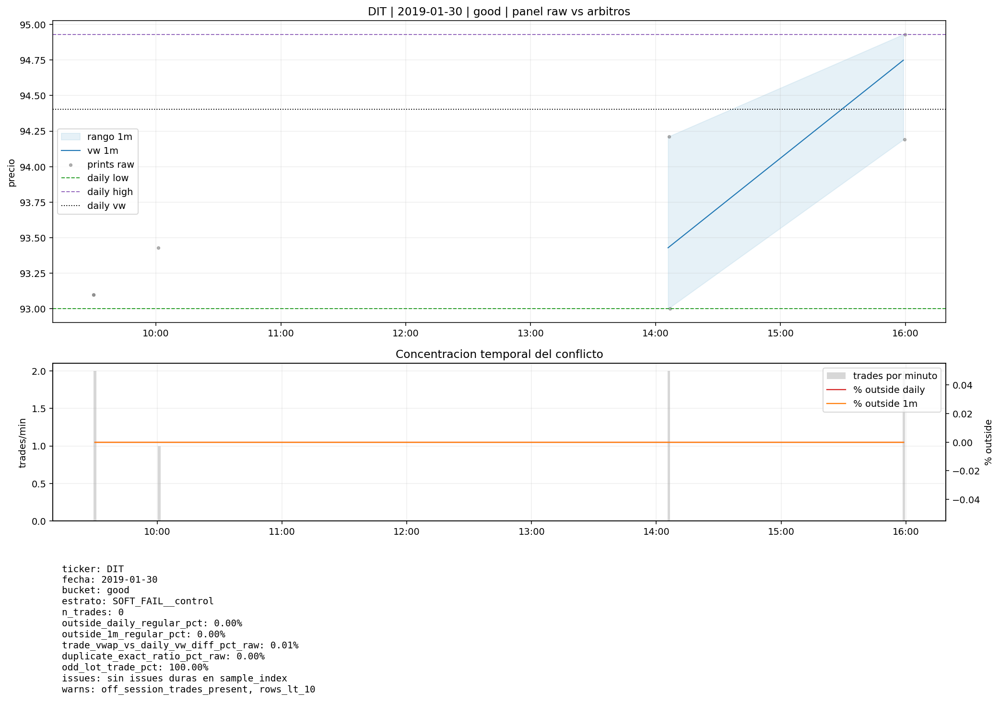

**Que muestra**

- Panel rico del tape raw frente a `daily` y `1m` para `DIT` el `2019-01-30`.
- `n_trades = 7`, `outside_daily_regular_pct = 0.00%`, `outside_1m_regular_pct = 0.00%`.
- `trade_vwap_vs_daily_vw_diff_pct_raw = 0.01%`, `duplicate_exact_ratio_pct_raw = 0.00%`, `odd_lot_trade_pct = 100.00%`.

**Responde**

- Cola pristine donde `trades`, `daily` y `1m` alinean con limpieza. Responde a la pregunta de como luce una firma casi impecable del tape.
- Responde a si el conflicto dominante vive en la escala (`~1x`), en la comparabilidad frente a `daily` (0.00%) o frente a `1m` (0.00%).
- El 100.00% de odd-lots empuja la lectura hacia microestructura fina; evita leer el caso como pura ruptura economica gruesa.
- La decision que justifica es que el file puede usarse como patron de tape limpio, no como medida de masa util del bloque.

### DIT | 2019-09-05

**Que muestra**

- Panel rico del tape raw frente a `daily` y `1m` para `DIT` el `2019-09-05`.
- `n_trades = 1`, `outside_daily_regular_pct = 0.00%`, `outside_1m_regular_pct = 0.00%`.
- `trade_vwap_vs_daily_vw_diff_pct_raw = 0.00%`, `duplicate_exact_ratio_pct_raw = 0.00%`, `odd_lot_trade_pct = 100.00%`.

**Responde**

- Cola pristine donde `trades`, `daily` y `1m` alinean con limpieza. Responde a la pregunta de como luce una firma casi impecable del tape.
- Responde a si el conflicto dominante vive en la escala (`~1x`), en la comparabilidad frente a `daily` (0.00%) o frente a `1m` (0.00%).
- El 100.00% de odd-lots empuja la lectura hacia microestructura fina; evita leer el caso como pura ruptura economica gruesa.
- La decision que justifica es que el file puede usarse como patron de tape limpio, no como medida de masa util del bloque.

### DIT | 2019-09-13

**Que muestra**

- Panel rico del tape raw frente a `daily` y `1m` para `DIT` el `2019-09-13`.
- `n_trades = 2`, `outside_daily_regular_pct = 0.00%`, `outside_1m_regular_pct = 0.00%`.
- `trade_vwap_vs_daily_vw_diff_pct_raw = 0.00%`, `duplicate_exact_ratio_pct_raw = 0.00%`, `odd_lot_trade_pct = 100.00%`.

**Responde**

- Cola pristine donde `trades`, `daily` y `1m` alinean con limpieza. Responde a la pregunta de como luce una firma casi impecable del tape.
- Responde a si el conflicto dominante vive en la escala (`~1x`), en la comparabilidad frente a `daily` (0.00%) o frente a `1m` (0.00%).
- El 100.00% de odd-lots empuja la lectura hacia microestructura fina; evita leer el caso como pura ruptura economica gruesa.
- La decision que justifica es que el file puede usarse como patron de tape limpio, no como medida de masa util del bloque.

### DIT | 2019-10-01

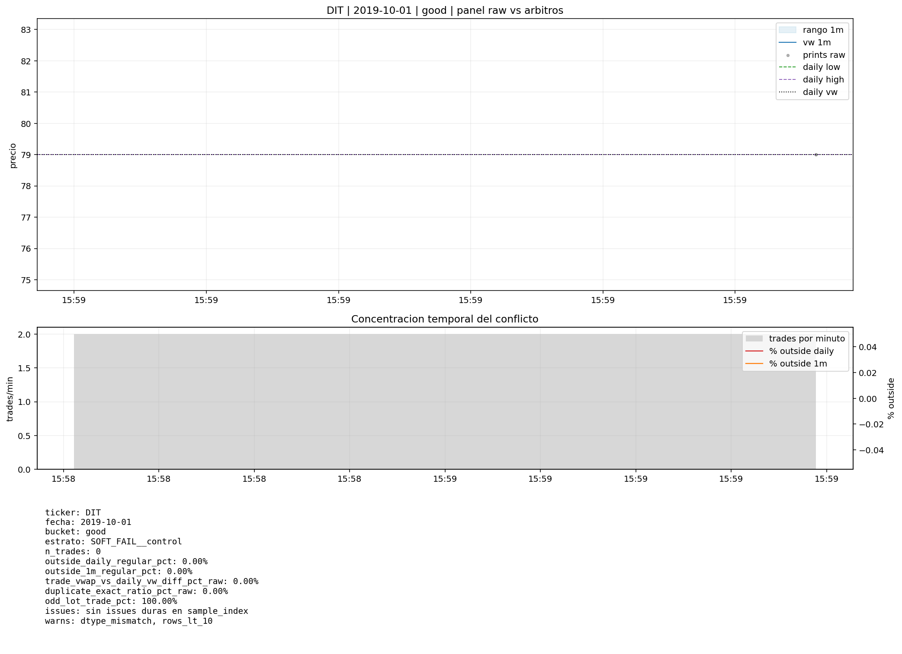

**Que muestra**

- Panel rico del tape raw frente a `daily` y `1m` para `DIT` el `2019-10-01`.
- `n_trades = 2`, `outside_daily_regular_pct = 0.00%`, `outside_1m_regular_pct = 0.00%`.
- `trade_vwap_vs_daily_vw_diff_pct_raw = 0.00%`, `duplicate_exact_ratio_pct_raw = 0.00%`, `odd_lot_trade_pct = 100.00%`.

**Responde**

- Cola pristine donde `trades`, `daily` y `1m` alinean con limpieza. Responde a la pregunta de como luce una firma casi impecable del tape.
- Responde a si el conflicto dominante vive en la escala (`~1x`), en la comparabilidad frente a `daily` (0.00%) o frente a `1m` (0.00%).
- El 100.00% de odd-lots empuja la lectura hacia microestructura fina; evita leer el caso como pura ruptura economica gruesa.
- La decision que justifica es que el file puede usarse como patron de tape limpio, no como medida de masa util del bloque.

### DIT | 2019-10-02

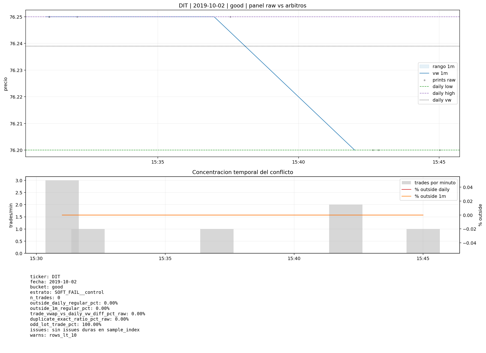

**Que muestra**

- Panel rico del tape raw frente a `daily` y `1m` para `DIT` el `2019-10-02`.
- `n_trades = 8`, `outside_daily_regular_pct = 0.00%`, `outside_1m_regular_pct = 0.00%`.
- `trade_vwap_vs_daily_vw_diff_pct_raw = 0.00%`, `duplicate_exact_ratio_pct_raw = 0.00%`, `odd_lot_trade_pct = 100.00%`.

**Responde**

- Cola pristine donde `trades`, `daily` y `1m` alinean con limpieza. Responde a la pregunta de como luce una firma casi impecable del tape.
- Responde a si el conflicto dominante vive en la escala (`~1x`), en la comparabilidad frente a `daily` (0.00%) o frente a `1m` (0.00%).
- El 100.00% de odd-lots empuja la lectura hacia microestructura fina; evita leer el caso como pura ruptura economica gruesa.
- La decision que justifica es que el file puede usarse como patron de tape limpio, no como medida de masa util del bloque.

### DIT | 2019-10-23

**Que muestra**

- Panel rico del tape raw frente a `daily` y `1m` para `DIT` el `2019-10-23`.
- `n_trades = 2`, `outside_daily_regular_pct = 0.00%`, `outside_1m_regular_pct = 0.00%`.
- `trade_vwap_vs_daily_vw_diff_pct_raw = 0.00%`, `duplicate_exact_ratio_pct_raw = 0.00%`, `odd_lot_trade_pct = 100.00%`.

**Responde**

- Cola pristine donde `trades`, `daily` y `1m` alinean con limpieza. Responde a la pregunta de como luce una firma casi impecable del tape.
- Responde a si el conflicto dominante vive en la escala (`~1x`), en la comparabilidad frente a `daily` (0.00%) o frente a `1m` (0.00%).
- El 100.00% de odd-lots empuja la lectura hacia microestructura fina; evita leer el caso como pura ruptura economica gruesa.
- La decision que justifica es que el file puede usarse como patron de tape limpio, no como medida de masa util del bloque.

### DIT | 2019-11-08

**Que muestra**

- Panel rico del tape raw frente a `daily` y `1m` para `DIT` el `2019-11-08`.
- `n_trades = 1`, `outside_daily_regular_pct = 0.00%`, `outside_1m_regular_pct = 0.00%`.
- `trade_vwap_vs_daily_vw_diff_pct_raw = 0.00%`, `duplicate_exact_ratio_pct_raw = 0.00%`, `odd_lot_trade_pct = 100.00%`.

**Responde**

- Cola pristine donde `trades`, `daily` y `1m` alinean con limpieza. Responde a la pregunta de como luce una firma casi impecable del tape.
- Responde a si el conflicto dominante vive en la escala (`~1x`), en la comparabilidad frente a `daily` (0.00%) o frente a `1m` (0.00%).
- El 100.00% de odd-lots empuja la lectura hacia microestructura fina; evita leer el caso como pura ruptura economica gruesa.
- La decision que justifica es que el file puede usarse como patron de tape limpio, no como medida de masa util del bloque.

### DIT | 2019-12-11

**Que muestra**

- Panel rico del tape raw frente a `daily` y `1m` para `DIT` el `2019-12-11`.
- `n_trades = 2`, `outside_daily_regular_pct = 0.00%`, `outside_1m_regular_pct = 0.00%`.
- `trade_vwap_vs_daily_vw_diff_pct_raw = 0.00%`, `duplicate_exact_ratio_pct_raw = 0.00%`, `odd_lot_trade_pct = 100.00%`.

**Responde**

- Cola pristine donde `trades`, `daily` y `1m` alinean con limpieza. Responde a la pregunta de como luce una firma casi impecable del tape.
- Responde a si el conflicto dominante vive en la escala (`~1x`), en la comparabilidad frente a `daily` (0.00%) o frente a `1m` (0.00%).
- El 100.00% de odd-lots empuja la lectura hacia microestructura fina; evita leer el caso como pura ruptura economica gruesa.
- La decision que justifica es que el file puede usarse como patron de tape limpio, no como medida de masa util del bloque.

### DIT | 2019-12-12

**Que muestra**

- Panel rico del tape raw frente a `daily` y `1m` para `DIT` el `2019-12-12`.
- `n_trades = 1`, `outside_daily_regular_pct = 0.00%`, `outside_1m_regular_pct = 0.00%`.
- `trade_vwap_vs_daily_vw_diff_pct_raw = 0.11%`, `duplicate_exact_ratio_pct_raw = 0.00%`, `odd_lot_trade_pct = 100.00%`.

**Responde**

- Cola pristine donde `trades`, `daily` y `1m` alinean con limpieza. Responde a la pregunta de como luce una firma casi impecable del tape.
- Responde a si el conflicto dominante vive en la escala (`~1x`), en la comparabilidad frente a `daily` (0.00%) o frente a `1m` (0.00%).
- El 100.00% de odd-lots empuja la lectura hacia microestructura fina; evita leer el caso como pura ruptura economica gruesa.
- La decision que justifica es que el file puede usarse como patron de tape limpio, no como medida de masa util del bloque.

### DIT | 2020-01-29

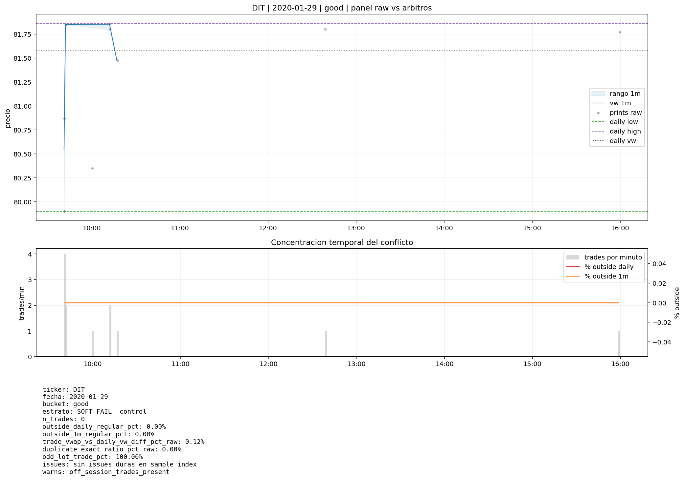

**Que muestra**

- Panel rico del tape raw frente a `daily` y `1m` para `DIT` el `2020-01-29`.
- `n_trades = 12`, `outside_daily_regular_pct = 0.00%`, `outside_1m_regular_pct = 0.00%`.
- `trade_vwap_vs_daily_vw_diff_pct_raw = 0.12%`, `duplicate_exact_ratio_pct_raw = 0.00%`, `odd_lot_trade_pct = 100.00%`.

**Responde**

- Cola pristine donde `trades`, `daily` y `1m` alinean con limpieza. Responde a la pregunta de como luce una firma casi impecable del tape.
- Responde a si el conflicto dominante vive en la escala (`~1x`), en la comparabilidad frente a `daily` (0.00%) o frente a `1m` (0.00%).
- El 100.00% de odd-lots empuja la lectura hacia microestructura fina; evita leer el caso como pura ruptura economica gruesa.
- La decision que justifica es que el file puede usarse como patron de tape limpio, no como medida de masa util del bloque.

### DIT | 2020-02-13

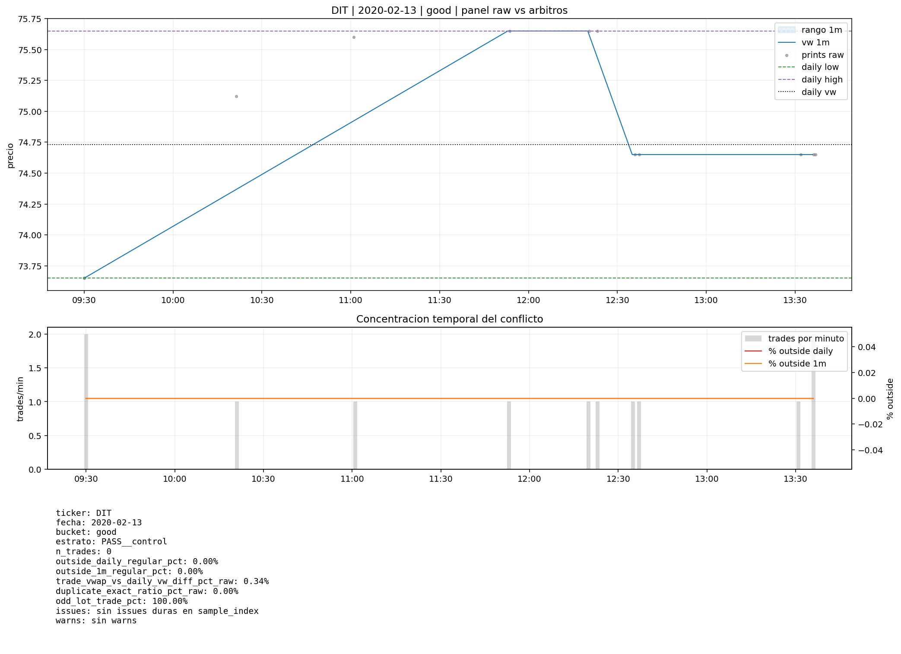

**Que muestra**

- Panel rico del tape raw frente a `daily` y `1m` para `DIT` el `2020-02-13`.
- `n_trades = 12`, `outside_daily_regular_pct = 0.00%`, `outside_1m_regular_pct = 0.00%`.
- `trade_vwap_vs_daily_vw_diff_pct_raw = 0.34%`, `duplicate_exact_ratio_pct_raw = 0.00%`, `odd_lot_trade_pct = 100.00%`.

**Responde**

- Cola pristine donde `trades`, `daily` y `1m` alinean con limpieza. Responde a la pregunta de como luce una firma casi impecable del tape.
- Responde a si el conflicto dominante vive en la escala (`~1x`), en la comparabilidad frente a `daily` (0.00%) o frente a `1m` (0.00%).
- El 100.00% de odd-lots empuja la lectura hacia microestructura fina; evita leer el caso como pura ruptura economica gruesa.
- La decision que justifica es que el file puede usarse como patron de tape limpio, no como medida de masa util del bloque.

### DIT | 2020-03-12

**Que muestra**

- Panel rico del tape raw frente a `daily` y `1m` para `DIT` el `2020-03-12`.
- `n_trades = 1`, `outside_daily_regular_pct = 0.00%`, `outside_1m_regular_pct = 0.00%`.
- `trade_vwap_vs_daily_vw_diff_pct_raw = 0.00%`, `duplicate_exact_ratio_pct_raw = 0.00%`, `odd_lot_trade_pct = 100.00%`.

**Responde**

- Cola pristine donde `trades`, `daily` y `1m` alinean con limpieza. Responde a la pregunta de como luce una firma casi impecable del tape.
- Responde a si el conflicto dominante vive en la escala (`~1x`), en la comparabilidad frente a `daily` (0.00%) o frente a `1m` (0.00%).
- El 100.00% de odd-lots empuja la lectura hacia microestructura fina; evita leer el caso como pura ruptura economica gruesa.
- La decision que justifica es que el file puede usarse como patron de tape limpio, no como medida de masa util del bloque.

### DIT | 2020-03-31

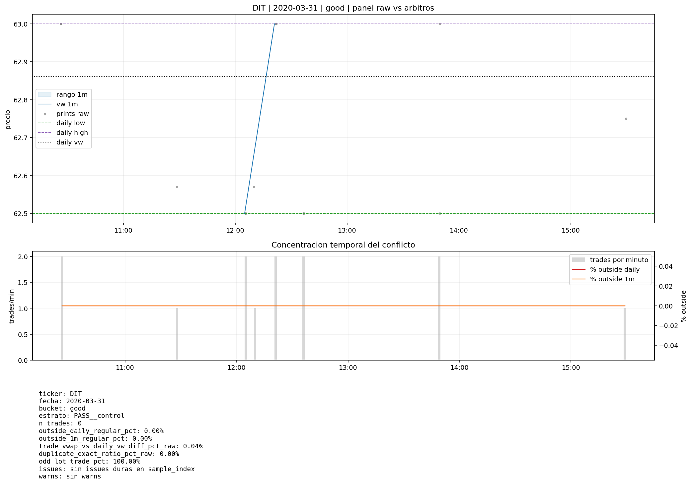

**Que muestra**

- Panel rico del tape raw frente a `daily` y `1m` para `DIT` el `2020-03-31`.
- `n_trades = 13`, `outside_daily_regular_pct = 0.00%`, `outside_1m_regular_pct = 0.00%`.
- `trade_vwap_vs_daily_vw_diff_pct_raw = 0.04%`, `duplicate_exact_ratio_pct_raw = 0.00%`, `odd_lot_trade_pct = 100.00%`.

**Responde**

- Cola pristine donde `trades`, `daily` y `1m` alinean con limpieza. Responde a la pregunta de como luce una firma casi impecable del tape.
- Responde a si el conflicto dominante vive en la escala (`~1x`), en la comparabilidad frente a `daily` (0.00%) o frente a `1m` (0.00%).
- El 100.00% de odd-lots empuja la lectura hacia microestructura fina; evita leer el caso como pura ruptura economica gruesa.
- La decision que justifica es que el file puede usarse como patron de tape limpio, no como medida de masa util del bloque.

### DIT | 2020-04-15

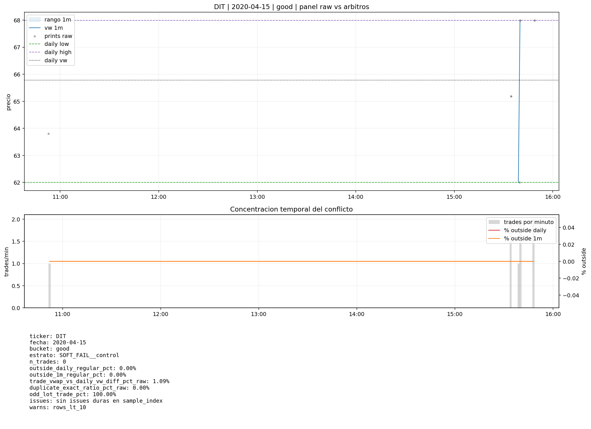

**Que muestra**

- Panel rico del tape raw frente a `daily` y `1m` para `DIT` el `2020-04-15`.
- `n_trades = 8`, `outside_daily_regular_pct = 0.00%`, `outside_1m_regular_pct = 0.00%`.
- `trade_vwap_vs_daily_vw_diff_pct_raw = 1.09%`, `duplicate_exact_ratio_pct_raw = 0.00%`, `odd_lot_trade_pct = 100.00%`.

**Responde**

- Cola pristine donde `trades`, `daily` y `1m` alinean con limpieza. Responde a la pregunta de como luce una firma casi impecable del tape.
- Responde a si el conflicto dominante vive en la escala (`~1x`), en la comparabilidad frente a `daily` (0.00%) o frente a `1m` (0.00%).
- El 100.00% de odd-lots empuja la lectura hacia microestructura fina; evita leer el caso como pura ruptura economica gruesa.
- La decision que justifica es que el file puede usarse como patron de tape limpio, no como medida de masa util del bloque.

### DIT | 2020-06-29

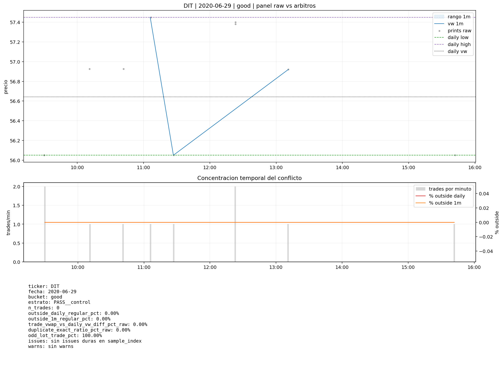

**Que muestra**

- Panel rico del tape raw frente a `daily` y `1m` para `DIT` el `2020-06-29`.
- `n_trades = 10`, `outside_daily_regular_pct = 0.00%`, `outside_1m_regular_pct = 0.00%`.
- `trade_vwap_vs_daily_vw_diff_pct_raw = 0.00%`, `duplicate_exact_ratio_pct_raw = 0.00%`, `odd_lot_trade_pct = 100.00%`.

**Responde**

- Cola pristine donde `trades`, `daily` y `1m` alinean con limpieza. Responde a la pregunta de como luce una firma casi impecable del tape.
- Responde a si el conflicto dominante vive en la escala (`~1x`), en la comparabilidad frente a `daily` (0.00%) o frente a `1m` (0.00%).
- El 100.00% de odd-lots empuja la lectura hacia microestructura fina; evita leer el caso como pura ruptura economica gruesa.
- La decision que justifica es que el file puede usarse como patron de tape limpio, no como medida de masa util del bloque.

### DIT | 2020-06-30

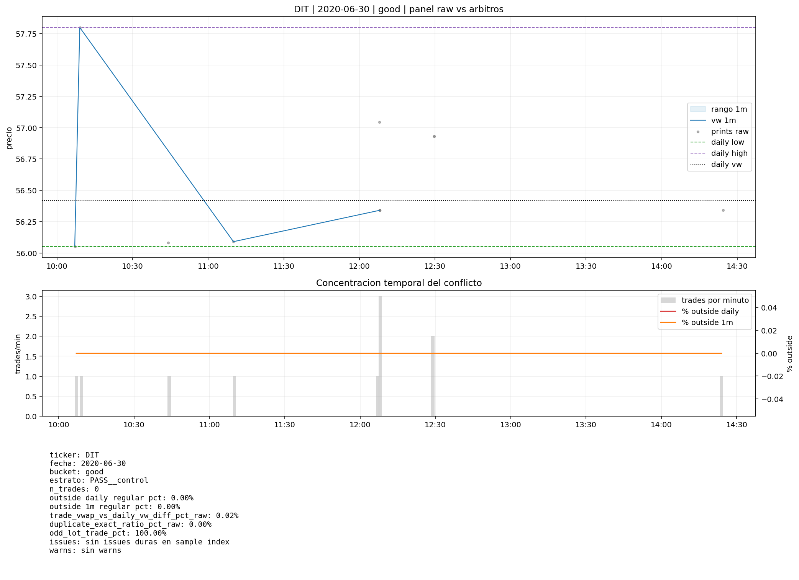

**Que muestra**

- Panel rico del tape raw frente a `daily` y `1m` para `DIT` el `2020-06-30`.
- `n_trades = 11`, `outside_daily_regular_pct = 0.00%`, `outside_1m_regular_pct = 0.00%`.
- `trade_vwap_vs_daily_vw_diff_pct_raw = 0.02%`, `duplicate_exact_ratio_pct_raw = 0.00%`, `odd_lot_trade_pct = 100.00%`.

**Responde**

- Cola pristine donde `trades`, `daily` y `1m` alinean con limpieza. Responde a la pregunta de como luce una firma casi impecable del tape.
- Responde a si el conflicto dominante vive en la escala (`~1x`), en la comparabilidad frente a `daily` (0.00%) o frente a `1m` (0.00%).
- El 100.00% de odd-lots empuja la lectura hacia microestructura fina; evita leer el caso como pura ruptura economica gruesa.
- La decision que justifica es que el file puede usarse como patron de tape limpio, no como medida de masa util del bloque.

### DIT | 2020-08-07

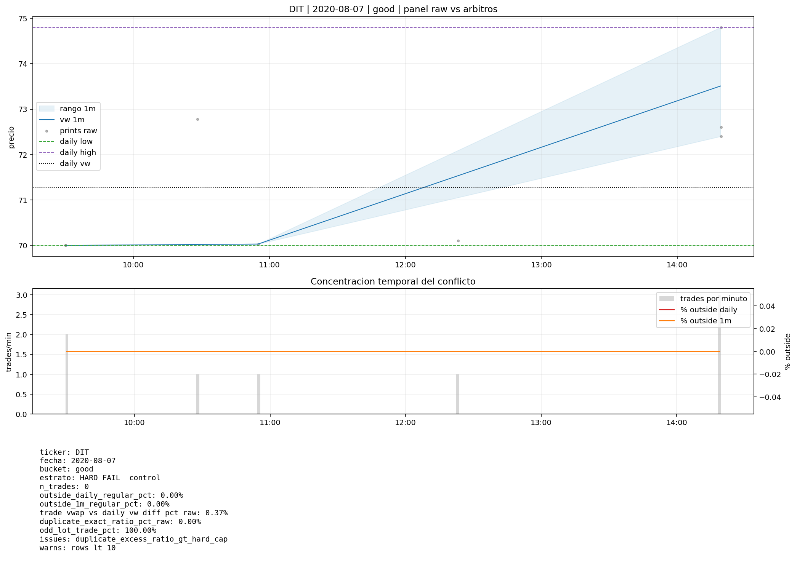

**Que muestra**

- Panel rico del tape raw frente a `daily` y `1m` para `DIT` el `2020-08-07`.
- `n_trades = 8`, `outside_daily_regular_pct = 0.00%`, `outside_1m_regular_pct = 0.00%`.
- `trade_vwap_vs_daily_vw_diff_pct_raw = 0.37%`, `duplicate_exact_ratio_pct_raw = 0.00%`, `odd_lot_trade_pct = 100.00%`.

**Responde**

- Cola pristine donde `trades`, `daily` y `1m` alinean con limpieza. Responde a la pregunta de como luce una firma casi impecable del tape.
- Responde a si el conflicto dominante vive en la escala (`~1x`), en la comparabilidad frente a `daily` (0.00%) o frente a `1m` (0.00%).
- El 100.00% de odd-lots empuja la lectura hacia microestructura fina; evita leer el caso como pura ruptura economica gruesa.
- La decision que justifica es que el file puede usarse como patron de tape limpio, no como medida de masa util del bloque.

### DIT | 2020-10-21

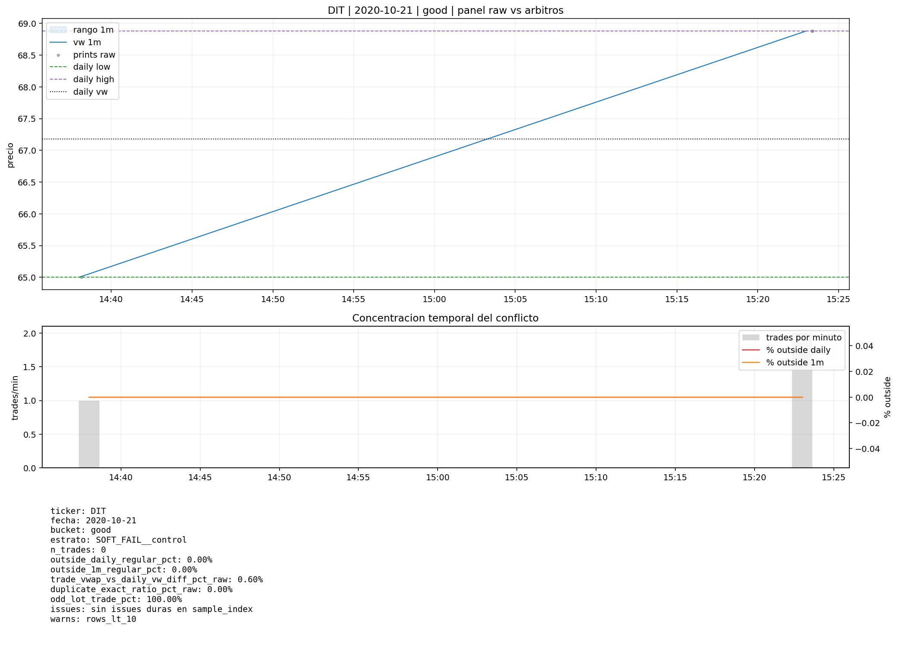

**Que muestra**

- Panel rico del tape raw frente a `daily` y `1m` para `DIT` el `2020-10-21`.
- `n_trades = 3`, `outside_daily_regular_pct = 0.00%`, `outside_1m_regular_pct = 0.00%`.
- `trade_vwap_vs_daily_vw_diff_pct_raw = 0.60%`, `duplicate_exact_ratio_pct_raw = 0.00%`, `odd_lot_trade_pct = 100.00%`.

**Responde**

- Cola pristine donde `trades`, `daily` y `1m` alinean con limpieza. Responde a la pregunta de como luce una firma casi impecable del tape.
- Responde a si el conflicto dominante vive en la escala (`~1x`), en la comparabilidad frente a `daily` (0.00%) o frente a `1m` (0.00%).
- El 100.00% de odd-lots empuja la lectura hacia microestructura fina; evita leer el caso como pura ruptura economica gruesa.
- La decision que justifica es que el file puede usarse como patron de tape limpio, no como medida de masa util del bloque.

### DIT | 2020-10-28

**Que muestra**

- Panel rico del tape raw frente a `daily` y `1m` para `DIT` el `2020-10-28`.
- `n_trades = 3`, `outside_daily_regular_pct = 0.00%`, `outside_1m_regular_pct = 0.00%`.
- `trade_vwap_vs_daily_vw_diff_pct_raw = 0.00%`, `duplicate_exact_ratio_pct_raw = 0.00%`, `odd_lot_trade_pct = 100.00%`.

**Responde**

- Cola pristine donde `trades`, `daily` y `1m` alinean con limpieza. Responde a la pregunta de como luce una firma casi impecable del tape.
- Responde a si el conflicto dominante vive en la escala (`~1x`), en la comparabilidad frente a `daily` (0.00%) o frente a `1m` (0.00%).
- El 100.00% de odd-lots empuja la lectura hacia microestructura fina; evita leer el caso como pura ruptura economica gruesa.
- La decision que justifica es que el file puede usarse como patron de tape limpio, no como medida de masa util del bloque.

### DIT | 2020-12-09

**Que muestra**

- Panel rico del tape raw frente a `daily` y `1m` para `DIT` el `2020-12-09`.
- `n_trades = 2`, `outside_daily_regular_pct = 0.00%`, `outside_1m_regular_pct = 0.00%`.
- `trade_vwap_vs_daily_vw_diff_pct_raw = 0.16%`, `duplicate_exact_ratio_pct_raw = 0.00%`, `odd_lot_trade_pct = 100.00%`.

**Responde**

- Cola pristine donde `trades`, `daily` y `1m` alinean con limpieza. Responde a la pregunta de como luce una firma casi impecable del tape.
- Responde a si el conflicto dominante vive en la escala (`~1x`), en la comparabilidad frente a `daily` (0.00%) o frente a `1m` (0.00%).
- El 100.00% de odd-lots empuja la lectura hacia microestructura fina; evita leer el caso como pura ruptura economica gruesa.
- La decision que justifica es que el file puede usarse como patron de tape limpio, no como medida de masa util del bloque.

### DIT | 2023-04-21

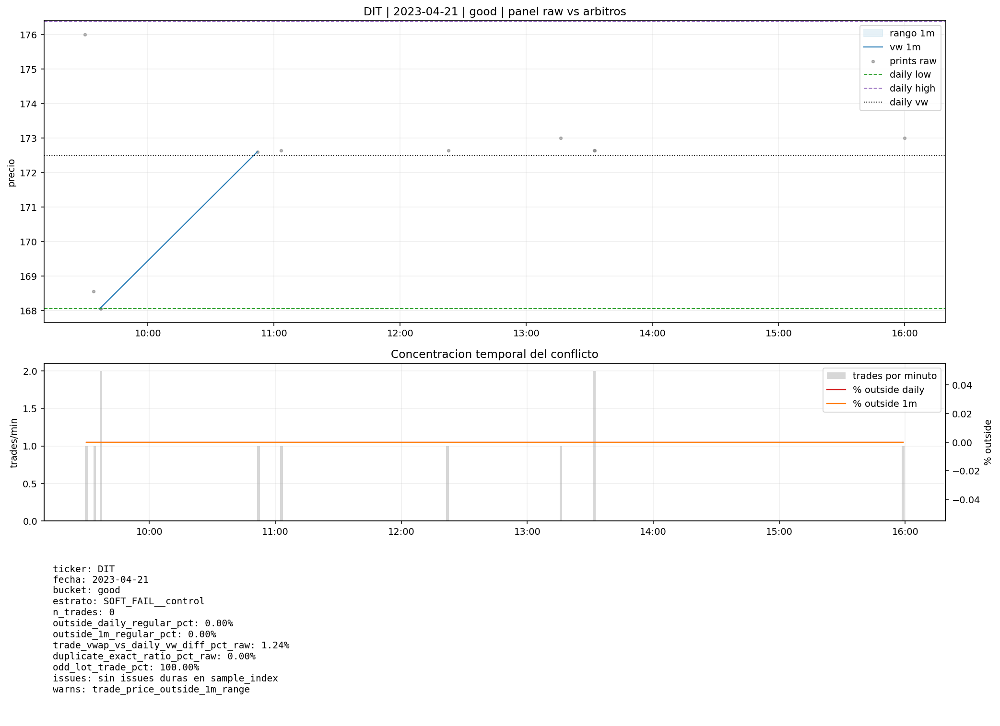

**Que muestra**

- Panel rico del tape raw frente a `daily` y `1m` para `DIT` el `2023-04-21`.
- `n_trades = 11`, `outside_daily_regular_pct = 0.00%`, `outside_1m_regular_pct = 0.00%`.
- `trade_vwap_vs_daily_vw_diff_pct_raw = 1.24%`, `duplicate_exact_ratio_pct_raw = 0.00%`, `odd_lot_trade_pct = 100.00%`.

**Responde**

- Cola pristine donde `trades`, `daily` y `1m` alinean con limpieza. Responde a la pregunta de como luce una firma casi impecable del tape.
- Responde a si el conflicto dominante vive en la escala (`~1x`), en la comparabilidad frente a `daily` (0.00%) o frente a `1m` (0.00%).
- El 100.00% de odd-lots empuja la lectura hacia microestructura fina; evita leer el caso como pura ruptura economica gruesa.
- La decision que justifica es que el file puede usarse como patron de tape limpio, no como medida de masa util del bloque.

### DIT | 2024-09-04

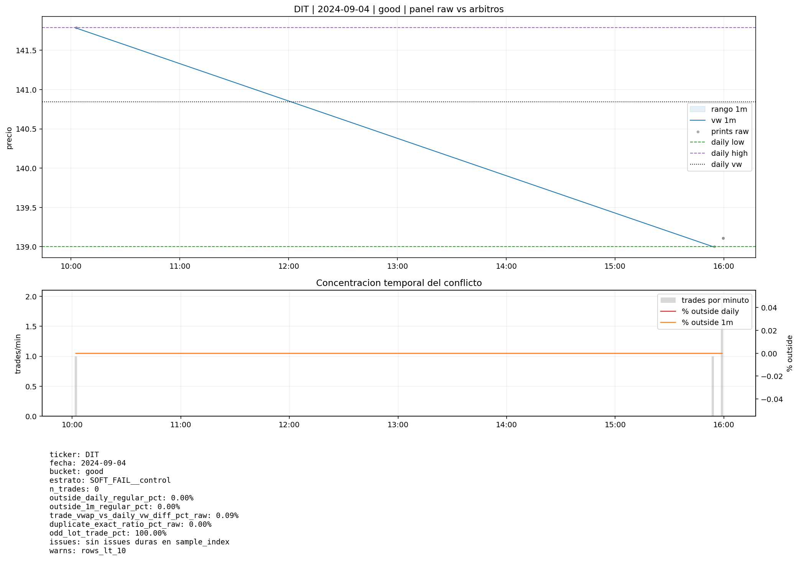

**Que muestra**

- Panel rico del tape raw frente a `daily` y `1m` para `DIT` el `2024-09-04`.
- `n_trades = 4`, `outside_daily_regular_pct = 0.00%`, `outside_1m_regular_pct = 0.00%`.
- `trade_vwap_vs_daily_vw_diff_pct_raw = 0.09%`, `duplicate_exact_ratio_pct_raw = 0.00%`, `odd_lot_trade_pct = 100.00%`.

**Responde**

- Cola pristine donde `trades`, `daily` y `1m` alinean con limpieza. Responde a la pregunta de como luce una firma casi impecable del tape.
- Responde a si el conflicto dominante vive en la escala (`~1x`), en la comparabilidad frente a `daily` (0.00%) o frente a `1m` (0.00%).
- El 100.00% de odd-lots empuja la lectura hacia microestructura fina; evita leer el caso como pura ruptura economica gruesa.
- La decision que justifica es que el file puede usarse como patron de tape limpio, no como medida de masa util del bloque.

### DIT | 2025-07-22

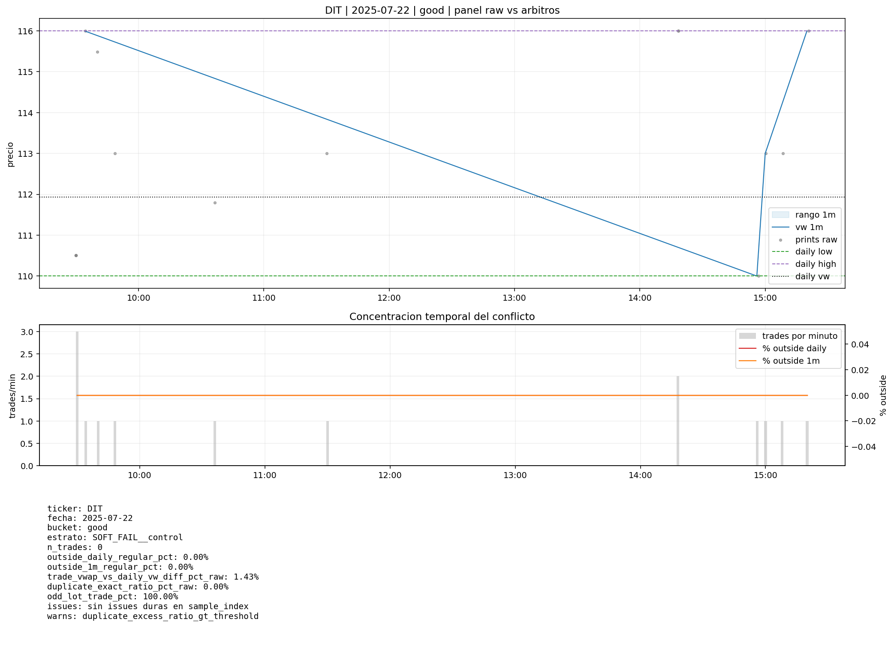

**Que muestra**

- Panel rico del tape raw frente a `daily` y `1m` para `DIT` el `2025-07-22`.
- `n_trades = 14`, `outside_daily_regular_pct = 0.00%`, `outside_1m_regular_pct = 0.00%`.
- `trade_vwap_vs_daily_vw_diff_pct_raw = 1.43%`, `duplicate_exact_ratio_pct_raw = 0.00%`, `odd_lot_trade_pct = 100.00%`.

**Responde**

- Cola pristine donde `trades`, `daily` y `1m` alinean con limpieza. Responde a la pregunta de como luce una firma casi impecable del tape.
- Responde a si el conflicto dominante vive en la escala (`~1x`), en la comparabilidad frente a `daily` (0.00%) o frente a `1m` (0.00%).
- El 100.00% de odd-lots empuja la lectura hacia microestructura fina; evita leer el caso como pura ruptura economica gruesa.
- La decision que justifica es que el file puede usarse como patron de tape limpio, no como medida de masa util del bloque.

### DMYS | 2022-09-06

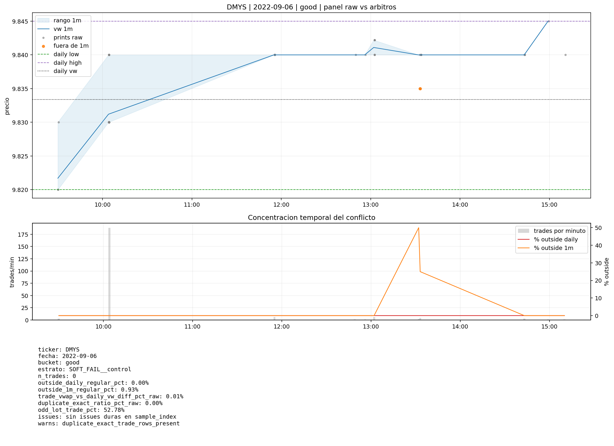

**Que muestra**

- Panel rico del tape raw frente a `daily` y `1m` para `DMYS` el `2022-09-06`.
- `n_trades = 216`, `outside_daily_regular_pct = 0.00%`, `outside_1m_regular_pct = 0.93%`.
- `trade_vwap_vs_daily_vw_diff_pct_raw = 0.01%`, `duplicate_exact_ratio_pct_raw = 0.00%`, `odd_lot_trade_pct = 52.78%`.

**Responde**

- Cola pristine donde `trades`, `daily` y `1m` alinean con limpieza. Responde a la pregunta de como luce una firma casi impecable del tape.
- Responde a si el conflicto dominante vive en la escala (`~1x`), en la comparabilidad frente a `daily` (0.00%) o frente a `1m` (0.93%).
- El 52.78% de odd-lots empuja la lectura hacia microestructura fina; evita leer el caso como pura ruptura economica gruesa.
- La decision que justifica es que el file puede usarse como patron de tape limpio, no como medida de masa util del bloque.

### FOSLL | 2021-11-23

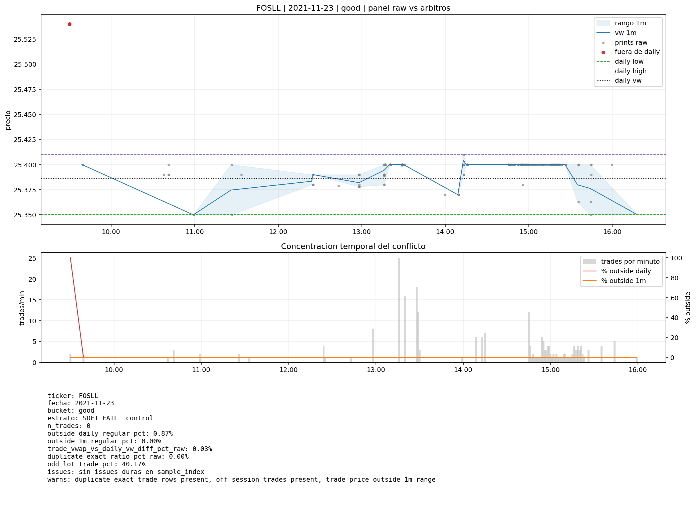

**Que muestra**

- Panel rico del tape raw frente a `daily` y `1m` para `FOSLL` el `2021-11-23`.
- `n_trades = 229`, `outside_daily_regular_pct = 0.87%`, `outside_1m_regular_pct = 0.00%`.
- `trade_vwap_vs_daily_vw_diff_pct_raw = 0.03%`, `duplicate_exact_ratio_pct_raw = 0.00%`, `odd_lot_trade_pct = 40.17%`.

**Responde**

- Cola pristine donde `trades`, `daily` y `1m` alinean con limpieza. Responde a la pregunta de como luce una firma casi impecable del tape.
- Responde a si el conflicto dominante vive en la escala (`~1x`), en la comparabilidad frente a `daily` (0.87%) o frente a `1m` (0.00%).
- El 40.17% de odd-lots empuja la lectura hacia microestructura fina; evita leer el caso como pura ruptura economica gruesa.
- La decision que justifica es que el file puede usarse como patron de tape limpio, no como medida de masa util del bloque.

### MCHB | 2022-03-10

**Que muestra**

- Panel rico del tape raw frente a `daily` y `1m` para `MCHB` el `2022-03-10`.
- `n_trades = 1`, `outside_daily_regular_pct = 0.00%`, `outside_1m_regular_pct = 0.00%`.
- `trade_vwap_vs_daily_vw_diff_pct_raw = 0.00%`, `duplicate_exact_ratio_pct_raw = 0.00%`, `odd_lot_trade_pct = 100.00%`.

**Responde**

- Cola pristine donde `trades`, `daily` y `1m` alinean con limpieza. Responde a la pregunta de como luce una firma casi impecable del tape.
- Responde a si el conflicto dominante vive en la escala (`~1x`), en la comparabilidad frente a `daily` (0.00%) o frente a `1m` (0.00%).
- El 100.00% de odd-lots empuja la lectura hacia microestructura fina; evita leer el caso como pura ruptura economica gruesa.
- La decision que justifica es que el file puede usarse como patron de tape limpio, no como medida de masa util del bloque.

### MCHB | 2022-04-12

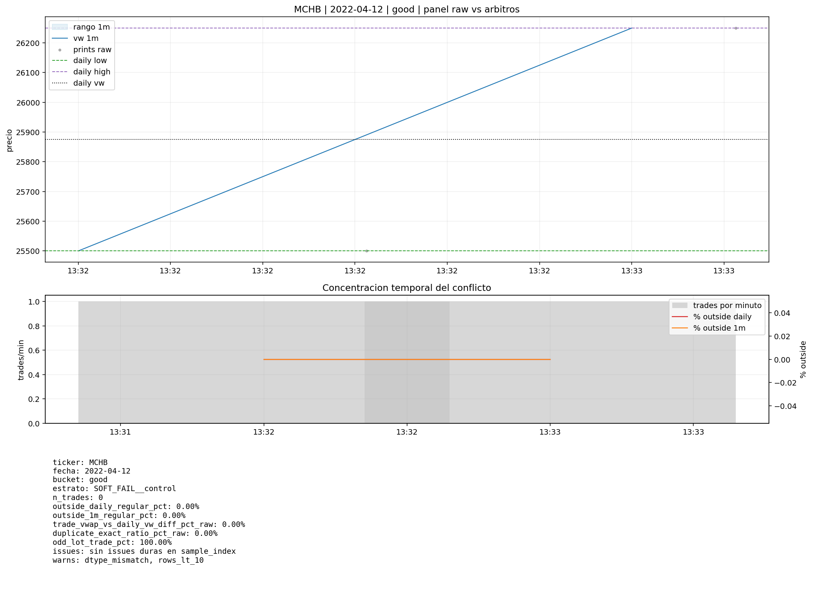

**Que muestra**

- Panel rico del tape raw frente a `daily` y `1m` para `MCHB` el `2022-04-12`.
- `n_trades = 2`, `outside_daily_regular_pct = 0.00%`, `outside_1m_regular_pct = 0.00%`.
- `trade_vwap_vs_daily_vw_diff_pct_raw = 0.00%`, `duplicate_exact_ratio_pct_raw = 0.00%`, `odd_lot_trade_pct = 100.00%`.

**Responde**

- Cola pristine donde `trades`, `daily` y `1m` alinean con limpieza. Responde a la pregunta de como luce una firma casi impecable del tape.
- Responde a si el conflicto dominante vive en la escala (`~1x`), en la comparabilidad frente a `daily` (0.00%) o frente a `1m` (0.00%).
- El 100.00% de odd-lots empuja la lectura hacia microestructura fina; evita leer el caso como pura ruptura economica gruesa.
- La decision que justifica es que el file puede usarse como patron de tape limpio, no como medida de masa util del bloque.

### MCHB | 2022-04-21

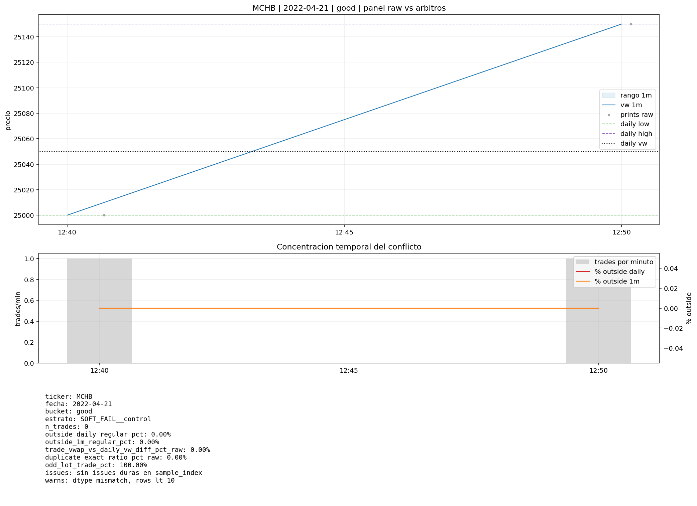

**Que muestra**

- Panel rico del tape raw frente a `daily` y `1m` para `MCHB` el `2022-04-21`.
- `n_trades = 2`, `outside_daily_regular_pct = 0.00%`, `outside_1m_regular_pct = 0.00%`.
- `trade_vwap_vs_daily_vw_diff_pct_raw = 0.00%`, `duplicate_exact_ratio_pct_raw = 0.00%`, `odd_lot_trade_pct = 100.00%`.

**Responde**

- Cola pristine donde `trades`, `daily` y `1m` alinean con limpieza. Responde a la pregunta de como luce una firma casi impecable del tape.
- Responde a si el conflicto dominante vive en la escala (`~1x`), en la comparabilidad frente a `daily` (0.00%) o frente a `1m` (0.00%).
- El 100.00% de odd-lots empuja la lectura hacia microestructura fina; evita leer el caso como pura ruptura economica gruesa.
- La decision que justifica es que el file puede usarse como patron de tape limpio, no como medida de masa util del bloque.

### MCHB | 2022-04-22

**Que muestra**

- Panel rico del tape raw frente a `daily` y `1m` para `MCHB` el `2022-04-22`.
- `n_trades = 1`, `outside_daily_regular_pct = 0.00%`, `outside_1m_regular_pct = 0.00%`.
- `trade_vwap_vs_daily_vw_diff_pct_raw = 0.00%`, `duplicate_exact_ratio_pct_raw = 0.00%`, `odd_lot_trade_pct = 100.00%`.

**Responde**

- Cola pristine donde `trades`, `daily` y `1m` alinean con limpieza. Responde a la pregunta de como luce una firma casi impecable del tape.
- Responde a si el conflicto dominante vive en la escala (`~1x`), en la comparabilidad frente a `daily` (0.00%) o frente a `1m` (0.00%).
- El 100.00% de odd-lots empuja la lectura hacia microestructura fina; evita leer el caso como pura ruptura economica gruesa.
- La decision que justifica es que el file puede usarse como patron de tape limpio, no como medida de masa util del bloque.

### MCHB | 2022-08-01

**Que muestra**

- Panel rico del tape raw frente a `daily` y `1m` para `MCHB` el `2022-08-01`.
- `n_trades = 1`, `outside_daily_regular_pct = 0.00%`, `outside_1m_regular_pct = 0.00%`.
- `trade_vwap_vs_daily_vw_diff_pct_raw = 0.00%`, `duplicate_exact_ratio_pct_raw = 0.00%`, `odd_lot_trade_pct = 100.00%`.

**Responde**

- Cola pristine donde `trades`, `daily` y `1m` alinean con limpieza. Responde a la pregunta de como luce una firma casi impecable del tape.
- Responde a si el conflicto dominante vive en la escala (`~1x`), en la comparabilidad frente a `daily` (0.00%) o frente a `1m` (0.00%).
- El 100.00% de odd-lots empuja la lectura hacia microestructura fina; evita leer el caso como pura ruptura economica gruesa.
- La decision que justifica es que el file puede usarse como patron de tape limpio, no como medida de masa util del bloque.

### MCHB | 2022-12-15

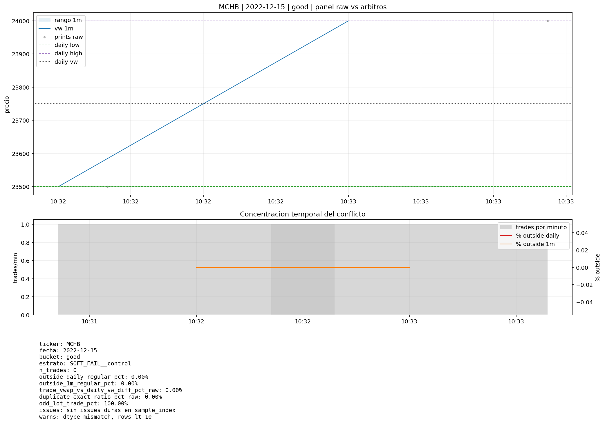

**Que muestra**

- Panel rico del tape raw frente a `daily` y `1m` para `MCHB` el `2022-12-15`.
- `n_trades = 2`, `outside_daily_regular_pct = 0.00%`, `outside_1m_regular_pct = 0.00%`.
- `trade_vwap_vs_daily_vw_diff_pct_raw = 0.00%`, `duplicate_exact_ratio_pct_raw = 0.00%`, `odd_lot_trade_pct = 100.00%`.

**Responde**

- Cola pristine donde `trades`, `daily` y `1m` alinean con limpieza. Responde a la pregunta de como luce una firma casi impecable del tape.
- Responde a si el conflicto dominante vive en la escala (`~1x`), en la comparabilidad frente a `daily` (0.00%) o frente a `1m` (0.00%).
- El 100.00% de odd-lots empuja la lectura hacia microestructura fina; evita leer el caso como pura ruptura economica gruesa.
- La decision que justifica es que el file puede usarse como patron de tape limpio, no como medida de masa util del bloque.

### MCHB | 2023-02-03

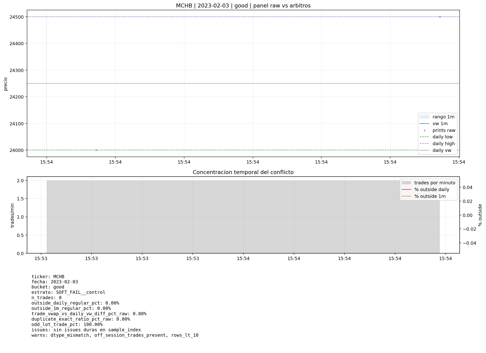

**Que muestra**

- Panel rico del tape raw frente a `daily` y `1m` para `MCHB` el `2023-02-03`.
- `n_trades = 2`, `outside_daily_regular_pct = 0.00%`, `outside_1m_regular_pct = 0.00%`.
- `trade_vwap_vs_daily_vw_diff_pct_raw = 0.00%`, `duplicate_exact_ratio_pct_raw = 0.00%`, `odd_lot_trade_pct = 100.00%`.

**Responde**

- Cola pristine donde `trades`, `daily` y `1m` alinean con limpieza. Responde a la pregunta de como luce una firma casi impecable del tape.
- Responde a si el conflicto dominante vive en la escala (`~1x`), en la comparabilidad frente a `daily` (0.00%) o frente a `1m` (0.00%).
- El 100.00% de odd-lots empuja la lectura hacia microestructura fina; evita leer el caso como pura ruptura economica gruesa.
- La decision que justifica es que el file puede usarse como patron de tape limpio, no como medida de masa util del bloque.

### MCHB | 2023-02-21

**Que muestra**

- Panel rico del tape raw frente a `daily` y `1m` para `MCHB` el `2023-02-21`.
- `n_trades = 2`, `outside_daily_regular_pct = 0.00%`, `outside_1m_regular_pct = 0.00%`.
- `trade_vwap_vs_daily_vw_diff_pct_raw = 0.00%`, `duplicate_exact_ratio_pct_raw = 0.00%`, `odd_lot_trade_pct = 100.00%`.

**Responde**

- Cola pristine donde `trades`, `daily` y `1m` alinean con limpieza. Responde a la pregunta de como luce una firma casi impecable del tape.
- Responde a si el conflicto dominante vive en la escala (`~1x`), en la comparabilidad frente a `daily` (0.00%) o frente a `1m` (0.00%).
- El 100.00% de odd-lots empuja la lectura hacia microestructura fina; evita leer el caso como pura ruptura economica gruesa.
- La decision que justifica es que el file puede usarse como patron de tape limpio, no como medida de masa util del bloque.

### MCHB | 2023-04-28

**Que muestra**

- Panel rico del tape raw frente a `daily` y `1m` para `MCHB` el `2023-04-28`.
- `n_trades = 1`, `outside_daily_regular_pct = 0.00%`, `outside_1m_regular_pct = 0.00%`.
- `trade_vwap_vs_daily_vw_diff_pct_raw = 0.00%`, `duplicate_exact_ratio_pct_raw = 0.00%`, `odd_lot_trade_pct = 100.00%`.

**Responde**

- Cola pristine donde `trades`, `daily` y `1m` alinean con limpieza. Responde a la pregunta de como luce una firma casi impecable del tape.
- Responde a si el conflicto dominante vive en la escala (`~1x`), en la comparabilidad frente a `daily` (0.00%) o frente a `1m` (0.00%).
- El 100.00% de odd-lots empuja la lectura hacia microestructura fina; evita leer el caso como pura ruptura economica gruesa.
- La decision que justifica es que el file puede usarse como patron de tape limpio, no como medida de masa util del bloque.

### MCHB | 2023-05-01

**Que muestra**

- Panel rico del tape raw frente a `daily` y `1m` para `MCHB` el `2023-05-01`.
- `n_trades = 3`, `outside_daily_regular_pct = 0.00%`, `outside_1m_regular_pct = 0.00%`.
- `trade_vwap_vs_daily_vw_diff_pct_raw = 0.00%`, `duplicate_exact_ratio_pct_raw = 0.00%`, `odd_lot_trade_pct = 100.00%`.

**Responde**

- Cola pristine donde `trades`, `daily` y `1m` alinean con limpieza. Responde a la pregunta de como luce una firma casi impecable del tape.
- Responde a si el conflicto dominante vive en la escala (`~1x`), en la comparabilidad frente a `daily` (0.00%) o frente a `1m` (0.00%).
- El 100.00% de odd-lots empuja la lectura hacia microestructura fina; evita leer el caso como pura ruptura economica gruesa.
- La decision que justifica es que el file puede usarse como patron de tape limpio, no como medida de masa util del bloque.

### MCHB | 2023-06-15

**Que muestra**

- Panel rico del tape raw frente a `daily` y `1m` para `MCHB` el `2023-06-15`.
- `n_trades = 1`, `outside_daily_regular_pct = 0.00%`, `outside_1m_regular_pct = 0.00%`.
- `trade_vwap_vs_daily_vw_diff_pct_raw = 0.00%`, `duplicate_exact_ratio_pct_raw = 0.00%`, `odd_lot_trade_pct = 100.00%`.

**Responde**

- Cola pristine donde `trades`, `daily` y `1m` alinean con limpieza. Responde a la pregunta de como luce una firma casi impecable del tape.
- Responde a si el conflicto dominante vive en la escala (`~1x`), en la comparabilidad frente a `daily` (0.00%) o frente a `1m` (0.00%).
- El 100.00% de odd-lots empuja la lectura hacia microestructura fina; evita leer el caso como pura ruptura economica gruesa.
- La decision que justifica es que el file puede usarse como patron de tape limpio, no como medida de masa util del bloque.

### MCHB | 2023-11-10

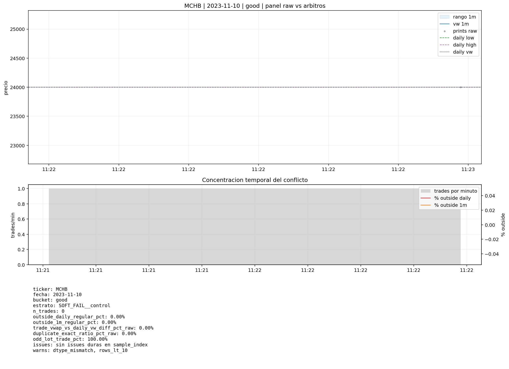

**Que muestra**

- Panel rico del tape raw frente a `daily` y `1m` para `MCHB` el `2023-11-10`.
- `n_trades = 1`, `outside_daily_regular_pct = 0.00%`, `outside_1m_regular_pct = 0.00%`.
- `trade_vwap_vs_daily_vw_diff_pct_raw = 0.00%`, `duplicate_exact_ratio_pct_raw = 0.00%`, `odd_lot_trade_pct = 100.00%`.

**Responde**

- Cola pristine donde `trades`, `daily` y `1m` alinean con limpieza. Responde a la pregunta de como luce una firma casi impecable del tape.
- Responde a si el conflicto dominante vive en la escala (`~1x`), en la comparabilidad frente a `daily` (0.00%) o frente a `1m` (0.00%).
- El 100.00% de odd-lots empuja la lectura hacia microestructura fina; evita leer el caso como pura ruptura economica gruesa.
- La decision que justifica es que el file puede usarse como patron de tape limpio, no como medida de masa util del bloque.

### MCHB | 2023-12-20

**Que muestra**

- Panel rico del tape raw frente a `daily` y `1m` para `MCHB` el `2023-12-20`.
- `n_trades = 1`, `outside_daily_regular_pct = 0.00%`, `outside_1m_regular_pct = 0.00%`.
- `trade_vwap_vs_daily_vw_diff_pct_raw = 0.00%`, `duplicate_exact_ratio_pct_raw = 0.00%`, `odd_lot_trade_pct = 100.00%`.

**Responde**

- Cola pristine donde `trades`, `daily` y `1m` alinean con limpieza. Responde a la pregunta de como luce una firma casi impecable del tape.
- Responde a si el conflicto dominante vive en la escala (`~1x`), en la comparabilidad frente a `daily` (0.00%) o frente a `1m` (0.00%).
- El 100.00% de odd-lots empuja la lectura hacia microestructura fina; evita leer el caso como pura ruptura economica gruesa.
- La decision que justifica es que el file puede usarse como patron de tape limpio, no como medida de masa util del bloque.

### MCHB | 2024-02-23

**Que muestra**

- Panel rico del tape raw frente a `daily` y `1m` para `MCHB` el `2024-02-23`.
- `n_trades = 1`, `outside_daily_regular_pct = 0.00%`, `outside_1m_regular_pct = 0.00%`.
- `trade_vwap_vs_daily_vw_diff_pct_raw = 0.00%`, `duplicate_exact_ratio_pct_raw = 0.00%`, `odd_lot_trade_pct = 100.00%`.

**Responde**

- Cola pristine donde `trades`, `daily` y `1m` alinean con limpieza. Responde a la pregunta de como luce una firma casi impecable del tape.
- Responde a si el conflicto dominante vive en la escala (`~1x`), en la comparabilidad frente a `daily` (0.00%) o frente a `1m` (0.00%).
- El 100.00% de odd-lots empuja la lectura hacia microestructura fina; evita leer el caso como pura ruptura economica gruesa.
- La decision que justifica es que el file puede usarse como patron de tape limpio, no como medida de masa util del bloque.

### MCHB | 2024-04-01

**Que muestra**

- Panel rico del tape raw frente a `daily` y `1m` para `MCHB` el `2024-04-01`.
- `n_trades = 1`, `outside_daily_regular_pct = 0.00%`, `outside_1m_regular_pct = 0.00%`.
- `trade_vwap_vs_daily_vw_diff_pct_raw = 0.00%`, `duplicate_exact_ratio_pct_raw = 0.00%`, `odd_lot_trade_pct = 100.00%`.

**Responde**

- Cola pristine donde `trades`, `daily` y `1m` alinean con limpieza. Responde a la pregunta de como luce una firma casi impecable del tape.
- Responde a si el conflicto dominante vive en la escala (`~1x`), en la comparabilidad frente a `daily` (0.00%) o frente a `1m` (0.00%).
- El 100.00% de odd-lots empuja la lectura hacia microestructura fina; evita leer el caso como pura ruptura economica gruesa.
- La decision que justifica es que el file puede usarse como patron de tape limpio, no como medida de masa util del bloque.

### MCHB | 2024-05-06

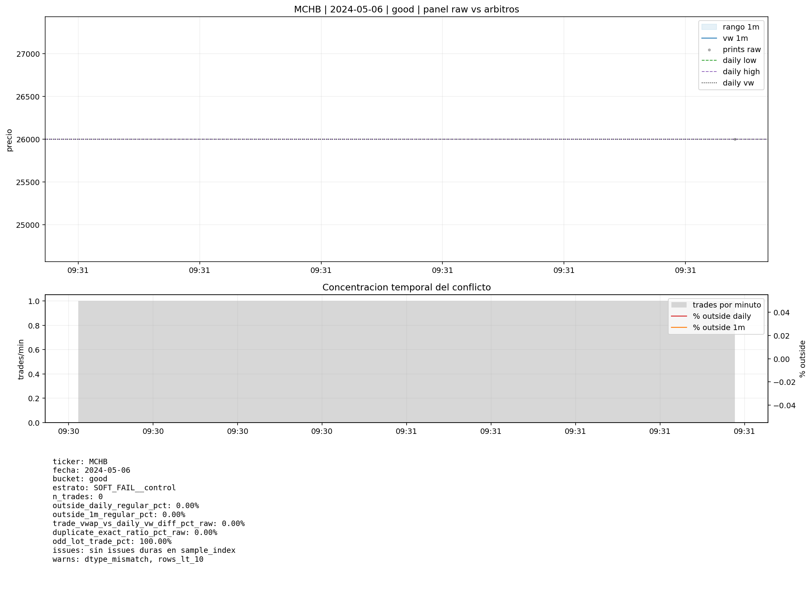

**Que muestra**

- Panel rico del tape raw frente a `daily` y `1m` para `MCHB` el `2024-05-06`.
- `n_trades = 1`, `outside_daily_regular_pct = 0.00%`, `outside_1m_regular_pct = 0.00%`.
- `trade_vwap_vs_daily_vw_diff_pct_raw = 0.00%`, `duplicate_exact_ratio_pct_raw = 0.00%`, `odd_lot_trade_pct = 100.00%`.

**Responde**

- Cola pristine donde `trades`, `daily` y `1m` alinean con limpieza. Responde a la pregunta de como luce una firma casi impecable del tape.
- Responde a si el conflicto dominante vive en la escala (`~1x`), en la comparabilidad frente a `daily` (0.00%) o frente a `1m` (0.00%).
- El 100.00% de odd-lots empuja la lectura hacia microestructura fina; evita leer el caso como pura ruptura economica gruesa.
- La decision que justifica es que el file puede usarse como patron de tape limpio, no como medida de masa util del bloque.

### MCHB | 2024-05-24

**Que muestra**

- Panel rico del tape raw frente a `daily` y `1m` para `MCHB` el `2024-05-24`.
- `n_trades = 1`, `outside_daily_regular_pct = 0.00%`, `outside_1m_regular_pct = 0.00%`.
- `trade_vwap_vs_daily_vw_diff_pct_raw = 0.00%`, `duplicate_exact_ratio_pct_raw = 0.00%`, `odd_lot_trade_pct = 100.00%`.

**Responde**

- Cola pristine donde `trades`, `daily` y `1m` alinean con limpieza. Responde a la pregunta de como luce una firma casi impecable del tape.
- Responde a si el conflicto dominante vive en la escala (`~1x`), en la comparabilidad frente a `daily` (0.00%) o frente a `1m` (0.00%).
- El 100.00% de odd-lots empuja la lectura hacia microestructura fina; evita leer el caso como pura ruptura economica gruesa.
- La decision que justifica es que el file puede usarse como patron de tape limpio, no como medida de masa util del bloque.

### MCHB | 2024-06-06

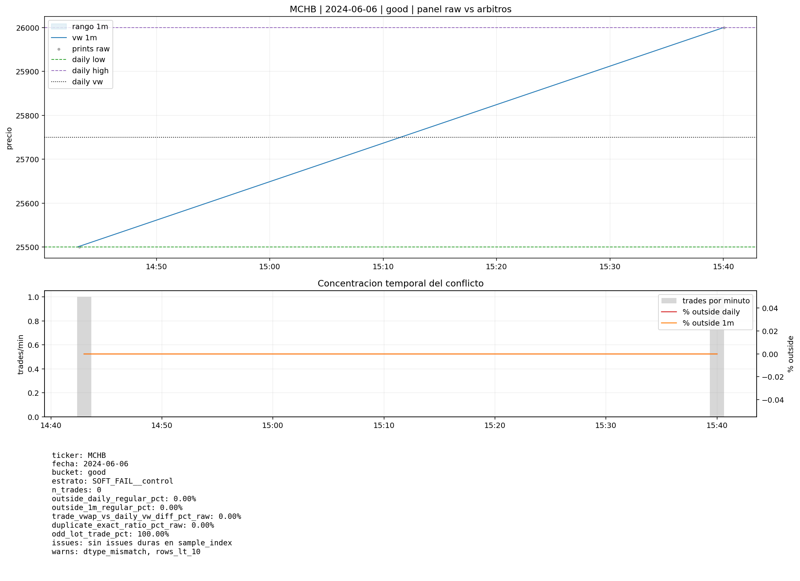

**Que muestra**

- Panel rico del tape raw frente a `daily` y `1m` para `MCHB` el `2024-06-06`.
- `n_trades = 2`, `outside_daily_regular_pct = 0.00%`, `outside_1m_regular_pct = 0.00%`.
- `trade_vwap_vs_daily_vw_diff_pct_raw = 0.00%`, `duplicate_exact_ratio_pct_raw = 0.00%`, `odd_lot_trade_pct = 100.00%`.

**Responde**

- Cola pristine donde `trades`, `daily` y `1m` alinean con limpieza. Responde a la pregunta de como luce una firma casi impecable del tape.
- Responde a si el conflicto dominante vive en la escala (`~1x`), en la comparabilidad frente a `daily` (0.00%) o frente a `1m` (0.00%).
- El 100.00% de odd-lots empuja la lectura hacia microestructura fina; evita leer el caso como pura ruptura economica gruesa.
- La decision que justifica es que el file puede usarse como patron de tape limpio, no como medida de masa util del bloque.

### MCHB | 2024-06-20

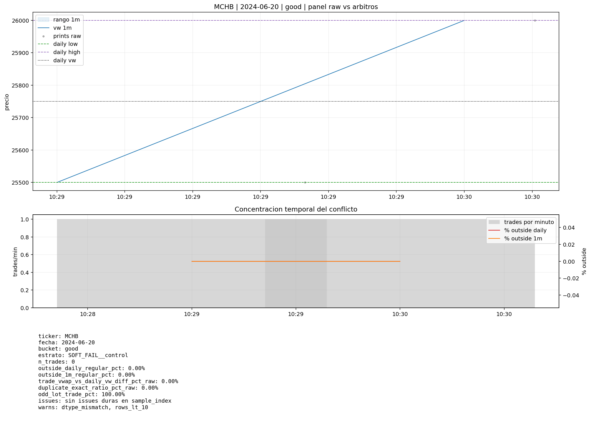

**Que muestra**

- Panel rico del tape raw frente a `daily` y `1m` para `MCHB` el `2024-06-20`.
- `n_trades = 2`, `outside_daily_regular_pct = 0.00%`, `outside_1m_regular_pct = 0.00%`.
- `trade_vwap_vs_daily_vw_diff_pct_raw = 0.00%`, `duplicate_exact_ratio_pct_raw = 0.00%`, `odd_lot_trade_pct = 100.00%`.

**Responde**

- Cola pristine donde `trades`, `daily` y `1m` alinean con limpieza. Responde a la pregunta de como luce una firma casi impecable del tape.
- Responde a si el conflicto dominante vive en la escala (`~1x`), en la comparabilidad frente a `daily` (0.00%) o frente a `1m` (0.00%).
- El 100.00% de odd-lots empuja la lectura hacia microestructura fina; evita leer el caso como pura ruptura economica gruesa.
- La decision que justifica es que el file puede usarse como patron de tape limpio, no como medida de masa util del bloque.

### MCHB | 2024-10-03

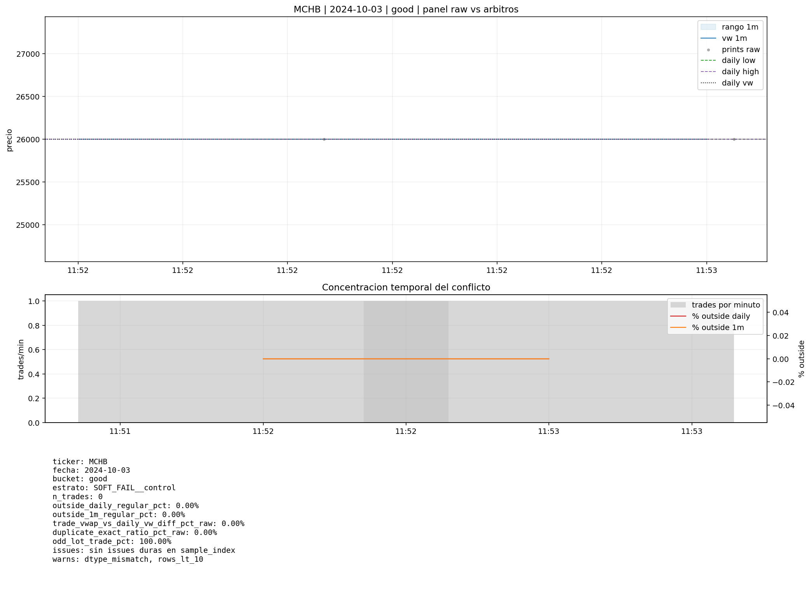

**Que muestra**

- Panel rico del tape raw frente a `daily` y `1m` para `MCHB` el `2024-10-03`.
- `n_trades = 2`, `outside_daily_regular_pct = 0.00%`, `outside_1m_regular_pct = 0.00%`.
- `trade_vwap_vs_daily_vw_diff_pct_raw = 0.00%`, `duplicate_exact_ratio_pct_raw = 0.00%`, `odd_lot_trade_pct = 100.00%`.

**Responde**

- Cola pristine donde `trades`, `daily` y `1m` alinean con limpieza. Responde a la pregunta de como luce una firma casi impecable del tape.
- Responde a si el conflicto dominante vive en la escala (`~1x`), en la comparabilidad frente a `daily` (0.00%) o frente a `1m` (0.00%).
- El 100.00% de odd-lots empuja la lectura hacia microestructura fina; evita leer el caso como pura ruptura economica gruesa.
- La decision que justifica es que el file puede usarse como patron de tape limpio, no como medida de masa util del bloque.

### MCHB | 2025-02-19

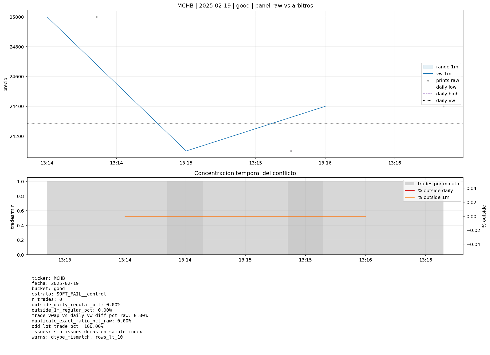

**Que muestra**

- Panel rico del tape raw frente a `daily` y `1m` para `MCHB` el `2025-02-19`.
- `n_trades = 3`, `outside_daily_regular_pct = 0.00%`, `outside_1m_regular_pct = 0.00%`.
- `trade_vwap_vs_daily_vw_diff_pct_raw = 0.00%`, `duplicate_exact_ratio_pct_raw = 0.00%`, `odd_lot_trade_pct = 100.00%`.

**Responde**

- Cola pristine donde `trades`, `daily` y `1m` alinean con limpieza. Responde a la pregunta de como luce una firma casi impecable del tape.
- Responde a si el conflicto dominante vive en la escala (`~1x`), en la comparabilidad frente a `daily` (0.00%) o frente a `1m` (0.00%).
- El 100.00% de odd-lots empuja la lectura hacia microestructura fina; evita leer el caso como pura ruptura economica gruesa.
- La decision que justifica es que el file puede usarse como patron de tape limpio, no como medida de masa util del bloque.

### MCHB | 2025-02-24

**Que muestra**

- Panel rico del tape raw frente a `daily` y `1m` para `MCHB` el `2025-02-24`.
- `n_trades = 1`, `outside_daily_regular_pct = 0.00%`, `outside_1m_regular_pct = 0.00%`.
- `trade_vwap_vs_daily_vw_diff_pct_raw = 0.00%`, `duplicate_exact_ratio_pct_raw = 0.00%`, `odd_lot_trade_pct = 100.00%`.

**Responde**

- Cola pristine donde `trades`, `daily` y `1m` alinean con limpieza. Responde a la pregunta de como luce una firma casi impecable del tape.
- Responde a si el conflicto dominante vive en la escala (`~1x`), en la comparabilidad frente a `daily` (0.00%) o frente a `1m` (0.00%).
- El 100.00% de odd-lots empuja la lectura hacia microestructura fina; evita leer el caso como pura ruptura economica gruesa.
- La decision que justifica es que el file puede usarse como patron de tape limpio, no como medida de masa util del bloque.

### MCHB | 2025-03-04

**Que muestra**

- Panel rico del tape raw frente a `daily` y `1m` para `MCHB` el `2025-03-04`.
- `n_trades = 1`, `outside_daily_regular_pct = 0.00%`, `outside_1m_regular_pct = 0.00%`.
- `trade_vwap_vs_daily_vw_diff_pct_raw = 0.00%`, `duplicate_exact_ratio_pct_raw = 0.00%`, `odd_lot_trade_pct = 100.00%`.

**Responde**

- Cola pristine donde `trades`, `daily` y `1m` alinean con limpieza. Responde a la pregunta de como luce una firma casi impecable del tape.
- Responde a si el conflicto dominante vive en la escala (`~1x`), en la comparabilidad frente a `daily` (0.00%) o frente a `1m` (0.00%).
- El 100.00% de odd-lots empuja la lectura hacia microestructura fina; evita leer el caso como pura ruptura economica gruesa.
- La decision que justifica es que el file puede usarse como patron de tape limpio, no como medida de masa util del bloque.

### MCHB | 2025-04-01

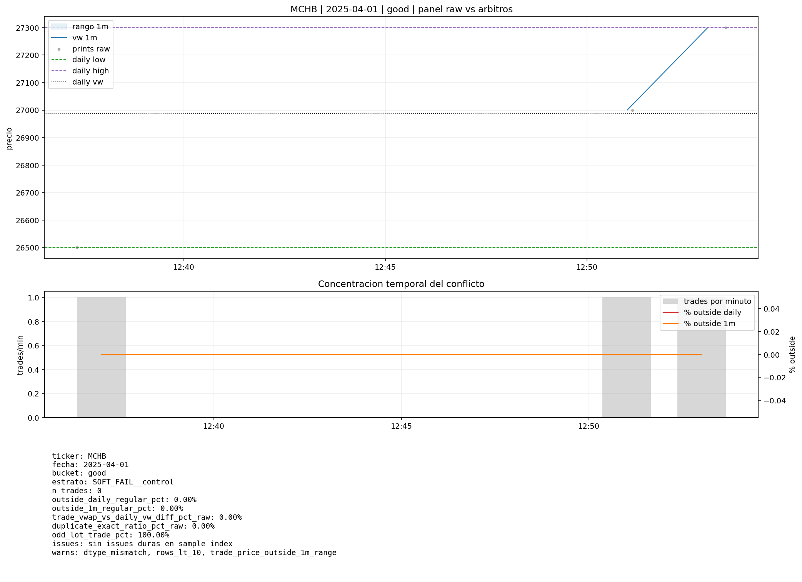

**Que muestra**

- Panel rico del tape raw frente a `daily` y `1m` para `MCHB` el `2025-04-01`.
- `n_trades = 3`, `outside_daily_regular_pct = 0.00%`, `outside_1m_regular_pct = 0.00%`.
- `trade_vwap_vs_daily_vw_diff_pct_raw = 0.00%`, `duplicate_exact_ratio_pct_raw = 0.00%`, `odd_lot_trade_pct = 100.00%`.

**Responde**

- Cola pristine donde `trades`, `daily` y `1m` alinean con limpieza. Responde a la pregunta de como luce una firma casi impecable del tape.
- Responde a si el conflicto dominante vive en la escala (`~1x`), en la comparabilidad frente a `daily` (0.00%) o frente a `1m` (0.00%).
- El 100.00% de odd-lots empuja la lectura hacia microestructura fina; evita leer el caso como pura ruptura economica gruesa.
- La decision que justifica es que el file puede usarse como patron de tape limpio, no como medida de masa util del bloque.

### MCHB | 2025-05-29

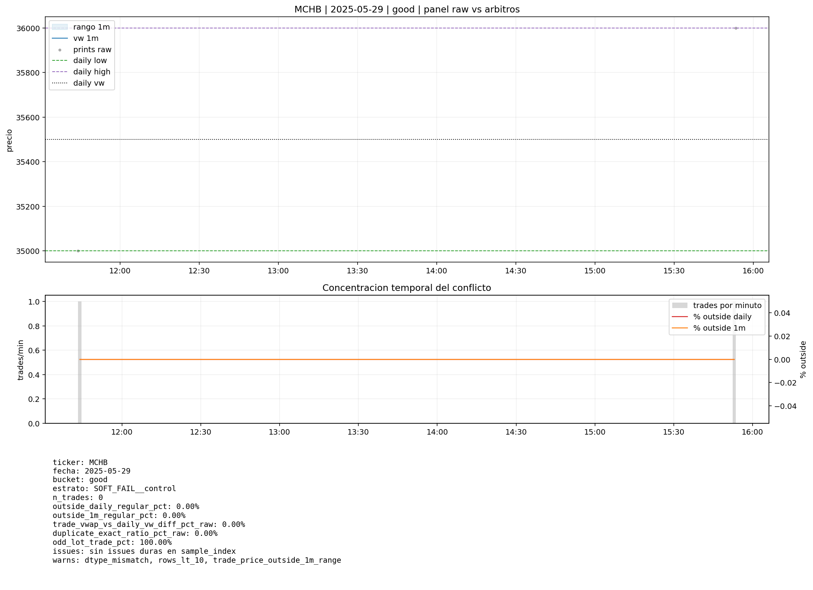

**Que muestra**

- Panel rico del tape raw frente a `daily` y `1m` para `MCHB` el `2025-05-29`.
- `n_trades = 2`, `outside_daily_regular_pct = 0.00%`, `outside_1m_regular_pct = 0.00%`.
- `trade_vwap_vs_daily_vw_diff_pct_raw = 0.00%`, `duplicate_exact_ratio_pct_raw = 0.00%`, `odd_lot_trade_pct = 100.00%`.

**Responde**

- Cola pristine donde `trades`, `daily` y `1m` alinean con limpieza. Responde a la pregunta de como luce una firma casi impecable del tape.
- Responde a si el conflicto dominante vive en la escala (`~1x`), en la comparabilidad frente a `daily` (0.00%) o frente a `1m` (0.00%).
- El 100.00% de odd-lots empuja la lectura hacia microestructura fina; evita leer el caso como pura ruptura economica gruesa.
- La decision que justifica es que el file puede usarse como patron de tape limpio, no como medida de masa util del bloque.

### MCHB | 2025-07-02

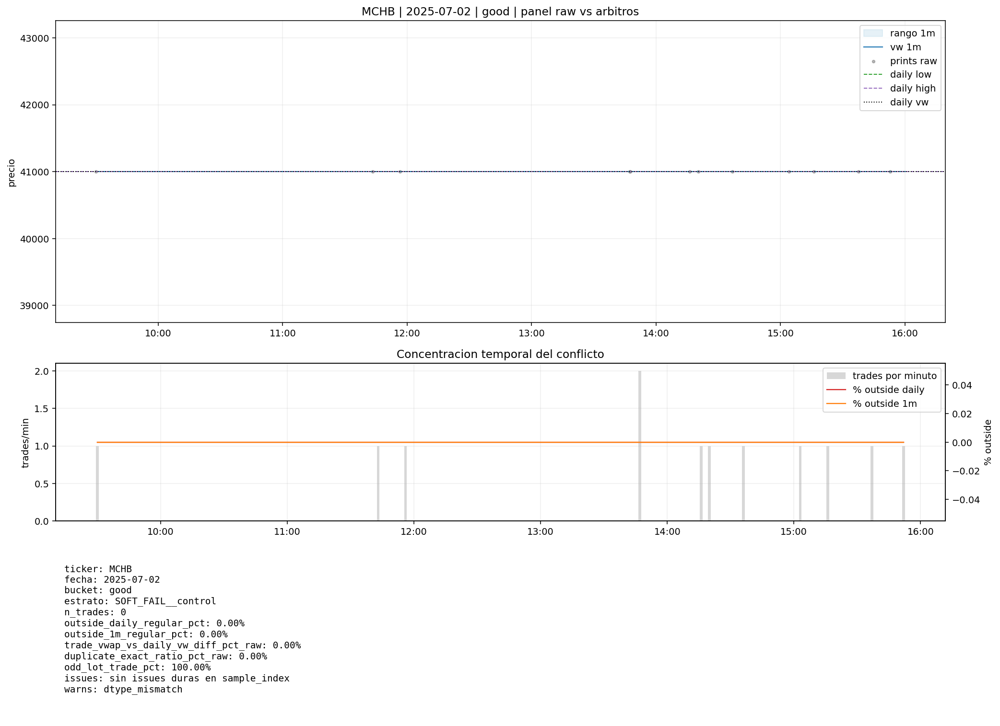

**Que muestra**

- Panel rico del tape raw frente a `daily` y `1m` para `MCHB` el `2025-07-02`.
- `n_trades = 12`, `outside_daily_regular_pct = 0.00%`, `outside_1m_regular_pct = 0.00%`.
- `trade_vwap_vs_daily_vw_diff_pct_raw = 0.00%`, `duplicate_exact_ratio_pct_raw = 0.00%`, `odd_lot_trade_pct = 100.00%`.

**Responde**

- Cola pristine donde `trades`, `daily` y `1m` alinean con limpieza. Responde a la pregunta de como luce una firma casi impecable del tape.
- Responde a si el conflicto dominante vive en la escala (`~1x`), en la comparabilidad frente a `daily` (0.00%) o frente a `1m` (0.00%).
- El 100.00% de odd-lots empuja la lectura hacia microestructura fina; evita leer el caso como pura ruptura economica gruesa.
- La decision que justifica es que el file puede usarse como patron de tape limpio, no como medida de masa util del bloque.

### MCHB | 2025-07-03

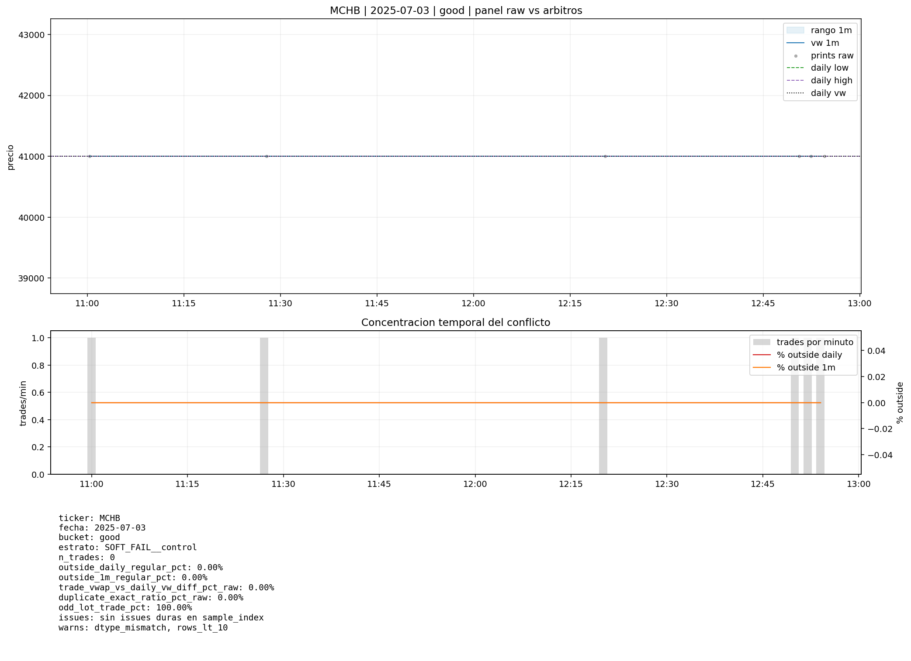

**Que muestra**

- Panel rico del tape raw frente a `daily` y `1m` para `MCHB` el `2025-07-03`.
- `n_trades = 6`, `outside_daily_regular_pct = 0.00%`, `outside_1m_regular_pct = 0.00%`.
- `trade_vwap_vs_daily_vw_diff_pct_raw = 0.00%`, `duplicate_exact_ratio_pct_raw = 0.00%`, `odd_lot_trade_pct = 100.00%`.

**Responde**

- Cola pristine donde `trades`, `daily` y `1m` alinean con limpieza. Responde a la pregunta de como luce una firma casi impecable del tape.
- Responde a si el conflicto dominante vive en la escala (`~1x`), en la comparabilidad frente a `daily` (0.00%) o frente a `1m` (0.00%).
- El 100.00% de odd-lots empuja la lectura hacia microestructura fina; evita leer el caso como pura ruptura economica gruesa.
- La decision que justifica es que el file puede usarse como patron de tape limpio, no como medida de masa util del bloque.

### MCHB | 2025-07-07

**Que muestra**

- Panel rico del tape raw frente a `daily` y `1m` para `MCHB` el `2025-07-07`.
- `n_trades = 6`, `outside_daily_regular_pct = 0.00%`, `outside_1m_regular_pct = 0.00%`.
- `trade_vwap_vs_daily_vw_diff_pct_raw = 0.00%`, `duplicate_exact_ratio_pct_raw = 0.00%`, `odd_lot_trade_pct = 100.00%`.

**Responde**

- Cola pristine donde `trades`, `daily` y `1m` alinean con limpieza. Responde a la pregunta de como luce una firma casi impecable del tape.
- Responde a si el conflicto dominante vive en la escala (`~1x`), en la comparabilidad frente a `daily` (0.00%) o frente a `1m` (0.00%).
- El 100.00% de odd-lots empuja la lectura hacia microestructura fina; evita leer el caso como pura ruptura economica gruesa.
- La decision que justifica es que el file puede usarse como patron de tape limpio, no como medida de masa util del bloque.

### MCHB | 2025-07-08

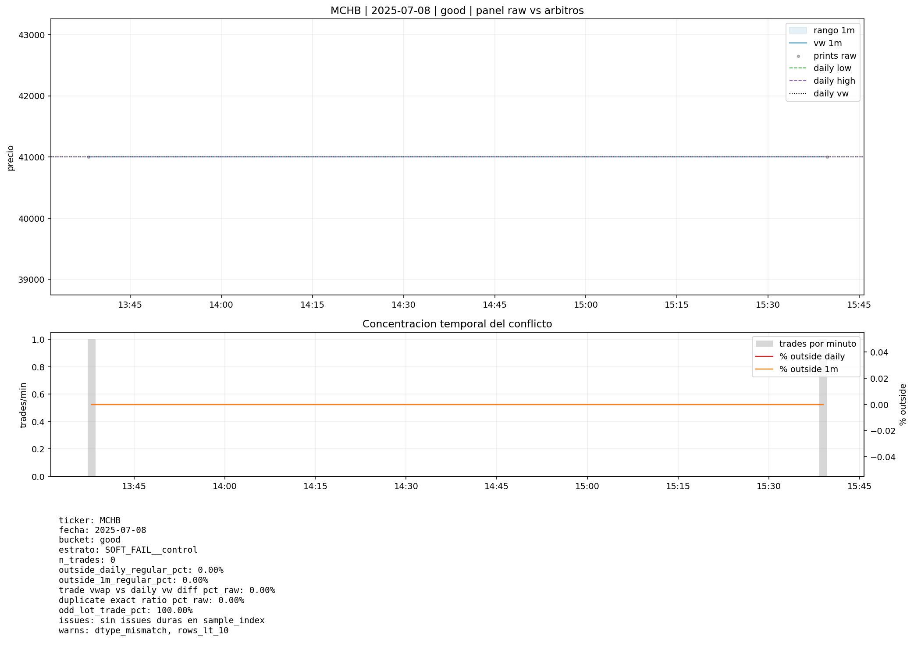

**Que muestra**

- Panel rico del tape raw frente a `daily` y `1m` para `MCHB` el `2025-07-08`.
- `n_trades = 2`, `outside_daily_regular_pct = 0.00%`, `outside_1m_regular_pct = 0.00%`.
- `trade_vwap_vs_daily_vw_diff_pct_raw = 0.00%`, `duplicate_exact_ratio_pct_raw = 0.00%`, `odd_lot_trade_pct = 100.00%`.

**Responde**

- Cola pristine donde `trades`, `daily` y `1m` alinean con limpieza. Responde a la pregunta de como luce una firma casi impecable del tape.
- Responde a si el conflicto dominante vive en la escala (`~1x`), en la comparabilidad frente a `daily` (0.00%) o frente a `1m` (0.00%).
- El 100.00% de odd-lots empuja la lectura hacia microestructura fina; evita leer el caso como pura ruptura economica gruesa.
- La decision que justifica es que el file puede usarse como patron de tape limpio, no como medida de masa util del bloque.

### MCHB | 2025-07-10

**Que muestra**

- Panel rico del tape raw frente a `daily` y `1m` para `MCHB` el `2025-07-10`.
- `n_trades = 2`, `outside_daily_regular_pct = 0.00%`, `outside_1m_regular_pct = 0.00%`.
- `trade_vwap_vs_daily_vw_diff_pct_raw = 0.00%`, `duplicate_exact_ratio_pct_raw = 0.00%`, `odd_lot_trade_pct = 100.00%`.

**Responde**

- Cola pristine donde `trades`, `daily` y `1m` alinean con limpieza. Responde a la pregunta de como luce una firma casi impecable del tape.
- Responde a si el conflicto dominante vive en la escala (`~1x`), en la comparabilidad frente a `daily` (0.00%) o frente a `1m` (0.00%).
- El 100.00% de odd-lots empuja la lectura hacia microestructura fina; evita leer el caso como pura ruptura economica gruesa.
- La decision que justifica es que el file puede usarse como patron de tape limpio, no como medida de masa util del bloque.

### MCHB | 2025-07-18

**Que muestra**

- Panel rico del tape raw frente a `daily` y `1m` para `MCHB` el `2025-07-18`.
- `n_trades = 1`, `outside_daily_regular_pct = 0.00%`, `outside_1m_regular_pct = 0.00%`.
- `trade_vwap_vs_daily_vw_diff_pct_raw = 0.00%`, `duplicate_exact_ratio_pct_raw = 0.00%`, `odd_lot_trade_pct = 100.00%`.

**Responde**

- Cola pristine donde `trades`, `daily` y `1m` alinean con limpieza. Responde a la pregunta de como luce una firma casi impecable del tape.
- Responde a si el conflicto dominante vive en la escala (`~1x`), en la comparabilidad frente a `daily` (0.00%) o frente a `1m` (0.00%).
- El 100.00% de odd-lots empuja la lectura hacia microestructura fina; evita leer el caso como pura ruptura economica gruesa.
- La decision que justifica es que el file puede usarse como patron de tape limpio, no como medida de masa util del bloque.

### MCHB | 2025-07-21

**Que muestra**

- Panel rico del tape raw frente a `daily` y `1m` para `MCHB` el `2025-07-21`.
- `n_trades = 2`, `outside_daily_regular_pct = 0.00%`, `outside_1m_regular_pct = 0.00%`.
- `trade_vwap_vs_daily_vw_diff_pct_raw = 0.00%`, `duplicate_exact_ratio_pct_raw = 0.00%`, `odd_lot_trade_pct = 100.00%`.

**Responde**

- Cola pristine donde `trades`, `daily` y `1m` alinean con limpieza. Responde a la pregunta de como luce una firma casi impecable del tape.
- Responde a si el conflicto dominante vive en la escala (`~1x`), en la comparabilidad frente a `daily` (0.00%) o frente a `1m` (0.00%).
- El 100.00% de odd-lots empuja la lectura hacia microestructura fina; evita leer el caso como pura ruptura economica gruesa.
- La decision que justifica es que el file puede usarse como patron de tape limpio, no como medida de masa util del bloque.

### MCHB | 2025-07-29

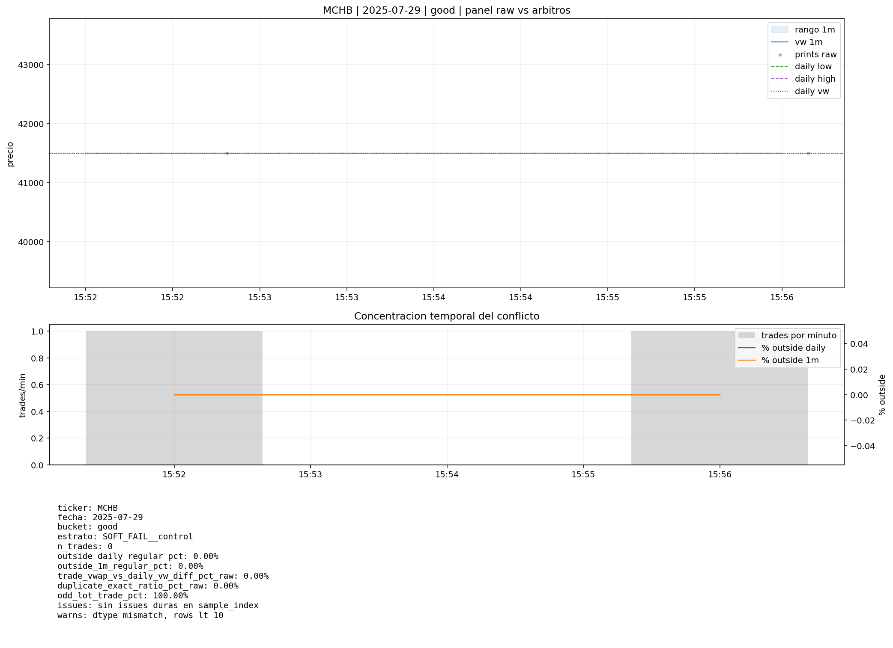

**Que muestra**

- Panel rico del tape raw frente a `daily` y `1m` para `MCHB` el `2025-07-29`.
- `n_trades = 2`, `outside_daily_regular_pct = 0.00%`, `outside_1m_regular_pct = 0.00%`.
- `trade_vwap_vs_daily_vw_diff_pct_raw = 0.00%`, `duplicate_exact_ratio_pct_raw = 0.00%`, `odd_lot_trade_pct = 100.00%`.

**Responde**

- Cola pristine donde `trades`, `daily` y `1m` alinean con limpieza. Responde a la pregunta de como luce una firma casi impecable del tape.
- Responde a si el conflicto dominante vive en la escala (`~1x`), en la comparabilidad frente a `daily` (0.00%) o frente a `1m` (0.00%).
- El 100.00% de odd-lots empuja la lectura hacia microestructura fina; evita leer el caso como pura ruptura economica gruesa.
- La decision que justifica es que el file puede usarse como patron de tape limpio, no como medida de masa util del bloque.

### MCHB | 2025-08-14

**Que muestra**

- Panel rico del tape raw frente a `daily` y `1m` para `MCHB` el `2025-08-14`.
- `n_trades = 1`, `outside_daily_regular_pct = 0.00%`, `outside_1m_regular_pct = 0.00%`.
- `trade_vwap_vs_daily_vw_diff_pct_raw = 0.00%`, `duplicate_exact_ratio_pct_raw = 0.00%`, `odd_lot_trade_pct = 100.00%`.

**Responde**

- Cola pristine donde `trades`, `daily` y `1m` alinean con limpieza. Responde a la pregunta de como luce una firma casi impecable del tape.
- Responde a si el conflicto dominante vive en la escala (`~1x`), en la comparabilidad frente a `daily` (0.00%) o frente a `1m` (0.00%).
- El 100.00% de odd-lots empuja la lectura hacia microestructura fina; evita leer el caso como pura ruptura economica gruesa.
- La decision que justifica es que el file puede usarse como patron de tape limpio, no como medida de masa util del bloque.

### MCHB | 2025-08-28

**Que muestra**

- Panel rico del tape raw frente a `daily` y `1m` para `MCHB` el `2025-08-28`.
- `n_trades = 2`, `outside_daily_regular_pct = 0.00%`, `outside_1m_regular_pct = 0.00%`.
- `trade_vwap_vs_daily_vw_diff_pct_raw = 0.00%`, `duplicate_exact_ratio_pct_raw = 0.00%`, `odd_lot_trade_pct = 100.00%`.

**Responde**

- Cola pristine donde `trades`, `daily` y `1m` alinean con limpieza. Responde a la pregunta de como luce una firma casi impecable del tape.
- Responde a si el conflicto dominante vive en la escala (`~1x`), en la comparabilidad frente a `daily` (0.00%) o frente a `1m` (0.00%).
- El 100.00% de odd-lots empuja la lectura hacia microestructura fina; evita leer el caso como pura ruptura economica gruesa.
- La decision que justifica es que el file puede usarse como patron de tape limpio, no como medida de masa util del bloque.

