# Trades Reference Scale Mismatch | muestra estratificada

## Rol

Este dossier documenta `60` casos de la muestra base del cierre real `57f/full_clean_fast_same_schema` para la familia `reference_scale_mismatch`.

No son ejemplos elegidos a dedo. Proceden del manifest estratificado reproducible materializado para el inspector.

## Que significa esta familia

Familia donde el conflicto dominante no es que el tape este roto por dentro, sino que el tape y el arbitro viven en escalas distintas. Responde a la pregunta de si el dano principal es de comparabilidad frente a `daily` o `1m`.

## Responde

- si el conflicto dominante vive en la escala frente a los arbitros
- si el caso exige reconciliacion antes de cualquier juicio economico serio

## No responde

- si el tape quedaria limpio tras reconciliacion estable
- si debe promoverse ya a `recoverable_with_flag`

## Consecuencia

- mantener prudencia institucional y no mezclarlo con `bad_data`
- priorizar reconciliacion semantica antes que exclusion automatica

## Casos

### BTM | 2011-12-30

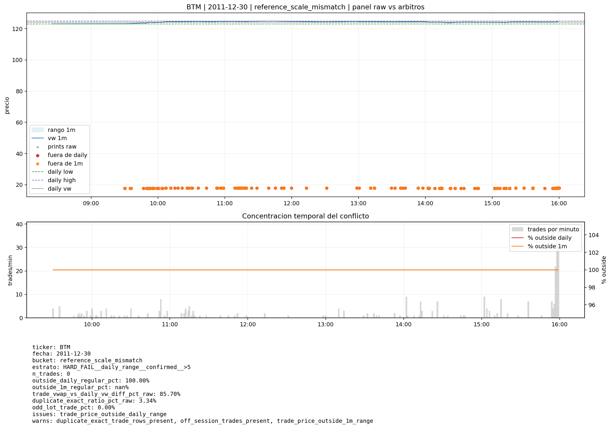

**Que muestra**

- Panel rico del tape raw frente a `daily` y `1m` para `BTM` el `2011-12-30`.
- `n_trades = 299`, `outside_daily_regular_pct = 100.00%`, `outside_1m_regular_pct = nan%`.
- `trade_vwap_vs_daily_vw_diff_pct_raw = 85.70%`, `duplicate_exact_ratio_pct_raw = 3.34%`, `odd_lot_trade_pct = 0.00%`.

**Responde**

- Familia donde el conflicto dominante no es que el tape este roto por dentro, sino que el tape y el arbitro viven en escalas distintas. Responde a la pregunta de si el dano principal es de comparabilidad frente a `daily` o `1m`.
- Responde a si el conflicto dominante vive en la escala (`>1x_other`), en la comparabilidad frente a `daily` (100.00%) o frente a `1m` (nan%).
- La decision que justifica es mantener o no el caso en `recoverable_with_flag` cuando se rematerialice la rehabilitacion sobre `57f`.

### DYNT | 2008-05-30

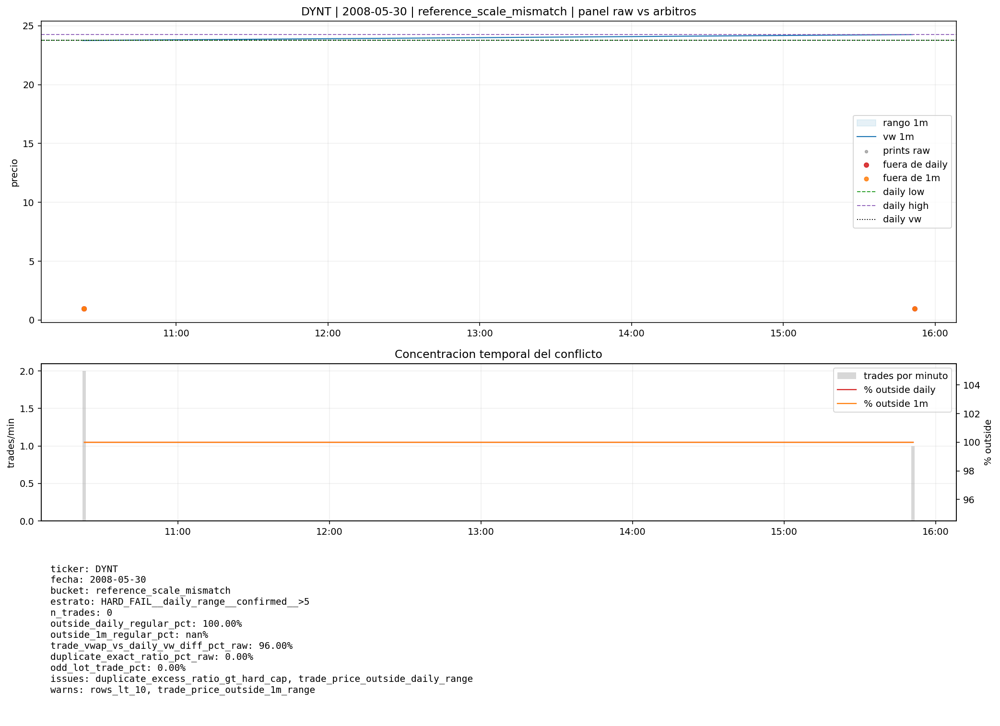

**Que muestra**

- Panel rico del tape raw frente a `daily` y `1m` para `DYNT` el `2008-05-30`.
- `n_trades = 3`, `outside_daily_regular_pct = 100.00%`, `outside_1m_regular_pct = nan%`.
- `trade_vwap_vs_daily_vw_diff_pct_raw = 96.00%`, `duplicate_exact_ratio_pct_raw = 0.00%`, `odd_lot_trade_pct = 0.00%`.

**Responde**

- Familia donde el conflicto dominante no es que el tape este roto por dentro, sino que el tape y el arbitro viven en escalas distintas. Responde a la pregunta de si el dano principal es de comparabilidad frente a `daily` o `1m`.
- Responde a si el conflicto dominante vive en la escala (`>1x_other`), en la comparabilidad frente a `daily` (100.00%) o frente a `1m` (nan%).
- La decision que justifica es mantener o no el caso en `recoverable_with_flag` cuando se rematerialice la rehabilitacion sobre `57f`.

### MFI | 2008-01-10

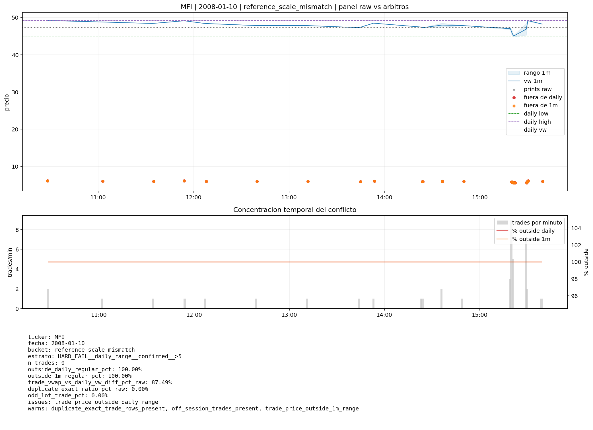

**Que muestra**

- Panel rico del tape raw frente a `daily` y `1m` para `MFI` el `2008-01-10`.
- `n_trades = 42`, `outside_daily_regular_pct = 100.00%`, `outside_1m_regular_pct = 100.00%`.
- `trade_vwap_vs_daily_vw_diff_pct_raw = 87.49%`, `duplicate_exact_ratio_pct_raw = 0.00%`, `odd_lot_trade_pct = 0.00%`.

**Responde**

- Familia donde el conflicto dominante no es que el tape este roto por dentro, sino que el tape y el arbitro viven en escalas distintas. Responde a la pregunta de si el dano principal es de comparabilidad frente a `daily` o `1m`.
- Responde a si el conflicto dominante vive en la escala (`>1x_other`), en la comparabilidad frente a `daily` (100.00%) o frente a `1m` (100.00%).
- La decision que justifica es mantener o no el caso en `recoverable_with_flag` cuando se rematerialice la rehabilitacion sobre `57f`.

### SURG | 2007-06-07

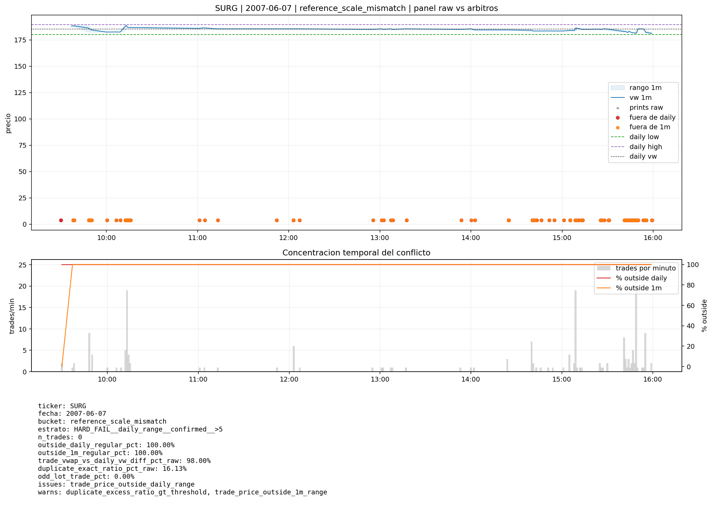

**Que muestra**

- Panel rico del tape raw frente a `daily` y `1m` para `SURG` el `2007-06-07`.
- `n_trades = 186`, `outside_daily_regular_pct = 100.00%`, `outside_1m_regular_pct = 100.00%`.
- `trade_vwap_vs_daily_vw_diff_pct_raw = 98.00%`, `duplicate_exact_ratio_pct_raw = 16.13%`, `odd_lot_trade_pct = 0.00%`.

**Responde**

- Familia donde el conflicto dominante no es que el tape este roto por dentro, sino que el tape y el arbitro viven en escalas distintas. Responde a la pregunta de si el dano principal es de comparabilidad frente a `daily` o `1m`.
- Responde a si el conflicto dominante vive en la escala (`>1x_other`), en la comparabilidad frente a `daily` (100.00%) o frente a `1m` (100.00%).
- El 16.13% de duplicacion exacta obliga a sospechar dano de tape o bursts mecanicos, no solo ruido visual.
- La decision que justifica es mantener o no el caso en `recoverable_with_flag` cuando se rematerialice la rehabilitacion sobre `57f`.

### CSPI | 2007-11-14

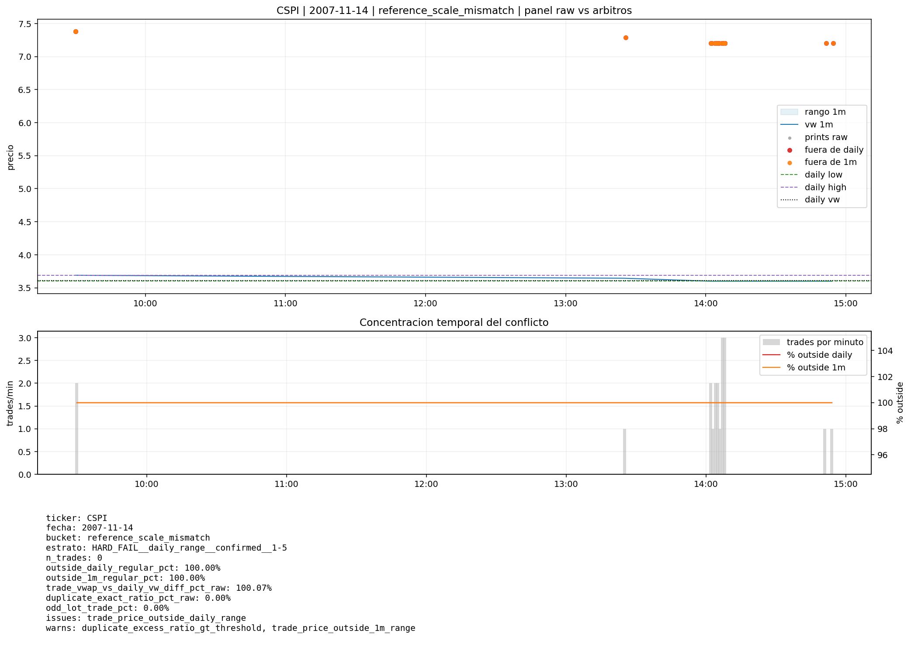

**Que muestra**

- Panel rico del tape raw frente a `daily` y `1m` para `CSPI` el `2007-11-14`.
- `n_trades = 19`, `outside_daily_regular_pct = 100.00%`, `outside_1m_regular_pct = 100.00%`.
- `trade_vwap_vs_daily_vw_diff_pct_raw = 100.07%`, `duplicate_exact_ratio_pct_raw = 0.00%`, `odd_lot_trade_pct = 0.00%`.

**Responde**

- Familia donde el conflicto dominante no es que el tape este roto por dentro, sino que el tape y el arbitro viven en escalas distintas. Responde a la pregunta de si el dano principal es de comparabilidad frente a `daily` o `1m`.
- Responde a si el conflicto dominante vive en la escala (`~0.5x`), en la comparabilidad frente a `daily` (100.00%) o frente a `1m` (100.00%).
- La decision que justifica es mantener o no el caso en `recoverable_with_flag` cuando se rematerialice la rehabilitacion sobre `57f`.

### MCBC | 2005-04-14

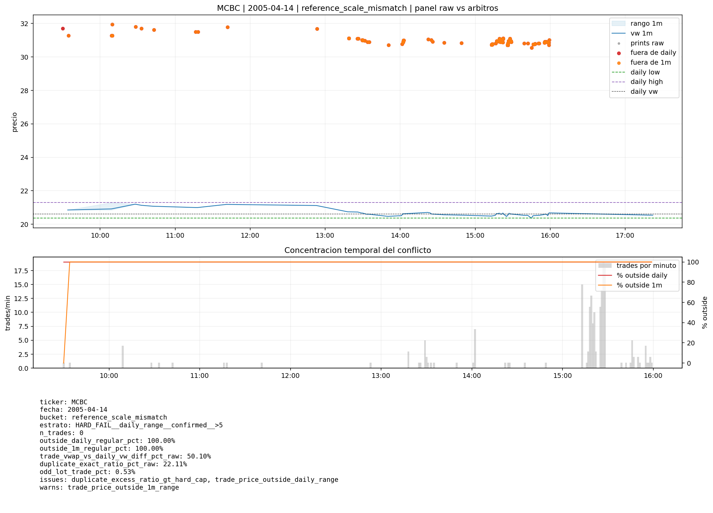

**Que muestra**

- Panel rico del tape raw frente a `daily` y `1m` para `MCBC` el `2005-04-14`.
- `n_trades = 190`, `outside_daily_regular_pct = 100.00%`, `outside_1m_regular_pct = 100.00%`.
- `trade_vwap_vs_daily_vw_diff_pct_raw = 50.10%`, `duplicate_exact_ratio_pct_raw = 22.11%`, `odd_lot_trade_pct = 0.53%`.

**Responde**

- Familia donde el conflicto dominante no es que el tape este roto por dentro, sino que el tape y el arbitro viven en escalas distintas. Responde a la pregunta de si el dano principal es de comparabilidad frente a `daily` o `1m`.
- Responde a si el conflicto dominante vive en la escala (`~0.6667x`), en la comparabilidad frente a `daily` (100.00%) o frente a `1m` (100.00%).
- El 22.11% de duplicacion exacta obliga a sospechar dano de tape o bursts mecanicos, no solo ruido visual.
- La decision que justifica es mantener o no el caso en `recoverable_with_flag` cuando se rematerialice la rehabilitacion sobre `57f`.

### SPEX | 2008-05-23

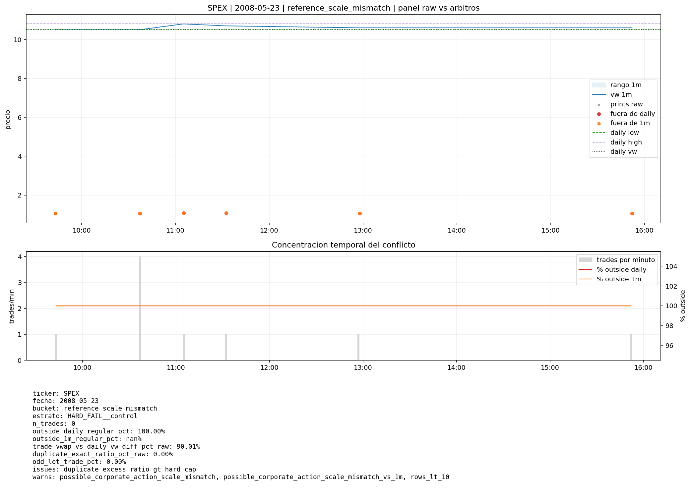

**Que muestra**

- Panel rico del tape raw frente a `daily` y `1m` para `SPEX` el `2008-05-23`.
- `n_trades = 9`, `outside_daily_regular_pct = 100.00%`, `outside_1m_regular_pct = nan%`.
- `trade_vwap_vs_daily_vw_diff_pct_raw = 90.01%`, `duplicate_exact_ratio_pct_raw = 0.00%`, `odd_lot_trade_pct = 0.00%`.

**Responde**

- Familia donde el conflicto dominante no es que el tape este roto por dentro, sino que el tape y el arbitro viven en escalas distintas. Responde a la pregunta de si el dano principal es de comparabilidad frente a `daily` o `1m`.
- Responde a si el conflicto dominante vive en la escala (`~10x`), en la comparabilidad frente a `daily` (100.00%) o frente a `1m` (nan%).
- La decision que justifica es mantener o no el caso en `recoverable_with_flag` cuando se rematerialice la rehabilitacion sobre `57f`.

### TAT | 2012-10-04

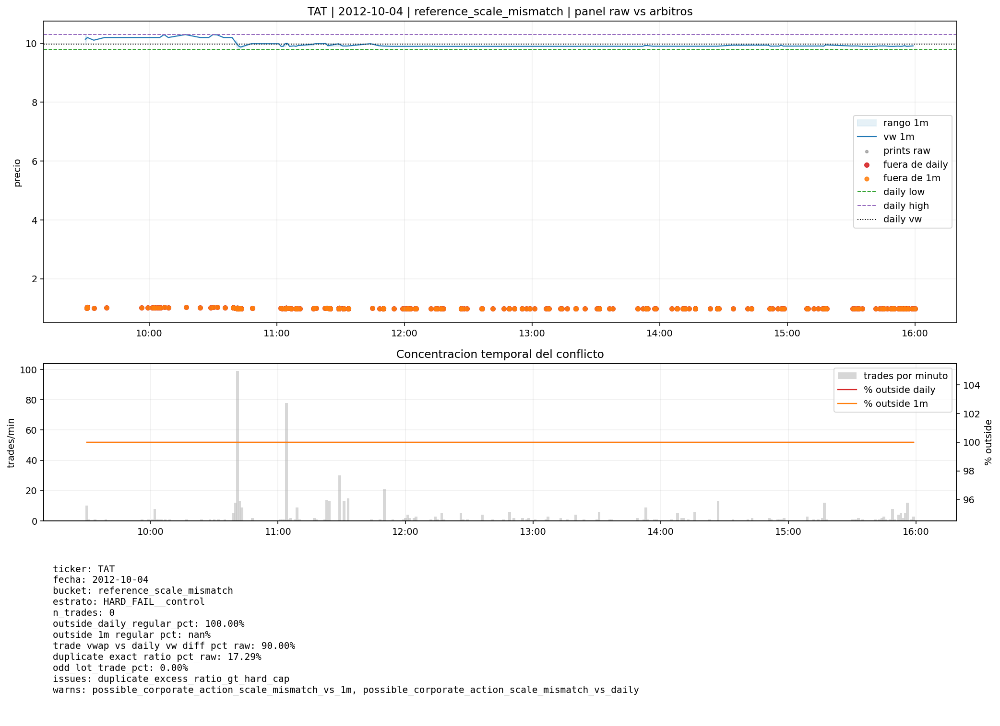

**Que muestra**

- Panel rico del tape raw frente a `daily` y `1m` para `TAT` el `2012-10-04`.
- `n_trades = 590`, `outside_daily_regular_pct = 100.00%`, `outside_1m_regular_pct = nan%`.
- `trade_vwap_vs_daily_vw_diff_pct_raw = 90.00%`, `duplicate_exact_ratio_pct_raw = 17.29%`, `odd_lot_trade_pct = 0.00%`.

**Responde**

- Familia donde el conflicto dominante no es que el tape este roto por dentro, sino que el tape y el arbitro viven en escalas distintas. Responde a la pregunta de si el dano principal es de comparabilidad frente a `daily` o `1m`.
- Responde a si el conflicto dominante vive en la escala (`~10x`), en la comparabilidad frente a `daily` (100.00%) o frente a `1m` (nan%).
- El 17.29% de duplicacion exacta obliga a sospechar dano de tape o bursts mecanicos, no solo ruido visual.
- La decision que justifica es mantener o no el caso en `recoverable_with_flag` cuando se rematerialice la rehabilitacion sobre `57f`.

### AEMD | 2016-03-16

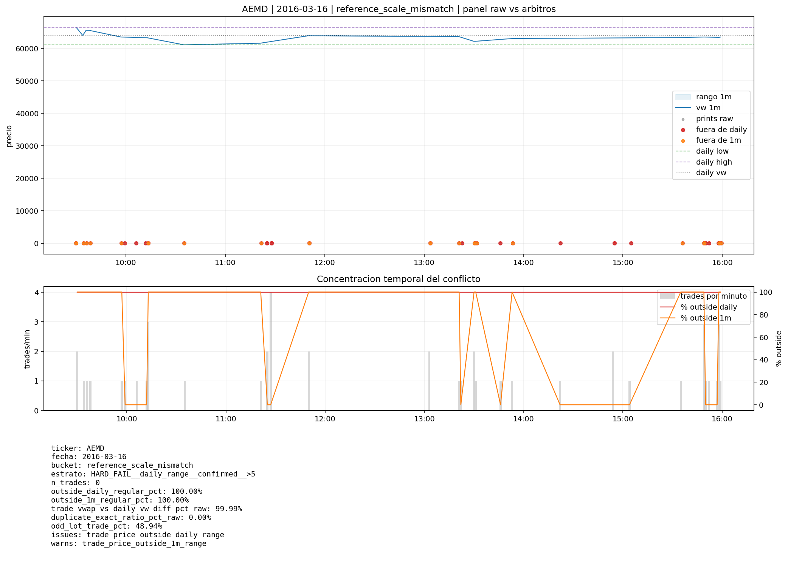

**Que muestra**

- Panel rico del tape raw frente a `daily` y `1m` para `AEMD` el `2016-03-16`.
- `n_trades = 47`, `outside_daily_regular_pct = 100.00%`, `outside_1m_regular_pct = 100.00%`.
- `trade_vwap_vs_daily_vw_diff_pct_raw = 99.99%`, `duplicate_exact_ratio_pct_raw = 0.00%`, `odd_lot_trade_pct = 48.94%`.

**Responde**

- Familia donde el conflicto dominante no es que el tape este roto por dentro, sino que el tape y el arbitro viven en escalas distintas. Responde a la pregunta de si el dano principal es de comparabilidad frente a `daily` o `1m`.
- Responde a si el conflicto dominante vive en la escala (`>1x_other`), en la comparabilidad frente a `daily` (100.00%) o frente a `1m` (100.00%).
- El 48.94% de odd-lots empuja la lectura hacia microestructura fina; evita leer el caso como pura ruptura economica gruesa.
- La decision que justifica es mantener o no el caso en `recoverable_with_flag` cuando se rematerialice la rehabilitacion sobre `57f`.

### ICON | 2014-10-08

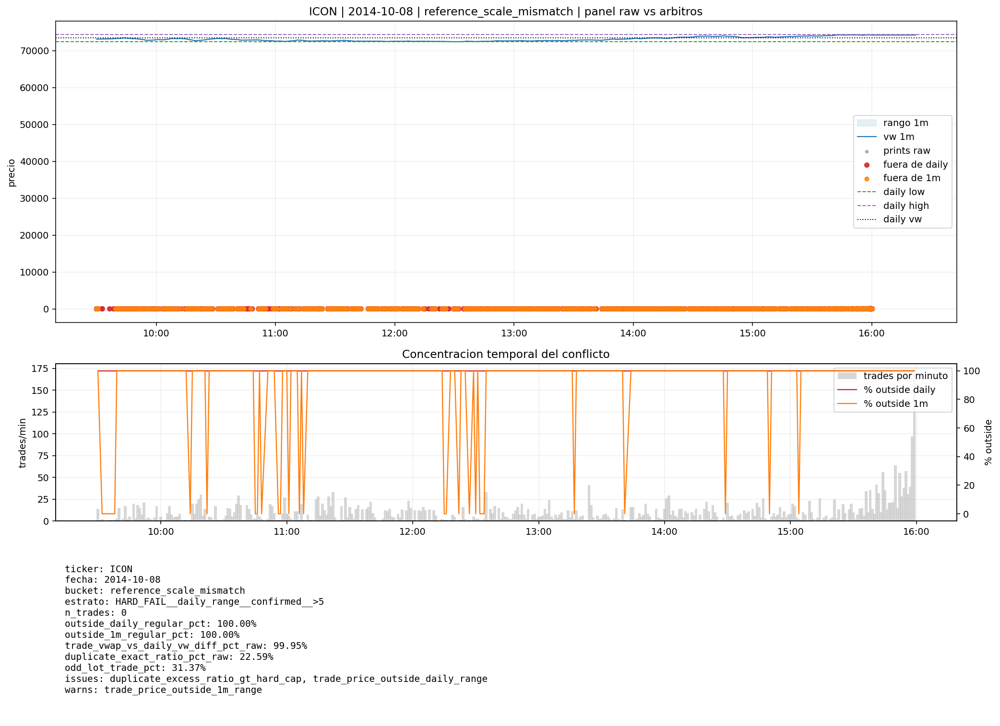

**Que muestra**

- Panel rico del tape raw frente a `daily` y `1m` para `ICON` el `2014-10-08`.
- `n_trades = 3,758`, `outside_daily_regular_pct = 100.00%`, `outside_1m_regular_pct = 100.00%`.
- `trade_vwap_vs_daily_vw_diff_pct_raw = 99.95%`, `duplicate_exact_ratio_pct_raw = 22.59%`, `odd_lot_trade_pct = 31.37%`.

**Responde**

- Familia donde el conflicto dominante no es que el tape este roto por dentro, sino que el tape y el arbitro viven en escalas distintas. Responde a la pregunta de si el dano principal es de comparabilidad frente a `daily` o `1m`.
- Responde a si el conflicto dominante vive en la escala (`>1x_other`), en la comparabilidad frente a `daily` (100.00%) o frente a `1m` (100.00%).
- El 31.37% de odd-lots empuja la lectura hacia microestructura fina; evita leer el caso como pura ruptura economica gruesa.
- El 22.59% de duplicacion exacta obliga a sospechar dano de tape o bursts mecanicos, no solo ruido visual.
- La decision que justifica es mantener o no el caso en `recoverable_with_flag` cuando se rematerialice la rehabilitacion sobre `57f`.

### OHGI | 2017-10-27

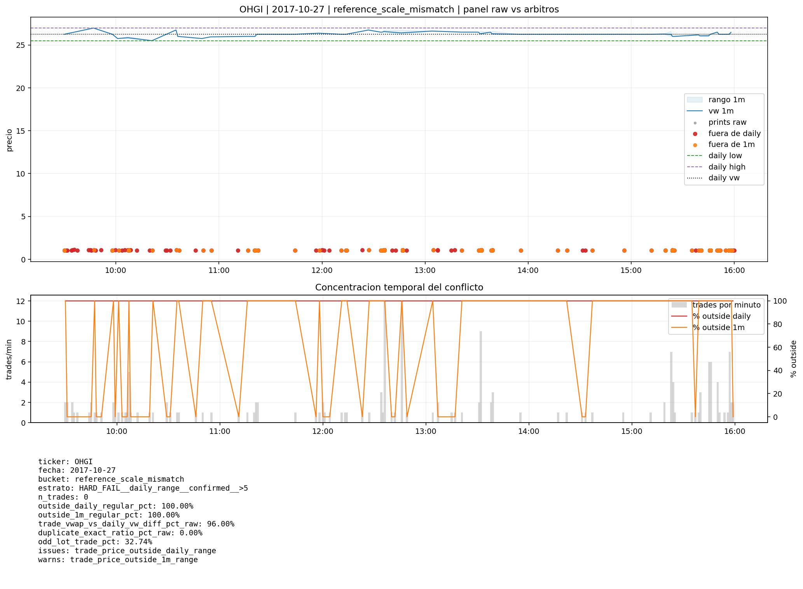

**Que muestra**

- Panel rico del tape raw frente a `daily` y `1m` para `OHGI` el `2017-10-27`.
- `n_trades = 168`, `outside_daily_regular_pct = 100.00%`, `outside_1m_regular_pct = 100.00%`.
- `trade_vwap_vs_daily_vw_diff_pct_raw = 96.00%`, `duplicate_exact_ratio_pct_raw = 0.00%`, `odd_lot_trade_pct = 32.74%`.

**Responde**

- Familia donde el conflicto dominante no es que el tape este roto por dentro, sino que el tape y el arbitro viven en escalas distintas. Responde a la pregunta de si el dano principal es de comparabilidad frente a `daily` o `1m`.
- Responde a si el conflicto dominante vive en la escala (`>1x_other`), en la comparabilidad frente a `daily` (100.00%) o frente a `1m` (100.00%).
- El 32.74% de odd-lots empuja la lectura hacia microestructura fina; evita leer el caso como pura ruptura economica gruesa.
- La decision que justifica es mantener o no el caso en `recoverable_with_flag` cuando se rematerialice la rehabilitacion sobre `57f`.

### SPCB | 2018-01-11

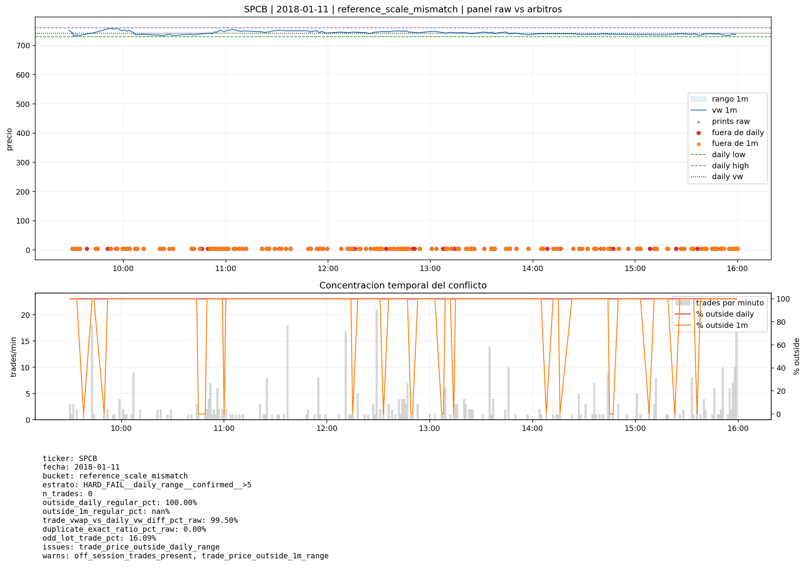

**Que muestra**

- Panel rico del tape raw frente a `daily` y `1m` para `SPCB` el `2018-01-11`.
- `n_trades = 466`, `outside_daily_regular_pct = 100.00%`, `outside_1m_regular_pct = nan%`.
- `trade_vwap_vs_daily_vw_diff_pct_raw = 99.50%`, `duplicate_exact_ratio_pct_raw = 0.00%`, `odd_lot_trade_pct = 16.09%`.

**Responde**

- Familia donde el conflicto dominante no es que el tape este roto por dentro, sino que el tape y el arbitro viven en escalas distintas. Responde a la pregunta de si el dano principal es de comparabilidad frente a `daily` o `1m`.
- Responde a si el conflicto dominante vive en la escala (`>1x_other`), en la comparabilidad frente a `daily` (100.00%) o frente a `1m` (nan%).
- La decision que justifica es mantener o no el caso en `recoverable_with_flag` cuando se rematerialice la rehabilitacion sobre `57f`.

### WHLR | 2014-07-24

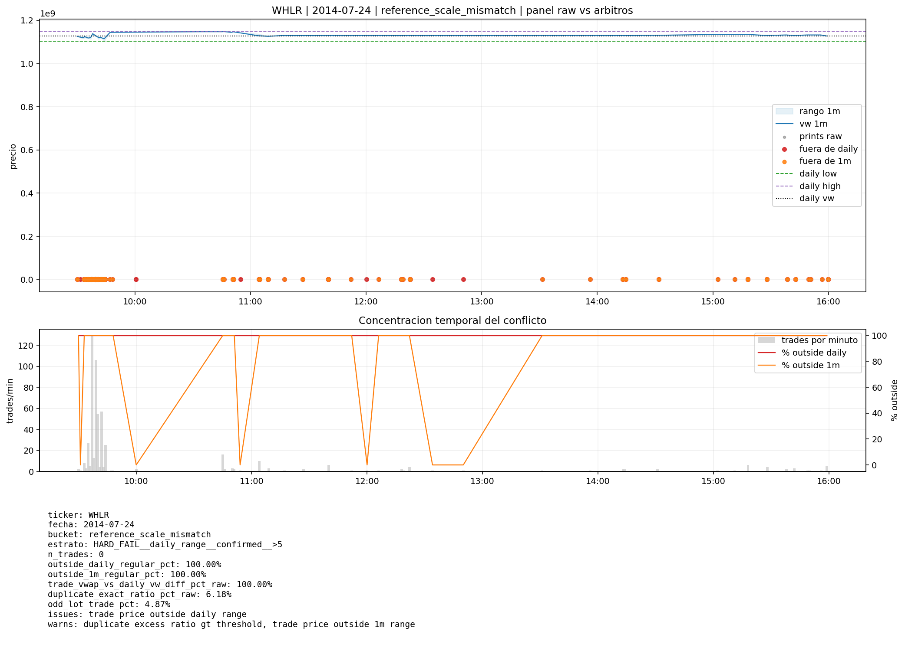

**Que muestra**

- Panel rico del tape raw frente a `daily` y `1m` para `WHLR` el `2014-07-24`.
- `n_trades = 534`, `outside_daily_regular_pct = 100.00%`, `outside_1m_regular_pct = 100.00%`.
- `trade_vwap_vs_daily_vw_diff_pct_raw = 100.00%`, `duplicate_exact_ratio_pct_raw = 6.18%`, `odd_lot_trade_pct = 4.87%`.

**Responde**

- Familia donde el conflicto dominante no es que el tape este roto por dentro, sino que el tape y el arbitro viven en escalas distintas. Responde a la pregunta de si el dano principal es de comparabilidad frente a `daily` o `1m`.
- Responde a si el conflicto dominante vive en la escala (`>1x_other`), en la comparabilidad frente a `daily` (100.00%) o frente a `1m` (100.00%).
- El 6.18% de duplicacion exacta obliga a sospechar dano de tape o bursts mecanicos, no solo ruido visual.
- La decision que justifica es mantener o no el caso en `recoverable_with_flag` cuando se rematerialice la rehabilitacion sobre `57f`.

### LARK | 2016-08-24

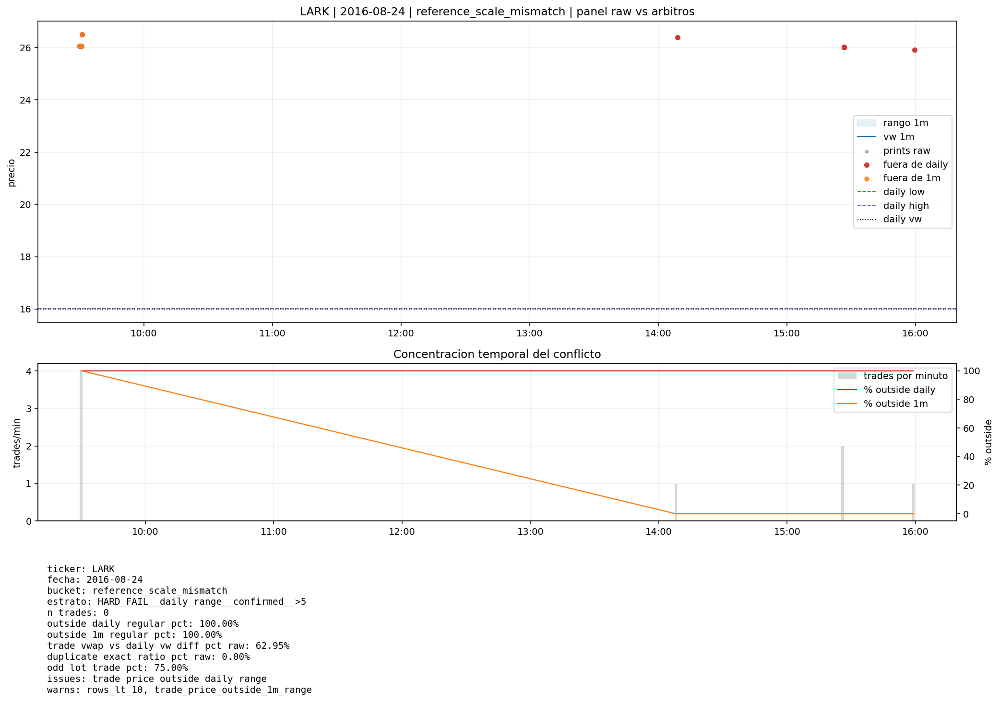

**Que muestra**

- Panel rico del tape raw frente a `daily` y `1m` para `LARK` el `2016-08-24`.
- `n_trades = 8`, `outside_daily_regular_pct = 100.00%`, `outside_1m_regular_pct = 100.00%`.
- `trade_vwap_vs_daily_vw_diff_pct_raw = 62.95%`, `duplicate_exact_ratio_pct_raw = 0.00%`, `odd_lot_trade_pct = 75.00%`.

**Responde**

- Familia donde el conflicto dominante no es que el tape este roto por dentro, sino que el tape y el arbitro viven en escalas distintas. Responde a la pregunta de si el dano principal es de comparabilidad frente a `daily` o `1m`.
- Responde a si el conflicto dominante vive en la escala (`near_0.6667x`), en la comparabilidad frente a `daily` (100.00%) o frente a `1m` (100.00%).
- El 75.00% de odd-lots empuja la lectura hacia microestructura fina; evita leer el caso como pura ruptura economica gruesa.
- La decision que justifica es mantener o no el caso en `recoverable_with_flag` cuando se rematerialice la rehabilitacion sobre `57f`.

### ACFN | 2013-10-10

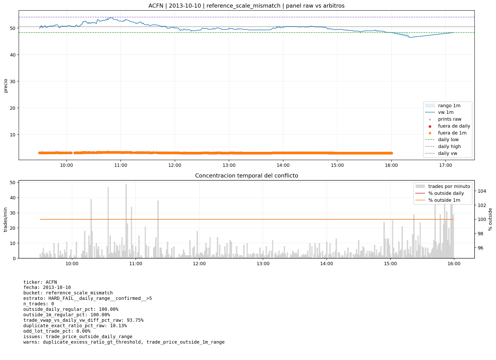

**Que muestra**

- Panel rico del tape raw frente a `daily` y `1m` para `ACFN` el `2013-10-10`.
- `n_trades = 2,291`, `outside_daily_regular_pct = 100.00%`, `outside_1m_regular_pct = 100.00%`.
- `trade_vwap_vs_daily_vw_diff_pct_raw = 93.75%`, `duplicate_exact_ratio_pct_raw = 10.13%`, `odd_lot_trade_pct = 0.00%`.

**Responde**

- Familia donde el conflicto dominante no es que el tape este roto por dentro, sino que el tape y el arbitro viven en escalas distintas. Responde a la pregunta de si el dano principal es de comparabilidad frente a `daily` o `1m`.
- Responde a si el conflicto dominante vive en la escala (`near_15x`), en la comparabilidad frente a `daily` (100.00%) o frente a `1m` (100.00%).
- El 10.13% de duplicacion exacta obliga a sospechar dano de tape o bursts mecanicos, no solo ruido visual.
- La decision que justifica es mantener o no el caso en `recoverable_with_flag` cuando se rematerialice la rehabilitacion sobre `57f`.

### LARK | 2018-01-03

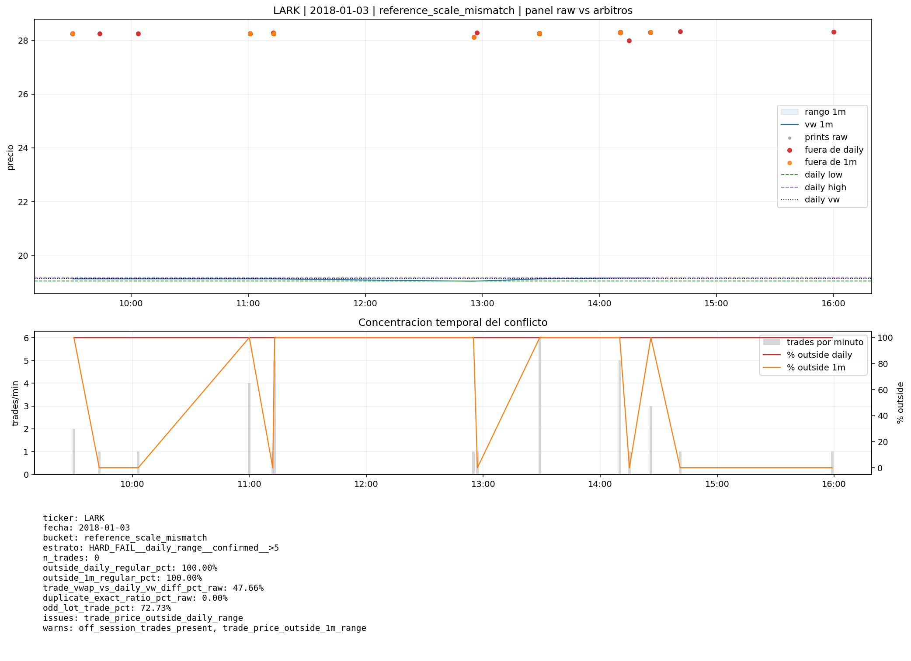

**Que muestra**

- Panel rico del tape raw frente a `daily` y `1m` para `LARK` el `2018-01-03`.
- `n_trades = 33`, `outside_daily_regular_pct = 100.00%`, `outside_1m_regular_pct = 100.00%`.
- `trade_vwap_vs_daily_vw_diff_pct_raw = 47.66%`, `duplicate_exact_ratio_pct_raw = 0.00%`, `odd_lot_trade_pct = 72.73%`.

**Responde**

- Familia donde el conflicto dominante no es que el tape este roto por dentro, sino que el tape y el arbitro viven en escalas distintas. Responde a la pregunta de si el dano principal es de comparabilidad frente a `daily` o `1m`.
- Responde a si el conflicto dominante vive en la escala (`~0.6667x`), en la comparabilidad frente a `daily` (100.00%) o frente a `1m` (100.00%).
- El 72.73% de odd-lots empuja la lectura hacia microestructura fina; evita leer el caso como pura ruptura economica gruesa.
- La decision que justifica es mantener o no el caso en `recoverable_with_flag` cuando se rematerialice la rehabilitacion sobre `57f`.

### IDXG | 2016-12-12

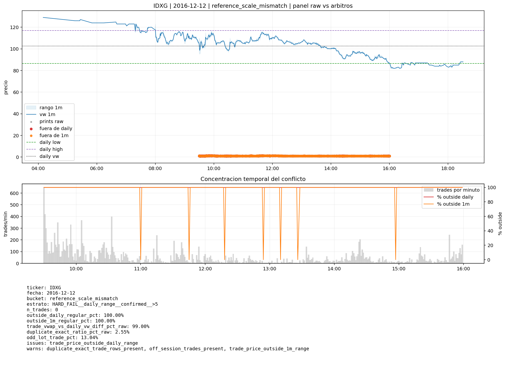

**Que muestra**

- Panel rico del tape raw frente a `daily` y `1m` para `IDXG` el `2016-12-12`.
- `n_trades = 19,132`, `outside_daily_regular_pct = 100.00%`, `outside_1m_regular_pct = 100.00%`.
- `trade_vwap_vs_daily_vw_diff_pct_raw = 99.00%`, `duplicate_exact_ratio_pct_raw = 2.55%`, `odd_lot_trade_pct = 13.04%`.

**Responde**

- Familia donde el conflicto dominante no es que el tape este roto por dentro, sino que el tape y el arbitro viven en escalas distintas. Responde a la pregunta de si el dano principal es de comparabilidad frente a `daily` o `1m`.
- Responde a si el conflicto dominante vive en la escala (`~100x`), en la comparabilidad frente a `daily` (100.00%) o frente a `1m` (100.00%).
- La decision que justifica es mantener o no el caso en `recoverable_with_flag` cuando se rematerialice la rehabilitacion sobre `57f`.

### BEBE | 2014-07-21

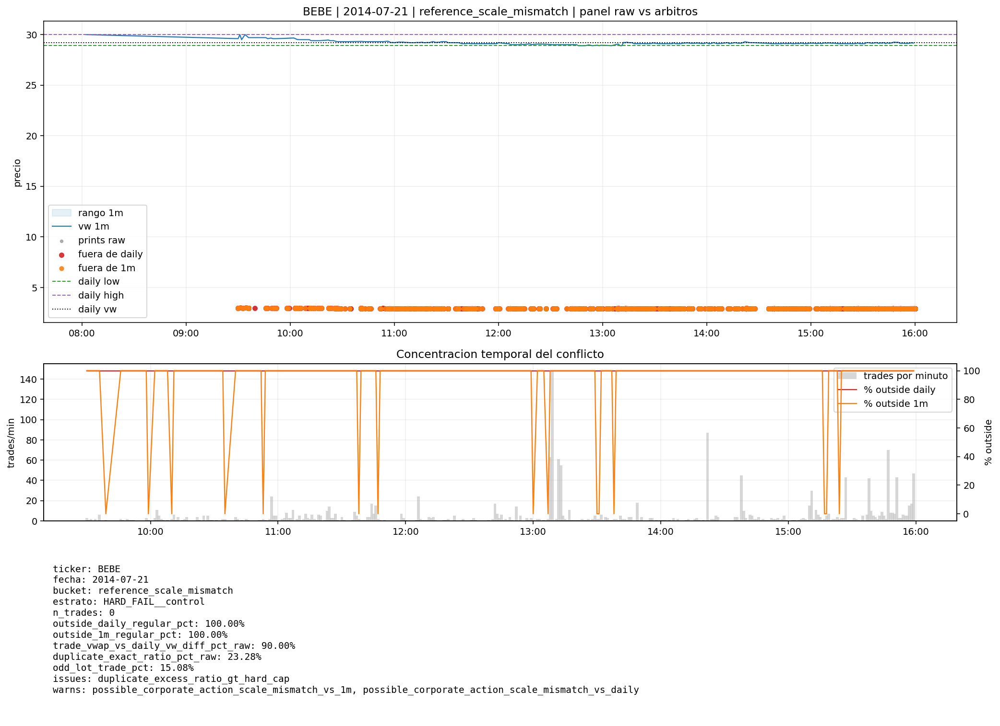

**Que muestra**

- Panel rico del tape raw frente a `daily` y `1m` para `BEBE` el `2014-07-21`.
- `n_trades = 1,645`, `outside_daily_regular_pct = 100.00%`, `outside_1m_regular_pct = 100.00%`.
- `trade_vwap_vs_daily_vw_diff_pct_raw = 90.00%`, `duplicate_exact_ratio_pct_raw = 23.28%`, `odd_lot_trade_pct = 15.08%`.

**Responde**

- Familia donde el conflicto dominante no es que el tape este roto por dentro, sino que el tape y el arbitro viven en escalas distintas. Responde a la pregunta de si el dano principal es de comparabilidad frente a `daily` o `1m`.
- Responde a si el conflicto dominante vive en la escala (`~10x`), en la comparabilidad frente a `daily` (100.00%) o frente a `1m` (100.00%).
- El 23.28% de duplicacion exacta obliga a sospechar dano de tape o bursts mecanicos, no solo ruido visual.
- La decision que justifica es mantener o no el caso en `recoverable_with_flag` cuando se rematerialice la rehabilitacion sobre `57f`.

### HHS | 2015-11-30

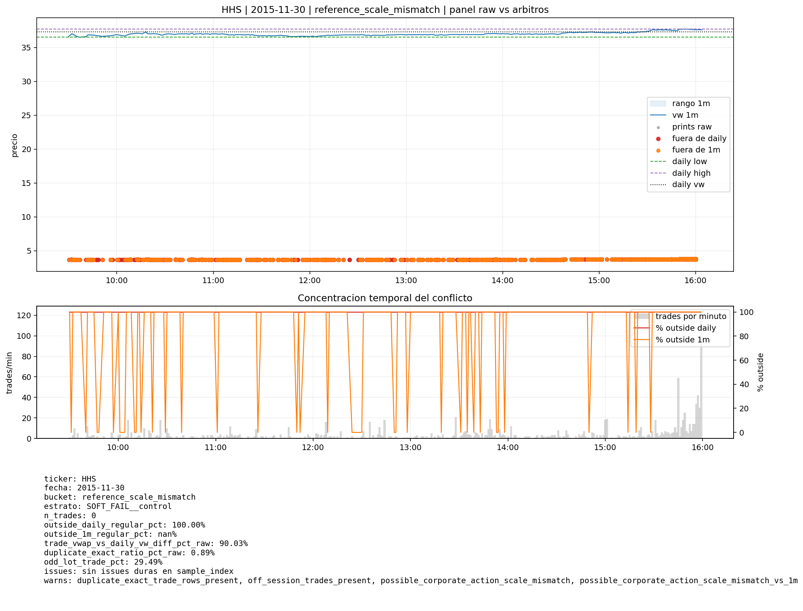

**Que muestra**

- Panel rico del tape raw frente a `daily` y `1m` para `HHS` el `2015-11-30`.
- `n_trades = 1,343`, `outside_daily_regular_pct = 100.00%`, `outside_1m_regular_pct = nan%`.
- `trade_vwap_vs_daily_vw_diff_pct_raw = 90.03%`, `duplicate_exact_ratio_pct_raw = 0.89%`, `odd_lot_trade_pct = 29.49%`.

**Responde**

- Familia donde el conflicto dominante no es que el tape este roto por dentro, sino que el tape y el arbitro viven en escalas distintas. Responde a la pregunta de si el dano principal es de comparabilidad frente a `daily` o `1m`.
- Responde a si el conflicto dominante vive en la escala (`~10x`), en la comparabilidad frente a `daily` (100.00%) o frente a `1m` (nan%).
- El 29.49% de odd-lots empuja la lectura hacia microestructura fina; evita leer el caso como pura ruptura economica gruesa.
- La decision que justifica es mantener o no el caso en `recoverable_with_flag` cuando se rematerialice la rehabilitacion sobre `57f`.

### ATV | 2017-10-13

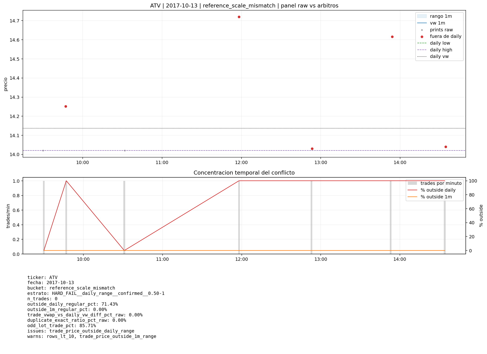

**Que muestra**

- Panel rico del tape raw frente a `daily` y `1m` para `ATV` el `2017-10-13`.
- `n_trades = 7`, `outside_daily_regular_pct = 71.43%`, `outside_1m_regular_pct = 0.00%`.
- `trade_vwap_vs_daily_vw_diff_pct_raw = 0.00%`, `duplicate_exact_ratio_pct_raw = 0.00%`, `odd_lot_trade_pct = 85.71%`.

**Responde**

- Familia donde el conflicto dominante no es que el tape este roto por dentro, sino que el tape y el arbitro viven en escalas distintas. Responde a la pregunta de si el dano principal es de comparabilidad frente a `daily` o `1m`.
- Responde a si el conflicto dominante vive en la escala (`~1x`), en la comparabilidad frente a `daily` (71.43%) o frente a `1m` (0.00%).
- El 85.71% de odd-lots empuja la lectura hacia microestructura fina; evita leer el caso como pura ruptura economica gruesa.
- La decision que justifica es mantener o no el caso en `recoverable_with_flag` cuando se rematerialice la rehabilitacion sobre `57f`.

### ACRX | 2013-04-10

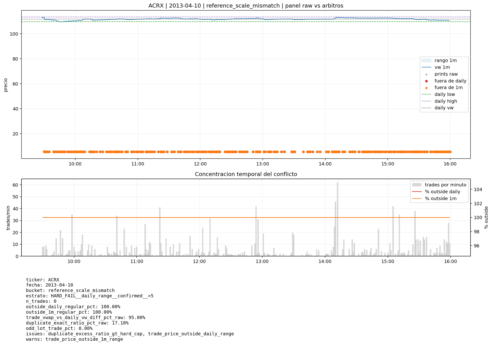

**Que muestra**

- Panel rico del tape raw frente a `daily` y `1m` para `ACRX` el `2013-04-10`.
- `n_trades = 1,602`, `outside_daily_regular_pct = 100.00%`, `outside_1m_regular_pct = 100.00%`.
- `trade_vwap_vs_daily_vw_diff_pct_raw = 95.00%`, `duplicate_exact_ratio_pct_raw = 17.10%`, `odd_lot_trade_pct = 0.00%`.

**Responde**

- Familia donde el conflicto dominante no es que el tape este roto por dentro, sino que el tape y el arbitro viven en escalas distintas. Responde a la pregunta de si el dano principal es de comparabilidad frente a `daily` o `1m`.
- Responde a si el conflicto dominante vive en la escala (`~20x`), en la comparabilidad frente a `daily` (100.00%) o frente a `1m` (100.00%).
- El 17.10% de duplicacion exacta obliga a sospechar dano de tape o bursts mecanicos, no solo ruido visual.
- La decision que justifica es mantener o no el caso en `recoverable_with_flag` cuando se rematerialice la rehabilitacion sobre `57f`.

### ATHX | 2021-04-28

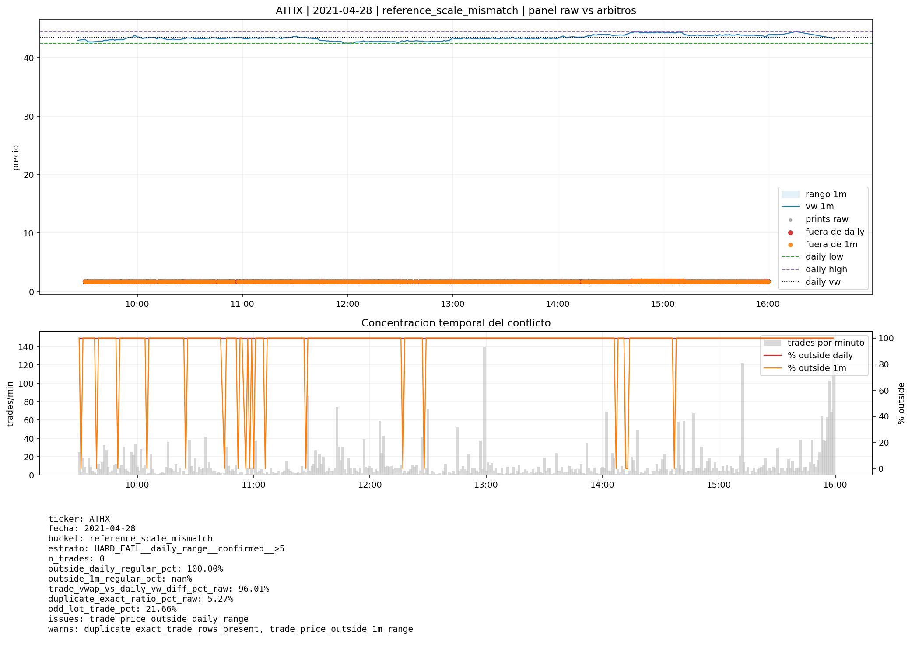

**Que muestra**

- Panel rico del tape raw frente a `daily` y `1m` para `ATHX` el `2021-04-28`.
- `n_trades = 4,482`, `outside_daily_regular_pct = 100.00%`, `outside_1m_regular_pct = nan%`.
- `trade_vwap_vs_daily_vw_diff_pct_raw = 96.01%`, `duplicate_exact_ratio_pct_raw = 5.27%`, `odd_lot_trade_pct = 21.66%`.

**Responde**

- Familia donde el conflicto dominante no es que el tape este roto por dentro, sino que el tape y el arbitro viven en escalas distintas. Responde a la pregunta de si el dano principal es de comparabilidad frente a `daily` o `1m`.
- Responde a si el conflicto dominante vive en la escala (`>1x_other`), en la comparabilidad frente a `daily` (100.00%) o frente a `1m` (nan%).
- El 5.27% de duplicacion exacta obliga a sospechar dano de tape o bursts mecanicos, no solo ruido visual.
- La decision que justifica es mantener o no el caso en `recoverable_with_flag` cuando se rematerialice la rehabilitacion sobre `57f`.

### CHSN | 2025-07-24

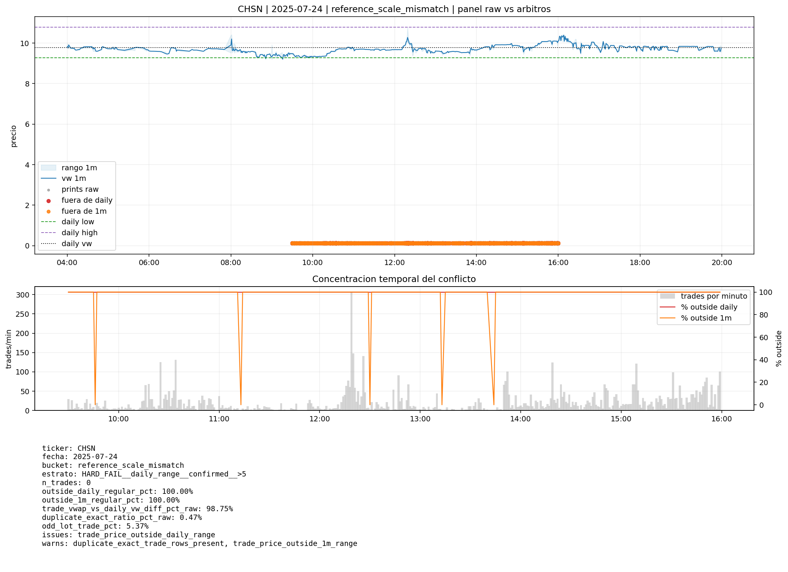

**Que muestra**

- Panel rico del tape raw frente a `daily` y `1m` para `CHSN` el `2025-07-24`.
- `n_trades = 7,586`, `outside_daily_regular_pct = 100.00%`, `outside_1m_regular_pct = 100.00%`.
- `trade_vwap_vs_daily_vw_diff_pct_raw = 98.75%`, `duplicate_exact_ratio_pct_raw = 0.47%`, `odd_lot_trade_pct = 5.37%`.

**Responde**

- Familia donde el conflicto dominante no es que el tape este roto por dentro, sino que el tape y el arbitro viven en escalas distintas. Responde a la pregunta de si el dano principal es de comparabilidad frente a `daily` o `1m`.
- Responde a si el conflicto dominante vive en la escala (`>1x_other`), en la comparabilidad frente a `daily` (100.00%) o frente a `1m` (100.00%).
- La decision que justifica es mantener o no el caso en `recoverable_with_flag` cuando se rematerialice la rehabilitacion sobre `57f`.

### RVYL | 2025-09-23

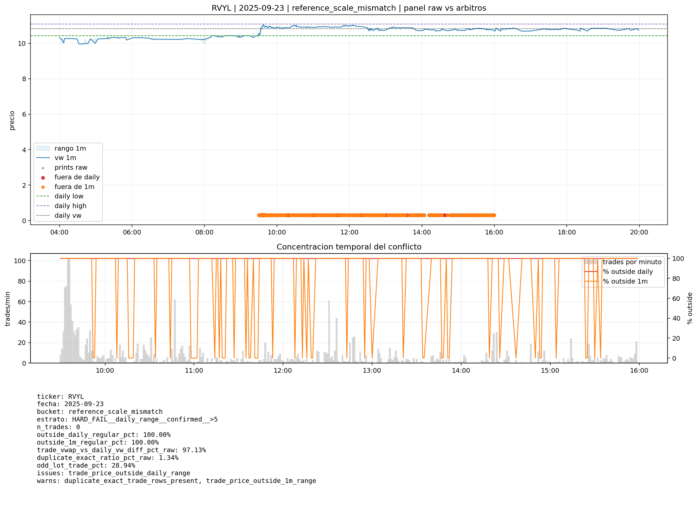

**Que muestra**

- Panel rico del tape raw frente a `daily` y `1m` para `RVYL` el `2025-09-23`.
- `n_trades = 2,322`, `outside_daily_regular_pct = 100.00%`, `outside_1m_regular_pct = 100.00%`.
- `trade_vwap_vs_daily_vw_diff_pct_raw = 97.13%`, `duplicate_exact_ratio_pct_raw = 1.34%`, `odd_lot_trade_pct = 28.94%`.

**Responde**

- Familia donde el conflicto dominante no es que el tape este roto por dentro, sino que el tape y el arbitro viven en escalas distintas. Responde a la pregunta de si el dano principal es de comparabilidad frente a `daily` o `1m`.
- Responde a si el conflicto dominante vive en la escala (`>1x_other`), en la comparabilidad frente a `daily` (100.00%) o frente a `1m` (100.00%).
- El 28.94% de odd-lots empuja la lectura hacia microestructura fina; evita leer el caso como pura ruptura economica gruesa.
- La decision que justifica es mantener o no el caso en `recoverable_with_flag` cuando se rematerialice la rehabilitacion sobre `57f`.

### SCLX | 2023-05-18

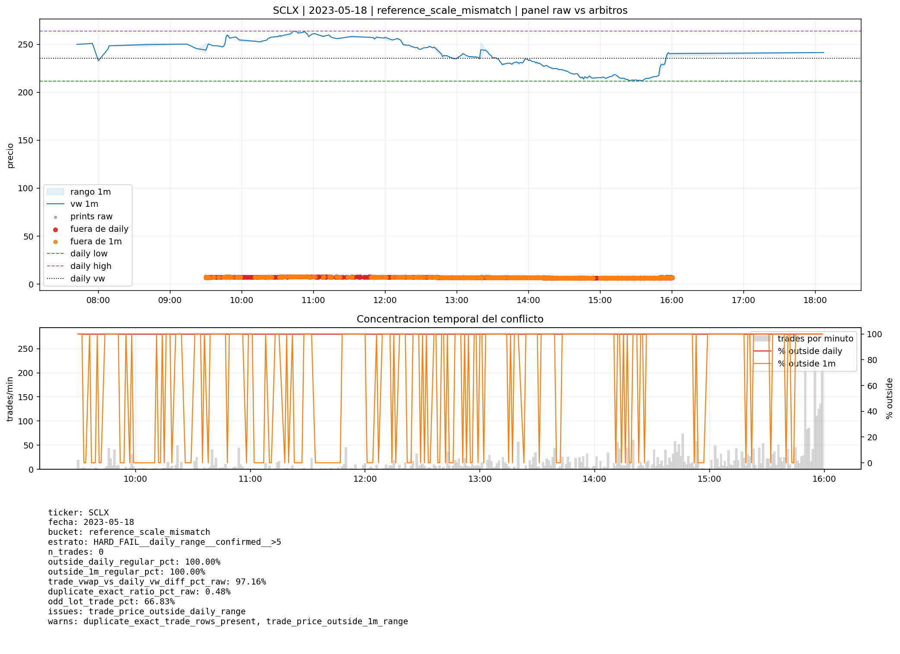

**Que muestra**

- Panel rico del tape raw frente a `daily` y `1m` para `SCLX` el `2023-05-18`.
- `n_trades = 5,450`, `outside_daily_regular_pct = 100.00%`, `outside_1m_regular_pct = 100.00%`.
- `trade_vwap_vs_daily_vw_diff_pct_raw = 97.16%`, `duplicate_exact_ratio_pct_raw = 0.48%`, `odd_lot_trade_pct = 66.83%`.

**Responde**

- Familia donde el conflicto dominante no es que el tape este roto por dentro, sino que el tape y el arbitro viven en escalas distintas. Responde a la pregunta de si el dano principal es de comparabilidad frente a `daily` o `1m`.
- Responde a si el conflicto dominante vive en la escala (`>1x_other`), en la comparabilidad frente a `daily` (100.00%) o frente a `1m` (100.00%).
- El 66.83% de odd-lots empuja la lectura hacia microestructura fina; evita leer el caso como pura ruptura economica gruesa.
- La decision que justifica es mantener o no el caso en `recoverable_with_flag` cuando se rematerialice la rehabilitacion sobre `57f`.

### SILO | 2022-02-25

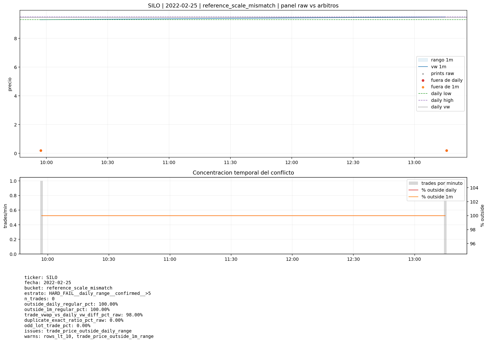

**Que muestra**

- Panel rico del tape raw frente a `daily` y `1m` para `SILO` el `2022-02-25`.
- `n_trades = 2`, `outside_daily_regular_pct = 100.00%`, `outside_1m_regular_pct = 100.00%`.
- `trade_vwap_vs_daily_vw_diff_pct_raw = 98.00%`, `duplicate_exact_ratio_pct_raw = 0.00%`, `odd_lot_trade_pct = 0.00%`.

**Responde**

- Familia donde el conflicto dominante no es que el tape este roto por dentro, sino que el tape y el arbitro viven en escalas distintas. Responde a la pregunta de si el dano principal es de comparabilidad frente a `daily` o `1m`.
- Responde a si el conflicto dominante vive en la escala (`>1x_other`), en la comparabilidad frente a `daily` (100.00%) o frente a `1m` (100.00%).
- La decision que justifica es mantener o no el caso en `recoverable_with_flag` cuando se rematerialice la rehabilitacion sobre `57f`.

### SNWV | 2022-09-20

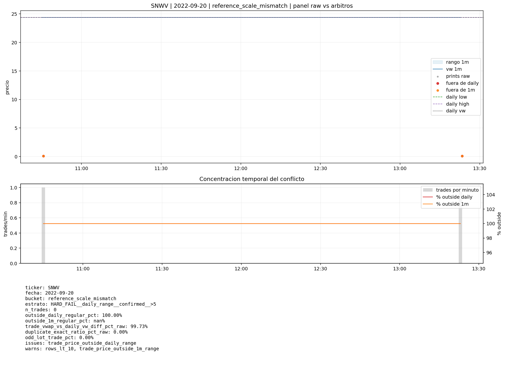

**Que muestra**

- Panel rico del tape raw frente a `daily` y `1m` para `SNWV` el `2022-09-20`.
- `n_trades = 2`, `outside_daily_regular_pct = 100.00%`, `outside_1m_regular_pct = nan%`.
- `trade_vwap_vs_daily_vw_diff_pct_raw = 99.73%`, `duplicate_exact_ratio_pct_raw = 0.00%`, `odd_lot_trade_pct = 0.00%`.

**Responde**

- Familia donde el conflicto dominante no es que el tape este roto por dentro, sino que el tape y el arbitro viven en escalas distintas. Responde a la pregunta de si el dano principal es de comparabilidad frente a `daily` o `1m`.
- Responde a si el conflicto dominante vive en la escala (`>1x_other`), en la comparabilidad frente a `daily` (100.00%) o frente a `1m` (nan%).
- La decision que justifica es mantener o no el caso en `recoverable_with_flag` cuando se rematerialice la rehabilitacion sobre `57f`.

### TENX | 2021-05-25

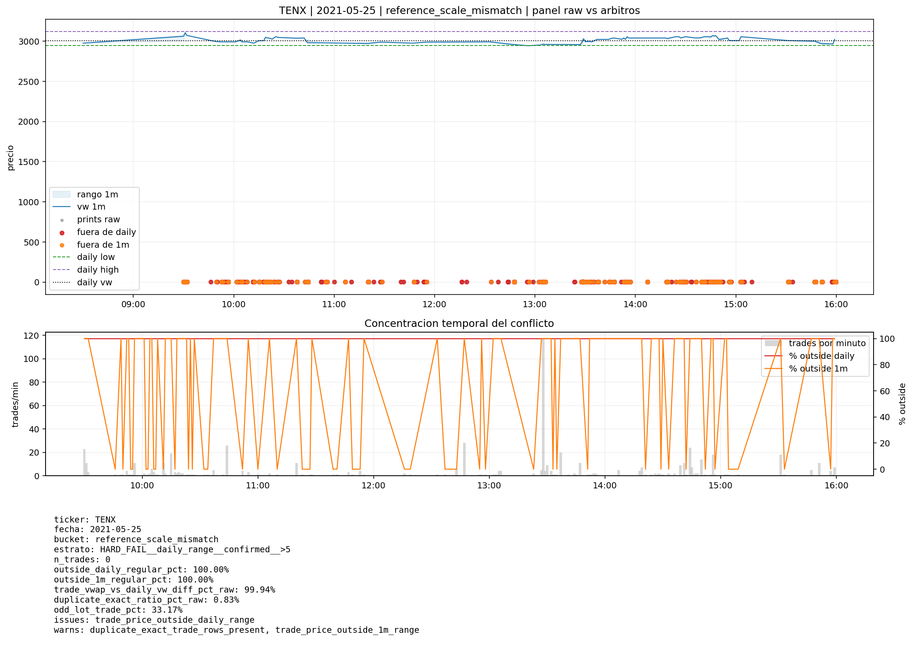

**Que muestra**

- Panel rico del tape raw frente a `daily` y `1m` para `TENX` el `2021-05-25`.
- `n_trades = 606`, `outside_daily_regular_pct = 100.00%`, `outside_1m_regular_pct = 100.00%`.
- `trade_vwap_vs_daily_vw_diff_pct_raw = 99.94%`, `duplicate_exact_ratio_pct_raw = 0.83%`, `odd_lot_trade_pct = 33.17%`.

**Responde**

- Familia donde el conflicto dominante no es que el tape este roto por dentro, sino que el tape y el arbitro viven en escalas distintas. Responde a la pregunta de si el dano principal es de comparabilidad frente a `daily` o `1m`.
- Responde a si el conflicto dominante vive en la escala (`>1x_other`), en la comparabilidad frente a `daily` (100.00%) o frente a `1m` (100.00%).
- El 33.17% de odd-lots empuja la lectura hacia microestructura fina; evita leer el caso como pura ruptura economica gruesa.
- La decision que justifica es mantener o no el caso en `recoverable_with_flag` cuando se rematerialice la rehabilitacion sobre `57f`.

### TIVC | 2024-02-16

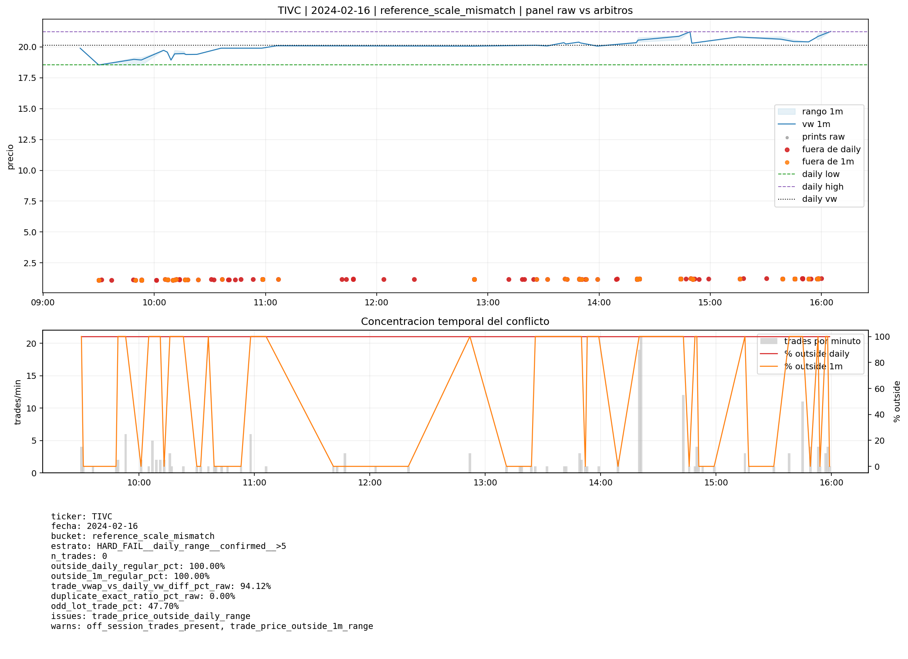

**Que muestra**

- Panel rico del tape raw frente a `daily` y `1m` para `TIVC` el `2024-02-16`.
- `n_trades = 174`, `outside_daily_regular_pct = 100.00%`, `outside_1m_regular_pct = 100.00%`.
- `trade_vwap_vs_daily_vw_diff_pct_raw = 94.12%`, `duplicate_exact_ratio_pct_raw = 0.00%`, `odd_lot_trade_pct = 47.70%`.

**Responde**

- Familia donde el conflicto dominante no es que el tape este roto por dentro, sino que el tape y el arbitro viven en escalas distintas. Responde a la pregunta de si el dano principal es de comparabilidad frente a `daily` o `1m`.
- Responde a si el conflicto dominante vive en la escala (`>1x_other`), en la comparabilidad frente a `daily` (100.00%) o frente a `1m` (100.00%).
- El 47.70% de odd-lots empuja la lectura hacia microestructura fina; evita leer el caso como pura ruptura economica gruesa.
- La decision que justifica es mantener o no el caso en `recoverable_with_flag` cuando se rematerialice la rehabilitacion sobre `57f`.

### WWR | 2019-04-17

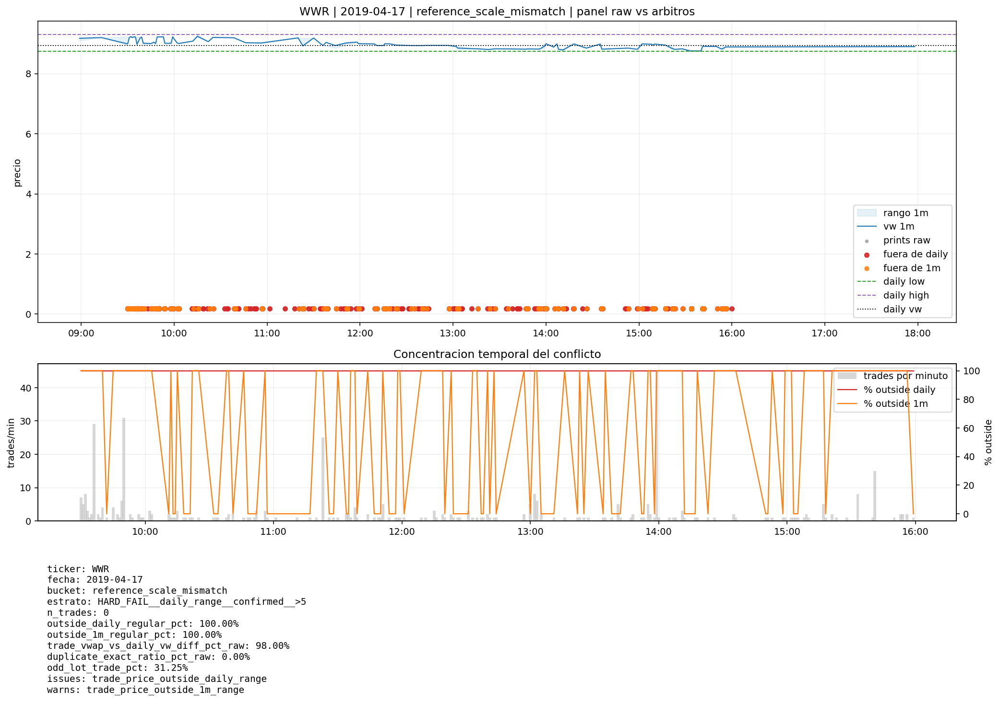

**Que muestra**

- Panel rico del tape raw frente a `daily` y `1m` para `WWR` el `2019-04-17`.
- `n_trades = 400`, `outside_daily_regular_pct = 100.00%`, `outside_1m_regular_pct = 100.00%`.
- `trade_vwap_vs_daily_vw_diff_pct_raw = 98.00%`, `duplicate_exact_ratio_pct_raw = 0.00%`, `odd_lot_trade_pct = 31.25%`.

**Responde**

- Familia donde el conflicto dominante no es que el tape este roto por dentro, sino que el tape y el arbitro viven en escalas distintas. Responde a la pregunta de si el dano principal es de comparabilidad frente a `daily` o `1m`.
- Responde a si el conflicto dominante vive en la escala (`>1x_other`), en la comparabilidad frente a `daily` (100.00%) o frente a `1m` (100.00%).
- El 31.25% de odd-lots empuja la lectura hacia microestructura fina; evita leer el caso como pura ruptura economica gruesa.
- La decision que justifica es mantener o no el caso en `recoverable_with_flag` cuando se rematerialice la rehabilitacion sobre `57f`.

### DOUG | 2022-11-09

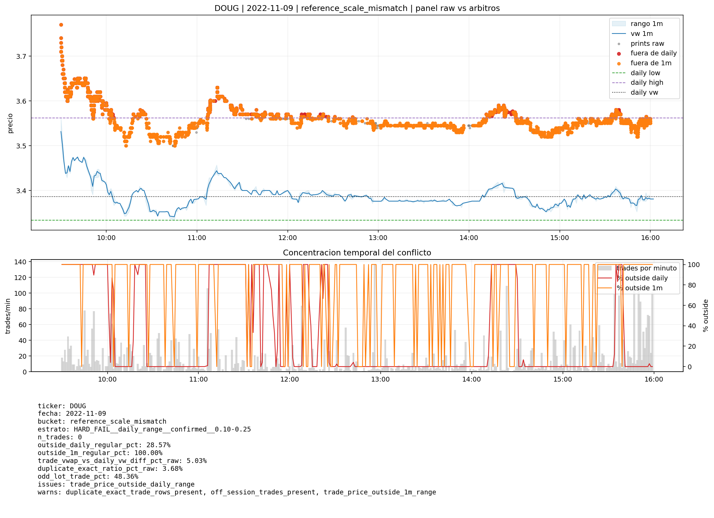

**Que muestra**

- Panel rico del tape raw frente a `daily` y `1m` para `DOUG` el `2022-11-09`.
- `n_trades = 5,757`, `outside_daily_regular_pct = 28.57%`, `outside_1m_regular_pct = 100.00%`.
- `trade_vwap_vs_daily_vw_diff_pct_raw = 5.03%`, `duplicate_exact_ratio_pct_raw = 3.68%`, `odd_lot_trade_pct = 48.36%`.

**Responde**

- Familia donde el conflicto dominante no es que el tape este roto por dentro, sino que el tape y el arbitro viven en escalas distintas. Responde a la pregunta de si el dano principal es de comparabilidad frente a `daily` o `1m`.
- Responde a si el conflicto dominante vive en la escala (`near_0.9091x`), en la comparabilidad frente a `daily` (28.57%) o frente a `1m` (100.00%).
- El 48.36% de odd-lots empuja la lectura hacia microestructura fina; evita leer el caso como pura ruptura economica gruesa.
- La decision que justifica es mantener o no el caso en `recoverable_with_flag` cuando se rematerialice la rehabilitacion sobre `57f`.

### PMD | 2024-11-12

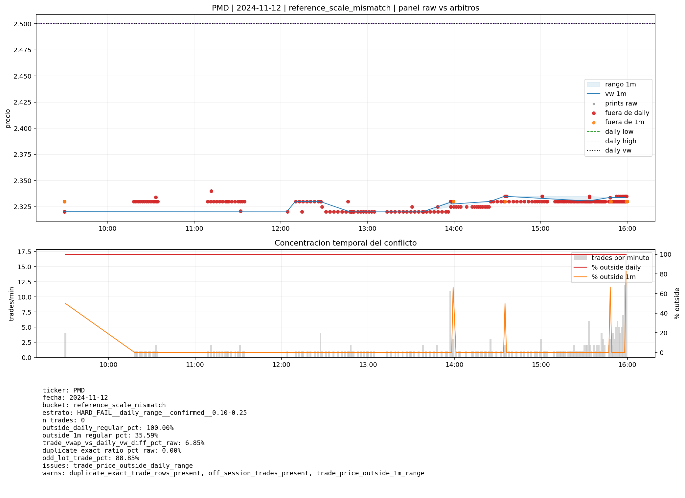

**Que muestra**

- Panel rico del tape raw frente a `daily` y `1m` para `PMD` el `2024-11-12`.
- `n_trades = 269`, `outside_daily_regular_pct = 100.00%`, `outside_1m_regular_pct = 35.59%`.
- `trade_vwap_vs_daily_vw_diff_pct_raw = 6.85%`, `duplicate_exact_ratio_pct_raw = 0.00%`, `odd_lot_trade_pct = 88.85%`.

**Responde**

- Familia donde el conflicto dominante no es que el tape este roto por dentro, sino que el tape y el arbitro viven en escalas distintas. Responde a la pregunta de si el dano principal es de comparabilidad frente a `daily` o `1m`.
- Responde a si el conflicto dominante vive en la escala (`near_1.1111x`), en la comparabilidad frente a `daily` (100.00%) o frente a `1m` (35.59%).
- El 88.85% de odd-lots empuja la lectura hacia microestructura fina; evita leer el caso como pura ruptura economica gruesa.
- La decision que justifica es mantener o no el caso en `recoverable_with_flag` cuando se rematerialice la rehabilitacion sobre `57f`.

### ACON | 2024-10-14

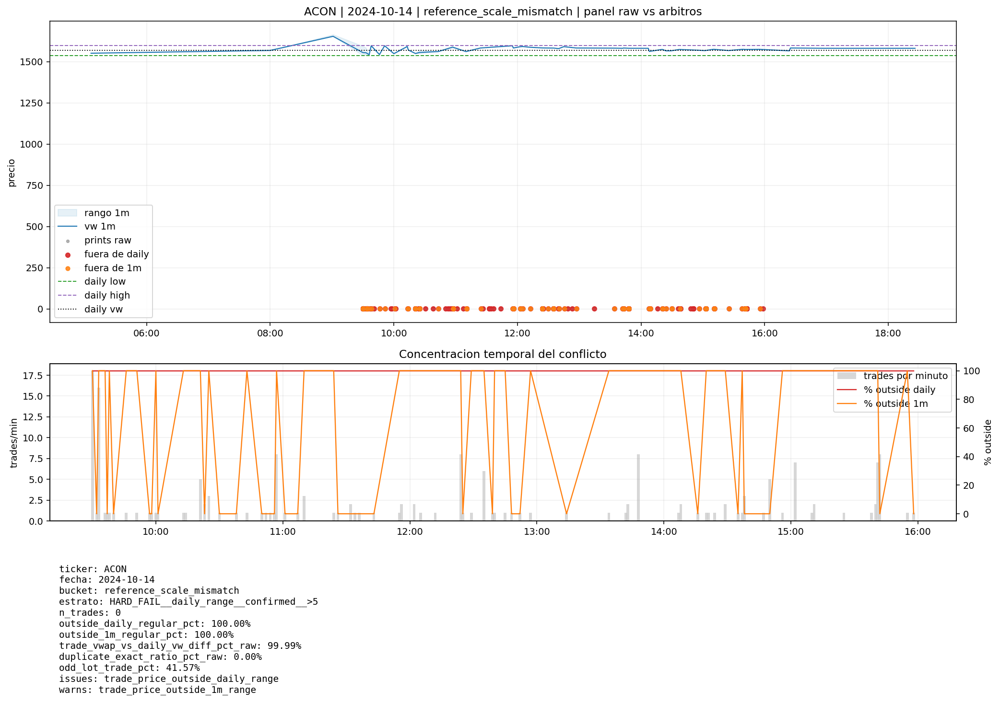

**Que muestra**

- Panel rico del tape raw frente a `daily` y `1m` para `ACON` el `2024-10-14`.
- `n_trades = 178`, `outside_daily_regular_pct = 100.00%`, `outside_1m_regular_pct = 100.00%`.
- `trade_vwap_vs_daily_vw_diff_pct_raw = 99.99%`, `duplicate_exact_ratio_pct_raw = 0.00%`, `odd_lot_trade_pct = 41.57%`.

**Responde**

- Familia donde el conflicto dominante no es que el tape este roto por dentro, sino que el tape y el arbitro viven en escalas distintas. Responde a la pregunta de si el dano principal es de comparabilidad frente a `daily` o `1m`.
- Responde a si el conflicto dominante vive en la escala (`near_10000x`), en la comparabilidad frente a `daily` (100.00%) o frente a `1m` (100.00%).
- El 41.57% de odd-lots empuja la lectura hacia microestructura fina; evita leer el caso como pura ruptura economica gruesa.
- La decision que justifica es mantener o no el caso en `recoverable_with_flag` cuando se rematerialice la rehabilitacion sobre `57f`.

### YYAI | 2024-04-19

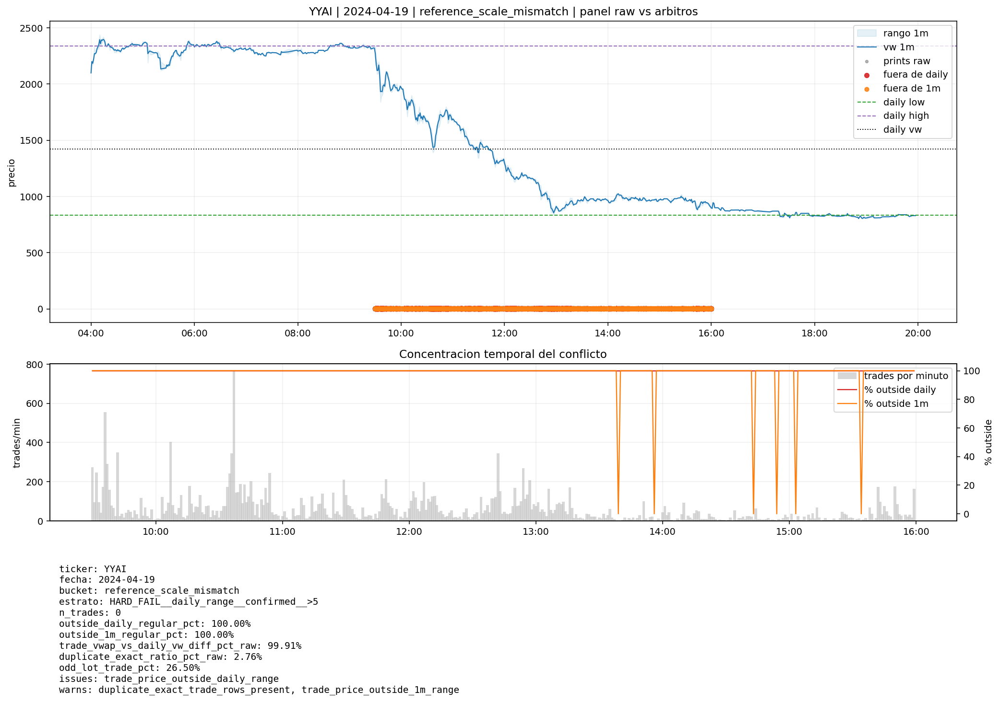

**Que muestra**

- Panel rico del tape raw frente a `daily` y `1m` para `YYAI` el `2024-04-19`.
- `n_trades = 22,336`, `outside_daily_regular_pct = 100.00%`, `outside_1m_regular_pct = 100.00%`.
- `trade_vwap_vs_daily_vw_diff_pct_raw = 99.91%`, `duplicate_exact_ratio_pct_raw = 2.76%`, `odd_lot_trade_pct = 26.50%`.

**Responde**

- Familia donde el conflicto dominante no es que el tape este roto por dentro, sino que el tape y el arbitro viven en escalas distintas. Responde a la pregunta de si el dano principal es de comparabilidad frente a `daily` o `1m`.
- Responde a si el conflicto dominante vive en la escala (`near_1000x`), en la comparabilidad frente a `daily` (100.00%) o frente a `1m` (100.00%).
- El 26.50% de odd-lots empuja la lectura hacia microestructura fina; evita leer el caso como pura ruptura economica gruesa.
- La decision que justifica es mantener o no el caso en `recoverable_with_flag` cuando se rematerialice la rehabilitacion sobre `57f`.

### OTRK | 2022-02-04

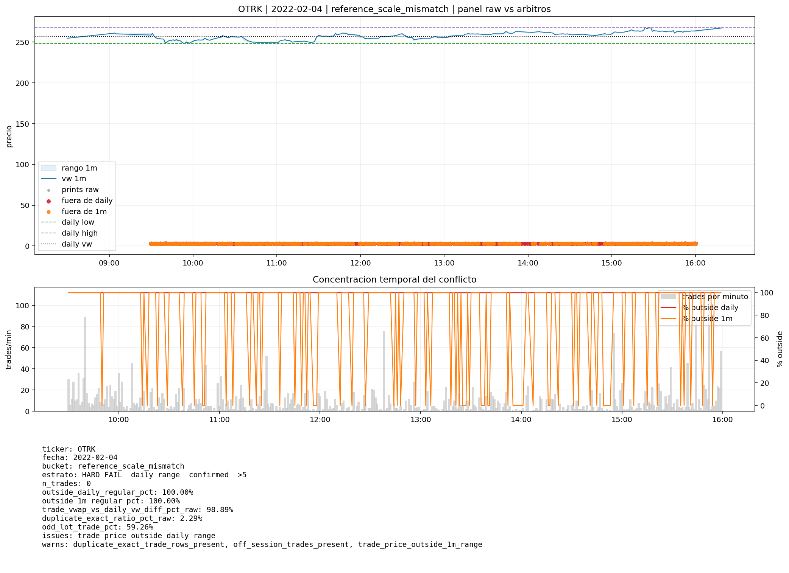

**Que muestra**

- Panel rico del tape raw frente a `daily` y `1m` para `OTRK` el `2022-02-04`.
- `n_trades = 3,368`, `outside_daily_regular_pct = 100.00%`, `outside_1m_regular_pct = 100.00%`.
- `trade_vwap_vs_daily_vw_diff_pct_raw = 98.89%`, `duplicate_exact_ratio_pct_raw = 2.29%`, `odd_lot_trade_pct = 59.26%`.

**Responde**

- Familia donde el conflicto dominante no es que el tape este roto por dentro, sino que el tape y el arbitro viven en escalas distintas. Responde a la pregunta de si el dano principal es de comparabilidad frente a `daily` o `1m`.
- Responde a si el conflicto dominante vive en la escala (`near_100x`), en la comparabilidad frente a `daily` (100.00%) o frente a `1m` (100.00%).
- El 59.26% de odd-lots empuja la lectura hacia microestructura fina; evita leer el caso como pura ruptura economica gruesa.
- La decision que justifica es mantener o no el caso en `recoverable_with_flag` cuando se rematerialice la rehabilitacion sobre `57f`.

### SNCR | 2020-10-20

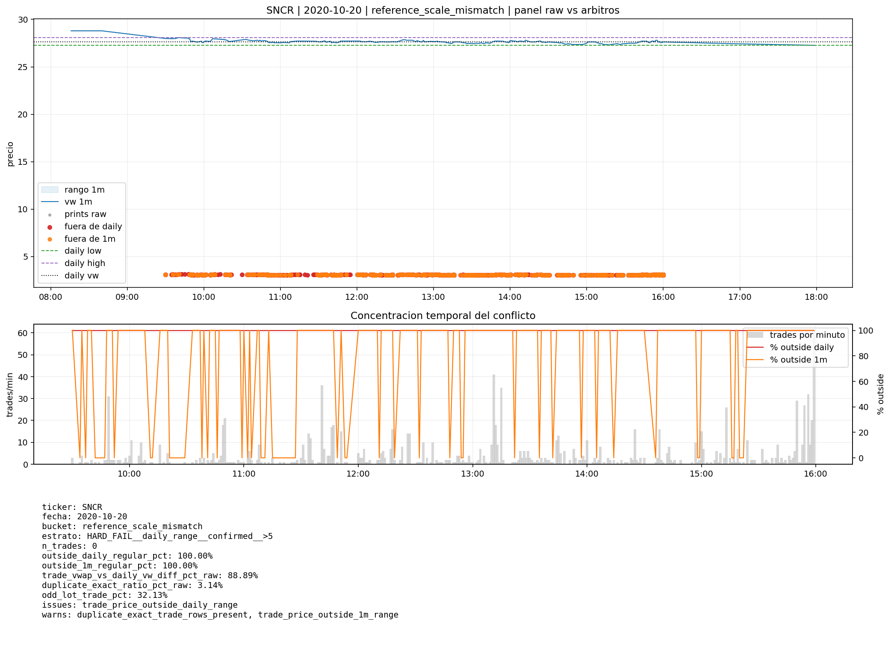

**Que muestra**

- Panel rico del tape raw frente a `daily` y `1m` para `SNCR` el `2020-10-20`.
- `n_trades = 1,242`, `outside_daily_regular_pct = 100.00%`, `outside_1m_regular_pct = 100.00%`.
- `trade_vwap_vs_daily_vw_diff_pct_raw = 88.89%`, `duplicate_exact_ratio_pct_raw = 3.14%`, `odd_lot_trade_pct = 32.13%`.

**Responde**

- Familia donde el conflicto dominante no es que el tape este roto por dentro, sino que el tape y el arbitro viven en escalas distintas. Responde a la pregunta de si el dano principal es de comparabilidad frente a `daily` o `1m`.
- Responde a si el conflicto dominante vive en la escala (`near_10x`), en la comparabilidad frente a `daily` (100.00%) o frente a `1m` (100.00%).
- El 32.13% de odd-lots empuja la lectura hacia microestructura fina; evita leer el caso como pura ruptura economica gruesa.
- La decision que justifica es mantener o no el caso en `recoverable_with_flag` cuando se rematerialice la rehabilitacion sobre `57f`.

### MTVA | 2024-12-06

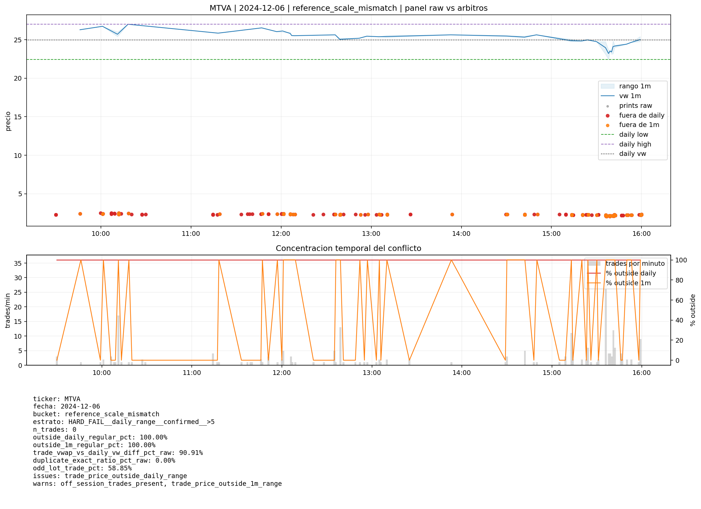

**Que muestra**

- Panel rico del tape raw frente a `daily` y `1m` para `MTVA` el `2024-12-06`.
- `n_trades = 226`, `outside_daily_regular_pct = 100.00%`, `outside_1m_regular_pct = 100.00%`.
- `trade_vwap_vs_daily_vw_diff_pct_raw = 90.91%`, `duplicate_exact_ratio_pct_raw = 0.00%`, `odd_lot_trade_pct = 58.85%`.

**Responde**

- Familia donde el conflicto dominante no es que el tape este roto por dentro, sino que el tape y el arbitro viven en escalas distintas. Responde a la pregunta de si el dano principal es de comparabilidad frente a `daily` o `1m`.
- Responde a si el conflicto dominante vive en la escala (`near_12x`), en la comparabilidad frente a `daily` (100.00%) o frente a `1m` (100.00%).
- El 58.85% de odd-lots empuja la lectura hacia microestructura fina; evita leer el caso como pura ruptura economica gruesa.
- La decision que justifica es mantener o no el caso en `recoverable_with_flag` cuando se rematerialice la rehabilitacion sobre `57f`.

### BKYI | 2019-05-23

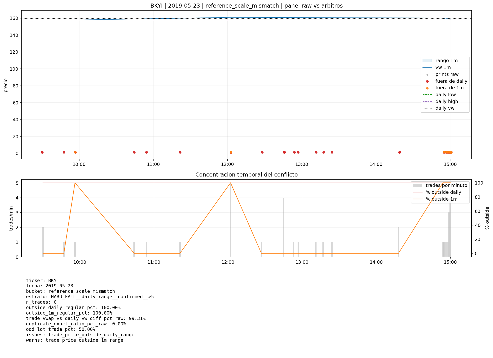

**Que muestra**

- Panel rico del tape raw frente a `daily` y `1m` para `BKYI` el `2019-05-23`.
- `n_trades = 36`, `outside_daily_regular_pct = 100.00%`, `outside_1m_regular_pct = 100.00%`.
- `trade_vwap_vs_daily_vw_diff_pct_raw = 99.31%`, `duplicate_exact_ratio_pct_raw = 0.00%`, `odd_lot_trade_pct = 50.00%`.

**Responde**

- Familia donde el conflicto dominante no es que el tape este roto por dentro, sino que el tape y el arbitro viven en escalas distintas. Responde a la pregunta de si el dano principal es de comparabilidad frente a `daily` o `1m`.
- Responde a si el conflicto dominante vive en la escala (`near_150x`), en la comparabilidad frente a `daily` (100.00%) o frente a `1m` (100.00%).
- El 50.00% de odd-lots empuja la lectura hacia microestructura fina; evita leer el caso como pura ruptura economica gruesa.
- La decision que justifica es mantener o no el caso en `recoverable_with_flag` cuando se rematerialice la rehabilitacion sobre `57f`.

### SOPA | 2023-08-21

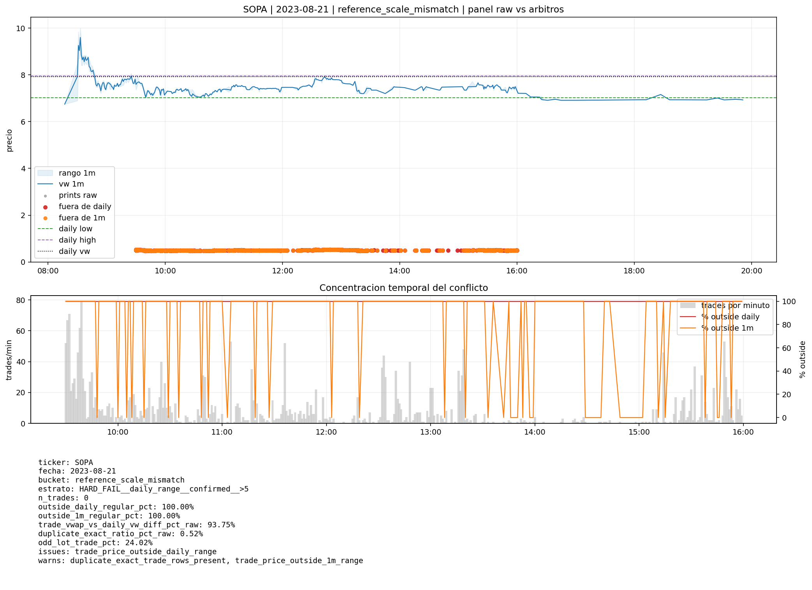

**Que muestra**

- Panel rico del tape raw frente a `daily` y `1m` para `SOPA` el `2023-08-21`.
- `n_trades = 2,698`, `outside_daily_regular_pct = 100.00%`, `outside_1m_regular_pct = 100.00%`.
- `trade_vwap_vs_daily_vw_diff_pct_raw = 93.75%`, `duplicate_exact_ratio_pct_raw = 0.52%`, `odd_lot_trade_pct = 24.02%`.

**Responde**

- Familia donde el conflicto dominante no es que el tape este roto por dentro, sino que el tape y el arbitro viven en escalas distintas. Responde a la pregunta de si el dano principal es de comparabilidad frente a `daily` o `1m`.
- Responde a si el conflicto dominante vive en la escala (`near_15x`), en la comparabilidad frente a `daily` (100.00%) o frente a `1m` (100.00%).
- La decision que justifica es mantener o no el caso en `recoverable_with_flag` cuando se rematerialice la rehabilitacion sobre `57f`.

### AROW | 2023-04-04

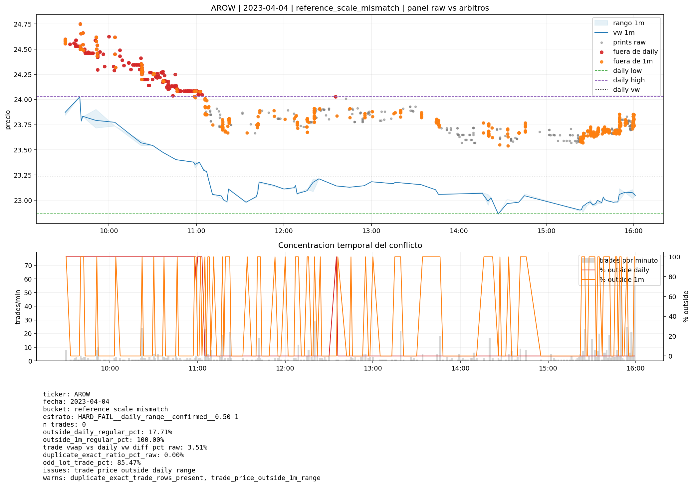

**Que muestra**

- Panel rico del tape raw frente a `daily` y `1m` para `AROW` el `2023-04-04`.
- `n_trades = 1,005`, `outside_daily_regular_pct = 17.71%`, `outside_1m_regular_pct = 100.00%`.
- `trade_vwap_vs_daily_vw_diff_pct_raw = 3.51%`, `duplicate_exact_ratio_pct_raw = 0.00%`, `odd_lot_trade_pct = 85.47%`.

**Responde**

- Familia donde el conflicto dominante no es que el tape este roto por dentro, sino que el tape y el arbitro viven en escalas distintas. Responde a la pregunta de si el dano principal es de comparabilidad frente a `daily` o `1m`.
- Responde a si el conflicto dominante vive en la escala (`near_1x`), en la comparabilidad frente a `daily` (17.71%) o frente a `1m` (100.00%).
- El 85.47% de odd-lots empuja la lectura hacia microestructura fina; evita leer el caso como pura ruptura economica gruesa.
- La decision que justifica es mantener o no el caso en `recoverable_with_flag` cuando se rematerialice la rehabilitacion sobre `57f`.

### ONCS | 2020-02-06

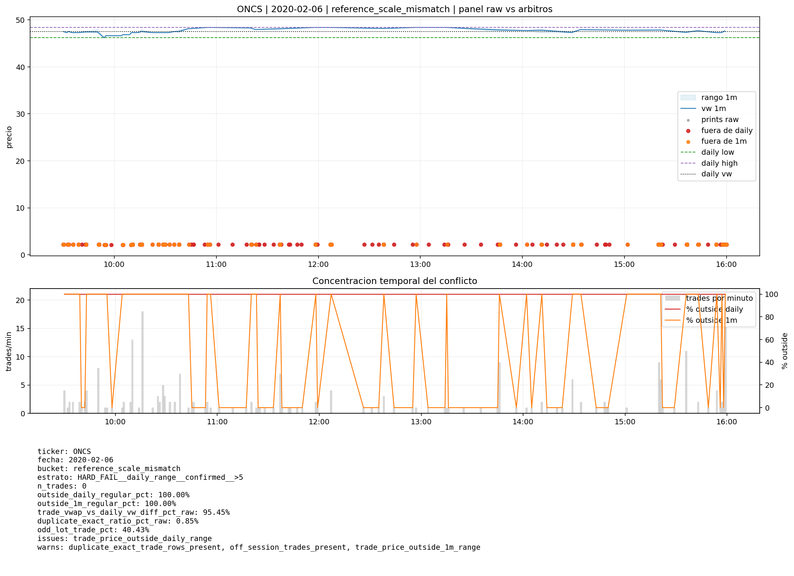

**Que muestra**

- Panel rico del tape raw frente a `daily` y `1m` para `ONCS` el `2020-02-06`.
- `n_trades = 235`, `outside_daily_regular_pct = 100.00%`, `outside_1m_regular_pct = 100.00%`.
- `trade_vwap_vs_daily_vw_diff_pct_raw = 95.45%`, `duplicate_exact_ratio_pct_raw = 0.85%`, `odd_lot_trade_pct = 40.43%`.

**Responde**

- Familia donde el conflicto dominante no es que el tape este roto por dentro, sino que el tape y el arbitro viven en escalas distintas. Responde a la pregunta de si el dano principal es de comparabilidad frente a `daily` o `1m`.
- Responde a si el conflicto dominante vive en la escala (`near_20x`), en la comparabilidad frente a `daily` (100.00%) o frente a `1m` (100.00%).
- El 40.43% de odd-lots empuja la lectura hacia microestructura fina; evita leer el caso como pura ruptura economica gruesa.
- La decision que justifica es mantener o no el caso en `recoverable_with_flag` cuando se rematerialice la rehabilitacion sobre `57f`.

### PIK | 2022-01-11

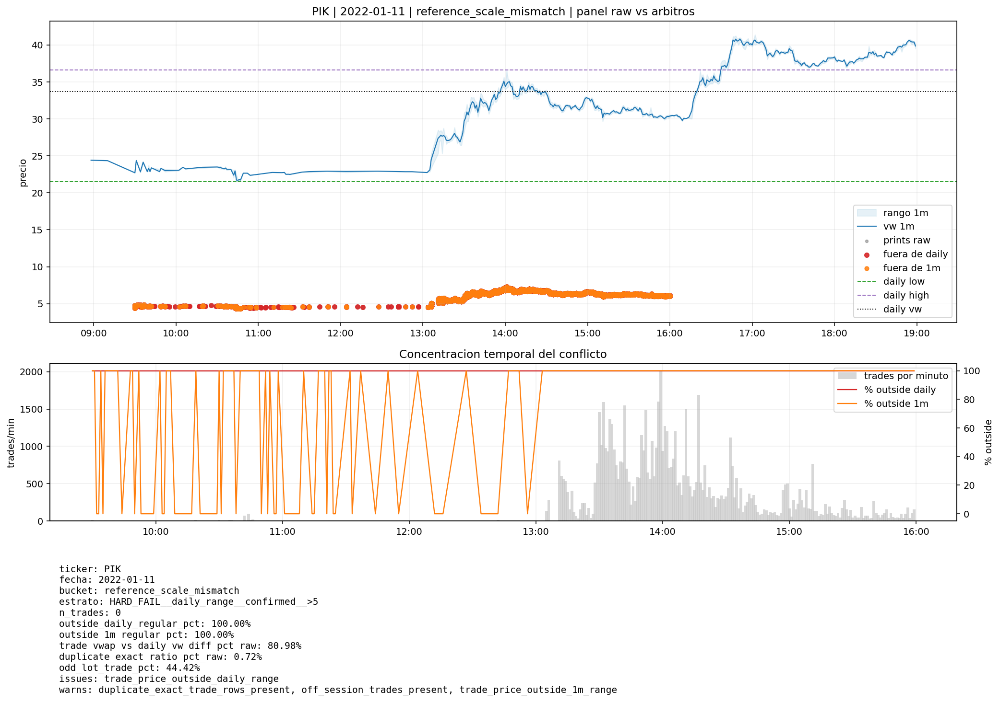

**Que muestra**

- Panel rico del tape raw frente a `daily` y `1m` para `PIK` el `2022-01-11`.
- `n_trades = 70,777`, `outside_daily_regular_pct = 100.00%`, `outside_1m_regular_pct = 100.00%`.
- `trade_vwap_vs_daily_vw_diff_pct_raw = 80.98%`, `duplicate_exact_ratio_pct_raw = 0.72%`, `odd_lot_trade_pct = 44.42%`.

**Responde**

- Familia donde el conflicto dominante no es que el tape este roto por dentro, sino que el tape y el arbitro viven en escalas distintas. Responde a la pregunta de si el dano principal es de comparabilidad frente a `daily` o `1m`.
- Responde a si el conflicto dominante vive en la escala (`near_5x`), en la comparabilidad frente a `daily` (100.00%) o frente a `1m` (100.00%).
- El 44.42% de odd-lots empuja la lectura hacia microestructura fina; evita leer el caso como pura ruptura economica gruesa.
- La decision que justifica es mantener o no el caso en `recoverable_with_flag` cuando se rematerialice la rehabilitacion sobre `57f`.

### TPST | 2023-12-21

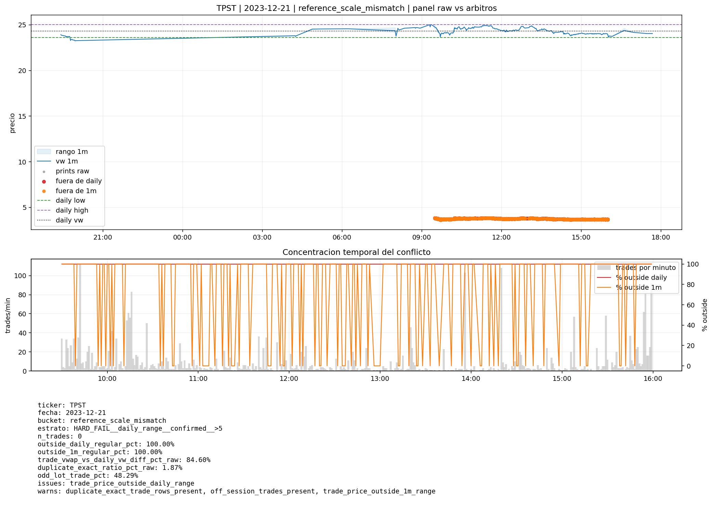

**Que muestra**

- Panel rico del tape raw frente a `daily` y `1m` para `TPST` el `2023-12-21`.
- `n_trades = 3,048`, `outside_daily_regular_pct = 100.00%`, `outside_1m_regular_pct = 100.00%`.
- `trade_vwap_vs_daily_vw_diff_pct_raw = 84.60%`, `duplicate_exact_ratio_pct_raw = 1.87%`, `odd_lot_trade_pct = 48.29%`.

**Responde**

- Familia donde el conflicto dominante no es que el tape este roto por dentro, sino que el tape y el arbitro viven en escalas distintas. Responde a la pregunta de si el dano principal es de comparabilidad frente a `daily` o `1m`.
- Responde a si el conflicto dominante vive en la escala (`near_6x`), en la comparabilidad frente a `daily` (100.00%) o frente a `1m` (100.00%).
- El 48.29% de odd-lots empuja la lectura hacia microestructura fina; evita leer el caso como pura ruptura economica gruesa.
- La decision que justifica es mantener o no el caso en `recoverable_with_flag` cuando se rematerialice la rehabilitacion sobre `57f`.

### BRBS | 2020-01-07

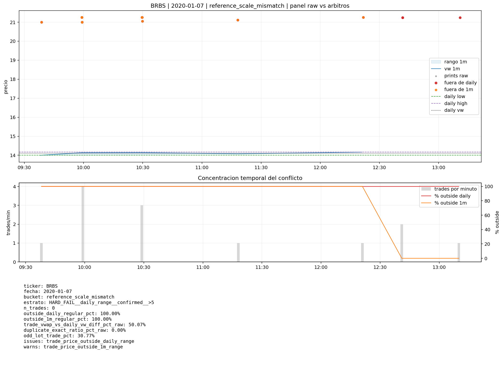

**Que muestra**

- Panel rico del tape raw frente a `daily` y `1m` para `BRBS` el `2020-01-07`.
- `n_trades = 13`, `outside_daily_regular_pct = 100.00%`, `outside_1m_regular_pct = 100.00%`.
- `trade_vwap_vs_daily_vw_diff_pct_raw = 50.07%`, `duplicate_exact_ratio_pct_raw = 0.00%`, `odd_lot_trade_pct = 30.77%`.

**Responde**

- Familia donde el conflicto dominante no es que el tape este roto por dentro, sino que el tape y el arbitro viven en escalas distintas. Responde a la pregunta de si el dano principal es de comparabilidad frente a `daily` o `1m`.
- Responde a si el conflicto dominante vive en la escala (`~0.6667x`), en la comparabilidad frente a `daily` (100.00%) o frente a `1m` (100.00%).
- El 30.77% de odd-lots empuja la lectura hacia microestructura fina; evita leer el caso como pura ruptura economica gruesa.
- La decision que justifica es mantener o no el caso en `recoverable_with_flag` cuando se rematerialice la rehabilitacion sobre `57f`.

### DFDV | 2025-09-17

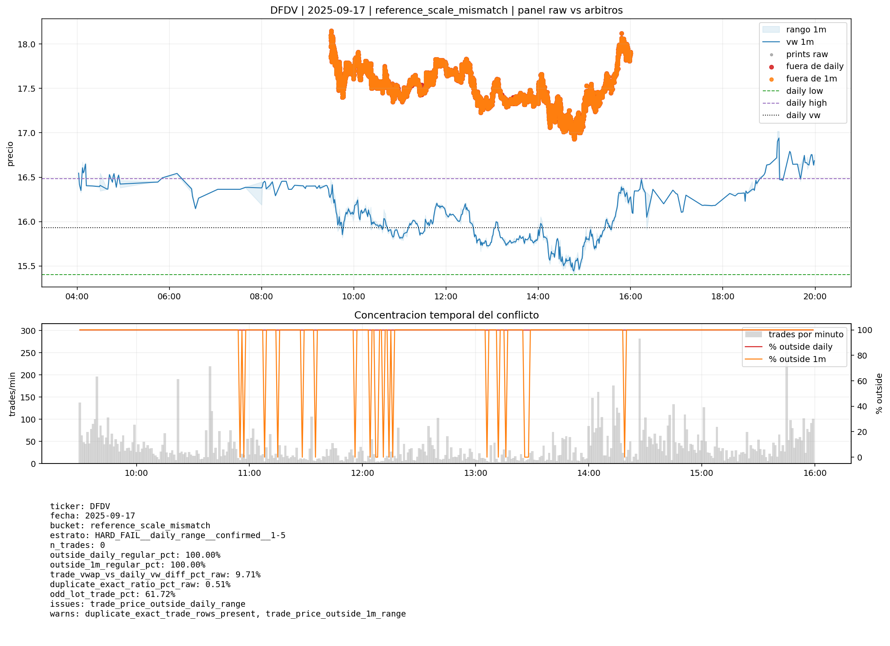

**Que muestra**

- Panel rico del tape raw frente a `daily` y `1m` para `DFDV` el `2025-09-17`.
- `n_trades = 14,414`, `outside_daily_regular_pct = 100.00%`, `outside_1m_regular_pct = 100.00%`.
- `trade_vwap_vs_daily_vw_diff_pct_raw = 9.71%`, `duplicate_exact_ratio_pct_raw = 0.51%`, `odd_lot_trade_pct = 61.72%`.

**Responde**

- Familia donde el conflicto dominante no es que el tape este roto por dentro, sino que el tape y el arbitro viven en escalas distintas. Responde a la pregunta de si el dano principal es de comparabilidad frente a `daily` o `1m`.
- Responde a si el conflicto dominante vive en la escala (`~0.9091x`), en la comparabilidad frente a `daily` (100.00%) o frente a `1m` (100.00%).
- El 61.72% de odd-lots empuja la lectura hacia microestructura fina; evita leer el caso como pura ruptura economica gruesa.
- La decision que justifica es mantener o no el caso en `recoverable_with_flag` cuando se rematerialice la rehabilitacion sobre `57f`.

### IFBD | 2024-08-02

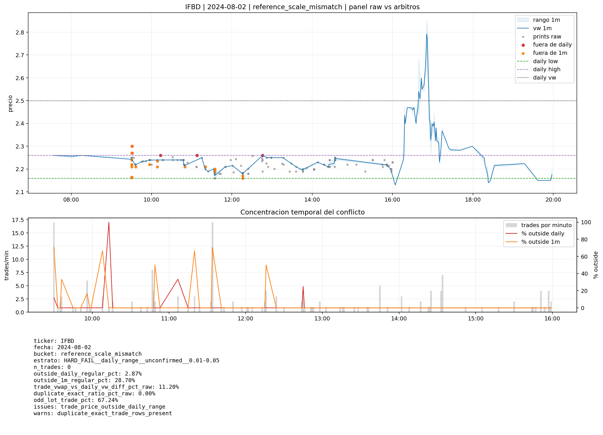

**Que muestra**

- Panel rico del tape raw frente a `daily` y `1m` para `IFBD` el `2024-08-02`.
- `n_trades = 174`, `outside_daily_regular_pct = 2.87%`, `outside_1m_regular_pct = 28.70%`.
- `trade_vwap_vs_daily_vw_diff_pct_raw = 11.20%`, `duplicate_exact_ratio_pct_raw = 0.00%`, `odd_lot_trade_pct = 67.24%`.

**Responde**

- Familia donde el conflicto dominante no es que el tape este roto por dentro, sino que el tape y el arbitro viven en escalas distintas. Responde a la pregunta de si el dano principal es de comparabilidad frente a `daily` o `1m`.
- Responde a si el conflicto dominante vive en la escala (`~1.1111x`), en la comparabilidad frente a `daily` (2.87%) o frente a `1m` (28.70%).
- El 67.24% de odd-lots empuja la lectura hacia microestructura fina; evita leer el caso como pura ruptura economica gruesa.
- La decision que justifica es mantener o no el caso en `recoverable_with_flag` cuando se rematerialice la rehabilitacion sobre `57f`.

### EFSH | 2022-08-12

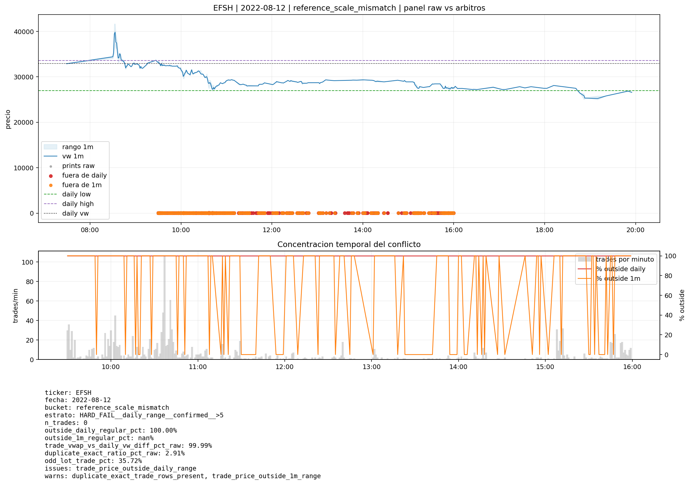

**Que muestra**

- Panel rico del tape raw frente a `daily` y `1m` para `EFSH` el `2022-08-12`.
- `n_trades = 1,579`, `outside_daily_regular_pct = 100.00%`, `outside_1m_regular_pct = nan%`.
- `trade_vwap_vs_daily_vw_diff_pct_raw = 99.99%`, `duplicate_exact_ratio_pct_raw = 2.91%`, `odd_lot_trade_pct = 35.72%`.

**Responde**

- Familia donde el conflicto dominante no es que el tape este roto por dentro, sino que el tape y el arbitro viven en escalas distintas. Responde a la pregunta de si el dano principal es de comparabilidad frente a `daily` o `1m`.
- Responde a si el conflicto dominante vive en la escala (`~10000x`), en la comparabilidad frente a `daily` (100.00%) o frente a `1m` (nan%).
- El 35.72% de odd-lots empuja la lectura hacia microestructura fina; evita leer el caso como pura ruptura economica gruesa.
- La decision que justifica es mantener o no el caso en `recoverable_with_flag` cuando se rematerialice la rehabilitacion sobre `57f`.

### INPX | 2023-12-08

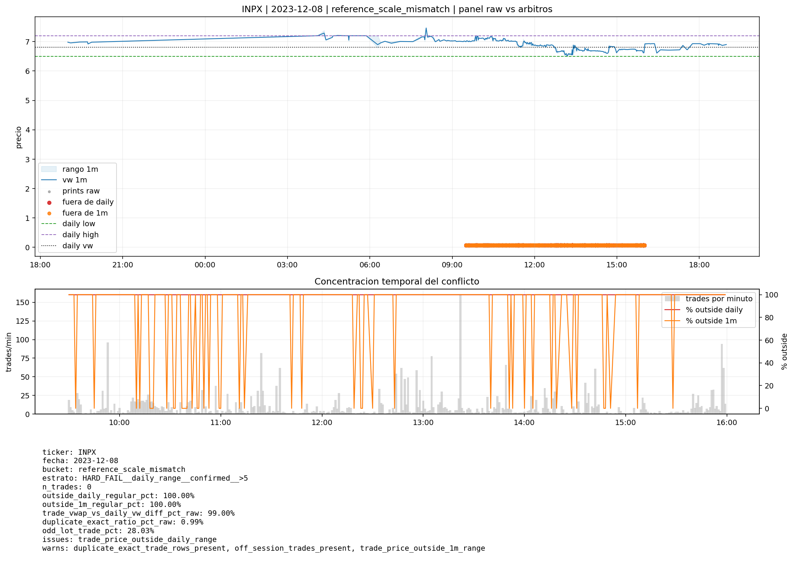

**Que muestra**

- Panel rico del tape raw frente a `daily` y `1m` para `INPX` el `2023-12-08`.
- `n_trades = 3,532`, `outside_daily_regular_pct = 100.00%`, `outside_1m_regular_pct = 100.00%`.
- `trade_vwap_vs_daily_vw_diff_pct_raw = 99.00%`, `duplicate_exact_ratio_pct_raw = 0.99%`, `odd_lot_trade_pct = 28.03%`.

**Responde**

- Familia donde el conflicto dominante no es que el tape este roto por dentro, sino que el tape y el arbitro viven en escalas distintas. Responde a la pregunta de si el dano principal es de comparabilidad frente a `daily` o `1m`.
- Responde a si el conflicto dominante vive en la escala (`~100x`), en la comparabilidad frente a `daily` (100.00%) o frente a `1m` (100.00%).
- El 28.03% de odd-lots empuja la lectura hacia microestructura fina; evita leer el caso como pura ruptura economica gruesa.
- La decision que justifica es mantener o no el caso en `recoverable_with_flag` cuando se rematerialice la rehabilitacion sobre `57f`.

### ADVM | 2019-10-09

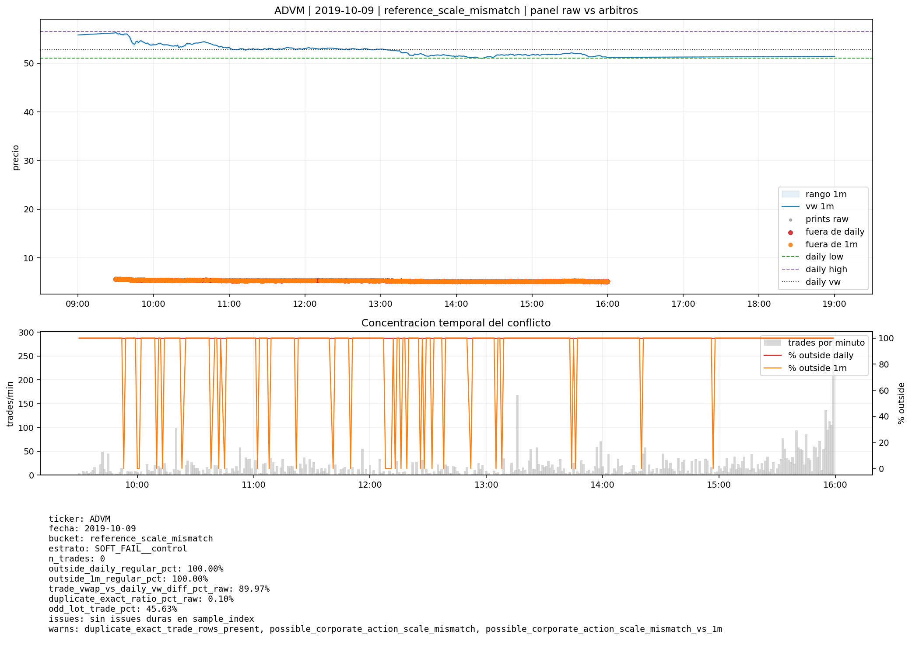

**Que muestra**

- Panel rico del tape raw frente a `daily` y `1m` para `ADVM` el `2019-10-09`.
- `n_trades = 6,763`, `outside_daily_regular_pct = 100.00%`, `outside_1m_regular_pct = 100.00%`.
- `trade_vwap_vs_daily_vw_diff_pct_raw = 89.97%`, `duplicate_exact_ratio_pct_raw = 0.10%`, `odd_lot_trade_pct = 45.63%`.

**Responde**

- Familia donde el conflicto dominante no es que el tape este roto por dentro, sino que el tape y el arbitro viven en escalas distintas. Responde a la pregunta de si el dano principal es de comparabilidad frente a `daily` o `1m`.
- Responde a si el conflicto dominante vive en la escala (`~10x`), en la comparabilidad frente a `daily` (100.00%) o frente a `1m` (100.00%).
- El 45.63% de odd-lots empuja la lectura hacia microestructura fina; evita leer el caso como pura ruptura economica gruesa.
- La decision que justifica es mantener o no el caso en `recoverable_with_flag` cuando se rematerialice la rehabilitacion sobre `57f`.

### ADVM | 2021-06-04

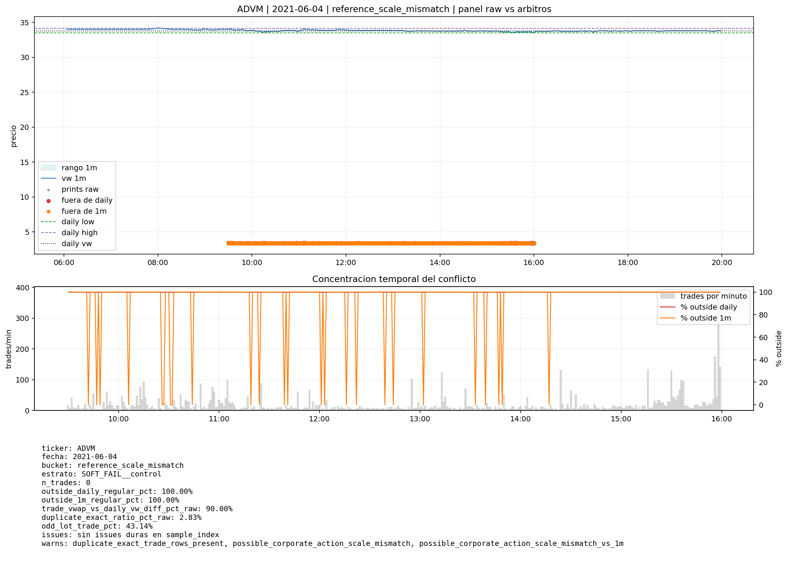

**Que muestra**

- Panel rico del tape raw frente a `daily` y `1m` para `ADVM` el `2021-06-04`.
- `n_trades = 7,109`, `outside_daily_regular_pct = 100.00%`, `outside_1m_regular_pct = 100.00%`.
- `trade_vwap_vs_daily_vw_diff_pct_raw = 90.00%`, `duplicate_exact_ratio_pct_raw = 2.83%`, `odd_lot_trade_pct = 43.14%`.

**Responde**

- Familia donde el conflicto dominante no es que el tape este roto por dentro, sino que el tape y el arbitro viven en escalas distintas. Responde a la pregunta de si el dano principal es de comparabilidad frente a `daily` o `1m`.
- Responde a si el conflicto dominante vive en la escala (`~10x`), en la comparabilidad frente a `daily` (100.00%) o frente a `1m` (100.00%).
- El 43.14% de odd-lots empuja la lectura hacia microestructura fina; evita leer el caso como pura ruptura economica gruesa.
- La decision que justifica es mantener o no el caso en `recoverable_with_flag` cuando se rematerialice la rehabilitacion sobre `57f`.

### ANGI | 2021-06-24

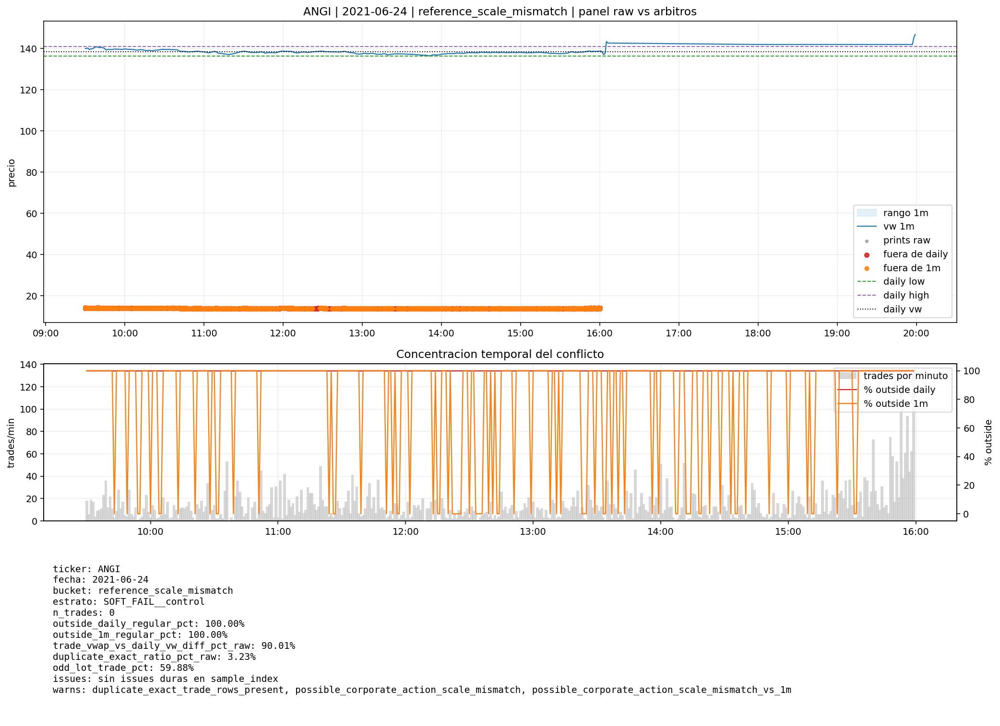

**Que muestra**

- Panel rico del tape raw frente a `daily` y `1m` para `ANGI` el `2021-06-24`.
- `n_trades = 5,516`, `outside_daily_regular_pct = 100.00%`, `outside_1m_regular_pct = 100.00%`.
- `trade_vwap_vs_daily_vw_diff_pct_raw = 90.01%`, `duplicate_exact_ratio_pct_raw = 3.23%`, `odd_lot_trade_pct = 59.88%`.

**Responde**

- Familia donde el conflicto dominante no es que el tape este roto por dentro, sino que el tape y el arbitro viven en escalas distintas. Responde a la pregunta de si el dano principal es de comparabilidad frente a `daily` o `1m`.
- Responde a si el conflicto dominante vive en la escala (`~10x`), en la comparabilidad frente a `daily` (100.00%) o frente a `1m` (100.00%).
- El 59.88% de odd-lots empuja la lectura hacia microestructura fina; evita leer el caso como pura ruptura economica gruesa.
- La decision que justifica es mantener o no el caso en `recoverable_with_flag` cuando se rematerialice la rehabilitacion sobre `57f`.

### APRN | 2020-10-30

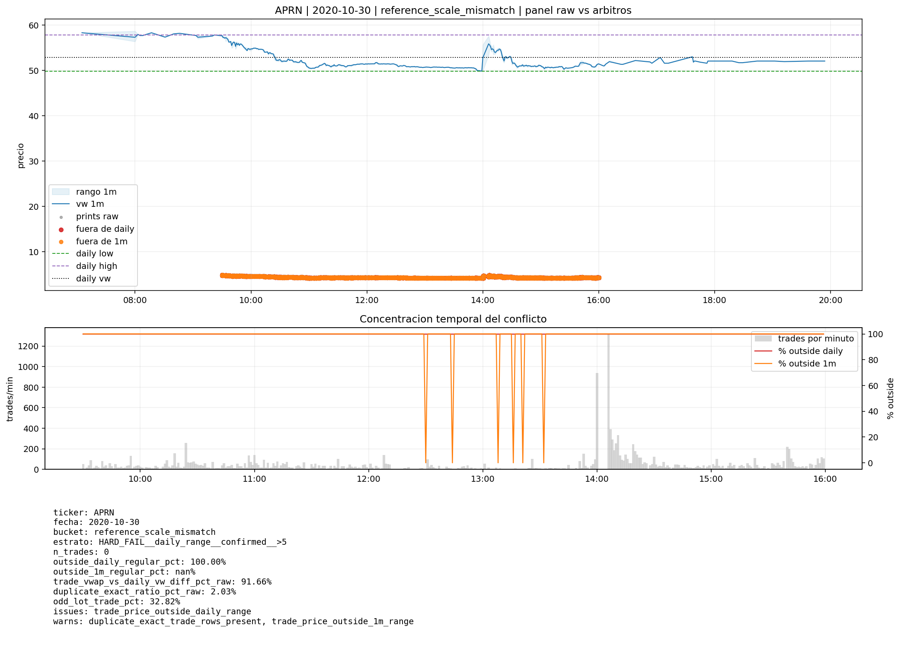

**Que muestra**

- Panel rico del tape raw frente a `daily` y `1m` para `APRN` el `2020-10-30`.
- `n_trades = 16,337`, `outside_daily_regular_pct = 100.00%`, `outside_1m_regular_pct = nan%`.
- `trade_vwap_vs_daily_vw_diff_pct_raw = 91.66%`, `duplicate_exact_ratio_pct_raw = 2.03%`, `odd_lot_trade_pct = 32.82%`.

**Responde**

- Familia donde el conflicto dominante no es que el tape este roto por dentro, sino que el tape y el arbitro viven en escalas distintas. Responde a la pregunta de si el dano principal es de comparabilidad frente a `daily` o `1m`.
- Responde a si el conflicto dominante vive en la escala (`~12x`), en la comparabilidad frente a `daily` (100.00%) o frente a `1m` (nan%).
- El 32.82% de odd-lots empuja la lectura hacia microestructura fina; evita leer el caso como pura ruptura economica gruesa.
- La decision que justifica es mantener o no el caso en `recoverable_with_flag` cuando se rematerialice la rehabilitacion sobre `57f`.

### OPAD | 2022-01-12

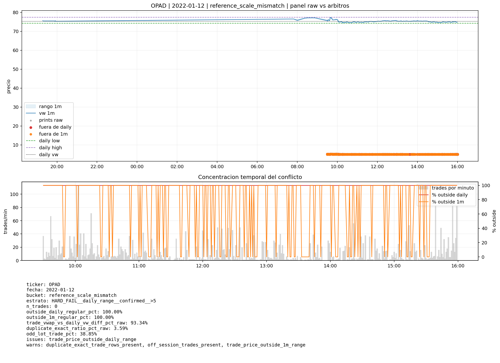

**Que muestra**

- Panel rico del tape raw frente a `daily` y `1m` para `OPAD` el `2022-01-12`.
- `n_trades = 4,229`, `outside_daily_regular_pct = 100.00%`, `outside_1m_regular_pct = 100.00%`.
- `trade_vwap_vs_daily_vw_diff_pct_raw = 93.34%`, `duplicate_exact_ratio_pct_raw = 3.59%`, `odd_lot_trade_pct = 38.85%`.

**Responde**

- Familia donde el conflicto dominante no es que el tape este roto por dentro, sino que el tape y el arbitro viven en escalas distintas. Responde a la pregunta de si el dano principal es de comparabilidad frente a `daily` o `1m`.
- Responde a si el conflicto dominante vive en la escala (`~15x`), en la comparabilidad frente a `daily` (100.00%) o frente a `1m` (100.00%).
- El 38.85% de odd-lots empuja la lectura hacia microestructura fina; evita leer el caso como pura ruptura economica gruesa.
- La decision que justifica es mantener o no el caso en `recoverable_with_flag` cuando se rematerialice la rehabilitacion sobre `57f`.

### BBGI | 2024-12-06

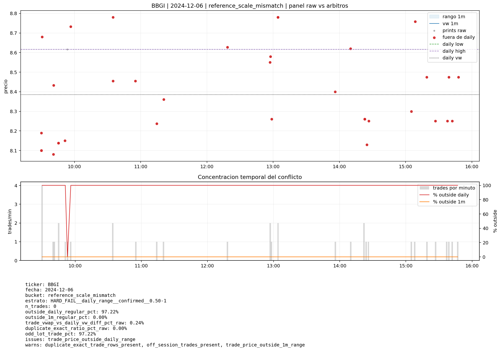

**Que muestra**

- Panel rico del tape raw frente a `daily` y `1m` para `BBGI` el `2024-12-06`.
- `n_trades = 36`, `outside_daily_regular_pct = 97.22%`, `outside_1m_regular_pct = 0.00%`.
- `trade_vwap_vs_daily_vw_diff_pct_raw = 0.24%`, `duplicate_exact_ratio_pct_raw = 0.00%`, `odd_lot_trade_pct = 97.22%`.

**Responde**

- Familia donde el conflicto dominante no es que el tape este roto por dentro, sino que el tape y el arbitro viven en escalas distintas. Responde a la pregunta de si el dano principal es de comparabilidad frente a `daily` o `1m`.
- Responde a si el conflicto dominante vive en la escala (`~1x`), en la comparabilidad frente a `daily` (97.22%) o frente a `1m` (0.00%).
- El 97.22% de odd-lots empuja la lectura hacia microestructura fina; evita leer el caso como pura ruptura economica gruesa.
- La decision que justifica es mantener o no el caso en `recoverable_with_flag` cuando se rematerialice la rehabilitacion sobre `57f`.

### GEGGL | 2024-02-20

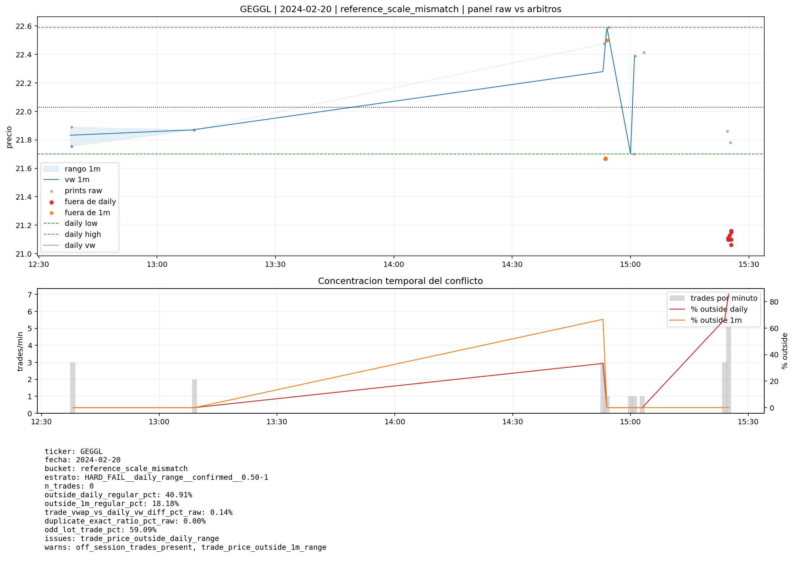

**Que muestra**

- Panel rico del tape raw frente a `daily` y `1m` para `GEGGL` el `2024-02-20`.
- `n_trades = 22`, `outside_daily_regular_pct = 40.91%`, `outside_1m_regular_pct = 18.18%`.
- `trade_vwap_vs_daily_vw_diff_pct_raw = 0.14%`, `duplicate_exact_ratio_pct_raw = 0.00%`, `odd_lot_trade_pct = 59.09%`.

**Responde**

- Familia donde el conflicto dominante no es que el tape este roto por dentro, sino que el tape y el arbitro viven en escalas distintas. Responde a la pregunta de si el dano principal es de comparabilidad frente a `daily` o `1m`.
- Responde a si el conflicto dominante vive en la escala (`~1x`), en la comparabilidad frente a `daily` (40.91%) o frente a `1m` (18.18%).
- El 59.09% de odd-lots empuja la lectura hacia microestructura fina; evita leer el caso como pura ruptura economica gruesa.
- La decision que justifica es mantener o no el caso en `recoverable_with_flag` cuando se rematerialice la rehabilitacion sobre `57f`.

### LUMO | 2022-04-01

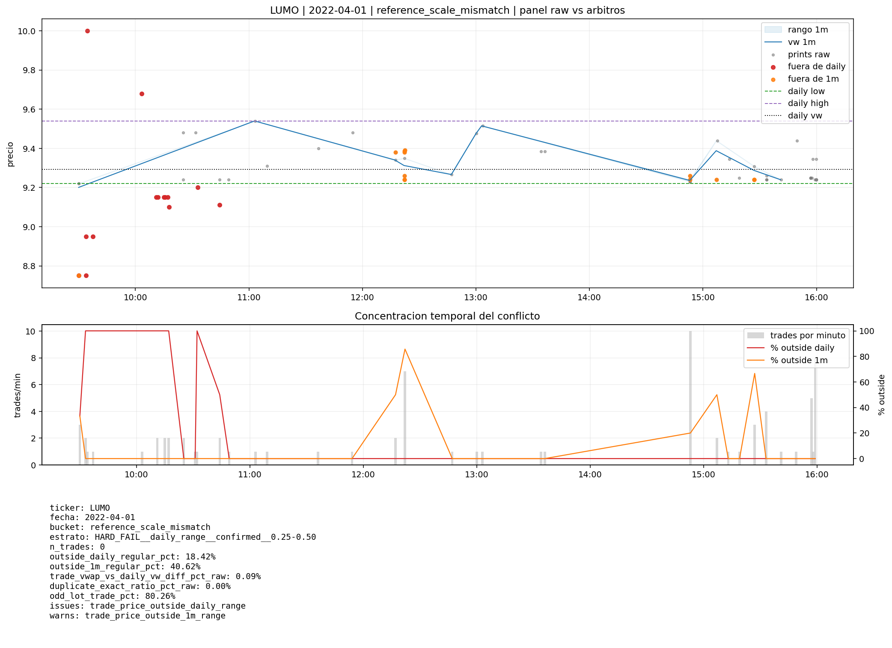

**Que muestra**

- Panel rico del tape raw frente a `daily` y `1m` para `LUMO` el `2022-04-01`.
- `n_trades = 76`, `outside_daily_regular_pct = 18.42%`, `outside_1m_regular_pct = 40.62%`.
- `trade_vwap_vs_daily_vw_diff_pct_raw = 0.09%`, `duplicate_exact_ratio_pct_raw = 0.00%`, `odd_lot_trade_pct = 80.26%`.

**Responde**

- Familia donde el conflicto dominante no es que el tape este roto por dentro, sino que el tape y el arbitro viven en escalas distintas. Responde a la pregunta de si el dano principal es de comparabilidad frente a `daily` o `1m`.
- Responde a si el conflicto dominante vive en la escala (`~1x`), en la comparabilidad frente a `daily` (18.42%) o frente a `1m` (40.62%).
- El 80.26% de odd-lots empuja la lectura hacia microestructura fina; evita leer el caso como pura ruptura economica gruesa.
- La decision que justifica es mantener o no el caso en `recoverable_with_flag` cuando se rematerialice la rehabilitacion sobre `57f`.

### BBGI | 2023-07-18

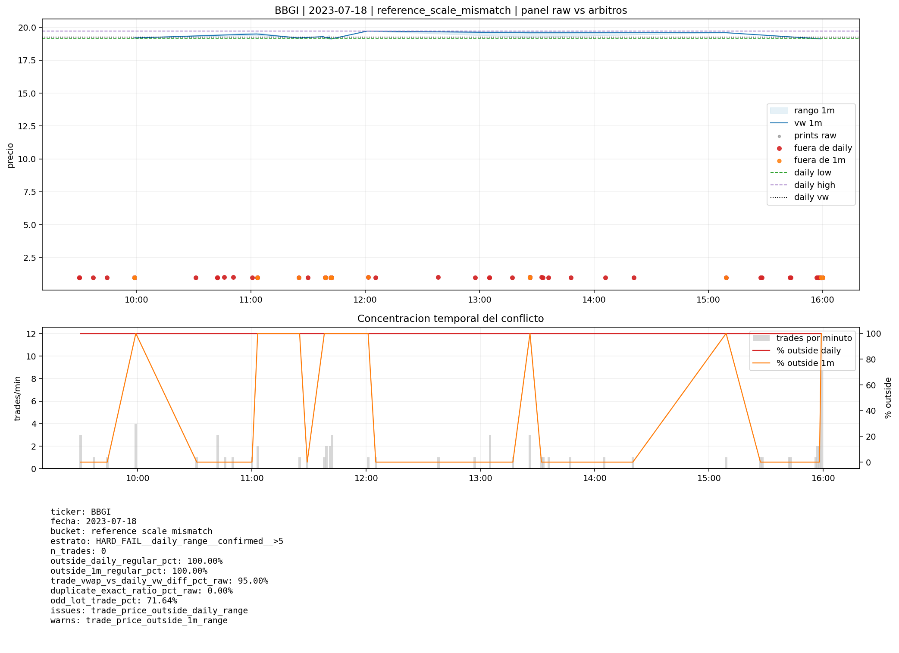

**Que muestra**

- Panel rico del tape raw frente a `daily` y `1m` para `BBGI` el `2023-07-18`.
- `n_trades = 67`, `outside_daily_regular_pct = 100.00%`, `outside_1m_regular_pct = 100.00%`.
- `trade_vwap_vs_daily_vw_diff_pct_raw = 95.00%`, `duplicate_exact_ratio_pct_raw = 0.00%`, `odd_lot_trade_pct = 71.64%`.

**Responde**

- Familia donde el conflicto dominante no es que el tape este roto por dentro, sino que el tape y el arbitro viven en escalas distintas. Responde a la pregunta de si el dano principal es de comparabilidad frente a `daily` o `1m`.
- Responde a si el conflicto dominante vive en la escala (`~20x`), en la comparabilidad frente a `daily` (100.00%) o frente a `1m` (100.00%).
- El 71.64% de odd-lots empuja la lectura hacia microestructura fina; evita leer el caso como pura ruptura economica gruesa.
- La decision que justifica es mantener o no el caso en `recoverable_with_flag` cuando se rematerialice la rehabilitacion sobre `57f`.

### BPTH | 2020-10-19

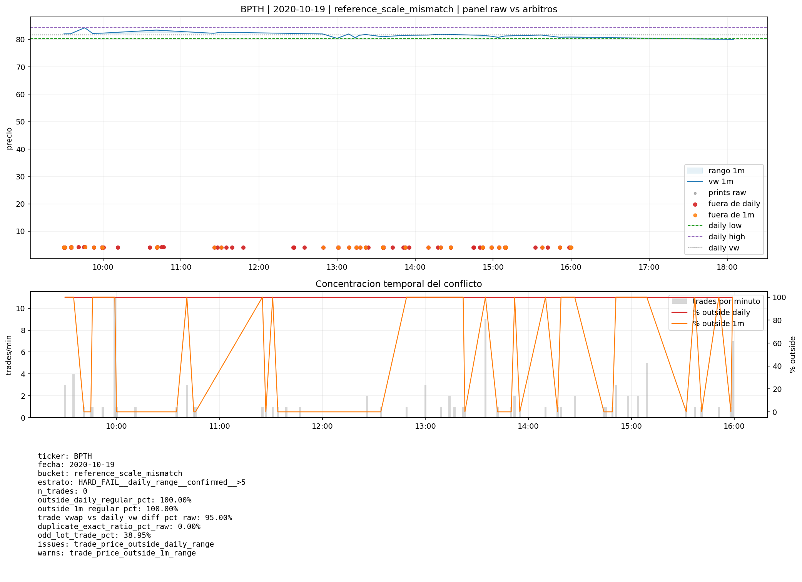

**Que muestra**

- Panel rico del tape raw frente a `daily` y `1m` para `BPTH` el `2020-10-19`.
- `n_trades = 95`, `outside_daily_regular_pct = 100.00%`, `outside_1m_regular_pct = 100.00%`.
- `trade_vwap_vs_daily_vw_diff_pct_raw = 95.00%`, `duplicate_exact_ratio_pct_raw = 0.00%`, `odd_lot_trade_pct = 38.95%`.

**Responde**

- Familia donde el conflicto dominante no es que el tape este roto por dentro, sino que el tape y el arbitro viven en escalas distintas. Responde a la pregunta de si el dano principal es de comparabilidad frente a `daily` o `1m`.
- Responde a si el conflicto dominante vive en la escala (`~20x`), en la comparabilidad frente a `daily` (100.00%) o frente a `1m` (100.00%).
- El 38.95% de odd-lots empuja la lectura hacia microestructura fina; evita leer el caso como pura ruptura economica gruesa.
- La decision que justifica es mantener o no el caso en `recoverable_with_flag` cuando se rematerialice la rehabilitacion sobre `57f`.

### QLI | 2021-12-02

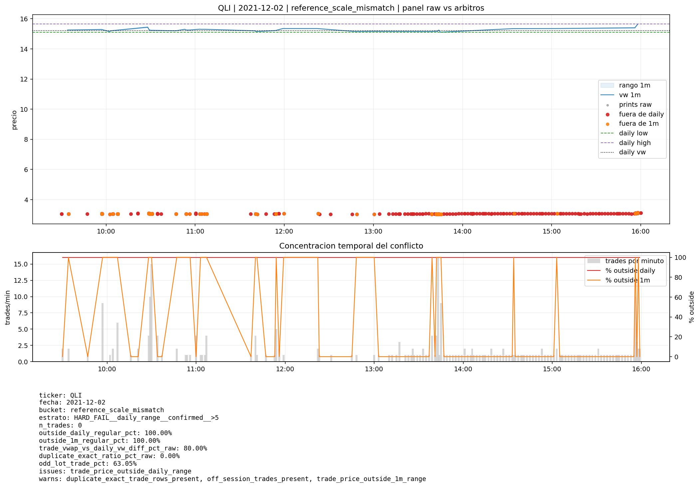

**Que muestra**

- Panel rico del tape raw frente a `daily` y `1m` para `QLI` el `2021-12-02`.
- `n_trades = 249`, `outside_daily_regular_pct = 100.00%`, `outside_1m_regular_pct = 100.00%`.
- `trade_vwap_vs_daily_vw_diff_pct_raw = 80.00%`, `duplicate_exact_ratio_pct_raw = 0.00%`, `odd_lot_trade_pct = 63.05%`.

**Responde**

- Familia donde el conflicto dominante no es que el tape este roto por dentro, sino que el tape y el arbitro viven en escalas distintas. Responde a la pregunta de si el dano principal es de comparabilidad frente a `daily` o `1m`.
- Responde a si el conflicto dominante vive en la escala (`~5x`), en la comparabilidad frente a `daily` (100.00%) o frente a `1m` (100.00%).
- El 63.05% de odd-lots empuja la lectura hacia microestructura fina; evita leer el caso como pura ruptura economica gruesa.
- La decision que justifica es mantener o no el caso en `recoverable_with_flag` cuando se rematerialice la rehabilitacion sobre `57f`.

### LMFA | 2022-08-12

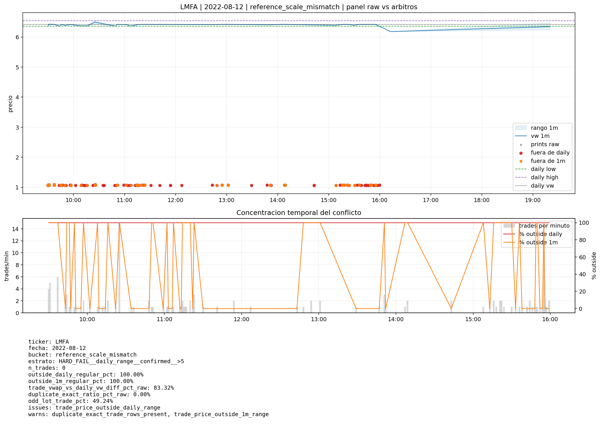

**Que muestra**

- Panel rico del tape raw frente a `daily` y `1m` para `LMFA` el `2022-08-12`.
- `n_trades = 132`, `outside_daily_regular_pct = 100.00%`, `outside_1m_regular_pct = 100.00%`.
- `trade_vwap_vs_daily_vw_diff_pct_raw = 83.32%`, `duplicate_exact_ratio_pct_raw = 0.00%`, `odd_lot_trade_pct = 49.24%`.

**Responde**

- Familia donde el conflicto dominante no es que el tape este roto por dentro, sino que el tape y el arbitro viven en escalas distintas. Responde a la pregunta de si el dano principal es de comparabilidad frente a `daily` o `1m`.
- Responde a si el conflicto dominante vive en la escala (`~6x`), en la comparabilidad frente a `daily` (100.00%) o frente a `1m` (100.00%).
- El 49.24% de odd-lots empuja la lectura hacia microestructura fina; evita leer el caso como pura ruptura economica gruesa.
- La decision que justifica es mantener o no el caso en `recoverable_with_flag` cuando se rematerialice la rehabilitacion sobre `57f`.

