# Trades Review Generico | muestra estratificada

## Rol

Este dossier documenta `60` casos de la muestra base del cierre real `57f/full_clean_fast_same_schema` para la familia `review`.

No son ejemplos elegidos a dedo. Proceden del manifest estratificado reproducible materializado para el inspector.

## Que significa esta familia

Residuo de revision no absorbido por una subfamilia mas especifica. Responde a la pregunta de si todavia hace falta una regla de rehabilitacion antes de consumir esta masa.

## Responde

- si el residuo generico sigue necesitando regla de rehabilitacion
- si la masa abierta es comparable o economicamente util con flag

## No responde

- si todo `review` es homogeneamente recuperable
- si el bucket esta vacio de estructura interna

## Consecuencia

- anclar decisiones en regla explicita y no en intuicion
- cuantificar masa util real antes de cualquier promocion

## Casos

### APAC | 2008-10-10

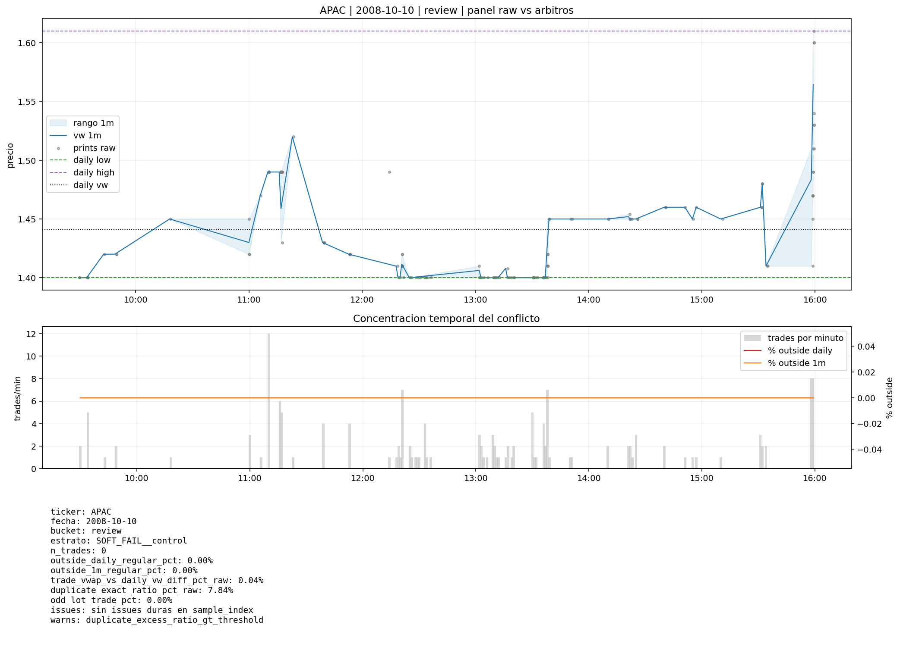

**Que muestra**

- Panel rico del tape raw frente a `daily` y `1m` para `APAC` el `2008-10-10`.
- `n_trades = 153`, `outside_daily_regular_pct = 0.00%`, `outside_1m_regular_pct = 0.00%`.
- `trade_vwap_vs_daily_vw_diff_pct_raw = 0.04%`, `duplicate_exact_ratio_pct_raw = 7.84%`, `odd_lot_trade_pct = 0.00%`.

**Responde**

- Residuo de revision no absorbido por una subfamilia mas especifica. Responde a la pregunta de si todavia hace falta una regla de rehabilitacion antes de consumir esta masa.
- Responde a si el conflicto dominante vive en la escala (`~1x`), en la comparabilidad frente a `daily` (0.00%) o frente a `1m` (0.00%).
- El 7.84% de duplicacion exacta obliga a sospechar dano de tape o bursts mecanicos, no solo ruido visual.
- La decision que justifica es mantener o no el caso en `recoverable_with_flag` cuando se rematerialice la rehabilitacion sobre `57f`.

### APOG | 2010-09-21

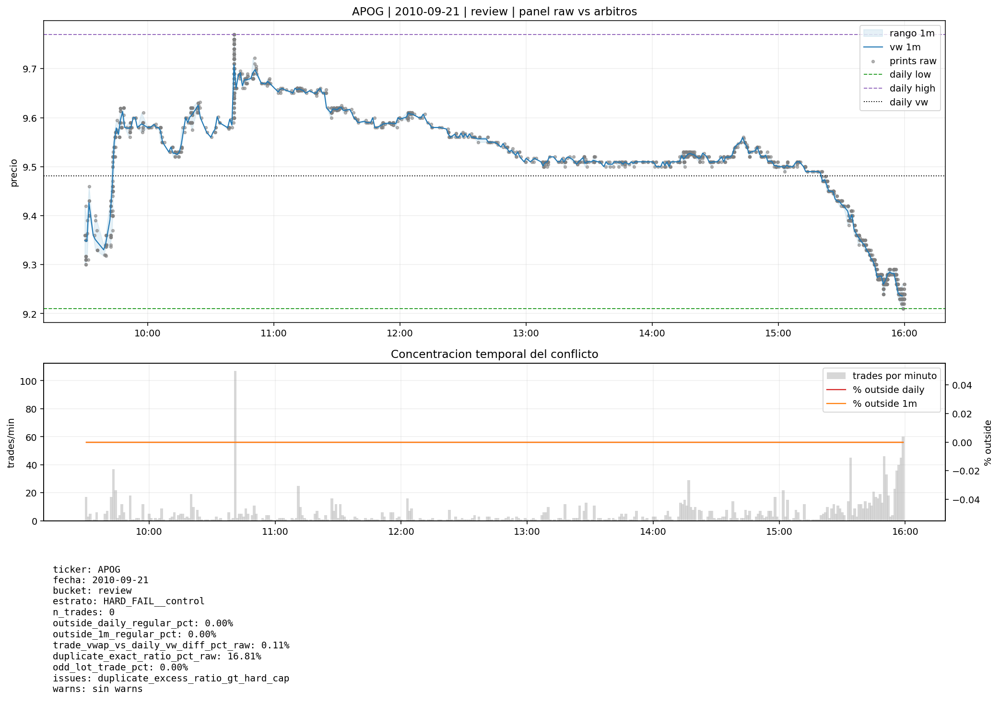

**Que muestra**

- Panel rico del tape raw frente a `daily` y `1m` para `APOG` el `2010-09-21`.
- `n_trades = 1,898`, `outside_daily_regular_pct = 0.00%`, `outside_1m_regular_pct = 0.00%`.
- `trade_vwap_vs_daily_vw_diff_pct_raw = 0.11%`, `duplicate_exact_ratio_pct_raw = 16.81%`, `odd_lot_trade_pct = 0.00%`.

**Responde**

- Residuo de revision no absorbido por una subfamilia mas especifica. Responde a la pregunta de si todavia hace falta una regla de rehabilitacion antes de consumir esta masa.
- Responde a si el conflicto dominante vive en la escala (`~1x`), en la comparabilidad frente a `daily` (0.00%) o frente a `1m` (0.00%).
- El 16.81% de duplicacion exacta obliga a sospechar dano de tape o bursts mecanicos, no solo ruido visual.
- La decision que justifica es mantener o no el caso en `recoverable_with_flag` cuando se rematerialice la rehabilitacion sobre `57f`.

### CATO | 2010-08-12

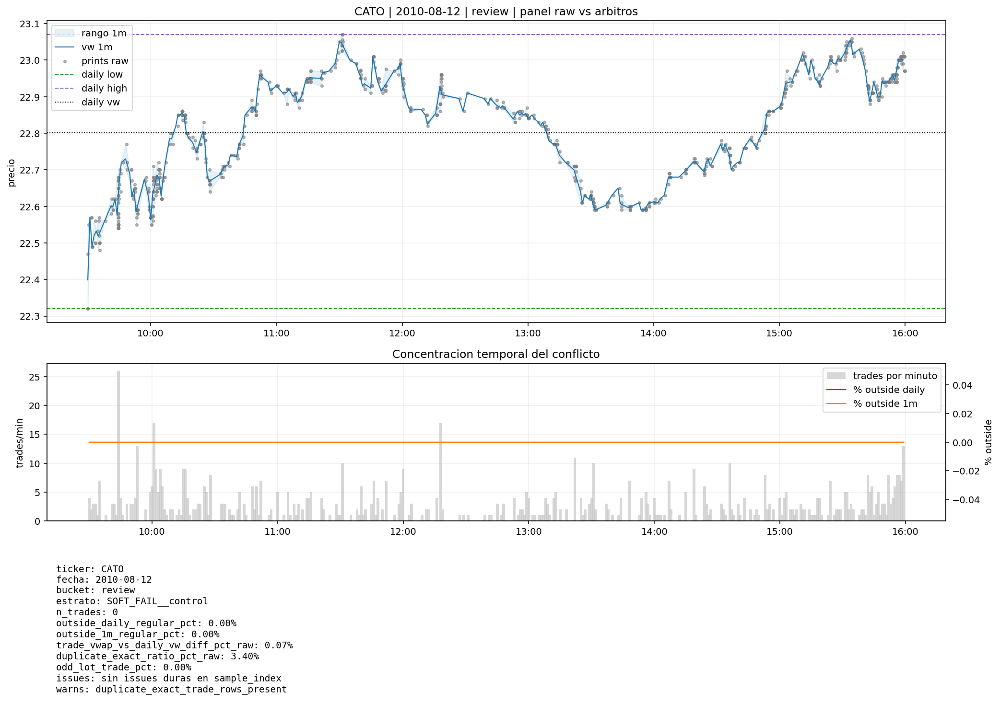

**Que muestra**

- Panel rico del tape raw frente a `daily` y `1m` para `CATO` el `2010-08-12`.
- `n_trades = 793`, `outside_daily_regular_pct = 0.00%`, `outside_1m_regular_pct = 0.00%`.
- `trade_vwap_vs_daily_vw_diff_pct_raw = 0.07%`, `duplicate_exact_ratio_pct_raw = 3.40%`, `odd_lot_trade_pct = 0.00%`.

**Responde**

- Residuo de revision no absorbido por una subfamilia mas especifica. Responde a la pregunta de si todavia hace falta una regla de rehabilitacion antes de consumir esta masa.
- Responde a si el conflicto dominante vive en la escala (`~1x`), en la comparabilidad frente a `daily` (0.00%) o frente a `1m` (0.00%).
- La decision que justifica es mantener o no el caso en `recoverable_with_flag` cuando se rematerialice la rehabilitacion sobre `57f`.

### CAW | 2010-03-15

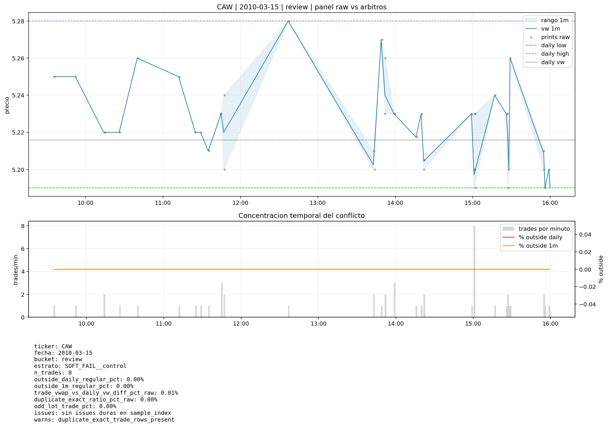

**Que muestra**

- Panel rico del tape raw frente a `daily` y `1m` para `CAW` el `2010-03-15`.
- `n_trades = 47`, `outside_daily_regular_pct = 0.00%`, `outside_1m_regular_pct = 0.00%`.
- `trade_vwap_vs_daily_vw_diff_pct_raw = 0.01%`, `duplicate_exact_ratio_pct_raw = 0.00%`, `odd_lot_trade_pct = 0.00%`.

**Responde**

- Residuo de revision no absorbido por una subfamilia mas especifica. Responde a la pregunta de si todavia hace falta una regla de rehabilitacion antes de consumir esta masa.
- Responde a si el conflicto dominante vive en la escala (`~1x`), en la comparabilidad frente a `daily` (0.00%) o frente a `1m` (0.00%).
- La decision que justifica es mantener o no el caso en `recoverable_with_flag` cuando se rematerialice la rehabilitacion sobre `57f`.

### CBNK | 2008-12-15

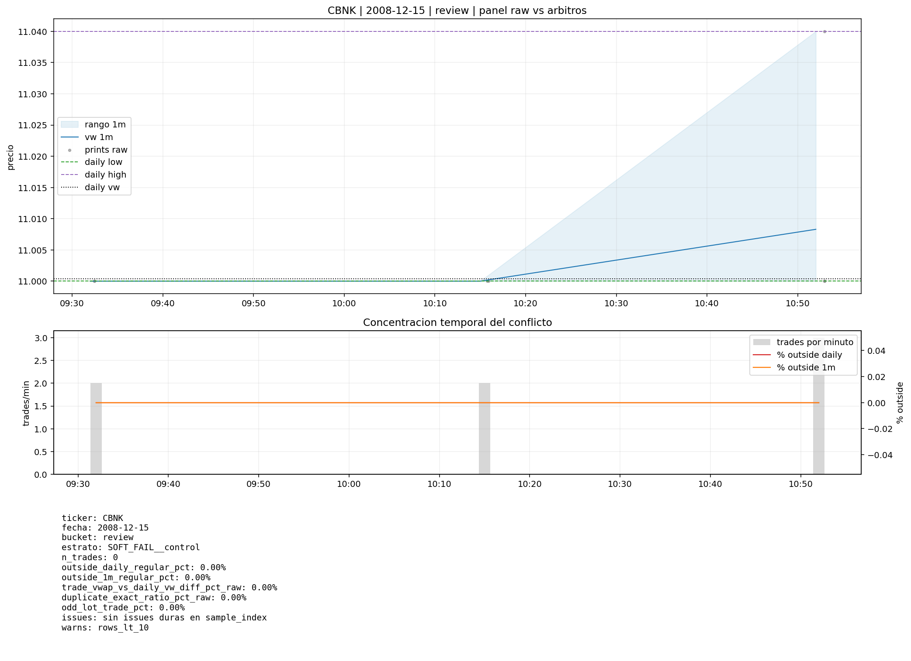

**Que muestra**

- Panel rico del tape raw frente a `daily` y `1m` para `CBNK` el `2008-12-15`.
- `n_trades = 7`, `outside_daily_regular_pct = 0.00%`, `outside_1m_regular_pct = 0.00%`.
- `trade_vwap_vs_daily_vw_diff_pct_raw = 0.00%`, `duplicate_exact_ratio_pct_raw = 0.00%`, `odd_lot_trade_pct = 0.00%`.

**Responde**

- Residuo de revision no absorbido por una subfamilia mas especifica. Responde a la pregunta de si todavia hace falta una regla de rehabilitacion antes de consumir esta masa.
- Responde a si el conflicto dominante vive en la escala (`~1x`), en la comparabilidad frente a `daily` (0.00%) o frente a `1m` (0.00%).
- La decision que justifica es mantener o no el caso en `recoverable_with_flag` cuando se rematerialice la rehabilitacion sobre `57f`.

### CVGW | 2012-07-25

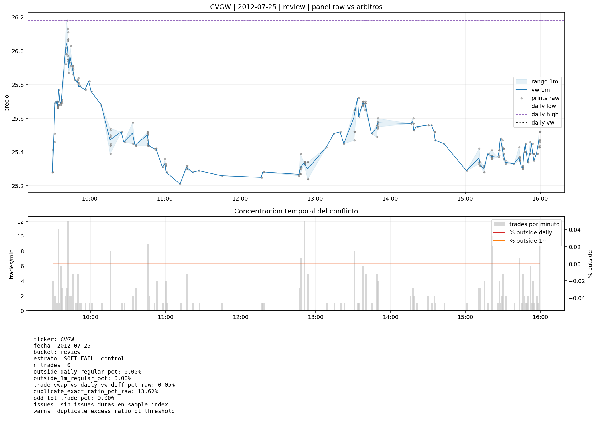

**Que muestra**

- Panel rico del tape raw frente a `daily` y `1m` para `CVGW` el `2012-07-25`.
- `n_trades = 279`, `outside_daily_regular_pct = 0.00%`, `outside_1m_regular_pct = 0.00%`.
- `trade_vwap_vs_daily_vw_diff_pct_raw = 0.05%`, `duplicate_exact_ratio_pct_raw = 13.62%`, `odd_lot_trade_pct = 0.00%`.

**Responde**

- Residuo de revision no absorbido por una subfamilia mas especifica. Responde a la pregunta de si todavia hace falta una regla de rehabilitacion antes de consumir esta masa.
- Responde a si el conflicto dominante vive en la escala (`~1x`), en la comparabilidad frente a `daily` (0.00%) o frente a `1m` (0.00%).
- El 13.62% de duplicacion exacta obliga a sospechar dano de tape o bursts mecanicos, no solo ruido visual.
- La decision que justifica es mantener o no el caso en `recoverable_with_flag` cuando se rematerialice la rehabilitacion sobre `57f`.

### CZWI | 2012-09-12

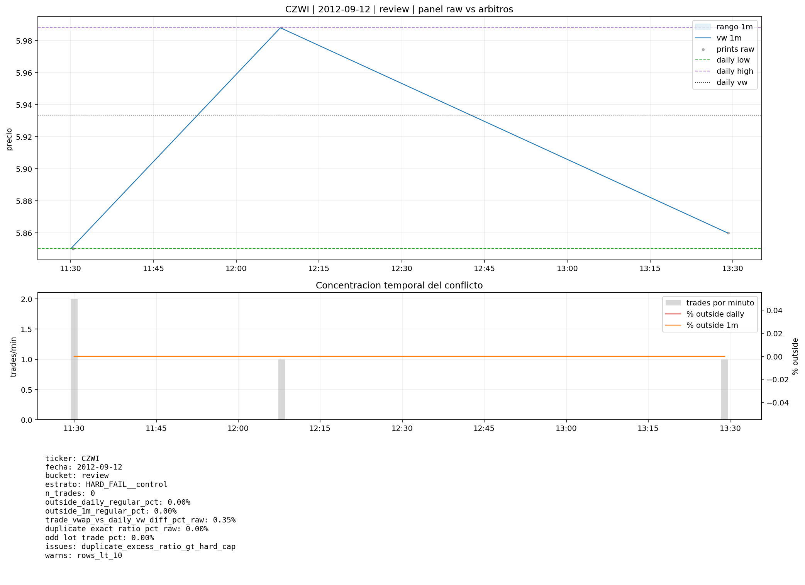

**Que muestra**

- Panel rico del tape raw frente a `daily` y `1m` para `CZWI` el `2012-09-12`.
- `n_trades = 4`, `outside_daily_regular_pct = 0.00%`, `outside_1m_regular_pct = 0.00%`.
- `trade_vwap_vs_daily_vw_diff_pct_raw = 0.35%`, `duplicate_exact_ratio_pct_raw = 0.00%`, `odd_lot_trade_pct = 0.00%`.

**Responde**

- Residuo de revision no absorbido por una subfamilia mas especifica. Responde a la pregunta de si todavia hace falta una regla de rehabilitacion antes de consumir esta masa.
- Responde a si el conflicto dominante vive en la escala (`~1x`), en la comparabilidad frente a `daily` (0.00%) o frente a `1m` (0.00%).
- La decision que justifica es mantener o no el caso en `recoverable_with_flag` cuando se rematerialice la rehabilitacion sobre `57f`.

### DSPG | 2010-06-02

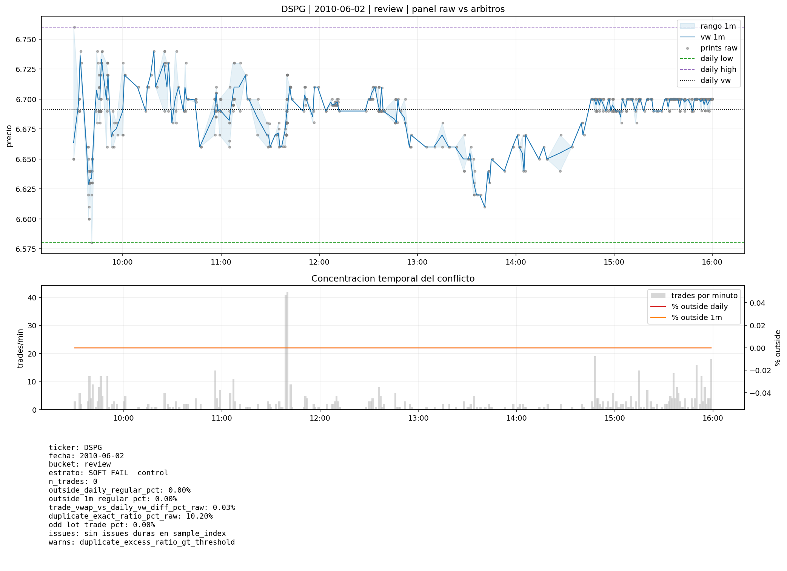

**Que muestra**

- Panel rico del tape raw frente a `daily` y `1m` para `DSPG` el `2010-06-02`.
- `n_trades = 647`, `outside_daily_regular_pct = 0.00%`, `outside_1m_regular_pct = 0.00%`.
- `trade_vwap_vs_daily_vw_diff_pct_raw = 0.03%`, `duplicate_exact_ratio_pct_raw = 10.20%`, `odd_lot_trade_pct = 0.00%`.

**Responde**

- Residuo de revision no absorbido por una subfamilia mas especifica. Responde a la pregunta de si todavia hace falta una regla de rehabilitacion antes de consumir esta masa.
- Responde a si el conflicto dominante vive en la escala (`~1x`), en la comparabilidad frente a `daily` (0.00%) o frente a `1m` (0.00%).
- El 10.20% de duplicacion exacta obliga a sospechar dano de tape o bursts mecanicos, no solo ruido visual.
- La decision que justifica es mantener o no el caso en `recoverable_with_flag` cuando se rematerialice la rehabilitacion sobre `57f`.

### GTN | 2010-03-09

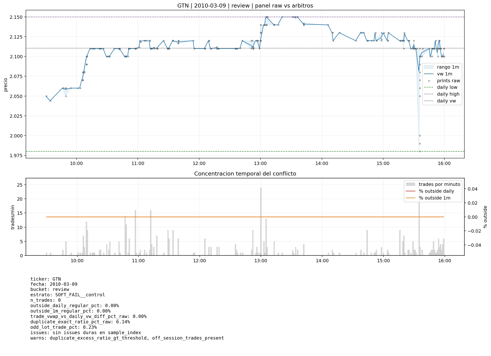

**Que muestra**

- Panel rico del tape raw frente a `daily` y `1m` para `GTN` el `2010-03-09`.
- `n_trades = 440`, `outside_daily_regular_pct = 0.00%`, `outside_1m_regular_pct = 0.00%`.
- `trade_vwap_vs_daily_vw_diff_pct_raw = 0.00%`, `duplicate_exact_ratio_pct_raw = 6.14%`, `odd_lot_trade_pct = 0.23%`.

**Responde**

- Residuo de revision no absorbido por una subfamilia mas especifica. Responde a la pregunta de si todavia hace falta una regla de rehabilitacion antes de consumir esta masa.
- Responde a si el conflicto dominante vive en la escala (`~1x`), en la comparabilidad frente a `daily` (0.00%) o frente a `1m` (0.00%).
- El 6.14% de duplicacion exacta obliga a sospechar dano de tape o bursts mecanicos, no solo ruido visual.
- La decision que justifica es mantener o no el caso en `recoverable_with_flag` cuando se rematerialice la rehabilitacion sobre `57f`.

### HRZN | 2011-11-03

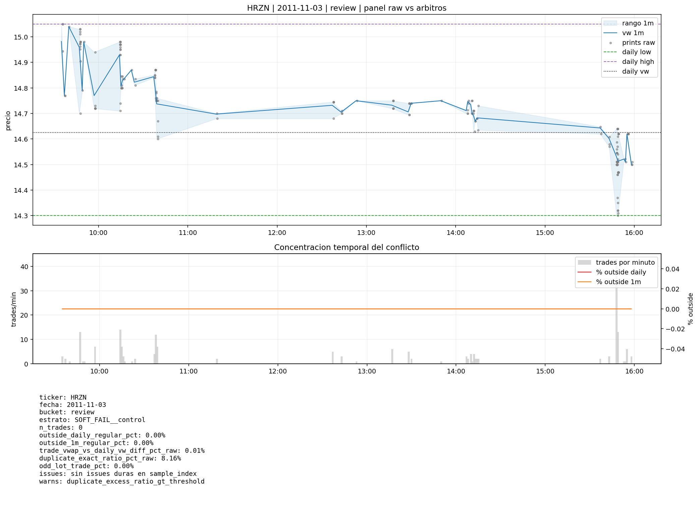

**Que muestra**

- Panel rico del tape raw frente a `daily` y `1m` para `HRZN` el `2011-11-03`.
- `n_trades = 196`, `outside_daily_regular_pct = 0.00%`, `outside_1m_regular_pct = 0.00%`.
- `trade_vwap_vs_daily_vw_diff_pct_raw = 0.01%`, `duplicate_exact_ratio_pct_raw = 8.16%`, `odd_lot_trade_pct = 0.00%`.

**Responde**

- Residuo de revision no absorbido por una subfamilia mas especifica. Responde a la pregunta de si todavia hace falta una regla de rehabilitacion antes de consumir esta masa.
- Responde a si el conflicto dominante vive en la escala (`~1x`), en la comparabilidad frente a `daily` (0.00%) o frente a `1m` (0.00%).
- El 8.16% de duplicacion exacta obliga a sospechar dano de tape o bursts mecanicos, no solo ruido visual.
- La decision que justifica es mantener o no el caso en `recoverable_with_flag` cuando se rematerialice la rehabilitacion sobre `57f`.

### HSTM | 2008-02-15

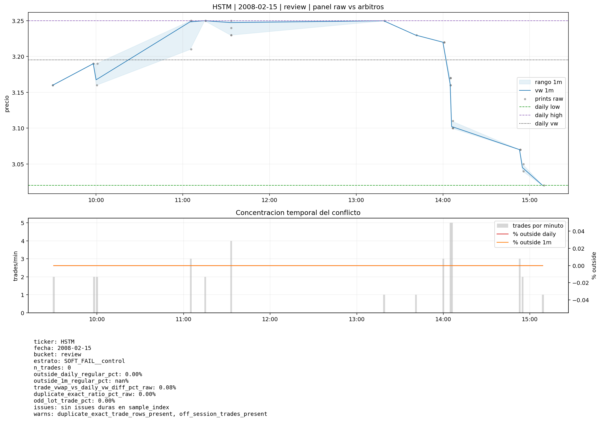

**Que muestra**

- Panel rico del tape raw frente a `daily` y `1m` para `HSTM` el `2008-02-15`.
- `n_trades = 36`, `outside_daily_regular_pct = 0.00%`, `outside_1m_regular_pct = nan%`.
- `trade_vwap_vs_daily_vw_diff_pct_raw = 0.08%`, `duplicate_exact_ratio_pct_raw = 0.00%`, `odd_lot_trade_pct = 0.00%`.

**Responde**

- Residuo de revision no absorbido por una subfamilia mas especifica. Responde a la pregunta de si todavia hace falta una regla de rehabilitacion antes de consumir esta masa.
- Responde a si el conflicto dominante vive en la escala (`~1x`), en la comparabilidad frente a `daily` (0.00%) o frente a `1m` (nan%).
- La decision que justifica es mantener o no el caso en `recoverable_with_flag` cuando se rematerialice la rehabilitacion sobre `57f`.

### IMMR | 2006-11-28

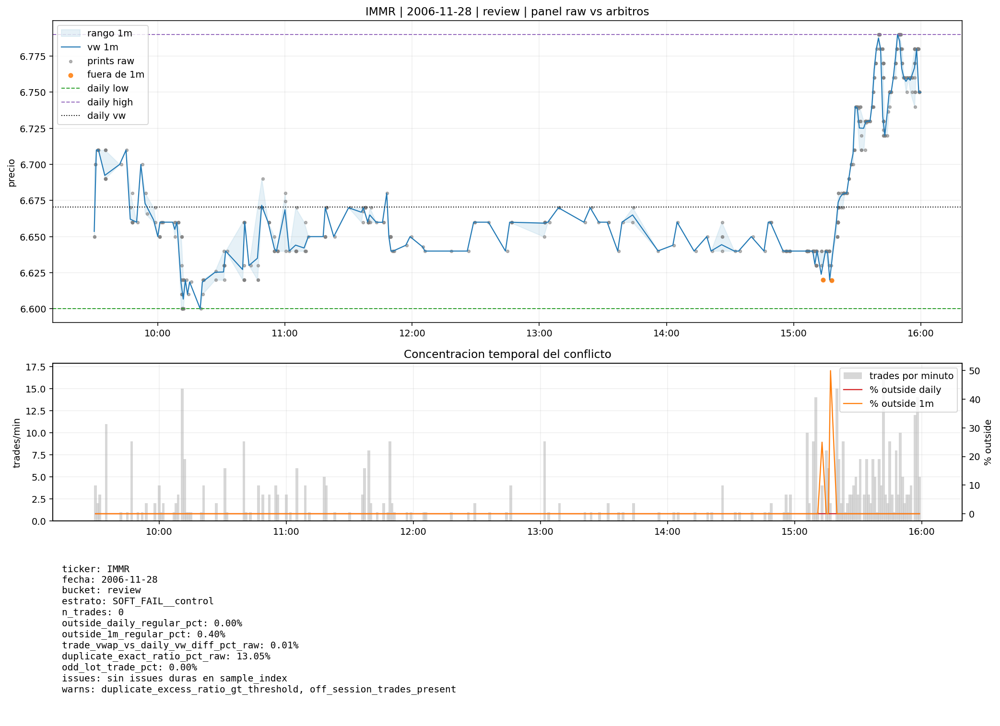

**Que muestra**

- Panel rico del tape raw frente a `daily` y `1m` para `IMMR` el `2006-11-28`.
- `n_trades = 498`, `outside_daily_regular_pct = 0.00%`, `outside_1m_regular_pct = 0.40%`.
- `trade_vwap_vs_daily_vw_diff_pct_raw = 0.01%`, `duplicate_exact_ratio_pct_raw = 13.05%`, `odd_lot_trade_pct = 0.00%`.

**Responde**

- Residuo de revision no absorbido por una subfamilia mas especifica. Responde a la pregunta de si todavia hace falta una regla de rehabilitacion antes de consumir esta masa.
- Responde a si el conflicto dominante vive en la escala (`~1x`), en la comparabilidad frente a `daily` (0.00%) o frente a `1m` (0.40%).
- El 13.05% de duplicacion exacta obliga a sospechar dano de tape o bursts mecanicos, no solo ruido visual.
- La decision que justifica es mantener o no el caso en `recoverable_with_flag` cuando se rematerialice la rehabilitacion sobre `57f`.

### IVC | 2010-04-16

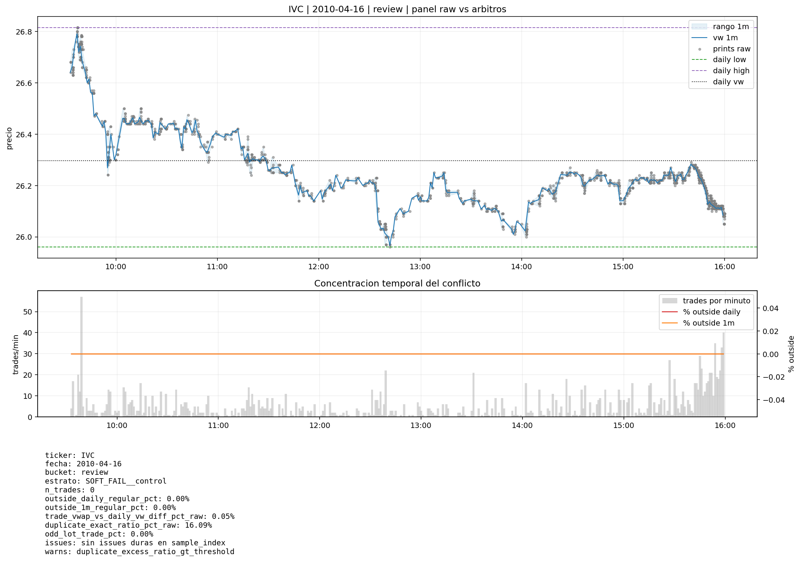

**Que muestra**

- Panel rico del tape raw frente a `daily` y `1m` para `IVC` el `2010-04-16`.
- `n_trades = 1,715`, `outside_daily_regular_pct = 0.00%`, `outside_1m_regular_pct = 0.00%`.
- `trade_vwap_vs_daily_vw_diff_pct_raw = 0.05%`, `duplicate_exact_ratio_pct_raw = 16.09%`, `odd_lot_trade_pct = 0.00%`.

**Responde**

- Residuo de revision no absorbido por una subfamilia mas especifica. Responde a la pregunta de si todavia hace falta una regla de rehabilitacion antes de consumir esta masa.
- Responde a si el conflicto dominante vive en la escala (`~1x`), en la comparabilidad frente a `daily` (0.00%) o frente a `1m` (0.00%).
- El 16.09% de duplicacion exacta obliga a sospechar dano de tape o bursts mecanicos, no solo ruido visual.
- La decision que justifica es mantener o no el caso en `recoverable_with_flag` cuando se rematerialice la rehabilitacion sobre `57f`.

### MYGN | 2012-06-15

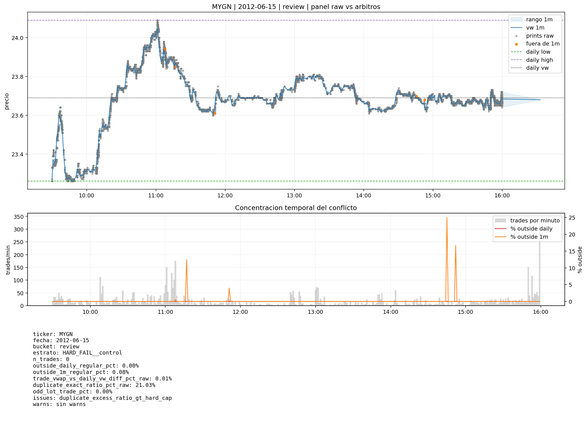

**Que muestra**

- Panel rico del tape raw frente a `daily` y `1m` para `MYGN` el `2012-06-15`.
- `n_trades = 6,619`, `outside_daily_regular_pct = 0.00%`, `outside_1m_regular_pct = 0.08%`.
- `trade_vwap_vs_daily_vw_diff_pct_raw = 0.01%`, `duplicate_exact_ratio_pct_raw = 21.03%`, `odd_lot_trade_pct = 0.00%`.

**Responde**

- Residuo de revision no absorbido por una subfamilia mas especifica. Responde a la pregunta de si todavia hace falta una regla de rehabilitacion antes de consumir esta masa.
- Responde a si el conflicto dominante vive en la escala (`~1x`), en la comparabilidad frente a `daily` (0.00%) o frente a `1m` (0.08%).
- El 21.03% de duplicacion exacta obliga a sospechar dano de tape o bursts mecanicos, no solo ruido visual.
- La decision que justifica es mantener o no el caso en `recoverable_with_flag` cuando se rematerialice la rehabilitacion sobre `57f`.

### ORRF | 2011-10-21

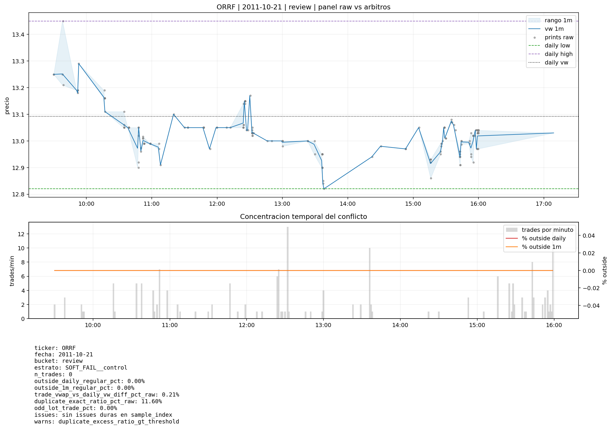

**Que muestra**

- Panel rico del tape raw frente a `daily` y `1m` para `ORRF` el `2011-10-21`.
- `n_trades = 181`, `outside_daily_regular_pct = 0.00%`, `outside_1m_regular_pct = 0.00%`.
- `trade_vwap_vs_daily_vw_diff_pct_raw = 0.21%`, `duplicate_exact_ratio_pct_raw = 11.60%`, `odd_lot_trade_pct = 0.00%`.

**Responde**

- Residuo de revision no absorbido por una subfamilia mas especifica. Responde a la pregunta de si todavia hace falta una regla de rehabilitacion antes de consumir esta masa.
- Responde a si el conflicto dominante vive en la escala (`~1x`), en la comparabilidad frente a `daily` (0.00%) o frente a `1m` (0.00%).
- El 11.60% de duplicacion exacta obliga a sospechar dano de tape o bursts mecanicos, no solo ruido visual.
- La decision que justifica es mantener o no el caso en `recoverable_with_flag` cuando se rematerialice la rehabilitacion sobre `57f`.

### PIC | 2012-10-25

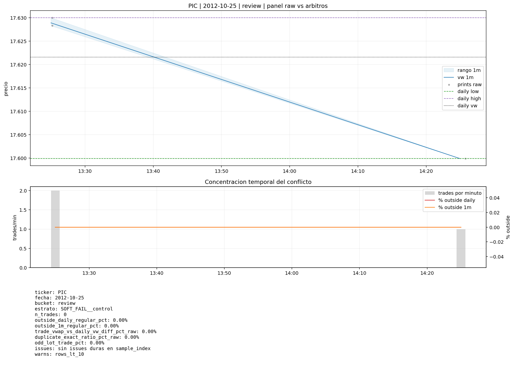

**Que muestra**

- Panel rico del tape raw frente a `daily` y `1m` para `PIC` el `2012-10-25`.
- `n_trades = 3`, `outside_daily_regular_pct = 0.00%`, `outside_1m_regular_pct = 0.00%`.
- `trade_vwap_vs_daily_vw_diff_pct_raw = 0.00%`, `duplicate_exact_ratio_pct_raw = 0.00%`, `odd_lot_trade_pct = 0.00%`.

**Responde**

- Residuo de revision no absorbido por una subfamilia mas especifica. Responde a la pregunta de si todavia hace falta una regla de rehabilitacion antes de consumir esta masa.
- Responde a si el conflicto dominante vive en la escala (`~1x`), en la comparabilidad frente a `daily` (0.00%) o frente a `1m` (0.00%).
- La decision que justifica es mantener o no el caso en `recoverable_with_flag` cuando se rematerialice la rehabilitacion sobre `57f`.

### ROIAK | 2006-02-15

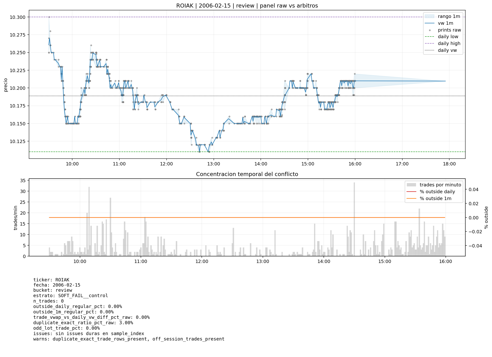

**Que muestra**

- Panel rico del tape raw frente a `daily` y `1m` para `ROIAK` el `2006-02-15`.
- `n_trades = 1,234`, `outside_daily_regular_pct = 0.00%`, `outside_1m_regular_pct = 0.00%`.
- `trade_vwap_vs_daily_vw_diff_pct_raw = 0.00%`, `duplicate_exact_ratio_pct_raw = 3.00%`, `odd_lot_trade_pct = 0.00%`.

**Responde**

- Residuo de revision no absorbido por una subfamilia mas especifica. Responde a la pregunta de si todavia hace falta una regla de rehabilitacion antes de consumir esta masa.
- Responde a si el conflicto dominante vive en la escala (`~1x`), en la comparabilidad frente a `daily` (0.00%) o frente a `1m` (0.00%).
- La decision que justifica es mantener o no el caso en `recoverable_with_flag` cuando se rematerialice la rehabilitacion sobre `57f`.

### SMMF | 2012-11-02

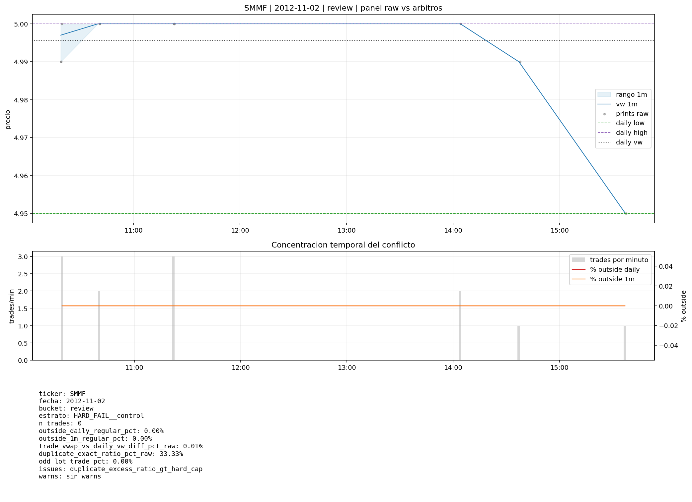

**Que muestra**

- Panel rico del tape raw frente a `daily` y `1m` para `SMMF` el `2012-11-02`.
- `n_trades = 12`, `outside_daily_regular_pct = 0.00%`, `outside_1m_regular_pct = 0.00%`.
- `trade_vwap_vs_daily_vw_diff_pct_raw = 0.01%`, `duplicate_exact_ratio_pct_raw = 33.33%`, `odd_lot_trade_pct = 0.00%`.

**Responde**

- Residuo de revision no absorbido por una subfamilia mas especifica. Responde a la pregunta de si todavia hace falta una regla de rehabilitacion antes de consumir esta masa.
- Responde a si el conflicto dominante vive en la escala (`~1x`), en la comparabilidad frente a `daily` (0.00%) o frente a `1m` (0.00%).
- El 33.33% de duplicacion exacta obliga a sospechar dano de tape o bursts mecanicos, no solo ruido visual.
- La decision que justifica es mantener o no el caso en `recoverable_with_flag` cuando se rematerialice la rehabilitacion sobre `57f`.

### SYPR | 2008-09-17

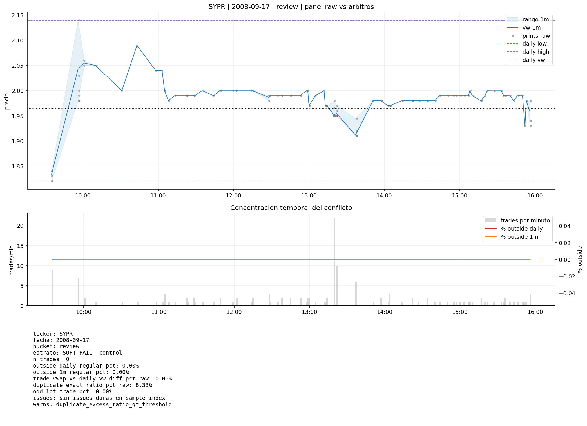

**Que muestra**

- Panel rico del tape raw frente a `daily` y `1m` para `SYPR` el `2008-09-17`.
- `n_trades = 144`, `outside_daily_regular_pct = 0.00%`, `outside_1m_regular_pct = 0.00%`.
- `trade_vwap_vs_daily_vw_diff_pct_raw = 0.05%`, `duplicate_exact_ratio_pct_raw = 8.33%`, `odd_lot_trade_pct = 0.00%`.

**Responde**

- Residuo de revision no absorbido por una subfamilia mas especifica. Responde a la pregunta de si todavia hace falta una regla de rehabilitacion antes de consumir esta masa.
- Responde a si el conflicto dominante vive en la escala (`~1x`), en la comparabilidad frente a `daily` (0.00%) o frente a `1m` (0.00%).
- El 8.33% de duplicacion exacta obliga a sospechar dano de tape o bursts mecanicos, no solo ruido visual.
- La decision que justifica es mantener o no el caso en `recoverable_with_flag` cuando se rematerialice la rehabilitacion sobre `57f`.

### LVNTA | 2014-03-25

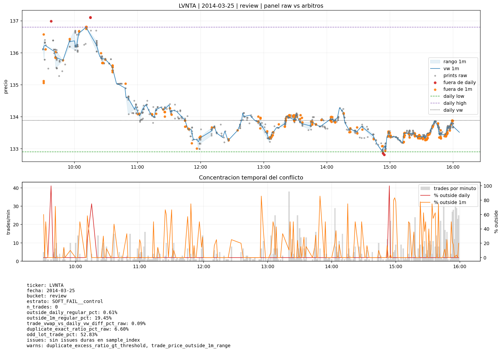

**Que muestra**

- Panel rico del tape raw frente a `daily` y `1m` para `LVNTA` el `2014-03-25`.
- `n_trades = 1,484`, `outside_daily_regular_pct = 0.61%`, `outside_1m_regular_pct = 19.45%`.
- `trade_vwap_vs_daily_vw_diff_pct_raw = 0.09%`, `duplicate_exact_ratio_pct_raw = 6.60%`, `odd_lot_trade_pct = 52.83%`.

**Responde**

- Residuo de revision no absorbido por una subfamilia mas especifica. Responde a la pregunta de si todavia hace falta una regla de rehabilitacion antes de consumir esta masa.
- Responde a si el conflicto dominante vive en la escala (`~1x`), en la comparabilidad frente a `daily` (0.61%) o frente a `1m` (19.45%).
- El 52.83% de odd-lots empuja la lectura hacia microestructura fina; evita leer el caso como pura ruptura economica gruesa.
- El 6.60% de duplicacion exacta obliga a sospechar dano de tape o bursts mecanicos, no solo ruido visual.
- La decision que justifica es mantener o no el caso en `recoverable_with_flag` cuando se rematerialice la rehabilitacion sobre `57f`.

### APLP | 2016-07-29

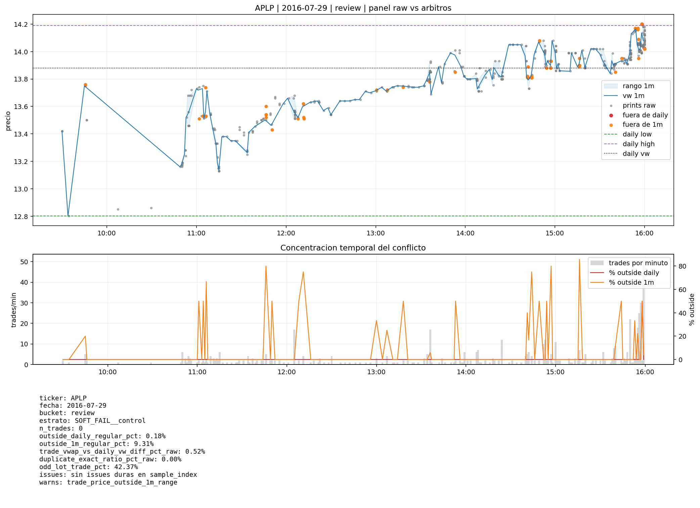

**Que muestra**

- Panel rico del tape raw frente a `daily` y `1m` para `APLP` el `2016-07-29`.
- `n_trades = 557`, `outside_daily_regular_pct = 0.18%`, `outside_1m_regular_pct = 9.31%`.
- `trade_vwap_vs_daily_vw_diff_pct_raw = 0.52%`, `duplicate_exact_ratio_pct_raw = 0.00%`, `odd_lot_trade_pct = 42.37%`.

**Responde**

- Residuo de revision no absorbido por una subfamilia mas especifica. Responde a la pregunta de si todavia hace falta una regla de rehabilitacion antes de consumir esta masa.
- Responde a si el conflicto dominante vive en la escala (`~1x`), en la comparabilidad frente a `daily` (0.18%) o frente a `1m` (9.31%).
- El 42.37% de odd-lots empuja la lectura hacia microestructura fina; evita leer el caso como pura ruptura economica gruesa.
- La decision que justifica es mantener o no el caso en `recoverable_with_flag` cuando se rematerialice la rehabilitacion sobre `57f`.

### ARDM | 2018-06-04

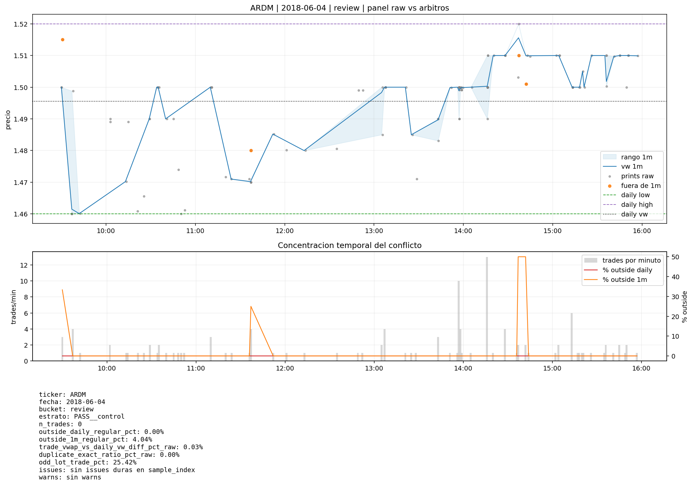

**Que muestra**

- Panel rico del tape raw frente a `daily` y `1m` para `ARDM` el `2018-06-04`.
- `n_trades = 118`, `outside_daily_regular_pct = 0.00%`, `outside_1m_regular_pct = 4.04%`.
- `trade_vwap_vs_daily_vw_diff_pct_raw = 0.03%`, `duplicate_exact_ratio_pct_raw = 0.00%`, `odd_lot_trade_pct = 25.42%`.

**Responde**

- Residuo de revision no absorbido por una subfamilia mas especifica. Responde a la pregunta de si todavia hace falta una regla de rehabilitacion antes de consumir esta masa.
- Responde a si el conflicto dominante vive en la escala (`~1x`), en la comparabilidad frente a `daily` (0.00%) o frente a `1m` (4.04%).
- El 25.42% de odd-lots empuja la lectura hacia microestructura fina; evita leer el caso como pura ruptura economica gruesa.
- La decision que justifica es mantener o no el caso en `recoverable_with_flag` cuando se rematerialice la rehabilitacion sobre `57f`.

### BEAT | 2015-12-04

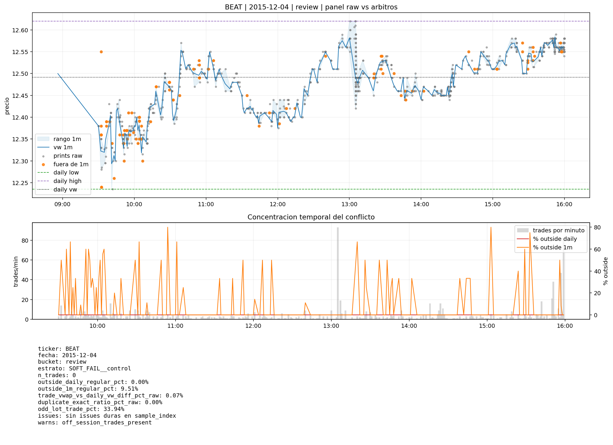

**Que muestra**

- Panel rico del tape raw frente a `daily` y `1m` para `BEAT` el `2015-12-04`.
- `n_trades = 1,093`, `outside_daily_regular_pct = 0.00%`, `outside_1m_regular_pct = 9.51%`.
- `trade_vwap_vs_daily_vw_diff_pct_raw = 0.07%`, `duplicate_exact_ratio_pct_raw = 0.00%`, `odd_lot_trade_pct = 33.94%`.

**Responde**

- Residuo de revision no absorbido por una subfamilia mas especifica. Responde a la pregunta de si todavia hace falta una regla de rehabilitacion antes de consumir esta masa.
- Responde a si el conflicto dominante vive en la escala (`~1x`), en la comparabilidad frente a `daily` (0.00%) o frente a `1m` (9.51%).
- El 33.94% de odd-lots empuja la lectura hacia microestructura fina; evita leer el caso como pura ruptura economica gruesa.
- La decision que justifica es mantener o no el caso en `recoverable_with_flag` cuando se rematerialice la rehabilitacion sobre `57f`.

### BSRR | 2013-10-02

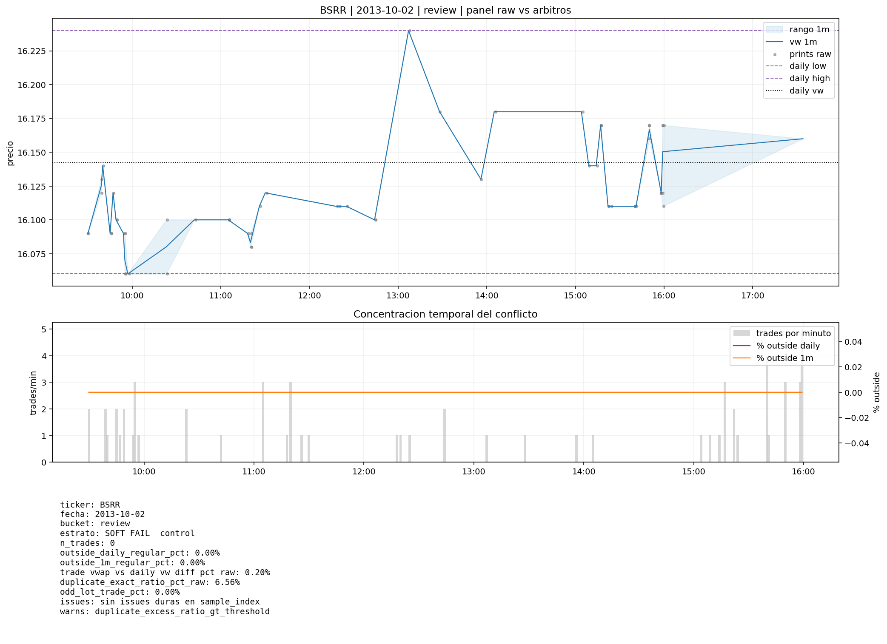

**Que muestra**

- Panel rico del tape raw frente a `daily` y `1m` para `BSRR` el `2013-10-02`.
- `n_trades = 61`, `outside_daily_regular_pct = 0.00%`, `outside_1m_regular_pct = 0.00%`.
- `trade_vwap_vs_daily_vw_diff_pct_raw = 0.20%`, `duplicate_exact_ratio_pct_raw = 6.56%`, `odd_lot_trade_pct = 0.00%`.

**Responde**

- Residuo de revision no absorbido por una subfamilia mas especifica. Responde a la pregunta de si todavia hace falta una regla de rehabilitacion antes de consumir esta masa.
- Responde a si el conflicto dominante vive en la escala (`~1x`), en la comparabilidad frente a `daily` (0.00%) o frente a `1m` (0.00%).
- El 6.56% de duplicacion exacta obliga a sospechar dano de tape o bursts mecanicos, no solo ruido visual.
- La decision que justifica es mantener o no el caso en `recoverable_with_flag` cuando se rematerialice la rehabilitacion sobre `57f`.

### GMLP | 2018-07-12

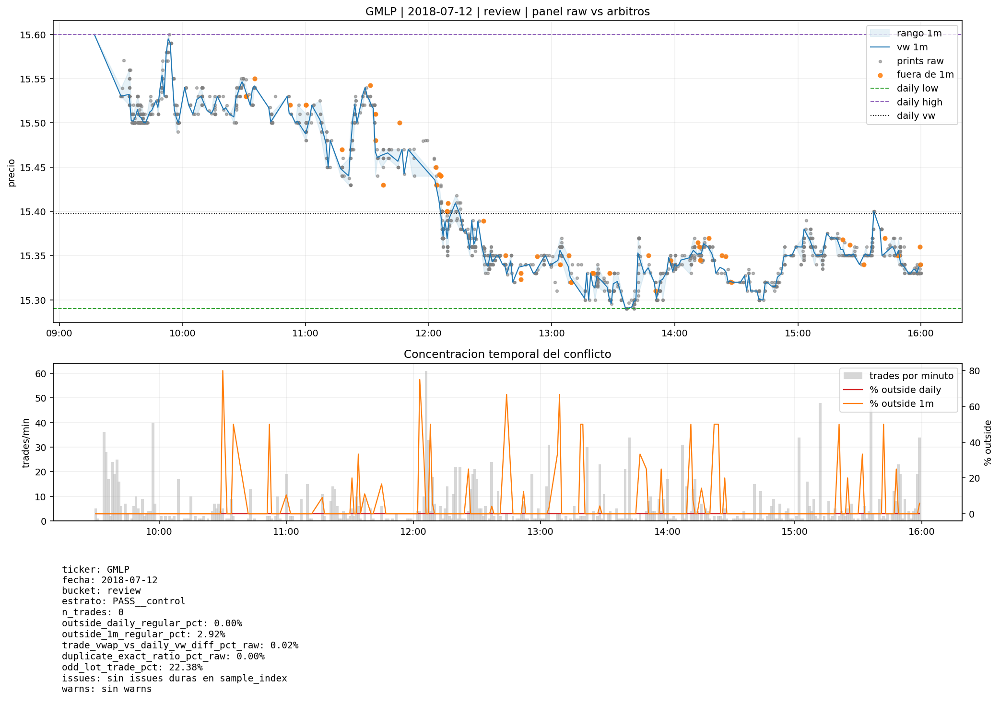

**Que muestra**

- Panel rico del tape raw frente a `daily` y `1m` para `GMLP` el `2018-07-12`.
- `n_trades = 1,872`, `outside_daily_regular_pct = 0.00%`, `outside_1m_regular_pct = 2.92%`.
- `trade_vwap_vs_daily_vw_diff_pct_raw = 0.02%`, `duplicate_exact_ratio_pct_raw = 0.00%`, `odd_lot_trade_pct = 22.38%`.

**Responde**

- Residuo de revision no absorbido por una subfamilia mas especifica. Responde a la pregunta de si todavia hace falta una regla de rehabilitacion antes de consumir esta masa.
- Responde a si el conflicto dominante vive en la escala (`~1x`), en la comparabilidad frente a `daily` (0.00%) o frente a `1m` (2.92%).
- La decision que justifica es mantener o no el caso en `recoverable_with_flag` cuando se rematerialice la rehabilitacion sobre `57f`.

### JASN | 2017-02-27

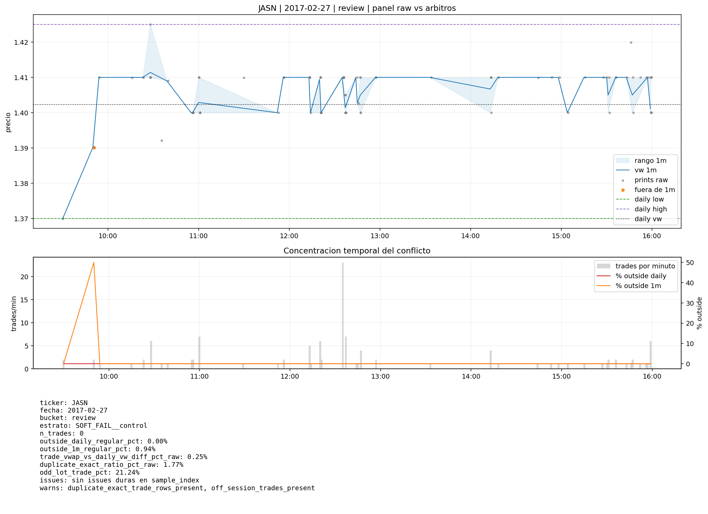

**Que muestra**

- Panel rico del tape raw frente a `daily` y `1m` para `JASN` el `2017-02-27`.
- `n_trades = 113`, `outside_daily_regular_pct = 0.00%`, `outside_1m_regular_pct = 0.94%`.
- `trade_vwap_vs_daily_vw_diff_pct_raw = 0.25%`, `duplicate_exact_ratio_pct_raw = 1.77%`, `odd_lot_trade_pct = 21.24%`.

**Responde**

- Residuo de revision no absorbido por una subfamilia mas especifica. Responde a la pregunta de si todavia hace falta una regla de rehabilitacion antes de consumir esta masa.
- Responde a si el conflicto dominante vive en la escala (`~1x`), en la comparabilidad frente a `daily` (0.00%) o frente a `1m` (0.94%).
- La decision que justifica es mantener o no el caso en `recoverable_with_flag` cuando se rematerialice la rehabilitacion sobre `57f`.

### KTCC | 2013-09-09

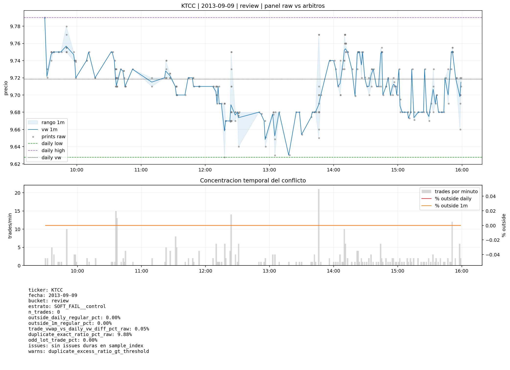

**Que muestra**

- Panel rico del tape raw frente a `daily` y `1m` para `KTCC` el `2013-09-09`.
- `n_trades = 334`, `outside_daily_regular_pct = 0.00%`, `outside_1m_regular_pct = 0.00%`.
- `trade_vwap_vs_daily_vw_diff_pct_raw = 0.05%`, `duplicate_exact_ratio_pct_raw = 9.88%`, `odd_lot_trade_pct = 0.00%`.

**Responde**

- Residuo de revision no absorbido por una subfamilia mas especifica. Responde a la pregunta de si todavia hace falta una regla de rehabilitacion antes de consumir esta masa.
- Responde a si el conflicto dominante vive en la escala (`~1x`), en la comparabilidad frente a `daily` (0.00%) o frente a `1m` (0.00%).
- El 9.88% de duplicacion exacta obliga a sospechar dano de tape o bursts mecanicos, no solo ruido visual.
- La decision que justifica es mantener o no el caso en `recoverable_with_flag` cuando se rematerialice la rehabilitacion sobre `57f`.

### MDCA | 2018-06-08

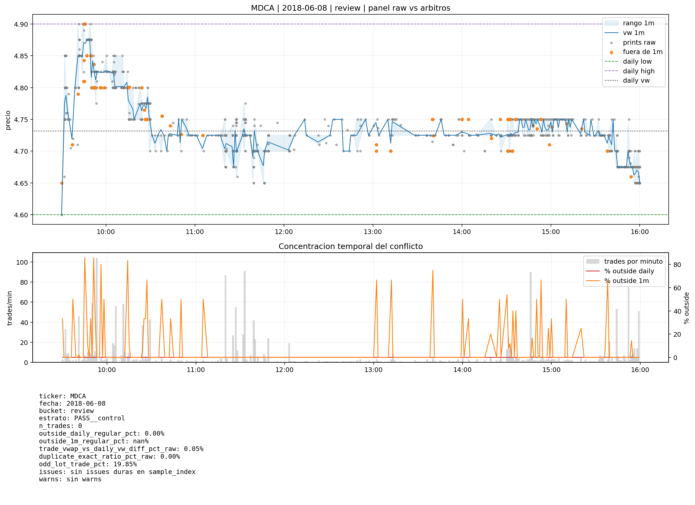

**Que muestra**

- Panel rico del tape raw frente a `daily` y `1m` para `MDCA` el `2018-06-08`.
- `n_trades = 1,809`, `outside_daily_regular_pct = 0.00%`, `outside_1m_regular_pct = nan%`.
- `trade_vwap_vs_daily_vw_diff_pct_raw = 0.05%`, `duplicate_exact_ratio_pct_raw = 0.00%`, `odd_lot_trade_pct = 19.85%`.

**Responde**

- Residuo de revision no absorbido por una subfamilia mas especifica. Responde a la pregunta de si todavia hace falta una regla de rehabilitacion antes de consumir esta masa.
- Responde a si el conflicto dominante vive en la escala (`~1x`), en la comparabilidad frente a `daily` (0.00%) o frente a `1m` (nan%).
- La decision que justifica es mantener o no el caso en `recoverable_with_flag` cuando se rematerialice la rehabilitacion sobre `57f`.

### MOFG | 2014-10-31

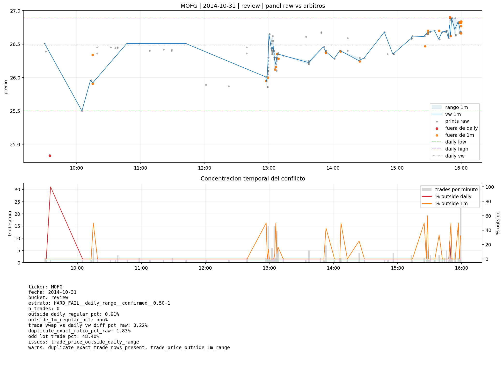

**Que muestra**

- Panel rico del tape raw frente a `daily` y `1m` para `MOFG` el `2014-10-31`.
- `n_trades = 219`, `outside_daily_regular_pct = 0.91%`, `outside_1m_regular_pct = nan%`.
- `trade_vwap_vs_daily_vw_diff_pct_raw = 0.22%`, `duplicate_exact_ratio_pct_raw = 1.83%`, `odd_lot_trade_pct = 48.40%`.

**Responde**

- Residuo de revision no absorbido por una subfamilia mas especifica. Responde a la pregunta de si todavia hace falta una regla de rehabilitacion antes de consumir esta masa.
- Responde a si el conflicto dominante vive en la escala (`~1x`), en la comparabilidad frente a `daily` (0.91%) o frente a `1m` (nan%).
- El 48.40% de odd-lots empuja la lectura hacia microestructura fina; evita leer el caso como pura ruptura economica gruesa.
- La decision que justifica es mantener o no el caso en `recoverable_with_flag` cuando se rematerialice la rehabilitacion sobre `57f`.

### MSGN | 2018-08-22

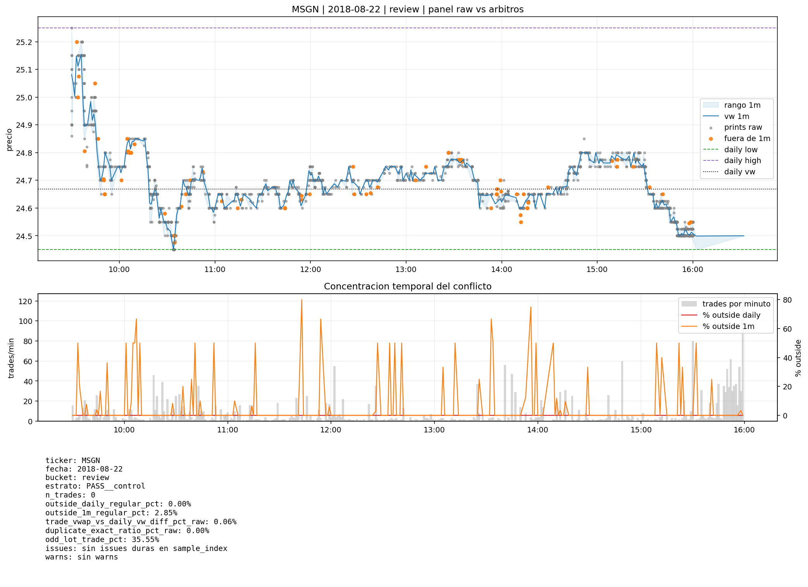

**Que muestra**

- Panel rico del tape raw frente a `daily` y `1m` para `MSGN` el `2018-08-22`.
- `n_trades = 2,591`, `outside_daily_regular_pct = 0.00%`, `outside_1m_regular_pct = 2.85%`.
- `trade_vwap_vs_daily_vw_diff_pct_raw = 0.06%`, `duplicate_exact_ratio_pct_raw = 0.00%`, `odd_lot_trade_pct = 35.55%`.

**Responde**

- Residuo de revision no absorbido por una subfamilia mas especifica. Responde a la pregunta de si todavia hace falta una regla de rehabilitacion antes de consumir esta masa.
- Responde a si el conflicto dominante vive en la escala (`~1x`), en la comparabilidad frente a `daily` (0.00%) o frente a `1m` (2.85%).
- El 35.55% de odd-lots empuja la lectura hacia microestructura fina; evita leer el caso como pura ruptura economica gruesa.
- La decision que justifica es mantener o no el caso en `recoverable_with_flag` cuando se rematerialice la rehabilitacion sobre `57f`.

### OXBR | 2018-12-24

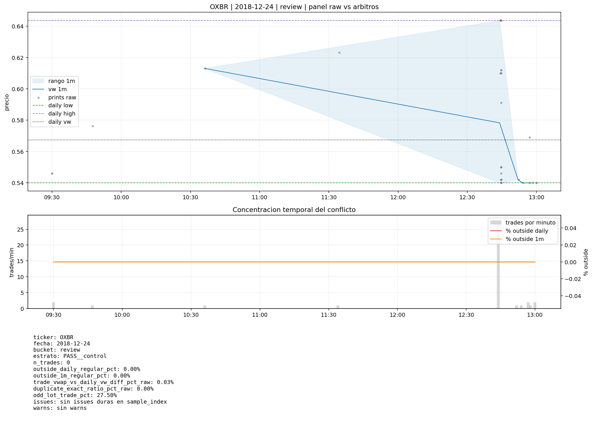

**Que muestra**

- Panel rico del tape raw frente a `daily` y `1m` para `OXBR` el `2018-12-24`.
- `n_trades = 40`, `outside_daily_regular_pct = 0.00%`, `outside_1m_regular_pct = 0.00%`.
- `trade_vwap_vs_daily_vw_diff_pct_raw = 0.03%`, `duplicate_exact_ratio_pct_raw = 0.00%`, `odd_lot_trade_pct = 27.50%`.

**Responde**

- Residuo de revision no absorbido por una subfamilia mas especifica. Responde a la pregunta de si todavia hace falta una regla de rehabilitacion antes de consumir esta masa.
- Responde a si el conflicto dominante vive en la escala (`~1x`), en la comparabilidad frente a `daily` (0.00%) o frente a `1m` (0.00%).
- El 27.50% de odd-lots empuja la lectura hacia microestructura fina; evita leer el caso como pura ruptura economica gruesa.
- La decision que justifica es mantener o no el caso en `recoverable_with_flag` cuando se rematerialice la rehabilitacion sobre `57f`.

### SENEB | 2013-08-19

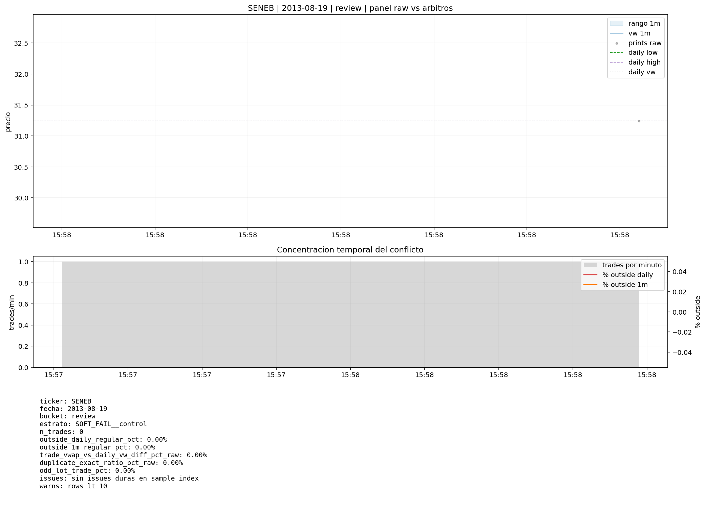

**Que muestra**

- Panel rico del tape raw frente a `daily` y `1m` para `SENEB` el `2013-08-19`.
- `n_trades = 1`, `outside_daily_regular_pct = 0.00%`, `outside_1m_regular_pct = 0.00%`.
- `trade_vwap_vs_daily_vw_diff_pct_raw = 0.00%`, `duplicate_exact_ratio_pct_raw = 0.00%`, `odd_lot_trade_pct = 0.00%`.

**Responde**

- Residuo de revision no absorbido por una subfamilia mas especifica. Responde a la pregunta de si todavia hace falta una regla de rehabilitacion antes de consumir esta masa.
- Responde a si el conflicto dominante vive en la escala (`~1x`), en la comparabilidad frente a `daily` (0.00%) o frente a `1m` (0.00%).
- La decision que justifica es mantener o no el caso en `recoverable_with_flag` cuando se rematerialice la rehabilitacion sobre `57f`.

### SIEB | 2016-12-09

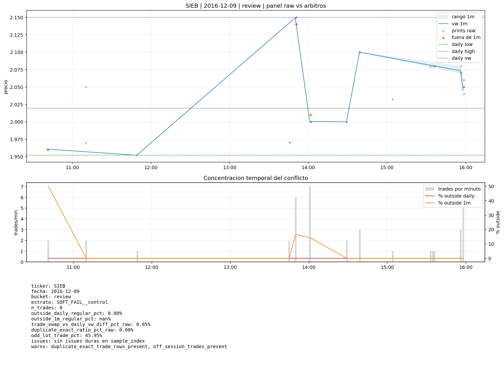

**Que muestra**

- Panel rico del tape raw frente a `daily` y `1m` para `SIEB` el `2016-12-09`.
- `n_trades = 37`, `outside_daily_regular_pct = 0.00%`, `outside_1m_regular_pct = nan%`.
- `trade_vwap_vs_daily_vw_diff_pct_raw = 0.05%`, `duplicate_exact_ratio_pct_raw = 0.00%`, `odd_lot_trade_pct = 45.95%`.

**Responde**

- Residuo de revision no absorbido por una subfamilia mas especifica. Responde a la pregunta de si todavia hace falta una regla de rehabilitacion antes de consumir esta masa.
- Responde a si el conflicto dominante vive en la escala (`~1x`), en la comparabilidad frente a `daily` (0.00%) o frente a `1m` (nan%).
- El 45.95% de odd-lots empuja la lectura hacia microestructura fina; evita leer el caso como pura ruptura economica gruesa.
- La decision que justifica es mantener o no el caso en `recoverable_with_flag` cuando se rematerialice la rehabilitacion sobre `57f`.

### SMTX | 2018-08-03

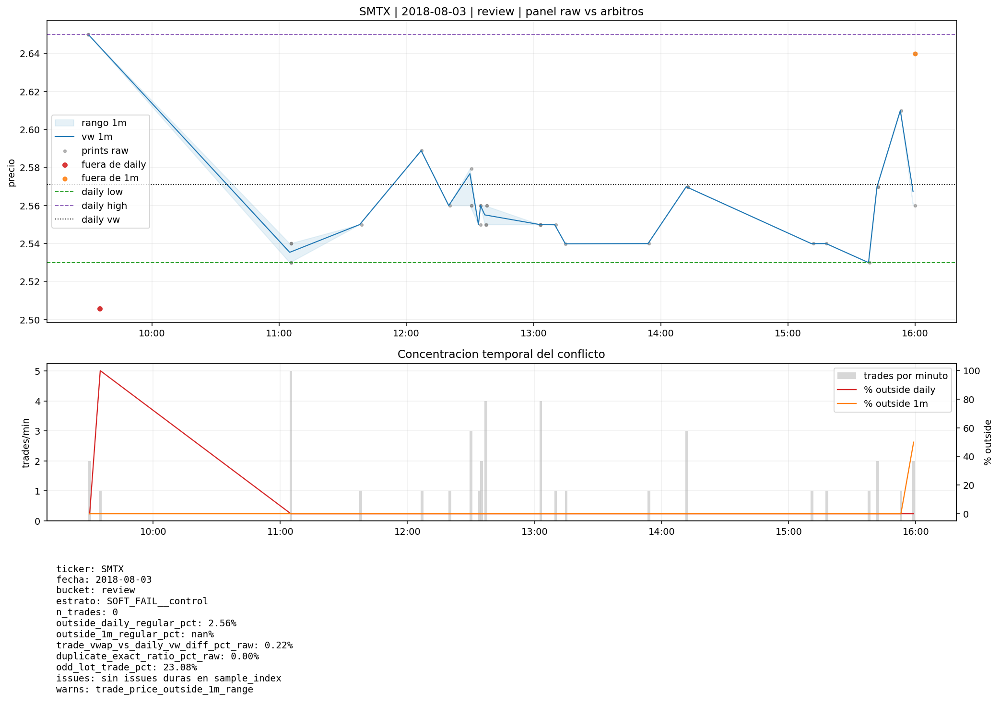

**Que muestra**

- Panel rico del tape raw frente a `daily` y `1m` para `SMTX` el `2018-08-03`.
- `n_trades = 39`, `outside_daily_regular_pct = 2.56%`, `outside_1m_regular_pct = nan%`.
- `trade_vwap_vs_daily_vw_diff_pct_raw = 0.22%`, `duplicate_exact_ratio_pct_raw = 0.00%`, `odd_lot_trade_pct = 23.08%`.

**Responde**

- Residuo de revision no absorbido por una subfamilia mas especifica. Responde a la pregunta de si todavia hace falta una regla de rehabilitacion antes de consumir esta masa.
- Responde a si el conflicto dominante vive en la escala (`~1x`), en la comparabilidad frente a `daily` (2.56%) o frente a `1m` (nan%).
- La decision que justifica es mantener o no el caso en `recoverable_with_flag` cuando se rematerialice la rehabilitacion sobre `57f`.

### SVBI | 2017-08-02

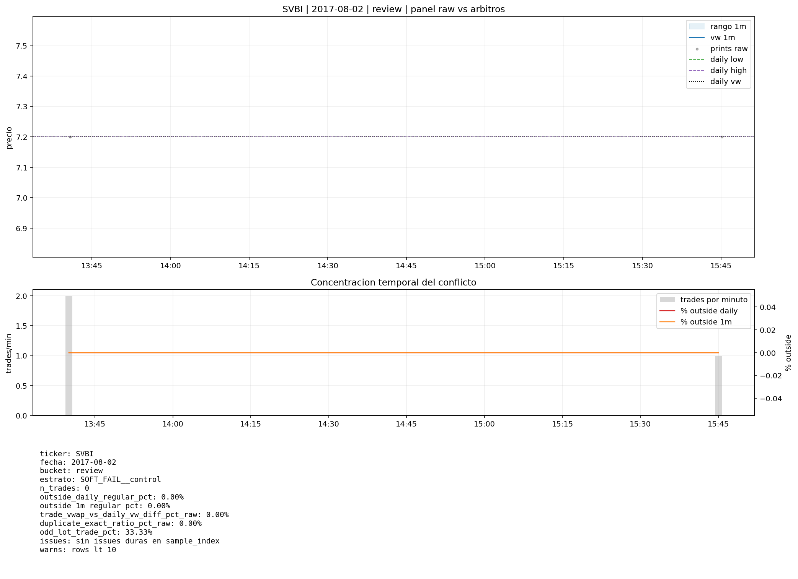

**Que muestra**

- Panel rico del tape raw frente a `daily` y `1m` para `SVBI` el `2017-08-02`.
- `n_trades = 3`, `outside_daily_regular_pct = 0.00%`, `outside_1m_regular_pct = 0.00%`.
- `trade_vwap_vs_daily_vw_diff_pct_raw = 0.00%`, `duplicate_exact_ratio_pct_raw = 0.00%`, `odd_lot_trade_pct = 33.33%`.

**Responde**

- Residuo de revision no absorbido por una subfamilia mas especifica. Responde a la pregunta de si todavia hace falta una regla de rehabilitacion antes de consumir esta masa.
- Responde a si el conflicto dominante vive en la escala (`~1x`), en la comparabilidad frente a `daily` (0.00%) o frente a `1m` (0.00%).
- El 33.33% de odd-lots empuja la lectura hacia microestructura fina; evita leer el caso como pura ruptura economica gruesa.
- La decision que justifica es mantener o no el caso en `recoverable_with_flag` cuando se rematerialice la rehabilitacion sobre `57f`.

### TRAK | 2013-01-31

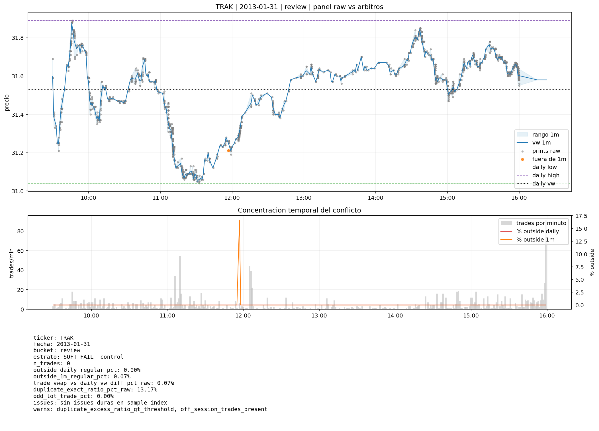

**Que muestra**

- Panel rico del tape raw frente a `daily` y `1m` para `TRAK` el `2013-01-31`.
- `n_trades = 1,466`, `outside_daily_regular_pct = 0.00%`, `outside_1m_regular_pct = 0.07%`.
- `trade_vwap_vs_daily_vw_diff_pct_raw = 0.07%`, `duplicate_exact_ratio_pct_raw = 13.17%`, `odd_lot_trade_pct = 0.00%`.

**Responde**

- Residuo de revision no absorbido por una subfamilia mas especifica. Responde a la pregunta de si todavia hace falta una regla de rehabilitacion antes de consumir esta masa.
- Responde a si el conflicto dominante vive en la escala (`~1x`), en la comparabilidad frente a `daily` (0.00%) o frente a `1m` (0.07%).
- El 13.17% de duplicacion exacta obliga a sospechar dano de tape o bursts mecanicos, no solo ruido visual.
- La decision que justifica es mantener o no el caso en `recoverable_with_flag` cuando se rematerialice la rehabilitacion sobre `57f`.

### VOC | 2016-01-12

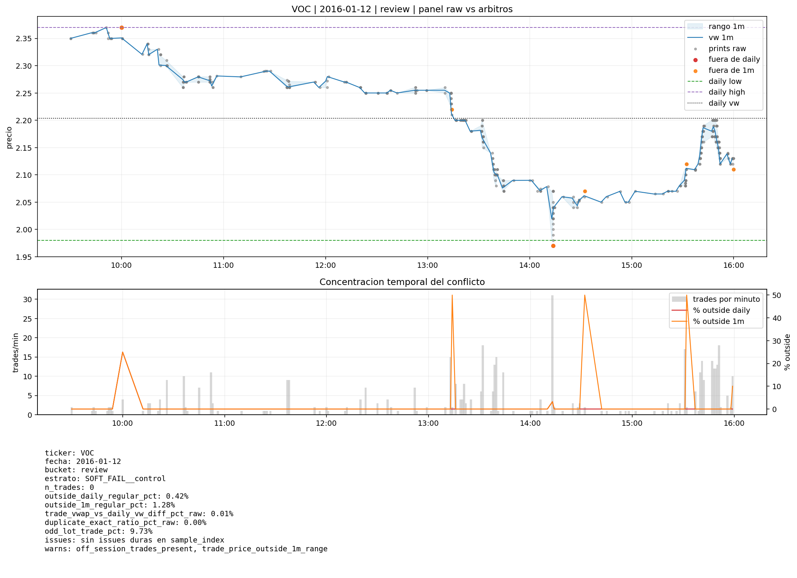

**Que muestra**

- Panel rico del tape raw frente a `daily` y `1m` para `VOC` el `2016-01-12`.
- `n_trades = 473`, `outside_daily_regular_pct = 0.42%`, `outside_1m_regular_pct = 1.28%`.
- `trade_vwap_vs_daily_vw_diff_pct_raw = 0.01%`, `duplicate_exact_ratio_pct_raw = 0.00%`, `odd_lot_trade_pct = 9.73%`.

**Responde**

- Residuo de revision no absorbido por una subfamilia mas especifica. Responde a la pregunta de si todavia hace falta una regla de rehabilitacion antes de consumir esta masa.
- Responde a si el conflicto dominante vive en la escala (`~1x`), en la comparabilidad frente a `daily` (0.42%) o frente a `1m` (1.28%).
- La decision que justifica es mantener o no el caso en `recoverable_with_flag` cuando se rematerialice la rehabilitacion sobre `57f`.

### WASH | 2015-01-06

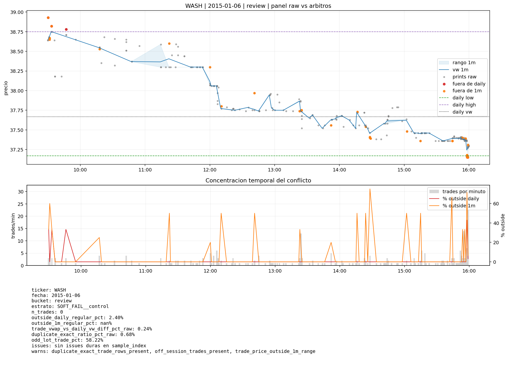

**Que muestra**

- Panel rico del tape raw frente a `daily` y `1m` para `WASH` el `2015-01-06`.
- `n_trades = 292`, `outside_daily_regular_pct = 2.40%`, `outside_1m_regular_pct = nan%`.
- `trade_vwap_vs_daily_vw_diff_pct_raw = 0.24%`, `duplicate_exact_ratio_pct_raw = 0.68%`, `odd_lot_trade_pct = 58.22%`.

**Responde**

- Residuo de revision no absorbido por una subfamilia mas especifica. Responde a la pregunta de si todavia hace falta una regla de rehabilitacion antes de consumir esta masa.
- Responde a si el conflicto dominante vive en la escala (`~1x`), en la comparabilidad frente a `daily` (2.40%) o frente a `1m` (nan%).
- El 58.22% de odd-lots empuja la lectura hacia microestructura fina; evita leer el caso como pura ruptura economica gruesa.
- La decision que justifica es mantener o no el caso en `recoverable_with_flag` cuando se rematerialice la rehabilitacion sobre `57f`.

### SFE | 2021-07-26

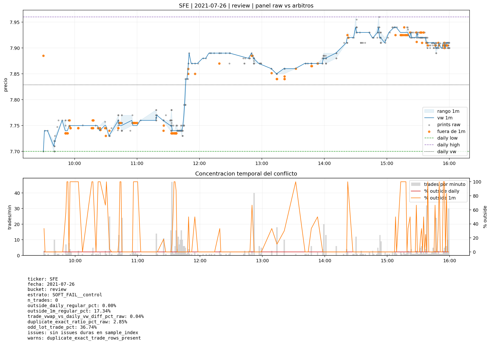

**Que muestra**

- Panel rico del tape raw frente a `daily` y `1m` para `SFE` el `2021-07-26`.
- `n_trades = 773`, `outside_daily_regular_pct = 0.00%`, `outside_1m_regular_pct = 17.34%`.
- `trade_vwap_vs_daily_vw_diff_pct_raw = 0.04%`, `duplicate_exact_ratio_pct_raw = 2.85%`, `odd_lot_trade_pct = 36.74%`.

**Responde**

- Residuo de revision no absorbido por una subfamilia mas especifica. Responde a la pregunta de si todavia hace falta una regla de rehabilitacion antes de consumir esta masa.
- Responde a si el conflicto dominante vive en la escala (`~1x`), en la comparabilidad frente a `daily` (0.00%) o frente a `1m` (17.34%).
- El 36.74% de odd-lots empuja la lectura hacia microestructura fina; evita leer el caso como pura ruptura economica gruesa.
- La decision que justifica es mantener o no el caso en `recoverable_with_flag` cuando se rematerialice la rehabilitacion sobre `57f`.

### STND | 2019-07-02

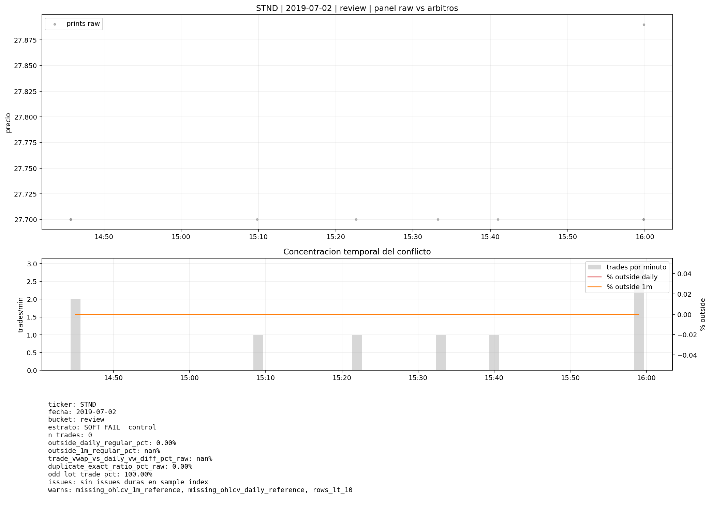

**Que muestra**

- Panel rico del tape raw frente a `daily` y `1m` para `STND` el `2019-07-02`.
- `n_trades = 9`, `outside_daily_regular_pct = 0.00%`, `outside_1m_regular_pct = nan%`.
- `trade_vwap_vs_daily_vw_diff_pct_raw = nan%`, `duplicate_exact_ratio_pct_raw = 0.00%`, `odd_lot_trade_pct = 100.00%`.

**Responde**

- Residuo de revision no absorbido por una subfamilia mas especifica. Responde a la pregunta de si todavia hace falta una regla de rehabilitacion antes de consumir esta masa.
- Responde a si el conflicto dominante vive en la escala (`nan`), en la comparabilidad frente a `daily` (0.00%) o frente a `1m` (nan%).
- El 100.00% de odd-lots empuja la lectura hacia microestructura fina; evita leer el caso como pura ruptura economica gruesa.
- La decision que justifica es mantener o no el caso en `recoverable_with_flag` cuando se rematerialice la rehabilitacion sobre `57f`.

### ABUS | 2023-12-28

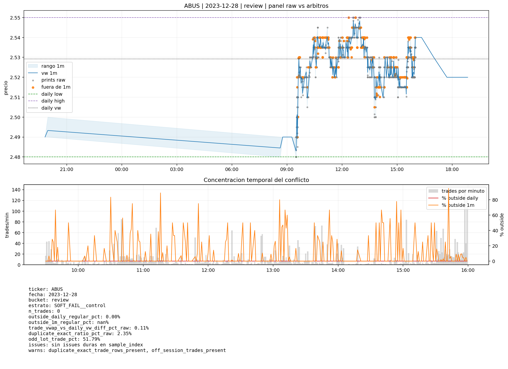

**Que muestra**

- Panel rico del tape raw frente a `daily` y `1m` para `ABUS` el `2023-12-28`.
- `n_trades = 3,750`, `outside_daily_regular_pct = 0.00%`, `outside_1m_regular_pct = nan%`.
- `trade_vwap_vs_daily_vw_diff_pct_raw = 0.11%`, `duplicate_exact_ratio_pct_raw = 2.35%`, `odd_lot_trade_pct = 51.79%`.

**Responde**

- Residuo de revision no absorbido por una subfamilia mas especifica. Responde a la pregunta de si todavia hace falta una regla de rehabilitacion antes de consumir esta masa.
- Responde a si el conflicto dominante vive en la escala (`~1x`), en la comparabilidad frente a `daily` (0.00%) o frente a `1m` (nan%).
- El 51.79% de odd-lots empuja la lectura hacia microestructura fina; evita leer el caso como pura ruptura economica gruesa.
- La decision que justifica es mantener o no el caso en `recoverable_with_flag` cuando se rematerialice la rehabilitacion sobre `57f`.

### BDN | 2023-04-25

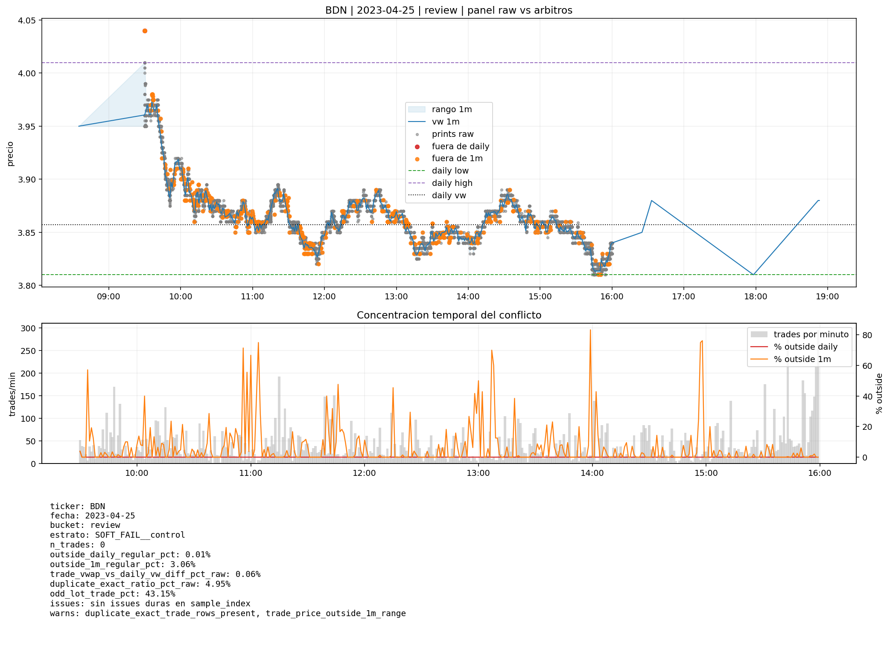

**Que muestra**

- Panel rico del tape raw frente a `daily` y `1m` para `BDN` el `2023-04-25`.
- `n_trades = 15,288`, `outside_daily_regular_pct = 0.01%`, `outside_1m_regular_pct = 3.06%`.
- `trade_vwap_vs_daily_vw_diff_pct_raw = 0.06%`, `duplicate_exact_ratio_pct_raw = 4.95%`, `odd_lot_trade_pct = 43.15%`.

**Responde**

- Residuo de revision no absorbido por una subfamilia mas especifica. Responde a la pregunta de si todavia hace falta una regla de rehabilitacion antes de consumir esta masa.
- Responde a si el conflicto dominante vive en la escala (`~1x`), en la comparabilidad frente a `daily` (0.01%) o frente a `1m` (3.06%).
- El 43.15% de odd-lots empuja la lectura hacia microestructura fina; evita leer el caso como pura ruptura economica gruesa.
- La decision que justifica es mantener o no el caso en `recoverable_with_flag` cuando se rematerialice la rehabilitacion sobre `57f`.

### BRN | 2021-07-15

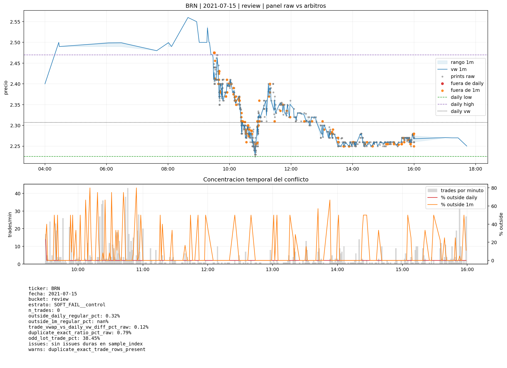

**Que muestra**

- Panel rico del tape raw frente a `daily` y `1m` para `BRN` el `2021-07-15`.
- `n_trades = 1,264`, `outside_daily_regular_pct = 0.32%`, `outside_1m_regular_pct = nan%`.
- `trade_vwap_vs_daily_vw_diff_pct_raw = 0.12%`, `duplicate_exact_ratio_pct_raw = 0.79%`, `odd_lot_trade_pct = 38.45%`.

**Responde**

- Residuo de revision no absorbido por una subfamilia mas especifica. Responde a la pregunta de si todavia hace falta una regla de rehabilitacion antes de consumir esta masa.
- Responde a si el conflicto dominante vive en la escala (`~1x`), en la comparabilidad frente a `daily` (0.32%) o frente a `1m` (nan%).
- El 38.45% de odd-lots empuja la lectura hacia microestructura fina; evita leer el caso como pura ruptura economica gruesa.
- La decision que justifica es mantener o no el caso en `recoverable_with_flag` cuando se rematerialice la rehabilitacion sobre `57f`.

### CMT | 2019-04-09

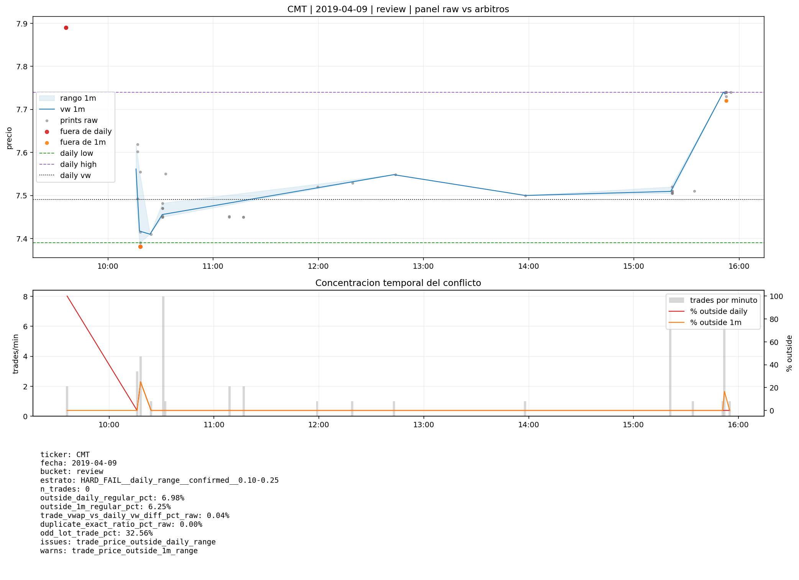

**Que muestra**

- Panel rico del tape raw frente a `daily` y `1m` para `CMT` el `2019-04-09`.
- `n_trades = 43`, `outside_daily_regular_pct = 6.98%`, `outside_1m_regular_pct = 6.25%`.
- `trade_vwap_vs_daily_vw_diff_pct_raw = 0.04%`, `duplicate_exact_ratio_pct_raw = 0.00%`, `odd_lot_trade_pct = 32.56%`.

**Responde**

- Residuo de revision no absorbido por una subfamilia mas especifica. Responde a la pregunta de si todavia hace falta una regla de rehabilitacion antes de consumir esta masa.
- Responde a si el conflicto dominante vive en la escala (`~1x`), en la comparabilidad frente a `daily` (6.98%) o frente a `1m` (6.25%).
- El 32.56% de odd-lots empuja la lectura hacia microestructura fina; evita leer el caso como pura ruptura economica gruesa.
- La decision que justifica es mantener o no el caso en `recoverable_with_flag` cuando se rematerialice la rehabilitacion sobre `57f`.

### CORS | 2022-10-10

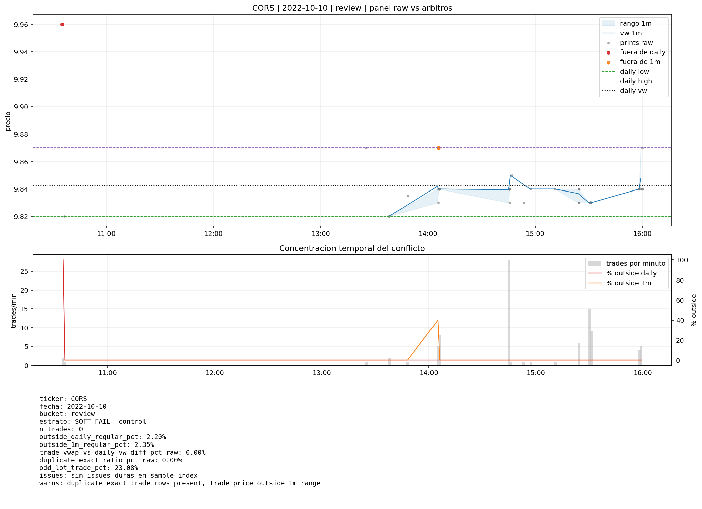

**Que muestra**

- Panel rico del tape raw frente a `daily` y `1m` para `CORS` el `2022-10-10`.
- `n_trades = 91`, `outside_daily_regular_pct = 2.20%`, `outside_1m_regular_pct = 2.35%`.
- `trade_vwap_vs_daily_vw_diff_pct_raw = 0.00%`, `duplicate_exact_ratio_pct_raw = 0.00%`, `odd_lot_trade_pct = 23.08%`.

**Responde**

- Residuo de revision no absorbido por una subfamilia mas especifica. Responde a la pregunta de si todavia hace falta una regla de rehabilitacion antes de consumir esta masa.
- Responde a si el conflicto dominante vive en la escala (`~1x`), en la comparabilidad frente a `daily` (2.20%) o frente a `1m` (2.35%).
- La decision que justifica es mantener o no el caso en `recoverable_with_flag` cuando se rematerialice la rehabilitacion sobre `57f`.

### CTEK | 2020-08-28

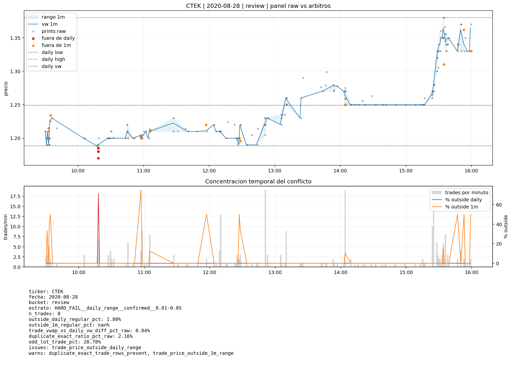

**Que muestra**

- Panel rico del tape raw frente a `daily` y `1m` para `CTEK` el `2020-08-28`.
- `n_trades = 278`, `outside_daily_regular_pct = 1.80%`, `outside_1m_regular_pct = nan%`.
- `trade_vwap_vs_daily_vw_diff_pct_raw = 0.04%`, `duplicate_exact_ratio_pct_raw = 2.16%`, `odd_lot_trade_pct = 28.78%`.

**Responde**

- Residuo de revision no absorbido por una subfamilia mas especifica. Responde a la pregunta de si todavia hace falta una regla de rehabilitacion antes de consumir esta masa.
- Responde a si el conflicto dominante vive en la escala (`~1x`), en la comparabilidad frente a `daily` (1.80%) o frente a `1m` (nan%).
- El 28.78% de odd-lots empuja la lectura hacia microestructura fina; evita leer el caso como pura ruptura economica gruesa.
- La decision que justifica es mantener o no el caso en `recoverable_with_flag` cuando se rematerialice la rehabilitacion sobre `57f`.

### ESQ | 2020-05-19

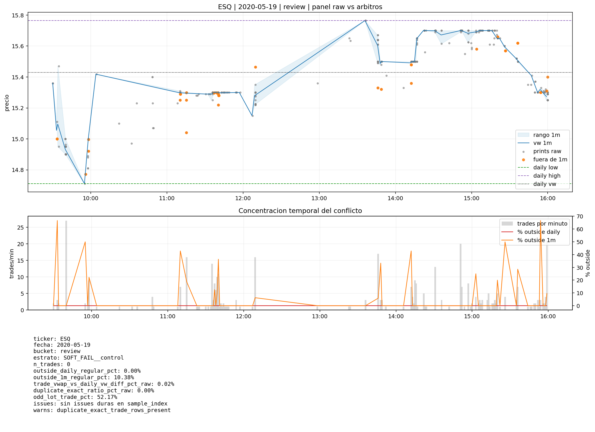

**Que muestra**

- Panel rico del tape raw frente a `daily` y `1m` para `ESQ` el `2020-05-19`.
- `n_trades = 391`, `outside_daily_regular_pct = 0.00%`, `outside_1m_regular_pct = 10.38%`.
- `trade_vwap_vs_daily_vw_diff_pct_raw = 0.02%`, `duplicate_exact_ratio_pct_raw = 0.00%`, `odd_lot_trade_pct = 52.17%`.

**Responde**

- Residuo de revision no absorbido por una subfamilia mas especifica. Responde a la pregunta de si todavia hace falta una regla de rehabilitacion antes de consumir esta masa.
- Responde a si el conflicto dominante vive en la escala (`~1x`), en la comparabilidad frente a `daily` (0.00%) o frente a `1m` (10.38%).
- El 52.17% de odd-lots empuja la lectura hacia microestructura fina; evita leer el caso como pura ruptura economica gruesa.
- La decision que justifica es mantener o no el caso en `recoverable_with_flag` cuando se rematerialice la rehabilitacion sobre `57f`.

### EVH | 2025-04-29

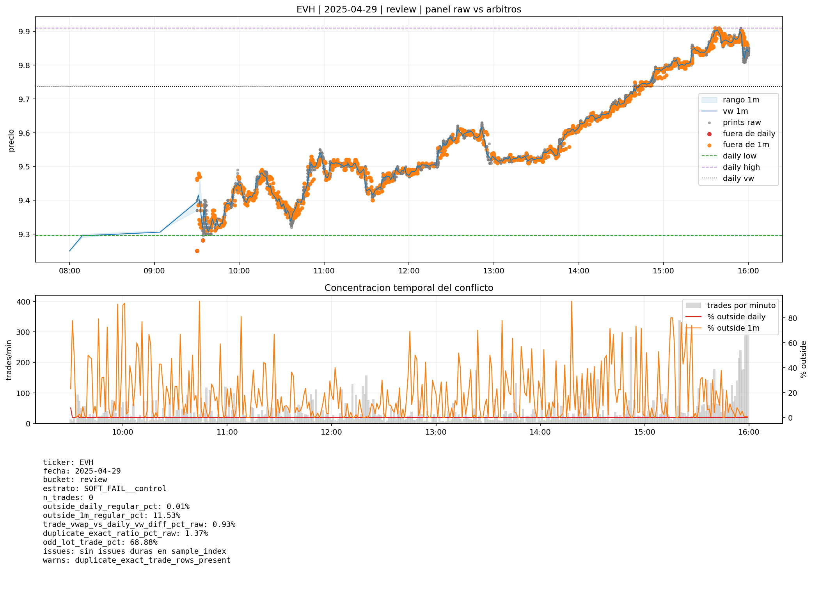

**Que muestra**

- Panel rico del tape raw frente a `daily` y `1m` para `EVH` el `2025-04-29`.
- `n_trades = 16,738`, `outside_daily_regular_pct = 0.01%`, `outside_1m_regular_pct = 11.53%`.
- `trade_vwap_vs_daily_vw_diff_pct_raw = 0.93%`, `duplicate_exact_ratio_pct_raw = 1.37%`, `odd_lot_trade_pct = 68.88%`.

**Responde**

- Residuo de revision no absorbido por una subfamilia mas especifica. Responde a la pregunta de si todavia hace falta una regla de rehabilitacion antes de consumir esta masa.
- Responde a si el conflicto dominante vive en la escala (`~1x`), en la comparabilidad frente a `daily` (0.01%) o frente a `1m` (11.53%).
- El 68.88% de odd-lots empuja la lectura hacia microestructura fina; evita leer el caso como pura ruptura economica gruesa.
- La decision que justifica es mantener o no el caso en `recoverable_with_flag` cuando se rematerialice la rehabilitacion sobre `57f`.

### INAP | 2019-12-20

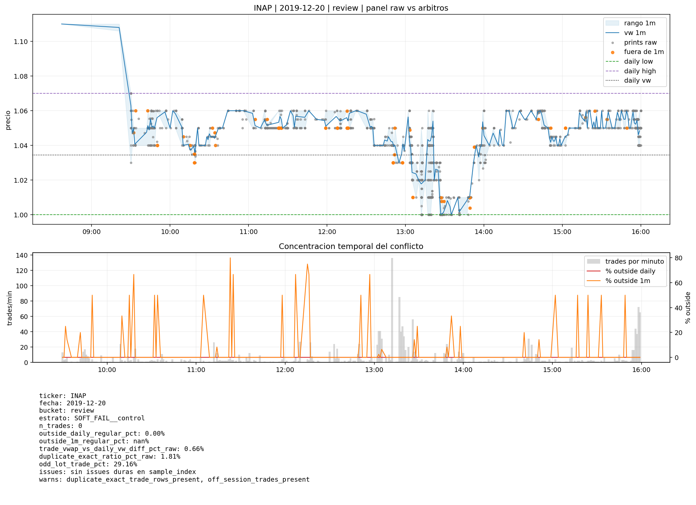

**Que muestra**

- Panel rico del tape raw frente a `daily` y `1m` para `INAP` el `2019-12-20`.
- `n_trades = 1,879`, `outside_daily_regular_pct = 0.00%`, `outside_1m_regular_pct = nan%`.
- `trade_vwap_vs_daily_vw_diff_pct_raw = 0.66%`, `duplicate_exact_ratio_pct_raw = 1.81%`, `odd_lot_trade_pct = 29.16%`.

**Responde**

- Residuo de revision no absorbido por una subfamilia mas especifica. Responde a la pregunta de si todavia hace falta una regla de rehabilitacion antes de consumir esta masa.
- Responde a si el conflicto dominante vive en la escala (`~1x`), en la comparabilidad frente a `daily` (0.00%) o frente a `1m` (nan%).
- El 29.16% de odd-lots empuja la lectura hacia microestructura fina; evita leer el caso como pura ruptura economica gruesa.
- La decision que justifica es mantener o no el caso en `recoverable_with_flag` cuando se rematerialice la rehabilitacion sobre `57f`.

### IRET | 2024-06-06

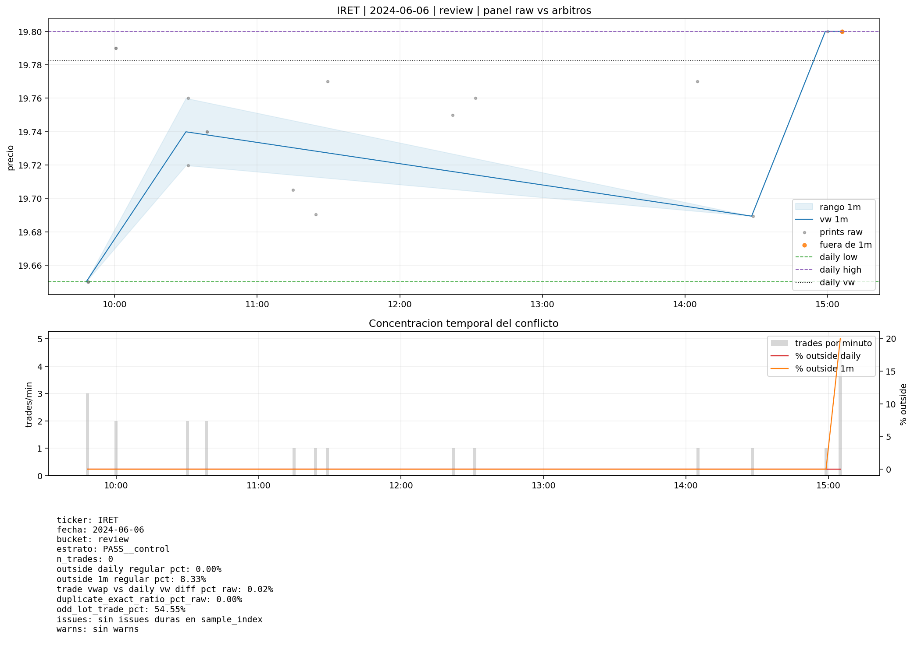

**Que muestra**

- Panel rico del tape raw frente a `daily` y `1m` para `IRET` el `2024-06-06`.
- `n_trades = 22`, `outside_daily_regular_pct = 0.00%`, `outside_1m_regular_pct = 8.33%`.
- `trade_vwap_vs_daily_vw_diff_pct_raw = 0.02%`, `duplicate_exact_ratio_pct_raw = 0.00%`, `odd_lot_trade_pct = 54.55%`.

**Responde**

- Residuo de revision no absorbido por una subfamilia mas especifica. Responde a la pregunta de si todavia hace falta una regla de rehabilitacion antes de consumir esta masa.
- Responde a si el conflicto dominante vive en la escala (`~1x`), en la comparabilidad frente a `daily` (0.00%) o frente a `1m` (8.33%).
- El 54.55% de odd-lots empuja la lectura hacia microestructura fina; evita leer el caso como pura ruptura economica gruesa.
- La decision que justifica es mantener o no el caso en `recoverable_with_flag` cuando se rematerialice la rehabilitacion sobre `57f`.

### IVC | 2019-01-28

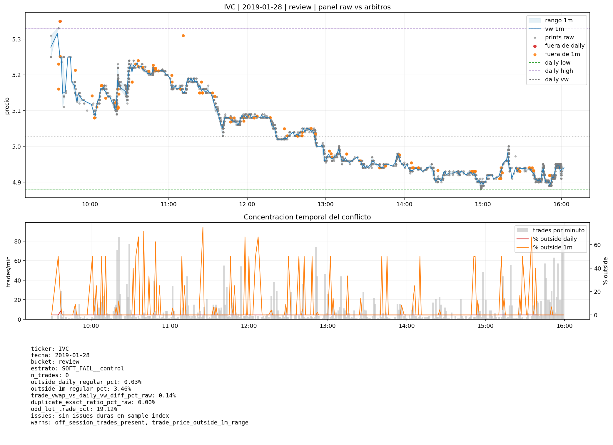

**Que muestra**

- Panel rico del tape raw frente a `daily` y `1m` para `IVC` el `2019-01-28`.
- `n_trades = 3,310`, `outside_daily_regular_pct = 0.03%`, `outside_1m_regular_pct = 3.46%`.
- `trade_vwap_vs_daily_vw_diff_pct_raw = 0.14%`, `duplicate_exact_ratio_pct_raw = 0.00%`, `odd_lot_trade_pct = 19.12%`.

**Responde**

- Residuo de revision no absorbido por una subfamilia mas especifica. Responde a la pregunta de si todavia hace falta una regla de rehabilitacion antes de consumir esta masa.
- Responde a si el conflicto dominante vive en la escala (`~1x`), en la comparabilidad frente a `daily` (0.03%) o frente a `1m` (3.46%).
- La decision que justifica es mantener o no el caso en `recoverable_with_flag` cuando se rematerialice la rehabilitacion sobre `57f`.

### JAQC | 2021-12-21

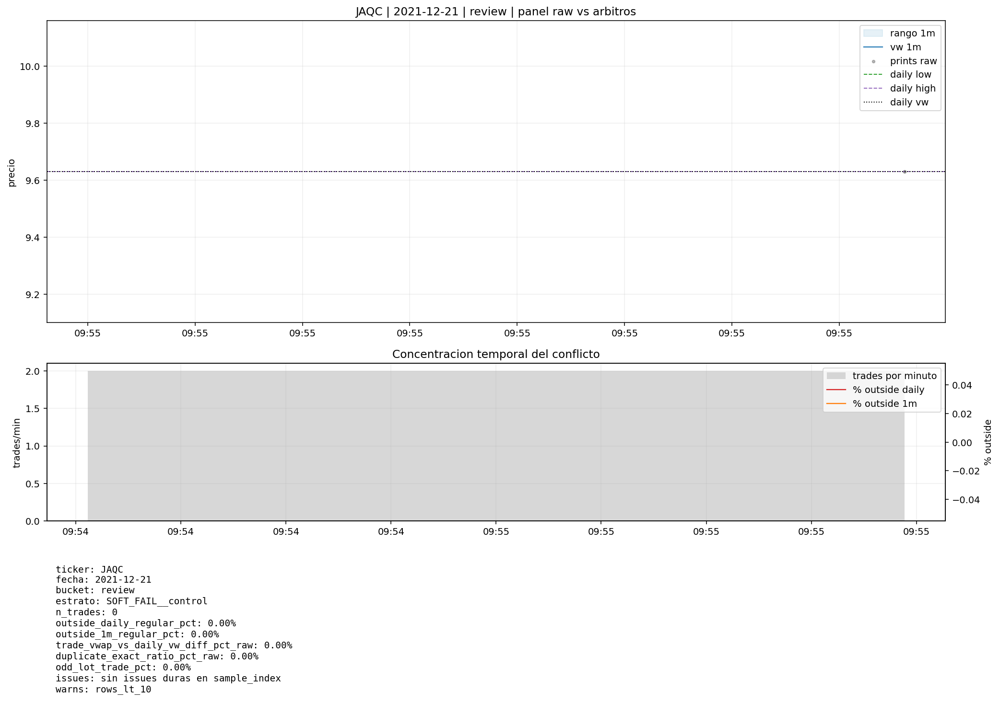

**Que muestra**

- Panel rico del tape raw frente a `daily` y `1m` para `JAQC` el `2021-12-21`.
- `n_trades = 2`, `outside_daily_regular_pct = 0.00%`, `outside_1m_regular_pct = 0.00%`.
- `trade_vwap_vs_daily_vw_diff_pct_raw = 0.00%`, `duplicate_exact_ratio_pct_raw = 0.00%`, `odd_lot_trade_pct = 0.00%`.

**Responde**

- Residuo de revision no absorbido por una subfamilia mas especifica. Responde a la pregunta de si todavia hace falta una regla de rehabilitacion antes de consumir esta masa.
- Responde a si el conflicto dominante vive en la escala (`~1x`), en la comparabilidad frente a `daily` (0.00%) o frente a `1m` (0.00%).
- La decision que justifica es mantener o no el caso en `recoverable_with_flag` cuando se rematerialice la rehabilitacion sobre `57f`.

### MNSBP | 2023-11-14

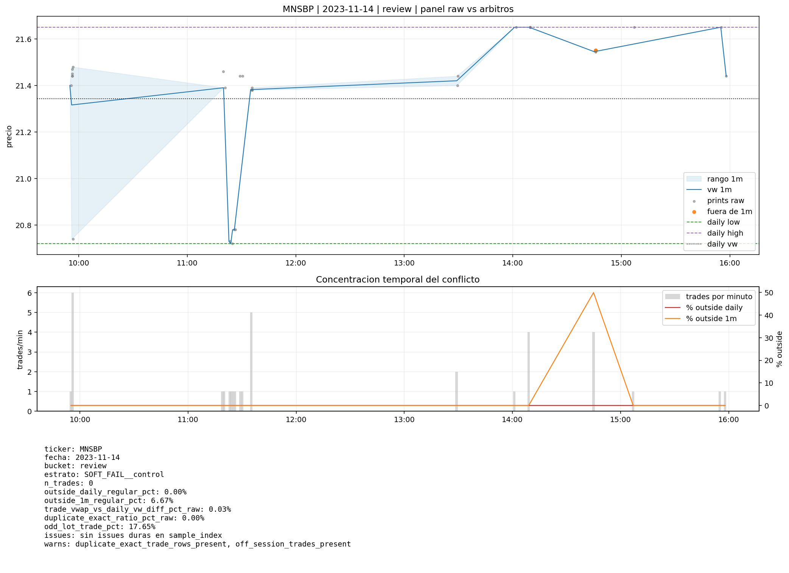

**Que muestra**

- Panel rico del tape raw frente a `daily` y `1m` para `MNSBP` el `2023-11-14`.
- `n_trades = 34`, `outside_daily_regular_pct = 0.00%`, `outside_1m_regular_pct = 6.67%`.
- `trade_vwap_vs_daily_vw_diff_pct_raw = 0.03%`, `duplicate_exact_ratio_pct_raw = 0.00%`, `odd_lot_trade_pct = 17.65%`.

**Responde**

- Residuo de revision no absorbido por una subfamilia mas especifica. Responde a la pregunta de si todavia hace falta una regla de rehabilitacion antes de consumir esta masa.
- Responde a si el conflicto dominante vive en la escala (`~1x`), en la comparabilidad frente a `daily` (0.00%) o frente a `1m` (6.67%).
- La decision que justifica es mantener o no el caso en `recoverable_with_flag` cuando se rematerialice la rehabilitacion sobre `57f`.

### ONL | 2023-11-03

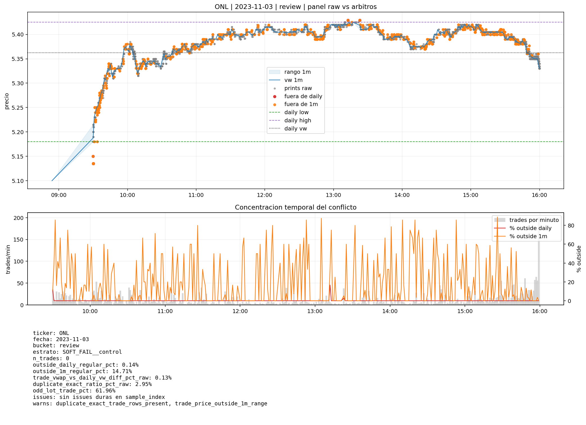

**Que muestra**

- Panel rico del tape raw frente a `daily` y `1m` para `ONL` el `2023-11-03`.
- `n_trades = 4,369`, `outside_daily_regular_pct = 0.14%`, `outside_1m_regular_pct = 14.71%`.
- `trade_vwap_vs_daily_vw_diff_pct_raw = 0.13%`, `duplicate_exact_ratio_pct_raw = 2.95%`, `odd_lot_trade_pct = 61.96%`.

**Responde**

- Residuo de revision no absorbido por una subfamilia mas especifica. Responde a la pregunta de si todavia hace falta una regla de rehabilitacion antes de consumir esta masa.
- Responde a si el conflicto dominante vive en la escala (`~1x`), en la comparabilidad frente a `daily` (0.14%) o frente a `1m` (14.71%).
- El 61.96% de odd-lots empuja la lectura hacia microestructura fina; evita leer el caso como pura ruptura economica gruesa.
- La decision que justifica es mantener o no el caso en `recoverable_with_flag` cuando se rematerialice la rehabilitacion sobre `57f`.

### PRTS | 2025-06-09

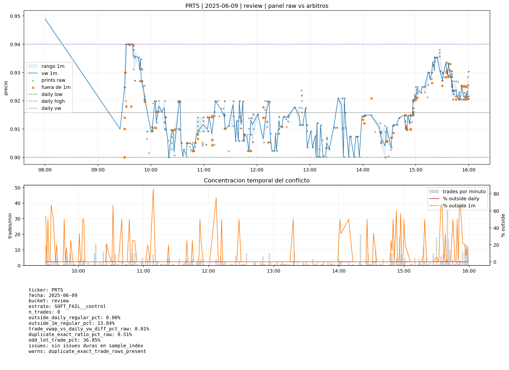

**Que muestra**

- Panel rico del tape raw frente a `daily` y `1m` para `PRTS` el `2025-06-09`.
- `n_trades = 787`, `outside_daily_regular_pct = 0.00%`, `outside_1m_regular_pct = 13.84%`.
- `trade_vwap_vs_daily_vw_diff_pct_raw = 0.01%`, `duplicate_exact_ratio_pct_raw = 0.51%`, `odd_lot_trade_pct = 36.85%`.

**Responde**

- Residuo de revision no absorbido por una subfamilia mas especifica. Responde a la pregunta de si todavia hace falta una regla de rehabilitacion antes de consumir esta masa.
- Responde a si el conflicto dominante vive en la escala (`~1x`), en la comparabilidad frente a `daily` (0.00%) o frente a `1m` (13.84%).
- El 36.85% de odd-lots empuja la lectura hacia microestructura fina; evita leer el caso como pura ruptura economica gruesa.
- La decision que justifica es mantener o no el caso en `recoverable_with_flag` cuando se rematerialice la rehabilitacion sobre `57f`.

### QUOT | 2020-12-08

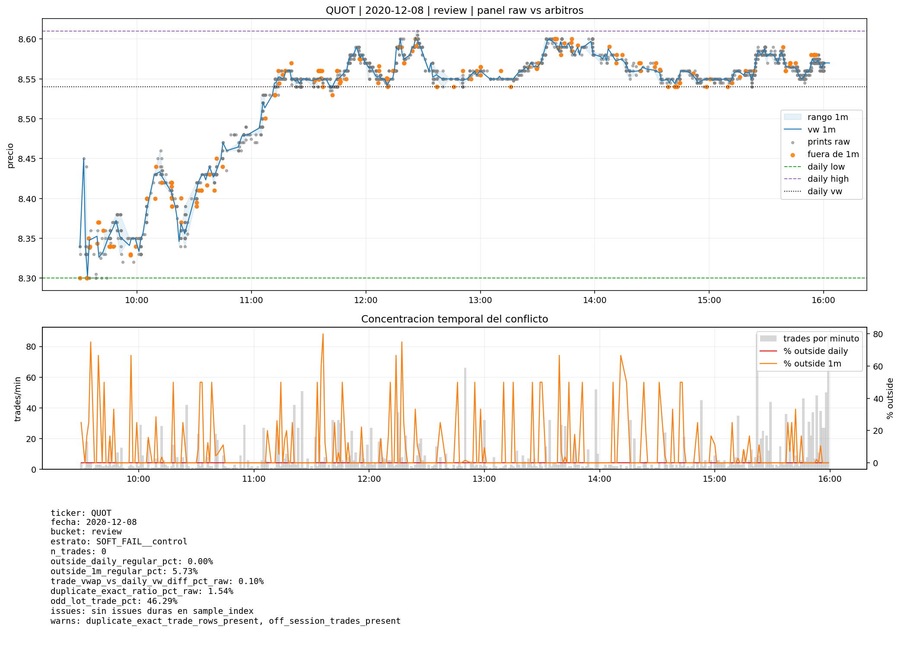

**Que muestra**

- Panel rico del tape raw frente a `daily` y `1m` para `QUOT` el `2020-12-08`.
- `n_trades = 2,925`, `outside_daily_regular_pct = 0.00%`, `outside_1m_regular_pct = 5.73%`.
- `trade_vwap_vs_daily_vw_diff_pct_raw = 0.10%`, `duplicate_exact_ratio_pct_raw = 1.54%`, `odd_lot_trade_pct = 46.29%`.

**Responde**

- Residuo de revision no absorbido por una subfamilia mas especifica. Responde a la pregunta de si todavia hace falta una regla de rehabilitacion antes de consumir esta masa.
- Responde a si el conflicto dominante vive en la escala (`~1x`), en la comparabilidad frente a `daily` (0.00%) o frente a `1m` (5.73%).
- El 46.29% de odd-lots empuja la lectura hacia microestructura fina; evita leer el caso como pura ruptura economica gruesa.
- La decision que justifica es mantener o no el caso en `recoverable_with_flag` cuando se rematerialice la rehabilitacion sobre `57f`.

### RC | 2024-05-24

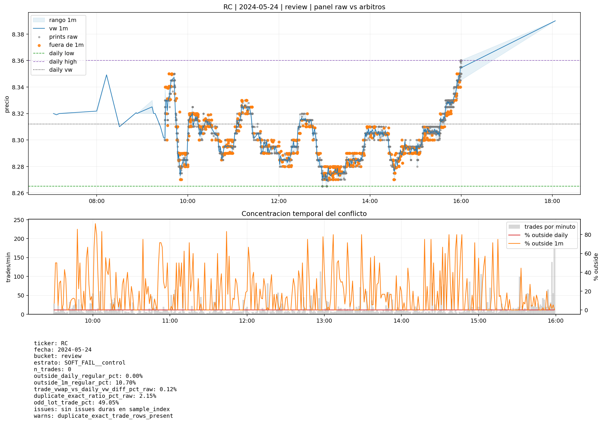

**Que muestra**

- Panel rico del tape raw frente a `daily` y `1m` para `RC` el `2024-05-24`.
- `n_trades = 6,243`, `outside_daily_regular_pct = 0.00%`, `outside_1m_regular_pct = 10.70%`.
- `trade_vwap_vs_daily_vw_diff_pct_raw = 0.12%`, `duplicate_exact_ratio_pct_raw = 2.15%`, `odd_lot_trade_pct = 49.05%`.

**Responde**

- Residuo de revision no absorbido por una subfamilia mas especifica. Responde a la pregunta de si todavia hace falta una regla de rehabilitacion antes de consumir esta masa.
- Responde a si el conflicto dominante vive en la escala (`~1x`), en la comparabilidad frente a `daily` (0.00%) o frente a `1m` (10.70%).
- El 49.05% de odd-lots empuja la lectura hacia microestructura fina; evita leer el caso como pura ruptura economica gruesa.
- La decision que justifica es mantener o no el caso en `recoverable_with_flag` cuando se rematerialice la rehabilitacion sobre `57f`.

### TRX | 2020-10-20

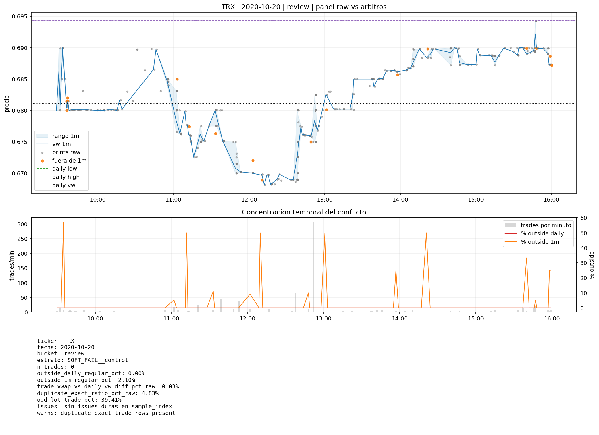

**Que muestra**

- Panel rico del tape raw frente a `daily` y `1m` para `TRX` el `2020-10-20`.
- `n_trades = 911`, `outside_daily_regular_pct = 0.00%`, `outside_1m_regular_pct = 2.10%`.
- `trade_vwap_vs_daily_vw_diff_pct_raw = 0.03%`, `duplicate_exact_ratio_pct_raw = 4.83%`, `odd_lot_trade_pct = 39.41%`.

**Responde**

- Residuo de revision no absorbido por una subfamilia mas especifica. Responde a la pregunta de si todavia hace falta una regla de rehabilitacion antes de consumir esta masa.
- Responde a si el conflicto dominante vive en la escala (`~1x`), en la comparabilidad frente a `daily` (0.00%) o frente a `1m` (2.10%).
- El 39.41% de odd-lots empuja la lectura hacia microestructura fina; evita leer el caso como pura ruptura economica gruesa.
- La decision que justifica es mantener o no el caso en `recoverable_with_flag` cuando se rematerialice la rehabilitacion sobre `57f`.

### URG | 2025-04-28

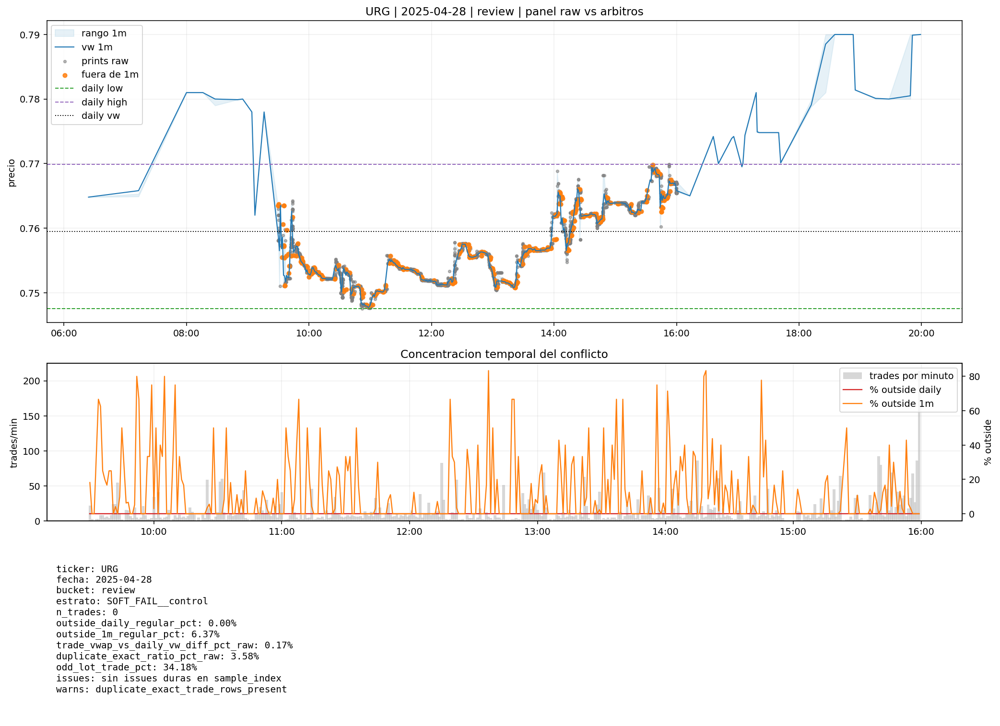

**Que muestra**

- Panel rico del tape raw frente a `daily` y `1m` para `URG` el `2025-04-28`.
- `n_trades = 5,340`, `outside_daily_regular_pct = 0.00%`, `outside_1m_regular_pct = 6.37%`.
- `trade_vwap_vs_daily_vw_diff_pct_raw = 0.17%`, `duplicate_exact_ratio_pct_raw = 3.58%`, `odd_lot_trade_pct = 34.18%`.

**Responde**

- Residuo de revision no absorbido por una subfamilia mas especifica. Responde a la pregunta de si todavia hace falta una regla de rehabilitacion antes de consumir esta masa.
- Responde a si el conflicto dominante vive en la escala (`~1x`), en la comparabilidad frente a `daily` (0.00%) o frente a `1m` (6.37%).
- El 34.18% de odd-lots empuja la lectura hacia microestructura fina; evita leer el caso como pura ruptura economica gruesa.
- La decision que justifica es mantener o no el caso en `recoverable_with_flag` cuando se rematerialice la rehabilitacion sobre `57f`.

### XERS | 2026-02-27

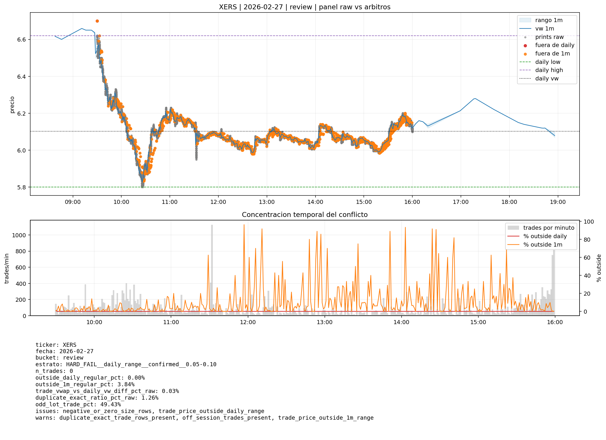

**Que muestra**

- Panel rico del tape raw frente a `daily` y `1m` para `XERS` el `2026-02-27`.
- `n_trades = 34,634`, `outside_daily_regular_pct = 0.00%`, `outside_1m_regular_pct = 3.84%`.
- `trade_vwap_vs_daily_vw_diff_pct_raw = 0.03%`, `duplicate_exact_ratio_pct_raw = 1.26%`, `odd_lot_trade_pct = 49.43%`.

**Responde**

- Residuo de revision no absorbido por una subfamilia mas especifica. Responde a la pregunta de si todavia hace falta una regla de rehabilitacion antes de consumir esta masa.
- Responde a si el conflicto dominante vive en la escala (`~1x`), en la comparabilidad frente a `daily` (0.00%) o frente a `1m` (3.84%).
- El 49.43% de odd-lots empuja la lectura hacia microestructura fina; evita leer el caso como pura ruptura economica gruesa.
- La decision que justifica es mantener o no el caso en `recoverable_with_flag` cuando se rematerialice la rehabilitacion sobre `57f`.

