# Trades Review 1m Reference Alignment | muestra estratificada

## Rol

Este dossier documenta `60` casos de la muestra base del cierre real `57f/full_clean_fast_same_schema` para la familia `review_1m_reference_alignment`.

No son ejemplos elegidos a dedo. Proceden del manifest estratificado reproducible materializado para el inspector.

## Que significa esta familia

Familia donde `1m` cambia la verdad del caso. Responde a la pregunta de si una vista mas fina destruye una aparente normalidad vista desde `daily`.

## Responde

- si el arbitro `1m` cambia la verdad del caso
- si una aparente normalidad diaria es ilusion de agregacion

## No responde

- si el caso habria sido bueno sin arbitro fino
- si el problema es puramente de escala

## Consecuencia

- proteger reconciliacion y labels intradia de falsas rehabilitaciones
- preservar el papel decisivo de `1m`

## Casos

### PMD | 2008-10-14

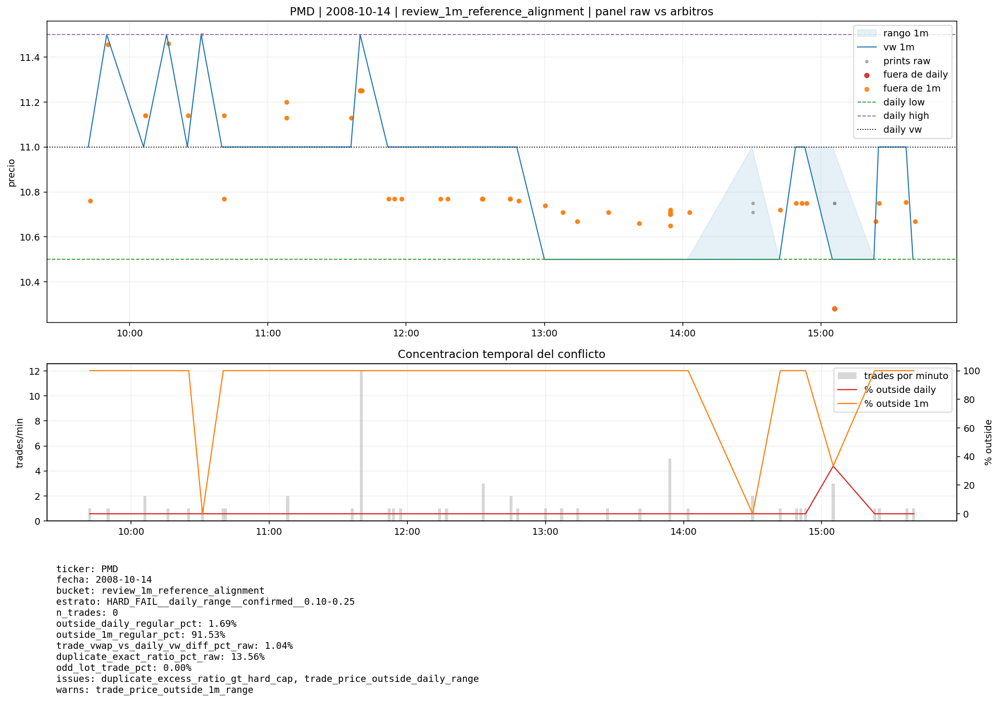

**Que muestra**

- Panel rico del tape raw frente a `daily` y `1m` para `PMD` el `2008-10-14`.
- `n_trades = 59`, `outside_daily_regular_pct = 1.69%`, `outside_1m_regular_pct = 91.53%`.
- `trade_vwap_vs_daily_vw_diff_pct_raw = 1.04%`, `duplicate_exact_ratio_pct_raw = 13.56%`, `odd_lot_trade_pct = 0.00%`.

**Responde**

- Familia donde `1m` cambia la verdad del caso. Responde a la pregunta de si una vista mas fina destruye una aparente normalidad vista desde `daily`.
- Responde a si el conflicto dominante vive en la escala (`~1x`), en la comparabilidad frente a `daily` (1.69%) o frente a `1m` (91.53%).
- El 13.56% de duplicacion exacta obliga a sospechar dano de tape o bursts mecanicos, no solo ruido visual.
- La decision que justifica es mantener o no el caso en `recoverable_with_flag` cuando se rematerialice la rehabilitacion sobre `57f`.

### PMD | 2005-09-01

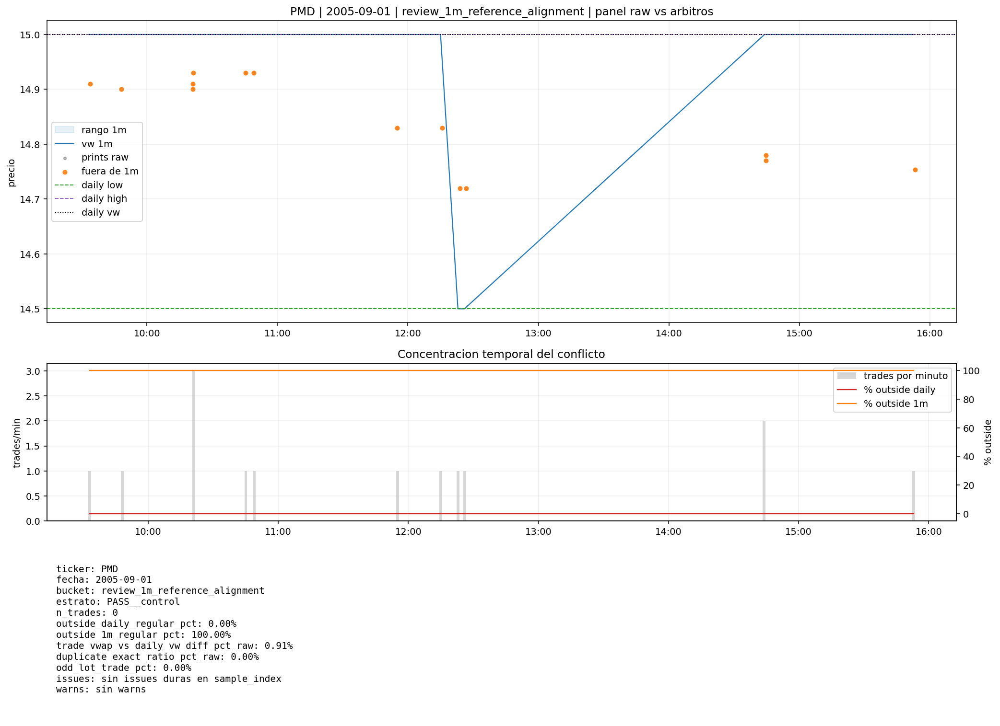

**Que muestra**

- Panel rico del tape raw frente a `daily` y `1m` para `PMD` el `2005-09-01`.
- `n_trades = 14`, `outside_daily_regular_pct = 0.00%`, `outside_1m_regular_pct = 100.00%`.
- `trade_vwap_vs_daily_vw_diff_pct_raw = 0.91%`, `duplicate_exact_ratio_pct_raw = 0.00%`, `odd_lot_trade_pct = 0.00%`.

**Responde**

- Familia donde `1m` cambia la verdad del caso. Responde a la pregunta de si una vista mas fina destruye una aparente normalidad vista desde `daily`.
- Responde a si el conflicto dominante vive en la escala (`~1x`), en la comparabilidad frente a `daily` (0.00%) o frente a `1m` (100.00%).
- La decision que justifica es mantener o no el caso en `recoverable_with_flag` cuando se rematerialice la rehabilitacion sobre `57f`.

### PMD | 2010-06-02

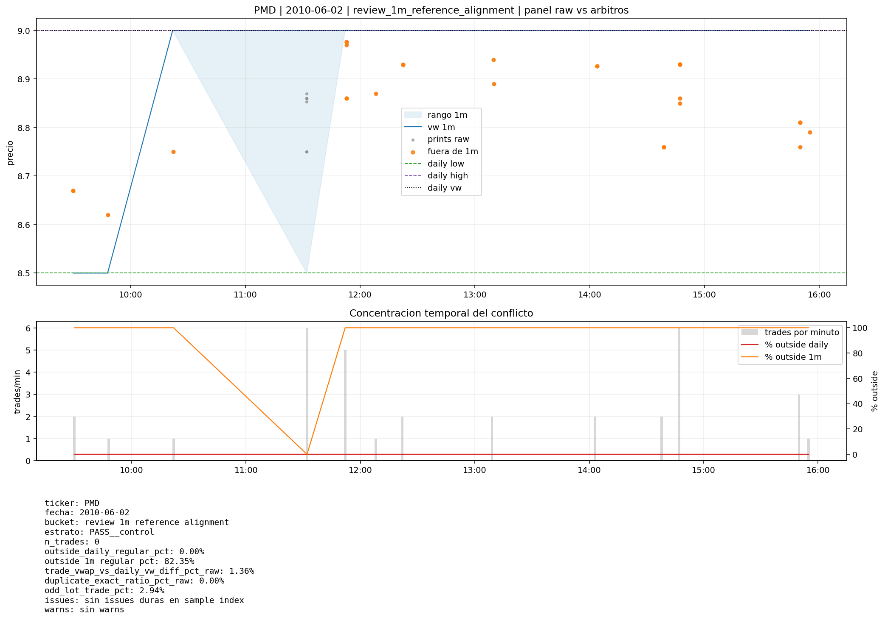

**Que muestra**

- Panel rico del tape raw frente a `daily` y `1m` para `PMD` el `2010-06-02`.
- `n_trades = 34`, `outside_daily_regular_pct = 0.00%`, `outside_1m_regular_pct = 82.35%`.
- `trade_vwap_vs_daily_vw_diff_pct_raw = 1.36%`, `duplicate_exact_ratio_pct_raw = 0.00%`, `odd_lot_trade_pct = 2.94%`.

**Responde**

- Familia donde `1m` cambia la verdad del caso. Responde a la pregunta de si una vista mas fina destruye una aparente normalidad vista desde `daily`.
- Responde a si el conflicto dominante vive en la escala (`~1x`), en la comparabilidad frente a `daily` (0.00%) o frente a `1m` (82.35%).
- La decision que justifica es mantener o no el caso en `recoverable_with_flag` cuando se rematerialice la rehabilitacion sobre `57f`.

### PMD | 2010-06-03

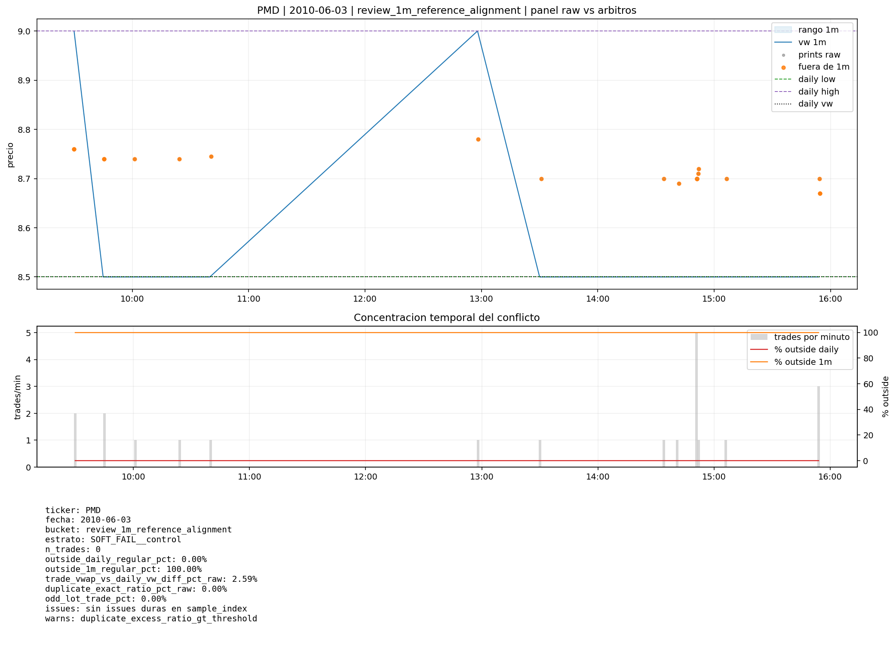

**Que muestra**

- Panel rico del tape raw frente a `daily` y `1m` para `PMD` el `2010-06-03`.
- `n_trades = 21`, `outside_daily_regular_pct = 0.00%`, `outside_1m_regular_pct = 100.00%`.
- `trade_vwap_vs_daily_vw_diff_pct_raw = 2.59%`, `duplicate_exact_ratio_pct_raw = 0.00%`, `odd_lot_trade_pct = 0.00%`.

**Responde**

- Familia donde `1m` cambia la verdad del caso. Responde a la pregunta de si una vista mas fina destruye una aparente normalidad vista desde `daily`.
- Responde a si el conflicto dominante vive en la escala (`~1x`), en la comparabilidad frente a `daily` (0.00%) o frente a `1m` (100.00%).
- La decision que justifica es mantener o no el caso en `recoverable_with_flag` cuando se rematerialice la rehabilitacion sobre `57f`.

### PMD | 2012-05-22

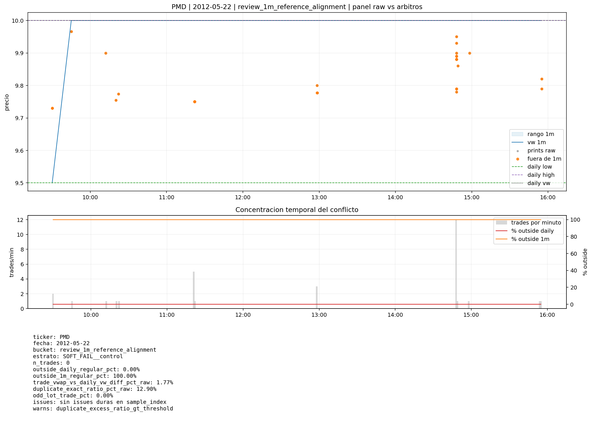

**Que muestra**

- Panel rico del tape raw frente a `daily` y `1m` para `PMD` el `2012-05-22`.
- `n_trades = 31`, `outside_daily_regular_pct = 0.00%`, `outside_1m_regular_pct = 100.00%`.
- `trade_vwap_vs_daily_vw_diff_pct_raw = 1.77%`, `duplicate_exact_ratio_pct_raw = 12.90%`, `odd_lot_trade_pct = 0.00%`.

**Responde**

- Familia donde `1m` cambia la verdad del caso. Responde a la pregunta de si una vista mas fina destruye una aparente normalidad vista desde `daily`.
- Responde a si el conflicto dominante vive en la escala (`~1x`), en la comparabilidad frente a `daily` (0.00%) o frente a `1m` (100.00%).
- El 12.90% de duplicacion exacta obliga a sospechar dano de tape o bursts mecanicos, no solo ruido visual.
- La decision que justifica es mantener o no el caso en `recoverable_with_flag` cuando se rematerialice la rehabilitacion sobre `57f`.

### PMD | 2012-07-20

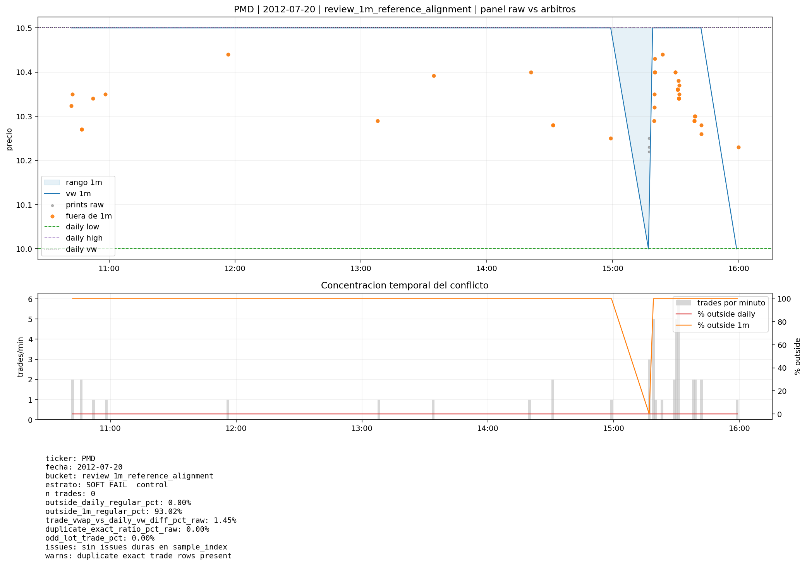

**Que muestra**

- Panel rico del tape raw frente a `daily` y `1m` para `PMD` el `2012-07-20`.
- `n_trades = 43`, `outside_daily_regular_pct = 0.00%`, `outside_1m_regular_pct = 93.02%`.
- `trade_vwap_vs_daily_vw_diff_pct_raw = 1.45%`, `duplicate_exact_ratio_pct_raw = 0.00%`, `odd_lot_trade_pct = 0.00%`.

**Responde**

- Familia donde `1m` cambia la verdad del caso. Responde a la pregunta de si una vista mas fina destruye una aparente normalidad vista desde `daily`.
- Responde a si el conflicto dominante vive en la escala (`~1x`), en la comparabilidad frente a `daily` (0.00%) o frente a `1m` (93.02%).
- La decision que justifica es mantener o no el caso en `recoverable_with_flag` cuando se rematerialice la rehabilitacion sobre `57f`.

### PMD | 2009-01-13

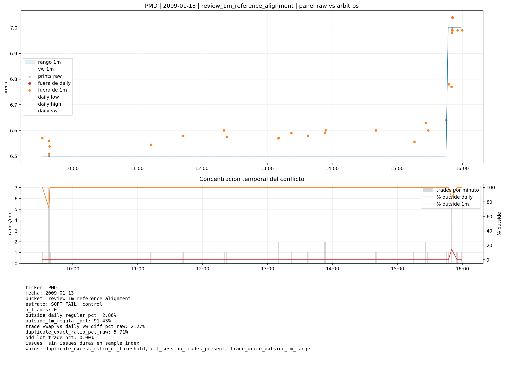

**Que muestra**

- Panel rico del tape raw frente a `daily` y `1m` para `PMD` el `2009-01-13`.
- `n_trades = 35`, `outside_daily_regular_pct = 2.86%`, `outside_1m_regular_pct = 91.43%`.
- `trade_vwap_vs_daily_vw_diff_pct_raw = 2.27%`, `duplicate_exact_ratio_pct_raw = 5.71%`, `odd_lot_trade_pct = 0.00%`.

**Responde**

- Familia donde `1m` cambia la verdad del caso. Responde a la pregunta de si una vista mas fina destruye una aparente normalidad vista desde `daily`.
- Responde a si el conflicto dominante vive en la escala (`~1x`), en la comparabilidad frente a `daily` (2.86%) o frente a `1m` (91.43%).
- El 5.71% de duplicacion exacta obliga a sospechar dano de tape o bursts mecanicos, no solo ruido visual.
- La decision que justifica es mantener o no el caso en `recoverable_with_flag` cuando se rematerialice la rehabilitacion sobre `57f`.

### GPRK | 2015-07-21

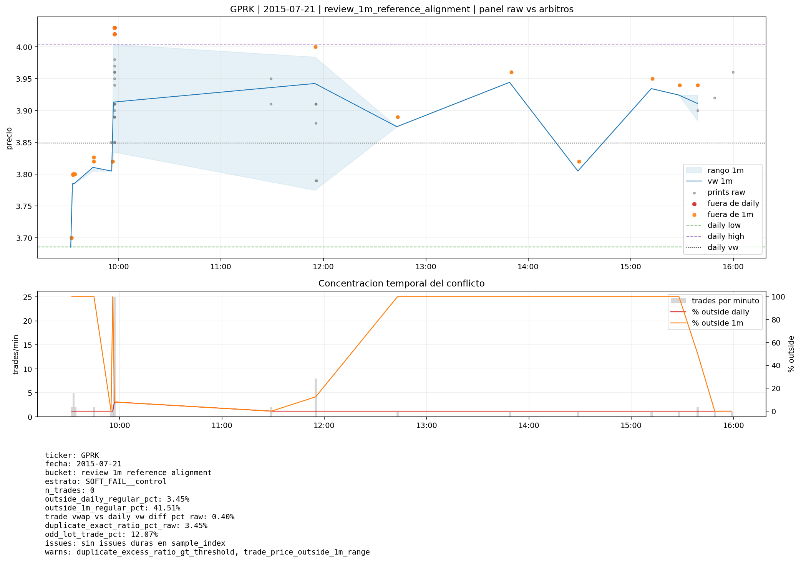

**Que muestra**

- Panel rico del tape raw frente a `daily` y `1m` para `GPRK` el `2015-07-21`.
- `n_trades = 58`, `outside_daily_regular_pct = 3.45%`, `outside_1m_regular_pct = 41.51%`.
- `trade_vwap_vs_daily_vw_diff_pct_raw = 0.40%`, `duplicate_exact_ratio_pct_raw = 3.45%`, `odd_lot_trade_pct = 12.07%`.

**Responde**

- Familia donde `1m` cambia la verdad del caso. Responde a la pregunta de si una vista mas fina destruye una aparente normalidad vista desde `daily`.
- Responde a si el conflicto dominante vive en la escala (`~1x`), en la comparabilidad frente a `daily` (3.45%) o frente a `1m` (41.51%).
- La decision que justifica es mantener o no el caso en `recoverable_with_flag` cuando se rematerialice la rehabilitacion sobre `57f`.

### QBAK | 2017-06-30

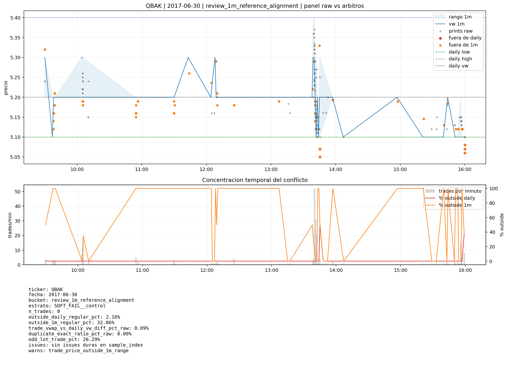

**Que muestra**

- Panel rico del tape raw frente a `daily` y `1m` para `QBAK` el `2017-06-30`.
- `n_trades = 232`, `outside_daily_regular_pct = 2.16%`, `outside_1m_regular_pct = 32.86%`.
- `trade_vwap_vs_daily_vw_diff_pct_raw = 0.09%`, `duplicate_exact_ratio_pct_raw = 0.00%`, `odd_lot_trade_pct = 26.29%`.

**Responde**

- Familia donde `1m` cambia la verdad del caso. Responde a la pregunta de si una vista mas fina destruye una aparente normalidad vista desde `daily`.
- Responde a si el conflicto dominante vive en la escala (`~1x`), en la comparabilidad frente a `daily` (2.16%) o frente a `1m` (32.86%).
- El 26.29% de odd-lots empuja la lectura hacia microestructura fina; evita leer el caso como pura ruptura economica gruesa.
- La decision que justifica es mantener o no el caso en `recoverable_with_flag` cuando se rematerialice la rehabilitacion sobre `57f`.

### QBAK | 2017-07-25

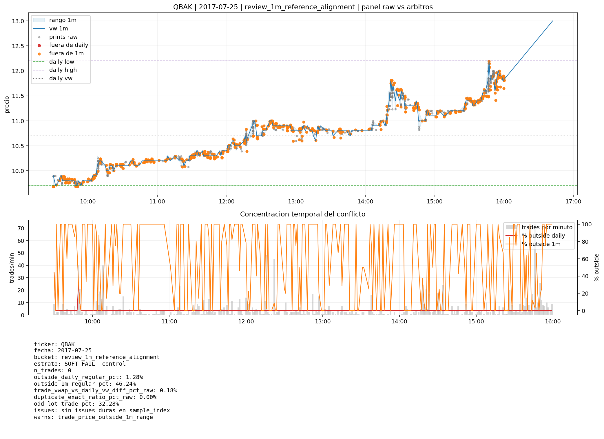

**Que muestra**

- Panel rico del tape raw frente a `daily` y `1m` para `QBAK` el `2017-07-25`.
- `n_trades = 1,484`, `outside_daily_regular_pct = 1.28%`, `outside_1m_regular_pct = 46.24%`.
- `trade_vwap_vs_daily_vw_diff_pct_raw = 0.18%`, `duplicate_exact_ratio_pct_raw = 0.00%`, `odd_lot_trade_pct = 32.28%`.

**Responde**

- Familia donde `1m` cambia la verdad del caso. Responde a la pregunta de si una vista mas fina destruye una aparente normalidad vista desde `daily`.
- Responde a si el conflicto dominante vive en la escala (`~1x`), en la comparabilidad frente a `daily` (1.28%) o frente a `1m` (46.24%).
- El 32.28% de odd-lots empuja la lectura hacia microestructura fina; evita leer el caso como pura ruptura economica gruesa.
- La decision que justifica es mantener o no el caso en `recoverable_with_flag` cuando se rematerialice la rehabilitacion sobre `57f`.

### FLGT | 2018-07-03

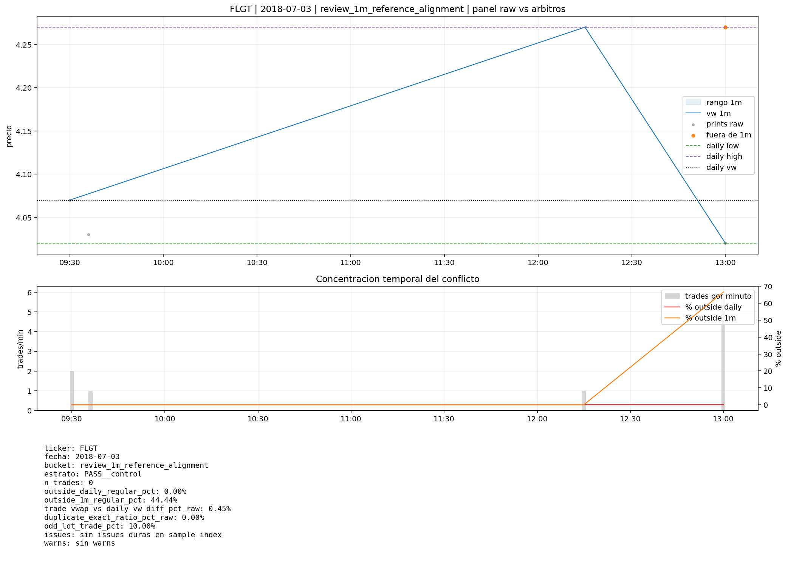

**Que muestra**

- Panel rico del tape raw frente a `daily` y `1m` para `FLGT` el `2018-07-03`.
- `n_trades = 10`, `outside_daily_regular_pct = 0.00%`, `outside_1m_regular_pct = 44.44%`.
- `trade_vwap_vs_daily_vw_diff_pct_raw = 0.45%`, `duplicate_exact_ratio_pct_raw = 0.00%`, `odd_lot_trade_pct = 10.00%`.

**Responde**

- Familia donde `1m` cambia la verdad del caso. Responde a la pregunta de si una vista mas fina destruye una aparente normalidad vista desde `daily`.
- Responde a si el conflicto dominante vive en la escala (`~1x`), en la comparabilidad frente a `daily` (0.00%) o frente a `1m` (44.44%).
- La decision que justifica es mantener o no el caso en `recoverable_with_flag` cuando se rematerialice la rehabilitacion sobre `57f`.

### GPRK | 2015-04-14

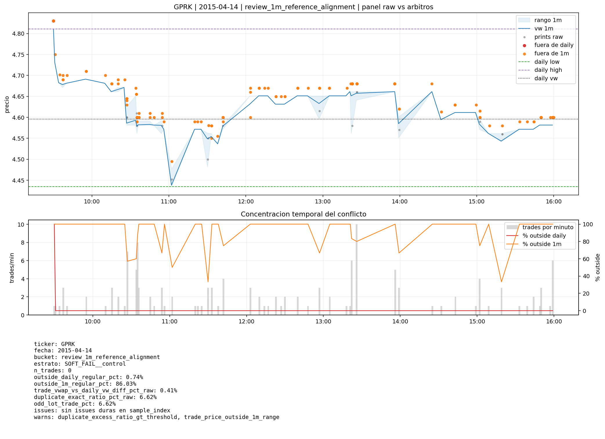

**Que muestra**

- Panel rico del tape raw frente a `daily` y `1m` para `GPRK` el `2015-04-14`.
- `n_trades = 136`, `outside_daily_regular_pct = 0.74%`, `outside_1m_regular_pct = 86.03%`.
- `trade_vwap_vs_daily_vw_diff_pct_raw = 0.41%`, `duplicate_exact_ratio_pct_raw = 6.62%`, `odd_lot_trade_pct = 6.62%`.

**Responde**

- Familia donde `1m` cambia la verdad del caso. Responde a la pregunta de si una vista mas fina destruye una aparente normalidad vista desde `daily`.
- Responde a si el conflicto dominante vive en la escala (`~1x`), en la comparabilidad frente a `daily` (0.74%) o frente a `1m` (86.03%).
- El 6.62% de duplicacion exacta obliga a sospechar dano de tape o bursts mecanicos, no solo ruido visual.
- La decision que justifica es mantener o no el caso en `recoverable_with_flag` cuando se rematerialice la rehabilitacion sobre `57f`.

### GPRK | 2016-08-16

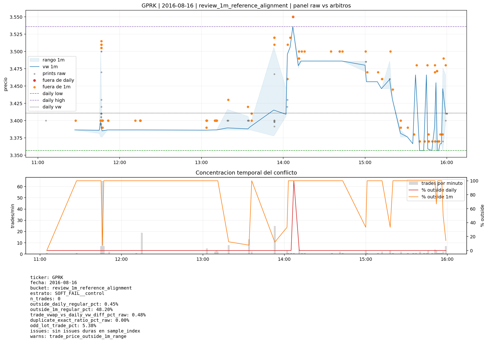

**Que muestra**

- Panel rico del tape raw frente a `daily` y `1m` para `GPRK` el `2016-08-16`.
- `n_trades = 223`, `outside_daily_regular_pct = 0.45%`, `outside_1m_regular_pct = 48.20%`.
- `trade_vwap_vs_daily_vw_diff_pct_raw = 0.48%`, `duplicate_exact_ratio_pct_raw = 0.00%`, `odd_lot_trade_pct = 5.38%`.

**Responde**

- Familia donde `1m` cambia la verdad del caso. Responde a la pregunta de si una vista mas fina destruye una aparente normalidad vista desde `daily`.
- Responde a si el conflicto dominante vive en la escala (`~1x`), en la comparabilidad frente a `daily` (0.45%) o frente a `1m` (48.20%).
- La decision que justifica es mantener o no el caso en `recoverable_with_flag` cuando se rematerialice la rehabilitacion sobre `57f`.

### GPRK | 2018-08-06

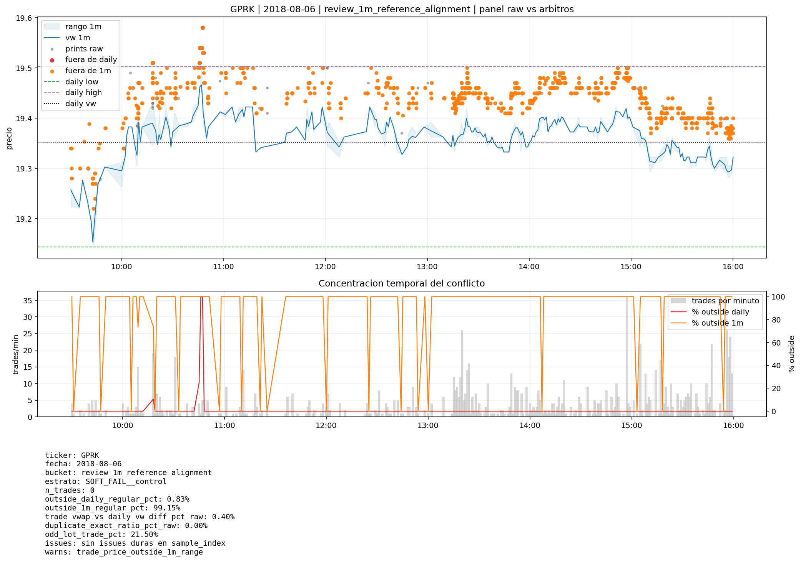

**Que muestra**

- Panel rico del tape raw frente a `daily` y `1m` para `GPRK` el `2018-08-06`.
- `n_trades = 1,079`, `outside_daily_regular_pct = 0.83%`, `outside_1m_regular_pct = 99.15%`.
- `trade_vwap_vs_daily_vw_diff_pct_raw = 0.40%`, `duplicate_exact_ratio_pct_raw = 0.00%`, `odd_lot_trade_pct = 21.50%`.

**Responde**

- Familia donde `1m` cambia la verdad del caso. Responde a la pregunta de si una vista mas fina destruye una aparente normalidad vista desde `daily`.
- Responde a si el conflicto dominante vive en la escala (`~1x`), en la comparabilidad frente a `daily` (0.83%) o frente a `1m` (99.15%).
- La decision que justifica es mantener o no el caso en `recoverable_with_flag` cuando se rematerialice la rehabilitacion sobre `57f`.

### PMD | 2013-10-10

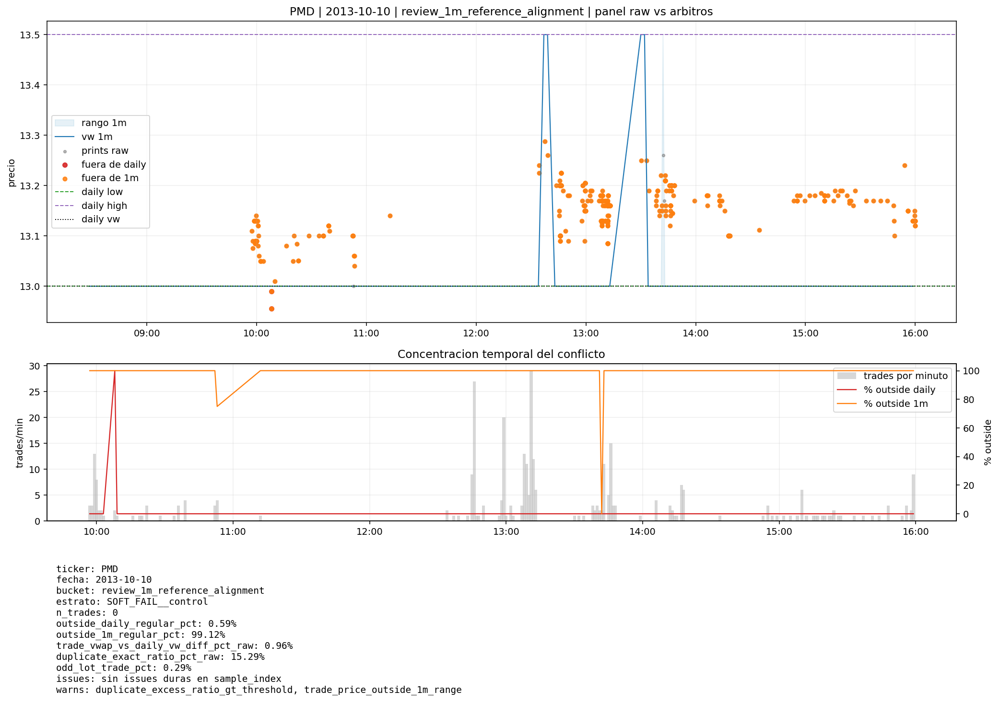

**Que muestra**

- Panel rico del tape raw frente a `daily` y `1m` para `PMD` el `2013-10-10`.
- `n_trades = 340`, `outside_daily_regular_pct = 0.59%`, `outside_1m_regular_pct = 99.12%`.
- `trade_vwap_vs_daily_vw_diff_pct_raw = 0.96%`, `duplicate_exact_ratio_pct_raw = 15.29%`, `odd_lot_trade_pct = 0.29%`.

**Responde**

- Familia donde `1m` cambia la verdad del caso. Responde a la pregunta de si una vista mas fina destruye una aparente normalidad vista desde `daily`.
- Responde a si el conflicto dominante vive en la escala (`~1x`), en la comparabilidad frente a `daily` (0.59%) o frente a `1m` (99.12%).
- El 15.29% de duplicacion exacta obliga a sospechar dano de tape o bursts mecanicos, no solo ruido visual.
- La decision que justifica es mantener o no el caso en `recoverable_with_flag` cuando se rematerialice la rehabilitacion sobre `57f`.

### PMD | 2014-10-01

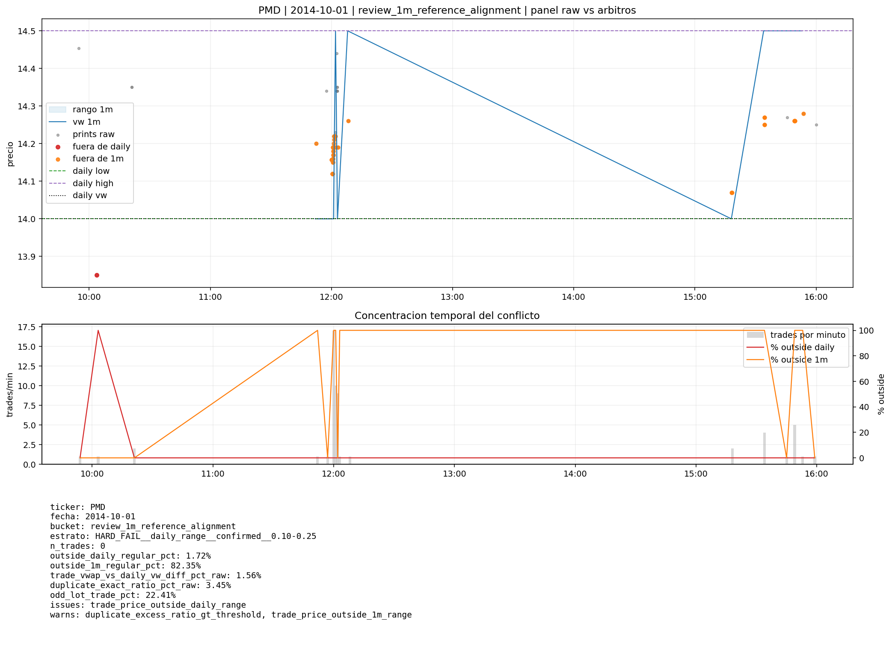

**Que muestra**

- Panel rico del tape raw frente a `daily` y `1m` para `PMD` el `2014-10-01`.
- `n_trades = 58`, `outside_daily_regular_pct = 1.72%`, `outside_1m_regular_pct = 82.35%`.
- `trade_vwap_vs_daily_vw_diff_pct_raw = 1.56%`, `duplicate_exact_ratio_pct_raw = 3.45%`, `odd_lot_trade_pct = 22.41%`.

**Responde**

- Familia donde `1m` cambia la verdad del caso. Responde a la pregunta de si una vista mas fina destruye una aparente normalidad vista desde `daily`.
- Responde a si el conflicto dominante vive en la escala (`~1x`), en la comparabilidad frente a `daily` (1.72%) o frente a `1m` (82.35%).
- La decision que justifica es mantener o no el caso en `recoverable_with_flag` cuando se rematerialice la rehabilitacion sobre `57f`.

### PMD | 2016-03-23

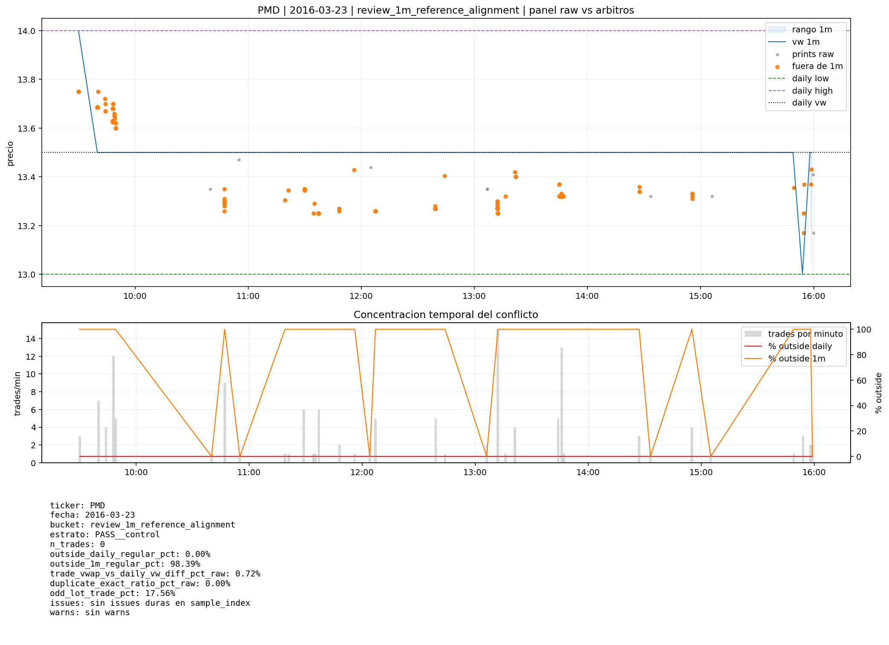

**Que muestra**

- Panel rico del tape raw frente a `daily` y `1m` para `PMD` el `2016-03-23`.
- `n_trades = 131`, `outside_daily_regular_pct = 0.00%`, `outside_1m_regular_pct = 98.39%`.
- `trade_vwap_vs_daily_vw_diff_pct_raw = 0.72%`, `duplicate_exact_ratio_pct_raw = 0.00%`, `odd_lot_trade_pct = 17.56%`.

**Responde**

- Familia donde `1m` cambia la verdad del caso. Responde a la pregunta de si una vista mas fina destruye una aparente normalidad vista desde `daily`.
- Responde a si el conflicto dominante vive en la escala (`~1x`), en la comparabilidad frente a `daily` (0.00%) o frente a `1m` (98.39%).
- La decision que justifica es mantener o no el caso en `recoverable_with_flag` cuando se rematerialice la rehabilitacion sobre `57f`.

### QBAK | 2018-06-12

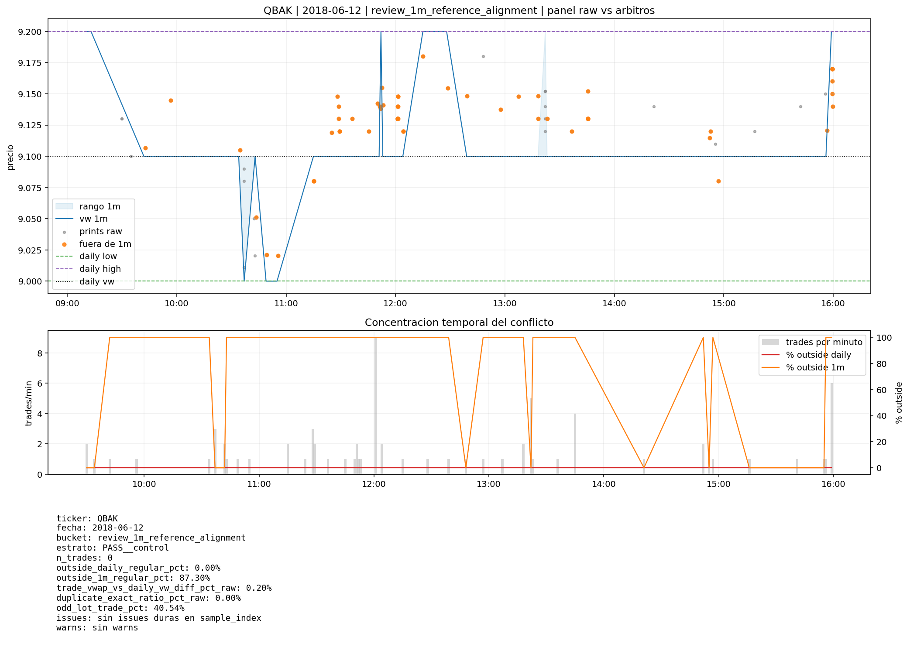

**Que muestra**

- Panel rico del tape raw frente a `daily` y `1m` para `QBAK` el `2018-06-12`.
- `n_trades = 74`, `outside_daily_regular_pct = 0.00%`, `outside_1m_regular_pct = 87.30%`.
- `trade_vwap_vs_daily_vw_diff_pct_raw = 0.20%`, `duplicate_exact_ratio_pct_raw = 0.00%`, `odd_lot_trade_pct = 40.54%`.

**Responde**

- Familia donde `1m` cambia la verdad del caso. Responde a la pregunta de si una vista mas fina destruye una aparente normalidad vista desde `daily`.
- Responde a si el conflicto dominante vive en la escala (`~1x`), en la comparabilidad frente a `daily` (0.00%) o frente a `1m` (87.30%).
- El 40.54% de odd-lots empuja la lectura hacia microestructura fina; evita leer el caso como pura ruptura economica gruesa.
- La decision que justifica es mantener o no el caso en `recoverable_with_flag` cuando se rematerialice la rehabilitacion sobre `57f`.

### QBAK | 2018-09-05

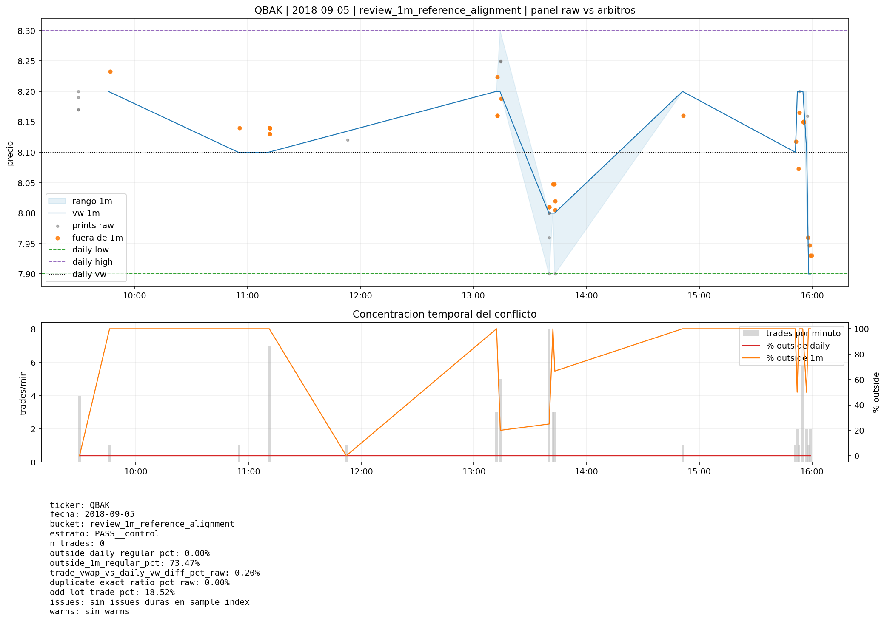

**Que muestra**

- Panel rico del tape raw frente a `daily` y `1m` para `QBAK` el `2018-09-05`.
- `n_trades = 54`, `outside_daily_regular_pct = 0.00%`, `outside_1m_regular_pct = 73.47%`.
- `trade_vwap_vs_daily_vw_diff_pct_raw = 0.20%`, `duplicate_exact_ratio_pct_raw = 0.00%`, `odd_lot_trade_pct = 18.52%`.

**Responde**

- Familia donde `1m` cambia la verdad del caso. Responde a la pregunta de si una vista mas fina destruye una aparente normalidad vista desde `daily`.
- Responde a si el conflicto dominante vive en la escala (`~1x`), en la comparabilidad frente a `daily` (0.00%) o frente a `1m` (73.47%).
- La decision que justifica es mantener o no el caso en `recoverable_with_flag` cuando se rematerialice la rehabilitacion sobre `57f`.

### QBAK | 2018-09-06

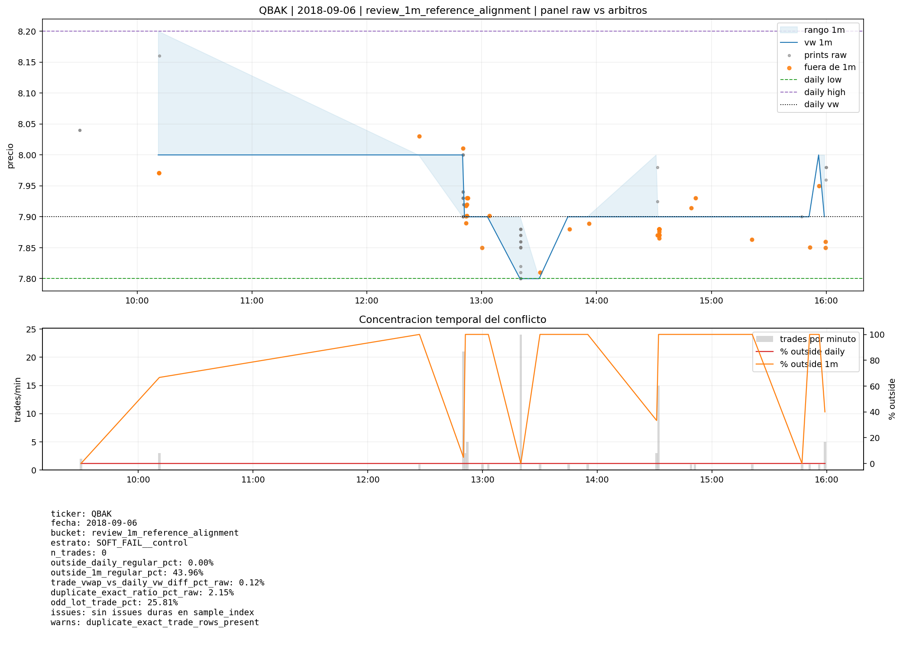

**Que muestra**

- Panel rico del tape raw frente a `daily` y `1m` para `QBAK` el `2018-09-06`.
- `n_trades = 93`, `outside_daily_regular_pct = 0.00%`, `outside_1m_regular_pct = 43.96%`.
- `trade_vwap_vs_daily_vw_diff_pct_raw = 0.12%`, `duplicate_exact_ratio_pct_raw = 2.15%`, `odd_lot_trade_pct = 25.81%`.

**Responde**

- Familia donde `1m` cambia la verdad del caso. Responde a la pregunta de si una vista mas fina destruye una aparente normalidad vista desde `daily`.
- Responde a si el conflicto dominante vive en la escala (`~1x`), en la comparabilidad frente a `daily` (0.00%) o frente a `1m` (43.96%).
- El 25.81% de odd-lots empuja la lectura hacia microestructura fina; evita leer el caso como pura ruptura economica gruesa.
- La decision que justifica es mantener o no el caso en `recoverable_with_flag` cuando se rematerialice la rehabilitacion sobre `57f`.

### QBAK | 2018-12-13

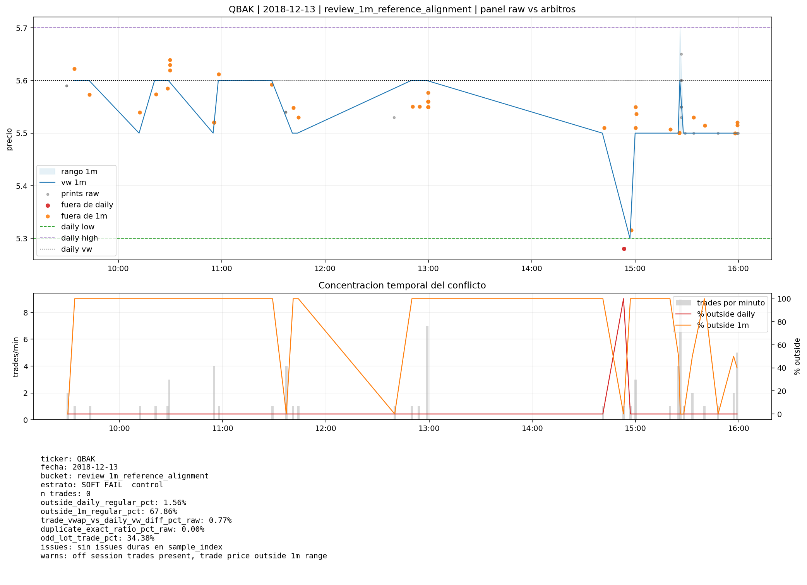

**Que muestra**

- Panel rico del tape raw frente a `daily` y `1m` para `QBAK` el `2018-12-13`.
- `n_trades = 64`, `outside_daily_regular_pct = 1.56%`, `outside_1m_regular_pct = 67.86%`.
- `trade_vwap_vs_daily_vw_diff_pct_raw = 0.77%`, `duplicate_exact_ratio_pct_raw = 0.00%`, `odd_lot_trade_pct = 34.38%`.

**Responde**

- Familia donde `1m` cambia la verdad del caso. Responde a la pregunta de si una vista mas fina destruye una aparente normalidad vista desde `daily`.
- Responde a si el conflicto dominante vive en la escala (`~1x`), en la comparabilidad frente a `daily` (1.56%) o frente a `1m` (67.86%).
- El 34.38% de odd-lots empuja la lectura hacia microestructura fina; evita leer el caso como pura ruptura economica gruesa.
- La decision que justifica es mantener o no el caso en `recoverable_with_flag` cuando se rematerialice la rehabilitacion sobre `57f`.

### RELV | 2017-03-10

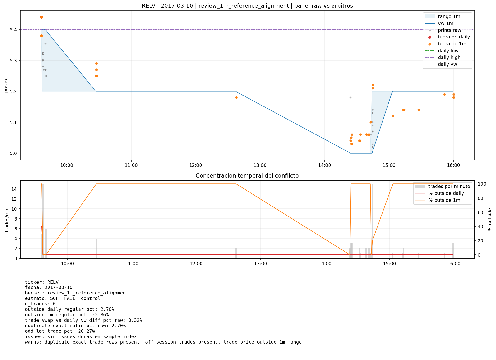

**Que muestra**

- Panel rico del tape raw frente a `daily` y `1m` para `RELV` el `2017-03-10`.
- `n_trades = 74`, `outside_daily_regular_pct = 2.70%`, `outside_1m_regular_pct = 52.86%`.
- `trade_vwap_vs_daily_vw_diff_pct_raw = 0.32%`, `duplicate_exact_ratio_pct_raw = 2.70%`, `odd_lot_trade_pct = 20.27%`.

**Responde**

- Familia donde `1m` cambia la verdad del caso. Responde a la pregunta de si una vista mas fina destruye una aparente normalidad vista desde `daily`.
- Responde a si el conflicto dominante vive en la escala (`~1x`), en la comparabilidad frente a `daily` (2.70%) o frente a `1m` (52.86%).
- La decision que justifica es mantener o no el caso en `recoverable_with_flag` cuando se rematerialice la rehabilitacion sobre `57f`.

### GPRK | 2014-04-22

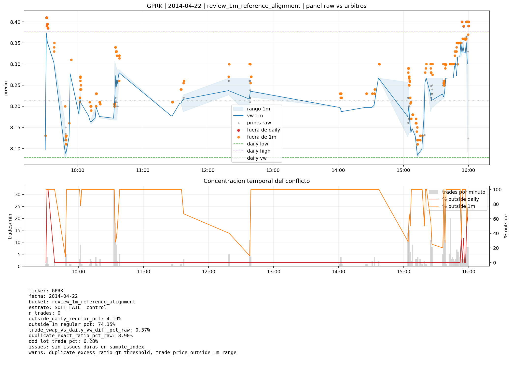

**Que muestra**

- Panel rico del tape raw frente a `daily` y `1m` para `GPRK` el `2014-04-22`.
- `n_trades = 382`, `outside_daily_regular_pct = 4.19%`, `outside_1m_regular_pct = 74.35%`.
- `trade_vwap_vs_daily_vw_diff_pct_raw = 0.37%`, `duplicate_exact_ratio_pct_raw = 8.90%`, `odd_lot_trade_pct = 6.28%`.

**Responde**

- Familia donde `1m` cambia la verdad del caso. Responde a la pregunta de si una vista mas fina destruye una aparente normalidad vista desde `daily`.
- Responde a si el conflicto dominante vive en la escala (`~1x`), en la comparabilidad frente a `daily` (4.19%) o frente a `1m` (74.35%).
- El 8.90% de duplicacion exacta obliga a sospechar dano de tape o bursts mecanicos, no solo ruido visual.
- La decision que justifica es mantener o no el caso en `recoverable_with_flag` cuando se rematerialice la rehabilitacion sobre `57f`.

### GPRK | 2014-10-06

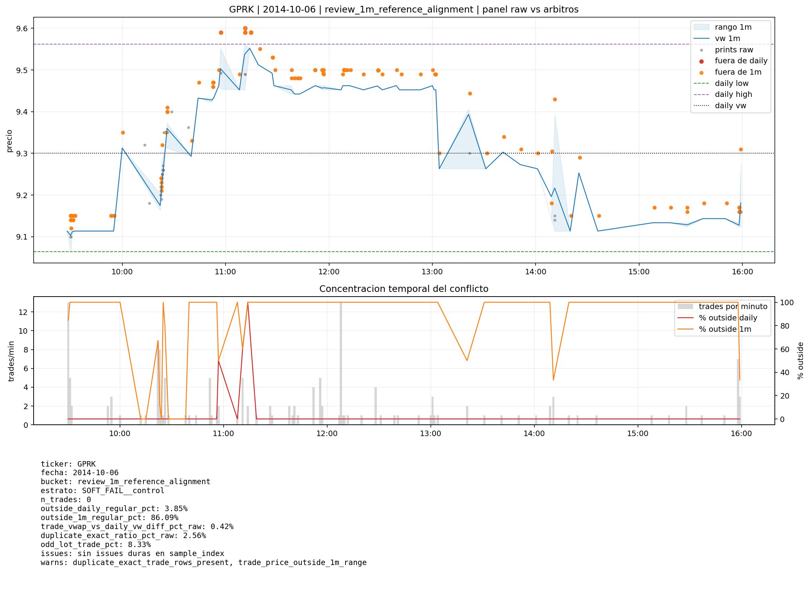

**Que muestra**

- Panel rico del tape raw frente a `daily` y `1m` para `GPRK` el `2014-10-06`.
- `n_trades = 156`, `outside_daily_regular_pct = 3.85%`, `outside_1m_regular_pct = 86.09%`.
- `trade_vwap_vs_daily_vw_diff_pct_raw = 0.42%`, `duplicate_exact_ratio_pct_raw = 2.56%`, `odd_lot_trade_pct = 8.33%`.

**Responde**

- Familia donde `1m` cambia la verdad del caso. Responde a la pregunta de si una vista mas fina destruye una aparente normalidad vista desde `daily`.
- Responde a si el conflicto dominante vive en la escala (`~1x`), en la comparabilidad frente a `daily` (3.85%) o frente a `1m` (86.09%).
- La decision que justifica es mantener o no el caso en `recoverable_with_flag` cuando se rematerialice la rehabilitacion sobre `57f`.

### GPRK | 2018-07-23

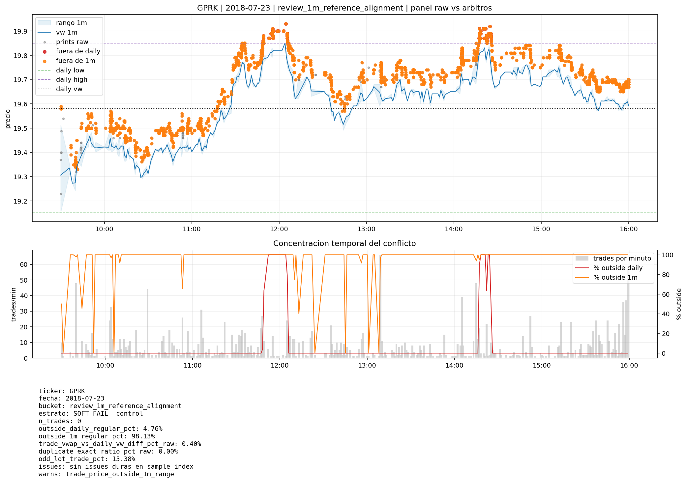

**Que muestra**

- Panel rico del tape raw frente a `daily` y `1m` para `GPRK` el `2018-07-23`.
- `n_trades = 2,100`, `outside_daily_regular_pct = 4.76%`, `outside_1m_regular_pct = 98.13%`.
- `trade_vwap_vs_daily_vw_diff_pct_raw = 0.40%`, `duplicate_exact_ratio_pct_raw = 0.00%`, `odd_lot_trade_pct = 15.38%`.

**Responde**

- Familia donde `1m` cambia la verdad del caso. Responde a la pregunta de si una vista mas fina destruye una aparente normalidad vista desde `daily`.
- Responde a si el conflicto dominante vive en la escala (`~1x`), en la comparabilidad frente a `daily` (4.76%) o frente a `1m` (98.13%).
- La decision que justifica es mantener o no el caso en `recoverable_with_flag` cuando se rematerialice la rehabilitacion sobre `57f`.

### GPRK | 2018-11-16

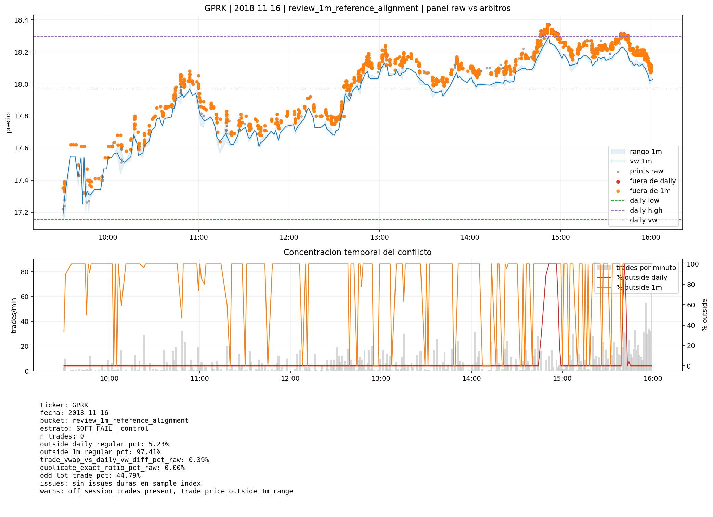

**Que muestra**

- Panel rico del tape raw frente a `daily` y `1m` para `GPRK` el `2018-11-16`.
- `n_trades = 2,331`, `outside_daily_regular_pct = 5.23%`, `outside_1m_regular_pct = 97.41%`.
- `trade_vwap_vs_daily_vw_diff_pct_raw = 0.39%`, `duplicate_exact_ratio_pct_raw = 0.00%`, `odd_lot_trade_pct = 44.79%`.

**Responde**

- Familia donde `1m` cambia la verdad del caso. Responde a la pregunta de si una vista mas fina destruye una aparente normalidad vista desde `daily`.
- Responde a si el conflicto dominante vive en la escala (`~1x`), en la comparabilidad frente a `daily` (5.23%) o frente a `1m` (97.41%).
- El 44.79% de odd-lots empuja la lectura hacia microestructura fina; evita leer el caso como pura ruptura economica gruesa.
- La decision que justifica es mantener o no el caso en `recoverable_with_flag` cuando se rematerialice la rehabilitacion sobre `57f`.

### METC | 2017-05-12

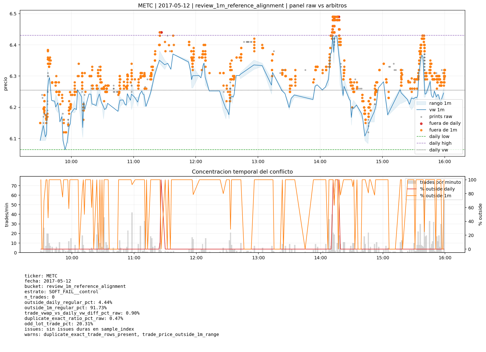

**Que muestra**

- Panel rico del tape raw frente a `daily` y `1m` para `METC` el `2017-05-12`.
- `n_trades = 1,689`, `outside_daily_regular_pct = 4.44%`, `outside_1m_regular_pct = 91.73%`.
- `trade_vwap_vs_daily_vw_diff_pct_raw = 0.90%`, `duplicate_exact_ratio_pct_raw = 0.47%`, `odd_lot_trade_pct = 20.31%`.

**Responde**

- Familia donde `1m` cambia la verdad del caso. Responde a la pregunta de si una vista mas fina destruye una aparente normalidad vista desde `daily`.
- Responde a si el conflicto dominante vive en la escala (`~1x`), en la comparabilidad frente a `daily` (4.44%) o frente a `1m` (91.73%).
- La decision que justifica es mantener o no el caso en `recoverable_with_flag` cuando se rematerialice la rehabilitacion sobre `57f`.

### AIM | 2020-09-01

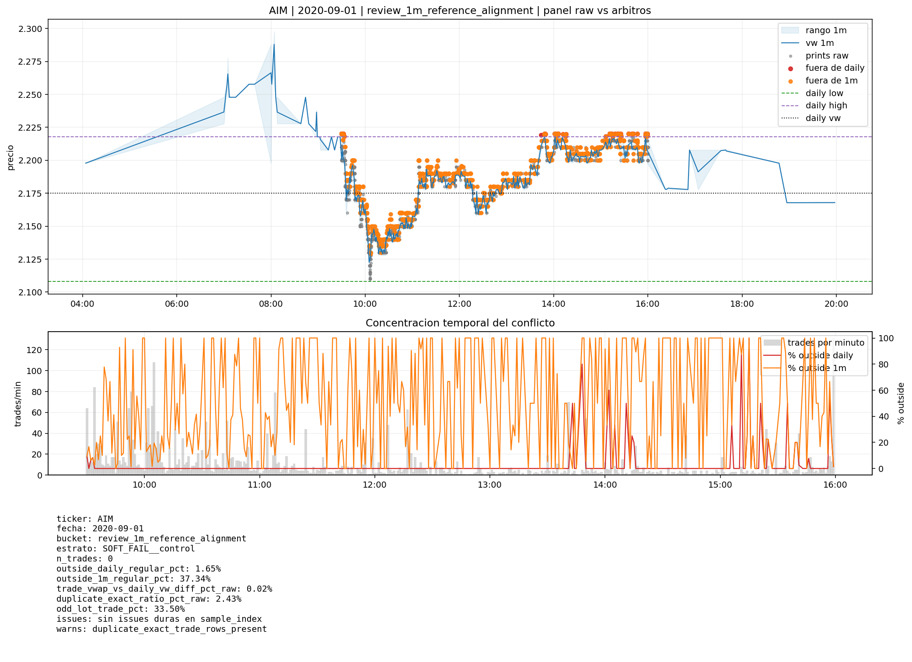

**Que muestra**

- Panel rico del tape raw frente a `daily` y `1m` para `AIM` el `2020-09-01`.
- `n_trades = 3,707`, `outside_daily_regular_pct = 1.65%`, `outside_1m_regular_pct = 37.34%`.
- `trade_vwap_vs_daily_vw_diff_pct_raw = 0.02%`, `duplicate_exact_ratio_pct_raw = 2.43%`, `odd_lot_trade_pct = 33.50%`.

**Responde**

- Familia donde `1m` cambia la verdad del caso. Responde a la pregunta de si una vista mas fina destruye una aparente normalidad vista desde `daily`.
- Responde a si el conflicto dominante vive en la escala (`~1x`), en la comparabilidad frente a `daily` (1.65%) o frente a `1m` (37.34%).
- El 33.50% de odd-lots empuja la lectura hacia microestructura fina; evita leer el caso como pura ruptura economica gruesa.
- La decision que justifica es mantener o no el caso en `recoverable_with_flag` cuando se rematerialice la rehabilitacion sobre `57f`.

### AIM | 2022-07-12

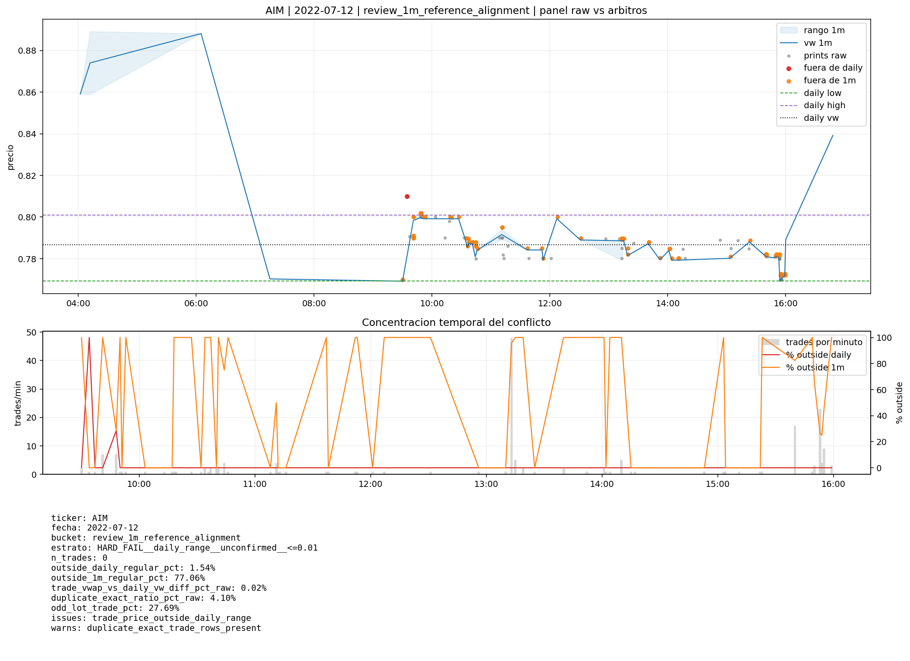

**Que muestra**

- Panel rico del tape raw frente a `daily` y `1m` para `AIM` el `2022-07-12`.
- `n_trades = 195`, `outside_daily_regular_pct = 1.54%`, `outside_1m_regular_pct = 77.06%`.
- `trade_vwap_vs_daily_vw_diff_pct_raw = 0.02%`, `duplicate_exact_ratio_pct_raw = 4.10%`, `odd_lot_trade_pct = 27.69%`.

**Responde**

- Familia donde `1m` cambia la verdad del caso. Responde a la pregunta de si una vista mas fina destruye una aparente normalidad vista desde `daily`.
- Responde a si el conflicto dominante vive en la escala (`~1x`), en la comparabilidad frente a `daily` (1.54%) o frente a `1m` (77.06%).
- El 27.69% de odd-lots empuja la lectura hacia microestructura fina; evita leer el caso como pura ruptura economica gruesa.
- La decision que justifica es mantener o no el caso en `recoverable_with_flag` cuando se rematerialice la rehabilitacion sobre `57f`.

### AIM | 2022-09-22

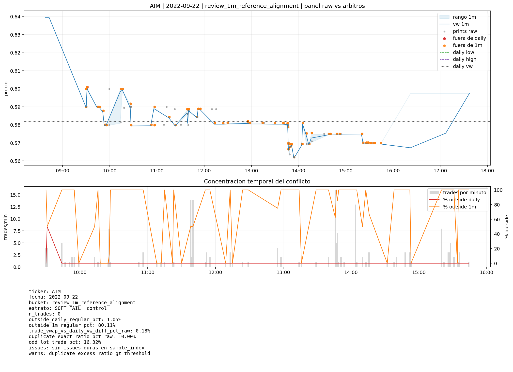

**Que muestra**

- Panel rico del tape raw frente a `daily` y `1m` para `AIM` el `2022-09-22`.
- `n_trades = 190`, `outside_daily_regular_pct = 1.05%`, `outside_1m_regular_pct = 80.11%`.
- `trade_vwap_vs_daily_vw_diff_pct_raw = 0.18%`, `duplicate_exact_ratio_pct_raw = 10.00%`, `odd_lot_trade_pct = 16.32%`.

**Responde**

- Familia donde `1m` cambia la verdad del caso. Responde a la pregunta de si una vista mas fina destruye una aparente normalidad vista desde `daily`.
- Responde a si el conflicto dominante vive en la escala (`~1x`), en la comparabilidad frente a `daily` (1.05%) o frente a `1m` (80.11%).
- El 10.00% de duplicacion exacta obliga a sospechar dano de tape o bursts mecanicos, no solo ruido visual.
- La decision que justifica es mantener o no el caso en `recoverable_with_flag` cuando se rematerialice la rehabilitacion sobre `57f`.

### AIM | 2019-12-17

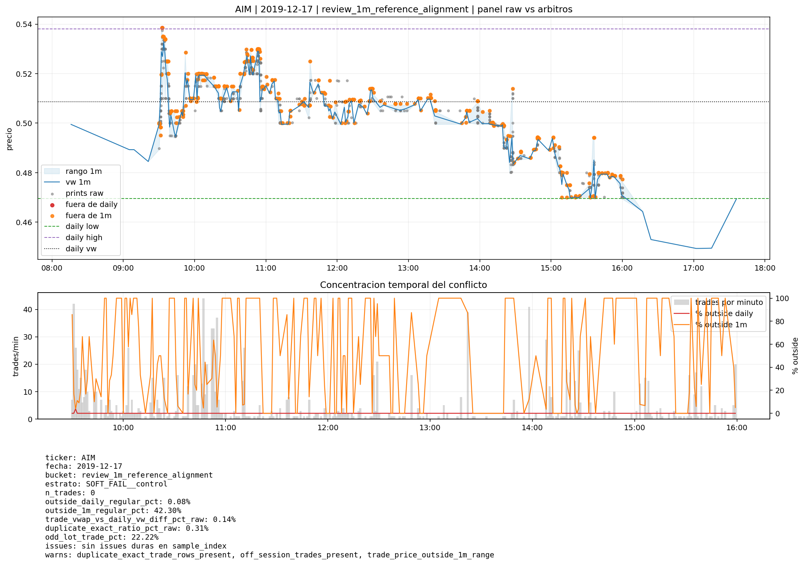

**Que muestra**

- Panel rico del tape raw frente a `daily` y `1m` para `AIM` el `2019-12-17`.
- `n_trades = 1,296`, `outside_daily_regular_pct = 0.08%`, `outside_1m_regular_pct = 42.30%`.
- `trade_vwap_vs_daily_vw_diff_pct_raw = 0.14%`, `duplicate_exact_ratio_pct_raw = 0.31%`, `odd_lot_trade_pct = 22.22%`.

**Responde**

- Familia donde `1m` cambia la verdad del caso. Responde a la pregunta de si una vista mas fina destruye una aparente normalidad vista desde `daily`.
- Responde a si el conflicto dominante vive en la escala (`~1x`), en la comparabilidad frente a `daily` (0.08%) o frente a `1m` (42.30%).
- La decision que justifica es mantener o no el caso en `recoverable_with_flag` cuando se rematerialice la rehabilitacion sobre `57f`.

### AIM | 2021-10-29

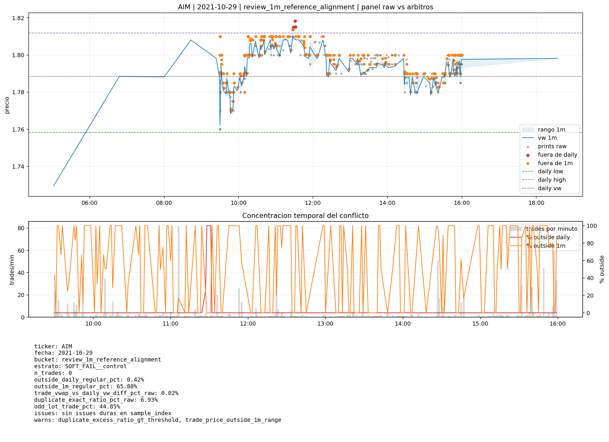

**Que muestra**

- Panel rico del tape raw frente a `daily` y `1m` para `AIM` el `2021-10-29`.
- `n_trades = 952`, `outside_daily_regular_pct = 0.42%`, `outside_1m_regular_pct = 65.80%`.
- `trade_vwap_vs_daily_vw_diff_pct_raw = 0.02%`, `duplicate_exact_ratio_pct_raw = 6.93%`, `odd_lot_trade_pct = 44.85%`.

**Responde**

- Familia donde `1m` cambia la verdad del caso. Responde a la pregunta de si una vista mas fina destruye una aparente normalidad vista desde `daily`.
- Responde a si el conflicto dominante vive en la escala (`~1x`), en la comparabilidad frente a `daily` (0.42%) o frente a `1m` (65.80%).
- El 44.85% de odd-lots empuja la lectura hacia microestructura fina; evita leer el caso como pura ruptura economica gruesa.
- El 6.93% de duplicacion exacta obliga a sospechar dano de tape o bursts mecanicos, no solo ruido visual.
- La decision que justifica es mantener o no el caso en `recoverable_with_flag` cuando se rematerialice la rehabilitacion sobre `57f`.

### AIM | 2021-11-19

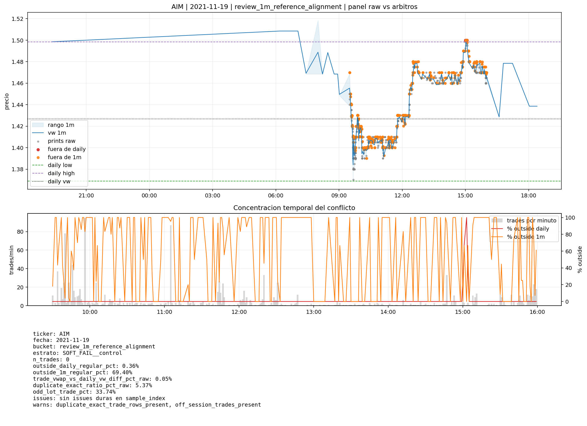

**Que muestra**

- Panel rico del tape raw frente a `daily` y `1m` para `AIM` el `2021-11-19`.
- `n_trades = 1,378`, `outside_daily_regular_pct = 0.36%`, `outside_1m_regular_pct = 69.40%`.
- `trade_vwap_vs_daily_vw_diff_pct_raw = 0.05%`, `duplicate_exact_ratio_pct_raw = 5.37%`, `odd_lot_trade_pct = 33.74%`.

**Responde**

- Familia donde `1m` cambia la verdad del caso. Responde a la pregunta de si una vista mas fina destruye una aparente normalidad vista desde `daily`.
- Responde a si el conflicto dominante vive en la escala (`~1x`), en la comparabilidad frente a `daily` (0.36%) o frente a `1m` (69.40%).
- El 33.74% de odd-lots empuja la lectura hacia microestructura fina; evita leer el caso como pura ruptura economica gruesa.
- El 5.37% de duplicacion exacta obliga a sospechar dano de tape o bursts mecanicos, no solo ruido visual.
- La decision que justifica es mantener o no el caso en `recoverable_with_flag` cuando se rematerialice la rehabilitacion sobre `57f`.

### AIM | 2022-02-24

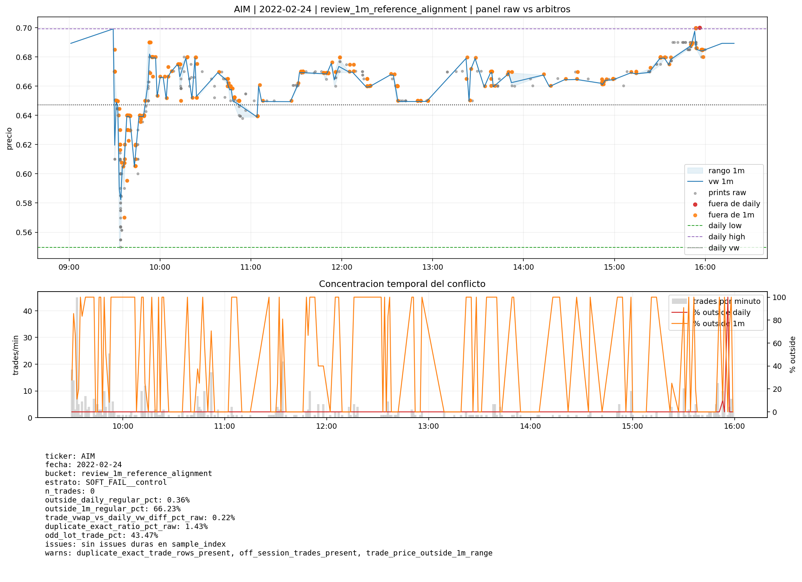

**Que muestra**

- Panel rico del tape raw frente a `daily` y `1m` para `AIM` el `2022-02-24`.
- `n_trades = 559`, `outside_daily_regular_pct = 0.36%`, `outside_1m_regular_pct = 66.23%`.
- `trade_vwap_vs_daily_vw_diff_pct_raw = 0.22%`, `duplicate_exact_ratio_pct_raw = 1.43%`, `odd_lot_trade_pct = 43.47%`.

**Responde**

- Familia donde `1m` cambia la verdad del caso. Responde a la pregunta de si una vista mas fina destruye una aparente normalidad vista desde `daily`.
- Responde a si el conflicto dominante vive en la escala (`~1x`), en la comparabilidad frente a `daily` (0.36%) o frente a `1m` (66.23%).
- El 43.47% de odd-lots empuja la lectura hacia microestructura fina; evita leer el caso como pura ruptura economica gruesa.
- La decision que justifica es mantener o no el caso en `recoverable_with_flag` cuando se rematerialice la rehabilitacion sobre `57f`.

### AIM | 2023-03-10

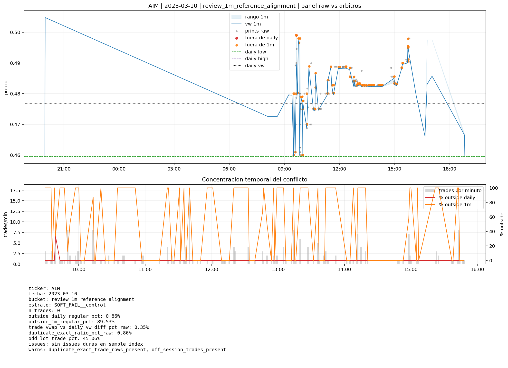

**Que muestra**

- Panel rico del tape raw frente a `daily` y `1m` para `AIM` el `2023-03-10`.
- `n_trades = 233`, `outside_daily_regular_pct = 0.86%`, `outside_1m_regular_pct = 89.53%`.
- `trade_vwap_vs_daily_vw_diff_pct_raw = 0.35%`, `duplicate_exact_ratio_pct_raw = 0.86%`, `odd_lot_trade_pct = 45.06%`.

**Responde**

- Familia donde `1m` cambia la verdad del caso. Responde a la pregunta de si una vista mas fina destruye una aparente normalidad vista desde `daily`.
- Responde a si el conflicto dominante vive en la escala (`~1x`), en la comparabilidad frente a `daily` (0.86%) o frente a `1m` (89.53%).
- El 45.06% de odd-lots empuja la lectura hacia microestructura fina; evita leer el caso como pura ruptura economica gruesa.
- La decision que justifica es mantener o no el caso en `recoverable_with_flag` cuando se rematerialice la rehabilitacion sobre `57f`.

### AIM | 2023-06-30

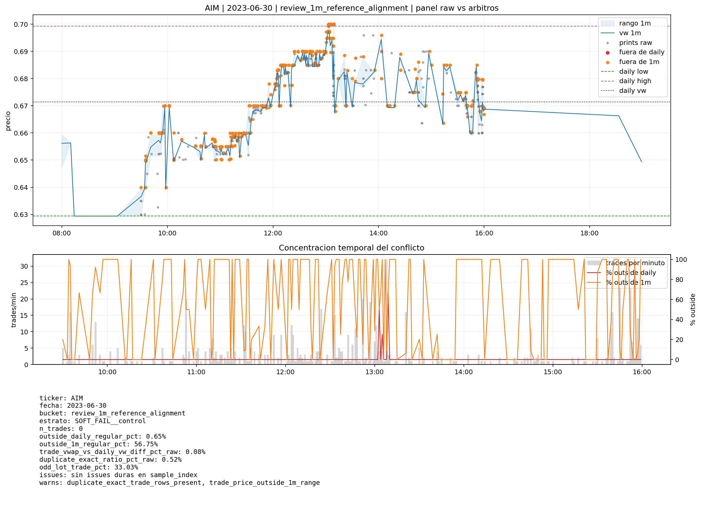

**Que muestra**

- Panel rico del tape raw frente a `daily` y `1m` para `AIM` el `2023-06-30`.
- `n_trades = 766`, `outside_daily_regular_pct = 0.65%`, `outside_1m_regular_pct = 56.75%`.
- `trade_vwap_vs_daily_vw_diff_pct_raw = 0.08%`, `duplicate_exact_ratio_pct_raw = 0.52%`, `odd_lot_trade_pct = 33.03%`.

**Responde**

- Familia donde `1m` cambia la verdad del caso. Responde a la pregunta de si una vista mas fina destruye una aparente normalidad vista desde `daily`.
- Responde a si el conflicto dominante vive en la escala (`~1x`), en la comparabilidad frente a `daily` (0.65%) o frente a `1m` (56.75%).
- El 33.03% de odd-lots empuja la lectura hacia microestructura fina; evita leer el caso como pura ruptura economica gruesa.
- La decision que justifica es mantener o no el caso en `recoverable_with_flag` cuando se rematerialice la rehabilitacion sobre `57f`.

### AIM | 2023-08-09

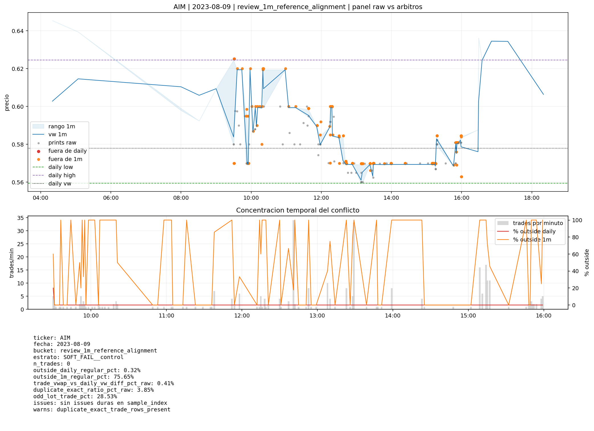

**Que muestra**

- Panel rico del tape raw frente a `daily` y `1m` para `AIM` el `2023-08-09`.
- `n_trades = 312`, `outside_daily_regular_pct = 0.32%`, `outside_1m_regular_pct = 75.65%`.
- `trade_vwap_vs_daily_vw_diff_pct_raw = 0.41%`, `duplicate_exact_ratio_pct_raw = 3.85%`, `odd_lot_trade_pct = 28.53%`.

**Responde**

- Familia donde `1m` cambia la verdad del caso. Responde a la pregunta de si una vista mas fina destruye una aparente normalidad vista desde `daily`.
- Responde a si el conflicto dominante vive en la escala (`~1x`), en la comparabilidad frente a `daily` (0.32%) o frente a `1m` (75.65%).
- El 28.53% de odd-lots empuja la lectura hacia microestructura fina; evita leer el caso como pura ruptura economica gruesa.
- La decision que justifica es mantener o no el caso en `recoverable_with_flag` cuando se rematerialice la rehabilitacion sobre `57f`.

### AIM | 2025-10-27

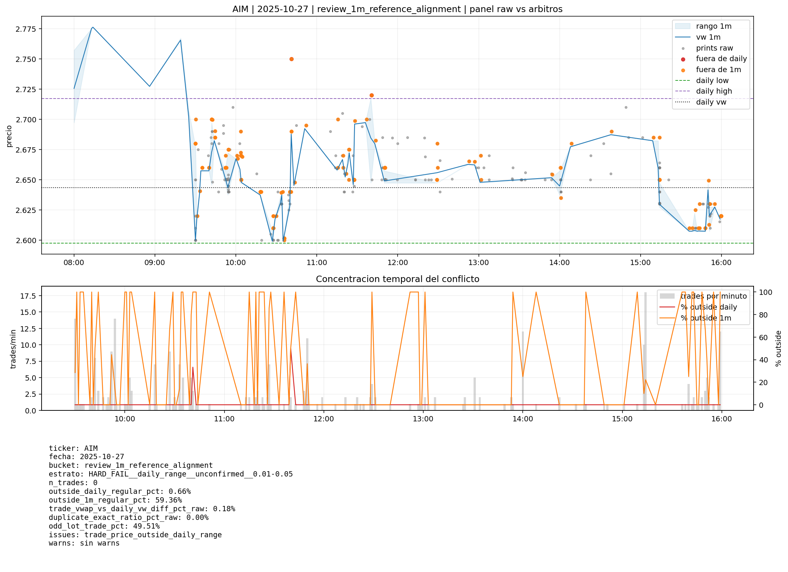

**Que muestra**

- Panel rico del tape raw frente a `daily` y `1m` para `AIM` el `2025-10-27`.
- `n_trades = 305`, `outside_daily_regular_pct = 0.66%`, `outside_1m_regular_pct = 59.36%`.
- `trade_vwap_vs_daily_vw_diff_pct_raw = 0.18%`, `duplicate_exact_ratio_pct_raw = 0.00%`, `odd_lot_trade_pct = 49.51%`.

**Responde**

- Familia donde `1m` cambia la verdad del caso. Responde a la pregunta de si una vista mas fina destruye una aparente normalidad vista desde `daily`.
- Responde a si el conflicto dominante vive en la escala (`~1x`), en la comparabilidad frente a `daily` (0.66%) o frente a `1m` (59.36%).
- El 49.51% de odd-lots empuja la lectura hacia microestructura fina; evita leer el caso como pura ruptura economica gruesa.
- La decision que justifica es mantener o no el caso en `recoverable_with_flag` cuando se rematerialice la rehabilitacion sobre `57f`.

### DTCK | 2023-09-26

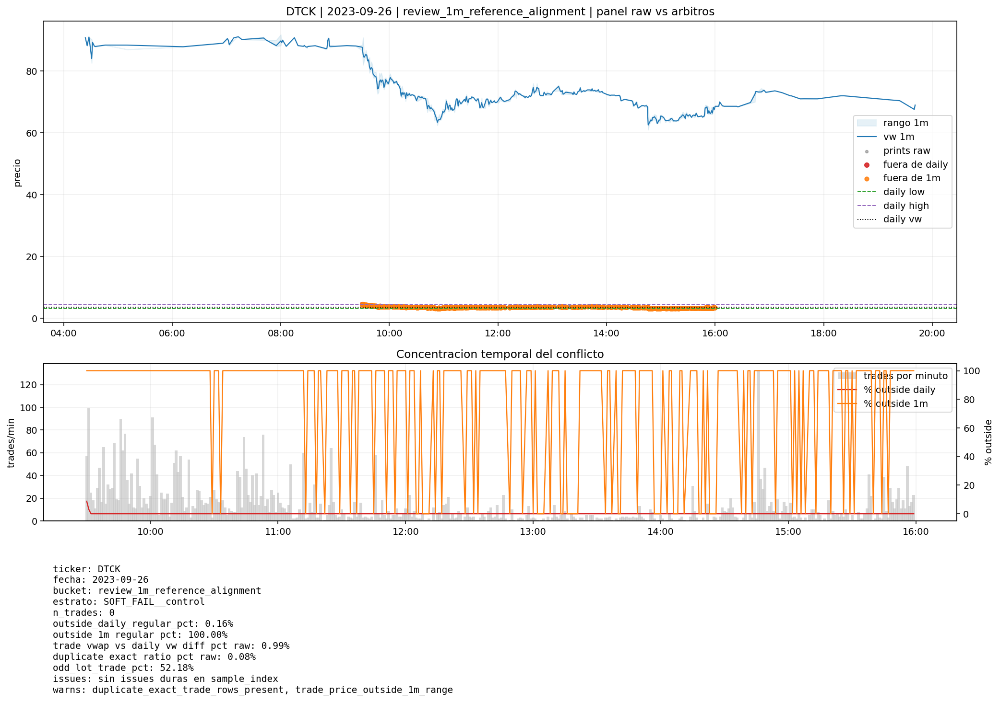

**Que muestra**

- Panel rico del tape raw frente a `daily` y `1m` para `DTCK` el `2023-09-26`.
- `n_trades = 4,904`, `outside_daily_regular_pct = 0.16%`, `outside_1m_regular_pct = 100.00%`.
- `trade_vwap_vs_daily_vw_diff_pct_raw = 0.99%`, `duplicate_exact_ratio_pct_raw = 0.08%`, `odd_lot_trade_pct = 52.18%`.

**Responde**

- Familia donde `1m` cambia la verdad del caso. Responde a la pregunta de si una vista mas fina destruye una aparente normalidad vista desde `daily`.
- Responde a si el conflicto dominante vive en la escala (`~1x`), en la comparabilidad frente a `daily` (0.16%) o frente a `1m` (100.00%).
- El 52.18% de odd-lots empuja la lectura hacia microestructura fina; evita leer el caso como pura ruptura economica gruesa.
- La decision que justifica es mantener o no el caso en `recoverable_with_flag` cuando se rematerialice la rehabilitacion sobre `57f`.

### DTCK | 2023-10-24

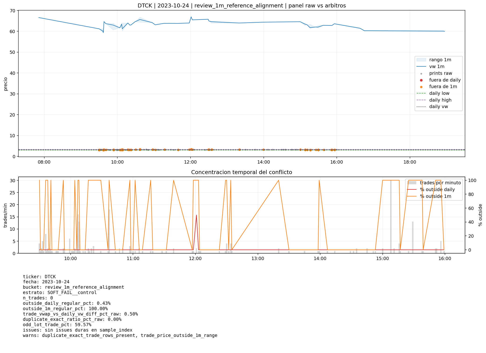

**Que muestra**

- Panel rico del tape raw frente a `daily` y `1m` para `DTCK` el `2023-10-24`.
- `n_trades = 235`, `outside_daily_regular_pct = 0.43%`, `outside_1m_regular_pct = 100.00%`.
- `trade_vwap_vs_daily_vw_diff_pct_raw = 0.50%`, `duplicate_exact_ratio_pct_raw = 0.00%`, `odd_lot_trade_pct = 59.57%`.

**Responde**

- Familia donde `1m` cambia la verdad del caso. Responde a la pregunta de si una vista mas fina destruye una aparente normalidad vista desde `daily`.
- Responde a si el conflicto dominante vive en la escala (`~1x`), en la comparabilidad frente a `daily` (0.43%) o frente a `1m` (100.00%).
- El 59.57% de odd-lots empuja la lectura hacia microestructura fina; evita leer el caso como pura ruptura economica gruesa.
- La decision que justifica es mantener o no el caso en `recoverable_with_flag` cuando se rematerialice la rehabilitacion sobre `57f`.

### DTCK | 2023-11-17

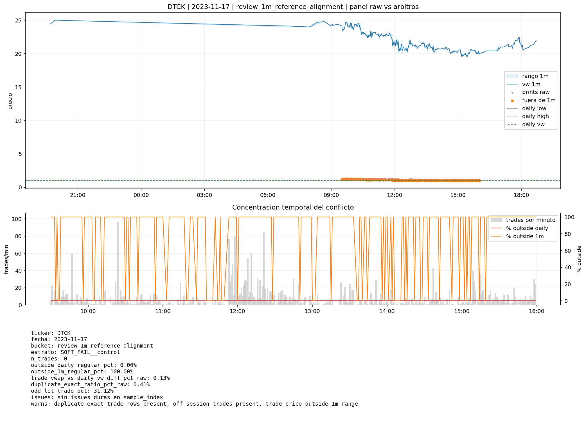

**Que muestra**

- Panel rico del tape raw frente a `daily` y `1m` para `DTCK` el `2023-11-17`.
- `n_trades = 2,921`, `outside_daily_regular_pct = 0.00%`, `outside_1m_regular_pct = 100.00%`.
- `trade_vwap_vs_daily_vw_diff_pct_raw = 0.13%`, `duplicate_exact_ratio_pct_raw = 0.41%`, `odd_lot_trade_pct = 31.12%`.

**Responde**

- Familia donde `1m` cambia la verdad del caso. Responde a la pregunta de si una vista mas fina destruye una aparente normalidad vista desde `daily`.
- Responde a si el conflicto dominante vive en la escala (`~1x`), en la comparabilidad frente a `daily` (0.00%) o frente a `1m` (100.00%).
- El 31.12% de odd-lots empuja la lectura hacia microestructura fina; evita leer el caso como pura ruptura economica gruesa.
- La decision que justifica es mantener o no el caso en `recoverable_with_flag` cuando se rematerialice la rehabilitacion sobre `57f`.

### DTCK | 2024-04-15

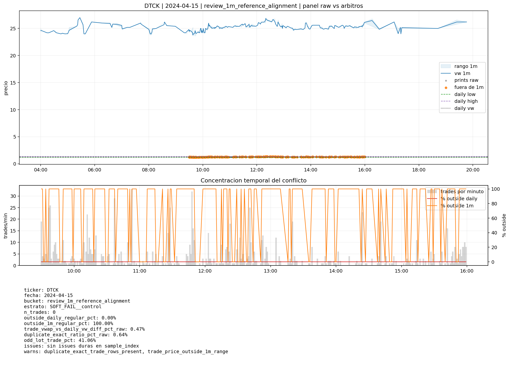

**Que muestra**

- Panel rico del tape raw frente a `daily` y `1m` para `DTCK` el `2024-04-15`.
- `n_trades = 1,096`, `outside_daily_regular_pct = 0.00%`, `outside_1m_regular_pct = 100.00%`.
- `trade_vwap_vs_daily_vw_diff_pct_raw = 0.47%`, `duplicate_exact_ratio_pct_raw = 0.64%`, `odd_lot_trade_pct = 41.06%`.

**Responde**

- Familia donde `1m` cambia la verdad del caso. Responde a la pregunta de si una vista mas fina destruye una aparente normalidad vista desde `daily`.
- Responde a si el conflicto dominante vive en la escala (`~1x`), en la comparabilidad frente a `daily` (0.00%) o frente a `1m` (100.00%).
- El 41.06% de odd-lots empuja la lectura hacia microestructura fina; evita leer el caso como pura ruptura economica gruesa.
- La decision que justifica es mantener o no el caso en `recoverable_with_flag` cuando se rematerialice la rehabilitacion sobre `57f`.

### DTCK | 2024-10-10

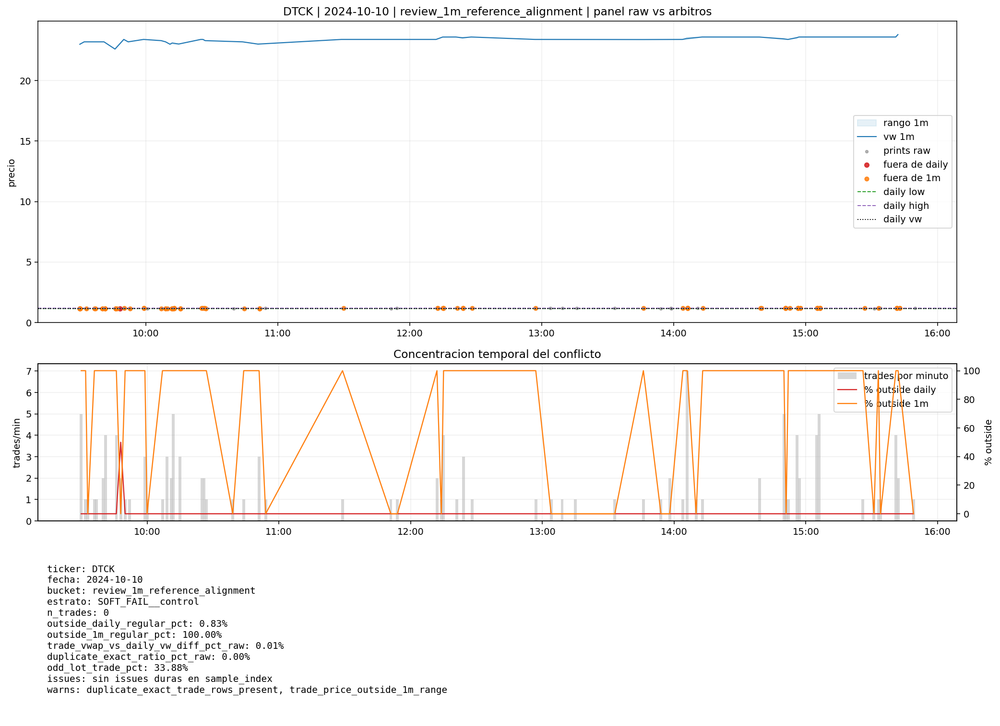

**Que muestra**

- Panel rico del tape raw frente a `daily` y `1m` para `DTCK` el `2024-10-10`.
- `n_trades = 121`, `outside_daily_regular_pct = 0.83%`, `outside_1m_regular_pct = 100.00%`.
- `trade_vwap_vs_daily_vw_diff_pct_raw = 0.01%`, `duplicate_exact_ratio_pct_raw = 0.00%`, `odd_lot_trade_pct = 33.88%`.

**Responde**

- Familia donde `1m` cambia la verdad del caso. Responde a la pregunta de si una vista mas fina destruye una aparente normalidad vista desde `daily`.
- Responde a si el conflicto dominante vive en la escala (`~1x`), en la comparabilidad frente a `daily` (0.83%) o frente a `1m` (100.00%).
- El 33.88% de odd-lots empuja la lectura hacia microestructura fina; evita leer el caso como pura ruptura economica gruesa.
- La decision que justifica es mantener o no el caso en `recoverable_with_flag` cuando se rematerialice la rehabilitacion sobre `57f`.

### PMD | 2019-02-01

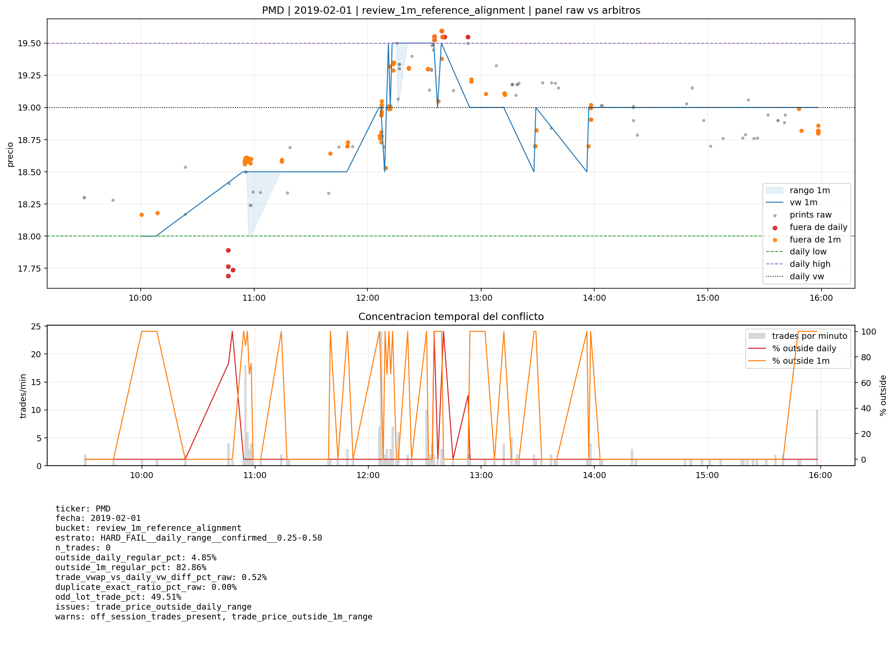

**Que muestra**

- Panel rico del tape raw frente a `daily` y `1m` para `PMD` el `2019-02-01`.
- `n_trades = 206`, `outside_daily_regular_pct = 4.85%`, `outside_1m_regular_pct = 82.86%`.
- `trade_vwap_vs_daily_vw_diff_pct_raw = 0.52%`, `duplicate_exact_ratio_pct_raw = 0.00%`, `odd_lot_trade_pct = 49.51%`.

**Responde**

- Familia donde `1m` cambia la verdad del caso. Responde a la pregunta de si una vista mas fina destruye una aparente normalidad vista desde `daily`.
- Responde a si el conflicto dominante vive en la escala (`~1x`), en la comparabilidad frente a `daily` (4.85%) o frente a `1m` (82.86%).
- El 49.51% de odd-lots empuja la lectura hacia microestructura fina; evita leer el caso como pura ruptura economica gruesa.
- La decision que justifica es mantener o no el caso en `recoverable_with_flag` cuando se rematerialice la rehabilitacion sobre `57f`.

### QBAK | 2019-08-06

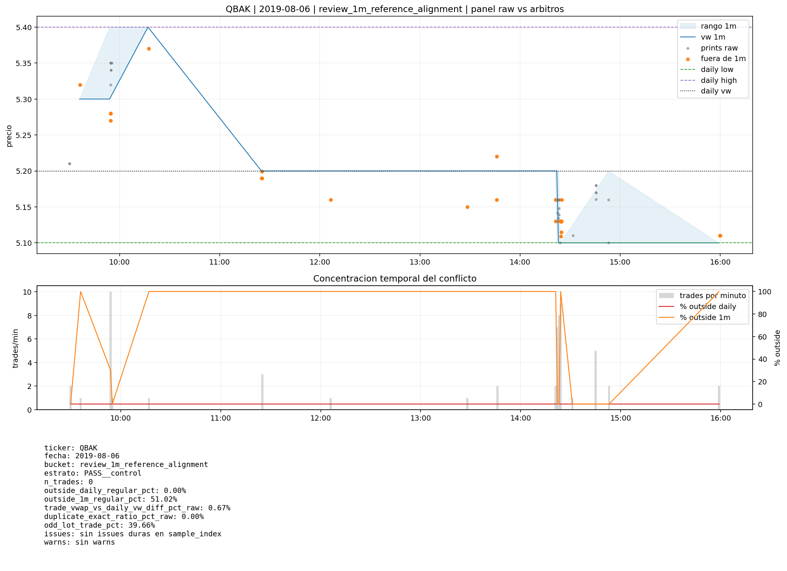

**Que muestra**

- Panel rico del tape raw frente a `daily` y `1m` para `QBAK` el `2019-08-06`.
- `n_trades = 58`, `outside_daily_regular_pct = 0.00%`, `outside_1m_regular_pct = 51.02%`.
- `trade_vwap_vs_daily_vw_diff_pct_raw = 0.67%`, `duplicate_exact_ratio_pct_raw = 0.00%`, `odd_lot_trade_pct = 39.66%`.

**Responde**

- Familia donde `1m` cambia la verdad del caso. Responde a la pregunta de si una vista mas fina destruye una aparente normalidad vista desde `daily`.
- Responde a si el conflicto dominante vive en la escala (`~1x`), en la comparabilidad frente a `daily` (0.00%) o frente a `1m` (51.02%).
- El 39.66% de odd-lots empuja la lectura hacia microestructura fina; evita leer el caso como pura ruptura economica gruesa.
- La decision que justifica es mantener o no el caso en `recoverable_with_flag` cuando se rematerialice la rehabilitacion sobre `57f`.

### QBAK | 2019-08-30

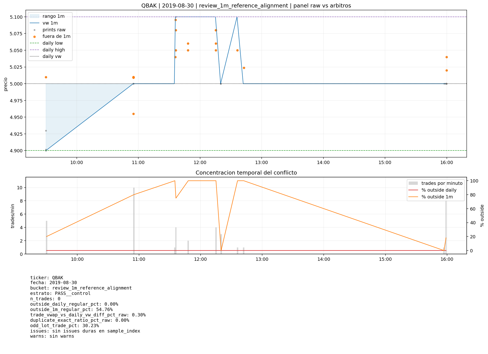

**Que muestra**

- Panel rico del tape raw frente a `daily` y `1m` para `QBAK` el `2019-08-30`.
- `n_trades = 43`, `outside_daily_regular_pct = 0.00%`, `outside_1m_regular_pct = 54.76%`.
- `trade_vwap_vs_daily_vw_diff_pct_raw = 0.30%`, `duplicate_exact_ratio_pct_raw = 0.00%`, `odd_lot_trade_pct = 30.23%`.

**Responde**

- Familia donde `1m` cambia la verdad del caso. Responde a la pregunta de si una vista mas fina destruye una aparente normalidad vista desde `daily`.
- Responde a si el conflicto dominante vive en la escala (`~1x`), en la comparabilidad frente a `daily` (0.00%) o frente a `1m` (54.76%).
- El 30.23% de odd-lots empuja la lectura hacia microestructura fina; evita leer el caso como pura ruptura economica gruesa.
- La decision que justifica es mantener o no el caso en `recoverable_with_flag` cuando se rematerialice la rehabilitacion sobre `57f`.

### RELV | 2019-06-25

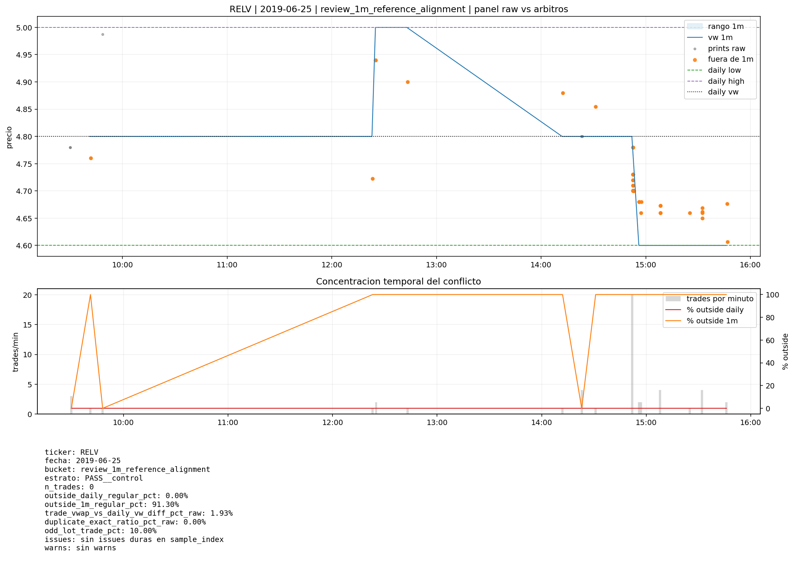

**Que muestra**

- Panel rico del tape raw frente a `daily` y `1m` para `RELV` el `2019-06-25`.
- `n_trades = 50`, `outside_daily_regular_pct = 0.00%`, `outside_1m_regular_pct = 91.30%`.
- `trade_vwap_vs_daily_vw_diff_pct_raw = 1.93%`, `duplicate_exact_ratio_pct_raw = 0.00%`, `odd_lot_trade_pct = 10.00%`.

**Responde**

- Familia donde `1m` cambia la verdad del caso. Responde a la pregunta de si una vista mas fina destruye una aparente normalidad vista desde `daily`.
- Responde a si el conflicto dominante vive en la escala (`~1x`), en la comparabilidad frente a `daily` (0.00%) o frente a `1m` (91.30%).
- La decision que justifica es mantener o no el caso en `recoverable_with_flag` cuando se rematerialice la rehabilitacion sobre `57f`.

### RVPH | 2021-10-07

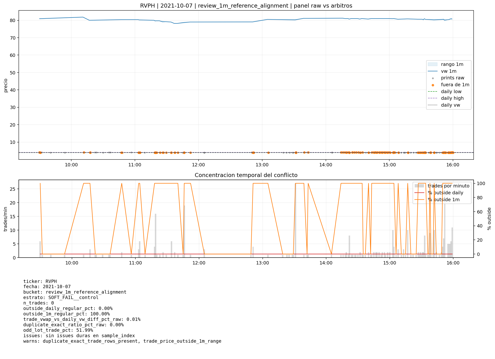

**Que muestra**

- Panel rico del tape raw frente a `daily` y `1m` para `RVPH` el `2021-10-07`.
- `n_trades = 327`, `outside_daily_regular_pct = 0.00%`, `outside_1m_regular_pct = 100.00%`.
- `trade_vwap_vs_daily_vw_diff_pct_raw = 0.01%`, `duplicate_exact_ratio_pct_raw = 0.00%`, `odd_lot_trade_pct = 51.99%`.

**Responde**

- Familia donde `1m` cambia la verdad del caso. Responde a la pregunta de si una vista mas fina destruye una aparente normalidad vista desde `daily`.
- Responde a si el conflicto dominante vive en la escala (`~1x`), en la comparabilidad frente a `daily` (0.00%) o frente a `1m` (100.00%).
- El 51.99% de odd-lots empuja la lectura hacia microestructura fina; evita leer el caso como pura ruptura economica gruesa.
- La decision que justifica es mantener o no el caso en `recoverable_with_flag` cuando se rematerialice la rehabilitacion sobre `57f`.

### RVPH | 2021-11-29

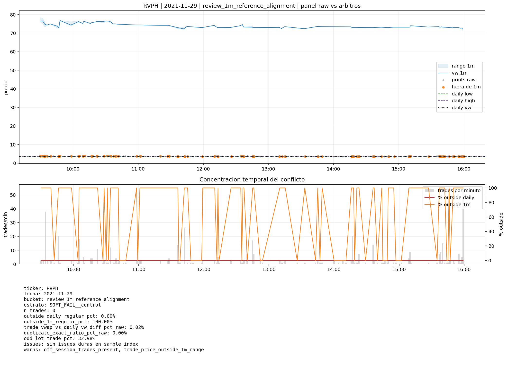

**Que muestra**

- Panel rico del tape raw frente a `daily` y `1m` para `RVPH` el `2021-11-29`.
- `n_trades = 473`, `outside_daily_regular_pct = 0.00%`, `outside_1m_regular_pct = 100.00%`.
- `trade_vwap_vs_daily_vw_diff_pct_raw = 0.02%`, `duplicate_exact_ratio_pct_raw = 0.00%`, `odd_lot_trade_pct = 32.98%`.

**Responde**

- Familia donde `1m` cambia la verdad del caso. Responde a la pregunta de si una vista mas fina destruye una aparente normalidad vista desde `daily`.
- Responde a si el conflicto dominante vive en la escala (`~1x`), en la comparabilidad frente a `daily` (0.00%) o frente a `1m` (100.00%).
- El 32.98% de odd-lots empuja la lectura hacia microestructura fina; evita leer el caso como pura ruptura economica gruesa.
- La decision que justifica es mantener o no el caso en `recoverable_with_flag` cuando se rematerialice la rehabilitacion sobre `57f`.

### RVPH | 2022-08-22

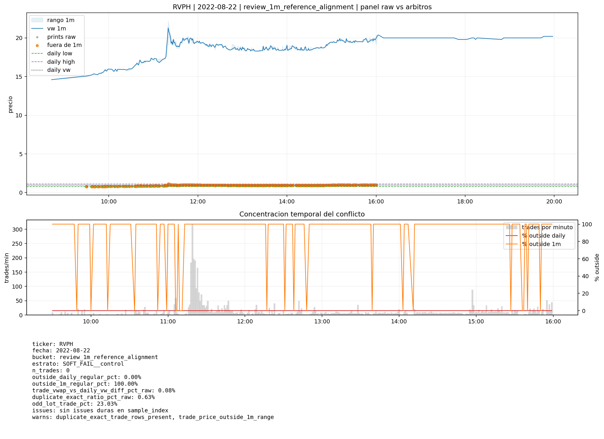

**Que muestra**

- Panel rico del tape raw frente a `daily` y `1m` para `RVPH` el `2022-08-22`.
- `n_trades = 4,780`, `outside_daily_regular_pct = 0.00%`, `outside_1m_regular_pct = 100.00%`.
- `trade_vwap_vs_daily_vw_diff_pct_raw = 0.08%`, `duplicate_exact_ratio_pct_raw = 0.63%`, `odd_lot_trade_pct = 23.03%`.

**Responde**

- Familia donde `1m` cambia la verdad del caso. Responde a la pregunta de si una vista mas fina destruye una aparente normalidad vista desde `daily`.
- Responde a si el conflicto dominante vive en la escala (`~1x`), en la comparabilidad frente a `daily` (0.00%) o frente a `1m` (100.00%).
- La decision que justifica es mantener o no el caso en `recoverable_with_flag` cuando se rematerialice la rehabilitacion sobre `57f`.

### RVPH | 2023-12-26

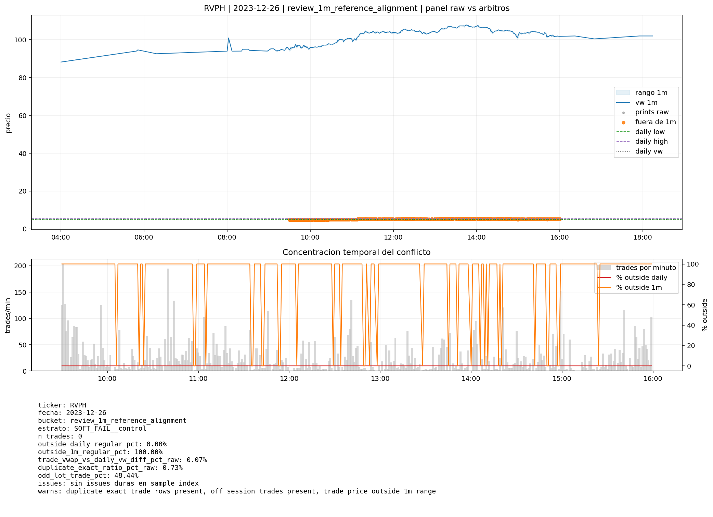

**Que muestra**

- Panel rico del tape raw frente a `daily` y `1m` para `RVPH` el `2023-12-26`.
- `n_trades = 9,217`, `outside_daily_regular_pct = 0.00%`, `outside_1m_regular_pct = 100.00%`.
- `trade_vwap_vs_daily_vw_diff_pct_raw = 0.07%`, `duplicate_exact_ratio_pct_raw = 0.73%`, `odd_lot_trade_pct = 48.44%`.

**Responde**

- Familia donde `1m` cambia la verdad del caso. Responde a la pregunta de si una vista mas fina destruye una aparente normalidad vista desde `daily`.
- Responde a si el conflicto dominante vive en la escala (`~1x`), en la comparabilidad frente a `daily` (0.00%) o frente a `1m` (100.00%).
- El 48.44% de odd-lots empuja la lectura hacia microestructura fina; evita leer el caso como pura ruptura economica gruesa.
- La decision que justifica es mantener o no el caso en `recoverable_with_flag` cuando se rematerialice la rehabilitacion sobre `57f`.

### RVPH | 2024-08-22

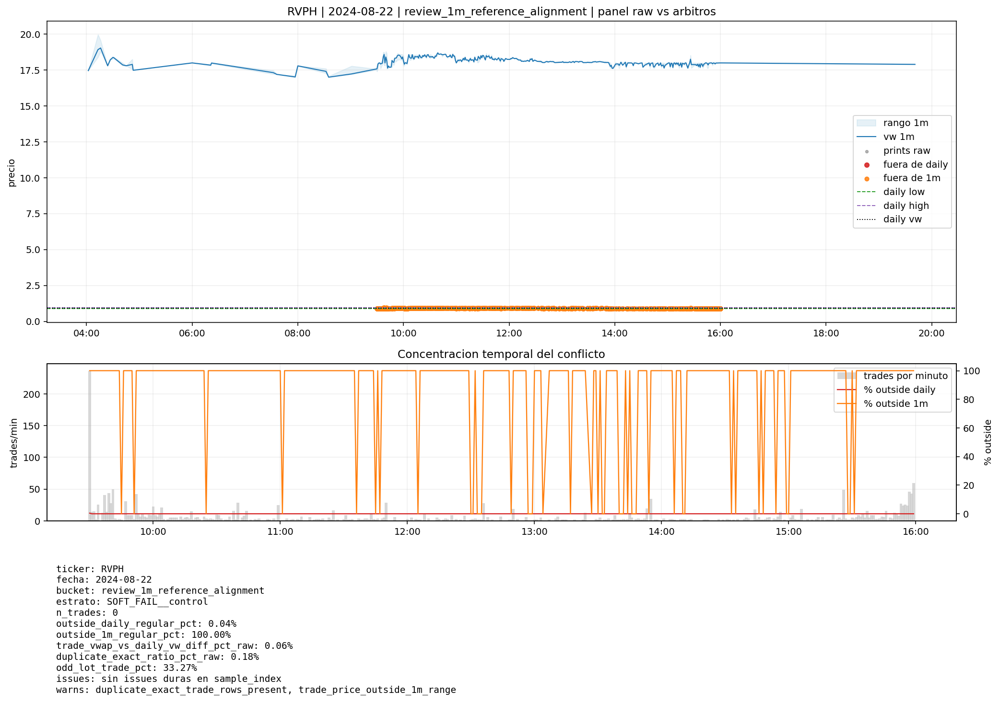

**Que muestra**

- Panel rico del tape raw frente a `daily` y `1m` para `RVPH` el `2024-08-22`.
- `n_trades = 2,272`, `outside_daily_regular_pct = 0.04%`, `outside_1m_regular_pct = 100.00%`.
- `trade_vwap_vs_daily_vw_diff_pct_raw = 0.06%`, `duplicate_exact_ratio_pct_raw = 0.18%`, `odd_lot_trade_pct = 33.27%`.

**Responde**

- Familia donde `1m` cambia la verdad del caso. Responde a la pregunta de si una vista mas fina destruye una aparente normalidad vista desde `daily`.
- Responde a si el conflicto dominante vive en la escala (`~1x`), en la comparabilidad frente a `daily` (0.04%) o frente a `1m` (100.00%).
- El 33.27% de odd-lots empuja la lectura hacia microestructura fina; evita leer el caso como pura ruptura economica gruesa.
- La decision que justifica es mantener o no el caso en `recoverable_with_flag` cuando se rematerialice la rehabilitacion sobre `57f`.

### RVPH | 2025-03-10

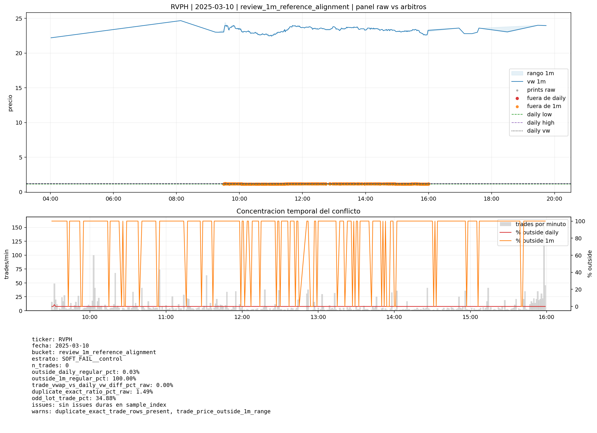

**Que muestra**

- Panel rico del tape raw frente a `daily` y `1m` para `RVPH` el `2025-03-10`.
- `n_trades = 3,096`, `outside_daily_regular_pct = 0.03%`, `outside_1m_regular_pct = 100.00%`.
- `trade_vwap_vs_daily_vw_diff_pct_raw = 0.00%`, `duplicate_exact_ratio_pct_raw = 1.49%`, `odd_lot_trade_pct = 34.88%`.

**Responde**

- Familia donde `1m` cambia la verdad del caso. Responde a la pregunta de si una vista mas fina destruye una aparente normalidad vista desde `daily`.
- Responde a si el conflicto dominante vive en la escala (`~1x`), en la comparabilidad frente a `daily` (0.03%) o frente a `1m` (100.00%).
- El 34.88% de odd-lots empuja la lectura hacia microestructura fina; evita leer el caso como pura ruptura economica gruesa.
- La decision que justifica es mantener o no el caso en `recoverable_with_flag` cuando se rematerialice la rehabilitacion sobre `57f`.

### RVPH | 2025-06-23

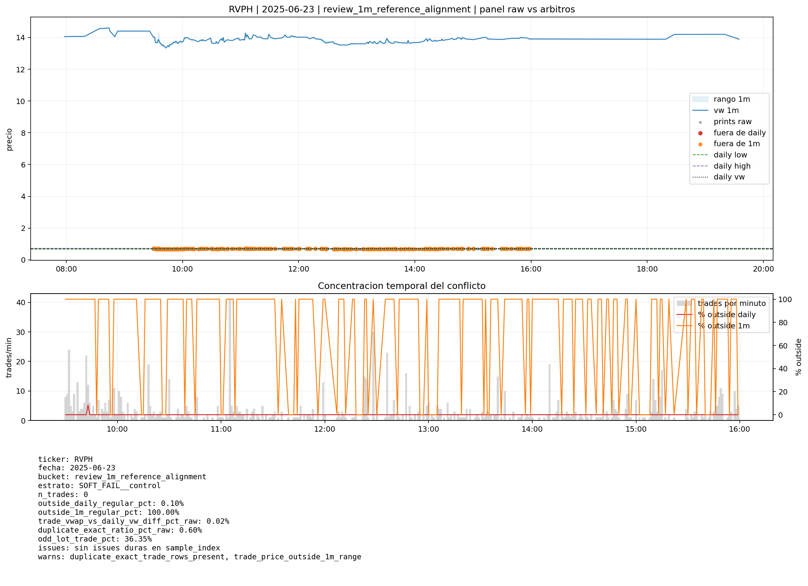

**Que muestra**

- Panel rico del tape raw frente a `daily` y `1m` para `RVPH` el `2025-06-23`.
- `n_trades = 1,004`, `outside_daily_regular_pct = 0.10%`, `outside_1m_regular_pct = 100.00%`.
- `trade_vwap_vs_daily_vw_diff_pct_raw = 0.02%`, `duplicate_exact_ratio_pct_raw = 0.60%`, `odd_lot_trade_pct = 36.35%`.

**Responde**

- Familia donde `1m` cambia la verdad del caso. Responde a la pregunta de si una vista mas fina destruye una aparente normalidad vista desde `daily`.
- Responde a si el conflicto dominante vive en la escala (`~1x`), en la comparabilidad frente a `daily` (0.10%) o frente a `1m` (100.00%).
- El 36.35% de odd-lots empuja la lectura hacia microestructura fina; evita leer el caso como pura ruptura economica gruesa.
- La decision que justifica es mantener o no el caso en `recoverable_with_flag` cuando se rematerialice la rehabilitacion sobre `57f`.

### RVPH | 2026-02-17

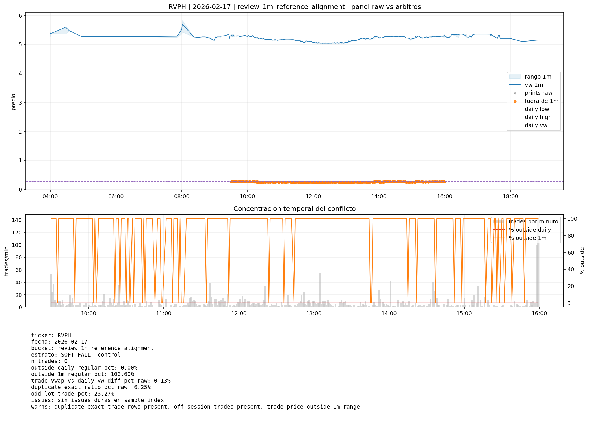

**Que muestra**

- Panel rico del tape raw frente a `daily` y `1m` para `RVPH` el `2026-02-17`.
- `n_trades = 2,411`, `outside_daily_regular_pct = 0.00%`, `outside_1m_regular_pct = 100.00%`.
- `trade_vwap_vs_daily_vw_diff_pct_raw = 0.13%`, `duplicate_exact_ratio_pct_raw = 0.25%`, `odd_lot_trade_pct = 23.27%`.

**Responde**

- Familia donde `1m` cambia la verdad del caso. Responde a la pregunta de si una vista mas fina destruye una aparente normalidad vista desde `daily`.
- Responde a si el conflicto dominante vive en la escala (`~1x`), en la comparabilidad frente a `daily` (0.00%) o frente a `1m` (100.00%).
- La decision que justifica es mantener o no el caso en `recoverable_with_flag` cuando se rematerialice la rehabilitacion sobre `57f`.

### SFE | 2022-11-23

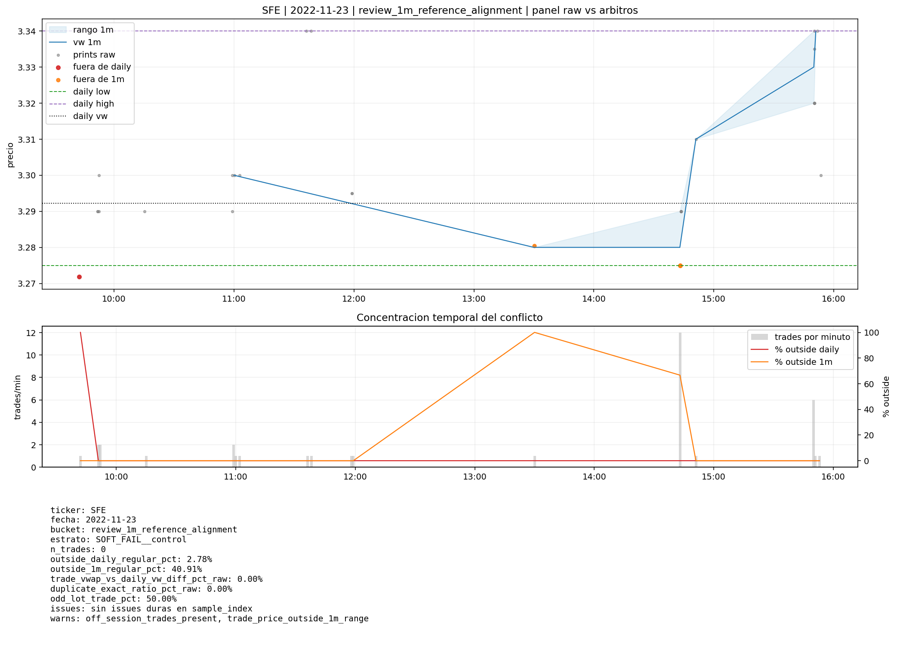

**Que muestra**

- Panel rico del tape raw frente a `daily` y `1m` para `SFE` el `2022-11-23`.
- `n_trades = 36`, `outside_daily_regular_pct = 2.78%`, `outside_1m_regular_pct = 40.91%`.
- `trade_vwap_vs_daily_vw_diff_pct_raw = 0.00%`, `duplicate_exact_ratio_pct_raw = 0.00%`, `odd_lot_trade_pct = 50.00%`.

**Responde**

- Familia donde `1m` cambia la verdad del caso. Responde a la pregunta de si una vista mas fina destruye una aparente normalidad vista desde `daily`.
- Responde a si el conflicto dominante vive en la escala (`~1x`), en la comparabilidad frente a `daily` (2.78%) o frente a `1m` (40.91%).
- El 50.00% de odd-lots empuja la lectura hacia microestructura fina; evita leer el caso como pura ruptura economica gruesa.
- La decision que justifica es mantener o no el caso en `recoverable_with_flag` cuando se rematerialice la rehabilitacion sobre `57f`.

### CLAR | 2019-01-24

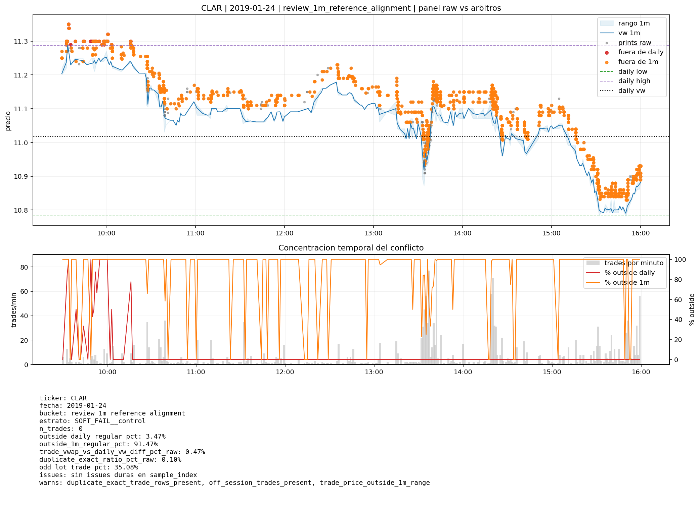

**Que muestra**

- Panel rico del tape raw frente a `daily` y `1m` para `CLAR` el `2019-01-24`.
- `n_trades = 1,933`, `outside_daily_regular_pct = 3.47%`, `outside_1m_regular_pct = 91.47%`.
- `trade_vwap_vs_daily_vw_diff_pct_raw = 0.47%`, `duplicate_exact_ratio_pct_raw = 0.10%`, `odd_lot_trade_pct = 35.08%`.

**Responde**

- Familia donde `1m` cambia la verdad del caso. Responde a la pregunta de si una vista mas fina destruye una aparente normalidad vista desde `daily`.
- Responde a si el conflicto dominante vive en la escala (`~1x`), en la comparabilidad frente a `daily` (3.47%) o frente a `1m` (91.47%).
- El 35.08% de odd-lots empuja la lectura hacia microestructura fina; evita leer el caso como pura ruptura economica gruesa.
- La decision que justifica es mantener o no el caso en `recoverable_with_flag` cuando se rematerialice la rehabilitacion sobre `57f`.

### CLAR | 2019-07-01

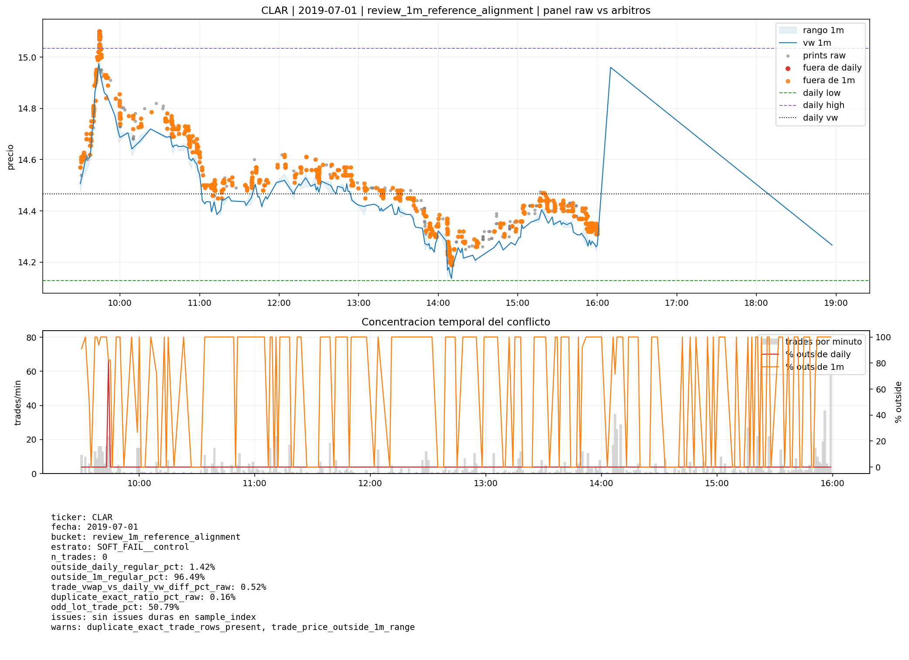

**Que muestra**

- Panel rico del tape raw frente a `daily` y `1m` para `CLAR` el `2019-07-01`.
- `n_trades = 1,268`, `outside_daily_regular_pct = 1.42%`, `outside_1m_regular_pct = 96.49%`.
- `trade_vwap_vs_daily_vw_diff_pct_raw = 0.52%`, `duplicate_exact_ratio_pct_raw = 0.16%`, `odd_lot_trade_pct = 50.79%`.

**Responde**

- Familia donde `1m` cambia la verdad del caso. Responde a la pregunta de si una vista mas fina destruye una aparente normalidad vista desde `daily`.
- Responde a si el conflicto dominante vive en la escala (`~1x`), en la comparabilidad frente a `daily` (1.42%) o frente a `1m` (96.49%).
- El 50.79% de odd-lots empuja la lectura hacia microestructura fina; evita leer el caso como pura ruptura economica gruesa.
- La decision que justifica es mantener o no el caso en `recoverable_with_flag` cuando se rematerialice la rehabilitacion sobre `57f`.

### GPRK | 2019-11-29

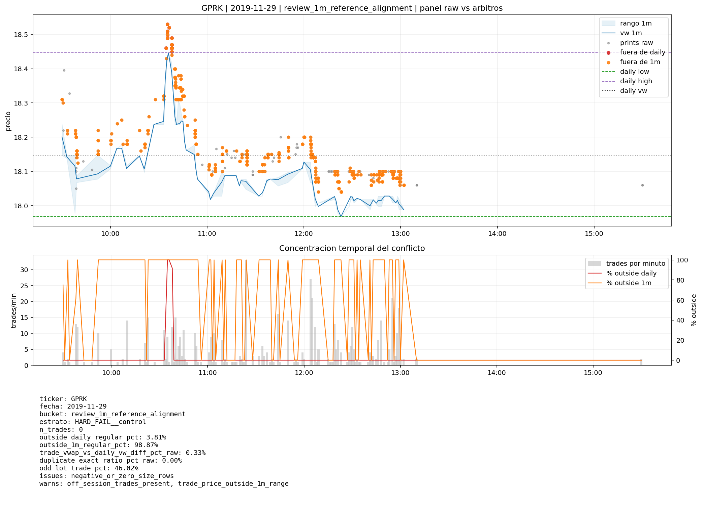

**Que muestra**

- Panel rico del tape raw frente a `daily` y `1m` para `GPRK` el `2019-11-29`.
- `n_trades = 578`, `outside_daily_regular_pct = 3.81%`, `outside_1m_regular_pct = 98.87%`.
- `trade_vwap_vs_daily_vw_diff_pct_raw = 0.33%`, `duplicate_exact_ratio_pct_raw = 0.00%`, `odd_lot_trade_pct = 46.02%`.

**Responde**

- Familia donde `1m` cambia la verdad del caso. Responde a la pregunta de si una vista mas fina destruye una aparente normalidad vista desde `daily`.
- Responde a si el conflicto dominante vive en la escala (`~1x`), en la comparabilidad frente a `daily` (3.81%) o frente a `1m` (98.87%).
- El 46.02% de odd-lots empuja la lectura hacia microestructura fina; evita leer el caso como pura ruptura economica gruesa.
- La decision que justifica es mantener o no el caso en `recoverable_with_flag` cuando se rematerialice la rehabilitacion sobre `57f`.

### RELV | 2019-06-10

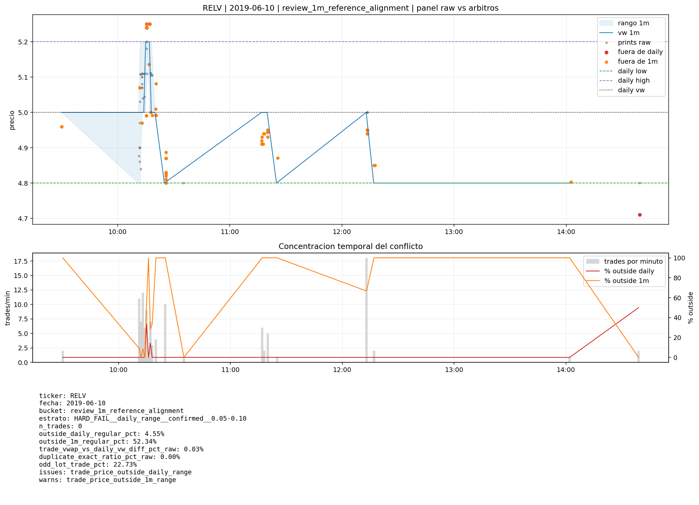

**Que muestra**

- Panel rico del tape raw frente a `daily` y `1m` para `RELV` el `2019-06-10`.
- `n_trades = 110`, `outside_daily_regular_pct = 4.55%`, `outside_1m_regular_pct = 52.34%`.
- `trade_vwap_vs_daily_vw_diff_pct_raw = 0.03%`, `duplicate_exact_ratio_pct_raw = 0.00%`, `odd_lot_trade_pct = 22.73%`.

**Responde**

- Familia donde `1m` cambia la verdad del caso. Responde a la pregunta de si una vista mas fina destruye una aparente normalidad vista desde `daily`.
- Responde a si el conflicto dominante vive en la escala (`~1x`), en la comparabilidad frente a `daily` (4.55%) o frente a `1m` (52.34%).
- La decision que justifica es mantener o no el caso en `recoverable_with_flag` cuando se rematerialice la rehabilitacion sobre `57f`.

