# Trades Review Microstructure | muestra estratificada

## Rol

Este dossier documenta `60` casos de la muestra base del cierre real `57f/full_clean_fast_same_schema` para la familia `review_microstructure`.

No son ejemplos elegidos a dedo. Proceden del manifest estratificado reproducible materializado para el inspector.

## Que significa esta familia

Familia donde el dano vive en la textura fina del flujo: odd-lots, duplicados, bursts por timestamp o comparabilidad intraminuto. Responde a la pregunta de si el tape es economicamente interpretable pero metodologicamente delicado.

## Responde

- si el dano dominante vive en odd-lots, duplicados o textura fina del tape
- si el flujo sigue siendo interpretable con flag segun uso

## No responde

- si el caso es valido como referencia economica limpia
- si basta una normalizacion de escala para resolverlo

## Consecuencia

- permitir usos microestructurales con flag
- impedir consumo ingenuo como tape pristine

## Casos

### MLAB | 2015-04-17

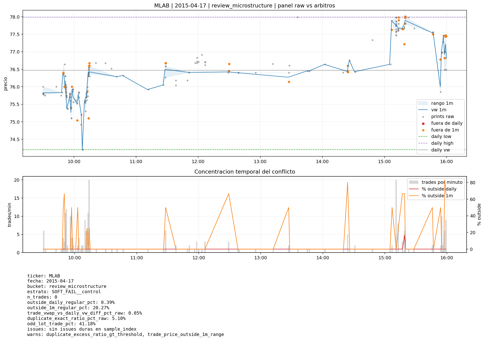

**Que muestra**

- Panel rico del tape raw frente a `daily` y `1m` para `MLAB` el `2015-04-17`.
- `n_trades = 255`, `outside_daily_regular_pct = 0.39%`, `outside_1m_regular_pct = 20.27%`.
- `trade_vwap_vs_daily_vw_diff_pct_raw = 0.05%`, `duplicate_exact_ratio_pct_raw = 5.10%`, `odd_lot_trade_pct = 41.18%`.

**Responde**

- Familia donde el dano vive en la textura fina del flujo: odd-lots, duplicados, bursts por timestamp o comparabilidad intraminuto. Responde a la pregunta de si el tape es economicamente interpretable pero metodologicamente delicado.
- Responde a si el conflicto dominante vive en la escala (`~1x`), en la comparabilidad frente a `daily` (0.39%) o frente a `1m` (20.27%).
- El 41.18% de odd-lots empuja la lectura hacia microestructura fina; evita leer el caso como pura ruptura economica gruesa.
- El 5.10% de duplicacion exacta obliga a sospechar dano de tape o bursts mecanicos, no solo ruido visual.
- La decision que justifica es mantener o no el caso en `recoverable_with_flag` cuando se rematerialice la rehabilitacion sobre `57f`.

### GBLI | 2016-04-04

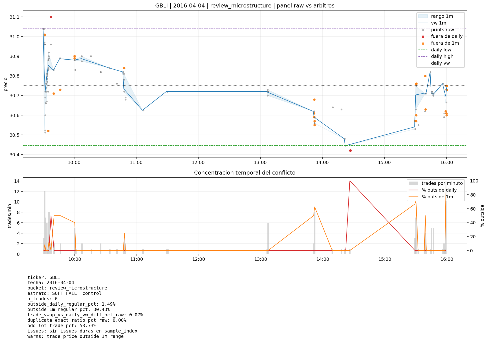

**Que muestra**

- Panel rico del tape raw frente a `daily` y `1m` para `GBLI` el `2016-04-04`.
- `n_trades = 134`, `outside_daily_regular_pct = 1.49%`, `outside_1m_regular_pct = 30.43%`.
- `trade_vwap_vs_daily_vw_diff_pct_raw = 0.07%`, `duplicate_exact_ratio_pct_raw = 0.00%`, `odd_lot_trade_pct = 53.73%`.

**Responde**

- Familia donde el dano vive en la textura fina del flujo: odd-lots, duplicados, bursts por timestamp o comparabilidad intraminuto. Responde a la pregunta de si el tape es economicamente interpretable pero metodologicamente delicado.
- Responde a si el conflicto dominante vive en la escala (`~1x`), en la comparabilidad frente a `daily` (1.49%) o frente a `1m` (30.43%).
- El 53.73% de odd-lots empuja la lectura hacia microestructura fina; evita leer el caso como pura ruptura economica gruesa.
- La decision que justifica es mantener o no el caso en `recoverable_with_flag` cuando se rematerialice la rehabilitacion sobre `57f`.

### BSET | 2018-05-16

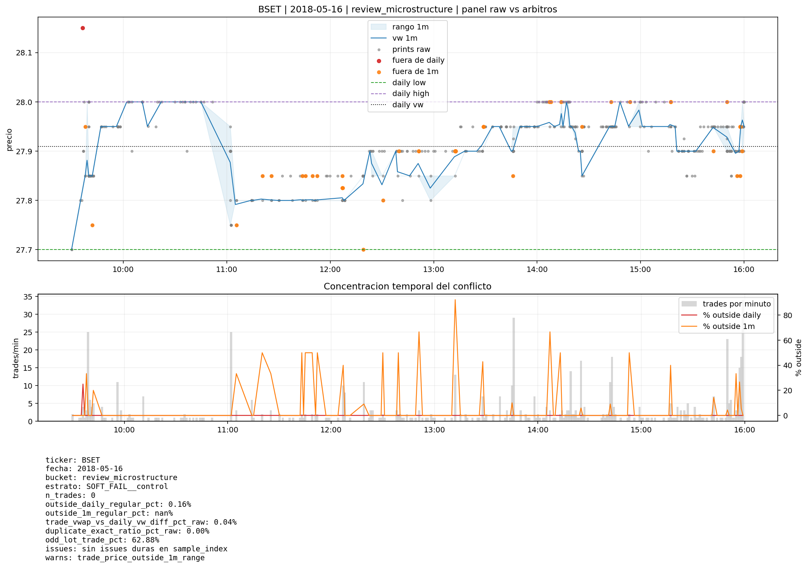

**Que muestra**

- Panel rico del tape raw frente a `daily` y `1m` para `BSET` el `2018-05-16`.
- `n_trades = 625`, `outside_daily_regular_pct = 0.16%`, `outside_1m_regular_pct = nan%`.
- `trade_vwap_vs_daily_vw_diff_pct_raw = 0.04%`, `duplicate_exact_ratio_pct_raw = 0.00%`, `odd_lot_trade_pct = 62.88%`.

**Responde**

- Familia donde el dano vive en la textura fina del flujo: odd-lots, duplicados, bursts por timestamp o comparabilidad intraminuto. Responde a la pregunta de si el tape es economicamente interpretable pero metodologicamente delicado.
- Responde a si el conflicto dominante vive en la escala (`~1x`), en la comparabilidad frente a `daily` (0.16%) o frente a `1m` (nan%).
- El 62.88% de odd-lots empuja la lectura hacia microestructura fina; evita leer el caso como pura ruptura economica gruesa.
- La decision que justifica es mantener o no el caso en `recoverable_with_flag` cuando se rematerialice la rehabilitacion sobre `57f`.

### NC | 2015-11-03

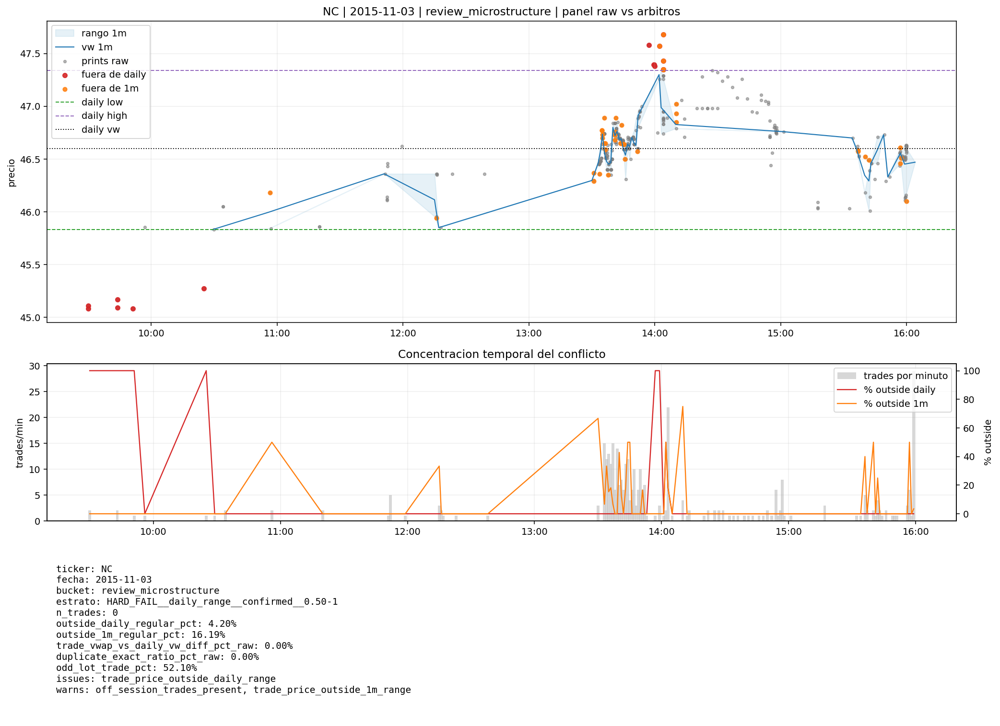

**Que muestra**

- Panel rico del tape raw frente a `daily` y `1m` para `NC` el `2015-11-03`.
- `n_trades = 357`, `outside_daily_regular_pct = 4.20%`, `outside_1m_regular_pct = 16.19%`.
- `trade_vwap_vs_daily_vw_diff_pct_raw = 0.00%`, `duplicate_exact_ratio_pct_raw = 0.00%`, `odd_lot_trade_pct = 52.10%`.

**Responde**

- Familia donde el dano vive en la textura fina del flujo: odd-lots, duplicados, bursts por timestamp o comparabilidad intraminuto. Responde a la pregunta de si el tape es economicamente interpretable pero metodologicamente delicado.
- Responde a si el conflicto dominante vive en la escala (`~1x`), en la comparabilidad frente a `daily` (4.20%) o frente a `1m` (16.19%).
- El 52.10% de odd-lots empuja la lectura hacia microestructura fina; evita leer el caso como pura ruptura economica gruesa.
- La decision que justifica es mantener o no el caso en `recoverable_with_flag` cuando se rematerialice la rehabilitacion sobre `57f`.

### WTBA | 2015-09-30

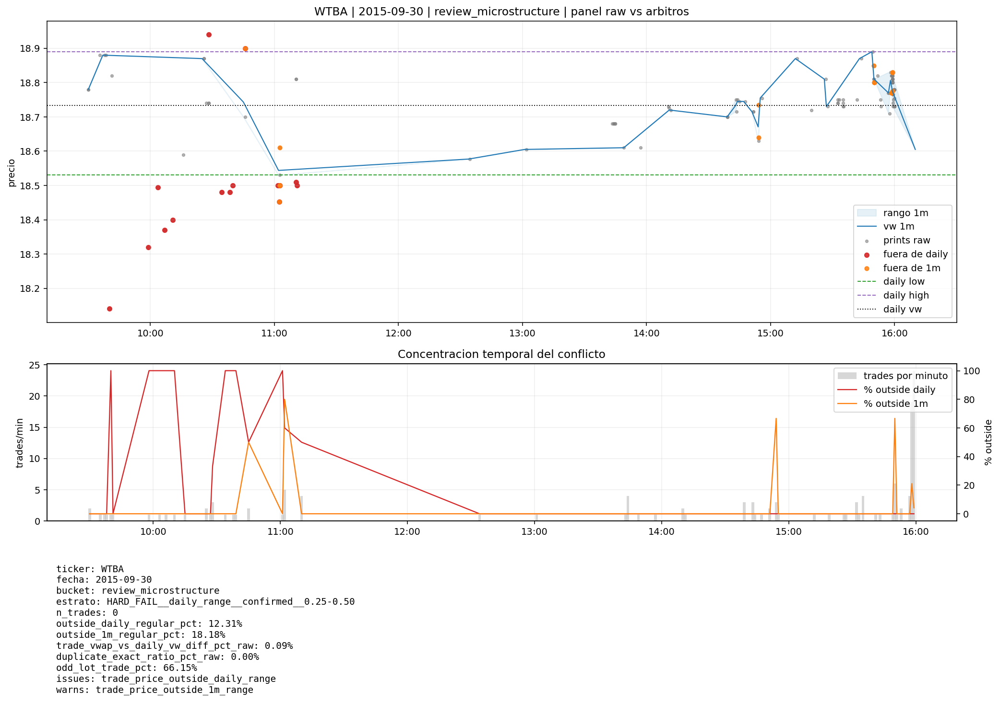

**Que muestra**

- Panel rico del tape raw frente a `daily` y `1m` para `WTBA` el `2015-09-30`.
- `n_trades = 130`, `outside_daily_regular_pct = 12.31%`, `outside_1m_regular_pct = 18.18%`.
- `trade_vwap_vs_daily_vw_diff_pct_raw = 0.09%`, `duplicate_exact_ratio_pct_raw = 0.00%`, `odd_lot_trade_pct = 66.15%`.

**Responde**

- Familia donde el dano vive en la textura fina del flujo: odd-lots, duplicados, bursts por timestamp o comparabilidad intraminuto. Responde a la pregunta de si el tape es economicamente interpretable pero metodologicamente delicado.
- Responde a si el conflicto dominante vive en la escala (`~1x`), en la comparabilidad frente a `daily` (12.31%) o frente a `1m` (18.18%).
- El 66.15% de odd-lots empuja la lectura hacia microestructura fina; evita leer el caso como pura ruptura economica gruesa.
- La decision que justifica es mantener o no el caso en `recoverable_with_flag` cuando se rematerialice la rehabilitacion sobre `57f`.

### EML | 2017-07-21

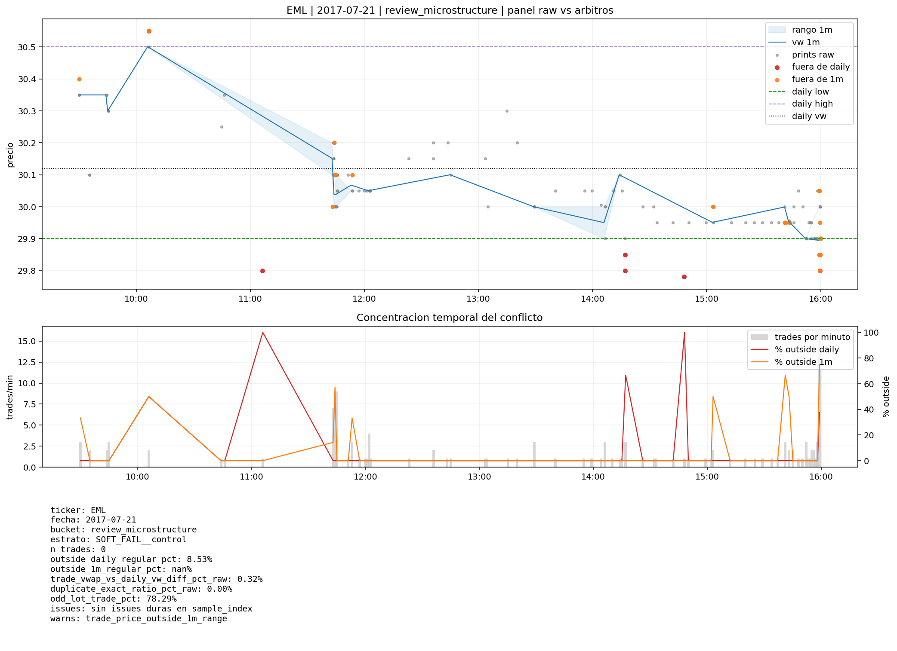

**Que muestra**

- Panel rico del tape raw frente a `daily` y `1m` para `EML` el `2017-07-21`.
- `n_trades = 129`, `outside_daily_regular_pct = 8.53%`, `outside_1m_regular_pct = nan%`.
- `trade_vwap_vs_daily_vw_diff_pct_raw = 0.32%`, `duplicate_exact_ratio_pct_raw = 0.00%`, `odd_lot_trade_pct = 78.29%`.

**Responde**

- Familia donde el dano vive en la textura fina del flujo: odd-lots, duplicados, bursts por timestamp o comparabilidad intraminuto. Responde a la pregunta de si el tape es economicamente interpretable pero metodologicamente delicado.
- Responde a si el conflicto dominante vive en la escala (`~1x`), en la comparabilidad frente a `daily` (8.53%) o frente a `1m` (nan%).
- El 78.29% de odd-lots empuja la lectura hacia microestructura fina; evita leer el caso como pura ruptura economica gruesa.
- La decision que justifica es mantener o no el caso en `recoverable_with_flag` cuando se rematerialice la rehabilitacion sobre `57f`.

### NVEC | 2017-11-21

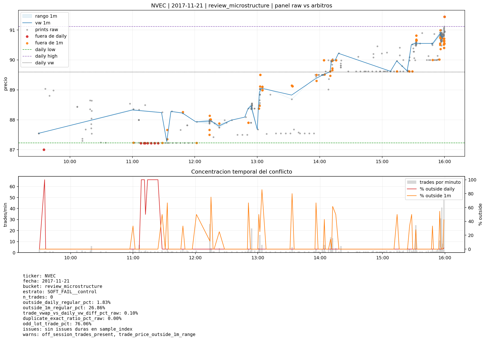

**Que muestra**

- Panel rico del tape raw frente a `daily` y `1m` para `NVEC` el `2017-11-21`.
- `n_trades = 493`, `outside_daily_regular_pct = 1.83%`, `outside_1m_regular_pct = 26.86%`.
- `trade_vwap_vs_daily_vw_diff_pct_raw = 0.10%`, `duplicate_exact_ratio_pct_raw = 0.00%`, `odd_lot_trade_pct = 76.06%`.

**Responde**

- Familia donde el dano vive en la textura fina del flujo: odd-lots, duplicados, bursts por timestamp o comparabilidad intraminuto. Responde a la pregunta de si el tape es economicamente interpretable pero metodologicamente delicado.
- Responde a si el conflicto dominante vive en la escala (`~1x`), en la comparabilidad frente a `daily` (1.83%) o frente a `1m` (26.86%).
- El 76.06% de odd-lots empuja la lectura hacia microestructura fina; evita leer el caso como pura ruptura economica gruesa.
- La decision que justifica es mantener o no el caso en `recoverable_with_flag` cuando se rematerialice la rehabilitacion sobre `57f`.

### TKAT | 2021-05-24

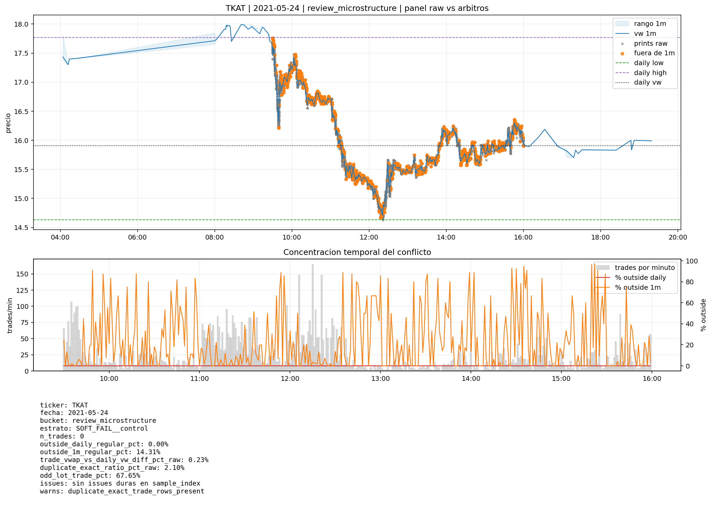

**Que muestra**

- Panel rico del tape raw frente a `daily` y `1m` para `TKAT` el `2021-05-24`.
- `n_trades = 9,223`, `outside_daily_regular_pct = 0.00%`, `outside_1m_regular_pct = 14.31%`.
- `trade_vwap_vs_daily_vw_diff_pct_raw = 0.23%`, `duplicate_exact_ratio_pct_raw = 2.10%`, `odd_lot_trade_pct = 67.65%`.

**Responde**

- Familia donde el dano vive en la textura fina del flujo: odd-lots, duplicados, bursts por timestamp o comparabilidad intraminuto. Responde a la pregunta de si el tape es economicamente interpretable pero metodologicamente delicado.
- Responde a si el conflicto dominante vive en la escala (`~1x`), en la comparabilidad frente a `daily` (0.00%) o frente a `1m` (14.31%).
- El 67.65% de odd-lots empuja la lectura hacia microestructura fina; evita leer el caso como pura ruptura economica gruesa.
- La decision que justifica es mantener o no el caso en `recoverable_with_flag` cuando se rematerialice la rehabilitacion sobre `57f`.

### GLTA | 2023-02-14

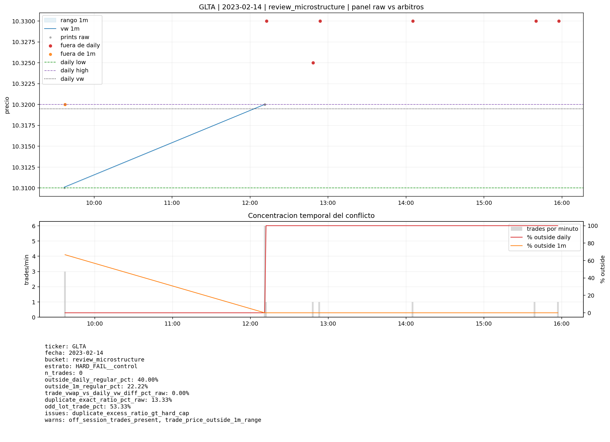

**Que muestra**

- Panel rico del tape raw frente a `daily` y `1m` para `GLTA` el `2023-02-14`.
- `n_trades = 15`, `outside_daily_regular_pct = 40.00%`, `outside_1m_regular_pct = 22.22%`.
- `trade_vwap_vs_daily_vw_diff_pct_raw = 0.00%`, `duplicate_exact_ratio_pct_raw = 13.33%`, `odd_lot_trade_pct = 53.33%`.

**Responde**

- Familia donde el dano vive en la textura fina del flujo: odd-lots, duplicados, bursts por timestamp o comparabilidad intraminuto. Responde a la pregunta de si el tape es economicamente interpretable pero metodologicamente delicado.
- Responde a si el conflicto dominante vive en la escala (`~1x`), en la comparabilidad frente a `daily` (40.00%) o frente a `1m` (22.22%).
- El 53.33% de odd-lots empuja la lectura hacia microestructura fina; evita leer el caso como pura ruptura economica gruesa.
- El 13.33% de duplicacion exacta obliga a sospechar dano de tape o bursts mecanicos, no solo ruido visual.
- La decision que justifica es mantener o no el caso en `recoverable_with_flag` cuando se rematerialice la rehabilitacion sobre `57f`.

### SGC | 2023-02-16

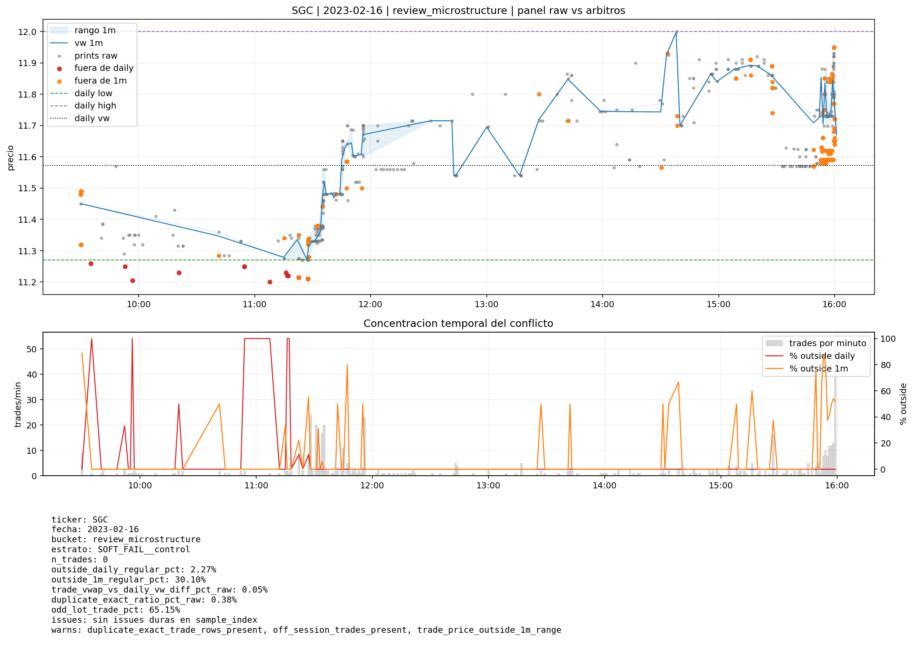

**Que muestra**

- Panel rico del tape raw frente a `daily` y `1m` para `SGC` el `2023-02-16`.
- `n_trades = 528`, `outside_daily_regular_pct = 2.27%`, `outside_1m_regular_pct = 30.10%`.
- `trade_vwap_vs_daily_vw_diff_pct_raw = 0.05%`, `duplicate_exact_ratio_pct_raw = 0.38%`, `odd_lot_trade_pct = 65.15%`.

**Responde**

- Familia donde el dano vive en la textura fina del flujo: odd-lots, duplicados, bursts por timestamp o comparabilidad intraminuto. Responde a la pregunta de si el tape es economicamente interpretable pero metodologicamente delicado.
- Responde a si el conflicto dominante vive en la escala (`~1x`), en la comparabilidad frente a `daily` (2.27%) o frente a `1m` (30.10%).
- El 65.15% de odd-lots empuja la lectura hacia microestructura fina; evita leer el caso como pura ruptura economica gruesa.
- La decision que justifica es mantener o no el caso en `recoverable_with_flag` cuando se rematerialice la rehabilitacion sobre `57f`.

### FXLV | 2023-12-05

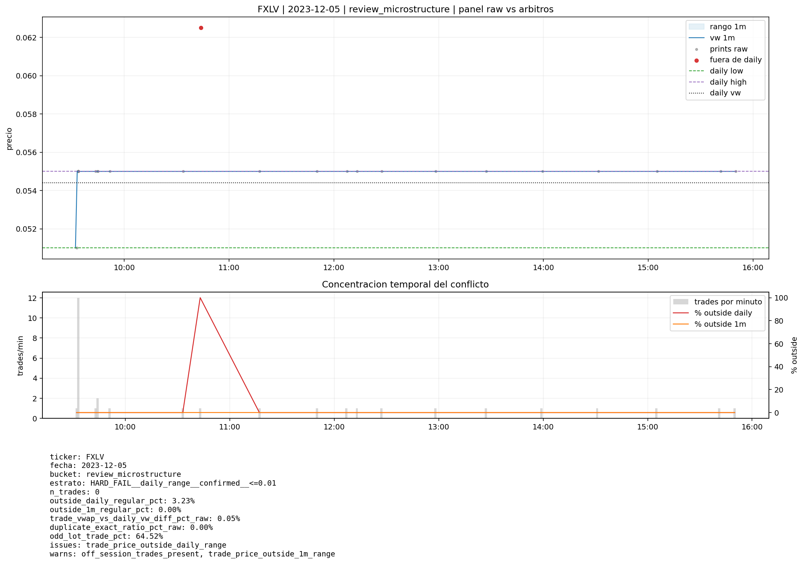

**Que muestra**

- Panel rico del tape raw frente a `daily` y `1m` para `FXLV` el `2023-12-05`.
- `n_trades = 31`, `outside_daily_regular_pct = 3.23%`, `outside_1m_regular_pct = 0.00%`.
- `trade_vwap_vs_daily_vw_diff_pct_raw = 0.05%`, `duplicate_exact_ratio_pct_raw = 0.00%`, `odd_lot_trade_pct = 64.52%`.

**Responde**

- Familia donde el dano vive en la textura fina del flujo: odd-lots, duplicados, bursts por timestamp o comparabilidad intraminuto. Responde a la pregunta de si el tape es economicamente interpretable pero metodologicamente delicado.
- Responde a si el conflicto dominante vive en la escala (`~1x`), en la comparabilidad frente a `daily` (3.23%) o frente a `1m` (0.00%).
- El 64.52% de odd-lots empuja la lectura hacia microestructura fina; evita leer el caso como pura ruptura economica gruesa.
- La decision que justifica es mantener o no el caso en `recoverable_with_flag` cuando se rematerialice la rehabilitacion sobre `57f`.

### GCTS | 2024-10-04

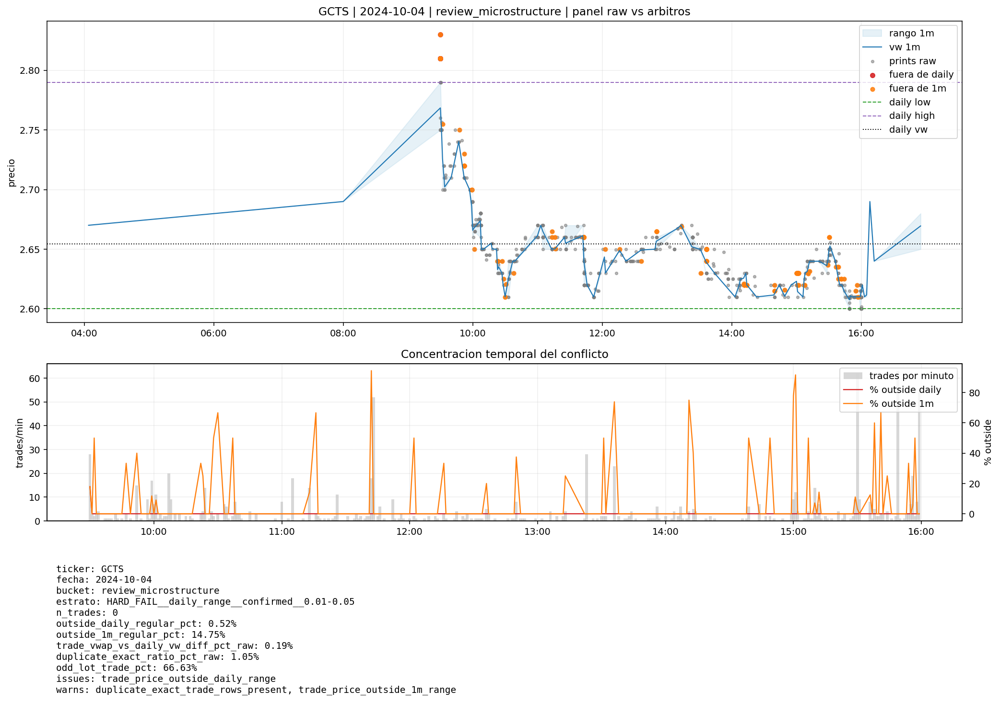

**Que muestra**

- Panel rico del tape raw frente a `daily` y `1m` para `GCTS` el `2024-10-04`.
- `n_trades = 956`, `outside_daily_regular_pct = 0.52%`, `outside_1m_regular_pct = 14.75%`.
- `trade_vwap_vs_daily_vw_diff_pct_raw = 0.19%`, `duplicate_exact_ratio_pct_raw = 1.05%`, `odd_lot_trade_pct = 66.63%`.

**Responde**

- Familia donde el dano vive en la textura fina del flujo: odd-lots, duplicados, bursts por timestamp o comparabilidad intraminuto. Responde a la pregunta de si el tape es economicamente interpretable pero metodologicamente delicado.
- Responde a si el conflicto dominante vive en la escala (`~1x`), en la comparabilidad frente a `daily` (0.52%) o frente a `1m` (14.75%).
- El 66.63% de odd-lots empuja la lectura hacia microestructura fina; evita leer el caso como pura ruptura economica gruesa.
- La decision que justifica es mantener o no el caso en `recoverable_with_flag` cuando se rematerialice la rehabilitacion sobre `57f`.

### GGE | 2023-10-04

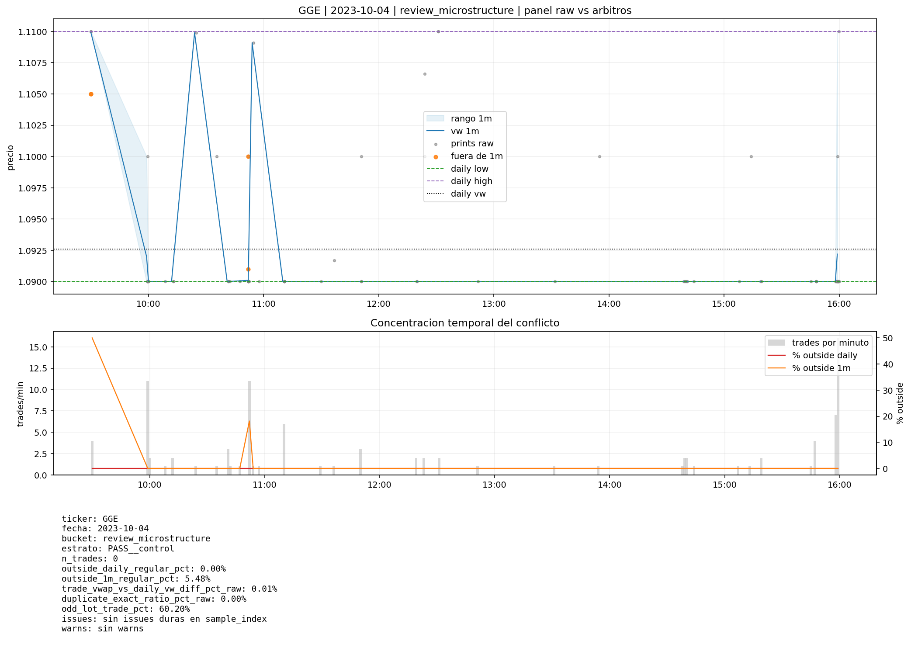

**Que muestra**

- Panel rico del tape raw frente a `daily` y `1m` para `GGE` el `2023-10-04`.
- `n_trades = 98`, `outside_daily_regular_pct = 0.00%`, `outside_1m_regular_pct = 5.48%`.
- `trade_vwap_vs_daily_vw_diff_pct_raw = 0.01%`, `duplicate_exact_ratio_pct_raw = 0.00%`, `odd_lot_trade_pct = 60.20%`.

**Responde**

- Familia donde el dano vive en la textura fina del flujo: odd-lots, duplicados, bursts por timestamp o comparabilidad intraminuto. Responde a la pregunta de si el tape es economicamente interpretable pero metodologicamente delicado.
- Responde a si el conflicto dominante vive en la escala (`~1x`), en la comparabilidad frente a `daily` (0.00%) o frente a `1m` (5.48%).
- El 60.20% de odd-lots empuja la lectura hacia microestructura fina; evita leer el caso como pura ruptura economica gruesa.
- La decision que justifica es mantener o no el caso en `recoverable_with_flag` cuando se rematerialice la rehabilitacion sobre `57f`.

### GNAC | 2021-04-16

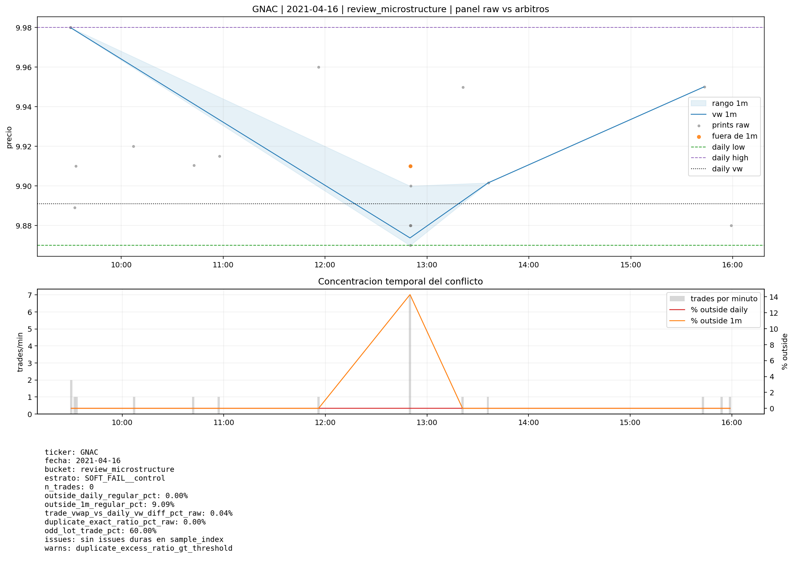

**Que muestra**

- Panel rico del tape raw frente a `daily` y `1m` para `GNAC` el `2021-04-16`.
- `n_trades = 20`, `outside_daily_regular_pct = 0.00%`, `outside_1m_regular_pct = 9.09%`.
- `trade_vwap_vs_daily_vw_diff_pct_raw = 0.04%`, `duplicate_exact_ratio_pct_raw = 0.00%`, `odd_lot_trade_pct = 60.00%`.

**Responde**

- Familia donde el dano vive en la textura fina del flujo: odd-lots, duplicados, bursts por timestamp o comparabilidad intraminuto. Responde a la pregunta de si el tape es economicamente interpretable pero metodologicamente delicado.
- Responde a si el conflicto dominante vive en la escala (`~1x`), en la comparabilidad frente a `daily` (0.00%) o frente a `1m` (9.09%).
- El 60.00% de odd-lots empuja la lectura hacia microestructura fina; evita leer el caso como pura ruptura economica gruesa.
- La decision que justifica es mantener o no el caso en `recoverable_with_flag` cuando se rematerialice la rehabilitacion sobre `57f`.

### IGAC | 2022-04-21

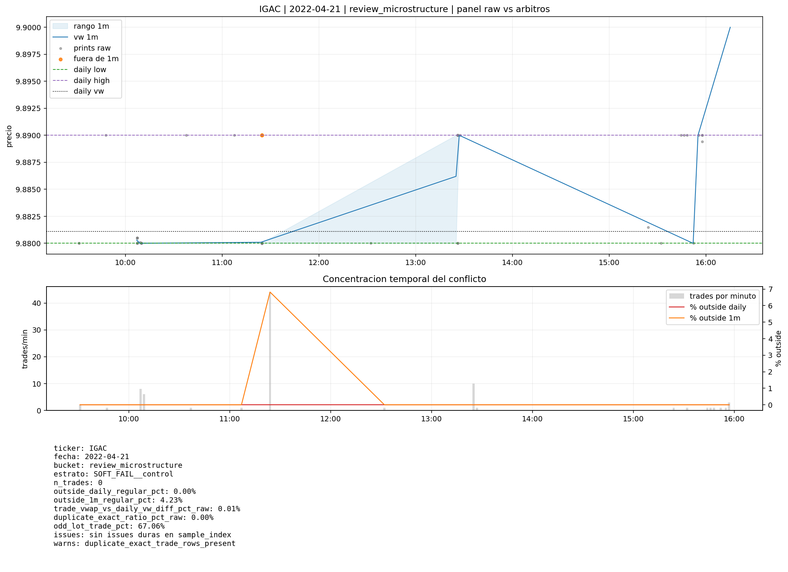

**Que muestra**

- Panel rico del tape raw frente a `daily` y `1m` para `IGAC` el `2022-04-21`.
- `n_trades = 85`, `outside_daily_regular_pct = 0.00%`, `outside_1m_regular_pct = 4.23%`.
- `trade_vwap_vs_daily_vw_diff_pct_raw = 0.01%`, `duplicate_exact_ratio_pct_raw = 0.00%`, `odd_lot_trade_pct = 67.06%`.

**Responde**

- Familia donde el dano vive en la textura fina del flujo: odd-lots, duplicados, bursts por timestamp o comparabilidad intraminuto. Responde a la pregunta de si el tape es economicamente interpretable pero metodologicamente delicado.
- Responde a si el conflicto dominante vive en la escala (`~1x`), en la comparabilidad frente a `daily` (0.00%) o frente a `1m` (4.23%).
- El 67.06% de odd-lots empuja la lectura hacia microestructura fina; evita leer el caso como pura ruptura economica gruesa.
- La decision que justifica es mantener o no el caso en `recoverable_with_flag` cuando se rematerialice la rehabilitacion sobre `57f`.

### PNBK | 2025-07-01

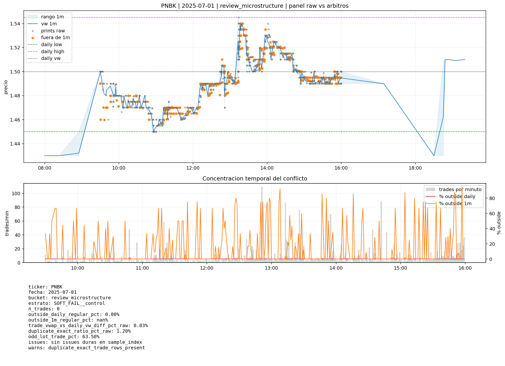

**Que muestra**

- Panel rico del tape raw frente a `daily` y `1m` para `PNBK` el `2025-07-01`.
- `n_trades = 2,833`, `outside_daily_regular_pct = 0.00%`, `outside_1m_regular_pct = nan%`.
- `trade_vwap_vs_daily_vw_diff_pct_raw = 0.03%`, `duplicate_exact_ratio_pct_raw = 1.20%`, `odd_lot_trade_pct = 63.50%`.

**Responde**

- Familia donde el dano vive en la textura fina del flujo: odd-lots, duplicados, bursts por timestamp o comparabilidad intraminuto. Responde a la pregunta de si el tape es economicamente interpretable pero metodologicamente delicado.
- Responde a si el conflicto dominante vive en la escala (`~1x`), en la comparabilidad frente a `daily` (0.00%) o frente a `1m` (nan%).
- El 63.50% de odd-lots empuja la lectura hacia microestructura fina; evita leer el caso como pura ruptura economica gruesa.
- La decision que justifica es mantener o no el caso en `recoverable_with_flag` cuando se rematerialice la rehabilitacion sobre `57f`.

### RDW | 2024-01-29

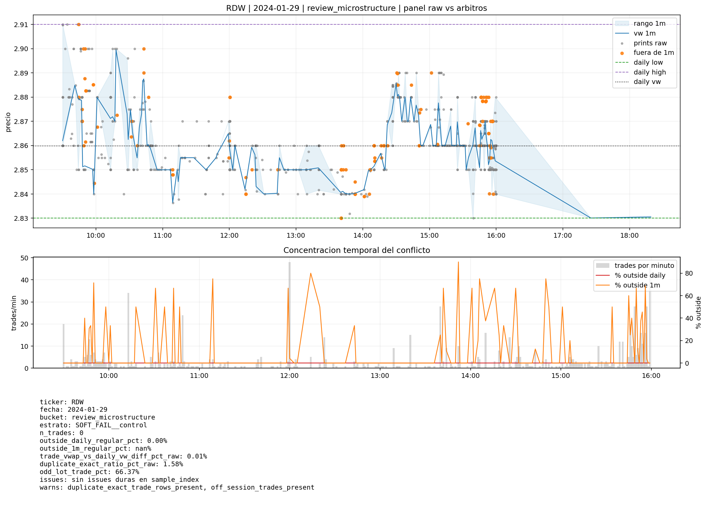

**Que muestra**

- Panel rico del tape raw frente a `daily` y `1m` para `RDW` el `2024-01-29`.
- `n_trades = 886`, `outside_daily_regular_pct = 0.00%`, `outside_1m_regular_pct = nan%`.
- `trade_vwap_vs_daily_vw_diff_pct_raw = 0.01%`, `duplicate_exact_ratio_pct_raw = 1.58%`, `odd_lot_trade_pct = 66.37%`.

**Responde**

- Familia donde el dano vive en la textura fina del flujo: odd-lots, duplicados, bursts por timestamp o comparabilidad intraminuto. Responde a la pregunta de si el tape es economicamente interpretable pero metodologicamente delicado.
- Responde a si el conflicto dominante vive en la escala (`~1x`), en la comparabilidad frente a `daily` (0.00%) o frente a `1m` (nan%).
- El 66.37% de odd-lots empuja la lectura hacia microestructura fina; evita leer el caso como pura ruptura economica gruesa.
- La decision que justifica es mantener o no el caso en `recoverable_with_flag` cuando se rematerialice la rehabilitacion sobre `57f`.

### SCVX | 2022-04-12

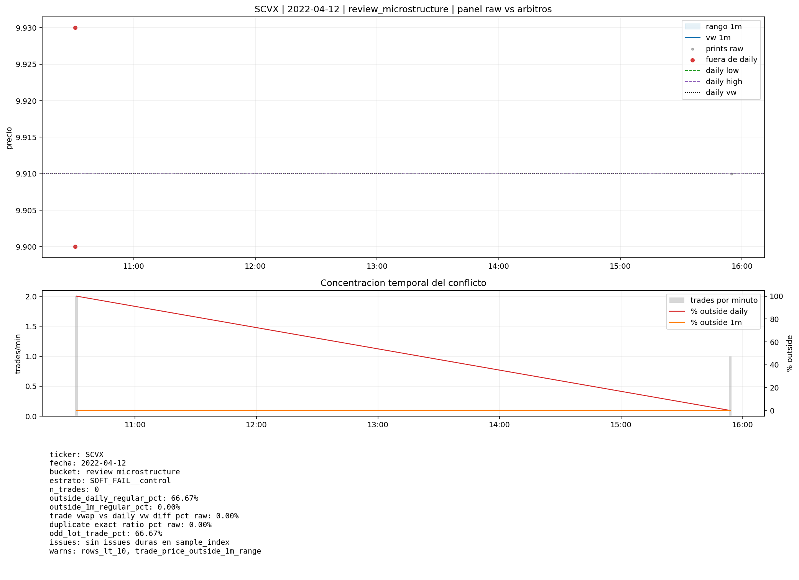

**Que muestra**

- Panel rico del tape raw frente a `daily` y `1m` para `SCVX` el `2022-04-12`.
- `n_trades = 3`, `outside_daily_regular_pct = 66.67%`, `outside_1m_regular_pct = 0.00%`.
- `trade_vwap_vs_daily_vw_diff_pct_raw = 0.00%`, `duplicate_exact_ratio_pct_raw = 0.00%`, `odd_lot_trade_pct = 66.67%`.

**Responde**

- Familia donde el dano vive en la textura fina del flujo: odd-lots, duplicados, bursts por timestamp o comparabilidad intraminuto. Responde a la pregunta de si el tape es economicamente interpretable pero metodologicamente delicado.
- Responde a si el conflicto dominante vive en la escala (`~1x`), en la comparabilidad frente a `daily` (66.67%) o frente a `1m` (0.00%).
- El 66.67% de odd-lots empuja la lectura hacia microestructura fina; evita leer el caso como pura ruptura economica gruesa.
- La decision que justifica es mantener o no el caso en `recoverable_with_flag` cuando se rematerialice la rehabilitacion sobre `57f`.

### SRTS | 2022-04-04

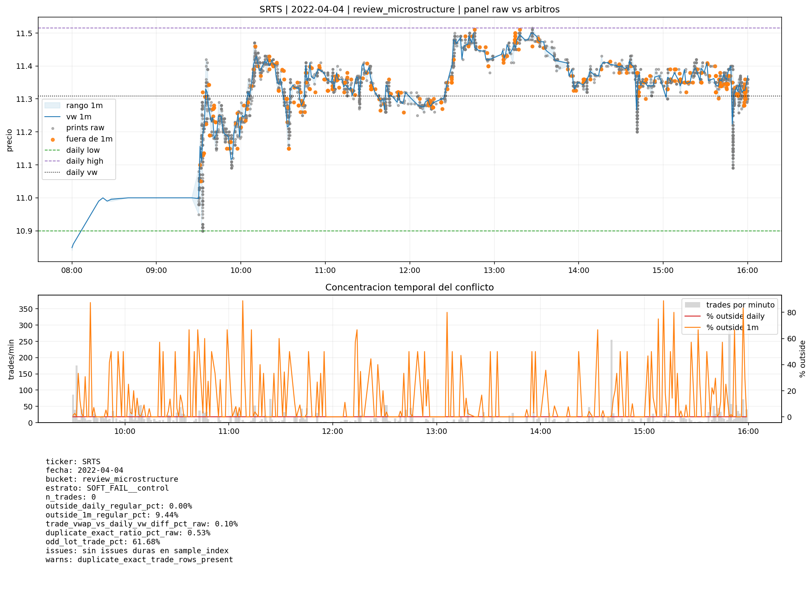

**Que muestra**

- Panel rico del tape raw frente a `daily` y `1m` para `SRTS` el `2022-04-04`.
- `n_trades = 4,679`, `outside_daily_regular_pct = 0.00%`, `outside_1m_regular_pct = 9.44%`.
- `trade_vwap_vs_daily_vw_diff_pct_raw = 0.10%`, `duplicate_exact_ratio_pct_raw = 0.53%`, `odd_lot_trade_pct = 61.68%`.

**Responde**

- Familia donde el dano vive en la textura fina del flujo: odd-lots, duplicados, bursts por timestamp o comparabilidad intraminuto. Responde a la pregunta de si el tape es economicamente interpretable pero metodologicamente delicado.
- Responde a si el conflicto dominante vive en la escala (`~1x`), en la comparabilidad frente a `daily` (0.00%) o frente a `1m` (9.44%).
- El 61.68% de odd-lots empuja la lectura hacia microestructura fina; evita leer el caso como pura ruptura economica gruesa.
- La decision que justifica es mantener o no el caso en `recoverable_with_flag` cuando se rematerialice la rehabilitacion sobre `57f`.

### ATNI | 2020-01-31

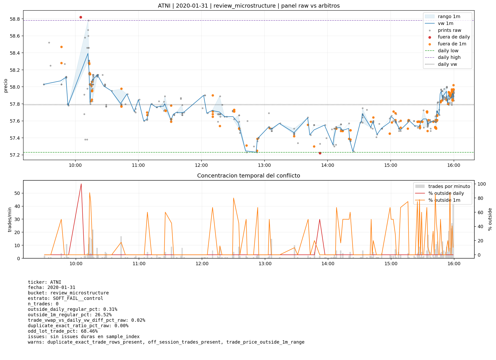

**Que muestra**

- Panel rico del tape raw frente a `daily` y `1m` para `ATNI` el `2020-01-31`.
- `n_trades = 650`, `outside_daily_regular_pct = 0.31%`, `outside_1m_regular_pct = 26.52%`.
- `trade_vwap_vs_daily_vw_diff_pct_raw = 0.02%`, `duplicate_exact_ratio_pct_raw = 0.00%`, `odd_lot_trade_pct = 68.46%`.

**Responde**

- Familia donde el dano vive en la textura fina del flujo: odd-lots, duplicados, bursts por timestamp o comparabilidad intraminuto. Responde a la pregunta de si el tape es economicamente interpretable pero metodologicamente delicado.
- Responde a si el conflicto dominante vive en la escala (`~1x`), en la comparabilidad frente a `daily` (0.31%) o frente a `1m` (26.52%).
- El 68.46% de odd-lots empuja la lectura hacia microestructura fina; evita leer el caso como pura ruptura economica gruesa.
- La decision que justifica es mantener o no el caso en `recoverable_with_flag` cuando se rematerialice la rehabilitacion sobre `57f`.

### III | 2022-08-02

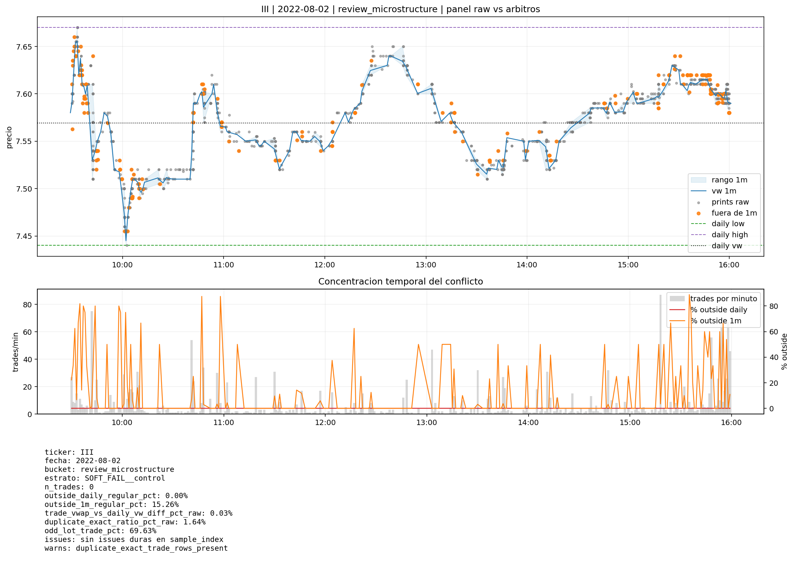

**Que muestra**

- Panel rico del tape raw frente a `daily` y `1m` para `III` el `2022-08-02`.
- `n_trades = 2,012`, `outside_daily_regular_pct = 0.00%`, `outside_1m_regular_pct = 15.26%`.
- `trade_vwap_vs_daily_vw_diff_pct_raw = 0.03%`, `duplicate_exact_ratio_pct_raw = 1.64%`, `odd_lot_trade_pct = 69.63%`.

**Responde**

- Familia donde el dano vive en la textura fina del flujo: odd-lots, duplicados, bursts por timestamp o comparabilidad intraminuto. Responde a la pregunta de si el tape es economicamente interpretable pero metodologicamente delicado.
- Responde a si el conflicto dominante vive en la escala (`~1x`), en la comparabilidad frente a `daily` (0.00%) o frente a `1m` (15.26%).
- El 69.63% de odd-lots empuja la lectura hacia microestructura fina; evita leer el caso como pura ruptura economica gruesa.
- La decision que justifica es mantener o no el caso en `recoverable_with_flag` cuando se rematerialice la rehabilitacion sobre `57f`.

### LMPX | 2021-04-22

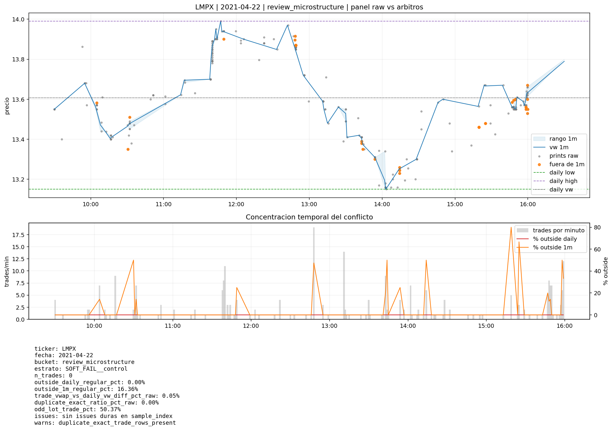

**Que muestra**

- Panel rico del tape raw frente a `daily` y `1m` para `LMPX` el `2021-04-22`.
- `n_trades = 270`, `outside_daily_regular_pct = 0.00%`, `outside_1m_regular_pct = 16.36%`.
- `trade_vwap_vs_daily_vw_diff_pct_raw = 0.05%`, `duplicate_exact_ratio_pct_raw = 0.00%`, `odd_lot_trade_pct = 50.37%`.

**Responde**

- Familia donde el dano vive en la textura fina del flujo: odd-lots, duplicados, bursts por timestamp o comparabilidad intraminuto. Responde a la pregunta de si el tape es economicamente interpretable pero metodologicamente delicado.
- Responde a si el conflicto dominante vive en la escala (`~1x`), en la comparabilidad frente a `daily` (0.00%) o frente a `1m` (16.36%).
- El 50.37% de odd-lots empuja la lectura hacia microestructura fina; evita leer el caso como pura ruptura economica gruesa.
- La decision que justifica es mantener o no el caso en `recoverable_with_flag` cuando se rematerialice la rehabilitacion sobre `57f`.

### MSL | 2019-06-07

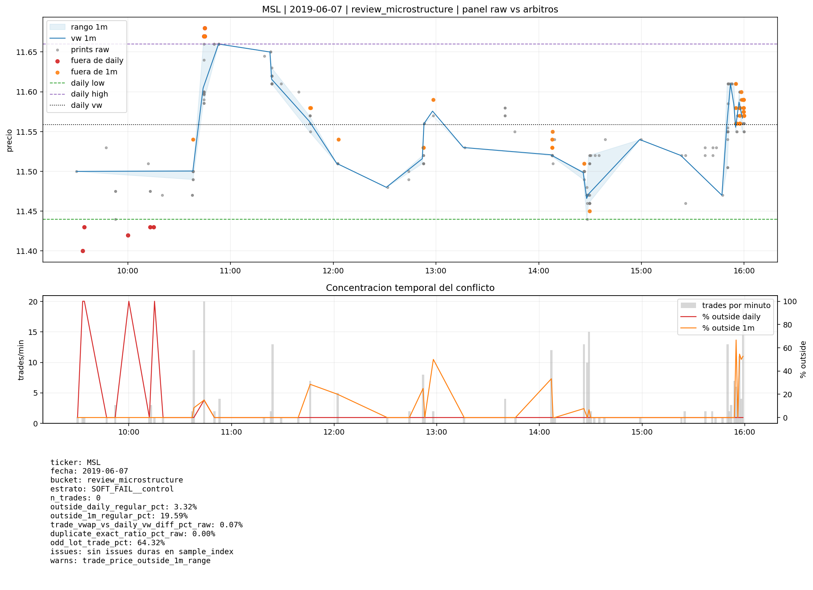

**Que muestra**

- Panel rico del tape raw frente a `daily` y `1m` para `MSL` el `2019-06-07`.
- `n_trades = 241`, `outside_daily_regular_pct = 3.32%`, `outside_1m_regular_pct = 19.59%`.
- `trade_vwap_vs_daily_vw_diff_pct_raw = 0.07%`, `duplicate_exact_ratio_pct_raw = 0.00%`, `odd_lot_trade_pct = 64.32%`.

**Responde**

- Familia donde el dano vive en la textura fina del flujo: odd-lots, duplicados, bursts por timestamp o comparabilidad intraminuto. Responde a la pregunta de si el tape es economicamente interpretable pero metodologicamente delicado.
- Responde a si el conflicto dominante vive en la escala (`~1x`), en la comparabilidad frente a `daily` (3.32%) o frente a `1m` (19.59%).
- El 64.32% de odd-lots empuja la lectura hacia microestructura fina; evita leer el caso como pura ruptura economica gruesa.
- La decision que justifica es mantener o no el caso en `recoverable_with_flag` cuando se rematerialice la rehabilitacion sobre `57f`.

### NRBO | 2024-04-01

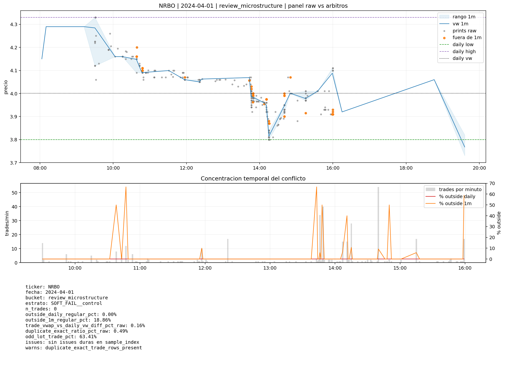

**Que muestra**

- Panel rico del tape raw frente a `daily` y `1m` para `NRBO` el `2024-04-01`.
- `n_trades = 410`, `outside_daily_regular_pct = 0.00%`, `outside_1m_regular_pct = 18.86%`.
- `trade_vwap_vs_daily_vw_diff_pct_raw = 0.16%`, `duplicate_exact_ratio_pct_raw = 0.49%`, `odd_lot_trade_pct = 63.41%`.

**Responde**

- Familia donde el dano vive en la textura fina del flujo: odd-lots, duplicados, bursts por timestamp o comparabilidad intraminuto. Responde a la pregunta de si el tape es economicamente interpretable pero metodologicamente delicado.
- Responde a si el conflicto dominante vive en la escala (`~1x`), en la comparabilidad frente a `daily` (0.00%) o frente a `1m` (18.86%).
- El 63.41% de odd-lots empuja la lectura hacia microestructura fina; evita leer el caso como pura ruptura economica gruesa.
- La decision que justifica es mantener o no el caso en `recoverable_with_flag` cuando se rematerialice la rehabilitacion sobre `57f`.

### ODV | 2023-07-05

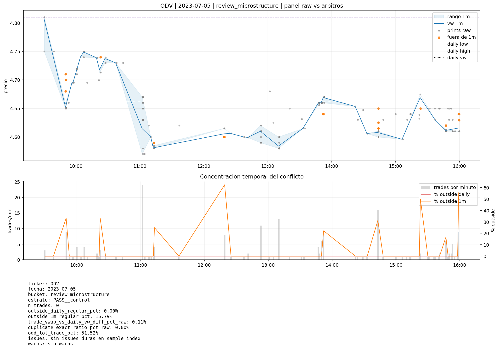

**Que muestra**

- Panel rico del tape raw frente a `daily` y `1m` para `ODV` el `2023-07-05`.
- `n_trades = 198`, `outside_daily_regular_pct = 0.00%`, `outside_1m_regular_pct = 15.79%`.
- `trade_vwap_vs_daily_vw_diff_pct_raw = 0.11%`, `duplicate_exact_ratio_pct_raw = 0.00%`, `odd_lot_trade_pct = 51.52%`.

**Responde**

- Familia donde el dano vive en la textura fina del flujo: odd-lots, duplicados, bursts por timestamp o comparabilidad intraminuto. Responde a la pregunta de si el tape es economicamente interpretable pero metodologicamente delicado.
- Responde a si el conflicto dominante vive en la escala (`~1x`), en la comparabilidad frente a `daily` (0.00%) o frente a `1m` (15.79%).
- El 51.52% de odd-lots empuja la lectura hacia microestructura fina; evita leer el caso como pura ruptura economica gruesa.
- La decision que justifica es mantener o no el caso en `recoverable_with_flag` cuando se rematerialice la rehabilitacion sobre `57f`.

### ORIQ | 2025-10-22

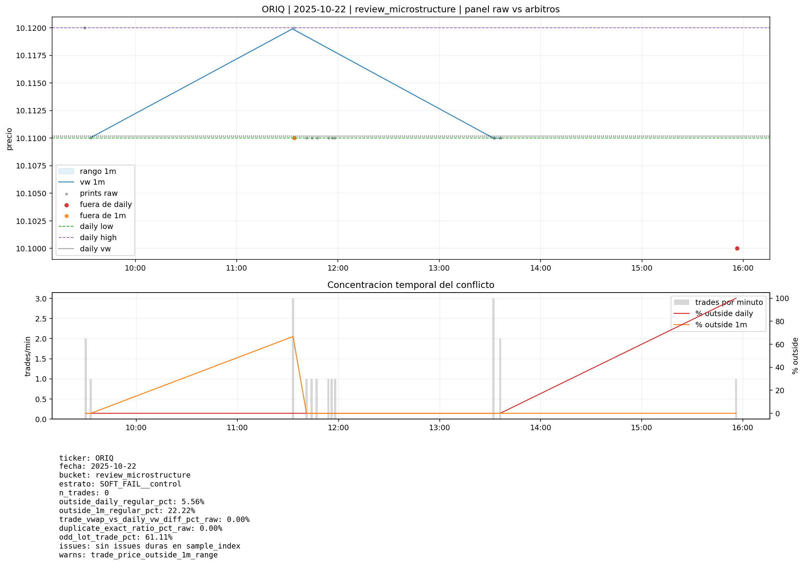

**Que muestra**

- Panel rico del tape raw frente a `daily` y `1m` para `ORIQ` el `2025-10-22`.
- `n_trades = 18`, `outside_daily_regular_pct = 5.56%`, `outside_1m_regular_pct = 22.22%`.
- `trade_vwap_vs_daily_vw_diff_pct_raw = 0.00%`, `duplicate_exact_ratio_pct_raw = 0.00%`, `odd_lot_trade_pct = 61.11%`.

**Responde**

- Familia donde el dano vive en la textura fina del flujo: odd-lots, duplicados, bursts por timestamp o comparabilidad intraminuto. Responde a la pregunta de si el tape es economicamente interpretable pero metodologicamente delicado.
- Responde a si el conflicto dominante vive en la escala (`~1x`), en la comparabilidad frente a `daily` (5.56%) o frente a `1m` (22.22%).
- El 61.11% de odd-lots empuja la lectura hacia microestructura fina; evita leer el caso como pura ruptura economica gruesa.
- La decision que justifica es mantener o no el caso en `recoverable_with_flag` cuando se rematerialice la rehabilitacion sobre `57f`.

### PTMN | 2023-06-15

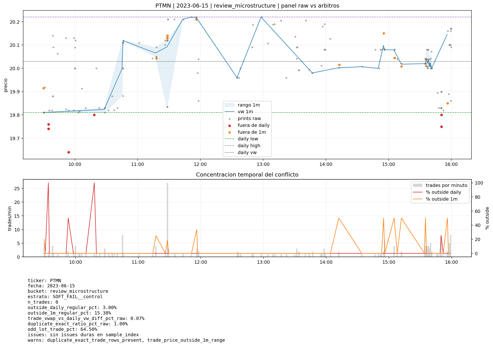

**Que muestra**

- Panel rico del tape raw frente a `daily` y `1m` para `PTMN` el `2023-06-15`.
- `n_trades = 200`, `outside_daily_regular_pct = 3.00%`, `outside_1m_regular_pct = 15.38%`.
- `trade_vwap_vs_daily_vw_diff_pct_raw = 0.07%`, `duplicate_exact_ratio_pct_raw = 1.00%`, `odd_lot_trade_pct = 64.50%`.

**Responde**

- Familia donde el dano vive en la textura fina del flujo: odd-lots, duplicados, bursts por timestamp o comparabilidad intraminuto. Responde a la pregunta de si el tape es economicamente interpretable pero metodologicamente delicado.
- Responde a si el conflicto dominante vive en la escala (`~1x`), en la comparabilidad frente a `daily` (3.00%) o frente a `1m` (15.38%).
- El 64.50% de odd-lots empuja la lectura hacia microestructura fina; evita leer el caso como pura ruptura economica gruesa.
- La decision que justifica es mantener o no el caso en `recoverable_with_flag` cuando se rematerialice la rehabilitacion sobre `57f`.

### AMTB | 2021-10-14

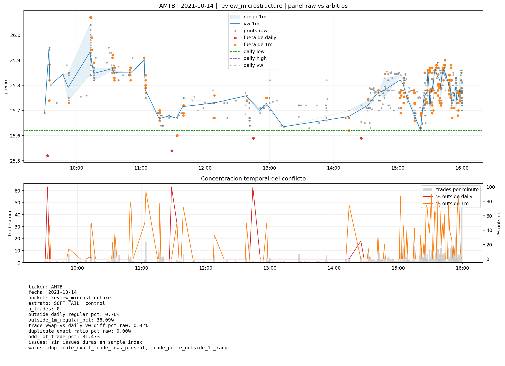

**Que muestra**

- Panel rico del tape raw frente a `daily` y `1m` para `AMTB` el `2021-10-14`.
- `n_trades = 788`, `outside_daily_regular_pct = 0.76%`, `outside_1m_regular_pct = 36.09%`.
- `trade_vwap_vs_daily_vw_diff_pct_raw = 0.02%`, `duplicate_exact_ratio_pct_raw = 0.00%`, `odd_lot_trade_pct = 81.47%`.

**Responde**

- Familia donde el dano vive en la textura fina del flujo: odd-lots, duplicados, bursts por timestamp o comparabilidad intraminuto. Responde a la pregunta de si el tape es economicamente interpretable pero metodologicamente delicado.
- Responde a si el conflicto dominante vive en la escala (`~1x`), en la comparabilidad frente a `daily` (0.76%) o frente a `1m` (36.09%).
- El 81.47% de odd-lots empuja la lectura hacia microestructura fina; evita leer el caso como pura ruptura economica gruesa.
- La decision que justifica es mantener o no el caso en `recoverable_with_flag` cuando se rematerialice la rehabilitacion sobre `57f`.

### BAER | 2023-07-28

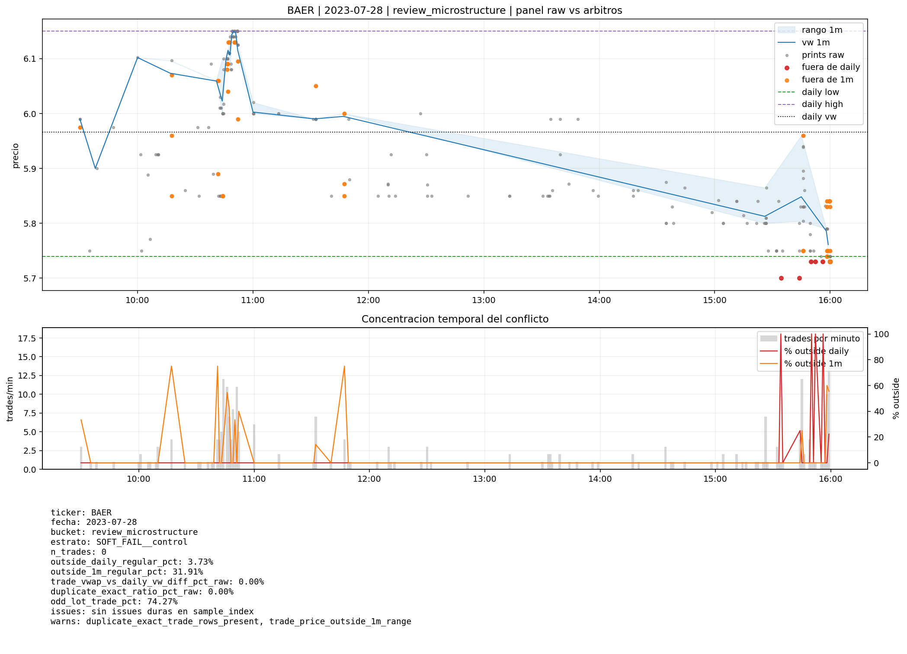

**Que muestra**

- Panel rico del tape raw frente a `daily` y `1m` para `BAER` el `2023-07-28`.
- `n_trades = 241`, `outside_daily_regular_pct = 3.73%`, `outside_1m_regular_pct = 31.91%`.
- `trade_vwap_vs_daily_vw_diff_pct_raw = 0.00%`, `duplicate_exact_ratio_pct_raw = 0.00%`, `odd_lot_trade_pct = 74.27%`.

**Responde**

- Familia donde el dano vive en la textura fina del flujo: odd-lots, duplicados, bursts por timestamp o comparabilidad intraminuto. Responde a la pregunta de si el tape es economicamente interpretable pero metodologicamente delicado.
- Responde a si el conflicto dominante vive en la escala (`~1x`), en la comparabilidad frente a `daily` (3.73%) o frente a `1m` (31.91%).
- El 74.27% de odd-lots empuja la lectura hacia microestructura fina; evita leer el caso como pura ruptura economica gruesa.
- La decision que justifica es mantener o no el caso en `recoverable_with_flag` cuando se rematerialice la rehabilitacion sobre `57f`.

### GWRS | 2023-06-06

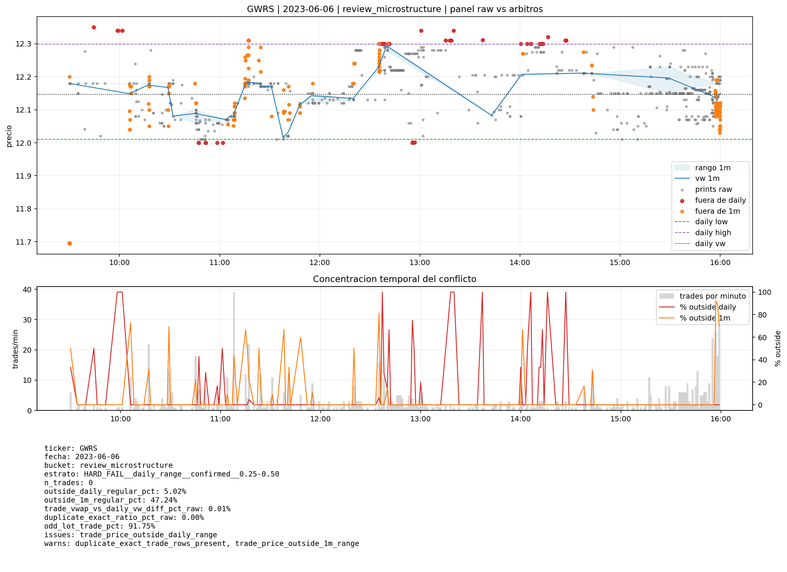

**Que muestra**

- Panel rico del tape raw frente a `daily` y `1m` para `GWRS` el `2023-06-06`.
- `n_trades = 897`, `outside_daily_regular_pct = 5.02%`, `outside_1m_regular_pct = 47.24%`.
- `trade_vwap_vs_daily_vw_diff_pct_raw = 0.01%`, `duplicate_exact_ratio_pct_raw = 0.00%`, `odd_lot_trade_pct = 91.75%`.

**Responde**

- Familia donde el dano vive en la textura fina del flujo: odd-lots, duplicados, bursts por timestamp o comparabilidad intraminuto. Responde a la pregunta de si el tape es economicamente interpretable pero metodologicamente delicado.
- Responde a si el conflicto dominante vive en la escala (`~1x`), en la comparabilidad frente a `daily` (5.02%) o frente a `1m` (47.24%).
- El 91.75% de odd-lots empuja la lectura hacia microestructura fina; evita leer el caso como pura ruptura economica gruesa.
- La decision que justifica es mantener o no el caso en `recoverable_with_flag` cuando se rematerialice la rehabilitacion sobre `57f`.

### GWRS | 2024-03-20

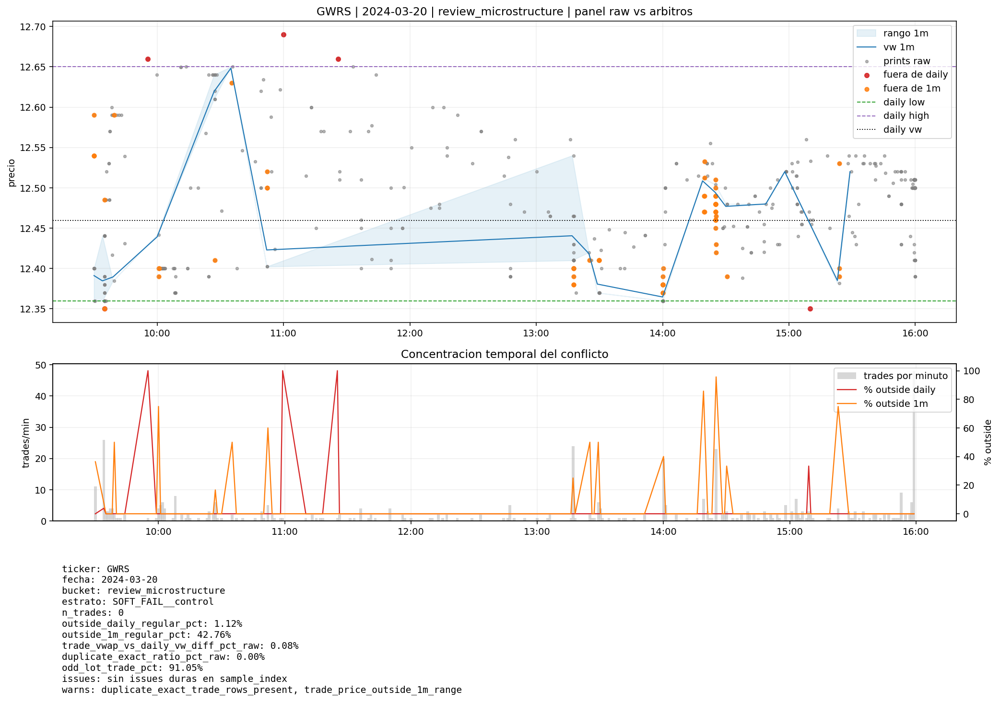

**Que muestra**

- Panel rico del tape raw frente a `daily` y `1m` para `GWRS` el `2024-03-20`.
- `n_trades = 447`, `outside_daily_regular_pct = 1.12%`, `outside_1m_regular_pct = 42.76%`.
- `trade_vwap_vs_daily_vw_diff_pct_raw = 0.08%`, `duplicate_exact_ratio_pct_raw = 0.00%`, `odd_lot_trade_pct = 91.05%`.

**Responde**

- Familia donde el dano vive en la textura fina del flujo: odd-lots, duplicados, bursts por timestamp o comparabilidad intraminuto. Responde a la pregunta de si el tape es economicamente interpretable pero metodologicamente delicado.
- Responde a si el conflicto dominante vive en la escala (`~1x`), en la comparabilidad frente a `daily` (1.12%) o frente a `1m` (42.76%).
- El 91.05% de odd-lots empuja la lectura hacia microestructura fina; evita leer el caso como pura ruptura economica gruesa.
- La decision que justifica es mantener o no el caso en `recoverable_with_flag` cuando se rematerialice la rehabilitacion sobre `57f`.

### PFIS | 2020-09-21

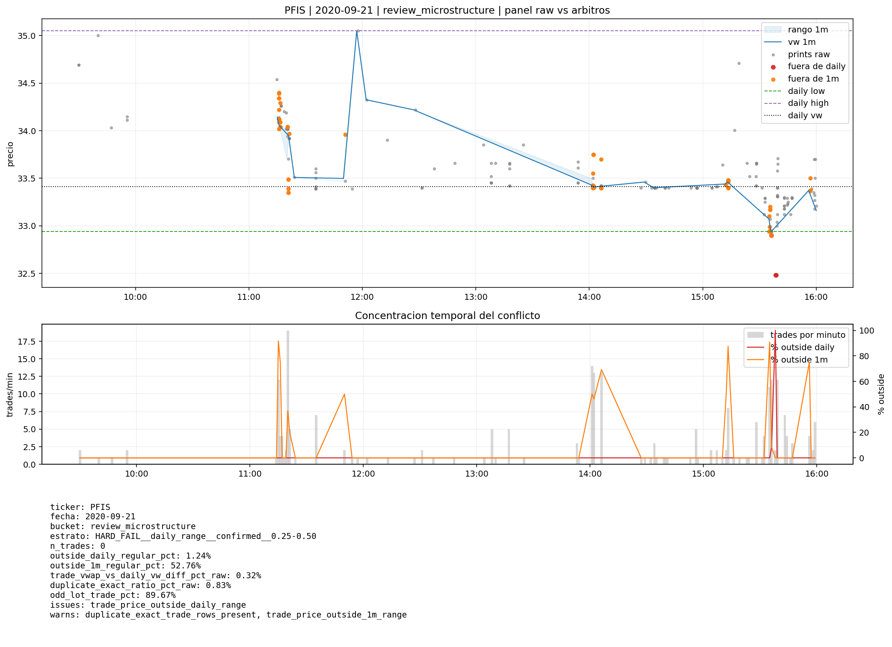

**Que muestra**

- Panel rico del tape raw frente a `daily` y `1m` para `PFIS` el `2020-09-21`.
- `n_trades = 242`, `outside_daily_regular_pct = 1.24%`, `outside_1m_regular_pct = 52.76%`.
- `trade_vwap_vs_daily_vw_diff_pct_raw = 0.32%`, `duplicate_exact_ratio_pct_raw = 0.83%`, `odd_lot_trade_pct = 89.67%`.

**Responde**

- Familia donde el dano vive en la textura fina del flujo: odd-lots, duplicados, bursts por timestamp o comparabilidad intraminuto. Responde a la pregunta de si el tape es economicamente interpretable pero metodologicamente delicado.
- Responde a si el conflicto dominante vive en la escala (`~1x`), en la comparabilidad frente a `daily` (1.24%) o frente a `1m` (52.76%).
- El 89.67% de odd-lots empuja la lectura hacia microestructura fina; evita leer el caso como pura ruptura economica gruesa.
- La decision que justifica es mantener o no el caso en `recoverable_with_flag` cuando se rematerialice la rehabilitacion sobre `57f`.

### RBB | 2025-12-15

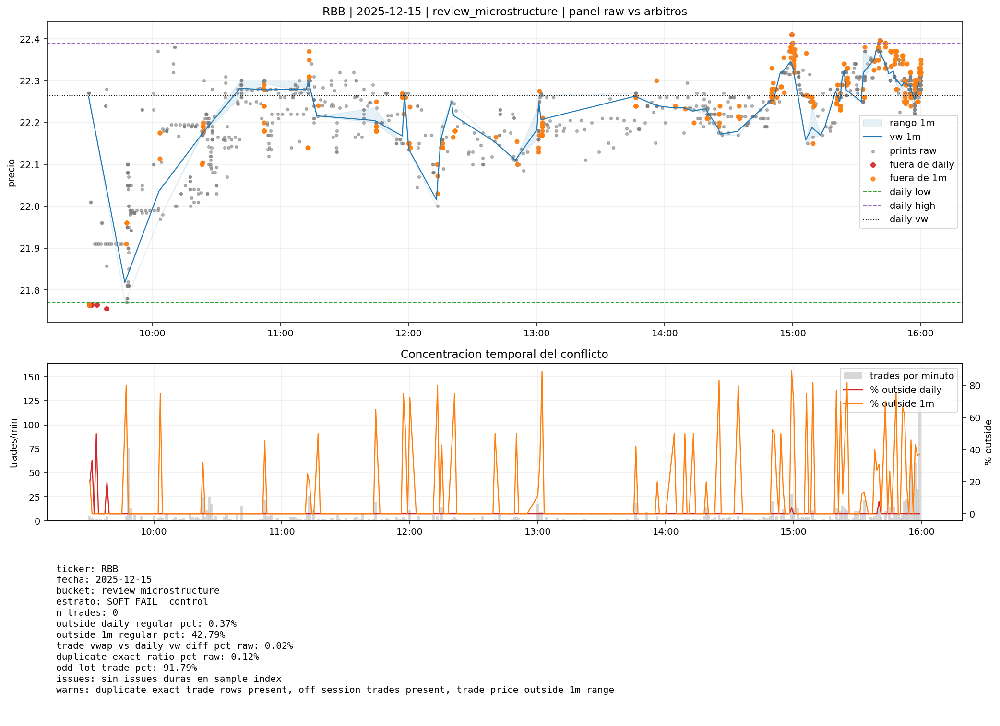

**Que muestra**

- Panel rico del tape raw frente a `daily` y `1m` para `RBB` el `2025-12-15`.
- `n_trades = 1,619`, `outside_daily_regular_pct = 0.37%`, `outside_1m_regular_pct = 42.79%`.
- `trade_vwap_vs_daily_vw_diff_pct_raw = 0.02%`, `duplicate_exact_ratio_pct_raw = 0.12%`, `odd_lot_trade_pct = 91.79%`.

**Responde**

- Familia donde el dano vive en la textura fina del flujo: odd-lots, duplicados, bursts por timestamp o comparabilidad intraminuto. Responde a la pregunta de si el tape es economicamente interpretable pero metodologicamente delicado.
- Responde a si el conflicto dominante vive en la escala (`~1x`), en la comparabilidad frente a `daily` (0.37%) o frente a `1m` (42.79%).
- El 91.79% de odd-lots empuja la lectura hacia microestructura fina; evita leer el caso como pura ruptura economica gruesa.
- La decision que justifica es mantener o no el caso en `recoverable_with_flag` cuando se rematerialice la rehabilitacion sobre `57f`.

### RVSB | 2023-07-27

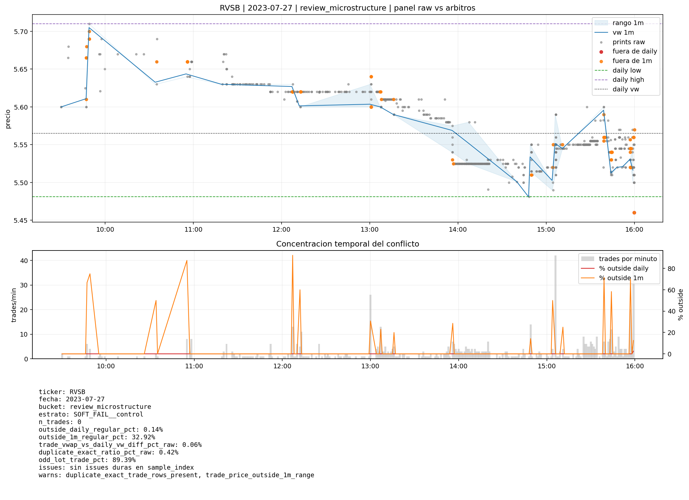

**Que muestra**

- Panel rico del tape raw frente a `daily` y `1m` para `RVSB` el `2023-07-27`.
- `n_trades = 716`, `outside_daily_regular_pct = 0.14%`, `outside_1m_regular_pct = 32.92%`.
- `trade_vwap_vs_daily_vw_diff_pct_raw = 0.06%`, `duplicate_exact_ratio_pct_raw = 0.42%`, `odd_lot_trade_pct = 89.39%`.

**Responde**

- Familia donde el dano vive en la textura fina del flujo: odd-lots, duplicados, bursts por timestamp o comparabilidad intraminuto. Responde a la pregunta de si el tape es economicamente interpretable pero metodologicamente delicado.
- Responde a si el conflicto dominante vive en la escala (`~1x`), en la comparabilidad frente a `daily` (0.14%) o frente a `1m` (32.92%).
- El 89.39% de odd-lots empuja la lectura hacia microestructura fina; evita leer el caso como pura ruptura economica gruesa.
- La decision que justifica es mantener o no el caso en `recoverable_with_flag` cuando se rematerialice la rehabilitacion sobre `57f`.

### VIEW | 2023-11-01

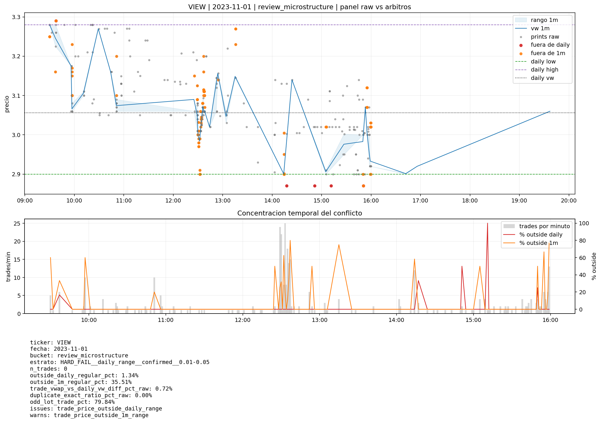

**Que muestra**

- Panel rico del tape raw frente a `daily` y `1m` para `VIEW` el `2023-11-01`.
- `n_trades = 372`, `outside_daily_regular_pct = 1.34%`, `outside_1m_regular_pct = 35.51%`.
- `trade_vwap_vs_daily_vw_diff_pct_raw = 0.72%`, `duplicate_exact_ratio_pct_raw = 0.00%`, `odd_lot_trade_pct = 79.84%`.

**Responde**

- Familia donde el dano vive en la textura fina del flujo: odd-lots, duplicados, bursts por timestamp o comparabilidad intraminuto. Responde a la pregunta de si el tape es economicamente interpretable pero metodologicamente delicado.
- Responde a si el conflicto dominante vive en la escala (`~1x`), en la comparabilidad frente a `daily` (1.34%) o frente a `1m` (35.51%).
- El 79.84% de odd-lots empuja la lectura hacia microestructura fina; evita leer el caso como pura ruptura economica gruesa.
- La decision que justifica es mantener o no el caso en `recoverable_with_flag` cuando se rematerialice la rehabilitacion sobre `57f`.

### VRTS | 2023-05-17

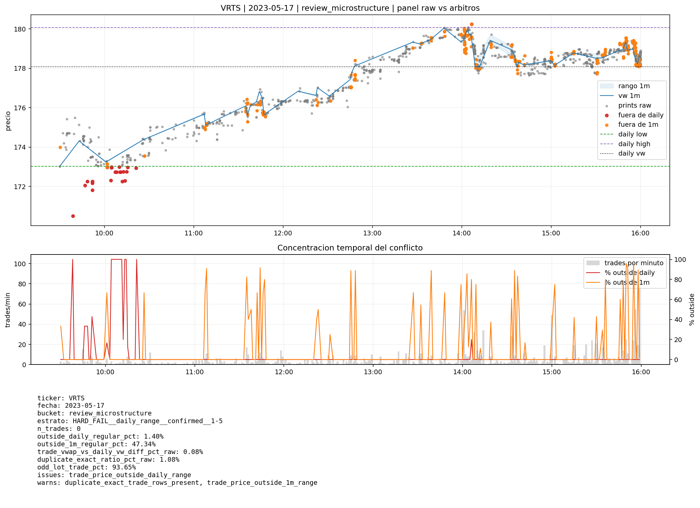

**Que muestra**

- Panel rico del tape raw frente a `daily` y `1m` para `VRTS` el `2023-05-17`.
- `n_trades = 1,574`, `outside_daily_regular_pct = 1.40%`, `outside_1m_regular_pct = 47.34%`.
- `trade_vwap_vs_daily_vw_diff_pct_raw = 0.08%`, `duplicate_exact_ratio_pct_raw = 1.08%`, `odd_lot_trade_pct = 93.65%`.

**Responde**

- Familia donde el dano vive en la textura fina del flujo: odd-lots, duplicados, bursts por timestamp o comparabilidad intraminuto. Responde a la pregunta de si el tape es economicamente interpretable pero metodologicamente delicado.
- Responde a si el conflicto dominante vive en la escala (`~1x`), en la comparabilidad frente a `daily` (1.40%) o frente a `1m` (47.34%).
- El 93.65% de odd-lots empuja la lectura hacia microestructura fina; evita leer el caso como pura ruptura economica gruesa.
- La decision que justifica es mantener o no el caso en `recoverable_with_flag` cuando se rematerialice la rehabilitacion sobre `57f`.

### BIOX | 2024-01-23

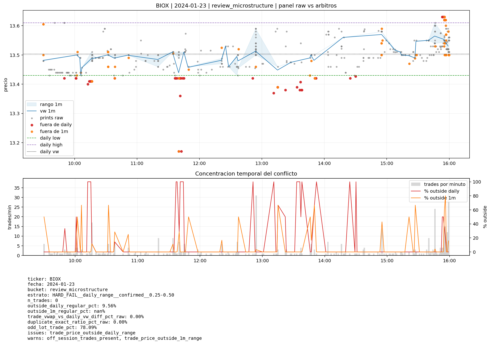

**Que muestra**

- Panel rico del tape raw frente a `daily` y `1m` para `BIOX` el `2024-01-23`.
- `n_trades = 502`, `outside_daily_regular_pct = 9.56%`, `outside_1m_regular_pct = nan%`.
- `trade_vwap_vs_daily_vw_diff_pct_raw = 0.00%`, `duplicate_exact_ratio_pct_raw = 0.00%`, `odd_lot_trade_pct = 78.09%`.

**Responde**

- Familia donde el dano vive en la textura fina del flujo: odd-lots, duplicados, bursts por timestamp o comparabilidad intraminuto. Responde a la pregunta de si el tape es economicamente interpretable pero metodologicamente delicado.
- Responde a si el conflicto dominante vive en la escala (`~1x`), en la comparabilidad frente a `daily` (9.56%) o frente a `1m` (nan%).
- El 78.09% de odd-lots empuja la lectura hacia microestructura fina; evita leer el caso como pura ruptura economica gruesa.
- La decision que justifica es mantener o no el caso en `recoverable_with_flag` cuando se rematerialice la rehabilitacion sobre `57f`.

### BRLS | 2025-10-22

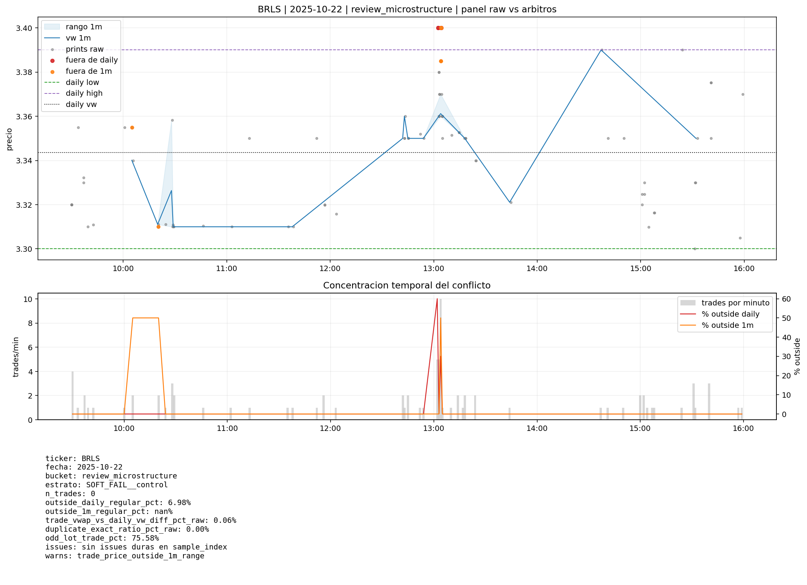

**Que muestra**

- Panel rico del tape raw frente a `daily` y `1m` para `BRLS` el `2025-10-22`.
- `n_trades = 86`, `outside_daily_regular_pct = 6.98%`, `outside_1m_regular_pct = nan%`.
- `trade_vwap_vs_daily_vw_diff_pct_raw = 0.06%`, `duplicate_exact_ratio_pct_raw = 0.00%`, `odd_lot_trade_pct = 75.58%`.

**Responde**

- Familia donde el dano vive en la textura fina del flujo: odd-lots, duplicados, bursts por timestamp o comparabilidad intraminuto. Responde a la pregunta de si el tape es economicamente interpretable pero metodologicamente delicado.
- Responde a si el conflicto dominante vive en la escala (`~1x`), en la comparabilidad frente a `daily` (6.98%) o frente a `1m` (nan%).
- El 75.58% de odd-lots empuja la lectura hacia microestructura fina; evita leer el caso como pura ruptura economica gruesa.
- La decision que justifica es mantener o no el caso en `recoverable_with_flag` cuando se rematerialice la rehabilitacion sobre `57f`.

### CABO | 2019-03-20

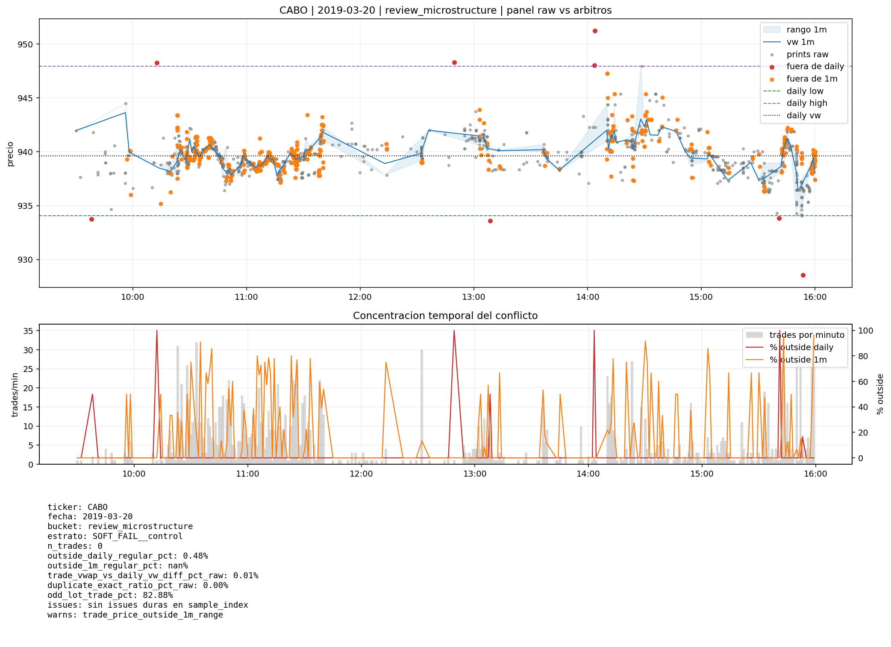

**Que muestra**

- Panel rico del tape raw frente a `daily` y `1m` para `CABO` el `2019-03-20`.
- `n_trades = 1,665`, `outside_daily_regular_pct = 0.48%`, `outside_1m_regular_pct = nan%`.
- `trade_vwap_vs_daily_vw_diff_pct_raw = 0.01%`, `duplicate_exact_ratio_pct_raw = 0.00%`, `odd_lot_trade_pct = 82.88%`.

**Responde**

- Familia donde el dano vive en la textura fina del flujo: odd-lots, duplicados, bursts por timestamp o comparabilidad intraminuto. Responde a la pregunta de si el tape es economicamente interpretable pero metodologicamente delicado.
- Responde a si el conflicto dominante vive en la escala (`~1x`), en la comparabilidad frente a `daily` (0.48%) o frente a `1m` (nan%).
- El 82.88% de odd-lots empuja la lectura hacia microestructura fina; evita leer el caso como pura ruptura economica gruesa.
- La decision que justifica es mantener o no el caso en `recoverable_with_flag` cuando se rematerialice la rehabilitacion sobre `57f`.

### CVU | 2023-03-24

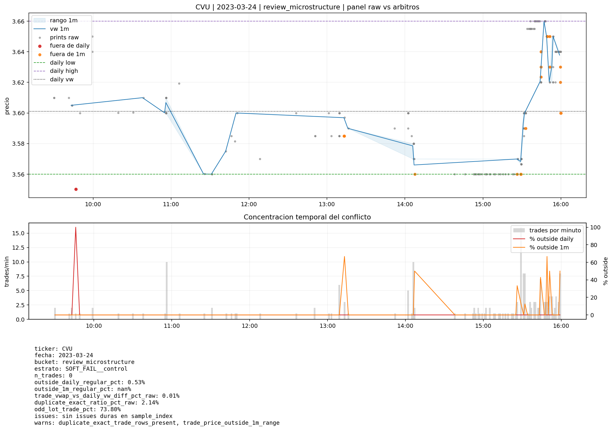

**Que muestra**

- Panel rico del tape raw frente a `daily` y `1m` para `CVU` el `2023-03-24`.
- `n_trades = 187`, `outside_daily_regular_pct = 0.53%`, `outside_1m_regular_pct = nan%`.
- `trade_vwap_vs_daily_vw_diff_pct_raw = 0.01%`, `duplicate_exact_ratio_pct_raw = 2.14%`, `odd_lot_trade_pct = 73.80%`.

**Responde**

- Familia donde el dano vive en la textura fina del flujo: odd-lots, duplicados, bursts por timestamp o comparabilidad intraminuto. Responde a la pregunta de si el tape es economicamente interpretable pero metodologicamente delicado.
- Responde a si el conflicto dominante vive en la escala (`~1x`), en la comparabilidad frente a `daily` (0.53%) o frente a `1m` (nan%).
- El 73.80% de odd-lots empuja la lectura hacia microestructura fina; evita leer el caso como pura ruptura economica gruesa.
- La decision que justifica es mantener o no el caso en `recoverable_with_flag` cuando se rematerialice la rehabilitacion sobre `57f`.

### EGLE | 2025-06-09

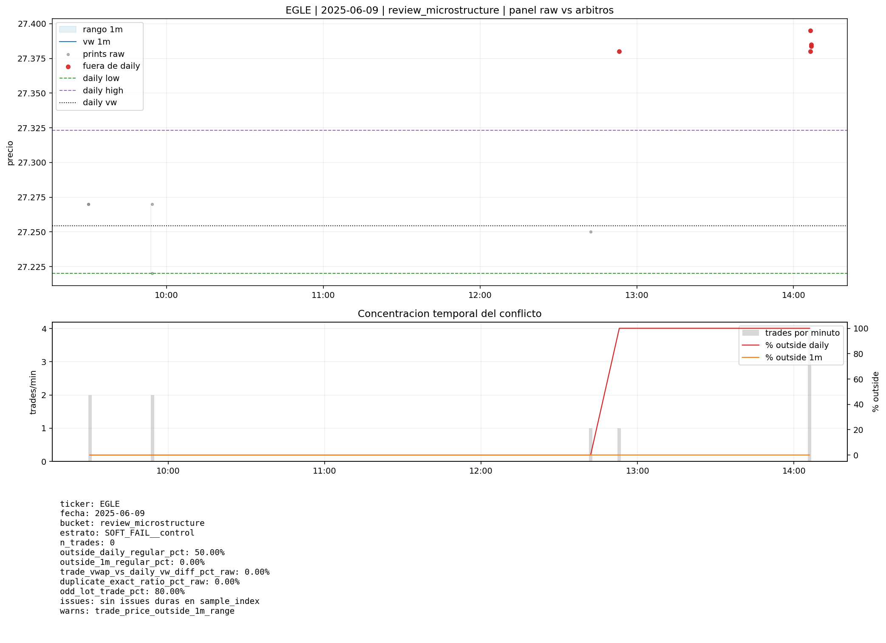

**Que muestra**

- Panel rico del tape raw frente a `daily` y `1m` para `EGLE` el `2025-06-09`.
- `n_trades = 10`, `outside_daily_regular_pct = 50.00%`, `outside_1m_regular_pct = 0.00%`.
- `trade_vwap_vs_daily_vw_diff_pct_raw = 0.00%`, `duplicate_exact_ratio_pct_raw = 0.00%`, `odd_lot_trade_pct = 80.00%`.

**Responde**

- Familia donde el dano vive en la textura fina del flujo: odd-lots, duplicados, bursts por timestamp o comparabilidad intraminuto. Responde a la pregunta de si el tape es economicamente interpretable pero metodologicamente delicado.
- Responde a si el conflicto dominante vive en la escala (`~1x`), en la comparabilidad frente a `daily` (50.00%) o frente a `1m` (0.00%).
- El 80.00% de odd-lots empuja la lectura hacia microestructura fina; evita leer el caso como pura ruptura economica gruesa.
- La decision que justifica es mantener o no el caso en `recoverable_with_flag` cuando se rematerialice la rehabilitacion sobre `57f`.

### LFCR | 2023-08-14

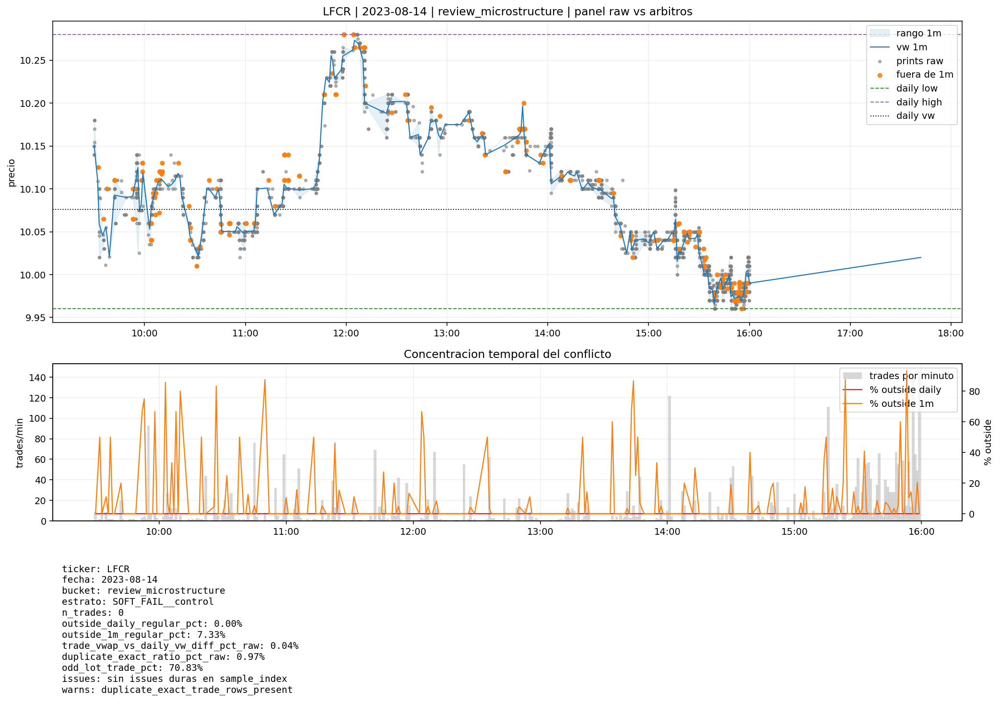

**Que muestra**

- Panel rico del tape raw frente a `daily` y `1m` para `LFCR` el `2023-08-14`.
- `n_trades = 3,919`, `outside_daily_regular_pct = 0.00%`, `outside_1m_regular_pct = 7.33%`.
- `trade_vwap_vs_daily_vw_diff_pct_raw = 0.04%`, `duplicate_exact_ratio_pct_raw = 0.97%`, `odd_lot_trade_pct = 70.83%`.

**Responde**

- Familia donde el dano vive en la textura fina del flujo: odd-lots, duplicados, bursts por timestamp o comparabilidad intraminuto. Responde a la pregunta de si el tape es economicamente interpretable pero metodologicamente delicado.
- Responde a si el conflicto dominante vive en la escala (`~1x`), en la comparabilidad frente a `daily` (0.00%) o frente a `1m` (7.33%).
- El 70.83% de odd-lots empuja la lectura hacia microestructura fina; evita leer el caso como pura ruptura economica gruesa.
- La decision que justifica es mantener o no el caso en `recoverable_with_flag` cuando se rematerialice la rehabilitacion sobre `57f`.

### PTVCB | 2019-09-26

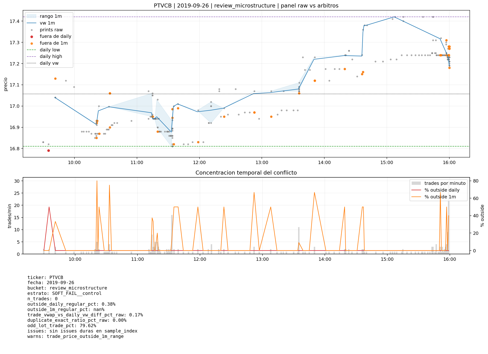

**Que muestra**

- Panel rico del tape raw frente a `daily` y `1m` para `PTVCB` el `2019-09-26`.
- `n_trades = 260`, `outside_daily_regular_pct = 0.38%`, `outside_1m_regular_pct = nan%`.
- `trade_vwap_vs_daily_vw_diff_pct_raw = 0.17%`, `duplicate_exact_ratio_pct_raw = 0.00%`, `odd_lot_trade_pct = 79.62%`.

**Responde**

- Familia donde el dano vive en la textura fina del flujo: odd-lots, duplicados, bursts por timestamp o comparabilidad intraminuto. Responde a la pregunta de si el tape es economicamente interpretable pero metodologicamente delicado.
- Responde a si el conflicto dominante vive en la escala (`~1x`), en la comparabilidad frente a `daily` (0.38%) o frente a `1m` (nan%).
- El 79.62% de odd-lots empuja la lectura hacia microestructura fina; evita leer el caso como pura ruptura economica gruesa.
- La decision que justifica es mantener o no el caso en `recoverable_with_flag` cuando se rematerialice la rehabilitacion sobre `57f`.

### TACT | 2025-05-01

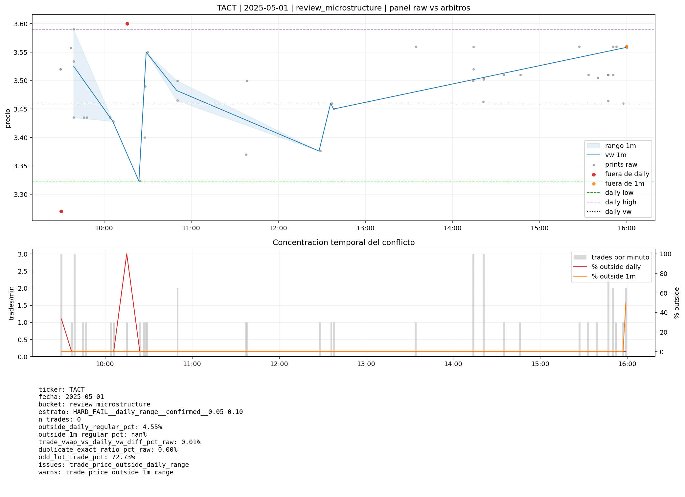

**Que muestra**

- Panel rico del tape raw frente a `daily` y `1m` para `TACT` el `2025-05-01`.
- `n_trades = 44`, `outside_daily_regular_pct = 4.55%`, `outside_1m_regular_pct = nan%`.
- `trade_vwap_vs_daily_vw_diff_pct_raw = 0.01%`, `duplicate_exact_ratio_pct_raw = 0.00%`, `odd_lot_trade_pct = 72.73%`.

**Responde**

- Familia donde el dano vive en la textura fina del flujo: odd-lots, duplicados, bursts por timestamp o comparabilidad intraminuto. Responde a la pregunta de si el tape es economicamente interpretable pero metodologicamente delicado.
- Responde a si el conflicto dominante vive en la escala (`~1x`), en la comparabilidad frente a `daily` (4.55%) o frente a `1m` (nan%).
- El 72.73% de odd-lots empuja la lectura hacia microestructura fina; evita leer el caso como pura ruptura economica gruesa.
- La decision que justifica es mantener o no el caso en `recoverable_with_flag` cuando se rematerialice la rehabilitacion sobre `57f`.

### TITN | 2023-10-30

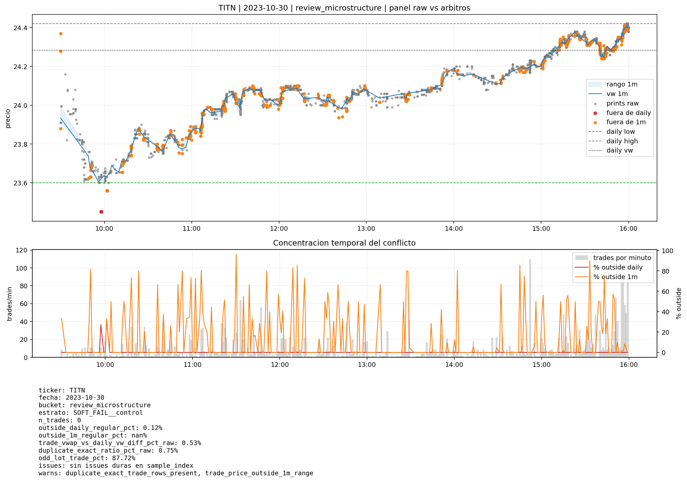

**Que muestra**

- Panel rico del tape raw frente a `daily` y `1m` para `TITN` el `2023-10-30`.
- `n_trades = 3,348`, `outside_daily_regular_pct = 0.12%`, `outside_1m_regular_pct = nan%`.
- `trade_vwap_vs_daily_vw_diff_pct_raw = 0.53%`, `duplicate_exact_ratio_pct_raw = 0.75%`, `odd_lot_trade_pct = 87.72%`.

**Responde**

- Familia donde el dano vive en la textura fina del flujo: odd-lots, duplicados, bursts por timestamp o comparabilidad intraminuto. Responde a la pregunta de si el tape es economicamente interpretable pero metodologicamente delicado.
- Responde a si el conflicto dominante vive en la escala (`~1x`), en la comparabilidad frente a `daily` (0.12%) o frente a `1m` (nan%).
- El 87.72% de odd-lots empuja la lectura hacia microestructura fina; evita leer el caso como pura ruptura economica gruesa.
- La decision que justifica es mantener o no el caso en `recoverable_with_flag` cuando se rematerialice la rehabilitacion sobre `57f`.

### TRDA | 2023-09-26

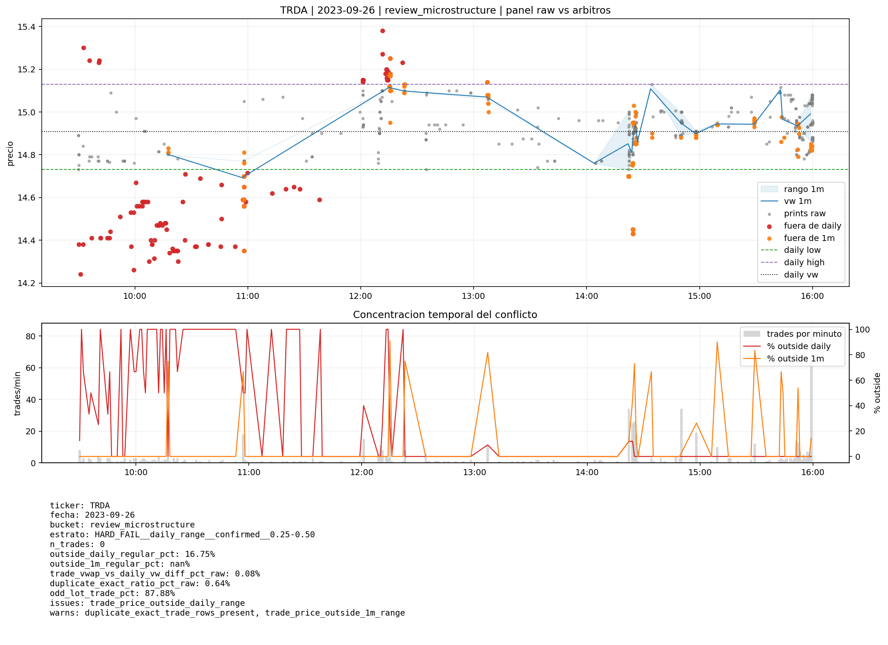

**Que muestra**

- Panel rico del tape raw frente a `daily` y `1m` para `TRDA` el `2023-09-26`.
- `n_trades = 627`, `outside_daily_regular_pct = 16.75%`, `outside_1m_regular_pct = nan%`.
- `trade_vwap_vs_daily_vw_diff_pct_raw = 0.08%`, `duplicate_exact_ratio_pct_raw = 0.64%`, `odd_lot_trade_pct = 87.88%`.

**Responde**

- Familia donde el dano vive en la textura fina del flujo: odd-lots, duplicados, bursts por timestamp o comparabilidad intraminuto. Responde a la pregunta de si el tape es economicamente interpretable pero metodologicamente delicado.
- Responde a si el conflicto dominante vive en la escala (`~1x`), en la comparabilidad frente a `daily` (16.75%) o frente a `1m` (nan%).
- El 87.88% de odd-lots empuja la lectura hacia microestructura fina; evita leer el caso como pura ruptura economica gruesa.
- La decision que justifica es mantener o no el caso en `recoverable_with_flag` cuando se rematerialice la rehabilitacion sobre `57f`.

### CBRL | 2024-01-08

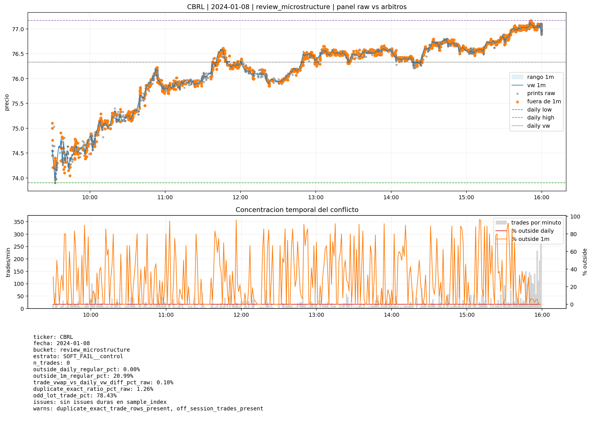

**Que muestra**

- Panel rico del tape raw frente a `daily` y `1m` para `CBRL` el `2024-01-08`.
- `n_trades = 8,483`, `outside_daily_regular_pct = 0.00%`, `outside_1m_regular_pct = 20.99%`.
- `trade_vwap_vs_daily_vw_diff_pct_raw = 0.10%`, `duplicate_exact_ratio_pct_raw = 1.26%`, `odd_lot_trade_pct = 78.43%`.

**Responde**

- Familia donde el dano vive en la textura fina del flujo: odd-lots, duplicados, bursts por timestamp o comparabilidad intraminuto. Responde a la pregunta de si el tape es economicamente interpretable pero metodologicamente delicado.
- Responde a si el conflicto dominante vive en la escala (`~1x`), en la comparabilidad frente a `daily` (0.00%) o frente a `1m` (20.99%).
- El 78.43% de odd-lots empuja la lectura hacia microestructura fina; evita leer el caso como pura ruptura economica gruesa.
- La decision que justifica es mantener o no el caso en `recoverable_with_flag` cuando se rematerialice la rehabilitacion sobre `57f`.

### CLWT | 2025-03-05

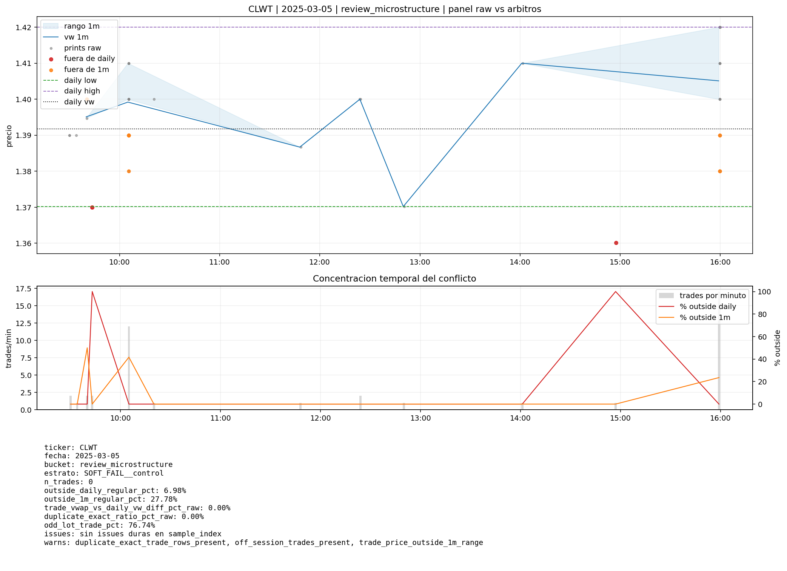

**Que muestra**

- Panel rico del tape raw frente a `daily` y `1m` para `CLWT` el `2025-03-05`.
- `n_trades = 43`, `outside_daily_regular_pct = 6.98%`, `outside_1m_regular_pct = 27.78%`.
- `trade_vwap_vs_daily_vw_diff_pct_raw = 0.00%`, `duplicate_exact_ratio_pct_raw = 0.00%`, `odd_lot_trade_pct = 76.74%`.

**Responde**

- Familia donde el dano vive en la textura fina del flujo: odd-lots, duplicados, bursts por timestamp o comparabilidad intraminuto. Responde a la pregunta de si el tape es economicamente interpretable pero metodologicamente delicado.
- Responde a si el conflicto dominante vive en la escala (`~1x`), en la comparabilidad frente a `daily` (6.98%) o frente a `1m` (27.78%).
- El 76.74% de odd-lots empuja la lectura hacia microestructura fina; evita leer el caso como pura ruptura economica gruesa.
- La decision que justifica es mantener o no el caso en `recoverable_with_flag` cuando se rematerialice la rehabilitacion sobre `57f`.

### FNHC | 2020-01-07

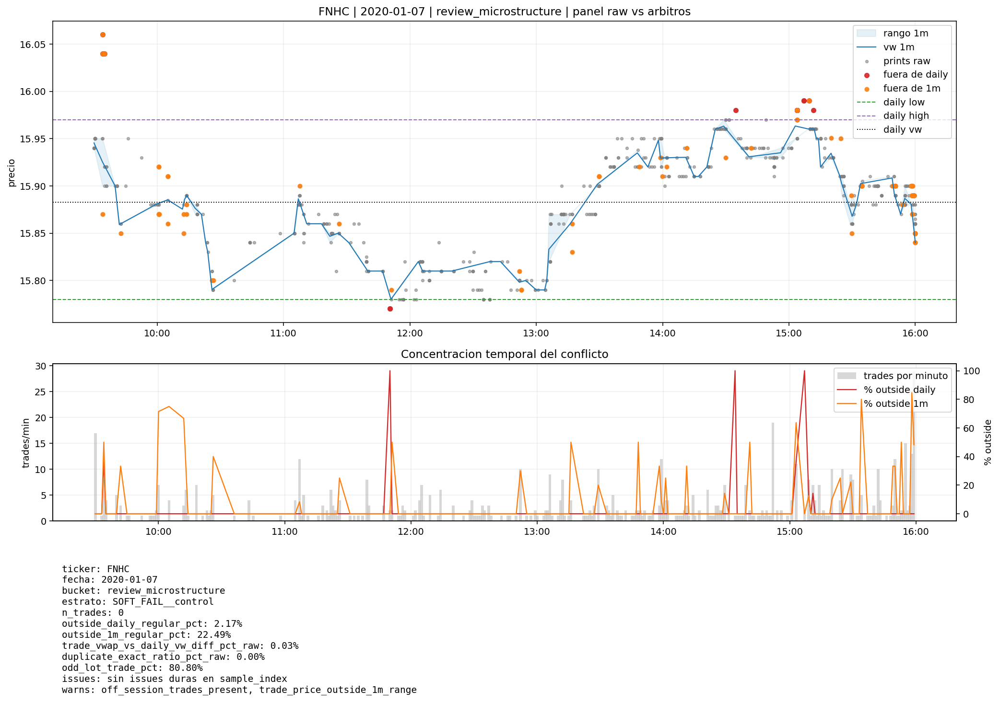

**Que muestra**

- Panel rico del tape raw frente a `daily` y `1m` para `FNHC` el `2020-01-07`.
- `n_trades = 646`, `outside_daily_regular_pct = 2.17%`, `outside_1m_regular_pct = 22.49%`.
- `trade_vwap_vs_daily_vw_diff_pct_raw = 0.03%`, `duplicate_exact_ratio_pct_raw = 0.00%`, `odd_lot_trade_pct = 80.80%`.

**Responde**

- Familia donde el dano vive en la textura fina del flujo: odd-lots, duplicados, bursts por timestamp o comparabilidad intraminuto. Responde a la pregunta de si el tape es economicamente interpretable pero metodologicamente delicado.
- Responde a si el conflicto dominante vive en la escala (`~1x`), en la comparabilidad frente a `daily` (2.17%) o frente a `1m` (22.49%).
- El 80.80% de odd-lots empuja la lectura hacia microestructura fina; evita leer el caso como pura ruptura economica gruesa.
- La decision que justifica es mantener o no el caso en `recoverable_with_flag` cuando se rematerialice la rehabilitacion sobre `57f`.

### GCO | 2026-02-05

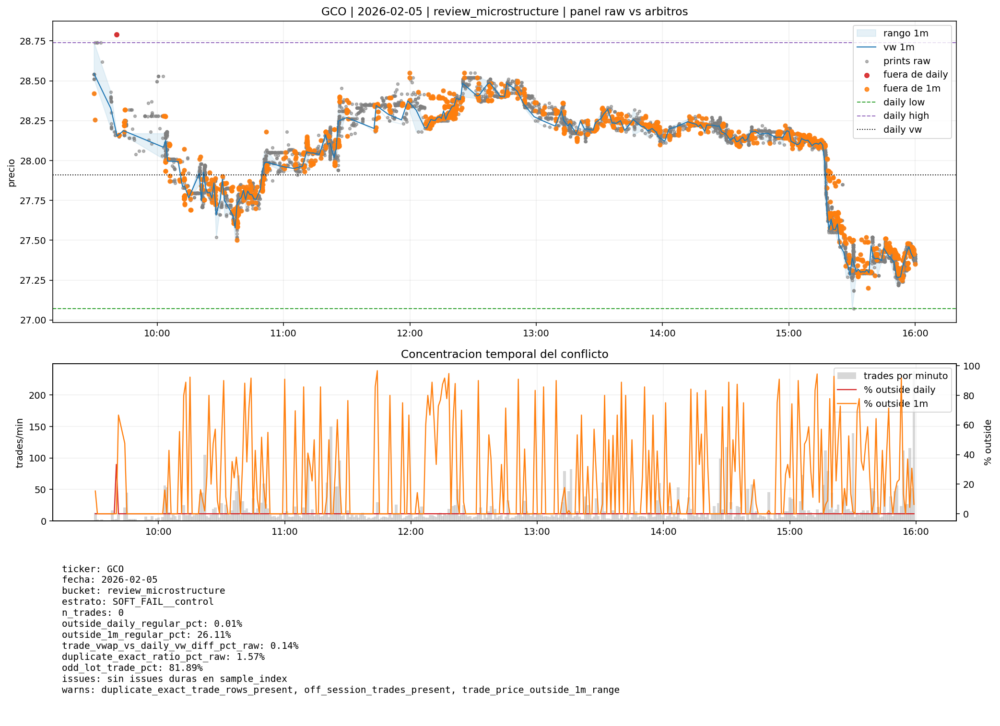

**Que muestra**

- Panel rico del tape raw frente a `daily` y `1m` para `GCO` el `2026-02-05`.
- `n_trades = 6,936`, `outside_daily_regular_pct = 0.01%`, `outside_1m_regular_pct = 26.11%`.
- `trade_vwap_vs_daily_vw_diff_pct_raw = 0.14%`, `duplicate_exact_ratio_pct_raw = 1.57%`, `odd_lot_trade_pct = 81.89%`.

**Responde**

- Familia donde el dano vive en la textura fina del flujo: odd-lots, duplicados, bursts por timestamp o comparabilidad intraminuto. Responde a la pregunta de si el tape es economicamente interpretable pero metodologicamente delicado.
- Responde a si el conflicto dominante vive en la escala (`~1x`), en la comparabilidad frente a `daily` (0.01%) o frente a `1m` (26.11%).
- El 81.89% de odd-lots empuja la lectura hacia microestructura fina; evita leer el caso como pura ruptura economica gruesa.
- La decision que justifica es mantener o no el caso en `recoverable_with_flag` cuando se rematerialice la rehabilitacion sobre `57f`.

### GHM | 2023-05-08

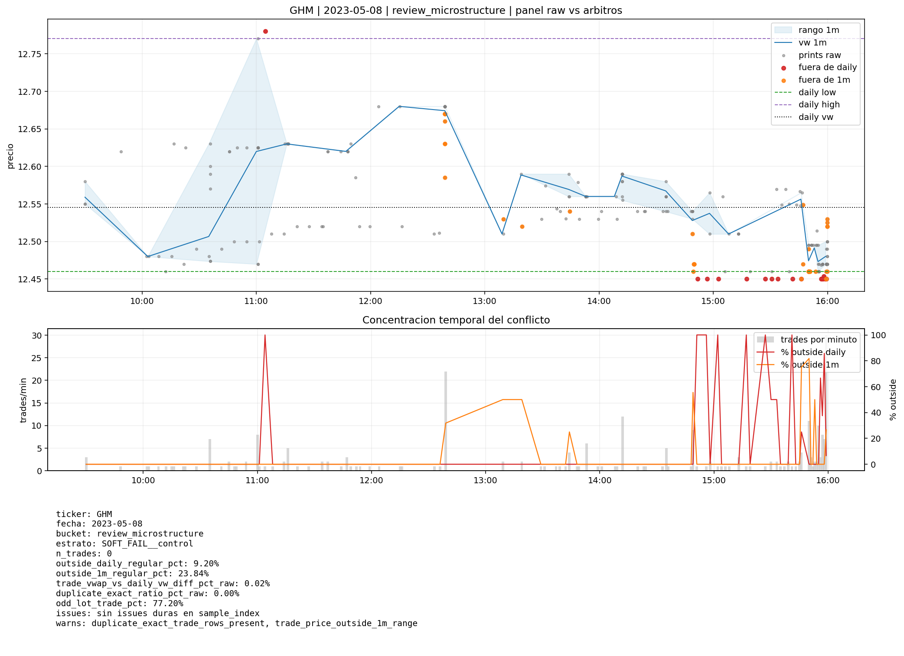

**Que muestra**

- Panel rico del tape raw frente a `daily` y `1m` para `GHM` el `2023-05-08`.
- `n_trades = 250`, `outside_daily_regular_pct = 9.20%`, `outside_1m_regular_pct = 23.84%`.
- `trade_vwap_vs_daily_vw_diff_pct_raw = 0.02%`, `duplicate_exact_ratio_pct_raw = 0.00%`, `odd_lot_trade_pct = 77.20%`.

**Responde**

- Familia donde el dano vive en la textura fina del flujo: odd-lots, duplicados, bursts por timestamp o comparabilidad intraminuto. Responde a la pregunta de si el tape es economicamente interpretable pero metodologicamente delicado.
- Responde a si el conflicto dominante vive en la escala (`~1x`), en la comparabilidad frente a `daily` (9.20%) o frente a `1m` (23.84%).
- El 77.20% de odd-lots empuja la lectura hacia microestructura fina; evita leer el caso como pura ruptura economica gruesa.
- La decision que justifica es mantener o no el caso en `recoverable_with_flag` cuando se rematerialice la rehabilitacion sobre `57f`.

### GNSS | 2025-09-16

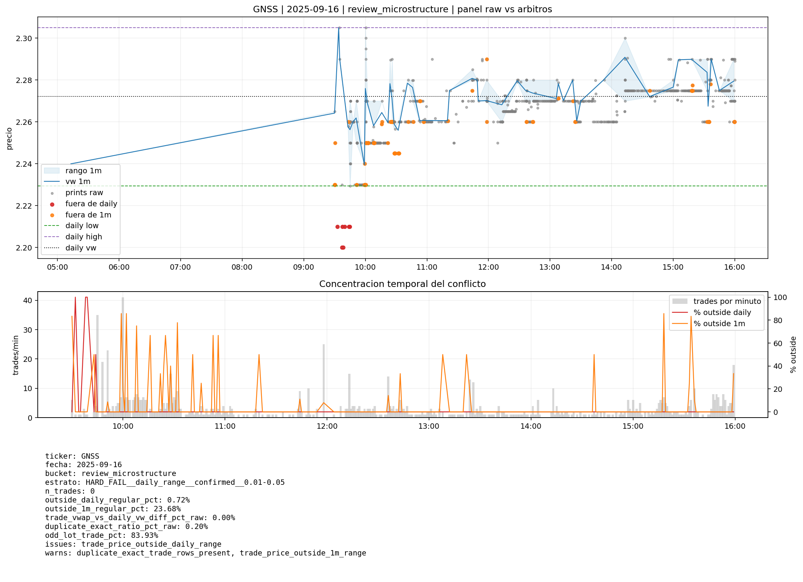

**Que muestra**

- Panel rico del tape raw frente a `daily` y `1m` para `GNSS` el `2025-09-16`.
- `n_trades = 977`, `outside_daily_regular_pct = 0.72%`, `outside_1m_regular_pct = 23.68%`.
- `trade_vwap_vs_daily_vw_diff_pct_raw = 0.00%`, `duplicate_exact_ratio_pct_raw = 0.20%`, `odd_lot_trade_pct = 83.93%`.

**Responde**

- Familia donde el dano vive en la textura fina del flujo: odd-lots, duplicados, bursts por timestamp o comparabilidad intraminuto. Responde a la pregunta de si el tape es economicamente interpretable pero metodologicamente delicado.
- Responde a si el conflicto dominante vive en la escala (`~1x`), en la comparabilidad frente a `daily` (0.72%) o frente a `1m` (23.68%).
- El 83.93% de odd-lots empuja la lectura hacia microestructura fina; evita leer el caso como pura ruptura economica gruesa.
- La decision que justifica es mantener o no el caso en `recoverable_with_flag` cuando se rematerialice la rehabilitacion sobre `57f`.

### GROW | 2022-07-05

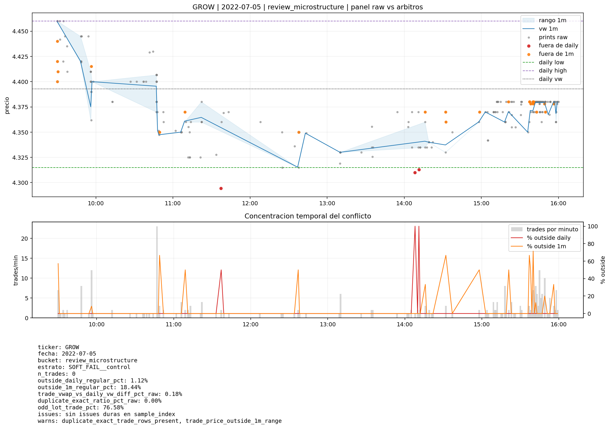

**Que muestra**

- Panel rico del tape raw frente a `daily` y `1m` para `GROW` el `2022-07-05`.
- `n_trades = 269`, `outside_daily_regular_pct = 1.12%`, `outside_1m_regular_pct = 18.44%`.
- `trade_vwap_vs_daily_vw_diff_pct_raw = 0.18%`, `duplicate_exact_ratio_pct_raw = 0.00%`, `odd_lot_trade_pct = 76.58%`.

**Responde**

- Familia donde el dano vive en la textura fina del flujo: odd-lots, duplicados, bursts por timestamp o comparabilidad intraminuto. Responde a la pregunta de si el tape es economicamente interpretable pero metodologicamente delicado.
- Responde a si el conflicto dominante vive en la escala (`~1x`), en la comparabilidad frente a `daily` (1.12%) o frente a `1m` (18.44%).
- El 76.58% de odd-lots empuja la lectura hacia microestructura fina; evita leer el caso como pura ruptura economica gruesa.
- La decision que justifica es mantener o no el caso en `recoverable_with_flag` cuando se rematerialice la rehabilitacion sobre `57f`.

### JELD | 2024-04-03

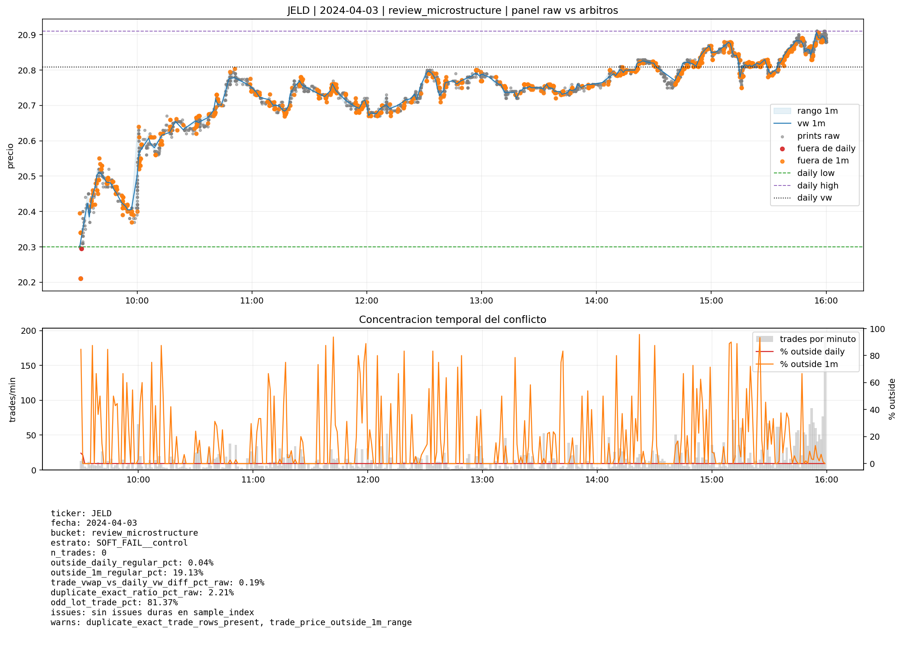

**Que muestra**

- Panel rico del tape raw frente a `daily` y `1m` para `JELD` el `2024-04-03`.
- `n_trades = 5,330`, `outside_daily_regular_pct = 0.04%`, `outside_1m_regular_pct = 19.13%`.
- `trade_vwap_vs_daily_vw_diff_pct_raw = 0.19%`, `duplicate_exact_ratio_pct_raw = 2.21%`, `odd_lot_trade_pct = 81.37%`.

**Responde**

- Familia donde el dano vive en la textura fina del flujo: odd-lots, duplicados, bursts por timestamp o comparabilidad intraminuto. Responde a la pregunta de si el tape es economicamente interpretable pero metodologicamente delicado.
- Responde a si el conflicto dominante vive en la escala (`~1x`), en la comparabilidad frente a `daily` (0.04%) o frente a `1m` (19.13%).
- El 81.37% de odd-lots empuja la lectura hacia microestructura fina; evita leer el caso como pura ruptura economica gruesa.
- La decision que justifica es mantener o no el caso en `recoverable_with_flag` cuando se rematerialice la rehabilitacion sobre `57f`.

### KLC | 2025-08-04

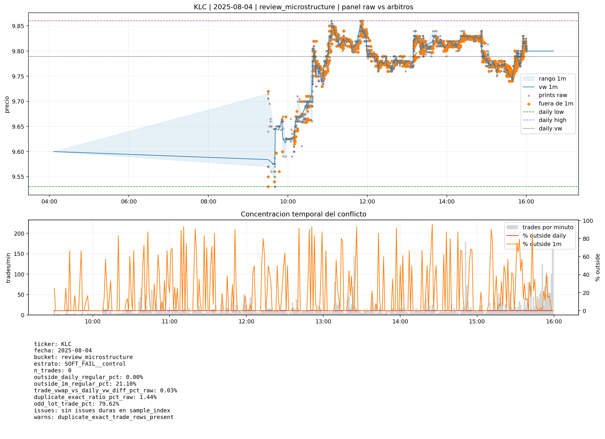

**Que muestra**

- Panel rico del tape raw frente a `daily` y `1m` para `KLC` el `2025-08-04`.
- `n_trades = 6,380`, `outside_daily_regular_pct = 0.00%`, `outside_1m_regular_pct = 21.10%`.
- `trade_vwap_vs_daily_vw_diff_pct_raw = 0.03%`, `duplicate_exact_ratio_pct_raw = 1.44%`, `odd_lot_trade_pct = 79.62%`.

**Responde**

- Familia donde el dano vive en la textura fina del flujo: odd-lots, duplicados, bursts por timestamp o comparabilidad intraminuto. Responde a la pregunta de si el tape es economicamente interpretable pero metodologicamente delicado.
- Responde a si el conflicto dominante vive en la escala (`~1x`), en la comparabilidad frente a `daily` (0.00%) o frente a `1m` (21.10%).
- El 79.62% de odd-lots empuja la lectura hacia microestructura fina; evita leer el caso como pura ruptura economica gruesa.
- La decision que justifica es mantener o no el caso en `recoverable_with_flag` cuando se rematerialice la rehabilitacion sobre `57f`.

### RGNX | 2023-01-31

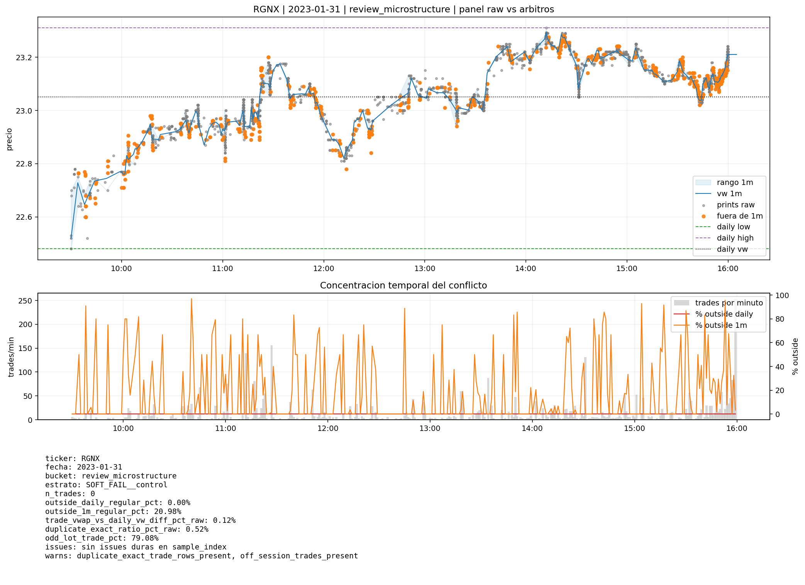

**Que muestra**

- Panel rico del tape raw frente a `daily` y `1m` para `RGNX` el `2023-01-31`.
- `n_trades = 4,263`, `outside_daily_regular_pct = 0.00%`, `outside_1m_regular_pct = 20.98%`.
- `trade_vwap_vs_daily_vw_diff_pct_raw = 0.12%`, `duplicate_exact_ratio_pct_raw = 0.52%`, `odd_lot_trade_pct = 79.08%`.

**Responde**

- Familia donde el dano vive en la textura fina del flujo: odd-lots, duplicados, bursts por timestamp o comparabilidad intraminuto. Responde a la pregunta de si el tape es economicamente interpretable pero metodologicamente delicado.
- Responde a si el conflicto dominante vive en la escala (`~1x`), en la comparabilidad frente a `daily` (0.00%) o frente a `1m` (20.98%).
- El 79.08% de odd-lots empuja la lectura hacia microestructura fina; evita leer el caso como pura ruptura economica gruesa.
- La decision que justifica es mantener o no el caso en `recoverable_with_flag` cuando se rematerialice la rehabilitacion sobre `57f`.

### RIGL | 2025-01-17

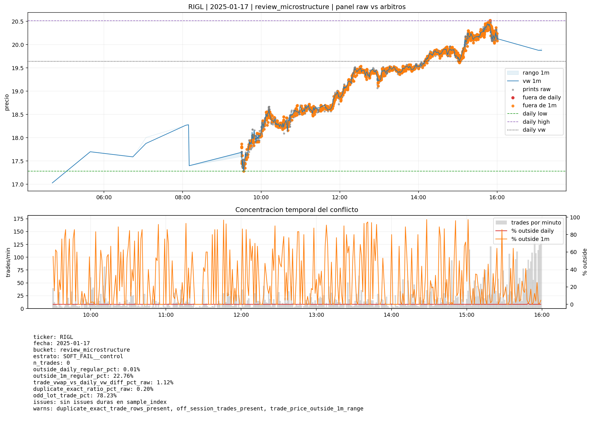

**Que muestra**

- Panel rico del tape raw frente a `daily` y `1m` para `RIGL` el `2025-01-17`.
- `n_trades = 7,874`, `outside_daily_regular_pct = 0.01%`, `outside_1m_regular_pct = 22.76%`.
- `trade_vwap_vs_daily_vw_diff_pct_raw = 1.12%`, `duplicate_exact_ratio_pct_raw = 0.20%`, `odd_lot_trade_pct = 78.23%`.

**Responde**

- Familia donde el dano vive en la textura fina del flujo: odd-lots, duplicados, bursts por timestamp o comparabilidad intraminuto. Responde a la pregunta de si el tape es economicamente interpretable pero metodologicamente delicado.
- Responde a si el conflicto dominante vive en la escala (`~1x`), en la comparabilidad frente a `daily` (0.01%) o frente a `1m` (22.76%).
- El 78.23% de odd-lots empuja la lectura hacia microestructura fina; evita leer el caso como pura ruptura economica gruesa.
- La decision que justifica es mantener o no el caso en `recoverable_with_flag` cuando se rematerialice la rehabilitacion sobre `57f`.

### RILY | 2022-09-22

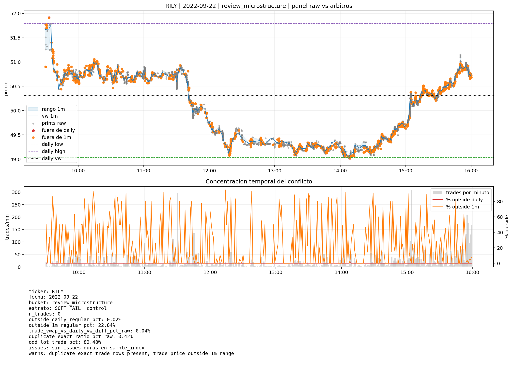

**Que muestra**

- Panel rico del tape raw frente a `daily` y `1m` para `RILY` el `2022-09-22`.
- `n_trades = 8,080`, `outside_daily_regular_pct = 0.02%`, `outside_1m_regular_pct = 22.84%`.
- `trade_vwap_vs_daily_vw_diff_pct_raw = 0.04%`, `duplicate_exact_ratio_pct_raw = 0.42%`, `odd_lot_trade_pct = 82.48%`.

**Responde**

- Familia donde el dano vive en la textura fina del flujo: odd-lots, duplicados, bursts por timestamp o comparabilidad intraminuto. Responde a la pregunta de si el tape es economicamente interpretable pero metodologicamente delicado.
- Responde a si el conflicto dominante vive en la escala (`~1x`), en la comparabilidad frente a `daily` (0.02%) o frente a `1m` (22.84%).
- El 82.48% de odd-lots empuja la lectura hacia microestructura fina; evita leer el caso como pura ruptura economica gruesa.
- La decision que justifica es mantener o no el caso en `recoverable_with_flag` cuando se rematerialice la rehabilitacion sobre `57f`.

### SRLP | 2022-03-04

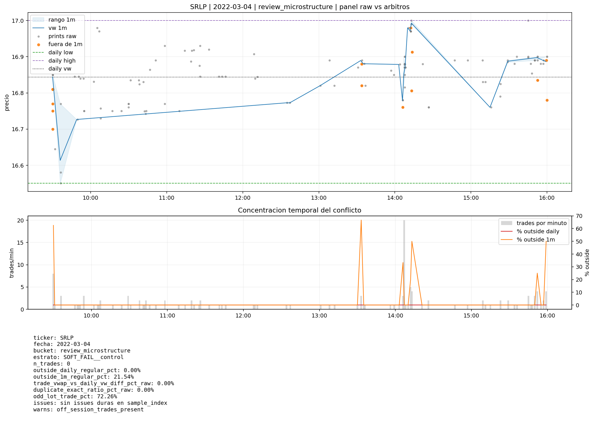

**Que muestra**

- Panel rico del tape raw frente a `daily` y `1m` para `SRLP` el `2022-03-04`.
- `n_trades = 137`, `outside_daily_regular_pct = 0.00%`, `outside_1m_regular_pct = 21.54%`.
- `trade_vwap_vs_daily_vw_diff_pct_raw = 0.00%`, `duplicate_exact_ratio_pct_raw = 0.00%`, `odd_lot_trade_pct = 72.26%`.

**Responde**

- Familia donde el dano vive en la textura fina del flujo: odd-lots, duplicados, bursts por timestamp o comparabilidad intraminuto. Responde a la pregunta de si el tape es economicamente interpretable pero metodologicamente delicado.
- Responde a si el conflicto dominante vive en la escala (`~1x`), en la comparabilidad frente a `daily` (0.00%) o frente a `1m` (21.54%).
- El 72.26% de odd-lots empuja la lectura hacia microestructura fina; evita leer el caso como pura ruptura economica gruesa.
- La decision que justifica es mantener o no el caso en `recoverable_with_flag` cuando se rematerialice la rehabilitacion sobre `57f`.

### WKME | 2024-02-07

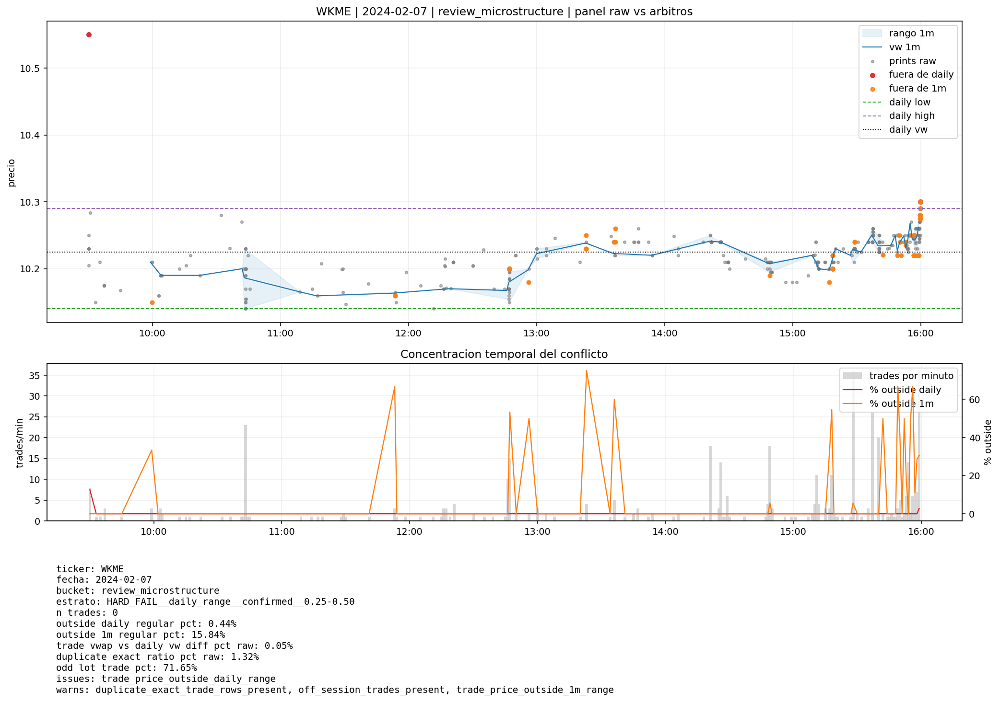

**Que muestra**

- Panel rico del tape raw frente a `daily` y `1m` para `WKME` el `2024-02-07`.
- `n_trades = 455`, `outside_daily_regular_pct = 0.44%`, `outside_1m_regular_pct = 15.84%`.
- `trade_vwap_vs_daily_vw_diff_pct_raw = 0.05%`, `duplicate_exact_ratio_pct_raw = 1.32%`, `odd_lot_trade_pct = 71.65%`.

**Responde**

- Familia donde el dano vive en la textura fina del flujo: odd-lots, duplicados, bursts por timestamp o comparabilidad intraminuto. Responde a la pregunta de si el tape es economicamente interpretable pero metodologicamente delicado.
- Responde a si el conflicto dominante vive en la escala (`~1x`), en la comparabilidad frente a `daily` (0.44%) o frente a `1m` (15.84%).
- El 71.65% de odd-lots empuja la lectura hacia microestructura fina; evita leer el caso como pura ruptura economica gruesa.
- La decision que justifica es mantener o no el caso en `recoverable_with_flag` cuando se rematerialice la rehabilitacion sobre `57f`.

