# Trades Review No 1m Reference | muestra estratificada

## Rol

Este dossier documenta `60` casos de la muestra base del cierre real `57f/full_clean_fast_same_schema` para la familia `review_no_1m_reference`.

No son ejemplos elegidos a dedo. Proceden del manifest estratificado reproducible materializado para el inspector.

## Que significa esta familia

Familia donde existe conflicto, pero falta el arbitro `1m`. Responde a la pregunta de si el caso debe quedarse en incertidumbre disciplinada y no ser absuelto ni condenado por reflejo.

## Responde

- si el conflicto existe aunque falte el arbitro fino `1m`
- si el caso debe quedarse en incertidumbre disciplinada

## No responde

- si el tape es limpio por ausencia de arbitro
- si debe condenarse como `bad_data` sin mas evidencia

## Consecuencia

- mantener estado intermedio y flags de referencia incompleta
- evitar absolucion o condena por reflejo

## Casos

### VALU | 2012-07-06

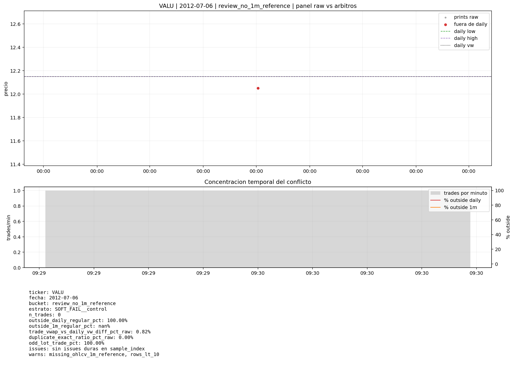

**Que muestra**

- Panel rico del tape raw frente a `daily` y `1m` para `VALU` el `2012-07-06`.
- `n_trades = 1`, `outside_daily_regular_pct = 100.00%`, `outside_1m_regular_pct = nan%`.
- `trade_vwap_vs_daily_vw_diff_pct_raw = 0.82%`, `duplicate_exact_ratio_pct_raw = 0.00%`, `odd_lot_trade_pct = 100.00%`.

**Responde**

- Familia donde existe conflicto, pero falta el arbitro `1m`. Responde a la pregunta de si el caso debe quedarse en incertidumbre disciplinada y no ser absuelto ni condenado por reflejo.
- Responde a si el conflicto dominante vive en la escala (`~1x`), en la comparabilidad frente a `daily` (100.00%) o frente a `1m` (nan%).
- El 100.00% de odd-lots empuja la lectura hacia microestructura fina; evita leer el caso como pura ruptura economica gruesa.
- La decision que justifica es mantener o no el caso en `recoverable_with_flag` cuando se rematerialice la rehabilitacion sobre `57f`.

### AMRB | 2014-01-10

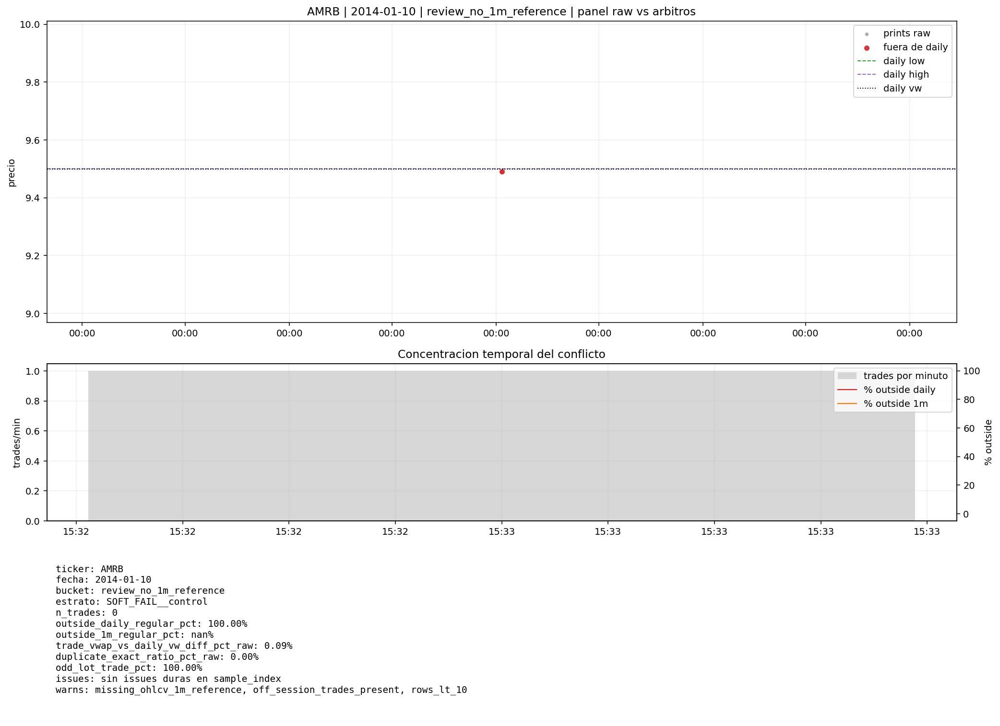

**Que muestra**

- Panel rico del tape raw frente a `daily` y `1m` para `AMRB` el `2014-01-10`.
- `n_trades = 1`, `outside_daily_regular_pct = 100.00%`, `outside_1m_regular_pct = nan%`.
- `trade_vwap_vs_daily_vw_diff_pct_raw = 0.09%`, `duplicate_exact_ratio_pct_raw = 0.00%`, `odd_lot_trade_pct = 100.00%`.

**Responde**

- Familia donde existe conflicto, pero falta el arbitro `1m`. Responde a la pregunta de si el caso debe quedarse en incertidumbre disciplinada y no ser absuelto ni condenado por reflejo.
- Responde a si el conflicto dominante vive en la escala (`~1x`), en la comparabilidad frente a `daily` (100.00%) o frente a `1m` (nan%).
- El 100.00% de odd-lots empuja la lectura hacia microestructura fina; evita leer el caso como pura ruptura economica gruesa.
- La decision que justifica es mantener o no el caso en `recoverable_with_flag` cuando se rematerialice la rehabilitacion sobre `57f`.

### CIX | 2017-11-14

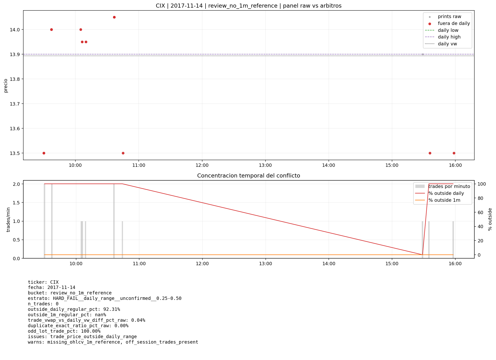

**Que muestra**

- Panel rico del tape raw frente a `daily` y `1m` para `CIX` el `2017-11-14`.
- `n_trades = 13`, `outside_daily_regular_pct = 92.31%`, `outside_1m_regular_pct = nan%`.
- `trade_vwap_vs_daily_vw_diff_pct_raw = 0.04%`, `duplicate_exact_ratio_pct_raw = 0.00%`, `odd_lot_trade_pct = 100.00%`.

**Responde**

- Familia donde existe conflicto, pero falta el arbitro `1m`. Responde a la pregunta de si el caso debe quedarse en incertidumbre disciplinada y no ser absuelto ni condenado por reflejo.
- Responde a si el conflicto dominante vive en la escala (`~1x`), en la comparabilidad frente a `daily` (92.31%) o frente a `1m` (nan%).
- El 100.00% de odd-lots empuja la lectura hacia microestructura fina; evita leer el caso como pura ruptura economica gruesa.
- La decision que justifica es mantener o no el caso en `recoverable_with_flag` cuando se rematerialice la rehabilitacion sobre `57f`.

### CPHC | 2018-08-21

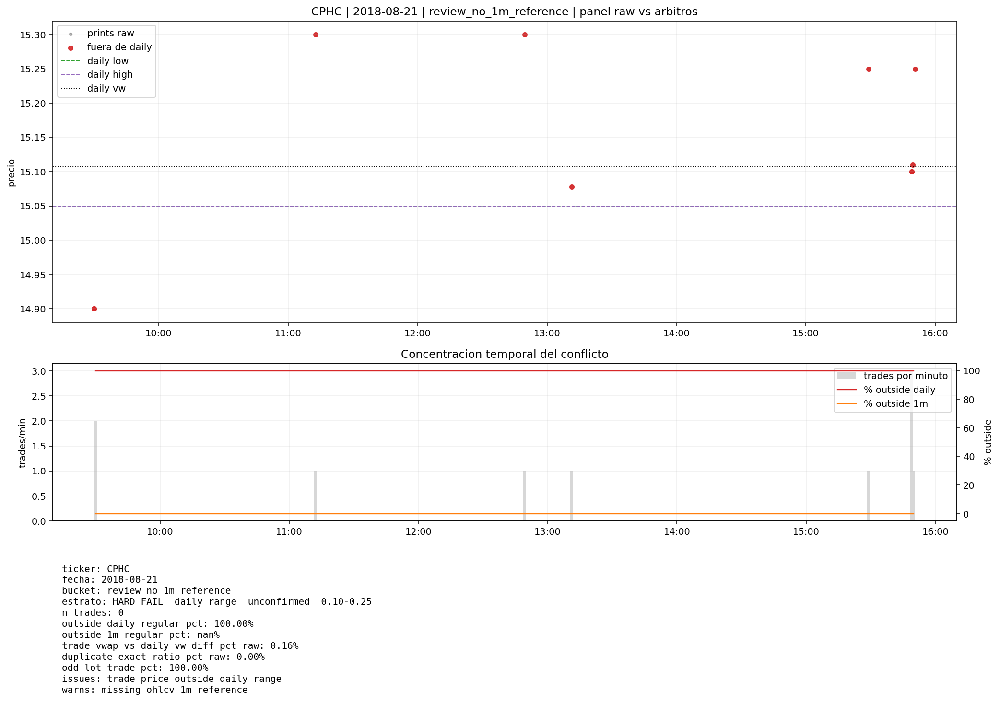

**Que muestra**

- Panel rico del tape raw frente a `daily` y `1m` para `CPHC` el `2018-08-21`.
- `n_trades = 10`, `outside_daily_regular_pct = 100.00%`, `outside_1m_regular_pct = nan%`.
- `trade_vwap_vs_daily_vw_diff_pct_raw = 0.16%`, `duplicate_exact_ratio_pct_raw = 0.00%`, `odd_lot_trade_pct = 100.00%`.

**Responde**

- Familia donde existe conflicto, pero falta el arbitro `1m`. Responde a la pregunta de si el caso debe quedarse en incertidumbre disciplinada y no ser absuelto ni condenado por reflejo.
- Responde a si el conflicto dominante vive en la escala (`~1x`), en la comparabilidad frente a `daily` (100.00%) o frente a `1m` (nan%).
- El 100.00% de odd-lots empuja la lectura hacia microestructura fina; evita leer el caso como pura ruptura economica gruesa.
- La decision que justifica es mantener o no el caso en `recoverable_with_flag` cuando se rematerialice la rehabilitacion sobre `57f`.

### CWBC | 2014-04-07

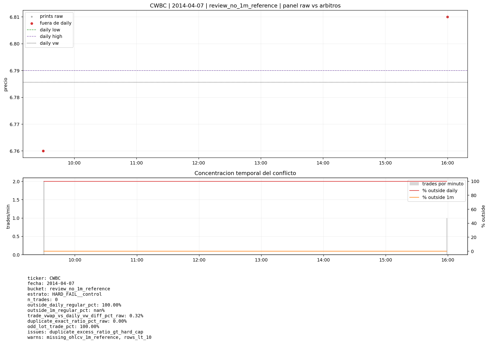

**Que muestra**

- Panel rico del tape raw frente a `daily` y `1m` para `CWBC` el `2014-04-07`.
- `n_trades = 3`, `outside_daily_regular_pct = 100.00%`, `outside_1m_regular_pct = nan%`.
- `trade_vwap_vs_daily_vw_diff_pct_raw = 0.32%`, `duplicate_exact_ratio_pct_raw = 0.00%`, `odd_lot_trade_pct = 100.00%`.

**Responde**

- Familia donde existe conflicto, pero falta el arbitro `1m`. Responde a la pregunta de si el caso debe quedarse en incertidumbre disciplinada y no ser absuelto ni condenado por reflejo.
- Responde a si el conflicto dominante vive en la escala (`~1x`), en la comparabilidad frente a `daily` (100.00%) o frente a `1m` (nan%).
- El 100.00% de odd-lots empuja la lectura hacia microestructura fina; evita leer el caso como pura ruptura economica gruesa.
- La decision que justifica es mantener o no el caso en `recoverable_with_flag` cuando se rematerialice la rehabilitacion sobre `57f`.

### CZWI | 2016-05-20

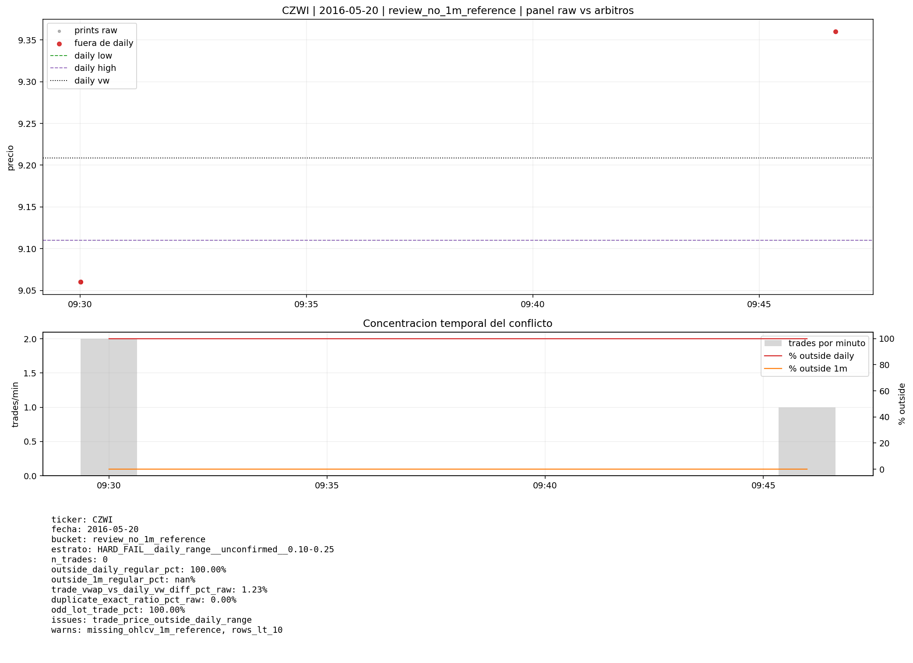

**Que muestra**

- Panel rico del tape raw frente a `daily` y `1m` para `CZWI` el `2016-05-20`.
- `n_trades = 3`, `outside_daily_regular_pct = 100.00%`, `outside_1m_regular_pct = nan%`.
- `trade_vwap_vs_daily_vw_diff_pct_raw = 1.23%`, `duplicate_exact_ratio_pct_raw = 0.00%`, `odd_lot_trade_pct = 100.00%`.

**Responde**

- Familia donde existe conflicto, pero falta el arbitro `1m`. Responde a la pregunta de si el caso debe quedarse en incertidumbre disciplinada y no ser absuelto ni condenado por reflejo.
- Responde a si el conflicto dominante vive en la escala (`~1x`), en la comparabilidad frente a `daily` (100.00%) o frente a `1m` (nan%).
- El 100.00% de odd-lots empuja la lectura hacia microestructura fina; evita leer el caso como pura ruptura economica gruesa.
- La decision que justifica es mantener o no el caso en `recoverable_with_flag` cuando se rematerialice la rehabilitacion sobre `57f`.

### EVBN | 2014-08-18

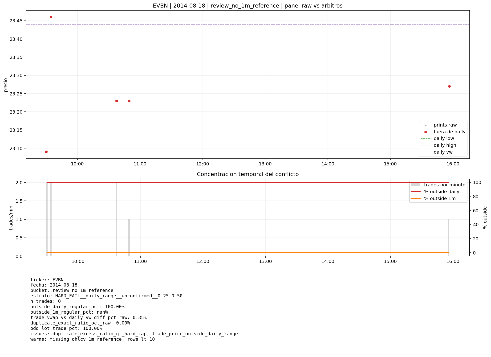

**Que muestra**

- Panel rico del tape raw frente a `daily` y `1m` para `EVBN` el `2014-08-18`.
- `n_trades = 8`, `outside_daily_regular_pct = 100.00%`, `outside_1m_regular_pct = nan%`.
- `trade_vwap_vs_daily_vw_diff_pct_raw = 0.35%`, `duplicate_exact_ratio_pct_raw = 0.00%`, `odd_lot_trade_pct = 100.00%`.

**Responde**

- Familia donde existe conflicto, pero falta el arbitro `1m`. Responde a la pregunta de si el caso debe quedarse en incertidumbre disciplinada y no ser absuelto ni condenado por reflejo.
- Responde a si el conflicto dominante vive en la escala (`~1x`), en la comparabilidad frente a `daily` (100.00%) o frente a `1m` (nan%).
- El 100.00% de odd-lots empuja la lectura hacia microestructura fina; evita leer el caso como pura ruptura economica gruesa.
- La decision que justifica es mantener o no el caso en `recoverable_with_flag` cuando se rematerialice la rehabilitacion sobre `57f`.

### ICCH | 2018-09-14

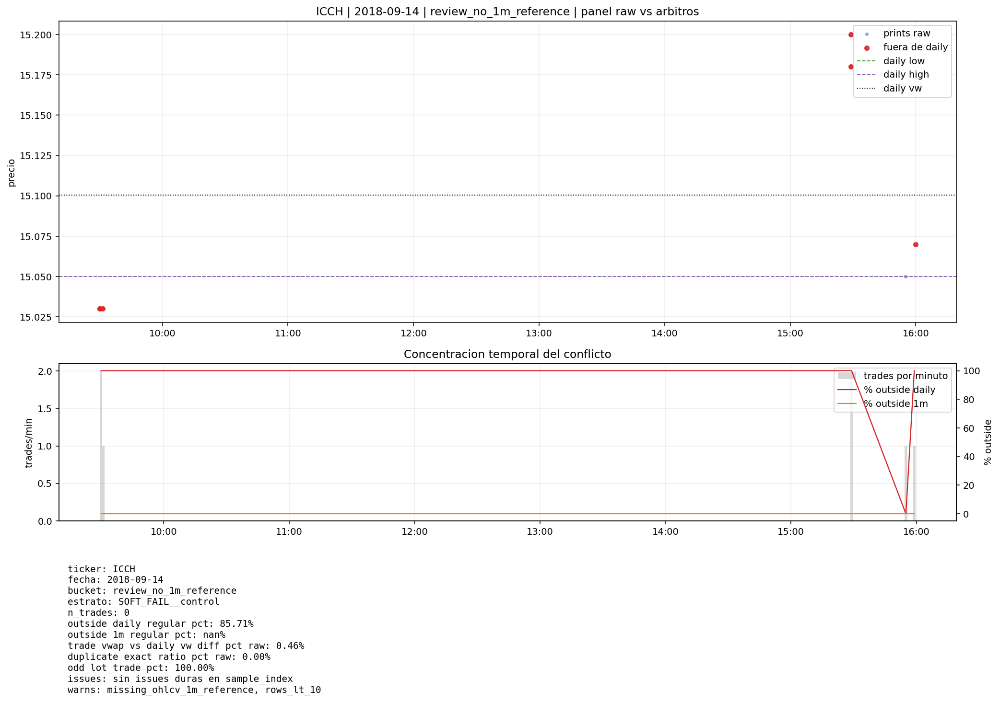

**Que muestra**

- Panel rico del tape raw frente a `daily` y `1m` para `ICCH` el `2018-09-14`.
- `n_trades = 7`, `outside_daily_regular_pct = 85.71%`, `outside_1m_regular_pct = nan%`.
- `trade_vwap_vs_daily_vw_diff_pct_raw = 0.46%`, `duplicate_exact_ratio_pct_raw = 0.00%`, `odd_lot_trade_pct = 100.00%`.

**Responde**

- Familia donde existe conflicto, pero falta el arbitro `1m`. Responde a la pregunta de si el caso debe quedarse en incertidumbre disciplinada y no ser absuelto ni condenado por reflejo.
- Responde a si el conflicto dominante vive en la escala (`~1x`), en la comparabilidad frente a `daily` (85.71%) o frente a `1m` (nan%).
- El 100.00% de odd-lots empuja la lectura hacia microestructura fina; evita leer el caso como pura ruptura economica gruesa.
- La decision que justifica es mantener o no el caso en `recoverable_with_flag` cuando se rematerialice la rehabilitacion sobre `57f`.

### ISRL | 2014-04-25

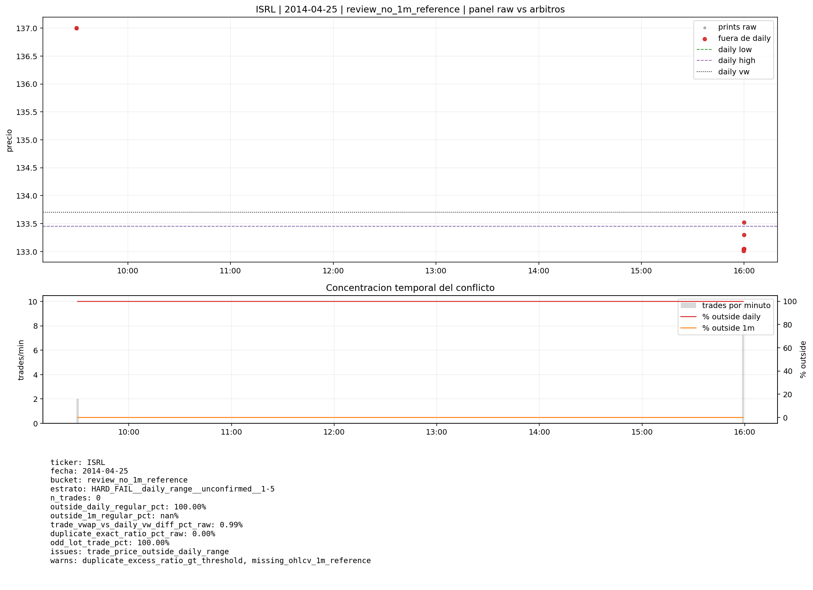

**Que muestra**

- Panel rico del tape raw frente a `daily` y `1m` para `ISRL` el `2014-04-25`.
- `n_trades = 12`, `outside_daily_regular_pct = 100.00%`, `outside_1m_regular_pct = nan%`.
- `trade_vwap_vs_daily_vw_diff_pct_raw = 0.99%`, `duplicate_exact_ratio_pct_raw = 0.00%`, `odd_lot_trade_pct = 100.00%`.

**Responde**

- Familia donde existe conflicto, pero falta el arbitro `1m`. Responde a la pregunta de si el caso debe quedarse en incertidumbre disciplinada y no ser absuelto ni condenado por reflejo.
- Responde a si el conflicto dominante vive en la escala (`~1x`), en la comparabilidad frente a `daily` (100.00%) o frente a `1m` (nan%).
- El 100.00% de odd-lots empuja la lectura hacia microestructura fina; evita leer el caso como pura ruptura economica gruesa.
- La decision que justifica es mantener o no el caso en `recoverable_with_flag` cuando se rematerialice la rehabilitacion sobre `57f`.

### ITIC | 2016-01-21

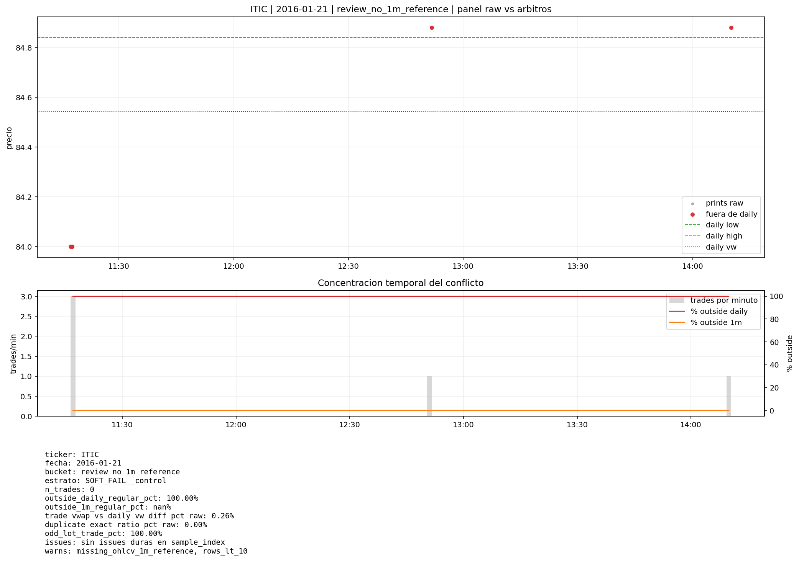

**Que muestra**

- Panel rico del tape raw frente a `daily` y `1m` para `ITIC` el `2016-01-21`.
- `n_trades = 5`, `outside_daily_regular_pct = 100.00%`, `outside_1m_regular_pct = nan%`.
- `trade_vwap_vs_daily_vw_diff_pct_raw = 0.26%`, `duplicate_exact_ratio_pct_raw = 0.00%`, `odd_lot_trade_pct = 100.00%`.

**Responde**

- Familia donde existe conflicto, pero falta el arbitro `1m`. Responde a la pregunta de si el caso debe quedarse en incertidumbre disciplinada y no ser absuelto ni condenado por reflejo.
- Responde a si el conflicto dominante vive en la escala (`~1x`), en la comparabilidad frente a `daily` (100.00%) o frente a `1m` (nan%).
- El 100.00% de odd-lots empuja la lectura hacia microestructura fina; evita leer el caso como pura ruptura economica gruesa.
- La decision que justifica es mantener o no el caso en `recoverable_with_flag` cuando se rematerialice la rehabilitacion sobre `57f`.

### SGRP | 2015-11-30

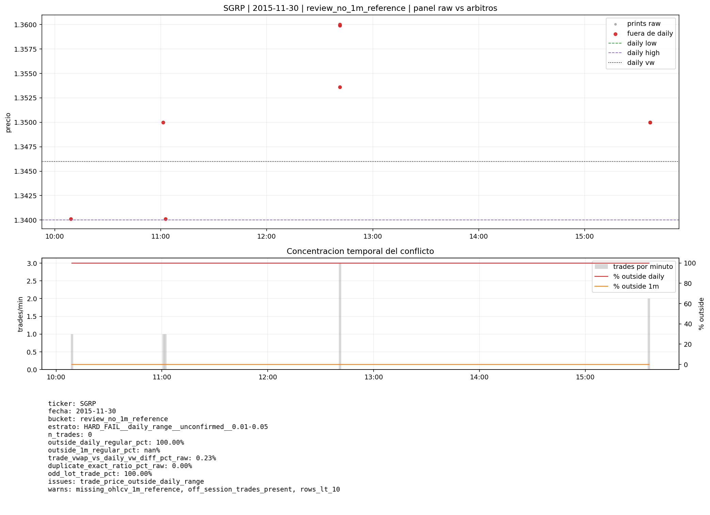

**Que muestra**

- Panel rico del tape raw frente a `daily` y `1m` para `SGRP` el `2015-11-30`.
- `n_trades = 8`, `outside_daily_regular_pct = 100.00%`, `outside_1m_regular_pct = nan%`.
- `trade_vwap_vs_daily_vw_diff_pct_raw = 0.23%`, `duplicate_exact_ratio_pct_raw = 0.00%`, `odd_lot_trade_pct = 100.00%`.

**Responde**

- Familia donde existe conflicto, pero falta el arbitro `1m`. Responde a la pregunta de si el caso debe quedarse en incertidumbre disciplinada y no ser absuelto ni condenado por reflejo.
- Responde a si el conflicto dominante vive en la escala (`~1x`), en la comparabilidad frente a `daily` (100.00%) o frente a `1m` (nan%).
- El 100.00% de odd-lots empuja la lectura hacia microestructura fina; evita leer el caso como pura ruptura economica gruesa.
- La decision que justifica es mantener o no el caso en `recoverable_with_flag` cuando se rematerialice la rehabilitacion sobre `57f`.

### SLI | 2016-01-26

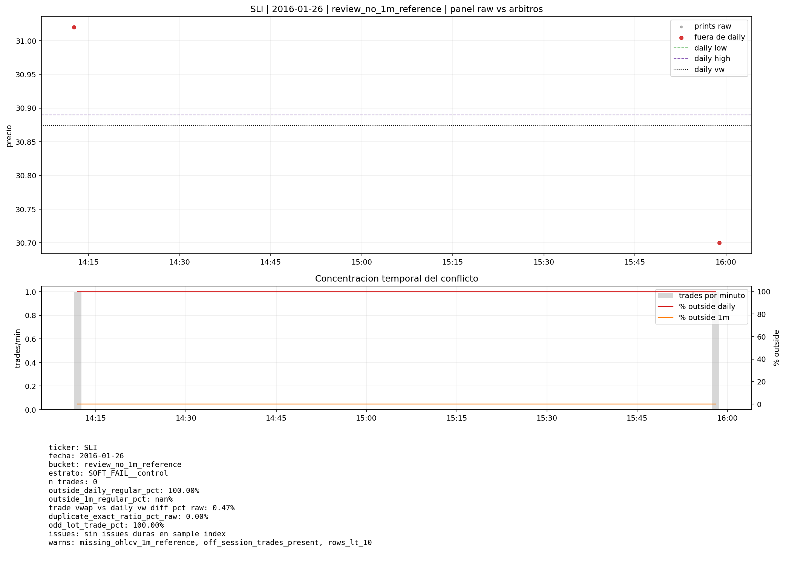

**Que muestra**

- Panel rico del tape raw frente a `daily` y `1m` para `SLI` el `2016-01-26`.
- `n_trades = 2`, `outside_daily_regular_pct = 100.00%`, `outside_1m_regular_pct = nan%`.
- `trade_vwap_vs_daily_vw_diff_pct_raw = 0.47%`, `duplicate_exact_ratio_pct_raw = 0.00%`, `odd_lot_trade_pct = 100.00%`.

**Responde**

- Familia donde existe conflicto, pero falta el arbitro `1m`. Responde a la pregunta de si el caso debe quedarse en incertidumbre disciplinada y no ser absuelto ni condenado por reflejo.
- Responde a si el conflicto dominante vive en la escala (`~1x`), en la comparabilidad frente a `daily` (100.00%) o frente a `1m` (nan%).
- El 100.00% de odd-lots empuja la lectura hacia microestructura fina; evita leer el caso como pura ruptura economica gruesa.
- La decision que justifica es mantener o no el caso en `recoverable_with_flag` cuando se rematerialice la rehabilitacion sobre `57f`.

### ALTS | 2019-01-07

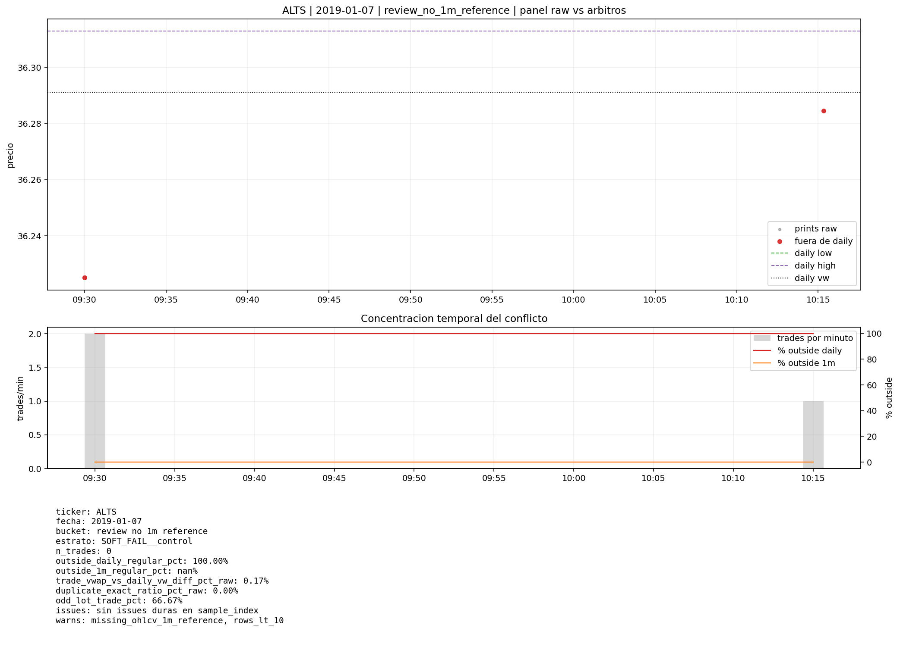

**Que muestra**

- Panel rico del tape raw frente a `daily` y `1m` para `ALTS` el `2019-01-07`.
- `n_trades = 3`, `outside_daily_regular_pct = 100.00%`, `outside_1m_regular_pct = nan%`.
- `trade_vwap_vs_daily_vw_diff_pct_raw = 0.17%`, `duplicate_exact_ratio_pct_raw = 0.00%`, `odd_lot_trade_pct = 66.67%`.

**Responde**

- Familia donde existe conflicto, pero falta el arbitro `1m`. Responde a la pregunta de si el caso debe quedarse en incertidumbre disciplinada y no ser absuelto ni condenado por reflejo.
- Responde a si el conflicto dominante vive en la escala (`~1x`), en la comparabilidad frente a `daily` (100.00%) o frente a `1m` (nan%).
- El 66.67% de odd-lots empuja la lectura hacia microestructura fina; evita leer el caso como pura ruptura economica gruesa.
- La decision que justifica es mantener o no el caso en `recoverable_with_flag` cuando se rematerialice la rehabilitacion sobre `57f`.

### ALTS | 2019-01-28

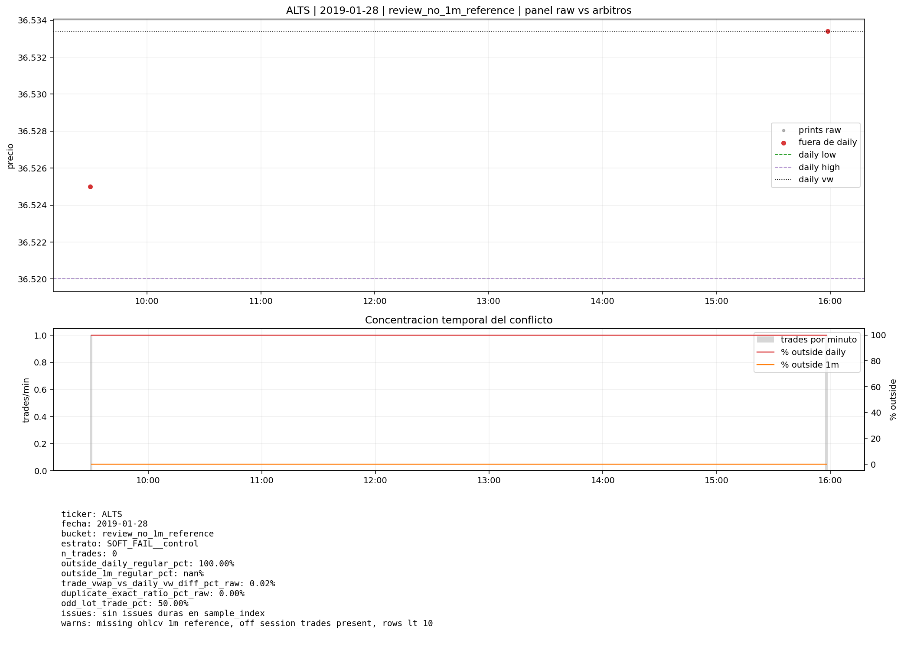

**Que muestra**

- Panel rico del tape raw frente a `daily` y `1m` para `ALTS` el `2019-01-28`.
- `n_trades = 2`, `outside_daily_regular_pct = 100.00%`, `outside_1m_regular_pct = nan%`.
- `trade_vwap_vs_daily_vw_diff_pct_raw = 0.02%`, `duplicate_exact_ratio_pct_raw = 0.00%`, `odd_lot_trade_pct = 50.00%`.

**Responde**

- Familia donde existe conflicto, pero falta el arbitro `1m`. Responde a la pregunta de si el caso debe quedarse en incertidumbre disciplinada y no ser absuelto ni condenado por reflejo.
- Responde a si el conflicto dominante vive en la escala (`~1x`), en la comparabilidad frente a `daily` (100.00%) o frente a `1m` (nan%).
- El 50.00% de odd-lots empuja la lectura hacia microestructura fina; evita leer el caso como pura ruptura economica gruesa.
- La decision que justifica es mantener o no el caso en `recoverable_with_flag` cuando se rematerialice la rehabilitacion sobre `57f`.

### ALTS | 2019-03-26

**Que muestra**

- Panel rico del tape raw frente a `daily` y `1m` para `ALTS` el `2019-03-26`.
- `n_trades = 4`, `outside_daily_regular_pct = 100.00%`, `outside_1m_regular_pct = nan%`.
- `trade_vwap_vs_daily_vw_diff_pct_raw = 0.20%`, `duplicate_exact_ratio_pct_raw = 0.00%`, `odd_lot_trade_pct = 75.00%`.

**Responde**

- Familia donde existe conflicto, pero falta el arbitro `1m`. Responde a la pregunta de si el caso debe quedarse en incertidumbre disciplinada y no ser absuelto ni condenado por reflejo.
- Responde a si el conflicto dominante vive en la escala (`~1x`), en la comparabilidad frente a `daily` (100.00%) o frente a `1m` (nan%).
- El 75.00% de odd-lots empuja la lectura hacia microestructura fina; evita leer el caso como pura ruptura economica gruesa.
- La decision que justifica es mantener o no el caso en `recoverable_with_flag` cuando se rematerialice la rehabilitacion sobre `57f`.

### ARP | 2024-11-22

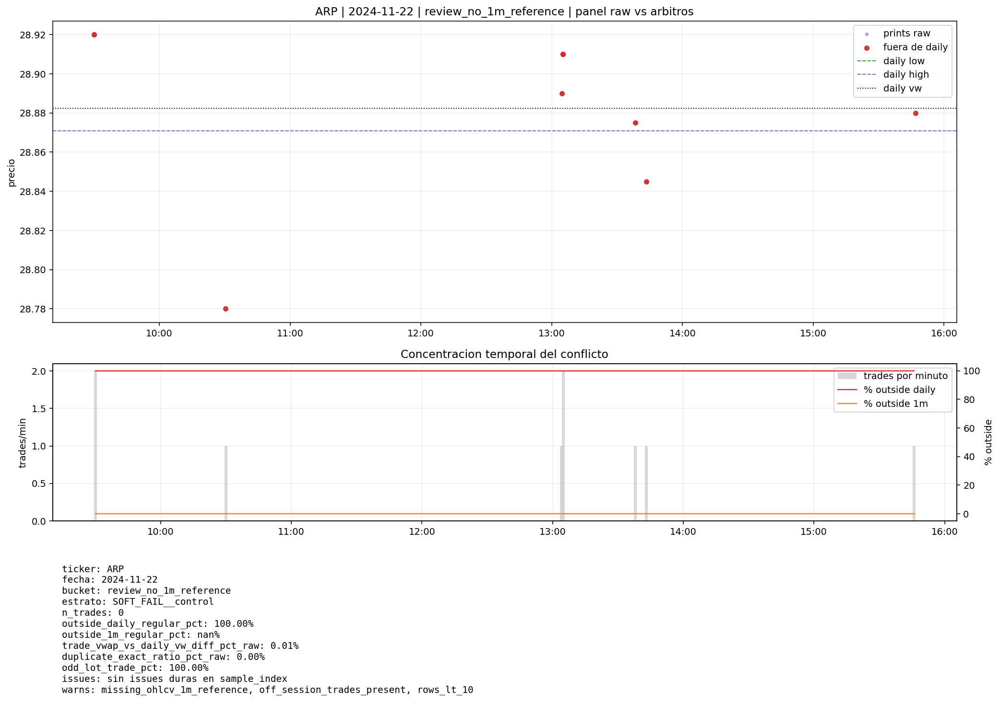

**Que muestra**

- Panel rico del tape raw frente a `daily` y `1m` para `ARP` el `2024-11-22`.
- `n_trades = 9`, `outside_daily_regular_pct = 100.00%`, `outside_1m_regular_pct = nan%`.
- `trade_vwap_vs_daily_vw_diff_pct_raw = 0.01%`, `duplicate_exact_ratio_pct_raw = 0.00%`, `odd_lot_trade_pct = 100.00%`.

**Responde**

- Familia donde existe conflicto, pero falta el arbitro `1m`. Responde a la pregunta de si el caso debe quedarse en incertidumbre disciplinada y no ser absuelto ni condenado por reflejo.
- Responde a si el conflicto dominante vive en la escala (`~1x`), en la comparabilidad frente a `daily` (100.00%) o frente a `1m` (nan%).
- El 100.00% de odd-lots empuja la lectura hacia microestructura fina; evita leer el caso como pura ruptura economica gruesa.
- La decision que justifica es mantener o no el caso en `recoverable_with_flag` cuando se rematerialice la rehabilitacion sobre `57f`.

### BLUA | 2023-04-06

**Que muestra**

- Panel rico del tape raw frente a `daily` y `1m` para `BLUA` el `2023-04-06`.
- `n_trades = 1`, `outside_daily_regular_pct = 100.00%`, `outside_1m_regular_pct = nan%`.
- `trade_vwap_vs_daily_vw_diff_pct_raw = 0.20%`, `duplicate_exact_ratio_pct_raw = 0.00%`, `odd_lot_trade_pct = 100.00%`.

**Responde**

- Familia donde existe conflicto, pero falta el arbitro `1m`. Responde a la pregunta de si el caso debe quedarse en incertidumbre disciplinada y no ser absuelto ni condenado por reflejo.
- Responde a si el conflicto dominante vive en la escala (`~1x`), en la comparabilidad frente a `daily` (100.00%) o frente a `1m` (nan%).
- El 100.00% de odd-lots empuja la lectura hacia microestructura fina; evita leer el caso como pura ruptura economica gruesa.
- La decision que justifica es mantener o no el caso en `recoverable_with_flag` cuando se rematerialice la rehabilitacion sobre `57f`.

### BREZ | 2021-12-22

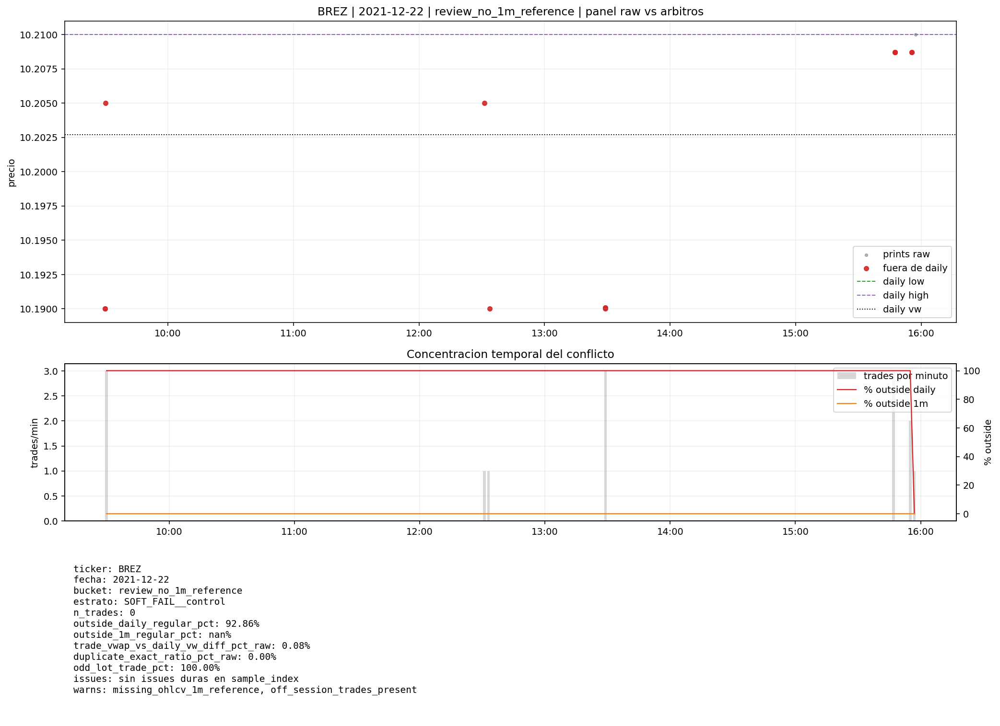

**Que muestra**

- Panel rico del tape raw frente a `daily` y `1m` para `BREZ` el `2021-12-22`.
- `n_trades = 14`, `outside_daily_regular_pct = 92.86%`, `outside_1m_regular_pct = nan%`.
- `trade_vwap_vs_daily_vw_diff_pct_raw = 0.08%`, `duplicate_exact_ratio_pct_raw = 0.00%`, `odd_lot_trade_pct = 100.00%`.

**Responde**

- Familia donde existe conflicto, pero falta el arbitro `1m`. Responde a la pregunta de si el caso debe quedarse en incertidumbre disciplinada y no ser absuelto ni condenado por reflejo.
- Responde a si el conflicto dominante vive en la escala (`~1x`), en la comparabilidad frente a `daily` (92.86%) o frente a `1m` (nan%).
- El 100.00% de odd-lots empuja la lectura hacia microestructura fina; evita leer el caso como pura ruptura economica gruesa.
- La decision que justifica es mantener o no el caso en `recoverable_with_flag` cuando se rematerialice la rehabilitacion sobre `57f`.

### CAS | 2025-06-23

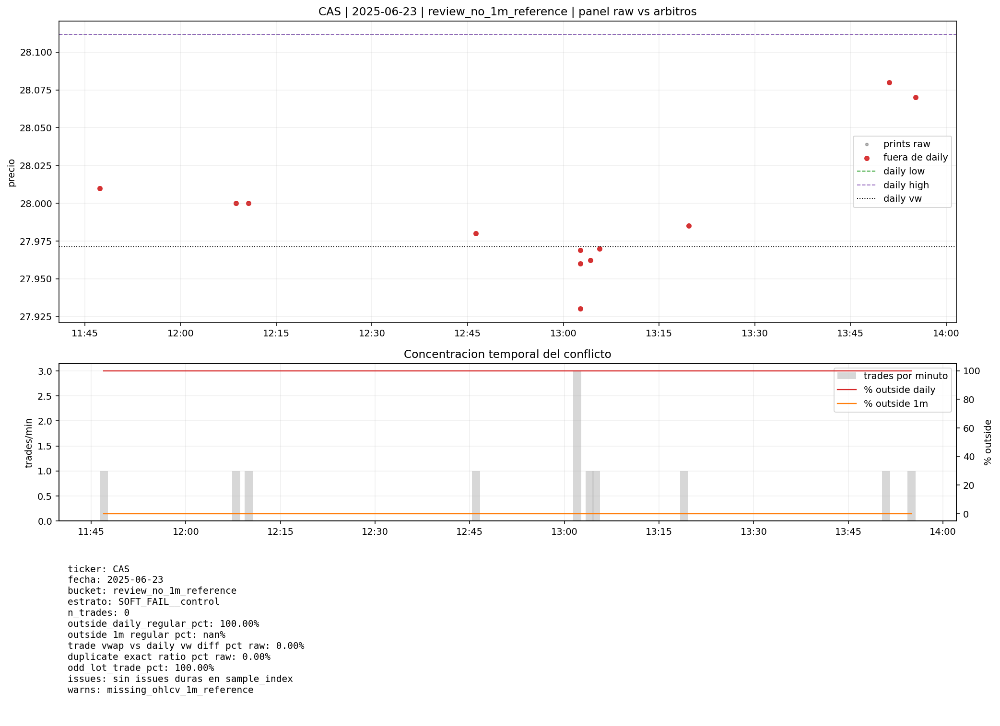

**Que muestra**

- Panel rico del tape raw frente a `daily` y `1m` para `CAS` el `2025-06-23`.
- `n_trades = 12`, `outside_daily_regular_pct = 100.00%`, `outside_1m_regular_pct = nan%`.
- `trade_vwap_vs_daily_vw_diff_pct_raw = 0.00%`, `duplicate_exact_ratio_pct_raw = 0.00%`, `odd_lot_trade_pct = 100.00%`.

**Responde**

- Familia donde existe conflicto, pero falta el arbitro `1m`. Responde a la pregunta de si el caso debe quedarse en incertidumbre disciplinada y no ser absuelto ni condenado por reflejo.
- Responde a si el conflicto dominante vive en la escala (`~1x`), en la comparabilidad frente a `daily` (100.00%) o frente a `1m` (nan%).
- El 100.00% de odd-lots empuja la lectura hacia microestructura fina; evita leer el caso como pura ruptura economica gruesa.
- La decision que justifica es mantener o no el caso en `recoverable_with_flag` cuando se rematerialice la rehabilitacion sobre `57f`.

### CAS | 2025-07-24

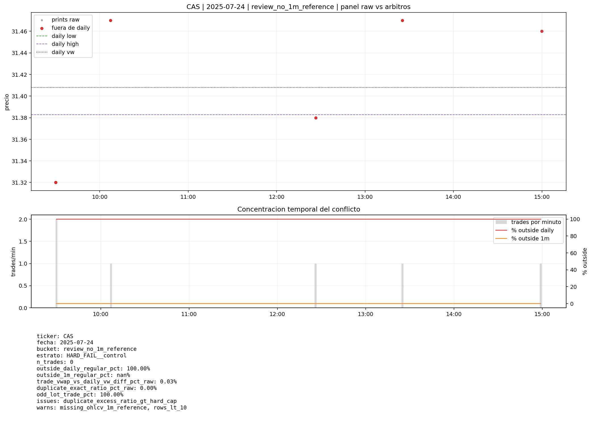

**Que muestra**

- Panel rico del tape raw frente a `daily` y `1m` para `CAS` el `2025-07-24`.
- `n_trades = 6`, `outside_daily_regular_pct = 100.00%`, `outside_1m_regular_pct = nan%`.
- `trade_vwap_vs_daily_vw_diff_pct_raw = 0.03%`, `duplicate_exact_ratio_pct_raw = 0.00%`, `odd_lot_trade_pct = 100.00%`.

**Responde**

- Familia donde existe conflicto, pero falta el arbitro `1m`. Responde a la pregunta de si el caso debe quedarse en incertidumbre disciplinada y no ser absuelto ni condenado por reflejo.
- Responde a si el conflicto dominante vive en la escala (`~1x`), en la comparabilidad frente a `daily` (100.00%) o frente a `1m` (nan%).
- El 100.00% de odd-lots empuja la lectura hacia microestructura fina; evita leer el caso como pura ruptura economica gruesa.
- La decision que justifica es mantener o no el caso en `recoverable_with_flag` cuando se rematerialice la rehabilitacion sobre `57f`.

### CATC | 2019-03-12

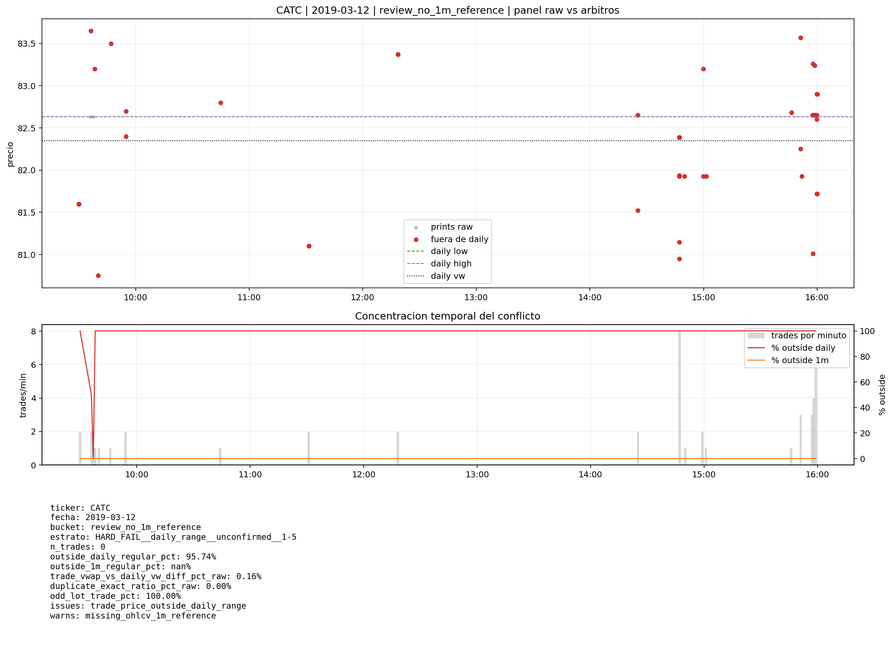

**Que muestra**

- Panel rico del tape raw frente a `daily` y `1m` para `CATC` el `2019-03-12`.
- `n_trades = 47`, `outside_daily_regular_pct = 95.74%`, `outside_1m_regular_pct = nan%`.
- `trade_vwap_vs_daily_vw_diff_pct_raw = 0.16%`, `duplicate_exact_ratio_pct_raw = 0.00%`, `odd_lot_trade_pct = 100.00%`.

**Responde**

- Familia donde existe conflicto, pero falta el arbitro `1m`. Responde a la pregunta de si el caso debe quedarse en incertidumbre disciplinada y no ser absuelto ni condenado por reflejo.
- Responde a si el conflicto dominante vive en la escala (`~1x`), en la comparabilidad frente a `daily` (95.74%) o frente a `1m` (nan%).
- El 100.00% de odd-lots empuja la lectura hacia microestructura fina; evita leer el caso como pura ruptura economica gruesa.
- La decision que justifica es mantener o no el caso en `recoverable_with_flag` cuando se rematerialice la rehabilitacion sobre `57f`.

### CFBK | 2024-01-24

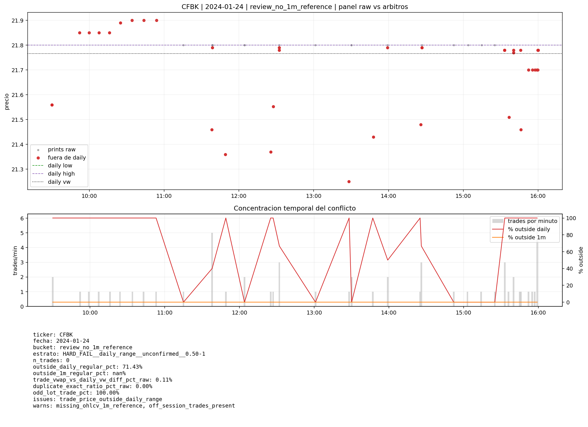

**Que muestra**

- Panel rico del tape raw frente a `daily` y `1m` para `CFBK` el `2024-01-24`.
- `n_trades = 56`, `outside_daily_regular_pct = 71.43%`, `outside_1m_regular_pct = nan%`.
- `trade_vwap_vs_daily_vw_diff_pct_raw = 0.11%`, `duplicate_exact_ratio_pct_raw = 0.00%`, `odd_lot_trade_pct = 100.00%`.

**Responde**

- Familia donde existe conflicto, pero falta el arbitro `1m`. Responde a la pregunta de si el caso debe quedarse en incertidumbre disciplinada y no ser absuelto ni condenado por reflejo.
- Responde a si el conflicto dominante vive en la escala (`~1x`), en la comparabilidad frente a `daily` (71.43%) o frente a `1m` (nan%).
- El 100.00% de odd-lots empuja la lectura hacia microestructura fina; evita leer el caso como pura ruptura economica gruesa.
- La decision que justifica es mantener o no el caso en `recoverable_with_flag` cuando se rematerialice la rehabilitacion sobre `57f`.

### CFBK | 2024-09-27

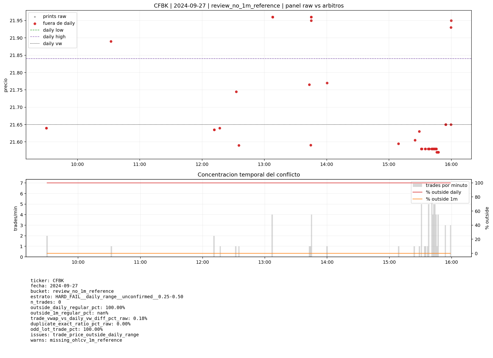

**Que muestra**

- Panel rico del tape raw frente a `daily` y `1m` para `CFBK` el `2024-09-27`.
- `n_trades = 71`, `outside_daily_regular_pct = 100.00%`, `outside_1m_regular_pct = nan%`.
- `trade_vwap_vs_daily_vw_diff_pct_raw = 0.18%`, `duplicate_exact_ratio_pct_raw = 0.00%`, `odd_lot_trade_pct = 100.00%`.

**Responde**

- Familia donde existe conflicto, pero falta el arbitro `1m`. Responde a la pregunta de si el caso debe quedarse en incertidumbre disciplinada y no ser absuelto ni condenado por reflejo.
- Responde a si el conflicto dominante vive en la escala (`~1x`), en la comparabilidad frente a `daily` (100.00%) o frente a `1m` (nan%).
- El 100.00% de odd-lots empuja la lectura hacia microestructura fina; evita leer el caso como pura ruptura economica gruesa.
- La decision que justifica es mantener o no el caso en `recoverable_with_flag` cuando se rematerialice la rehabilitacion sobre `57f`.

### CGRO | 2024-06-12

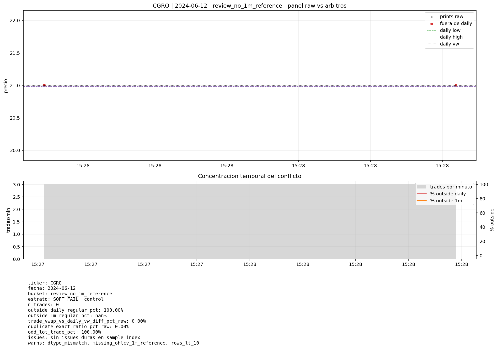

**Que muestra**

- Panel rico del tape raw frente a `daily` y `1m` para `CGRO` el `2024-06-12`.
- `n_trades = 3`, `outside_daily_regular_pct = 100.00%`, `outside_1m_regular_pct = nan%`.
- `trade_vwap_vs_daily_vw_diff_pct_raw = 0.00%`, `duplicate_exact_ratio_pct_raw = 0.00%`, `odd_lot_trade_pct = 100.00%`.

**Responde**

- Familia donde existe conflicto, pero falta el arbitro `1m`. Responde a la pregunta de si el caso debe quedarse en incertidumbre disciplinada y no ser absuelto ni condenado por reflejo.
- Responde a si el conflicto dominante vive en la escala (`~1x`), en la comparabilidad frente a `daily` (100.00%) o frente a `1m` (nan%).
- El 100.00% de odd-lots empuja la lectura hacia microestructura fina; evita leer el caso como pura ruptura economica gruesa.
- La decision que justifica es mantener o no el caso en `recoverable_with_flag` cuando se rematerialice la rehabilitacion sobre `57f`.

### CXAC | 2023-10-20

**Que muestra**

- Panel rico del tape raw frente a `daily` y `1m` para `CXAC` el `2023-10-20`.
- `n_trades = 1`, `outside_daily_regular_pct = 100.00%`, `outside_1m_regular_pct = nan%`.
- `trade_vwap_vs_daily_vw_diff_pct_raw = 0.37%`, `duplicate_exact_ratio_pct_raw = 0.00%`, `odd_lot_trade_pct = 100.00%`.

**Responde**

- Familia donde existe conflicto, pero falta el arbitro `1m`. Responde a la pregunta de si el caso debe quedarse en incertidumbre disciplinada y no ser absuelto ni condenado por reflejo.
- Responde a si el conflicto dominante vive en la escala (`~1x`), en la comparabilidad frente a `daily` (100.00%) o frente a `1m` (nan%).
- El 100.00% de odd-lots empuja la lectura hacia microestructura fina; evita leer el caso como pura ruptura economica gruesa.
- La decision que justifica es mantener o no el caso en `recoverable_with_flag` cuando se rematerialice la rehabilitacion sobre `57f`.

### DJCO | 2023-12-22

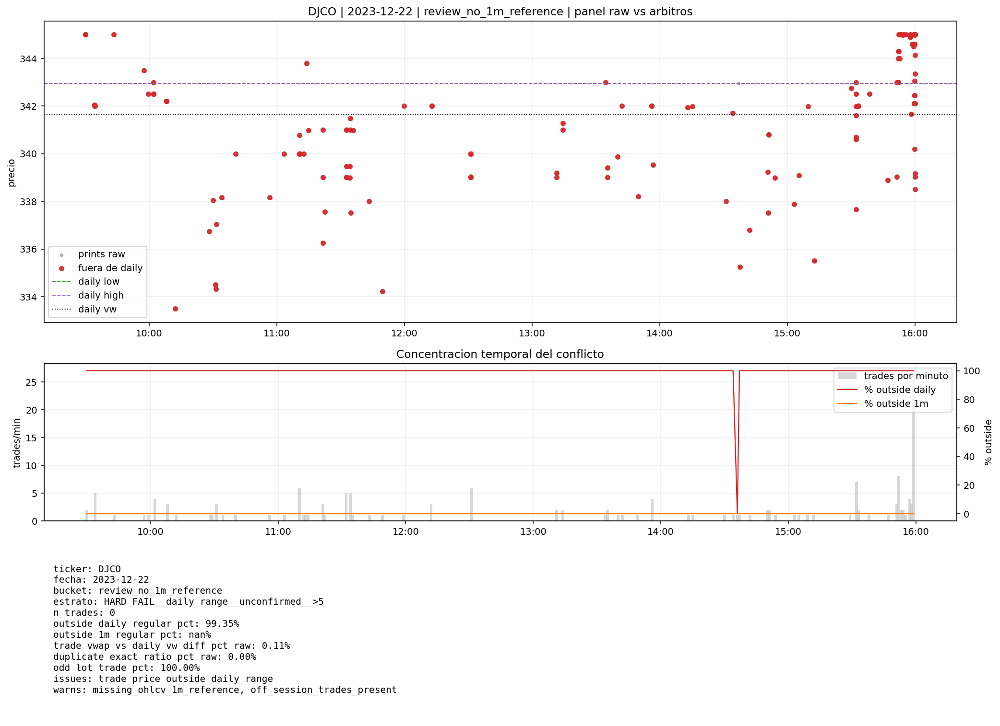

**Que muestra**

- Panel rico del tape raw frente a `daily` y `1m` para `DJCO` el `2023-12-22`.
- `n_trades = 155`, `outside_daily_regular_pct = 99.35%`, `outside_1m_regular_pct = nan%`.
- `trade_vwap_vs_daily_vw_diff_pct_raw = 0.11%`, `duplicate_exact_ratio_pct_raw = 0.00%`, `odd_lot_trade_pct = 100.00%`.

**Responde**

- Familia donde existe conflicto, pero falta el arbitro `1m`. Responde a la pregunta de si el caso debe quedarse en incertidumbre disciplinada y no ser absuelto ni condenado por reflejo.
- Responde a si el conflicto dominante vive en la escala (`~1x`), en la comparabilidad frente a `daily` (99.35%) o frente a `1m` (nan%).
- El 100.00% de odd-lots empuja la lectura hacia microestructura fina; evita leer el caso como pura ruptura economica gruesa.
- La decision que justifica es mantener o no el caso en `recoverable_with_flag` cuando se rematerialice la rehabilitacion sobre `57f`.

### EDGE | 2025-03-19

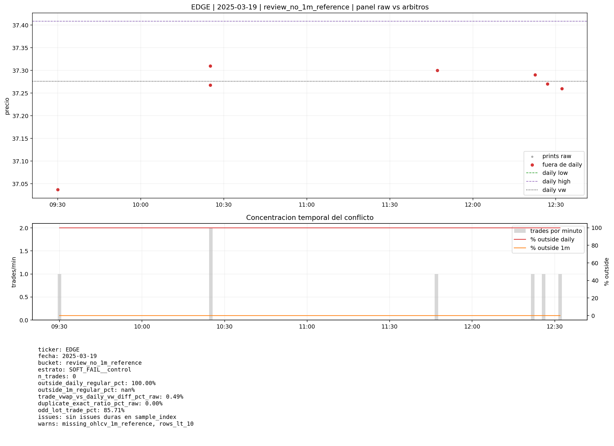

**Que muestra**

- Panel rico del tape raw frente a `daily` y `1m` para `EDGE` el `2025-03-19`.
- `n_trades = 7`, `outside_daily_regular_pct = 100.00%`, `outside_1m_regular_pct = nan%`.
- `trade_vwap_vs_daily_vw_diff_pct_raw = 0.49%`, `duplicate_exact_ratio_pct_raw = 0.00%`, `odd_lot_trade_pct = 85.71%`.

**Responde**

- Familia donde existe conflicto, pero falta el arbitro `1m`. Responde a la pregunta de si el caso debe quedarse en incertidumbre disciplinada y no ser absuelto ni condenado por reflejo.
- Responde a si el conflicto dominante vive en la escala (`~1x`), en la comparabilidad frente a `daily` (100.00%) o frente a `1m` (nan%).
- El 85.71% de odd-lots empuja la lectura hacia microestructura fina; evita leer el caso como pura ruptura economica gruesa.
- La decision que justifica es mantener o no el caso en `recoverable_with_flag` cuando se rematerialice la rehabilitacion sobre `57f`.

### EDGE | 2025-08-29

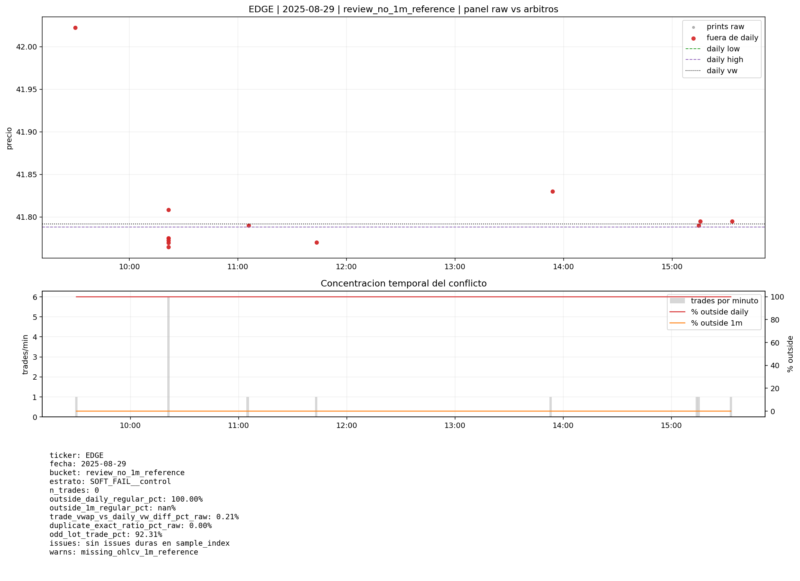

**Que muestra**

- Panel rico del tape raw frente a `daily` y `1m` para `EDGE` el `2025-08-29`.
- `n_trades = 13`, `outside_daily_regular_pct = 100.00%`, `outside_1m_regular_pct = nan%`.
- `trade_vwap_vs_daily_vw_diff_pct_raw = 0.21%`, `duplicate_exact_ratio_pct_raw = 0.00%`, `odd_lot_trade_pct = 92.31%`.

**Responde**

- Familia donde existe conflicto, pero falta el arbitro `1m`. Responde a la pregunta de si el caso debe quedarse en incertidumbre disciplinada y no ser absuelto ni condenado por reflejo.
- Responde a si el conflicto dominante vive en la escala (`~1x`), en la comparabilidad frente a `daily` (100.00%) o frente a `1m` (nan%).
- El 92.31% de odd-lots empuja la lectura hacia microestructura fina; evita leer el caso como pura ruptura economica gruesa.
- La decision que justifica es mantener o no el caso en `recoverable_with_flag` cuando se rematerialice la rehabilitacion sobre `57f`.

### EDGE | 2026-01-28

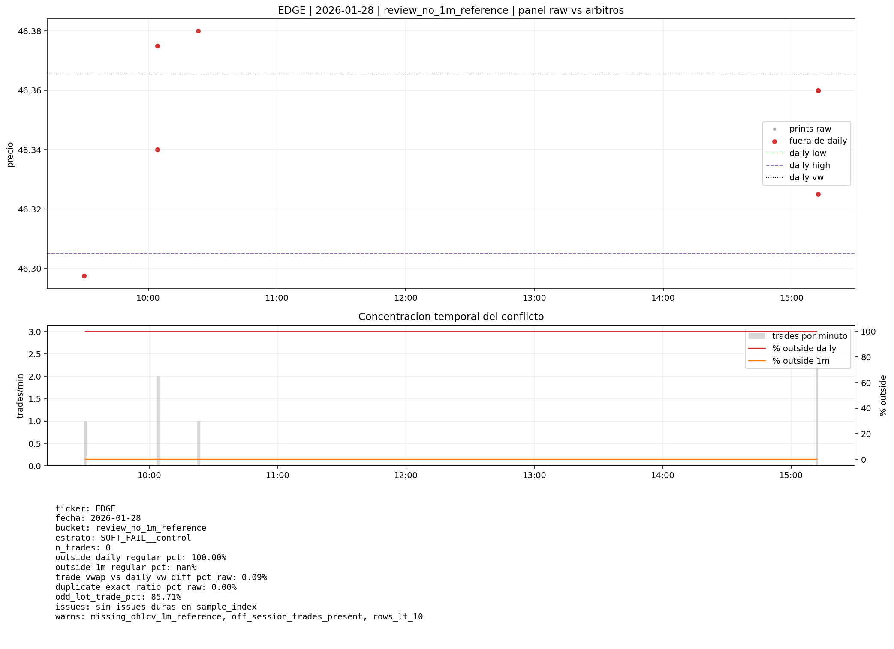

**Que muestra**

- Panel rico del tape raw frente a `daily` y `1m` para `EDGE` el `2026-01-28`.
- `n_trades = 7`, `outside_daily_regular_pct = 100.00%`, `outside_1m_regular_pct = nan%`.
- `trade_vwap_vs_daily_vw_diff_pct_raw = 0.09%`, `duplicate_exact_ratio_pct_raw = 0.00%`, `odd_lot_trade_pct = 85.71%`.

**Responde**

- Familia donde existe conflicto, pero falta el arbitro `1m`. Responde a la pregunta de si el caso debe quedarse en incertidumbre disciplinada y no ser absuelto ni condenado por reflejo.
- Responde a si el conflicto dominante vive en la escala (`~1x`), en la comparabilidad frente a `daily` (100.00%) o frente a `1m` (nan%).
- El 85.71% de odd-lots empuja la lectura hacia microestructura fina; evita leer el caso como pura ruptura economica gruesa.
- La decision que justifica es mantener o no el caso en `recoverable_with_flag` cuando se rematerialice la rehabilitacion sobre `57f`.

### EDGE | 2026-02-18

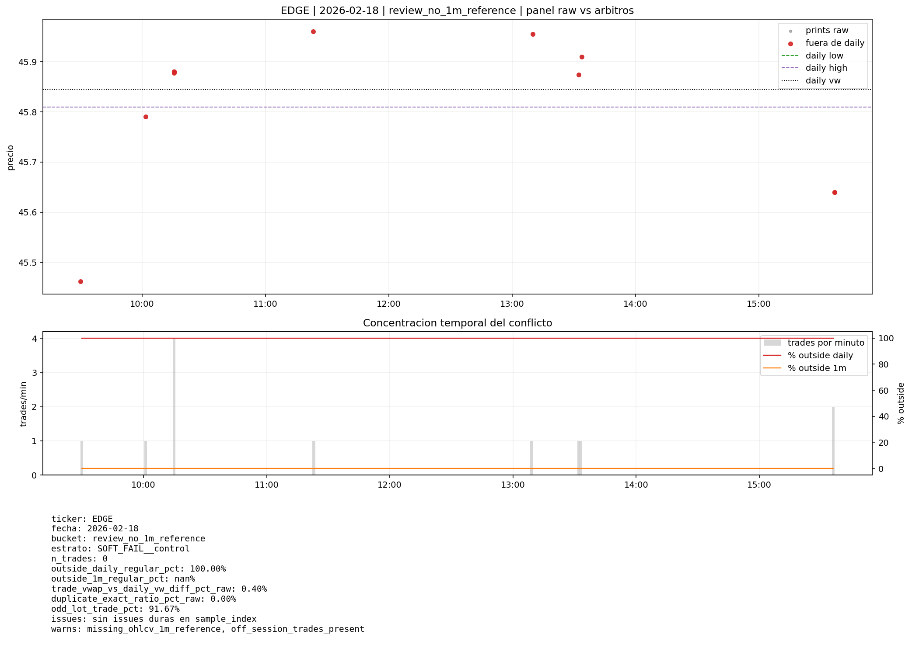

**Que muestra**

- Panel rico del tape raw frente a `daily` y `1m` para `EDGE` el `2026-02-18`.
- `n_trades = 12`, `outside_daily_regular_pct = 100.00%`, `outside_1m_regular_pct = nan%`.
- `trade_vwap_vs_daily_vw_diff_pct_raw = 0.40%`, `duplicate_exact_ratio_pct_raw = 0.00%`, `odd_lot_trade_pct = 91.67%`.

**Responde**

- Familia donde existe conflicto, pero falta el arbitro `1m`. Responde a la pregunta de si el caso debe quedarse en incertidumbre disciplinada y no ser absuelto ni condenado por reflejo.
- Responde a si el conflicto dominante vive en la escala (`~1x`), en la comparabilidad frente a `daily` (100.00%) o frente a `1m` (nan%).
- El 91.67% de odd-lots empuja la lectura hacia microestructura fina; evita leer el caso como pura ruptura economica gruesa.
- La decision que justifica es mantener o no el caso en `recoverable_with_flag` cuando se rematerialice la rehabilitacion sobre `57f`.

### EGLE | 2025-11-03

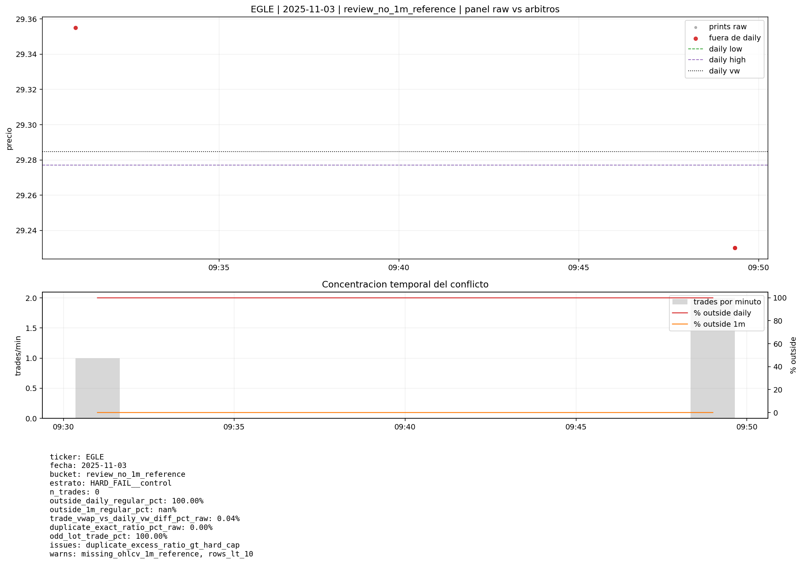

**Que muestra**

- Panel rico del tape raw frente a `daily` y `1m` para `EGLE` el `2025-11-03`.
- `n_trades = 3`, `outside_daily_regular_pct = 100.00%`, `outside_1m_regular_pct = nan%`.
- `trade_vwap_vs_daily_vw_diff_pct_raw = 0.04%`, `duplicate_exact_ratio_pct_raw = 0.00%`, `odd_lot_trade_pct = 100.00%`.

**Responde**

- Familia donde existe conflicto, pero falta el arbitro `1m`. Responde a la pregunta de si el caso debe quedarse en incertidumbre disciplinada y no ser absuelto ni condenado por reflejo.
- Responde a si el conflicto dominante vive en la escala (`~1x`), en la comparabilidad frente a `daily` (100.00%) o frente a `1m` (nan%).
- El 100.00% de odd-lots empuja la lectura hacia microestructura fina; evita leer el caso como pura ruptura economica gruesa.
- La decision que justifica es mantener o no el caso en `recoverable_with_flag` cuando se rematerialice la rehabilitacion sobre `57f`.

### EYEG | 2024-02-06

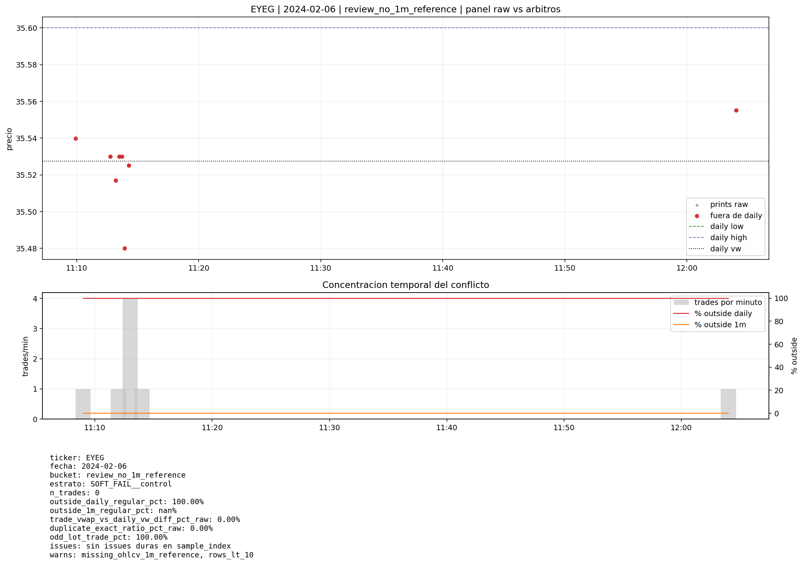

**Que muestra**

- Panel rico del tape raw frente a `daily` y `1m` para `EYEG` el `2024-02-06`.
- `n_trades = 8`, `outside_daily_regular_pct = 100.00%`, `outside_1m_regular_pct = nan%`.
- `trade_vwap_vs_daily_vw_diff_pct_raw = 0.00%`, `duplicate_exact_ratio_pct_raw = 0.00%`, `odd_lot_trade_pct = 100.00%`.

**Responde**

- Familia donde existe conflicto, pero falta el arbitro `1m`. Responde a la pregunta de si el caso debe quedarse en incertidumbre disciplinada y no ser absuelto ni condenado por reflejo.
- Responde a si el conflicto dominante vive en la escala (`~1x`), en la comparabilidad frente a `daily` (100.00%) o frente a `1m` (nan%).
- El 100.00% de odd-lots empuja la lectura hacia microestructura fina; evita leer el caso como pura ruptura economica gruesa.
- La decision que justifica es mantener o no el caso en `recoverable_with_flag` cuando se rematerialice la rehabilitacion sobre `57f`.

### EYEG | 2024-03-14

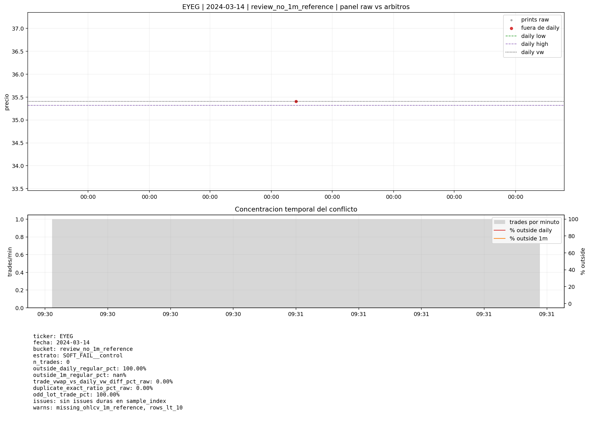

**Que muestra**

- Panel rico del tape raw frente a `daily` y `1m` para `EYEG` el `2024-03-14`.
- `n_trades = 1`, `outside_daily_regular_pct = 100.00%`, `outside_1m_regular_pct = nan%`.
- `trade_vwap_vs_daily_vw_diff_pct_raw = 0.00%`, `duplicate_exact_ratio_pct_raw = 0.00%`, `odd_lot_trade_pct = 100.00%`.

**Responde**

- Familia donde existe conflicto, pero falta el arbitro `1m`. Responde a la pregunta de si el caso debe quedarse en incertidumbre disciplinada y no ser absuelto ni condenado por reflejo.
- Responde a si el conflicto dominante vive en la escala (`~1x`), en la comparabilidad frente a `daily` (100.00%) o frente a `1m` (nan%).
- El 100.00% de odd-lots empuja la lectura hacia microestructura fina; evita leer el caso como pura ruptura economica gruesa.
- La decision que justifica es mantener o no el caso en `recoverable_with_flag` cuando se rematerialice la rehabilitacion sobre `57f`.

### EYEG | 2024-04-23

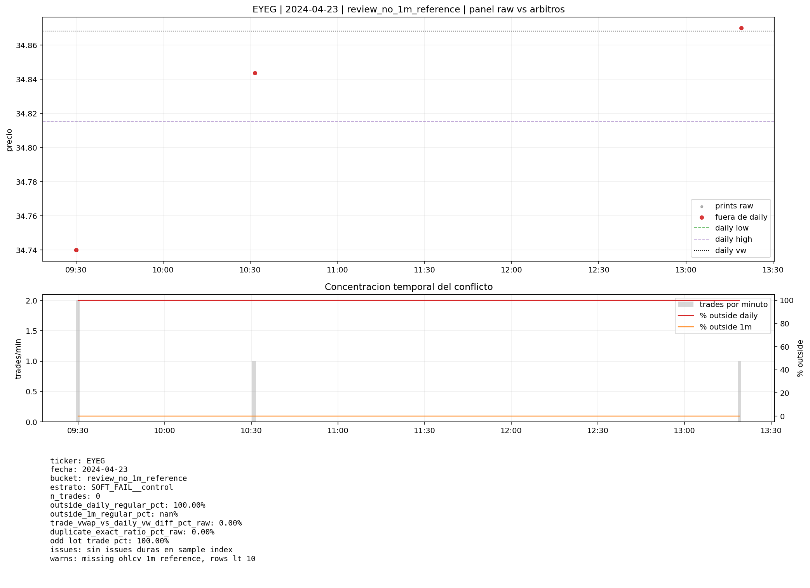

**Que muestra**

- Panel rico del tape raw frente a `daily` y `1m` para `EYEG` el `2024-04-23`.
- `n_trades = 4`, `outside_daily_regular_pct = 100.00%`, `outside_1m_regular_pct = nan%`.
- `trade_vwap_vs_daily_vw_diff_pct_raw = 0.00%`, `duplicate_exact_ratio_pct_raw = 0.00%`, `odd_lot_trade_pct = 100.00%`.

**Responde**

- Familia donde existe conflicto, pero falta el arbitro `1m`. Responde a la pregunta de si el caso debe quedarse en incertidumbre disciplinada y no ser absuelto ni condenado por reflejo.
- Responde a si el conflicto dominante vive en la escala (`~1x`), en la comparabilidad frente a `daily` (100.00%) o frente a `1m` (nan%).
- El 100.00% de odd-lots empuja la lectura hacia microestructura fina; evita leer el caso como pura ruptura economica gruesa.
- La decision que justifica es mantener o no el caso en `recoverable_with_flag` cuando se rematerialice la rehabilitacion sobre `57f`.

### EYEG | 2025-06-16

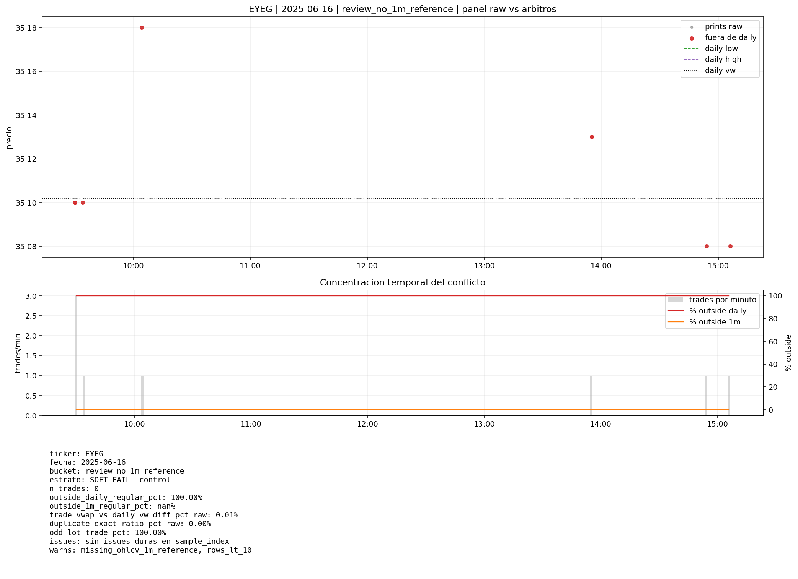

**Que muestra**

- Panel rico del tape raw frente a `daily` y `1m` para `EYEG` el `2025-06-16`.
- `n_trades = 8`, `outside_daily_regular_pct = 100.00%`, `outside_1m_regular_pct = nan%`.
- `trade_vwap_vs_daily_vw_diff_pct_raw = 0.01%`, `duplicate_exact_ratio_pct_raw = 0.00%`, `odd_lot_trade_pct = 100.00%`.

**Responde**

- Familia donde existe conflicto, pero falta el arbitro `1m`. Responde a la pregunta de si el caso debe quedarse en incertidumbre disciplinada y no ser absuelto ni condenado por reflejo.
- Responde a si el conflicto dominante vive en la escala (`~1x`), en la comparabilidad frente a `daily` (100.00%) o frente a `1m` (nan%).
- El 100.00% de odd-lots empuja la lectura hacia microestructura fina; evita leer el caso como pura ruptura economica gruesa.
- La decision que justifica es mantener o no el caso en `recoverable_with_flag` cuando se rematerialice la rehabilitacion sobre `57f`.

### FDBC | 2021-05-07

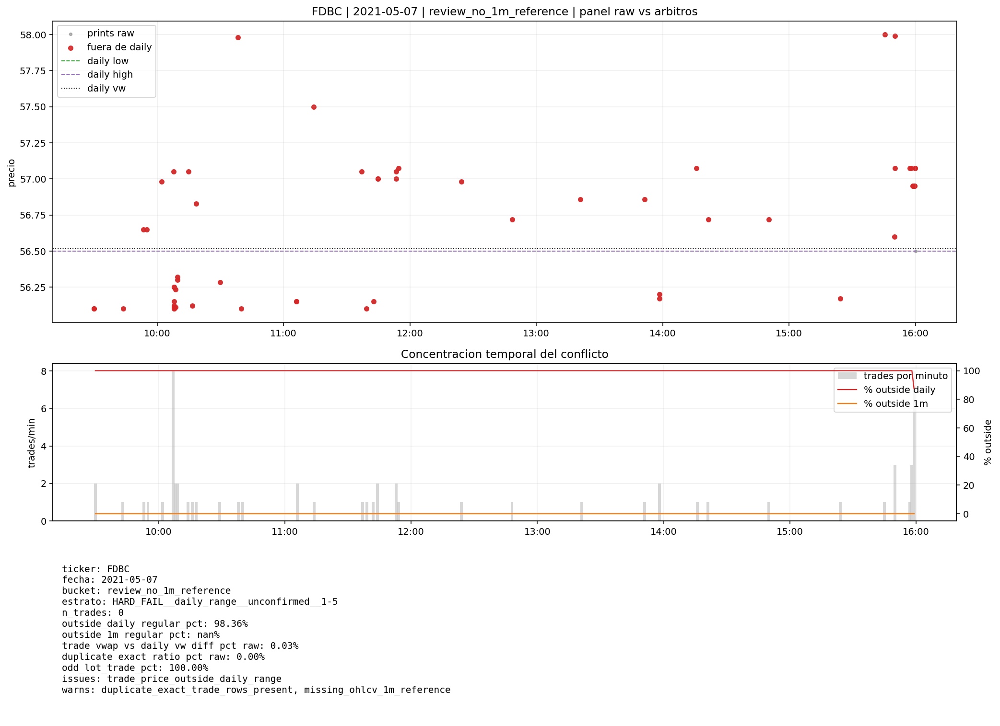

**Que muestra**

- Panel rico del tape raw frente a `daily` y `1m` para `FDBC` el `2021-05-07`.
- `n_trades = 61`, `outside_daily_regular_pct = 98.36%`, `outside_1m_regular_pct = nan%`.
- `trade_vwap_vs_daily_vw_diff_pct_raw = 0.03%`, `duplicate_exact_ratio_pct_raw = 0.00%`, `odd_lot_trade_pct = 100.00%`.

**Responde**

- Familia donde existe conflicto, pero falta el arbitro `1m`. Responde a la pregunta de si el caso debe quedarse en incertidumbre disciplinada y no ser absuelto ni condenado por reflejo.
- Responde a si el conflicto dominante vive en la escala (`~1x`), en la comparabilidad frente a `daily` (98.36%) o frente a `1m` (nan%).
- El 100.00% de odd-lots empuja la lectura hacia microestructura fina; evita leer el caso como pura ruptura economica gruesa.
- La decision que justifica es mantener o no el caso en `recoverable_with_flag` cuando se rematerialice la rehabilitacion sobre `57f`.

### FFBW | 2021-07-06

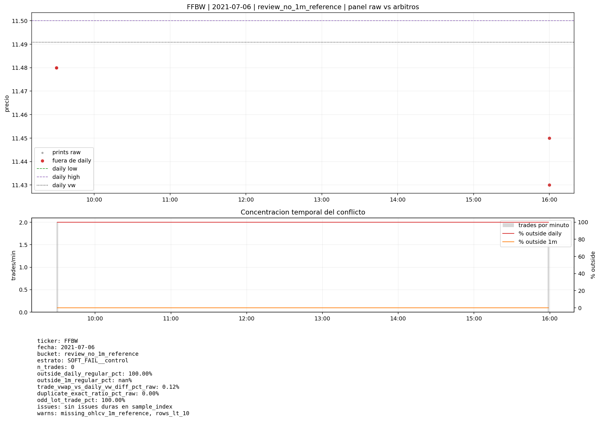

**Que muestra**

- Panel rico del tape raw frente a `daily` y `1m` para `FFBW` el `2021-07-06`.
- `n_trades = 4`, `outside_daily_regular_pct = 100.00%`, `outside_1m_regular_pct = nan%`.
- `trade_vwap_vs_daily_vw_diff_pct_raw = 0.12%`, `duplicate_exact_ratio_pct_raw = 0.00%`, `odd_lot_trade_pct = 100.00%`.

**Responde**

- Familia donde existe conflicto, pero falta el arbitro `1m`. Responde a la pregunta de si el caso debe quedarse en incertidumbre disciplinada y no ser absuelto ni condenado por reflejo.
- Responde a si el conflicto dominante vive en la escala (`~1x`), en la comparabilidad frente a `daily` (100.00%) o frente a `1m` (nan%).
- El 100.00% de odd-lots empuja la lectura hacia microestructura fina; evita leer el caso como pura ruptura economica gruesa.
- La decision que justifica es mantener o no el caso en `recoverable_with_flag` cuando se rematerialice la rehabilitacion sobre `57f`.

### FIEE | 2020-05-15

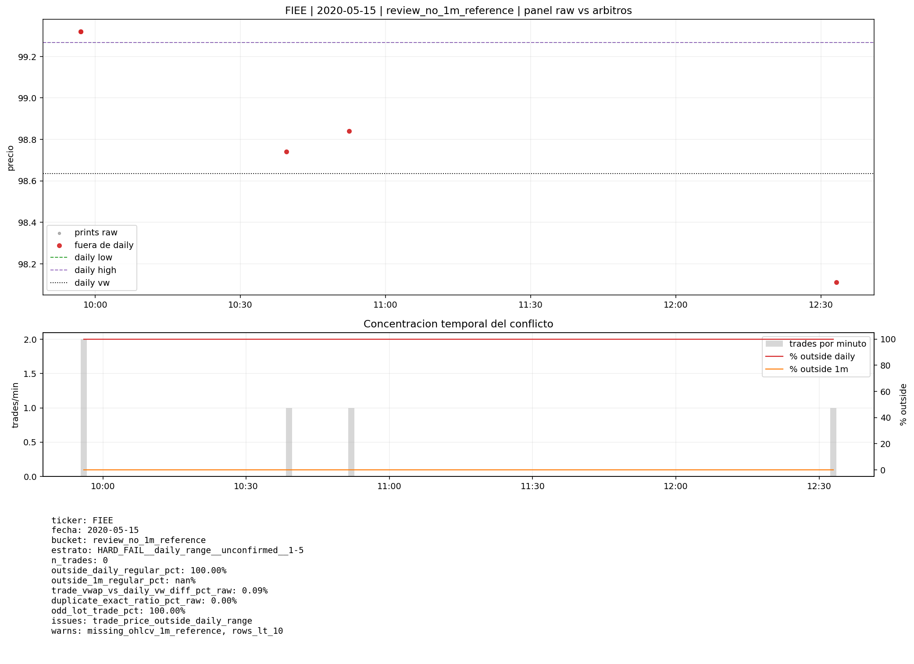

**Que muestra**

- Panel rico del tape raw frente a `daily` y `1m` para `FIEE` el `2020-05-15`.
- `n_trades = 5`, `outside_daily_regular_pct = 100.00%`, `outside_1m_regular_pct = nan%`.
- `trade_vwap_vs_daily_vw_diff_pct_raw = 0.09%`, `duplicate_exact_ratio_pct_raw = 0.00%`, `odd_lot_trade_pct = 100.00%`.

**Responde**

- Familia donde existe conflicto, pero falta el arbitro `1m`. Responde a la pregunta de si el caso debe quedarse en incertidumbre disciplinada y no ser absuelto ni condenado por reflejo.
- Responde a si el conflicto dominante vive en la escala (`~1x`), en la comparabilidad frente a `daily` (100.00%) o frente a `1m` (nan%).
- El 100.00% de odd-lots empuja la lectura hacia microestructura fina; evita leer el caso como pura ruptura economica gruesa.
- La decision que justifica es mantener o no el caso en `recoverable_with_flag` cuando se rematerialice la rehabilitacion sobre `57f`.

### FIEE | 2021-04-21

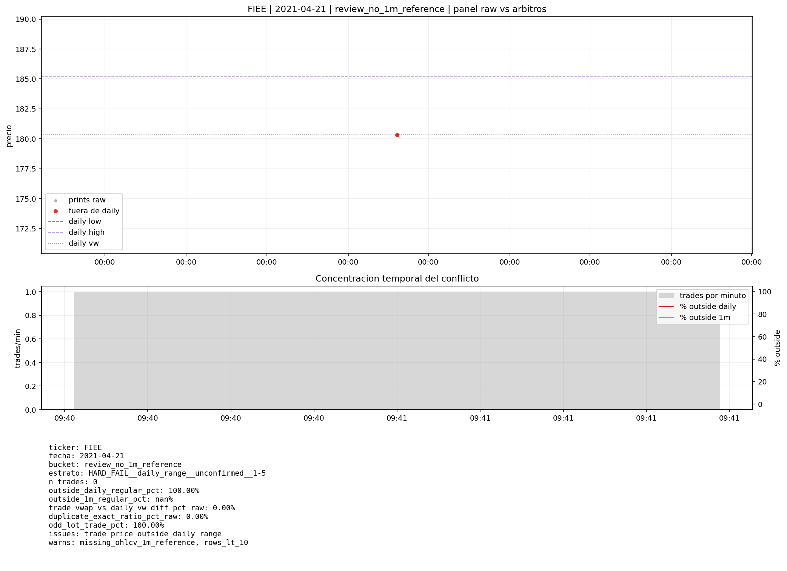

**Que muestra**

- Panel rico del tape raw frente a `daily` y `1m` para `FIEE` el `2021-04-21`.
- `n_trades = 1`, `outside_daily_regular_pct = 100.00%`, `outside_1m_regular_pct = nan%`.
- `trade_vwap_vs_daily_vw_diff_pct_raw = 0.00%`, `duplicate_exact_ratio_pct_raw = 0.00%`, `odd_lot_trade_pct = 100.00%`.

**Responde**

- Familia donde existe conflicto, pero falta el arbitro `1m`. Responde a la pregunta de si el caso debe quedarse en incertidumbre disciplinada y no ser absuelto ni condenado por reflejo.
- Responde a si el conflicto dominante vive en la escala (`~1x`), en la comparabilidad frente a `daily` (100.00%) o frente a `1m` (nan%).
- El 100.00% de odd-lots empuja la lectura hacia microestructura fina; evita leer el caso como pura ruptura economica gruesa.
- La decision que justifica es mantener o no el caso en `recoverable_with_flag` cuando se rematerialice la rehabilitacion sobre `57f`.

### FIEE | 2022-02-15

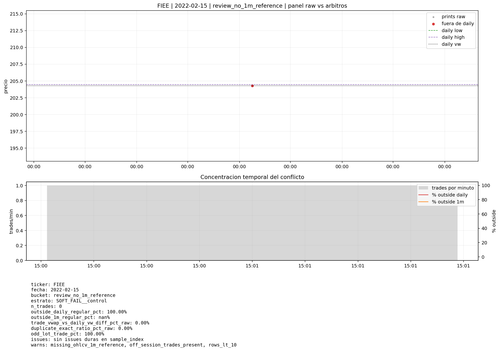

**Que muestra**

- Panel rico del tape raw frente a `daily` y `1m` para `FIEE` el `2022-02-15`.
- `n_trades = 1`, `outside_daily_regular_pct = 100.00%`, `outside_1m_regular_pct = nan%`.
- `trade_vwap_vs_daily_vw_diff_pct_raw = 0.00%`, `duplicate_exact_ratio_pct_raw = 0.00%`, `odd_lot_trade_pct = 100.00%`.

**Responde**

- Familia donde existe conflicto, pero falta el arbitro `1m`. Responde a la pregunta de si el caso debe quedarse en incertidumbre disciplinada y no ser absuelto ni condenado por reflejo.
- Responde a si el conflicto dominante vive en la escala (`~1x`), en la comparabilidad frente a `daily` (100.00%) o frente a `1m` (nan%).
- El 100.00% de odd-lots empuja la lectura hacia microestructura fina; evita leer el caso como pura ruptura economica gruesa.
- La decision que justifica es mantener o no el caso en `recoverable_with_flag` cuando se rematerialice la rehabilitacion sobre `57f`.

### FIEE | 2023-02-03

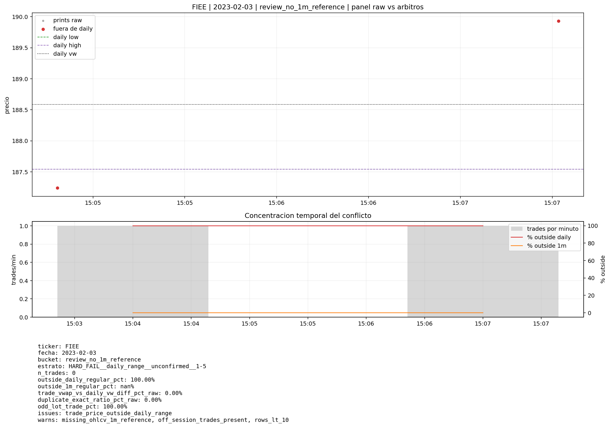

**Que muestra**

- Panel rico del tape raw frente a `daily` y `1m` para `FIEE` el `2023-02-03`.
- `n_trades = 2`, `outside_daily_regular_pct = 100.00%`, `outside_1m_regular_pct = nan%`.
- `trade_vwap_vs_daily_vw_diff_pct_raw = 0.00%`, `duplicate_exact_ratio_pct_raw = 0.00%`, `odd_lot_trade_pct = 100.00%`.

**Responde**

- Familia donde existe conflicto, pero falta el arbitro `1m`. Responde a la pregunta de si el caso debe quedarse en incertidumbre disciplinada y no ser absuelto ni condenado por reflejo.
- Responde a si el conflicto dominante vive en la escala (`~1x`), en la comparabilidad frente a `daily` (100.00%) o frente a `1m` (nan%).
- El 100.00% de odd-lots empuja la lectura hacia microestructura fina; evita leer el caso como pura ruptura economica gruesa.
- La decision que justifica es mantener o no el caso en `recoverable_with_flag` cuando se rematerialice la rehabilitacion sobre `57f`.

### FSRX | 2023-02-06

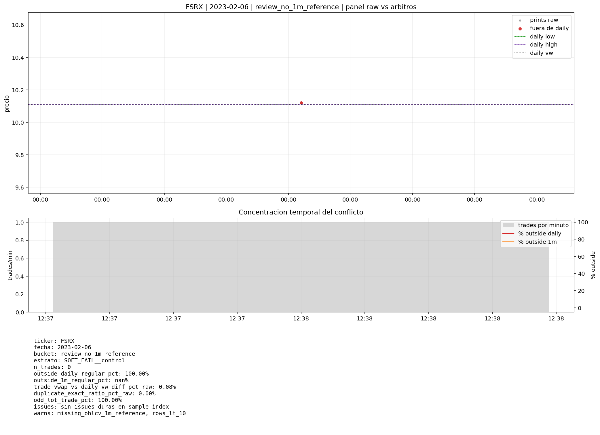

**Que muestra**

- Panel rico del tape raw frente a `daily` y `1m` para `FSRX` el `2023-02-06`.
- `n_trades = 1`, `outside_daily_regular_pct = 100.00%`, `outside_1m_regular_pct = nan%`.
- `trade_vwap_vs_daily_vw_diff_pct_raw = 0.08%`, `duplicate_exact_ratio_pct_raw = 0.00%`, `odd_lot_trade_pct = 100.00%`.

**Responde**

- Familia donde existe conflicto, pero falta el arbitro `1m`. Responde a la pregunta de si el caso debe quedarse en incertidumbre disciplinada y no ser absuelto ni condenado por reflejo.
- Responde a si el conflicto dominante vive en la escala (`~1x`), en la comparabilidad frente a `daily` (100.00%) o frente a `1m` (nan%).
- El 100.00% de odd-lots empuja la lectura hacia microestructura fina; evita leer el caso como pura ruptura economica gruesa.
- La decision que justifica es mantener o no el caso en `recoverable_with_flag` cuando se rematerialice la rehabilitacion sobre `57f`.

### GIA | 2022-10-06

**Que muestra**

- Panel rico del tape raw frente a `daily` y `1m` para `GIA` el `2022-10-06`.
- `n_trades = 2`, `outside_daily_regular_pct = 100.00%`, `outside_1m_regular_pct = nan%`.
- `trade_vwap_vs_daily_vw_diff_pct_raw = 0.10%`, `duplicate_exact_ratio_pct_raw = 0.00%`, `odd_lot_trade_pct = 100.00%`.

**Responde**

- Familia donde existe conflicto, pero falta el arbitro `1m`. Responde a la pregunta de si el caso debe quedarse en incertidumbre disciplinada y no ser absuelto ni condenado por reflejo.
- Responde a si el conflicto dominante vive en la escala (`~1x`), en la comparabilidad frente a `daily` (100.00%) o frente a `1m` (nan%).
- El 100.00% de odd-lots empuja la lectura hacia microestructura fina; evita leer el caso como pura ruptura economica gruesa.
- La decision que justifica es mantener o no el caso en `recoverable_with_flag` cuando se rematerialice la rehabilitacion sobre `57f`.

### HMNF | 2023-02-01

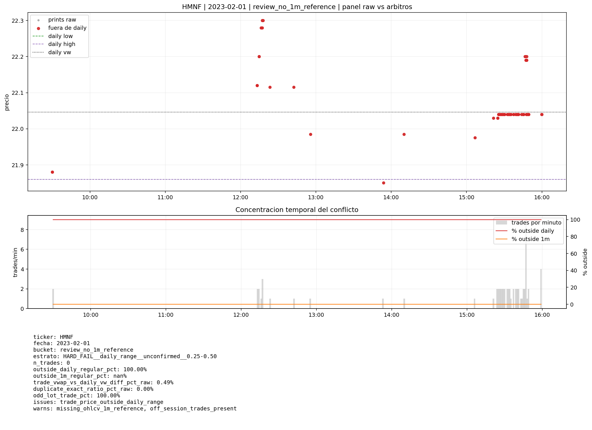

**Que muestra**

- Panel rico del tape raw frente a `daily` y `1m` para `HMNF` el `2023-02-01`.
- `n_trades = 68`, `outside_daily_regular_pct = 100.00%`, `outside_1m_regular_pct = nan%`.
- `trade_vwap_vs_daily_vw_diff_pct_raw = 0.49%`, `duplicate_exact_ratio_pct_raw = 0.00%`, `odd_lot_trade_pct = 100.00%`.

**Responde**

- Familia donde existe conflicto, pero falta el arbitro `1m`. Responde a la pregunta de si el caso debe quedarse en incertidumbre disciplinada y no ser absuelto ni condenado por reflejo.
- Responde a si el conflicto dominante vive en la escala (`~1x`), en la comparabilidad frente a `daily` (100.00%) o frente a `1m` (nan%).
- El 100.00% de odd-lots empuja la lectura hacia microestructura fina; evita leer el caso como pura ruptura economica gruesa.
- La decision que justifica es mantener o no el caso en `recoverable_with_flag` cuando se rematerialice la rehabilitacion sobre `57f`.

### IG | 2019-03-29

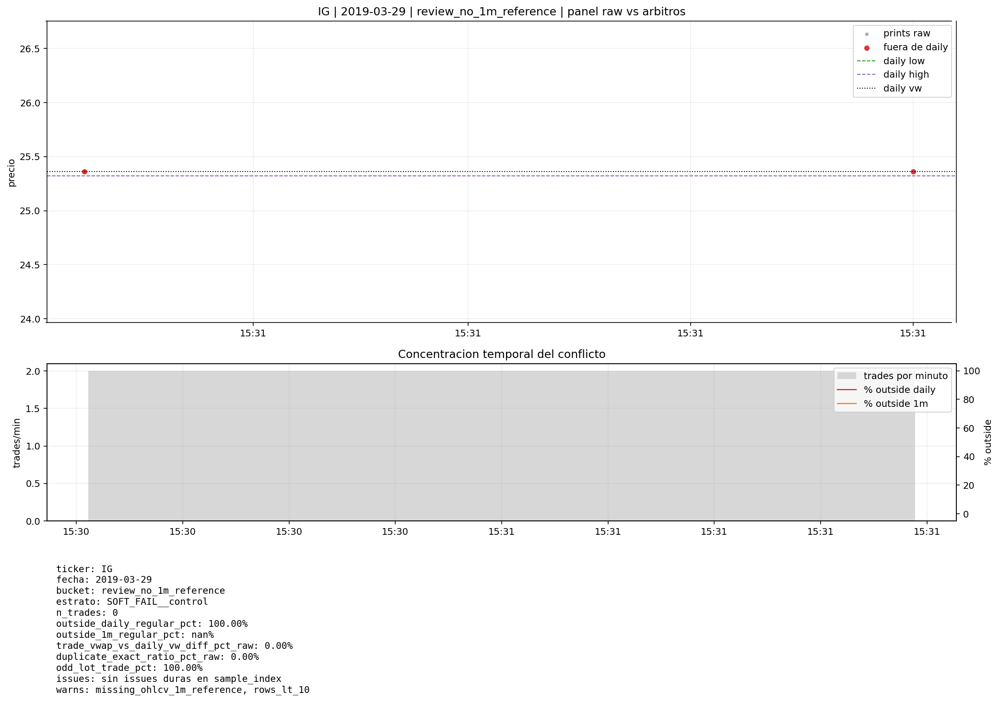

**Que muestra**

- Panel rico del tape raw frente a `daily` y `1m` para `IG` el `2019-03-29`.
- `n_trades = 2`, `outside_daily_regular_pct = 100.00%`, `outside_1m_regular_pct = nan%`.
- `trade_vwap_vs_daily_vw_diff_pct_raw = 0.00%`, `duplicate_exact_ratio_pct_raw = 0.00%`, `odd_lot_trade_pct = 100.00%`.

**Responde**

- Familia donde existe conflicto, pero falta el arbitro `1m`. Responde a la pregunta de si el caso debe quedarse en incertidumbre disciplinada y no ser absuelto ni condenado por reflejo.
- Responde a si el conflicto dominante vive en la escala (`~1x`), en la comparabilidad frente a `daily` (100.00%) o frente a `1m` (nan%).
- El 100.00% de odd-lots empuja la lectura hacia microestructura fina; evita leer el caso como pura ruptura economica gruesa.
- La decision que justifica es mantener o no el caso en `recoverable_with_flag` cuando se rematerialice la rehabilitacion sobre `57f`.

### IG | 2019-04-02

**Que muestra**

- Panel rico del tape raw frente a `daily` y `1m` para `IG` el `2019-04-02`.
- `n_trades = 1`, `outside_daily_regular_pct = 100.00%`, `outside_1m_regular_pct = nan%`.
- `trade_vwap_vs_daily_vw_diff_pct_raw = 0.00%`, `duplicate_exact_ratio_pct_raw = 0.00%`, `odd_lot_trade_pct = 100.00%`.

**Responde**

- Familia donde existe conflicto, pero falta el arbitro `1m`. Responde a la pregunta de si el caso debe quedarse en incertidumbre disciplinada y no ser absuelto ni condenado por reflejo.
- Responde a si el conflicto dominante vive en la escala (`~1x`), en la comparabilidad frente a `daily` (100.00%) o frente a `1m` (nan%).
- El 100.00% de odd-lots empuja la lectura hacia microestructura fina; evita leer el caso como pura ruptura economica gruesa.
- La decision que justifica es mantener o no el caso en `recoverable_with_flag` cuando se rematerialice la rehabilitacion sobre `57f`.

### IG | 2019-09-19

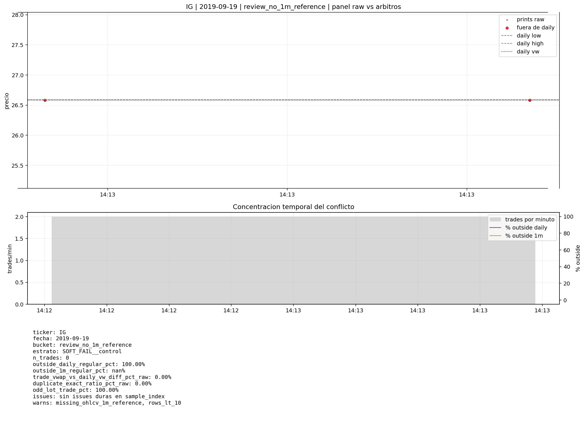

**Que muestra**

- Panel rico del tape raw frente a `daily` y `1m` para `IG` el `2019-09-19`.
- `n_trades = 2`, `outside_daily_regular_pct = 100.00%`, `outside_1m_regular_pct = nan%`.
- `trade_vwap_vs_daily_vw_diff_pct_raw = 0.00%`, `duplicate_exact_ratio_pct_raw = 0.00%`, `odd_lot_trade_pct = 100.00%`.

**Responde**

- Familia donde existe conflicto, pero falta el arbitro `1m`. Responde a la pregunta de si el caso debe quedarse en incertidumbre disciplinada y no ser absuelto ni condenado por reflejo.
- Responde a si el conflicto dominante vive en la escala (`~1x`), en la comparabilidad frente a `daily` (100.00%) o frente a `1m` (nan%).
- El 100.00% de odd-lots empuja la lectura hacia microestructura fina; evita leer el caso como pura ruptura economica gruesa.
- La decision que justifica es mantener o no el caso en `recoverable_with_flag` cuando se rematerialice la rehabilitacion sobre `57f`.

### IRET | 2024-10-04

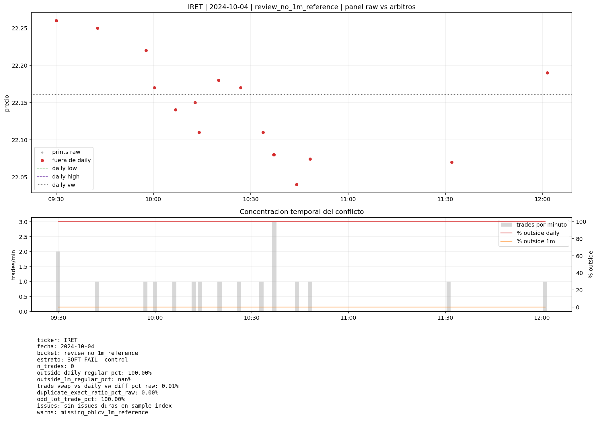

**Que muestra**

- Panel rico del tape raw frente a `daily` y `1m` para `IRET` el `2024-10-04`.
- `n_trades = 18`, `outside_daily_regular_pct = 100.00%`, `outside_1m_regular_pct = nan%`.
- `trade_vwap_vs_daily_vw_diff_pct_raw = 0.01%`, `duplicate_exact_ratio_pct_raw = 0.00%`, `odd_lot_trade_pct = 100.00%`.

**Responde**

- Familia donde existe conflicto, pero falta el arbitro `1m`. Responde a la pregunta de si el caso debe quedarse en incertidumbre disciplinada y no ser absuelto ni condenado por reflejo.
- Responde a si el conflicto dominante vive en la escala (`~1x`), en la comparabilidad frente a `daily` (100.00%) o frente a `1m` (nan%).
- El 100.00% de odd-lots empuja la lectura hacia microestructura fina; evita leer el caso como pura ruptura economica gruesa.
- La decision que justifica es mantener o no el caso en `recoverable_with_flag` cuando se rematerialice la rehabilitacion sobre `57f`.

### ITIC | 2023-08-16

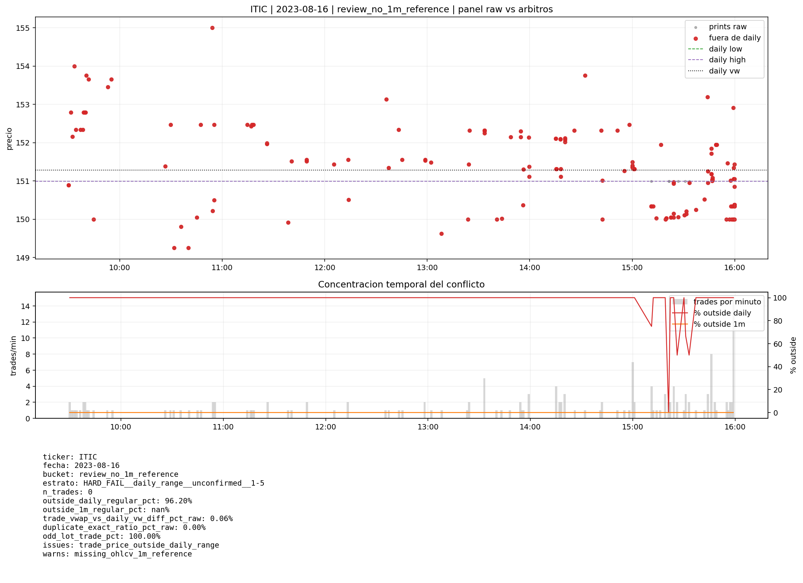

**Que muestra**

- Panel rico del tape raw frente a `daily` y `1m` para `ITIC` el `2023-08-16`.
- `n_trades = 158`, `outside_daily_regular_pct = 96.20%`, `outside_1m_regular_pct = nan%`.
- `trade_vwap_vs_daily_vw_diff_pct_raw = 0.06%`, `duplicate_exact_ratio_pct_raw = 0.00%`, `odd_lot_trade_pct = 100.00%`.

**Responde**

- Familia donde existe conflicto, pero falta el arbitro `1m`. Responde a la pregunta de si el caso debe quedarse en incertidumbre disciplinada y no ser absuelto ni condenado por reflejo.
- Responde a si el conflicto dominante vive en la escala (`~1x`), en la comparabilidad frente a `daily` (96.20%) o frente a `1m` (nan%).
- El 100.00% de odd-lots empuja la lectura hacia microestructura fina; evita leer el caso como pura ruptura economica gruesa.
- La decision que justifica es mantener o no el caso en `recoverable_with_flag` cuando se rematerialice la rehabilitacion sobre `57f`.

### JIVE | 2023-11-14

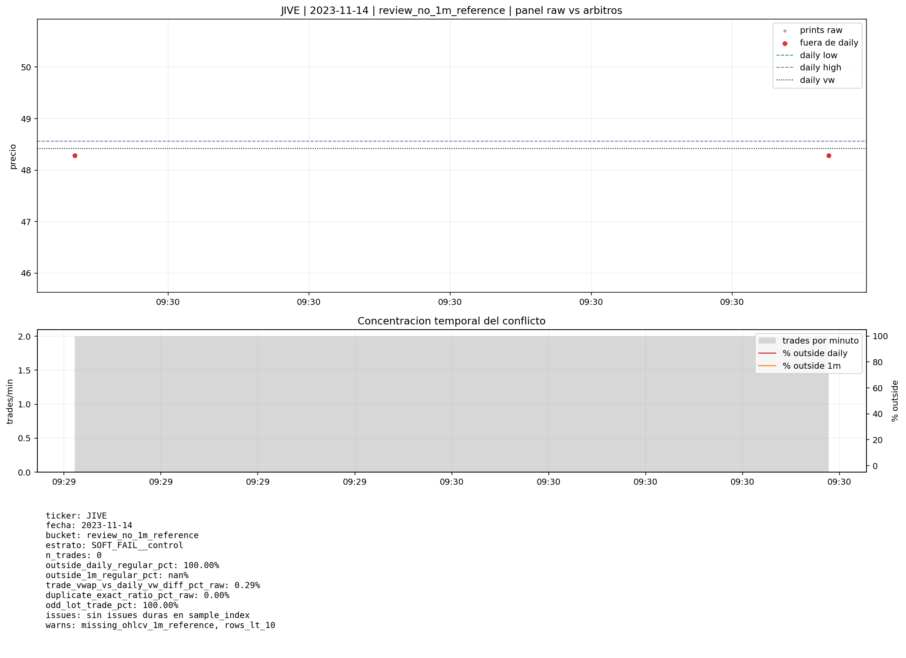

**Que muestra**

- Panel rico del tape raw frente a `daily` y `1m` para `JIVE` el `2023-11-14`.
- `n_trades = 2`, `outside_daily_regular_pct = 100.00%`, `outside_1m_regular_pct = nan%`.
- `trade_vwap_vs_daily_vw_diff_pct_raw = 0.29%`, `duplicate_exact_ratio_pct_raw = 0.00%`, `odd_lot_trade_pct = 100.00%`.

**Responde**

- Familia donde existe conflicto, pero falta el arbitro `1m`. Responde a la pregunta de si el caso debe quedarse en incertidumbre disciplinada y no ser absuelto ni condenado por reflejo.
- Responde a si el conflicto dominante vive en la escala (`~1x`), en la comparabilidad frente a `daily` (100.00%) o frente a `1m` (nan%).
- El 100.00% de odd-lots empuja la lectura hacia microestructura fina; evita leer el caso como pura ruptura economica gruesa.
- La decision que justifica es mantener o no el caso en `recoverable_with_flag` cuando se rematerialice la rehabilitacion sobre `57f`.

### KOOL | 2025-11-05

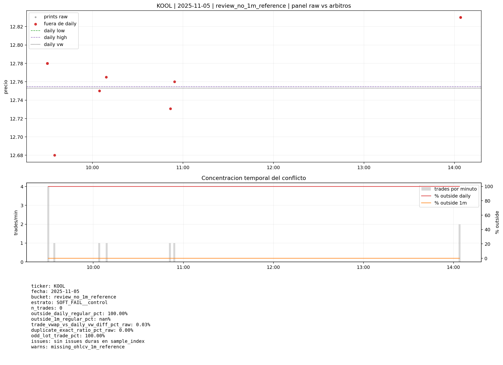

**Que muestra**

- Panel rico del tape raw frente a `daily` y `1m` para `KOOL` el `2025-11-05`.
- `n_trades = 11`, `outside_daily_regular_pct = 100.00%`, `outside_1m_regular_pct = nan%`.
- `trade_vwap_vs_daily_vw_diff_pct_raw = 0.03%`, `duplicate_exact_ratio_pct_raw = 0.00%`, `odd_lot_trade_pct = 100.00%`.

**Responde**

- Familia donde existe conflicto, pero falta el arbitro `1m`. Responde a la pregunta de si el caso debe quedarse en incertidumbre disciplinada y no ser absuelto ni condenado por reflejo.
- Responde a si el conflicto dominante vive en la escala (`~1x`), en la comparabilidad frente a `daily` (100.00%) o frente a `1m` (nan%).
- El 100.00% de odd-lots empuja la lectura hacia microestructura fina; evita leer el caso como pura ruptura economica gruesa.
- La decision que justifica es mantener o no el caso en `recoverable_with_flag` cuando se rematerialice la rehabilitacion sobre `57f`.

### MGYR | 2024-10-07

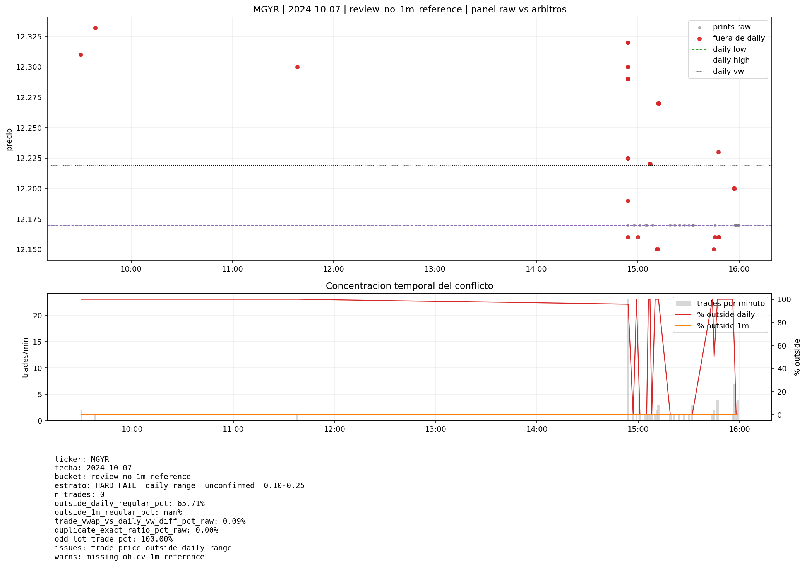

**Que muestra**

- Panel rico del tape raw frente a `daily` y `1m` para `MGYR` el `2024-10-07`.
- `n_trades = 70`, `outside_daily_regular_pct = 65.71%`, `outside_1m_regular_pct = nan%`.
- `trade_vwap_vs_daily_vw_diff_pct_raw = 0.09%`, `duplicate_exact_ratio_pct_raw = 0.00%`, `odd_lot_trade_pct = 100.00%`.

**Responde**

- Familia donde existe conflicto, pero falta el arbitro `1m`. Responde a la pregunta de si el caso debe quedarse en incertidumbre disciplinada y no ser absuelto ni condenado por reflejo.
- Responde a si el conflicto dominante vive en la escala (`~1x`), en la comparabilidad frente a `daily` (65.71%) o frente a `1m` (nan%).
- El 100.00% de odd-lots empuja la lectura hacia microestructura fina; evita leer el caso como pura ruptura economica gruesa.
- La decision que justifica es mantener o no el caso en `recoverable_with_flag` cuando se rematerialice la rehabilitacion sobre `57f`.

### OMCC | 2025-01-22

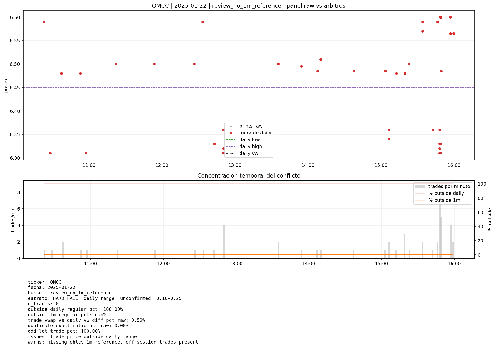

**Que muestra**

- Panel rico del tape raw frente a `daily` y `1m` para `OMCC` el `2025-01-22`.
- `n_trades = 54`, `outside_daily_regular_pct = 100.00%`, `outside_1m_regular_pct = nan%`.
- `trade_vwap_vs_daily_vw_diff_pct_raw = 0.52%`, `duplicate_exact_ratio_pct_raw = 0.00%`, `odd_lot_trade_pct = 100.00%`.

**Responde**

- Familia donde existe conflicto, pero falta el arbitro `1m`. Responde a la pregunta de si el caso debe quedarse en incertidumbre disciplinada y no ser absuelto ni condenado por reflejo.
- Responde a si el conflicto dominante vive en la escala (`~1x`), en la comparabilidad frente a `daily` (100.00%) o frente a `1m` (nan%).
- El 100.00% de odd-lots empuja la lectura hacia microestructura fina; evita leer el caso como pura ruptura economica gruesa.
- La decision que justifica es mantener o no el caso en `recoverable_with_flag` cuando se rematerialice la rehabilitacion sobre `57f`.

### QETA | 2026-03-04

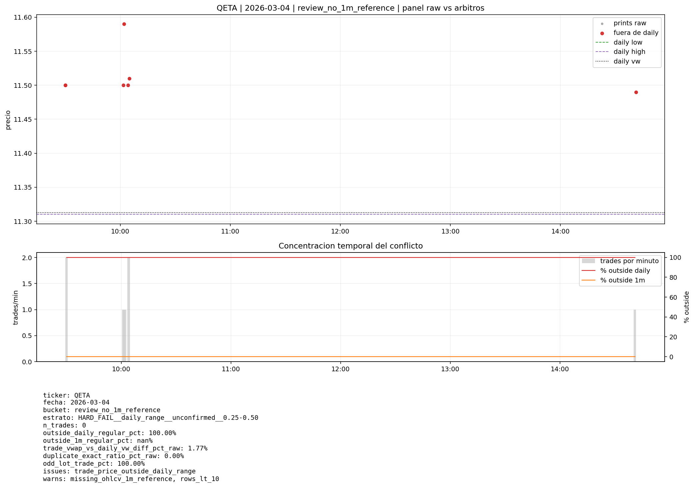

**Que muestra**

- Panel rico del tape raw frente a `daily` y `1m` para `QETA` el `2026-03-04`.
- `n_trades = 7`, `outside_daily_regular_pct = 100.00%`, `outside_1m_regular_pct = nan%`.
- `trade_vwap_vs_daily_vw_diff_pct_raw = 1.77%`, `duplicate_exact_ratio_pct_raw = 0.00%`, `odd_lot_trade_pct = 100.00%`.

**Responde**

- Familia donde existe conflicto, pero falta el arbitro `1m`. Responde a la pregunta de si el caso debe quedarse en incertidumbre disciplinada y no ser absuelto ni condenado por reflejo.
- Responde a si el conflicto dominante vive en la escala (`~1x`), en la comparabilidad frente a `daily` (100.00%) o frente a `1m` (nan%).
- El 100.00% de odd-lots empuja la lectura hacia microestructura fina; evita leer el caso como pura ruptura economica gruesa.
- La decision que justifica es mantener o no el caso en `recoverable_with_flag` cuando se rematerialice la rehabilitacion sobre `57f`.

### SPAQ | 2025-06-09

**Que muestra**

- Panel rico del tape raw frente a `daily` y `1m` para `SPAQ` el `2025-06-09`.
- `n_trades = 3`, `outside_daily_regular_pct = 100.00%`, `outside_1m_regular_pct = nan%`.
- `trade_vwap_vs_daily_vw_diff_pct_raw = 0.05%`, `duplicate_exact_ratio_pct_raw = 0.00%`, `odd_lot_trade_pct = 100.00%`.

**Responde**

- Familia donde existe conflicto, pero falta el arbitro `1m`. Responde a la pregunta de si el caso debe quedarse en incertidumbre disciplinada y no ser absuelto ni condenado por reflejo.
- Responde a si el conflicto dominante vive en la escala (`~1x`), en la comparabilidad frente a `daily` (100.00%) o frente a `1m` (nan%).
- El 100.00% de odd-lots empuja la lectura hacia microestructura fina; evita leer el caso como pura ruptura economica gruesa.
- La decision que justifica es mantener o no el caso en `recoverable_with_flag` cuando se rematerialice la rehabilitacion sobre `57f`.

### SPAQ | 2025-06-10

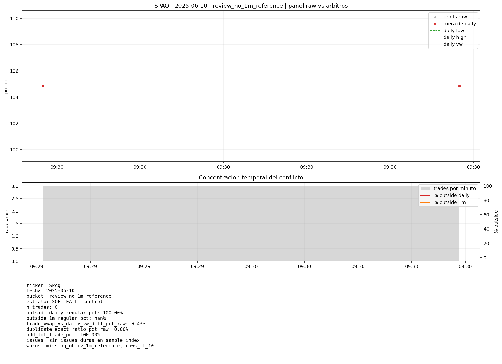

**Que muestra**

- Panel rico del tape raw frente a `daily` y `1m` para `SPAQ` el `2025-06-10`.
- `n_trades = 3`, `outside_daily_regular_pct = 100.00%`, `outside_1m_regular_pct = nan%`.
- `trade_vwap_vs_daily_vw_diff_pct_raw = 0.43%`, `duplicate_exact_ratio_pct_raw = 0.00%`, `odd_lot_trade_pct = 100.00%`.

**Responde**

- Familia donde existe conflicto, pero falta el arbitro `1m`. Responde a la pregunta de si el caso debe quedarse en incertidumbre disciplinada y no ser absuelto ni condenado por reflejo.
- Responde a si el conflicto dominante vive en la escala (`~1x`), en la comparabilidad frente a `daily` (100.00%) o frente a `1m` (nan%).
- El 100.00% de odd-lots empuja la lectura hacia microestructura fina; evita leer el caso como pura ruptura economica gruesa.
- La decision que justifica es mantener o no el caso en `recoverable_with_flag` cuando se rematerialice la rehabilitacion sobre `57f`.

### TAX | 2025-06-10

**Que muestra**

- Panel rico del tape raw frente a `daily` y `1m` para `TAX` el `2025-06-10`.
- `n_trades = 6`, `outside_daily_regular_pct = 100.00%`, `outside_1m_regular_pct = nan%`.
- `trade_vwap_vs_daily_vw_diff_pct_raw = 0.01%`, `duplicate_exact_ratio_pct_raw = 0.00%`, `odd_lot_trade_pct = 100.00%`.

**Responde**

- Familia donde existe conflicto, pero falta el arbitro `1m`. Responde a la pregunta de si el caso debe quedarse en incertidumbre disciplinada y no ser absuelto ni condenado por reflejo.
- Responde a si el conflicto dominante vive en la escala (`~1x`), en la comparabilidad frente a `daily` (100.00%) o frente a `1m` (nan%).
- El 100.00% de odd-lots empuja la lectura hacia microestructura fina; evita leer el caso como pura ruptura economica gruesa.
- La decision que justifica es mantener o no el caso en `recoverable_with_flag` cuando se rematerialice la rehabilitacion sobre `57f`.

### TCBC | 2023-07-10

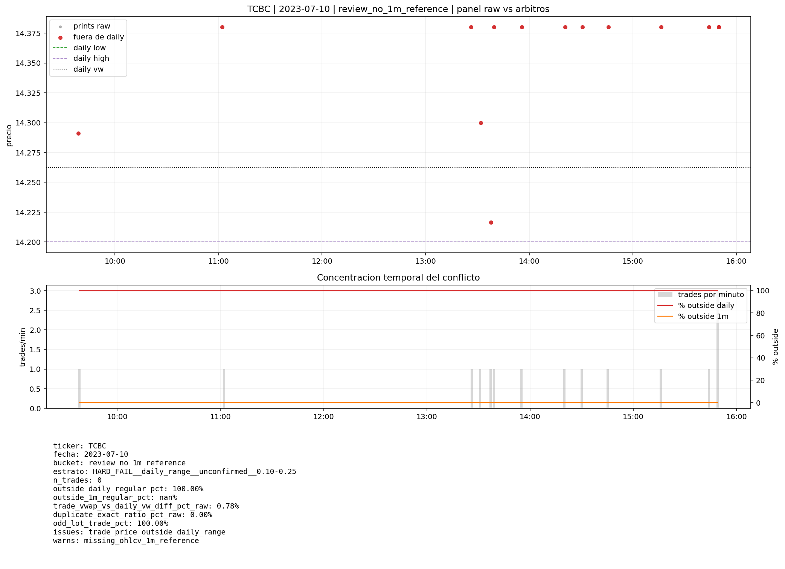

**Que muestra**

- Panel rico del tape raw frente a `daily` y `1m` para `TCBC` el `2023-07-10`.
- `n_trades = 15`, `outside_daily_regular_pct = 100.00%`, `outside_1m_regular_pct = nan%`.
- `trade_vwap_vs_daily_vw_diff_pct_raw = 0.78%`, `duplicate_exact_ratio_pct_raw = 0.00%`, `odd_lot_trade_pct = 100.00%`.

**Responde**

- Familia donde existe conflicto, pero falta el arbitro `1m`. Responde a la pregunta de si el caso debe quedarse en incertidumbre disciplinada y no ser absuelto ni condenado por reflejo.
- Responde a si el conflicto dominante vive en la escala (`~1x`), en la comparabilidad frente a `daily` (100.00%) o frente a `1m` (nan%).
- El 100.00% de odd-lots empuja la lectura hacia microestructura fina; evita leer el caso como pura ruptura economica gruesa.
- La decision que justifica es mantener o no el caso en `recoverable_with_flag` cuando se rematerialice la rehabilitacion sobre `57f`.

### VALU | 2019-11-26

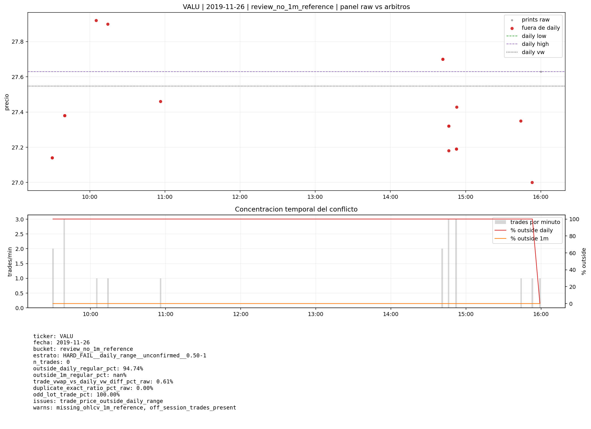

**Que muestra**

- Panel rico del tape raw frente a `daily` y `1m` para `VALU` el `2019-11-26`.
- `n_trades = 19`, `outside_daily_regular_pct = 94.74%`, `outside_1m_regular_pct = nan%`.
- `trade_vwap_vs_daily_vw_diff_pct_raw = 0.61%`, `duplicate_exact_ratio_pct_raw = 0.00%`, `odd_lot_trade_pct = 100.00%`.

**Responde**

- Familia donde existe conflicto, pero falta el arbitro `1m`. Responde a la pregunta de si el caso debe quedarse en incertidumbre disciplinada y no ser absuelto ni condenado por reflejo.
- Responde a si el conflicto dominante vive en la escala (`~1x`), en la comparabilidad frente a `daily` (94.74%) o frente a `1m` (nan%).
- El 100.00% de odd-lots empuja la lectura hacia microestructura fina; evita leer el caso como pura ruptura economica gruesa.
- La decision que justifica es mantener o no el caso en `recoverable_with_flag` cuando se rematerialice la rehabilitacion sobre `57f`.

### WTRE | 2023-08-03

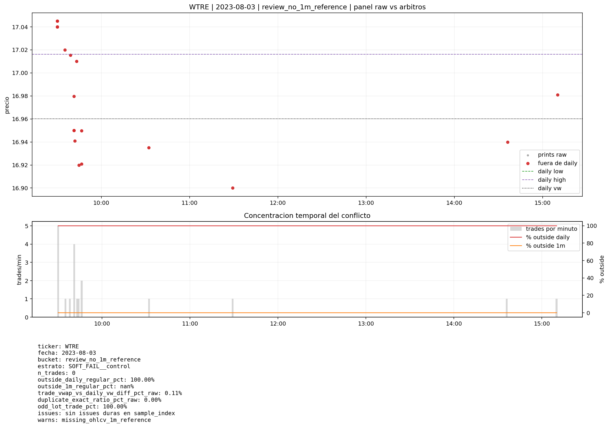

**Que muestra**

- Panel rico del tape raw frente a `daily` y `1m` para `WTRE` el `2023-08-03`.
- `n_trades = 19`, `outside_daily_regular_pct = 100.00%`, `outside_1m_regular_pct = nan%`.
- `trade_vwap_vs_daily_vw_diff_pct_raw = 0.11%`, `duplicate_exact_ratio_pct_raw = 0.00%`, `odd_lot_trade_pct = 100.00%`.

**Responde**

- Familia donde existe conflicto, pero falta el arbitro `1m`. Responde a la pregunta de si el caso debe quedarse en incertidumbre disciplinada y no ser absuelto ni condenado por reflejo.
- Responde a si el conflicto dominante vive en la escala (`~1x`), en la comparabilidad frente a `daily` (100.00%) o frente a `1m` (nan%).
- El 100.00% de odd-lots empuja la lectura hacia microestructura fina; evita leer el caso como pura ruptura economica gruesa.
- La decision que justifica es mantener o no el caso en `recoverable_with_flag` cuando se rematerialice la rehabilitacion sobre `57f`.

