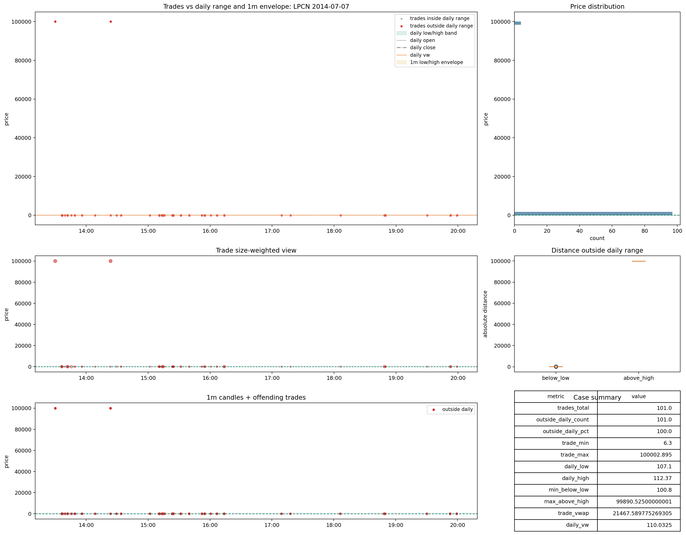
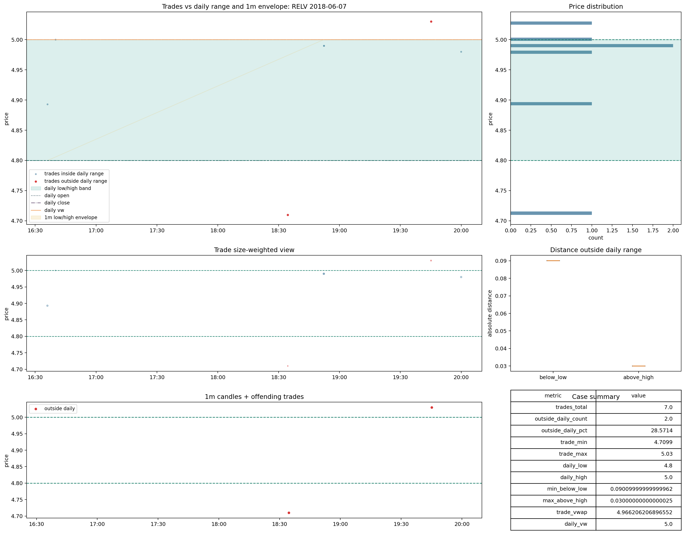
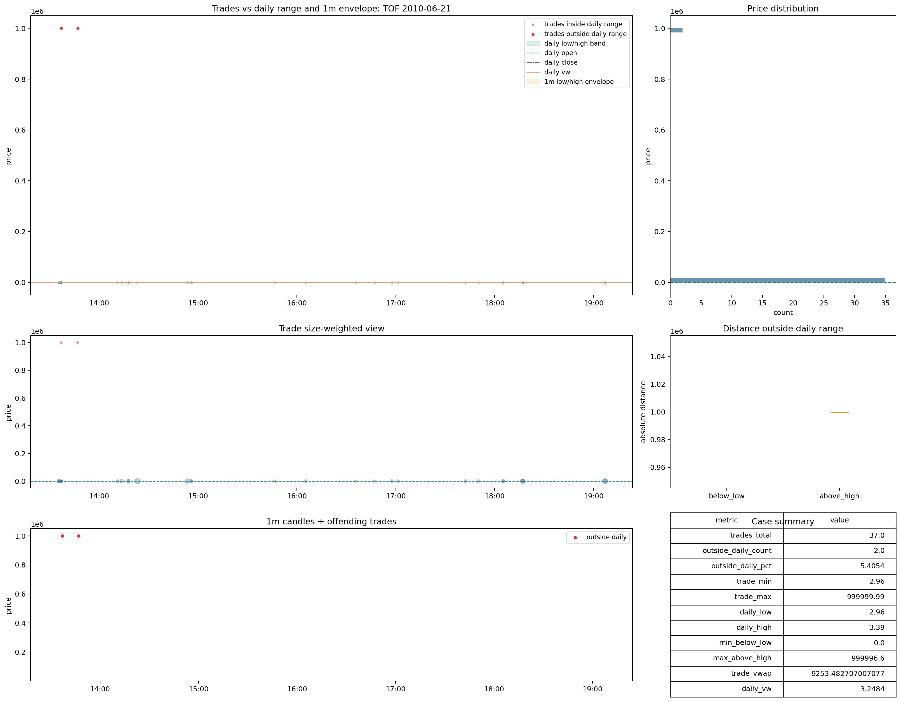

# Trades Review Cases v0.1

## 1. Rol

Este dossier documenta la franja `review` de `trades`. Despues del cierre final, esta franja ya no debe leerse como una masa uniforme. Se reparte entre:

- `recoverable_with_flag`
- `review_not_rehabilitated`

segun el bucket tecnico y la regla de rehabilitacion final.

La pregunta central ya no es solo si existe conflicto. La pregunta correcta es:

- que clase de conflicto es;
- si el conflicto destruye la lectura economica del file o solo rompe la comparabilidad con el arbitro;
- y que pipeline queda afectado por esa diferencia.

## 2. `reference_scale_mismatch`

### Que significa este bucket

Este bucket aparece cuando el flujo raw de trades parece vivir en otra escala frente a `daily` o `1m`. Su idea central es muy importante:

- no prueba, por si solo, que el tape este corrupto;
- prueba que la comparacion con la referencia esta mal planteada o que la escala no esta reconciliada.

Mientras no exista una reconciliacion institucional de escala, este bucket no debe entrar en `good` ni en `recoverable_with_flag` automatico.

### Responde

- si el conflicto dominante es de escala y no de corrupcion intrinseca del tape;
- si el arbitro `daily` o `1m` esta comparando magnitudes no reconciliadas;
- si el file exige una capa `split_normalized` o reconciliacion equivalente antes de cualquier juicio economico serio.

### No responde

- si el file seria util una vez reconciliada la escala;
- si el flujo intrinseco del tape es limpio o sucio en sentido microestructural fino;
- ni si el caso merece exclusion definitiva.

### Caso SGA 2009-01-05

#### Que muestra la imagen

- los prints raw de `trades` y el `VWAP` asociado no se mueven como pequenos desbordes alrededor del rango diario;
- la mayor parte del conflicto viene de una escala distinta, no de unos pocos ticks marginales;
- por eso el problema no se comporta como microestructura fina ni como outlier aislado.

#### Que pregunta responde

Responde a esta pregunta: cuando el arbitro protesta, protesta porque el tape sea absurdo o porque vive en otra escala. En este caso la imagen apoya claramente la segunda lectura.

#### Que conclusion debe sacar el lector

La imagen no dice "file muerto". Dice algo mas preciso:

- el arbitro diario y el flujo raw no comparten la misma escala operativa;
- mientras eso siga asi, no hay forma limpia de usar el file como observacion comparable de ejecucion o de retorno intradia.

#### Que no debe concluir

- no debe concluir que el tape este muerto por dentro;
- no debe concluir que un simple flag cosmetico arregla el caso;
- no debe concluir que el bucket es equivalente a `bad_data`.

#### Que decision cambia

- no puede pasar a `recoverable_with_flag` sin una capa validada de reconciliacion;
- debe permanecer en `review_not_rehabilitated` por prudencia institucional.

#### Que error metodologico evita

Evita llamar `bad_data` a un caso cuya firma dominante es de comparabilidad de escala. Si se mezclara con `bad_data`, el proyecto confundiria un problema de referencia con corrupcion intrinseca del tape.

#### Que pipeline afecta

- ejecucion simulada: no puede tratarlo como flujo limpio;
- reconciliacion: si es un caso prioritario;
- ML microestructural: util solo como senal de inconsistencia, no como tape sano;
- labels primarios: no debe contaminar objetivos economicos diarios.

### Caso LPCN 2014-07-07

#### Lectura analitica

- la distancia frente al arbitro no es un pequeno borde del rango, sino un desacoplo de escala;
- eso explica por que este bucket merecia separarse del `bad_data` heredado;
- la imagen prueba que el conflicto es sistematico dentro del file, no una rareza cosmetica.

#### Que pregunta responde

Responde a si la familia `reference_scale_mismatch` es real o si depende de uno o dos artefactos. Este caso ensena que la firma se repite con coherencia y por eso merece politica propia.

#### Consecuencia operativa

- el caso no puede entrar en backtest o ejecucion como flujo limpio;
- pero tampoco debe usarse como evidencia de muerte del dataset completo.

## 3. `review_microstructure`

### Que significa este bucket

Aqui el problema dominante no es escala global, sino estructura fina del flujo:

- odd-lots;
- liquidez minima;
- concentracion en prints pequenos;
- comparabilidad delicada entre trades y referencias agregadas.

Este bucket es importante porque ensena que no todo conflicto es macro. Parte del dano vive en la textura del tape.

### Responde

- si el file sigue siendo economicamente interpretable pero metodologicamente fragil;
- si la friccion vive en odd-lots, duplicados o textura fina del flujo;
- si el dano cambia sobre todo decisiones de ejecucion y ML microestructural, no necesariamente la escala total del file.

### No responde

- si el file puede promoverse a `good`;
- si el arbitro de escala quedaria resuelto con una simple normalizacion;
- ni si el conflicto desaparece en todas las agregaciones.

### Caso QRTEB 2019-07-24

#### Que muestra la imagen

- el conflicto no destruye toda la nube de precios del file;
- se concentra en una estructura fina donde los prints pequenos y el outside ganan peso relativo;
- el file sigue siendo legible, pero no como flujo redondo y limpio.

#### Que pregunta responde

Responde a si el problema destruye toda la lectura economica o solo la vuelve friccional. La imagen apoya la segunda lectura: el tape no es plenamente sano, pero tampoco es `bad_data`.

#### Que conclusion debe sacar el lector

La imagen apoya una lectura de friccion microestructural, no de tape absurdamente roto. Eso cambia completamente la decision:

- un caso asi puede ser util para investigacion de ejecucion o ML microestructural con `flag`;
- no es apto para entrar como observacion de referencia limpia.

#### Que error metodologico evita

Evita tratar como `bad` un file cuyo dano es fino y contextual. El error contrario seria tambien grave: llamarlo `good` y perder la advertencia de que la friccion microestructural sesga la comparabilidad.

#### Que no resuelve

No resuelve si el caso debe entrar en produccion sin flag. Solo demuestra que la decision correcta depende del uso del pipeline.

### Caso CZFS 2022-08-11

#### Lectura analitica

- el dano no rompe la escala completa del file;
- obliga a interpretacion contextual;
- ensena que el flujo puede ser economicamente interpretable y, al mismo tiempo, poco fiable como arbitro limpio.

#### Que pregunta responde

Responde a si la familia `review_microstructure` es solo ruido fino o si realmente cambia decisiones. La respuesta aqui es si: cambia ejecucion, ML microestructural y la lectura de calidad del tape.

#### Consecuencia operativa

- compatible con `recoverable_with_flag` en ejecucion o ML de calidad;
- incompatible con consumo primario sin marca.

## 4. `review_1m_reference_alignment`

### Que significa este bucket

Este bucket existe porque mirar solo `daily` no basta. Hay casos donde:

- `daily` y `trade_vwap` parecen razonables;
- pero el arbitro `1m` rompe la lectura al abrir la estructura fina.

Su funcion es evitar una falsa rehabilitacion por apariencia diaria gruesa.

### Responde

- si `1m` aporta informacion decisiva que `daily` no ve;
- si la aparente normalidad diaria es una ilusion de agregacion;
- si el arbitro fino cambia el veredicto del caso.

### No responde

- si el file seria bueno sin arbitro fino;
- si el conflicto es de escala global;
- ni si la ausencia de `1m` podria habernos llevado al mismo veredicto.

### Caso RELV 2018-06-07

#### Lectura analitica

- el conflicto no se resuelve al comparar solo con `daily`;
- aparece al abrir el arbitro `1m`;
- por eso el bucket no es redundante: captura una clase de fallo que `daily` solo no ve.

#### Que pregunta responde

Responde a si `1m` es decorativo o decisivo. En este caso es decisivo: sin `1m`, el caso correria el riesgo de rehabilitarse demasiado pronto.

#### Consecuencia operativa

- sin arbitro `1m`, este caso podria entrar por error en `recoverable_with_flag` demasiado pronto;
- con `1m`, el proyecto retiene una capa de prudencia que protege tanto ejecucion como labels finos.

### Caso METC 2021-03-22

#### Lectura analitica

- `daily` y `trade_vwap` pueden parecer aceptables;
- pero el nucleo del file rompe al confrontarse con `1m`;
- eso prueba que la aceptacion no debe descansar solo sobre resumenes diarios.

#### Que no debe concluir

No debe concluir que `daily` es inutil. Debe concluir algo mas preciso: `daily` es insuficiente como arbitro unico para esta familia.

#### Que pipeline afecta

- ejecucion: directamente, porque el `1m` es parte del arbitro de consistencia;
- ML microestructural: si no se detecta este bucket, el modelo aprende conflicto etiquetado como normalidad;
- reconciliacion: este es un caso claro donde `1m` cambia el veredicto.

## 5. `review_no_1m_reference`

### Que significa este bucket

Aqui el conflicto frente a `daily` existe, pero falta arbitro `1m`. Eso no absuelve ni condena. Solo limita la confianza del veredicto.

### Responde

- si la incertidumbre de arbitro debe modelarse como estado propio;
- si la falta de `1m` obliga a prudencia y no a conclusiones binarias;
- si el proyecto necesita `recoverable_with_flag` para no sobrecastigar casos con resolucion incompleta.

### No responde

- si el caso es intrinsicamente limpio;
- si el conflicto desapareceria con `1m`;
- ni si merece `bad` salvo evidencia adicional fuerte.

### Caso GLBL 2024-09-19

#### Lectura analitica

- el file no queda limpio frente a `daily`;
- pero tampoco puede endurecerse o relajarse con el mismo nivel de certeza que un caso con arbitro `1m` disponible.

#### Que pregunta responde

Responde a si la falta de `1m` es una prueba negativa o solo una falta de resolucion. La imagen obliga a la segunda lectura.

#### Consecuencia operativa

- favorece `recoverable_with_flag` si el resto de senales acompana;
- no apoya `good` automatico;
- tampoco apoya salto directo a `bad` salvo evidencia adicional muy fuerte.

#### Error metodologico que evita

Evita usar la ausencia de `1m` como si fuese una prueba en si misma. La ausencia de arbitro es falta de resolucion, no veredicto de culpabilidad.

## 6. `review` generico

### Que significa este bucket

Este bucket recoge el residuo que no cae ya en buckets explicativos mas concretos y que debe pasar por la regla estricta de rehabilitacion.

### Responde

- si todavia existe una masa que no se deja absorber por familias mas limpias;
- si la decision debe pasar de descripcion visual a regla cuantitativa de rehabilitacion;
- si el proyecto necesita una frontera operativa entre `recoverable_with_flag` y `review_not_rehabilitated`.

### No responde

- si toda la masa `review` es util;
- si todo el residuo debe endurecerse a `bad`;
- ni si la muestra de ejemplos bonitos basta para cerrar el bloque.

### Caso TOF 2010-06-21

#### Lectura analitica

- la pregunta ya no es si existe conflicto, sino si el conflicto cabe dentro de umbrales tolerables frente a `daily_vw`, `VWAP` y outside regular;
- este bucket es el punto donde la politica se vuelve explicitamente cuantitativa.

#### Que pregunta responde

Responde a que parte del residuo `review` depende ya de una regla formal y no de una intuicion visual del inspector.

#### Que decision cambia

- si cumple la regla estricta, puede pasar a `recoverable_with_flag`;
- si no la cumple, debe permanecer en `review_not_rehabilitated`.

## 7. Conclusion del bloque review

La franja `review` es el corazon de `trades`. Su masa no prueba muerte del dataset. Prueba otra cosa:

- que el tape necesita capas de interpretacion;
- que comparabilidad, escala y microestructura deben separarse;
- y que la decision final debe ser por bucket y por regla, no por impresion global.
