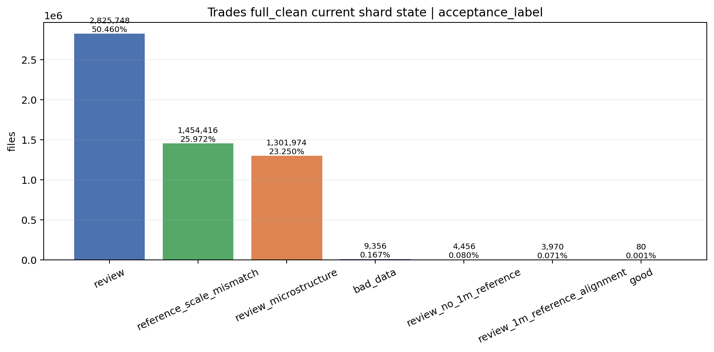
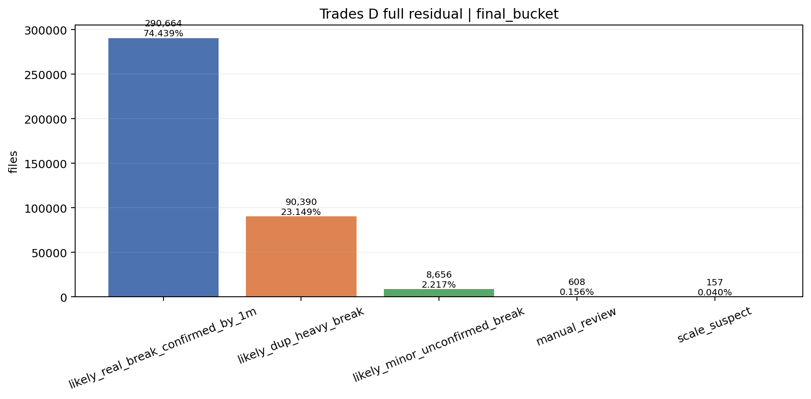
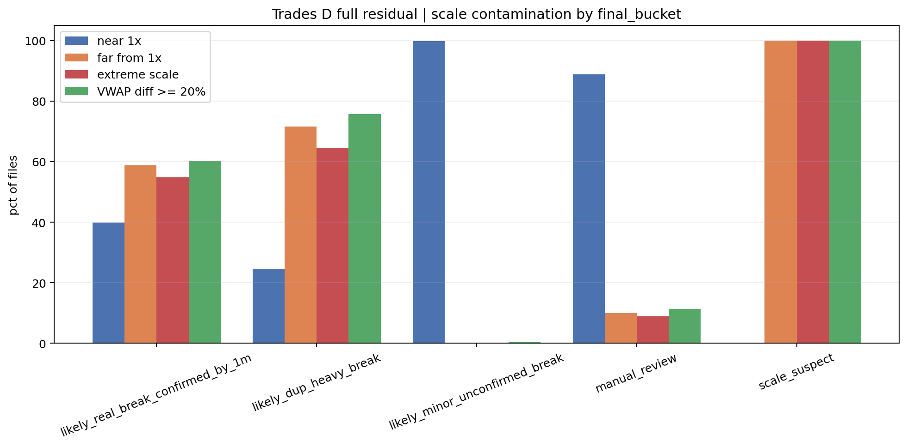

# Trades Population Readout v0.1

## 1. Rol

Este documento describe la masa poblacional de `trades` y explica por que no puede leerse de forma ingenua.

Su funcion no es decidir casos individuales. Su funcion es fijar:

- cuanta masa esta afectada;
- que parte de esa masa se concentra en `review`;
- por que un gran `review` poblacional no equivale automaticamente a `bad tape`;
- y por que el inspector debe separar poblacion, muestra metodologica y cierre final.

## 2. Tres niveles que no deben mezclarse

En `trades` hay tres capas distintas:

1. snapshot poblacional bruto o semibruto;
2. muestra metodologica `380` files de `file_acceptance`;
3. cierre full final `57f/full_clean_fast_same_schema`.

Confundir estas capas produce el error historico mas grave del bloque:

- leer cualquier `review` masivo como si demostrara corrupcion intrinseca del tape.

## 3. Primera foto: shard state actual

### Que muestra

Esta barra resume la distribucion de `acceptance_label` en el estado `full_clean` parcial historico que alimenta la politica antigua. La masa dominante es:

- `review`
- seguida por `reference_scale_mismatch`
- y `review_microstructure`

`bad_data`, `review_no_1m_reference`, `review_1m_reference_alignment` y `good` aparecen como colas muy pequenas.

### Que conclusion debe sacar el lector

La conclusion importante no es que `trades` este "muerto". La conclusion es otra:

- el problema principal no es una cola pequena y aislada;
- el problema principal es una masa muy grande de conflicto contra referencias;
- y por tanto el bloque no puede cerrarse con una logica binaria `good / bad`.

### La paradoja del `good` diminuto

La lectura mas peligrosa de este grafico seria:

- si `good` es solo `0.001%`, entonces casi toda la data de `trades` es inservible.

Esa lectura es incorrecta por dos razones.

Primera razon:

- este grafico no expresa estados finales de certificacion;
- expresa `acceptance_label` en un estado parcial historico de trabajo;
- y la etiqueta `good` aqui significa solo la cola pristine, no la masa economicamente recuperable.

Segunda razon:

- el bucket `good` historico se definio con un criterio extremadamente estricto;
- `certification/trades/12_trades_good.md` deja explicitamente documentado que ese bucket existe, pero es minusculo y sesgado a files muy pequenos;
- alli se observa `good = 80` files y `rows_after_parse` mediano `3.5`, con `p75 = 17.25`.

La conclusion inteligente es:

- `good` no esta intentando medir "todo lo util";
- esta midiendo solo la parte donde `trades`, `daily` y `1m` alinean de forma casi impecable;
- por eso sale tan pequeno.

La masa potencialmente util no vive en `good`. Vive sobre todo en:

- `review` rehabilitable con regla explicita;
- `review_microstructure` parcialmente recuperable con flags;
- `review_1m_reference_alignment` y `review_no_1m_reference` cuando el uso tolere esas limitaciones;
- y, con mucha mas prudencia, futuras reconciliaciones validadas de `reference_scale_mismatch`.

Por tanto, este grafico no prueba que `trades` este roto en un `99.999%`. Prueba otra cosa:

- que el criterio de pureza para llamar a algo `good` era tan conservador que casi toda la masa util quedaba empujada a `review`.

### Consecuencia metodologica

Este grafico obliga a separar:

- dano intrinseco del tape;
- conflicto de escala frente a referencias;
- y conflicto de microestructura.

Si no se separan, `review` se inflaria artificialmente como si fuese `bad_data`.

## 4. Segunda foto: residuo D full por bucket final

### Que muestra

Este grafico ya no describe el universo entero. Describe el residuo `D full`, es decir, la parte que sigue abierta tras los filtros previos y que necesita lectura fina.

Ahi domina:

- `likely_real_break_confirmed_by_1m`
- seguida por `likely_dup_heavy_break`

Las colas:

- `likely_minor_unconfirmed_break`
- `manual_review`
- `scale_suspect`

son mucho menores.

### Que conclusion debe sacar el lector

Este grafico prueba que el residuo duro tampoco es homogeneo. Una gran parte del residuo ya parece realinearse con `1m` o con problemas de duplicacion severa, mientras que la sospecha pura de escala extrema es muy pequena.

### Consecuencia metodologica

No toda cola del residuo D debe saltar a `bad`. La semantica del residual bucket ayuda a distinguir:

- ruptura confirmada por referencia;
- duplicacion / heavy break probable;
- y casos de escala que siguen siendo sospecha pura.

## 5. Tercera foto: contaminacion de escala por bucket

### Que muestra

Cada bucket final se cruza aqui con cuatro firmas de dano:

- `near 1x`
- `far from 1x`
- `extreme scale`
- `VWAP diff >= 20%`

### Lectura inteligente

Lo relevante no es solo ver barras altas. Lo relevante es ver donde cae cada firma:

- `scale_suspect` queda contaminado al `100%` por alejamiento de `1x`, escala extrema y `VWAP diff >= 20%`;
- `likely_minor_unconfirmed_break` queda casi limpio en `near 1x`;
- `manual_review` sigue mayoritariamente cerca de `1x`, con una cola mas pequena de dano severo;
- `likely_dup_heavy_break` ya mezcla dano real con firmas de comparabilidad agresiva.

### Que conclusion debe sacar el lector

Este grafico prueba que la escala no es ruido cosmetic. Es una firma estructural que cambia de bucket a bucket. Eso justifica que `reference_scale_mismatch` y buckets relacionados no se mezclen con `bad_data` puro.

### Consecuencia para el proyecto

Para backtest y ML, este grafico obliga a reservar una vista especifica de reconciliacion (`daily_raw + split_normalized + adjusted_proxy`) y a no usar `trades_raw` como si fuera serie economica interdiaria.

## 6. Conclusiones poblacionales

1. `trades` tiene una masa grande de conflicto, pero esa masa no es equivalente a `bad tape`.
2. La poblacion esta dominada por `review`, `reference_scale_mismatch` y `review_microstructure`, no por `bad_data`.
3. El residuo duro final sigue existiendo, pero ya aparece mas estratificado y semanticamente interpretable.
4. La poblacion, por si sola, no decide certificacion final; solo fija el tamano y la composicion del problema.

## 7. Que parte de esa masa parece recuperable hoy

La lectura poblacional quedaria incompleta si el inspector mirase solo:

- el `good` diminuto;
- o la masa bruta de `review`.

Sobre el cache final canonico `57f/full_clean_fast_same_schema`, la pregunta operativa relevante es otra:

- cuanta parte de la masa grande de conflicto puede pasar hoy a `recoverable_with_flag`.

### Bucket `review`

La rematerializacion de la regla historica de rehabilitacion sobre el cierre real da:

- `review_total = 4,851,211`
- `review_recoverable_strict = 3,327,955` (`68.6005%`)
- `review_not_rehabilitated_strict = 1,523,256`
- `review_recoverable_extended = 3,505,290` (`72.2560%`)
- `review_not_rehabilitated_extended = 1,345,921`

### Bucket `review_microstructure`

Con una recuperacion operativa provisional, anclada en la semantica historica del bucket, el cierre real da:

- `review_microstructure_total = 2,130,781`
- `recoverable_strict_provisional = 1,516,547` (`71.1733%`)
- `recoverable_extended_provisional = 1,636,379` (`76.7971%`)

### Bucket `review_1m_reference_alignment`

Tambien bajo recuperacion operativa provisional:

- `review_1m_reference_alignment_total = 4,992`
- `recoverable_strict_provisional = 2,591` (`51.9030%`)
- `recoverable_extended_provisional = 3,715` (`74.4191%`)

### Que responde esta seccion

Responde:

- cuanta masa conflictiva sigue siendo util bajo flag;
- por que no debe usarse `good` como proxy de toda la masa util;
- y por que `review` no debe leerse como una condena uniforme.

No responde:

- a la rehabilitacion final completa de todas las familias;
- ni a la promocion futura de `reference_scale_mismatch`, que sigue pendiente de una reconciliacion estable.

### Consecuencia

La conclusion operativa correcta es:

- `trades` no es un bloque pristine;
- pero tampoco es un bloque muerto;
- y la masa util real del proyecto vive sobre todo en la parte rehabilitable de `review` y de familias vecinas, no en la cola `good`.
