# Trades Global Universe Readout v0.1

## Rol

Este documento fija la lectura institucional del universo completo de `trades` sobre:

- `lt1b` [RT-01]
- `57f/full_clean_fast_same_schema` [RT-02]

No sustituye a los casepacks por familia.

Su funcion es otra:

- dar un mapa global del universo;
- explicar como se reparte la masa;
- identificar donde vive cada firma dominante;
- y evitar que el inspector lea unos pocos casos file-level sin contexto poblacional.

## Resumen ejecutivo

El universo completo contiene:

- `review = 4,851,211` [RT-05]
- `reference_scale_mismatch = 2,418,062` [RT-09]
- `review_microstructure = 2,130,781` [RT-10]
- `bad_data = 15,869` [RT-08]
- `review_no_1m_reference = 8,091` [RT-11]
- `review_1m_reference_alignment = 4,992` [RT-12]
- `good = 106` [RT-04]

La lectura correcta no es:

- "`good` es minusculo, luego casi todo esta roto"

La lectura correcta es:

- `good` mide solo la cola pristine;
- la masa util real depende sobre todo de `recoverable_with_flag` [RT-06];
- `reference_scale_mismatch` y `review_microstructure` no pueden leerse como `bad_data`;
- y `bad_data` es una cola dura real, pero pequena.

## Distribucion final del universo

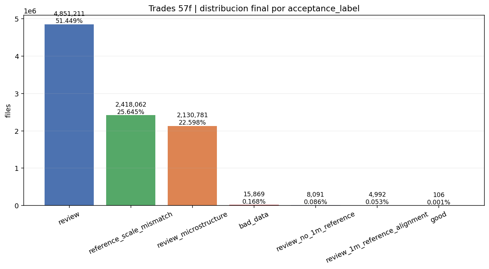

**Que muestra**

- La distribucion final completa del universo `lt1b` certificado en `57f`.
- La masa esta dominada por:
  - `review`
  - `reference_scale_mismatch`
  - `review_microstructure`

**Lectura analitica**

- La primera observacion fuerte no es que exista `bad_data`, sino que **no domina** el universo. Eso corta de raiz una lectura catastrofista del bloque.
- En numeros, el universo se reparte asi:
  - `review = 51.45%`
  - `reference_scale_mismatch = 25.65%`
  - `review_microstructure = 22.60%`
  - `bad_data = 0.168%`
  - `good = 0.001%`
- La segunda observacion fuerte es que el universo no se reparte de forma suave entre muchas clases pequenas; se concentra en tres familias enormes que piden tratamientos conceptualmente distintos:
  - `review` como residuo aun no cerrado;
  - `reference_scale_mismatch` como conflicto de comparabilidad;
  - `review_microstructure` como conflicto de textura del tape.
- La barra de `good` es tan pequena que no puede usarse como estimador de "masa util". Visualmente, la propia imagen ya obliga a abandonar esa intuicion.
- La relacion cuantitativa es extrema: `review` por si solo es mas de cincuenta mil veces mayor que `good`. Ese dato invalida cualquier lectura donde `good` actue como proxy del bloque.
- La imagen tambien cuenta algo por ausencia: `review_no_1m_reference` y `review_1m_reference_alignment` existen, pero son colas pequenas. Eso significa que son metodologicamente importantes, no masivos.

**Responde**

- Cuanta masa hay de verdad en cada `acceptance_label`.
- Si `bad_data` domina el dataset o si vive en una cola acotada.

**No responde**

- No responde a la causalidad concreta de cada file.
- No responde a que subfamilias internas dominan cada bucket.

**Consecuencia**

- Impide leer unos pocos casos `bad_data` como si describieran todo `trades`.
- Obliga a separar masa util potencial de cola pristine.

## Mezcla anual

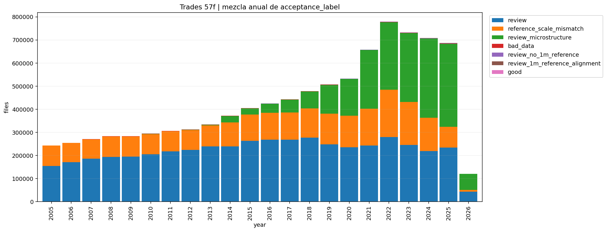

**Que muestra**

- Como cambia la mezcla de labels a lo largo del tiempo.

**Lectura analitica**

- La imagen no sugiere un universo partido entre "anos buenos" y "anos malos"; sugiere un problema **estructuralmente persistente**.
- Lo relevante aqui no es tanto un ano concreto, sino la estabilidad de las tres masas grandes:
  - `review`
  - `reference_scale_mismatch`
  - `review_microstructure`
- Lo que hay que mirar no es si un color aparece o desaparece en un ano, sino si alguno de los grandes bloques deja realmente de existir. La figura no muestra eso; muestra persistencia.
- Si hubiera un unico episodio historico explicando todo, veriamos picos aislados y luego normalizacion. Lo que se ve es otra cosa: distintas mezclas, si, pero sobre una arquitectura de conflicto que permanece.
- El valor real de esta figura es disciplinar la narrativa. Impide atribuir el bloque a una sola vendetta temporal:
  - ni "todo es legado antiguo";
  - ni "todo es problema reciente de parseo".

**Responde**

- Si el problema es transversal al universo o si se concentra en periodos concretos.

**No responde**

- No distingue todavia entre causalidades internas dentro de cada label.

**Consecuencia**

- Evita narrativas demasiado simples del tipo "esto solo pasa en anos antiguos" o "todo se rompe igual siempre".

## Escala y comparabilidad

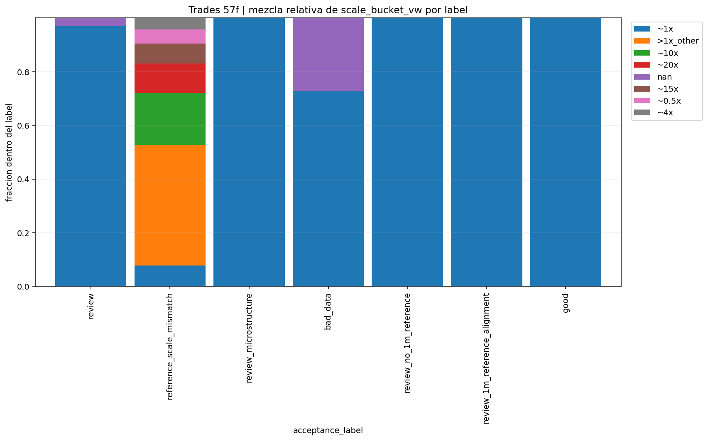

**Que muestra**

- La mezcla relativa de `scale_bucket_vw` [RT-13] por label.

**Lectura analitica**

- La imagen enseña que la escala no es un ruido pequeño repartido homogéneamente. Está **estructurada por label**.
- En `reference_scale_mismatch`, la mezcla de buckets de escala deja claro que el bucket no es una sola anomalia mecanica repetida; es una familia ancha de desajustes.
- Cuantitativamente, el bloque esta muy repartido:
  - `>1x_other = 33.59%` del bucket
  - `~10x = 14.47%`
  - `~20x = 8.14%`
  - `~1x = 5.81%`
  - `~15x = 5.63%`
- Eso significa que ni siquiera sumando `~10x` y `~20x` dominamos el bucket; el conflicto de escala es mas amplio y heterogeneo que un simple “factor diez”.
- La presencia no trivial de buckets cercanos a `~1x` dentro de `reference_scale_mismatch` es importante: significa que el nombre del bucket no implica necesariamente una escala grotesca en todos los casos, sino que recoge conflictos donde la escala sigue siendo la firma dominante al cierre.
- La comparacion con `bad_data` es clave: si ambos buckets fueran visualmente iguales aqui, la taxonomia estaria mal. Justamente esta imagen ayuda a probar que no lo son.
- Tambien corta una mala intuicion habitual: "si no hay escala absurda, no hay problema". No. Hay buckets donde la escala dominante no es extrema y aun asi la comparabilidad queda comprometida.

**Responde**

- Donde domina de verdad el conflicto de escala.
- Por que `reference_scale_mismatch` no debe confundirse con tape roto por defecto.

**No responde**

- No responde a si un caso individual concreto es rehabilitable.

**Consecuencia**

- Justifica institucionalmente la separacion entre:
  - comparabilidad frente a arbitros
  - y corrupcion intrinseca del tape

## Firmas duras por label

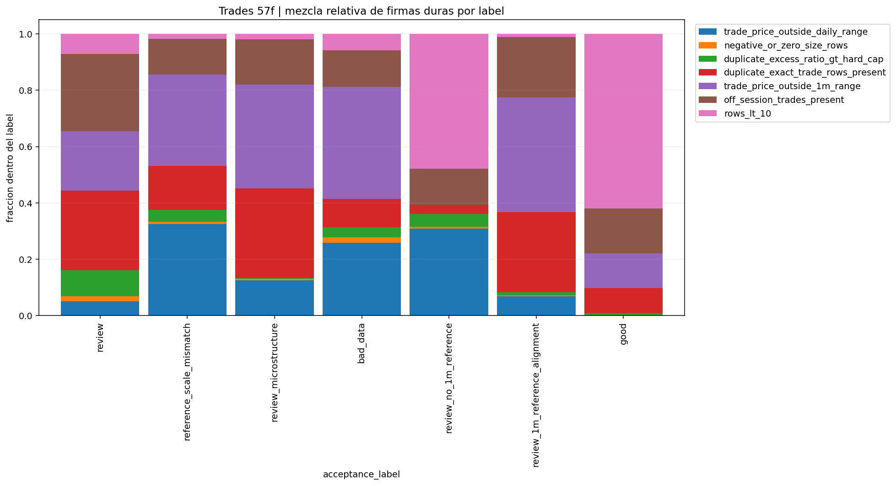

**Que muestra**

- La mezcla relativa de firmas duras por label:
  - `trade_price_outside_daily_range`
  - `negative_or_zero_size_rows`
  - `duplicate_excess_ratio_gt_hard_cap`
  - `duplicate_exact_trade_rows_present`
  - `trade_price_outside_1m_range`
  - `off_session_trades_present`
  - `rows_lt_10`

**Lectura analitica**

- Esta es una imagen de mezcla causal, no de tamaño bruto. Lo que importa no es solo que firma aparece, sino **en qué label pesa relativamente más**.
- En `bad_data`, la lectura correcta es doble:
  - una parte del peso viene de rupturas de rango y arbitro;
  - otra parte, menor pero decisiva, viene de integridad estructural.
- En `bad_data`, las firmas mas grandes son:
  - `trade_price_outside_1m_range = 14,743`
  - `trade_price_outside_daily_range = 9,606`
  - `off_session_trades_present = 4,789`
  - `duplicate_exact_trade_rows_present = 3,734`
- Pero hay que leer esos numeros en proporcion al bucket:
  - `trade_price_outside_1m_range` afecta al `92.90%` de `bad_data`
  - `trade_price_outside_daily_range` al `60.53%`
  - `negative_or_zero_size_rows` solo al `4.38%`
  - `duplicate_excess_ratio_gt_hard_cap` al `8.37%`
- Esa asimetria es justo la razon por la que el panel de precio sigue siendo central para la mayoria de `bad_data`, aunque no baste para toda la cola estructural.
- En `review_microstructure`, la mezcla desplaza la narrativa desde "precio raro" hacia "tape raro". Eso es exactamente lo que el inspector debe interiorizar antes de bajar a casos.
- Tambien aqui los pesos cambian la lectura:
  - `duplicate_exact_trade_rows_present` aparece mucho en bruto, pero la identidad del bucket no la marca la duplicacion extrema, sino la textura ligada a odd-lots y conflicto fino.
- La presencia de `rows_lt_10` y `off_session_trades_present` importa porque introduce una segunda dimensión: no todo conflicto nace en el precio o en la escala; parte del daño vive en **la forma del file**.
- La imagen también enseña qué firmas son marginales en ciertos labels. Eso es útil porque evita sobredimensionar una causa donde en realidad pesa poco.

**Responde**

- Donde vive la cola de integridad estructural.
- Donde el problema se parece mas a rango/escala que a dano del tape.

**No responde**

- No responde a la gravedad economica exacta de cada file.

**Consecuencia**

- Justifica anadir paneles de integridad estructural y no depender solo del panel de precio.

## Severidad frente a `daily`

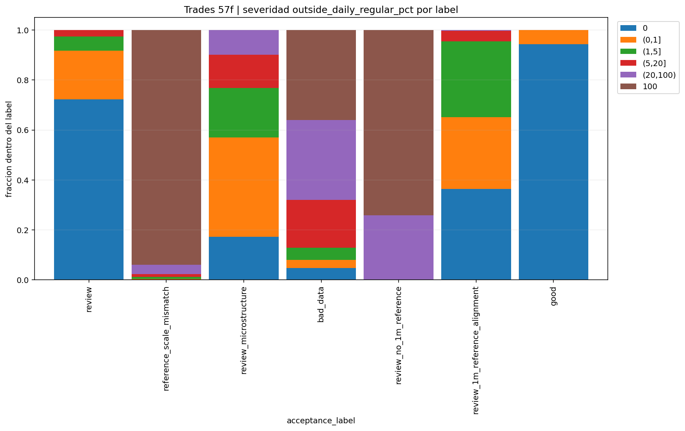

**Que muestra**

- La severidad relativa de `outside_daily_regular_pct` [RT-14] por label.

**Lectura analitica**

- La figura no solo dice qué labels tienen más conflicto contra `daily`; dice **cómo se reparte internamente ese conflicto**.
- En `review`, el patrón es relativamente benigno si se compara con otros buckets:
  - `0% outside daily` en `72.22%` del bucket
  - `(0,1]%` en `19.53%`
  - `(1,5]%` en `5.70%`
  - los bins verdaderamente altos son residuales
- En `reference_scale_mismatch`, la imagen se vuelve extrema:
  - `outside_daily = 100%` en `93.98%` del bucket
  - eso demuestra que este label vive casi por definicion en contradiccion total con el arbitro diario
- En `bad_data`, la mezcla es mas interesante:
  - `100%` solo en `35.96%`
  - `(20,100)` en `32.08%`
  - `0%` en `4.78%`
- Esa combinacion prueba que `bad_data` no es solo el bucket de “todo fuera todo el rato”; hay una franja relevante donde el conflicto es duro pero no total.
- En una lectura gruesa, uno podría pensar que `bad_data` y `review` comparten la misma patología porque ambos pueden tener masa en bins altos. La imagen ayuda a matizar eso: el porcentaje contra `daily` mide violencia contra el árbitro diario, pero no distingue aún la causa.
- Si un label concentra mucha masa en el extremo `100`, el conflicto no es una fricción periférica; es una contradicción casi total con la barra diaria. Eso endurece la lectura del bucket, aunque todavía no cierre su causalidad.
- Si otro label reparte masa entre bins intermedios, la historia cambia: ahí el problema puede ser de degradación parcial, no de colapso.
- Por eso la figura es útil no solo por el extremo alto, sino por la **forma completa de la distribución** dentro de cada label.

**Responde**

- Como de agresivo es el conflicto contra el arbitro diario.
- Que labels viven mas en ruptura total frente a `daily`.

**No responde**

- No distingue entre colapso de escala y rango local si ambos acaban empujando el porcentaje.

**Consecuencia**

- Refuerza por que `bad_data` no puede reducirse a "hay conflicto con daily".

## Severidad frente a `1m`

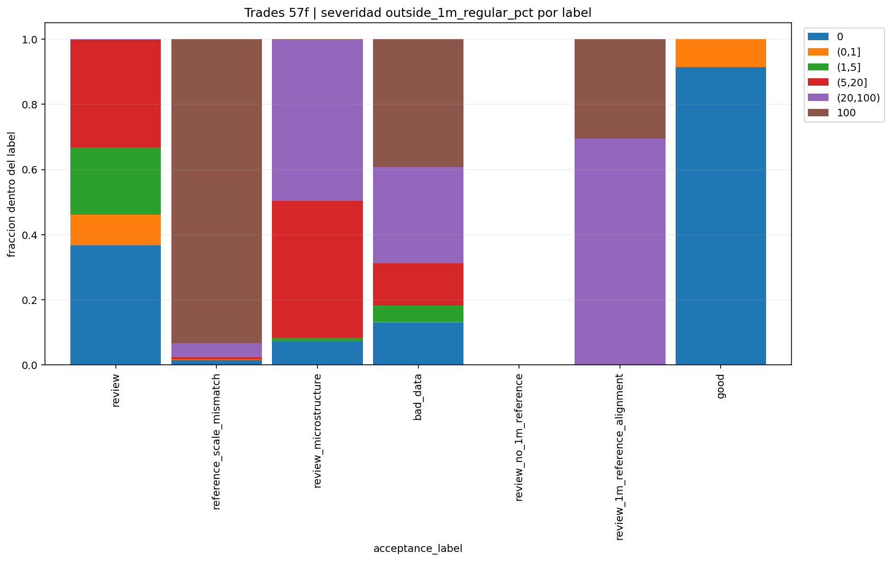

**Que muestra**

- La severidad relativa de `outside_1m_regular_pct` [RT-15] por label.

**Lectura analitica**

- Aquí la granularidad fina importa más que en `daily`, porque `1m` capta conflictos que la barra diaria puede ocultar.
- La imagen sirve para ver dónde un label no solo protesta contra el árbitro grueso, sino contra la estructura intradía fina. Eso es especialmente importante para:
  - `review_1m_reference_alignment`
  - parte de `review_microstructure`
  - y parte de `bad_data`
- En `review_microstructure`, la leyenda ya cuenta una historia bastante concreta:
  - `(20,100)` representa `40.44%`
  - `(5,20]` representa `34.24%`
  - `0%` solo `5.87%`
- Eso significa que el bucket vive mas en conflicto fino intradia que en alineacion limpia con `1m`.
- En `reference_scale_mismatch`, `outside_1m = 100%` afecta al `75.58%` del bucket. Eso refuerza que el choque no es solo contra `daily`; la ruptura intraminuto tambien es masiva.
- En `bad_data`, `outside_1m = 100%` afecta al `30.94%`, pero el bin `(20,100)` añade otro `23.25%`. En total, mas de la mitad del bucket sufre conflicto intraminuto severo.
- En `review_1m_reference_alignment`, la firma es casi definicional:
  - `(20,100)` en `69.47%`
  - `100%` en `30.41%`
- O sea, casi todo el bucket vive en bins altos frente a `1m`; esa es exactamente la razon de existir de la familia.
- Si un label acumula masa fuerte en bins altos frente a `1m`, ya no estamos viendo solo una discusión sobre barra diaria; estamos viendo un choque contra el árbitro de mayor resolución.
- La figura también ayuda a detectar un patrón útil: labels que parecen moderados frente a `daily` pueden endurecerse mucho frente a `1m`. Esa divergencia es metodológicamente muy informativa.
- En otras palabras, esta imagen no solo añade detalle; **cambia la jerarquía de evidencia** de ciertos buckets.

**Responde**

- Donde el arbitro fino cambia la verdad del caso.
- Por que `review_1m_reference_alignment` existe como familia propia.

**No responde**

- No responde a si el conflicto nace en el tape o en el propio arbitro `1m`.

**Consecuencia**

- Obliga a no absolver un caso solo porque `daily` parezca tranquilo.

## Duplicacion y odd-lots

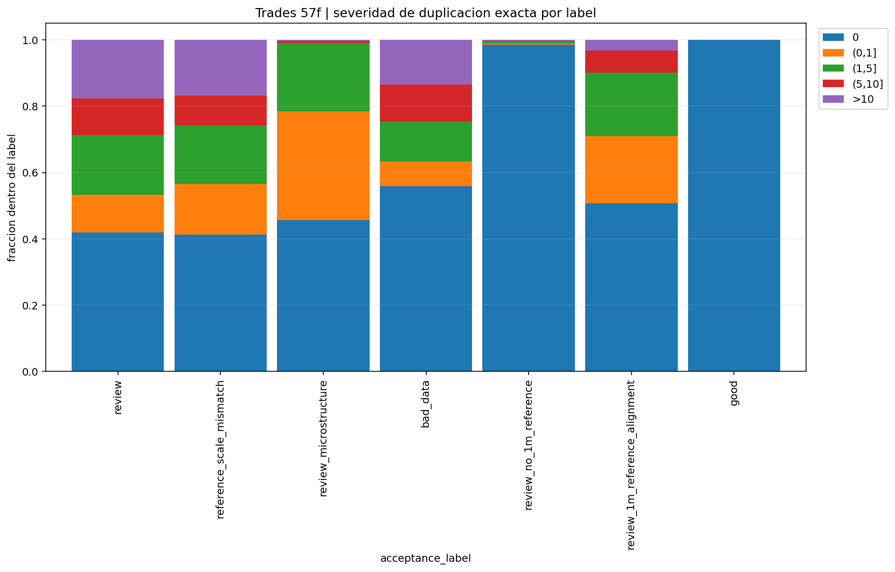

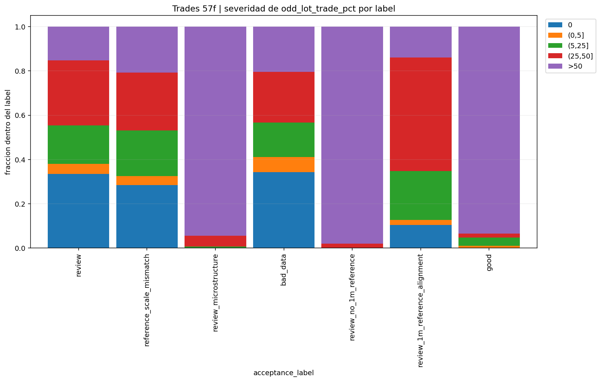

**Que muestra**

- La severidad de la duplicacion exacta por label.
- La severidad de `odd_lot_trade_pct` [RT-16] por label.

**Lectura analitica**

- Estas dos imágenes deben leerse juntas porque separan dos mecanismos que a veces se confunden:
  - textura microestructural legítima o semi-legítima;
  - deterioro estructural del tape.
- Si `review_microstructure` apareciera dominado por duplicación dura, sería un bucket mucho más sospechoso. Lo que se ve, en cambio, es que su identidad real está mucho más cerca de odd-lots y textura.
- Los números lo dejan bastante claro:
  - en `review_microstructure`, `duplicate = 0` todavía representa `45.69%`
  - `(0,1]%` representa `32.80%`
  - `>10%` apenas `0.26%`
- Es decir, la duplicacion extrema es marginal dentro del bucket. No es su motor principal.
- La cola de duplicación, cuando pesa, desplaza la lectura hacia daño de integridad y obliga a mirar más allá del precio.
- La imagen de odd-lots es especialmente importante porque visualmente demuestra que hay una masa enorme cuya rareza no nace de corrupción bruta sino de composición de prints.
- Otra vez, la cuantificacion cambia la lectura:
  - `odd_lot_trade_pct > 50` en `review_microstructure` afecta al `94.38%` del bucket
  - por tanto, la dominancia de odd-lots no es un matiz; es la identidad central de la familia.
- En `review`, en cambio, la imagen de odd-lots sale mucho mas repartida entre bins, lo que demuestra que ese bucket no puede reducirse a una sola textura.
- Esto no absuelve automáticamente esos casos para todos los pipelines, pero sí cambia su tratamiento institucional: no pueden colapsarse a `bad_data`.

**Responde**

- Cuanto de `review_microstructure` vive en textura del tape y no solo en precio.
- Donde la integridad estructural pesa de verdad.

**No responde**

- No responde a la localizacion exacta de las filas problematicas.

**Consecuencia**

- Justifica que `review_microstructure` y la cola estructural de `bad_data` necesiten paneles propios.

## Cobertura del arbitro `1m`

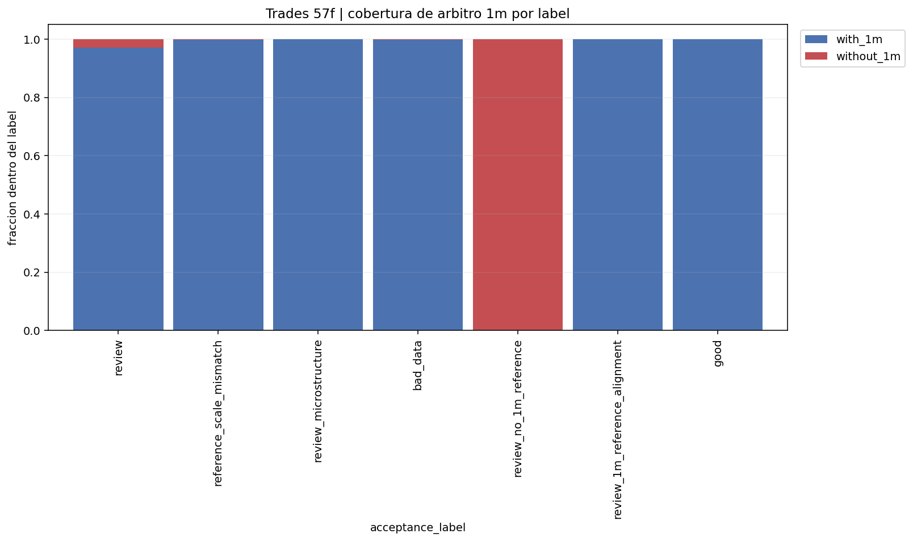

**Que muestra**

- La fraccion de casos con y sin arbitro `1m` [RT-26] por label.

**Lectura analitica**

- Esta figura no habla de calidad del tape; habla de **calidad de la decisión** que podemos tomar sobre el tape.
- La masa sin `1m` no debe interpretarse como caos. Debe interpretarse como limitación de resolución del árbitro.
- Cuantitativamente, casi todo el universo relevante sí tiene `1m`:
  - `review = 97.07%` con `1m`
  - `reference_scale_mismatch = 99.81%`
  - `review_microstructure = 99.89%`
  - `bad_data = 99.77%`
- Eso significa que la falta de `1m` no es una explicación general del bloque; es una condición muy localizada.
- `review_no_1m_reference` sí es extremo por definición: `100%` sin `1m`. La imagen prueba que el bucket es real y no una etiqueta teórica sin base poblacional.
- En `review_no_1m_reference`, la imagen cumple una función muy concreta: demostrar que el bucket no es un invento verbal, sino una consecuencia poblacional de cobertura realmente incompleta.
- También sirve para no sobreactuar ante ciertos conflictos. Si falta el árbitro fino, el cierre del caso debe ser epistemológicamente más humilde.
- La imagen además ayuda a separar dos errores distintos:
  - “no tengo suficiente evidencia para absolver”
  - “tengo evidencia suficiente para condenar”

**Responde**

- Donde el problema esta condicionado por cobertura.
- Por que `review_no_1m_reference` no debe leerse como corrupcion probada.

**No responde**

- No responde a la bondad del file cuando `1m` falta.

**Consecuencia**

- Refuerza una politica disciplinada de incertidumbre, no de condena automatica.

## Rehabilitacion de `review`

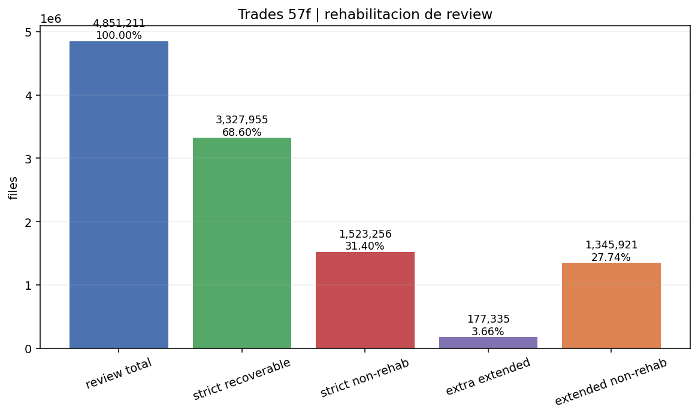

La regla historica aplicada sobre `57f` deja:

- `review_total = 4,851,211`
- `strict recoverable = 3,327,955` (`68.60%`)
- `extended recoverable = 3,505,290` (`72.26%`)
- La condicion de cercania a escala usa buckets como `~1x` y `near_1x` [RT-24].

**Que muestra**

- Cuanta masa de `review` puede pasar de forma defendible a `recoverable_with_flag`.

**Lectura analitica**

- Esta es probablemente la imagen más importante del bloque entero, porque reordena la pregunta central.
- Sin ella, el inspector puede quedarse atrapado en la barra minúscula de `good`. Con ella, entiende que la variable maestra no es `good`, sino la masa rehabilitable dentro de `review`.
- El salto entre:
  - `review_total`
  - `strict recoverable`
  - y `extended recoverable`
  
  enseña dos cosas a la vez:
  - cuánta utilidad real ya está ganada con una policy conservadora;
  - cuánta utilidad adicional solo aparece si aflojamos la regla.
- En numeros:
  - `strict recoverable = 68.60%`
  - la ampliacion hasta `extended` solo añade `3.66%` del bucket
- Eso es metodologicamente muy importante: la regla estricta ya captura casi toda la masa recuperable. No estamos perdiendo una mitad oculta por ser demasiado conservadores.
- La distancia entre la versión estricta y la extendida no es enorme. Eso es bueno: sugiere que la regla estricta ya captura la parte principal de la masa recuperable.
- La masa que queda fuera sigue siendo grande. Eso también importa: evita la tentación de declarar victoria prematura sobre `review`.

**Responde**

- Cuanta masa util real tiene `trades` mas alla de la cola `good`.

**No responde**

- No responde a la utilidad final de otros buckets como `review_microstructure`.

**Consecuencia**

- Cambia la lectura del bloque: `good` no es la variable maestra; la rehabilitacion de `review` si.

## `bad_data` por subfamilia visual

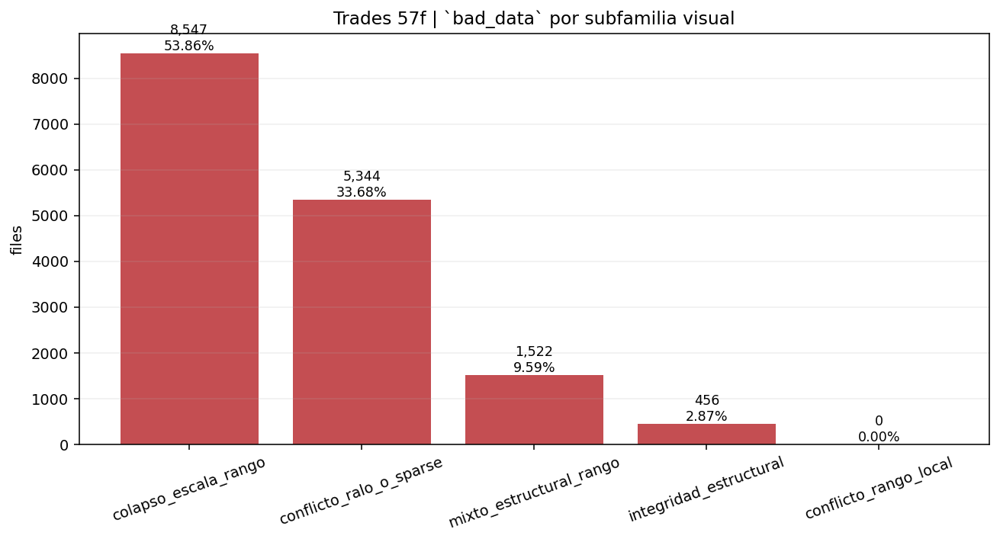

Conteos:

- `colapso_escala_rango = 8,547`
- `integridad_estructural = 456`
- `mixto_estructural_rango = 1,522`
- `conflicto_ralo_o_sparse = 5,344`
- `conflicto_rango_local = 0`

**Que muestra**

- Que `bad_data` no es una sola familia visual.

**Lectura analitica**

- La imagen corrige una simplificación peligrosa: pensar que todo `bad_data` es colapso grotesco de precio.
- Sí, la subfamilia dominante es `colapso_escala_rango`. Eso confirma que el panel de precio actual cubre muy bien la parte principal del bucket.
- Pero hay que ponerle numero:
  - `colapso_escala_rango = 53.86%`
  - `conflicto_ralo_o_sparse = 33.68%`
  - `mixto_estructural_rango = 9.59%`
  - `integridad_estructural = 2.87%`
- Eso cambia bastante la intuicion. La cola puramente estructural existe, pero es pequena. La franja rala o sparse, en cambio, es mucho mayor de lo que se podria intuir mirando solo unos pocos casos duros.
- Pero la segunda observación fuerte es que existe una masa no trivial de:
  - `integridad_estructural`
  - `mixto_estructural_rango`
  - `conflicto_ralo_o_sparse`
- Esto cambia la obligación visual del dossier. Ya no basta un único panel “bonito” de precio para representar todo `bad_data`.
- La ausencia de `conflicto_rango_local` en este cierre concreto también es informativa: significa que, bajo la taxonomía actual, los rechazos duros locales tienden a quedar absorbidos por otras subfamilias más fuertes.

**Responde**

- Cuanto de `bad_data` se explica por colapso visible de escala/rango.
- Cuanto exige paneles de integridad estructural.

**No responde**

- No responde a la calidad de cada caso individual dentro de cada subfamilia.

**Consecuencia**

- Justifica por que el dossier `bad_data` no puede apoyarse en un unico tipo de panel.

## `review_microstructure` por textura dominante

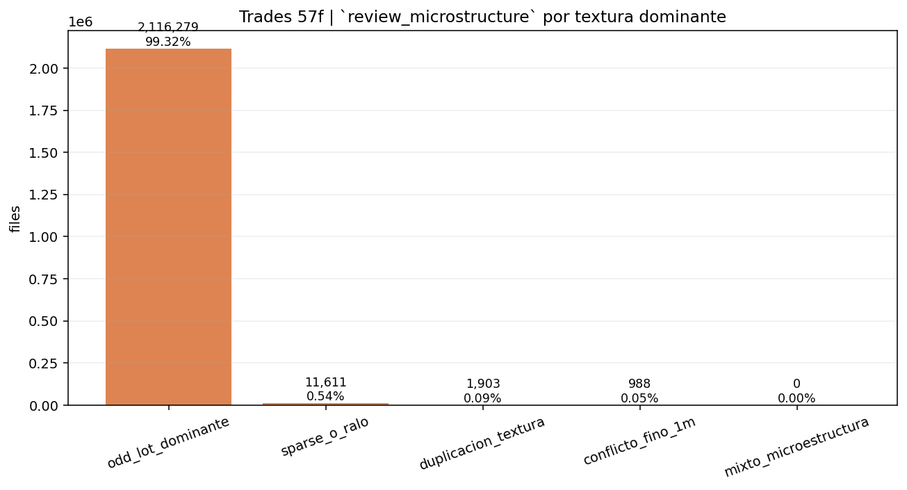

Conteos:

- `odd_lot_dominante = 2,116,279`
- `duplicacion_textura = 1,903`
- `conflicto_fino_1m = 988`
- `sparse_o_ralo = 11,611`
- `mixto_microestructura = 0`

**Que muestra**

- Que la masa de `review_microstructure` esta dominada de forma aplastante por textura ligada a odd-lots.

**Lectura analitica**

- Esta figura es muy fuerte porque destruye una lectura equívoca del bucket. `review_microstructure` no es, poblacionalmente, una colección heterogénea de rarezas pequeñas; está dominado de forma masiva por una firma muy concreta.
- La dominancia extrema de `odd_lot_dominante` significa que, a nivel de población, este bucket está mucho más cerca de una cuestión de composición de prints que de una cuestión de “tape roto”.
- En numeros la conclusion es casi brutal:
  - `odd_lot_dominante = 99.32%`
  - `sparse_o_ralo = 0.54%`
  - `duplicacion_textura = 0.089%`
  - `conflicto_fino_1m = 0.046%`
- O sea, las colas alternativas existen, pero juntas ni siquiera alcanzan el `1%`. El bucket esta practicamente monopolizado por una sola textura poblacional.
- Las colas de `duplicacion_textura`, `conflicto_fino_1m` y `sparse_o_ralo` existen, pero no son la identidad central del bucket. Son subproblemas, no el corazón de la familia.
- Esto obliga a que la documentación por casos no sobrerrepresente ejemplos raros de duplicación si luego el universo real está controlado por odd-lots.
- También cambia el orden de prioridades: si queremos mejorar política o visualización de esta familia, primero hay que explicar mejor odd-lots, no empezar por la cola marginal.

**Responde**

- Donde vive realmente este bucket.
- Que parte es cola pequena de duplicacion o sparsity y que parte es fenomeno estructural de odd-lot.

**No responde**

- No responde a si toda dominancia odd-lot es recuperable en todos los pipelines.

**Consecuencia**

- Obliga a tratar `review_microstructure` como una familia microestructural de verdad, no como simple `review`.

## `reference_scale_mismatch` por bucket de escala

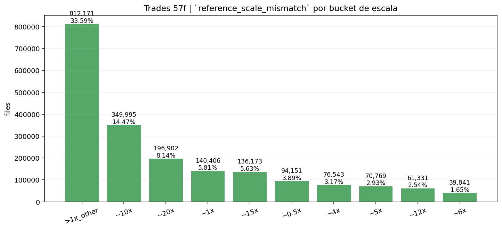

Top buckets:

- `>1x_other = 812,171`
- `~10x = 349,995`
- `~20x = 196,902`
- `~1x = 140,406`
- `~15x = 136,173`
- `~0.5x = 94,151`
- `~4x = 76,543`
- `~5x = 70,769`

**Que muestra**

- Que el bucket de escala no esta concentrado en una sola relacion mecanica.

**Lectura analitica**

- Esta figura prueba que `reference_scale_mismatch` no es simplemente el bucket de un único split mal normalizado o de una única relación `10x`.
- El peso grande de `>1x_other` es muy importante: sugiere que el conflicto de escala es amplio y menos “limpio” de lo que sería deseable para una reconciliación trivial.
- En concreto:
  - `>1x_other = 33.59%`
  - `~10x = 14.47%`
  - `~20x = 8.14%`
  - `~1x = 5.81%`
  - `~15x = 5.63%`
- Sumando solo los cuatro buckets visibles principales no llegamos ni al `63%`. Eso significa que el bucket sigue muy fragmentado incluso después de sacar sus grandes masas.
- La coexistencia de `~10x`, `~20x`, `~15x`, `~0.5x`, `~4x`, `~5x` muestra un paisaje heterogéneo. Eso refuerza que este bucket necesita una metodología de reconciliación, no una receta única.
- La presencia visible de `~1x` dentro del propio bucket es otra señal útil: indica que el cierre a `reference_scale_mismatch` no depende solo de un ratio brutal, sino del conjunto de la evidencia.
- En otras palabras, el bucket no es “patológico de una sola manera”; es una familia ancha de desacoples de escala.

**Responde**

- Que escalas dominan de verdad el conflicto.
- Si el bucket se parece a una sola patologia o a una familia amplia de desajustes.

**No responde**

- No responde a si una reconciliacion concreta seria valida economicamente.

**Consecuencia**

- Refuerza que `reference_scale_mismatch` necesita politicas propias de reconciliacion y no solo rechazo.

## `review` por severidad interna de rehabilitacion

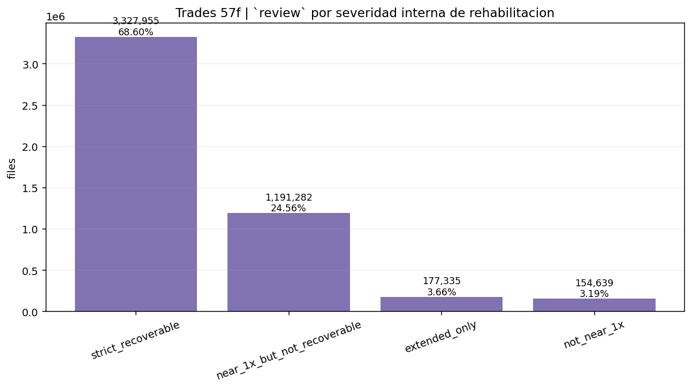

Conteos:

- `strict_recoverable = 3,327,955`
- `extended_only = 177,335`
- `near_1x_but_not_recoverable = 1,191,282`
- `not_near_1x = 154,639`

**Que muestra**

- La estructura interna real de `review`.

**Lectura analitica**

- La figura obliga a dejar de pensar en `review` como un residuo homogéneo. Su estructura interna está claramente estratificada.
- La masa dominante en `strict_recoverable` prueba que el bucket no es un pantano sin salida; una gran parte ya está esencialmente ganada bajo policy conservadora.
- En numeros:
  - `strict_recoverable = 68.60%`
  - `extended_only = 3.66%`
  - `near_1x_but_not_recoverable = 24.56%`
  - `not_near_1x = 3.19%`
- La lectura estratégica nace justo de esa comparación:
  - la masa realmente problemática no es la más lejana (`3.19%`);
  - es la enorme franja que ya está cerca de `1x` pero aún no cruza la policy (`24.56%`).
- La franja `extended_only` es pequeña frente al total. Eso sugiere que la ganancia por aflojar la policy existe, pero no redefine el bloque.
- La franja verdaderamente estratégica es `near_1x_but_not_recoverable`: es enorme y está cerca del umbral correcto. Esa es la masa donde una mejor comprensión puede cambiar más decisiones reales.
- `not_near_1x` es mucho menor; eso importa porque indica que el residuo más lejano existe, pero no es la mayor frontera de trabajo.
- La imagen, por tanto, no solo describe `review`; establece una **prioridad de investigación**.

**Responde**

- Cuanto de `review` ya esta practicamente ganado para `recoverable_with_flag`.
- Cuanta masa sigue cerca de `1x` pero aun no cumple los cortes de calidad.
- Cuanta masa esta ya lejos de una rehabilitacion clara.

**No responde**

- No responde a la utilidad final de las otras familias `review_*`.

**Consecuencia**

- Cambia la priorizacion del trabajo futuro:
  - primero la franja `near_1x_but_not_recoverable`
  - y despues el residuo mas alejado

## Veredicto institucional

La lectura correcta del universo `trades` `lt1b` en `57f` es:

- la cola `bad_data` existe y es real, pero no domina el bloque;
- `reference_scale_mismatch` es una masa enorme de comparabilidad, no de corrupcion pura;
- `review_microstructure` esta dominado por fenomenos de textura, especialmente odd-lots;
- la masa util real del bloque vive sobre todo en la rehabilitacion de `review`;
- y la inspeccion file-level solo tiene sentido si se apoya siempre en este mapa global.

## Resumen tecnico critico para backtest y ML

Los graficos del universo completo obligan a una conclusion metodologica fuerte: `trades` no puede tratarse como una fuente binaria de verdad o falsedad. El bloque contiene una cola `bad_data` real, pero esa cola es solo `0.168%` del universo. El problema estructural del modulo no es que casi todo el tape este roto; el problema es que **la mayor parte de la masa util potencial no vive en `good`, sino en regiones intermedias cuya semantica debe respetarse con precision**.

Desde el punto de vista de backtest, la implicacion principal es esta: usar solo `good` como base de simulacion produciria un universo minusculo y sesgado, porque `good` representa solo `0.001%` del total. Eso no es una politica conservadora razonable; es una politica de destruccion de cobertura. La evidencia poblacional muestra que el verdadero frente de trabajo esta en `review`: `68.60%` del bucket ya pasa la regla estricta de rehabilitacion y otro `3.66%` entra solo bajo la version extendida. Por tanto, la capacidad real de construir un motor de ejecucion o una simulacion defendible depende de **consumir `recoverable_with_flag` con disciplina**, no de encerrarse en `good`.

El segundo mensaje fuerte para backtest es que no todas las masas intermedias significan lo mismo. `reference_scale_mismatch` pesa `25.65%` del universo y no puede interpretarse como tape roto. Sus graficos muestran una familia ancha de desajustes de escala, no una sola anomalia mecanica. Eso significa que un backtest que mezcle `trades_raw` con arbitros diarios o intradiarios sin declarar semantica de precio corre un riesgo serio de contaminar:

- ejecucion simulada;
- validacion de fills;
- comparacion contra `daily`;
- y cualquier estudio de slippage o implementation shortfall.

La consecuencia tecnica es que `reference_scale_mismatch` no debe entrar ni como `good` ni como `bad` por costumbre. Requiere una politica de reconciliacion o exclusiones por pipeline.

El tercer hallazgo importante es `review_microstructure`: `22.60%` del universo. La lectura cuantitativa es decisiva: `99.32%` de ese bucket cae en `odd_lot_dominante`. Eso significa que esta familia no es una cola heterogenea de rarezas menores; es, poblacionalmente, una **familia masiva de textura microestructural**. Para ML microestructural esto es crucial. Si se entrena un modelo con esa masa sin etiquetado semantico o sin flags, el modelo no aprende solo comportamiento de mercado; aprende tambien composicion de prints y regimenes de odd-lot. Eso puede ser util si se desea explicitamente, pero seria leakage semantico si se interpretara como senal economica generica.

Para ML diario o labels de retorno, el mensaje es aun mas estricto: `trades_raw` no debe actuar como sustituto de una verdad economica intertemporal. Los graficos de `outside_daily` y `outside_1m` muestran que ciertas familias viven en conflicto intenso con los arbitros, pero por razones distintas. En `reference_scale_mismatch`, `outside_daily = 100%` en `93.98%` del bucket, lo que refleja ruptura masiva de comparabilidad con `daily`; en `review_microstructure`, la severidad frente a `1m` domina mucho mas que frente a `daily`, lo que senala un problema de textura fina, no necesariamente de barra economica. Si un pipeline de labels o features diarios mezcla esas masas como si fueran homogeneas, termina inyectando al modelo:

- conflictos de escala;
- conflicto intraminuto;
- y rarezas de composicion del tape;

como si fueran alpha o estructura economica limpia.

La cola `bad_data` necesita una lectura igual de precisa. Aunque solo sea `0.168%`, su composicion interna demuestra que tampoco es monolitica:

- `53.86%` es `colapso_escala_rango`;
- `33.68%` es `conflicto_ralo_o_sparse`;
- `9.59%` es `mixto_estructural_rango`;
- `2.87%` es `integridad_estructural`.

Eso importa para backtest y ML porque no todos los rechazos duros deben tratarse como el mismo tipo de dano. Hay una diferencia real entre:

- un tape economicamente incompatible con el arbitro;
- un tape estructuralmente invalido;
- y un file demasiado ralo para sostener inferencia de ejecucion.

La decision operativa correcta no es solo excluirlos, sino **entender que clase de dano se excluye**, porque eso determina:

- que validators hacen falta;
- que paneles visuales son obligatorios;
- y que supuestos rompe cada caso.

En conjunto, el mapa del universo `trades` lleva a una conclusion de arquitectura: el bloque no puede consumirse con una sola policy plana. Para backtest hacen falta al menos tres capas:

1. `good`
   - cola pristine, util como benchmark de limpieza extrema pero demasiado pequena para ser el universo operativo;
2. `recoverable_with_flag`
   - masa principal util, especialmente desde `review`, condicionada por reglas explicitamente declaradas;
3. exclusiones o revisiones especiales
   - `bad`
   - `review_not_rehabilitated`
   - y buckets cuya semantica depende de reconciliacion o textura.

Para ML, la conclusion es paralela:

- `trades_raw` sirve para microestructura y ejecucion, no como verdad economica universal;
- las familias de conflicto deben entrar con semantica declarada, no como simple ruido;
- y el entrenamiento debe evitar aprender artefactos de comparabilidad, odd-lot o integridad como si fueran comportamiento economico limpio.

El mensaje final del bloque es este: la mayor amenaza no es la cola `bad_data`. La mayor amenaza es **colapsar familias semanticas distintas en una sola nocion de calidad**. Si eso ocurre, el backtest mezcla ejecucion valida con conflicto de escala, y el ML mezcla microestructura real con artefactos del tape. Este `readout` demuestra precisamente por que esa simplificacion ya no es aceptable.

## Indice de referencias tecnicas

- [RT-01] `lt1b`
  - Universo auditado con corte `less than 1 billion` en la capa historica-operativa del modulo. No significa all-cap ni cobertura total del mercado.
- [RT-02] `57f/full_clean_fast_same_schema`
  - Cierre materializado final usado aqui para `trades`. Es el cache de referencia sobre el que se calculan labels, reglas de rehabilitacion y graficos poblacionales.
- [RT-03] `acceptance_label`
  - Etiqueta file-level de aceptacion tecnica en el cierre `trades`. No equivale automaticamente al estado operativo final, pero es la capa base desde la que se construye el closeout.
- [RT-04] `good`
  - Cola pristine del bloque. File que pasa la policy mas conservadora sin caveat material. Es demasiado pequena para actuar como proxy de masa util total.
- [RT-05] `review`
  - Residuo principal aun no cerrado como `good` ni como `bad`. Es el bucket sobre el que se aplica la politica de rehabilitacion.
- [RT-06] `recoverable_with_flag`
  - Estado operativo final para files no pristine pero reutilizables con advertencia explicita. Es la masa util real mas importante despues del cierre conservador.
- [RT-07] `review_not_rehabilitated`
  - Parte de `review` que no pasa la regla de rehabilitacion. No es necesariamente corrupcion dura, pero tampoco debe consumirse como limpia.
- [RT-08] `bad_data`
  - Cola dura donde el tape deja de ser defendible economicamente o estructuralmente. Debe excluirse de uso productivo y quedarse solo para forense.
- [RT-09] `reference_scale_mismatch`
  - Familia donde el conflicto dominante se explica por comparabilidad o escala frente a arbitros, no necesariamente por corrupcion intrinseca del tape.
- [RT-10] `review_microstructure`
  - Familia donde el conflicto dominante vive en textura fina del tape: odd-lots, sparsity, composicion de prints o comparabilidad intradia.
- [RT-11] `review_no_1m_reference`
  - Familia donde falta el arbitro `1m`; el problema principal es de cobertura y resolucion de evidencia, no de condena automatica del tape.
- [RT-12] `review_1m_reference_alignment`
  - Familia donde `daily` puede parecer razonable pero `1m` rompe la comparabilidad fina y cambia la verdad del caso.
- [RT-13] `scale_bucket_vw`
  - Bucket discreto que resume la relacion de escala entre el `VWAP` del tape y el arbitro diario. Se usa para clasificar cercania a `1x` o desajustes de escala mas amplios.
- [RT-14] `outside_daily_regular_pct`
  - Porcentaje de trades regulares del file que quedan fuera del rango diario `[low, high]`. Mide contradiccion contra el arbitro diario.
- [RT-15] `outside_1m_regular_pct`
  - Porcentaje de trades regulares del file que quedan fuera del rango de su minuto en el arbitro `1m`. Mide contradiccion contra el arbitro intradia fino.
- [RT-16] `odd_lot` / `odd_lot_trade_pct`
  - `Odd-lot` es un trade fuera del lote estandar, tipicamente menor que `100` acciones. `odd_lot_trade_pct` mide que fraccion de trades del file vive en ese regimen.
- [RT-17] `duplicate_exact_trade_rows_present`
  - Senal de que existen filas duplicadas exactas en el tape. No siempre implica rechazo duro, pero deteriora la confianza en la integridad del file.
- [RT-18] `duplicate_excess_ratio_gt_hard_cap`
  - Senal de duplicacion excesiva por encima del hard cap historico. Es una firma de integridad estructural mas grave que una simple presencia de duplicados.
- [RT-19] `trade_price_outside_daily_range`
  - Issue que marca que el precio del trade sale del rango diario del arbitro. Es una firma fuerte de conflicto contra `daily`.
- [RT-20] `trade_price_outside_1m_range`
  - Issue o warning que marca que el precio del trade sale del rango `1m` de su minuto. Es una firma de conflicto fino intradia.
- [RT-21] `off_session_trades_present`
  - Senal de que el file contiene actividad fuera de sesion regular. Puede ser normal en ciertos contextos, pero complica comparaciones y validacion si no se declara.
- [RT-22] `rows_lt_10`
  - Senal de que el file tiene muy pocas filas. No prueba corrupcion por si sola, pero si limita inferencia y puede empujar a subfamilias ralas o sparse.
- [RT-23] `rehabilitacion estricta` / `rehabilitacion extendida`
  - Dos versiones de la policy de recuperacion de `review`. La estricta es la baseline institucional; la extendida actua como sensibilidad mas permisiva.
- [RT-24] `~1x` / `near_1x`
  - Buckets de escala considerados suficientemente cercanos a `1x` para que un caso pueda aspirar a rehabilitacion. No bastan solos; se combinan con cortes sobre `outside` y `VWAP diff`.
- [RT-25] `trade_vwap_vs_daily_vw_diff_pct_raw`
  - Diferencia porcentual entre el `VWAP` del tape y el `VWAP` diario arbitro. Mide separacion economica agregada, no solo conflicto de extremos.
- [RT-26] `arbitro daily` / `arbitro 1m`
  - Serie de referencia contra la que se compara `trades_raw`. `daily` da una vista gruesa; `1m` da la resolucion fina que a menudo cambia la clasificacion.
- [RT-27] `tape`
  - Flujo de trades raw del file. En este contexto significa el objeto economico y estructural que queremos juzgar como defendible o no.
- [RT-28] `microestructura`
  - Comportamiento fino del mercado a nivel de prints, tamanos, odd-lots, distribucion temporal y comparabilidad intraminuto. No equivale a retorno economico diario.
- [RT-29] `round lot`
  - Lote estandar, normalmente `100` acciones. Se usa como contraste frente a `odd-lot`.
- [RT-30] `cola pristine`
  - Franja extremadamente limpia del universo. Es conceptualmente util como benchmark de pureza, pero demasiado pequena para representar la masa util real del bloque.

