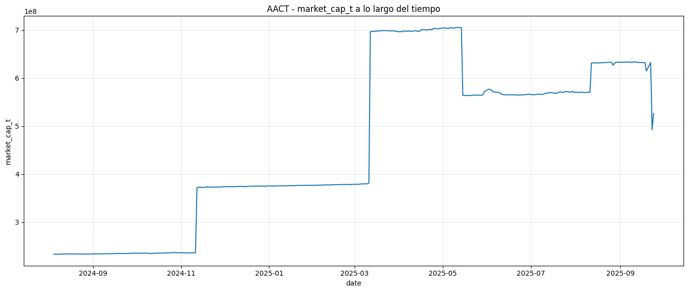

## Menú

- [PASO 1 : Se construye universo completo 2005-2026 (activos + inactivos)](#paso-1--se-construye-universo-completo-2005-2026-activos--inactivos)
- [PASO 2 : se construye `tickers_2005_2026.parquet`](#paso-2--se-construye-tickers_2005_2026parquet)
- [PASO 3 : se construye `tickers_2005_2026_upper.parquet`.](#paso-3--se-construye-tickers_2005_2026_upperparquet)
- [Daily](#daily)
- [ohlcv_1m](#ohlcv_1m)
- [universo PTI completo](#universo-pti-completo)
- [Corte por MarketCap (activas e inactivas) < 2B](#corte-por-marketcap-activas-e-inactivas--2b)
- [Corte por MarketCap (activas e inactivas) < 1B](#corte-por-marketcap-activas-e-inactivas--1b)
- [22/03/2026 en local descargado para `D:\quotes` y `D:\trades_ticks_prod_2005_2026`](#22032026-en-local-descargado-para-dquotes-y-dtrades_ticks_prod_2005_2026)
- [Descarga para universo smallcaps <1B](#descarga-para-universo-smallcaps-1b)
- [Acotar ventanas temporales por tiker](#acotar-ventanas-temporales-por-tiker)
- [Desgarga datos quotes](#desgarga-datos-quotes)
- [Lanzamos descarga `quotes` contra # lista de faltantes](#lanzamos-descarga-quotes-contra--lista-de-faltantes)
- [Preparamos para Trades tiks](#preparamos-para-trades-tiks)
- [Descarga para Trade-tiks](#descarga-para-trade-tiks)
- [Quotes va muy lento, vamos a cambiar (igual que trades-tiks)](#quotes-va-muy-lento-vamos-a-cambiar-igual-que-trades-tiks)
  - [OJO: DISCO D/: SIN ESPACIO HEMOS DE CAMBIAR EL OUTPUT DE QUOTES](#ojo-disco-d-sin-espacio-hemos-de-cambiar-el-output-de-quotes)
- [Cobertura `Quotes & Trades` Corte por MarketCap (activas e inactivas) `< 1B`](#cobertura-quotes--trades-corte-por-marketcap-activas-e-inactivas--1b)
- [Integracion Daily, ohlv1m, quotes, trades](#integracion-daily-ohlv1m-quotes-trades)
  - [criterio de union](#criterio-de-union)
    - [Pieza 1](#pieza-1)
  - [Quotes](#quotes)
    - [Quotes full para D://](#quotes-full-para-d)
    - [Quotes full para C://](#quotes-full-para-c)
    - [Merge final Quotes C + D con auditoría de overlaps](#merge-final-quotes-c--d-con-auditoría-de-overlaps)
  - [Trades full](#trades-full)
    - [ejecutamos para Trades C://](#ejecutamos-para-trades-c)
    - [Uniendo Trades C+D](#uniendo-tradescd)
  - [Daily full](#daily-full)
  - [Verificacion en `notebooks`](#verificacion-en-notebooks)

## PASO 1 : Se construye universo completo 2005-2026 (activos + inactivos)

Objetivo:     

reconstruir el universo histórico completo 2005-2026 (activos + inactivos) desde Polygon /v3/reference/tickers?date=..., tomando snapshots por fecha, y persistirlo como panel PTI en Parquet particionado.

Script

```sh
C:/TSIS_Data/02_backtest_SmallCaps/scripts/build_universe_pti.py

 - consulta Polygon:
      - /v3/reference/tickers?date=...
  - por cada corte diario entre:
      - 2005-01-01
      - 2026-12-31
  - filtra:
      - market=stocks
      - locale=us
      - type=CS
      - exchange in {XNAS, XNYS, XASE, ARCX}
      - active_filter=all
  - construye entity_id con prioridad:
      - composite_figi
      - share_class_figi
      - ticker|primary_exchange
  - deduplica por:
      - snapshot_date, entity_id
  - escribe checkpoints por snapshot
  - y al final materializa:
      - panel PTI particionado
      - tickers_all
      - tickers_active
      - tickers_inactive
      - QA
      - meta
      - progress
```

inputs

```sh
- la API de Polygon
- POLYGON_API_KEY en entorno
- parámetros CLI
```

Lanzadera

```sh
# Lanza build_universe_pti.py con --resume para reconstruir el universo PTI en un outdir
powershell -NoProfile -ExecutionPolicy Bypass -File C:\TSIS_Data\02_backtest_SmallCaps\data_auditoria_polygon\cell_code\run_build_universe_pti_with_progress.ps1
```

Outputs

```sh
- C:/TSIS_Data/02_backtest_SmallCaps/data/reference/universe_pti_rebuild_compare/tickers_panel_pti
- C:/TSIS_Data/02_backtest_SmallCaps/data/reference/universe_pti_rebuild_compare/tickers_panel_pti_checkpoints
- C:/TSIS_Data/02_backtest_SmallCaps/data/reference/universe_pti_rebuild_compare/tickers_all.parquet
- C:/TSIS_Data/02_backtest_SmallCaps/data/reference/universe_pti_rebuild_compare/tickers_active.parquet
- C:/TSIS_Data/02_backtest_SmallCaps/data/reference/universe_pti_rebuild_compare/tickers_inactive.parquet
- C:/TSIS_Data/02_backtest_SmallCaps/data/reference/universe_pti_rebuild_compare/qa_coverage_by_cut.csv
- qa_coverage_by_cut.partial.csv
- build_universe_pti.progress.json
- build_universe_pti.meta.json
```


**CELDA 1 `00_auditoria_general.ipynb` : describe y evalúa si la corrida es consistente**

Hace una auditoría/inspección local del resultado ya generado:

```
C:/TSIS_Data/02_backtest_SmallCaps/data/reference/universe_pti_rebuild_compare
```

Script

```sh
C:/TSIS_Data/02_backtest_SmallCaps/scripts/agent_universe_audit.py

  1. Lee el estado de la corrida:
  - build_universe_pti.progress.json
  - build_universe_pti.meta.json

  2. Comprueba si existen los artefactos finales esperados:
  - tickers_all.parquet
  - tickers_active.parquet
  - tickers_inactive.parquet
  - qa_coverage_by_cut.csv
  - carpeta tickers_panel_pti

  3. Inspecciona el panel final tickers_panel_pti:
  - cuenta filas
  - cuenta snapshots
  - obtiene el max_snapshot

  4. Inspecciona QA:
  - qa_coverage_by_cut.csv
  - qa_coverage_by_cut.partial.csv

  5. Inspecciona checkpoints:
  - carpeta tickers_panel_pti_checkpoints
  - cuenta cuántos .parquet hay
  - mira el snapshot máximo

  6. Valida integridad básica de tickers_all.parquet:
  - si hay entity_id duplicados
  - si hay entity_id nulos

  7. Cruza consistencia entre:
  - meta vs panel final
  - QA vs panel
  - progress vs checkpoints
  - frecuencia declarada vs frecuencia real

  8. Si la corrida sigue en running, además revisa:
  - si el progress.json está “stale”
  - si hay checkpoints vivos
  - si hay huecos aparentes entre checkpoints
  - si faltan sidecars .qa.json
  - si los últimos checkpoints están corruptos o mal formados

  9. Te imprime un resumen con:
  - overall: OK / WARN / FAIL
  - mode: running-audit / final-audit
  - una lista de checks
  - una accion_recomendada
```

Lanzadera 

```sh
# Lanzadera
C:\TSIS_Data\02_backtest_SmallCaps\backtest\Scripts\python.exe C:\TSIS_Data\02_backtest_SmallCaps\scripts\agent_universe_audit.py --outdir C:\TSIS_Data\02_backtest_SmallCaps\data\reference\universe_pti_rebuild_compare

universe-audit
outdir : C:\TSIS_Data\02_backtest_SmallCaps\data\reference\universe_pti_rebuild_compare
----------------------------------------------------------------------------------------------------
overall: OK
mode   : final-audit
panel  : rows=31294565 snapshots=8034 max_snapshot=2026-12-31
qa     : final_rows=8034 final_max=2026-12-31 partial_rows=None partial_max=None
ckpt   : count=8034 max_snapshot=2026-12-31

checks:
- [OK] required_outputs: Artefactos base presentes.
- [OK] entity_integrity: Sin duplicados ni nulos en entity_id.
- [OK] meta_vs_panel: Meta consistente con panel final.
- [OK] qa_vs_panel: QA final consistente con snapshots del panel.
- [OK] progress_status: Corrida marcada como completed.
- [OK] progress_freshness: progress fresco: age_min=563.3.
```

**CELDA 2 `00_auditoria_general.ipynb` : simplemento aspectos visuales de la celda 1**

```sh
- C:\TSIS_Data\02_backtest_SmallCaps\data\reference\universe_pti_rebuild_compare\tickers_panel_pti
- C:\TSIS_Data\02_backtest_SmallCaps\data\reference\universe_pti_rebuild_compare\tickers_all.parquet
- C:\TSIS_Data\02_backtest_SmallCaps\data\reference\universe_pti_rebuild_compare\tickers_active.parquet
- C:\TSIS_Data\02_backtest_SmallCaps\data\reference\universe_pti_rebuild_compare\tickers_inactive.parquet
- C:\TSIS_Data\02_backtest_SmallCaps\data\reference\universe_pti_rebuild_compare\qa_coverage_by_cut.csv
- C:\TSIS_Data\02_backtest_SmallCaps\data\reference\universe_pti_rebuild_compare\build_universe_pti.meta.json

=== PANEL DATASET ===
panel_rows: 31,294,565
snapshots_n: 8,034
snapshot_min: 2005-01-01
snapshot_max: 2026-12-31

=== TICKERS_ALL ===
rows: 16,010
unique_entity_id: 16,010
status_counts:
status
inactive    10743
active       5267
status_confidence_counts:
status_confidence
low       10743
medium     5267

columns:
['ticker', 'name', 'market', 'locale', 'primary_exchange', 'type', 'active', 'currency_name', 'cik', 'composite_figi', 'share_class_figi', 'list_date', 'delisted_utc', 'last_updated_utc', 'snapshot_date', 'entity_id', 'exchange_priority', 'has_composite_figi', 'has_share_class_figi', 'has_list_date', 'cut_frequency', 'first_seen_date', 'last_seen_date', 'latest_active', 'status_confidence', 'status']

=== ACTIVE / INACTIVE ===
active_rows: 5,267
inactive_rows: 10,743

=== QA COVERAGE ===
qa_rows: 8,034
qa_snapshot_min: 2005-01-01
qa_snapshot_max: 2026-12-31
```


## PASO 2 : se construye `tickers_2005_2026.parquet`

**Construir `tickers_2005_2026.parquet` desde la fuente auditada `universe_pti_rebuild_compare/`**

Genera un derivado temporal del universo PTI auditado para quedarte solo con las entidades cuyo ciclo de vida intersecta la ventana `2005-01-01 .. 2026-12-31`

Input

```
C:/TSIS_Data/02_backtest_SmallCaps/data/reference/universe_pti_rebuild_compare/tickers_all.parquet
```
Regla

```
Incluye una fila si su intervalo:
- [first_seen_date, last_seen_date]

intersecta:
- [2005-01-01, 2026-12-31]

Condición aplicada:
- first_seen_date.notna()
- last_seen_date.notna()
- first_seen_date <= end
- last_seen_date >= start
```

Output

```
- C:/TSIS_Data/02_backtest_SmallCaps/data/reference/universe_pti_rebuild_compare/tickers_2005_2026.parquet
- tickers_2005_2026.summary.json
```

lanzadera

```sh
powershell -NoProfile -ExecutionPolicy Bypass -File C:\TSIS_Data\02_backtest_SmallCaps\data_auditoria_polygon\cell_code\00_data_certification\run_build_tickers_2005_2026_from_rebuild_compare.ps1
Running build_tickers_2005_2026_from_rebuild_compare...
python = C:\Users\AlexJ\AppData\Local\Programs\Python\Python313\python.exe
script = C:\TSIS_Data\02_backtest_SmallCaps\data_auditoria_polygon\cell_code\00_data_certification\build_tickers_2005_2026_from_rebuild_compare.py
in_all = C:\TSIS_Data\02_backtest_SmallCaps\data\reference\universe_pti_rebuild_compare\tickers_all.parquet
out = C:\TSIS_Data\02_backtest_SmallCaps\data\reference\universe_pti_rebuild_compare\tickers_2005_2026.parquet
start = 2005-01-01
end = 2026-12-31
=== SUMMARY ===
{
  "input_parquet": "C:\\TSIS_Data\\v1\\backtest_SmallCaps\\data\\reference\\universe_pti_rebuild_compare\\tickers_all.parquet",
  "output_parquet": "C:\\TSIS_Data\\v1\\backtest_SmallCaps\\data\\reference\\universe_pti_rebuild_compare\\tickers_2005_2026.parquet",
  "start": "2005-01-01",
  "end": "2026-12-31",
  "input_rows": 16010,
  "output_rows": 16010,
  "input_entity_id_unique": 16010,
  "output_entity_id_unique": 16010,
  "input_ticker_unique": 12496,
  "output_ticker_unique": 12496,
  "output_date_min": "2005-01-01",
  "output_date_max": "2026-12-31"
}
saved: C:\TSIS_Data\02_backtest_SmallCaps\data\reference\universe_pti_rebuild_compare\tickers_2005_2026.parquet
```

**CELDA 3 `00_auditoria_general.ipynb` : aspectos visuales tickers_2005_2026.parquet**

```sh
OUTPUT
shape: (16010, 26)
rows_total: 16010
columns: ['ticker', 'name', 'market', 'locale', 'primary_exchange', 'type', 'active', 'currency_name', 'cik', 'composite_figi', 'share_class_figi', 'list_date', 'delisted_utc', 'last_updated_utc', 'snapshot_date', 'entity_id', 'exchange_priority', 'has_composite_figi', 'has_share_class_figi', 'has_list_date', 'cut_frequency', 'first_seen_date', 'last_seen_date', 'latest_active', 'status_confidence', 'status']
output_ticker_unique: 12491
```

## PASO 3 : se construye `tickers_2005_2026_upper.parquet`.

**Objetivo**  

Construir `tickers_2005_2026_upper.parquet` desde `tickers_2005_2026.parquet` en `universe_pti_rebuild_compare\`. Genera una versión operativa por ticker único del universo 2005-2026, aplicando exactamente la misma lógica histórica usada para construir el upper antiguo, pero ahora sobre la fuente nueva reconstruida y trazable.

Input
```
C:/TSIS_Data/02_backtest_SmallCaps/data/reference/universe_pti_rebuild_compare/tickers_2005_2026.parquet
```

Regla
```
Aplica esta transformación:
- ticker -> strip().upper()
- dropna(subset=["ticker"])
- drop_duplicates(subset=["ticker"])
- sort_values("ticker")

Condición aplicada:
- normalizar ticker a uppercase
- eliminar tickers nulos
- colapsar múltiples filas que compartan el mismo ticker
- conservar una sola fila por ticker
```

Output

```
- C:/TSIS_Data/02_backtest_SmallCaps/data/reference/universe_pti_rebuild_compare/tickers_2005_2026_upper.parquet
- tickers_2005_2026_upper.summary.json
```

lanzadera

```sh
powershell -NoProfile -ExecutionPolicy Bypass -File C:\TSIS_Data\02_backtest_SmallCaps\data_auditoria_polygon\cell_code\00_data_certification\run_build_tickers_2005_2026_upper_from_rebuild_compare.ps1
Running build_tickers_2005_2026_upper_from_rebuild_compare...
python = C:\Users\AlexJ\AppData\Local\Programs\Python\Python313\python.exe
script = C:\TSIS_Data\02_backtest_SmallCaps\data_auditoria_polygon\cell_code\00_data_certification\build_tickers_2005_2026_upper_from_rebuild_compare.py
input =
out = C:\TSIS_Data\02_backtest_SmallCaps\data\reference\universe_pti_rebuild_compare\tickers_2005_2026_upper.parquet
=== SUMMARY ===
{
  "input_parquet": "C:\\TSIS_Data\\v1\\backtest_SmallCaps\\data\\reference\\universe_pti_rebuild_compare\\tickers_2005_2026.parquet",
  "output_parquet": "C:\\TSIS_Data\\v1\\backtest_SmallCaps\\data\\reference\\universe_pti_rebuild_compare\\tickers_2005_2026_upper.parquet",
  "transformation": [
    "ticker -> strip().upper()",
    "dropna(subset=['ticker'])",
    "drop_duplicates(subset=['ticker'])",
    "sort_values('ticker')"
  ],
  "input_rows": 16010,
  "output_rows": 12491,
  "ticker_na_before": 0,
  "ticker_unique_before": 12496,
  "ticker_na_after": 0,
  "ticker_unique_after": 12491,
  "entity_id_unique_after": 12491
}
saved: C:\TSIS_Data\02_backtest_SmallCaps\data\reference\universe_pti_rebuild_compare\tickers_2005_2026_upper.parquet

OUTPUT
shape: (12491, 26)
rows_total: 12491
columns: ['ticker', 'name', 'market', 'locale', 'primary_exchange', 'type', 'active', 'currency_name', 'cik', 'composite_figi', 'share_class_figi', 'list_date', 'delisted_utc', 'last_updated_utc', 'snapshot_date', 'entity_id', 'exchange_priority', 'has_composite_figi', 'has_share_class_figi', 'has_list_date', 'cut_frequency', 'first_seen_date', 'last_seen_date', 'latest_active', 'status_confidence', 'status']
output_ticker_unique: 12491
```

**CELDA 4 `00_auditoria_general.ipynb` : aspectos visuales tickers_2005_2026_upper.parquet**

```SH
OUTPUT
shape: (12468, 26)
rows_total: 12468
columns: ['ticker', 'name', 'market', 'locale', 'primary_exchange', 'type', 'active', 'currency_name', 'cik', 'composite_figi', 'share_class_figi', 'list_date', 'delisted_utc', 'last_updated_utc', 'snapshot_date', 'entity_id', 'exchange_priority', 'has_composite_figi', 'has_share_class_figi', 'has_list_date', 'cut_frequency', 'first_seen_date', 'last_seen_date', 'latest_active', 'status_confidence', 'status']
output_ticker_unique: 12468
```

**Interpretación importante**

`tickers_2005_2026_upper.parquet` **no es un universo PTI “científico”** completo.    
Es un universo operativo por ticker único para descargas masivas por símbolo.

Por eso era válido para:
```
- daily
- 1m
- fundamentals
```

**Un universo PTI completo sería (luego lo montamos):**

```
- para cada fecha t
- la lista de todos los instrumentos que realmente existían y eran elegibles en t
- con sus atributos conocidos en t
- sin usar información futura
- y sin perder los que luego desaparecieron
```

En vuestro caso, para US Common Stocks, eso significa:

```
- fecha a fecha
- market=stocks
- locale=us
- type=CS
- exchanges objetivo
- activos e inactivos históricos que en esa fecha seguían vivos
- con identidad estable por entity_id/FIGI si es posible, no solo por ticker
```

Qué tendría un PTI completo de verdad

Para cada date:

```
- ticker
- entity_id
- primary_exchange
- type
- active/as-of
- list_date si ya era conocida
- delist_date solo si ya había ocurrido o era inferible sin futuro
- campos de identificación consistentes
- continuidad ante ticker changes / mergers / delistings
```

Y además:

```
- si una acción existió en 2008 y murió en 2011, tiene que estar en 2008-2011
- aunque hoy ya no exista
- si cambia de ticker, debes preservar la continuidad de identidad
- si el ticker se recicla, no debes mezclar dos entidades distintas
```

Qué sería “completo” en la práctica.  
Significa que cubre estas tres cosas:

```
1. Cobertura temporal - todos los cortes del periodo objetivo  
2. Cobertura de entidades - todos los CS elegibles en cada corte  
3. Cobertura de lifecycle - altas, bajas, cambios y discontinuidades sin survivorship bias  
```

Por eso luego necesitamos reforzar con:

```
- lifecycle oficial
- inactive catalog
- ticker events
- hybrid enriched
```

Un universo PTI completo es una tabla diaria histórica de elegibilidad e identidad, donde cada fila
responde:
```
“¿Qué acción común de EE. UU. existía ese día,   
    bajo qué identidad,   
    en qué exchange,   
    y con qué estado conocido en ese momento?”  
```

## Daily

Descargar OHLCV daily para todos los tickers del universo de entrada y guardarlo en disco con soporte de reanudación.

Script

```sh
C:/TSIS_Data/02_backtest_SmallCaps/data_auditoria_polygon/cell_code/download_ohlcv_daily_v1.py

- lee un parquet con columna ticker
- deduplica tickers
- para cada ticker llama a Polygon y descarga barras diarias en la ventana start..end
- guarda el dataset por ticker en el outdir
- escribe progreso, auditoría y checkpoints
- si usas --resume y --resume-validate, reutiliza lo ya descargado y revalida los artefactos existentes
```

Inputs

```sh
C:\TSIS_Data\02_backtest_SmallCaps\data\reference\universe_pti_rebuild_compare\tickers_2005_2026_upper.parquet

# parquet con una columna ticker
shape: (12468, 26)
output_ticker_unique: 12468
columns: ['ticker', 'name', 'market', 'locale', 'primary_exchange', 'type', 'active', 'currency_name', 'cik', 'composite_figi', 'share_class_figi', 'list_date', 'delisted_utc', 'last_updated_utc', 'snapshot_date', 'entity_id', 'exchange_priority', 'has_composite_figi', 'has_share_class_figi', 'has_list_date', 'cut_frequency', 'first_seen_date', 'last_seen_date', 'latest_active', 'status_confidence', 'status']
```

Lanzadera

```sh
python C:\TSIS_Data\02_backtest_SmallCaps\data_auditoria_polygon\cell_code\download_ohlcv_daily_v1.py `
      --input C:\TSIS_Data\02_backtest_SmallCaps\data\reference\universe_pti_rebuild_compare\tickers_2005_2026_upper.parquet `
      --outdir D:\ohlcv_daily `
      --start 2005-01-01 `
      --end 2026-12-31 `
      --source rest `
      --resume `
      --resume-validate


source_selected=rest
done_tickers=12491/12491
rows_total=27,413,994
progress=D:\ohlcv_daily\_run\download_ohlcv_daily_v1.progress.json
ticker_audit=D:\ohlcv_daily\_run\download_ohlcv_daily_v1.ticker_audit.csv
```

## ohlcv_1m

Descargar OHLCV 1m para todos los tickers del universo de entrada y guardarlo en disco con soporte de reanudación.

Script:

```sh
C:/TSIS_Data/02_backtest_SmallCaps/data_auditoria_polygon/cell_code/download_ohlcv_minute_v1.py

- lee un parquet con columna ticker
- deduplica tickers
- para cada ticker llama a Polygon y descarga barras de 1 minuto
- guarda el dataset por ticker en el outdir
- escribe progreso, auditoría y checkpoints
- si usas --resume y --resume-validate, reutiliza lo ya descargado y revalida los artefactos existentes
```

Inputs

```sh
C:\TSIS_Data\02_backtest_SmallCaps\data\reference\universe_pti_rebuild_compare\tickers_2005_2026_upper.parquet
```

lanzadera

```sh
  python C:\TSIS_Data\02_backtest_SmallCaps\data_auditoria_polygon\cell_code\download_ohlcv_minute_v1.py `
    --input C:\TSIS_Data\02_backtest_SmallCaps\data\reference\universe_pti_rebuild_compare\tickers_2005_2026_upper.parquet `
    --outdir D:\ohlcv_1m `
    --source rest `
    --resume `
    --resume-validate
```

Qué hace exactamente

```
- lee la lista operativa de tickers únicos desde:
  - C:\TSIS_Data\02_backtest_SmallCaps\data\reference\universe_pti_rebuild_compare\tickers_2005_2026_upper.parquet
- descarga ohlcv_1m por ticker
- reutiliza progreso previo con:
  - --resume
  - --resume-validate
- guarda el dataset en:
  - D:\ohlcv_1m
- escribe artefactos de run en:
  - D:\ohlcv_1m\_run
```

**Auditamos tikers descargados de Daily vs ohlv_1m** :  

Comparamos tres cosas a nivel de ticker:
```
- el universo de entrada
- los tickers realmente materializados en D:\ohlcv_daily
- los tickers realmente materializados en D:\ohlcv_1m
```
Y responde:
```
- cuáles faltan en daily
- cuáles faltan en 1m
- cuáles sobran respecto al input
- cuáles están en daily pero no en 1m
```

Scripts
```
C:/TSIS_Data/02_backtest_SmallCaps/data_auditoria_polygon/cell_code/audit_ohlcv_input_vs_daily_vs_1m_cli.py  
C:/TSIS_Data/02_backtest_SmallCaps/data_auditoria_polygon/cell_code/run_audit_ohlcv_input_vs_daily_vs_1m.ps1  
```

inputs

```sh
- C:\TSIS_Data\02_backtest_SmallCaps\data\reference\universe_pti_rebuild_compare\tickers_2005_2026_upper.parquet
- D:\ohlcv_daily
- D:\ohlcv_1m
```

Lanzadera

```sh
powershell -NoProfile -ExecutionPolicy Bypass -File C:\TSIS_Data\02_backtest_SmallCaps\data_auditoria_polygon\cell_code\run_audit_ohlcv_input_vs_daily_vs_1m.ps1


```

antiguo:

```py
from pathlib import Path

SCRIPT = Path(r"C:\TSIS_Data\02_backtest_SmallCaps\data_auditoria_polygon\cell_code\audit_ohlcv_input_vs_daily_vs_1m.py")

INPUT_PARQUET = Path(r"C:\TSIS_Data\02_backtest_SmallCaps\data\reference\universe_pti\tickers_2005_2026_upper.parquet")
DAILY_ROOT = Path(r"D:\ohlcv_daily")
MINUTE_ROOT = Path(r"D:\ohlcv_1m")
TOP_N = 50
exec(SCRIPT.read_text(encoding="utf-8"), globals(), globals())
```
```sh
=== RESUMEN ===
{
  "input_unique_tickers": 12468,
  "daily_dir_tickers": 12468,
  "minute_dir_tickers": 12106,
  "missing_in_daily": 0,
  "missing_in_minute": 362,
  "extra_in_daily": 0,
  "extra_in_minute": 0,
  "missing_minute_vs_daily": 362
}
```
respuesta `"missing_in_minute": 362`  
Existen más tikers el Daily, la descarga de estos 362 se hará selectiva `<2B` marketcap.

**`"missing_in_minute": 362` : Descargaré solo los < 2B**   
No nos interesa quotes, trades ni nada que sea > 2B, nuestro nicho es smallcaps

```sh
tickers originales: 12468
tickers eliminados (missing 1m con market cap >= 2B o null): 335
tickers resultado: 12133

# Output
C:\TSIS_Data\02_backtest_SmallCaps\data\reference\universe_pti\tickers_2005_2026_upper_excluding_ohlcv_1m_missing_vs_daily_ge_2B_or_null.parquet
C:\TSIS_Data\02_backtest_SmallCaps\data\reference\universe_pti\tickers_2005_2026_upper_excluding_ohlcv_1m_missing_vs_daily_ge_2B_or_null.csv
```

Ahora nos quedan 12133 tikers en:  
`tickers_2005_2026_upper_excluding_ohlcv_1m_missing_vs_daily_ge_2B_or_null.parquet`

La lógica exacta es:

1. se tomó el universo base 12468
2. solo los 362 faltantes en 1m
3. enriquecer esos 362 con final_market_cap
4. eliminar de esos faltantes los que tienen:
    - final_market_cap nulo
    - o final_market_cap >= 2B
5. conservar todo lo demás

```sh
# statics : tickers_2005_2026_upper_excluding_ohlcv_1m_missing_vs_daily_ge_2B_or_null.parquet 
C:\TSIS_Data\02_backtest_SmallCaps\data\reference\universe_pti\tickers_2005_2026_upper_excluding_ohlcv_1m_missing_vs_daily_ge_2B_or_null.parquet
shape: (12133, 1)
columns: ['ticker']

tickers_unique: 12133
```

Hemos aplicado un filtro operativo parcial aplicado solo a los 362 tickers faltantes en `ohlcv_1m`,   
usando `final_market_cap` estático.


## universo PTI completo

**Objetivo** : Acotar los tickers resultado (listados y deslistados)   
por marketCap para descargar menos tikers en quotes y ticks por nicho *< 1B* ó *< 2B*

Se construye `population_target_pti.parquet` y sale de unir:

```
- C:\TSIS_Data\02_backtest_SmallCaps\data\reference\universe_pti\tickers_panel_pti
- D:\ohlcv_daily para `close_t`
- D:\financial\income_statements para `shares_outstanding_t`
- y recomputar `market_cap_t` de forma PTI para recomputar `market_cap_t` point-in-time sin look-ahead.
```

`market_cap_t` es el market cap del ticker en ese momento `t`

```
- market cap del ticker
- en la fecha date
- usando solo información disponible hasta esa fecha
```

Lo que hacemos en el corte final no redefine *market_cap_t*.  
Solo elige qué fecha `t` usar por ticker para la clasificación final del universo.

```
- para una activa:
    - normalmente será muy cerca del final del panel
- para una inactiva:
    - será antes de morir
- si nunca tuvo market_cap_t válido:
    - queda unclassified_no_market_cap
```

`population_target_pti.parquet` no se construyó específicamente sobre el universo refinado `12133`,  
sino sobre el spine PTI completo, para recalcular `market_cap_t` por `ticker,date` de forma point-in-time y sin look-ahead.

Script que lo genera:

```sh
C:\TSIS_Data\02_backtest_SmallCaps\data_auditoria_polygon\cell_code\build_population_target_pti.py

# que hace
  1. lee el spine diario desde tickers_panel_pti
  2. añade close_t desde D:\ohlcv_daily
  3. añade shares_outstanding_t desde D:\financial\income_statements
  4. hace ASOF LEFT JOIN backward por filing_date
  5. aplica TTL_DAYS = 180
  6. calcula:  
    - market_cap_t = close_t * shares_outstanding_t
    - is_small_cap_t = market_cap_t < 2_000_000_000
```

inputs

```sh
# carpeta/dataset parquet particionado, no un único file
- C:\TSIS_Data\02_backtest_SmallCaps\data\reference\universe_pti\tickers_panel_pti # lo crea build_universe_pti.py
- D:\ohlcv_daily
- D:\financial\income_statements
- D:\financial\balance_sheets
```
El bloque de resultados no lista `tickers_panel_pti`, pero el script `build_universe_pti.py` sí lo crea explícitamente como `outdir / "tickers_panel_pti"`. Además,
`00_descarga_universo.ipynb` lo inspecciona después, lo que confirma que ese dataset fue materializado históricamente en esa ruta.


Output
```sh
# population_target_pti.parquet
- C:\TSIS_Data\02_backtest_SmallCaps\runs\backtest\population_target_pti\population_target_pti_run_01\population_target_pti.parquet
- C:\TSIS_Data\02_backtest_SmallCaps\runs\backtest\population_target_pti\population_target_pti_run_01\population_target_pti_summary.json
- C:\TSIS_Data\02_backtest_SmallCaps\runs\backtest\population_target_pti\population_target_pti_run_01\population_target_pti_year_summary.parquet
```
Tenmos por cada tiker listado y deslistado su marketcap_t en un tiempo `t` dado,   
ejemplo



**Matiz importante**  
No garantiza market cap para todos.  

Garantiza esto:
```
- si hay close_t
- y hay shares válidas por filing_date dentro del TTL
- entonces calcula market_cap_t

Si falta alguna pieza:
- deja market_cap_t = NULL
```

O sea buscamos mayor cobertura de marketcap:
```
- el objetivo no es “forzar market cap en todos”
- el objetivo es “calcularla correctamente cuando sea defendible”
- no se construyó para arrastrar un `market_cap` estático, sino para recomputar `market_cap_t` en cada fecha PTI del ticker.
- y así poder clasificar cada `ticker,date` como small-cap o no small-cap sin look-ahead ni survivorship bias.

La mejor cobertura no sale de un file “raw con market_cap”, sino de reconstruir:

- `close_t` desde `D:\ohlcv_daily`
- `shares_outstanding_t` desde `D:\financial\income_statements`
```

Dónde se hace

```
- C:\TSIS_Data\02_backtest_SmallCaps\notebooks\00_data_certification\00_descarga_universo.ipynb
```


Y calcula:

```
- close_t desde D:\ohlcv_daily
- shares_outstanding_t desde D:\financial\income_statements
- market_cap_t = close_t * shares_outstanding_t
- is_small_cap_t = market_cap_t < 2_000_000_000
```

Además:
```
- usa filing_date
- hace ASOF LEFT JOIN hacia atrás
- aplica TTL_DAYS = 180
- anti_lookahead_violations = 0
```

**Condición clave**

Debe ser:
```
- close_t
    - precio en la fecha t
- shares_outstanding_t
    - acciones en circulación conocidas y válidas en la fecha t
    - sin look-ahead
```
Si no, el market cap queda contaminado.

**Qué problemas tiene**

La fórmula en sí no está mal. Los problemas vienen de cómo construyes shares_outstanding_t.

Porque:
```
- shares cambia en el tiempo
- las filings llegan con retraso
- a veces solo tienes diluted/basic
- a veces no tienes dato reciente
- a veces el dato está obsoleto
```

statics `population_target_pti.parquet`

```sh
pti_path: C:\TSIS_Data\02_backtest_SmallCaps\runs\backtest\population_target_pti\population_target_pti_run_01\population_target_pti.parquet

tickers_total_in_pti: 13066
tickers_with_market_cap_t: 7661
tickers_without_market_cap_t: 5405

lt_2b_last_classifiable: 5478
ge_2b_last_classifiable: 2183
```

NOTAS

```
- `population_target_pti.parquet` Se construyó sobre el spine PTI global, y por eso da: 
-  tickers_total_in_pti: 13066

Tienes: 
- `tickers_without_market_cap_t` : 13066 - 7661 = 5405 -> Eso es correcto dentro del PTI completo.
Pero antes habías usado:
- `tickers_without_market_cap_t` : 12468 - 7661 = 4807 -> era correcto dentro del universo base tickers_2005_2026_upper.parquet.
```

## Corte por MarketCap (activas e inactivas) < 2B

Se construyó un corte cuando creamos `population_target_pti.parquet` :

La idea fue:

- no tocar raws originales
- no depender de market_cap snapshot ni de ratios
- reconstruir market_cap_t en el último punto clasificable por ticker

Usando como input principal:

```sh
# input : 
C:\TSIS_Data\02_backtest_SmallCaps\runs\backtest\population_target_pti\population_target_pti_run_01\population_target_pti.parquet
```

Ese artefacto PTI ya contenía:
```
- date
- ticker
- status
- close_t
- shares_outstanding_t
- market_cap_t
- is_small_cap_t
```

La lógica aplicada fue:

1. tomar los **12468 tickers** del universo base
2. buscar su `last_observed_date` en `population_target_pti.parquet`
3. buscar su último punto clasificable con `market_cap_t` no nulo
4. **reconstruir estado final**:
    - *active* si `last_observed_date == panel_end_date`
    - *inactive* si `last_observed_date < panel_end_date`
5. clasificar por market_cap_t en ese último punto clasificable


Se trabajó en:

```sh
# notebook
C:\TSIS_Data\02_backtest_SmallCaps\notebooks\00_data_certification\00_corte_2B_universo.ipynb
```

Resultados del corte sobre 12468:
```
{
  "universe_tickers": 12468,
  "with_first_seen_date": 12468,
  "with_last_observed_date": 12468,
  "with_last_row": 12468,
  "with_anchor_date_used": 7661,
  "with_market_cap_t_recomputed": 7661,
  "without_market_cap_t_recomputed": 4807,
  "lt_2b_recomputed": 5478,
  "ge_2b_recomputed": 2183
}
```
Estado final reconstruido:
```
panel_end_date: 2026-03-09

status_rebuilt
inactive    7212
active      5256

Clasificación final <2B:

classification
unclassified_no_market_cap        4807
active_lt_2b_last_classifiable    2938
inactive_died_lt_2b               2540
ge_2b_last_classifiable           2183
```
Interpretación:

- 2938- activas al final del panel con último market_cap_t < 2B
- 2540- inactivas antes del final del panel con último market_cap_t < 2B
- 2183 tickers cuyo último market_cap_t clasificable es >= 2B
- 4807- sin market_cap_t calculable en el último punto útil

Esto demuestra:

- sí es posible cortar activas e inactivas por market cap sin tocar raws
- la cobertura recalculada (7661) es muy superior a ratios (3918 con market_cap útil)
- el cuello de botella real sigue siendo la falta de shares_outstanding_t/close_t en 4807 tickers

NOTA

Recuerda que `population_target_pti.parquet`, este corte global se hizo sobre 12468, no sobre el universo refinado 12133 . Si quieres descargar quotes y tiks sobre el refinando donde quitaste Tikers > 2B deberias cruzarlos. 

Artefactos generados:

```
saved:
C:\TSIS_Data\02_backtest_SmallCaps\runs\backtest\market_cap_last_observed_cutoff\20260320_market_cap_last_observed_cutoff\market_cap_last_observed_by_ticker.parquet
C:\TSIS_Data\02_backtest_SmallCaps\runs\backtest\market_cap_last_observed_cutoff\20260320_market_cap_last_observed_cutoff\market_cap_last_observed_by_ticker.csv
C:\TSIS_Data\02_backtest_SmallCaps\runs\backtest\market_cap_last_observed_cutoff\20260320_market_cap_last_observed_cutoff\market_cap_cutoff_lt_2b_active_inactive.parquet
C:\TSIS_Data\02_backtest_SmallCaps\runs\backtest\market_cap_last_observed_cutoff\20260320_market_cap_last_observed_cutoff\market_cap_cutoff_lt_2b_active_inactive.csv
C:\TSIS_Data\02_backtest_SmallCaps\runs\backtest\market_cap_last_observed_cutoff\20260320_market_cap_last_observed_cutoff\market_cap_cutoff_lt_2b_summary.json
```

## Corte por MarketCap (activas e inactivas) < 1B

Se generó también el corte <1B sobre el mismo universo 12468, manteniendo:

```
- activas <1B
- inactivas que murieron <1B
```
Artefactos generados:
```
C:\TSIS_Data\02_backtest_SmallCaps\runs\backtest\market_cap_last_observed_cutoff\20260320_market_cap_last_observed_cutoff\market_cap_last_observed_by_ticker_1b.parquet
C:\TSIS_Data\02_backtest_SmallCaps\runs\backtest\market_cap_last_observed_cutoff\20260320_market_cap_last_observed_cutoff\market_cap_last_observed_by_ticker_1b.csv
C:\TSIS_Data\02_backtest_SmallCaps\runs\backtest\market_cap_last_observed_cutoff\20260320_market_cap_last_observed_cutoff\market_cap_cutoff_lt_1b_active_inactive.parquet
C:\TSIS_Data\02_backtest_SmallCaps\runs\backtest\market_cap_last_observed_cutoff\20260320_market_cap_last_observed_cutoff\market_cap_cutoff_lt_1b_active_inactive.csv
C:\TSIS_Data\02_backtest_SmallCaps\runs\backtest\market_cap_last_observed_cutoff\20260320_market_cap_last_observed_cutoff\market_cap_cutoff_lt_1b_summary.json
```
Resultado:
```sh
CUTOFF_B: 1000000000
CUT_PARQUET_1B: C:\TSIS_Data\02_backtest_SmallCaps\runs\backtest\market_cap_last_observed_cutoff\20260320_market_cap_last_observed_cutoff\market_cap_cutoff_lt_1b_active_inactive.parquet
classification_1b_counts:
classification_1b
unclassified_no_market_cap        4807
ge_1b_last_classifiable           2837
active_lt_1b_last_classifiable    2476 # elegible
inactive_died_lt_1b               2348 # elegible
```

```sh
Yo descargaría solo esto:
- active_lt_1b_last_classifiable    2476 # - activas <1B
- inactive_died_lt_1b               2348 # - inactivas que murieron <1B

Qué no descargaría
- ge_1b_last_classifiable           2837 # - porque están >= 1B
- unclassified_no_market_cap        4807 # - porque no puedes defender que sean <1B
```

O sea, exactamente el contenido de `market_cap_cutoff_lt_1b_active_inactive.parquet`:

```
C:\TSIS_Data\02_backtest_SmallCaps\runs\backtest\market_cap_last_observed_cutoff\20260320_market_cap_last_observed_cutoff\market_cap_cutoff_lt_1b_active_inactive.parquet

# head(1)
shape: (4824, 16)

ticker                                               AACT
first_seen_date                       2023-06-12 00:00:00
last_observed_date                    2025-09-24 00:00:00
status_rebuilt                                   inactive
last_row_date                         2025-09-24 00:00:00
anchor_date_used                      2025-09-24 00:00:00
close_t                                              9.49
shares_outstanding_t                           55470890.5
shares_source                                     diluted
shares_observed_date                  2025-08-12 00:00:00
shares_period_end                     2024-06-30 00:00:00
shares_age_days                                      43.0
market_cap_t                                526418750.845
is_small_cap_t                                       True
classification_1b                     inactive_died_lt_1b
```
Interpretación:

- si se usa este artefacto como universo operativo
- el universo de descarga baja de 12468 a 4824
- sin depender exclusivamente del corte operativo parcial aplicado sobre los 362 faltantes en `ohlcv_1m`

Conclusión:

- el proyecto sí tenía una rama PTI correcta para reconstruir market_cap_t
- esa rama no gobernaba quotes ni trades_ticks
- pero ahora ya existe un artefacto derivado <1B reutilizable para construir un universo de descarga mucho más pequeño y coherente

**NOTA**

El corte <1B> no pretende decir:

- “esta es toda la vida del ticker en mercado”

Pretende decir:

- “esta es la ventana relevante dentro de la lógica PTI / clasificación / observación del universo”

**Condición clave**

Debe ser:
```
- close_t
    - precio en la fecha t
- shares_outstanding_t
    - acciones en circulación conocidas y válidas en la fecha t
    - sin look-ahead
```
Si no, el market cap queda contaminado.

**Qué problemas tiene**

La fórmula en sí no está mal. Los problemas vienen de cómo construyes shares_outstanding_t.

Porque:
```
- shares cambia en el tiempo
- las filings llegan con retraso
- a veces solo tienes diluted/basic
- a veces no tienes dato reciente
- a veces el dato está obsoleto
```

Recuerda que `population_target_pti.parquet`, este corte global se hizo sobre 12468, no sobre el universo refinado 12133 . Si quieres descargar quotes y tiks sobre el refinando donde quitaste Tikers > 2B deberias cruzarlos. 

## 22/03/2026 en local descargado para `D:\quotes` y `D:\trades_ticks_prod_2005_2026`

Ya habíamos descargado previamente en local, ahora auditamos que tenemos para no volver a descargar lo mismo.

Inventariar `D:\quotes` y `D:\trades_ticks` para ver cómo están particionados y  
generar un CSV limpio de tickers locales descargados antes de tocar nada más.

scripts:

```sh
- C:\Users\AlexJ\inventory_scripts\inventory_quotes_final_files.ps1
- C:\Users\AlexJ\inventory_scripts\inventory_trades_ticks_final_files.ps1
- C:\Users\AlexJ\inventory_scripts\run_final_file_inventories.ps1
```
Qué hacen:

```
- recorren por ticker dir, no en un único barrido ciego
- van guardando mientras avanzan
- imprimen progreso, ETA aproximada por ticker, tamaño del CSV y último ticker procesado
```

```sh
# quotes
PS C:\Users\AlexJ> 
powershell 
  -NoProfile 
  -ExecutionPolicy Bypass 
  -File C:\Users\AlexJ\inventory_scripts\inventory_quotes_final_files.ps1 
  -ProgressEverySec 5 
  -OutTxt C:\TSIS_Data\02_backtest_SmallCaps\runs\polygon_realtime_audit\20260313_quotes_prod_full_12133_clean\inputs\quotes_final_file_paths_v2.txt

=== quotes inventory ===
root=D:\quotes
out=C:\TSIS_Data\02_backtest_SmallCaps\runs\polygon_realtime_audit\20260313_quotes_prod_full_12133_clean\inputs\quotes_final_file_paths_v2.txt
mode=enumeratefiles_stream

files_total: 2204172
tickers_total: 1731
```

```sh
# trades
PS C:\Users\AlexJ> 
powershell 
  -NoProfile 
  -ExecutionPolicy Bypass 
  -File C:\Users\AlexJ\inventory_scripts\inventory_trades_ticks_final_files.ps1 
  -ProgressEverySec 5

=== trades_ticks inventory ===
root=D:\trades_ticks_prod_2005_2026
out=C:\TSIS_Data\02_backtest_SmallCaps\runs\polygon_realtime_audit\trades_ticks_prod_2005_2026\inputs\trades_ticks_final_file_paths.txt
mode=enumeratefiles_stream

files_total: 1205751
tickers_total: 932
```

## Descarga para universo smallcaps <1B

A partir de saber qué tikers totales de quotes y trades tenemos en local,  
hay que construir una matriz de cobertura contra el corte <1B.  

Ahora mismo tienes dos cosas distintas:

```sh
1. Universo objetivo # “qué tickers queremos tener”
  - market_cap_cutoff_lt_1b_active_inactive.parquet

2. Universo realmente descargado # “qué tickers tenemos ya”
  - D:\quotes con 1731 tickers
  - D:\trades_ticks_prod_2005_2026 con 932 tickers
```

Lo que falta hacer es comparar ambas cosas.

```
De los 4824 tickers <1B elegibles:

- cuántos ya tienen quotes
- cuántos ya tienen trades_ticks

- cuáles faltan en quotes
- cuáles faltan en trades_ticks

- cuáles tienen quotes pero no trades
- cuáles no tienen nada
```

La regla correcta sería esta
```
- si tu objetivo inmediato es solo descargar quotes sobre el universo <1B, entonces trabaja solo con:
    - target_universe
    - quotes_have
    - quotes_missing
- si tu objetivo inmediato es solo descargar trades_ticks, entonces trabaja solo con:
    - target_universe
    - trades_have
    - trades_missing
- si quieres medir salud general del ecosistema, entonces sí tiene sentido mirar:
    - quotes_only
    - trades_only
    - have_both
```

Resultado esperado

```
Te deberían salir 4 listas operativas:
- covered_quotes_and_trades
- covered_quotes_only
- missing_quotes_only
- missing_both
```

Script

```
- C:/TSIS_Data/02_backtest_SmallCaps/data_auditoria_polygon/cell_code/cross_lt_1b_universe_vs_quotes_trades.py
- C:/TSIS_Data/02_backtest_SmallCaps/data_auditoria_polygon/cell_code/run_cross_lt_1b_universe_vs_quotes_trades.ps1
```

Lanzadera:

```sh
PS C:\Users\AlexJ> powershell -NoProfile -ExecutionPolicy Bypass -File C:\TSIS_Data\02_backtest_SmallCaps\data_auditoria_polygon\cell_code\run_cross_lt_1b_universe_vs_quotes_trades.ps1

Running lt_1b universe coverage cross...
python = C:\TSIS_Data\02_backtest_SmallCaps\backtest\Scripts\python.exe
script = C:\TSIS_Data\02_backtest_SmallCaps\data_auditoria_polygon\cell_code\cross_lt_1b_universe_vs_quotes_trades.py
runId  = 20260322_120745_l_1b_quoe45_ra22e45_cro45
outdir = C:\TSIS_Data\02_backtest_SmallCaps\runs\backtest\universe_coverage_lt_1b\20260322_120745_l_1b_quoe45_ra22e45_cro45

=== SUMMARY ===
{
  "target_universe_tickers": 4824,  # universo objetivo <1B - market_cap_cutoff_lt_1b_active_inactive.parquet
  "quotes_inventory_tickers": 1731, # inventario bruto del disco para quotes - quotes_final_file_paths_v2.txt
  "trades_inventory_tickers": 932,  # inventario bruto del disco para trades_ticks - trades_ticks_final_file_paths.txt
  "target_with_quotes": 1347,       # de los 4824 objetivo <1B, 1347 ya tienen quotes - sale del cruce target vs quotesinventory
  "target_with_trades": 733,        # de los 4824 objetivo <1B, 733 ya tienen trades_ticks - sale del cruce target vs tradesinventory
  "have_both": 730,                 # de los 4824 objetivo, 730 tienen tanto quotes como trades_ticks - have_both.csv
  "quotes_only": 617,               # de los 4824 objetivo, 617 tienen quotes pero no trades_ticks - quotes_only.csv
  "trades_only": 3,                 # de los 4824 objetivo, 3 tienen trades_ticks pero no quotes - trades_only.csv
  "quotes_missing": 3477,           # de los 4824 objetivo, 3477 todavía no tienen quotes - quotes_missing.csv
  "trades_missing": 4091,           # de los 4824 objetivo, 4091 todavía no tienen trades_ticks - trades_missing.csv
  "missing_both": 3474              # de los 4824 objetivo, 3474 no tienen ni quotes ni trades_ticks - missing_both.csv
}

=== COVERAGE CLASS COUNTS ===
coverage_class
missing_both    3474
have_both        730
quotes_only      617
trades_only        3

Saved to: C:\TSIS_Data\02_backtest_SmallCaps\runs\backtest\universe_coverage_lt_1b\20260322_lt_1b_quotes_trades_cross

Ahí tienes:
  - lt_1b_target_coverage_matrix.csv
  - lt_1b_target_coverage_matrix.parquet
  - quotes_missing.csv
  - trades_missing.csv
  - have_both.csv
  - quotes_only.csv
  - trades_only.csv
  - missing_both.csv
  - summary.json
```

**Proximo objetivo**

1. Cerrar quotes

```
- usar quotes_missing.csv
- construir la cola de descarga de quotes para esos "quotes_missing": 3477
```
2. Cerrar trades_ticks

```
- usar trades_missing.csv
- construir la cola de descarga de trades para esos "trades_missing": 4091
```

## Acotar ventanas temporales por tiker

```
1. leer market_cap_cutoff_lt_1b_active_inactive.parquet
2. extraer los tickers objetivo
3. para cada ticker buscar en D:\ohlcv_daily
4. calcular:
- ohlcv_first_day
- ohlcv_last_day
5. cruzarlo con el universo <1B>
6. usar esa ventana para construir ticker,date
```

script

```
  - C:/TSIS_Data/02_backtest_SmallCaps/data_auditoria_polygon/cell_code/cross_lt_1b_vs_ohlcv_daily_windows.py
  - C:/TSIS_Data/02_backtest_SmallCaps/data_auditoria_polygon/cell_code/run_cross_lt_1b_vs_ohlcv_daily_windows.ps1
```
  Lanzadera:
```
  powershell -NoProfile -ExecutionPolicy Bypass -File C:
  \TSIS_Data\v1\backtest_SmallCaps\data_auditoria_polygon\cell_code\run_cross_lt_1b_vs_ohlcv_daily_windows.ps1
```

Qué saca:
```
- lt_1b_vs_ohlcv_daily_windows.parquet
- lt_1b_vs_ohlcv_daily_windows.csv
- window_differs.csv
- no_ohlcv_daily.csv
- summary.json

Y añade por ticker:

- has_ohlcv_daily
- ohlcv_first_day
- ohlcv_last_day
- ohlcv_span_days
- delta_first_vs_first_seen_days
- delta_last_vs_last_observed_days
- window_compare_status
```

```sh
PS C:\Users\AlexJ> 
powershell -NoProfile -ExecutionPolicy Bypass -File C:\TSIS_Data\02_backtest_SmallCaps\data_auditoria_polygon\cell_code\run_cross_lt_1b_vs_ohlcv_daily_windows.ps1

Running cross_lt_1b_vs_ohlcv_daily_windows...
python = C:\TSIS_Data\02_backtest_SmallCaps\backtest\Scripts\python.exe
script = C:\TSIS_Data\02_backtest_SmallCaps\data_auditoria_polygon\cell_code\cross_lt_1b_vs_ohlcv_daily_windows.py
target = C:\TSIS_Data\02_backtest_SmallCaps\runs\backtest\market_cap_last_observed_cutoff\20260320_market_cap_last_observed_cutoff\market_cap_cutoff_lt_1b_active_inactive.parquet
ohlcv_root = D:\ohlcv_daily
scan_target_vs_ohlcv_daily: tickers=4824/4824
=== SUMMARY ===
{
  "target_path": "C:\\TSIS_Data\\v1\\backtest_SmallCaps\\runs\\backtest\\market_cap_last_observed_cutoff\\20260320_market_cap_last_observed_cutoff\\market_cap_cutoff_lt_1b_active_inactive.parquet",
  "ohlcv_root": "D:\\ohlcv_daily",
  "outdir": "C:\\TSIS_Data\\v1\\backtest_SmallCaps\\runs\\backtest\\lt_1b_vs_ohlcv_daily_windows\\20260322_202042_cross_lt_1b_vs_ohlcv_daily_windows",
  "target_tickers": 4824,
  "with_ohlcv_daily": 4824,
  "without_ohlcv_daily": 0,
  "match_pti_window": 400,
  "window_differs": 4424,
  "no_ohlcv_daily": 0
}
````

notebook 00_auditoria_general.ipynb

```sh
path: C:\TSIS_Data\02_backtest_SmallCaps\runs\backtest\lt_1b_vs_ohlcv_daily_windows\20260322_202042_cross_lt_1b_vs_ohlcv_daily_windows\lt_1b_vs_ohlcv_daily_windows.parquet
shape: (4824, 26)
                                                                0  \
ticker                                                       AACT   
first_seen_date                               2023-06-12 00:00:00 # Ventana 1: la del corte <1B>
last_observed_date                            2025-09-24 00:00:00 # Ventana 1: la del corte <1B>
status_rebuilt                                           inactive   
last_row_date                                 2025-09-24 00:00:00   
anchor_date_used                              2025-09-24 00:00:00   
close_t                                                      9.49   
shares_outstanding_t                                   55470890.5   
shares_source                                             diluted   
shares_observed_date                          2025-08-12 00:00:00   
shares_period_end                             2024-06-30 00:00:00   
shares_age_days                                              43.0   
market_cap_t                                        526418750.845   
is_small_cap_t                                               True   
classification_1b                             inactive_died_lt_1b   
classification_reason_1b          inactive_and_market_cap_t_lt_1b   
has_ohlcv_daily                                              True   
ohlcv_first_day                               2023-06-12 00:00:00 # Ventana 2: la observada en D:\ohlcv_daily   
ohlcv_last_day                                2025-09-24 00:00:00 # Ventana 2: la observada en D:\ohlcv_daily  
ohlcv_files_ok                                                  3   
ohlcv_files_bad                                                 0   
ohlcv_rows                                                    563   
ohlcv_span_days                                               835   
delta_first_vs_first_seen_days                                  0   
delta_last_vs_last_observed_days                                0   
window_compare_status                            MATCH_PTI_WINDOW   

                                                                1  
ticker                                                       AAGR  
first_seen_date                               2023-12-07 00:00:00 # Ventana 1: la del corte <1B>  
last_observed_date                            2024-09-25 00:00:00 # Ventana 1: la del corte <1B>  
status_rebuilt                                           inactive  
last_row_date                                 2024-09-25 00:00:00  
anchor_date_used                              2024-09-25 00:00:00  
close_t                                                    0.1326  
shares_outstanding_t                                  28394669.25  
shares_source                                             diluted  
shares_observed_date                          2024-05-20 00:00:00 # Ventana 2: la observada en D:\ohlcv_daily  
shares_period_end                             2024-03-31 00:00:00 # Ventana 2: la observada en D:\ohlcv_daily  
shares_age_days                                             128.0  
market_cap_t                                        3765133.14255  
is_small_cap_t                                               True  
classification_1b                             inactive_died_lt_1b  
classification_reason_1b          inactive_and_market_cap_t_lt_1b  
has_ohlcv_daily                                              True  
ohlcv_first_day                               2023-12-07 00:00:00  
ohlcv_last_day                                2026-03-06 00:00:00  
ohlcv_files_ok                                                  4  
ohlcv_files_bad                                                 0  
ohlcv_rows                                                    500  
ohlcv_span_days                                               820  
delta_first_vs_first_seen_days                                  0  
delta_last_vs_last_observed_days                              527  
window_compare_status                              WINDOW_DIFFERS # la ventana <1B> no es la ventana total de mercado del ticker
```

Solo hay unas 400 tikers que coincidna las fechas.  
Eso es normal, porque el corte <1B> se construyó para clasificación por market cap,  
no para representar toda la vida completa del ticker en mercado.

Recuerda que :  **Condición clave**

Debe ser:
```
- close_t
    - precio en la fecha t
- shares_outstanding_t
    - acciones en circulación conocidas y válidas en la fecha t
    - sin look-ahead
```
Si no, el market cap queda contaminado. **Qué problemas tiene**

La fórmula en sí no está mal. Los problemas vienen de cómo construyes shares_outstanding_t.

Porque:
```
- shares cambia en el tiempo
- las filings llegan con retraso
- a veces solo tienes diluted/basic
- a veces no tienes dato reciente
- a veces el dato está obsoleto
```

## Desgarga datos quotes

Construir el task master de quotes desde las ventanas de ohlcv_daily.  
Esta es la decision ya que las ventanas temporales de ohlcv_daily son más amplias  
y son directas ping a polygon por la descarga ohlcv_daily.

Input:
```sh
C:\TSIS_Data\02_backtest_SmallCaps\runs\backtest\lt_1b_vs_ohlcv_daily_windows\20260322_202042_cross_lt_1b_vs_ohlcv_daily_windows\lt_1b_vs_ohlcv_daily_windows.parquet
```
Regla:
```
- por cada ticker con has_ohlcv_daily = True
- expandir:
    - ohlcv_first_day
    - ohlcv_last_day
- a filas ticker,date
```

Script
```sh
- C:/TSIS_Data/02_backtest_SmallCaps/data_auditoria_polygon/cell_code/build_quotes_lt_1b_master_from_ohlcv_windows.py
- C:/TSIS_Data/02_backtest_SmallCaps/data_auditoria_polygon/cell_code/run_build_quotes_lt_1b_master_from_ohlcv_windows.ps1
```
Lanzadera
```sh
powershell -NoProfile -ExecutionPolicy Bypass -File C:\TSIS_Data\02_backtest_SmallCaps\data_auditoria_polygon\cell_code\run_build_quotes_lt_1b_master_from_ohlcv_windows.ps1

=== SUMMARY ===
{
  "windows_path": "C:\\TSIS_Data\\v1\\backtest_SmallCaps\\runs\\backtest\\lt_1b_vs_ohlcv_daily_windows\
\20260322_202042_cross_lt_1b_vs_ohlcv_daily_windows\\lt_1b_vs_ohlcv_daily_windows.parquet",
  "outdir": "C:\\TSIS_Data\\v1\\backtest_SmallCaps\\runs\\backtest\\quotes_lt_1b_tasks\
\20260322_221029_build_quotes_lt_1b_master_from_ohlcv_windows",
  "source_rows": 4824,
  "rows_after_has_ohlcv_filter": 4824,
  "tickers_in_tasks": 4824,
  "tasks_total": 11391979,
  "date_min": "2005-01-03",
  "date_max": "2026-03-06",
  "only_has_ohlcv": true
}
```

Output:

```sh
- tasks_quotes_lt_1b_master.csv
- tasks_quotes_lt_1b_master.parquet
- tasks_quotes_lt_1b_summary_by_ticker.csv
- tasks_quotes_lt_1b_manifest.json

# Hemos creado una lista de días donde aparece
# el tiker deseado :: tasks_quotes_lt_1b_master.csv
C:\TSIS_Data\02_backtest_SmallCaps\runs\backtest\quotes_lt_1b_tasks\20260322_221029_build_quotes_lt_1b_master_from_ohlcv_windows\tasks_quotes_lt_1b_master.csv
shape: (11391979, 2)
  ticker        date
0   AACT  2023-06-12
1   AACT  2023-06-13
2   AACT  2023-06-14
3   AACT  2023-06-15
4   AACT  2023-06-16
5   AACT  2023-06-19
6   AACT  2023-06-20
7   AACT  2023-06-21
8   AACT  2023-06-22
9   AACT  2023-06-23

# tail
nan_total: 954
rows_total: 11391979
tickers_unique: 4823
        ticker        date
6920915    NaN  2022-07-25
6920914    NaN  2022-07-22
6920913    NaN  2022-07-21
6920912    NaN  2022-07-20
6920911    NaN  2022-07-19
6920910    NaN  2022-07-18
6920909    NaN  2022-07-15
6920908    NaN  2022-07-14
6920907    NaN  2022-07-13
6920906    NaN  2022-07-12
```


**Siguiente paso** :  
decidir, para cada `ticker,date`, si el fichero de quotes ya existe en `D:\quotes` o si falta.

Scripts

```sh
- C:/TSIS_Data/02_backtest_SmallCaps/data_auditoria_polygon/cell_code/build_quotes_lt_1b_missing_only_from_disk.py
- C:/TSIS_Data/02_backtest_SmallCaps/data_auditoria_polygon/cell_code/run_build_quotes_lt_1b_missing_only_from_disk.ps1
```

Input
```
- lee tasks_quotes_lt_1b_master.csv
- ese CSV tiene filas:
    - ticker,date
```

Para cada fila del task master:

```
1. toma: - ticker - date
2. construye el path esperado: 
  D:\quotes\{ticker}\year=YYYY\month=MM\day=DD\quotes.parquet
3. comprueba: - si ese archivo existe en disco D:\
4. clasifica la tarea:
  - si existe:- KEEP_EXISTING
  - si no existe:- MISSING_ONLY_DOWNLOAD

-----------------------------

- no abre los parquets para validar contenido
- no comprueba si están corruptos
- no mira si tienen 0 filas
- no llama a Polygon
- no descarga nada

Solo responde a esta pregunta:

“de todas las tareas `ticker,date` que deberían existir, cuáles ya tienen fichero y cuáles faltan”
```

Lanzadera:
```sh
powershell -NoProfile -ExecutionPolicy Bypass -File C:\TSIS_Data\02_backtest_SmallCaps\data_auditoria_polygon\cell_code\run_build_quotes_lt_1b_missing_only_from_disk.ps1 -Resume

=== SUMMARY ===
{
  "tasks_csv": "C:\\TSIS_Data\\v1\\backtest_SmallCaps\\runs\\backtest\\quotes_lt_1b_tasks\\20260322_221029_build_quotes_lt_1b_master_from_ohlcv_windows\\tasks_quotes_lt_1b_master.csv",
  "quotes_root": "D:\\quotes",
  "outdir": "C:\\TSIS_Data\\v1\\backtest_SmallCaps\\runs\\backtest\\quotes_lt_1b_missing_only\\20260322_221951_build_quotes_lt_1b_missing_only_from_disk",
  "tasks_total": 11391979,
  "keep_existing": 1787187,
  "missing_only": 9604792,
  "date_min": "2005-01-03",
  "date_max": "2026-03-06",
  "block_size": 250000,
  "resume": true
}
saved: C:\TSIS_Data\02_backtest_SmallCaps\runs\backtest\quotes_lt_1b_missing_only\20260322_221951_build_quotes_lt_1b_missing_only_from_disk\tasks_quotes_lt_1b_missing_only.csv
```

Output

```sh
Mientras corre, por bloques:
- tasks_quotes_lt_1b_disk_audit.partial.csv
- tasks_quotes_lt_1b_missing_only.partial.csv
- tasks_quotes_lt_1b_keep_existing.partial.csv
- tasks_quotes_lt_1b_missing_progress.json

# lista de faltantes
tasks_quotes_lt_1b_missing_only.csv
```

## Lanzamos descarga `quotes` contra # lista de faltantes

```sh
# 22/03/2026 23:15
PS C:\Users\AlexJ> C:\Users\AlexJ\AppData\Local\Programs\Python\Python313\python.exe C:\TSIS_Data\02_backtest_SmallCaps\scripts\download_quotes.py 
  --csv C:\TSIS_Data\02_backtest_SmallCaps\runs\backtest\quotes_lt_1b_missing_only\20260322_221951_build_quotes_lt_1b_missing_only_from_disk\tasks_quotes_lt_1b_missing_only.csv 
  --output D:\quotes 
  --concurrent 80 
  --run-id 20260322_quotes_lt_1b_full_py313 
  --run-dir C:\TSIS_Data\02_backtest_SmallCaps\runs\backtest\quotes_lt_1b_missing_only\20260322_quotes_lt_1b_full_py313 
  --resume 
  --task-batch-size 5000

run_id=20260322_quotes_lt_1b_full_py313
run_dir=C:\TSIS_Data\02_backtest_SmallCaps\runs\backtest\quotes_lt_1b_missing_only\20260322_quotes_lt_1b_full_py313
output_root=D:\quotes
csv=C:\TSIS_Data\02_backtest_SmallCaps\runs\backtest\quotes_lt_1b_missing_only\20260322_221951_build_quotes_lt_1b_missing_only_from_disk\tasks_quotes_lt_1b_missing_only.csv

tasks_to_process=9604792
processed=100/9604792
processed=200/9604792
... 
processed=1667300/9604792 # 17:00 24/03/2026
...
processed=1714600/9604792 # 20:15 24/03/2026
...
processed=2026600/9604792 # 8:45 25/03/2026
... 
processed=2168700/9604792 # 18:48 25/03/2026
... 
processed=2184300/9604792
processed=2184400/9604792
Interrupted by user
PS C:\Users\AlexJ>
```


## Preparamos para Trades tiks

Construir el **task master** de trades para el universo <1B, usando la misma ventana que ya validaste en ohlcv_daily:
- ohlcv_first_day
- ohlcv_last_day  

Esta es la decision ya que las ventanas temporales de ohlcv_daily son más amplias  
y son directas ping a polygon por la descarga ohlcv_daily.

Input:
```
C:\TSIS_Data\02_backtest_SmallCaps\runs\backtest\lt_1b_vs_ohlcv_daily_windows\20260322_202042_cross_lt_1b_vs_ohlcv_daily_windows\lt_1b_vs_ohlcv_daily_windows.parquet
```
Regla:
```
- por cada ticker con has_ohlcv_daily = True
- expandir:
    - ohlcv_first_day
    - ohlcv_last_day
- a filas ticker,date
```

script
```
C:/TSIS_Data/02_backtest_SmallCaps/data_auditoria_polygon/cell_code/build_trades_lt_1b_master_from_ohlcv_windows.py
C:/TSIS_Data/02_backtest_SmallCaps/data_auditoria_polygon/cell_code/run_build_trades_lt_1b_master_from_ohlcv_windows.ps1
```

Output:
```
  - tasks_trades_lt_1b_master.csv
```

lanzadera
```sh
C:\TSIS_Data\02_backtest_SmallCaps\data_auditoria_polygon\cell_code\run_build_trades_lt_1b_master_from_ohlcv_windows.ps1

Running build_trades_lt_1b_master_from_ohlcv_windows...
python = C:\TSIS_Data\02_backtest_SmallCaps\backtest\Scripts\python.exe
script = C:\TSIS_Data\02_backtest_SmallCaps\data_auditoria_polygon\cell_code\build_trades_lt_1b_master_from_ohlcv_windows.py
windows = C:\TSIS_Data\02_backtest_SmallCaps\runs\backtest\lt_1b_vs_ohlcv_daily_windows\20260322_202042_cross_lt_1b_vs_ohlcv_daily_windows\lt_1b_vs_ohlcv_daily_windows.parquet

build_tasks: tickers=1/4824
build_tasks: tickers=4824/4824

=== SUMMARY ===
{
  "windows_path": "C:\\TSIS_Data\\v1\\backtest_SmallCaps\\runs\\backtest\\lt_1b_vs_ohlcv_daily_windows\\20260322_202042_cross_lt_1b_vs_ohlcv_daily_windows\\lt_1b_vs_ohlcv_daily_windows.parquet",
  "outdir": "C:\\TSIS_Data\\v1\\backtest_SmallCaps\\runs\\backtest\\trades_lt_1b_tasks\\20260324_200919_build_trades_lt_1b_master_from_ohlcv_windows",
  "source_rows": 4824,
  "rows_after_has_ohlcv_filter": 4824,
  "tickers_in_tasks": 4824,
  "tasks_total": 11391979,
  "date_min": "2005-01-03",
  "date_max": "2026-03-06",
  "only_has_ohlcv": true
}
saved: C:\TSIS_Data\02_backtest_SmallCaps\runs\backtest\trades_lt_1b_tasks\20260324_200919_build_trades_lt_1b_master_from_ohlcv_windows\tasks_trades_lt_1b_master.csv


# Hemos creado una lista de días donde aparece
# el tiker deseado :: tasks_trades_lt_1b_master.csv
path: C:\TSIS_Data\02_backtest_SmallCaps\runs\backtest\trades_lt_1b_tasks\20260324_200919_build_trades_lt_1b_master_from_ohlcv_windows\tasks_trades_lt_1b_master.csv
shape: (11391979, 2)
  ticker        date
0   AACT  2023-06-12
1   AACT  2023-06-13
2   AACT  2023-06-14
3   AACT  2023-06-15
4   AACT  2023-06-16
5   AACT  2023-06-19
6   AACT  2023-06-20
7   AACT  2023-06-21
8   AACT  2023-06-22
9   AACT  2023-06-23
```


**El siguiente paso es separar esas tareas en 2 grupos:**


La estrategia correcta sería:

```
- D:\trades_ticks_prod_2005_2026
    - se queda tal cual
    - contiene lo ya descargado

- C:\TSIS_Data\data\trades_ticks_prod_2005_2026
    - solo recibe lo que falta
```

O sea:

```sh
1. leer tasks_trades_lt_1b_master.csv
2. leer trades_ticks_final_file_paths.txt
3. convertir ese inventario en claves ticker,date
4. restarlo contra el inventario real de D:\trades_ticks_prod_2005_2026
5. producir:
  - Opcional : tasks_trades_lt_1b_keep_existing_in_D.csv # auditoria
  - tasks_trades_lt_1b_missing_only.csv
6. descargar solo ese missing_only en:
  - C:\TSIS_Data\data\trades_ticks_prod_2005_2026
```


**Estrategia de ingenieria para descargar lo más rapido posible 100% fiabilidad**

Primero: “100% fiabilidad” real no existe si dependes de Polygon, red y rate limits. Lo correcto es diseñar para:

- máxima velocidad
- reanudación exacta
- detección de parciales/fallos
- recuperación automática

La opción más veloz suele ser:

- dividir *tasks_trades_lt_1b_missing_only.csv* en varios shards disjuntos
- lanzar varios procesos en paralelo
- cada uno con su propio *run-id* y *run-dir*
- todos escribiendo en *C:\TSIS_Data\data\trades_ticks_prod_2005_2026*

Ejemplo:
```sh
- 4 shards
- --concurrent 24 o 32 cada uno
```

Esto suele rendir mejor que:

- 1 solo proceso con concurrencia enorme

Porque reduces:

- cuellos del event loop
- bloqueos por días pesados
- impacto de retries en toda la cola

## Descarga para Trade-tiks

Scripts
```
C:/TSIS_Data/02_backtest_SmallCaps/data_auditoria_polygon/cell_code/build_trades_lt_1b_missing_only_from_inventory.py
C:/TSIS_Data/02_backtest_SmallCaps/data_auditoria_polygon/cell_code/run_build_trades_lt_1b_missing_only_from_inventory.ps1
C:/TSIS_Data/02_backtest_SmallCaps/data_auditoria_polygon/cell_code/shard_trades_lt_1b_missing_only.py
C:/TSIS_Data/02_backtest_SmallCaps/data_auditoria_polygon/cell_code/run_shard_trades_lt_1b_missing_only.ps1
```

**Paso 1: sacar missing_only de trades contra el inventario de D:**

inputs

```  
- TasksCsv
C:\TSIS_Data\02_backtest_SmallCaps\runs\backtest\trades_lt_1b_tasks\20260324_200919_build_trades_lt_1b_master_from_ohlcv_windows\tasks_trades_lt_1b_master.csv

- InventoryTxt
C:\TSIS_Data\02_backtest_SmallCaps\runs\polygon_realtime_audit\trades_ticks_prod_2005_2026\inputs\trades_ticks_final_file_paths.txt

- OutDir (opcional)
  - si no lo pasas, crea uno nuevo con timestamp en:
  - C:\TSIS_Data\02_backtest_SmallCaps\runs\backtest\trades_lt_1b_missing_only
- LimitRows
  - opcional
  - para pruebas cortas
```

```sh
powershell -NoProfile -ExecutionPolicy Bypass -File C:\TSIS_Data\02_backtest_SmallCaps\data_auditoria_polygon\cell_code\run_build_trades_lt_1b_missing_only_from_inventory.ps1

Running build_trades_lt_1b_missing_only_from_inventory...
python = C:\TSIS_Data\02_backtest_SmallCaps\backtest\Scripts\python.exe
script = C:\TSIS_Data\02_backtest_SmallCaps\data_auditoria_polygon\cell_code\build_trades_lt_1b_missing_only_from_inventory.py
tasks = C:\TSIS_Data\02_backtest_SmallCaps\runs\backtest\trades_lt_1b_tasks\20260324_200919_build_trades_lt_1b_master_from_ohlcv_windows\tasks_trades_lt_1b_master.csv
inventory = C:\TSIS_Data\02_backtest_SmallCaps\runs\polygon_realtime_audit\trades_ticks_prod_2005_2026\inputs\trades_ticks_final_file_paths.txt
inventory_lines_total=1205751
inventory_paths_matched=1205751
inventory_unique_keys=1205751
=== SUMMARY ===
{
  "tasks_csv": "C:\\TSIS_Data\\v1\\backtest_SmallCaps\\runs\\backtest\\trades_lt_1b_tasks\\20260324_200919_build_trades_lt_1b_master_from_ohlcv_windows\\tasks_trades_lt_1b_master.csv",
  "inventory_txt": "C:\\TSIS_Data\\v1\\backtest_SmallCaps\\runs\\polygon_realtime_audit\\trades_ticks_prod_2005_2026\\inputs\\trades_ticks_final_file_paths.txt",
  "outdir": "C:\\TSIS_Data\\v1\\backtest_SmallCaps\\runs\\backtest\\trades_lt_1b_missing_only\\20260325_093938_build_trades_lt_1b_missing_only_from_inventory",
  "tasks_total": 11391979,
  "keep_existing_in_D": 997783,
  "missing_only": 10394196,
  "date_min": "2005-01-03",
  "date_max": "2026-03-06"
}
saved: C:\TSIS_Data\02_backtest_SmallCaps\runs\backtest\trades_lt_1b_missing_only\20260325_093938_build_trades_lt_1b_missing_only_from_inventory\tasks_trades_lt_1b_missing_only.csv
```

Outputs:

```sh
- tasks_trades_lt_1b_inventory_audit.csv
- tasks_trades_lt_1b_keep_existing_in_D.csv
- tasks_trades_lt_1b_missing_only.csv # file clave
- tasks_trades_lt_1b_missing_manifest.json

## Resultado
- tasks_total = 11,391,979
- keep_existing_in_D = 997,783
- missing_only = 10,394,196
```

**Paso 2: partir el missing_only en shards**

partir `tasks_trades_lt_1b_missing_only.csv` en shards disjuntos

```
powershell -NoProfile -ExecutionPolicy Bypass -File C:\TSIS_Data\02_backtest_SmallCaps\data_auditoria_polygon\cell_code\run_shard_trades_lt_1b_missing_only.ps1 -MissingCsv C:\RUTA\A\tasks_trades_lt_1b_missing_only.csv -NumShards 4
```

Eso te genera CSVs disjuntos tipo:
```
- tasks_trades_lt_1b_missing_only.shard_01_of_04.csv
- ..._02_of_04.csv
- ..._03_of_04.csv
- ..._04_of_04.csv
```

Proceso
```
- lanzar varios procesos en paralelo
  - cada uno con su propio run-id y run-dir
  - todos escribiendo en:
      - C:\TSIS_Data\data\trades_ticks_prod_2005_2026
```

inputs

```
C:/TSIS_Data/02_backtest_SmallCaps/runs/backtest/trades_lt_1b_missing_only/20260325_093938_build_trades_lt_1b_missing_only_from_inventory/tasks_trades_lt_1b_missing_only.csv
- NumShards
    - opcional
    - número de trozos disjuntos
    - ejemplo: 4
- OutDir
    - opcional
    - carpeta donde guardar los shards
    - si no lo pasas, crea una nueva con timestamp en runs\backtest\trades_lt_1b_missing_only_shards
```

lanzadera  

```  
PS C:\Users\AlexJ> 
powershell -NoProfile -ExecutionPolicy Bypass -File C:\TSIS_Data\02_backtest_SmallCaps\data_auditoria_polygon\cell_code\run_shard_trades_lt_1b_missing_only.ps1 -MissingCsv C:\TSIS_Data\02_backtest_SmallCaps\runs\backtest\trades_lt_1b_missing_only\20260325_093938_build_trades_lt_1b_missing_only_from_inventory\tasks_trades_lt_1b_missing_only.csv -NumShards 10

Running shard_trades_lt_1b_missing_only...
python = C:\TSIS_Data\02_backtest_SmallCaps\backtest\Scripts\python.exe
script = C:\TSIS_Data\02_backtest_SmallCaps\data_auditoria_polygon\cell_code\shard_trades_lt_1b_missing_only.py
missing = C:\TSIS_Data\02_backtest_SmallCaps\runs\backtest\trades_lt_1b_missing_only\20260325_093938_build_trades_lt_1b_missing_only_from_inventory\tasks_trades_lt_1b_missing_only.csv
num_shards = 10

=== SUMMARY ===
{
  "missing_csv": "C:\\TSIS_Data\\v1\\backtest_SmallCaps\\runs\\backtest\\trades_lt_1b_missing_only\\20260325_093938_build_trades_lt_1b_missing_only_from_inventory\\tasks_trades_lt_1b_missing_only.csv",
  "outdir": "C:\\TSIS_Data\\v1\\backtest_SmallCaps\\runs\\backtest\\trades_lt_1b_shards\\20260325_095007_shard_trades_lt_1b_missing_only",
  "num_shards": 10,
  "rows_total": 10394196,
  "shards": [
    {
      "shard_id": 1,
      "num_shards": 10,
      "rows": 1039420,
      "path": "C:\\TSIS_Data\\v1\\backtest_SmallCaps\\runs\\backtest\\trades_lt_1b_shards\\20260325_095007_shard_trades_lt_1b_missing_only\\tasks_trades_lt_1b_missing_only.shard_01_of_10.csv",
      "date_min": "2005-01-03",
      "date_max": "2026-03-06"
    },
    {
      "shard_id": 2,
      "num_shards": 10,
      "rows": 1039420,
      "path": "C:\\TSIS_Data\\v1\\backtest_SmallCaps\\runs\\backtest\\trades_lt_1b_shards\\20260325_095007_shard_trades_lt_1b_missing_only\\tasks_trades_lt_1b_missing_only.shard_02_of_10.csv",
      "date_min": "2005-01-03",
      "date_max": "2026-03-06"
    },
    {
      "shard_id": 3,
      "num_shards": 10,
      "rows": 1039420,
      "path": "C:\\TSIS_Data\\v1\\backtest_SmallCaps\\runs\\backtest\\trades_lt_1b_shards\\20260325_095007_shard_trades_lt_1b_missing_only\\tasks_trades_lt_1b_missing_only.shard_03_of_10.csv",
      "date_min": "2005-01-03",
      "date_max": "2026-03-06"
    },
    {
      "shard_id": 4,
      "num_shards": 10,
      "rows": 1039420,
      "path": "C:\\TSIS_Data\\v1\\backtest_SmallCaps\\runs\\backtest\\trades_lt_1b_shards\\20260325_095007_shard_trades_lt_1b_missing_only\\tasks_trades_lt_1b_missing_only.shard_04_of_10.csv",
      "date_min": "2005-01-03",
      "date_max": "2026-03-06"
    },
    {
      "shard_id": 5,
      "num_shards": 10,
      "rows": 1039420,
      "path": "C:\\TSIS_Data\\v1\\backtest_SmallCaps\\runs\\backtest\\trades_lt_1b_shards\\20260325_095007_shard_trades_lt_1b_missing_only\\tasks_trades_lt_1b_missing_only.shard_05_of_10.csv",
      "date_min": "2005-01-03",
      "date_max": "2026-03-06"
    },
    {
      "shard_id": 6,
      "num_shards": 10,
      "rows": 1039420,
      "path": "C:\\TSIS_Data\\v1\\backtest_SmallCaps\\runs\\backtest\\trades_lt_1b_shards\\20260325_095007_shard_trades_lt_1b_missing_only\\tasks_trades_lt_1b_missing_only.shard_06_of_10.csv",
      "date_min": "2005-01-03",
      "date_max": "2026-03-06"
    },
    {
      "shard_id": 7,
      "num_shards": 10,
      "rows": 1039419,
      "path": "C:\\TSIS_Data\\v1\\backtest_SmallCaps\\runs\\backtest\\trades_lt_1b_shards\\20260325_095007_shard_trades_lt_1b_missing_only\\tasks_trades_lt_1b_missing_only.shard_07_of_10.csv",
      "date_min": "2005-01-03",
      "date_max": "2026-03-06"
    },
    {
      "shard_id": 8,
      "num_shards": 10,
      "rows": 1039419,
      "path": "C:\\TSIS_Data\\v1\\backtest_SmallCaps\\runs\\backtest\\trades_lt_1b_shards\\20260325_095007_shard_trades_lt_1b_missing_only\\tasks_trades_lt_1b_missing_only.shard_08_of_10.csv",
      "date_min": "2005-01-03",
      "date_max": "2026-03-06"
    },
    {
      "shard_id": 9,
      "num_shards": 10,
      "rows": 1039419,
      "path": "C:\\TSIS_Data\\v1\\backtest_SmallCaps\\runs\\backtest\\trades_lt_1b_shards\\20260325_095007_shard_trades_lt_1b_missing_only\\tasks_trades_lt_1b_missing_only.shard_09_of_10.csv",
      "date_min": "2005-01-03",
      "date_max": "2026-03-06"
    },
    {
      "shard_id": 10,
      "num_shards": 10,
      "rows": 1039419,
      "path": "C:\\TSIS_Data\\v1\\backtest_SmallCaps\\runs\\backtest\\trades_lt_1b_shards\\20260325_095007_shard_trades_lt_1b_missing_only\\tasks_trades_lt_1b_missing_only.shard_10_of_10.csv",
      "date_min": "2005-01-03",
      "date_max": "2026-03-06"
    }
  ]
}
```

El sharding ha quedado correcto:

```
- rows_total = 10,394,196
- 10 shards disjuntos
- ~1,039,420 filas por shard
- carpeta:
    - C:/TSIS_Data/02_backtest_SmallCaps/runs/backtest/trades_lt_1b_shards/20260325_095007_shard_trades_lt_1b_missing_only
```

No lanzaría los 10 a la vez de entrada. Este downloader marca >12 como aggressive_monitor_429, así que empezaría con:

```
- 4 procesos en paralelo
- --concurrent 8 cada uno
```

Eso te da 32 workers totales, pero con menos riesgo de saturar Polygon.

Output root
```
- C:\TSIS_Data\data\trades_ticks_prod_2005_2026
```
Script downloader
```
- C:/TSIS_Data/02_backtest_SmallCaps/data_auditoria_polygon/cell_code/00_data_certification/201_agent1_download_trades_ticks_realtime.py
```


inputs
```sh
# scripts descarga
C:/TSIS_Data/02_backtest_SmallCaps/data_auditoria_polygon/cell_code/00_data_certification/201_agent1_download_trades_ticks_realtime.py
# shard de tareas a descargar columnas esperadas: - ticker  - date
--csv C:/TSIS_Data/02_backtest_SmallCaps/runs/backtest/trades_lt_1b_shards/20260325_095007_shard_trades_lt_1b_missing_only/tasks_trades_lt_1b_missing_only.shard_01_of_10.csv
# raíz donde se escribirán los parquets descargados
--output C:\TSIS_Data\data\trades_ticks_prod_2005_2026 

--run-id # identificador lógico del run
--run-dir # carpeta de control/logs/estado del shard
```


Lanzamientos recomendados
Abre 4 terminales y lanza una por shard:

```sh
C:\Users\AlexJ\AppData\Local\Programs\Python\Python313\python.exe C:\TSIS_Data\02_backtest_SmallCaps\data_auditoria_polygon\cell_code\00_data_certification\201_agent1_download_trades_ticks_realtime.py --csv C:\TSIS_Data\02_backtest_SmallCaps\runs\backtest\trades_lt_1b_shards\20260325_095007_shard_trades_lt_1b_missing_only\tasks_trades_lt_1b_missing_only.shard_01_of_10.csv --output C:\TSIS_Data\data\trades_ticks_prod_2005_2026 --run-id 20260325_trades_lt_1b_shard_01_of_10 --run-dir C:\TSIS_Data\02_backtest_SmallCaps\runs\backtest\trades_lt_1b_download\20260325_trades_lt_1b_shard_01_of_10 --session market --concurrent 8 --task-batch-size 200 --resume

C:\Users\AlexJ\AppData\Local\Programs\Python\Python313\python.exe C:\TSIS_Data\02_backtest_SmallCaps\data_auditoria_polygon\cell_code\00_data_certification\201_agent1_download_trades_ticks_realtime.py --csv C:\TSIS_Data\02_backtest_SmallCaps\runs\backtest\trades_lt_1b_shards\20260325_095007_shard_trades_lt_1b_missing_only\tasks_trades_lt_1b_missing_only.shard_02_of_10.csv --output C:\TSIS_Data\data\trades_ticks_prod_2005_2026 --run-id 20260325_trades_lt_1b_shard_02_of_10 --run-dir C:\TSIS_Data\02_backtest_SmallCaps\runs\backtest\trades_lt_1b_download\20260325_trades_lt_1b_shard_02_of_10 --session market --concurrent 8 --task-batch-size 200 --resume

C:\Users\AlexJ\AppData\Local\Programs\Python\Python313\python.exe C:\TSIS_Data\02_backtest_SmallCaps\data_auditoria_polygon\cell_code\00_data_certification\201_agent1_download_trades_ticks_realtime.py --csv C:\TSIS_Data\02_backtest_SmallCaps\runs\backtest\trades_lt_1b_shards\20260325_095007_shard_trades_lt_1b_missing_only\tasks_trades_lt_1b_missing_only.shard_03_of_10.csv --output C:\TSIS_Data\data\trades_ticks_prod_2005_2026 --run-id 20260325_trades_lt_1b_shard_03_of_10 --run-dir C:\TSIS_Data\02_backtest_SmallCaps\runs\backtest\trades_lt_1b_download\20260325_trades_lt_1b_shard_03_of_10 --session market --concurrent 8 --task-batch-size 200 --resume

C:\Users\AlexJ\AppData\Local\Programs\Python\Python313\python.exe C:\TSIS_Data\02_backtest_SmallCaps\data_auditoria_polygon\cell_code\00_data_certification\201_agent1_download_trades_ticks_realtime.py --csv C:\TSIS_Data\02_backtest_SmallCaps\runs\backtest\trades_lt_1b_shards\20260325_095007_shard_trades_lt_1b_missing_only\tasks_trades_lt_1b_missing_only.shard_04_of_10.csv --output C:\TSIS_Data\data\trades_ticks_prod_2005_2026 --run-id 20260325_trades_lt_1b_shard_04_of_10 --run-dir C:\TSIS_Data\02_backtest_SmallCaps\runs\backtest\trades_lt_1b_download\20260325_trades_lt_1b_shard_04_of_10 --session market --concurrent 8 --task-batch-size 200 --resume
```

```sh
C:\Users\AlexJ\AppData\Local\Programs\Python\Python313\python.exe C:\TSIS_Data\02_backtest_SmallCaps\data_auditoria_polygon\cell_code\00_data_certification\201_agent1_download_trades_ticks_realtime.py --csv C:\TSIS_Data\02_backtest_SmallCaps\runs\backtest\trades_lt_1b_shards\20260325_095007_shard_trades_lt_1b_missing_only\tasks_trades_lt_1b_missing_only.shard_05_of_10.csv --output C:\TSIS_Data\data\trades_ticks_prod_2005_2026 --run-id 20260325_trades_lt_1b_shard_05_of_10 --run-dir C:\TSIS_Data\02_backtest_SmallCaps\runs\backtest\trades_lt_1b_download\20260325_trades_lt_1b_shard_05_of_10 --session market --concurrent 8 --task-batch-size 200 --resume

C:\Users\AlexJ\AppData\Local\Programs\Python\Python313\python.exe C:\TSIS_Data\02_backtest_SmallCaps\data_auditoria_polygon\cell_code\00_data_certification\201_agent1_download_trades_ticks_realtime.py --csv C:\TSIS_Data\02_backtest_SmallCaps\runs\backtest\trades_lt_1b_shards\20260325_095007_shard_trades_lt_1b_missing_only\tasks_trades_lt_1b_missing_only.shard_06_of_10.csv --output C:\TSIS_Data\data\trades_ticks_prod_2005_2026 --run-id 20260325_trades_lt_1b_shard_06_of_10 --run-dir C:\TSIS_Data\02_backtest_SmallCaps\runs\backtest\trades_lt_1b_download\20260325_trades_lt_1b_shard_06_of_10 --session market --concurrent 8 --task-batch-size 200 --resume

C:\Users\AlexJ\AppData\Local\Programs\Python\Python313\python.exe C:\TSIS_Data\02_backtest_SmallCaps\data_auditoria_polygon\cell_code\00_data_certification\201_agent1_download_trades_ticks_realtime.py --csv C:\TSIS_Data\02_backtest_SmallCaps\runs\backtest\trades_lt_1b_shards\20260325_095007_shard_trades_lt_1b_missing_only\tasks_trades_lt_1b_missing_only.shard_07_of_10.csv --output C:\TSIS_Data\data\trades_ticks_prod_2005_2026 --run-id 20260325_trades_lt_1b_shard_07_of_10 --run-dir C:\TSIS_Data\02_backtest_SmallCaps\runs\backtest\trades_lt_1b_download\20260325_trades_lt_1b_shard_07_of_10 --session market --concurrent 8 --task-batch-size 200 --resume

C:\Users\AlexJ\AppData\Local\Programs\Python\Python313\python.exe C:\TSIS_Data\02_backtest_SmallCaps\data_auditoria_polygon\cell_code\00_data_certification\201_agent1_download_trades_ticks_realtime.py --csv C:\TSIS_Data\02_backtest_SmallCaps\runs\backtest\trades_lt_1b_shards\20260325_095007_shard_trades_lt_1b_missing_only\tasks_trades_lt_1b_missing_only.shard_08_of_10.csv --output C:\TSIS_Data\data\trades_ticks_prod_2005_2026 --run-id 20260325_trades_lt_1b_shard_08_of_10 --run-dir C:\TSIS_Data\02_backtest_SmallCaps\runs\backtest\trades_lt_1b_download\20260325_trades_lt_1b_shard_08_of_10 --session market --concurrent 8 --task-batch-size 200 --resume


C:\Users\AlexJ\AppData\Local\Programs\Python\Python313\python.exe C:\TSIS_Data\02_backtest_SmallCaps\data_auditoria_polygon\cell_code\00_data_certification\201_agent1_download_trades_ticks_realtime.py --csv "C:\TSIS_Data\02_backtest_SmallCaps\runs\backtest\trades_lt_1b_shards\20260325_095007_shard_trades_lt_1b_missing_only\tasks_trades_lt_1b_missing_only.shard_09_of_10.csv" --output "C:\TSIS_Data\data\trades_ticks_prod_2005_2026" --run-id 20260325_trades_lt_1b_shard_09_of_10 --run-dir "C:\TSIS_Data\02_backtest_SmallCaps\runs\backtest\trades_lt_1b_download\20260325_trades_lt_1b_shard_09_of_10" --session market --concurrent 8 --task-batch-size 200 --resume

C:\Users\AlexJ\AppData\Local\Programs\Python\Python313\python.exe C:\TSIS_Data\02_backtest_SmallCaps\data_auditoria_polygon\cell_code\00_data_certification\201_agent1_download_trades_ticks_realtime.py --csv "C:\TSIS_Data\02_backtest_SmallCaps\runs\backtest\trades_lt_1b_shards\20260325_095007_shard_trades_lt_1b_missing_only\tasks_trades_lt_1b_missing_only.shard_10_of_10.csv" --output "C:\TSIS_Data\data\trades_ticks_prod_2005_2026" --run-id 20260325_trades_lt_1b_shard_10_of_10 --run-dir "C:\TSIS_Data\02_backtest_SmallCaps\runs\backtest\trades_lt_1b_download\20260325_trades_lt_1b_shard_10_of_10" --session market --concurrent 8 --task-batch-size 200 --resume
```


**celda/comando para monitorizar los shards a la vez en una sola tabla**

```sh
powershell -NoProfile -ExecutionPolicy Bypass -File C:\TSIS_Data\02_backtest_SmallCaps\data_auditoria_polygon\cell_code\run_monitor_trades_lt_1b_shards.ps1 -IntervalSec 5
```

```sh
base_dir=C:\TSIS_Data\02_backtest_SmallCaps\runs\backtest\trades_lt_1b_download
pattern=20260325_trades_lt_1b_shard_*_of_10
run_dirs=10
interval_sec=5.0

                             run_dir                      updated_utc  done_total  done_ok  done_bad  pending  pct_done batch_ok batch_empty batch_fail batch_tasks_per_sec batch_elapsed_sec batch_rows_total status
20260325_trades_lt_1b_shard_01_of_10 2026-03-28T13:34:55.899264+00:00     1039420  1039352        68        0     100.0     None        None       None                None              None             None     ok
20260325_trades_lt_1b_shard_02_of_10 2026-03-28T19:50:44.175527+00:00     1039420  1039420         0        0     100.0     None        None       None                None              None             None     ok
20260325_trades_lt_1b_shard_03_of_10 2026-03-28T14:11:23.516807+00:00     1039420  1039348        72        0     100.0     None        None       None                None              None             None     ok
20260325_trades_lt_1b_shard_04_of_10 2026-03-28T14:10:08.749526+00:00     1039420  1039326        94        0     100.0     None        None       None                None              None             None     ok
20260325_trades_lt_1b_shard_05_of_10 2026-03-28T18:47:37.341268+00:00     1039420  1039420         0        0     100.0     None        None       None                None              None             None     ok
20260325_trades_lt_1b_shard_06_of_10 2026-03-28T14:15:02.976128+00:00     1039420  1039345        75        0     100.0     None        None       None                None              None             None     ok
20260325_trades_lt_1b_shard_07_of_10 2026-03-28T13:52:44.878632+00:00     1039419  1039359        60        0     100.0     None        None       None                None              None             None     ok
20260325_trades_lt_1b_shard_08_of_10 2026-03-28T14:18:58.061577+00:00     1039419  1039337        82        0     100.0     None        None       None                None              None             None     ok
20260325_trades_lt_1b_shard_09_of_10 2026-04-01T08:55:16.818646+00:00     1039419  1039419         0        0     100.0     None        None       None                None              None             None     ok
20260325_trades_lt_1b_shard_10_of_10 2026-04-01T08:43:37.353794+00:00     1039419  1039419         0        0     100.0     None        None       None                None              None             None     ok

TOTAL
done_total=10394196 | done_bad=451 | pending=0 | pct_done=100.0
```

**`Trades` inventario físico por path y comparación C vs D**

Responde básicamente a esta pregunta:
“de todos los trades market.parquet que existen físicamente, cuáles están en C:, cuáles en D: y cuáles se solapan”

Lanzadera

```sh
powershell -NoProfile -ExecutionPolicy Bypass -File C:\TSIS_Data\02_backtest_SmallCaps\data_auditoria_polygon\cell_code\run_scan_trades_c_vs_d_inventory.ps1

# Ejecuta
C:/TSIS_Data/02_backtest_SmallCaps/data_auditoria_polygon/cell_code/scan_trades_c_vs_d_inventory.py

# recorre recursivamente C: y D: buscando: - market.parquet
  - C:\TSIS_Data\data\trades_ticks_prod_2005_2026
  - D:\trades_ticks_prod_2005_2026

#  para cada file válido (TICKER\year=YYYY\month=MM\day=YYYY-MM-DD\market.parquet) extrae:
  - ticker
  - date

# construye una clave:
  - task_key = ticker|date

# genera tres grupos:
  - en ambos roots
  - solo en C:
  - solo en D:

# Output
- trades_c_inventory.csv
- trades_d_inventory.csv
- trades_c_vs_d_comparison.csv
- trades_overlap.csv
- trades_only_in_c.csv
- trades_only_in_d.csv
- trades_c_vs_d_summary.json
```


```sh
powershell -NoProfile -ExecutionPolicy Bypass -File C:\TSIS_Data\02_backtest_SmallCaps\data_auditoria_polygon\cell_code\run_scan_trades_c_vs_d_inventory.ps1

Running scan_trades_c_vs_d_inventory...
python = C:\Users\AlexJ\AppData\Local\Programs\Python\Python313\python.exe
script = C:\TSIS_Data\02_backtest_SmallCaps\data_auditoria_polygon\cell_code\scan_trades_c_vs_d_inventory.py
c_root = C:\TSIS_Data\data\trades_ticks_prod_2005_2026
d_root = D:\trades_ticks_prod_2005_2026
saved: C:\TSIS_Data\02_backtest_SmallCaps\runs\backtest\trades_c_vs_d_inventory\20260328_204152_scan_trades_c_vs_d_inventory\trades_c_vs_d_comparison.csv
=== SUMMARY ===
{
  "c_root": "C:\\TSIS_Data\\data\\trades_ticks_prod_2005_2026",
  "d_root": "D:\\trades_ticks_prod_2005_2026",
  "outdir": "C:\\TSIS_Data\\v1\\backtest_SmallCaps\\runs\\backtest\\trades_c_vs_d_inventory\\20260328_204152_scan_trades_c_vs_d_inventory",
  "c_inventory": {
    "location": "C",
    "rows": 6743699,
    "unique_task_keys": 6743699,
    "tickers": 4371,
    "date_min": "2005-01-03",
    "date_max": "2026-03-06",
    "total_bytes": 158775734302
  },
  "d_inventory": {
    "location": "D",
    "rows": 1205751,
    "unique_task_keys": 1205751,
    "tickers": 932,
    "date_min": "2003-09-10",
    "date_max": "2026-03-13",
    "total_bytes": 43398430020
  },
  "compare_rows": 7949450,
  "in_both": 0,
  "only_in_c": 6743699,
  "only_in_d": 1205751
}

```

- C: contiene 6,743,699 trades (4,371 tickers, 158.78 GB)
- D: contiene 1,205,751 trades (932 tickers, 43.40 GB)
- total conjunto: 7,949,450 ticker,date
- solape C vs D: 0

Conclusión:

- C: y D: en trades están totalmente separados
- no hay duplicados entre ambos roots


## Quotes va muy lento, vamos a cambiar (igual que trades-tiks)

Situación actual
Ya tienes:

```
- tasks_quotes_lt_1b_missing_only.csv
- un run monolítico de quotes en marcha
- estado actual real:
    - done_ok = 2,168,479
    - done_bad = 821
    - pending = 7,436,313
```
Entonces quedan por resolver:

```
- 7,437,134
- que son:
    - 7,436,313 pendientes
    - 821 malas
```

**Paso 1. Parar el run monolítico de quotes**

Primero lo detienes.  
No conviene shardear mientras ese run sigue vivo, porque competirías por las mismas tareas y los mismos archivos.

```
processed=2184300/9604792
processed=2184400/9604792
Interrupted by user
PS C:\Users\AlexJ>
```

**Paso 2. Construir una cola nueva: remaining_only**

No vuelves a empezar desde `tasks_quotes_lt_1b_missing_only.csv` completa.  
Construyes una cola nueva con solo lo que aún no está resuelto.

scripts
```
C:/TSIS_Data/02_backtest_SmallCaps/data_auditoria_polygon/cell_code/build_quotes_lt_1b_remaining_only_from_run_state.py
C:/TSIS_Data/02_backtest_SmallCaps/data_auditoria_polygon/cell_code/run_build_quotes_lt_1b_remaining_only_from_run_state.ps1
```

Input:
```sh
# cola inicial de faltantes de quotes
C:/TSIS_Data/02_backtest_SmallCaps/runs/backtest/quotes_lt_1b_missing_only20260322_221951_build_quotes_lt_1b_missing_only_from_disk/tasks_quotes_lt_1b_missing_only.csv

# “para este ticker,date, en el momento de la auditoría no existía quotes.parquet en D:\quotes”
# la foto inicial de lo que faltaba cuando hiciste la resta contra disco
# ese CSV tiene los 9.6M ticker,date que faltaban en D:\quotes en ese momento
Contiene filas:  
- ticker
- date  
Sale de comparar:
- tasks_quotes_lt_1b_master.csv
  contra
- D:\quotes

# download_events_current.csv del run actual
C:/TSIS_Data/02_backtest_SmallCaps/runs/backtest/quotes_lt_1b_missing_only/20260322_quotes_lt_1b_full_py313/download_events_current.csv

Qué contiene :   
Una fila por tarea ticker,date procesada en ese run, con su estado actual.  
Estados típicos:  
- DOWNLOADED_OK  
- DOWNLOADED_EMPTY  
- DOWNLOAD_FAIL  
- DOWNLOAD_PARTIA  

Para construir la nueva cola remaining_only:  
- quitamos:  
    - DOWNLOADED_OK
    - DOWNLOADED_EMPTY
- dejamos:  
    - DOWNLOAD_FAIL
    - DOWNLOAD_PARTIAL
    - tareas sin procesar aún
```
¿ Por qué ahora no basta con tasks_quotes_lt_1b_missing_only.csv?   
Porque desde entonces ya has descargado parte de esa cola con el run monolítico.

Entonces:

- `tasks_quotes_lt_1b_missing_only.csv` = faltantes iniciales
- `tasks_quotes_lt_1b_remaining_only.csv` = faltantes reales actuales tras el run


lanzadera :  convierte la cola inicial de faltantes más el estado actual del run

```sh
PS C:\Users\AlexJ> powershell -NoProfile -ExecutionPolicy Bypass -File C:\TSIS_Data\02_backtest_SmallCaps\data_auditoria_polygon\cell_code\run_build_quotes_lt_1b_remaining_only_from_run_state.ps1
Running build_quotes_lt_1b_remaining_only_from_run_state...
python = C:\Users\AlexJ\AppData\Local\Programs\Python\Python313\python.exe
script = C:\TSIS_Data\02_backtest_SmallCaps\data_auditoria_polygon\cell_code\build_quotes_lt_1b_remaining_only_from_run_state.py
missing = C:\TSIS_Data\02_backtest_SmallCaps\runs\backtest\quotes_lt_1b_missing_only\20260322_221951_build_quotes_lt_1b_missing_only_from_disk\tasks_quotes_lt_1b_missing_only.csv
events_history = C:\TSIS_Data\02_backtest_SmallCaps\runs\backtest\quotes_lt_1b_missing_only\20260322_quotes_lt_1b_full_py313\download_events_history.csv
outdir =
C:\TSIS_Data\02_backtest_SmallCaps\data_auditoria_polygon\cell_code\build_quotes_lt_1b_remaining_only_from_run_state.py:15: DeprecationWarning: datetime.datetime.utcnow() is deprecated and scheduled for removal in a future version. Use timezone-aware objects to represent datetimes in UTC: datetime.datetime.now(datetime.UTC).
  return datetime.utcnow().strftime("%Y%m%d_%H%M%S")
=== SUMMARY ===
{
  "missing_csv": "C:\\TSIS_Data\\v1\\backtest_SmallCaps\\runs\\backtest\\quotes_lt_1b_missing_only\\20260322_221951_build_quotes_lt_1b_missing_only_from_disk\\tasks_quotes_lt_1b_missing_only.csv",
  "events_history_csv": "C:\\TSIS_Data\\v1\\backtest_SmallCaps\\runs\\backtest\\quotes_lt_1b_missing_only\\20260322_quotes_lt_1b_full_py313\\download_events_history.csv",
  "outdir": "C:\\TSIS_Data\\v1\\backtest_SmallCaps\\runs\\backtest\\quotes_lt_1b_remaining_only\\20260325_184118_build_quotes_lt_1b_remaining_only_from_run_state",
  "missing_total": 9604792,
  "events_history_total": 2184500,
  "history_unique_task_keys": 2184500,
  "resolved_ok_terminal": 2183679,
  "remaining_total": 7421113,
  "remaining_not_processed_yet": 7420292,
  "remaining_fail_or_partial": 821,
  "status_counts_history_latest": {
    "DOWNLOADED_OK": 1699385,
    "DOWNLOADED_EMPTY": 484294,
    "DOWNLOAD_FAIL": 493,
    "DOWNLOAD_PARTIAL": 328
  }
}
saved: C:\TSIS_Data\02_backtest_SmallCaps\runs\backtest\quotes_lt_1b_remaining_only\20260325_184118_build_quotes_lt_1b_remaining_only_from_run_state\tasks_quotes_lt_1b_remaining_only.csv
```

Output:

```
- tasks_quotes_lt_1b_remaining_only.csv
- tasks_quotes_lt_1b_remaining_only.parquet
- tasks_quotes_lt_1b_remaining_audit.csv
- tasks_quotes_lt_1b_already_resolved_ok.csv
- tasks_quotes_lt_1b_remaining_manifest.json
```

Ese archivo será tu cola real nueva.

**Paso 3. Partir remaining_only en shards**

Cuando tengas:

- tasks_quotes_lt_1b_remaining_only.csv

lo partes en:

- 8 o 10 shards disjuntos

Scripts  
```
C:/TSIS_Data/02_backtest_SmallCaps/data_auditoria_polygon/cell_code/shard_quotes_lt_1b_remaining_only.py
C:/TSIS_Data/02_backtest_SmallCaps/data_auditoria_polygon/cell_code/run_shard_quotes_lt_1b_remaining_only.ps1
```

inputs
```sh
C:/TSIS_Data/02_backtest_SmallCaps/runs/backtest/quotes_lt_1b_remaining_only/20260325_184118_build_quotes_lt_1b_remaining_only_from_run_state/tasks_quotes_lt_1b_remaining_only.csv
```

lanzadera
```sh 
powershell -NoProfile -ExecutionPolicy Bypass -File C:\TSIS_Data\02_backtest_SmallCaps\data_auditoria_polygon\cell_code\run_shard_quotes_lt_1b_remaining_only.ps1 -NumShards 10
```

Output:
```sh
# carpeta nueva en:
    - C:\TSIS_Data\02_backtest_SmallCaps\runs\backtest\quotes_lt_1b_shards\...
# shards:
    - tasks_quotes_lt_1b_remaining_only.shard_01_of_10.csv
    - ...
    - tasks_quotes_lt_1b_remaining_only.shard_10_of_10.csv
# manifest:
    - quotes_lt_1b_shards_manifest.json
```

```sh
PS C:\Users\AlexJ> powershell -NoProfile -ExecutionPolicy Bypass -File C:\TSIS_Data\02_backtest_SmallCaps\data_auditoria_polygon\cell_code\run_shard_quotes_lt_1b_remaining_only.ps1 -NumShards 10

Running shard_quotes_lt_1b_remaining_only...
python = C:\Users\AlexJ\AppData\Local\Programs\Python\Python313\python.exe
script = C:\TSIS_Data\02_backtest_SmallCaps\data_auditoria_polygon\cell_code\shard_quotes_lt_1b_remaining_only.py
remaining = C:\TSIS_Data\02_backtest_SmallCaps\runs\backtest\quotes_lt_1b_remaining_only\20260325_184118_build_quotes_lt_1b_remaining_only_from_run_state\tasks_quotes_lt_1b_remaining_only.csv
num_shards = 10
outdir =
C:\TSIS_Data\02_backtest_SmallCaps\data_auditoria_polygon\cell_code\shard_quotes_lt_1b_remaining_only.py:12: DeprecationWarning: datetime.datetime.utcnow() is deprecated and scheduled for removal in a future version. Use timezone-aware objects to represent datetimes in UTC: datetime.datetime.now(datetime.UTC).
  return datetime.utcnow().strftime("%Y%m%d_%H%M%S")
C:\TSIS_Data\02_backtest_SmallCaps\data_auditoria_polygon\cell_code\shard_quotes_lt_1b_remaining_only.py:33: DtypeWarning: Columns (2) have mixed types. Specify dtype option on import or set low_memory=False.
  df = pd.read_csv(remaining_csv)
=== SUMMARY ===
{
  "remaining_csv": "C:\\TSIS_Data\\v1\\backtest_SmallCaps\\runs\\backtest\\quotes_lt_1b_remaining_only\\20260325_184118_build_quotes_lt_1b_remaining_only_from_run_state\\tasks_quotes_lt_1b_remaining_only.csv",
  "outdir": "C:\\TSIS_Data\\v1\\backtest_SmallCaps\\runs\\backtest\\quotes_lt_1b_shards\\20260325_185507_shard_quotes_lt_1b_remaining_only",
  "num_shards": 10,
  "rows_total": 7421113,
  "shards": [
    {
      "shard_id": 1,
      "num_shards": 10,
      "rows": 742112,
      "path": "C:\\TSIS_Data\\v1\\backtest_SmallCaps\\runs\\backtest\\quotes_lt_1b_shards\\20260325_185507_shard_quotes_lt_1b_remaining_only\\tasks_quotes_lt_1b_remaining_only.shard_01_of_10.csv",
      "date_min": "2005-01-03",
      "date_max": "2026-03-06"
    },
    {
      "shard_id": 2,
      "num_shards": 10,
      "rows": 742112,
      "path": "C:\\TSIS_Data\\v1\\backtest_SmallCaps\\runs\\backtest\\quotes_lt_1b_shards\\20260325_185507_shard_quotes_lt_1b_remaining_only\\tasks_quotes_lt_1b_remaining_only.shard_02_of_10.csv",
      "date_min": "2005-01-03",
      "date_max": "2026-03-06"
    },
    {
      "shard_id": 3,
      "num_shards": 10,
      "rows": 742112,
      "path": "C:\\TSIS_Data\\v1\\backtest_SmallCaps\\runs\\backtest\\quotes_lt_1b_shards\\20260325_185507_shard_quotes_lt_1b_remaining_only\\tasks_quotes_lt_1b_remaining_only.shard_03_of_10.csv",
      "date_min": "2005-01-03",
      "date_max": "2026-03-06"
    },
    {
      "shard_id": 4,
      "num_shards": 10,
      "rows": 742111,
      "path": "C:\\TSIS_Data\\v1\\backtest_SmallCaps\\runs\\backtest\\quotes_lt_1b_shards\\20260325_185507_shard_quotes_lt_1b_remaining_only\\tasks_quotes_lt_1b_remaining_only.shard_04_of_10.csv",
      "date_min": "2005-01-03",
      "date_max": "2026-03-06"
    },
    {
      "shard_id": 5,
      "num_shards": 10,
      "rows": 742111,
      "path": "C:\\TSIS_Data\\v1\\backtest_SmallCaps\\runs\\backtest\\quotes_lt_1b_shards\\20260325_185507_shard_quotes_lt_1b_remaining_only\\tasks_quotes_lt_1b_remaining_only.shard_05_of_10.csv",
      "date_min": "2005-01-03",
      "date_max": "2026-03-06"
    },
    {
      "shard_id": 6,
      "num_shards": 10,
      "rows": 742111,
      "path": "C:\\TSIS_Data\\v1\\backtest_SmallCaps\\runs\\backtest\\quotes_lt_1b_shards\\20260325_185507_shard_quotes_lt_1b_remaining_only\\tasks_quotes_lt_1b_remaining_only.shard_06_of_10.csv",
      "date_min": "2005-01-03",
      "date_max": "2026-03-06"
    },
    {
      "shard_id": 7,
      "num_shards": 10,
      "rows": 742111,
      "path": "C:\\TSIS_Data\\v1\\backtest_SmallCaps\\runs\\backtest\\quotes_lt_1b_shards\\20260325_185507_shard_quotes_lt_1b_remaining_only\\tasks_quotes_lt_1b_remaining_only.shard_07_of_10.csv",
      "date_min": "2005-01-03",
      "date_max": "2026-03-06"
    },
    {
      "shard_id": 8,
      "num_shards": 10,
      "rows": 742111,
      "path": "C:\\TSIS_Data\\v1\\backtest_SmallCaps\\runs\\backtest\\quotes_lt_1b_shards\\20260325_185507_shard_quotes_lt_1b_remaining_only\\tasks_quotes_lt_1b_remaining_only.shard_08_of_10.csv",
      "date_min": "2005-01-03",
      "date_max": "2026-03-06"
    },
    {
      "shard_id": 9,
      "num_shards": 10,
      "rows": 742111,
      "path": "C:\\TSIS_Data\\v1\\backtest_SmallCaps\\runs\\backtest\\quotes_lt_1b_shards\\20260325_185507_shard_quotes_lt_1b_remaining_only\\tasks_quotes_lt_1b_remaining_only.shard_09_of_10.csv",
      "date_min": "2005-01-03",
      "date_max": "2026-03-06"
    },
    {
      "shard_id": 10,
      "num_shards": 10,
      "rows": 742111,
      "path": "C:\\TSIS_Data\\v1\\backtest_SmallCaps\\runs\\backtest\\quotes_lt_1b_shards\\20260325_185507_shard_quotes_lt_1b_remaining_only\\tasks_quotes_lt_1b_remaining_only.shard_10_of_10.csv",
      "date_min": "2005-01-03",
      "date_max": "2026-03-06"
    }
  ]
}
```

**Paso 4. Lanzar pocos shards primero**

No lanzaría los 10 de golpe.

Haría:

- 4 shards primero
- con concurrencia moderada

Para quotes, punto de partida:

- --concurrent 32 por shard
- o 40 si quieres ir algo más agresivo

Todos escribirían en:

- D:\quotes

Cada shard con:

- run-id distinto
- run-dir distinto

```sh
C:\Users\AlexJ\AppData\Local\Programs\Python\Python313\python.exe C:\TSIS_Data\02_backtest_SmallCaps\scripts\download_quotes.py --csv C:\TSIS_Data\02_backtest_SmallCaps\runs\backtest\quotes_lt_1b_shards\20260325_185507_shard_quotes_lt_1b_remaining_only\tasks_quotes_lt_1b_remaining_only.shard_01_of_10.csv --output D:\quotes --concurrent 32 --run-id 20260325_quotes_lt_1b_shard_01_of_10 --run-dir C:\TSIS_Data\02_backtest_SmallCaps\runs\backtest\quotes_lt_1b_download\20260325_quotes_lt_1b_shard_01_of_10 --resume --task-batch-size 5000

C:\Users\AlexJ\AppData\Local\Programs\Python\Python313\python.exe C:\TSIS_Data\02_backtest_SmallCaps\scripts\download_quotes.py --csv C:\TSIS_Data\02_backtest_SmallCaps\runs\backtest\quotes_lt_1b_shards\20260325_185507_shard_quotes_lt_1b_remaining_only\tasks_quotes_lt_1b_remaining_only.shard_02_of_10.csv --output D:\quotes --concurrent 32 --run-id 20260325_quotes_lt_1b_shard_02_of_10 --run-dir C:\TSIS_Data\02_backtest_SmallCaps\runs\backtest\quotes_lt_1b_download\20260325_quotes_lt_1b_shard_02_of_10 --resume --task-batch-size 5000

C:\Users\AlexJ\AppData\Local\Programs\Python\Python313\python.exe C:\TSIS_Data\02_backtest_SmallCaps\scripts\download_quotes.py --csv C:\TSIS_Data\02_backtest_SmallCaps\runs\backtest\quotes_lt_1b_shards\20260325_185507_shard_quotes_lt_1b_remaining_only\tasks_quotes_lt_1b_remaining_only.shard_03_of_10.csv --output D:\quotes --concurrent 32 --run-id 20260325_quotes_lt_1b_shard_03_of_10 --run-dir C:\TSIS_Data\02_backtest_SmallCaps\runs\backtest\quotes_lt_1b_download\20260325_quotes_lt_1b_shard_03_of_10 --resume --task-batch-size 5000

C:\Users\AlexJ\AppData\Local\Programs\Python\Python313\python.exe C:\TSIS_Data\02_backtest_SmallCaps\scripts\download_quotes.py --csv C:\TSIS_Data\02_backtest_SmallCaps\runs\backtest\quotes_lt_1b_shards\20260325_185507_shard_quotes_lt_1b_remaining_only\tasks_quotes_lt_1b_remaining_only.shard_04_of_10.csv --output D:\quotes --concurrent 32 --run-id 20260325_quotes_lt_1b_shard_04_of_10 --run-dir C:\TSIS_Data\02_backtest_SmallCaps\runs\backtest\quotes_lt_1b_download\20260325_quotes_lt_1b_shard_04_of_10 --resume --task-batch-size 5000
```

4 siguiente aun no lanzados
```sh
C:\Users\AlexJ\AppData\Local\Programs\Python\Python313\python.exe C:\TSIS_Data\02_backtest_SmallCaps\scripts\download_quotes.py --csv C:\TSIS_Data\02_backtest_SmallCaps\runs\backtest\quotes_lt_1b_shards\20260325_185507_shard_quotes_lt_1b_remaining_only\tasks_quotes_lt_1b_remaining_only.shard_05_of_10.csv --output D:\quotes --concurrent 32 --run-id 20260325_quotes_lt_1b_shard_05_of_10 --run-dir C:\TSIS_Data\02_backtest_SmallCaps\runs\backtest\quotes_lt_1b_download\20260325_quotes_lt_1b_shard_05_of_10 --resume --task-batch-size 5000

C:\Users\AlexJ\AppData\Local\Programs\Python\Python313\python.exe C:\TSIS_Data\02_backtest_SmallCaps\scripts\download_quotes.py --csv C:\TSIS_Data\02_backtest_SmallCaps\runs\backtest\quotes_lt_1b_shards\20260325_185507_shard_quotes_lt_1b_remaining_only\tasks_quotes_lt_1b_remaining_only.shard_06_of_10.csv --output D:\quotes --concurrent 32 --run-id 20260325_quotes_lt_1b_shard_06_of_10 --run-dir C:\TSIS_Data\02_backtest_SmallCaps\runs\backtest\quotes_lt_1b_download\20260325_quotes_lt_1b_shard_06_of_10 --resume --task-batch-size 5000

C:\Users\AlexJ\AppData\Local\Programs\Python\Python313\python.exe C:\TSIS_Data\02_backtest_SmallCaps\scripts\download_quotes.py --csv C:\TSIS_Data\02_backtest_SmallCaps\runs\backtest\quotes_lt_1b_shards\20260325_185507_shard_quotes_lt_1b_remaining_only\tasks_quotes_lt_1b_remaining_only.shard_07_of_10.csv --output D:\quotes --concurrent 32 --run-id 20260325_quotes_lt_1b_shard_07_of_10 --run-dir C:\TSIS_Data\02_backtest_SmallCaps\runs\backtest\quotes_lt_1b_download\20260325_quotes_lt_1b_shard_07_of_10 --resume --task-batch-size 5000

C:\Users\AlexJ\AppData\Local\Programs\Python\Python313\python.exe C:\TSIS_Data\02_backtest_SmallCaps\scripts\download_quotes.py --csv C:\TSIS_Data\02_backtest_SmallCaps\runs\backtest\quotes_lt_1b_shards\20260325_185507_shard_quotes_lt_1b_remaining_only\tasks_quotes_lt_1b_remaining_only.shard_08_of_10.csv --output D:\quotes --concurrent 32 --run-id 20260325_quotes_lt_1b_shard_08_of_10 --run-dir C:\TSIS_Data\02_backtest_SmallCaps\runs\backtest\quotes_lt_1b_download\20260325_quotes_lt_1b_shard_08_of_10 --resume --task-batch-size 5000
```

**Paso 5. Monitorizar**

Igual que con trades:

- mirar download_live_status.json
- mirar download_retry_queue_current.csv
- mirar download_events_current.csv

Si ves estabilidad:

- done_bad bajo
- no explosión de 429
- no subida fuerte de DOWNLOAD_PARTIAL

```sh
powershell -NoProfile -ExecutionPolicy Bypass -File C:\TSIS_Data\02_backtest_SmallCaps\data_auditoria_polygon\cell_code\run_monitor_quotes_lt_1b_shards.ps1 -IntervalSec 5


base_dir=C:\TSIS_Data\02_backtest_SmallCaps\runs\backtest\quotes_lt_1b_download
pattern=20260325_quotes_lt_1b_shard_*_of_10
run_dirs=4
interval_sec=5.0

                             run_dir                      updated_utc  done_ok  done_bad  pending  pct_done  ok_count  empty_count fail_count partial_count  concurrent status
20260325_quotes_lt_1b_shard_01_of_10 2026-03-25T19:03:05.725218+00:00     2100         0   740012    0.2830      1849          251       None          None          32     ok
20260325_quotes_lt_1b_shard_02_of_10 2026-03-25T19:03:12.547846+00:00     2000         0   740112    0.2695      1724          276       None          None          32     ok
20260325_quotes_lt_1b_shard_03_of_10 2026-03-25T19:03:12.799871+00:00     2300         0   739812    0.3099      2065          235       None          None          32     ok
20260325_quotes_lt_1b_shard_04_of_10 2026-03-25T19:02:53.628845+00:00      800         0   741311    0.1078       665          135       None          None          32     ok

TOTAL
done_ok=7200 | done_bad=0 | pending=2961247 | pct_done=0.2426
```
```sh
powershell -NoProfile -ExecutionPolicy Bypass -File C:\TSIS_Data\02_backtest_SmallCaps\data_auditoria_polygon\cell_code\run_monitor_python_resource_pressure.ps1 -Iterations 1

Get-Content .env | ForEach-Object { if ($_ -match '^\s*([^#][^=]*)=(.*)\s*$') { $name = $matches[1].Trim() $value = $matches[2].Trim().Trim('"') [System.Environment]::SetEnvironmentVariable($name, $value, "Process") } }

Get-Content .env | ForEach-Object {
  if ($_ -match '^\s*([^#][^=]*)=(.*)\s*$') {
    $name = $matches[1].Trim()
    $value = $matches[2].Trim().Trim('"')
    [System.Environment]::SetEnvironmentVariable($name, $value, "Process")
  }
}
$env:AWS_ACCESS_KEY_ID = $env:R2_ACCESS_KEY_ID
$env:AWS_SECRET_ACCESS_KEY = $env:R2_SECRET_ACCESS_KEY
$env:AWS_DEFAULT_REGION = "auto"
```

### OJO: DISCO D/: SIN ESPACIO HEMOS DE CAMBIAR EL OUTPUT DE QUOTES

**Estado actual**
```sh
base_dir=C:\TSIS_Data\02_backtest_SmallCaps\runs\backtest\quotes_lt_1b_download
pattern=20260325_quotes_lt_1b_shard_*_of_10
run_dirs=8
interval_sec=5.0
                             run_dir                      updated_utc  done_ok  done_bad  pending  pct_done  ok_count  empty_count  fail_count  partial_count  concurrent status
20260325_quotes_lt_1b_shard_01_of_10 2026-03-27T04:58:43.073742+00:00   741998       114      114  100.0000    602736       139262       104.0           10.0          32     ok
20260325_quotes_lt_1b_shard_02_of_10 2026-03-27T04:48:05.406999+00:00   742088        24       24  100.0000    603296       138792        17.0            7.0          32     ok
20260325_quotes_lt_1b_shard_03_of_10 2026-03-27T04:40:37.918880+00:00   742059        53       53  100.0000    603606       138453        41.0           12.0          32     ok
20260325_quotes_lt_1b_shard_04_of_10 2026-03-27T04:51:32.376784+00:00   742060        51       51  100.0000    603757       138303        49.0            2.0          32     ok
20260325_quotes_lt_1b_shard_05_of_10 2026-03-27T13:20:11.596628+00:00   646699         1    95412   87.1433    522040       124659         1.0            NaN          32     ok
20260325_quotes_lt_1b_shard_06_of_10 2026-03-27T13:20:10.001525+00:00   646396         4    95715   87.1029    520973       125423         1.0            3.0          32     ok
20260325_quotes_lt_1b_shard_07_of_10 2026-03-27T13:19:45.443748+00:00   440100         0   302011   59.3038    357230        82870         NaN            NaN          32     ok
20260325_quotes_lt_1b_shard_08_of_10 2026-03-27T13:20:10.139964+00:00   440300         0   301811   59.3307    357644        82656         NaN            NaN          32     ok

TOTAL
done_ok=5141700 | done_bad=247 | pending=795191 | pct_done=86.6101
```

**Estos terminados 100%**

```sh
# terminados 100%
                             run_dir                     
20260325_quotes_lt_1b_shard_01_of_10
20260325_quotes_lt_1b_shard_02_of_10 
20260325_quotes_lt_1b_shard_03_of_10
20260325_quotes_lt_1b_shard_04_of_10
```

Detengo ahora mismo para relanzar en c/:

```sh
# corto estas antes de terminar porque solo quedan 500MB en D./
20260325_quotes_lt_1b_shard_05_of_10
  ...
  processed=702000/742111
  Interrupted by user
  PS C:\Users\AlexJ>

20260325_quotes_lt_1b_shard_06_of_10
  ...
  processed=702300/742111
  Interrupted by user

20260325_quotes_lt_1b_shard_07_of_10
  ...
  processed=440300/742111
  Interrupted by user
  Task exception was never retrieved

20260325_quotes_lt_1b_shard_08_of_10
  ...
  processed=440100/742111
  Interrupted by user
  Task exception was never retrieved
```

**1. No reutilizar esos shards con --output C:**

No cambies solo el output.
Eso mezclaría resume con paths viejos de D:.

**2. Construir una cola nueva de quotes restante**

La nueva cola debe salir de:

- shards 05-08:
    - sus download_events_history.csv
- shards 09-10:
    - enteros, porque no se lanzaron
- excluir todo lo ya resuelto:
    - DOWNLOADED_OK
    - DOWNLOADED_EMPTY

Reconstruye la cola restante de quotes para relanzar en C: usando tu situación actual:

```
C:/TSIS_Data/02_backtest_SmallCaps/data_auditoria_polygon/cell_code/build_quotes_lt_1b_remaining_after_d_stop.py  
C:/TSIS_Data/02_backtest_SmallCaps/data_auditoria_polygon/cell_code/run_build_quotes_lt_1b_remaining_after_d_stop.ps1  
```

```
- 01-04:
    - cerrados, se consideran resueltos
- 05-08:
    - toma su download_events_history.csv
    - quita lo resuelto OK/EMPTY
    - deja FAIL/PARTIAL y no procesado
- 09-10:
    - entran enteros, porque no se lanzaron
```

Inputs

```

```

comando

```
powershell -NoProfile -ExecutionPolicy Bypass -File C:\TSIS_Data\02_backtest_SmallCaps\data_auditoria_polygon\cell_code\run_build_quotes_lt_1b_remaining_after_d_stop.ps1

=== SUMMARY ===
saved: C:\TSIS_Data\02_backtest_SmallCaps\runs\backtest\quotes_lt_1b_remaining_after_d_stop\20260327_165624_build_quote
s_lt_1b_remaining_after_d_stop\tasks_quotes_lt_1b_remaining_after_d_stop.csv 
```
Outputs

```
- tasks_quotes_lt_1b_remaining_after_d_stop.csv
- tasks_quotes_lt_1b_remaining_after_d_stop.parquet
- tasks_quotes_lt_1b_remaining_after_d_stop_manifest.json
```


**3. El resultado debe ser**

Un CSV nuevo tipo:

- tasks_quotes_lt_1b_remaining_after_D_stop.csv

Ese CSV contendrá solo:

- lo no procesado de 05-08
- los FAIL/PARTIAL de 05-08
- todo 09-10

imprimo:  

`tasks_quotes_lt_1b_remaining_after_d_stop.csv `  el resultado es consistente

||rows	|min_date|max_date|  
|-	|-|-|-|  
|**current_status**||||
|NaN|2168108	|2005-01-03|2026-03-06|  
|DOWNLOAD_PARTIAL|3|2017-01-11|2021-02-18|  
|DOWNLOAD_FAIL|2|2020-09-15|2021-12-08|  

**4. Shardear esa cola nueva**

Igual que antes:

- 8 o 10 shards

**5. Lanzar esos nuevos shards a C:**

Con:

- --output C:\TSIS_Data\data\quotes
  o la ruta exacta que quieras usar
- run-id nuevo
- run-dir nuevo

Usa el sharder de quotes que ya tienes:
```sh
powershell -NoProfile -ExecutionPolicy Bypass -File C:\TSIS_Data\02_backtest_SmallCaps\data_auditoria_polygon\cell_code\run_shard_quotes_lt_1b_remaining_only.ps1 -RemainingCsv C:\TSIS_Data\02_backtest_SmallCaps\runs\backtest\quotes_lt_1b_remaining_after_d_stop\20260327_165624_build_quotes_lt_1b_remaining_after_d_stop\tasks_quotes_lt_1b_remaining_after_d_stop.csv -NumShards 8


=== SUMMARY ===
{
  "remaining_csv": "C:\\TSIS_Data\\v1\\backtest_SmallCaps\\runs\\backtest\\quotes_lt_1b_remaining_after_d_stop\\20260327_165624_build_quotes_lt_1b_remaining_after_d_stop\\tasks_quotes_lt_1b_remaining_after_d_stop.csv",
  "outdir": "C:\\TSIS_Data\\v1\\backtest_SmallCaps\\runs\\backtest\\quotes_lt_1b_shards\\20260327_171436_shard_quotes_lt_1b_remaining_only",
  "num_shards": 8,
  "rows_total": 2168113,
  "shards": [
    {
      "shard_id": 1,
      "num_shards": 8,
      "rows": 271015,
      "path": "C:\\TSIS_Data\\v1\\backtest_SmallCaps\\runs\\backtest\\quotes_lt_1b_shards\\20260327_171436_shard_quotes_lt_1b_remaining_only\\tasks_quotes_lt_1b_remaining_only.shard_01_of_08.csv",
      "date_min": "2005-01-03",
      "date_max": "2026-03-06"
    },
    {
      "shard_id": 2,
      "num_shards": 8,
      "rows": 271014,
      "path": "C:\\TSIS_Data\\v1\\backtest_SmallCaps\\runs\\backtest\\quotes_lt_1b_shards\\20260327_171436_shard_quotes_lt_1b_remaining_only\\tasks_quotes_lt_1b_remaining_only.shard_02_of_08.csv",
      "date_min": "2005-01-03",
      "date_max": "2026-03-06"
    },
    {
      "shard_id": 3,
      "num_shards": 8,
      "rows": 271014,
      "path": "C:\\TSIS_Data\\v1\\backtest_SmallCaps\\runs\\backtest\\quotes_lt_1b_shards\\20260327_171436_shard_quotes_lt_1b_remaining_only\\tasks_quotes_lt_1b_remaining_only.shard_03_of_08.csv",
      "date_min": "2005-01-03",
      "date_max": "2026-03-06"
    },
    {
      "shard_id": 4,
      "num_shards": 8,
      "rows": 271014,
      "path": "C:\\TSIS_Data\\v1\\backtest_SmallCaps\\runs\\backtest\\quotes_lt_1b_shards\\20260327_171436_shard_quotes_lt_1b_remaining_only\\tasks_quotes_lt_1b_remaining_only.shard_04_of_08.csv",
      "date_min": "2005-01-03",
      "date_max": "2026-03-06"
    },
    {
      "shard_id": 5,
      "num_shards": 8,
      "rows": 271014,
      "path": "C:\\TSIS_Data\\v1\\backtest_SmallCaps\\runs\\backtest\\quotes_lt_1b_shards\\20260327_171436_shard_quotes_lt_1b_remaining_only\\tasks_quotes_lt_1b_remaining_only.shard_05_of_08.csv",
      "date_min": "2005-01-03",
      "date_max": "2026-03-06"
    },
    {
      "shard_id": 6,
      "num_shards": 8,
      "rows": 271014,
      "path": "C:\\TSIS_Data\\v1\\backtest_SmallCaps\\runs\\backtest\\quotes_lt_1b_shards\\20260327_171436_shard_quotes_lt_1b_remaining_only\\tasks_quotes_lt_1b_remaining_only.shard_06_of_08.csv",
      "date_min": "2005-01-03",
      "date_max": "2026-03-06"
    },
    {
      "shard_id": 7,
      "num_shards": 8,
      "rows": 271014,
      "path": "C:\\TSIS_Data\\v1\\backtest_SmallCaps\\runs\\backtest\\quotes_lt_1b_shards\\20260327_171436_shard_quotes_lt_1b_remaining_only\\tasks_quotes_lt_1b_remaining_only.shard_07_of_08.csv",
      "date_min": "2005-01-03",
      "date_max": "2026-03-06"
    },
    {
      "shard_id": 8,
      "num_shards": 8,
      "rows": 271014,
      "path": "C:\\TSIS_Data\\v1\\backtest_SmallCaps\\runs\\backtest\\quotes_lt_1b_shards\\20260327_171436_shard_quotes_lt_1b_remaining_only\\tasks_quotes_lt_1b_remaining_only.shard_08_of_08.csv",
      "date_min": "2005-01-03",
      "date_max": "2026-03-06"
    }
  ]
}
```

```sh
C:\Users\AlexJ\AppData\Local\Programs\Python\Python313\python.exe C:\TSIS_Data\02_backtest_SmallCaps\scripts\download_quotes.py --csv "C:\TSIS_Data\02_backtest_SmallCaps\runs\backtest\quotes_lt_1b_shards\20260327_171436_shard_quotes_lt_1b_remaining_only\tasks_quotes_lt_1b_remaining_only.shard_01_of_08.csv" --output C:\TSIS_Data\data\quotes --concurrent 32 --run-id 20260327_quotes_lt_1b_c_shard_01_of_08 --run-dir C:\TSIS_Data\02_backtest_SmallCaps\runs\backtest\quotes_lt_1b_download_c\20260327_quotes_lt_1b_c_shard_01_of_08 --resume --task-batch-size 5000

C:\Users\AlexJ\AppData\Local\Programs\Python\Python313\python.exe C:\TSIS_Data\02_backtest_SmallCaps\scripts\download_quotes.py --csv "C:\TSIS_Data\02_backtest_SmallCaps\runs\backtest\quotes_lt_1b_shards\20260327_171436_shard_quotes_lt_1b_remaining_only\tasks_quotes_lt_1b_remaining_only.shard_02_of_08.csv" --output C:\TSIS_Data\data\quotes --concurrent 32 --run-id 20260327_quotes_lt_1b_c_shard_02_of_08 --run-dir C:\TSIS_Data\02_backtest_SmallCaps\runs\backtest\quotes_lt_1b_download_c\20260327_quotes_lt_1b_c_shard_02_of_08 --resume --task-batch-size 5000

C:\Users\AlexJ\AppData\Local\Programs\Python\Python313\python.exe C:\TSIS_Data\02_backtest_SmallCaps\scripts\download_quotes.py --csv "C:\TSIS_Data\02_backtest_SmallCaps\runs\backtest\quotes_lt_1b_shards\20260327_171436_shard_quotes_lt_1b_remaining_only\tasks_quotes_lt_1b_remaining_only.shard_03_of_08.csv" --output C:\TSIS_Data\data\quotes --concurrent 32 --run-id 20260327_quotes_lt_1b_c_shard_03_of_08 --run-dir C:\TSIS_Data\02_backtest_SmallCaps\runs\backtest\quotes_lt_1b_download_c\20260327_quotes_lt_1b_c_shard_03_of_08 --resume --task-batch-size 5000

C:\Users\AlexJ\AppData\Local\Programs\Python\Python313\python.exe C:\TSIS_Data\02_backtest_SmallCaps\scripts\download_quotes.py --csv "C:\TSIS_Data\02_backtest_SmallCaps\runs\backtest\quotes_lt_1b_shards\20260327_171436_shard_quotes_lt_1b_remaining_only\tasks_quotes_lt_1b_remaining_only.shard_04_of_08.csv" --output C:\TSIS_Data\data\quotes --concurrent 32 --run-id 20260327_quotes_lt_1b_c_shard_04_of_08 --run-dir C:\TSIS_Data\02_backtest_SmallCaps\runs\backtest\quotes_lt_1b_download_c\20260327_quotes_lt_1b_c_shard_04_of_08 --resume --task-batch-size 5000
```

```sh
C:\Users\AlexJ\AppData\Local\Programs\Python\Python313\python.exe C:\TSIS_Data\02_backtest_SmallCaps\scripts\download_quotes.py --csv "C:\TSIS_Data\02_backtest_SmallCaps\runs\backtest\quotes_lt_1b_shards\20260327_171436_shard_quotes_lt_1b_remaining_only\tasks_quotes_lt_1b_remaining_only.shard_05_of_08.csv" --output "C:\TSIS_Data\data\quotes" --concurrent 32 --run-id 20260327_quotes_lt_1b_c_shard_05_of_08 --run-dir "C:\TSIS_Data\02_backtest_SmallCaps\runs\backtest\quotes_lt_1b_download_c\20260327_quotes_lt_1b_c_shard_05_of_08" --resume --task-batch-size 5000

C:\Users\AlexJ\AppData\Local\Programs\Python\Python313\python.exe C:\TSIS_Data\02_backtest_SmallCaps\scripts\download_quotes.py --csv "C:\TSIS_Data\02_backtest_SmallCaps\runs\backtest\quotes_lt_1b_shards\20260327_171436_shard_quotes_lt_1b_remaining_only\tasks_quotes_lt_1b_remaining_only.shard_06_of_08.csv" --output "C:\TSIS_Data\data\quotes" --concurrent 32 --run-id 20260327_quotes_lt_1b_c_shard_06_of_08 --run-dir "C:\TSIS_Data\02_backtest_SmallCaps\runs\backtest\quotes_lt_1b_download_c\20260327_quotes_lt_1b_c_shard_06_of_08" --resume --task-batch-size 5000

C:\Users\AlexJ\AppData\Local\Programs\Python\Python313\python.exe C:\TSIS_Data\02_backtest_SmallCaps\scripts\download_quotes.py --csv "C:\TSIS_Data\02_backtest_SmallCaps\runs\backtest\quotes_lt_1b_shards\20260327_171436_shard_quotes_lt_1b_remaining_only\tasks_quotes_lt_1b_remaining_only.shard_07_of_08.csv" --output "C:\TSIS_Data\data\quotes" --concurrent 32 --run-id 20260327_quotes_lt_1b_c_shard_07_of_08 --run-dir "C:\TSIS_Data\02_backtest_SmallCaps\runs\backtest\quotes_lt_1b_download_c\20260327_quotes_lt_1b_c_shard_07_of_08"--resume --task-batch-size 5000

C:\Users\AlexJ\AppData\Local\Programs\Python\Python313\python.exe C:\TSIS_Data\02_backtest_SmallCaps\scripts\download_quotes.py --csv "C:\TSIS_Data\02_backtest_SmallCaps\runs\backtest\quotes_lt_1b_shards\20260327_171436_shard_quotes_lt_1b_remaining_only\tasks_quotes_lt_1b_remaining_only.shard_08_of_08.csv" --output "C:\TSIS_Data\data\quotes" --concurrent 32 --run-id 20260327_quotes_lt_1b_c_shard_08_of_08 --run-dir "C:\TSIS_Data\02_backtest_SmallCaps\runs\backtest\quotes_lt_1b_download_c\20260327_quotes_lt_1b_c_shard_08_of_08"--resume --task-batch-size 5000
```

monitor `100% terminado`

```sh
base_dir=C:\TSIS_Data\02_backtest_SmallCaps\runs\backtest\quotes_lt_1b_download_c
pattern=20260327_quotes_lt_1b_c_shard_*_of_08
run_dirs=8
interval_sec=5.0

                               run_dir                      updated_utc  done_ok  done_bad  pending  pct_done  ok_count  empty_count  fail_count  partial_count  concurrent status
20260327_quotes_lt_1b_c_shard_01_of_08 2026-03-28T03:53:20.648549+00:00   271011         4        4     100.0    220929        50082         1.0            3.0          32     ok
20260327_quotes_lt_1b_c_shard_02_of_08 2026-03-28T03:39:58.488797+00:00   271009         5        5     100.0    220980        50029         3.0            2.0          32     ok
20260327_quotes_lt_1b_c_shard_03_of_08 2026-03-28T03:47:41.724773+00:00   271009         5        5     100.0    220976        50033         2.0            3.0          32     ok
20260327_quotes_lt_1b_c_shard_04_of_08 2026-03-28T03:47:25.270896+00:00   271011         3        3     100.0    221042        49969         2.0            1.0          32     ok
20260327_quotes_lt_1b_c_shard_05_of_08 2026-03-28T04:03:50.939167+00:00   271012         2        2     100.0    221017        49995         2.0            NaN          32     ok
20260327_quotes_lt_1b_c_shard_06_of_08 2026-03-28T03:58:48.537029+00:00   271012         2        2     100.0    220992        50020         2.0            NaN          32     ok
20260327_quotes_lt_1b_c_shard_07_of_08 2026-03-28T03:57:38.164479+00:00   271014         0        0     100.0    220980        50034         NaN            NaN          32     ok
20260327_quotes_lt_1b_c_shard_08_of_08 2026-03-28T03:56:17.915082+00:00   271013         1        1     100.0    220888        50125         NaN            1.0          32     ok

TOTAL
done_ok=2168091 | done_bad=22 | pending=22 | pct_done=100.0
```

**Relanzo 22 bad de quotes**

```sh
C:\Users\AlexJ\AppData\Local\Programs\Python\Python313\python.exe C:\TSIS_Data\02_backtest_SmallCaps\scripts\download_quotes.py --csv "C:\TSIS_Data\02_backtest_SmallCaps\runs\backtest\quotes_lt_1b_retry\20260329_101543_build_quotes_c_retry_from_run_dirs\tasks_quotes_c_retry_only.csv" --output "C:\TSIS_Data\data\quotes" --concurrent 8 --run-id 20260329_quotes_c_retry_only --run-dir "C:\TSIS_Data\02_backtest_SmallCaps\runs\backtest\quotes_lt_1b_retry\20260329_quotes_c_retry_only" --resume --task-batch-size 200
run_id=20260329_quotes_c_retry_only
run_dir=C:\TSIS_Data\02_backtest_SmallCaps\runs\backtest\quotes_lt_1b_retry\20260329_quotes_c_retry_only
output_root=C:\TSIS_Data\data\quotes
csv=C:\TSIS_Data\02_backtest_SmallCaps\runs\backtest\quotes_lt_1b_retry\20260329_101543_build_quotes_c_retry_from_run_dirs\tasks_quotes_c_retry_only.csv
tasks_total=22
tasks_already_ok=0
tasks_to_process=22
batch_done=22/22
{"run_id": "20260329_quotes_c_retry_only", "updated_utc": "2026-03-29T10:18:56.866072+00:00", "tasks_total": 22, "tasks_current_rows": 22, "status_counts_current": {"DOWNLOADED_OK": 22}, "retry_pending": 0, "output_root": "C:\\TSIS_Data\\data\\quotes", "csv_path": "C:\\TSIS_Data\\v1\\backtest_SmallCaps\\runs\\backtest\\quotes_lt_1b_retry\\20260329_101543_build_quotes_c_retry_from_run_dirs\\tasks_quotes_c_retry_only.csv"}
```

**`Quotes` inventario físico por path y comparación C vs D**

Responde básicamente a esta pregunta:
  “de todos los quotes.parquet que existen físicamente, cuáles están en C:, cuáles en D: y cuáles se solapan”

Script

```sh
# Ejecuta
C:/TSIS_Data/02_backtest_SmallCaps/data_auditoria_polygon/cell_code/scan_quotes_c_vs_d_inventory.py

# recorre recursivamente C: y D: buscando: - quotes.parquet
  - C:\TSIS_Data\data\quotes
  - D:\quotes

# para cada file válido (TICKER\year=YYYY\month=MM\day=YYYY-MM-DD\quotes.parquet) extrae:
  - ticker
  - date

# construye una clave:
  - task_key = ticker|date

# genera tres grupos:
  - en ambos roots
  - solo en C:
  - solo en D:

# Output
- quotes_c_inventory.csv
- quotes_d_inventory.csv
- quotes_c_vs_d_comparison.csv
- quotes_overlap.csv
- quotes_only_in_c.csv
- quotes_only_in_d.csv
- quotes_c_vs_d_summary.json
```

Lanzadera

```sh
PS C:\Users\AlexJ> powershell -NoProfile -ExecutionPolicy Bypass -File C:\TSIS_Data\02_backtest_SmallCaps\data_auditoria_polygon\cell_code\run_scan_quotes_c_vs_d_inventory.ps1
Running scan_quotes_c_vs_d_inventory...
python = C:\Users\AlexJ\AppData\Local\Programs\Python\Python313\python.exe
script = C:\TSIS_Data\02_backtest_SmallCaps\data_auditoria_polygon\cell_code\scan_quotes_c_vs_d_inventory.py
c_root = C:\TSIS_Data\data\quotes
d_root = D:\quotes
=== SUMMARY ===
{
  "c_root": "C:\\TSIS_Data\\data\\quotes",
  "d_root": "D:\\quotes",
  "outdir": "C:\\TSIS_Data\\v1\\backtest_SmallCaps\\runs\\backtest\\quotes_c_vs_d_inventory\\20260329_173848_scan_quotes_c_vs_d_inventory",
  "c_inventory": {
    "location": "C",
    "rows": 1767826,
    "unique_task_keys": 1767826,
    "tickers": 3100,
    "date_min": "2005-01-03",
    "date_max": "2026-03-06",
    "total_bytes": 136207705211
  },
  "d_inventory": {
    "location": "D",
    "rows": 8170261,
    "unique_task_keys": 8170261,
    "tickers": 5207,
    "date_min": "2003-09-10",
    "date_max": "2026-03-20",
    "total_bytes": 673314757477
  },
  "compare_rows": 9937919,
  "in_both": 168,
  "only_in_c": 1767658,
  "only_in_d": 8170093
}
saved: C:\TSIS_Data\02_backtest_SmallCaps\runs\backtest\quotes_c_vs_d_inventory\20260329_173848_scan_quotes_c_vs_d_inventory\quotes_c_vs_d_comparison.csv
```

- `C:` contiene 1,767,804 quotes (3,100 tickers, 136.14 GB)
- `D:` contiene 8,170,261 quotes (5,207 tickers, 673.31 GB)
- total conjunto: 9,937,897 `ticker,date`
- solape C vs D: 168

Conclusión:

- quotes está casi totalmente separado entre C: y D:
- solo hay 168 duplicados entre ambos rootsre C: y D::
- 0

La nueva foto de quotes C vs D queda así:
```
- C::
    - 1,767,826 files
    - 3,100 tickers
    - 136.21 GB
- D::
    - 8,170,261 files
    - 5,207 tickers
    - 673.31 GB
- total unión ticker,date:
    - 9,937,919
- intersección exacta ticker,date en ambos:
    - 168
- solo en C::
    - 1,767,658
- solo en D::
    - 8,170,093
```

- la intersección sigue siendo mínima:
    - 168 ticker,date
- C: sigue siendo subconjunto de D: a nivel ticker:
    - 3100 tickers en C
    - 5207 en D

**Buscamos `intersección 168 ticker,date` entre C/ y D/**

Script

```sh
- C:/TSIS_Data/02_backtest_SmallCaps/data_auditoria_polygon/cell_code/build_quotes_exact_c_vs_d_audit.py
- C:/TSIS_Data/02_backtest_SmallCaps/data_auditoria_polygon/cell_code/run_build_quotes_exact_c_vs_d_audit.ps1
```

Output

```sh
En ese InventoryDir:

- quotes_tickers_in_c.csv
- quotes_tickers_in_d.csv
- quotes_tickers_in_both.csv
- quotes_intersection_exact_files.csv # intersección exacta por file lógico (ticker,date)
- quotes_ticker_audit_c_vs_d.csv
- quotes_exact_audit_summary.json
```

Lanzadera:

```sh
PS C:\Users\AlexJ> powershell -NoProfile -ExecutionPolicy Bypass -File C:\TSIS_Data\02_backtest_SmallCaps\data_auditoria_polygon\cell_code\run_build_quotes_exact_c_vs_d_audit.ps1
Running build_quotes_exact_c_vs_d_audit...
python       = C:\TSIS_Data\02_backtest_SmallCaps\backtest\Scripts\python.exe
script       = C:\TSIS_Data\02_backtest_SmallCaps\data_auditoria_polygon\cell_code\build_quotes_exact_c_vs_d_audit.py
inventoryDir = C:\TSIS_Data\02_backtest_SmallCaps\runs\backtest\quotes_c_vs_d_inventory\20260329_173848_scan_quotes_c_vs_d_inventory

=== SUMMARY ===
{
  "inventory_dir": "C:\\TSIS_Data\\v1\\backtest_SmallCaps\\runs\\backtest\\quotes_c_vs_d_inventory\\20260329_173848_scan_quotes_c_vs_d_inventory",
  "tickers_in_c": 3100,
  "tickers_in_d": 5207,
  "tickers_in_both": 3100,
  "files_in_c": 1767826,
  "files_in_d": 8170261,
  "files_in_both_exact": 168,
  "files_only_in_c": 1767658,
  "files_only_in_d": 8170093,
  "outputs": {
    "quotes_tickers_in_c": "C:\\TSIS_Data\\v1\\backtest_SmallCaps\\runs\\backtest\\quotes_c_vs_d_inventory\\20260329_173848_scan_quotes_c_vs_d_inventory\\quotes_tickers_in_c.csv",
    "quotes_tickers_in_d": "C:\\TSIS_Data\\v1\\backtest_SmallCaps\\runs\\backtest\\quotes_c_vs_d_inventory\\20260329_173848_scan_quotes_c_vs_d_inventory\\quotes_tickers_in_d.csv",
    "quotes_tickers_in_both": "C:\\TSIS_Data\\v1\\backtest_SmallCaps\\runs\\backtest\\quotes_c_vs_d_inventory\\20260329_173848_scan_quotes_c_vs_d_inventory\\quotes_tickers_in_both.csv",
    "quotes_intersection_exact_files": "C:\\TSIS_Data\\v1\\backtest_SmallCaps\\runs\\backtest\\quotes_c_vs_d_inventory\\20260329_173848_scan_quotes_c_vs_d_inventory\\quotes_intersection_exact_files.csv",
    "quotes_ticker_audit_c_vs_d": "C:\\TSIS_Data\\v1\\backtest_SmallCaps\\runs\\backtest\\quotes_c_vs_d_inventory\\20260329_173848_scan_quotes_c_vs_d_inventory\\quotes_ticker_audit_c_vs_d.csv",
    "summary_json": "C:\\TSIS_Data\\v1\\backtest_SmallCaps\\runs\\backtest\\quotes_c_vs_d_inventory\\20260329_173848_scan_quotes_c_vs_d_inventory\\quotes_exact_audit_summary.json"
  }
```
```sh
# C:\TSIS_Data\02_backtest_SmallCaps\runs\backtest\quotes_c_vs_d_inventory\20260329_173848_scan_quotes_c_vs_d_inventory\quotes_intersection_exact_files.csv"
shape: (168, 8)
rows_total: 168
          task_key ticker        date  
0  CTHR|2012-04-10   CTHR  2012-04-10   
1  CTHR|2019-10-11   CTHR  2019-10-11   
2  CTIB|2008-07-28   CTIB  2008-07-28   
...
165  WEL|2008-10-17    WEL  2008-10-17   
166  WEL|2009-01-23    WEL  2009-01-23   
167  WEL|2009-05-01    WEL  2009-05-01 
``` 

**`Trades` inventario físico por path y comparación C vs D**


```sh
PS C:\Users\AlexJ> powershell -NoProfile -ExecutionPolicy Bypass -File C:\TSIS_Data\02_backtest_SmallCaps\data_auditoria_polygon\cell_code\run_scan_trades_c_vs_d_inventory.ps1
Running scan_trades_c_vs_d_inventory...
python = C:\Users\AlexJ\AppData\Local\Programs\Python\Python313\python.exe
script = C:\TSIS_Data\02_backtest_SmallCaps\data_auditoria_polygon\cell_code\scan_trades_c_vs_d_inventory.py
c_root = C:\TSIS_Data\data\trades_ticks_prod_2005_2026
d_root = D:\trades_ticks_prod_2005_2026
outdir = "C:\\TSIS_Data\\v1\\backtest_SmallCaps\\runs\\backtest\\trades_c_vs_d_inventory\\20260328_204152_scan_trades_c_vs_d_inventory"
=== SUMMARY ===
{
  "c_root": "C:\\TSIS_Data\\data\\trades_ticks_prod_2005_2026",
  "d_root": "D:\\trades_ticks_prod_2005_2026",
  "outdir": "C:\\TSIS_Data\\v1\\backtest_SmallCaps\\runs\\backtest\\trades_c_vs_d_inventory\\20260328_204152_scan_trades_c_vs_d_inventory",
  "c_inventory": {
    "location": "C",
    "rows": 6743699,
    "unique_task_keys": 6743699,
    "tickers": 4371,
    "date_min": "2005-01-03",
    "date_max": "2026-03-06",
    "total_bytes": 158775734302
  },
  "d_inventory": {
    "location": "D",
    "rows": 1205751,
    "unique_task_keys": 1205751,
    "tickers": 932,
    "date_min": "2003-09-10",
    "date_max": "2026-03-13",
    "total_bytes": 43398430020
  },
  "compare_rows": 7949450,
  "in_both": 0,
  "only_in_c": 6743699,
  "only_in_d": 1205751
}
```

## Cobertura `Quotes & Trades` Corte por MarketCap (activas e inactivas) `< 1B`

Base universo seleccionado:

```sh
C:\TSIS_Data\02_backtest_SmallCaps\runs\backtest\market_cap_last_observed_cutoff\20260320_market_cap_last_observed_cutoff\market_cap_cutoff_lt_1b_active_inactive.parquet
- active_lt_1b_last_classifiable    2476 # - activas <1B
- inactive_died_lt_1b               2348 # - inactivas que murieron <1B
```

cruce <1B> actualizado con inventarios combinados C + D:


```sh
- C:/TSIS_Data/02_backtest_SmallCaps/data_auditoria_polygon/cell_code/cross_lt_1b_universe_vs_quotes_trades_c_and_d.py
- C:/TSIS_Data/02_backtest_SmallCaps/data_auditoria_polygon/cell_code/run_cross_lt_1b_universe_vs_quotes_trades_c_and_d.ps1
```

Qué hace:

```
- toma el universo <1B:
    - market_cap_cutoff_lt_1b_active_inactive.parquet
- cruza quotes desde:
    - quotes_c_inventory.csv
    - quotes_d_inventory.csv
- cruza trades desde:
    - trades_c_inventory.csv
    - trades_d_inventory.csv
- calcula:
    - have_both
    - quotes_only
    - trades_only
    - missing_both
    - quotes_missing
    - trades_missing
```

lanzadera

```sh
powershell -NoProfile -ExecutionPolicy Bypass -File C:\TSIS_Data\02_backtest_SmallCaps\data_auditoria_polygon\cell_code\run_cross_lt_1b_universe_vs_quotes_trades_c_and_d.ps1

=== SUMMARY ===
{
  "target_universe_tickers": 4824,
  "quotes_inventory_tickers_c": 3100,
  "quotes_inventory_tickers_d": 5207,
  "quotes_inventory_tickers_total": 5207, # tickers brutos presentes en disco
  "trades_inventory_tickers_c": 4371,
  "trades_inventory_tickers_d": 932,
  "trades_inventory_tickers_total": 5023, # tickers brutos presentes en disco
  "target_with_quotes": 4822,
  "target_with_trades": 4823,
  "have_both": 4822,
  "quotes_only": 0,
  "trades_only": 1,
  "quotes_missing": 2,
  "trades_missing": 1,
  "missing_both": 1
}

=== COVERAGE CLASS COUNTS ===
coverage_class
have_both       4822
trades_only        1
missing_both       1

Saved to: C:\TSIS_Data\02_backtest_SmallCaps\runs\backtest\universe_coverage_lt_1b\20260329_200729_l_1b_quoe29_ra29e29_cro29_c29
```

Conclusión:
- de los 4824 tickers objetivo `<1B`, 4822 ya tienen quotes y trades
- 1 tiene solo trades
- 1 no tiene ni quotes ni trades
- por tanto faltan 2 tickers en quotes y 1 en trades

outputs

```sh
Outputs:

- lt_1b_target_coverage_matrix.csv
- lt_1b_target_coverage_matrix.parquet
- quotes_missing.csv
- trades_missing.csv
- have_both.csv
- quotes_only.csv
- trades_only.csv
- missing_both.csv
- summary.json
```


# Integracion Daily, ohlv1m, quotes, trades

El punto delicado no es el notebook, sino definir bien el “expected set” por dataset. daily, 1m, quotes y trades no siempre tienen exactamente la misma elegibilidad natural para todos los ticker,date. Si no fijamos esa regla, aparecerán “faltantes” que en realidad son no aplicables.

  - Fase 1: notebook integrador usando inventarios ya existentes y sin recalcular nada masivo.
  - Fase 2: crear solo los inventarios o joins que falten.
  - Fase 3: ejecutar el notebook y exportar CSVs de remediación.

```
C:\TSIS_Data\02_backtest_SmallCaps\notebooks\00_data_certification\auditoria\01_auditoria_lt_1b_cross_dataset.ipynb
```

**Objetivo**

Aislar el universo histórico de tickers <1B y auditar que daily, ohlcv_1m, quotes y trades cubren lo esperado, se solapan correctamente y están sanos.

**De dónde sale el universo <1B**

Hay que declararlo como universo canónico de entrada. Según tu documentación en C:/TSIS_Data/02_backtest_SmallCaps/
notebooks/00_data_certification/auditoria/00_auditoria_general.md, sale de este artefacto ya construido:

```
C:/TSIS_Data/02_backtest_SmallCaps/runs/backtest/market_cap_last_observed_cutoff/20260320_market_cap_last_observed_cutoff/
market_cap_cutoff_lt_1b_active_inactive.parquet
```

Ese dataset representa:

```sh
- active_lt_1b_last_classifiable: activas cuyo último market cap clasificable es <1B
- inactive_died_lt_1b: inactivas que murieron siendo <1B
```

**Resumen documentado**:

```
- total tickers objetivo: 4824
- activas <1B: 2476
- inactivas <1B: 2348
```

O sea: el universo <1B no se recalcula dentro del notebook. Se consume ya materializado desde ese parquet.

Cómo se hace
```
1. Se carga el parquet canónico market_cap_cutoff_lt_1b_active_inactive.parquet.
2. Se normaliza a universo target por ticker.
3. Se cruza con inventarios físicos de daily, ohlcv_1m, quotes y trades.
4. Se baja a nivel ticker|date para verificar ventanas temporales y solape exacto.
5. Se cruza con outputs de salud/root-cause para distinguir “presente” de “sano”.
```

Scripts
```
- Ya existentes:
    - cruce <1B vs quotes/trades C+D ya documentado
    - inventarios C/D de quotes
    - inventarios C/D de trades
    - auditorías de daily, ohlcv_1m, trades
  
- A crear si falta:
    - build_daily_inventory.py
    - build_ohlcv_1m_inventory.py
    - cross_lt_1b_all_datasets_coverage.py
    - build_lt_1b_health_matrix.py
```

Inputs
```
- Universo canónico <1B:
    - C:/TSIS_Data/02_backtest_SmallCaps/runs/backtest/market_cap_last_observed_cutoff/20260320_market_cap_last_observed_cutoff/
      market_cap_cutoff_lt_1b_active_inactive.parquet
- Inventarios:
    - quotes_c_inventory.csv
    - quotes_d_inventory.csv
    - trades_c_inventory.csv
    - trades_d_inventory.csv
    - inventario daily si existe
    - inventario ohlcv_1m si existe
- Outputs de auditoría/salud ya generados por dataset
```

Outputs
```
- lt_1b_ticker_coverage_matrix.csv
- lt_1b_ticker_date_coverage_matrix.parquet
- lt_1b_missing_by_dataset.csv
- lt_1b_window_gaps.csv
- lt_1b_unhealthy_files.csv
- lt_1b_complete_and_healthy.csv
- lt_1b_dataset_overlap_summary.json
```

Tipo de visualización
```
- KPI del universo <1B
- barras de cobertura por dataset
- heatmap dataset x año
- heatmap de solape entre datasets
- tablas de faltantes por ticker y por fecha
- ranking de hard fails y warnings
- clasificación final por ticker
```


**nota**

La forma correcta no es intentar “probar 100%” con un solo notebook. Eso no es suficientemente fuerte. La forma sólida, optimizada y replicable
es montar una auditoría en 3 capas, apoyada en los artefactos que ya has generado.

Principio
“Cobertura 100%” solo se puede defender si demuestras simultáneamente:

- universo esperado cerrado
- presencia física completa
- salud técnica completa
- y coherencia temporal entre datasets

Si falta una de esas cuatro, no puedes afirmar cobertura completa.

Definición formal
Para cada ticker,date esperado del universo <1B>:

- existe observación esperada en el dataset correspondiente
- existe file físico que lo materializa
- el file está marcado como sano por la validación v2
- el ticker,date cae dentro de la ventana correcta del activo
- no hay huecos, duplicados lógicos ni desalineaciones entre datasets

Lo más optimizado y replicable
Usar un spine canónico de auditoría y no reescanear innecesariamente.

1. Spine esperado
    Fuente:

- market_cap_cutoff_lt_1b_active_inactive.parquet

Construcción:

- generar expected_ticker_dates
- una fila por ticker,date
- desde first_seen_date hasta last_observed_date

Este es el universo contra el que se prueba todo.

2. Inventarios físicos ya creados
    Fuente:

- daily_inventory_files.parquet
- ohlcv_1m_inventory_files.parquet
- quotes_inventory_files.parquet
- trades_inventory_files.parquet

Uso:

- no recorrer roots de nuevo
- derivar presencia observada por ticker,date
- para daily: proyectar por ticker,year
- para ohlcv_1m: proyectar por ticker,year,month
- para quotes y trades: usar ticker,date exacto

3. Salud técnica ya creada
    Fuente:

- daily_current.parquet
- ohlcv_1m_current.parquet
- quotes_current.parquet
- trades_current.parquet

Uso:

- cada file físico debe tener estado materializado
- clasificar como healthy solo si pasa la política acordada
- por ejemplo:
    - sin HARD_FAIL
    - sin warnings bloqueantes
    - con métricas mínimas válidas

4. Matriz maestra de certificación
    Construir una tabla única:

- clave: ticker,date
- columnas:
    - expected_daily
    - expected_ohlcv_1m
    - expected_quotes
    - expected_trades
    - present_daily
    - present_ohlcv_1m
    - present_quotes
    - present_trades
    - healthy_daily
    - healthy_ohlcv_1m
    - healthy_quotes
    - healthy_trades

Luego calcular:

- cert_daily = expected_daily -> present_daily and healthy_daily
- igual para los demás
- cert_all = cert_daily and cert_ohlcv_1m and cert_quotes and cert_trades

Qué significa “100% cobertura”
Solo puedes afirmarlo si:

- missing_expected_rows == 0
- unhealthy_expected_rows == 0
- cert_all_false_rows == 0
- unexpected_extra_rows == 0 o están explicados y segregados
- coverage_ratio == 1.0 en todos los datasets
- health_ratio == 1.0 en todos los datasets

Qué código hay que crear
No otro notebook gigante. Hay que crear un script certificador reproducible y luego usar notebook solo para visualización.

Propongo esto:

- 061_build_lt_1b_expected_spine.py
    - genera expected_ticker_dates.parquet
- 062_build_dataset_presence_matrix.py
    - lee los cuatro *_inventory_files.parquet
    - construye presencia observada por ticker,date
- 063_build_dataset_health_matrix.py
    - lee los cuatro *_current.parquet
    - traduce file -> salud certificable
- 064_certify_lt_1b_coverage.py
    - une esperado + presencia + salud
    - emite veredicto final reproducible
- 01_auditoria_lt_1b_cross_dataset.ipynb
    - solo consume outputs ya certificados
    - no hace lógica crítica

Outputs obligatorios
El script final debe escribir:

- lt_1b_expected_ticker_dates.parquet
- lt_1b_presence_matrix.parquet
- lt_1b_health_matrix.parquet
- lt_1b_certification_matrix.parquet
- lt_1b_missing_expected.csv
- lt_1b_unhealthy_expected.csv
- lt_1b_extra_observed.csv
- lt_1b_certification_summary.json

Y el summary.json debe incluir algo como:

- target_tickers
- expected_ticker_dates
- daily_expected
- daily_present
- daily_healthy
- ohlcv_1m_expected
- ohlcv_1m_present
- ohlcv_1m_healthy
- quotes_expected
- quotes_present
- quotes_healthy
- trades_expected
- trades_present
- trades_healthy
- all_datasets_certified_rows
- all_datasets_certified_ratio
- verdict

Por qué esta es la forma óptima

- no reescanea disco si ya hay inventarios
- reutiliza validaciones v2 existentes
- separa presencia de salud
- hace el cruce a nivel más fuerte: ticker,date
- deja un artefacto final auditable y rerunnable
- si cambian inputs, el resultado se recomputa igual

Por qué es la forma más segura
Porque evita tres errores típicos:

- confundir “hay ticker” con “hay cobertura completa”
- confundir “hay file” con “file sano”
- confundir “ventana anual/mensual” con “cobertura diaria real”

Matiz importante
“100% segura” en términos científicos hay que traducirlo a:

- “100% certificada respecto a la definición de esperado que fijamos”

Si la definición de esperado cambia, la certificación cambia. Lo defendible no es “verdad absoluta”, sino “certificación exacta bajo contrato
explícito”.

La ruta correcta ahora es:

1. congelar contrato de certificación
2. implementar 061-064
3. correrlos
4. usar el notebook solo para enseñar evidencia

Si quieres, el siguiente paso lo hago ya: te escribo el diseño exacto del 064_certify_lt_1b_coverage.py y luego te lo implemento.


La mayor parte del trabajo duro ya está hecha. No necesitas rehacer inventarios ni validaciones base. Lo que falta es cerrar la demostración
formal en una sola capa de certificación.

Ya está hecho

- Universo objetivo <1B:
    - C:/TSIS_Data/02_backtest_SmallCaps/runs/backtest/market_cap_last_observed_cutoff/20260320_market_cap_last_observed_cutoff/
      market_cap_cutoff_lt_1b_active_inactive.parquet
- Inventario físico por dataset:
    - C:/TSIS_Data/02_backtest_SmallCaps/runs/backtest/daily_v2_inventory/daily_inventory_full/daily_inventory_files.parquet
    - C:/TSIS_Data/02_backtest_SmallCaps/runs/backtest/ohlcv_1m_v2_inventory/ohlcv_1m_inventory_full_merged/ohlcv_1m_inventory_files.parquet
    - C:/TSIS_Data/02_backtest_SmallCaps/runs/backtest/quotes_v2_inventory/quotes_inventory_2005_2026/quotes_inventory_files.parquet
    - C:/TSIS_Data/02_backtest_SmallCaps/runs/backtest/trades_v2_inventory/trades_inventory_2005_2026/trades_inventory_files.parquet
- Inventario agregado por ticker:
    - *_inventory_by_ticker.parquet en los cuatro datasets
- Validación / materialización:
    - daily_current.parquet
    - ohlcv_1m_current.parquet
    - quotes_current.parquet
    - trades_current.parquet
- Root-cause notebooks:
    - C:/TSIS_Data/02_backtest_SmallCaps/notebooks/00_data_certification/auditoria/daily/03_daily_root_cause_audit_notebook.ipynb
    - C:/TSIS_Data/02_backtest_SmallCaps/notebooks/00_data_certification/auditoria/ohlcv_1m/03_ohlcv_1m_root_cause_audit_notebook.ipynb
    - C:/TSIS_Data/02_backtest_SmallCaps/notebooks/00_data_certification/auditoria/trades/03_trades_root_cause_audit_notebook.ipynb
    - en quotes tienes inventario y validación documentados, aunque no vi todavía un notebook raíz equivalente en esa carpeta

Lo que falta de verdad
No falta reconstrucción masiva. Falta unirlo todo en una matriz certificadora única:

- Esperado:
    - expandir <1B a ticker,date
- Presencia:
    - mapear daily, 1m, quotes, trades a ese ticker,date
- Salud:
    - traducir *_current.parquet a booleanos certificables por file / ticker,date
- Veredicto:
    - emitir un PASS/FAIL formal por ticker,date, por ticker y global

Lo único que podría faltar
Hay tres puntos a verificar:

1. quotes_current.parquet
    - no lo he confirmado en disco todavía en esta conversación
    - por documentación debería existir
    - si no existe, no puedes certificar salud de quotes, solo presencia
2. Regla formal de “healthy”
    - en daily, 1m, trades ya hay root-cause y severidades
    - hay que fijar si WARN bloquea o no bloquea certificación
    - sin esa regla, puedes medir salud pero no certificarla al 100%
3. Traducción exacta a ticker,date
    - daily vive por año
    - ohlcv_1m por mes
    - quotes/trades por día
    - esto no falta conceptualmente, pero hay que consolidarlo en código final

Conclusión
La frase correcta es: el trabajo de base ya está hecho; lo que falta es el ensamblado final de certificación.

No hace falta volver a:

- escanear roots
- reconstruir inventarios
- revalidar todo desde cero

Sí hace falta crear una pieza final que:

- lea todos los artefactos existentes
- compute cobertura esperada vs observada
- compute salud certificable
- y escriba un summary.json defendible

Si quieres, el siguiente paso lo hago operativo: te digo exactamente qué archivos existentes voy a unir y te implemento el script final de
certificación sobre ellos.


## criterio de union

Voy a separar los artefactos en dos grupos:

```
- Cobertura esperada/presencia
- Sanidad técnica
```

La certificación final solo es defendible si unes ambos grupos sobre una clave común derivada:

```
- ticker
- ticker,date
- o proyección temporal equivalente (ticker,year para daily, ticker,year,month para ohlcv_1m)
```


**1. Universo Canónico <1B**


```
- File:
    - C:/TSIS_Data/02_backtest_SmallCaps/runs/backtest/market_cap_last_observed_cutoff/20260320_market_cap_last_observed_cutoff/
      market_cap_cutoff_lt_1b_active_inactive.parquet
- Script / origen:
    - No he localizado un .py standalone en esta pasada; el artefacto está claramente construido/documentado desde C:/TSIS_Data/02_backtest_SmallCaps/
      data_auditoria_polygon/00_data_certification/00_corte_2B_1B_universo.ipynb
- Qué hace y por qué se creó:
    - Define el universo operativo <1B a partir del último punto clasificable de market_cap_t
    - Se creó para pasar de un universo amplio operativo a un universo small-cap defendible
- Dónde está documentado:
    - C:/TSIS_Data/02_backtest_SmallCaps/notebooks/00_data_certification/auditoria/00_auditoria_general.md
    - C:/TSIS_Data/02_backtest_SmallCaps/notebooks/00_data_certification/00_corte_2B_1B_universo.ipynb
- Para qué lo usaremos:
    - Es la base canónica del esperado
    - De aquí sale el spine ticker,date
- Atributos relevantes:
    - ticker
    - first_seen_date
    - last_observed_date
    - classification_1b
    - classification_reason_1b
    - market_cap_t
    - status_rebuilt
- Tamaño actual:
    - 4824 filas
```


**2. Inventario físico daily**


```
- File:
    - C:/TSIS_Data/02_backtest_SmallCaps/runs/backtest/daily_v2_inventory/daily_inventory_full/daily_inventory_files.parquet
- Script:
    - C:\TSIS_Data\02_backtest_SmallCaps\data_auditoria_polygon\cell_code\00_data_certification\051_daily_v2_inventory.py
- Qué hace y por qué se creó:
    - Recorre roots físicos de daily, detecta day_aggs_*.parquet y construye inventario estructurado
    - Se creó para separar presencia física de validación lógica
- Dónde está documentado:
    - C:/TSIS_Data/02_backtest_SmallCaps/notebooks/00_data_certification/auditoria/daily/02_diseno_implementacion_daily_v2.md
    - C:/TSIS_Data/02_backtest_SmallCaps/notebooks/00_data_certification/auditoria/daily/03_daily_root_cause_audit_notebook.ipynb
- Para qué lo usaremos:
    - Probar presencia física de daily
    - Proyectar presencia esperada por ticker,year
- Atributos relevantes:
    - root, file, ticker, year, task_key, size_bytes, mtime_utc
- Tamaño actual:
    - 125438 filas
```


**3. Inventario físico ohlcv_1m**


```
- File:
    - C:/TSIS_Data/02_backtest_SmallCaps/runs/backtest/ohlcv_1m_v2_inventory/ohlcv_1m_inventory_full_merged/ohlcv_1m_inventory_files.parquet
- Script:
    - C:\TSIS_Data\02_backtest_SmallCaps\data_auditoria_polygon\cell_code\00_data_certification\051_ohlcv_1m_v2_inventory.py
- Qué hace y por qué se creó:
    - Inventaría minute_aggs_*.parquet con estructura por ticker/year/month
    - Se creó para poder medir cobertura y luego validar sin volver a escanear disco
- Dónde está documentado:
    - C:/TSIS_Data/02_backtest_SmallCaps/notebooks/00_data_certification/auditoria/ohlcv_1m/02_diseno_implementacion_ohlcv_1m_v2.md
    - C:/TSIS_Data/02_backtest_SmallCaps/notebooks/00_data_certification/auditoria/ohlcv_1m/03_ohlcv_1m_root_cause_audit_notebook.ipynb
- Para qué lo usaremos:
    - Probar presencia física de 1m
    - Proyectar cobertura por ticker,year,month
- Atributos relevantes:
    - root, file, ticker, year, month, task_key, size_bytes
- Tamaño actual:
    - 1272004 filas
```


**4. Inventario físico quotes**


```
- File:
    - C:/TSIS_Data/02_backtest_SmallCaps/runs/backtest/quotes_v2_inventory/quotes_inventory_2005_2026/quotes_inventory_files.parquet
- Script:
    - C:\TSIS_Data\02_backtest_SmallCaps\data_auditoria_polygon\cell_code\00_data_certification\051_quotes_v2_inventory.py
- Qué hace y por qué se creó:
    - Inventaría quotes.parquet en C y D con granularidad exacta ticker,date
    - Se creó para soportar coverage exacta y validación posterior
- Dónde está documentado:
    - C:/TSIS_Data/02_backtest_SmallCaps/notebooks/00_data_certification/auditoria/quotes/00_auditoria_quotes.md
    - No he localizado en esta carpeta un notebook raíz equivalente al de daily/1m/trades
- Para qué lo usaremos:
    - Probar presencia física exacta ticker,date
    - Medir cobertura exacta de quotes sobre el esperado <1B
- Atributos relevantes:
    - root, file, ticker, date, year, month, day, task_key
- Tamaño actual:
    - 9938087 filas
```


**5. Inventario físico trades**


```
- File:
    - C:/TSIS_Data/02_backtest_SmallCaps/runs/backtest/trades_v2_inventory/trades_inventory_2005_2026/trades_inventory_files.parquet
- Script:
    - C:\TSIS_Data\02_backtest_SmallCaps\data_auditoria_polygon\cell_code\00_data_certification\051_trades_v2_inventory.py
- Qué hace y por qué se creó:
    - Inventaría market.parquet en C y D con granularidad exacta ticker,date
    - Se creó como base de coverage exacta y posterior sanidad
- Dónde está documentado:
    - C:/TSIS_Data/02_backtest_SmallCaps/notebooks/00_data_certification/auditoria/trades/02_diseno_implementacion_trades_v2.md
    - C:/TSIS_Data/02_backtest_SmallCaps/notebooks/00_data_certification/auditoria/trades/03_trades_root_cause_audit_notebook.ipynb
- Para qué lo usaremos:
    - Probar presencia física exacta ticker,date
    - Medir cobertura exacta de trades sobre el esperado <1B
- Atributos relevantes:
    - root, file, ticker, date, year, month, day, task_key
- Tamaño actual:
    - 9635156 filas
```


**6. Estado materializado daily**


```
- File encontrado:
    - C:/TSIS_Data/02_backtest_SmallCaps/runs/backtest/daily_v2_validation/daily_validate_smoke_v030/daily_current.parquet
- Script:
    - validación: 052_daily_v2_validate_batches.py
    - materialización: 053_daily_v2_materialize_current.py
- Qué hace y por qué se creó:
    - Resume el estado actual de validación por file inventariado
    - Se creó para no tener que releer todos los events_batches
- Dónde está documentado:
    - C:/TSIS_Data/02_backtest_SmallCaps/notebooks/00_data_certification/auditoria/daily/02_diseno_implementacion_daily_v2.md
    - C:/TSIS_Data/02_backtest_SmallCaps/notebooks/00_data_certification/auditoria/daily/03_daily_root_cause_audit_notebook.ipynb
- Para qué lo usaríamos:
    - Certificar sanidad de daily
- Atributos relevantes:
    - file, ticker, year, severity, issues, warns, action, metrics_json, task_key
- Problema actual:
    - solo tiene 5000 filas
    - es smoke, no full
- Conclusión:
    - no sirve aún para certificar sanidad global de daily
```


**7. Estado materializado ohlcv_1m**


```
- File:
    - C:/TSIS_Data/02_backtest_SmallCaps/runs/backtest/ohlcv_1m_v2_materialized/ohlcv_1m_current_full/ohlcv_1m_current.parquet
- Script:
    - validación: 052_ohlcv_1m_v2_validate_batches.py
    - materialización: 053_ohlcv_1m_v2_materialize_current.py
- Qué hace y por qué se creó:
    - Consolida sanidad por file de 1m
    - Permite certificar severidad real sin releer batches
- Dónde está documentado:
    - C:/TSIS_Data/02_backtest_SmallCaps/notebooks/00_data_certification/auditoria/ohlcv_1m/02_diseno_implementacion_ohlcv_1m_v2.md
    - C:/TSIS_Data/02_backtest_SmallCaps/notebooks/00_data_certification/auditoria/ohlcv_1m/03_ohlcv_1m_root_cause_audit_notebook.ipynb
- Para qué lo usaremos:
    - Certificar sanidad full de ohlcv_1m
- Atributos relevantes:
    - file, ticker, year, month, severity, issues, warns, action, task_key
- Tamaño actual:
    - 1272004 filas
- Conclusión:
  - `ohlcv_1m` quedó cerrado operativamente a nivel full:
      - validación full completada
      - materialización full completada
      - `ohlcv_1m_current.parquet` materializado
      - cardinalidad exacta contra el inventario filtrado
```


**8. Estado materializado quotes**


```
- File encontrado:
    - C:/TSIS_Data/02_backtest_SmallCaps/runs/backtest/quotes_v2_validation/20260331_205253_quotes_v2_validation/quotes_current.parquet
- Script:
    - validación: 052_quotes_v2_validate_batches.py
    - materialización: 053_quotes_v2_materialize_current.py
- Qué hace y por qué se creó:
    - Consolida sanidad por quotes.parquet
- Dónde está documentado:
    - C:/TSIS_Data/02_backtest_SmallCaps/notebooks/00_data_certification/auditoria/quotes/00_auditoria_quotes.md
- Para qué lo usaríamos:
    - Certificar sanidad de quotes
- Atributos relevantes:
    - file, ticker, date, severity, issues, warns, action, task_key
- Problema actual:
    - el file localizado tiene solo 20 filas
- Conclusión:
    - no sirve aún para certificar sanidad global de quotes
```


**9. Estado materializado trades**


```
- File encontrado:
    - C:/TSIS_Data/02_backtest_SmallCaps/runs/backtest/trades_v2_validation/trades_validate_q1_2024_d_smoke_v030/trades_current.parquet
- Script:
    - validación: 052_trades_v2_validate_batches.py
    - materialización: 053_trades_v2_materialize_current.py
- Qué hace y por qué se creó:
    - Consolida sanidad por market.parquet
- Dónde está documentado:
    - C:/TSIS_Data/02_backtest_SmallCaps/notebooks/00_data_certification/auditoria/trades/02_diseno_implementacion_trades_v2.md
    - C:/TSIS_Data/02_backtest_SmallCaps/notebooks/00_data_certification/auditoria/trades/03_trades_root_cause_audit_notebook.ipynb
- Para qué lo usaríamos:
    - Certificar sanidad global de trades
- Atributos relevantes:
    - file, ticker, date, severity, issues, warns, action, task_key
- Problema actual:
    - el file localizado tiene 5000 filas
    - es smoke, no full
- Conclusión:
    - no sirve aún para certificar sanidad global de trades
```


**Qué sí podemos demostrar ya**


```
- Cobertura física:
    - sí, con los cuatro *_inventory_files.parquet
- Cobertura física sobre universo <1B>:
    - sí, de forma exacta y replicable
- Sanidad full de ohlcv_1m:
    - sí, porque hay ohlcv_1m_current_full
```


**Qué no podemos demostrar aún al 100%**

No puedo afirmar “cobertura completa y sanidad completa global” mientras falten estados materializados full para:

```
- daily
- quotes
- trades
```


Faltantes concretos
Necesitamos localizar o generar:


```
- daily_current.parquet full
- quotes_current.parquet full
- trades_current.parquet full
```


**Qué uniría exactamente**


La unión final correcta sería:

```
- universo:
    - market_cap_cutoff_lt_1b_active_inactive.parquet
- presencia:
    - daily_inventory_files.parquet
    - ohlcv_1m_inventory_files.parquet
    - quotes_inventory_files.parquet
    - trades_inventory_files.parquet
- sanidad:
    - daily_current.parquet full
    - ohlcv_1m_current.parquet full
    - quotes_current.parquet full
    - trades_current.parquet full
```


### Pieza 1

`market_cap_cutoff_lt_1b_active_inactive.parquet`

Path del file

```
C:/TSIS_Data/02_backtest_SmallCaps/runs/backtest/market_cap_last_observed_cutoff/20260320_market_cap_last_observed_cutoff/
market_cap_cutoff_lt_1b_active_inactive.parquet
```

Path del proceso que lo generó

```
C:/TSIS_Data/02_backtest_SmallCaps/notebooks/00_data_certification/00_corte_2B_1B_universo.ipynb
```

**Qué hace**

Construye el universo operativo <1B a partir del último punto clasificable de market_cap_t por ticker. El resultado no es un inventario físico ni
un audit log, sino el conjunto canónico de tickers objetivo sobre el que vamos a certificar cobertura.

**Por qué se creó**

Porque el universo amplio histórico de tickers era demasiado grande y mezclaba nombres que no pertenecen al nicho small-cap. Este parquet reduce
el problema a los tickers defendibles como:

```
- active_lt_1b_last_classifiable
- inactive_died_lt_1b
```

Dónde está documentado

```
- C:/TSIS_Data/02_backtest_SmallCaps/notebooks/00_data_certification/auditoria/00_auditoria_general.md
- C:/TSIS_Data/02_backtest_SmallCaps/notebooks/00_data_certification/00_corte_2B_1B_universo.ipynb
```


Para qué lo usaremos

Lo usaremos como source of truth del universo esperado.
De aquí saldrá:

```
- la lista de tickers objetivo
- la ventana temporal esperada por ticker
- el spine ticker,date contra el que se medirán daily, ohlcv_1m, quotes y trades
```

Qué atributos trae

Según el parquet real:
```
- ticker
- first_seen_date
- last_observed_date
- last_row_date
- status_last_row
- close_t_last_row
- shares_outstanding_t_last_row
- shares_source_last_row
- shares_observed_date_last_row
- status_at_anchor
- close_t
- shares_outstanding_t
- shares_source
- shares_observed_date
- shares_period_end
- shares_age_days
- market_cap_t
- is_small_cap_t
- status_rebuilt
- classification_1b
- classification_reason_1b
```

Qué esperamos unir de aquí

Las claves principales que uniremos después son:
```
- ticker
- first_seen_date
- last_observed_date
- classification_1b
```

Qué aporta a la demostración

Aporta la definición formal del “esperado”.

Sin esta pieza no puedes demostrar cobertura, solo presencia física de files.

Estado actual
```
- existe en disco
- tiene 4824 filas
- es válida como universo canónico de entrada
```

Riesgo o limitación

No prueba nada sobre presencia física ni sanidad.

Solo define el target.

Siguiente pieza que debería documentar ya es:  
`daily_inventory_files.parquet` porque será la primera tabla de presencia física que cruzaremos contra este universo.


**Guiándonos por cómo se hicieron los smoke, el patrón es:**

```
1. 052_*_validate_batches*.py
2. 053_*_materialize_current*.py
```

Para quotes y trades, el comando full está documentado explícitamente. Para daily, en lo que he revisado no aparece un full ya escrito igual de
explícito, pero se deduce directamente del smoke: mismo script, mismo inventario, quitar --limit 5000 y ampliar la ventana.

## Quotes

### Quotes full para D://

Documentado en 

```
C:/TSIS_Data/02_backtest_SmallCaps/notebooks/00_data_certification/auditoria/quotes/00_auditoria_quotes.md.
```

**Creamos 8 shads**

crear los 8 shards del inventario quotes filtrado igual que el run full actual:

```sh
python C:\TSIS_Data\02_backtest_SmallCaps\data_auditoria_polygon\cell_code\00_data_certification\051b_quotes_v2_build_validation_shards.py --inventory-parquet C:\TSIS_Data\02_backtest_SmallCaps\runs\backtest\quotes_v2_inventory\quotes_inventory_2005_2026\quotes_inventory_files.parquet --outdir C:\TSIS_Data\02_backtest_SmallCaps\runs\backtest\quotes_v2_inventory_shards\quotes_validate_2005_2026_d_full_8shards --num-shards 8 --root D --date-from 2005-01-01 --date-to 2026-03-31
```

**Validacion**, cada uno con outdir y run-id propios:

```sh
powershell -ExecutionPolicy Bypass -File C:\TSIS_Data\02_backtest_SmallCaps\scripts\run_quotes_v2_validate_batches_resilient.ps1 -InventoryParquet C:\TSIS_Data\02_backtest_SmallCaps\runs\backtest\quotes_v2_inventory_shards\quotes_validate_2005_2026_d_full_8shards\quotes_inventory.shard_01_of_08.parquet -Outdir C:\TSIS_Data\02_backtest_SmallCaps\runs\backtest\quotes_v2_validation_sharded\quotes_validate_2005_2026_d_full_shard_01_of_08 -RunId quotes_validate_2005_2026_d_full_shard_01_of_08 -Workers 4 -ChunkSize 500 -Root D -DateFrom 2005-01-01 -DateTo 2026-03-31 -ScanReason rescan_all -ValidationKind normal_validation -Resume -RestartDelaySec 20

powershell -ExecutionPolicy Bypass -File C:\TSIS_Data\02_backtest_SmallCaps\scripts\run_quotes_v2_validate_batches_resilient.ps1 -InventoryParquet C:\TSIS_Data\02_backtest_SmallCaps\runs\backtest\quotes_v2_inventory_shards\quotes_validate_2005_2026_d_full_8shards\quotes_inventory.shard_02_of_08.parquet -Outdir C:\TSIS_Data\02_backtest_SmallCaps\runs\backtest\quotes_v2_validation_sharded\quotes_validate_2005_2026_d_full_shard_02_of_08 -RunId quotes_validate_2005_2026_d_full_shard_02_of_08 -Workers 4 -ChunkSize 500 -Root D -DateFrom 2005-01-01 -DateTo 2026-03-31 -ScanReason rescan_all -ValidationKind normal_validation -Resume -RestartDelaySec 20

powershell -ExecutionPolicy Bypass -File C:\TSIS_Data\02_backtest_SmallCaps\scripts\run_quotes_v2_validate_batches_resilient.ps1 -InventoryParquet C:\TSIS_Data\02_backtest_SmallCaps\runs\backtest\quotes_v2_inventory_shards\quotes_validate_2005_2026_d_full_8shards\quotes_inventory.shard_03_of_08.parquet -Outdir C:\TSIS_Data\02_backtest_SmallCaps\runs\backtest\quotes_v2_validation_sharded\quotes_validate_2005_2026_d_full_shard_03_of_08 -RunId quotes_validate_2005_2026_d_full_shard_03_of_08 -Workers 4 -ChunkSize 500 -Root D -DateFrom 2005-01-01 -DateTo 2026-03-31 -ScanReason rescan_all -ValidationKind normal_validation -Resume -RestartDelaySec 20

powershell -ExecutionPolicy Bypass -File C:\TSIS_Data\02_backtest_SmallCaps\scripts\run_quotes_v2_validate_batches_resilient.ps1 -InventoryParquet C:\TSIS_Data\02_backtest_SmallCaps\runs\backtest\quotes_v2_inventory_shards\quotes_validate_2005_2026_d_full_8shards\quotes_inventory.shard_04_of_08.parquet -Outdir C:\TSIS_Data\02_backtest_SmallCaps\runs\backtest\quotes_v2_validation_sharded\quotes_validate_2005_2026_d_full_shard_04_of_08 -RunId quotes_validate_2005_2026_d_full_shard_04_of_08 -Workers 4 -ChunkSize 500 -Root D -DateFrom 2005-01-01 -DateTo 2026-03-31 -ScanReason rescan_all -ValidationKind normal_validation -Resume -RestartDelaySec 20

powershell -ExecutionPolicy Bypass -File C:\TSIS_Data\02_backtest_SmallCaps\scripts\run_quotes_v2_validate_batches_resilient.ps1 -InventoryParquet C:\TSIS_Data\02_backtest_SmallCaps\runs\backtest\quotes_v2_inventory_shards\quotes_validate_2005_2026_d_full_8shards\quotes_inventory.shard_05_of_08.parquet -Outdir C:\TSIS_Data\02_backtest_SmallCaps\runs\backtest\quotes_v2_validation_sharded\quotes_validate_2005_2026_d_full_shard_05_of_08 -RunId quotes_validate_2005_2026_d_full_shard_05_of_08 -Workers 4 -ChunkSize 500 -Root D -DateFrom 2005-01-01 -DateTo 2026-03-31 -ScanReason rescan_all -ValidationKind normal_validation -Resume -RestartDelaySec 20

powershell -ExecutionPolicy Bypass -File C:\TSIS_Data\02_backtest_SmallCaps\scripts\run_quotes_v2_validate_batches_resilient.ps1 -InventoryParquet C:\TSIS_Data\02_backtest_SmallCaps\runs\backtest\quotes_v2_inventory_shards\quotes_validate_2005_2026_d_full_8shards\quotes_inventory.shard_06_of_08.parquet -Outdir C:\TSIS_Data\02_backtest_SmallCaps\runs\backtest\quotes_v2_validation_sharded\quotes_validate_2005_2026_d_full_shard_06_of_08 -RunId quotes_validate_2005_2026_d_full_shard_06_of_08 -Workers 4 -ChunkSize 500 -Root D -DateFrom 2005-01-01 -DateTo 2026-03-31 -ScanReason rescan_all -ValidationKind normal_validation -Resume -RestartDelaySec 20

powershell -ExecutionPolicy Bypass -File C:\TSIS_Data\02_backtest_SmallCaps\scripts\run_quotes_v2_validate_batches_resilient.ps1 -InventoryParquet C:\TSIS_Data\02_backtest_SmallCaps\runs\backtest\quotes_v2_inventory_shards\quotes_validate_2005_2026_d_full_8shards\quotes_inventory.shard_07_of_08.parquet -Outdir C:\TSIS_Data\02_backtest_SmallCaps\runs\backtest\quotes_v2_validation_sharded\quotes_validate_2005_2026_d_full_shard_07_of_08 -RunId quotes_validate_2005_2026_d_full_shard_07_of_08 -Workers 4 -ChunkSize 500 -Root D -DateFrom 2005-01-01 -DateTo 2026-03-31 -ScanReason rescan_all -ValidationKind normal_validation -Resume -RestartDelaySec 20

powershell -ExecutionPolicy Bypass -File C:\TSIS_Data\02_backtest_SmallCaps\scripts\run_quotes_v2_validate_batches_resilient.ps1 -InventoryParquet C:\TSIS_Data\02_backtest_SmallCaps\runs\backtest\quotes_v2_inventory_shards\quotes_validate_2005_2026_d_full_8shards\quotes_inventory.shard_08_of_08.parquet -Outdir C:\TSIS_Data\02_backtest_SmallCaps\runs\backtest\quotes_v2_validation_sharded\quotes_validate_2005_2026_d_full_shard_08_of_08 -RunId quotes_validate_2005_2026_d_full_shard_08_of_08 -Workers 4 -ChunkSize 500 -Root D -DateFrom 2005-01-01 -DateTo 2026-03-31 -ScanReason rescan_all -ValidationKind normal_validation -Resume -RestartDelaySec 20
```

Si alguno se cae, relánzalo con este supervisor y continuará donde lo dejó:

```sh
C:/TSIS_Data/02_backtest_SmallCaps/scripts/run_quotes_v2_validate_batches_resilient.ps1
```

Cuando terminen, materializa cada shard con el 053_quotes_v2_materialize_current.py apuntando a su validation-outdir.

Importante:

- no uses el outdir del run monolítico interrumpido
- los shards deben ir a quotes_v2_validation_sharded
- el merge falla a propósito si detecta:
    - duplicados por task_key
    - duplicados por file
    - o menos/más filas de las esperadas

**Materializacion, `053_quotes_v2_materialize_current.py`, una por shard.**

```sh
python C:\TSIS_Data\02_backtest_SmallCaps\data_auditoria_polygon\cell_code\00_data_certification\053_quotes_v2_materialize_current.py --validation-outdir C:\TSIS_Data\02_backtest_SmallCaps\runs\backtest\quotes_v2_validation_sharded\quotes_validate_2005_2026_d_full_shard_01_of_08 --inventory-parquet C:\TSIS_Data\02_backtest_SmallCaps\runs\backtest\quotes_v2_inventory_shards\quotes_validate_2005_2026_d_full_8shards\quotes_inventory.shard_01_of_08.parquet --run-id quotes_validate_2005_2026_d_full_shard_01_of_08

python C:\TSIS_Data\02_backtest_SmallCaps\data_auditoria_polygon\cell_code\00_data_certification\053_quotes_v2_materialize_current.py --validation-outdir C:\TSIS_Data\02_backtest_SmallCaps\runs\backtest\quotes_v2_validation_sharded\quotes_validate_2005_2026_d_full_shard_02_of_08 --inventory-parquet C:\TSIS_Data\02_backtest_SmallCaps\runs\backtest\quotes_v2_inventory_shards\quotes_validate_2005_2026_d_full_8shards\quotes_inventory.shard_02_of_08.parquet --run-id quotes_validate_2005_2026_d_full_shard_02_of_08

python C:\TSIS_Data\02_backtest_SmallCaps\data_auditoria_polygon\cell_code\00_data_certification\053_quotes_v2_materialize_current.py --validation-outdir C:\TSIS_Data\02_backtest_SmallCaps\runs\backtest\quotes_v2_validation_sharded\quotes_validate_2005_2026_d_full_shard_03_of_08 --inventory-parquet C:\TSIS_Data\02_backtest_SmallCaps\runs\backtest\quotes_v2_inventory_shards\quotes_validate_2005_2026_d_full_8shards\quotes_inventory.shard_03_of_08.parquet --run-id quotes_validate_2005_2026_d_full_shard_03_of_08

python C:\TSIS_Data\02_backtest_SmallCaps\data_auditoria_polygon\cell_code\00_data_certification\053_quotes_v2_materialize_current.py --validation-outdir C:\TSIS_Data\02_backtest_SmallCaps\runs\backtest\quotes_v2_validation_sharded\quotes_validate_2005_2026_d_full_shard_04_of_08 --inventory-parquet C:\TSIS_Data\02_backtest_SmallCaps\runs\backtest\quotes_v2_inventory_shards\quotes_validate_2005_2026_d_full_8shards\quotes_inventory.shard_04_of_08.parquet --run-id quotes_validate_2005_2026_d_full_shard_04_of_08

python C:\TSIS_Data\02_backtest_SmallCaps\data_auditoria_polygon\cell_code\00_data_certification\053_quotes_v2_materialize_current.py --validation-outdir C:\TSIS_Data\02_backtest_SmallCaps\runs\backtest\quotes_v2_validation_sharded\quotes_validate_2005_2026_d_full_shard_05_of_08 --inventory-parquet C:\TSIS_Data\02_backtest_SmallCaps\runs\backtest\quotes_v2_inventory_shards\quotes_validate_2005_2026_d_full_8shards\quotes_inventory.shard_05_of_08.parquet --run-id quotes_validate_2005_2026_d_full_shard_05_of_08

python C:\TSIS_Data\02_backtest_SmallCaps\data_auditoria_polygon\cell_code\00_data_certification\053_quotes_v2_materialize_current.py --validation-outdir C:\TSIS_Data\02_backtest_SmallCaps\runs\backtest\quotes_v2_validation_sharded\quotes_validate_2005_2026_d_full_shard_06_of_08 --inventory-parquet C:\TSIS_Data\02_backtest_SmallCaps\runs\backtest\quotes_v2_inventory_shards\quotes_validate_2005_2026_d_full_8shards\quotes_inventory.shard_06_of_08.parquet --run-id quotes_validate_2005_2026_d_full_shard_06_of_08

python C:\TSIS_Data\02_backtest_SmallCaps\data_auditoria_polygon\cell_code\00_data_certification\053_quotes_v2_materialize_current.py --validation-outdir C:\TSIS_Data\02_backtest_SmallCaps\runs\backtest\quotes_v2_validation_sharded\quotes_validate_2005_2026_d_full_shard_07_of_08 --inventory-parquet C:\TSIS_Data\02_backtest_SmallCaps\runs\backtest\quotes_v2_inventory_shards\quotes_validate_2005_2026_d_full_8shards\quotes_inventory.shard_07_of_08.parquet --run-id quotes_validate_2005_2026_d_full_shard_07_of_08

python C:\TSIS_Data\02_backtest_SmallCaps\data_auditoria_polygon\cell_code\00_data_certification\053_quotes_v2_materialize_current.py --validation-outdir C:\TSIS_Data\02_backtest_SmallCaps\runs\backtest\quotes_v2_validation_sharded\quotes_validate_2005_2026_d_full_shard_08_of_08 --inventory-parquet C:\TSIS_Data\02_backtest_SmallCaps\runs\backtest\quotes_v2_inventory_shards\quotes_validate_2005_2026_d_full_8shards\quotes_inventory.shard_08_of_08.parquet --run-id quotes_validate_2005_2026_d_full_shard_08_of_08
```


**merge shardizado de D**

Este paso quedó ejecutado y verificado más abajo, en la sección "Merge final Quotes C + D con auditoría de overlaps", donde se documenta primero el cierre definitivo de D.

```sh
python C:\TSIS_Data\02_backtest_SmallCaps\data_auditoria_polygon\cell_code\00_data_certification\053b_quotes_v2_merge_sharded_current.py --shards-manifest C:\TSIS_Data\02_backtest_SmallCaps\runs\backtest\quotes_v2_inventory_shards\quotes_validate_2005_2026_d_full_8shards\quotes_validation_shards_manifest.json --inventory-parquet C:\TSIS_Data\02_backtest_SmallCaps\runs\backtest\quotes_v2_inventory\quotes_inventory_2005_2026\d_inventory_exact_2005_2026.parquet --validation-root C:\TSIS_Data\02_backtest_SmallCaps\runs\backtest\quotes_v2_validation_sharded --outdir C:\TSIS_Data\02_backtest_SmallCaps\runs\backtest\quotes_v2_materialized\quotes_current_full_sharded_merged --run-id-prefix quotes_validate_2005_2026_d_full_shard_ --num-shards 8
```

### Quotes full para C://

**1. Crear el inventario exacto de C**

```sh
python -c "import pandas as pd; from pathlib import Path; src=Path(r'C:\TSIS_Data\02_backtest_SmallCaps\runs\backtest\quotes_v2_inventory\quotes_inventory_2005_2026\quotes_inventory_files.parquet'); out=Path(r'C:\TSIS_Data\02_backtest_SmallCaps\runs\backtest\quotes_v2_inventory\quotes_inventory_2005_2026\c_inventory_exact_2005_2026.parquet'); df=pd.read_parquet(src); df['date']=pd.to_datetime(df['date'], errors='coerce'); df=df[df['root'].astype(str).str.upper().eq('C') & df['date'].ge(pd.Timestamp('2005-01-01')) & df['date'].le(pd.Timestamp('2026-03-31'))].copy(); df.to_parquet(out, index=False); print(out); print('rows', len(df)); print('task_keys', df['task_key'].astype(str).nunique())"

C:\TSIS_Data\02_backtest_SmallCaps\runs\backtest\quotes_v2_inventory\quotes_inventory_2005_2026\c_inventory_exact_2005_2026.parquet
rows 1767826
task_keys 1767826
```


**2. Construir shards de C**
Uso 8 shards para mantener simetría con D:

```sh
python C:\TSIS_Data\02_backtest_SmallCaps\data_auditoria_polygon\cell_code\00_data_certification\051b_quotes_v2_build_validation_shards.py --inventory-parquet C:\TSIS_Data\02_backtest_SmallCaps\runs\backtest\quotes_v2_inventory\quotes_inventory_2005_2026\c_inventory_exact_2005_2026.parquet --outdir C:\TSIS_Data\02_backtest_SmallCaps\runs\backtest\quotes_v2_inventory_shards\quotes_validate_2005_2026_c_full_8shards --num-shards 8
```

**3. Validar los 8 shards C**
Mismo wrapper resiliente, pero en árbol separado de D:

```sh
powershell -ExecutionPolicy Bypass -File C:\TSIS_Data\02_backtest_SmallCaps\scripts\run_quotes_v2_validate_batches_resilient.ps1 -InventoryParquet C:\TSIS_Data\02_backtest_SmallCaps\runs\backtest\quotes_v2_inventory_shards\quotes_validate_2005_2026_c_full_8shards\quotes_inventory.shard_01_of_08.parquet -Outdir C:\TSIS_Data\02_backtest_SmallCaps\runs\backtest\quotes_v2_validation_sharded_c\quotes_validate_2005_2026_c_full_shard_01_of_08 -RunId quotes_validate_2005_2026_c_full_shard_01_of_08 -Workers 4 -ChunkSize 500 -Root C -DateFrom 2005-01-01 -DateTo 2026-03-31 -ScanReason rescan_all -ValidationKind normal_validation -Resume -RestartDelaySec 20

powershell -ExecutionPolicy Bypass -File C:\TSIS_Data\02_backtest_SmallCaps\scripts\run_quotes_v2_validate_batches_resilient.ps1 -InventoryParquet C:\TSIS_Data\02_backtest_SmallCaps\runs\backtest\quotes_v2_inventory_shards\quotes_validate_2005_2026_c_full_8shards\quotes_inventory.shard_02_of_08.parquet -Outdir C:\TSIS_Data\02_backtest_SmallCaps\runs\backtest\quotes_v2_validation_sharded_c\quotes_validate_2005_2026_c_full_shard_02_of_08 -RunId quotes_validate_2005_2026_c_full_shard_02_of_08 -Workers 4 -ChunkSize 500 -Root C -DateFrom 2005-01-01 -DateTo 2026-03-31 -ScanReason rescan_all -ValidationKind normal_validation -Resume -RestartDelaySec 20

powershell -ExecutionPolicy Bypass -File C:\TSIS_Data\02_backtest_SmallCaps\scripts\run_quotes_v2_validate_batches_resilient.ps1 -InventoryParquet C:\TSIS_Data\02_backtest_SmallCaps\runs\backtest\quotes_v2_inventory_shards\quotes_validate_2005_2026_c_full_8shards\quotes_inventory.shard_03_of_08.parquet -Outdir C:\TSIS_Data\02_backtest_SmallCaps\runs\backtest\quotes_v2_validation_sharded_c\quotes_validate_2005_2026_c_full_shard_03_of_08 -RunId quotes_validate_2005_2026_c_full_shard_03_of_08 -Workers 4 -ChunkSize 500 -Root C -DateFrom 2005-01-01 -DateTo 2026-03-31 -ScanReason rescan_all -ValidationKind normal_validation -Resume -RestartDelaySec 20

powershell -ExecutionPolicy Bypass -File C:\TSIS_Data\02_backtest_SmallCaps\scripts\run_quotes_v2_validate_batches_resilient.ps1 -InventoryParquet C:\TSIS_Data\02_backtest_SmallCaps\runs\backtest\quotes_v2_inventory_shards\quotes_validate_2005_2026_c_full_8shards\quotes_inventory.shard_04_of_08.parquet -Outdir C:\TSIS_Data\02_backtest_SmallCaps\runs\backtest\quotes_v2_validation_sharded_c\quotes_validate_2005_2026_c_full_shard_04_of_08 -RunId quotes_validate_2005_2026_c_full_shard_04_of_08 -Workers 4 -ChunkSize 500 -Root C -DateFrom 2005-01-01 -DateTo 2026-03-31 -ScanReason rescan_all -ValidationKind normal_validation -Resume -RestartDelaySec 20

powershell -ExecutionPolicy Bypass -File C:\TSIS_Data\02_backtest_SmallCaps\scripts\run_quotes_v2_validate_batches_resilient.ps1 -InventoryParquet C:\TSIS_Data\02_backtest_SmallCaps\runs\backtest\quotes_v2_inventory_shards\quotes_validate_2005_2026_c_full_8shards\quotes_inventory.shard_05_of_08.parquet -Outdir C:\TSIS_Data\02_backtest_SmallCaps\runs\backtest\quotes_v2_validation_sharded_c\quotes_validate_2005_2026_c_full_shard_05_of_08 -RunId quotes_validate_2005_2026_c_full_shard_05_of_08 -Workers 4 -ChunkSize 500 -Root C -DateFrom 2005-01-01 -DateTo 2026-03-31 -ScanReason rescan_all -ValidationKind normal_validation -Resume -RestartDelaySec 20

powershell -ExecutionPolicy Bypass -File C:\TSIS_Data\02_backtest_SmallCaps\scripts\run_quotes_v2_validate_batches_resilient.ps1 -InventoryParquet C:\TSIS_Data\02_backtest_SmallCaps\runs\backtest\quotes_v2_inventory_shards\quotes_validate_2005_2026_c_full_8shards\quotes_inventory.shard_06_of_08.parquet -Outdir C:\TSIS_Data\02_backtest_SmallCaps\runs\backtest\quotes_v2_validation_sharded_c\quotes_validate_2005_2026_c_full_shard_06_of_08 -RunId quotes_validate_2005_2026_c_full_shard_06_of_08 -Workers 4 -ChunkSize 500 -Root C -DateFrom 2005-01-01 -DateTo 2026-03-31 -ScanReason rescan_all -ValidationKind normal_validation -Resume -RestartDelaySec 20

powershell -ExecutionPolicy Bypass -File C:\TSIS_Data\02_backtest_SmallCaps\scripts\run_quotes_v2_validate_batches_resilient.ps1 -InventoryParquet C:\TSIS_Data\02_backtest_SmallCaps\runs\backtest\quotes_v2_inventory_shards\quotes_validate_2005_2026_c_full_8shards\quotes_inventory.shard_07_of_08.parquet -Outdir C:\TSIS_Data\02_backtest_SmallCaps\runs\backtest\quotes_v2_validation_sharded_c\quotes_validate_2005_2026_c_full_shard_07_of_08 -RunId quotes_validate_2005_2026_c_full_shard_07_of_08 -Workers 4 -ChunkSize 500 -Root C -DateFrom 2005-01-01 -DateTo 2026-03-31 -ScanReason rescan_all -ValidationKind normal_validation -Resume -RestartDelaySec 20

powershell -ExecutionPolicy Bypass -File C:\TSIS_Data\02_backtest_SmallCaps\scripts\run_quotes_v2_validate_batches_resilient.ps1 -InventoryParquet C:\TSIS_Data\02_backtest_SmallCaps\runs\backtest\quotes_v2_inventory_shards\quotes_validate_2005_2026_c_full_8shards\quotes_inventory.shard_08_of_08.parquet -Outdir C:\TSIS_Data\02_backtest_SmallCaps\runs\backtest\quotes_v2_validation_sharded_c\quotes_validate_2005_2026_c_full_shard_08_of_08 -RunId quotes_validate_2005_2026_c_full_shard_08_of_08 -Workers 4 -ChunkSize 500 -Root C -DateFrom 2005-01-01 -DateTo 2026-03-31 -ScanReason rescan_all -ValidationKind normal_validation -Resume -RestartDelaySec 20
```


**4. Materializar los 8 shards C**

```sh
python C:\TSIS_Data\02_backtest_SmallCaps\data_auditoria_polygon\cell_code\00_data_certification\053_quotes_v2_materialize_current.py --validation-outdir C:\TSIS_Data\02_backtest_SmallCaps\runs\backtest\quotes_v2_validation_sharded_c\quotes_validate_2005_2026_c_full_shard_01_of_08 --inventory-parquet C:\TSIS_Data\02_backtest_SmallCaps\runs\backtest\quotes_v2_inventory_shards\quotes_validate_2005_2026_c_full_8shards\quotes_inventory.shard_01_of_08.parquet --run-id quotes_validate_2005_2026_c_full_shard_01_of_08 


python C:\TSIS_Data\02_backtest_SmallCaps\data_auditoria_polygon\cell_code\00_data_certification\053_quotes_v2_materialize_current.py --validation-outdir C:\TSIS_Data\02_backtest_SmallCaps\runs\backtest\quotes_v2_validation_sharded_c\quotes_validate_2005_2026_c_full_shard_02_of_08 --inventory-parquet C:\TSIS_Data\02_backtest_SmallCaps\runs\backtest\quotes_v2_inventory_shards\quotes_validate_2005_2026_c_full_8shards\quotes_inventory.shard_02_of_08.parquet --run-id quotes_validate_2005_2026_c_full_shard_02_of_08


python C:\TSIS_Data\02_backtest_SmallCaps\data_auditoria_polygon\cell_code\00_data_certification\053_quotes_v2_materialize_current.py --validation-outdir C:\TSIS_Data\02_backtest_SmallCaps\runs\backtest\quotes_v2_validation_sharded_c\quotes_validate_2005_2026_c_full_shard_03_of_08 --inventory-parquet C:\TSIS_Data\02_backtest_SmallCaps\runs\backtest\quotes_v2_inventory_shards\quotes_validate_2005_2026_c_full_8shards\quotes_inventory.shard_03_of_08.parquet --run-id quotes_validate_2005_2026_c_full_shard_03_of_08


python C:\TSIS_Data\02_backtest_SmallCaps\data_auditoria_polygon\cell_code\00_data_certification\053_quotes_v2_materialize_current.py --validation-outdir C:\TSIS_Data\02_backtest_SmallCaps\runs\backtest\quotes_v2_validation_sharded_c\quotes_validate_2005_2026_c_full_shard_04_of_08 --inventory-parquet C:\TSIS_Data\02_backtest_SmallCaps\runs\backtest\quotes_v2_inventory_shards\quotes_validate_2005_2026_c_full_8shards\quotes_inventory.shard_04_of_08.parquet --run-id quotes_validate_2005_2026_c_full_shard_04_of_08

python C:\TSIS_Data\02_backtest_SmallCaps\data_auditoria_polygon\cell_code\00_data_certification\053_quotes_v2_materialize_current.py --validation-outdir C:\TSIS_Data\02_backtest_SmallCaps\runs\backtest\quotes_v2_validation_sharded_c\quotes_validate_2005_2026_c_full_shard_05_of_08 --inventory-parquet C:\TSIS_Data\02_backtest_SmallCaps\runs\backtest\quotes_v2_inventory_shards\quotes_validate_2005_2026_c_full_8shards\quotes_inventory.shard_05_of_08.parquet --run-id quotes_validate_2005_2026_c_full_shard_05_of_08


python C:\TSIS_Data\02_backtest_SmallCaps\data_auditoria_polygon\cell_code\00_data_certification\053_quotes_v2_materialize_current.py --validation-outdir C:\TSIS_Data\02_backtest_SmallCaps\runs\backtest\quotes_v2_validation_sharded_c\quotes_validate_2005_2026_c_full_shard_06_of_08 --inventory-parquet C:\TSIS_Data\02_backtest_SmallCaps\runs\backtest\quotes_v2_inventory_shards\quotes_validate_2005_2026_c_full_8shards\quotes_inventory.shard_06_of_08.parquet --run-id quotes_validate_2005_2026_c_full_shard_06_of_08


python C:\TSIS_Data\02_backtest_SmallCaps\data_auditoria_polygon\cell_code\00_data_certification\053_quotes_v2_materialize_current.py --validation-outdir C:\TSIS_Data\02_backtest_SmallCaps\runs\backtest\quotes_v2_validation_sharded_c\quotes_validate_2005_2026_c_full_shard_07_of_08 --inventory-parquet C:\TSIS_Data\02_backtest_SmallCaps\runs\backtest\quotes_v2_inventory_shards\quotes_validate_2005_2026_c_full_8shards\quotes_inventory.shard_07_of_08.parquet --run-id quotes_validate_2005_2026_c_full_shard_07_of_08


python C:\TSIS_Data\02_backtest_SmallCaps\data_auditoria_polygon\cell_code\00_data_certification\053_quotes_v2_materialize_current.py --validation-outdir C:\TSIS_Data\02_backtest_SmallCaps\runs\backtest\quotes_v2_validation_sharded_c\quotes_validate_2005_2026_c_full_shard_08_of_08 --inventory-parquet C:\TSIS_Data\02_backtest_SmallCaps\runs\backtest\quotes_v2_inventory_shards\quotes_validate_2005_2026_c_full_8shards\quotes_inventory.shard_08_of_08.parquet --run-id quotes_validate_2005_2026_c_full_shard_08_of_08
```


**5. Merge final de C**

```sh
python C:\TSIS_Data\02_backtest_SmallCaps\data_auditoria_polygon\cell_code\00_data_certification\053b_quotes_v2_merge_sharded_current.py --shards-manifest C:\TSIS_Data\02_backtest_SmallCaps\runs\backtest\quotes_v2_inventory_shards\quotes_validate_2005_2026_c_full_8shards\quotes_validation_shards_manifest.json --inventory-parquet C:\TSIS_Data\02_backtest_SmallCaps\runs\backtest\quotes_v2_inventory\quotes_inventory_2005_2026\c_inventory_exact_2005_2026.parquet --validation-root C:\TSIS_Data\02_backtest_SmallCaps\runs\backtest\quotes_v2_validation_sharded_c --outdir C:\TSIS_Data\02_backtest_SmallCaps\runs\backtest\quotes_v2_materialized\quotes_current_c_full_sharded_merged --run-id-prefix quotes_validate_2005_2026_c_full_shard_ --num-shards 8

{
  "merged_at_utc": "2026-04-09T08:42:27.187706+00:00",
  "shards_manifest": "C:\\TSIS_Data\\v1\\backtest_SmallCaps\\runs\\backtest\\quotes_v2_inventory_shards\\quotes_validate_2005_2026_c_full_8shards\\quotes_validation_shards_manifest.json",
  "inventory_parquet": "C:\\TSIS_Data\\v1\\backtest_SmallCaps\\runs\\backtest\\quotes_v2_inventory\\quotes_inventory_2005_2026\\c_inventory_exact_2005_2026.parquet",
  "validation_root": "C:\\TSIS_Data\\v1\\backtest_SmallCaps\\runs\\backtest\\quotes_v2_validation_sharded_c",
  "outdir": "C:\\TSIS_Data\\v1\\backtest_SmallCaps\\runs\\backtest\\quotes_v2_materialized\\quotes_current_c_full_sharded_merged",
  "num_shards": 8,
  "expected_inventory_task_keys": 1767826,
  "merged_current_rows": 1767826,
  "merged_current_task_keys": 1767826,
  "merged_current_files": 1767826,
  "duplicate_task_key_rows": 0,
  "duplicate_file_rows": 0,
  "retry_rows": 978113,
  "verification_passed": true
}
```

**Importante**

- usa árbol separado quotes_v2_validation_sharded_c
- no mezcles esos runs con los de D
- no uses quotes_inventory_files.parquet bruto en el merge de C; usa c_inventory_exact_2005_2026.parquet

Después de cerrar `quotes C`, quedaba ejecutar el merge final `quotes D + quotes C` con auditoría explícita de overlaps.

Estado en este punto:

- `quotes D`: cerrado
- `quotes C`: cerrado
- pendiente: merge final `quotes_current_cd_merged`

El merge final `quotes D + quotes C` se resolvió con auditoría explícita de overlaps.

Resultado:
- `overlap_task_keys = 168`
- `overlap_rows_d = 168`
- `overlap_rows_c = 168`
- en los 168 casos ganó `D`
- el merged final quedó sin duplicados
- `verification_passed = true`


**script aquí:**

C:/TSIS_Data/02_backtest_SmallCaps/data_auditoria_polygon/cell_code/00_data_certification/053c_quotes_v2_merge_cd_current_with_overlap_audit.py

Qué hace:

- carga quotes_current de D y de C
- detecta el solape por task_key
- audita solo esos solapes
- elige ganador por:
    - menor severity
    - menos issues + warns
    - mejor action
    - si empatan, D
- materializa el quotes_current final sin duplicados
- deja quotes_cd_overlap_audit.csv con el detalle de cada solape

Comando ejecutado para el merge final `quotes D + quotes C:

```sh
python C:\TSIS_Data\02_backtest_SmallCaps\data_auditoria_polygon\cell_code\00_data_certification\053c_quotes_v2_merge_cd_current_with_overlap_audit.py --d-current-dir C:\TSIS_Data\02_backtest_SmallCaps\runs\backtest\quotes_v2_materialized\quotes_current_full_sharded_merged --c-current-dir C:\TSIS_Data\02_backtest_SmallCaps\runs\backtest\quotes_v2_materialized\quotes_current_c_full_sharded_merged --outdir C:\TSIS_Data\02_backtest_SmallCaps\runs\backtest\quotes_v2_materialized\quotes_current_cd_merged
```

Si todavía no has hecho el merge previo de D, primero haz ese 053b de D, y luego lanzas el 053c.

Salida principal:

- C:/TSIS_Data/02_backtest_SmallCaps/runs/backtest/quotes_v2_materialized/quotes_current_cd_merged/quotes_current.parquet
- C:/TSIS_Data/02_backtest_SmallCaps/runs/backtest/quotes_v2_materialized/quotes_current_cd_merged/quotes_cd_overlap_audit.csv
- C:/TSIS_Data/02_backtest_SmallCaps/runs/backtest/quotes_v2_materialized/quotes_current_cd_merged/merge_verification_summary.json


### Merge final Quotes C + D con auditoría de overlaps

**objetivo 1 = construir la referencia exacta de D**

Crear el inventario exacto de la población que realmente validaste en **quotes D full**. Sin eso, el merge compara contra C +
D y falla.

```
- lee el inventario bruto quotes_inventory_files.parquet
- lo filtra a:
    - root = D
    - fechas 2005-01-01 a 2026-03-31
- guarda el resultado como:
    - d_inventory_exact_2005_2026.parquet
```

```sh
python -c "import pandas as pd; from pathlib import Path; src=Path(r'C:\TSIS_Data\02_backtest_SmallCaps\runs\backtest\quotes_v2_inventory\quotes_inventory_2005_2026\quotes_inventory_files.parquet'); out=Path(r'C:\TSIS_Data\02_backtest_SmallCaps\runs\backtest\quotes_v2_inventory\quotes_inventory_2005_2026\d_inventory_exact_2005_2026.parquet'); df=pd.read_parquet(src); df['date']=pd.to_datetime(df['date'], errors='coerce'); df=df[df['root'].astype(str).str.upper().eq('D') & df['date'].ge(pd.Timestamp('2005-01-01')) & df['date'].le(pd.Timestamp('2026-03-31'))].copy(); df.to_parquet(out, index=False); print(out); print('rows', len(df)); print('task_keys', df['task_key'].astype(str).nunique())"

C:\TSIS_Data\02_backtest_SmallCaps\runs\backtest\quotes_v2_inventory\quotes_inventory_2005_2026\d_inventory_exact_2005_2026.parquet
rows 8162676
task_keys 8162676
```

**objetivo 2 = mergear y certificar los 8 shards de D contra esa referencia exacta**

Cerrar `quotes D` como dataset único final en `quotes_current_full_sharded_merged`

```
- lee los 8 shards materializados de quotes D
- los concatena en un único quotes_current
- verifica:
    - que no haya duplicados por task_key
    - que no haya duplicados por file
    - que el total coincida con d_inventory_exact_2005_2026.parquet
- si todo cuadra, escribe:
    - quotes_current.parquet
    - quotes_current.csv
    - retry_current.parquet
    - retry_current.csv
    - merge_verification_summary.json
```

```sh
python C:\TSIS_Data\02_backtest_SmallCaps\data_auditoria_polygon\cell_code\00_data_certification\053b_quotes_v2_merge_sharded_current.py --shards-manifest C:\TSIS_Data\02_backtest_SmallCaps\runs\backtest\quotes_v2_inventory_shards\quotes_validate_2005_2026_d_full_8shards\quotes_validation_shards_manifest.json --inventory-parquet C:\TSIS_Data\02_backtest_SmallCaps\runs\backtest\quotes_v2_inventory\quotes_inventory_2005_2026\d_inventory_exact_2005_2026.parquet --validation-root C:\TSIS_Data\02_backtest_SmallCaps\runs\backtest\quotes_v2_validation_sharded --outdir C:\TSIS_Data\02_backtest_SmallCaps\runs\backtest\quotes_v2_materialized\quotes_current_full_sharded_merged --run-id-prefix quotes_validate_2005_2026_d_full_shard_ --num-shards 8

{
  "merged_at_utc": "2026-04-09T10:16:42.846150+00:00",
  "shards_manifest": "C:\\TSIS_Data\\v1\\backtest_SmallCaps\\runs\\backtest\\quotes_v2_inventory_shards\\quotes_validate_2005_2026_d_full_8shards\\quotes_validation_shards_manifest.json",
  "inventory_parquet": "C:\\TSIS_Data\\v1\\backtest_SmallCaps\\runs\\backtest\\quotes_v2_inventory\\quotes_inventory_2005_2026\\d_inventory_exact_2005_2026.parquet",
  "validation_root": "C:\\TSIS_Data\\v1\\backtest_SmallCaps\\runs\\backtest\\quotes_v2_validation_sharded",
  "outdir": "C:\\TSIS_Data\\v1\\backtest_SmallCaps\\runs\\backtest\\quotes_v2_materialized\\quotes_current_full_sharded_merged",
  "num_shards": 8,
  "expected_inventory_task_keys": 8162676,
  "merged_current_rows": 8162676,
  "merged_current_task_keys": 8162676,
  "merged_current_files": 8162676,
  "duplicate_task_key_rows": 0,
  "duplicate_file_rows": 0,
  "retry_rows": 4397762,
  "verification_passed": true
}
```

  Estado ya cerrado:

  - trades: cerrado
  - quotes D: cerrado
  - quotes C: cerrado


  merge final quotes C + D con auditoría de overlaps:

```sh
python C:\TSIS_Data\02_backtest_SmallCaps\data_auditoria_polygon\cell_code\00_data_certification\053c_quotes_v2_merge_cd_current_with_overlap_audit.py --d-current-dir C:\TSIS_Data\02_backtest_SmallCaps\runs\backtest\quotes_v2_materialized\quotes_current_full_sharded_merged --c-current-dir C:\TSIS_Data\02_backtest_SmallCaps\runs\backtest\quotes_v2_materialized\quotes_current_c_full_sharded_merged --outdir C:\TSIS_Data\02_backtest_SmallCaps\runs\backtest\quotes_v2_materialized\quotes_current_cd_merged

PS C:\Users\AlexJ> python C:\TSIS_Data\02_backtest_SmallCaps\data_auditoria_polygon\cell_code\00_data_certification\053c_quotes_v2_merge_cd_current_with_overlap_audit.py --d-current-dir C:\TSIS_Data\02_backtest_SmallCaps\runs\backtest\quotes_v2_materialized\quotes_current_full_sharded_merged --c-current-dir C:\TSIS_Data\02_backtest_SmallCaps\runs\backtest\quotes_v2_materialized\quotes_current_c_full_sharded_merged --outdir C:\TSIS_Data\02_backtest_SmallCaps\runs\backtest\quotes_v2_materialized\quotes_current_cd_merged
{
  "merged_at_utc": "2026-04-09T10:37:22.811939+00:00",
  "d_current_dir": "C:\\TSIS_Data\\v1\\backtest_SmallCaps\\runs\\backtest\\quotes_v2_materialized\\quotes_current_full_sharded_merged",
  "c_current_dir": "C:\\TSIS_Data\\v1\\backtest_SmallCaps\\runs\\backtest\\quotes_v2_materialized\\quotes_current_c_full_sharded_merged",
  "outdir": "C:\\TSIS_Data\\v1\\backtest_SmallCaps\\runs\\backtest\\quotes_v2_materialized\\quotes_current_cd_merged",
  "d_current_rows": 8162676,
  "c_current_rows": 1767826,
  "overlap_task_keys": 168,
  "overlap_rows_d": 168,
  "overlap_rows_c": 168,
  "overlap_winners_d": 168,
  "overlap_winners_c": 0,
  "merged_current_rows": 9930334,
  "merged_current_task_keys": 9930334,
  "merged_current_files": 9930334,
  "duplicate_task_key_rows": 0,
  "duplicate_file_rows": 0,
  "retry_rows": 5375765,
  "verification_passed": true
}
```

Eso significa:

```
- los 168 solapes fueron auditados
- en todos ganó D
- el merged final quedó sin duplicados
```

Outputs finales:

```
- C:/TSIS_Data/02_backtest_SmallCaps/runs/backtest/quotes_v2_materialized/quotes_current_cd_merged/
  quotes_current.parquet
- C:/TSIS_Data/02_backtest_SmallCaps/runs/backtest/quotes_v2_materialized/quotes_current_cd_merged/
  quotes_cd_overlap_audit.csv
- C:/TSIS_Data/02_backtest_SmallCaps/runs/backtest/quotes_v2_materialized/quotes_current_cd_merged/
  merge_verification_summary.json
```

Estado final:

```
- trades: cerrado
- quotes: cerrado
```

## Trades

### Trades full D:

**Validación full:**

```sh
PS C:\Users\AlexJ> python C:\TSIS_Data\02_backtest_SmallCaps\data_auditoria_polygon\cell_code\00_data_certification\052_trades_v2_validate_batches.py --inventory-parquet C:\TSIS_Data\02_backtest_SmallCaps\runs\backtest\trades_v2_inventory\trades_inventory_2005_2026\trades_inventory_files.parquet --outdir C:\TSIS_Data\02_backtest_SmallCaps\runs\backtest\trades_v2_validation\trades_validate_2005_2026_d_full --run-id trades_validate_2005_2026_d_full --workers 8 --chunk-size 500 --root D --date-from 2005-01-01 --date-to 2026-03-31 --scan-reason rescan_all --validation-kind normal_validation --ohlcv-daily-root D:\ohlcv_daily --ohlcv-1m-root D:\ohlcv_1m --resume
[1/2406] batch_000001 files=500 events=500 counts={'SOFT_FAIL': 490, 'HARD_FAIL': 9, 'PASS': 1}
[2405/2406] batch_002405 files=500 events=500 counts={'SOFT_FAIL': 465, 'HARD_FAIL': 26, 'PASS': 9}
[2406/2406] batch_002406 files=219 events=219 counts={'SOFT_FAIL': 157, 'HARD_FAIL': 61, 'PASS': 1}
{
  "run_id": "trades_validate_2005_2026_d_full",
  "validator_version": "trades_v2_validate_file/0.1.0",
  "started_at_utc": "2026-04-04T20:13:12.427804+00:00",
  "finished_at_utc": "2026-04-05T06:41:59.328799+00:00",
  "inventory_parquet": "C:\\TSIS_Data\\v1\\backtest_SmallCaps\\runs\\backtest\\trades_v2_inventory\\trades_inventory_2005_2026\\trades_inventory_files.parquet",
  "outdir": "C:\\TSIS_Data\\v1\\backtest_SmallCaps\\runs\\backtest\\trades_v2_validation\\trades_validate_2005_2026_d_full",
  "selected_files": 1202719,
  "workers": 8,
  "chunk_size": 500,
  "batches_written": 2406,
  "severity_counts_total": {
    "SOFT_FAIL": 727091,
    "HARD_FAIL": 423133,
    "PASS": 52495
  },
  "filters": {
    "root": "D",
    "ticker": "",
    "date_from": "2005-01-01",
    "date_to": "2026-03-31",
    "limit": 0
  },
  "ohlcv_daily_root": "D:\\ohlcv_daily",
  "ohlcv_1m_root": "D:\\ohlcv_1m",
  "resume": true
}
```

**Materialización full:**

```sh
python C:\TSIS_Data\02_backtest_SmallCaps\data_auditoria_polygon\cell_code\00_data_certification\053_trades_v2_materialize_current.py --validation-outdir C:\TSIS_Data\02_backtest_SmallCaps\runs\backtest\trades_v2_validation\trades_validate_2005_2026_d_full --inventory-parquet C:\TSIS_Data\02_backtest_SmallCaps\runs\backtest\trades_v2_inventory\trades_inventory_2005_2026\trades_inventory_files.parquet --run-id trades_validate_2005_2026_d_full

    "batch_002405.parquet",
    "batch_002406.parquet"
  ],
  "batches_skipped_names": [],
  "materialization_mode": "final",
  "validation_completion_status": "completed",
  "validation_checkpoint_source": "C:\\TSIS_Data\\v1\\backtest_SmallCaps\\runs\\backtest\\trades_v2_validation\\trades_validate_2005_2026_d_full\\validation_checkpoint.json",
  "validation_manifest_source": "C:\\TSIS_Data\\v1\\backtest_SmallCaps\\runs\\backtest\\trades_v2_validation\\trades_validate_2005_2026_d_full\\validation_run_manifest.json"
}
PS C:\Users\AlexJ>
```

Eso significa que ahora tienes **cerrado operativamente para Trades D full”** :

```
- inventario full
- validación full
- materialización full
- trades_current.parquet reproducible desde el run completo
```


### Trades full C:

```
- trades: 20 shards solo de C
    - D ya está cerrado
    - no hay solape C/D, así que no tiene sentido revalidar D

- quotes: 20 shards sobre C+D
    - D no está cerrado
    - hay solape entre roots, así que aquí sí conviene cerrar el universo completo
```

**Estado técnico**

- quotes ya tiene script de shards:
    - C:/TSIS_Data/02_backtest_SmallCaps/data_auditoria_polygon/cell_code/00_data_certification/051b_quotes_v2_build_validation_shards.py
    - C:/TSIS_Data/02_backtest_SmallCaps/data_auditoria_polygon/cell_code/00_data_certification/053b_quotes_v2_merge_sharded_current.py
- `trades` ya tiene scripts equivalentes para shardizado y merge:
         - `051b_trades_v2_build_validation_shards.py`
         - `053b_trades_v2_merge_cd_current.py`
- esta sección deja documentado el flujo que se ejecutó para cerrar `C` y luego mergear `D + C`

**Flujo ejecutado**

1. se construyeron 20 shards de `trades` filtrados a `root=C`
2. se validaron los 20 shards con `052_trades_v2_validate_batches.py`
3. se materializaron los 20 shards con `053_trades_v2_materialize_current.py`
4. se construyó el merge final `D + C` con `053b_trades_v2_merge_cd_current.py`


**script**

```sh
C:/TSIS_Data/02_backtest_SmallCaps/data_auditoria_polygon/cell_code/00_data_certification/051b_trades_v2_build_validation_shards.py.
```

 El estado documentado sigue siendo D cerrado y C pendiente.

**Creamos 20 shards**

Las 20 comandas de `052_trades_v2_validate_batches.py`, una por shard

**sistema de `relanzado` automático de los shards:**  

para los shards que “fallan por lanzar”, lánzalos ya con este `run_trades_v2_validate_batches_resilient.ps1`, no con python directo**

```
C:/TSIS_Data/02_backtest_SmallCaps/scripts/run_trades_v2_validate_batches_resilient.ps1
```

Qué hace:
```
- lanza 052_trades_v2_validate_batches.py
- si el proceso se cae o se para, espera unos segundos y lo vuelve a lanzar
- usa --resume, así que retoma desde los batches ya escritos
- deja de relanzar sólo cuando detecta validation_checkpoint.json con status = completed o existe validation_run_summary.json
```

```sh
powershell -ExecutionPolicy Bypass -File C:\TSIS_Data\02_backtest_SmallCaps\scripts\run_trades_v2_validate_batches_resilient.ps1 -InventoryParquet C:\TSIS_Data\02_backtest_SmallCaps\runs\backtest\trades_v2_inventory_shards\trades_validate_2005_2026_c_full_20shards\trades_inventory.shard_01_of_20.parquet -Outdir C:\TSIS_Data\02_backtest_SmallCaps\runs\backtest\trades_v2_validation_sharded\trades_validate_2005_2026_c_full_shard_01_of_20 -RunId trades_validate_2005_2026_c_full_shard_01_of_20 -Workers 4 -ChunkSize 500 -Root C -DateFrom 2005-01-01 -DateTo 2026-03-31 -ScanReason rescan_all -ValidationKind normal_validation -OhlcvDailyRoot D:\ohlcv_daily -Ohlcv1mRoot D:\ohlcv_1m -Resume -RestartDelaySec 20

powershell -ExecutionPolicy Bypass -File C:\TSIS_Data\02_backtest_SmallCaps\scripts\run_trades_v2_validate_batches_resilient.ps1 -InventoryParquet C:\TSIS_Data\02_backtest_SmallCaps\runs\backtest\trades_v2_inventory_shards\trades_validate_2005_2026_c_full_20shards\trades_inventory.shard_02_of_20.parquet -Outdir C:\TSIS_Data\02_backtest_SmallCaps\runs\backtest\trades_v2_validation_sharded\trades_validate_2005_2026_c_full_shard_02_of_20 -RunId trades_validate_2005_2026_c_full_shard_02_of_20 -Workers 4 -ChunkSize 500 -Root C -DateFrom 2005-01-01 -DateTo 2026-03-31 -ScanReason rescan_all -ValidationKind normal_validation -OhlcvDailyRoot D:\ohlcv_daily -Ohlcv1mRoot D:\ohlcv_1m -Resume -RestartDelaySec 20

powershell -ExecutionPolicy Bypass -File C:\TSIS_Data\02_backtest_SmallCaps\scripts\run_trades_v2_validate_batches_resilient.ps1 -InventoryParquet C:\TSIS_Data\02_backtest_SmallCaps\runs\backtest\trades_v2_inventory_shards\trades_validate_2005_2026_c_full_20shards\trades_inventory.shard_03_of_20.parquet -Outdir C:\TSIS_Data\02_backtest_SmallCaps\runs\backtest\trades_v2_validation_sharded\trades_validate_2005_2026_c_full_shard_03_of_20 -RunId trades_validate_2005_2026_c_full_shard_03_of_20 -Workers 4 -ChunkSize 500 -Root C -DateFrom 2005-01-01 -DateTo 2026-03-31 -ScanReason rescan_all -ValidationKind normal_validation -OhlcvDailyRoot D:\ohlcv_daily -Ohlcv1mRoot D:\ohlcv_1m -Resume -RestartDelaySec 20

powershell -ExecutionPolicy Bypass -File C:\TSIS_Data\02_backtest_SmallCaps\scripts\run_trades_v2_validate_batches_resilient.ps1 -InventoryParquet C:\TSIS_Data\02_backtest_SmallCaps\runs\backtest\trades_v2_inventory_shards\trades_validate_2005_2026_c_full_20shards\trades_inventory.shard_04_of_20.parquet -Outdir C:\TSIS_Data\02_backtest_SmallCaps\runs\backtest\trades_v2_validation_sharded\trades_validate_2005_2026_c_full_shard_04_of_20 -RunId trades_validate_2005_2026_c_full_shard_04_of_20 -Workers 4 -ChunkSize 500 -Root C -DateFrom 2005-01-01 -DateTo 2026-03-31 -ScanReason rescan_all -ValidationKind normal_validation -OhlcvDailyRoot D:\ohlcv_daily -Ohlcv1mRoot D:\ohlcv_1m -Resume -RestartDelaySec 20

powershell -ExecutionPolicy Bypass -File C:\TSIS_Data\02_backtest_SmallCaps\scripts\run_trades_v2_validate_batches_resilient.ps1 -InventoryParquet C:\TSIS_Data\02_backtest_SmallCaps\runs\backtest\trades_v2_inventory_shards\trades_validate_2005_2026_c_full_20shards\trades_inventory.shard_05_of_20.parquet -Outdir C:\TSIS_Data\02_backtest_SmallCaps\runs\backtest\trades_v2_validation_sharded\trades_validate_2005_2026_c_full_shard_05_of_20 -RunId trades_validate_2005_2026_c_full_shard_05_of_20 -Workers 4 -ChunkSize 500 -Root C -DateFrom 2005-01-01 -DateTo 2026-03-31 -ScanReason rescan_all -ValidationKind normal_validation -OhlcvDailyRoot D:\ohlcv_daily -Ohlcv1mRoot D:\ohlcv_1m -Resume -RestartDelaySec 20

powershell -ExecutionPolicy Bypass -File C:\TSIS_Data\02_backtest_SmallCaps\scripts\run_trades_v2_validate_batches_resilient.ps1 -InventoryParquet C:\TSIS_Data\02_backtest_SmallCaps\runs\backtest\trades_v2_inventory_shards\trades_validate_2005_2026_c_full_20shards\trades_inventory.shard_06_of_20.parquet -Outdir C:\TSIS_Data\02_backtest_SmallCaps\runs\backtest\trades_v2_validation_sharded\trades_validate_2005_2026_c_full_shard_06_of_20 -RunId trades_validate_2005_2026_c_full_shard_06_of_20 -Workers 4 -ChunkSize 500 -Root C -DateFrom 2005-01-01 -DateTo 2026-03-31 -ScanReason rescan_all -ValidationKind normal_validation -OhlcvDailyRoot D:\ohlcv_daily -Ohlcv1mRoot D:\ohlcv_1m -Resume -RestartDelaySec 20

powershell -ExecutionPolicy Bypass -File C:\TSIS_Data\02_backtest_SmallCaps\scripts\run_trades_v2_validate_batches_resilient.ps1 -InventoryParquet C:\TSIS_Data\02_backtest_SmallCaps\runs\backtest\trades_v2_inventory_shards\trades_validate_2005_2026_c_full_20shards\trades_inventory.shard_07_of_20.parquet -Outdir C:\TSIS_Data\02_backtest_SmallCaps\runs\backtest\trades_v2_validation_sharded\trades_validate_2005_2026_c_full_shard_07_of_20 -RunId trades_validate_2005_2026_c_full_shard_07_of_20 -Workers 4 -ChunkSize 500 -Root C -DateFrom 2005-01-01 -DateTo 2026-03-31 -ScanReason rescan_all -ValidationKind normal_validation -OhlcvDailyRoot D:\ohlcv_daily -Ohlcv1mRoot D:\ohlcv_1m -Resume -RestartDelaySec 20

powershell -ExecutionPolicy Bypass -File C:\TSIS_Data\02_backtest_SmallCaps\scripts\run_trades_v2_validate_batches_resilient.ps1 -InventoryParquet C:\TSIS_Data\02_backtest_SmallCaps\runs\backtest\trades_v2_inventory_shards\trades_validate_2005_2026_c_full_20shards\trades_inventory.shard_08_of_20.parquet -Outdir C:\TSIS_Data\02_backtest_SmallCaps\runs\backtest\trades_v2_validation_sharded\trades_validate_2005_2026_c_full_shard_08_of_20 -RunId trades_validate_2005_2026_c_full_shard_08_of_20 -Workers 4 -ChunkSize 500 -Root C -DateFrom 2005-01-01 -DateTo 2026-03-31 -ScanReason rescan_all -ValidationKind normal_validation -OhlcvDailyRoot D:\ohlcv_daily -Ohlcv1mRoot D:\ohlcv_1m -Resume -RestartDelaySec 20

powershell -ExecutionPolicy Bypass -File C:\TSIS_Data\02_backtest_SmallCaps\scripts\run_trades_v2_validate_batches_resilient.ps1 -InventoryParquet C:\TSIS_Data\02_backtest_SmallCaps\runs\backtest\trades_v2_inventory_shards\trades_validate_2005_2026_c_full_20shards\trades_inventory.shard_09_of_20.parquet -Outdir C:\TSIS_Data\02_backtest_SmallCaps\runs\backtest\trades_v2_validation_sharded\trades_validate_2005_2026_c_full_shard_09_of_20 -RunId trades_validate_2005_2026_c_full_shard_09_of_20 -Workers 4 -ChunkSize 500 -Root C -DateFrom 2005-01-01 -DateTo 2026-03-31 -ScanReason rescan_all -ValidationKind normal_validation -OhlcvDailyRoot D:\ohlcv_daily -Ohlcv1mRoot D:\ohlcv_1m -Resume -RestartDelaySec 20

powershell -ExecutionPolicy Bypass -File C:\TSIS_Data\02_backtest_SmallCaps\scripts\run_trades_v2_validate_batches_resilient.ps1 -InventoryParquet C:\TSIS_Data\02_backtest_SmallCaps\runs\backtest\trades_v2_inventory_shards\trades_validate_2005_2026_c_full_20shards\trades_inventory.shard_10_of_20.parquet -Outdir C:\TSIS_Data\02_backtest_SmallCaps\runs\backtest\trades_v2_validation_sharded\trades_validate_2005_2026_c_full_shard_10_of_20 -RunId trades_validate_2005_2026_c_full_shard_10_of_20 -Workers 4 -ChunkSize 500 -Root C -DateFrom 2005-01-01 -DateTo 2026-03-31 -ScanReason rescan_all -ValidationKind normal_validation -OhlcvDailyRoot D:\ohlcv_daily -Ohlcv1mRoot D:\ohlcv_1m -Resume -RestartDelaySec 20

powershell -ExecutionPolicy Bypass -File C:\TSIS_Data\02_backtest_SmallCaps\scripts\run_trades_v2_validate_batches_resilient.ps1 -InventoryParquet C:\TSIS_Data\02_backtest_SmallCaps\runs\backtest\trades_v2_inventory_shards\trades_validate_2005_2026_c_full_20shards\trades_inventory.shard_11_of_20.parquet -Outdir C:\TSIS_Data\02_backtest_SmallCaps\runs\backtest\trades_v2_validation_sharded\trades_validate_2005_2026_c_full_shard_11_of_20 -RunId trades_validate_2005_2026_c_full_shard_11_of_20 -Workers 4 -ChunkSize 500 -Root C -DateFrom 2005-01-01 -DateTo 2026-03-31 -ScanReason rescan_all -ValidationKind normal_validation -OhlcvDailyRoot D:\ohlcv_daily -Ohlcv1mRoot D:\ohlcv_1m -Resume -RestartDelaySec 20

powershell -ExecutionPolicy Bypass -File C:\TSIS_Data\02_backtest_SmallCaps\scripts\run_trades_v2_validate_batches_resilient.ps1 -InventoryParquet C:\TSIS_Data\02_backtest_SmallCaps\runs\backtest\trades_v2_inventory_shards\trades_validate_2005_2026_c_full_20shards\trades_inventory.shard_12_of_20.parquet -Outdir C:\TSIS_Data\02_backtest_SmallCaps\runs\backtest\trades_v2_validation_sharded\trades_validate_2005_2026_c_full_shard_12_of_20 -RunId trades_validate_2005_2026_c_full_shard_12_of_20 -Workers 4 -ChunkSize 500 -Root C -DateFrom 2005-01-01 -DateTo 2026-03-31 -ScanReason rescan_all -ValidationKind normal_validation -OhlcvDailyRoot D:\ohlcv_daily -Ohlcv1mRoot D:\ohlcv_1m -Resume -RestartDelaySec 20

powershell -ExecutionPolicy Bypass -File C:\TSIS_Data\02_backtest_SmallCaps\scripts\run_trades_v2_validate_batches_resilient.ps1 -InventoryParquet C:\TSIS_Data\02_backtest_SmallCaps\runs\backtest\trades_v2_inventory_shards\trades_validate_2005_2026_c_full_20shards\trades_inventory.shard_13_of_20.parquet -Outdir C:\TSIS_Data\02_backtest_SmallCaps\runs\backtest\trades_v2_validation_sharded\trades_validate_2005_2026_c_full_shard_13_of_20 -RunId trades_validate_2005_2026_c_full_shard_13_of_20 -Workers 4 -ChunkSize 500 -Root C -DateFrom 2005-01-01 -DateTo 2026-03-31 -ScanReason rescan_all -ValidationKind normal_validation -OhlcvDailyRoot D:\ohlcv_daily -Ohlcv1mRoot D:\ohlcv_1m -Resume -RestartDelaySec 20

powershell -ExecutionPolicy Bypass -File C:\TSIS_Data\02_backtest_SmallCaps\scripts\run_trades_v2_validate_batches_resilient.ps1 -InventoryParquet C:\TSIS_Data\02_backtest_SmallCaps\runs\backtest\trades_v2_inventory_shards\trades_validate_2005_2026_c_full_20shards\trades_inventory.shard_14_of_20.parquet -Outdir C:\TSIS_Data\02_backtest_SmallCaps\runs\backtest\trades_v2_validation_sharded\trades_validate_2005_2026_c_full_shard_14_of_20 -RunId trades_validate_2005_2026_c_full_shard_14_of_20 -Workers 4 -ChunkSize 500 -Root C -DateFrom 2005-01-01 -DateTo 2026-03-31 -ScanReason rescan_all -ValidationKind normal_validation -OhlcvDailyRoot D:\ohlcv_daily -Ohlcv1mRoot D:\ohlcv_1m -Resume -RestartDelaySec 20

powershell -ExecutionPolicy Bypass -File C:\TSIS_Data\02_backtest_SmallCaps\scripts\run_trades_v2_validate_batches_resilient.ps1 -InventoryParquet C:\TSIS_Data\02_backtest_SmallCaps\runs\backtest\trades_v2_inventory_shards\trades_validate_2005_2026_c_full_20shards\trades_inventory.shard_15_of_20.parquet -Outdir C:\TSIS_Data\02_backtest_SmallCaps\runs\backtest\trades_v2_validation_sharded\trades_validate_2005_2026_c_full_shard_15_of_20 -RunId trades_validate_2005_2026_c_full_shard_15_of_20 -Workers 4 -ChunkSize 500 -Root C -DateFrom 2005-01-01 -DateTo 2026-03-31 -ScanReason rescan_all -ValidationKind normal_validation -OhlcvDailyRoot D:\ohlcv_daily -Ohlcv1mRoot D:\ohlcv_1m -Resume -RestartDelaySec 20

powershell -ExecutionPolicy Bypass -File C:\TSIS_Data\02_backtest_SmallCaps\scripts\run_trades_v2_validate_batches_resilient.ps1 -InventoryParquet C:\TSIS_Data\02_backtest_SmallCaps\runs\backtest\trades_v2_inventory_shards\trades_validate_2005_2026_c_full_20shards\trades_inventory.shard_16_of_20.parquet -Outdir C:\TSIS_Data\02_backtest_SmallCaps\runs\backtest\trades_v2_validation_sharded\trades_validate_2005_2026_c_full_shard_16_of_20 -RunId trades_validate_2005_2026_c_full_shard_16_of_20 -Workers 4 -ChunkSize 500 -Root C -DateFrom 2005-01-01 -DateTo 2026-03-31 -ScanReason rescan_all -ValidationKind normal_validation -OhlcvDailyRoot D:\ohlcv_daily -Ohlcv1mRoot D:\ohlcv_1m -Resume -RestartDelaySec 20

powershell -ExecutionPolicy Bypass -File C:\TSIS_Data\02_backtest_SmallCaps\scripts\run_trades_v2_validate_batches_resilient.ps1 -InventoryParquet C:\TSIS_Data\02_backtest_SmallCaps\runs\backtest\trades_v2_inventory_shards\trades_validate_2005_2026_c_full_20shards\trades_inventory.shard_17_of_20.parquet -Outdir C:\TSIS_Data\02_backtest_SmallCaps\runs\backtest\trades_v2_validation_sharded\trades_validate_2005_2026_c_full_shard_17_of_20 -RunId trades_validate_2005_2026_c_full_shard_17_of_20 -Workers 4 -ChunkSize 500 -Root C -DateFrom 2005-01-01 -DateTo 2026-03-31 -ScanReason rescan_all -ValidationKind normal_validation -OhlcvDailyRoot D:\ohlcv_daily -Ohlcv1mRoot D:\ohlcv_1m -Resume -RestartDelaySec 20

powershell -ExecutionPolicy Bypass -File C:\TSIS_Data\02_backtest_SmallCaps\scripts\run_trades_v2_validate_batches_resilient.ps1 -InventoryParquet C:\TSIS_Data\02_backtest_SmallCaps\runs\backtest\trades_v2_inventory_shards\trades_validate_2005_2026_c_full_20shards\trades_inventory.shard_18_of_20.parquet -Outdir C:\TSIS_Data\02_backtest_SmallCaps\runs\backtest\trades_v2_validation_sharded\trades_validate_2005_2026_c_full_shard_18_of_20 -RunId trades_validate_2005_2026_c_full_shard_18_of_20 -Workers 4 -ChunkSize 500 -Root C -DateFrom 2005-01-01 -DateTo 2026-03-31 -ScanReason rescan_all -ValidationKind normal_validation -OhlcvDailyRoot D:\ohlcv_daily -Ohlcv1mRoot D:\ohlcv_1m -Resume -RestartDelaySec 20

powershell -ExecutionPolicy Bypass -File C:\TSIS_Data\02_backtest_SmallCaps\scripts\run_trades_v2_validate_batches_resilient.ps1 -InventoryParquet C:\TSIS_Data\02_backtest_SmallCaps\runs\backtest\trades_v2_inventory_shards\trades_validate_2005_2026_c_full_20shards\trades_inventory.shard_19_of_20.parquet -Outdir C:\TSIS_Data\02_backtest_SmallCaps\runs\backtest\trades_v2_validation_sharded\trades_validate_2005_2026_c_full_shard_19_of_20 -RunId trades_validate_2005_2026_c_full_shard_19_of_20 -Workers 4 -ChunkSize 500 -Root C -DateFrom 2005-01-01 -DateTo 2026-03-31 -ScanReason rescan_all -ValidationKind normal_validation -OhlcvDailyRoot D:\ohlcv_daily -Ohlcv1mRoot D:\ohlcv_1m -Resume -RestartDelaySec 20

powershell -ExecutionPolicy Bypass -File C:\TSIS_Data\02_backtest_SmallCaps\scripts\run_trades_v2_validate_batches_resilient.ps1 -InventoryParquet C:\TSIS_Data\02_backtest_SmallCaps\runs\backtest\trades_v2_inventory_shards\trades_validate_2005_2026_c_full_20shards\trades_inventory.shard_20_of_20.parquet -Outdir C:\TSIS_Data\02_backtest_SmallCaps\runs\backtest\trades_v2_validation_sharded\trades_validate_2005_2026_c_full_shard_20_of_20 -RunId trades_validate_2005_2026_c_full_shard_20_of_20 -Workers 4 -ChunkSize 500 -Root C -DateFrom 2005-01-01 -DateTo 2026-03-31 -ScanReason rescan_all -ValidationKind normal_validation -OhlcvDailyRoot D:\ohlcv_daily -Ohlcv1mRoot D:\ohlcv_1m -Resume -RestartDelaySec 20
```

Logs del supervisor:

```
- ...\resilient_supervisor_log.csv
```

**Nota operativa sobre el wrapper resiliente**

El wrapper:
- relanza siempre el mismo shard con el mismo `inventory-parquet`, `outdir` y `run-id`
- usa `--resume`
- reconstruye estado desde `validation_checkpoint.json`, `completed_batch_ids` y `batch_*.parquet`

Esto da alta robustez operativa, pero no garantía absoluta ante corrupción de disco o cortes durante escritura de un `batch_*.parquet`.

Endurecimiento recomendado:
1. validar que cada `batch_*.parquet` abre correctamente
2. validar que tiene filas
3. validar columnas mínimas esperadas
4. si falla, retirar ese batch del set de completados y revalidarlo


**Las 20 comandas de 053_trades_v2_materialize_current.py, una por shard**

```sh
python C:\TSIS_Data\02_backtest_SmallCaps\data_auditoria_polygon\cell_code\00_data_certification\053_trades_v2_materialize_current.py --validation-outdir C:\TSIS_Data\02_backtest_SmallCaps\runs\backtest\trades_v2_validation_sharded\trades_validate_2005_2026_c_full_shard_01_of_20 --inventory-parquet C:\TSIS_Data\02_backtest_SmallCaps\runs\backtest\trades_v2_inventory_shards\trades_validate_2005_2026_c_full_20shards\trades_inventory.shard_01_of_20.parquet --outdir C:\TSIS_Data\02_backtest_SmallCaps\runs\backtest\trades_v2_materialized_sharded\trades_validate_2005_2026_c_full_shard_01_of_20 --run-id trades_validate_2005_2026_c_full_shard_01_of_20

python C:\TSIS_Data\02_backtest_SmallCaps\data_auditoria_polygon\cell_code\00_data_certification\053_trades_v2_materialize_current.py --validation-outdir C:\TSIS_Data\02_backtest_SmallCaps\runs\backtest\trades_v2_validation_sharded\trades_validate_2005_2026_c_full_shard_02_of_20 --inventory-parquet C:\TSIS_Data\02_backtest_SmallCaps\runs\backtest\trades_v2_inventory_shards\trades_validate_2005_2026_c_full_20shards\trades_inventory.shard_02_of_20.parquet --outdir C:\TSIS_Data\02_backtest_SmallCaps\runs\backtest\trades_v2_materialized_sharded\trades_validate_2005_2026_c_full_shard_02_of_20 --run-id trades_validate_2005_2026_c_full_shard_02_of_20

python C:\TSIS_Data\02_backtest_SmallCaps\data_auditoria_polygon\cell_code\00_data_certification\053_trades_v2_materialize_current.py --validation-outdir C:\TSIS_Data\02_backtest_SmallCaps\runs\backtest\trades_v2_validation_sharded\trades_validate_2005_2026_c_full_shard_03_of_20 --inventory-parquet C:\TSIS_Data\02_backtest_SmallCaps\runs\backtest\trades_v2_inventory_shards\trades_validate_2005_2026_c_full_20shards\trades_inventory.shard_03_of_20.parquet --outdir C:\TSIS_Data\02_backtest_SmallCaps\runs\backtest\trades_v2_materialized_sharded\trades_validate_2005_2026_c_full_shard_03_of_20 --run-id trades_validate_2005_2026_c_full_shard_03_of_20

python C:\TSIS_Data\02_backtest_SmallCaps\data_auditoria_polygon\cell_code\00_data_certification\053_trades_v2_materialize_current.py --validation-outdir C:\TSIS_Data\02_backtest_SmallCaps\runs\backtest\trades_v2_validation_sharded\trades_validate_2005_2026_c_full_shard_04_of_20 --inventory-parquet C:\TSIS_Data\02_backtest_SmallCaps\runs\backtest\trades_v2_inventory_shards\trades_validate_2005_2026_c_full_20shards\trades_inventory.shard_04_of_20.parquet --outdir C:\TSIS_Data\02_backtest_SmallCaps\runs\backtest\trades_v2_materialized_sharded\trades_validate_2005_2026_c_full_shard_04_of_20 --run-id trades_validate_2005_2026_c_full_shard_04_of_20

python C:\TSIS_Data\02_backtest_SmallCaps\data_auditoria_polygon\cell_code\00_data_certification\053_trades_v2_materialize_current.py --validation-outdir C:\TSIS_Data\02_backtest_SmallCaps\runs\backtest\trades_v2_validation_sharded\trades_validate_2005_2026_c_full_shard_05_of_20 --inventory-parquet C:\TSIS_Data\02_backtest_SmallCaps\runs\backtest\trades_v2_inventory_shards\trades_validate_2005_2026_c_full_20shards\trades_inventory.shard_05_of_20.parquet --outdir C:\TSIS_Data\02_backtest_SmallCaps\runs\backtest\trades_v2_materialized_sharded\trades_validate_2005_2026_c_full_shard_05_of_20 --run-id trades_validate_2005_2026_c_full_shard_05_of_20

python C:\TSIS_Data\02_backtest_SmallCaps\data_auditoria_polygon\cell_code\00_data_certification\053_trades_v2_materialize_current.py --validation-outdir C:\TSIS_Data\02_backtest_SmallCaps\runs\backtest\trades_v2_validation_sharded\trades_validate_2005_2026_c_full_shard_06_of_20 --inventory-parquet C:\TSIS_Data\02_backtest_SmallCaps\runs\backtest\trades_v2_inventory_shards\trades_validate_2005_2026_c_full_20shards\trades_inventory.shard_06_of_20.parquet --outdir C:\TSIS_Data\02_backtest_SmallCaps\runs\backtest\trades_v2_materialized_sharded\trades_validate_2005_2026_c_full_shard_06_of_20 --run-id trades_validate_2005_2026_c_full_shard_06_of_20

python C:\TSIS_Data\02_backtest_SmallCaps\data_auditoria_polygon\cell_code\00_data_certification\053_trades_v2_materialize_current.py --validation-outdir C:\TSIS_Data\02_backtest_SmallCaps\runs\backtest\trades_v2_validation_sharded\trades_validate_2005_2026_c_full_shard_07_of_20 --inventory-parquet C:\TSIS_Data\02_backtest_SmallCaps\runs\backtest\trades_v2_inventory_shards\trades_validate_2005_2026_c_full_20shards\trades_inventory.shard_07_of_20.parquet --outdir C:\TSIS_Data\02_backtest_SmallCaps\runs\backtest\trades_v2_materialized_sharded\trades_validate_2005_2026_c_full_shard_07_of_20 --run-id trades_validate_2005_2026_c_full_shard_07_of_20

python C:\TSIS_Data\02_backtest_SmallCaps\data_auditoria_polygon\cell_code\00_data_certification\053_trades_v2_materialize_current.py --validation-outdir C:\TSIS_Data\02_backtest_SmallCaps\runs\backtest\trades_v2_validation_sharded\trades_validate_2005_2026_c_full_shard_08_of_20 --inventory-parquet C:\TSIS_Data\02_backtest_SmallCaps\runs\backtest\trades_v2_inventory_shards\trades_validate_2005_2026_c_full_20shards\trades_inventory.shard_08_of_20.parquet --outdir C:\TSIS_Data\02_backtest_SmallCaps\runs\backtest\trades_v2_materialized_sharded\trades_validate_2005_2026_c_full_shard_08_of_20 --run-id trades_validate_2005_2026_c_full_shard_08_of_20

python C:\TSIS_Data\02_backtest_SmallCaps\data_auditoria_polygon\cell_code\00_data_certification\053_trades_v2_materialize_current.py --validation-outdir C:\TSIS_Data\02_backtest_SmallCaps\runs\backtest\trades_v2_validation_sharded\trades_validate_2005_2026_c_full_shard_09_of_20 --inventory-parquet C:\TSIS_Data\02_backtest_SmallCaps\runs\backtest\trades_v2_inventory_shards\trades_validate_2005_2026_c_full_20shards\trades_inventory.shard_09_of_20.parquet --outdir C:\TSIS_Data\02_backtest_SmallCaps\runs\backtest\trades_v2_materialized_sharded\trades_validate_2005_2026_c_full_shard_09_of_20 --run-id trades_validate_2005_2026_c_full_shard_09_of_20

python C:\TSIS_Data\02_backtest_SmallCaps\data_auditoria_polygon\cell_code\00_data_certification\053_trades_v2_materialize_current.py --validation-outdir C:\TSIS_Data\02_backtest_SmallCaps\runs\backtest\trades_v2_validation_sharded\trades_validate_2005_2026_c_full_shard_10_of_20 --inventory-parquet C:\TSIS_Data\02_backtest_SmallCaps\runs\backtest\trades_v2_inventory_shards\trades_validate_2005_2026_c_full_20shards\trades_inventory.shard_10_of_20.parquet --outdir C:\TSIS_Data\02_backtest_SmallCaps\runs\backtest\trades_v2_materialized_sharded\trades_validate_2005_2026_c_full_shard_10_of_20 --run-id trades_validate_2005_2026_c_full_shard_10_of_20

python C:\TSIS_Data\02_backtest_SmallCaps\data_auditoria_polygon\cell_code\00_data_certification\053_trades_v2_materialize_current.py --validation-outdir C:\TSIS_Data\02_backtest_SmallCaps\runs\backtest\trades_v2_validation_sharded\trades_validate_2005_2026_c_full_shard_11_of_20 --inventory-parquet C:\TSIS_Data\02_backtest_SmallCaps\runs\backtest\trades_v2_inventory_shards\trades_validate_2005_2026_c_full_20shards\trades_inventory.shard_11_of_20.parquet --outdir C:\TSIS_Data\02_backtest_SmallCaps\runs\backtest\trades_v2_materialized_sharded\trades_validate_2005_2026_c_full_shard_11_of_20 --run-id trades_validate_2005_2026_c_full_shard_11_of_20

python C:\TSIS_Data\02_backtest_SmallCaps\data_auditoria_polygon\cell_code\00_data_certification\053_trades_v2_materialize_current.py --validation-outdir C:\TSIS_Data\02_backtest_SmallCaps\runs\backtest\trades_v2_validation_sharded\trades_validate_2005_2026_c_full_shard_12_of_20 --inventory-parquet C:\TSIS_Data\02_backtest_SmallCaps\runs\backtest\trades_v2_inventory_shards\trades_validate_2005_2026_c_full_20shards\trades_inventory.shard_12_of_20.parquet --outdir C:\TSIS_Data\02_backtest_SmallCaps\runs\backtest\trades_v2_materialized_sharded\trades_validate_2005_2026_c_full_shard_12_of_20 --run-id trades_validate_2005_2026_c_full_shard_12_of_20

python C:\TSIS_Data\02_backtest_SmallCaps\data_auditoria_polygon\cell_code\00_data_certification\053_trades_v2_materialize_current.py --validation-outdir C:\TSIS_Data\02_backtest_SmallCaps\runs\backtest\trades_v2_validation_sharded\trades_validate_2005_2026_c_full_shard_13_of_20 --inventory-parquet C:\TSIS_Data\02_backtest_SmallCaps\runs\backtest\trades_v2_inventory_shards\trades_validate_2005_2026_c_full_20shards\trades_inventory.shard_13_of_20.parquet --outdir C:\TSIS_Data\02_backtest_SmallCaps\runs\backtest\trades_v2_materialized_sharded\trades_validate_2005_2026_c_full_shard_13_of_20 --run-id trades_validate_2005_2026_c_full_shard_13_of_20

python C:\TSIS_Data\02_backtest_SmallCaps\data_auditoria_polygon\cell_code\00_data_certification\053_trades_v2_materialize_current.py --validation-outdir C:\TSIS_Data\02_backtest_SmallCaps\runs\backtest\trades_v2_validation_sharded\trades_validate_2005_2026_c_full_shard_14_of_20 --inventory-parquet C:\TSIS_Data\02_backtest_SmallCaps\runs\backtest\trades_v2_inventory_shards\trades_validate_2005_2026_c_full_20shards\trades_inventory.shard_14_of_20.parquet --outdir C:\TSIS_Data\02_backtest_SmallCaps\runs\backtest\trades_v2_materialized_sharded\trades_validate_2005_2026_c_full_shard_14_of_20 --run-id trades_validate_2005_2026_c_full_shard_14_of_20

python C:\TSIS_Data\02_backtest_SmallCaps\data_auditoria_polygon\cell_code\00_data_certification\053_trades_v2_materialize_current.py --validation-outdir C:\TSIS_Data\02_backtest_SmallCaps\runs\backtest\trades_v2_validation_sharded\trades_validate_2005_2026_c_full_shard_15_of_20 --inventory-parquet C:\TSIS_Data\02_backtest_SmallCaps\runs\backtest\trades_v2_inventory_shards\trades_validate_2005_2026_c_full_20shards\trades_inventory.shard_15_of_20.parquet --outdir C:\TSIS_Data\02_backtest_SmallCaps\runs\backtest\trades_v2_materialized_sharded\trades_validate_2005_2026_c_full_shard_15_of_20 --run-id trades_validate_2005_2026_c_full_shard_15_of_20

python C:\TSIS_Data\02_backtest_SmallCaps\data_auditoria_polygon\cell_code\00_data_certification\053_trades_v2_materialize_current.py --validation-outdir C:\TSIS_Data\02_backtest_SmallCaps\runs\backtest\trades_v2_validation_sharded\trades_validate_2005_2026_c_full_shard_16_of_20 --inventory-parquet C:\TSIS_Data\02_backtest_SmallCaps\runs\backtest\trades_v2_inventory_shards\trades_validate_2005_2026_c_full_20shards\trades_inventory.shard_16_of_20.parquet --outdir C:\TSIS_Data\02_backtest_SmallCaps\runs\backtest\trades_v2_materialized_sharded\trades_validate_2005_2026_c_full_shard_16_of_20 --run-id trades_validate_2005_2026_c_full_shard_16_of_20

python C:\TSIS_Data\02_backtest_SmallCaps\data_auditoria_polygon\cell_code\00_data_certification\053_trades_v2_materialize_current.py --validation-outdir C:\TSIS_Data\02_backtest_SmallCaps\runs\backtest\trades_v2_validation_sharded\trades_validate_2005_2026_c_full_shard_17_of_20 --inventory-parquet C:\TSIS_Data\02_backtest_SmallCaps\runs\backtest\trades_v2_inventory_shards\trades_validate_2005_2026_c_full_20shards\trades_inventory.shard_17_of_20.parquet --outdir C:\TSIS_Data\02_backtest_SmallCaps\runs\backtest\trades_v2_materialized_sharded\trades_validate_2005_2026_c_full_shard_17_of_20 --run-id trades_validate_2005_2026_c_full_shard_17_of_20

python C:\TSIS_Data\02_backtest_SmallCaps\data_auditoria_polygon\cell_code\00_data_certification\053_trades_v2_materialize_current.py --validation-outdir C:\TSIS_Data\02_backtest_SmallCaps\runs\backtest\trades_v2_validation_sharded\trades_validate_2005_2026_c_full_shard_18_of_20 --inventory-parquet C:\TSIS_Data\02_backtest_SmallCaps\runs\backtest\trades_v2_inventory_shards\trades_validate_2005_2026_c_full_20shards\trades_inventory.shard_18_of_20.parquet --outdir C:\TSIS_Data\02_backtest_SmallCaps\runs\backtest\trades_v2_materialized_sharded\trades_validate_2005_2026_c_full_shard_18_of_20 --run-id trades_validate_2005_2026_c_full_shard_18_of_20

python C:\TSIS_Data\02_backtest_SmallCaps\data_auditoria_polygon\cell_code\00_data_certification\053_trades_v2_materialize_current.py --validation-outdir C:\TSIS_Data\02_backtest_SmallCaps\runs\backtest\trades_v2_validation_sharded\trades_validate_2005_2026_c_full_shard_19_of_20 --inventory-parquet C:\TSIS_Data\02_backtest_SmallCaps\runs\backtest\trades_v2_inventory_shards\trades_validate_2005_2026_c_full_20shards\trades_inventory.shard_19_of_20.parquet --outdir C:\TSIS_Data\02_backtest_SmallCaps\runs\backtest\trades_v2_materialized_sharded\trades_validate_2005_2026_c_full_shard_19_of_20 --run-id trades_validate_2005_2026_c_full_shard_19_of_20

python C:\TSIS_Data\02_backtest_SmallCaps\data_auditoria_polygon\cell_code\00_data_certification\053_trades_v2_materialize_current.py --validation-outdir C:\TSIS_Data\02_backtest_SmallCaps\runs\backtest\trades_v2_validation_sharded\trades_validate_2005_2026_c_full_shard_20_of_20 --inventory-parquet C:\TSIS_Data\02_backtest_SmallCaps\runs\backtest\trades_v2_inventory_shards\trades_validate_2005_2026_c_full_20shards\trades_inventory.shard_20_of_20.parquet --outdir C:\TSIS_Data\02_backtest_SmallCaps\runs\backtest\trades_v2_materialized_sharded\trades_validate_2005_2026_c_full_shard_20_of_20 --run-id trades_validate_2005_2026_c_full_shard_20_of_20
```

Después tocará el merge D current + C sharded current. Si quieres, el siguiente mensaje te lo dejo ya con el diseño exacto de ese merge seguro
para trades.

### Merge final Trades C + D

**Objetivo**

Unir:

```
- D current monolítico: trades_validate_2005_2026_d_full
- C current shardizado: trades_validate_2005_2026_c_full_shard_01..20
```

sin:

```
- duplicar task_key
- duplicar file
- mezclar poblaciones fuera de C y D
- perder trazabilidad de origen
```

Diseño aplicado

```
1. Materializar antes el D full con 053_trades_v2_materialize_current.py si aún no lo has hecho.
2. Esperar a que los 20 shards C tengan su trades_current.parquet.
3. Construir dos inventarios de referencia exactos:

- inventory_d_exact: inventario filtrado a root=D, 2005-01-01..2026-03-31
- inventory_c_exact: concatenación exacta de los 20 shard parquets de inventario C

4. Construir current_c_merged concatenando los 20 trades_current.parquet
5. Verificar current_c_merged:

- task_key único
- file único
- filas = task_keys de inventory_c_exact

6. Verificar current_d:

- task_key único
- file único
- filas = task_keys de inventory_d_exact

7. Hacer el merge final current_cd = concat(current_d, current_c_merged)
8. Verificar el merged global:

- task_key único global
- file único global
- intersección task_key(C,D) = 0
- intersección file(C,D) = 0
- filas merged = filas inventory_c_exact + filas inventory_d_exact
```

Regla clave

```
No usar el inventario bruto completo de trades_inventory_2005_2026. Igual que en quotes, el merge debe comparar contra
la población exacta que realmente entró en cada lado.
```

Outputs esperados

En un outdir final, por ejemplo:

```
C:\TSIS_Data\02_backtest_SmallCaps\runs\backtest\trades_v2_materialized\trades_current_cd_merged
```

guardar:
```
- trades_current.parquet
- trades_current.csv
- retry_current.parquet
- retry_current.csv
- retry_frozen.parquet
- retry_frozen.csv
- trades_agent_strict_events_current.csv
- retry_queue_trades_strict_current.csv
- retry_frozen_trades_strict.csv
- live_status_trades_strict.json
- merge_verification_summary.json
- merged_sources_summary.csv
- si falla: duplicate_task_keys.csv, duplicate_files.csv, overlap_task_keys_cd.csv, overlap_files_cd.csv
```

Semántica del merge

```
- current final = D current + C current
- retry_current final = unión de ambos retry_current
- retry_frozen final = unión de ambos retry_frozen
- añadir columna source_population con valores D_full_monolithic y C_full_sharded
```

Qué no hacer

```
- no deduplicar “a ojo” quedándote con el último
- no permitir overlap C/D silencioso
- no usar live_status como fuente de verdad
- no confiar en el outdir materializado como evidencia del inventario exacto
```

Script

```
C:/TSIS_Data/02_backtest_SmallCaps/data_auditoria_polygon/cell_code/00_data_certification/053b_trades_v2_merge_cd_current.py
```

Qué hace:

```
- carga D current monolítico
- carga los 20 C current shardizados
- reinyecta inventario exacto en ambos lados
- verifica unicidad por task_key y file
- falla si hay overlap C/D
- materializa trades_current, retry_current, retry_frozen y live_status
- deja merge_verification_summary.json y CSVs de diagnóstico si algo rompe
```

Precondiciones:

```
- D debe tener trades_current.parquet en trades_validate_2005_2026_d_full
- C debe tener los 20 directorios materializados en trades_v2_materialized_sharded
```

Ojo con una cosa: el --d-inventory-parquet debe ser el inventario exacto de la población que usaste para D full. Si
ese parquet es el inventario bruto completo con C + D, el merge fallará por cardinalidad, igual que en quotes. Si
quieres, te preparo el comando para construir el d_inventory_exact.parquet filtrado a root=D, 2005-01-01..2026-03-31
antes de lanzar el merge.


**Paso 1. Construir el inventario exacto de D**

```sh
python -c "import pandas as pd; from pathlib import Path; src=Path(r'C:\TSIS_Data\02_backtest_SmallCaps\runs\backtest\trades_v2_inventory\trades_inventory_2005_2026\trades_inventory_files.parquet'); out=Path(r'C:\TSIS_Data\02_backtest_SmallCaps\runs\backtest\trades_v2_inventory\trades_inventory_2005_2026\d_inventory_exact_2005_2026.parquet'); df=pd.read_parquet(src); df['date']=pd.to_datetime(df['date'], errors='coerce');df=df[df['root'].astype(str).str.upper().eq('D') & df['date'].ge(pd.Timestamp('2005-01-01')) & df['date'].le(pd.Timestamp('2026-03-31'))].copy(); df.to_parquet(out, index=False); print(out); print('rows',len(df)); print('task_keys', df['task_key'].astype(str).nunique())"
```

El resultado esperado es:

```
rows 1202719
task_keys 1202719
```


**Paso 2. Lanzar el merge final correcto**


```sh
python C:\TSIS_Data\02_backtest_SmallCaps\data_auditoria_polygon\cell_code\00_data_certification\053b_trades_v2_merge_cd_current.py --d-validation-outdir C:\TSIS_Data\02_backtest_SmallCaps\runs\backtest\trades_v2_validation\trades_validate_2005_2026_d_full --d-inventory-parquet C:\TSIS_Data\02_backtest_SmallCaps\runs\backtest\trades_v2_inventory\trades_inventory_2005_2026\d_inventory_exact_2005_2026.parquet --c-shards-manifest C:\TSIS_Data\02_backtest_SmallCaps\runs\backtest\trades_v2_inventory_shards\trades_validate_2005_2026_c_full_20shards\trades_validation_shards_manifest.json --c-validation-root C:\TSIS_Data\02_backtest_SmallCaps\runs\backtest\trades_v2_materialized_sharded --outdir C:\TSIS_Data\02_backtest_SmallCaps\runs\backtest\trades_v2_materialized\trades_current_cd_merged --c-run-id-prefix trades_validate_2005_2026_c_full_shard_ --num-c-shards 20
```


Comprobación final esperada

```
- D expected = 1202719
- C expected = 8429405
- merged current rows = 9632124
- merged current task_keys = 9632124
- merged current files = 9632124
- overlap_task_keys_cd = 0
- overlap_files_cd = 0
- verification_passed = true
```

```sh
PS C:\Users\AlexJ> python C:\TSIS_Data\02_backtest_SmallCaps\data_auditoria_polygon\cell_code\00_data_certification\053b_trades_v2_merge_cd_current.py --d-validation-outdir C:\TSIS_Data\02_backtest_SmallCaps\runs\backtest\trades_v2_validation\trades_validate_2005_2026_d_full --d-inventory-parquet C:\TSIS_Data\02_backtest_SmallCaps\runs\backtest\trades_v2_inventory\trades_inventory_2005_2026\d_inventory_exact_2005_2026.parquet --c-shards-manifest C:\TSIS_Data\02_backtest_SmallCaps\runs\backtest\trades_v2_inventory_shards\trades_validate_2005_2026_c_full_20shards\trades_validation_shards_manifest.json --c-validation-root C:\TSIS_Data\02_backtest_SmallCaps\runs\backtest\trades_v2_materialized_sharded --outdir C:\TSIS_Data\02_backtest_SmallCaps\runs\backtest\trades_v2_materialized\trades_current_cd_merged --c-run-id-prefix trades_validate_2005_2026_c_full_shard_ --num-c-shards 20
[2026-04-08T21:17:22.561039+00:00] Starting trades CD merge into: C:\TSIS_Data\02_backtest_SmallCaps\runs\backtest\trades_v2_materialized\trades_current_cd_merged
[2026-04-08T21:17:22.561172+00:00] D current source: C:\TSIS_Data\02_backtest_SmallCaps\runs\backtest\trades_v2_validation\trades_validate_2005_2026_d_full\trades_current.parquet
...
[2026-04-08T21:17:22.562533+00:00] Loaded C shards manifest with 20 inventory shards
[2026-04-08T21:30:05.251760+00:00] Expected task_keys: D=1202719, C=8429405
[2026-04-08T21:30:18.428122+00:00] Overlap counts: task_keys=0, files=0
[2026-04-08T21:30:18.428466+00:00] Concatenating merged current/retry outputs
[2026-04-08T21:33:22.885582+00:00] Merged rows: current=9632124, retry_current=9078237, retry_frozen=0
[2026-04-08T21:34:01.287729+00:00] Writing merged outputs to disk
[2026-04-08T22:34:30.602654+00:00] Merge completed successfully
{
  "merged_at_utc": "2026-04-08T21:30:05.252023+00:00",
  "d_validation_outdir": "C:\\TSIS_Data\\v1\\backtest_SmallCaps\\runs\\backtest\\trades_v2_validation\\trades_validate_2005_2026_d_full",
  "d_inventory_parquet": "C:\\TSIS_Data\\v1\\backtest_SmallCaps\\runs\\backtest\\trades_v2_inventory\\trades_inventory_2005_2026\\d_inventory_exact_2005_2026.parquet",
  "c_shards_manifest": "C:\\TSIS_Data\\v1\\backtest_SmallCaps\\runs\\backtest\\trades_v2_inventory_shards\\trades_validate_2005_2026_c_full_20shards\\trades_validation_shards_manifest.json",
  "c_validation_root": "C:\\TSIS_Data\\v1\\backtest_SmallCaps\\runs\\backtest\\trades_v2_materialized_sharded",
  "outdir": "C:\\TSIS_Data\\v1\\backtest_SmallCaps\\runs\\backtest\\trades_v2_materialized\\trades_current_cd_merged",
  "num_c_shards": 20,
  "d_expected_task_keys": 1202719,
  "c_expected_task_keys": 8429405,
  "d_current_rows": 1202719,
  "c_current_rows": 8429405,
  "d_duplicate_task_key_rows": 0,
  "d_duplicate_file_rows": 0,
  "c_duplicate_task_key_rows": 0,
  "c_duplicate_file_rows": 0,
  "d_task_keys_current": 1202719,
  "c_task_keys_current": 8429405,
  "overlap_task_keys_cd": 0,
  "overlap_files_cd": 0,
  "merged_current_rows": 9632124,
  "merged_current_task_keys": 9632124,
  "merged_current_files": 9632124,
  "merged_retry_current_rows": 9078237,
  "merged_retry_frozen_rows": 0,
  "merged_duplicate_task_key_rows": 0,
  "merged_duplicate_file_rows": 0,
  "verification_passed": true
}
```

**`trades` quedó cerrado correctamente a nivel de merge y materialización final `current`.**

Lo importante del resumen:

```
  - D expected = 1,202,719
  - C expected = 8,429,405
  - merged_current_rows = 9,632,124
  - merged_current_task_keys = 9,632,124
  - merged_current_files = 9,632,124
  - overlap_task_keys_cd = 0
  - overlap_files_cd = 0
  - verification_passed = true
```

Eso significa que el merge `D + C` de `trades` quedó verificado sin duplicados ni overlaps, y que el dataset final `current` quedó materializado en:

```
- C:/TSIS_Data/02_backtest_SmallCaps/runs/backtest/trades_v2_materialized/trades_current_cd_merged
```


## Daily full

Aquí no he visto el comando full ya escrito en el .md como sí pasa en quotes y trades, pero el lanzamiento correcto, siguiendo exactamente el
patrón del smoke v030, es este:

Validación full daily v030:

```sh
python C:\TSIS_Data\02_backtest_SmallCaps\data_auditoria_polygon\cell_code\00_data_certification\052_daily_v2_validate_batches_v030.py --inventory-parquet C:\TSIS_Data\02_backtest_SmallCaps\runs\backtest\daily_v2_inventory\daily_inventory_full\daily_inventory_files.parquet --outdir C:\TSIS_Data\02_backtest_SmallCaps\runs\backtest\daily_v2_validation\daily_validate_2005_2026_d_full_v030 --run-id daily_validate_2005_2026_d_full_v030 --workers 8 --chunk-size 500 --root D --year-from 2005 --year-to 2026 --scan-reason rescan_all --validation-kind normal_validation --resume

[250/251] batch_000250 files=500 events=500 counts={'SOFT_FAIL': 425, 'HARD_FAIL': 75}
[251/251] batch_000251 files=438 events=438 counts={'SOFT_FAIL': 371, 'HARD_FAIL': 67}
{
  "run_id": "daily_validate_2005_2026_d_full_v030",
  "validator_version": "daily_v2_validate_file/0.3.0",
  "started_at_utc": "2026-04-04T20:13:45.069137+00:00",
  "finished_at_utc": "2026-04-04T21:22:44.188081+00:00",
  "inventory_parquet": "C:\\TSIS_Data\\v1\\backtest_SmallCaps\\runs\\backtest\\daily_v2_inventory\\daily_inventory_full\\daily_inventory_files.parquet",
  "outdir": "C:\\TSIS_Data\\v1\\backtest_SmallCaps\\runs\\backtest\\daily_v2_validation\\daily_validate_2005_2026_d_full_v030",
  "selected_files": 125438,
  "workers": 8,
  "chunk_size": 500,
  "batches_written": 251,
  "severity_counts_total": {
    "SOFT_FAIL": 111951,
    "HARD_FAIL": 13487
  },
  "filters": {
    "root": "D",
    "ticker": "",
    "year_from": "2005",
    "year_to": "2026",
    "limit": 0
  },
  "resume": true
}
```

```
- run completo: daily_validate_2005_2026_d_full_v030
- inventario usado: daily_inventory_files.parquet
- selected_files: 125438
- batches_written: 251
- finished_at_utc presente
```

Y también cuadra internamente:
```
- 111951 + 13487 = 125438
```

- 052 full terminado
- 053 full ejecutado correctamente
- `daily_current.parquet` quedó materializado con cardinalidad completa del inventario filtrado


**Materialización full daily v030:**

```sh
PS C:\Users\AlexJ> python C:\TSIS_Data\02_backtest_SmallCaps\data_auditoria_polygon\cell_code\00_data_certification\053_daily_v2_materialize_current_v030.py --validation-outdir C:\TSIS_Data\02_backtest_SmallCaps\runs\backtest\daily_v2_validation\daily_validate_2005_2026_d_full_v030 --inventory-parquet C:\TSIS_Data\02_backtest_SmallCaps\runs\backtest\daily_v2_inventory\daily_inventory_full\daily_inventory_files.parquet --run-id daily_validate_2005_2026_d_full_v030
{
  "run_id": "daily_validate_2005_2026_d_full_v030",
  "materialized_at_utc": "2026-04-05T07:09:50.628712+00:00",
  "validation_outdir": "C:\\TSIS_Data\\v1\\backtest_SmallCaps\\runs\\backtest\\daily_v2_validation\\daily_validate_2005_2026_d_full_v030",
  "inventory_parquet": "C:\\TSIS_Data\\v1\\backtest_SmallCaps\\runs\\backtest\\daily_v2_inventory\\daily_inventory_full\\daily_inventory_files.parquet",
  "outdir": "C:\\TSIS_Data\\v1\\backtest_SmallCaps\\runs\\backtest\\daily_v2_validation\\daily_validate_2005_2026_d_full_v030",
  "events_rows": 125438,
  "current_rows": 125438,
  "retry_current_rows": 125438,
  "retry_frozen_rows": 0,
  "batches_read": 251,
  "batches_read_names": [
    "batch_000001.parquet",
     ...
     ...
    "batch_000250.parquet",
    "batch_000251.parquet"
  ],
  "batches_skipped_names": [],
  "materialization_mode": "final",
  "validation_completion_status": "completed",
  "validation_checkpoint_source": "C:\\TSIS_Data\\v1\\backtest_SmallCaps\\runs\\backtest\\daily_v2_validation\\daily_validate_2005_2026_d_full_v030\\validation_checkpoint.json",
  "validation_manifest_source": "C:\\TSIS_Data\\v1\\backtest_SmallCaps\\runs\\backtest\\daily_v2_validation\\daily_validate_2005_2026_d_full_v030\\validation_run_manifest.json"
}
```

Observaciones importantes
```
- En daily he usado v030 porque es la línea más avanzada que ya estabas explotando en notebook.
- En quotes y trades, los comandos full documentados usan la baseline 052 y 053, no v020/v030.
- Todos llevan --resume, así que si ya hay progreso previo en ese outdir, reanudan.
- La prueba de cierre operativo no es solo que termine el `052`; además hay que verificar que `materialization_summary.json` y `daily_current.parquet` conserven exactamente la cardinalidad del inventario filtrado.
```

## OHLVCV 1m full

Aquí sí existe un run full completo y materializado, equivalente en estructura a `Daily full`.

Validación full ohlcv_1m:

```sh
python C:\TSIS_Data\02_backtest_SmallCaps\data_auditoria_polygon\cell_code\00_data_certification\052_ohlcv_1m_v2_validate_batches.py
--inventory-parquet C:
\TSIS_Data\v1\backtest_SmallCaps\runs\backtest\ohlcv_1m_v2_inventory\ohlcv_1m_inventory_full_merged\ohlcv_1m_inventory_files
.parquet --outdir C:\TSIS_Data\02_backtest_SmallCaps\runs\backtest\ohlcv_1m_v2_validation\ohlcv_1m_validate_full --run-id
ohlcv_1m_validate_full --workers 1 --chunk-size 1000 --root D --resume

[1272/1273] ...
[1273/1273] ...
{
  "run_id": "ohlcv_1m_validate_full",
  "validator_version": "ohlcv_1m_v2_validate_file/0.1.0",
  "started_at_utc": "2026-04-03T18:41:52.737554+00:00",
  "finished_at_utc": "2026-04-04T06:49:35.388279+00:00",
  "inventory_parquet": "C:\\TSIS_Data\\v1\\backtest_SmallCaps\\runs\\backtest\\ohlcv_1m_v2_inventory\
\ohlcv_1m_inventory_full_merged\\ohlcv_1m_inventory_files.parquet",
  "outdir": "C:\\TSIS_Data\\v1\\backtest_SmallCaps\\runs\\backtest\\ohlcv_1m_v2_validation\\ohlcv_1m_validate_full",
  "selected_files": 1272004,
  "workers": 1,
  "chunk_size": 1000,
  "batches_written": 1273,
  "severity_counts_total": {
    "SOFT_FAIL": 1268904,
    "HARD_FAIL": 3100
  },
  "filters": {
    "root": "D",
    "ticker": "",
    "year_from": "",
    "year_to": "",
    "month_from": "",
    "month_to": "",
    "limit": 0
  },
  "resume": true
}
```
```
- run completo: `ohlcv_1m_validate_full`
- inventario usado: `ohlcv_1m_inventory_files.parquet`
- selected_files: `1272004`
- batches_written: `1273`
- finished_at_utc presente
```

Y también cuadra internamente:

```
- 1268904 + 3100 = 1272004
- 052 full terminado
- siguiente paso correcto: 053 full para materializar ohlcv_1m_current.parquet
```

Materialización full ohlcv_1m:


```sh
python C:\TSIS_Data\02_backtest_SmallCaps\data_auditoria_polygon\cell_code\00_data_certification\053_ohlcv_1m_v2_materialize_current.py
--validation-outdir C:\TSIS_Data\02_backtest_SmallCaps\runs\backtest\ohlcv_1m_v2_validation\ohlcv_1m_validate_full
--inventory-parquet C:
\TSIS_Data\v1\backtest_SmallCaps\runs\backtest\ohlcv_1m_v2_inventory\ohlcv_1m_inventory_full_merged\ohlcv_1m_inventory_files
.parquet --run-id ohlcv_1m_current_full --outdir C:
\TSIS_Data\v1\backtest_SmallCaps\runs\backtest\ohlcv_1m_v2_materialized\ohlcv_1m_current_full

{
  "run_id": "ohlcv_1m_current_full",
  "materialized_at_utc": "2026-04-04T07:48:03.999899+00:00",
  "validation_outdir": "C:\\TSIS_Data\\v1\\backtest_SmallCaps\\runs\\backtest\\ohlcv_1m_v2_validation\
\ohlcv_1m_validate_full",
  "inventory_parquet": "C:\\TSIS_Data\\v1\\backtest_SmallCaps\\runs\\backtest\\ohlcv_1m_v2_inventory\
\ohlcv_1m_inventory_full_merged\\ohlcv_1m_inventory_files.parquet",
  "outdir": "C:\\TSIS_Data\\v1\\backtest_SmallCaps\\runs\\backtest\\ohlcv_1m_v2_materialized\\ohlcv_1m_current_full",
  "events_rows": 1272004,
  "current_rows": 1272004,
  "retry_current_rows": 1272004,
  "retry_frozen_rows": 0,
  "batches_read": 1273,
  "batches_skipped_names": [],
  "materialization_mode": "final",
  "validation_completion_status": "completed",
  "validation_checkpoint_source": "C:\\TSIS_Data\\v1\\backtest_SmallCaps\\runs\\backtest\\ohlcv_1m_v2_validation\
\ohlcv_1m_validate_full\\validation_checkpoint.json",
  "validation_manifest_source": "C:\\TSIS_Data\\v1\\backtest_SmallCaps\\runs\\backtest\\ohlcv_1m_v2_validation\
\ohlcv_1m_validate_full\\validation_run_manifest.json"
}
```

Comprobación final:

```
- inventario `root=D`: `1272004`
- `current_rows`: `1272004`
- `task_key` únicos en `ohlcv_1m_current.parquet`: `1272004`
- `file` únicos en `ohlcv_1m_current.parquet`: `1272004`
- duplicados por `task_key`: `0`
- duplicados por `file`: `0`
```

Output final:

```
- C:/TSIS_Data/02_backtest_SmallCaps/runs/backtest/ohlcv_1m_v2_materialized/ohlcv_1m_current_full/ohlcv_1m_current.parquet
```

Conclusión:

```
- `ohlcv_1m` quedó cerrado operativamente a nivel full
- `052` full terminado
- `053` full terminado
- `ohlcv_1m_current.parquet` materializado
- la cardinalidad final coincide exactamente con el inventario filtrado
```

Observación importante:

```
- Igual que en Daily, esto demuestra cierre operativo y materialización correcta.
- No implica que el dataset esté “aprobado” en calidad; aquí también predominan SOFT_FAIL y HARD_FAIL.
- Lo que sí queda demostrado es que el current full es reproducible, completo respecto al inventario filtrado y sin
  duplicados.
```

## Verificacion en `notebooks`

Comprobado. Los tres current.parquet full existen y están cerrados correctamente a nivel estructural:

```
- C:/TSIS_Data/02_backtest_SmallCaps/runs/backtest/daily_v2_validation/daily_validate_2005_2026_d_full_v030/daily_current.parquet
    - rows: 125438
    - task_key_unique: 125438
    - severidad: SOFT_FAIL 111951, HARD_FAIL 13487
- C:/TSIS_Data/02_backtest_SmallCaps/runs/backtest/ohlcv_1m_v2_materialized/ohlcv_1m_current_full/ohlcv_1m_current.parquet
    - rows: 1272004
    - task_key_unique: 1272004
    - severidad: SOFT_FAIL 1268904, HARD_FAIL 3100
- C:/TSIS_Data/02_backtest_SmallCaps/runs/backtest/trades_v2_validation/trades_validate_2005_2026_d_full/trades_current.parquet
    - rows: 1202719
    - task_key_unique: 1202719
    - severidad: SOFT_FAIL 727091, HARD_FAIL 423133, PASS 52495
```
Conclusión:
```
- daily: full OK
- ohlcv_1m: full OK
- trades: full OK
- falta cerrar quotes
```
Matiz importante:
```
- “cerrados full” significa que la materialización está completa y sin duplicados lógicos por task_key
- no significa que estén “sanos al 100%”; de hecho las severidades muestran muchos SOFT_FAIL y HARD_FAIL
```

## Cierre de auditorias `quotes` y `trades`

Estado de cierre operativo actual:

```
- `quotes` puede darse por cerrado en `v2` como auditoria `<1B>`
- `trades` puede darse por cerrado a nivel metodologico y de criterio de aceptacion file-level
```

### `quotes`

`quotes` queda cerrado en `v2` con estas condiciones ya resueltas:

```
- universo `<1B>` correctamente acotado
- artefactos reproducibles en cache `v2`
- notebook de cierre con:
  - preflight
  - severidad economica del crossed
  - corte `ask = 0` vs `ask > 0`
  - corte `mild / moderate / severe`
  - politica `good / review / bad`
  - inspector final por file
```

Lectura final:

```
- no hay senal de corrupcion masiva del dataset
- la mayor parte del universo es operativamente sana
- el residuo ya no es una bolsa caotica
- queda concentrado en pocas familias bien caracterizadas
```

Decision operativa:

```
- `good`: aceptable para cierre
- `review`: aceptable con monitorizacion o filtro segun el uso
- `bad`: residual localizado que no bloquea el cierre del universo
```

### `trades`

`trades` queda cerrado en un sentido distinto: no como simple validacion de min/max, sino como auditoria profesional file-level con marco metodologico estable.

Queda resuelto:

```
- integridad del file
- elegibilidad del trade
- calidad interna del tape
- consistencia contra referencias
- severidad real
- politica de aceptacion
```

Lectura final:

```
- ya no se interpreta el problema solo por extremos fuera de daily o 1m
- el criterio correcto queda fijado en:
  - masa real del outside
  - peso en volumen
  - persistencia temporal
  - concentracion temporal
  - sesion y microestructura
```

Decision operativa:

```
- `trades` queda cerrado a nivel de auditoria metodologica y criterio de aceptacion
- el flujo full por terminal queda preparado para explotacion offline y resumable
- no quedan bloqueos conceptuales abiertos
```

### Conclusión conjunta

```
- `quotes` queda cerrado en `v2` como auditoria `<1B>`, con residuo acotado, tipificado y operativamente gestionable
- `trades` queda cerrado en su marco metodologico y de aceptacion file-level, con flujo full preparado para explotacion offline y sin bloqueos conceptuales abiertos
```


# Traslado data de C/ a disco duro 3Tb

```sh
PS C:\Users\AlexJ> robocopy "C:\TSIS_Data\data" "D:\TSIS\data" /E /Z /COPY:DAT /DCOPY:DAT /R:5 /W:10 /MT:8 /TEE /LOG:"C:\Users\AlexJ\robocopy_TSIS_data.log"
...
...
100%        Nuevo arch             2.0 m        C:\TSIS_Data\data\short_review\finra_short\raw\short_interest\biweekly\settlement_date=20260331\shrt20260331.csv
100%        Nuevo arch             2.0 m        C:\TSIS_Data\data\short_review\finra_short\raw\short_interest\biweekly\settlement_date=20260415\shrt20260415.csv

------------------------------------------------------------------------------

               Total   Copiado   OmitidoNo coincidencia     ERROR    Extras
Director.:  11026921  11026921         1         0         0         0
 Archivos:  10271674  10271674         0         0         0         0
    Bytes: 315.136 g 315.136 g         0         0         0         0
   Tiempo: 206:56:50  34:07:47                       0:00:00 129:40:26


Velocidad:           2.753.985 Bytes/s
Velocidad:             157,584 Megabytes/min
   Finalizado: viernes, 15 de mayo de 2026 15:30:22

PS C:\Users\AlexJ>
```

