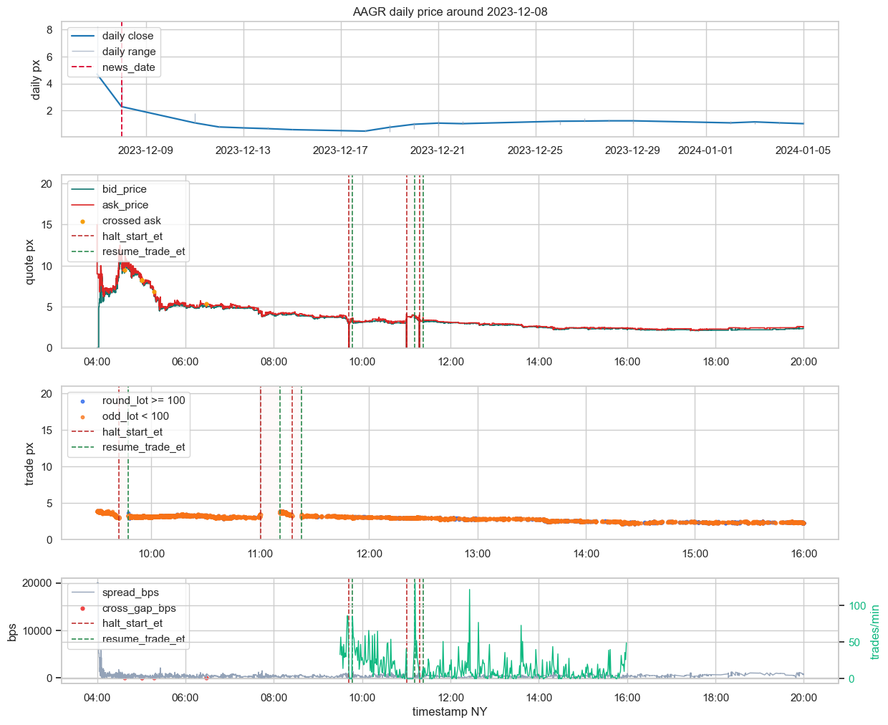
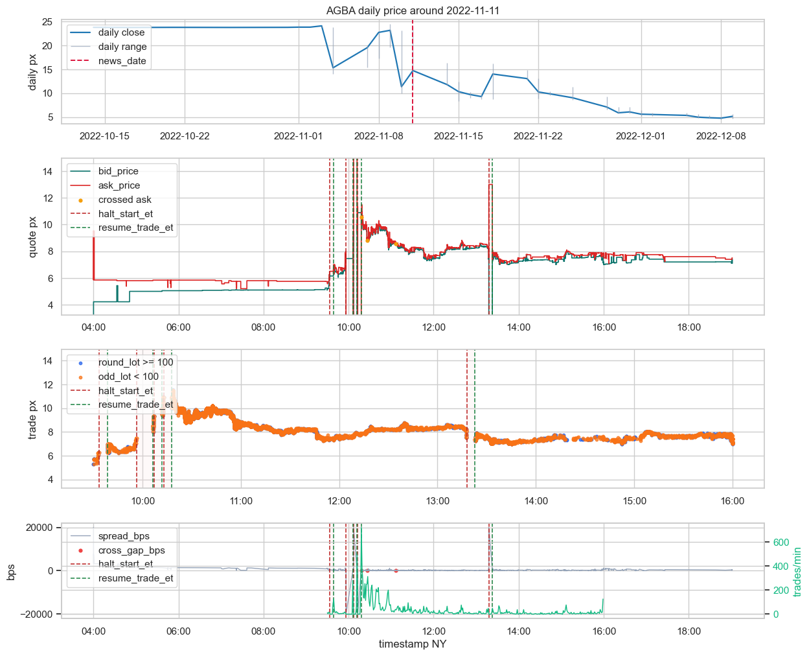
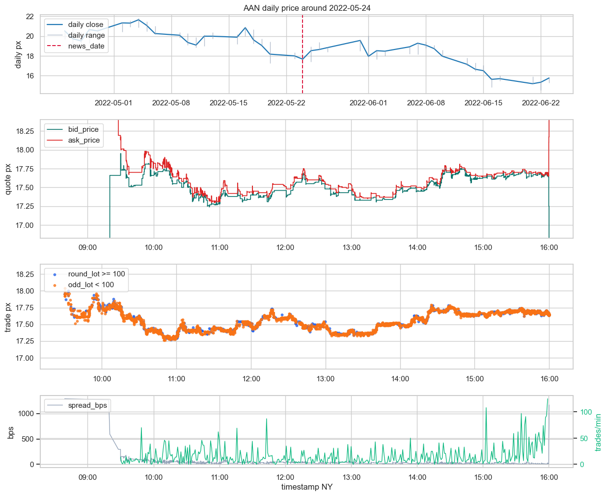
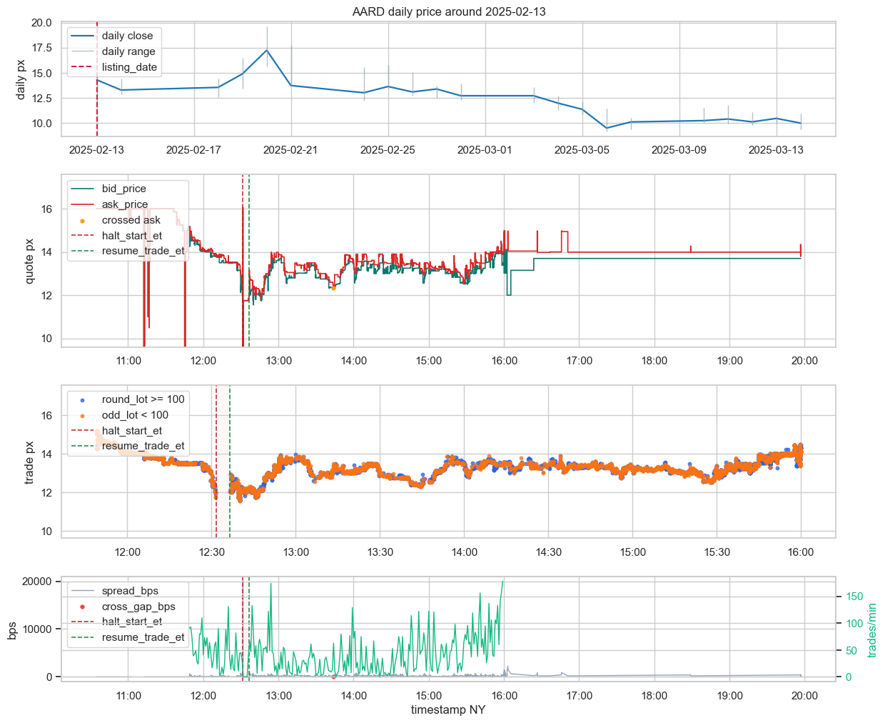
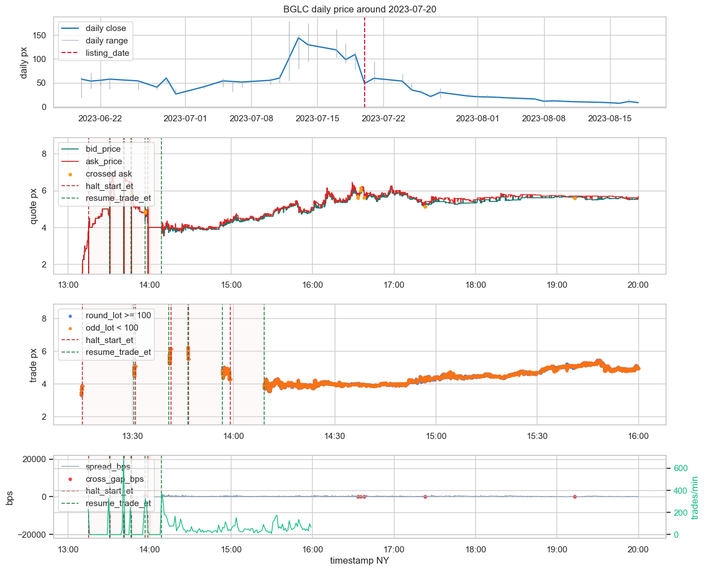
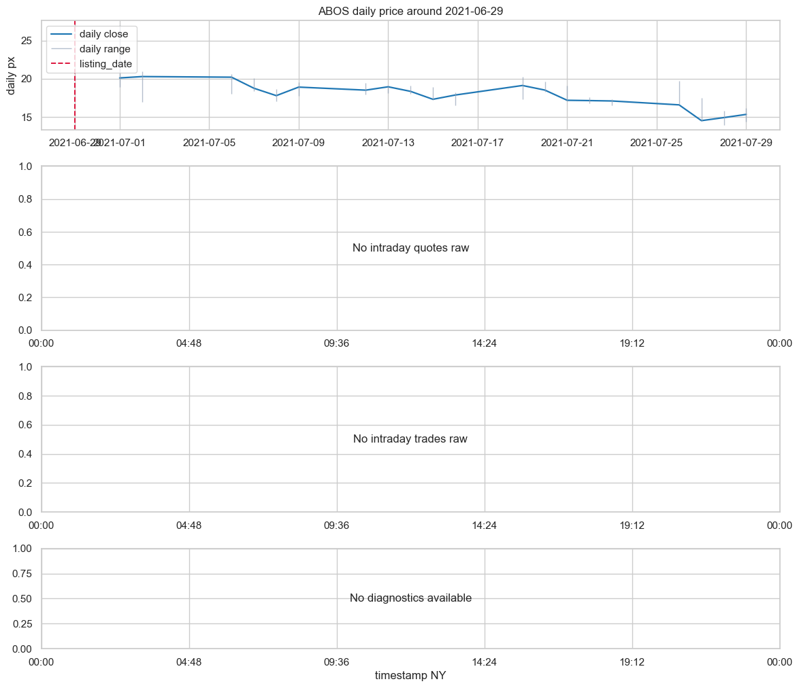

# Additional Causal Overlay Closeout

## Estado

La capa causal de `additional` ya quedó materializada para los tres frentes que sí aportan valor real:

- `news`
- `ipos`
- `corporate_actions_additional -> reference`

Artefactos principales:

- `additional_news_event_index.parquet`
- `additional_news_market_link_candidates.parquet`
- `additional_news_link_summary.parquet`
- `additional_ipo_event_index.parquet`
- `additional_ipo_market_link_candidates.parquet`
- `additional_ipo_link_summary.parquet`
- `additional_corp_actions_reference_overlap.parquet`
- `additional_corp_actions_reference_overlap_summary.parquet`

Además quedó integrado un viewer causal que ya cruza:

- `daily`
- `quotes`
- `trades`
- `halts`

Y, para `news`, ahora también marca la hora exacta de publicación `published_ny` dentro del intradía.

## Lectura causal de `news`

Total normalizado:

- `287,138` `news_event`
- `3,869` tickers con noticias no vacías

Hallazgo estructural:

- solo `36.38%` de los eventos son mono-ticker
- el ruido multi-ticker es dominante

Buckets observados:

- `review_multi_ticker_ambiguous_news = 169,154`
- `news_near_market_anomaly = 98,400`
- `news_context_only = 18,296`
- `news_near_halt_market_event = 1,268`
- `news_near_short_flow_only = 20`

### Interpretación

`news` no funciona como verdad del evento. Funciona como capa contextual y, en un subconjunto claro, como acompañamiento causal defendible.

La familia más fuerte es:

- `news_near_halt_market_event`

Porque ahí se alinean cuatro cosas:

- noticia mono-ticker
- día de mercado relevante
- halt real
- y reacción visible en `quotes/trades`

En cambio:

- `review_multi_ticker_ambiguous_news` queda contaminado estructuralmente
- `news_near_market_anomaly` contiene señal real, pero mezcla explicación con coincidencia temporal
- `news_context_only` es informativo, no causal

### Calibración manual

**Casos `good`**

- `AAGR | 2023-12-08`
  - noticia en jornada con distress visible y múltiples halts
  - la noticia acompaña un episodio de mercado real, no solo una coincidencia de calendario

- `AGBA | 2022-11-11`
  - caída diaria fuerte, halts múltiples y reacción intradía muy clara
  - el enlace `news -> halt -> market event` es defendible

**Casos `review`**

- `AAN | 2022-05-24`
  - noticia same-day, pero mercado bastante limpio
  - sirve como contexto, no como detonante claro

- `EAC | 2023-03-27`
  - daily casi plano, quotes pobres y trades casi inexistentes
  - la noticia no cierra una historia causal fuerte

### Evidencia visual

**`AAGR | 2023-12-08 | news_near_halt_market_event`**

**`AGBA | 2022-11-11 | news_near_halt_market_event`**

**`AAN | 2022-05-24 | news_near_market_anomaly`**

## Lectura causal de `ipos`

Buckets observados:

- `ipo_near_market_anomaly = 676`
- `ipo_market_clean = 449`
- `ipo_near_halt_market_event = 156`

### Interpretación

`ipos` sí aporta contexto causal/contextual útil, pero solo en subfamilias concretas.

La parte más valiosa es:

- `ipo_near_halt_market_event`

Ahí el listing reciente sí ayuda a explicar early-life fragility, volatilidad y halts de arranque.

En cambio:

- `ipo_near_market_anomaly` es una familia mixta
- `ipo_market_clean` es contexto estructural, no señal causal fuerte

### Calibración manual

**Casos `good`**

- `AARD | 2025-02-13`
  - debut con halt y respuesta intradía visible en `quotes` y `trades`

- `BGLC | 2023-07-20`
  - secuencia de halts muy marcada y mercado frágil durante la ventana del IPO

- `SKK | 2024-10-08`
  - early-life con múltiples interrupciones y microestructura claramente rota

**Casos `review`**

- `ABOS | 2021-06-29`
  - no hay raw intradía; solo daily
  - útil como contexto, no como evidencia causal

- `AGL | 2021-04-15`
  - mercado bastante ordenado, sin halt y sin narrativa causal fuerte

- `ABGI | 2021-02-17`
  - señal leve y mercado relativamente limpio

### Evidencia visual

**`AARD | 2025-02-13 | ipo_near_halt_market_event`**

**`BGLC | 2023-07-20 | ipo_near_halt_market_event`**

**`ABOS | 2021-06-29 | ipo_market_clean`**

## Solape `corporate_actions_additional -> reference`

Resumen:

- `dividends`
  - `reference_exact_overlap = 1253`
  - `reference_present_no_exact_overlap = 5`
- `splits`
  - `reference_exact_overlap = 1858`
  - `reference_present_no_exact_overlap = 18`
- `ticker_events`
  - `reference_present_no_exact_overlap = 2703`

Lectura:

- `dividends` y `splits` en `additional` son casi totalmente redundantes con `reference`
- sirven como confirmación secundaria, no como capa causal nueva fuerte
- `ticker_events` no está suficientemente alineado en taxonomy/normalización como para desplazar a `reference`

Esto deja a `corporate_actions_additional` en `review` estructural y causal.

## Política causal final del bloque

### `good`

- `news_near_halt_market_event`
- `ipo_near_halt_market_event`

### `review`

- `news_near_market_anomaly`
- `review_multi_ticker_ambiguous_news`
- `news_context_only`
- `ipo_near_market_anomaly`
- `ipo_market_clean`
- `corporate_actions_additional`

### `bad`

No emerge una familia agregada `bad`.

## Conclusión

La jerarquía causal real dentro de `additional` queda así:

1. `news` es el subbloque causal más fuerte
2. `ipos` aporta valor real en early-life y halts cercanos
3. `corporate_actions_additional` queda como capa secundaria frente a `reference`

La mejora clave respecto a la primera versión del viewer es que `news` ya no se lee solo por día, sino también por la hora exacta de publicación `published_ny`, lo que permite separar:

- reacción posterior real
- de mercado ya desordenado antes de la noticia
