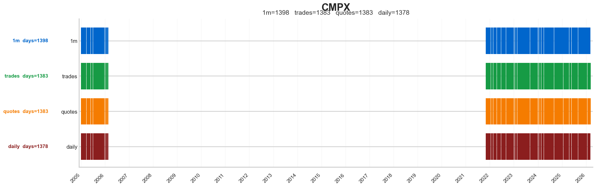
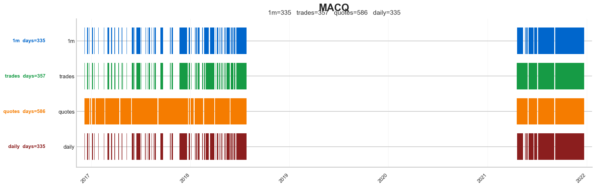

## Diseño de implementación `daily v2`

### Objetivo

Traducir el contrato de `daily` a una implementación v2 concreta, reproducible y paralela, sin backend legacy.

Artefactos objetivo:

- `050_daily_v2_validate_file.py`
- `051_daily_v2_inventory.py`
- `052_daily_v2_validate_batches.py`
- `053_daily_v2_materialize_current.py`

---

## 1. Unidad lógica y claves

### Unidad física

- un parquet anual:
  - `day_aggs_{ticker}_{year}.parquet`

### Unidad lógica

- `task_key = ticker|year`

### Claves mínimas

- `file`
- `task_key`
- `ticker`
- `year`

---

## 2. `051_daily_v2_inventory.py`

### Función

Recorrer roots físicos de `daily`, encontrar todos los `day_aggs_*.parquet`, derivar metadata estructural y persistir inventario incremental.

### Inputs

- `--c-root`
- `--d-root`
- `--outdir`
- `--batch-size`
- `--resume`
- opcional:
  - `--limit-per-root`

### Pattern esperado

Detectar paths tipo:

- `ticker={TICKER}\year={YYYY}\day_aggs_{TICKER}_{YYYY}.parquet`

### Columnas de `daily_inventory_files`

- `root`
- `root_path`
- `file`
- `relpath`
- `ticker`
- `year`
- `filename_ticker`
- `filename_year`
- `task_key`
- `size_bytes`
- `mtime_utc`
- `inventory_seen_utc`

### Persistencia incremental

Debe escribir:

- `inventory_batches\inventory_batch_000001.parquet`
- `inventory_batches\inventory_batch_000002.parquet`
- ...

Y mantener:

- `inventory_checkpoint.json`
- `inventory_run_manifest.json`

### Outputs finales

- `daily_inventory_files.parquet`
- `daily_inventory_files.csv`
- `daily_inventory_by_ticker.parquet`
- `daily_inventory_by_ticker.csv`
- `daily_inventory_summary.json`

### Checks mínimos del summary

- rows por root
- tickers por root
- years min/max por root
- bytes totales
- `all_rows`
- `all_tickers`

---

## 3. `050_daily_v2_validate_file.py`

### Función

Validar un solo `day_aggs_*.parquet` y devolver un evento estructurado.

### Inputs

- `--file`
- `--expected-root`
- `--run-id`
- `--batch-id`
- `--scan-reason`
- `--validation-kind`
- `--out-json`

Y parámetros de tolerancia:

- `--min-expected-price`
- `--min-coverage-ratio-warn`
- `--max-gap-days-warn`

### Capas de validación

#### Física

- file existe
- no 0 bytes
- `ParquetFile.read()` funciona

#### Estructural

- intentar `read_table(...)`
- si falla:
  - registrar:
    - `dataset_read_incompatible_schema`
    - `dataset_read_error`

#### Partición

Derivar y validar:

- `ticker_path`
- `year_path`
- `filename_ticker`
- `filename_year`

#### Schema

Columnas mínimas:

- `ticker`
- `date`
- `year`
- `o`
- `h`
- `l`
- `c`
- `v`
- `vw`
- `n`
- `t`

#### Contenido

- rows > 0
- parseo de `date`
- ticker único
- year único
- sin `date` duplicadas
- fechas dentro del año

#### OHLCV

- `o/h/l/c > 0`
- `v >= 0`
- `h >= max(o,c,l)`
- `l <= min(o,c,h)`
- `vw` dentro de rango cuando `v > 0`

#### Continuidad

Calcular:

- `date_min`
- `date_max`
- `rows_after_parse`
- `business_days_covered_est`
- `coverage_ratio_vs_business_days`
- `max_gap_days`

### Issues sugeridos

- `file_missing`
- `zero_byte_file`
- `parquet_unreadable`
- `invalid_partition_path`
- `partition_vs_filename_ticker_mismatch`
- `partition_vs_filename_year_mismatch`
- `partition_vs_column_ticker_mismatch`
- `partition_vs_column_year_mismatch`
- `missing_required_columns`
- `zero_rows`
- `all_rows_invalid_after_parse`
- `multiple_tickers_in_file`
- `multiple_years_in_file`
- `duplicate_dates_in_file`
- `date_out_of_partition_year`
- `negative_or_zero_ohlc_rows`
- `negative_volume_rows`
- `high_low_inversion_rows`
- `vw_outside_range_rows`

### Warns sugeridos

- `dtype_mismatch`
- `dataset_read_incompatible_schema`
- `schema_merge_conflict_ticker_encoding`
- `suspicious_sparse_year`
- `large_internal_gap_days`
- `rows_lt_10`

### Salida por file

- `file`
- `ticker`
- `year`
- `rows`
- `severity`
- `issues`
- `warns`
- `action`
- `metrics_json`
- `validator_version`
- `processed_at_utc`
- `run_id`
- `batch_id`
- `scan_reason`
- `validation_kind`

### Acción derivada

- `HARD_FAIL -> quarantine_and_retry`
- `SOFT_FAIL -> review_queue`
- `PASS -> accept_raw`

---

## 4. `052_daily_v2_validate_batches.py`

### Función

Leer `daily_inventory_files.parquet`, filtrar el universo objetivo, trocearlo en batches y validar en paralelo vía `050`.

### Inputs

- `--inventory-parquet`
- `--outdir`
- `--run-id`
- `--workers`
- `--chunk-size`
- `--root`
- `--ticker`
- `--year-from`
- `--year-to`
- `--limit`
- `--scan-reason`
- `--validation-kind`
- `--resume`

### Filtrado lógico

Permitir:

- por root
- por ticker
- por rango de años
- por límite de files

### Ejecución

1. leer inventario
2. filtrar
3. trocear en batches
4. ejecutar validación en paralelo
5. persistir cada batch como append-only
6. actualizar checkpoint y manifest

### Persistencia

- `events_batches\batch_000001.parquet`
- ...
- `validation_checkpoint.json`
- `validation_run_manifest.json`
- `batch_manifest_daily_v2.csv`
- `batch_manifest_daily_v2.parquet`
- `validation_run_summary.json`

### Campos mínimos de `batch_manifest`

- `batch_id`
- `files_selected`
- `events_written`
- `started_at_utc`
- `finished_at_utc`
- `severity_counts_json`

---

## 5. `053_daily_v2_materialize_current.py`

### Función

Leer solo batches confirmados por checkpoint/manifest, reconstruir el estado actual y exportar vistas contractuales.

### Inputs

- `--validation-outdir`
- `--inventory-parquet`
- `--run-id`

### Derivaciones

#### `daily_current`

- último evento por `file`

#### `retry_current`

- files con `severity != PASS`

#### `retry_frozen`

- inicialmente vacío
- reservado para política posterior

### Enriquecimiento desde inventario

Añadir:

- `root`
- `task_key`
- `present_in_c`
- `present_in_d`
- `present_in_both`

### Outputs finales

- `daily_current.parquet`
- `daily_current.csv`
- `retry_current.parquet`
- `retry_current.csv`
- `retry_frozen.parquet`
- `retry_frozen.csv`
- `daily_agent_strict_events_current.csv`
- `retry_queue_daily_strict_current.csv`
- `retry_frozen_daily_strict.csv`
- `live_status_daily_strict.json`
- `materialization_summary.json`

### `live_status_daily_strict.json`

Debe incluir:

- `materialization_utc`
- `backend_mode`
- `current_materialized_from`
- `retry_materialized_from`
- `validation_checkpoint_source`
- `validation_manifest_source`
- `validation_completion_status`
- `materialization_scope`

---

## 6. Severidad y semántica

### HARD_FAIL

Reservar para:

- no legible
- schema roto
- partición incoherente
- fechas inviable
- OHLC imposible

### SOFT_FAIL

Reservar para:

- dtype mismatch
- incompatibilidad dataset-style
- sparse year
- gaps grandes

### PASS

Sin issues ni warns.

---

## 7. Smoke recomendado

No empezar con full.

### Smoke 1

- root `D`
- 2 o 3 tickers concretos
- varios años

Objetivo:

- confirmar contrato de lectura
- confirmar anomalía `read_table vs ParquetFile`
- confirmar clasificación de schema/partición

### Smoke 2

- root `D`
- rango acotado de años
- `limit 1000` o `5000`

Objetivo:

- distribución de severidades
- top issues
- top warnings

---

## 8. Notebook Agent03 Daily

Debe permitir:

- top causas de `HARD_FAIL`
- top warnings
- heatmap issue x batch
- tickers más afectados
- años más afectados
- casos con:
  - `dataset_read_incompatible_schema`
  - `duplicate_dates_in_file`
  - `high_low_inversion_rows`
  - `suspicious_sparse_year`

Y debe poder abrir casos concretos por:

- issue
- ticker
- year
- file

---

## 9. Criterio de cierre de la rama Daily

La rama `daily` se considerará suficientemente madura cuando podamos afirmar:

1. el universo físico está inventariado
2. la anomalía de schema estructural está cuantificada
3. la mayoría de `HARD_FAIL` se explican por causas defendibles
4. Agent03 puede inspeccionar casos concretos con trazabilidad exacta
5. la salida es utilizable después para reinterpretar `trades`

---

## 10. En una frase

`daily v2` debe auditar a la vez:

- el parquet anual como objeto físico
- y la barra OHLCV diaria como objeto económico.


---

# 11. Ejecutamos implementacion

### 11.1. Inventario completo baseline

Objetivo:
Construir el inventario fisico completo del universo `daily`, una fila por file logico `ticker|year`.

Script:
```sh
C:\TSIS_Data\02_backtest_SmallCaps\data_auditoria_polygon\cell_code\00_data_certification\051_daily_v2_inventory.py
```

Que hace
```text
- recorre las raices de daily disponibles
- detecta files day_aggs_{ticker}_{year}.parquet
- extrae metadata de particion y filename
- persiste inventory_batches, checkpoint y manifest
- consolida daily_inventory_files y daily_inventory_by_ticker
```

Input
```text
  D:\ohlcv_daily
```

Output
```text
- daily_inventory_files.parquet
- daily_inventory_files.csv
- daily_inventory_by_ticker.parquet
- daily_inventory_by_ticker.csv
- daily_inventory_summary.json
- inventory_checkpoint.json
- inventory_run_manifest.json
- inventory_batches\inventory_batch_*.parquet
```

Lanzadera
```sh
python C:\TSIS_Data\02_backtest_SmallCaps\data_auditoria_polygon\cell_code\00_data_certification\051_daily_v2_inventory.py --d-root D:\ohlcv_daily --c-root C:\TSIS_Data\data\ohlcv_daily --outdir C:\TSIS_Data\02_backtest_SmallCaps\runs\backtest\daily_v2_inventory\daily_inventory_full --resume
```

### 11.2. Verificacion del inventario baseline

Objetivo:
Verificar que el inventario construido es consistente antes de validar el universo.

Script:
```sh
C:\TSIS_Data\02_backtest_SmallCaps\data_auditoria_polygon\cell_code\00_data_certification\054_daily_v2_verify_inventory.py
```

Que hace
```text
- comprueba existencia de artefactos obligatorios
- valida conteos entre parquet, summary, checkpoint y batches
- valida columnas esperadas
- revisa nulos en file, ticker y task_key
- revisa coherencia filename vs particion
- deja PASS/FAIL con checks detallados
```

Input
```text
- outdir del inventario daily
```

Output
```text
- JSON de verificacion en stdout
- opcionalmente un out-json si se pasa por parametro
```

Lanzadera
```sh
python C:\TSIS_Data\02_backtest_SmallCaps\data_auditoria_polygon\cell_code\00_data_certification\054_daily_v2_verify_inventory.py --outdir C:\TSIS_Data\02_backtest_SmallCaps\runs\backtest\daily_v2_inventory\daily_inventory_full
```

### 11.3. Smoke de validacion baseline

Objetivo:
Validar una muestra controlada del universo `daily` para entender la distribucion real de `PASS / SOFT_FAIL / HARD_FAIL`.

Script:
```sh
C:\TSIS_Data\02_backtest_SmallCaps\data_auditoria_polygon\cell_code\00_data_certification\052_daily_v2_validate_batches.py
```

Que hace
```text
- lee daily_inventory_files.parquet
- filtra por root y rango temporal
- selecciona una muestra de files
- valida cada file con 050_daily_v2_validate_file.py
- persiste events_batches, checkpoint, manifest y summary
```

Input
```text
- inventory_parquet
- filtros:
  - root
  - year_from
  - year_to
  - limit
- thresholds del validador
```

Output
```text
- events_batches\batch_*.parquet
- validation_checkpoint.json
- validation_run_manifest.json
- batch_manifest_daily_v2.csv
- batch_manifest_daily_v2.parquet
- validation_run_summary.json
```

Lanzadera
```sh
python C:\TSIS_Data\02_backtest_SmallCaps\data_auditoria_polygon\cell_code\00_data_certification\052_daily_v2_validate_batches.py --inventory-parquet C:\TSIS_Data\02_backtest_SmallCaps\runs\backtest\daily_v2_inventory\daily_inventory_full\daily_inventory_files.parquet --outdir C:\TSIS_Data\02_backtest_SmallCaps\runs\backtest\daily_v2_validation\daily_validate_smoke --run-id daily_validate_smoke --workers 1 --chunk-size 500 --root D --year-from 2024 --year-to 2026 --limit 5000 --scan-reason rescan_all --validation-kind normal_validation --resume
```

### 11.4. Materializacion baseline

Objetivo:
Materializar el snapshot actual del smoke baseline para poder auditarlo en notebook.

Script:
```sh
C:\TSIS_Data\02_backtest_SmallCaps\data_auditoria_polygon\cell_code\00_data_certification\053_daily_v2_materialize_current.py
```

Que hace
```text
- lee events_batches confirmados
- reconstruye el estado current por file
- genera retry_current y retry_frozen
- escribe live_status y summary de materializacion
```

Input
```text
- validation_outdir del smoke
- inventory_parquet del universo
- run_id
```

Output
```text
- daily_current.parquet
- daily_current.csv
- retry_current.parquet
- retry_current.csv
- retry_frozen.parquet
- retry_frozen.csv
- daily_agent_strict_events_current.csv
- retry_queue_daily_strict_current.csv
- retry_frozen_daily_strict.csv
- live_status_daily_strict.json
- materialization_summary.json
```

Lanzadera
```sh
python C:\TSIS_Data\02_backtest_SmallCaps\data_auditoria_polygon\cell_code\00_data_certification\053_daily_v2_materialize_current.py --validation-outdir C:\TSIS_Data\02_backtest_SmallCaps\runs\backtest\daily_v2_validation\daily_validate_smoke --inventory-parquet C:\TSIS_Data\02_backtest_SmallCaps\runs\backtest\daily_v2_inventory\daily_inventory_full\daily_inventory_files.parquet --run-id daily_validate_smoke
```

### 11.5. Smoke de validacion v020

Objetivo:
Repetir exactamente el mismo smoke, pero usando el validador `v020` instrumentado para abrir `vw_outside_range_rows` con metricas milimetricas.

Script:
```sh
C:\TSIS_Data\02_backtest_SmallCaps\data_auditoria_polygon\cell_code\00_data_certification\052_daily_v2_validate_batches_v020.py
```

Que hace
```text
- lee el mismo inventario baseline
- selecciona el mismo universo del smoke
- valida con 050_daily_v2_validate_file_v020.py
- no cambia aun severidades
- a?ade metricas detalladas de:
  - vw_below_low_rows
  - vw_above_high_rows
  - vw_outside_range_ratio_pct
  - vw_problem_days
  - magnitud absoluta y relativa
  - top rows
  - top dates
```

Input
```text
- inventory_parquet
- mismos filtros del smoke baseline
```

Output
```text
- events_batches\batch_*.parquet
- validation_checkpoint.json
- validation_run_manifest.json
- batch_manifest_daily_v2.csv
- batch_manifest_daily_v2.parquet
- validation_run_summary.json
```

Lanzadera
```sh
python C:\TSIS_Data\02_backtest_SmallCaps\data_auditoria_polygon\cell_code\00_data_certification\052_daily_v2_validate_batches_v020.py --inventory-parquet C:\TSIS_Data\02_backtest_SmallCaps\runs\backtest\daily_v2_inventory\daily_inventory_full\daily_inventory_files.parquet --outdir C:\TSIS_Data\02_backtest_SmallCaps\runs\backtest\daily_v2_validation\daily_validate_smoke_v020 --run-id daily_validate_smoke_v020 --workers 1 --chunk-size 500 --root D --year-from 2024 --year-to 2026 --limit 5000 --scan-reason rescan_all --validation-kind normal_validation --resume
```

### Conclusiones que motivan `v020`

Este smoke no se lanzó para cambiar todavía la severidad, sino para abrir técnicamente la caja negra del issue
dominante detectado en la baseline: `vw_outside_range_rows`.

En la baseline habíamos observado:

- `SOFT_FAIL = 3284`
- `HARD_FAIL = 1716`
- `PASS = 0`

y, dentro del `HARD_FAIL`, una concentración casi total en:

- `vw_outside_range_rows`

Eso nos llevó a una conclusión clara: el problema ya no era genérico ni disperso, sino que estaba absorbido casi por
completo por una sola regla demasiado opaca. En ese punto no teníamos todavía suficiente granularidad para saber si
estábamos viendo:

- incoherencias leves y aisladas
- incoherencias materiales
- años incompletos contaminando la señal
- problemas sistemáticos del campo `vw`
- o una mezcla de varios subtipos distintos

Por eso se creó la línea paralela `v020`, sin tocar la baseline reproducible.

#### Objetivo técnico de `v020`

`v020` no nace para reclasificar todavía, sino para medir el problema con precisión milimétrica y convertir
`vw_outside_range_rows` en un fenómeno auditable.

La nueva versión instrumenta, por file, métricas adicionales como:

- cuántas filas caen en `vw < l`
- cuántas filas caen en `vw > h`
- ratio de filas afectadas sobre el total
- número de días problemáticos
- magnitud absoluta del exceso
- magnitud relativa respecto al rango diario
- magnitud relativa respecto al propio `vw`
- fechas más afectadas
- ejemplos extremos por severidad

#### Hipótesis que queríamos comprobar con `v020`

Con `v020` buscábamos responder preguntas que la baseline no podía responder:

- si el problema típico afectaba a todo el año o solo a unas pocas filas
- si el desvío era pequeño o material
- si dominaba `vw` por encima de `h` o por debajo de `l`
- si `2026` estaba especialmente contaminado por baja cobertura
- si había una sola población de fallos o varias poblaciones mezcladas

#### Resultado esperado de esta lanzadera

El resultado esperado de `daily_validate_smoke_v020` era:

1. mantener exactamente la misma severidad que la baseline, para preservar comparabilidad
2. enriquecer `metrics_json` con anatomía detallada del problema
3. permitir que el notebook único de auditoría pudiera abrir `vw_outside_range_rows` con trazabilidad real y no solo
con conteos agregados

#### Decisión metodológica

La creación de `v020` responde a una decisión metodológica importante:

- no modificar reglas de severidad a ciegas
- primero medir el problema con precisión
- después separar casos menores, materiales y severos
- y solo entonces plantear una futura iteración de contrato como `v030`

### 11.6. Materializacion v020

Objetivo:
Materializar el smoke `v020` para explotar en el notebook las metricas nuevas de `vw_outside_range_rows`.

Script:
```sh
C:\TSIS_Data\02_backtest_SmallCaps\data_auditoria_polygon\cell_code\00_data_certification\053_daily_v2_materialize_current_v020.py
```

Que hace
```text
- reconstruye daily_current del smoke v020
- mantiene current, retry y live_status
- ademas parsea mejor issues/warns serializados raros
```

Input
```text
- validation_outdir del smoke v020
- inventory_parquet baseline
- run_id
```

Output
```text
- daily_current.parquet
- daily_current.csv
- retry_current.parquet
- retry_current.csv
- retry_frozen.parquet
- retry_frozen.csv
- daily_agent_strict_events_current.csv
- retry_queue_daily_strict_current.csv
- retry_frozen_daily_strict.csv
- live_status_daily_strict.json
- materialization_summary.json
```

Lanzadera
```sh
python C:\TSIS_Data\02_backtest_SmallCaps\data_auditoria_polygon\cell_code\00_data_certification\053_daily_v2_materialize_current_v020.py --validation-outdir C:\TSIS_Data\02_backtest_SmallCaps\runs\backtest\daily_v2_validation\daily_validate_smoke_v020 --inventory-parquet C:\TSIS_Data\02_backtest_SmallCaps\runs\backtest\daily_v2_inventory\daily_inventory_full\daily_inventory_files.parquet --run-id daily_validate_smoke_v020
```

### 11.7. Ejecucion del notebook de auditoria

Objetivo:
Ejecutar el notebook unico de auditoria `daily` contra los runs baseline y `v020` para leer granularidad de `HARD_FAIL`, `SOFT_FAIL` y la anatomia de `vw_outside_range_rows`.

Script:
```sh
C:\TSIS_Data\02_backtest_SmallCaps\notebooks\00_data_certification\auditoria\daily\03_daily_root_cause_audit_notebook.ipynb
```

Que hace
```text
- lee daily_current baseline
- lee daily_current v020
- analiza severidades, issues y warns
- abre la granularidad de vw_outside_range_rows
- compara baseline vs v020 sin cambiar severidades
```

Input
```text
- run baseline:
  C:\TSIS_Data\02_backtest_SmallCaps\runs\backtest\daily_v2_validation\daily_validate_smoke
- run v020:
  C:\TSIS_Data\02_backtest_SmallCaps\runs\backtest\daily_v2_validation\daily_validate_smoke_v020
- inventory baseline:
  C:\TSIS_Data\02_backtest_SmallCaps\runs\backtest\daily_v2_inventory\daily_inventory_full\daily_inventory_files.parquet
```

Output
```text
- notebook ejecutado con outputs persistidos
- tablas y graficos de:
  - HARD_FAIL
  - SOFT_FAIL
  - vw_outside_range_rows
  - comparativa baseline vs v020
```

Lanzadera
```sh
python - <<'PY'
import nbformat
from pathlib import Path
from nbclient import NotebookClient

p = Path(r"C:\TSIS_Data\02_backtest_SmallCaps\notebooks\00_data_certification\auditoria\daily\03_daily_root_cause_audit_notebook.ipynb")
nb = nbformat.read(p, as_version=4)
client = NotebookClient(nb, timeout=1200, kernel_name="python3", resources={"metadata": {"path": str(p.parent)}})
client.execute()
nbformat.write(nb, p)
print(p)
PY
```

### 11.8. Smoke minimo tecnico de 051

Objetivo:
Comprobar rapidamente que `051_daily_v2_inventory.py` genera estructura correcta antes de lanzar el inventario completo.

Script:
```sh
C:\TSIS_Data\02_backtest_SmallCaps\data_auditoria_polygon\cell_code\00_data_certification\051_daily_v2_inventory.py
```

Que hace
```text
- recorre solo unos pocos files
- genera un mini inventario de prueba
- confirma que salgan parquet, csv, summary, checkpoint y manifest
```

Input
```text
- d-root
- c-root ficticia o ausente
- limit-per-root
- outdir de prueba
```

Output
```text
- mini inventario smoke
```

Lanzadera
```sh
python C:\TSIS_Data\02_backtest_SmallCaps\data_auditoria_polygon\cell_code\00_data_certification\051_daily_v2_inventory.py --d-root D:\ohlcv_daily --c-root C:\__missing_daily_root__ --limit-per-root 3 --outdir C:\Users\AlexJ\daily_v2_inventory_smoke
```

### 11.9. Smoke minimo tecnico de 052

Objetivo:
Comprobar que `052_daily_v2_validate_batches.py` escribe batches, manifest y summary sobre un inventario minimo.

Script:
```sh
C:\TSIS_Data\02_backtest_SmallCaps\data_auditoria_polygon\cell_code\00_data_certification\052_daily_v2_validate_batches.py
```

Que hace
```text
- valida 3 files de prueba
- persiste batches y summary
- comprueba el circuito batch append-only
```

Input
```text
- inventory smoke
- outdir smoke
- filtros minimos
```

Output
```text
- validation smoke minimo
```

Lanzadera
```sh
python C:\TSIS_Data\02_backtest_SmallCaps\data_auditoria_polygon\cell_code\00_data_certification\052_daily_v2_validate_batches.py --inventory-parquet C:\Users\AlexJ\daily_v2_inventory_smoke\daily_inventory_files.parquet --outdir C:\Users\AlexJ\daily_v2_validation_smoke --run-id daily_v2_smoke --workers 1 --chunk-size 2 --root D --year-from 2005 --year-to 2007 --limit 3
```

### 11.10. Smoke minimo tecnico de 053

Objetivo:
Comprobar que `053_daily_v2_materialize_current.py` reconstruye current/retry/live sobre el smoke minimo.

Script:
```sh
C:\TSIS_Data\02_backtest_SmallCaps\data_auditoria_polygon\cell_code\00_data_certification\053_daily_v2_materialize_current.py
```

Que hace
```text
- lee los batches minimos
- reconstruye current
- genera retry y live_status
```

Input
```text
- validation smoke minimo
- inventory smoke minimo
```

Output
```text
- materializacion smoke minima
```

Lanzadera
```sh
python C:\TSIS_Data\02_backtest_SmallCaps\data_auditoria_polygon\cell_code\00_data_certification\053_daily_v2_materialize_current.py --validation-outdir C:\Users\AlexJ\daily_v2_validation_smoke --inventory-parquet C:\Users\AlexJ\daily_v2_inventory_smoke\daily_inventory_files.parquet --run-id daily_v2_smoke
```

### 11.11. Verify del inventario smoke minimo

Objetivo:
Validar que el mini inventario smoke tambien es consistente.

Script:
```sh
C:\TSIS_Data\02_backtest_SmallCaps\data_auditoria_polygon\cell_code\00_data_certification\054_daily_v2_verify_inventory.py
```

Que hace
```text
- corre los checks de consistencia del inventario smoke
```

Input
```text
- outdir del inventario smoke
```

Output
```text
- PASS/FAIL con checks
```

Lanzadera
```sh
python C:\TSIS_Data\02_backtest_SmallCaps\data_auditoria_polygon\cell_code\00_data_certification\054_daily_v2_verify_inventory.py --outdir C:\Users\AlexJ\daily_v2_inventory_smoke
```


# v030

## Smoke v030 validate

Objetivo:
Ejecutar el smoke de validación daily v030 sobre la misma muestra 2024-2026 para comparar contra baseline y v020.

Script:
```
C:\TSIS_Data\02_backtest_SmallCaps\data_auditoria_polygon\cell_code\00_data_certification\052_daily_v2_validate_batches_v030.py
```
Qué hace
```
- lee el inventario baseline de daily
- filtra root D, years 2024-2026, limit 5000
- valida cada file con 050_daily_v2_validate_file_v030.py
- aplica la nueva semántica:
  - vw_outside_range_minor
  - vw_outside_range_material
  - vw_outside_range_severe
- escribe batches, checkpoint, manifest y summary
```
Input
```
- inventory_parquet:
  C:\TSIS_Data\02_backtest_SmallCaps\runs\backtest\daily_v2_inventory\daily_inventory_full\daily_inventory_files.parquet
- filtros:
  - root = D
  - year_from = 2024
  - year_to = 2026
  - limit = 5000
```
Output
```
- C:\TSIS_Data\02_backtest_SmallCaps\runs\backtest\daily_v2_validation\daily_validate_smoke_v030\events_batches\batch_*.parquet
- validation_checkpoint.json
- validation_run_manifest.json
- batch_manifest_daily_v2.csv
- batch_manifest_daily_v2.parquet
- validation_run_summary.json
```
Lanzadera
```sh
python C:\TSIS_Data\02_backtest_SmallCaps\data_auditoria_polygon\cell_code\00_data_certification\052_daily_v2_validate_batches_v030.py --inventory-parquet C:
\TSIS_Data\v1\backtest_SmallCaps\runs\backtest\daily_v2_inventory\daily_inventory_full\daily_inventory_files.parquet --outdir C:
\TSIS_Data\v1\backtest_SmallCaps\runs\backtest\daily_v2_validation\daily_validate_smoke_v030 --run-id daily_validate_smoke_v030 --workers 1
--chunk-size 500 --root D --year-from 2024 --year-to 2026 --limit 5000 --scan-reason rescan_all --validation-kind normal_validation --resume
```
## Smoke v030 materialize

Objetivo:
Materializar el snapshot current de daily v030 para auditarlo en el notebook único.

Script:
```
C:\TSIS_Data\02_backtest_SmallCaps\data_auditoria_polygon\cell_code\00_data_certification\053_daily_v2_materialize_current_v030.py
```
Qué hace
```
- lee los batches confirmados del smoke v030
- reconstruye daily_current
- genera retry_current y retry_frozen
- deja el run listo para ser consumido por el notebook de auditoría
```
Input

- validation_outdir:
  C:\TSIS_Data\02_backtest_SmallCaps\runs\backtest\daily_v2_validation\daily_validate_smoke_v030
- inventory_parquet:
  C:\TSIS_Data\02_backtest_SmallCaps\runs\backtest\daily_v2_inventory\daily_inventory_full\daily_inventory_files.parquet
- run_id:
  daily_validate_smoke_v030
```
Output
```
- daily_current.parquet
- daily_current.csv
- retry_current.parquet
- retry_current.csv
- retry_frozen.parquet
- retry_frozen.csv
- daily_agent_strict_events_current.csv
- retry_queue_daily_strict_current.csv
- retry_frozen_daily_strict.csv
- live_status_daily_strict.json
- materialization_summary.json
```
Lanzadera
```sh
python C:\TSIS_Data\02_backtest_SmallCaps\data_auditoria_polygon\cell_code\00_data_certification\053_daily_v2_materialize_current_v030.py --validation-outdir
C:\TSIS_Data\02_backtest_SmallCaps\runs\backtest\daily_v2_validation\daily_validate_smoke_v030 --inventory-parquet C:
\TSIS_Data\v1\backtest_SmallCaps\runs\backtest\daily_v2_inventory\daily_inventory_full\daily_inventory_files.parquet --run-id
daily_validate_smoke_v030
```

## Notebook daily con v030

Objetivo:
Ejecutar el notebook único daily para comparar baseline vs v020 vs v030 y abrir inspección visual file a file del peor subconjunto severe.

Script:
```
C:\TSIS_Data\02_backtest_SmallCaps\notebooks\00_data_certification\auditoria\daily\03_daily_root_cause_audit_notebook.ipynb
```
Qué hace
```
- lee daily_current baseline
- lee daily_current v020
- lee daily_current v030
- compara transiciones de severidad
- muestra subtipos minor/material/severe
- abre inspección visual file a file del peor subconjunto
```
Input
```
- C:\TSIS_Data\02_backtest_SmallCaps\runs\backtest\daily_v2_validation\daily_validate_smoke
- C:\TSIS_Data\02_backtest_SmallCaps\runs\backtest\daily_v2_validation\daily_validate_smoke_v020
- C:\TSIS_Data\02_backtest_SmallCaps\runs\backtest\daily_v2_validation\daily_validate_smoke_v030
```
Output
```
- notebook ejecutado con outputs persistidos
- comparativa v020 vs v030
```

## v030 ya está hecha y ejecutada.

```sh
- C:/TSIS_Data/02_backtest_SmallCaps/data_auditoria_polygon/cell_code/00_data_certification/050_daily_v2_validate_file_v030.py
- C:/TSIS_Data/02_backtest_SmallCaps/data_auditoria_polygon/cell_code/00_data_certification/051_daily_v2_inventory_v030.py
- C:/TSIS_Data/02_backtest_SmallCaps/data_auditoria_polygon/cell_code/00_data_certification/052_daily_v2_validate_batches_v030.py
- C:/TSIS_Data/02_backtest_SmallCaps/data_auditoria_polygon/cell_code/00_data_certification/053_daily_v2_materialize_current_v030.py
- C:/TSIS_Data/02_backtest_SmallCaps/data_auditoria_polygon/cell_code/00_data_certification/054_daily_v2_verify_inventory_v030.py
```

Qué cambia en v030:`

```
- vw_outside_range_rows deja de ser un HARD_FAIL binario.
- ahora se clasifica en:
    - minor
    - material
    - severe
- minor y material pasan a warning:
    - vw_outside_range_minor
    - vw_outside_range_material
- severe se mantiene duro:
    - vw_outside_range_severe
- además hay ajuste por cobertura baja para no tratar igual años muy incompletos.
```

Resultado del smoke v030:

```
- SOFT_FAIL = 4050
- HARD_FAIL = 950
```

Comparado con v020:
```

- HARD_FAIL: 1716 -> 950
- SOFT_FAIL: 3284 -> 4050
```

Transiciones:

```
- SOFT_FAIL -> SOFT_FAIL = 3284
- HARD_FAIL -> HARD_FAIL = 950
- HARD_FAIL -> SOFT_FAIL = 766
```

Subtipos en v030 dentro de vw_outside_range:

```
- severe = 943
- material = 631
- minor = 136
```

Lectura técnica:

```
- el recorte es fuerte y limpio
- el duro residual ya se concentra en el subconjunto severe
- material y minor salen del saco duro
```

Granularidad de subtipos:

```
- severe
    - median_ratio_pct = 2.80
    - median_problem_days = 5
    - median_coverage = 0.950
    - median_abs_max = 0.5766
- material
    - median_ratio_pct = 2.27
    - median_problem_days = 2
    - median_coverage = 0.3817
    - median_abs_max = 0.0738
- minor
    - median_ratio_pct = 0.40
    - median_problem_days = 1
    - median_coverage = 0.9598
    - median_abs_max = 0.0171
```

Eso ya dibuja bastante bien las tres poblaciones:

```
- minor: desvíos pequeños y muy localizados
- material: menos cobertura y magnitud contenida
- severe: casos realmente más defendibles para seguir duros
```

El notebook ya tiene también la inspección visual file a file del peor subconjunto, con selector por:

```
- Subtype
- Ticker
- Year
- Caso
```

y tres paneles:

```
- rango diario vs vw
- desvío absoluto
- top filas problemáticas
```

Siguiente paso razonable:

- leer juntos los primeros casos severe del widget
- y decidir si v030 ya es contrato aceptable o si quieres una v040 más quirúrgica.


### Ticker cae en minor, material o severe

Ahora mismo un file cae en minor, material o severe por las reglas que metimos en `050_daily_v2_validate_file_v030.py` sobre
`vw_outside_range_rows`.

Primero, la condición base:

```
- el file tiene que tener al menos una fila con:
    - v > 0
    - y vw < l o vw > h
```

Si no pasa eso:

- no entra en estos subtipos

A partir de ahí, miramos estas métricas del file:

```
- vw_outside_range_ratio_pct
    - porcentaje de filas afectadas sobre rows_after_parse

- vw_problem_days
    - número de fechas distintas afectadas

- coverage_ratio_vs_business_days
    - cobertura del año frente a business days esperados

- vw_outside_range_abs_max
    - desviación absoluta máxima fuera del rango

- vw_outside_range_pct_of_vw_max
    - desviación máxima como % del propio vw
```

**Resumen simple**

Un ticker-year está en:

```
- severe:
    - si el problema es claramente grande, persistente o muy desviado
- material:
    - si el problema existe de forma visible pero no extrema
- minor:
    - si el problema existe, pero es pequeño y localizado
```

### Cuándo cae en `severe`

Un file entra en severe si cumple al menos una de estas condiciones:

```
- vw_outside_range_ratio_pct >= 10
- vw_problem_days >= 10
- vw_outside_range_abs_max >= 1.0
- vw_outside_range_pct_of_vw_max >= 5.0
```

Es decir:

```
- o afecta a muchas filas
- o se reparte por muchos días
- o la desviación absoluta es grande
- o la desviación relativa frente al propio vw es grande
```

Pero además hay un ajuste por baja cobertura:

si el file entró en severe y además:

```
- coverage_ratio_vs_business_days < 0.50
- y vw_outside_range_abs_max < 1.0
- y vw_outside_range_pct_of_vw_max < 5.0
```

entonces se degrada y deja de ser severe.

Esto se hizo para evitar que años muy incompletos, sobre todo de 2026, entren como duros solo por ratio alto sobre una base pequeña.

### Cuándo cae en `material`

Si no es severe, pasa a material si cumple al menos una de estas:

```
- vw_outside_range_ratio_pct >= 1.0
- vw_problem_days >= 3
- vw_outside_range_abs_max >= 0.10
- vw_outside_range_pct_of_vw_max >= 1.0
```

O sea:

```
- ya no es extremo
- pero tampoco es un residuo trivial
- hay cierta persistencia o cierta magnitud
```

### Cuándo cae en minor

Si tiene `vw_outside_range_rows > 0` pero no entra ni en severe ni en material, cae en minor.

Eso significa, en la práctica:

```
- muy pocas filas
- pocos días
- poca magnitud
- poco impacto relativo
```


### Qué ve el notebook de estos tres grupos

Los resultados que salieron encajan bien con esas reglas:

```
- severe
    - más días problemáticos
    - mayor abs_max
    - cobertura normalmente mejor
    - o sea: casos más defendibles como duros

- material
    - menor magnitud
    - bastante más contaminación por cobertura baja
    - o sea: casos intermedios

- minor
    - 1 día o muy pocos
    - magnitud pequeña
    - o sea: ruido o anomalía leve
```

**Importante**

Esto clasifica el file a nivel:
```
- ticker | year
```

No a nivel de fila individual.

O sea:

```
- un solo año de un ticker puede ser severe
- y otro año del mismo ticker puede ser minor o material
```

Si quieres, te puedo dar ahora el bloque exacto en markdown para documentar esta lógica en el .md.


## Problemas hallados en `daily`, organizados por secciones

### 1. Estructura

Esta es la capa más extendida del problema en el universo `daily`. No está describiendo todavía una incoherencia económica del bar, sino una
anomalía estructural de lectura y compatibilidad de schema.

Sobre el total del smoke:

- `dataset_read_incompatible_schema`: `3284` files, `65.68%`
- `schema_merge_conflict_ticker_encoding`: `3284` files, `65.68%`

Lectura técnica:

- el universo `daily` es legible file a file
- pero una parte muy grande falla cuando PyArrow intenta lectura estilo dataset
- la incompatibilidad observada se concentra en el campo `ticker`
- esto afecta directamente la legibilidad operativa y la homogeneidad física del universo

Conclusión de esta sección:

- es el problema más extendido del smoke
- no destruye necesariamente el contenido OHLC del file
- pero sí revela que el universo `daily` no es estructuralmente homogéneo

**Este es un problmea menor**

no parece un blocker operativo si seguimos leyendo los files con ParquetFile.read() o lectura file a file equivalente.

Porque lo que hemos visto hasta ahora es:

- el file individual abre bien
- el contenido se puede validar
- el inventario y la validación completa funcionan
- el problema aparece sobre todo en lectura estilo dataset/schema merge

O sea:

- no te está rompiendo el pipeline principal
- no te impide auditar daily
- no impide usar los parquets como unidad file a file

Qué sí implica
Implica que:

- el universo no es estructuralmente homogéneo
- algunas herramientas que intenten leer todo como dataset unificado pueden fallar
- hay que dejar trazado que existe esa anomalía

### 2. Contenido OHLC

Aquí estamos en la capa más crítica del bar como objeto económico. Si `o/h/l/c` fallan, el bar deja de ser fiable como referencia base.

Sobre el total del smoke:

```sh
- `negative_or_zero_ohlc_rows`: `5` files, `0.10%`
- `all_rows_invalid_after_parse`: `1` file, `0.02%`
```

Lectura técnica:

```
- este bloque es muy pequeño
- no parece que el universo `daily` esté dominado por corrupción masiva de `o/h/l/c`
- los problemas realmente duros de OHLC puro son residuales
```

Conclusión de esta sección:

```
- el esqueleto OHLC parece relativamente estable en comparación con otros frentes
- hoy no es el cuello de botella dominante de la auditoría `daily`
```

### 3. VWAP / `vw`

Esta es la capa dominante del problema económico observado. No parece ser un problema estructural del parquet, sino una incoherencia entre `vw` y
el rango diario `[l, h]`.

Sobre el total del smoke:

- `vw_outside_range_rows` en baseline / `v020`: `1710` files, `34.20%`
- `vw_outside_range_severe` en `v030`: `943` files, `18.86%`
- `vw_outside_range_material` en `v030`: `631` files, `12.62%`
- `vw_outside_range_minor` en `v030`: `136` files, `2.72%`

Lectura técnica:

- este ha sido el issue dominante del `HARD_FAIL`
- en baseline y `v020` estaba tratado de forma binaria
- en `v030` se ha descompuesto en tres subtipos:
  - `minor`
  - `material`
  - `severe`
- eso ha permitido separar:
  - desvíos pequeños y localizados
  - casos intermedios
  - y el subconjunto realmente duro

Conclusión de esta sección:

- `vw` es hoy el principal problema económico detectado en `daily`
- pero no todos los casos de `vw` deben tener el mismo peso
- la línea `v030` confirma que una parte relevante del antiguo `HARD_FAIL` debía degradarse a `SOFT_FAIL`

### 4. Cobertura temporal

Esta sección no siempre genera `HARD_FAIL` por sí sola, pero condiciona mucho la interpretación del resto de problemas, sobre todo del bloque `vw`.

Sobre el total del smoke:

```
- `suspicious_sparse_year`: `1451` files, `29.02%`
```

Lectura técnica:

```
- hay una bolsa grande de años con cobertura baja o sospechosa
- esto contamina especialmente parte del problema de `vw`
- el caso más claro aparece en `2026`, donde la cobertura mediana cae mucho frente a `2024/2025`
```

Conclusión de esta sección:

```
- la cobertura no es el problema más extendido, pero sí uno de los grandes moduladores del ruido
- es una variable clave para no sobrecastigar años incompletos o parciales
```

### 5. Lectura global del smoke

Si reunimos todas las capas, la foto general es esta:

- el problema más extendido del universo `daily` es estructural:
  - incompatibilidad de schema en lectura dataset
- el problema económico más importante es:
  - `vw` fuera del rango diario
- los problemas OHLC puros y duros son hoy residuales
- la cobertura temporal añade una bolsa relevante de complejidad y ruido

Resumen operativo:

- estructura:
  - problema más frecuente
- OHLC:
  - problema menos frecuente, pero conceptualmente más crítico
- `vw`:
  - problema dominante del contenido económico actual
- cobertura:
  - factor de contexto imprescindible para interpretar bien `vw`

### Auditamos fechas

Qué hace:

```sh
- lee daily_inventory_files.parquet
- agrupa por ticker
- calcula:
    - start_year_observed
    - end_year_observed
    - expected_years_in_span
    - missing_years_in_span
    - is_contiguous_span
- deja dos artefactos principales:
    - daily_file_span_audit_by_ticker.parquet/csv
    - daily_file_span_audit_missing_years.parquet/csv
  
´´´

```sh
PS C:\Users\AlexJ> python C:\TSIS_Data\02_backtest_SmallCaps\data_auditoria_polygon\cell_code\00_data_certification\055_daily_v2_audit_file_span_contiguity.py --inventory-parquet C:\TSIS_Data\02_backtest_SmallCaps\runs\backtest\daily_v2_inventory\daily_inventory_full\daily_inventory_files.parquet --outdir C:\TSIS_Data\02_backtest_SmallCaps\runs\backtest\daily_v2_audit\daily_file_span_audit_full
{
  "audited_at_utc": "2026-04-03T14:23:12.364339+00:00",
  "tickers_total": 12230,
  "ticker_year_files_total": 125438,
  "contiguous_tickers": 10655,
  "non_contiguous_tickers": 1575,
  "pct_contiguous_tickers": 87.1218,
  "missing_years_total": 10063,
  "max_missing_years_for_one_ticker": 19,
  "year_min_global": 2005,
  "year_max_global": 2026,
  "inventory_parquet": "C:\\TSIS_Data\\v1\\backtest_SmallCaps\\runs\\backtest\\daily_v2_inventory\\daily_inventory_full\\daily_inventory_files.parquet",
  "outdir": "C:\\TSIS_Data\\v1\\backtest_SmallCaps\\runs\\backtest\\daily_v2_audit\\daily_file_span_audit_full"
}
```

Sobre 12230 tickers auditados:

- 10655 son continuos en su span observado
- 1575 no lo son
- eso es:
    - 87.12% continuos
    - 12.88% con huecos

Y además:

- missing_years_total = 10063
- max_missing_years_for_one_ticker = 19

Lectura correcta
Esto no significa todavía:

- “12.88% del universo está mal”

Significa:

- si tomamos para cada ticker su primer año observado y su último año observado,
- hay 1575 tickers donde faltan uno o más files ticker|year dentro de ese span

Eso es exactamente el artefacto que querías:

- fecha de inicio observada
- fecha de fin observada
- continuidad o no entre ambos extremos


#### Lanzadera: recuperación paralela de tickers con huecos estructurales en `ohlcv_daily`

Objetivo:

re-descargar desde Polygon los tickers detectados con huecos estructurales en el artefacto:

- `daily_file_span_audit_missing_years.parquet`

para reconstruir sus `day_aggs_{ticker}_{year}.parquet` bajo `D:\ohlcv_daily`.

Script

```sh
C:\TSIS_Data\02_backtest_SmallCaps\data_auditoria_polygon\cell_code\download_ohlcv_daily_v1.py

Qué hace

- lee un parquet de entrada con columna `ticker`
- deduplica tickers
- descarga OHLCV daily desde Polygon en paralelo
- escribe salida particionada como:
  - ticker={TICKER}\year={YYYY}\day_aggs_{TICKER}_{YYYY}.parquet
- mantiene checkpoints por ticker
- soporta resume
- escribe auditoría de ticker y errores en `_run`

Input

- parquet de faltantes estructurales:
  C:\TSIS_Data\02_backtest_SmallCaps\runs\backtest\daily_v2_audit\daily_file_span_audit_full\daily_file_span_audit_missing_years.parquet

- output root:
  D:\ohlcv_daily

- Polygon API key en entorno:
  POLYGON_API_KEY

Output

- D:\ohlcv_daily\ticker={TICKER}\year={YYYY}\day_aggs_{TICKER}_{YYYY}.parquet
- D:\ohlcv_daily\_run\download_ohlcv_daily_v1.progress.json
- D:\ohlcv_daily\_run\download_ohlcv_daily_v1.errors.csv
- D:\ohlcv_daily\_run\download_ohlcv_daily_v1.ticker_audit.csv
- D:\ohlcv_daily\_run\checkpoints\{TICKER}.json

Lanzadera

```sh
python C:\TSIS_Data\02_backtest_SmallCaps\data_auditoria_polygon\cell_code\download_ohlcv_daily_v1.py --input C:\TSIS_Data\02_backtest_SmallCaps\runs\backtest\daily_v2_audit\daily_file_span_audit_full\daily_file_span_audit_missing_years.parquet --outdir D:\ohlcv_daily --start 2005-01-01 --end 2026-12-31 --source rest --workers 24 --batch-size 200 --limit 50000 --max-pages 1000 --timeout 40 --max-retries 6 --backoff-base 1.0 --backoff-max 30.0 --resume
```

Nota operativa

- esta lanzadera trabaja por ticker, no por ticker|year
- como el script deduplica `ticker`, si un ticker tiene varios years faltantes,
  se re-descarga el ticker completo dentro de la ventana start..end
- esto sirve para recuperación robusta, pero no es todavía una recuperación quirúrgica por year


Mi recomendación práctica:
- usar `--source rest` si quieres asegurar Polygon API directa
- usar `--workers 24` solo si tu cuota/rate limit aguanta
- si quieres una primera pasada más conservadora:
  - `--workers 8` o `12`


```sh
PS C:\Users\AlexJ> python C:\TSIS_Data\02_backtest_SmallCaps\data_auditoria_polygon\cell_code\download_ohlcv_daily_v1.py --input C:\TSIS_Data\02_backtest_SmallCaps\runs\backtest\daily_v2_audit\daily_file_span_audit_full\daily_file_span_audit_missing_years.parquet --outdir D:\ohlcv_daily --start 2005-01-01 --end 2026-12-31 --source rest --workers 24 --batch-size 200 --limit 50000 --max-pages 1000 --timeout 40 --max-retries 6 --backoff-base 1.0 --backoff-max 30.0 --resume
ticker 25/1575 (1.59%) last=AFCO rows=705 status=200 eta=5s
ticker 50/1575 (3.17%) last=ALAB rows=1282 status=200 eta=25s
ticker 1550/1575 (98.41%) last=WINS rows=1976 status=200 eta=0s
ticker 1575/1575 (100.00%) last=ZIP rows=1681 status=200 eta=0s
source_selected=rest
done_tickers=1575/1575
rows_total=3,686,565
progress=D:\ohlcv_daily\_run\download_ohlcv_daily_v1.progress.json
ticker_audit=D:\ohlcv_daily\_run\download_ohlcv_daily_v1.ticker_audit.csv
PS C:\Users\AlexJ>
```

## Lanzadera post-descarga: reconstrucción y verificación estructural

Objetivo:

reconstruir el inventario `daily` después de la re-descarga desde Polygon y volver a auditar continuidad estructural por `ticker`, para medir qué
huecos desaparecieron.


### Paso 1. Rehacer inventario completo `daily`

Script

```sh
C:\TSIS_Data\02_backtest_SmallCaps\data_auditoria_polygon\cell_code\00_data_certification\051_daily_v2_inventory.py
```

Qué hace
```
- recorre de nuevo D:\ohlcv_daily
- reconstruye daily_inventory_files.parquet
- actualiza summary, checkpoint, manifest e inventory_batches
```
Input
```
- D:\ohlcv_daily
```
Output
```
- C:\TSIS_Data\02_backtest_SmallCaps\runs\backtest\daily_v2_inventory\daily_inventory_full_post_recovery\...
```
Lanzadera
```sh
python C:\TSIS_Data\02_backtest_SmallCaps\data_auditoria_polygon\cell_code\00_data_certification\051_daily_v2_inventory.py --d-root D:\ohlcv_daily --c-root C:\TSIS_Data\data\ohlcv_daily --outdir C:\TSIS_Data\02_backtest_SmallCaps\runs\backtest\daily_v2_inventory\daily_inventory_full_post_recovery --resume
```
### Paso 2. Verificar el inventario reconstruido

Script

```
C:\TSIS_Data\02_backtest_SmallCaps\data_auditoria_polygon\cell_code\00_data_certification\054_daily_v2_verify_inventory.py
```
Qué hace
```
- valida consistencia del inventario post-recovery
- comprueba artefactos, rows, batches, columnas y particiones
```
Input
```
- outdir del inventario post recovery
```
Output
```
- JSON PASS/FAIL con checks
```
Lanzadera

```sh
python C:\TSIS_Data\02_backtest_SmallCaps\data_auditoria_polygon\cell_code\00_data_certification\054_daily_v2_verify_inventory.py --outdir C:\TSIS_Data\02_backtest_SmallCaps\runs\backtest\daily_v2_inventory\daily_inventory_full_post_recovery
```
### Paso 3. Re-auditar continuidad estructural por ticker

Script

C:\TSIS_Data\02_backtest_SmallCaps\data_auditoria_polygon\cell_code\00_data_certification\055_daily_v2_audit_file_span_contiguity.py

Qué hace

- agrupa el inventario por ticker
- recalcula start_year_observed y end_year_observed
- reconstruye expected_years_in_span
- vuelve a detectar missing_years_in_span
- deja artefactos consultables para comparación pre vs post recovery

Input

- inventory_parquet reconstruido

Output

- daily_file_span_audit_by_ticker.parquet
- daily_file_span_audit_by_ticker.csv
- daily_file_span_audit_missing_years.parquet
- daily_file_span_audit_missing_years.csv
- daily_file_span_audit_summary.json

Lanzadera

```sh
PS C:\Users\AlexJ> python C:\TSIS_Data\02_backtest_SmallCaps\data_auditoria_polygon\cell_code\00_data_certification\055_daily_v2_audit_file_span_contiguity.py --inventory-parquet C:\TSIS_Data\02_backtest_SmallCaps\runs\backtest\daily_v2_inventory\daily_inventory_full_post_recovery\daily_inventory_files.parquet --outdir C:\TSIS_Data\02_backtest_SmallCaps\runs\backtest\daily_v2_audit\daily_file_span_audit_full_post_recovery
{
  "audited_at_utc": "2026-04-03T14:38:57.565447+00:00",
  "tickers_total": 12230,
  "ticker_year_files_total": 125438,
  "contiguous_tickers": 10655,
  "non_contiguous_tickers": 1575,
  "pct_contiguous_tickers": 87.1218,
  "missing_years_total": 10063,
  "max_missing_years_for_one_ticker": 19,
  "year_min_global": 2005,
  "year_max_global": 2026,
  "inventory_parquet": "C:\\TSIS_Data\\v1\\backtest_SmallCaps\\runs\\backtest\\daily_v2_inventory\\daily_inventory_full_post_recovery\\daily_inventory_files.parquet",
  "outdir": "C:\\TSIS_Data\\v1\\backtest_SmallCaps\\runs\\backtest\\daily_v2_audit\\daily_file_span_audit_full_post_recovery"
}
```

**la re-descarga no ha cambiado nada estructuralmente.**

Pre y post recovery son idénticos:

- contiguous_tickers = 10655
- non_contiguous_tickers = 1575
- missing_years_total = 10063
- max_missing_years_for_one_ticker = 19
- ticker_year_files_total = 125438

Eso significa que la lanzadera de Polygon:

- sí corrió
- sí descargó datos
- pero no rellenó ninguno de los huecos estructurales detectados por 055

Qué implica
Los huecos que detecta 055 no son, al menos en bloque, “faltan files que Polygon sí tiene y no bajamos”.

Son más probablemente una de estas cosas:

1. huecos reales del proveedor

- Polygon no devolvió datos para esos ticker|year

2. huecos legítimos de lifecycle

- el ticker existe antes y después, pero no debía tener file en esos años
- nuestro 055 solo mira continuidad observada, no validez económica/lifecycle

3. limitación de la lanzadera usada

- el downloader trabaja por ticker, no por ticker|year
- pero aun así, si hubiera años recuperables masivamente, habrían aparecido nuevos files
- y no aparecieron

Qué nos dice esto sobre 055
055 es útil, pero hoy mide:

- continuidad estructural del span observado por ticker

No mide todavía:

- si ese hueco es realmente incorrecto según lifecycle oficial
- o si es un hueco válido

- detecta discontinuidades
- no las clasifica todavía como “error real” vs “gap legítimo”

1. el artefacto estructural funciona

- aísla exactamente qué ticker y qué year faltan dentro del span observado

2. esos faltantes no se arreglan con una re-descarga masiva simple desde Polygon

- por tanto no son un problema trivial de descarga pendiente

Siguiente paso correcto
Antes de seguir intentando descargar más, hay que hacer una capa de clasificación:

- missing_year_in_span
    - expected_by_lifecycle = True/False

Es decir:

- cruzar esos ticker|year faltantes contra lifecycle oficial/PTI
- para separar:
    - huecos realmente indebidos
    - huecos estructuralmente observados pero legítimos


#### comparamos universo calendario 


 - C:/TSIS_Data/02_backtest_SmallCaps/data_auditoria_polygon/cell_code/00_data_certification/056_daily_v2_audit_missing_years_vs_universe_calendar.py

  Qué hace:

  - toma los ticker|year faltantes detectados por 055
  - los cruza contra:
      - tickers_2005_2026.parquet
      - market_calendar_official_XNYS_20050101_20251231.parquet
  - clasifica cada faltante como:
      - unexpected_missing
      - unexpected_missing_ambiguous_ticker
      - unexpected_missing_calendar_unavailable
      - likely_valid_gap_outside_reference_window
      - ambiguous_no_lifecycle_window

  Y deja estos artefactos:

  - daily_missing_years_vs_universe_calendar.parquet/csv
  - daily_missing_years_vs_universe_calendar_by_class.parquet/csv
  - daily_missing_years_unexpected_only.parquet/csv
  - daily_missing_years_vs_universe_calendar_summary.json


```sh
PS C:\Users\AlexJ> python C:\TSIS_Data\02_backtest_SmallCaps\data_auditoria_polygon\cell_code\00_data_certification\056_daily_v2_audit_missing_years_vs_universe_calendar.py --missing-years-parquet C:\TSIS_Data\02_backtest_SmallCaps\runs\backtest\daily_v2_audit\daily_file_span_audit_full_post_recovery\daily_file_span_audit_missing_years.parquet --universe-parquet C:\TSIS_Data\02_backtest_SmallCaps\data\reference\universe_pti_rebuild_compare\tickers_2005_2026.parquet --calendar-parquet C:\TSIS_Data\02_backtest_SmallCaps\data\reference\market_calendar_official_XNYS_20050101_20251231.parquet --outdir C:\TSIS_Data\02_backtest_SmallCaps\runs\backtest\daily_v2_audit\daily_missing_years_vs_universe_calendar_full
{
  "audited_at_utc": "2026-04-03T14:46:46.385408+00:00",
  "missing_rows_input": 10063,
  "universe_tickers": 12491,
  "calendar_year_min": 2005,
  "calendar_year_max": 2025,
  "class_counts": {
    "likely_valid_gap_outside_reference_window": 6417,
    "unexpected_missing_ambiguous_ticker": 3087,
    "unexpected_missing": 559
  },
  "unexpected_rows_total": 3646,
  "inventory_missing_unique_tickers": 1575,
  "unexpected_unique_tickers": 663,
  "inputs": {
    "missing_years_parquet": "C:\\TSIS_Data\\v1\\backtest_SmallCaps\\runs\\backtest\\daily_v2_audit\\daily_file_span_audit_full_post_recovery\\daily_file_span_audit_missing_years.parquet",
    "universe_parquet": "C:\\TSIS_Data\\v1\\backtest_SmallCaps\\data\\reference\\universe_pti_rebuild_compare\\tickers_2005_2026.parquet",
    "calendar_parquet": "C:\\TSIS_Data\\v1\\backtest_SmallCaps\\data\\reference\\market_calendar_official_XNYS_20050101_20251231.parquet"
  },
  "outputs": {
    "audited_parquet": "C:\\TSIS_Data\\v1\\backtest_SmallCaps\\runs\\backtest\\daily_v2_audit\\daily_missing_years_vs_universe_calendar_full\\daily_missing_years_vs_universe_calendar.parquet",
    "audited_csv": "C:\\TSIS_Data\\v1\\backtest_SmallCaps\\runs\\backtest\\daily_v2_audit\\daily_missing_years_vs_universe_calendar_full\\daily_missing_years_vs_universe_calendar.csv",
    "by_class_parquet": "C:\\TSIS_Data\\v1\\backtest_SmallCaps\\runs\\backtest\\daily_v2_audit\\daily_missing_years_vs_universe_calendar_full\\daily_missing_years_vs_universe_calendar_by_class.parquet",
    "by_class_csv": "C:\\TSIS_Data\\v1\\backtest_SmallCaps\\runs\\backtest\\daily_v2_audit\\daily_missing_years_vs_universe_calendar_full\\daily_missing_years_vs_universe_calendar_by_class.csv",
    "unexpected_only_parquet": "C:\\TSIS_Data\\v1\\backtest_SmallCaps\\runs\\backtest\\daily_v2_audit\\daily_missing_years_vs_universe_calendar_full\\daily_missing_years_unexpected_only.parquet",
    "unexpected_only_csv": "C:\\TSIS_Data\\v1\\backtest_SmallCaps\\runs\\backtest\\daily_v2_audit\\daily_missing_years_vs_universe_calendar_full\\daily_missing_years_unexpected_only.csv",
    "summary_json": "C:\\TSIS_Data\\v1\\backtest_SmallCaps\\runs\\backtest\\daily_v2_audit\\daily_missing_years_vs_universe_calendar_full\\daily_missing_years_vs_universe_calendar_summary.json"
  },
  "outdir": "C:\\TSIS_Data\\v1\\backtest_SmallCaps\\runs\\backtest\\daily_v2_audit\\daily_missing_years_vs_universe_calendar_full"
}
```

Ahora sí tenemos una separación útil.

De los 10063 ticker|year faltantes detectados estructuralmente:

- 6417 son likely_valid_gap_outside_reference_window
- 3087 son unexpected_missing_ambiguous_ticker
- 559 son unexpected_missing

Total realmente inesperado según esta auditoría:

- 3646 rows inesperados
- repartidos en 663 tickers

Lectura correcta
Esto significa:

- la mayoría de los huecos estructurales iniciales (6417 / 10063) probablemente no son un problema real
- están fuera de la ventana de referencia del universo y por tanto son gaps legítimos
- el bloque que sí merece atención es:
    - unexpected_missing
    - unexpected_missing_ambiguous_ticker

Diferencia entre los dos bloques inesperados

- unexpected_missing
    - el ticker parece tener una ventana de referencia clara
    - y el year faltante cae dentro de esa ventana
    - este es el bloque más limpio para actuar
- unexpected_missing_ambiguous_ticker
    - el ticker aparece asociado a más de una entidad / contexto en el universo
    - aquí hay riesgo de reutilización o ambigüedad del símbolo
    - no conviene descargar en bloque sin revisión

Qué haría ahora
La descarga desde Polygon debería separarse en dos etapas:

1. primero:

- solo unexpected_missing
- porque es el subconjunto más defendible

2. después, si hace falta:

- revisar unexpected_missing_ambiguous_ticker
- quizá con una auditoría adicional por entity_id / exchange / ventana

Conclusión operativa
Ya no trabajamos con 1575 tickers “malos”.
Ahora el problema queda mucho más acotado:

- 663 tickers con huecos inesperados
- y dentro de eso:
    - un subconjunto limpio
    - y otro ambiguo

Eso ya es un artefacto serio de auditoría.

Siguiente paso recomendado
Crear dos colas separadas desde:

- C:/TSIS_Data/02_backtest_SmallCaps/runs/backtest/daily_v2_audit/daily_missing_years_vs_universe_calendar_full/
  daily_missing_years_vs_universe_calendar.parquet

1. unexpected_missing_only
2. unexpected_missing_ambiguous_ticker_only

y lanzar descarga solo para la primera.

Si quieres, te doy ahora:

- la celda
- y la lanzadera terminal
  para construir la cola unexpected_missing_only y descargar solo esa.


### Comparamos universo <1B vs actual

 script:

  - C:/TSIS_Data/02_backtest_SmallCaps/data_auditoria_polygon/cell_code/00_data_certification/057_daily_v2_cross_lt1b_vs_complete_daily.py

  No lo he lanzado.

  Qué hace:

  - toma el universo <1B como referencia
  - toma el artefacto 055 por ticker
  - considera “completo” un ticker daily si:
      - is_contiguous_span = True
  - cruza ambos y deja:
      - todos los <1B
      - cuáles tienen daily completo
      - cuáles no

**Lanzadera por terminal**


Qué te va a dejar:

- lt1b_vs_complete_daily.parquet/csv
- lt1b_missing_complete_daily.parquet/csv
- lt1b_with_complete_daily.parquet/csv
- lt1b_vs_complete_daily_summary.json

Y la métrica clave será:

- lt1b_missing_complete_daily

Si sale 0, paramos ahí como dices.

```sh
PS C:\Users\AlexJ> python C:\TSIS_Data\02_backtest_SmallCaps\data_auditoria_polygon\cell_code\00_data_certification\057_daily_v2_cross_lt1b_vs_complete_daily.py --lt1b-parquet C:\TSIS_Data\02_backtest_SmallCaps\runs\backtest\market_cap_last_observed_cutoff\20260320_market_cap_last_observed_cutoff\market_cap_cutoff_lt_1b_active_inactive.parquet --daily-span-by-ticker-parquet C:\TSIS_Data\02_backtest_SmallCaps\runs\backtest\daily_v2_audit\daily_file_span_audit_full_post_recovery\daily_file_span_audit_by_ticker.parquet --outdir C:\TSIS_Data\02_backtest_SmallCaps\runs\backtest\daily_v2_audit\lt1b_vs_complete_daily_full
C:\TSIS_Data\02_backtest_SmallCaps\data_auditoria_polygon\cell_code\00_data_certification\057_daily_v2_cross_lt1b_vs_complete_daily.py:81: FutureWarning: Downcasting object dtype arrays on .fillna, .ffill, .bfill is deprecated and will change in a future version. Call result.infer_objects(copy=False) instead. To opt-in to the future behavior, set `pd.set_option('future.no_silent_downcasting', True)`
  compare["has_complete_daily"] = compare["is_contiguous_span"].fillna(False).astype(bool)
{
  "audited_at_utc": "2026-04-03T14:54:08.623333+00:00",
  "lt1b_tickers_total": 4824,
  "complete_daily_tickers_total": 10655,
  "lt1b_with_complete_daily": 4171,
  "lt1b_missing_complete_daily": 653,
  "pct_lt1b_with_complete_daily": 86.4635,
  "pct_lt1b_missing_complete_daily": 13.5365,
  "inputs": {
    "lt1b_parquet": "C:\\TSIS_Data\\v1\\backtest_SmallCaps\\runs\\backtest\\market_cap_last_observed_cutoff\\20260320_market_cap_last_observed_cutoff\\market_cap_cutoff_lt_1b_active_inactive.parquet",
    "daily_span_by_ticker_parquet": "C:\\TSIS_Data\\v1\\backtest_SmallCaps\\runs\\backtest\\daily_v2_audit\\daily_file_span_audit_full_post_recovery\\daily_file_span_audit_by_ticker.parquet"
  },
  "outdir": "C:\\TSIS_Data\\v1\\backtest_SmallCaps\\runs\\backtest\\daily_v2_audit\\lt1b_vs_complete_daily_full",
  "outputs": {
    "compare_parquet": "C:\\TSIS_Data\\v1\\backtest_SmallCaps\\runs\\backtest\\daily_v2_audit\\lt1b_vs_complete_daily_full\\lt1b_vs_complete_daily.parquet",
    "missing_parquet": "C:\\TSIS_Data\\v1\\backtest_SmallCaps\\runs\\backtest\\daily_v2_audit\\lt1b_vs_complete_daily_full\\lt1b_missing_complete_daily.parquet",
    "covered_parquet": "C:\\TSIS_Data\\v1\\backtest_SmallCaps\\runs\\backtest\\daily_v2_audit\\lt1b_vs_complete_daily_full\\lt1b_with_complete_daily.parquet",
    "summary_json": "C:\\TSIS_Data\\v1\\backtest_SmallCaps\\runs\\backtest\\daily_v2_audit\\lt1b_vs_complete_daily_full\\lt1b_vs_complete_daily_summary.json"
  }
}
```

**No, no están todos.**

Resultado exacto del cruce <1B vs daily completo:

- lt1b_tickers_total = 4824
- lt1b_with_complete_daily = 4171
- lt1b_missing_complete_daily = 653

Porcentaje:

- cubiertos con daily completo: 86.46%
- <1B sin daily completo: 13.54%

Conclusión:

- no podemos cerrar aún esa parte
- quedan 653 tickers del universo <1B que no tienen daily completo según el artefacto estructural actual

Lo bueno:

- ese subconjunto ya está aislado en:
    - C:/TSIS_Data/02_backtest_SmallCaps/runs/backtest/daily_v2_audit/lt1b_vs_complete_daily_full/lt1b_missing_complete_daily.parquet
    - C:/TSIS_Data/02_backtest_SmallCaps/runs/backtest/daily_v2_audit/lt1b_vs_complete_daily_full/lt1b_missing_complete_daily.csv

Siguiente paso correcto:

- abrir esos 653
- cruzarlos con el artefacto 056
- separar:
    - faltantes legítimos
    - faltantes inesperados
    - ambiguos

El warning FutureWarning no cambia el resultado; es solo de pandas y lo puedo limpiar luego.

Si quieres, ahora te preparo un 058 para:

- tomar esos 653
- cruzarlos con 056
- y dejar la lista final de <1B realmente problemáticos.


####  653 tickers <1B que no salen completos en daily

para cruzar los 653 <1B no completos con la clasificación de 056, de forma que nos deje la lista final de tickers <1B
  realmente problemáticos

- C:/TSIS_Data/02_backtest_SmallCaps/data_auditoria_polygon/cell_code/00_data_certification 058_daily_v2_cross_lt1b_missing_vs_universe_audit.py


Qué hace:

- toma los 653 tickers <1B que no salen completos en daily
- los cruza contra el artefacto 056
- clasifica cada ticker <1B en:
    - REALLY_PROBLEMATIC_UNEXPECTED
    - AMBIGUOUS_REVIEW
    - LIKELY_VALID_GAP_ONLY
    - UNCLASSIFIED

Y te deja tres salidas principales:

- lt1b_really_problematic_unexpected.parquet/csv
- lt1b_ambiguous_review.parquet/csv
- lt1b_likely_valid_gap_only.parquet/csv

Después de correrlo, la decisión queda muy clara:

- si really_problematic_tickers = 0
    - no hacemos nada más
- si no
    - ya tienes la lista final de <1B realmente problemáticos

Cuando lo lances, pégame el summary y te digo si paramos o si queda trabajo real.

```sh
PS C:\Users\AlexJ> python C:\TSIS_Data\02_backtest_SmallCaps\data_auditoria_polygon\cell_code\00_data_certification\058_daily_v2_cross_lt1b_missing_vs_universe_audit.py --lt1b-missing-parquet C:\TSIS_Data\02_backtest_SmallCaps\runs\backtest\daily_v2_audit\lt1b_vs_complete_daily_full\lt1b_missing_complete_daily.parquet --missing-audit-parquet C:\TSIS_Data\02_backtest_SmallCaps\runs\backtest\daily_v2_audit\daily_missing_years_vs_universe_calendar_full\daily_missing_years_vs_universe_calendar.parquet --outdir C:\TSIS_Data\02_backtest_SmallCaps\runs\backtest\daily_v2_audit\lt1b_missing_vs_universe_audit_full
{
  "audited_at_utc": "2026-04-03T14:58:18.583176+00:00",
  "lt1b_missing_tickers_input": 653,
  "really_problematic_tickers": 57,
  "ambiguous_review_tickers": 222,
  "likely_valid_gap_only_tickers": 374,
  "status_counts": {
    "LIKELY_VALID_GAP_ONLY": 374,
    "AMBIGUOUS_REVIEW": 222,
    "REALLY_PROBLEMATIC_UNEXPECTED": 57
  },
  "inputs": {
    "lt1b_missing_parquet": "C:\\TSIS_Data\\v1\\backtest_SmallCaps\\runs\\backtest\\daily_v2_audit\\lt1b_vs_complete_daily_full\\lt1b_missing_complete_daily.parquet",
    "missing_audit_parquet": "C:\\TSIS_Data\\v1\\backtest_SmallCaps\\runs\\backtest\\daily_v2_audit\\daily_missing_years_vs_universe_calendar_full\\daily_missing_years_vs_universe_calendar.parquet"
  },
  "outdir": "C:\\TSIS_Data\\v1\\backtest_SmallCaps\\runs\\backtest\\daily_v2_audit\\lt1b_missing_vs_universe_audit_full",
  "outputs": {
    "problematic_parquet": "C:\\TSIS_Data\\v1\\backtest_SmallCaps\\runs\\backtest\\daily_v2_audit\\lt1b_missing_vs_universe_audit_full\\lt1b_really_problematic_unexpected.parquet",
    "ambiguous_parquet": "C:\\TSIS_Data\\v1\\backtest_SmallCaps\\runs\\backtest\\daily_v2_audit\\lt1b_missing_vs_universe_audit_full\\lt1b_ambiguous_review.parquet",
    "likely_valid_parquet": "C:\\TSIS_Data\\v1\\backtest_SmallCaps\\runs\\backtest\\daily_v2_audit\\lt1b_missing_vs_universe_audit_full\\lt1b_likely_valid_gap_only.parquet",
    "summary_json": "C:\\TSIS_Data\\v1\\backtest_SmallCaps\\runs\\backtest\\daily_v2_audit\\lt1b_missing_vs_universe_audit_full\\lt1b_missing_vs_universe_audit_summary.json"
  }
}
```

De los 653 tickers <1B que no salían completos en daily:

- 374 son LIKELY_VALID_GAP_ONLY
- 222 son AMBIGUOUS_REVIEW
- 57 son REALLY_PROBLEMATIC_UNEXPECTED

Conclusión
No podemos parar del todo todavía, pero el problema real ya no son 653 tickers.

El subconjunto realmente problemático queda reducido a:

- 57 tickers <1B

Eso es el 1.18% del universo <1B total (57 / 4824) y el 8.73% del subconjunto <1B inicialmente incompleto (57 / 653).

Lectura operativa
La foto final ahora es:

- universo <1B: 4824
- con daily completo: 4171
- sin daily completo: 653
- pero de esos, realmente problemáticos: 57

Así que sí hemos limpiado mucho el ruido estructural.

Qué haría ahora
Yo no tocaría ya los 374:

- son huecos probablemente válidos

Tampoco descargaría en bloque los 222 ambiguos:

- primero pedirían revisión

El frente real es:

- C:/TSIS_Data/02_backtest_SmallCaps/runs/backtest/daily_v2_audit/lt1b_missing_vs_universe_audit_full/lt1b_really_problematic_unexpected.parquet

Ese es el artefacto que ya justifica acción.

Siguiente paso correcto
Si quieres seguir, el siguiente movimiento limpio es:

1. construir una cola de descarga solo para esos 57
2. relanzar Polygon solo sobre ese subconjunto
3. rehacer:

- inventario
- 055
- 057
- 058

y comprobar si esos 57 bajan

#### `059` para construir la task list exacta de descarga de esos 57

Ya está creado:

- C:/TSIS_Data/02_backtest_SmallCaps/data_auditoria_polygon/cell_code/00_data_certification/059_daily_v2_build_lt1b_really_problematic_download_tasks.py

No lo he lanzado.

Qué hace:

- toma los 57 tickers de:
    - lt1b_really_problematic_unexpected.parquet
- los cruza con el artefacto 056
- construye la cola exacta de descarga por ticker|year
- y además saca una versión deduplicada solo por ticker para el downloader actual

Artefactos que genera:

- lt1b_really_problematic_daily_download_tasks.parquet/csv
- lt1b_really_problematic_daily_download_tickers.parquet/csv
- lt1b_really_problematic_daily_download_tasks_summary.json

```sh
PS C:\Users\AlexJ> python C:\TSIS_Data\02_backtest_SmallCaps\data_auditoria_polygon\cell_code\00_data_certification\059_daily_v2_build_lt1b_really_problematic_download_tasks.py --problematic-parquet C:\TSIS_Data\02_backtest_SmallCaps\runs\backtest\daily_v2_audit\lt1b_missing_vs_universe_audit_full\lt1b_really_problematic_unexpected.parquet --missing-audit-parquet C:\TSIS_Data\02_backtest_SmallCaps\runs\backtest\daily_v2_audit\daily_missing_years_vs_universe_calendar_full\daily_missing_years_vs_universe_calendar.parquet --outdir C:\TSIS_Data\02_backtest_SmallCaps\runs\backtest\daily_v2_audit\lt1b_really_problematic_download_tasks_full
{
  "built_at_utc": "2026-04-03T15:02:21.019833+00:00",
  "problematic_tickers_input": 57,
  "download_task_rows": 187,
  "download_task_tickers": 57,
  "class_counts": {
    "unexpected_missing": 187
  },
  "inputs": {
    "problematic_parquet": "C:\\TSIS_Data\\v1\\backtest_SmallCaps\\runs\\backtest\\daily_v2_audit\\lt1b_missing_vs_universe_audit_full\\lt1b_really_problematic_unexpected.parquet",
    "missing_audit_parquet": "C:\\TSIS_Data\\v1\\backtest_SmallCaps\\runs\\backtest\\daily_v2_audit\\daily_missing_years_vs_universe_calendar_full\\daily_missing_years_vs_universe_calendar.parquet"
  },
  "outputs": {
    "tasks_parquet": "C:\\TSIS_Data\\v1\\backtest_SmallCaps\\runs\\backtest\\daily_v2_audit\\lt1b_really_problematic_download_tasks_full\\lt1b_really_problematic_daily_download_tasks.parquet",
    "tasks_csv": "C:\\TSIS_Data\\v1\\backtest_SmallCaps\\runs\\backtest\\daily_v2_audit\\lt1b_really_problematic_download_tasks_full\\lt1b_really_problematic_daily_download_tasks.csv",
    "tickers_parquet": "C:\\TSIS_Data\\v1\\backtest_SmallCaps\\runs\\backtest\\daily_v2_audit\\lt1b_really_problematic_download_tasks_full\\lt1b_really_problematic_daily_download_tickers.parquet",
    "tickers_csv": "C:\\TSIS_Data\\v1\\backtest_SmallCaps\\runs\\backtest\\daily_v2_audit\\lt1b_really_problematic_download_tasks_full\\lt1b_really_problematic_daily_download_tickers.csv",
    "summary_json": "C:\\TSIS_Data\\v1\\backtest_SmallCaps\\runs\\backtest\\daily_v2_audit\\lt1b_really_problematic_download_tasks_full\\lt1b_really_problematic_daily_download_tasks_summary.json"
  },
  "outdir": "C:\\TSIS_Data\\v1\\backtest_SmallCaps\\runs\\backtest\\daily_v2_audit\\lt1b_really_problematic_download_tasks_full"
}
```

Después, para descargar

Como el downloader actual trabaja por ticker, la lanzadera operativa usaría:

- lt1b_really_problematic_daily_download_tickers.parquet

```sh
PS C:\Users\AlexJ> python C:\TSIS_Data\02_backtest_SmallCaps\data_auditoria_polygon\cell_code\download_ohlcv_daily_v1.py --input C:
  \TSIS_Data\v1\backtest_SmallCaps\runs\backtest\daily_v2_audit\lt1b_really_problematic_download_tasks_full\lt1b_really_problematic_daily_download
  _tickers.parquet --outdir D:\ohlcv_daily --start 2005-01-01 --end 2026-12-31 --source rest --workers 24 --batch-size 200 --limit 50000 --max-
  pages 1000 --timeout 40 --max-retries 6 --backoff-base 1.0 --backoff-max 30.0 --resume
  ticker 25/57 (43.86%) last=MTC rows=1817 status=200 eta=0s
  ticker 50/57 (87.72%) last=SLNG rows=1242 status=200 eta=0s
  ticker 57/57 (100.00%) last=TLF rows=4615 status=200 eta=0s
  source_selected=rest
  done_tickers=57/57
  rows_total=98,513
  progress=D:\ohlcv_daily\_run\download_ohlcv_daily_v1.progress.json
  ticker_audit=D:\ohlcv_daily\_run\download_ohlcv_daily_v1.ticker_audit.csv
```

La descarga sobre los 57 ya terminó.

Ahora toca medir si realmente desaparecieron del problema. Esta es la secuencia exacta post-descarga.

1. Rehacer inventario

```sh
python C:\TSIS_Data\02_backtest_SmallCaps\data_auditoria_polygon\cell_code\00_data_certification\051_daily_v2_inventory.py --d-root D:\ohlcv_daily --c-root C:\TSIS_Data\data\ohlcv_daily --outdir C:\TSIS_Data\02_backtest_SmallCaps\runs\backtest\daily_v2_inventory\daily_inventory_full_post_57_recovery --resume
```

2. Verificar inventario
```sh
python C:\TSIS_Data\02_backtest_SmallCaps\data_auditoria_polygon\cell_code\00_data_certification\054_daily_v2_verify_inventory.py --outdir C:\TSIS_Data\02_backtest_SmallCaps\runs\backtest\daily_v2_inventory\daily_inventory_full_post_57_recovery
```

3. Reauditar continuidad estructural
```sh
python C:\TSIS_Data\02_backtest_SmallCaps\data_auditoria_polygon\cell_code\00_data_certification\055_daily_v2_audit_file_span_contiguity.py --inventory-parquet C:\TSIS_Data\02_backtest_SmallCaps\runs\backtest\daily_v2_inventory\daily_inventory_full_post_57_recovery\daily_inventory_files.parquet --outdir C:\TSIS_Data\02_backtest_SmallCaps\runs\backtest\daily_v2_audit\daily_file_span_audit_full_post_57_recovery
```

4. Volver a cruzar <1B vs daily completo
```sh
python C:\TSIS_Data\02_backtest_SmallCaps\data_auditoria_polygon\cell_code\00_data_certification\057_daily_v2_cross_lt1b_vs_complete_daily.py --lt1b-parquet C:\TSIS_Data\02_backtest_SmallCaps\runs\backtest\market_cap_last_observed_cutoff\20260320_market_cap_last_observed_cutoff\market_cap_cutoff_lt_1b_active_inactive.parquet --daily-span-by-ticker-parquet C:\TSIS_Data\02_backtest_SmallCaps\runs\backtest\daily_v2_audit\daily_file_span_audit_full_post_57_recovery\daily_file_span_audit_by_ticker.parquet --outdir C:\TSIS_Data\02_backtest_SmallCaps\runs\backtest\daily_v2_audit\lt1b_vs_complete_daily_post_57_recovery
```

5. Volver a cruzar los <1B incompletos contra universo+calendario
```sh
python C:\TSIS_Data\02_backtest_SmallCaps\data_auditoria_polygon\cell_code\00_data_certification\058_daily_v2_cross_lt1b_missing_vs_universe_audit.py --lt1b-missing-parquet C:\TSIS_Data\02_backtest_SmallCaps\runs\backtest\daily_v2_audit\lt1b_vs_complete_daily_post_57_recovery\lt1b_missing_complete_daily.parquet --missing-audit-parquet C:\TSIS_Data\02_backtest_SmallCaps\runs\backtest\daily_v2_audit\daily_missing_years_vs_universe_calendar_full\daily_missing_years_vs_universe_calendar.parquet --outdir C:\TSIS_Data\02_backtest_SmallCaps\runs\backtest\daily_v2_audit\lt1b_missing_vs_universe_audit_post_57_recovery
```

**Sí, confirma lo mismo: no se movió nada tras la redescarga de los 57.**

Post-recovery sigue exactamente igual:

- really_problematic_tickers = 57
- ambiguous_review_tickers = 222
- likely_valid_gap_only_tickers = 374

Eso significa:

- la descarga de esos 57 tickers sí se ejecutó
- pero no cambió el inventario estructural
- por tanto, el problema ya no parece ser “faltaba descargarlo”

La conclusión técnica ahora es:

1. ya no tiene sentido repetir la misma lanzadera otra vez
2. el siguiente paso correcto es forense, no descarga masiva
3. hay que auditar esos 57 ticker por ticker para ver:
    - qué year sigue faltando
    - qué devolvió Polygon realmente
    - qué quedó en disco
    - y si el downloader no materializó esos años o si Polygon no los tiene

La lectura operativa queda así:

- universo <1B: 4824
- completos en daily: 4171
- no completos: 653
- de esos, realmente problemáticos: 57

Si seguimos, el paso lógico es crear 060 para autopsia de esos 57.


#### Comparativa 

C:/TSIS_Data/02_backtest_SmallCaps/data_auditoria_polygon/cell_code/00_data_certification/061_compare_problematic57_daily_vs_1m_quotes_trades.py

Hace esto, solo para los 57:

- toma el subconjunto lt1b_really_problematic_unexpected
- añade los year faltantes exactos de daily
- añade el span observado en daily
- comprueba presencia real en D:\ohlcv_1m
- cruza con inventario quotes
- cruza con inventario trades
- deja una firma por ticker:
    - 1m|quotes|trades
    - 1m|quotes|notrades
    - etc.

```sh
python C:\TSIS_Data\02_backtest_SmallCaps\data_auditoria_polygon\cell_code\00_data_certification\061_compare_problematic57_daily_vs_1m_quotes_trades.py --problematic-parquet C:\TSIS_Data\02_backtest_SmallCaps\runs\backtest\daily_v2_audit\lt1b_missing_vs_universe_audit_full\lt1b_really_problematic_unexpected.parquet --tasks-parquet C:\TSIS_Data\02_backtest_SmallCaps\runs\backtest\daily_v2_audit\lt1b_really_problematic_download_tasks_full\lt1b_really_problematic_daily_download_tasks.parquet --daily-span-by-ticker-parquet C:\TSIS_Data\02_backtest_SmallCaps\runs\backtest\daily_v2_audit\daily_file_span_audit_full_post_57_recovery\daily_file_span_audit_by_ticker.parquet --minute-root D:\ohlcv_1m --quotes-by-ticker-parquet C:\TSIS_Data\02_backtest_SmallCaps\runs\backtest\quotes_v2_inventory\quotes_inventory_2005_2026\quotes_inventory_by_ticker.parquet --trades-by-ticker-parquet C:\TSIS_Data\02_backtest_SmallCaps\runs\backtest\trades_v2_inventory\trades_inventory_2005_2026\trades_inventory_by_ticker.parquet --outdir C:\TSIS_Data\02_backtest_SmallCaps\runs\backtest\daily_v2_audit\problematic57_cross_1m_quotes_trades_full
```


Para lo que quieres, la comparación correcta es diaria y no solo por ticker. He dejado el script en:
```sh
C:/TSIS_Data/02_backtest_SmallCaps/data_auditoria_polygon/cell_code/00_data_certification/062_compare_problematic57_per_day_across_daily_1m_quotes_trades.py
```

No lo he lanzado.

Qué hace:

- toma los 57 tickers problemáticos
- reconstruye el set exacto de fechas observadas en:
    - daily
    - ohlcv_1m
    - quotes
    - trades
- construye un panel por ticker|date
- resume por:
    - ticker
    - ticker|year
- compara:
    - días que existen en 1m y faltan en daily
    - días que existen en quotes y faltan en daily
    - días que existen en trades y faltan en daily
    - último día disponible en cada universo
    - si coinciden o no los últimos días

Lanzadera por terminal

```sh
PS C:\Users\AlexJ> python C:\TSIS_Data\02_backtest_SmallCaps\data_auditoria_polygon\cell_code\00_data_certification\062_compare_problematic57_per_day_across_daily_1m_quotes_trades.py --problematic-parquet C:\TSIS_Data\02_backtest_SmallCaps\runs\backtest\daily_v2_audit\lt1b_missing_vs_universe_audit_full\lt1b_really_problematic_unexpected.parquet --daily-root D:\ohlcv_daily --minute-root D:\ohlcv_1m --quotes-files-parquet C:\TSIS_Data\02_backtest_SmallCaps\runs\backtest\quotes_v2_inventory\quotes_inventory_2005_2026\quotes_inventory_files.parquet --trades-files-parquet C:\TSIS_Data\02_backtest_SmallCaps\runs\backtest\trades_v2_inventory\trades_inventory_2005_2026\trades_inventory_files.parquet --outdir C:\TSIS_Data\02_backtest_SmallCaps\runs\backtest\daily_v2_audit\problematic57_per_day_cross_full
C:\TSIS_Data\02_backtest_SmallCaps\data_auditoria_polygon\cell_code\00_data_certification\062_compare_problematic57_per_day_across_daily_1m_quotes_trades.py:198: FutureWarning: Downcasting object dtype arrays on .fillna, .ffill, .bfill is deprecated and will change in a future version. Call result.infer_objects(copy=False) instead. To opt-in to the future behavior, set `pd.set_option('future.no_silent_downcasting', True)`
  panel[c] = panel[c].fillna(False).astype(bool)
C:\TSIS_Data\02_backtest_SmallCaps\data_auditoria_polygon\cell_code\00_data_certification\062_compare_problematic57_per_day_across_daily_1m_quotes_trades.py:198: FutureWarning: Downcasting object dtype arrays on .fillna, .ffill, .bfill is deprecated and will change in a future version. Call result.infer_objects(copy=False) instead. To opt-in to the future behavior, set `pd.set_option('future.no_silent_downcasting', True)`
  panel[c] = panel[c].fillna(False).astype(bool)
C:\TSIS_Data\02_backtest_SmallCaps\data_auditoria_polygon\cell_code\00_data_certification\062_compare_problematic57_per_day_across_daily_1m_quotes_trades.py:198: FutureWarning: Downcasting object dtype arrays on .fillna, .ffill, .bfill is deprecated and will change in a future version. Call result.infer_objects(copy=False) instead. To opt-in to the future behavior, set `pd.set_option('future.no_silent_downcasting', True)`
  panel[c] = panel[c].fillna(False).astype(bool)
C:\TSIS_Data\02_backtest_SmallCaps\data_auditoria_polygon\cell_code\00_data_certification\062_compare_problematic57_per_day_across_daily_1m_quotes_trades.py:198: FutureWarning: Downcasting object dtype arrays on .fillna, .ffill, .bfill is deprecated and will change in a future version. Call result.infer_objects(copy=False) instead. To opt-in to the future behavior, set `pd.set_option('future.no_silent_downcasting', True)`
  panel[c] = panel[c].fillna(False).astype(bool)
{
  "audited_at_utc": "2026-04-03T15:34:38.240780+00:00",
  "problematic57_tickers": 57,
  "panel_rows_union_dates": 105436,
  "tickers_with_daily_missing_vs_1m": 54,
  "tickers_with_daily_missing_vs_quotes": 47,
  "tickers_with_daily_missing_vs_trades": 39,
  "tickers_last_dates_match_all": 22,
  "inputs": {
    "problematic_parquet": "C:\\TSIS_Data\\v1\\backtest_SmallCaps\\runs\\backtest\\daily_v2_audit\\lt1b_missing_vs_universe_audit_full\\lt1b_really_problematic_unexpected.parquet",
    "daily_root": "D:\\ohlcv_daily",
    "minute_root": "D:\\ohlcv_1m",
    "quotes_files_parquet": "C:\\TSIS_Data\\v1\\backtest_SmallCaps\\runs\\backtest\\quotes_v2_inventory\\quotes_inventory_2005_2026\\quotes_inventory_files.parquet",
    "trades_files_parquet": "C:\\TSIS_Data\\v1\\backtest_SmallCaps\\runs\\backtest\\trades_v2_inventory\\trades_inventory_2005_2026\\trades_inventory_files.parquet"
  },
  "outputs": {
    "panel_parquet": "C:\\TSIS_Data\\v1\\backtest_SmallCaps\\runs\\backtest\\daily_v2_audit\\problematic57_per_day_cross_full\\problematic57_per_day_panel.parquet",
    "panel_csv": "C:\\TSIS_Data\\v1\\backtest_SmallCaps\\runs\\backtest\\daily_v2_audit\\problematic57_per_day_cross_full\\problematic57_per_day_panel.csv",
    "ticker_parquet": "C:\\TSIS_Data\\v1\\backtest_SmallCaps\\runs\\backtest\\daily_v2_audit\\problematic57_per_day_cross_full\\problematic57_per_ticker_summary.parquet",
    "ticker_csv": "C:\\TSIS_Data\\v1\\backtest_SmallCaps\\runs\\backtest\\daily_v2_audit\\problematic57_per_day_cross_full\\problematic57_per_ticker_summary.csv",
    "ticker_year_parquet": "C:\\TSIS_Data\\v1\\backtest_SmallCaps\\runs\\backtest\\daily_v2_audit\\problematic57_per_day_cross_full\\problematic57_per_ticker_year_summary.parquet",
    "ticker_year_csv": "C:\\TSIS_Data\\v1\\backtest_SmallCaps\\runs\\backtest\\daily_v2_audit\\problematic57_per_day_cross_full\\problematic57_per_ticker_year_summary.csv",
    "summary_json": "C:\\TSIS_Data\\v1\\backtest_SmallCaps\\runs\\backtest\\daily_v2_audit\\problematic57_per_day_cross_full\\problematic57_per_day_cross_summary.json"
  },
  "outdir": "C:\\TSIS_Data\\v1\\backtest_SmallCaps\\runs\\backtest\\daily_v2_audit\\problematic57_per_day_cross_full"
}
```

La señal ya es bastante fuerte y va justo en la dirección que sospechabas: daily se queda por detrás respecto a los otros universos en la mayoría
  de esos 57.

  Qué dicen los resultados

  - 57 tickers analizados
  - unión total de fechas entre los cuatro universos:
      - 105436 ticker|date

  Comparado contra daily:

  - en 54/57 tickers hay días presentes en 1m que faltan en daily
  - en 47/57 tickers hay días presentes en quotes que faltan en daily
  - en 39/57 tickers hay días presentes en trades que faltan en daily

  Y además:

  - solo 22/57 tienen el último día alineado entre:
      - daily
      - 1m
      - quotes
      - trades

  Eso significa que en 35/57 el último día disponible ya no coincide entre los cuatro.

  Interpretación
  Esto ya no parece un problema “abstracto” de continuidad anual.
  Ahora hay evidencia diaria de que:

  - 1m, quotes y trades sí registran actividad
  - pero daily no siempre tiene el día correspondiente
  - y esto pasa de forma muy extendida dentro del subconjunto 57

  La jerarquía de señal es clara:

  - 1m es el espejo más fuerte contra daily
  - luego quotes
  - luego trades

  Eso tiene sentido porque:

  - 1m y daily son ambos OHLCV agregados
  - así que si 1m tiene un día y daily no, la ausencia en daily es especialmente sospechosa

  Qué ya podemos afirmar
  Sí podemos decir ya esto:

  - el problema residual de esos 57 no es solo “faltan years”
  - dentro de esos tickers, daily también presenta faltantes a nivel de date
  - y esos faltantes están respaldados por presencia diaria real en otros datasets

  Eso hace mucho más defendible la tesis de:

  - problema específico de materialización/cobertura de daily
  - no solo rareza del ticker ni hueco legítimo trivial

#### Propuesta

**1. Dejar de tratar daily como un único bloque de SOFT_FAIL**

Hay que separar tres capas:

- bloque estructural conocido:
    - dataset_read_incompatible_schema
    - schema_merge_conflict_ticker_encoding
- bloque económico vw
- HARD_FAIL real

Eso evita seguir atascados en “casi todo falla” cuando en realidad el universo puede ser mayoritariamente rescatable.

**2. Convertir el bloque estructural en ruido conocido, no en bloqueo**

Igual que en 1m, si en daily:

- ParquetFile.read() funciona
- el contenido parsea
- no hay issues duros

entonces el warning estructural de schema no debe expulsar el file del universo útil.

Operativamente:

- schema_only -> rescate
- schema_plus_vw -> rescate con flag económico vw

**3. Usar v030 como punto de cierre, no v020**

Por lo que se ve en el notebook de daily, v020 abrió vw, pero v030 ya va un paso más útil:

- minor
- material
- severe

Mi propuesta es que el cierre de daily salga directamente desde v030, no desde v020, porque ahí ya tienes una taxonomía accionable.

Regla operativa inicial:

- schema_only -> aceptar
- vw_subtype = minor -> aceptar
- vw_subtype = material -> aceptar con flag
- vw_subtype = severe -> revisión prioritaria o cuarentena selectiva
- HARD_FAIL -> cuarentena

**4. Separar rescate y cuarentena en artefactos oficiales**

Igual que en 1m, hay que materializar:

- daily_rescue_all
- daily_rescue_schema_only
- daily_rescue_schema_plus_vw_minor_material
- daily_quarantine_hard_fail
- daily_quarantine_vw_severe si decidimos que severe no entra

Eso convierte el análisis en decisión operativa consumible por Agent03.

**5. Revisar explícitamente el bloque de los 57**

Ese parece ser el “tema estancado” de daily.

Mi hipótesis de trabajo es:

- esos 57 no son un problema homogéneo
- probablemente mezclan:
    - files que siguen igual porque la redescarga no atacó la causa real
    - files donde el problema no era de descarga sino de construcción/upstream
    - quizás algunos casos que deberían reclasificarse y no seguir en cola

Hay que tratarlos como un subconjunto quirúrgico, no como explicación del universo entero.

**6. Qué haría yo ahora, en orden**

1. Leer outputs actuales del notebook 03_daily_root_cause_audit_notebook.ipynb.
2. Extraer tabla final por file con:
    - bucket estructural
    - vw_subtype
    - severidad actual
3. Construir decisión operativa:
    - RESCUE_SCHEMA_ONLY
    - RESCUE_VW_MINOR
    - RESCUE_VW_MATERIAL
    - REVIEW_VW_SEVERE
    - QUARANTINE_HARD
4. Aislar los 57 dentro de esa matriz y ver cuántos siguen siendo realmente cuarentena.

La lectura importante del notebook daily es esta:

  1. El smoke inicial estaba mal interpretado
  Al principio parece que daily está muy roto:

  - SOFT_FAIL = 3284 (65.68%)
  - HARD_FAIL = 1716 (34.32%)

  Pero eso no era la lectura final correcta, porque el parsing de issues/warns estaba contaminando etiquetas concatenadas como:

  - dataset_read_incompatible_schemaschema_merge_conflict_ticker_encoding
  - negative_or_zero_ohlc_rowsvw_outside_range_rows

  Eso explica por qué las primeras celdas tienen tokens “pegados” y no son todavía la foto definitiva.

  2. El núcleo real del problema de daily es vw_outside_range_rows
  En HARD_FAIL:

  - vw_outside_range_rows = 1698 de 1716 (98.95% del hard)

  Esto ya te dice que el atasco de daily no era un problema general de ilegibilidad o files vacíos, sino que la severidad estaba castigando casi
  todo por vw.

  3. v020 abrió el problema, pero no lo resolvió
  La comparativa v010 vs v020 no mueve severidades:

  - hard_v010 = 1716
  - hard_v020 = 1716
  - soft_v010 = 3284
  - soft_v020 = 3284

  O sea:

  - v020 solo instrumentó mejor vw
  - no cambió la decisión operativa

  4. La anatomía de vw en daily muestra que no todo es catastrófico
  Las salidas más útiles son:

  - files = 1710
  - median_rows_after_parse = 247.5
  - median_vw_outside_range_rows = 3
  - median_vw_outside_range_ratio_pct = 2.27%
  - median_vw_problem_days = 3
  - median_coverage_ratio = 0.946
  - median_max_gap_days = 4

  Distribución por ratio:

  - <=1%: 529
  - 1-5%: 653
  - 5-10%: 172
  - 10-25%: 231
  - >25%: 125

  Eso significa:

  - la mayoría de los files con vw tienen afectación baja o moderada
  - el problema no justifica por sí solo mandar masivamente a cuarentena dura
  - sí existe un subconjunto severo, pero es minoritario

  5. Por qué pasamos a auditar 1m
  Justamente por esto:

  - daily ya nos enseñó el patrón útil: había que separar el warning estructural del problema económico vw
  - 1m estaba atascado en un SOFT_FAIL masivo e indiferenciado
  - al replicar la lógica en 1m, vimos que el universo tampoco estaba “roto”: había un bloque estructural conocido, un bloque vw y un núcleo
    pequeño de HARD_FAIL real

  O sea, 1m no fue una desviación; fue la continuación natural para validar que el atasco de daily era un problema de clasificación, no de
  destrucción del universo.

  6. La parte más importante del final del notebook: los 57
  Las últimas celdas son las más importantes y cambian el diagnóstico.

  Cell 36:

  - los 57 tienen firma de cobertura 1m|quotes|trades en todos los casos
  - no falta cobertura completa en otros universos
  - no hay casos sin 1m, sin quotes ni sin trades

  Eso destruye la hipótesis de “faltan porque nunca existieron en el ecosistema”.

  Cell 37:

  - tickers con solape en las tres ventanas: 0

  Esto es clave:

  - los años faltantes en daily no caen simultáneamente dentro de las ventanas observadas de 1m, quotes y trades
  - por tanto, el hueco de daily no está confirmándose como un missing universal del mercado
  - muchos de esos huecos parecen “outside reference window” o gaps que no contradicen a los otros universos

  Cell 38:

  - ejemplos como SOL, MTC, PDYN, AULT, GRI
  - muestran muchos días faltantes de daily frente a 1m
  - pero casi ninguno frente a quotes o trades en varios casos
  - eso sugiere que el problema final de daily no es homogéneo:
      - en algunos casos 1m tiene más días que daily
      - pero quotes/trades no siempre validan que daily esté mal en esos mismos días

  Cell 39:

  - deja un widget por ticker para ver visualmente cobertura por segmentos temporales
  - es la celda final más útil para inspección manual
  - no da un veredicto nuevo automático, pero sí confirma que el cierre del caso debe ser por ticker y ventana, no con una regla global burda

  Conclusión final de daily
  El problema final de daily es doble:

  - primero, una severidad antigua demasiado agresiva sobre vw_outside_range_rows
  - segundo, un subconjunto estancado de 57 tickers que no puede cerrarse como “faltante real” sin matiz, porque:
      - sí existen en 1m, quotes y trades
      - pero los huecos no solapan limpiamente en las tres ventanas
      - así que muchos casos apuntan más a desalineación de ventanas o referencia que a ausencia real de datos







1. El problema no parece ser “daily roto en solitario”
  En casi todos los ejemplos que has mostrado:

  - daily sigue el mismo patrón temporal grueso que 1m, quotes y trades
  - los grandes huecos aparecen alineados entre universos
  - cuando hay diferencia, suele ser pequeña en días, no un colapso exclusivo de daily

  Esto se ve muy claro en:

  - ADAM
  - ADCT
  - PV
  - CMPX

  Ahí el dibujo es casi el mismo en los cuatro universos.

  2. Muchos de los 57 parecen gaps de ventana/referencia, no missing duro
  Casos como:

  - AHPA
  - MACQ
  - TDAC

  muestran que:

  - quotes y trades a veces tienen algo más de cobertura
  - 1m y daily van bastante alineados entre sí
  - la diferencia parece más de borde temporal o cobertura parcial del ecosistema que de fallo específico de daily

  3. Hay dos familias de casos
  Yo los separaría así:

  - familia A: alineados
      - daily prácticamente replica la estructura de los otros universos
      - aquí no hay motivo fuerte para seguir llamándolos “problema de daily”
      - ejemplos: ADAM, ADCT, PV, CMPX
  - familia B: desalineación moderada
      - quotes/trades tienen algo más de cobertura que daily
      - pero no se ve una ruptura grotesca ni un vacío absurdo de daily
      - requiere revisión, pero no bloqueo global
      - ejemplos: AHPA, MACQ, TDAC, MTC

  4. Lo más importante: el notebook final estaba concluyendo demasiado duro
  Visualmente, estas capturas no apoyan que:

  - los 57 sean todos REAL_DAILY_MISSING_TO_REVIEW

  Más bien apoyan que:

  - una parte material de esos 57 son LIKELY_VALID_GAP_OUTSIDE_REFERENCE_WINDOW
  - y otra parte menor sí merece revisión manual

  5. Conclusión operativa
  Mi cierre sería:

  - daily globalmente no está estancado por cobertura
  - el problema principal histórico fue la severidad de vw_outside_range_rows
  - los 57 no deben bloquear el cierre global
  - la mayoría de estas visuales apoyan “gap coherente entre universos / ventana de referencia”
  - solo un subconjunto pequeño merece quedar como revisión real

  En una frase:

  - daily no parece faltar masivamente; parece sobrepenalizado y mezclado con gaps de referencia que visualmente sí son coherentes con los otros
    universos.


#### Cierre operativo:

estos 57 casos no bloquean el cierre de daily
quedan marcados con LIKELY_VALID_GAP_OUTSIDE_REFERENCE_WINDOW
se conservan operativos
la bandera permite filtrarlos o revisarlos después sin contaminar el diagnóstico global