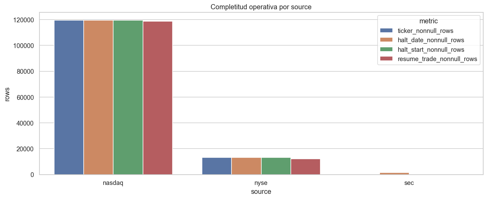
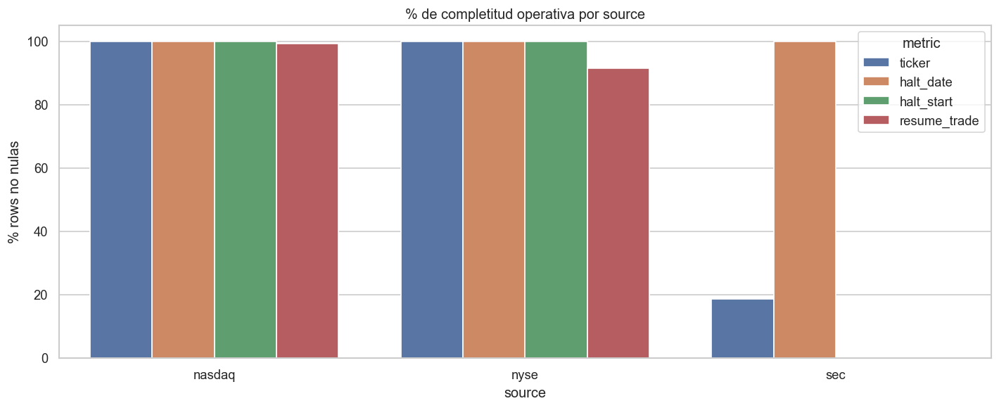
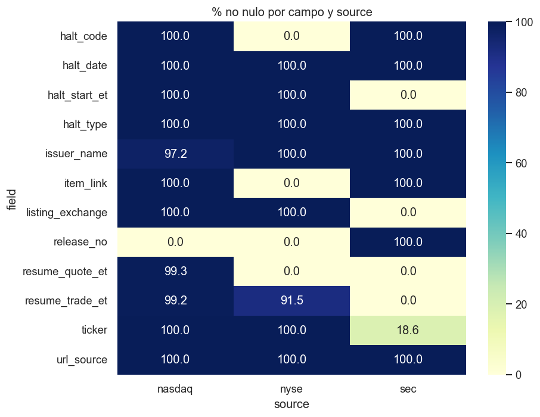
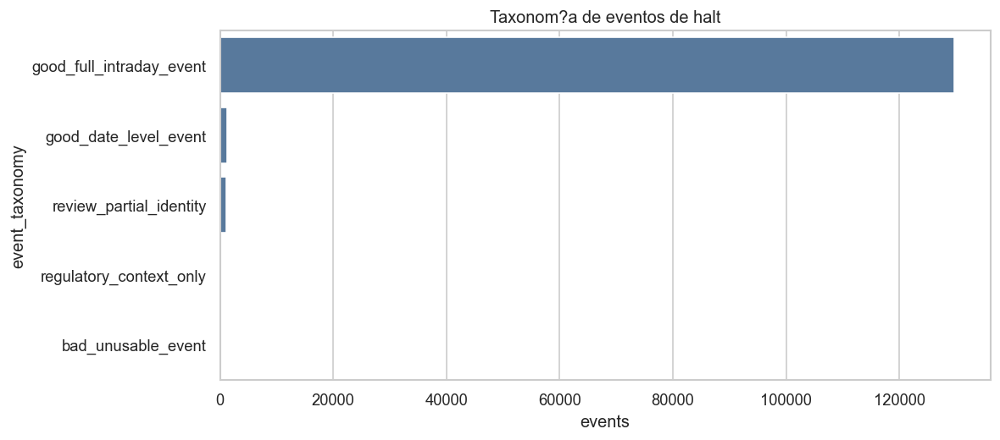
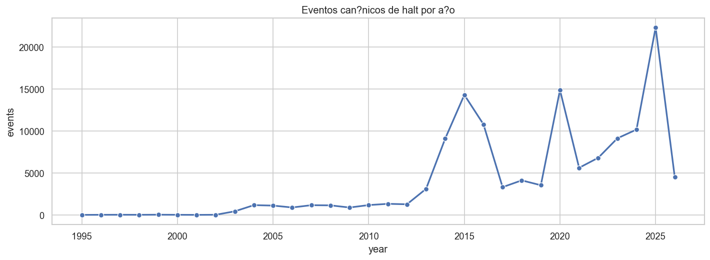
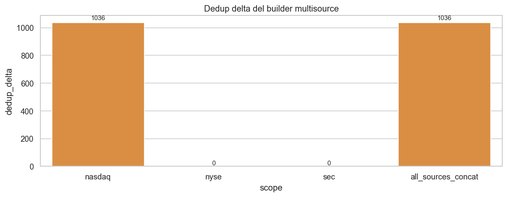
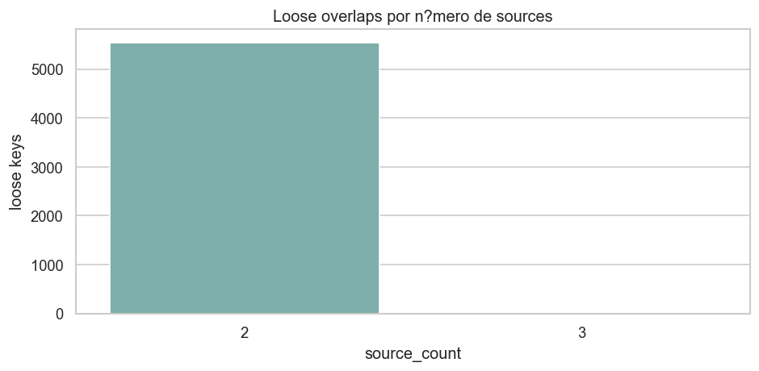
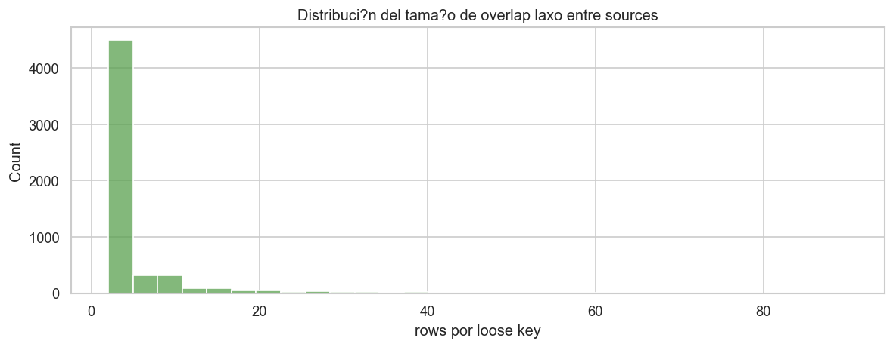
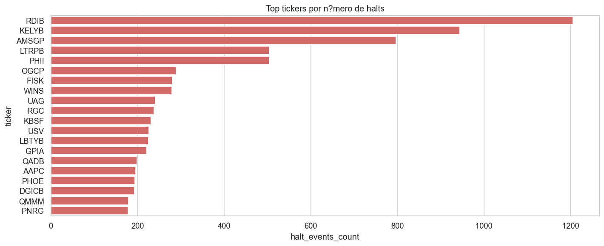
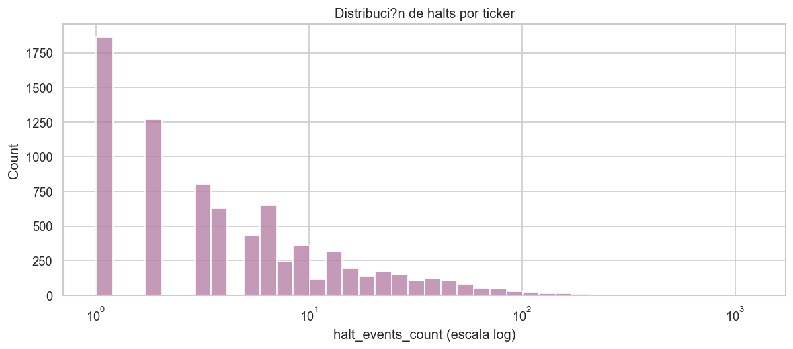

# 03_halts_root_cause_audit_phase1_closeout

## Objetivo

Cerrar la fase interna de auditoría de `halts` antes del cruce causal con `quotes` y `trades`.

Esta fase ya responde cinco preguntas:

- si las tres fuentes principales (`nasdaq`, `nyse`, `sec`) están estructuralmente utilizables
- cuánto del dataset sirve de verdad para análisis intradía
- qué significa realmente el `multisource_row_mismatch`
- qué residuo duro sigue sin explicación o sin rescate
- si `halts` ya puede entrar como capa de verdad del evento para la siguiente fase

## Snapshot de build

| métrica | valor |
| --- | ---: |
| `input_rows` | `134154` |
| `canonical_events` | `132257` |
| `duration_sec` | `112.222` |
| warning principal | `multisource_row_mismatch:source_sum=134154 multisource_rows=133116` |

Lectura:

- el warning sigue existiendo a nivel de manifest
- ya no se interpreta como pérdida misteriosa de cobertura
- queda acotado como un efecto de deduplicación histórica y de semántica de normalización del builder antiguo frente al builder enriquecido actual

## 1. Calidad por source

La recuperación de Nasdaq desde `raw_description_text` cambia completamente la lectura del bloque.

| source | rows | ticker_nonnull_rows | halt_date_nonnull_rows | halt_start_nonnull_rows | resume_trade_nonnull_rows | issuer_name_nonnull_rows | unique_tickers |
| --- | ---: | ---: | ---: | ---: | ---: | ---: | ---: |
| nasdaq | `119630` | `119619` | `119619` | `119619` | `118730` | `116323` | `16572` |
| nyse | `13178` | `13172` | `13178` | `13178` | `12052` | `13178` | `2568` |
| sec | `1346` | `250` | `1346` | `0` | `0` | `1346` | `250` |

Consecuencias:

- `nasdaq` deja de comportarse como dataset roto
- `nyse` ya era utilizable y sigue siéndolo
- `sec` aporta fecha y contexto regulatorio, pero no timing intradía fino

## 2. Completitud de campos críticos

La matriz de completitud muestra que el problema no está repartido homogéneamente. Está concentrado en campos esperables de `sec` y en un residuo muy pequeño de Nasdaq.

Lectura operativa:

- `nasdaq` y `nyse` ya soportan ventanas `halt` y `reopen`
- `sec` no debe usarse como fuente de timestamp intradía
- la falta de `ticker` en una parte de `sec` es una limitación de identidad, no una corrupción del raw

## 3. Taxonomía final de uso

La pregunta importante no es solo cuántas filas hay, sino cuánto del dataset sirve realmente para análisis causal.

| event_taxonomy | events | source_rows | tickers |
| --- | ---: | ---: | ---: |
| `good_full_intraday_event` | `129638` | `131524` | `16232` |
| `good_date_level_event` | `1272` | `1273` | `1180` |
| `review_partial_identity` | `1096` | `1096` | `0` |
| `regulatory_context_only` | `250` | `250` | `250` |
| `bad_unusable_event` | `1` | `11` | `0` |

Consecuencias:

- el dataset es mayoritariamente utilizable para overlay y análisis intradía
- el residuo duro cae a `1` evento canónico agregado
- el bloque problemático principal ya no es Nasdaq; es el subbloque `sec` sin `ticker` reconciliado

## 4. Dinámica temporal

La serie anual confirma que el dataset no está dominado por ruido administrativo aislado. Hay estructura temporal real y masa suficiente para usar `halts` como capa explicativa.

Consecuencia:

- `halts` tiene densidad temporal suficiente para justificar una fase 2 de cruce causal real contra `quotes` y `trades`

## 5. Cierre del `multisource_row_mismatch`

Este punto ya no debe leerse como “faltan eventos en `halts_master_multisource.parquet`”.

Tabla de reconciliación de la cache actual:

| scope | rows_pre_concat | rows_post_builder_dedup | dedup_delta |
| --- | ---: | ---: | ---: |
| `nasdaq` | `119630` | `118594` | `1036` |
| `nyse` | `13178` | `13178` | `0` |
| `sec` | `1346` | `1346` | `0` |
| `all_sources_concat` | `134154` | `133118` | `1036` |
| `persisted_multisource_parquet` | `133116` | `133116` | `0` |

Lectura exacta:

- el parquet persistido está en `133116`
- la reconstrucción deduplicada del builder enriquecido actual queda en `133118`
- el gap residual de `2` filas no apunta a eventos perdidos
- ese gap residual aparece porque nuestro builder actual enriquece y normaliza Nasdaq de forma distinta al builder histórico, especialmente en `issuer_name` y `halt_type`
- por tanto, el warning queda cerrado operativamente, aunque no como igualdad byte-a-byte entre builder antiguo y normalización nueva

Consecuencia:

- no hay evidencia de pérdida de cobertura en el consolidado multisource
- sí hay evidencia de que el builder histórico y el builder enriquecido no usan exactamente la misma semántica de normalización

## 6. Overlap entre sources

Con clave estricta del evento puede no aparecer `source_count > 1`, pero con clave laxa `ticker + halt_date` sí hay overlap fuerte entre `nasdaq` y `nyse`.

Ejemplos altos de overlap:

| ticker | halt_date | source_count | sources | rows |
| --- | --- | ---: | --- | ---: |
| `PROK` | `2025-07-08` | `2` | `nasdaq,nyse` | `90` |
| `QMMM` | `2025-09-09` | `2` | `nasdaq,nyse` | `82` |
| `BBGI` | `2025-12-10` | `2` | `nasdaq,nyse` | `72` |
| `ELPW` | `2026-01-30` | `2` | `nasdaq,nyse` | `72` |
| `KELYB` | `2026-02-05` | `2` | `nasdaq,nyse` | `62` |

Consecuencias:

- el solape entre sources existe y es material
- que no aparezca en la clave canónica estricta no invalida el dataset
- lo que indica es que distintas fuentes describen el mismo día o la misma secuencia de evento con granularidad distinta

## 7. Residuo duro final

El residuo realmente no rescatable ya es mínimo.

- `bad_unusable_event`: `1` evento canónico
- `source_rows` afectadas: `11`
- todas las filas provienen de `nasdaq`

Esas filas comparten una propiedad común:

- `ticker = null`
- `title = null`
- `raw_description_text = null`

No son:

- un fallo del parser
- un fallo del modelo de claves
- un fallo de timezone

Sí son:

- raws vacíos de origen

Consecuencia:

- el residuo duro queda suficientemente comprendido y no bloquea la fase causal

## 8. Cobertura por ticker y concentración

La cobertura por ticker muestra actividad de halt real, no solo presencia anecdótica.

Top tickers por número de halts:

| ticker | halt_events_count | first_halt_date | last_halt_date |
| --- | ---: | --- | --- |
| `RDIB` | `1206` | `2013-10-01` | `2026-02-09` |
| `KELYB` | `944` | `2013-09-26` | `2026-02-06` |
| `AMSGP` | `797` | `2014-07-10` | `2016-06-15` |
| `LTRPB` | `504` | `2014-09-16` | `2023-10-27` |
| `PHII` | `504` | `2013-09-12` | `2019-03-15` |

Consecuencias:

- existe fuerte concentración de halts en ciertos nombres
- esta concentración es una propiedad real del dataset y será importante al muestrear casos en la fase causal
- conviene no inferir calidad global de `halts` a partir de unos pocos tickers hiperactivos

## 9. Cierre operativo de la fase 1

La fase 1 queda cerrada así:

- `halts` ya es defendible como capa de verdad del evento
- `nasdaq` queda rescatado y utilizable para análisis intradía
- `nyse` queda estable y consistente
- `sec` queda aceptado como contexto regulatorio, no como reloj intradía
- el `multisource_row_mismatch` deja de bloquear la auditoría
- el residuo duro final queda reducido a `11` raws vacíos de Nasdaq

## 10. Qué habilita esta fase

Con esta fase cerrada, ya tiene sentido pasar a:

- construir ventanas `pre_halt / halt_core / reopen / post_reopen`
- cruzar eventos de `halts` con patrones de `quotes`
- cruzar eventos de `halts` con patrones de `trades`
- medir coherencia causal entre verdad regulatoria y microestructura observada

Esa es la siguiente fase del notebook y del builder.
