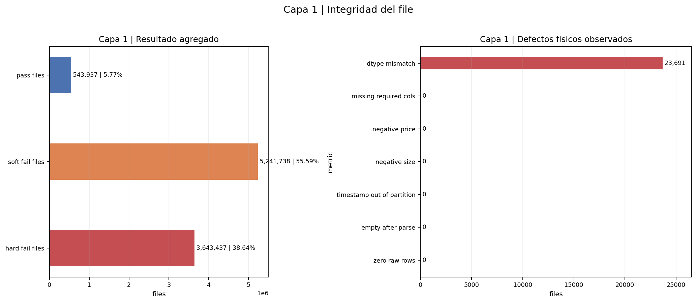
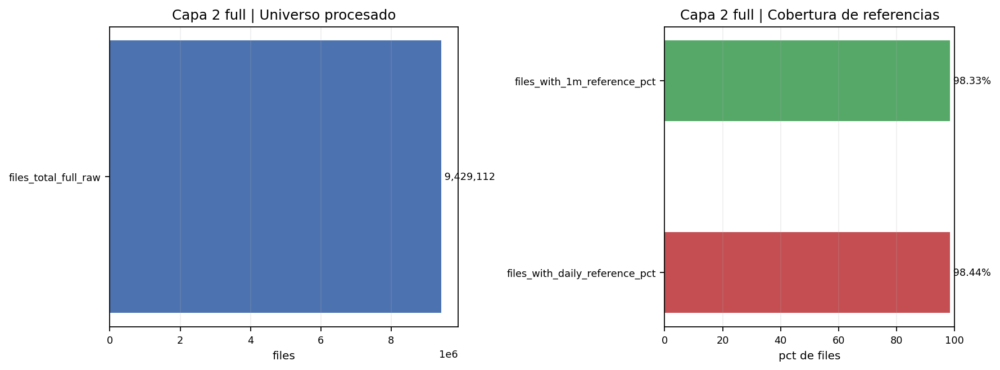
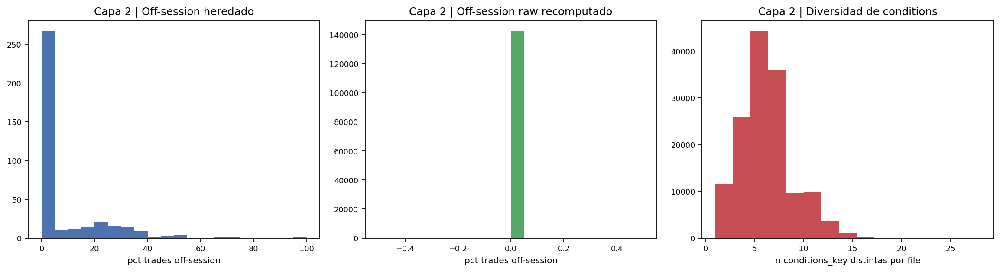
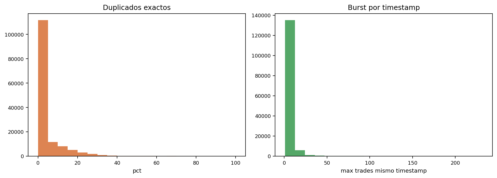
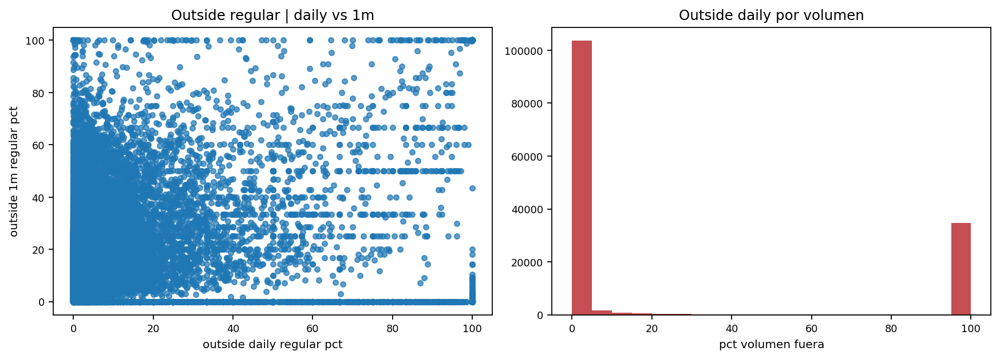
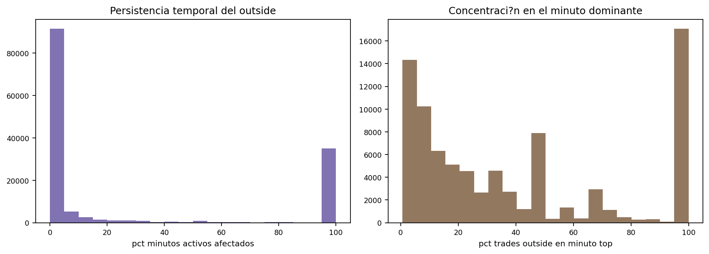
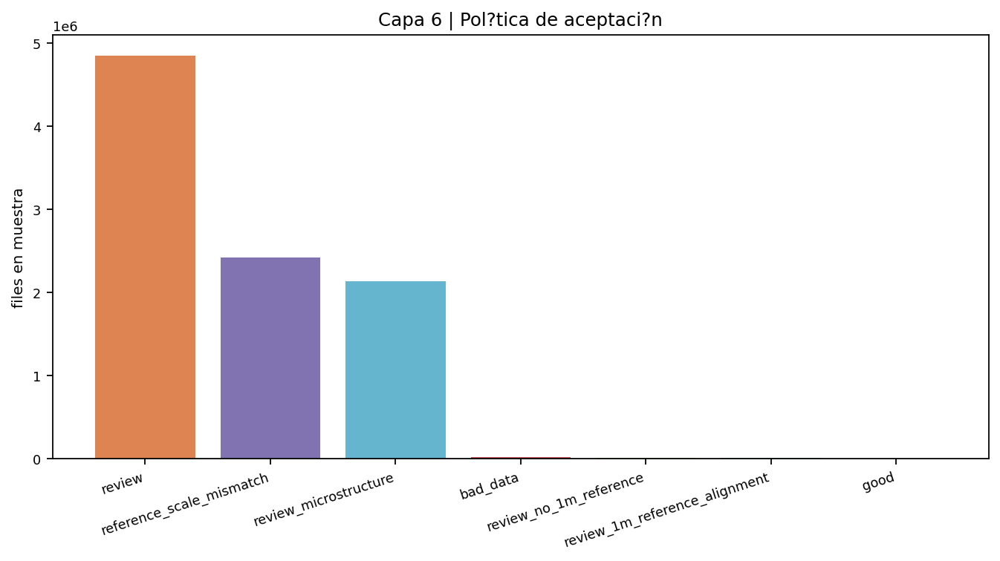

# Trades full `<1B>` | lectura final `57f`

## Estado del cierre

Este documento fija la lectura final del cierre full de `trades` sobre el run:

- `57f_build_trades_file_acceptance_artifacts_lt1b_full_clean_fast_same_schema.py`
- cache final: `file_acceptance_cache_lt1b_full_clean_fast_same_schema`
- universo full procesado: `9,429,112` files
- shards de índice: `95/95`
- shards de métricas raw: `95/95`
- estado: `done`

La lectura de capas que sigue corresponde a la versión final del notebook `06_trades_file_acceptance_full_lt1b_closeout.ipynb` y a las imágenes exportadas `33.png` a `39.png`.

## Resumen ejecutivo

La conclusión técnica no es que `trades` esté masivamente corrupto a nivel físico, sino que el universo descargado y auditado quedó recortado a `market-only`. Ese recorte sesga la interpretación de capas ligadas a sesión y explica por qué `quotes` y `trades` no cuentan la misma historia temporal.

A nivel de decisión:

- la integridad física del file es en general aceptable
- la cobertura frente a referencias es alta
- el gran problema no es físico sino semántico y de representatividad temporal
- el dataset final de `trades` no puede interpretarse como universo extendido `pre + regular + after`
- por tanto cualquier certificación final de `trades` debe quedar condicionada a que su alcance real es `RTH / market session`

## Capa 1 | Integridad del file

Lectura:

- `pass files = 543,937` (`5.77%`)
- `soft fail files = 5,241,738` (`55.59%`)
- `hard fail files = 3,643,437` (`38.64%`)
- defecto físico observado dominante: `dtype mismatch = 23,691`
- el resto de defectos físicos duros del panel sale en `0`:
  - `missing required cols = 0`
  - `negative price = 0`
  - `negative size = 0`
  - `timestamp out of partition = 0`
  - `empty after parse = 0`
  - `zero raw rows = 0`

Lectura crítica:

- Esta capa muestra una tensión importante: el file físico casi nunca está roto, pero la clasificación agregada sigue dejando mucho `soft fail` y `hard fail`.
- Eso significa que el problema de `trades` no es principalmente de corrupción de parquet ni de columnas ausentes.
- El único residuo físico material es `dtype mismatch`, y aun así representa solo `0.2513%` del universo.
- En otras palabras: el dataset es mayoritariamente legible, pero no por ello automáticamente apto para uso causal o de backtest.

Conclusión de capa 1:

- físicamente, el bloque está razonablemente sano
- metodológicamente, el problema está más arriba, no en el parseo

## Capa 2 | Cobertura de referencias

Lectura:

- `files_total_full_raw = 9,429,112`
- `files_with_1m_reference_pct = 98.33032`
- `files_with_daily_reference_pct = 98.44038`

Lectura crítica:

- La cobertura contra `1m` y `daily` es alta y suficiente para auditar a escala full.
- Esto descarta la hipótesis fácil de que la mala clasificación de `trades` se deba solo a falta masiva de baseline.
- El problema no es “no tengo referencia”; el problema es “lo que veo en trades no encaja bien con la referencia o no representa bien la sesión extendida esperada”.

Conclusión de capa 2 de cobertura:

- el cierre full está bien soportado por referencias
- el problema de calidad de `trades` no se explica por ausencia global de `1m` o `daily`

## Capa 2 | Mezcla de sesión y condiciones

Lectura:

- el panel de mezcla de sesión no muestra señal útil de `pre/post` en `trades`
- la diversidad de `conditions_key` sí existe y no es trivial; la masa se concentra en pocos regímenes, con cola hacia combinaciones más complejas

Lectura crítica:

- Aquí aparece el hallazgo más importante de todo el bloque `trades`.
- Al revisar físicamente archivos reales de `C:\TSIS_Data\data\trades_ticks_prod_2005_2026`, una muestra de `10` `market.parquet` aleatorios de tickers y fechas distintas quedó siempre dentro de `09:30:00` y `15:59:59` hora NY.
- No apareció ningún trade premarket ni afterhours dentro de esos files.
- Esto no es un artefacto del gráfico. Es una propiedad real del input descargado.

Significado:

- el universo auditado de `trades` no es extended-hours completo
- es un universo `market-only`
- por eso esta capa no puede interpretarse como distribución real de sesiones del tape oficial completo

Trazabilidad del problema de horas:

- la doc oficial de Massive/Polygon para stocks flat files describe un universo diario que incluye `pre-market`, `regular` y `after-hours`
- pero el downloader local de `trades` del proyecto partió el universo por ventanas y sus runs reales quedaron en `--session market`
- el script local soporta `market` y `premarket`, pero no `afterhours`
- no se encontró evidencia materializada de una corrida `premarket`
- el inventario final y `trades_current.parquet` quedaron construidos contra `market.parquet`

Implicación:

- `quotes` y `trades` no están alineados temporalmente
- `quotes` sí muestra extended hours reales
- `trades` no
- por tanto, las comparaciones causales o microestructurales entre ambos bloques deben leerse con esta asimetría en mente

Conclusión de capa 2 descriptiva:

- no usar este `trades` como si fuera tape extendido completo
- leerlo explícitamente como `RTH / market session only`

## Capa 3 | Microestructura interna

Lectura:

- `duplicados exactos`: la masa principal está cerca de `0`, con cola larga
- `burst por timestamp`: vuelve a concentrarse cerca de valores bajos, con pocos outliers altos

Lectura crítica:

- La microestructura no es limpia, pero tampoco muestra un colapso global del tape.
- Hay suciedad local: duplicados, concentración por timestamp y algunos días extremos.
- La señal dominante es de residuo operativo y heterogeneidad entre files, no de invalidez total del bloque.
- Esto encaja bien con que `review_microstructure` sea grande pero no absoluto.

Conclusión de capa 3:

- la microestructura añade fricción y riesgo
- pero no explica por sí sola todo el problema del bloque

## Capa 4 | Consistencia contra referencia

Lectura:

- el scatter `outside regular | daily vs 1m` presenta mucha concentración en extremos `0` y `100`
- el histograma de `pct volumen fuera` muestra un patrón fuertemente bimodal

Lectura crítica:

- Este patrón no parece ruido gráfico; parece estructura real.
- Muchos files quedan casi totalmente alineados o casi totalmente desalineados respecto a la referencia.
- Eso es coherente con la existencia de dos regímenes:
  - files donde el tape cae razonablemente dentro del soporte de referencia
  - files donde la escala o el contexto de precios/volumen no encajan bien
- Este comportamiento refuerza la categoría `reference_scale_mismatch` como bucket real y no cosmético.

Conclusión de capa 4:

- hay un problema de alineación con referencia que es estructural
- no es un residuo marginal ni una rareza aislada

## Capa 5 | Severidad y persistencia

Lectura:

- `persistencia temporal del outside`: masa fuerte cerca de `0` y otra masa importante cerca de `100`
- `concentración en el minuto dominante`: vuelve a aparecer una distribución no uniforme, con acumulación visible en el extremo alto

Lectura crítica:

- La severidad no es solo puntual. En muchos files el problema persiste a lo largo de gran parte de la actividad disponible.
- La bimodalidad vuelve a decir lo mismo: el universo mezcla files casi inocuos con files persistentemente problemáticos.
- Esto justifica que una política binaria simple `good/bad` sea insuficiente y que la salida correcta esté dominada por `review`.

Conclusión de capa 5:

- el problema no es solo presencia de anomalía, sino su persistencia y peso relativo
- eso legitima una política conservadora de aceptación

## Capa 6 | Política de aceptación

Lectura final full:

- `review = 4,851,211`
- `reference_scale_mismatch = 2,418,062`
- `review_microstructure = 2,130,781`
- `bad_data = 15,869`
- `review_no_1m_reference = 8,091`
- `review_1m_reference_alignment = 4,992`
- `good = 106`

Lectura crítica:

- El dato más fuerte aquí es `good = 106` sobre `9,429,112` files.
- Eso no significa que todo lo demás esté corrupto físicamente.
- Significa que, bajo una política seria de aceptación para backtest y uso causal, casi nada entra como `good` sin reservas.
- La gran masa cae en tres buckets:
  - `review`
  - `reference_scale_mismatch`
  - `review_microstructure`
- El volumen de `bad_data` puro es pequeño. El problema central es de aptitud y consistencia, no de destrucción física del dato.

Conclusión de capa 6:

- `trades` full no queda certificado como bloque limpio de uso directo
- queda como bloque recuperable y utilizable solo bajo políticas restrictivas, trazables y con fuerte contexto

## Problema de horas | cierre explícito

Este punto debe quedar asentado porque cambia la interpretación de todo el bloque.

Hecho observado:

- `quotes` sí contiene actividad extended-hours real en disco, con ejemplos que arrancan a `04:00:00` ET y llegan a `19:59:59` ET
- `trades` no: los `market.parquet` muestreados en disco quedaron siempre dentro de `09:30-16:00` ET

Interpretación correcta:

- no es que Polygon/Massive no tenga extended hours en general
- es que la descarga y materialización local de `trades` usada por este proyecto quedó recortada a `market`

Consecuencias:

- no puede exigirse a este `trades` que describa bien premarket o afterhours, porque no los contiene
- la capa 2 de sesión en `trades` no está descubriendo un mercado sin extended hours; está reflejando un universo previamente recortado
- cualquier comparación `trades vs quotes` o `trades vs 1m` debe reconocer esa asimetría de alcance

## Veredicto operativo

`trades` full `<1B>` queda cerrado técnicamente como auditoría de un universo `market-only`, no como auditoría del tape extendido completo.

Veredicto:

- cierre computacional: `OK`
- cierre metodológico: `OK`
- cierre semántico del universo: `LIMITADO`
- uso directo como tape extendido completo: `NO`
- uso potencial restringido como `RTH / market-only trades`: `SÍ, con limitaciones y política conservadora`

## Referencias de soporte

- notebook metodológico: `v2/05_trades_file_acceptance_audit.ipynb`
- notebook full final: `v2/06_trades_file_acceptance_full_lt1b_closeout.ipynb`
- viewer final: `cell_code/58d_trades_file_acceptance_view_lt1b_full_clean_fast_same_schema.py`
- builder final: `cell_code/57f_build_trades_file_acceptance_artifacts_lt1b_fast_same_schema.py`
- imágenes full finales: `img/33.png` a `img/39.png`
