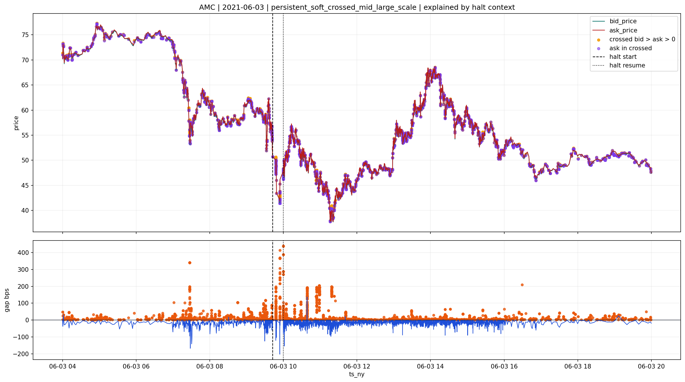
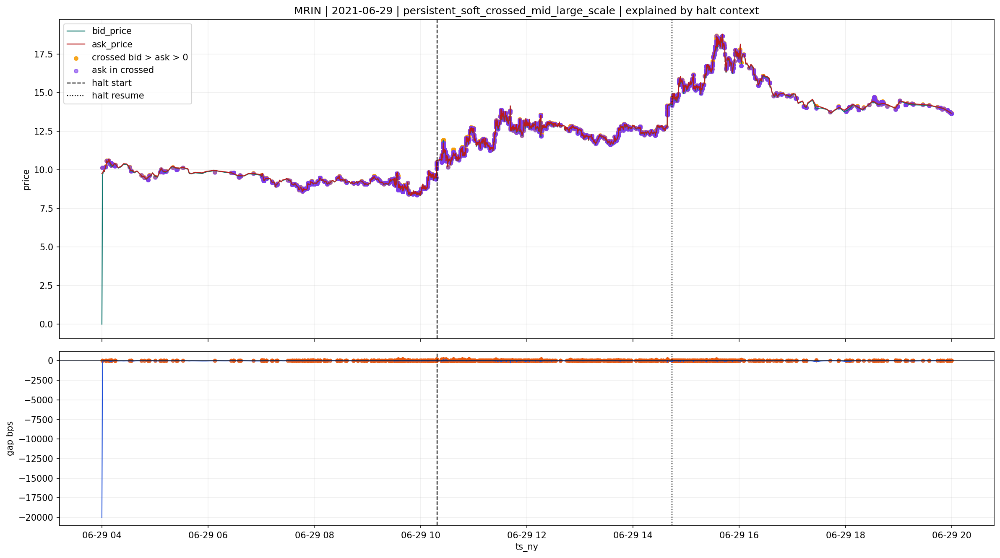
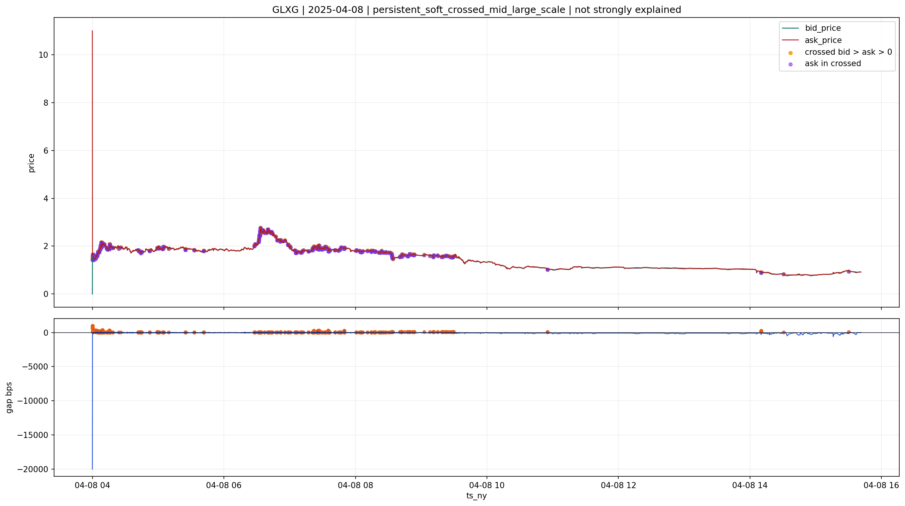
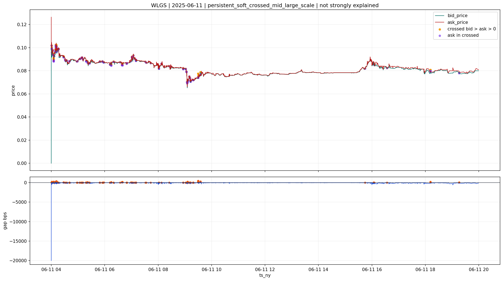

# persistent_soft_crossed_mid_large_scale

## Lectura del bucket

Este bucket no debe moverse a `good` aunque parte de sus casos queden bien contextualizados por `halts`.

Motivo:

- `halts` puede explicar el contexto del episodio
- pero no convierte automaticamente el libro en microestructura limpia

En `quotes`, `good` significa residuo leve, estable o puramente temporal.
En cambio, `persistent_soft_crossed_mid_large_scale` ya nace como:

- file grande
- `SOFT_FAIL`
- crossed persistente
- y casi siempre con `ask > 0`

Eso quiere decir que la fragilidad del libro sigue siendo real aunque exista un `halt` coherente.

## Por que `halt` no basta para subirlo a `good`

Un `halt` fuerte puede mover la lectura desde:

- raro y sospechoso

hacia:

- raro pero entendible

Pero no hacia:

- libro limpio para baseline de ejecucion

Por eso la lectura correcta es:

- `review` con explicacion fuerte por `halts`

y no:

- `good`

## Evidencia agregada

Segun `quotes\v2`:

- `47,076` files
- `0.494%` del universo `quotes <1B>`
- `crossed_ratio_pct` mediano `0.435%`
- `p90` `0.682%`
- mezcla real de `mild`, `moderate` y una cola `severe`

Eso es compatible con `review`.
No con `good`.

## Casos explicados por `halts`

Estos casos caen en:

- `persistent_soft_crossed_mid_large_scale`
- y ademas en `confirmed_halt_microstructure_coherent`

La lectura aqui es:

- el `halt` ayuda a explicar por que el episodio intradia es fragil
- pero la fragilidad microestructural sigue estando en el file

**AMC | 2021-06-03**

**MRIN | 2021-06-29**

## Casos no fuertemente explicados

Estos casos siguen dentro del bucket, pero no tienen soporte causal fuerte same-day en las capas revisadas.

La lectura aqui es:

- el bucket no es solo contexto de `halt`
- tambien contiene residuo microestructural abierto

**GLXG | 2025-04-08**

**WLGS | 2025-06-11**

## Decision provisional

La lectura correcta del bucket es:

- `review`

Y dentro de `review` conviene separar:

- casos con explicacion fuerte por `halts`
- casos sin explicacion fuerte

Pero no conviene promover todo el bucket a `good`, porque eso mezclaria:

- explicacion causal del episodio
- con limpieza operativa del libro

Y en `quotes` esas dos cosas no son equivalentes.
