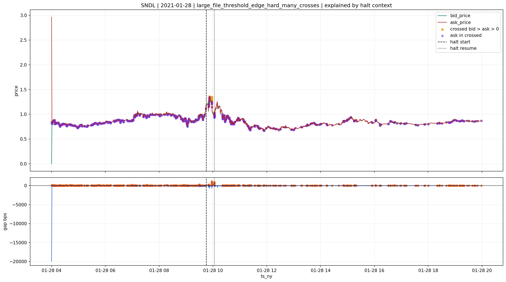
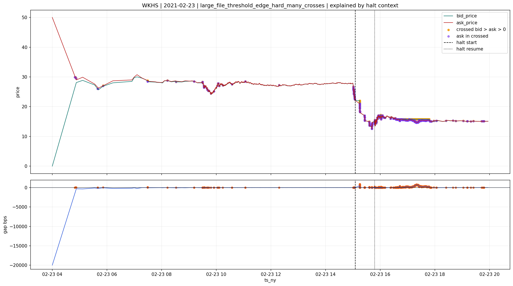

# large_file_threshold_edge_hard_many_crosses

## Lectura del bucket

Este bucket se mantiene en `review`.

No debe subir a `good`, porque el crossed positivo con `ask > 0` sigue siendo economicamente material en una parte real de los casos.
Tampoco debe bajarse entero a `bad`, porque mezcla subregimenes distintos:

- casos muy pegados a contexto de `halt`
- casos moderados
- y una cola severa real

## Evidencia agregada

Segun `quotes\v2`:

- `50,288` files
- `0.528%` del universo `quotes <1B>`
- `crossed_ratio_pct` mediano `1.523%`
- `p90` `3.639%`
- mediana de `cross_rel_bps` muy alta por mezcla con `ask = 0`
- pero cuando queda `ask > 0`, el bucket sigue mezclando:
  - `mild`
  - `moderate`
  - y varios casos `severe`

En el resumen `positive_cross_review`:

- `6` casos sample `severe >= 25 bps`
- `11` casos sample `moderate 5-25 bps`
- `8` casos sample `mild < 5 bps`

Eso es una familia mixta real.

## Cruce causal

La capa soporte mas fuerte vuelve a ser `halts`.

Dentro de los casos enlazados:

- `412` caen en `confirmed_halt_microstructure_coherent`
- `56` en `reference -> ticker_change_near_quotes_anomaly`
- `news` toca muchos casos, pero domina `review_multi_ticker_ambiguous_news`
- `ipos` solo aparece como `ipo_near_market_anomaly`

La lectura correcta es:

- hay un subconjunto relevante explicable por `halt`
- pero el bucket conserva una cola severa no trivial

## Por que no debe subir a `good`

Aunque haya casos bien contextualizados por `halts`, aqui la calidad del libro sigue siendo mas agresiva que en un `review` blando.

La razon es simple:

- `halt` explica el episodio
- pero no neutraliza por si solo la severidad del crossed positivo con `ask > 0`

Si el bucket contiene casos como:

- `CNTB | 2022-06-29`
- `CTIC | 2006-09-19`

con `cross_rel_bps` claramente severo, no conviene mezclar toda la familia con `good`.

## Casos explicados por `halts`

Estos casos apoyan la parte del bucket que si puede leerse como `review` contextualizado:

**SNDL | 2021-01-28**

**WKHS | 2021-02-23**

## Casos no fuertemente explicados

Estos casos muestran la cola dura que impide promover el bucket completo:

**CTIC | 2006-09-19**

**CNTB | 2022-06-29**

## Decision provisional

La lectura correcta del bucket es:

- `review`

Pero no como review blando.
Es un `review` mixto con dos caras:

- subconjunto explicable por `halts`
- subconjunto con cola severa que sigue siendo economicamente incomoda

Por eso:

- no debe promoverse a `good`
- y tampoco conviene marcarlo entero como `bad`

El valor del bucket esta precisamente en dejar visible esa mezcla.
