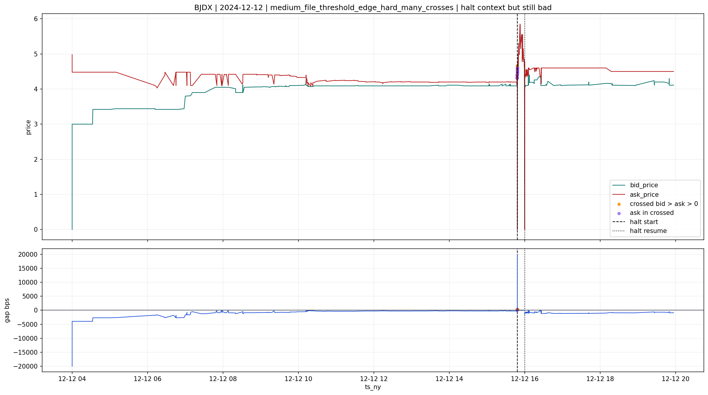
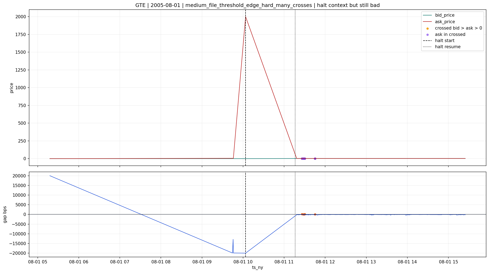
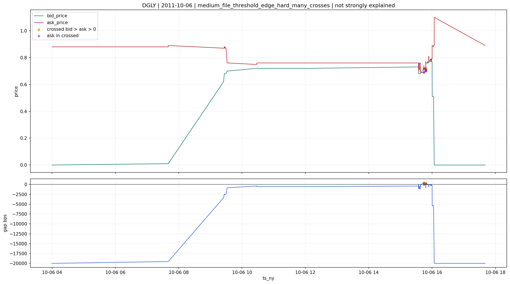

# medium_file_threshold_edge_hard_many_crosses

## Lectura del bucket

Este bucket se mantiene en `bad`.

Aunque una parte de los casos coincide con `halts` coherentes, la familia sigue siendo demasiado agresiva para subirla a `review`.

## Evidencia agregada

Segun `quotes\v2`:

- `85,963` files
- `0.902%` del universo `quotes <1B>`
- `crossed_ratio_pct` mediano `2.020%`
- `p90` `4.157%`
- todo el bucket cae en `HARD_FAIL`

Y, en la muestra de severidad:

- domina `ask = 0` o cuasi `0`
- pero cuando sobrevive `ask > 0`, aparecen casos moderados y severos muy duros

En `positive_cross_review_summary`:

- `5` casos sample `severe >= 25 bps`
- `3` casos sample `moderate 5-25 bps`
- `5` casos sample `mild < 5 bps`

La presencia de una cola severa tan fuerte en un bucket ya `HARD_FAIL` es suficiente para no promoverlo.

## Cruce causal

Hay enlaces reales con capas soporte:

- `halts`: `447`
  - `370` en `confirmed_halt_microstructure_coherent`
- `reference`: `92`
  - casi todo `ticker_change_near_quotes_anomaly`
- `news`: `940`
  - dominan `news_near_market_anomaly` y `review_multi_ticker_ambiguous_news`
- `ipos`: `14`

Pero aqui el punto importante es este:

- el contexto existe
- la severidad local no desaparece

## Por que no baja a `review`

En el bucket anterior, la mezcla entre moderado y severo dejaba espacio para mantener la familia en `review`.
Aqui no.

En `medium_file_threshold_edge_hard_many_crosses`:

- el grano del file es menor
- el crossed ratio es mas alto
- el bucket ya nace en `HARD_FAIL`
- y la cola `ask > 0` puede ser extremadamente severa

Por eso, aunque un `halt` explique el episodio, no convierte el file en una microestructura defendible para uso normal.

## Casos con contexto de `halt`

Estos casos muestran que el `halt` puede coexistir con la anomalia, pero no limpiarla:

**BJDX | 2024-12-12**

**GTE | 2005-08-01**

## Casos no fuertemente explicados

Estos casos enseñan directamente la cola dura que mantiene el bucket en `bad`:

**UFAB | 2023-03-09**

**DGLY | 2011-10-06**

## Decision provisional

La lectura correcta del bucket es:

- `bad`

Con matiz:

- algunas filas pueden estar contextualizadas por `halts`
- pero esa explicacion no cambia la calidad local suficiente como para promover la familia

En este bucket, el contexto ayuda a entender el episodio.
No ayuda a rehabilitar la calidad operativa del libro.
