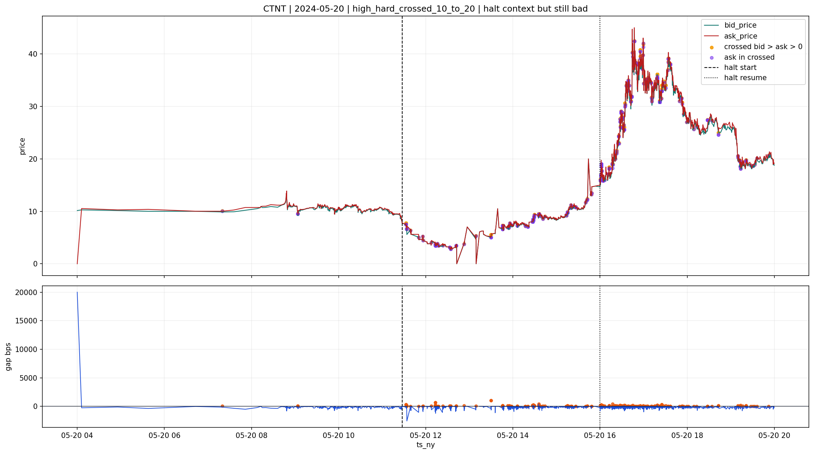
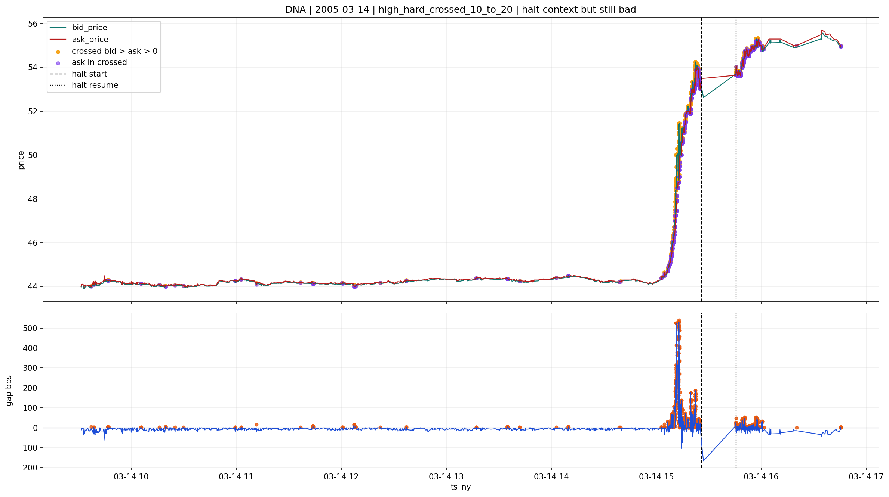

# high_hard_crossed_10_to_20

## Lectura del bucket

Este bucket se mantiene en `bad` sin ambiguedad.

Es la familia mas claramente agresiva de las cuatro abiertas en `quotes`.

## Evidencia agregada

Segun `quotes\v2`:

- `101,549` files
- `1.066%` del universo `quotes <1B>`
- `crossed_ratio_pct` mediano `13.043%`
- `p90` `17.647%`
- todo el bucket cae en `HARD_FAIL`

En la muestra de severidad:

- domina casi completamente `ask = 0` o cuasi `0`
- pero el residuo con `ask > 0` que sobrevive es muy duro

En `positive_cross_review_summary`:

- solo hay `2` casos sample con `ask > 0`
- y ambos son `positive_cross_severe_ge25bps`

Eso por si solo ya justifica mantener la familia en `bad`.

## Cruce causal

Hay enlaces con capas soporte:

- `halts`: `394`
  - `213` en `confirmed_halt_microstructure_coherent`
  - `181` en `halt_with_quotes_signal_only`
- `reference`: `28`
- `news`: `190`
- `ipos`: residual

Pero aqui el cruce causal no cambia la conclusion.

## Por que sigue en `bad` aunque exista `halt`

En este bucket el `halt` puede explicar el episodio de mercado.
No puede rehabilitar la calidad local del libro.

La razon es que la severidad propia del bucket ya es extrema:

- crossed ratio muy alto
- `HARD_FAIL`
- y, cuando aparece `ask > 0`, aparece como crossed positivo severo

Eso lo separa claramente de cualquier familia que pudiera quedarse en `review`.

## Casos con contexto de `halt`

Estos casos muestran que incluso con `halt` coherente la familia sigue siendo mala:

**CTNT | 2024-05-20**

**DNA | 2005-03-14**

## Casos no fuertemente explicados

Y estos dos casos son directamente cola severa sin apoyo fuerte:

**SGC | 2013-11-04**

**SELF | 2016-06-28**

## Decision provisional

La lectura correcta del bucket es:

- `bad`

Y aqui no veo base para promover subconjuntos a `review`.

El contexto de `halt` sirve para entender mejor el episodio.
No sirve para rebajar la severidad operativa del bucket.
