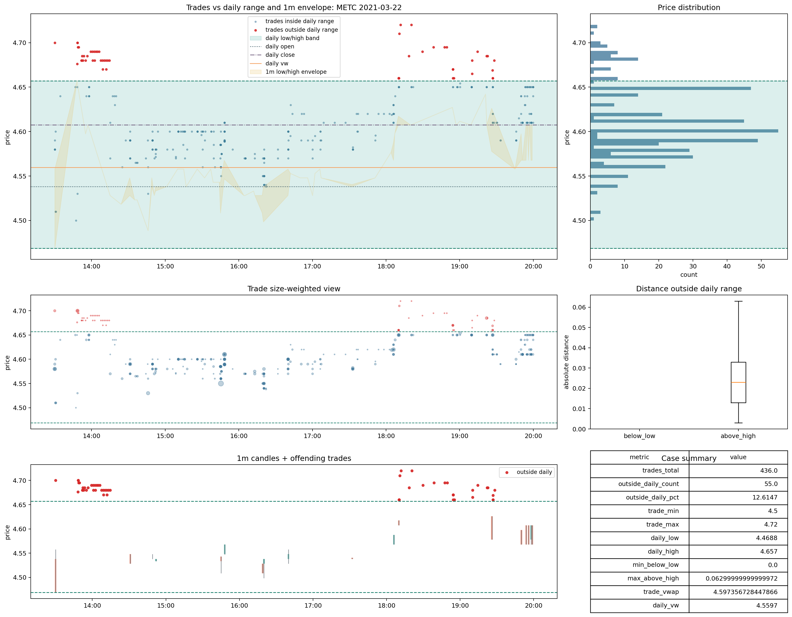

# Trades | `review_1m_reference_alignment`

Este bucket es pequeño, pero no debe perderse dentro de `review` sin dejar constancia visual.

Rutas base:

- [layer6_policy_examples.parquet](C:\TSIS_Data\02_backtest_SmallCaps\runs\backtest\trades_v2_materialized\trades_current_cd_merged\root_cause_exports\file_acceptance_cache_lt1b\layer6_policy_examples.parquet)
- [05_review_1m_reference_alignment_relv_2018_06_07.png](C:\TSIS_Data\02_backtest_SmallCaps\data_auditoria_polygon\00_data_certification\certification\trades\img\05_review_1m_reference_alignment_relv_2018_06_07.png)
- [06_review_1m_reference_alignment_metc_2021_03_22.png](C:\TSIS_Data\02_backtest_SmallCaps\data_auditoria_polygon\00_data_certification\certification\trades\img\06_review_1m_reference_alignment_metc_2021_03_22.png)

## Qué significa

Aquí ocurre una combinación muy específica:

- `daily` y `VWAP` quedan razonablemente alineados
- pero el núcleo comparable rompe fuerte contra `1m`
- por eso no es un `reference_scale_mismatch` clásico
- tampoco es un `good`

## Casos visuales

Lectura visual defendible:

- el conflicto no parece mero ruido de odd-lots marginales
- tampoco parece el patrón típico de escala extrema de `reference_scale_mismatch`
- lo raro está en la relación entre trades y referencia `1m`

## Decisión

Decisión provisional:

- mantener `review_1m_reference_alignment` como bucket propio dentro de `review`
- no promoverlo a `good`
- no absorberlo todavía en `bad_data`
- y no mezclarlo sin más con `review` genérico

Razón:

- es un bucket pequeño
- pero semánticamente distinto
- y visualmente sí enseña un patrón repetible de conflicto con `1m`
