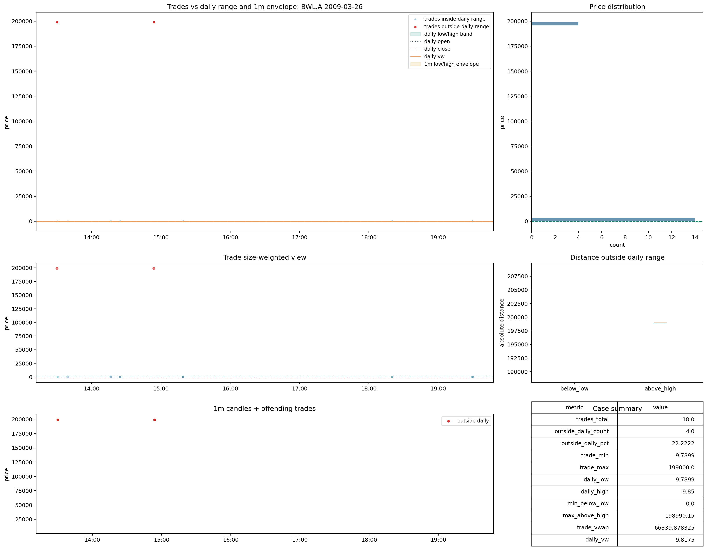

# Trades | `bad_data`

Este bucket debe tratarse con cuidado: existe y debe seguir existiendo, pero no conviene leerlo como si fuera simplemente otra variante de `reference_scale_mismatch`.

Rutas base:

- [raw_metrics_shards](C:\TSIS_Data\02_backtest_SmallCaps\runs\backtest\trades_v2_materialized\trades_current_cd_merged\root_cause_exports\file_acceptance_cache_lt1b_full_clean_fast_same_schema\raw_metrics_shards)
- [07_bad_data_bwl_a_2009_03_26.png](C:\TSIS_Data\02_backtest_SmallCaps\data_auditoria_polygon\00_data_certification\certification\trades\img\07_bad_data_bwl_a_2009_03_26.png)
- [08_bad_data_anda_2012_05_10.png](C:\TSIS_Data\02_backtest_SmallCaps\data_auditoria_polygon\00_data_certification\certification\trades\img\08_bad_data_anda_2012_05_10.png)

## Qué significa

La lectura defendible aquí no es:

- todo `bad_data` es en realidad un `scale mismatch`

La lectura defendible es:

- `bad_data` es un bucket real
- pero contiene una fuga residual pequeña de casos con señal de escala fuerte

Sobre el estado materializado final de `57f/full_clean_fast_same_schema`:

- `bad_data`: `9,356` files
- `daily_vw_to_trade_vw` cerca de `1x` en `74.20%`
- señal extrema de escala en solo `0.62%`
- `trade_vwap_vs_daily_vw_diff_pct_raw >= 20%` en solo `0.38%`

Eso descarta reinterpretar el bucket entero como un problema de escala.

## Casos visuales

Lectura visual defendible:

- estos casos no se parecen al desplazamiento limpio y masivo de `reference_scale_mismatch`
- la comparación con referencias falla, pero no por una separación sistemática de escala en todo el file
- el comportamiento encaja mejor con bucket de mala calidad local o comparabilidad rota no reducible a una sola causa simple

## Decisión

Decisión provisional:

- mantener `bad_data` como bucket propio
- clasificarlo dentro de `bad`
- no vaciarlo metiendo su masa principal en `reference_scale_mismatch`

Salvedad importante:

- sí conviene documentar que existe una fuga residual pequeña de escala extrema
- esa fuga no cambia la lectura global del bucket
- solo justifica vigilar la frontera entre `bad_data` y `reference_scale_mismatch` en la regla final
