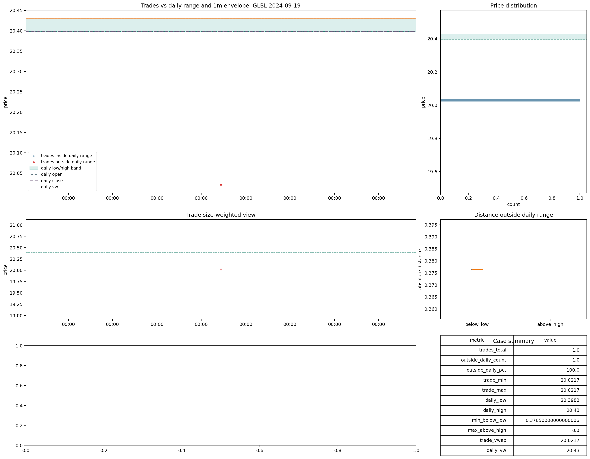

# Trades | `review_no_1m_reference`

Este bucket es pequeño y semánticamente bastante limpio.

Rutas base:

- [raw_metrics_shards](C:\TSIS_Data\02_backtest_SmallCaps\runs\backtest\trades_v2_materialized\trades_current_cd_merged\root_cause_exports\file_acceptance_cache_lt1b_full_clean_fast_same_schema\raw_metrics_shards)
- [09_review_no_1m_reference_glbl_2024_09_19.png](C:\TSIS_Data\02_backtest_SmallCaps\data_auditoria_polygon\00_data_certification\certification\trades\img\09_review_no_1m_reference_glbl_2024_09_19.png)

## Qué significa

La lectura defendible aquí no es:

- mala calidad intrínseca del tape

La lectura defendible es:

- falta referencia `1m`
- por eso no puede cerrarse la comparabilidad intradía completa
- pero la escala frente a `daily` queda esencialmente limpia

Sobre el estado materializado final de `57f/full_clean_fast_same_schema`:

- `review_no_1m_reference`: `4,456` files
- `daily_vw_to_trade_vw` cerca de `1x` en `99.98%`
- señal extrema de escala en `0%`
- `trade_vwap_vs_daily_vw_diff_pct_raw >= 20%` en `0%`
- `has_1m_reference = False` en `100%`

La lectura es muy consistente: no es bucket de escala, ni de corrupción evidente, sino de falta de ancla `1m`.

## Caso visual

Lectura visual defendible:

- el tape no muestra la ruptura masiva típica de `reference_scale_mismatch`
- tampoco el patrón más sucio de `bad_data`
- lo que falta es la confirmación `1m`, no una explicación básica de precio

## Decisión

Decisión provisional:

- mantener `review_no_1m_reference` como bucket propio
- clasificarlo dentro de `review`
- no promoverlo a `good`
- no mezclarlo con `bad_data`

Razón:

- su problema es ausencia de referencia intradía
- no deterioro claro del raw
