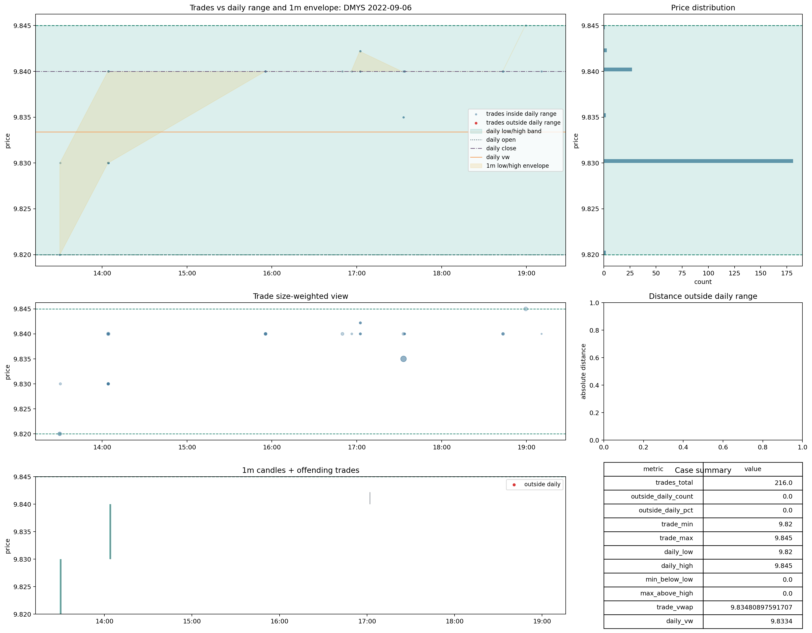
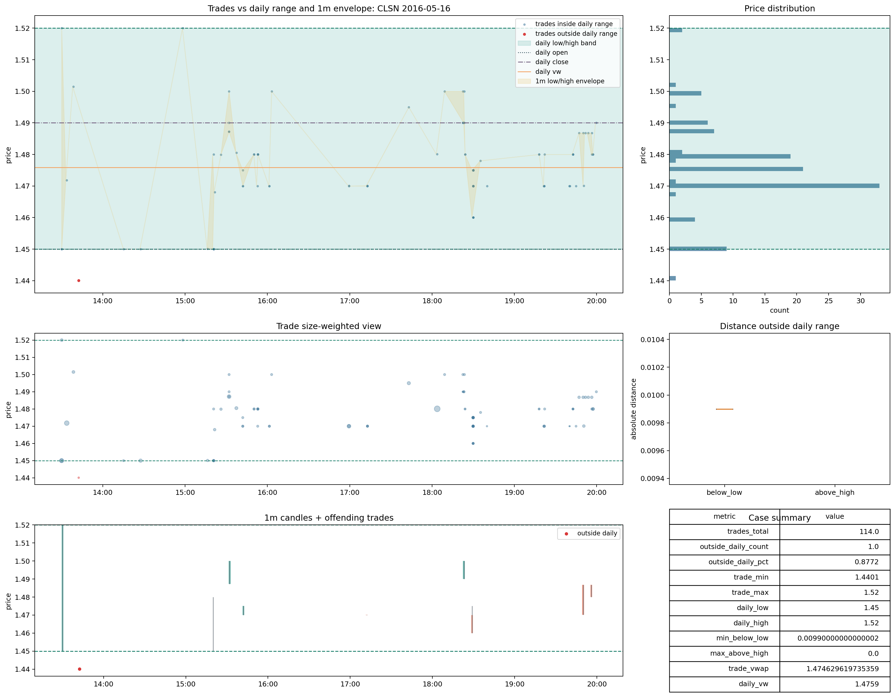

# Trades | `good`

`good` existe, pero hoy debe leerse con bastante prudencia.

Rutas base:

- [raw_metrics_shards](C:\TSIS_Data\02_backtest_SmallCaps\runs\backtest\trades_v2_materialized\trades_current_cd_merged\root_cause_exports\file_acceptance_cache_lt1b_full_clean_fast_same_schema\raw_metrics_shards)
- [13_good_dmys_2022_09_06.png](C:\TSIS_Data\02_backtest_SmallCaps\data_auditoria_polygon\00_data_certification\certification\trades\img\13_good_dmys_2022_09_06.png)
- [14_good_clsn_2016_05_16.png](C:\TSIS_Data\02_backtest_SmallCaps\data_auditoria_polygon\00_data_certification\certification\trades\img\14_good_clsn_2016_05_16.png)

## Qué significa

La lectura defendible es:

- files donde `trades`, `daily` y `1m` quedan esencialmente alineados
- sin señal material de escala rara
- sin conflicto relevante contra `daily` ni `1m`

Sobre el estado materializado final de `57f/full_clean_fast_same_schema`:

- `good`: `80` files
- `daily_vw_to_trade_vw` cerca de `1x` en `100%`
- señal extrema de escala en `0%`
- `trade_vwap_vs_daily_vw_diff_pct_raw >= 20%` en `0%`
- `has_1m_reference = True` en `100%`

Pero hay una salvedad fuerte:

- es un bucket extremadamente pequeño
- además está sesgado a files muy pequeños
- `rows_after_parse` mediano: `3.5`
- `p75`: `17.25`

Por tanto, `good` existe, pero todavía no sirve como gran base empírica para afirmar que una parte amplia del universo `trades` ya está limpia.

## Casos visuales

Lectura visual defendible:

- la alineación con `daily` y `1m` es buena
- no aparece desplazamiento de escala
- el conflicto fuera de rango es prácticamente nulo

## Decisión

Decisión provisional:

- mantener `good` como bucket real
- aceptarlo como `good`
- pero no inflar su importancia en el cierre global de `trades`

Razón:

- semánticamente está bien
- empíricamente todavía es demasiado escaso para dominar la lectura del bloque
