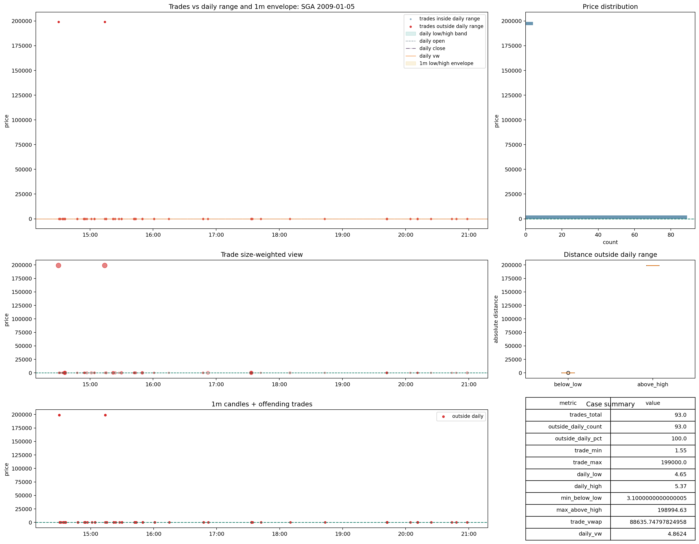

# Trades | Recovery | `reference_scale_mismatch`

Este es el segundo gran candidato de recuperación, pero más difícil que `review_no_1m_reference`.

Rutas base:

- [07_trades_reference_scale_mismatch.md](C:\TSIS_Data\02_backtest_SmallCaps\data_auditoria_polygon\00_data_certification\certification\trades\07_trades_reference_scale_mismatch.md)
- [01_reference_scale_mismatch_sga_2009_01_05.png](C:\TSIS_Data\02_backtest_SmallCaps\data_auditoria_polygon\00_data_certification\certification\trades\img\01_reference_scale_mismatch_sga_2009_01_05.png)
- [02_reference_scale_mismatch_lpcn_2014_07_07.png](C:\TSIS_Data\02_backtest_SmallCaps\data_auditoria_polygon\00_data_certification\certification\trades\img\02_reference_scale_mismatch_lpcn_2014_07_07.png)

## Por qué puede recuperarse

La ventaja de este bucket es que su residuo parece semánticamente claro:

- conflicto dominante de escala
- no mezcla principal de `bad_data`

Eso abre la puerta a recuperación parcial si existe una regla estable de reconciliación.

## Qué impide recuperarlo ya

Explicar no es lo mismo que rehabilitar.

Hoy sabemos:

- que el problema dominante parece de escala
- pero no está demostrada todavía una transformación operativa estable para corregirlo

Sin esa prueba, no conviene promoverlo.

## Qué habría que demostrar

Para recuperación real, hace falta demostrar al menos una de estas dos cosas:

- existe un factor de rescaling estable por file y validable contra `daily` y `1m`
- o existe una subfamilia clara dentro del bucket donde la reconciliación sea repetible y segura

Sin eso, solo tenemos:

- `explained_review`

No todavía:

- `recoverable`

## Lectura por uso

Hoy la lectura prudente sería:

- `backtest_core`
  - no
- `backtest_extended`
  - no todavía
- `ml_primary`
  - no
- `ml_flagged`
  - sí, como bucket informado de comparabilidad/escala

## Casos visuales

Lectura visual:

- el tape aparece desplazado en escala contra la referencia
- el patrón parece coherente dentro del caso
- eso es buena noticia para la explicación
- pero todavía no basta para afirmar corrección fiable

## Decisión

Decisión provisional:

- tratarlo como bucket con potencial fuerte de recuperación parcial
- no recuperarlo aún en bloque
- dejarlo como siguiente frente técnico de trabajo después de `review_no_1m_reference`
