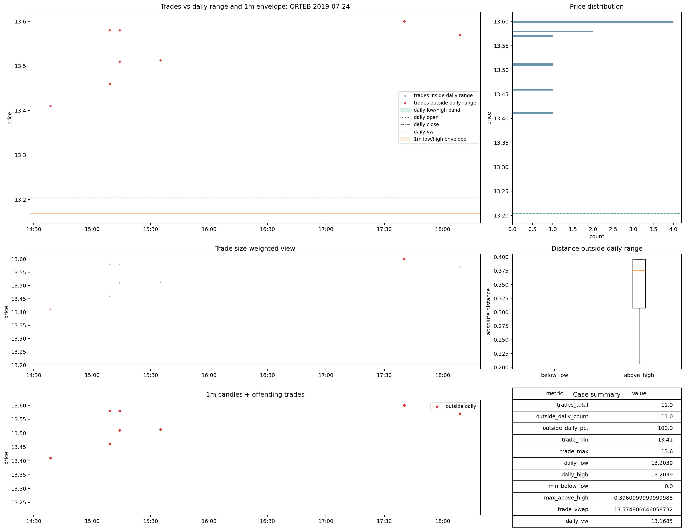
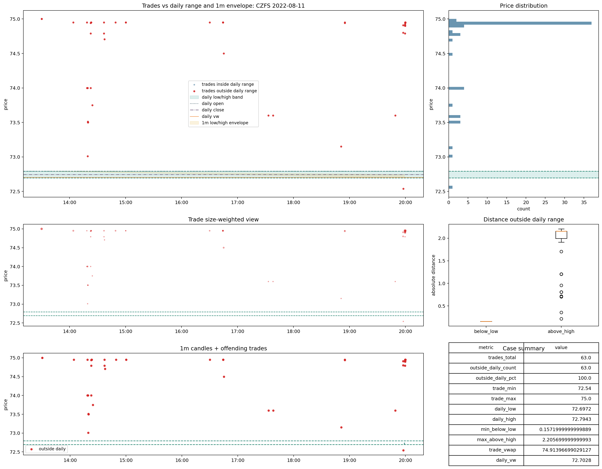

# Trades | Recovery | `review_microstructure`

Este bucket sí tiene potencial de recuperación parcial, pero no por corrección mecánica, sino por tolerancia controlada según el uso.

Rutas base:

- [06_trades_review_microstructure.md](C:\TSIS_Data\02_backtest_SmallCaps\data_auditoria_polygon\00_data_certification\certification\trades\06_trades_review_microstructure.md)
- [03_review_microstructure_qrteb_2019_07_24.png](C:\TSIS_Data\02_backtest_SmallCaps\data_auditoria_polygon\00_data_certification\certification\trades\img\03_review_microstructure_qrteb_2019_07_24.png)
- [04_review_microstructure_czfs_2022_08_11.png](C:\TSIS_Data\02_backtest_SmallCaps\data_auditoria_polygon\00_data_certification\certification\trades\img\04_review_microstructure_czfs_2022_08_11.png)
- [raw_metrics_shards](C:\TSIS_Data\02_backtest_SmallCaps\runs\backtest\trades_v2_materialized\trades_current_cd_merged\root_cause_exports\file_acceptance_cache_lt1b_full_clean_fast_same_schema\raw_metrics_shards)

## Por qué puede recuperarse parcialmente

Sobre el estado materializado final de `57f/full_clean_fast_same_schema`:

- `1,301,974` files
- `daily_vw_to_trade_vw` cerca de `1x` en `99.68%`
- `trade_vwap_vs_daily_vw_diff_pct_raw >= 20%` en `0.03%`
- `odd_lot_trade_pct` mediano: `73.63%`
- `core_regular_round_trade_pct` mediano: `26.37%`
- `outside_1m_regular_pct` mediano: `20.00%`

La lectura es consistente:

- no es bucket de escala rara
- no es bucket de raw claramente roto
- sí es bucket de microestructura difícil, muy cargado en odd-lots y comparabilidad imperfecta contra `1m`

## Qué se puede recuperar

No conviene promoverlo a `good`.

Sí conviene tratar una parte como:

- `recoverable_with_flag`
- y, según uso, `recoverable_for_ml`

Primera lectura por uso:

- `backtest_core`
  - no
- `backtest_extended`
  - sí, con flag y sensibilidad
- `ml_primary`
  - no por defecto
- `ml_flagged`
  - sí

## Regla provisional de recuperación

Subconjunto recuperable si además cumple:

- `daily_vw_to_trade_vw` cerca de `1x`
- `trade_vwap_vs_daily_vw_diff_pct_raw` bajo
- sin firma de `reference_scale_mismatch`
- y con fricción microestructural aceptable para el uso final

Eso significa:

- puede ser usable para research y ML con flags de calidad
- puede entrar en backtest extendido si el modelo no depende de una lectura muy fina del tape
- no debería entrar en baseline duro de ejecución

## Casos visuales

Lectura visual:

- el tape no aparece desplazado en escala
- el problema viene de la textura microestructural
- la comparación estricta con referencias se vuelve frágil, pero no necesariamente inútil

## Decisión

Decisión provisional:

- tratar `review_microstructure` como bucket con recuperación parcial posible
- no promoverlo a `good`
- sí permitir rehabilitación `with_flag` según uso
